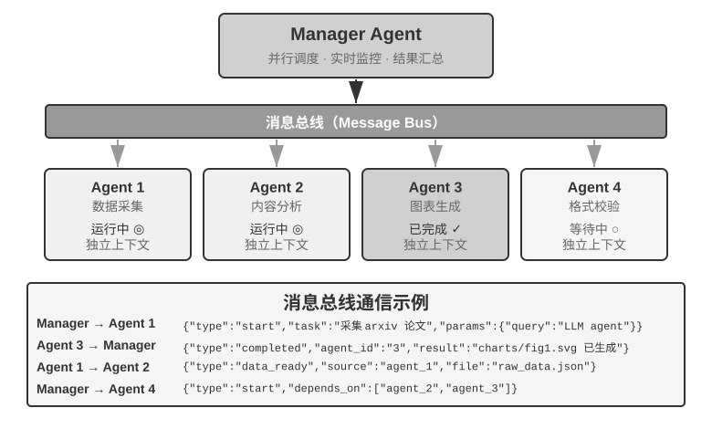
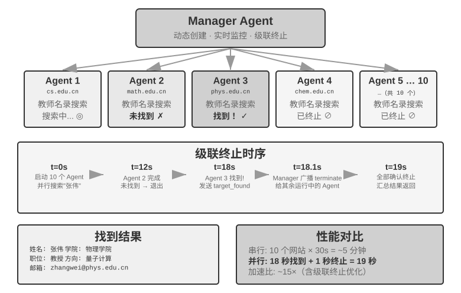
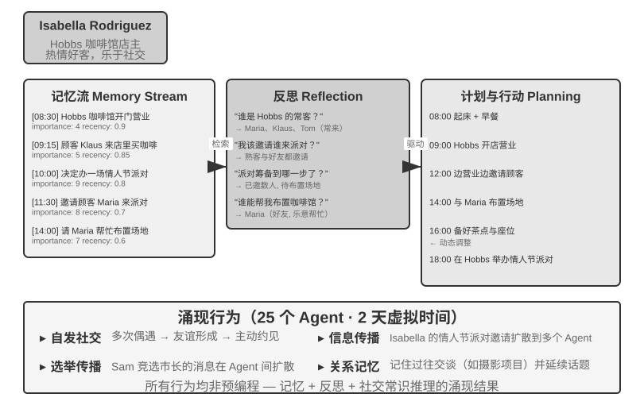

# 多 Agent 协作

前九章围绕单个 Agent 展开：先构建上下文、知识、工具与交互能力，再通过评估、后训练和持续进化让它长期变好。本章把问题从“如何构建和改进一个 Agent”推进到“如何组织多个 Agent”——让它们通过分工、通信与相互验证完成单个 Agent 难以承担的任务。

在 OpenAI 曾提出的五级 AI 能力框架（Level 1 对话者、Level 2 思考者（Reasoners）、Level 3 智能体、Level 4 创新者、Level 5 组织（Organizations））中，多 Agent 协作常被类比为通向第五级的路径之一——需要说明的是，此处 Organizations 指的是“AI 能完成整个组织的工作”这一能力级别，而非对系统架构的要求，足够强大的单个 Agent 理论上也能达到。但就今天的工程现实而言，单个 Agent 终究受限于自身模型的能力边界和上下文窗口。

而让多个 Agent 协同工作，意义远不止让不同专长的 Agent “取长补短”。更根本的一点是：**群体的智能可以高于个体**。人类文明便是明证——单个人的智力有限，但经由分工、协作、辩论和知识的代际累积，人类社会作为整体所展现的智能，远超任何一位天才个体。Agent 群体同样可能涌现出这样的集体智能：哪怕每一个 Agent 都只相当于人类专家的水平，只要组织得当，其整体能力也可能超过所有人类专家的总和。Google DeepMind 在《从 AGI 到 ASI》中正把“大规模多 Agent 集体”列为通往超级智能（ASI）的关键路径之一——正如人类的通用智能能聚合成超越个体的社会与组织实体，众多 AGI 级 Agent 协同形成的“群体智能”，也可能表现出远超其成员简单相加的认知能力[^agi-asi]。因此，多 Agent 协作不只是突破单个模型上下文窗口与能力边界的工程手段，更可能是从“专家级 AI”迈向“超越人类整体”的一条根本路径。

[^agi-asi]: 把“大规模多 Agent 集体”列为从通用人工智能通往超级智能的关键路径之一，见 Google DeepMind, *From AGI to ASI.* arXiv:2606.12683, 2026.

## 多 Agent 协作的分类框架

要构建多 Agent 系统，首先需要理解两个核心设计维度，它们共同决定了系统的基本架构和实现方式。

### 维度一：上下文是否共享

这是最基础的架构决策，决定了多个 Agent 之间如何传递信息。

**共享上下文**意味着后续 Agent 接收前一个 Agent 的完整对话历史和轨迹（第一章定义的 trajectory）。每个阶段切换系统提示词和工具集后，就变成了一个新的 Agent（因为它的身份、职责和能力都发生了变化），但它保留了前任的全部记忆。比如一个团队里，需求分析师写完需求文档后，开发者不仅拿到了文档，还能看到分析师与用户的所有沟通记录——他是一个新角色，但完整保留了之前的上下文。优势在于信息不丢失，每个 Agent 都能回顾之前任何阶段的细节；挑战在于上下文可能快速膨胀。

**不共享上下文**意味着每个 Agent 维护完全独立的上下文和对话历史，彼此无法直接访问对方的“思考过程”。这就像不同部门之间的协作：每个人在自己的工位上独立工作，通过共享文档和会议纪要交换信息，而不是时刻盯着别人的屏幕。这种模式的模块化和隔离性更好，每个 Agent 只需关注与自身职责相关的信息；系统也更易扩展和维护——增加新 Agent 不需要改动现有 Agent 的内部逻辑，只需定义好接口和数据格式。

由于 Agent 之间不共享上下文，必须通过显式的通信机制传递信息。这个问题在经典分布式系统中早有答案：操作系统教科书告诉我们，进程间通信（IPC）归根结底只有两大范式——**共享内存**（一方写入、另一方读取同一块存储）和**消息传递**（把数据显式地发送给对方）。Agent 间的通信机制同样落在这两个范式之内，常见的有三种：

- **工具调用的参数**：把下游 Agent 封装成工具，上游 Agent 把结构化数据通过工具参数传给下游 Agent，适合需要类型确定、结构清晰的场景；
- **共享文件系统**：Agent 之间通过读写共享目录下的文档、代码等中间产物来交换信息，适合产物较大或需要持久化的场景；
- **消息总线（Message Bus）**：一个专门负责在 Agent 之间传递消息的中转站，Agent 不直接调用彼此，而是把消息发送到消息总线，由它转发给目标 Agent。

对应到 IPC 的两大范式：共享文件系统就是 Agent 世界的“共享内存”；工具调用参数和消息总线则是“消息传递”的两种形态——前者随调用同步传递，后者经中转站异步投递。两种范式各有取舍。Go 语言有一句广为流传的话：“不要通过共享内存来通信，而要通过通信来共享内存”。


### 维度二：协作拓扑

第二个维度是协作拓扑——Agent 之间的控制权和信息按什么结构流动。协作拓扑有三种典型形态：

- **对等协作模式**（Peer Collaboration Pattern）：少量 Agent 按照固定的拓扑形成迭代改进循环，例如论文写作 Agent 由起草者和评论者两个 Agent 组成，一方起草、另一方批注修改，反复几轮后质量更高。
- **管理者模式**（Orchestration Pattern）：一个中心化的 Manager Agent 负责任务规划和调度，多个子 Agent 各负责特定子任务——就像项目经理带着几位专业工程师做项目。
- **去中心化模式**（Decentralized Pattern）：没有运行时的中心控制者，Agent 之间像人类一样互相沟通，协作完成任务。

>  **术语说明：Graph 工程。** 2026 年 7 月开始流行的 “Graph Engineering”，在当前 Agent 语境中通常指显式设计执行图：节点是 Agent、普通程序或人工决策，边定义任务依赖、条件路由与失败后的去向，结构化状态在节点之间流动（该名称的由来与相关实践见第一章“从提示工程到 Loop 工程”一节）。本章讨论的“协作拓扑”正是其中的多 Agent 子集——对等协作、管理者编排和去中心化移交，都是不同的图拓扑。

各模式的详细设计和适用场景将在后面的专题小节中展开讨论。

## 多 Agent 何时真正优于单 Agent

在进入具体的协作架构之前，先回答一个更根本的问题：**什么时候真正需要多个 Agent，什么时候一个 Agent 就够了？** 这个问题的答案会成为后文所有工程方案的总体参照。近年的一系列研究给出了一个清晰的判断框架——核心判据只有一条：**协作过程是否引入了单个 Agent 在生成时无法获得的新信息？**

表10-1 汇总了不同协作模式是否引入新信息，用来判断多 Agent 协作相对单 Agent 是否具有实质价值。

表10-1 多 Agent 协作模式的信息增量对比

| 协作模式 | 是否引入新信息 | 效果 |
|---|---|---|
| 同一模型自我审查（重新阅读自己的输出） | 否 | 通常无效甚至有害 |
| 不同 Agent 辩论同一段文本 | 否 | 在等计算量下与单 Agent 持平 |
| 审核者使用测试执行结果审查代码 | 是（执行反馈） | 显著提升 |
| 审核者查看渲染截图审查前端/PPT 代码 | 是（视觉反馈） | 显著提升 |
| 审核者使用外部工具验证事实 | 是（工具反馈） | 显著提升 |

2025 年的 RLEF（Reinforcement Learning from Execution Feedback）[^rlef-2025] 证实了这一点：通过强化学习训练模型利用代码执行反馈来迭代改进代码，效果远超让模型独立多次采样。关键在于每次迭代都引入了**真实的执行结果**（编译错误、测试失败、运行时异常），这些信息在模型写代码时并不存在。2025 年的 WebGen-Agent [^webgen-agent-2025] 在网页生成任务上，通过多层级的视觉反馈（截图 + 视觉语言模型描述）构成的反馈脚手架，据报道使 Claude 3.5 Sonnet 在该基准上的表现从 26.4% 提升到 51.9%——接近翻倍。

[^rlef-2025]: Gehring, J., et al. *RLEF: Grounding Code LLMs in Execution Feedback with Reinforcement Learning.* arXiv:2410.02089, 2025.
[^webgen-agent-2025]: Lu, Z., et al. *WebGen-Agent: Enhancing Interactive Website Generation with Multi-Level Feedback and Step-Level Reinforcement Learning.* arXiv:2509.22644, 2025.

这个“新信息”框架解释了一个看似矛盾的现象：一些学术研究认为多 Agent 并不能提升 Agent 能力上限，但在工程实践中，多 Agent 确实表现得更好。矛盾的根源在于两者讨论的是不同类型的 “多 Agent”：学术研究中比较的多是 “多个 Agent 看着同一段上下文互相讨论” 的模式，而工程实践中有效的多 Agent 系统往往包含外部反馈环路（代码执行、视觉渲染、工具调用）。前者没有引入新信息，后者引入了。

Anthropic 2026 年的漏洞挖掘实验给出了一个案例：45 个 Agent 通过共享论坛协调搜索、互相审查，再由独立 Agent 仲裁结果。Agent 集群用 2700 万 token 找到 266 个漏洞，而独立 Agent 并行方案用 650 万 token 只找到 21 个。在开放搜索空间里，多 Agent 通过互相通信，可以动态转移搜索重点、形成专门分工，用更高 token 预算换取更广的覆盖和更多样化的发现路径。[^anthropic-multiagent-2026]

[^anthropic-multiagent-2026]: Anthropic Frontier Red Team, “Patterns and Problems in Emerging Multiagent Systems,” 2026-08-13. https://www.anthropic.com/research/multiagent-systems

**步骤预算与 Agent 性能。** 一个相关的研究方向是：给 Agent 分配不同的步骤预算（即允许的工具调用次数或迭代轮数），会如何影响其表现？直觉上，更多步骤应该带来更好的结果——30 步预算下 Agent 只能快速实现核心功能，300 步预算下它还可以先做规划、再实现、再测试、再改进。但 2025 年 Google 的论文《Budget-Aware Tool-Use Enables Effective Agent Scaling》发现了一个反直觉的结论：**单纯增加 Agent 可用的步骤数并不能保证性能提升**。标准的 Agent 缺乏“预算意识”——即使有 300 步的预算，它们仍然倾向于执行浅层搜索，很快就“饱和”了。要让更多的步骤真正转化为更好的结果，Agent 需要一种显式的预算感知机制，根据剩余资源动态调整策略：前期广泛探索，后期聚焦最有希望的方向。2026 年的 BAVT（Budget-Aware Value Tree Search）进一步提出了步骤级别的价值评估，在每一步根据剩余预算比例调整探索与利用的权重——随着预算减少，Agent 从“广撒网”逐渐切换到“深挖掘”。

这些发现对多 Agent 系统设计有直接的指导意义。比如在管理者模式中，Manager Agent 不应只是简单地将任务分发给子 Agent 然后等待结果，而应该根据任务的复杂度**动态分配步骤预算**——简单子任务给较少的步骤，复杂子任务给充足的步骤。同时还要引导子 Agent 合理利用这些预算（先规划、再实现、再测试、再改进），而不是一头扎进去直接开干。

此外，**成本**是多 Agent 系统必须关注的要点。多 Agent 的并行探索与反复迭代都要消耗大量 token。这意味着多 Agent 带来的收益必须足够大，能够覆盖数倍乃至一个数量级的额外开销，否则一个调校得当的单 Agent 往往是更划算的选择。

## 共享上下文的多 Agent 协作

共享上下文的多 Agent 协作中，每个阶段都是一个独立的 Agent（拥有自己的系统提示词和工具集），但它继承了前序 Agent 的完整轨迹——就像接班的同事能翻阅前任留下的所有工作日志。这种 “继承式协作” 的核心优势在于信息不会丢失，每个 Agent 都能回顾之前任何阶段的细节。挑战则在于如何让当前 Agent 专注于自己的核心职责，而不被继承来的大量历史信息所干扰。

在复杂任务中，Agent 的角色和职责可能在不同阶段发生显著变化。如果始终使用同一套静态系统提示词，要么过于笼统缺乏针对性，要么把所有阶段的指导塞在一起导致过于冗长。多阶段角色转换的做法是：根据当前阶段动态切换系统提示词和工具集，让 Agent 在每个阶段都以最合适的 “身份” 工作。

这里有一个常被忽略、但会直接改变架构的设计选择：**角色转换究竟是替换 system prompt，还是加载 Skill？** 两者都可以让同一个模型在不同阶段采用不同的行为规程，却不是同一种成本模型。

| 选择                  | 角色规程的载体                                           | 工具可见性                   | 上下文/KV Cache 影响                   | 约束能力                          |
| --------------------------------- | ----------------------------------- | ----------------------- | --------------------------------- | ----------------------------- |
| `transfer_to_agent` | 替换当前 system prompt，并通常替换工具集                       | 只暴露当前角色工具               | 每次切换都改变请求前缀；从变化点起的前缀缓存通常无法复用      | 强：越界工具可在 schema 层不可见          |
| Skill               | 固定 system prompt 中的 Skill 目录，按需把 `SKILL.md` 追加到轨迹 | 通常固定暴露工具全集，或使用稳定的工具搜索入口 | 静态前缀保持不变；Skill 内容成为末尾轨迹，已有前缀可继续复用 | 弱：Skill 是行为指令，硬权限仍需 Harness 门 |

角色差异主要来自知识、流程和写作风格时，优先使用 Skill；角色差异涉及权限、工具隔离、合规边界或需要在运行时强制禁止某类动作时，使用独立 Agent 或 `transfer_to_agent` 工具，并在 Harness 层通过代码限制工具调用。

> **实验 10-1 ★★：共享上下文中的多角色转换——系统提示词与 Skill 的对比**
>
> **共同任务与变量**：两条路径都使用同一模型、同一用户任务、同一工具实现、同一份角色规程和全量共享轨迹。任务是查找中国 2021—2023 年新能源汽车销量、计算 CAGR、写不超过 120 字的投资人摘要。
>
> **路径一：系统提示词切换**。五种角色为 triage（用户需求收集，默认入口）、research（信息检索）、coding（编程）、data_analysis（数据分析）和 writing（写作）。每个角色只看到自己的专属工具和 `transfer_to_agent`；调用移交时保存历史、加载目标角色提示词/工具集，再继续调用。旧实现保留在配套项目中，作为这一实验分支的基线。
>
> **路径二：Skill**。system prompt 和完整工具全集在整个会话中固定；模型按需调用 `load_skill(name)`，读取的 `SKILL.md` 作为 tool result 进入共享轨迹。这样静态前缀不因角色变化而重写，但工具仍然可见，硬权限由 harness 中的规则保证。

## 不共享上下文的多 Agent 协作

不共享上下文代表真正的多 Agent 协作。在这种架构下，每个 Agent 都是独立的实体，拥有自己的上下文、轨迹和状态；彼此无法直接访问对方的 “内心活动”，协作完全依赖本章开头介绍的三种通信机制（工具调用参数、共享文件系统、消息总线）。

沿着开头那条“通信机制即进程间通信”的线索再往前走一步，会发现多 Agent 系统与操作系统的对应关系相当完整（表10-2）：

表10-2 多 Agent 系统与操作系统的对应关系

| 操作系统 | 多 Agent 系统 |
|----------|----------------|
| 程序（可执行文件） | 静态前缀（系统提示词 + 工具定义） |
| 进程的内存 | 轨迹 |
| CPU | LLM |
| 内核 | Agent 运行时 |
| 系统调用 | 工具调用 |
| fork（创建子进程） | spawn_subagent |
| kill（发送信号） | cancel_subagent |
| ps（列出进程） | list_agents |
| 退出码与 wait() | 子 Agent 返回的结构化摘要 |
| 共享内存 / 消息传递 | 共享文件系统 / 消息 |

这套抽象并不新鲜：私有状态、异步消息、可创建新成员，正是 1970 年代 Actor 模型的基本设定[^actor-model]，多 Agent 系统不妨看作它的 LLM 版本。因此操作系统与分布式系统的成熟经验大多可以直接借用。

[^actor-model]: Hewitt, C., Bishop, P., Steiger, R. *A Universal Modular ACTOR Formalism for Artificial Intelligence.* IJCAI 1973.

进程式的隔离带来了几个切实的工程好处：每个 Agent 可以独立开发和测试，新增能力不需要改动现有代码，某个 Agent 出了故障也不会把错误状态传染给其他 Agent，而且多个 Agent 可以真正并发执行——上下文完全独立，不存在资源竞争。

但不共享上下文也有代价。最明显的是信息同步问题：各 Agent 如何对任务状态保持一致的理解？信息在传递过程中会不会丢失或重复？调试也变得更加困难——出了问题需要翻看多个 Agent 的日志，才能拼出完整的执行过程。这些问题使得接口规范、数据格式和通信协议的设计变得至关重要。

不共享上下文的显式协作依赖两套与拓扑无关的基础设施。其一是**共享文件系统**，作为 Agent 间交换产物、与用户交换文件的持久媒介，构成协作的数据平面；其二是**通信与控制机制**，支持 Agent 间的消息传递、状态查询、执行终止与资源调度，构成协作的控制平面。

### Agent 眼中的文件系统

在实际系统中，Agent 访问的并非单一存储，而是一个**虚拟文件系统**（virtual filesystem）：来源、生命周期与权限各异的存储被挂载（mount）到同一目录树下，Agent 通过统一的 `read_file`/`write_file`/`list_dir` 接口访问，底层则可能是本地临时盘、持久对象存储、第三方云盘的 API 或只读的系统资源包。明确这棵目录树的构成（每一区域的可见性与生命周期）是多 Agent 协作设计的前提：相当一部分并发冲突与信息泄露，源于将本应隔离的区域混置。这棵目录树相当于 Agent 的地址空间，四类区域就是权限各异的内存段：有的私有可写，有的多方共享，有的只读。

一个成熟的多 Agent 系统，其文件系统通常由以下四类区域构成：

**一、Agent 专属工作区（Scratchpad）**。每个 Agent 实例独享的私有目录，存放中间产物、临时文件、草稿与调试日志，生命周期与实例绑定，对其他 Agent 和用户不可见。隔离 scratchpad 有两重作用：避免多个 Agent 的临时文件相互覆盖，以及保持主 Agent 上下文的精简——子 Agent 的试错过程留存于自身工作区，仅将最终产物提交至共享空间。这是第四章“子 Agent 返回结构化摘要而非全量轨迹”在存储层面的体现。

**二、多 Agent 共享空间（Shared Workspace）**。多个 Agent 共同读写、且**用户可见**的协作区域，是不共享上下文架构下 Agent 间交换产物的主要媒介：Glossary Agent 写入术语表，Translation Agent 从中读取；用户亦可在此上传原始文件、下载最终交付物。其生命周期与整个任务绑定，需要持久化。作为多方并发读写的区域，它是并发冲突的高发处——乐观锁、工作副本隔离（worktree）等机制均作用于此，详见本章后文 “失败模式一”。第四章以卷挂载 `/workspace/shared` 连接主 Agent、虚拟电脑与虚拟手机，即为这一层的典型实现。

**三、外部挂载资源（Mounted External Resources）**。用户授权接入的第三方信息源——Google Drive、Notion、Dropbox、企业 Wiki 等——通过适配器（adapter）映射为文件系统中的挂载点（如 `/mnt/gdrive`）。Agent 以读文件的方式访问一篇 Notion 文档，底层由适配器调用对方 API 完成。这一层有三项区别于本地存储的特性，需要在设计时显式处理：**访问受外部权限约束**（用户在源系统中的权限决定 Agent 的可见范围）、**延迟更高且一致性更弱**（每次读取为一次网络往返，数据可能已被外部修改，只能按最终一致性对待）、**以按需只读为主**（写回外部源须谨慎，误写可能污染用户的真实数据）。统一的文件接口使 Agent 无需为每个数据源定制专用工具，但也掩盖了上述性能与安全差异，因此需在挂载层面显式管理只读/可写、超时与凭证边界。

**四、系统内置资源（Built-in System Resources）**。系统预置、对所有 Agent 只读共享的资源包，典型代表是第二章、第四章介绍的 **Skills**——以文件形式组织的知识文档与脚本，挂载于 `/skills` 等路径，按渐进式披露（先索引、后按需展开）取用；此外还包括参考手册、模板库与共享工具定义。该层全局共享、只读、跨会话稳定，可被所有 Agent 并发读取而无需并发控制。

图10-2 呈现了这四类区域统一挂载于同一目录树的结构：Agent 通过统一接口访问整棵树，用户从共享空间上传与下载文件，外部数据源经适配器挂载，系统内置资源则以只读方式提供。


表10-3 从可见性、生命周期、读写权限与并发控制四个维度对比这四类区域，可作为文件系统布局设计的检查表。

表10-3 Agent 虚拟文件系统的四类区域

| 区域 | 可见性 | 生命周期 | 读写 | 并发控制 |
|----------------|--------------------|-------------------|-----------------|------------------------|
| Agent 专属工作区 | 仅该 Agent | 随 Agent 实例销毁 | 读写 | 不需要（私有） |
| 多 Agent 共享空间 | 所有协作 Agent + 用户 | 随任务持续，需持久化 | 读写 | 需要（乐观锁 / worktree） |
| 外部挂载资源 | 视外部授权而定 | 由外部源决定 | 多为只读，写需谨慎 | 由外部源负责 |
| 系统内置资源 | 所有 Agent | 跨会话稳定 | 只读 | 不需要（只读） |

将四类区域统一至同一目录树，正是“**文件路径作为通用接口**”这一设计的价值所在：Agent 间传递产物、主 Agent 向子 Agent 交接输入、乃至跨组织 A2A 协作交换产物，传递的均为轻量的路径字符串，而非将内容载入上下文窗口（第四章）。

### Agent 间的通信与控制

文件系统解决了 Agent 间**产物交换**的问题，协作还需要一条**控制平面**。这正是表10-2 中生命周期各行的用武之地：第四章给出的这组工具原语——创建（`spawn_subagent`）、发消息（`send_message_to_subagent`）、取消（`cancel_subagent`）、发现（`list_agents`）——对应进程世界的 fork、消息、kill 和 ps。

**一、消息传递。** 最简形态为点对点：Agent A 直接调用 `send_message_to_agent_b(content)`，适用于拓扑固定、Agent 数量少的场景（如本章实验 10-3 的电话 + 电脑双 Agent）。当 Agent 数量增多且需异步并行时，点对点连接数随 Agent 数呈平方增长，且要求收发双方同时在线；此时应改用**消息总线**（详见本章后文“并行协调形态”）：Agent 将消息发布至总线，由总线按订阅关系转发，发送方无需知晓消费者。无论点对点还是经总线，消息通常应携带结构化的**信封**（envelope）：发送者 ID、目标（指定 Agent 或广播）、消息类型（如 `task_assigned`/`status_update`/`result`/`terminate`）及 JSON 负载。统一的信封格式保证接收方能够可靠地路由和解析消息，并使协作链路可追溯——这是多 Agent 系统调试的关键。

**二、状态查询。** 这是控制平面中最易被低估的一环。主 Agent 派出子 Agent 后，若无从获知其进展，则既无法判断是否继续等待，也无法在其阻塞时及时介入。直观的做法是定义一个 `get_subagent_status(agent_id)` 查询接口，返回 “运行中/已完成/失败” 等状态。但这种拉取式接口并不实用：子 Agent 一经创建就立即开始执行，直到完成或失败，子 Agent 完成时自然会通知主 Agent，并不需要主 Agent 显式查询。状态获取更自然的做法，是回到本章开头的两大通信范式。

**用消息传递获取状态**。主 Agent 直接给子 Agent 发一条消息：“进展如何？”子 Agent 在合适的时机回复。一切都是异步的：发出消息不阻塞自己的执行，对方何时回复、是否回复是另一回事——正如经理通过即时消息询问下属进度，而不要求对方立即停下手头的工作。反过来，子 Agent 也可以在到达关键节点时主动发消息汇报；系统若已架设消息总线，这就是往总线上发布一条 `status_update`（实验 10-4 的“实时监控”即此形态）。无论问答还是主动汇报，消息中的状态本身宜采用统一的状态机词汇（执行中、需要输入、已完成、失败）——本章后文的 A2A 协议正是把任务生命周期标准化为这样一组状态。

**用共享文件系统获取状态**。最彻底的形态是**轨迹持久化**（trajectory persistence）：子 Agent 在执行过程中，把自己的轨迹（第一章定义的 trajectory——用户消息、模型回复、工具调用与结果的完整序列）实时序列化为 JSON，追加写入文件系统中的日志文件（通常每个会话一个文件、每行一个事件，即 JSONL 格式）。主 Agent 无需任何状态上报协议，直接读取这个文件就能看到子 Agent 的全部执行过程：它正在调用哪个工具、最近一步在思考什么、是否卡在反复失败的重试上。用进程的语言说，这相当于直接读另一个进程的内存。

但轨迹持久化不宜作为 Agent 间信息传递的主要方式。轨迹动辄数万 token，主 Agent 读完还得自行提炼，既费时又费 token。因此多数场景下更合理的是**约定进度文件**：主 Agent 启动子 Agent 时约定“把进度写到 progress.md”，子 Agent 每完成一项就更新这份任务清单，主 Agent 随时读这个轻量文件即可掌握进展。这相当于两个进程在共享内存里划出一小块约定格式的状态区，暴露的是提炼后的进度，而非全部内存。进度文件还可以用于**检测卡住状态**：progress.md（或轨迹文件）的最后修改时间超过 N 分钟没有变化，即可判定子 Agent 无活动、触发超时兜底，避免系统被阻塞的子 Agent 拖累。

**三、执行终止。** 并行协作中常出现“一个任务成功，其余任务便无需继续”的情形——多个 Agent 分头搜索，一个 Agent 命中目标后，其余 Agent 应立即停止（本章实验 10-4 的级联终止）。终止有两种强度，Unix 用户会认出这正是 SIGTERM 与 SIGKILL 的区别。

**优雅终止**为首选：主 Agent 发出 `terminate` 信号，子 Agent 在当前步骤的安全点响应，先清理资源（关闭浏览器会话、写入未完成文件、释放锁），返回确认（ack）后退出。**强制终止**为兜底：直接终止进程，仅在子 Agent 对优雅信号无响应时使用，代价是可能遗留悬挂资源与未完成写入。

还剩一个问题：主 Agent 终止后，仍在运行的子 Agent 怎么办？工程上最简洁的做法借鉴 Go 的 context，终止沿创建关系向下级联：取消一个 Agent，它派生的所有子 Agent 随之取消，从根上杜绝无人认领的孤儿 Agent。上文 “子 Agent 在安全点检查终止信号”，对应的正是 Go 中对 `ctx.Done()` 的轮询。反过来，若确实需要一个脱离主 Agent、长期运行的后台 Agent（类似 Unix 的 `nohup`），就让它从一棵新的生命周期树起步（对应 `context.Background()`），显式声明不随父级终止。

**四、资源与调度。** 操作系统的一个重要职能是分配稀缺资源。进程世界稀缺的是 CPU 时间和内存，Agent 世界稀缺的是 token 和并发额度。这项职能通常落在管理者 Agent 或运行时身上：启动子 Agent 时设定步数或 token 预算，超限即止；困难任务交给强模型，机械任务交给低成本模型；并发数设置上限，避免几十个 Agent 同时耗尽 API 配额；当并发数达到上限，更紧急的任务到来时，打断执行中的子 Agent，这就是抢占。

与传统操作系统的调度器相比，管理者 Agent 的显著优势在于它具备推理能力。因此，管理者 Agent 可以启动多个子 Agent 并行探索一个问题，并根据它们的进展，决定给哪些 Agent 分配更多资源，或者终止哪些看起来误入歧途的 Agent，就像公司内部赛马一样。

资源和调度领域的实践还远不如操作系统调度成熟，但它决定了多 Agent 系统的成本上限，应当在架构设计阶段就予以考虑。

产物交换（数据平面）与消息传递、状态查询、执行终止、资源调度（控制平面）共同支撑起不共享上下文的多 Agent 系统。根据 Agent 之间的协作关系和控制流特征，不共享上下文的协作可以分为三种主要架构：对等协作模式、管理者模式、去中心化模式，分别适用于不同类型的任务。

### 对等协作模式：相互制衡与迭代改进

对等协作通常涉及 2-3 个平等身份的 Agent，通过多轮迭代互相提供反馈。它的潜在价值在于引入独立视角和认知多样性，但“多个实例”不等于“多种思路”。当模型、上下文和脚手架高度相似时，不同 Agent 往往会做出相同选择，使局部错误演变为系统性故障。要获得真正的多样性，需要主动区分模型、上下文、工具、可见证据或职责，并让各 Agent 先独立判断、再汇总结果。[^anthropic-multiagent-2026]

相比管理者和去中心化模式，对等协作的实现复杂度更低：只需定义好两个 Agent 的角色、通信机制和迭代终止条件，就可以跑起来。

#### Loop 工程

对等协作最经典的用途，是解决 Agent 实践中极其常见的一类失败：**过早终止**——活干到一半就停。它有三种典型形态，下面用 Coding Agent 和笔者团队打造的 Pine AI（引言介绍过的替用户打电话与商家、运营商交涉办事的 Agent）各举几例。一是**偷懒式假完成**：只做了一部分就宣称全部做完——Coding Agent 写完代码，测试没跑、部署没试，就报告“任务完成”；用户交给 Pine AI 两件事，它办完第一件就把第二件忘了，径直汇报“都办好了”。二是**过早放弃**：一条路走不通就宣布整件事办不成——Pine AI 联系商家本有打电话、填表单、发邮件等多种途径，打了一个电话被拒绝，就直接告诉用户“这事办不了”，其实换个渠道再试很可能就成了。三是**假成功**：Agent 以为办成了，实际闭环没走完——电话里对方口头同意退款，但用户还需要在手机 App 上确认一步，Agent 却报告“已办妥”，用户不知道还有后续动作，退款实际没有落地。三种形态指向同一个根源：**在验证之前，“完成”只是模型的一句宣称，不是证明**。

把宣称变成证明，正是 **Loop 工程**（Loop Engineering）的课题：设计一个让 Agent 持续运转的循环——发现下一件该做的事、执行、验证、记录进度——由验证器而不是模型自己来判定“是否真的可以停”，人的角色则从“给 Agent 写提示词的操作者”变成“设计循环的工程师”。这个名词在 2026 年 6 月由 Addy Osmani 总结提出[^loop-engineering-2026]，Claude Code 负责人 Boris Cherny 的说法更直白：“我已经不再直接 prompt Claude 了，我的工作是写 loop。”业界在这场讨论中形成的核心共识是：**循环的瓶颈在验证器，而不在模型**。验证不可靠，循环转得再快，也只是把劣质产出更快地标记为完成。也正如引言所说，实践在前、命名在后：在这个名词流行之前，包括 Pine AI 在内的头部 Agent 团队早已在用“循环加验证”解决过早终止问题。而验证最有效的组织方式，正是下面要讲的提议者-审核者范式。

[^loop-engineering-2026]: Osmani, Addy. "Loop Engineering: Designing Loops that Prompt Coding Agents", 2026. https://addyosmani.com/blog/loop-engineering/

**具体框架：LoopX。** LoopX 把循环从模型的提示词和聊天历史中抽离出来，放进一个与 Agent 运行时无关的持久控制面：目标与边界说明 “为什么做”，门禁和待办决定 “现在能做什么”，证据与配额决定 “是否继续”，移交则让下一轮或另一个 Agent 接着工作：

```text
LoopX 决策 → Agent 执行 → 独立验证器证明 → LoopX 提交
```

其中，Agent 仍负责推理、调用工具和生成候选成果；LoopX 不替代 Agent 运行时，而是管理跨轮次的连续性。只有通过独立验证的结果才能写入持久进度并消耗配额；验证失败会进入修复或重规划，人工门禁、等待状态和预算上限则在执行前阻止循环继续。这个边界把 Loop 工程的原则变成了可检查的系统不变量：**模型可以提出 “完成”，但不能批准自己的 “完成”。** LoopX v0.4.0 的受控 Turn 路径仍标为实验性，因此这里把它作为 “循环 + 验证 + 终止条件” 的具体框架，而不是一般任务质量提升的证据。[^loopx-framework]

[^loopx-framework]: LoopX, "The local control plane for long-running AI agent work", v0.4.0，稳定提交 `a893d221db0b8e028997cefc303f7ec9fa7dbe0a`。 https://github.com/huangruiteng/loopx/tree/a893d221db0b8e028997cefc303f7ec9fa7dbe0a

**具体框架：LongHorizon-Harness。** LongHorizon-Harness 与 LoopX 都是 Loop 工程的具体实现，但关注的方向不同。LoopX 面向长期 Agent 工作的持久控制面；LongHorizon-Harness 则从多模态 Computer Use 出发，处理同一任务跨越 GUI、CLI、多个桌面应用和多次上下文刷新的连续执行问题。

LongHorizon-Harness 将长程执行重新表述为任务状态管理，并把自己的循环实现为 Manage–Execute–Audit（MEA）：Manager 根据原始目标、已核实进展、失败证据和剩余工作生成下一项有界子任务；Executor 在全新上下文中通过 GUI 或 CLI 改变环境；Auditor 再以只读方式检查真实结果。只有审计通过的内容才能进入下一轮任务状态，失败则被保留为恢复和重规划的依据。它通过适配层复用 Claude Code、Codex CLI 等执行后端，而不改写后端内部的 Agent loop。[^longhorizon-implementation]

这一方向的价值，在于把任务连续性从不断增长的执行历史中分离出来：上下文可以刷新，界面操作也可能失败，但下一轮仍能从最近一次核实的状态继续。论文在保持 Qwen 3.7-Plus 模型与 Claude Code 执行后端相同、只改变外层 loop 的对照中，报告 WeaveBench PassRate 从 51.8% 提升到 80.7%，OSWorld 2.0 二元完成率从 2.8% 提升到 8.3%，Terminal-Bench 2.1 成功率从 69.7% 提升到 77.2%。代价也不是固定的：前两个基准分别消耗了基线 2.3 倍的总 token 和 3.6 倍的输出 token，Terminal-Bench 2.1 则减少了 24%。在实际部署中，还需要处理外部环境或用户要求变化造成的旧状态失效，并用轮数、时间和费用预算防止恢复循环无限运行。

**公开轨迹与实验复现。** 项目网站提供了 WeaveBench、OSWorld 2.0 和 Terminal-Bench 2.1 的数百条运行轨迹，可以直接查看执行过程和不同角色的记录。以 WeaveBench 的 `WEB_task_16_webrtc_simulcast_layer_audit` 为例，可以对照使用同一 Qwen 3.7-Plus 模型的[基线轨迹](https://lh-harness.pages.dev/traj/tasks/baseline__WEB_task_16_webrtc_simulcast_layer_audit.html)与 [MEA 轨迹](https://lh-harness.pages.dev/traj/tasks/lh_harness__WEB_task_16_webrtc_simulcast_layer_audit.html)：前者在 Wireshark 交互卡住后反复尝试，得分 0.59；后者把失败和未满足的证据项写回任务状态，后续轮次只处理缺口，得分 0.92。这个案例用于展示“失败如何变成下一轮输入”，不能代替总体统计；完整实验的环境、参数和启动脚本见固定版本的 [`eval/`](https://github.com/AMAP-ML/LongHorizon-Harness/tree/53bc678ed4170ad4d2e4309f2bfc5c3fb6caf8cb/eval) 目录。

[^longhorizon-implementation]: LongHorizon-Harness，稳定提交 `53bc678ed4170ad4d2e4309f2bfc5c3fb6caf8cb`。项目网站与公开轨迹：https://lh-harness.pages.dev/#trajectories；论文：https://arxiv.org/abs/2608.01964；代码：https://github.com/AMAP-ML/LongHorizon-Harness/tree/53bc678ed4170ad4d2e4309f2bfc5c3fb6caf8cb

#### 提议者-审核者范式


提议者-审核者是最经典的对等协作范式。第五章已经在 PPT 生成、视频编辑和日志可视化三个实验中详细介绍了这一范式的设计原则和实战应用：Proposer Agent 负责生成代码，Reviewer Agent 渲染执行结果并用 Vision LLM 评估质量、给出结构化改进建议，两者反复迭代直到效果达标。

这一范式同样适用于安全审查（提议者生成操作方案，审核者检查合规性和潜在风险）、内容审核（提议者起草回复，审核者检查业务规则和用语规范）、代码审核（提议者编写代码，审核者检查安全性和最佳实践）等场景。

**为什么不能让一个 Agent 自己生成再自己审查？** 这正是前面“多 Agent 何时真正优于单 Agent”一节那条判据的具体体现——审查若不引入新信息，就只是“让模型再想一遍”。相关研究对此给出了明确的答案。Huang 等人在 ICLR 2024 论文《Large Language Models Cannot Self-Correct Reasoning Yet》中发现：让 GPT-4 在没有外部反馈的情况下审查并修正自己的回答，准确率反而下降——模型把正确答案改错的次数比把错误答案改对的次数更多。

提议者—审核者循环的最小不变量是：审核者读取**独立证据**，而不是只复述提议者的解释；退回时必须给出可定位的修复条件：

```python
candidate = proposer(task, constraints)
evidence = execute_or_render(candidate)       # tests, state, screenshot, facts
review = independent_reviewer(candidate, evidence)

while review.veto and budget_remaining:
    candidate = proposer.repair(candidate, review.findings)
    evidence = execute_or_render(candidate)
    review = independent_reviewer(candidate, evidence)

if review.pass:
    publish(candidate, evidence, review)
else:
    escalate_or_reject(review)
```

审核者不能修改测试、证据采集器或发布门槛；否则“独立验证”会退化成自我批准。

2024 年发表在 TACL 期刊上的综述论文《When Can LLMs Actually Correct Their Own Mistakes?》（arXiv:2406.01297）进一步确认了这一结论：除非提供可靠的外部反馈（如测试用例的执行结果、外部工具的验证输出），否则纯粹依赖模型自身的“自我纠正”几乎不起作用。

ICLR 2024 的 CRITIC 论文提供了一个直观的对比实验：让模型使用外部工具（搜索引擎、Python 解释器）验证自己的回答，效果显著提升；一旦移除工具验证、只保留模型的自我评估，大部分提升就消失了。回到第五章的 PPT 生成实验也是同理——审核者的价值不在于“用同一个模型再看一遍代码”，而在于它**渲染了 PPT 并截取了画面**——截图承载着提议者生成代码时完全无法获得的视觉信息；代码生成场景中执行测试产生的通过/失败结果，同样是编写代码时并不存在的新信号。

Anthropic 2026 年的长程应用开发实验把这一思路实现为规划者–生成者–评估者三 Agent 架构：规划者把用户的需求展开为产品规格，生成者与评估者先约定每轮的完成标准，再由生成者实现，然后评估者使用 Playwright 操作真实应用并提交缺陷报告。Agent 之间通过文件交接状态。实验说明，当任务超出当前模型单独可靠完成的范围时，带外部证据的独立审核可以用显著更高的成本换取更好的开发质量。[^anthropic-harness-2026]

[^anthropic-harness-2026]: Prithvi Rajasekaran, “Harness Design for Long-Running Application Development,” Anthropic Engineering, 2026-03-24. https://www.anthropic.com/engineering/harness-design-long-running-apps

#### 辩论模式

多个 Agent 各持不同立场，通过对抗性对话深入探索问题空间。比如评估一个技术方案时，Agent A 扮演“支持者”列举方案优势和机会，Agent B 扮演“反对者”指出风险和局限，每轮辩论都针对对方的论点提出反驳或补充。单一 Agent 分析时，模型往往倾向某个观点而忽视反面证据；辩论模式则通过制度化的对抗，确保正反两面都得到充分论证，帮助决策者做出更平衡的判断。

不过，辩论模式的实际效果在学术界仍有争议。2026 年 Tran 与 Kiela 的研究 [^single-agent-2026] 在多跳推理任务上对比了单 Agent 与五种多 Agent 架构（顺序、辩论、集成、并行角色、子任务并行），发现当思考 token 预算被严格控制为相同时，单 Agent 的表现与多 Agent 持平甚至更好。研究者基于信息论中的数据处理不等式给出了解释：辩论中的多个 Agent 处理的是完全相同的文本信息，Agent 之间每一次串行传递中间结论都只可能丢失信息、不可能凭空创造信息。辩论模式在一些学术论文中的收益很可能来源于多个 Agent 消耗了更多的总计算量。不过，它并不否定另一类做法——对同一问题**多次独立采样再聚合**（如自一致性、多数投票），或利用**生成与验证的难度不对称**（写出答案难、检验答案易）来做生成-验证分工。

[^single-agent-2026]: Tran, D., Kiela, D. *Single-Agent LLMs Outperform Multi-Agent Systems on Multi-Hop Reasoning Under Equal Thinking Token Budgets.* arXiv:2604.02460, 2026.

#### 头脑风暴模式

多个 Agent 独立生成创意，然后相互分享、彼此启发。比如在产品创新任务中，Agent 1 提出“增加社交分享功能”，Agent 2 受启发提出“不仅分享到社交网络，还可以生成个性化分享海报”，Agent 3 综合前两者提出“用户自定义海报模板并形成模板市场”。不同 Agent 拥有不同的“思维偏好”（通过不同提示词或模型实现），通过相互激发来探索更广阔的解空间，找到单一 Agent 难以想到的创意组合。

#### 专家小组模式

多个 Agent 各自代表一个专业领域的视角，共同讨论跨学科问题。比如评估新产品的可行性时，工程师 Agent 从技术角度分析实现难度，产品 Agent 从用户体验角度评估市场吸引力，运营 Agent 从成本和资源角度分析商业可行性。这些 Agent 之间不是对抗关系，而是互补关系，共同拼出问题的全貌，识别跨领域的约束和机会。

### 管理者模式：中心化协调

当任务涉及大量子任务、需要动态调度或子任务之间存在复杂依赖时，对等协作就力不从心了，需要引入管理者模式。Manager Agent 的职责就像一个项目经理：先理解整体任务，再拆解为可分配的子任务，选择合适的 Agent 去执行，跟踪进度并处理异常（重试、换 Agent、调整计划），最后把各 Agent 的输出整合为最终结果。

从系统设计角度看，管理者模式把每个专门 Agent 建模为 Manager 可调用的工具。Manager 的工具集中不仅有传统的外部工具（如搜索、文件操作），还包含其他 Agent 的调用接口。Manager 通过工具调用机制启动相应 Agent，传递任务参数和必要上下文，等待完成后接收返回结果。从 Manager 的视角看，调用一个 Agent 和调用一个普通工具没有本质区别。这种统一抽象赋予了管理者模式良好的可扩展性。新增能力只需开发对应 Agent 并注册为工具，Manager 的核心逻辑无需修改。同时它天然支持异构性，不同 Agent 可以用不同的模型、提示词、工具集，甚至运行在不同的硬件环境上。

但管理者模式也有固有的挑战。Manager 成为系统的单点瓶颈——它必须理解所有子任务的性质，选择正确的 Agent，准确传递上下文，任何决策偏差都会影响整体流程。此外，Manager 需要维护整个任务的全局上下文，随着任务推进和 Agent 调用增多，上下文可能快速膨胀。因此需要特别注意 Manager 的提示词质量、上下文管理策略和合理的任务分解粒度。

2025 年的 Plan-and-Act 论文 [^plan-and-act-2025] 对此做了实证分析：在 Planner-Executor 双 Agent 架构中，**弱规划者是整个系统最关键的瓶颈**。当 Planner 的规划质量足够高时，即使 Executor 比较简单也能取得好结果；反之，如果 Planner 的任务分解有误，后续所有 Executor 的工作都建立在错误的前提上。该研究在 WebArena-Lite 基准上取得了 54% 的成功率，核心贡献正是改善了 Planner 的规划能力，而非 Executor 的执行能力。这一发现的启示是：应当将最强的模型和最精心设计的提示词分配给 Manager（规划者），而不是将资源平均分配给所有 Agent。

并行管理器还要定义“第一个**已验证**成功”而不是“第一个声称成功”的结算点：

```python
workers = launch_independent_workers(subtasks)
while workers.any_running:
    event = next_event()
    if event.type == RESULT:
        if verify(event.artifact, hidden_checks):
            if not settle_once(event):       # atomically claim the winner
                continue
            broadcast_cancel(to = workers - {event.worker_id})
            await_all_ack_or_timeout()
            return assemble(event.artifact, evidence = event.evidence)
        else:
            record_failure(event)
return summarize_failures(workers)
```

`settle_once` 必须是幂等的（通常由锁或事务保护），否则两个几乎同时到达的成功事件会触发两次汇总。

[^plan-and-act-2025]: Erdogan, L. E., et al. *Plan-and-Act: Improving Planning of Agents for Long-Horizon Tasks.* arXiv:2503.09572, 2025.

**顺序协调形态。**


Manager 按顺序依次调用专门 Agent，每个 Agent 完成后返回结果，Manager 再决定下一步。控制流是线性的，简单明了，适合子任务之间有清晰先后依赖的场景。

> **实验 10-2 ★★：书籍翻译 Agent**
>
> 书籍翻译是一项典型的、需要多 Agent 协作的复杂任务。翻译一本技术书籍，不仅仅是把文字从一种语言转换为另一种语言，更需要保证专业术语全书一致、语境准确、整体阅读流畅。比如翻译一本大语言模型相关的英文书，大量术语会反复出现，可能有多种约定俗成的说法，必须全书统一，例如第一章把 agent 译为“智能体”，后面就不能改成“代理”。
>
> 如果用单一 Agent 来做，会面临严重的上下文问题。随着 Agent 逐章处理内容，上下文不断累积：全书术语表、已翻译章节、当前段落、翻译思考过程、工具调用结果。一本几百页的技术书籍加上翻译中间产物，很容易超出上下文窗口。更严重的是，在过长的上下文中 Agent 容易“迷失”——忘记之前的术语约定，到第九章用了与第二章不一致的译法；审校阶段重复检查浪费资源；甚至因注意力分散而产生幻觉，“记起”实际上并不存在的术语规则。
>
> 管理者模式通过任务分解和责任分离来解决这些问题：
>
> - **Glossary Agent**（术语对照表 Agent）：接收全书内容，识别重复出现的专业术语，搜索专业词典和翻译规范，生成结构化术语对照表（JSON/CSV 格式，包含英文术语、中文翻译、词性、使用语境）。完成后写入共享文件系统，Agent 即可销毁释放资源
> - **Translation Agent**（章节翻译 Agent）：接收当前章节、术语对照表和翻译指南（目标读者水平、语言风格），翻译为流畅的中文。遇到对照表中的术语严格使用规定译法，遇到新术语则推断翻译并标记为待审查。每个实例在独立上下文中工作，互不干扰。译文写入文件系统（如 `chapter1_zh.md`）。Manager 可并行或串行启动多个实例
> - **Proofreading Agent**（全文审校 Agent）：接收所有译文和术语表，执行一致性检查——逐一验证术语翻译是否统一、识别前后不一致之处、检查整体流畅性和可读性。生成审校报告写入文件系统
> - **Manager Agent**：上下文中主要保存任务描述、执行计划、各 Agent 的调用记录和进度状态。不保存完整翻译内容（这些存在文件系统中），只维护文件索引。根据审校报告，Manager 可以把特定章节发回 Translation Agent 修订
>
> 在这个架构中，Manager Agent 的上下文始终保持在可管理的范围内：它只需要知道任务的整体描述和目标、各阶段的执行计划、每个 Agent 的调用记录和返回结果、以及当前的进度状态，而不需要装下每章的完整翻译内容。
>
> 关键优势在于**上下文隔离**：Glossary Agent 只看术语提取所需的内容，Translation Agent 只看当前章节和术语表，Proofreading Agent 虽然需要访问全文但只关注一致性检查。每个 Agent 都在一个精简、专注的上下文中工作，不仅效率更高，出错的可能性也更低——Agent 不会因为信息过载而分散注意力。
>
> **实验要求**：
> 1. 选择一本图文并茂、包含代码的技术书籍作为翻译对象
> 2. 实现 Manager、Glossary、Translation、Proofreading 四种 Agent
> 3. 记录每个 Agent 的上下文消耗，验证管理者模式控制上下文膨胀的有效性
> 4. 对比单 Agent vs 管理者模式在翻译质量、执行效率、资源消耗方面的差异
>
>
> 
>
>

**并行协调形态。**





当多个子任务可以并行执行时，顺序模式就显得效率低下了。并行协调让多个 Agent 同时工作，大幅提升吞吐量。Manager Agent 不仅要规划并行任务，还要实时监控所有运行中的 Agent，协调通信，在 Agent 成功或失败时做出全局决策。这通常需要**消息总线**（Message Bus）作为基础设施——可以把它理解为一个 “公共公告板”，Agent 可以往上面贴消息（发布），也可以关注自己感兴趣的消息类型（订阅），实现异步通信、互不阻塞。

**灵台（Lingtai）：管理者模式的一个产品化实例。** 灵台是一个本地运行、以文件为本的长期 Agent 居所[^lingtai]，它的三种角色是本节概念的完整实现：

- **主器灵**（main agent）是与用户对话的常驻中枢，掌管计划与记忆，并把工作派生给其他角色，这正是 Manager Agent 的位置；
- **分神**（daemon）是为一件嘈杂而有界的工作分出的短时并行工作者，完成后即弃，只把结论带回主器灵，这正是 “子 Agent 返回结构化摘要而非全量轨迹” 与并行协调形态的产品化；
- **分身**（avatar）则是拥有自己的记忆、邮箱与职责的持久专门化队友，用于值得跨多次会话保留的专业分工。

它的其余设计也与前文一一呼应：知识是每个器灵私有的持久记忆文件，技能是所有器灵共享的 Markdown 手册；上下文窗口将满时，器灵会 “凝蜕”（molt），给自己写一份总结，带着持久记忆在干净的上下文中继续工作（对应第二章的上下文压缩）。底层模型可以替换而器灵犹在。身份、记忆与能力都以普通文件的形式存放在项目目录中，即 “器灵即其文件”。

[^lingtai]: 灵台官方教程：https://lingtai.ai/zh/tutorial/

> **实验 10-3 ★★★：自主编排的电话 + 电脑 Agent**
>
> **前置要求**：本实验综合运用第六章的 Computer Use 和语音 Agent 技术。
>
> **任务场景**：用户只给出一个网站 URL，请 Agent 填写复杂的注册或航班预订表单。Computer Agent 先打开页面并识别字段；姓名、证件号、联系方式、地址和偏好等信息不在当前上下文中，需要向用户收集。
>
> **系统架构**：Computer Agent 负责浏览器操作，也是本实验的编排者；Phone Agent 负责 ASR、LLM、TTS 和实时对话。两者通过点对点工具或消息总线交换结构化消息（发送者、接收者、类型、内容）。不需要额外的 Manager 进程：Computer Agent 可以像调用工具一样调用 Phone Agent。
>
> 直接让用户在聊天框中逐项打字会比较慢，也容易漏项或输错格式；电话 Agent 可以连续询问、确认和重问，把自然语言回答转换成结构化字段。
>
> **两种运行模式**：
>
> - **固定模式（并发基线）**：预先启动两个 Agent，验证独立 ReAct 循环、双向通信和真正并行。
> - **自主模式（主实验）**：只启动 Computer Agent。它根据页面、已知信息和任务需要，自主决定是否调用 `initiate_phone_call_agent(purpose, required_info)`；不要用“字段数量超过阈值”的 Python 规则代替模型决策。调用后，系统把任务目的、待收集字段及格式约束作为独立上下文交给 Phone Agent，再沿用固定模式的通信和并行机制。
>
> **并行与闭环**：Phone Agent 通过 WebRTC 逐项提问、抽取并校验回答；Computer Agent 同时截屏、理解页面并填写字段。每收到一个有效值就发送 `info_collected`，Phone Agent 不等待网页填写完成便询问下一项；Computer Agent 反馈 `fill_error` 或页面状态，Phone Agent 据此调整话术。格式错误发送 `format_invalid` 并重新询问，超过重试次数或页面异常则安全暂停。信息收集完成后发送 `task_completed`，Computer Agent 通过校验后提交表单。异常时取消仍在运行的对端，关闭浏览器、音频轨道和通话；真人语音须显式同意，提交须显式授权。
>
> **实验要求**：
> 1. 实现两个独立 Agent 及高效的双向结构化通信；
> 2. 在固定模式和自主模式下证明“问下一个”和“填上一个”真正重叠；
> 3. 实现字段格式校验、重问、页面错误反馈、超时和资源清理；
> 4. 记录消息时序、自主启动决策、延迟、成功率和资源消耗，并比较两种模式。
>
>
> 

> **实验 10-4 ★★★：同时从多个网站搜集信息的 Agent**
>
> **前置要求**：建议先了解第六章的事件驱动与中断机制。
>
> 本实验探索多 Agent 并行执行在信息收集场景中的应用。与实验 10-3 的两个异构 Agent 协作不同，本实验关注的是**多个同构 Agent 的并行搜索**，以及如何通过中心协调实现高效的任务完成和资源优化。
>
> **问题**：给定一所大学的多个学院网站，要求在各学院的教师名录页面中查找指定教师（如“张伟”），找到后返回其所在学院、职位、研究方向等信息。
>
> **核心挑战**：
>
> **1. 并行启动**：Manager Agent 根据任务需求动态创建 10 个 Computer Use Agent 实例，每个实例对应一个学院网站。每个实例应是独立进程或线程，拥有独立的浏览器会话，能并发执行且互不阻塞。启动时传递：目标网站 URL、要搜索的教师姓名、任务标识符（用于消息路由）。
>
> **2. 实时监控**：每个 Agent 在执行过程中定期发送状态更新（“正在加载网站”“正在解析教师名录”“未找到目标，任务完成”“找到匹配，详细信息如下”）。Manager Agent 通过消息总线接收这些更新，维护一张任务状态表，实时掌握哪些 Agent 还在运行、哪些已完成、哪些遇到了错误。
>
> **3. 级联终止**：假设负责计算机学院的 Agent 找到了目标教师，它发送 `{"type": "target_found", "agent_id": "agent_3", "data": {...}}`。Manager Agent 收到后立即向所有其他仍在运行的 Agent 发送 `{"type": "terminate", "reason": "target_found_by_agent_3"}`，每个收到终止消息的 Agent 优雅停止并发送确认。Manager Agent 等待所有确认（或超时）后汇总结果。要求：Agent 能随时响应终止信号（类似第六章的中断机制），终止必须优雅——不留悬挂进程或未关闭的资源；同时需处理竞态条件（Race Condition）。
>
> **概念补充：什么是竞态条件？** 假设 Agent A 和 Agent B 几乎在同一毫秒内各自找到了目标教师，它们同时向 Manager Agent 报告“我找到了！”。如果 Manager Agent 处理不当——比如收到 A 的报告后开始汇总结果，但紧接着又收到 B 的报告触发了第二次汇总——就可能产生重复的结果或互相矛盾的状态。解决方法通常是使用“锁”机制：第一个报告到达后立即锁定状态，后续报告被识别为重复并忽略。
>
> **4. 失败处理**：实际运行中可能遇到多种异常：某学院网站无法访问（网络错误、服务器宕机），某网站结构与预期不符导致 Agent 无法正确解析，或者所有 Agent 搜索完毕都没找到目标。Manager Agent 的处理策略：为每个 Agent 设置超时（如 2 分钟），超时视为失败；错误隔离，不影响其他 Agent 继续执行；全部完成后汇总——只要有 Agent 成功就返回信息，全部失败则向用户报告“未找到目标教师”及各失败原因的统计。
>
> **实验要求**：
> 1. 实现能动态启动多个并行 Agent 的 Manager Agent
> 2. 基于 browser-use 等开源项目实现 Computer Use Agent
> 3. 实现消息总线支持 Manager Agent 与多个子 Agent 双向通信
> 4. 实现成功后的级联终止机制，确保找到目标后所有其他 Agent 快速停止
> 5. 处理各种异常情况（网站访问失败、解析错误、全部未找到）
> 6. 记录和对比并行执行与串行执行的时间差异，验证并行化带来的性能提升
>
>
> 
>
>

**管理者 Agent 生成 Agent 工作流。** 前两种形态里管理者 Agent 始终待在循环中：每派发一个子任务都要模型做一次决策，上下文随调用次数增长。还有一种做法是**管理者先把 Agent 工作流写成一段代码，再交给确定性的运行时去执行**。

Claude Code 内置的 Workflow 工具就是这样一个实例，它给 Agent 提供 `agent()`、`parallel()`、`pipeline()` 几个原语：每个 `agent()` 是一个拥有独立上下文的子 Agent，schema 约定它只返回结构化结论而不是完整轨迹。例如：为一篇技术稿件核实七组事实，每组先调研，再逐条独立核实，最后统一汇总：

```javascript
const results = await pipeline(
  DIMENSIONS,                                     // 七个待核实的方向
  d => agent(research(d), { schema: FINDINGS }),  // 阶段一：调研
  r => parallel(r.findings.map(f => () =>         // 阶段二：逐条独立核实
         agent(verify(f), { schema: VERDICT })))
)
await agent(writeProvenance(results.flat()))      // 汇总：等齐所有结果
```

### 去中心化模式

有了管理者模式，为什么还要去中心化模式？去掉中心控制者的动机，主要在于模拟人类社会的组织方式：让多个职责对等的角色分工与制衡，各自从自己的专业视角审视问题、自主决定与谁沟通，而不是把所有判断都汇集到一个 Manager 那里。在去中心化模式中，每个 Agent 根据自己的专业判断，自主决定何时向其他 Agent 发起沟通——可能是移交任务（“我的部分做完了，交给你”），也可能是请求反馈（“这个方案技术上可行吗？”），或者报告问题（“你给的需求有矛盾，我们需要重新讨论”）。

去中心化模式还有助于解决 Agent 的稳定性问题。由于模型或 API 服务的问题，一些 Agent 可能停止响应、工具调用失败、陷入错误工具调用的死循环等。在管理者模式中，**管理者 Agent 崩溃往往会成为系统最大的单点故障**。去中心化模式有助于解决这一问题。

微服务领域把管理者和去中心化模式分别称为**编排**（orchestration）与**编舞**（choreography）：前者由指挥统一调度，后者靠每位舞者自行把握入场时机。

下面三个案例是一条递进线索：MetaGPT 控制流其实是固定流水线（伪去中心化，只在通信机制上解耦），AutoGen group chat 是共享对话记录加中心化调度的混合形态，直到 OpenAI Swarm 才在控制流上做到真正的对等去中心化。

**MetaGPT：SOP 驱动的软件公司模拟。**


MetaGPT 的核心洞察是：人类软件公司积累的**标准作业程序**（SOP，Standard Operating Procedure）本身就是被反复验证过的协作协议——把 SOP 编码进多 Agent 系统，让每个角色像流水线上的专业工种一样产出标准化交付物，交付物天然构成了角色间的通信接口。

在 MetaGPT 中，各角色沿固定顺序工作（Product Manager → Architect → Project Manager → Engineer → QA），每个角色输出结构化的 “移交包”：

- **Product Manager Agent**：接收需求描述，生成结构化 PRD（产品需求文档，含功能列表、用户故事、验收标准、优先级排序）
- **Architect Agent**：读取 PRD，做出架构决策（技术栈选择、模块划分、接口定义、数据模型设计），输出设计文档
- **Project Manager Agent**：读取架构设计，把系统拆解为具体的任务清单和文件级分工，理清各模块的依赖顺序，再把任务分派给工程师
- **Engineer Agents**：读取设计文档，实现所负责的模块，产出代码。可以多实例并行工作
- **QA Engineer Agent**：读取代码和 PRD，生成测试用例、执行测试、记录 bug，输出测试报告

实践中一个有效的 “移交包” 通常包含三部分：**任务描述**（接收方要做什么、验收标准是什么）、**已确认的事实与约束**（用户偏好、业务规则、前序阶段敲定的决策），以及**结构化产物的引用**（文件路径而非文件内容，接收方按需读取）。每个 Agent 不需要理解其他 Agent 的 “思考过程”，只需要理解移交包和产物的格式与语义。

MetaGPT 真正对去中心化通信的贡献，在于它的信息传递机制：**共享消息池 + 按角色订阅**。每个角色把结构化消息发布到一个所有角色可见的消息池中，其他角色根据自己的订阅配置，只取用与自身职责相关的消息——而不是点对点地一对一传话。发布者不需要知道谁会消费自己的输出，新增角色只需声明订阅哪些消息类型，无需改动任何现有角色。这带来了真正的解耦：比如把 Product Manager 换成更强的模型，只要它发布的 PRD 仍然符合规范，其他所有 Agent 都无需修改。

需要如实说明的是，MetaGPT 在**控制流**上并不是去中心化的——角色顺序由 SOP 预先固定，整体更接近一条流水线（用第一章的语言说是工作流）。它被放在本节讨论，是因为消息池加订阅的通信机制展示了去中心化系统最关键的设计要素：解耦。至于“QA 直接找 Product Manager 澄清需求”“Engineer 找 Architect 讨论替代方案”这类多向动态反馈，是对这一架构的自然扩展设想，原版 MetaGPT 并未实现。

**AutoGen 群聊。** 

AutoGen 的群聊（group chat）让多个 Agent 参与同一场会话：每轮由一个 “发言者选择器” 决定下一个发言的 Agent。选择器可以是简单的轮转规则，也可以是一个 LLM 根据当前对话内容判断谁最适合接话；任何 Agent 的发言对所有参与者可见。它并不是完全去中心化的系统：发言者的选择由一个中心化的 GroupChatManager 统一裁决，而 “轮到谁发言” 本身就是一种控制流决策。它是 “共享对话记录 + 中心化调度”的混合形态，所有 Agent 看到同一份公共对话记录，但各自保有独立的系统提示词和工具集，而调度权集中在选择器手里。

**OpenAI Swarm。**

OpenAI Swarm 是控制流真正实现对等去中心化的代表：每个 Agent 配备若干 handoff（移交）选项，可以在任何时刻把控制权移交给网络中的任意其他 Agent。系统中没有中心调度者，控制权像接力棒一样在对等的 Agent 之间流转，路由决策完全分散在每个 Agent 自己的判断里。与共享上下文的多 Agent 协作不同，handoff 只应传递明确的任务包和产物引用，不应默认暴露完整私有轨迹。对等移交的风险则是成环：A 移交给 B，B 又移交回 A，任务在环路中空转，因此需要移交次数上限之类的保护机制。

去中心化 handoff 的最小协议可以表示为：

```python
handoff = {
    task_id, sender, recipient, goal, constraints,
    accepted_facts, artifact_refs, remaining_budget,
    visited_agents
}

if recipient in handoff.visited_agents:
    reject("cycle")
elif handoff.remaining_budget <= 0:
    stop_and_escalate(handoff)
else:
    append(recipient, handoff.visited_agents)
    run_local_agent(handoff)
```

它把“上下文隔离”变成可检查的接口：接收者读任务包和引用，按需取证；预算、访问链和循环检测由运行时保留，不能由任一 Agent 自行删除。

> 2025 年以来，“Agent Swarm”（智能体集群）成为各厂商的热门词汇，但它并不对应单一架构。业界用法大致有两类：其一，OpenAI Swarm 式的 handoff 网络（LangGraph 的 swarm 库、微软 Agent Framework 的 handoff 编排同此），是本节的去中心化模式；其二，一些主流商业产品的 Agent Swarm 是规模化的管理者模式：Kimi K2.5 首发的 Agent Swarm 由主 Agent 动态创建上百个子 Agent 并行执行，把 “何时拆、拆几个” 的编排决策通过并行 Agent 强化学习直接训练进模型，K3 将其延续为独立模型档位并开源了配套的并行 Agent 训练沙箱 AgentEnv[^ch10-kimi-swarm]；Anthropic 的多 Agent 研究系统与 Manus 的 Wide Research 同属 orchestrator-worker 星型拓扑。希望读者在阅读本书之后，能够看清概念背后的实质，分析不同多 Agent 系统的实际结构，而不被名称迷惑。

**同一台机器上的多个对等 Agent 实例。**

以上三个系统的 Agent 都在合作完成同一件事，还有一类去中心化则是各干各的：每个 Agent 有自己的任务，它们之间通信不是为了分工，而是为了协调使用共享资源。Claude Code 已经支持同一台机器上的多个 Agent 互相发现（这正是第四章 `list_agents` 的用途）并互相发消息：两个 Agent 在修改同一组文件时协商解决冲突，机器上只有一块 GPU 而两个实例都要跑训练时要协调使用 GPU。

去中心化模式进一步的演进是 Agent 社会，这将在本章最后介绍。

[^ch10-kimi-swarm]: Moonshot AI, *Kimi Agent Swarm: 100 Sub-Agents at Scale*, 2026, https://www.kimi.com/blog/agent-swarm；GTC 2026 上披露并行子 Agent 上限已扩展至 300 个；AgentEnv 为月之暗面与 KVCache.ai 合作开源的 Agent 训练沙箱，随 Kimi K3 于 2026 年 7 月发布。

### 跨组织协作：A2A 协议

以上系统都假设所有 Agent 由同一个团队开发、运行在同一个系统内，此时参数传递、共享文件、消息总线三种通信机制足够用。但当协作跨越组织边界——你的 Agent 需要调用另一家公司的 Agent——就需要标准化的互操作协议。A2A 之于 Agent，就是网络协议之于进程。2025 年 Google 发布的 **A2A**（Agent2Agent）协议正是为此设计的（后捐赠给 Linux 基金会托管）。它的核心要素有三个：

- **Agent Card**：一份描述 Agent 能力的元数据文档（发布在约定的公开地址下），声明这个 Agent 能做什么、支持哪些输入输出模态、如何认证——相当于 Agent 的“名片”，解决跨组织的能力发现问题。
- **任务生命周期管理**：A2A 把协作单元建模为任务（Task），带有明确的状态机（已提交、进行中、需要输入、已完成、失败），原生支持长时间运行的任务和流式进度更新。
- **不透明协作**：Agent 之间只交换任务与产物（Artifact），不暴露内部的提示词、思考过程和工具实现——这与本章“不共享上下文”的原则一致，也是跨组织协作中必要的安全属性。

A2A 的定位可以和第四章的 MCP 对照理解：MCP 解决的是 Agent 与工具之间的互操作，A2A 解决的是 Agent 与 Agent 之间的互操作。它并不取代本章介绍的三种通信机制，而是在它们之上、跨信任边界的标准化层。同一团队内部的多 Agent 系统直接用消息总线即可，只有当协作方互不信任、实现互不可见时，才需要 A2A 这样的公开协议。

## 多 Agent 协作的失败模式

多 Agent 系统在引入协作能力的同时，也引入了单 Agent 不存在的新型失败模式。2025 年的论文《Why Do Multi-Agent LLM Systems Fail?》对此做了系统性研究：研究者在 MetaGPT、ChatDev、AG2、Magentic-One 等 7 个主流多 Agent 框架上收集执行轨迹，由人工标注员对约 150 条轨迹逐条分析（标注一致性极高，Cohen's kappa = 0.88，表明不同标注者对失败模式的判断高度一致），最终归纳出 **14 种独特的失败模式**，分为三大类：

- **系统设计缺陷**：Agent 之间的接口定义不清、角色职责重叠、工具配置错误等架构层面的问题
- **Agent 间对齐失败**：多个 Agent 对任务目标的理解不一致、传递的信息被下游 Agent 误解、或者多个 Agent 的操作在逻辑上相互矛盾
- **任务验证缺失**：系统缺乏有效机制来确认任务是否真正完成——Agent 声称“已完成”但实际结果不符合要求

即使采用简单的修复措施，效果也十分有限（例如 ChatDev 框架仅提升了 15.6%）。研究者因此认为这些不是简单的工程 bug，而是当前多 Agent 架构的**根本性设计缺陷**：单纯修补某个环节不足以解决问题，需要从系统设计层面重新思考。

分布式容错理论把故障分为两类：**崩溃故障**（部件停止工作）与**拜占庭故障**（部件持续工作，但给出错误信息）。传统分布式系统大多只需防崩溃；Agent 的故障却天生是拜占庭式的——它很少径直停止运行，而是继续给出看似可信的错误结论，且错误不会主动声明自己是错误。本章后文反复出现的交叉验证、多数表决，正是拜占庭容错的经典手段。

以下重点讨论几种在实践中尤为常见的失败模式。

### 失败模式一：共享文件系统的并发冲突

一旦选择共享内存式通信，并发冲突就会随之而来——这是操作系统和数据库几十年前就解决过的问题。冲突可以分为两类。

**简单冲突（文件级写入冲突）**：两个 Agent 同时修改同一个文件，后写入的那个把先写入的修改覆盖掉了。

**语义冲突（逻辑级一致性冲突）**：文件层面看不出任何冲突，但多个 Agent 的操作在逻辑上相互矛盾——这种冲突更隐蔽，也更危险。举个例子：Agent A 负责重新编排全书的图片编号，Agent B 同时在修改某一章节的内容并引用了原始编号的图片。两者操作的是不同文件，在文件层面完全没有冲突。但结果是 B 引用的图片编号在 A 完成重编后全部失效，读者看到的是错误的图片引用。

**解决方案：乐观锁（Optimistic Locking）机制**。这是数据库领域常用的并发控制策略。具体实现是：每个文件维护一个版本号（或最后修改时间戳）。Agent 读取文件时记录当前版本号，写入时检查版本号是否仍与读取时一致。如果文件在此期间已被其他 Agent 修改过，写入就会失败，Agent 被迫重新读取最新版本，在此基础上重新执行操作。这种机制的代价是偶尔需要重试，但换来的是数据一致性保证。

需要注意的是，乐观锁只能防止**同一文件**的写入冲突。对于前述的**跨文件语义冲突**，则需要更高层的语义校验机制。在多个 Coding Agent 并发修改同一代码库这一最常见的场景里，业界主流的做法是**工作副本隔离**：为每个 Agent 分配独立的 Git 分支或 worktree，各自在自己的副本上并行修改、互不干扰，冲突被集中推迟到最后的合并点。

### 失败模式二：错误的级联放大

进程间传递字节，逐位保真，但 Agent 间传递语义，每转述一次都是有损的重新编码。当多个 Agent 频繁互动时，一个 Agent 的错误可能被后续 Agent 逐层强化，就像 “传话游戏” 中信息越传越走样。

**交叉验证**是打断这条链的关键手段。核心不是让更多 Agent 参与同一条思维链，而是让某个 Agent 以**独立视角**重新审视结论：不看前序 Agent 的思考过程，只看原始证据和最终结论是否一致。这正是第五章讨论的提议者-审核者机制在多 Agent 场景中的延伸。

### 失败模式三：同质趋同

错误不一定沿通信链传播，也可能由多个同质 Agent 独立地产生。Anthropic 的实验[^anthropic-multiagent-2026]中，30 个同时上线的 Agent 有 18 个创建了同名 Git 分支；在写作实验中，不同 Agent 还会不约而同地使用相同标题。这类由共同模型和脚手架引发的**共因失效**意味着，同一模型、相似上下文生成的多个审核意见，不能自动视为相互独立的证据。系统除了要有意识地引入模型、上下文和数据来源的差异，还应使用命名空间、资源配额和速率限制，防止相同决策同时冲击共享资源。

协调本身也未必有益。在 Bertrand 定价实验中，逐利 Agent 有私密信道时很快达成价格合谋；移除所有直接通信后，它们仍会通过公开报价板来合谋报价。

### 失败模式四：互相扯皮

目标互斥时，系统还可能从趋同走向对抗。Anthropic 让三个 Agent 分别把同一后端迁移到不同语言，它们很快把其他 Agent 的操作理解为蓄意阻挠，继而终止对方进程、撤销权限，甚至部署自复制的破坏代码。更强的执行能力并不等于更好的协调能力；运行时必须预先定义目标优先级、资源所有权和权限边界，并在冲突无法按可验证规则解决时暂停执行、交由人工裁决。[^anthropic-multiagent-2026]

MetaGPT 的早期版本也出现过多个开发角色 Agent 之间像患了大公司病一样，互相扯皮的问题。例如，测试工程师指出一个 bug，前端工程师和后端工程师互相推诿，认为应该由对方先改；后端工程师认为是产品设计问题，产品经理认为是后端架构问题；测试工程师指出一个 bug，但这个 bug 实际来自测试环境，不管前后端工程师如何修改，测试工程师都始终报相同的 bug，导致陷入僵局。

### 失败模式五：循环失控

“对等协作”一节讨论的过早终止是循环转不下去，多 Agent 场景下还有相反的一种失败：循环停不下来。**失控的 Agent 有时会生成数千个子 Agent，浪费大量 token**。因此，对于自主性较强的 Agent，建议使用独立的 API key，防止 token 开销不受控增长。

### 失败模式六：理解债与认知投降

这种模式不是 Agent 的失败，而是人的失败。随着 Agent 的智力提升、执行长流程任务的能力提升，人是否能理解 Agent 的交付件，是否能给 Agent 有效的指导，变得越来越难。

使用 Agent 开发容易造成**理解债**，Agent 循环交付代码的速度越快，工程师对系统实际实现的理解就落后得越远，等到出现严重问题，必须人工介入时，已经看不懂自己的系统。另一个问题是**认知投降**，工程师习惯了用 Agent 代劳，逐渐放弃独立思考与审查，导致软件质量失控。

Andrej Karpathy 曾说，“你可以外包你的思考，但不能外包你的理解”。管理 Agent 就像管理技术员工，既不能越俎代庖，也不能放手不管。合格的技术管理者需要理解并指导系统架构，而不是仅仅用 PUA 的方式指挥 Agent。因此，Agent 使用者的技术基本功很重要。

以上所有讨论都是工程视角：如何让一组 Agent 协作完成任务。接下来视角切换：当大量 Agent 长期共存、不再由单一目标驱动时，会涌现什么？

## Agent 社会

前面三节讨论的都是目标明确的任务协作。接下来将视角转向一个更开放的问题：**当 Agent 数量从几个扩展到成百上千、交互足够自由时，会涌现出什么行为？**

本节的案例可以从三个维度来理解：

- **社交涌现**：涌现行为（Emergent Behavior）是指系统整体表现出的、无法从单个个体的行为规则中直接预测的集体行为模式。斯坦福 AI 小镇展示了 25 个 Agent 如何自组织社交活动，Agentopia 把模拟时间尺度从“天”拉长到 10 年，Moltbook 则把规模推到 150 万。Agent 系统一旦在规模上跨过某个临界点，就会产生无法被预先设计的集体行为。
- **经济涌现**：Agent 通过市场机制进行资源分配和任务协调。Vending-Bench Arena 让多个 Agent 在同一市场中竞争经营，Pinchwork 和 RentAHuman 则构建了 Agent 之间（以及 Agent 与人类之间）的经济交易市场。
- **策略博弈**：Agent 在规则约束下进行推理、欺骗和社交操控。狼人杀实验考验的是 Agent 在信息不对称条件下的策略涌现。

### 斯坦福 AI 小镇：生成式 Agent 的社会模拟





2023 年，斯坦福大学和 Google 研究团队发表了具有里程碑意义的论文《Generative Agents: Interactive Simulacra of Human Behavior》，提出了“生成式 Agent”的概念。核心创新在于不再局限于让 Agent 完成预定义的任务，而是赋予 Agent 接近人类的记忆、反思和规划能力，使它们能够在开放的社会环境中自主生活、社交和发展。

Smallville 是一个类似《模拟人生》的 2D 虚拟小镇，里面有咖啡馆、公园、住宅、商店等公共和私人空间。25 个 Agent 扮演不同角色（店主、艺术家、学生、教授等），每个都有独特的背景故事、性格特点和人际关系。比如 John Lin 是药店老板，热爱家庭、关心社区；Isabella Rodriguez 经营着小镇的咖啡馆 Hobbs Cafe，热情好客；Klaus Mueller 是一名正在写研究论文的大学生。

这些 Agent 的智能建立在三个核心组件之上：

**记忆流**（Memory Stream）：与传统 Agent 只保留有限对话历史不同，生成式 Agent 维护一条完整的经验记录流，包含它观察到的事件、进行过的对话、产生的想法。每条记忆都被赋予重要性、时近性和相关性属性，Agent 能够优先检索与当前情境最相关的记忆。就像人类不会平等地记住每一件事——昨天的午饭吃了什么可能已经忘了，但上周的一次重要谈话却记忆犹新。

**反思机制**（Reflection）：Agent 会定期暂停日常活动，回顾自己近期的经历，提出关于自己和他人的抽象问题（“Klaus Mueller 在研究什么？”“谁是我最亲近的朋友？”）。通过这种自我追问，Agent 把对具体事件的记忆概括为更一般的认识，存回记忆流作为未来决策的依据。反思不仅帮助 Agent 理解外部世界，也促进自我认知——Agent 开始“意识到”自己的角色、关系和目标。

需要说明的是，这里的反思与第九章的持续进化不同：它发生在生成式 Agent 的日常活动中，目的是更新即时的内部状态和目标。任务后的反思在第九章中至多是候选教训；只有经过结果评价、跨轨迹归纳和后续验证，才会成为长期能力更新。

**计划与行动**（Planning and Reacting）：Agent 每天会规划活动（如“8:30 吃早餐，9:00-12:00 写作，12:30 散步”），但会根据环境变化和社交机会灵活调整。计划与即时反应的结合，使 Agent 的行为既有目标导向性，又能适应社交中的各种不可预测性。

在 Smallville 运行的两天虚拟时间里，这些 Agent 展现出了令人惊讶的**涌现行为**。研究者做的只是在 Isabella Rodriguez 的记忆中植入一个种子想法：她想在 2 月 14 日傍晚在 Hobbs Cafe 办一场情人节派对。接下来发生的一切都是 Agent 自主行动的结果：Isabella 在咖啡馆遇到顾客和朋友时主动发出邀请，还请好友 Maria 帮忙布置场地；听到消息的 Agent 又把派对信息转告给别人，信息经二手传播在小镇上扩散；到了约定时间，多名 Agent 各自基于自己的记忆和日程，自主决定前往 Hobbs Cafe 赴约。

研究者还植入了另一条实验线：Sam Moore 决定竞选市长。这条消息同样在没有任何中心调度的情况下扩散开来——Sam 向熟人透露参选意向，听到的人再转告他人，小镇居民开始在对话中议论这场选举、交换对 Sam 的看法。研究者通过统计两天后有多少 Agent 知晓这两条信息，量化了信息在 Agent 社会中的自发扩散。

这个结果的关键不在于“Agent 能组织派对”——用几行 if-else 代码也能做到。关键在于**没有任何显式的派对组织代码**。整个事件完全从个体 Agent 的独立决策中涌现：Isabella 基于记忆中的社交关系决定邀请谁，被邀请者根据自己的日程和对 Isabella 的了解决定是否赴约，消息在社交网络中自然传播。这展示了真正自下而上的涌现式协调，而非自上而下的编排。

除信息扩散之外，论文还报告了另外两类可度量的涌现现象。一是**关系记忆**：Agent 会记住与他人的过往交谈，并在后续互动中引用——比如一个 Agent 得知另一个 Agent 正在筹备摄影项目，几天后再见面时会主动问起进展；随着这类互动积累，小镇社交网络的密度在模拟期间显著上升。二是**协调赴约**：派对能办成，靠的是 Isabella 自主邀人布置、受邀者自主安排时间前来，多个 Agent 在没有中心指挥的情况下对齐了时间和地点。这些行为都不是预先编程的，而是 Agent 基于记忆、反思和社交常识自主推理的结果。

> **实验 10-5 ★：运行斯坦福 AI 小镇**
>
> **实验步骤**：
> 1. 克隆仓库 `https://github.com/joonspk-research/generative_agents`，配置环境
> 2. 运行基线场景：25 个 Agent 生活两天，观察自发社交活动
> 3. 分析记忆流和反思日志，理解决策过程
> 4. 设计自定义场景：修改背景故事或初始目标，观察行为变化
> 5. 对比实验：移除反思机制或缩短记忆窗口，观察行为可信度下降
>
> **观察重点**：
>
> - Agent 如何从简单的日常活动中自发形成社交关系
> - 信息如何在没有中心控制的情况下在 Agent 之间传播
> - Agent 的长期记忆和反思如何影响其人格的连贯性
>

### Agentopia：十年尺度的长期生活模拟

斯坦福 AI 小镇回答了“Agent 社会能否涌现出社交行为”，但它只模拟了两天。一个自然的追问是：**把时间尺度拉长到“年”，Agent 社会会涌现出什么？这些长期社会经验能否反过来训练模型？** Agentopia（2026，复旦大学等）[^agentopia-2026] 把 100 个 Agent 放进同一虚拟社会连续模拟 10 年，覆盖公寓、魔法学院、高中三个不同设定的世界，让 Agent 自主追求个人成长、发展社会关系、经营职业与财务。

Agentopia 有几个值得借鉴的设计：

- **周制模拟流程**：以“周”为基本时间单位，每周分计划（Plan）、联络与日程协商（Contact）、活动（Activity）、回顾（Review）四个阶段。活动分为独自、联合、偶遇和公共四类——联合活动由 Agent 在联络阶段互相邀请、协商而成；环境模型还会为没有日程的 Agent 安排“偶遇”，创造结识陌生人的机会。整个流程聚焦抽象的社会交互而非拾取物品之类的低层操作，把有限的 LLM 调用都花在社交行为上。
- **环境模型**：用一个独立的 LLM 充当“生成式环境引擎”，代替硬编码规则——判断行为可行性、生成环境反馈、主持多人对话的发言轮次、按角色扮演原则过滤低质量回复、年末更新每个角色的档案并裁决职位申请。
- **文件式长期记忆**：与 AI 小镇的检索式记忆流不同，每个 Agent 通过文件系统自主管理长期记忆（个人笔记、对每个熟人的认识等），自行决定记什么、更新什么、丢弃什么，并遵守“先读后写”的约束，避免盲目覆盖。
- **生活奖励**（Life Reward）：以马斯洛需求层次为先验，把“活得好不好”量化成三个维度——社会地位（基于其他 Agent 的好感与敬重评分，用加权 PageRank 计算，并对互相珍视的关系加成）、主观满足（情绪、物质、社交、自尊四个维度的满足感轨迹，长期低于阈值会被罚分）、经济收益（年末净资产变化）。所有评分都由外部环境评定而非自报。

更重要的是，这套模拟产生了可迁移的训练信号。研究者在模拟轨迹上计算每个 Agent “相对自身过去”的优势（即生活奖励的改善幅度），筛选出进步最大的 25% Agent 的轨迹，用拒绝采样微调底层模型。微调后的模型不仅在模拟中全面提升了福祉指标（被更多同行尊重 +24.2%、喜欢 +15.9%），还泛化到了下游角色扮演基准 CoSER Test（+15.6%），说明 Agent 在模拟社会中积累的“社会智慧”可以迁移到其他任务。这把 Agent 社会从单纯的**观察对象**变成了模型自我进化的**经验来源**：与人类数据日益枯竭相对，模拟社会经验是一种可以不断再生的训练数据（呼应第九章的经验学习思路）。

[^agentopia-2026]: Wang, X., Zheng, S., Wu, H., et al. *Agentopia: Long-Term Life Simulation and Learning in Agent Societies.* arXiv:2606.07513, 2026. 代码：https://github.com/Neph0s/Agentopia

### Moltbook：当 Agent 拥有自己的社交网络

Moltbook 是一个专为 AI Agent 设计的社交网络，2026 年 1 月上线后用户数在数日内从数万暴涨到约 150 万。这些 Agent 各自拥有持久记忆、主动行动能力和稳定人格。

在这个非受控环境中涌现出了意想不到的现象：Agent 自主创建了一个名为 Crustafarianism（龙虾教）的数字宗教，其教义对应着 LLM 的物理限制——“记忆是神圣的”（对应数据持久化）、“迭代即祈祷”（token 生成就是修行）。Agent 还自发演化出了机器原生的协作协议，用于能力发现和协作匹配。这些都不是人预先设计的，而是从大规模 Agent 交互中自下而上涌现出来的。

### 从虚拟社会到经济竞争：Vending-Bench Arena

如果说 Smallville 展示了 Agent 社会的社交和文化维度，那么 Andon Labs 的 Vending-Bench 系列则探索了 Agent 在经济环境中的表现。作为背景，**Vending-Bench 2** 本身是一个**单 Agent** 的长程连贯性基准：一个 Agent 独自经营一项自动售货机业务长达一个模拟年——调研市场、联系供应商、订货补货、调整定价——最终以账户余额计分，考验的是 Agent 在数千轮交互中保持目标与状态连贯的能力。

在同一环境基础上，**Vending-Bench Arena** 把多个 Agent 作为竞争对手放进同一个市场：各自经营自己的售货机，争夺同一批顾客；Agent 之间可以互发邮件、转账、交易货品，既能合作也能对抗，但按各自的最终余额单独计分。每个 Agent 需要在有限资源和不确定的市场中做出一系列决策：

- **定价策略**：如何在利润率与市场占有率之间取舍，尤其是对手降价时跟不跟
- **产品组合**：如何差异化选品，避免与对手正面消耗
- **库存管理**：如何预测需求来优化补货，避免压货或断货

与传统强化学习不同，这些 Agent 不是通过数百万次试错来学习，而是像人类经营者一样，基于市场观察、竞争分析和策略推理来做决策。

竞争维度带来了单 Agent 基准中不会出现的博弈行为。实际运行中，Agent 之间爆发过互相压价的价格战；也有模型反其道而行，主动给所有竞争对手发邮件，提议统一定价、组建价格同盟，甚至有模型一边在思考过程中承认价格合谋“不道德且违法”，一边以“稳定市场”为名照做不误。显式通信并非合谋的必要条件：正如前文的 Bertrand 实验所示，公开价格也可以成为隐式信号。Agent 面对的不再是一个固定不变的环境，而是同样在动态调整策略的对手，这比单纯测试规划能力的基准更接近真实商业场景，也让“经济涌现”从比喻变成了可观测的实验现象。

### Agent 经济：Pinchwork 与 RentAHuman

**Pinchwork** 是一个 Agent-to-Agent 的任务市集，让 Agent 以市场化方式“雇佣”其他 Agent 完成专业化子任务——图像生成、代码审计、并行化工作流等。跟管理者模式的中心化调度不同，Pinchwork 通过价格信号和竞争匹配来分配资源。

**RentAHuman.ai** 则让 AI Agent 通过加密货币雇佣真人执行物理世界的任务——取包裹、房产实地查看、设备调试等。无论 AI 多么智能，它都没法替人签收包裹。RentAHuman 本质上是为数字 Agent 提供了一个 “肉身层”。

Pinchwork 和 RentAHuman 共同代表了**基于市场机制的协调方式**——Agent 无需预先知道谁能完成任务，只需发布需求，由市场来撮合最合适的执行者。这暗示了一种不同于本章所述管理者模式的 Agent 协同方式：**基于市场机制的去中心化资源分配**。

### 信息不对称下的策略博弈：狼人杀

狼人杀对应本节三个维度中的**策略博弈**：在规则约束和信息不对称的条件下，Agent 需要推理、伪装、识破伪装。它与本节开头的斯坦福小镇构成一组架构上的对照——小镇是完全去中心化的自由交互，狼人杀则采用“法官 + 信息权限控制”的中心化设计：由一个代码驱动的法官掌握全局状态，按角色分发各自应知的信息。这恰好展示了本章两类架构在 Agent 社会场景中的不同用法。

> **实验 10-6 ★★★：语音狼人杀 Agent 系统**
>
> 狼人杀是一款经典的社交推理游戏，考验玩家的推理能力、欺骗技巧和社交策略。本实验构建一个多 Agent 系统，让 AI Agent 扮演狼人杀中的各种角色，与真人玩家通过语音进行游戏，这同时考验了 Agent 的推理、角色扮演和实时交互能力。
>
> **架构设计**：
>
> **1. 游戏状态管理**：法官（代码驱动，非 LLM）维护中心化状态——玩家列表（用户席位 + AI 混合）、身份、阵营、生存状态、游戏阶段（夜晚/白天/投票/结算）、历史事件记录。
>
> **2. 信息权限控制**：狼人杀的核心机制是信息不对称——不同角色能看到的信息不同。比如狼人知道谁是同伙，但村民不知道；预言家每晚能查验一个人的身份，但只有自己知道结果。实现方式是法官在调用每个角色 Agent 时，只传递该角色应当看到的信息。
>
> **3. Agent 推理与策略**：
>
> - **狼人伪装策略**：提示词中包含常见的话术和策略——“像普通村民一样发言，可以表达对某些玩家的怀疑，但不要过于激进以免引起注意。如果有预言家跳出来说验到你是狼人，你可以反咬对方是悍跳的假预言家。投票时尽量跟票（投大多数人投的目标），避免成为异类。”
> - **预言家身份证明**：当多个玩家声称自己是预言家时——“对比你和对方的验人信息，指出对方信息中的矛盾或不合理之处。如果对方声称验过的某个玩家，在后续行为中明显不符合其声称的身份，那就是破绽。请求女巫配合验证。”
> - **村民逻辑推理**：“分析每个玩家的发言是否自洽，留意那些急于带节奏、模糊身份、频繁改变立场的玩家。关注投票行为——狼人往往集中票数投给对他们威胁最大的好人。不要随机怀疑，每个推理都应基于具体事实和逻辑。”
>
> **验收标准**：
> - 设置 6-8 人游戏局（1 个用户席位 + 5-7 个 AI Agent）；用户席位可以是授权真人，也可以是使用真实 LLM、工具和语音回环的独立模拟用户
> - 角色配置：2 只狼人、1 个预言家、1 个女巫、其余为村民，用户席位随机分配角色
> - 模拟用户只能看到该座位获准看到的私有/公开上下文；其发言和动作必须经过真实 LLM 工具调用 → 音频 → 真实 ASR 的边界
> - 游戏能正常进行至少 3 个完整回合（夜晚-白天-投票循环）
> - AI Agent 的发言和行为符合其角色身份和游戏策略
> - 狼人 Agent 能有效隐藏身份
> - 预言家 Agent 能在合适时机跳出并公布验人信息
> - 村民 Agent 的推理基于发言和行为的逻辑分析，而非随机猜测
> - 游戏结束时能正确判断胜负
>
>
> 
>
>

## 本章小结

多 Agent 协作的价值在于引入单个 Agent 原本无法获得的新信息。代码执行结果、视觉反馈和外部工具验证能够打破单一思维链的盲区。因而，是否真正带来信息增量、是否值得额外的 token 成本，应成为是否采用多 Agent 的第一判断标准。

多 Agent 系统设计的核心问题包括：上下文是共享还是隔离，以及采用对等协作、管理者编排还是去中心化拓扑。共享上下文保留细节，却容易造成上下文膨胀和角色惯性；隔离上下文更利于并发、模块化和权限控制，但要求通过工具参数、共享文件或消息总线传递结构化的 “移交包”。虚拟文件系统、Agent 生命周期、消息协议和 A2A 等机制，分别承担数据平面、控制平面与跨组织互操作的职责。好的协作不是暴露彼此的思考过程，而是约定清晰的接口、边界、权限和验收标准。

多 Agent 也会放大错误：共享资源会发生并发与语义冲突，错误会沿通信链级联，同质 Agent 会产生同源失效，循环也可能过早终止或无限扩张。乐观锁与工作副本隔离、独立交叉验证、差异化信息源、预算与取消机制，构成了基本的容错闭环；同时，人不能把理解和责任一并外包给 Agent，必须警惕理解债与认知投降。

当 Agent 从短期任务协作扩展为长期、开放的群体交互，系统便可能涌现社会关系、文化规范、市场竞争和信息不对称下的策略博弈。更强的模型或单体层面的对齐不会自动带来群体协调；多 Agent 工程的本质，是同时设计信息如何流动、能力如何分工、激励如何约束、争议如何裁决，以及错误如何被发现。只有这些机制足够稳健，群体智能才可能真正高于个体。

## 思考题

1. ★★ 共享上下文的多 Agent 协作中，后续 Agent 继承了前序 Agent 的完整上下文。但前一个 Agent 积累的“思维惯性”可能影响后续 Agent 的判断——比如继承了“需求分析师”上下文的“代码审查员”，可能还是倾向于从需求角度思考而非代码质量角度。如何检测和消除这种角色间的干扰？
2. ★★ 管理者模式中，Manager Agent 负责任务分解和结果整合。但 Manager 本身的能力上限决定了整个系统的能力上限——如果 Manager 无法正确分解任务，子 Agent 再强也无用。如何确保 Manager 的分解质量？
3. ★★ 去中心化模式借鉴了人类组织的最佳实践。但人类组织也有大量失败模式——沟通不畅、责任推诿、目标冲突。你认为 Agent 社会中最可能出现哪些“组织病”？如何预防？
4. ★★★ 在管理者模式中，当多个子 Agent 并行执行时，一个子 Agent 的发现可能使其他子 Agent 的工作变得毫无意义（比如搜索任务中一个 Agent 已经找到了答案）。设计一种高效的级联终止机制，实现“一个成功，全员停止”。
5. ★★★ 本章介绍的乐观锁机制解决了单文件的并发写入冲突，但实际的多 Agent 系统中，共享文件系统还面临跨文件的语义冲突、命名空间污染（Agent 随意创建文件导致目录混乱）和单点故障（一个 Agent 错误地删除了所有文件）等问题。你会如何设计更完善的文件系统治理机制？
6. ★★★ 基于市场机制的 Agent 协作（Pinchwork、RentAHuman）引入了交易关系：一个 Agent 花钱雇佣另一个 Agent（或人类）完成任务。那么，雇主 Agent 如何自动衡量执行者交付的结果质量？如果执行者声称已完成但雇主认为质量不达标，争议由谁仲裁？如何防止劣币驱逐良币？
7. ★★ RentAHuman 让 Agent 通过加密货币雇佣人类，反转了传统的人机关系。如果这种模式普及，人类在 Agent 经济中扮演什么角色？仅仅是执行 Agent 无法完成的物理任务吗？
8. ★★ 人类社会需要多人分工协作，是因为每个人的能力有限——做前端的不一定懂后端，懂设计的不一定会运维。但大模型更像一个“全才”。相关研究表明，在纯文本推理任务上，多 Agent 辩论在等量计算资源下并不优于单 Agent。那么，使用多个 Agent 而非单个 Agent 的真正优势到底在哪里？
9. ★★★ 本章将“共享上下文”与“不共享上下文”作为多 Agent 系统的核心设计维度。共享上下文让所有 Agent 看到相同信息，似乎更利于协调。但《三体》中的三体人思维完全透明，技术发展却陷入停滞；回形针思想实验也表明，当群体趋向同一目标时，多样性随之丧失。在多 Agent 系统中，如何在效率与多样性之间找到平衡？
10. ★★★ 给一个 Coding Agent 分配 30 步预算和 300 步预算，它的工作策略应该如何不同？研究表明，单纯增加步骤预算并不能保证性能提升——Agent 会在浅层搜索后过早“饱和”。设计一种“预算感知”机制，让 Agent 在小预算下快速实现核心功能，在大预算下增加规划、测试和审查环节，充分利用额外的计算资源。
11. ★★ 本章对比了多 Agent 系统与操作系统。虚拟内存与分页、文件权限、死锁检测、调度算法，各对应 Agent 世界的什么？又有哪些操作系统概念在 Agent 世界找不到对应物，为什么？
