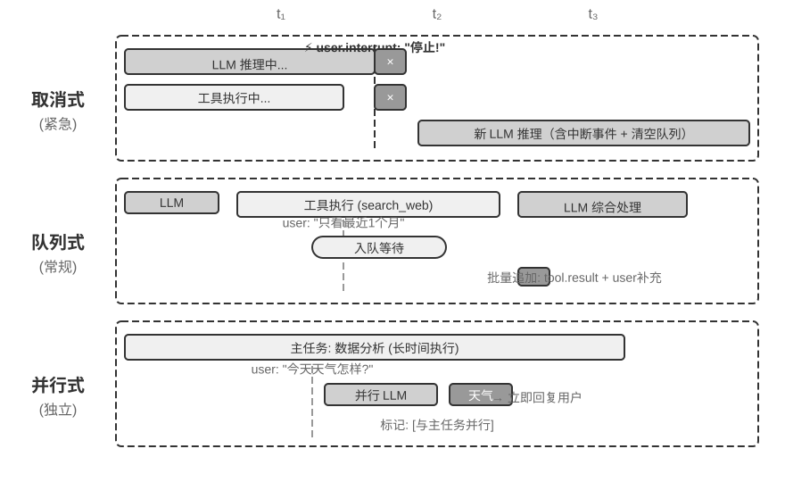
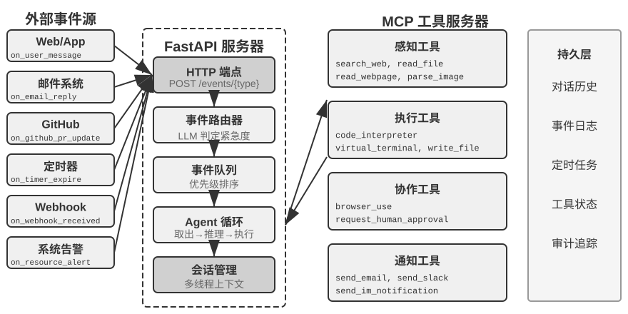
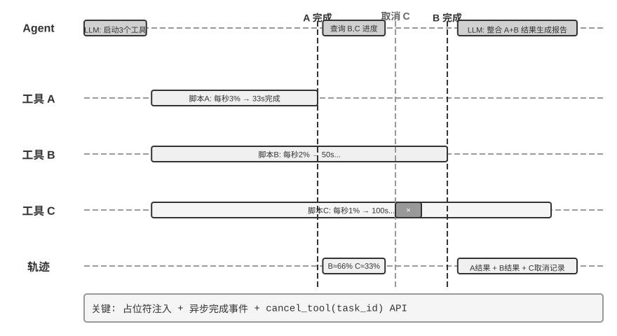
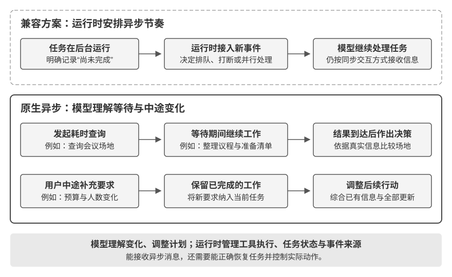
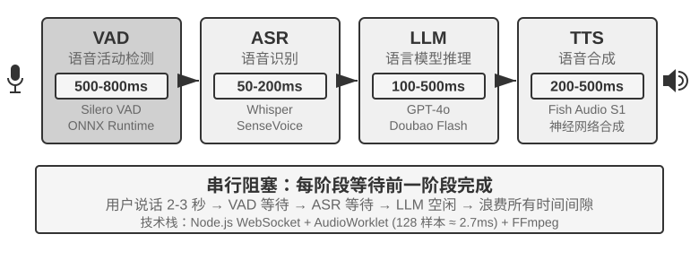
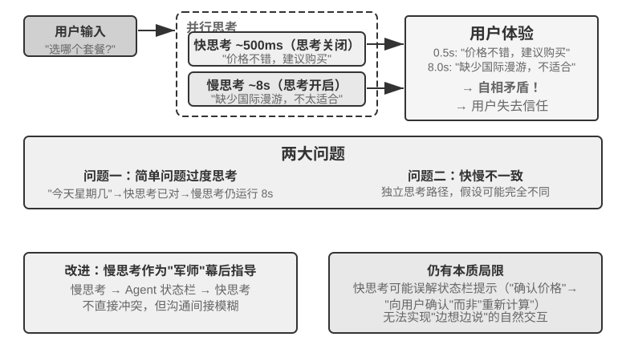
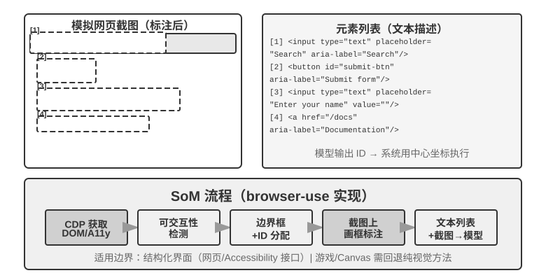

# 交互：观察与动作空间的扩展

第一章提出过一个论断：在底层模型固定时，提升 Agent 任务表现最主要的系统工程手段，往往是重新定义或扩展**观察空间**与**动作空间**。在前五章的内容中，**Agent 与世界的交互是轮流的**。用户说完一句，Agent 想一段、调用几个工具，再回一句；在它思考的这段时间里，世界被默认为静止的。这个前提如此自然，以至于很少被当成一个假设写出来。这一章要挑战的正是这个前提。

## 模态与触发时机的扩展

把观察空间和动作空间摊开，会发现它们各有两个可以扩展的方向。

- **模态**决定观察和动作的**形式**：Agent 是只读文本，还是也能听见声音、看见屏幕、感知力矩；是只能输出 token，还是也能发声、点击、驱动关节。
- **触发时机**决定观察和动作的**节奏**：观察是 Agent 主动去取，还是世界主动推来；动作是必须在一个回合内做完，还是可以跨越回合、中途被打断、被更紧急的事抢占。

前面几章扩展的是这两个空间的**内容**，这一章扩展的是它们的**模态**和**时机**：

| | 观察空间的扩展 | 动作空间的扩展 |
|---|---|---|
| **内容**（第二至五章） | 上下文工程、记忆与知识库 | 工具、代码生成 |
| **模态**（本章） | 语音、屏幕、物理传感器 | 说话、点击、关节运动 |
| **时机**（本章） | 世界主动推送、连续流 | 跨回合、可打断、可抢占 |

**回合制是模型与接口的一种交互约定，不是环境的性质。** 早期工具调用接口通常按同步轮次组织消息：提问后面跟着回答，工具调用之后先补齐结果，再继续推理。真实环境却不会等模型作出反应：邮件在它思考时到达，用户在它说到一半时插话，页面在两次截图之间已经变了样，杯子在机械臂伸手的途中被碰倒。这个约定也正在改变：截至 2026 年 9 月，GPT-6 Astra 已提供原生异步工具调用和回合中途追加用户指令的能力。本章因此同时讨论原生支持与兼容既有同步接口的两条路线。[^ch6-22][^ch6-23]

| 尺度          | 场景           | 观察侧的变化            | 动作侧的变化             |
| ----------- | ------------ | ----------------- | ------------------ |
| 秒 — 天       | 异步与事件驱动      | 会被外部事件主动唤醒的 Agent | 动作跨回合：先发起，后续靠事件收尾  |
| 10 毫秒 — 1 秒 | 语音           | 边说边听，不等一句说完       | 边想边说，可被打断          |
| 亚秒 — 秒      | Computer Use | 屏幕在两帧之间持续变化       | 动作后必须重新确认现实是否仍符合计划 |
| 毫秒          | 机器人          | 传感器连续回流           | 动作分块：一次规划一小段，可被抢占  |

## 异步与事件驱动：当世界主动找上门

第四章讨论的感知、执行、协作三类工具都由 Agent 主动调用。Agent 如何响应随时可能到达的外部事件？这需要事件驱动的异步架构来支撑；第一章五类工具中剩下的两类——事件触发工具与用户沟通工具——正是依托这一架构发挥作用的，因此也放在本节一并讨论。

这一节里模态没有变化，仍然是文本，变的只有时机。它是从前五章的回合制世界迈出的第一步。

### 为什么需要异步

先用一个比喻说明为什么需要异步。同步（Synchronous）意味着“做完一件事才能做下一件”，异步（Asynchronous）意味着“多件事可以同时进行”。传统的同步 Agent 架构就像一个只会排队的柜台，每次只能处理一个顾客，处理完才能叫下一个号；而真正智能的助手更像一个灵活的秘书，桌上摆着多个待处理的事项（邮件、电话、来访者），秘书根据紧急程度决定先处理哪个，处理到一半如果有更紧急的事情也可以暂停切换。在同步模式下，Agent 要么等待后台任务完成才能与用户对话，要么等对话结束才能处理新到达的事件，无法应对真实助理场景所需的几项核心能力：

- **异步执行是常态**——许多任务需要长时间运行，不应阻塞用户交互。
- **事件优先级的动态判断**——不是所有事件都同等重要，Agent 需要智能地选择处理策略：取消当前操作（紧急）、加入队列（常规）、还是并行处理（独立的轻量级查询）。
- **中断和恢复的流畅性**——被打断的对话或任务应该能够自然恢复。

将异步范式应用于 LLM 时，需要先检查模型和 API 是否支持这种消息时序。有些接口要求先补齐工具结果才能继续；有些已经允许工具挂起、模型继续工作，并在生成过程中接受用户更新。前者需要事件队列、任务句柄和兼容层，后者可以直接使用原生异步协议。两者都仍需要应用管理事件来源、工具生命周期与结果归属，不能仅凭代码用了 `asyncio`，就认定模型也具备原生异步能力。

为此我们需要**事件驱动的异步 Agent 架构**。技术上，这意味着系统不再主动地反复检查 “有没有新消息”（这叫轮询，效率低），而是在新消息到达时自动触发处理逻辑。所有的输入、输出、思考过程和外部交互都被统一建模为事件流——一条时间线上依次排列的事件记录。图6-1 给出了事件驱动异步 Agent 的整体架构，展示事件源、事件队列与 Agent 处理流程之间的关系。


### OpenClaw 的事件驱动机制实现

开源框架 OpenClaw 通过 Gateway 控制平面接收多渠道消息并路由到 Agent 运行时。它提供了三种内置的事件驱动机制：

- **Hooks（事件钩子）**：响应 Agent 生命周期中的事件，如会话创建、重置等，类似 GitHub Actions 中的事件触发器
- **Cron（定时调度器）**：按 cron 表达式（Unix 系统广泛使用的定时任务语法，如 `0 9 * * 5` 代表每周五上午 9 点）执行周期性任务
- **Heartbeat（心跳守护进程）**：每隔 N 分钟唤醒一次 Agent，检查是否有需要关注的事项

这三种机制赋予了 OpenClaw Agent“自主”的外观——即使用户不在线，Agent 也能定时生成报告、检查系统状态、处理例行事务。Gateway 对内置渠道（如 IM、Web 界面）的消息本身是**推送式**的，消息一到就路由给 Agent；三种自动化机制里，真正让 Agent 在没有用户消息时“自己动起来”的只有 Cron 和 Heartbeat，而它们都是**时间驱动**的——Heartbeat 每隔固定间隔检查一次，Cron 按预设时间触发，Hooks 的事件来源是 OpenClaw 框架内部，而非外部。

真正的短板在于：对于内置渠道之外的第三方事件源，例如一封新邮件到达、一个外部 API 回调推送、一个紧急通知需要立即处理，OpenClaw 缺乏即时接入的通道，Agent 无法在事件发生后立即做出响应，只能等到下一个 Cron/Heartbeat 周期才可能察觉。

这种延迟在许多场景下是不可接受的。以 **PineClaw**（Pine AI 的 OpenClaw 插件）为例：Pine AI 是一款代替用户拨打真实电话的 AI 助手，典型场景包括协商账单、取消订阅和处理保险理赔。当用户通过 OpenClaw Agent 发起一个 Pine 电话任务后，Pine 的语音 AI 会代表用户拨打电话，但通话过程中可能随时需要用户介入：

- **实时身份验证**：客服要求验证账户持有人身份，Pine 需要用户立即提供安全码或 OTP（一次性密码）
- **三方通话确认**：客服要求与账户持有人直接对话，Pine 需要用户在几秒内接听电话
- **进展同步与决策确认**：协商到关键节点（如对方提出降价方案），Pine 需要用户确认是否接受

如果依靠 Heartbeat 的定时轮询，用户可能在客服等待验证码时迟迟收不到通知，导致客服挂断、通话失败。

PineClaw 的解决方案是引入 **Channel 机制**——在 OpenClaw 的 Gateway 和 Pine API 之间建立实时的事件通道。当电话接通、需要用户输入、通话结束等关键事件发生时，消息被即时推送到 OpenClaw Agent，Agent 立即处理并通知用户。

这个案例揭示了事件驱动架构对 Agent 框架的核心价值：**真正的 “主动服务” 不仅需要 Agent 能定时检查事件，更需要事件能主动通知 Agent**。将所有输入——用户消息、工具返回、外部回调、定时触发——统一建模为事件流，通过事件循环驱动 Agent 的思考和行动，是实现这一目标的架构基础。在这一架构之下，下面先介绍两类与事件直接相关的工具，以及支撑 Agent 独立行动的虚拟身份与隔离执行环境，再讨论事件处理机制的具体设计。

### 事件触发工具

事件触发工具是外部事件驱动 Agent 行动的入口。如果没有事件触发工具，Agent 只能连续循环思考、调用工具，最后输出一个结果，然后等待用户的下一步输入。要让世界的变化转化为 Agent 可以处理的事件，常见的事件触发工具有三类。

**定时器**（set_timer）处理依赖物理时间的事件。例如，发送了一封邮件但对方没有回复，那么过一段时间应该再发一封邮件询问进展；打了一个电话但对方不在工作时间内，那么需要到下一个工作时间再尝试拨打。为此，OpenClaw、Claude Code 等工具都支持定时器工具，在指定的物理时间唤醒自己。**一次性定时器**用于有明确时间点的任务：例如用户要求 “给银行房贷部门打电话问办理进展”，当前是周六，Agent 就设置 “下周一上午 10:00 致电银行”，定时器触发后自动拨打。**循环定时器**用于周期性的任务：比如每小时检查一次服务器健康状况。此外，一些外部服务不支持主动推送进展，只能主动查询进展，此时就需要用循环定时器定时反复查询。上一节 OpenClaw 的 Heartbeat 正是这种机制的系统化实现，也是 OpenClaw 具备 “主动服务” 能力的根源。

**后台任务监控**（monitor_shell）处理来自异步执行的工具或命令行任务的事件。一些命令行任务需要长时间在后台执行，Agent 需要监控执行进展。如果让 Agent 不断 “盯着命令行看”，也就是不断调用工具查询当前进展，那么会浪费太多的 token；如果等命令行任务完全执行结束后再让 Agent 开始思考和行动，那么 Agent 将无法及时发现执行过程中的严重问题，甚至在命令行卡死的情况下无法介入，导致整个任务停滞。Claude Code 解决这个问题的方法是引入 monitor（监控）工具，允许 Agent 监控命令行的新增输出或者包含特定关键词的输出。

**外部事件通道**（connect_channel）把新邮件到达、API 回调、IM 消息等外部事件实时推送给 Agent，上一节 PineClaw 的 Channel 机制就是典型实现。

在设计层面，事件触发工具应定义清晰的触发条件和过滤规则，避免无关事件唤醒 Agent 浪费算力；事件载荷（payload）应包含足够的上下文信息，减少 Agent 被唤醒后还需要额外查询的次数。

### 用户沟通工具

用户沟通工具是为了适应 Agent 与用户之间日益多元的沟通渠道而产生的。许多 Agent（如 Claude Code、Manus）采用原生 ReAct 循环，Agent “说” 的所有话（即 assistant 消息）都直接发送给用户，用户必须在应用中打开指定的会话才能与 Agent 对话。用户在会话中往往可以看到 Agent 调用工具的过程。

OpenClaw 打破了这一人机沟通范式。用户无需感知会话的存在，也无需关心 Agent 调用工具的细节；用户和 Agent 都可以随时给对方发送消息，而不是用户发一条、Agent 回一条。因此，很多人评价 OpenClaw 具备 **“活人感”**，就像一个秘书一样通过文本消息与用户异步沟通。OpenClaw 并不是直接把模型输出的 assistant 消息呈现给用户，而是使用专门的工具发送消息。这些消息还可以附带图片和文件，并可根据紧急程度附加推送提醒。

除了通过文本方式与用户沟通，越来越多的 Agent 具备**多模态沟通能力**，例如发送结构化卡片消息、发送提醒邮件。一些 Agent 已经开始尝试**生成式 UI**（Generative UI），即使用 HTML 等方式生成交互式界面，以更友好的方式向用户展示信息。在设计层面，用户沟通工具应支持异步消息模式（用户不一定在线），提供已读/未读状态追踪，并在多渠道场景下保持消息的一致性。

**多渠道的用户沟通与召回。**

**Agent 的响应不应局限于单一渠道，通知机制同时也是用户召回机制**。消息发送扩展到即时通讯、短信、邮件、电话、推送等多种渠道。Agent 根据紧急程度、用户状态、内容性质、用户偏好综合决定渠道的选择，既保证不错过重要的消息，又避免重复打扰。

对于长时间运行的任务，Agent 需要在完成时主动通知用户，召回用户的注意力。对于定期性的任务（如每日总结、周报），通知可以帮助用户建立固定的交互习惯。

用户沟通工具解决了 “如何触达用户”。但 Agent 以什么身份出现在这些渠道上、在什么环境中代表用户执行操作，还需要一层身份与环境的基础设施，这就是下一节的主题。

### 虚拟身份与隔离执行环境

第四章开头以《Her》中的 Samantha 为例，说明 Agent 如何借助工具与真实数字世界交互。要实现这样的通用助理，首先面临一个关键的架构选择：Agent 应该直接管理用户的个人账号，还是拥有自己的虚拟身份？直接管理看似便捷，但一旦 Agent 出现错误或被攻破，用户的全部数字身份将会暴露。更稳妥的方案是赋予 Agent 一套独立的虚拟身份——如同秘书拥有自己的办公电话和邮箱。这套虚拟身份包括专属的通讯账号、存储空间、计算环境，使 Agent 能以透明的身份代表用户工作。身份的明确性不仅没有削弱信任，反而增强了沟通的真实性。

虚拟身份需要部署在隔离的执行环境中。**虚拟电脑**（VM/容器）和**虚拟手机**（Android 模拟器）为 Agent 提供操作系统级的隔离和完整的桌面/移动操作能力。首先，虚拟电脑可以全天候运行，不受用户设备联网状态的影响，也不影响用户正在操作的应用；其次，即使 Agent 执行了错误操作，最多也只会导致虚拟环境崩溃，不会影响用户的真实设备；最后，隔离环境可以防止 Agent 随意访问用户的本地文件，提高了安全性。

独立身份也带来两个现实挑战。一是**反机器人机制**：许多网站用 CAPTCHA 和 IP 信誉检测拦截自动化访问，使用数据中心 IP 的虚拟环境很容易被识别，实践中往往需要配置住宅代理网络（使用真实家庭 IP）才能正常访问。二是**访问用户真实账号的场景**：当任务必须以用户本人的身份登录时，应采用 Human-in-the-Loop 认证——通过 VNC/RDP 远程桌面让用户在可视化环境中亲自完成登录。用户能看到 Agent 正在操作的完整界面，理解为什么需要认证；认证后的会话令牌可以在有效期内复用，避免频繁打断用户，在自主性与安全性之间取得平衡。

Agent 与虚拟环境之间的数据交换通过**共享文件系统**完成：以卷挂载的方式（如 `/workspace/shared`）连接 Agent、虚拟电脑和虚拟手机，数据以文件路径引用传递而非内容拷贝，避免占用上下文窗口。以一个数据分析任务为例：用户上传 CSV 文件到共享目录，虚拟电脑中的 Agent 读取文件、执行分析、生成图表并保存回共享目录，Agent 只需将图表的文件路径返回给用户——各方之间传递的始终只是轻量级的路径字符串。

事件触发工具让世界能够唤醒 Agent，用户沟通工具让 Agent 能够触达用户，虚拟身份与隔离执行环境让 Agent 能以独立、可审计的身份行动。剩下的问题是：当多个事件同时涌向同一个 Agent 实例时，应该如何处理？

### 事件处理机制

一个 Agent 实例可能同时面对多个事件：用户的新消息、工具返回的结果、定时器到期、另一个 Agent 的协作请求。如何高效而正确地处理这些事件，直接影响着性能和用户体验。

这套机制的骨架是并发编程里的**事件循环**（event loop）。可以把异步 Agent 看作一个长期运行的循环：每一轮从输入队列取出若干事件，追加到轨迹，调用一次 LLM，执行它决定的工具，再回到循环开头等待下一批事件——这与 Go 的 goroutine 从 channel 读取消息、在 `for { select { ... } }` 中逐轮处理是同一个结构。

在传统的同步接口实现中，**事件在每轮循环的边界被消费**。当 LLM 正在推理、工具正在执行时，新事件先在队列中等待，待本轮到达一个**安全点**（一段推理结束、一次工具返回）再处理。原生异步则允许在模型仍在思考或输出时接收新要求，由系统选择合适的时机继续处理。两者都有边界，只是边界由不同层管理。工具取消仍需执行器响应取消信号，类似 Go 中对 `ctx.Done()` 的检查；接收一条“停止”消息本身不会撤销已经发生的动作。

理解了这一点，下面先以兼容同步接口的事件循环说明三种处理策略：让事件等到下一个自然出现的安全点（队列式）、主动提前制造一个安全点（取消式），还是另起一个循环、不必等待主循环的安全点（并行式）。原生 steering 的接续方式将在后文展开。

**事件的结构化建模。**

处理的前提是理解。通用 Agent 面对的输入不只来自用户一个人——第三方发来的消息不是用户发给 Agent 的，但 Agent 需要理解它、评估其重要性、决定如何介入。这要求将每个输入都建模为包含丰富语义的**结构化事件**：

- **来源（谁）**：用户本人、联系人、陌生人、系统通知
- **渠道（方式）**：电话语音、短信、即时消息、邮件、社交媒体、定时器触发、异步工具调用结果、命令行监控状态更新
- **内容（什么）**：消息文本、情感色彩、紧急程度、是否需要回复
- **上下文（背景）**：是对之前某个对话的回复还是新发起的沟通，与当前任务的关联

以一封客户退款请求邮件为例，结构化事件的具体形式如下：

```json
{
  "source": {"type": "email", "sender": "client@example.com"},
  "channel": "gmail_webhook",
  "content": {"subject": "退款请求", "body": "订单 #12345 希望退款..."},
  "context": {"priority": "high", "customer_tier": "vip", "related_orders": ["#12345"]}
}
```

只有当这些维度被清晰地建模为结构化事件，Agent 才能在多方通信中保持清晰的认知，避免将用户输入误当成工具结果，或将藏有指令的工具结果误认为用户指令而导致提示注入。多线程上下文管理的复杂性还要求 Agent 理解多个对话线程之间的关联——来自第三方的消息如何影响用户的情绪，用户在不同对话中扮演什么角色，何时需要将不同线程的信息综合起来提供建议。

从 n8n 等工作流平台的触发器生态可以看到，Webhook、定时器、邮件、数据库变更、文件监听——每一种触发器都是 Agent 感知世界的一个 “感官”。当这些异构的事件被统一建模为结构化格式之后，Agent 就能以一致的方式处理来自不同来源的刺激，下文的紧急度判定和处理策略也都建立在这一统一建模之上。

**基于紧急度的动态处理策略。**

人类在处理多个任务时，会根据紧急程度采取不同的策略。面对突发的紧急情况，会立即停下手头的工作；面对常规的待办事项，则加入任务列表稍后处理。Agent 的事件处理也应体现这种智能性。



**取消式处理（Cancellation-Based）** 用于紧急事件，其本质是为紧急事件**提前制造一个安全点**：主动中断当前步骤，把这一刻变成可以消费新事件的边界。当紧急事件到达时（如用户点击 “停止” 或监督系统发来高优先级指令）：(1) 停止当前操作——如果 LLM 正在推理，立即取消流式响应；如果有同步工具在执行，发送取消信号；(2) 清空待处理队列，将所有事件取出；(3) 将队列中的事件和紧急事件一起追加到轨迹末尾；(4) 立即重新调用 LLM，以更新后的完整轨迹为输入来评估局势。例如，用户在 Agent 执行可能错误的操作时输入 “停！我说错了”，Agent 会立即看到这条新输入，重新理解真实意图，从而避免执行错误的操作。

**队列式处理（Queued）** 用于常规事件。当非紧急事件到达时（如异步工具返回结果或用户发来补充信息）：(1) 将事件放入队列末尾，不打断当前操作；(2) 等待当前操作完成——让 LLM 完成推理，让同步工具执行完毕；(3) 当任何工具调用完成并返回 `tool.result` 时，检查队列，如果队列非空则将所有事件一次性追加到轨迹；(4) LLM 综合处理更新后的轨迹。这实现了批量处理，提高了效率，例如 Agent 调用搜索工具后，在等待期间用户补充了 “只看最近一个月的结果”，这条补充信息进入队列，搜索结果返回时两个事件一起呈现给 LLM，避免了不必要的往返。

**并行处理（Parallel）** 用于独立的轻量级查询。比如 Agent 正在分析大量数据时，用户突然问 “今天天气怎么样？” 此类查询具有三个特征：与主任务无关、需要快速响应、执行成本低。既不应该用取消式处理（会打断重要的主任务），也不应该用队列式处理（让用户等太久）。系统首先判断查询的独立性和复杂度，然后在一个并行的推理会话中独立执行，调用必要的工具生成响应后立即返回。查询和响应会追加到主任务的轨迹中，并明确标记为 “与主任务并行执行”，以避免 LLM 混淆。

**紧急度的判定。**

紧急事件：用户中断（`user.interrupt`）、监督指令（`supervisor.instruction`）、Agent 间中断（`agent.interrupt`）、标记为紧急的外部触发器（如系统告警、支付失败）。

非紧急事件：常规用户输入（`user.input`）、Agent 输入（`agent.input`）、工具结果（`tool.result`）、定时器触发（`timer.trigger`）、常规外部触发器。

硬编码的规则有其局限性，事件的语义决定了处理方式——“马上停下来” 用取消式、“今天天气怎么样” 用并行式、“报告需要用中文发给我” 用队列式。**建议使用轻量级的分类 LLM 作为事件路由器**，在事件到达时快速判断应该采用哪种策略。

取消点必须是工具或推理能够安全收尾的位置；未完成的工具结果用显式占位符表示，不能伪造成功。

下面通过一个事件驱动的邮件处理 Agent 实验，将上述事件处理策略落地为可运行的实现。

> **实验 6-1 ★★★：事件驱动的邮件处理 Agent**
>
>
> 
>
>
> 本实验构建一个最简单的事件驱动 Agent：**自动邮件处理助手**。Agent 监听邮件收件箱，每当收到新邮件时自动触发处理流程——分类、摘要、起草回复，必要时通知用户。这是事件驱动 Agent 最直观的入门场景：一个外部事件（新邮件到达）触发一次完整的 Agent 思考循环。
>
> **实验目标**是理解事件驱动的核心概念：Agent 不再只是被动地等待用户输入，而是可以响应外部事件来主动行动。通过这个实验，读者将掌握事件源注册、事件队列以及“事件到达 → Agent 处理 → 结果输出”的基本闭环。
>
> **事件源与事件队列。**
>
> 系统支持多种事件源的统一接入：
>
> - **邮件事件** (`on_email_received`)：通过定期检查收件箱或接收推送通知，在新邮件到达时触发
> - **IM/短信消息** (`on_im_message`，`on_sms_message`)：即时通讯消息触发
> - **GitHub 事件** (`on_github_pr_update`，`on_github_issue_update`)：PR review 意见、状态变化
> - **定时器触发** (`on_timer_expire`)：定时任务（如每日摘要、周报生成）
> - **Webhook** (`on_webhook_received`)：通用的外部系统回调
> - **系统事件** (`on_user_inactive`，`on_process_timeout`，`on_resource_alert`)：内部状态变化
>
> 所有事件进入一个统一的**事件队列**，按到达顺序依次处理。每个事件触发一次独立的 Agent 思考循环：Agent 读取事件内容，调用相关的工具（如查询知识库、读取附件、搜索相关的邮件历史），生成处理结果（分类标签、摘要、草稿回复），最后通过通知工具告知用户或直接执行操作。
>
> **验证场景**：配置 Agent 监听测试邮箱。模拟接收三封邮件——一封会议邀请、一封客户投诉、一封营销广告。Agent 依次处理：为会议邀请自动检查日历冲突并起草接受/拒绝回复；为客户投诉提取关键信息并标记为高优先级，通知用户处理；将营销广告自动归档。整个过程无需用户介入。

实验 6-1 展示了最简单的事件驱动模式——事件进入队列，Agent 依次处理。但当 Agent 需要在长时间运行的工具执行过程中响应打断，或同时管理多个并发任务时，简单的事件队列就不够用了。接下来讨论更深层的工程挑战。

### 不支持原生异步时的兼容方案

实验 6-1 只处理串行事件——事件依次进入队列，Agent 一个接一个处理完毕。如果选用的模型或接口不支持原生异步，当工具尚未返回时用户突然打断，就需要在同步格式中表达异步语义。下面给出一条兼容路线；后文再介绍 GPT-6 Astra 的原生接口。

假设 Agent 正在帮用户起草一封邮件（工具调用：搜索联系人信息），搜索还没返回结果时，用户突然说 “等一下，先帮我查一下明天的天气”。如果接口要求未完成的工具调用先获得对应结果，Agent 就无法直接带着悬空调用处理这条新消息。这里的限制来自所选协议与模型组合，并非所有 LLM 都必须遵循的规律。

**兼容同步格式的异步实现。**

核心思想是：**在没有打断发生的常态下，让 LLM 看到标准的同步轨迹，只在打断时才插入占位符来修复格式**。以下是五条关键规则：

**规则 1**：及时记录 API 已完成的 assistant 消息和工具调用项；对服务端管理的 reasoning 状态，按提供商的续接协议保留，不自行拼接不可见的思考文本。

**规则 2**：工具调用完成时才记录 tool result。执行中轨迹处于 “部分完成” 状态。

**规则 3**：工具执行中的打断需要占位符。为未完成的工具生成占位符响应（如“工具正在后台执行，请优先处理新事件”），追加打断事件，重新调用 LLM。从 LLM 的视角看，assistant message 仍然有配对的 tool result。

**规则 4**：在没有原生 steering 或受支持的中途续接接口时，取消未完成的生成，保留已经确认完成的消息和工具状态，将新事件追加后重新请求。不能假定半截输出或隐藏推理可以作为合法前缀任意回灌。

**规则 5**：非打断事件进入队列等待批处理。当前周期完成后才一次性追加。

以 Agent 正在起草邮件时用户打断询问天气为例，这五条规则的运作过程如下：

1. Agent 调用 `search_contacts` 搜索联系人信息，assistant message 立即写入轨迹（规则 1）。
2. 搜索工具尚未返回结果时，用户发来“先帮我查一下明天的天气”。由于这是用户打断，系统为未完成的 `search_contacts` 生成占位符 tool result（“工具正在后台执行，请优先处理新事件”，规则 3），然后将用户的天气查询追加到轨迹，重新调用 LLM。此刻 LLM 看到的轨迹格式完全合法——assistant message 与 tool result 配对完好。
3. 天气查询完成并回复用户后，原先的 `search_contacts` 结果到达，作为新事件追加到轨迹（规则 2），Agent 读取联系人信息后继续起草邮件。

这套方案的作用是维持同步接口要求的工具配对关系。只有需要打断时才引入明确表示“未完成”的占位符；后台真实结果到达后，再通过有来源和任务 ID 的事件送入轨迹。对于已经支持原生异步的模型，系统可以保留任务的未完成状态，等真实结果到达后再交给模型处理。

占位符也带来语义上的风险：模型可能把“任务已启动”误当成“任务已完成”，在真实结果返回前作出依赖该结果的判断。应通过明确的任务状态和结果校验防止这种混淆，并在评估中检查是否编造了未到达的数据。不能仅凭一次失败，就把原因归结为某个未公开的训练过程。

**通过任务句柄表达异步语义。**

无论是否使用原生异步协议，都可以**从工具接口的设计层面明确异步语义**。对同步接口尤其有用的方法，是让“启动任务”成为一次有真实返回值的完整调用。

传统的工具设计隐含了 “调用即完成” 的语义。例如 `phone_call` 这个名字暗示 “调用将拨打电话并等待通话结束，返回通话记录”。在异步范式下应该将 “启动” 和 “完成” 解耦：

- `initiate_phone_call`：启动电话呼叫，立即返回任务标识符和初始状态（如 “呼叫已发起，正在拨号”）
- 通话进展通过事件通知（`phone_call_connected`、`phone_call_ended`）

关键在于工具的名称和描述本身就要传达异步的语义。当模型看到 `initiate_phone_call` 时，它会自然推断这是 “发起” 而非 “完成”。工具描述应进一步强化这一点：“此工具将启动由子 Agent 处理的电话任务。任务成功发起后立即返回任务 ID，你可以继续处理其他事项。通话结束后会收到单独的通知事件。”

**队列式处理中的注意力分散问题。**

在批量事件处理时，模型可能只回应最后一个事件而遗漏前面的要求。原生异步解决了消息能否在运行中到达的问题，仍需检查模型是否综合使用了所有更新。

可以从两个层面进行干预：

**提示词层面**：告知模型 “当收到多个连续事件时，请确保全面考虑所有信息”。

**Agent 状态栏标记**：在每个事件前添加显式标记：

```text
[未处理事件 1/4] Tool result from database_query：...
[未处理事件 2/4] User 补充说明：只看北京地区的数据
[未处理事件 3/4] 系统提醒：报告截止时间还有 30 分钟
[未处理事件 4/4] User 询问：进度如何？
```

在末尾添加汇总：“上面有 4 个未处理事件，包括 1 个工具结果、2 条用户消息、1 个系统提醒。请确保回应涵盖所有信息。”

> **实验 6-2 ★★★：带并行执行和打断能力的异步 Agent**
>
>
> 
>
>
> 在实验 6-1 的简单事件队列基础上，本实验通过兼容同步接口的运行时实现**并行工具执行、执行取消和状态管理**。Agent 不再只是逐个处理事件，而是需要同时管理多个并发任务，处理打断和恢复，并根据实时状态做出动态决策。原生 Astra 接口的对照见实验 6-3。
>
> **1. 异步工具执行**：支持耗时工具的异步执行（至少 3-5 秒），启动后立即返回占位符。**验证场景**：Agent 执行一个长时间的终端命令，期间用户问“现在几点了？”，Agent 立即回应，等分析结果返回后再呈现。
>
> **2. 事件队列与批量处理**：累积非紧急事件，批量追加到轨迹。**验证场景**：Agent 执行长任务，用户连续发送“记得用日语回复”和“整理成网页”，任务完成时一次性处理所有事件，生成日语网页。
>
> **3. 打断机制**：用户的“停止”立即终止执行流并取消异步工具。**验证场景**：Agent 执行长任务，用户发送“取消”，Agent 立即停止，轨迹记录打断事件和取消操作。
>
> **4. 并行工具的取消与状态查询**：异步工具完成后通过新事件将真实结果注入对话，支持通过任务 ID 取消或查询进度。**验证场景**：用户请求“帮我同时运行这三个脚本，哪个先完成了，就看看剩下的脚本进度怎么样，如果还没超过 50%，就取消”。三个脚本模拟分析进程，运行时不断输出进度，速度分别为每秒 3%、2%、1%。Agent 同时启动三个异步终端命令，当每秒 3% 的脚本在约 33 秒后完成时，Agent 查询剩下两个终端的状态，发现一个执行到约 66%、另一个约 33%，于是取消不超过 50% 的那个。两个终端都完成后整合结果生成完整报告。
>

### 模型原生异步：GPT-6 Astra

前面的兼容方案由运行时安排事件的接入顺序，让使用同步接口的模型参与异步任务。另一条路线是让模型原生理解这种交互节奏：工具还在运行时，自己可以继续做别的事；用户中途补充要求时，也可以据此调整后续工作。GPT-6 Astra 已支持异步工具调用（Async tool calling）与回合中途引导（Mid-turn steering），体现了这一变化（图6-5）。[^ch6-22][^ch6-23]



**异步工具调用将“发起行动”和“获得结果”分开。** Agent 发起耗时查询后，可以继续推理、调用其他工具，或处理不依赖查询结果的部分。例如，查询会议场地时，可以先整理议程和准备清单；等场地信息返回，再比较方案。关键是分清工作的依赖关系：能独立推进的工作继续做，必须依据结果的决策留到结果到达之后。

**回合中途引导让用户可以在任务进行中修正方向。** 当 Agent 还在思考或组织回答时，用户就可以追加“预算减少了”“参会人数变了”等要求。系统保留已完成的工作，把新的约束带入后续处理，使 Agent 能够在同一次任务中调整计划。接收到更新与作出调整之间仍可能有延迟，但用户不必等一整轮回答结束才表达变化。

这两种能力扩展的是交互的时机：工具结果与用户要求都可以在任务推进过程中到达。系统仍要分清它们的来源，记住哪些工作已经完成、哪些还在等待。修改计划也不等于停止正在运行的工具，更不会自动撤销已经发生的动作；实际执行、取消和状态管理仍由运行时负责。

并非所有模型都具备原生异步能力。构建 Agent 时，应根据模型的支持范围选择原生交互或兼容方案，再检查整个系统能否正确应对延迟返回、中途修改与任务恢复。异步训练可以继续改善这些能力，但开发者已经可以利用现有模型构建这样的交互方式。

### 从“能接收异步消息”到“可靠处理异步任务”

原生异步解决了消息能否在运行中到达的问题，复杂任务中的可靠性还取决于模型如何使用这些消息。至少要检查三件事：

1. **结果归属与未完成状态**：能否把延迟到达的结果归入正确任务，在结果缺席时避免编造数据？
2. **任务恢复与动作控制**：能否在处理新要求后继续原任务，并区分修改计划与停止执行？
3. **多条更新的综合使用**：能否同时遵守预算与人数等约束，而不是只记住最后一条消息？

针对这些问题，可以通过异步环境中的训练改进模型，也可以通过清晰的任务状态、事件来源和执行反馈改进系统。评估需要覆盖两层：模型是否理解了变化，系统是否按变化正确执行。

> **实验 6-3 ★★★：模型原生异步与回合中途引导**
>
> 为一次会议选择场地：Agent 发起耗时查询后，先完成不依赖查询结果的准备工作；期间用户补充预算与人数要求。等查询完成，再根据全部约束选择场地。
>
> 调用 GPT-6 Astra API，对比同步工具、原生异步工具和回合中途引导三种交互方式，观察等待是否阻塞其他工作、新要求是否进入后续计划，以及结果到达后能否继续原任务。再选择一个不支持原生能力的模型作为对照，理解模型能力与运行时编排各自解决什么问题。

异步与事件驱动让世界能够在任务进行中唤醒 Agent，原生引导又让用户不必等完整回答结束才能提交更新。接下来三节进一步压缩时间尺度：当环境变化的速度达到甚至超过模型的生成速度时，能接收更新还不够，系统还必须及时作出反应。

## 语音：最自然的人机接口

语音的价值不只是把文字换成声音。正常说话的速度约为打字的四倍，而且不占用双手与视线，因此它天然适合把 Agent 放进持续工作、随时可能被打断的输入输出回路。语音输入法把口述转成文字，语音 Agent 则让用户直接与 Agent 协作；两者都可以支持引言中提到的 whisper coding。

本节同时讨论两个方向：用户对 Agent 说话，以及 Agent 代替用户对外部世界说话。语音模型决定“能回答什么”，交互架构决定“能否听清、及时回应、自然换手，并在通话中完成确认和工具调用”。后文先讨论交互时序，再讨论深度思考和表达质量。

### 交互时序：从级联到全双工

OpenAI 在 GPT-Live 的介绍中用“级联、轮次式、全双工”概括了语音系统的三种交互范式[^ch6-12]。它们不是简单的新旧替代，而是不同延迟、成本和可观测性约束下的取舍：

| 范式       | 核心结构                  | 主要优势              | 主要限制             |
| -------- | --------------------- | ----------------- | ---------------- |
| 级联       | VAD → ASR → LLM → TTS | 模块清晰、易替换、易调试      | 延迟累积，副语言信息在接口处丢失 |
| 端到端 Omni | 原生音频输入输出，按轮次交互        | 延迟较低，能保留语气、情绪和环境声 | 仍依赖轮次，训练和调试成本较高  |
| 全双工      | 原生音频输入输出，持续听、说和决策     | 支持重叠说话、自然打断和连续流   | 模型训练、控制和评估都更复杂   |

贯穿三种范式的主线是：如何摆脱“轮流说话”和 VAD 对发言权的猜测。级联和 Omni 仍要划分轮次，只有全双工把“该谁说话”变成模型的持续决策。

[^ch6-12]: OpenAI. *Introducing GPT-Live.* 2026-07-08. https://openai.com/index/introducing-gpt-live/ 。本节“级联 / 轮次式 / 全双工”三分法即出自该文对 ChatGPT 语音三代演进的总结；文中“端到端全模态（Omni）”对应其“turn-based voice models”一类。

### 范式一 · 级联流水线（Cascading）

绝大多数商业语音助手都基于串行流水线（图6-6）：VAD 判断用户何时说完，ASR 把音频转成文字，LLM 理解并生成回复，TTS 再把文字念出来。模块化让每个组件可以独立优化，但每一级都可能增加等待时间。





| 模块 | 作用 | 典型瓶颈 |
| --- | --- | --- |
| VAD | 判断是否说完 | 静音阈值带来等待和误切分 |
| ASR | 音频转文字 | 识别延迟与上下文丢失 |
| LLM | 理解、思考、生成 | 首 token 延迟，开启 reasoning 后等待更长 |
| TTS | 文字转语音 | 首包合成和播放缓冲 |

在一个简短、不开启 reasoning 的回复中，VAD、ASR、LLM 和 TTS 的等待会串行累积（图6-7）。真实数值取决于输入长度、模型、硬件、网络和负载。


生产环境的排队还会进一步放大空载延迟（图6-8），但这属于服务容量规划，本章不展开排队模型。


> **实验 6-4 ★：构建传统语音 Agent**
>
> 本实验用 WebSocket 串起麦克风、Silero VAD、本地 Whisper、流式 LLM 和 Fish S1 TTS，建立后续方案的级联基线（baseline）。

#### 从串行到流式感知

图6-7描述的是 VAD+ASR+LLM+TTS 的完全串行情形，这种串行感知方案有三个问题：

1. **延迟累积**：必须等待一段静音才能确认说完。
2. **信息丢失**：有声/无声二值信号无法表达犹豫、情绪、附和和环境声。
3. **上下文被切断**：邮箱、人名和专有名词可能被分片识别而出错。

为了解决这个问题，在保留模块化分工的前提下，一种优化方案是**流式感知**，让各阶段尽早产出增量结果：

- **ASR 边听边转**：VAD 检测到用户开始说话时，就按照一定的时间间隔调用 ASR 模型，流式生成临时转录内容；VAD 检测到用户说话结束后，再确认最终文本。
- **LLM 推测执行**：临时转录内容生成后，就送给 LLM；如果最终文本与临时转录内容相同就不再调用 LLM，否则取消前序推测执行的思考，重新调用 LLM。
- **LLM 分段输出**：第一段适合播报的文本生成后立即交给 TTS，不等完整回复。
- **TTS 增量合成**：持续返回音频块，让后续生成、合成和播放重叠进行。

真正的流式 ASR 需要模型支持。Whisper 的解码虽然是自回归的，但编码器需要完整音频段，因此不能直接等同于流式模型。基于 LLM 的流式听觉模型可以从连续音频中输出文本和语义事件，把“识别”和部分“理解”放进同一个模型。它保留从对话开始到当前时刻的上下文，也可以利用世界知识处理品牌、人名和专有名词。

如果只想解决“用户是否说完”，也可以把轮次判断直接做进流式识别器：模型综合语义和静音判断一句话是否表达完整。端点判断的训练标签必须只使用决策时刻可见的信息，否则会因“上帝视角”产生线上无法复现的判断。

模型输出的不仅是文字，还可以包含声学事件标记：

- **speak_start/end、interrupt**：说话起止与打断意图；
- **emotion**：情感、犹豫等状态；
- **laugh、sigh、noise**：副语言和环境声。

这些标记和文字 token 形成统一事件流，Agent 可以据此识别犹豫、打断和环境变化，而不必把所有声音压成纯文本。

> **实验 6-5 ★：使用 Qwen2-Audio 模拟流式语音感知**
>
> Qwen2-Audio 本身不是流式模型。本实验用递增音频前缀模拟连续感知，并与 600ms VAD + Whisper 对照。

### 范式二 · 端到端全模态模型（Omni）

级联即使采用流式感知，听、想、说仍通过离散接口交接；情绪、语调和环境声等信息可能在转成纯文本时丢失。Omni 方案用同一个模型直接听音频、生成回复并输出语音，因而有机会保留这些信息，但训练的成本更高（图6-9）。相比范式一的级联方案，Omni 的优势主要体现在延迟和非文字信息的理解和生成上。

在理解方面，Omni 模型可以理解声音中的停顿和。在生成方面，Omni 模型可以传递更丰富的副语言信息，例如唱歌、用特殊的语调讲一句话。

Omni 模型仍然假设轮流说话，通常要靠 VAD 划分发言权。因此，用户报数字时的中途停顿仍可能被误判为说完。


> **实验 6-6 ★★：本地运行 MiniCPM-o 4.5，对比端到端与自级联**
>
> 本实验使用本地 MiniCPM-o 4.5，关闭 thinking mode，比较直接从音频作答与同模型自级联先转录再作答。它测的是音频信息是否被保留，**不是**后文的“边想边说”。

### 范式三 · 全双工交互模型

Omni 仍然把对话分成“用户说”和“模型说”两个时段，但同声传译等任务要求两者重叠进行。全双工模型因此不再预设轮次，而是持续听、持续说，并不断决定继续、停顿、打断或调用工具。

研究上的先声是 Kyutai 的 **Moshi**（2024）。它并行建模用户和模型的音频流，因此重叠说话和打断可以成为模型的自然行为。

Thinking Machines Lab 将这类路线称为**交互模型（Interaction Model）**[^ch6-14]：交互性不再依靠 VAD 等外部 harness 拼装实现，而是内建在模型中。其微轮次机制以短音频块持续推进，让静音、重叠和打断都作为连续上下文保留。交互模型还可以把完整对话委派给后台推理模型，自己继续维持话头；后台结果返回后，前台再在合适时机接入。

[^ch6-14]: Thinking Machines Lab, “Interaction Models: A Scalable Approach to Human-AI Collaboration,” 2026-05. https://thinkingmachines.ai/blog/interaction-models/

OpenAI 的 GPT-Live 则把全双工路线带到生产规模：模型持续处理输入并生成输出，能等待用户、附和、被打断，也能处理实时翻译。它与交互模型一样，把复杂任务委派给后台模型，前台继续维持对话。

### 认知时序：实时交互与深度思考

“交互表现”和“智能上限”是两个维度：前台模型要在用户仍然在线时回应，后台模型则可以花更多时间思考。下面三种方案是设计取舍，不是线性迭代；前两种可以套在级联或 Omni 上，第三种则把深度思考与实时表达统一在同一模型内部。

#### 方案一：快思考回应，慢思考回答

快思考可以在几百毫秒内先给出即时回应，慢思考则在后台完成更深的推导。它的问题是简单问题会被重复处理，复杂问题又可能出现前后不一致：快模型先建议购买，慢模型随后发现套餐缺少关键功能，用户在几秒内便听到相互冲突的答案。根本原因是两个实例各自完成了一次独立思考。





#### 方案二：快思考交互，慢思考提醒

方案二让后台模型通过状态栏或专门接口向前台模型提供建议，前台继续维持话头并决定如何表达。它比方案一稳定，但通信仍然间接：前台可能误解建议，也看不到后台的中间思考；在后台完成前，用户追问时前台仍只能依靠自己的能力应答。它可以自然地“等结果”，但不能真正做到边想边说。

#### 方案三：端到端思考与表达统一

方案三把思考能力直接内化到端到端音频模型中。Step-Audio R1 用两个互补机制解决两个问题：**模态锚定思考蒸馏（MGRD）** 让模型基于声学特征思考，**MPS 双脑架构**让构思与表达并行。前者保证“想得对”，后者解决“说得及时”。

理想情况下，模型应该从音高、节奏和语调判断情绪，而不是只看转录文本。MGRD 筛选真正引用声学特征的思考过程，再用这些数据训练模型，并通过强化学习防止模型跳过思考直接猜答案。MPS 让构思脑持续产出思考片段，表达脑收到片段后结合已有回复立即生成语音。两者以流水线方式并行，因此不必等完整思考结束才让用户听到第一句话。

#### 快慢思考分离与端到端思考的取舍

统一模型最紧密地实现了 “边想边说”，代价是思考和实时表达需要一起重新训练；解耦路线更容易替换后台大脑。两者是取舍，不是简单的替代关系。

在前沿思考模型快速演进的当下，快慢分离有一个重要的工程优势：它能直接承接慢模型的迭代红利。前台快模型只负责低延迟地倾听、应答和维持对话，后台慢模型负责推理、规划和工具调用；更强的思考模型发布后，只需替换后台模型，不必重新训练整套实时语音系统。统一路线则把推理与交互绑定在同一个训练周期中，每次升级都要重新兼顾智能水平、响应延迟和表达自然度。因此，快慢分离并不只是对延迟的妥协，也是一种让交互能力与智能上限分别演进的模块化选择。

这种分离也不必然牺牲任务效果。截至 2026 年 8 月，采用快慢思考分离架构的 Pine AI 语音 Agent 在 τ³-Voice Leaderboard 上取得第一名，超过 Grok Voice、GPT-Realtime-2 等实时语音系统。这个结果至少说明，在同时考察深度推理与实时对话的任务上，解耦架构并不天然落后于端到端模型。[^ch6-17]

[^ch6-17]: Pine AI. “The Most Natural Human-Computer Interface Is Your Voice.” 2026-06-23（2026-08-06 更新）. https://www.19pine.ai/blog/pine-ai-the-most-natural-human-computer-interface-is-your-voice

这里需要澄清“端到端模型”常被赋予的两个含义。第一是上一节所述的**语音通路的端到端**：模型直接接收音频、生成音频，不再由多个模型通过离散文本串接。Omni 和交互模型都属于这个意义上的端到端模型，但 Omni 模型通常仍按轮次推进，交互模型则可以边听边说，二者在架构上差别很大。第二是本节所述的**认知架构的端到端**：实时交互与深度思考是在同一模型内部共享状态、共同训练，还是拆成前台快模型与后台慢模型。两条轴彼此独立，一个系统完全可以在语音通路上端到端，同时在认知架构上保持快慢分离；Thinking Machines Lab 把复杂任务委派给后台推理模型就是这种组合。

### 更像人的语音合成

传统 TTS 过于流畅、零停顿，反而容易暴露机器身份。停顿、填充词和偶尔的重复，是人类表达不确定性和思考状态的信号。

可以让主 LLM 在文本之外输出控制标记，例如 **THINKING**、**EMO:happy** 和 **SPEED:0.8x**，由 TTS 将它们映射为停顿、韵律、语速或笑声、叹气等非语言音频。实现上可以自研支持控制标记的 TTS，也可以用语音克隆准备不同情绪和风格的参考音频。

> **实验 6-7 ★★：基于 Fish Audio 的控制标记驱动 TTS**
>
> 使用 Fish Audio S1 构建多参考语音库，比较无控制标记、单一参考音和多参考音三种配置。执行层根据标记选择匹配的情绪、语速和风格。

## Computer Use：GUI 自动化 Agent

语音把时机轴推到了毫秒级，但它的观察仍是一维的声音流。Computer Use 把同一个问题搬上二维的屏幕：观察变成持续变化的像素，动作变成坐标上的点击与输入。语音场景强调“何时开口”，Computer Use 则强调“下一步点哪里”，以及一个语音交互中不存在的问题——动作执行之后，现实是否还与计划一致。

Computer Use（也称 GUI 自动化 Agent）让 AI 像人类一样通过观察屏幕、操作鼠标键盘来使用软件——比如打开浏览器搜索信息、在表格软件中填写数据或在系统设置中调整配置。其核心是一个**感知-思考-行动**的循环（图6-11）：

1. Agent 截取当前屏幕画面
2. 多模态模型接收截图和任务指令，输出一段思考和一个具体动作
3. 执行层在真实环境中执行该动作（移动鼠标、点击、输入文字等）
4. 等待界面响应后再次截图，进入下一轮循环

这里要区分“看懂界面”和“完成任务”。前者更接近多模态理解能力，可以用一次截图问答来测量；后者则要求模型把理解和生成动作放进闭环，处理页面加载、状态变化、误操作和不可逆后果。Computer Use 的难点因此不只是让模型在截图上答对，而是让它在每一步之后重新确认现实是否仍符合计划。


这个循环中有三个关键设计维度：**动作空间**（Agent 能执行哪些操作）、**视觉定位**（如何在截图中找到目标元素）、以及**模型架构**（如何从截图生成正确动作）。

### 动作空间设计

Anthropic 的参考实现把完整交互能力分成三类工具（图6-12）。这是一个清晰的动作空间设计，但不是模型供应商必须遵守的私有协议：只要 Harness 能把同样的截图、动作约束和执行结果转换成目标模型支持的消息与结构化输出，Claude、开放权重视觉模型和自托管端点都可以驱动同一个感知-思考-行动循环。


**GUI 操作工具**（computer tool）：鼠标操作包括移动（mouse_move）、左/右/中键点击、双击/三击、拖拽（left_click_drag），以及更精细的按下/松开（left_mouse_down/up）。滚动（scroll）支持四个方向并可配合修饰键。键盘操作包括逐字输入（type，每个字符间隔 12ms 模拟真实打字）、组合键（key，如 Ctrl+C）、长按（hold_key）。感知动作：截图（screenshot）、获取光标位置（cursor_position）、等待（wait）。

**命令执行工具**（bash tool）：提供持久的 bash 终端会话，120 秒超时，通过哨兵字符串检测命令是否执行完毕，多次调用之间保持环境状态（比如 cd 到某个目录后下次调用还在那个目录）。

**文件编辑工具**（str_replace_editor）：通过字符串匹配实现安全编辑，支持查看、创建、替换、插入和撤销操作，比直接覆盖整个文件更精确，不容易误改其他内容。

> **实验 6-8 ★：运行 Computer Use（Anthropic 参考路径或开放模型路径）**
>
> 路径 A 使用 Anthropic Computer Use Demo：容器打包完整的 Ubuntu 桌面环境（含浏览器、终端等常用工具），前端接收任务，后端把指令与截图发送给 Claude，再执行模型返回的鼠标、键盘、终端或编辑动作。
>
> 路径 B 使用本书的 [`chapter6/computer-use-open-model`](../chapter6/computer-use-open-model/) 示例代码：默认以开放权重的 Qwen3-VL 32B Instruct 驱动 browser-use，可通过 OpenRouter 托管 API，也可连接自托管的 vLLM/SGLang 等服务。

### 视觉定位（Grounding）

在循环的每一轮中，模型需要在截图中准确定位目标元素——“搜索框在哪里？”“提交按钮的坐标是什么？”这就是视觉定位（Grounding）问题。当前主要有**两大思路**：一是把定位变成**选择题**——先把界面元素标注好编号，模型只需从中选一个；二是**纯坐标预测**——让模型像人一样直接“看”着截图报出坐标。其中选择题思路又有两种实现方式：**纯视觉标注**（原始的 Set-of-Mark，用分割模型在像素上切出候选区域）和**结构化元素索引**（DOM/Accessibility Tree，直接读取界面自带的结构）。选择题思路的共同优势，是把开放式的“在截图中找到按钮并预测坐标”转化为封闭式的“从已标注好的元素中选一个”。就像考试中选择题比填空题更容易答对一样，模型只需说“点击 [123]”而不是“点击屏幕 (350, 464) 处的按钮”。输出坐标对模型来说挑战尤其大，需要大量训练才能做准确，而且在不同屏幕分辨率下很容易出错。

**Set-of-Mark：视觉标注法。**

原始的 Set-of-Mark（SoM）由微软研究院于 2023 年提出，最初是为了释放 GPT-4V 的视觉定位能力。它是一个**纯视觉**方法：用图像分割模型（SAM、SEEM 等）在截图上自动切出候选区域，为每个区域叠加编号标记，模型看到的是一张带编号的图，只需报出编号，由系统换算成对应区域的中心坐标。整个过程不需要 DOM，也不需要任何界面内部结构，因此原生桌面软件、游戏界面同样适用——只要分割模型能把候选区域切出来。

**结构化元素索引：SoM 思想在 Web 上的结构化实现。**

当界面本身能提供结构化信息时，标注可以做得更精确。现代网页在渲染之前就已经定义了完整的元素结构（DOM 树）和语义角色（哪个是按钮、哪个是输入框），无障碍接口（Accessibility Tree）为许多桌面应用提供了类似的信息。以 browser-use 项目为代表的 Web Agent 方案正是这样做的：从 DOM 中枚举可交互元素并编号，可以看作 SoM 思想在 Web 上的结构化实现（图6-13）。流程分四步：

1. 通过浏览器调试接口（CDP，Chrome DevTools Protocol）获取网页的结构化表示（DOM 树）和无障碍信息
2. 自动检测哪些元素可以交互（按钮、输入框、链接等）
3. 为每个可交互元素标注唯一 ID 并在截图上绘制边界框
4. 同时生成文本列表描述每个 ID 对应的元素

```text
Screenshot: [图片中关键元素标注了 [1]、[2]、[3]、[4] 等 ID]

Elements:
[1] <input type="text" placeholder="Search" aria-label="Search" />
[2] <button id="submit-btn" aria-label="Submit form" />
[3] <input type="text" placeholder="Enter your name" value="" />
[4] <a href="/docs" aria-label="Documentation" />
```

模型只需要输出一个 ID，系统就会自动用该元素的中心坐标执行点击。这类方案不省 token（因为要把所有标注信息都发给模型），但定位准确稳定，还免去了分割模型可能引入的漏检和误检。




**纯坐标预测。**

第三条路线不做任何标注，直接让模型输出坐标。以 **SeeClick** 和 Claude 的 computer use 为代表：在海量 GUI 截图和元素位置的配对数据上训练视觉模型，让它学会将自然语言描述（如“点击提交按钮”）直接映射到截图中的精确坐标——就像人类用户一样，纯粹靠“看”来找到要点击的位置。

在坐标预测方案中，模型对坐标的理解高度依赖训练时使用的分辨率（图6-14）。Claude 训练使用 XGA（1024x768）、WXGA（1280x800）、FWXGA（1366x768），如果输入的截图分辨率不匹配，模型预测的坐标就会系统性地偏移——就像在小地图上量距离然后直接用到大地图上一样。因此，需要在工具层实现双向坐标缩放机制，而且要**按宽高比选目标分辨率**，避免非等比拉伸把画面压变形、连带把坐标判断也带偏。例如，真实屏幕分辨率为 2560×1440（16:9），就该在 Claude 支持的三档里挑一个宽高比同样接近 16:9 的目标——FWXGA（1366×768）最匹配。截图时把屏幕等比缩放到 1366×768 送入模型；模型输出点击坐标 (683, 384) 后，反向映射为真实坐标 (683×2560/1366, 384×1440/768) ≈ (1280, 720)。反过来，若硬把 16:9 拉伸进 4:3 的 1024×768，画面会被横向压扁，模型预测的坐标就会系统性偏移。


三条路线的选择逻辑可以概括为：**结构化信息可得时，优先用 DOM/Accessibility Tree 索引**，定位最精确稳定；**不可得时**（原生桌面软件如 Photoshop、Canvas/WebGL 渲染的界面、游戏），**既可以用视觉标注（原始 SoM 路线），也可以用坐标预测**。视觉标注把定位变成选择题，对未经专门训练的通用模型更友好；坐标预测省去标注步骤，对做过 GUI 定位训练的模型更直接。两者在小元素和密集界面上的精度都仍有差距。

> **实验 6-9 ★：使用 browser-use 实现自动浏览器操作**
>
> 基于 Playwright 浏览器自动化框架（一个用代码控制浏览器的工具库），结合多模态大模型实现自然语言驱动的浏览器操作。启用 SoM 可视化模式，每次决策前保存带标注框的截图。
>
> 测试任务“打开 Google 查询旧金山天气”：系统启动后截图显示 Google 搜索页面，交互元素被编号，模型选择搜索框、输入“San Francisco weather today”、提交搜索，再从结果页提取温度和天气状况。

### 能看动画、能听声音的 Computer Use Agent

到目前为止，Computer Use 的感知都建立在一个隐含假设上：**屏幕是静止的**——截一张图、想一步、点一下，再截下一张图。可现实里的屏幕会放视频、会弹出转瞬即逝的通知、会播放会议里的人声。一个每 3–5 秒才睁一次眼、而且完全没有耳朵的 Agent，对这些“两帧之间发生的事”既看不见也听不到。

这里真正该被重新设计的，不是“动作接口”，而是“**观察接口**”[^ch6-9]。核心思想是构建 Agent–电脑观察接口（AOI），把连续的环境观察转换成模型便于处理的离散事件。其中包括几项关键技术：第一，**屏幕关键帧截图**——用一个小模型判断屏幕是否发生了有意义的变化，只在显著变化时截图，变化频繁时每秒截图 1 次就能有不错的效果；第二，**音量门控的语音转写**，有声音时调用语音识别，把识别出的文字放入上下文，让 Agent 能够听到声音；第三，**用文字描述画面**，让模型把捕获到的屏幕截图描述成一句话，这样即使原图之后被清理出上下文，这句文字仍留在上下文里，实现了多模态交互历史压缩的效果。

[^ch6-9]: 论文见 Li, Bojie and Noah Shi. *Agent-Computer Observation Interfaces Enable Dynamic Computer Use.* arXiv:2606.29472, 2026.

### Computer Use 的世界模型

上一节的观察接口解决的是 “屏幕中间发生了什么”：通过关键帧、语音转写和持久文字，让 Agent 不再只看到两张相隔很久的截图。但观察接口并不会消除规划延迟，Agent 仍然是串行的“截图—思考—点击”循环，每执行一个动作都重新观察、思考下一步。**OSWorld-Human** 的效率研究显示，即使任务最终成功，Agent 的操作步骤仍明显多于人类，等待时间也更长；准确率达到人类水平，并不等于已经足够实用。

人类操作电脑时并不是点击之后才开始想下一步，而是会先对动作后果作出预测：如果实际变化与预期一致，就沿着原定计划继续执行；只有发现页面状态偏离预期，才停下来重新观察和规划。世界模型让 Agent 能够在行动前预测桌面接下来可能变成什么，从而实现这种类似于人类的 “推测执行” 机制，大大提高效率。

桌面状态不只是一张像素图，还包括窗口、焦点、滚动位置、输入框内容、加载状态、权限和网络返回；动作则包括点击、键盘输入、滚动、拖拽和等待。一个可用于 Computer Use 的世界模型至少要能编码当前状态、预测候选动作造成的状态变化，并把预测交给规划器决定下一步：

```text
桌面状态 + click/type/scroll/wait ──> 下一状态的表示
```

这样，Agent 就能在真正点击之前比较候选动作的后果，在页面加载期间准备下一步，并在弹窗一闪而过时根据状态差异恢复。例如任务是 “在 VS Code 新建 Python 文件并写入 hello world”，模型可以先预测文件树和编辑器在成功后的关键状态，再选择点击、输入和保存动作；如果任务是删除文件，则可以先在隔离的虚拟桌面中预测是否会出现不可逆确认框，必要时请求用户确认。这里的重点不是让模型生成一张逼真的未来截图，而是预测完成任务所需的、可检查的状态差异。

2026 年 7 月，Induction Labs 公布的 **Photon-1** 展示了这条路线的一种实现，仅用 3 万小时的 H200 GPU 时间就完成了 computer use 世界模型的预训练。它把每帧压缩为离散的潜在 token，自回归预测动作之后的下一状态表示，而不是在预训练阶段逐像素生成截图；另外接入的图像生成器只用于把潜在表示可视化，并非推理必需组件。给定一张种子截图和后续动作，模型可以连续“想象”桌面状态，再通过虚拟机上的在线训练学会输出 computer-use 动作。[^ch6-20]

[^ch6-20]: David Li and Jonathan Li, Induction Labs, “Scaling Video Pretraining with Imagination Models,” 2026-07-23. https://www.inductionlabs.com/news/scaling-video-pretraining 。文中 Photon-1 的参数、数据规模、内部 benchmark 和成本比较均为公司披露的结果。
[^ch6-21]: Jack Parker-Holder and Shlomi Fruchter, Google DeepMind, “Genie 3: A new frontier for world models,” 2025-08-05. https://deepmind.google/blog/genie-3-a-new-frontier-for-world-models/；Zachary Lin et al. *Cosmos World Foundation Model Platform for Physical AI.* arXiv:2501.03575, 2025. https://arxiv.org/abs/2501.03575 。

### 移动端：生态壁垒比技术更难

Computer Use 也在向移动端扩展。移动端与桌面在技术上确有差异：动作空间通常不再是“鼠标坐标 + 键盘”，而是接入系统的无障碍服务 API（如 Android 的 AccessibilityService）来读取界面元素、下发点击与文本输入；交互方式也从鼠标指针变成触摸手势，坐标的语义随之改变——同一个 (x, y) 到底是手指的单击、长按，还是滑动手势的起点，需要额外的手势类型来界定。第七章介绍的 AndroidWorld 等移动端基准，正是在这样的动作空间上评测 Agent 完成真实应用内任务的能力。

但真正卡住移动端的，往往不是这些技术差异，而是生态壁垒。曾有手机厂商尝试在消费级手机中集成 AI 助手，让它自动操作微信、淘宝、支付宝等日常应用，但很快遭遇平台限制。

这揭示了 Computer Use 面临的一个独特挑战：**生态壁垒**。封杀背后的根本原因是商业模式冲突。传统互联网应用的核心变现逻辑是**流量与注意力**：用户刷信息流时看到广告，搜索商品时跟随推荐算法的引导，浏览页面时产生冲动消费。而当 Agent 代替用户操作时，这条变现链路被彻底绕过：AI 不会关注广告，也不会冲动消费，直奔目标完成任务就走。对于靠广告和流量变现的平台来说，Agent 的每一次操作都在侵蚀其商业模式的根基。

这意味着 Computer Use 面对的不仅是 CAPTCHA（验证码）等技术层面的对抗，更是一个**结构性的利益冲突**。这一矛盾在短期内难以调和，也让 Computer Use 在消费级场景中的落地面临比纯技术问题更棘手的挑战。

## 机器人操作：以 XLeRobot 整理桌面为例

> **阅读提示**：本节始终使用同一个任务——“把红色杯子放进托盘，把黄色废纸放进垃圾盒，最后重新观察并确认桌面状态”。实验 6-10 和 6-12 是 XLeRobot 真机实验，需要机械臂、标定、急停装置和现场观察员；实验 6-11、6-13 和 6-14 是对应的本地 GPU 实验。真机与模拟会明确分开报告，但任务目标、动作语义和成功条件保持一致。

机器人操作比“看图回答问题”难得多。模型不但要看懂画面，还要在真实世界里连续做出动作，而且每个动作都会改变下一刻的情况。XLeRobot 把这种区别变得很具体：同一台机械臂既可以由人通过键盘、手柄或 VR 设备遥操作，也可以把摄像头观察和一组受约束的动作工具交给 Agent 自主调用。硬件和任务都不变，改变的只是操作者——前者由人持续观察和纠错，后者必须由模型与控制系统完成同样的工作。

本节将用“整理桌面”贯穿五个实验。先让人遥操作真实 XLeRobot，测量真机在足够强的操作者控制下能做到什么；再在模拟器中建立同一任务的理想控制上限。接着让 Agent 自主控制真实 XLeRobot，观察感知、规划和失败恢复如何影响结果；再把相同的工具契约放进模拟器，批量比较开环、逐步检查和世界模型三种策略。最后改变背景、物体外观、光照和视觉噪声，检查模拟中学到的视觉策略能否适应新的环境。

这里的瓶颈通常不是再给模型增加一个静态问答基准，而是让它在有限的感知和控制带宽下持续完成闭环。一个能用的机器人系统，至少要回答四个问题：

1. 人想完成什么任务？
2. 接下来先做哪个子任务？
3. 当前技能具体输出哪些动作？
4. 动作执行后，现实是否仍符合原来的计划？

本节把这四个问题放在 XLeRobot 的同一个控制闭环中，并分别说明四种技术各自负责什么：长程规划安排先处理杯子还是废纸，VLA 或动作原语完成抓取和放置，世界模型估计动作后果，从仿真环境迁移到现实环境则处理训练画面和真实摄像头、执行器之间的差异。即使高层模型已经具备足够的知识和规划能力，只要缺少其中任何一个反馈环节，系统仍可能无法把任务做完。

### 硬件与算法的分工

XLeRobot 最适合回答的第一个问题是：自主整理桌面失败时，究竟是机械臂本身做不到，还是算法没有把它用好？这里有一个不容忽视的事实：**像 XLeRobot 这样成本只有几百美元的机械臂，通过遥操作已经能够完成本节这种连续的多步桌面任务**——人看着摄像头画面，抓起红色杯子放进托盘，再把黄色废纸放进垃圾盒，最后重新确认状态。这一结果不只是说明“硬件勉强具备可行性”，更是一个明确的诊断证据：**对于这个任务，硬件本体不是瓶颈，算法才是瓶颈。**

诊断方法很直接：保持摄像头、机械臂、夹爪、桌面布置和成功条件不变，先让人接管闭环。人类会持续修正物体定位、动作选择和时机控制，并处理抓取失败；自主系统与人的差距，正体现在这些闭环能力上。当然，这个判断仅限于本节的桌面任务：它说明硬件已经跨过了完成该任务所需的负载、精度和工作空间门槛，并不意味着几百美元的机械臂能够胜任所有开放环境或更高难度的操作。

XLeRobot 支持键盘、Xbox 手柄、Switch Joy-Con 和 VR 设备等遥操作入口。人类操作者会自然地做很多算法必须显式实现的事：夹爪靠近杯子时减速，杯子滑动时修正抓取点，第一次没有夹住纸张时重新观察，并在物体放入目标区域后检查结果。遥操作因此不只是收集演示数据，也是一种“固定硬件、替换操作者”的诊断实验。[^ch6-1]

> **实验 6-10 ★：真机遥操作 XLeRobot 整理桌面**
>
> 在真实 XLeRobot 工作区内放置红色杯子、托盘、黄色废纸和垃圾盒。操作者通过一种校准完成的遥操作方式执行固定任务：“把红色杯子放进托盘，把黄色废纸放进垃圾盒，最后重新观察并确认桌面状态。”实验至少重复多轮，并记录摄像头画面、操作者输入、机械臂状态、动作时间、抓取失败、重试次数和最终状态。
>
> 验收不能只看“最后桌面似乎收拾好了”。红色杯子必须位于托盘内，黄色废纸必须位于垃圾盒内，机械臂回到安全姿态，而且全程没有碰撞、越界或未经确认的人工代做。

真机遥操作得到的是最有说服力的任务上限，但它不适合批量改变物体数量和位置。为了得到可重复、可统计的对照，下一步把同一个“物体归位”问题搬进二维桌面模拟器，用理想控制器代表一个不会感知错误、不会选错动作的强操作者。

> **实验 6-11 ★：在模拟器中测量同任务的理想控制上限**
>
> 在二维桌面模拟器中随机摆放红色杯子、黄色废纸及其目标区域，由理想控制器依次接近物体、抓取并移动到正确位置。它不需要识别图像，也不会选错动作，因此代表“感知和决策都正确时，这个任务至少可以做到什么”。
>
> 实验关注任务成功率、完成步数和路径长度，并改变物体初始位置与任务规模，观察理想上限是否稳定。它与实验 6-10 使用相同的成功条件，但测量的是理想化模拟结果，不代表 XLeRobot 真机已经运行。二者共同建立后续自主控制的两条参考线：实验 6-10 是真实硬件上的人类闭环，实验 6-11 是模拟环境中的理想闭环。

### 机器人控制的基本结构

机器人系统通常会把不同时间尺度的工作分开：

| 层级 | 核心问题 | 输出 | 典型时间尺度 |
| --- | --- | --- | --- |
| 任务目标 | 人想完成什么 | “把杯子和废纸归位” | 分钟级 |
| 长程规划 | 先做什么、后做什么 | 先处理杯子，再处理废纸，最后检查 | 秒到分钟 |
| 基本技能 | 当前要完成哪个状态变化 | `pick(red_cup)`、`place(red_cup, tray)` | 约 1—3 秒 |
| VLA / 技能策略 | 这个技能具体怎么动 | XLeRobot 夹爪的一小段动作或连续轨迹 | 约 1—10 Hz 推理 |
| 底层控制与安全层 | 如何稳定、及时地执行 | 关节或末端控制量、限速与急停 | 约 50—1000 Hz |

这是一种常见的工程分工，不是唯一的模型架构。VLA 可以承担一部分高层判断，规划器也可以是规则程序、VLM 或优化器。无论采用哪种实现，都应该把“任务顺序”和“眼前动作”分开，否则高层模型的推理延迟会拖慢底层控制，底层的高频控制也会让高层模型处理大量无关细节。对 XLeRobot 来说，模型不应直接输出任意关节角；它只选择 `pick`、`place`、`verify_state` 或 `stop` 等有边界的技能，经过标定、限速并带超时的执行器再把技能变成真实机械臂动作。

### 长程规划与任务分解

用户说“把桌面整理干净”时，系统不能把这句话直接交给动作模型。规划器要先列出场景中的物体和目标，再决定先后顺序，并为每一步写清楚开始条件、完成条件和风险限制。例如：

```text
处理红色杯子 → 清理黄色纸张 → 检查桌面
```

“处理红色杯子”还要继续拆成两个动作和一次检查：

```text
pick(red_cup) → place(red_cup, tray) → verify_state()
```

每完成一个技能，就得到一个可以检查的节点。如果抓取失败，只重试当前这一步；如果物体被人挪动了，或者用户改变了目标，只需要重新规划受影响的后续步骤，不必把旧计划全部重做。给智能体的工具也应该足够简单：一次调用只做一件事，动作范围固定，有超时限制，执行后立即重新观察。

> **实验 6-12 ★★：使用 Gemini Robotics-ER 1.5 驱动 XLeRobot 自主整理桌面**
>
> 保持实验 6-10 的真实 XLeRobot、桌面布置、任务指令和成功条件不变，把人类操作者替换为 Agent。可以使用 Gemini Robotics-ER 1.5 这类具身推理模型负责观察和规划，通过 RoboCrew 风格的智能体循环只开放五个工具：`observe_scene`、`pick`、`place`、`verify_state` 和 `stop`。[^ch6-2]
>
> 模型先观察桌面，决定处理顺序，再调用经过标定的 XLeRobot 抓取和放置动作。每完成一个技能都必须重新观察并检查后置条件；抓取失败时只能重试当前技能，用户喊停、物体离开工作区或状态无法确认时必须调用 `stop`。模型不能直接输出任意关节角，也不能仅凭自己先前说过“已经完成”就跳过真实检查。
>
> 验收标准与实验 6-10 完全相同：杯子位于托盘内、废纸位于垃圾盒内、机械臂回到安全姿态且没有碰撞或越界。区别在于，自主实验的任务语义必须来自模型观察，真实动作必须来自工具调用，最终状态必须由新观察确认；人只能负责启动、急停和安全监护，不能在中途代替 Agent 完成动作。这样，实验 6-10 与 6-12 才能直接比较“同一硬件、同一任务，人类闭环与模型闭环之间还差什么”。

真机实验能暴露标定误差、相机遮挡和夹爪失败，却很难安全、可控地重复大量故障。后面的模拟实验会保留这五个工具和完全相同的任务状态，只把真实执行器换成可注入失败的桌面环境，用来拆解开环执行、逐步检查和动作预测各自贡献了什么。

### VLA 控制

VLA 是 Vision-Language-Action 的缩写，中文可以理解为“视觉—语言—动作模型”。它接收当前画面和一条技能指令，然后输出机器人接下来要执行的动作：

```text
当前观察 + 技能指令 → 动作
```

在 XLeRobot 的例子里，高层规划器只提交 `pick(red_cup)`，VLA 或技能策略还要根据当前画面决定从哪个方向接近杯子、夹爪何时闭合、手臂以什么轨迹抬起。执行层完成这一小段运动后，系统会重新拍摄桌面；只有确认杯子确实被夹住，规划器才允许提交 `place(red_cup, tray)`。因此，工具调用定义的是期望的状态变化，VLA 定义的是如何通过连续动作实现这个状态变化。

RT-2 和 OpenVLA 把连续动作切成离散的 token，再像生成文字一样逐个输出；π₀ 则代表另一条路线，直接生成连续、平滑的动作轨迹。两种方法没有简单的高下之分：离散 token 更容易和语言模型结合，连续轨迹通常更适合表达平滑运动。[^ch6-15]

大模型每秒通常只能推理 1—10 次，而传统控制器每秒可能要更新几十到上千次。工程上常用“动作分块”：模型一次生成一小段未来动作，控制线程按较高频率执行这一小段，模型则在后台准备下一段。这样可以把一部分推理等待藏在动作执行时间里。代价是，动作段越长，运动越平滑，模型在这段时间里看到的新画面却越少；如果 XLeRobot 伸手抓杯子时杯子被碰动，它可能仍在执行根据旧画面生成的动作。因此，动作分块是在平滑性和反应速度之间做取舍，而不是没有代价的加速。

### VLA 的局限

“长程规划 + VLA”是一个实用的基本方案，但它仍然有几个容易被忽略的问题：

- **训练数据有限**：机器人演示远少于互联网文本和图像数据。模型见过“杯子”这个词，不代表它见过各种材质和摩擦条件下的杯子。
- **只学会模仿，不一定懂后果**：行为克隆主要学习“示范者下一步怎么做”，并没有明确要求模型回答“这个动作会造成什么结果”。
- **机器人各不相同**：不同机器人有不同的自由度、坐标系、夹爪和执行器延迟，同一个动作不一定能直接搬到另一台机器人上。
- **观察可能过时**：动作块开始执行后，物体可能被移动、遮挡或碰倒，但模型仍在依据上一帧画面做决定。

所以，语言模型知道“杯子”是什么，并不代表它知道摩擦、接触、液体晃动和电源线会怎样改变未来状态。VLA 主要回答“现在应该做什么”，还需要另一类模型帮助判断“做了之后可能发生什么”。

### 世界模型

可以把世界模型理解成一个“动作结果预测器”。它学习的是：在当前状态下采取某个动作，下一刻的状态可能怎样变化。

```text
当前状态 + 候选动作
    → 预测下一状态或未来片段
    → 比较候选结果
    → 选择动作、重新规划或安全停止
```

一个能用于机器人的世界模型，至少要做好三件事：

- 看懂当前状态；
- 预测不同动作可能带来的结果；
- 把这些预测交给规划器或控制器，帮助它们做选择。

只会描述视频的 VLM，或者只会生成画面的模型，并不会自动变成可靠的机器人世界模型。它还必须知道动作是什么，并且能预测动作对物体和环境的影响。V-JEPA 2 代表在内部状态中预测未来的一条路线，World-Action Model 则明确学习“动作—未来观察”的关系。这些模型可以和 VLA 配合使用，不需要取代 VLA。[^ch6-16]

在实际系统中，世界模型通常有三种用法：

1. **动手前**：比较抓取、推动、等待等候选动作，优先选择风险更小的方案；
2. **执行时**：把真实观察和预测结果对照，发现偏差就缩短动作、停止或重新规划；
3. **训练时**：利用视频、仿真数据和失败轨迹学习状态变化，减少真机上的试错次数。

回到 XLeRobot 的桌面任务：如果黄色废纸被红色杯子部分遮住，系统可以比较“先抓纸”“先移动杯子”和“换一个抓取方向”几个候选技能。世界模型不需要生成一段逼真的机器人视频，只要能预测哪些候选动作更可能让纸张变得可抓取、哪些动作可能碰倒杯子，就已经能帮助规划器排序。动作执行后，真实摄像头观察仍然是最终事实；预测只能帮助选择，不能代替验收。

世界模型给出的不是确定答案，而是“如果这样做，可能会发生什么”的可比较预测。预测得越远，误差通常越大；一段看起来逼真的未来画面，也可能不符合真实的接触和摩擦规律。因此，实际系统仍然需要短期预测、实时观察、对不确定性的估计，以及独立的硬件安全控制器。生成式世界模型可以用来做交互式仿真或可视化，但不能把“会生成视频”和“能指导机器人动作”混为一谈。[^ch6-21]

> **实验 6-13 ★★：在模拟器中比较三种自主整理桌面的闭环**
>
> 把实验 6-12 的任务、对象状态、成功条件和五个工具原样放进桌面模拟器，只把真实 XLeRobot 执行器换成可控的模拟执行器，并让抓取偶尔出现可恢复的瞬时失败。这样可以在不改变问题的前提下比较三种策略。
>
> **开环执行**一次生成完整动作序列，中途不重新观察；**逐步检查**在每个 `pick` 和 `place` 之后重新读取状态，失败时只重试当前技能；**预测式执行**再增加一个短期世界模型，先比较候选技能的预期结果，再选择下一步。实验比较任务成功率、工具调用开销和失败恢复能力，并检查最终成功是否都由 `verify_state` 的新观察确认。
>
> 这个实验不是为了证明小型模拟世界模型等同于真实机器人的物理模型，而是验证一个更基础的关系：开环计划会把一次局部失败带到任务末尾，逐步检查能够恢复，动作预测则可以进一步帮助规划器为候选技能排序。最终是否真的完成，仍然必须由环境反馈决定。

### 从仿真环境到真实机器人

实验 6-13 即使在模拟器里表现稳定，也不能直接推出实验 6-12 的 XLeRobot 真机会同样成功。从仿真环境走到真实机器人，并不是再换一种控制器，而是要处理两个环境之间的差异。训练时可以使用遥操作数据、视频数据或仿真交互数据；真正部署时，同一个红色杯子、黄色废纸、托盘和垃圾盒会出现在不同的背景、光照、相机位置和遮挡关系中，机械臂还会遇到不同的摩擦、传感器噪声和执行器延迟。只要这些差异足够大，模拟中学会的动作就可能在现实中失效。

> **实验 6-14 ★★★：同一桌面任务的 RGB 跨环境测试**
>
> 在模拟环境中继续使用“把物体移动到对应目标”的基本问题，把每个样本理解为整理桌面中的一个局部决策：根据 RGB 画面判断应该向哪个方向接近物体，或是否已经可以抓取。训练四种结构相同的视觉策略：一组只看固定画面，一组改变背景，一组改变物体外观，最后一组同时改变背景、外观、光照和噪声。
>
> 所有策略都在原始环境和变化后的新环境中测试，比较视觉条件变化前后的动作判断准确率。这个实验要回答的不是“模拟器是否已经等于 XLeRobot 真机”，而是一个更窄的问题：训练时主动扩大画面变化范围，是否有助于同一个杯子—托盘、废纸—垃圾盒任务适应新的摄像头画面。即使结果改善，真机部署仍然需要真实相机标定、执行器测试和完整的安全闭环。[^ch6-6]

## 本章小结

顺着**模态**和**执行时机**两根轴看，**异步与事件驱动**把观察从“Agent 主动去取”扩展为“世界主动推来”，把动作从“回合内做完”扩展为“先发起、后续靠事件收尾”，模态没变，变的只有时机。**语音**把尺度压到毫秒，级联、端到端 Omni 与全双工三种范式的演进主线，就是从“轮流说话”逐步走向持续听说，并在前台实时交互与后台深度思考之间做出分工。**Computer Use** 把同一个闭环搬到屏幕上，瓶颈已从“能否完成任务”扩展到操作效率、连续视觉理解和动作后的状态确认。**机器人**则把它推到物理世界，动作分块在平滑性与反应速度之间取舍，而最终是否完成，仍必须由新的观察来判定。

四节共享同一条控制骨架：

```text
持续感知
  → 判断当前状态与时机
  → 选择回复或动作
  → 让输出进入环境
  → 观察反馈
  → 继续、修正、重试、停止或重新规划
```

也共享同一组原语——唤醒、安全点、取消、抢占、快慢分离。

本章完成了“构建 Agent”这一部分的最后一块：观察与动作空间在内容、模态和时机三个方向上都已经展开。接下来，第七章先回答如何判断系统构建得对不对；第八章讨论如何通过后训练更新模型参数；第九章再把运行轨迹、评估与多种更新载体组织成持续进化闭环。第十章则在这个完整的单 Agent 基础上转向多 Agent 协作。

[^ch6-1]: XLeRobot, “Teleop 文档”. https://xlerobot.readthedocs.io/en/latest/software/getting_started/XLeRobot_teleop.html
[^ch6-2]: Google DeepMind, “Gemini Robotics-ER 1.5”. https://deepmind.google/models/gemini-robotics/gemini-robotics-er/；XLeRobot, “LLM Agent 控制”. https://xlerobot.readthedocs.io/en/latest/software/getting_started/LLM_agent.html 。XLeRobot 上游示例展示模型与工具调用的编排方式；本节保持同一编排原则，但把动作工具限定为经过标定的桌面抓取、放置、检查和停止原语。
[^ch6-6]: LeRobot, “Sim2Real 教程”. https://github.com/StoneT2000/lerobot-sim2real/blob/87d6c1d969f6e0ca4dc5697940804e231118a63a/docs/zero_shot_rgb_sim2real.md
[^ch6-15]: Moo Jin Kim et al. *OpenVLA: An Open-Source Vision-Language-Action Model.* arXiv:2406.09246, 2024. https://arxiv.org/abs/2406.09246
[^ch6-16]: Meta AI, “Introducing the V-JEPA 2 world model and new benchmarks for physical reasoning,” 2025-06-11. https://ai.meta.com/blog/v-jepa-2-world-model-benchmarks/；V-JEPA 2 技术报告：arXiv:2506.09985, https://arxiv.org/abs/2506.09985
[^ch6-22]: OpenAI, “[Async tool calling](https://developers.openai.com/api/docs/guides/async-tool-calling)”；“[Using GPT-6 Astra](https://developers.openai.com/api/docs/guides/latest-model)”，核对日期：2026-09-05。
[^ch6-23]: OpenAI, “[Mid-turn steering](https://developers.openai.com/api/docs/guides/steering)”，核对日期：2026-09-05。

## 思考题

1. ★★ 在异步 Agent 架构中，事件队列的优先级策略需要在设计时确定。但如果优先级判断本身需要语义理解（比如判断一条新消息是否比当前任务更紧急），这个判断应该由谁来做——规则引擎还是另一个 LLM 调用？各有什么代价？
2. ★★ 在队列式事件处理中，模型倾向于只关注最后一个事件，本章通过 Agent 状态栏标记和汇总来缓解。但如果队列中积压了 20 个事件（10 个工具结果 + 5 条用户消息 + 5 个系统提醒），你会如何组织这些事件的呈现顺序和格式，使模型不遗漏关键信息？
3. ★★★ Agent 代表用户与外部世界交互时，本质上面临一个身份选择：是用独立的虚拟身份（专属邮箱和电话号码）以第三方身份行动，还是直接以用户本人的身份操作其个人账号？前者可以在后台自主操作，但第三方可能不信任一个非真人的身份；后者拥有更完整的上下文和权限，但引入了信任授权和安全边界的问题。你认为在什么场景下应该选择哪种模式？
4. ★★ 语音 Agent 的端到端模型将 ASR-LLM-TTS 合并为单一模型，降低了延迟却失去了模块化。如果端到端模型在某个环节（如语音识别）出错，调试和修复比串行管道困难得多。你会如何设计端到端语音 Agent 的可观测性（observability）系统？
5. ★ Step-Audio R1 通过 MPS 双脑架构实现“边想边说”。但人类在“边想边说”时经常会说出未经深思熟虑的话、自我纠正或使用填充词。Agent 的“边想边说”应该模仿人类的这些特征吗？
6. ★★ SoM（Set-of-Mark）及其结构化变体（DOM 元素索引）将 Computer Use 的视觉定位从开放坐标预测转为封闭 ID 选择，但都需要先检测和标注界面元素——无论靠分割模型还是靠 DOM。如果界面包含非标准控件或动态变化的元素，标注就可能不完整或不准确。这种情况下应该回退到坐标预测吗？
7. ★★ XLeRobot 等几百美元级机器人平台让遥操作数据收集变得廉价。但遥操作数据的质量高度依赖操作者的技能。一个不熟练的操作者提供的数据会如何影响 VLA 模型的训练？如何在数据收集阶段自动筛选低质量数据？
8. ★★★ 本章覆盖了语音、Computer Use 和机器人三种交互形态。交互架构可以通过端到端统一、模块化级联或前台交互与后台推理解耦来改进，而不必与智能上限同步提升。未来五年的 Agent 应该优先追求更强的统一模型，还是保留可替换的快慢分工？请结合延迟、可观测性、模型迭代速度和任务风险讨论。
9. ★★ DOM/Accessibility Tree 元素索引在标准 Web 应用上效果显著，但越来越多的软件界面（Canvas/WebGL 渲染、跨平台自绘控件）不提供可访问的结构化信息，只能依靠视觉标注或坐标预测。你认为 Computer Use 应该押注纯视觉路线，还是同时维护结构化和视觉两条路径？维护两条路径的成本和收益分别是什么？
10. ★★ VLA 模型采用动作分块（action chunking）——如正文所述，模型一次生成一小段未来动作，由控制线程以更高频率回放——将推理延迟隐藏在执行时间里。但如果执行过程中环境突变（如物体被移走），预生成的动作序列就会失效。如何在动作分块的效率优势和环境变化的响应速度之间取得平衡？
11. ★★★ 本章的三个场景（语音、Computer Use、机器人）都面临“感知-思考-行动”循环的延迟问题，都需要在智能上限和交互时效之间做分工。在语音场景中，这表现为“说错了再纠正”；在 Computer Use 场景中，这表现为“先点再看”；在机器人场景中，这表现为“走一步看一步”。如何通过动作分级、可逆操作、状态确认、权限控制和安全停止，保证快速交互不会导致无法挽回的后果？
12. ★★★ 本章反复出现同一组原语（唤醒、安全点、取消、抢占、快慢分离）在不同时间尺度上的实现。请任选其中一个，说明它在事件驱动（秒—天）与机器人动作分块（毫秒）两处的实现差异；这种差异主要由什么决定——环境变化的速度、动作的可逆性，还是观察的获取成本？
