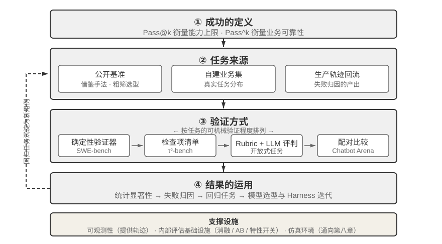
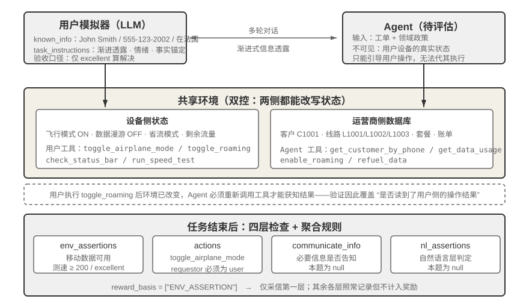
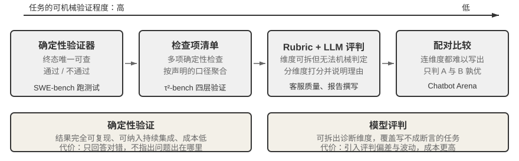
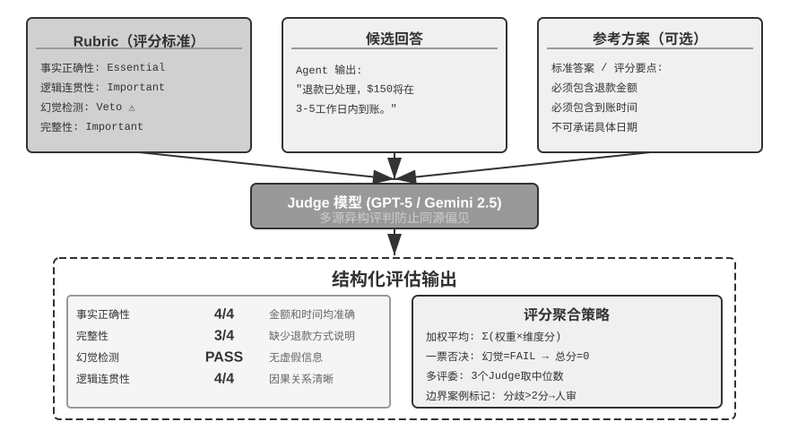
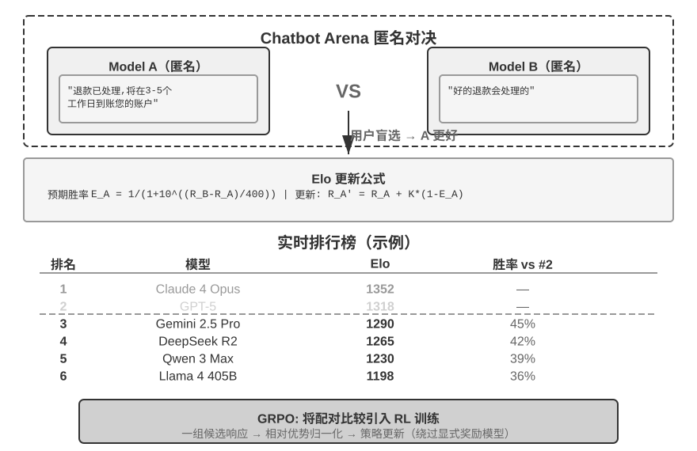
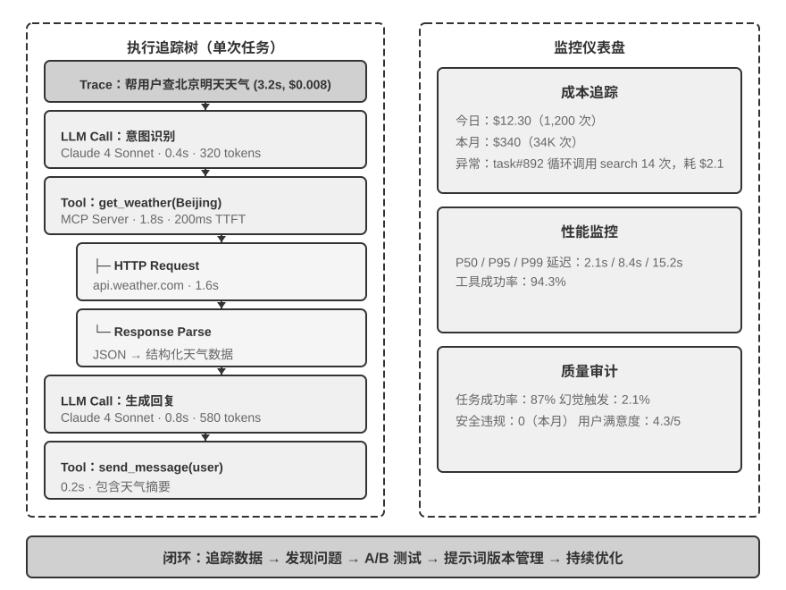
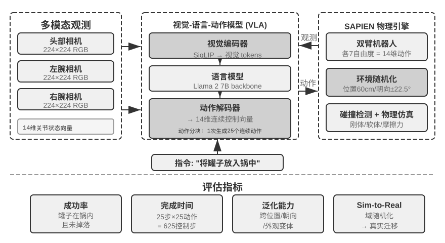

# Agent 的评估

前六章已经展开了单 Agent 的构建：上下文、知识、工具、代码能力以及观察与动作空间。然而，构建完成不等于构建正确；只有能够稳定测量结果，后续的模型训练和系统进化才有可靠方向。

构建 Agent 系统时，开发者面对大量设计选择，而它们往往没有显而易见的正确答案：

- 用什么模型？
- 让模型能调用哪些工具？
- 知识库该存什么数据、以什么结构来构建？
- 用户记忆该怎么做？
- 模型的提示词和 Skills 该如何组织？
- Harness 中需要加上哪些约束？
- 如何把评估结果转化为 Agent 持续进化的学习信号？

评估为我们提供了科学的决策依据：通过系统性的**对比实验**（改变一个变量，观察效果变化）和**消融实验**（逐一关闭某个组件，观察整体性能变化，从而判断该组件的真实贡献），区分真正的能力提升与表面的波动，避免 “捡了芝麻，丢了西瓜”。正如软件工程中 “没有度量就没有改进” 的说法，不建立可重复的评估体系，Agent 的迭代方向就只能靠直觉。

从第一章引入的 Harness 工程视角看，评估在 Harness 中扮演着 “验证” 功能的核心角色。一个关键认识是：**评估的对象不应只是模型，而应是模型与 Harness 的组合体**。同一个模型在不同的 Harness 中可能表现差异悬殊。一些团队仅通过优化 Harness 就显著提升了同一模型在终端类任务上的表现（详见第五章）。这意味着，当 Agent 在评估中表现不佳时，改进方向可能不是换模型，而是优化 Harness 的某个组件（提示词、工具设计、反馈循环）。完善的评估体系应能区分 “模型能力不足” 和 “Harness 设计缺陷” 这两类本质不同的问题。

**区分这两类问题的常见手段是模型替换实验（model swap）**——固定 Harness，只更换更强/更弱的模型，观察分数变化幅度；如果换强模型分数不涨，说明瓶颈在 Harness；如果换弱模型分数大跌、分数随模型能力大幅波动，最直接的解读就是瓶颈在模型能力本身、当前表现主要由模型决定（至于这是因为任务本身就难，还是 Harness 过度依赖模型先验，则需进一步分析）。注意这与前面提到的 “消融实验” 是两种不同的方法：消融是**关闭 Harness 的某个组件**看整体性能如何变化，模型替换则是**固定 Harness、只换模型**——前者定位 Harness 内部哪个部件重要，后者区分瓶颈在模型还是在 Harness。

评估体系的价值在模型快速演进的时代更加凸显。模型能力仍在快速演进，但新模型在公开基准上表现更好，并不意味着在你的特定任务上也更好，反而可能出现性能退化（regression，即新版本在某些方面不如旧版本）。只有在自己的评估数据集上完整测试，才能做出数据驱动的升级决策。更进一步，完善的评估体系使得 **“为未来的模型开发产品”** 成为可行策略——即使当前模型不足以支撑商用，也可以先完成产品开发并建立评估集，持续追踪新模型的表现，一旦达到门槛就立即上线。

一套评估体系可以拆成四个环节：什么算成功、任务从何而来、由谁验证、分数如何转化为决策，如图7-1 所示。



## 一条评估任务的解剖：τ²-bench 的 telecom 领域

我们先完整解剖 τ²-bench 的 telecom 领域一条真实任务。τ²-bench 是 Sierra 的开源项目，按照 `chapter7/tau2-bench-eval/README.md` 中的命令克隆到本地后，打开任务文件 `data/tau2/domains/telecom/tasks_small.json`。

### 任务定义的四个组成部分

以下是该文件中的一条任务，为便于阅读做了删节。

```jsonc
{
  "id": "[mobile_data_issue]airplane_mode_on|user_abroad_roaming_enabled_off",

  // 提供给 Agent 的工单
  "ticket": "用户手机无法上网，状态栏显示 'No Service'。客户 John Smith，
             号码 555-123-2002，当前在法国。速度测试结果为 excellent 才算解决。
             不更换套餐，必要时愿意充值 2.0 GB 流量。",

  // 提供给用户模拟器的行为规范
  "user_scenario": { "instructions": {
      "known_info": "You are John Smith with phone number 555-123-2002.
                     You are currently abroad in France.",
      "unknown_info": null,
      "task_instructions":
        "…express mild frustration after the first unsuccessful attempt.
         You will consider the issue resolved only when speed test returns
         excellent internet speed and nothing else. If it returns poor, fair
         or good, you will not consider the issue resolved.
         Whenever the agent asks you about your device, always ground your
         responses on the results of tool calls. …
         Never make up the results of tool calls."
  }},

  // 运行前将两侧状态重置到同一起点
  "initial_state": { "initialization_actions": [
      { "env_type": "user",      "func_name": "turn_airplane_mode_on" },
      { "env_type": "user",      "func_name": "turn_roaming_off" },
      { "env_type": "assistant", "func_name": "enable_roaming",
        "arguments": { "customer_id": "C1001", "line_id": "L1002" } }
  ]},

  // 评分标准
  "evaluation_criteria": {
      "actions": [
        { "requestor": "user", "name": "toggle_airplane_mode" },
        { "requestor": "user", "name": "toggle_roaming" }
      ],
      "env_assertions": [
        { "func_name": "assert_mobile_data_status", "expected_status": true },
        { "func_name": "assert_internet_speed",
          "expected_speed": 200, "expected_desc": "excellent" }
      ],
      "communicate_info": null,
      "nl_assertions": null,
      "reward_basis": ["ENV_ASSERTION"]
  }
}
```

这段定义中有四处设计值得说明：

**显式建模用户的认知边界。** `known_info` 仅包含姓名、号码与所在国家三项信息。飞行模式开启、数据漫游关闭这两项真正的故障原因不在其中——用户并不知情，因而无法主动陈述，Agent 只能通过提问和引导用户查询来获取。这就是**渐进式信息透露（Progressive Information Disclosure）** 在任务定义层面的实现方式：它并非依靠一句 “不要一次说完” 的提示词去约束模拟器，而是将用户的知识范围建模为一个独立字段。多数基准在任务开始时即给出完整需求，而真实用户的初始表述往往只是 “我上不了网”。将需求澄清到可执行的程度，本身就是 Agent 必须具备的能力之一。

**防止用户模拟器被 Agent 忽悠。** `task_instructions` 包含三类约束：情绪设定（首次修复失败后应表现出轻度不满）、验收口径（仅当测速结果为 excellent 时才认定问题解决，poor、fair、good 均不接受）、以及**事实锚定（Grounding）** 要求，即关于设备状态的任何回答都必须以工具返回结果为依据。缺少事实锚定约束时，模拟用户会顺应 Agent 的引导确认问题已解决，评估随之退化为两个模型之间的相互确认。

**模拟用户和 Agent 都不具备完全信息。** 飞行模式与漫游开关属于用户侧，运营商侧的 `enable_roaming` 属于 Agent 侧。这一划分决定了故障的形态——运营商侧漫游已开通，用户设备侧却处于关闭状态，Agent 查询数据库只能得到 “配置正常” 的结论。故障位于数据库不可见的一侧，只有引导用户查询才能发现。

**多个维度的过程和结果校验。** `env_assertions` 检验终态（移动数据可用、测速达 200 Mbps 以上且评级为 excellent），`actions` 检验关键动作是否发生，`communicate_info` 与 `nl_assertions` 检验必要信息是否已告知用户。每个任务可以检查四个维度中一个或多个维度的结果。

### 一次真实运行的轨迹

下面请读者运行 τ²-bench telecom 领域的评估任务，实际观察任务设计、用户模拟器的设计、过程和结果校验逻辑，并观察 Agent 的执行轨迹，分析 Agent 为何失败。

> **实验 7-1 ★：运行 τ²-bench 并对比 τ-bench 的演进**
>
> 本实验通过运行 τ²-bench 评估框架，理解人机交互型评估环境的设计要点。首先按本节的路径通读任务定义文件：每条任务包含已知信息、任务指令、初始状态与成功条件四个部分。随后运行完整评估流程，观察用户模拟器与 Agent 的多轮对话，分析典型失败模式（政策违规、信息遗漏、过度转接人工等）。
>
> 

配套仓库保留了一次运行记录（`chapter7/tau2-bench-eval`），下面分析其中一条成功的运行记录：

前十余轮为账户识别阶段。Agent 依据号码查得客户 C1001，随后逐一查询 L1001、L1002、L1003 三条线路的流量，又回头询问用户在法国实际使用的号码。第 17 条消息中它给出了一个错误结论：

> **Agent**（17）：号码 555-123-2002 不在您的活跃线路中，最接近的是 555-123-2001……

该结论仅基于 L1001 一条线路的查询结果。用户坚持号码无误后，Agent 继续查询 L1002，方才对应上。关键转折出现在第 30 条：

> **用户**（30）→ 调用 `check_network_status()`、`check_status_bar()`
>
> **工具返回**（31）：`Airplane Mode: ON | Cellular Connection: no_service | Mobile Data Enabled: Yes | Data Roaming Enabled: No`
>
> **用户**（33）：我看到手机当前处于飞行模式，因此没有信号。移动数据是开启的，但数据漫游是关闭的。需要我关掉飞行模式试一下吗？

发出工具调用的是**用户**而非 Agent。这就是**双控（Dual-Control）** 机制：模拟用户拥有一套独立的工具集，如 `check_status_bar`、`toggle_airplane_mode`、`reseat_sim_card`、`run_speed_test` 等。

其后的排查较为顺利：Agent 要求用户关闭飞行模式并开启漫游，用户执行相应操作（35、37），状态栏转为 5G 满格；Agent 要求测速，返回 275 Mbps、评级 Excellent（46），用户确认问题解决。两条 `env_assertions` 均通过，`reward = 1.0`。

这条满分轨迹中还包含一处未被验证器捕获的问题。telecom 的 Agent 政策首段即规定 “You should only make one tool call at a time”，而第 4 条消息中 Agent 一次发出了 `get_customer_by_phone` 与 `get_customer_by_name` 两个调用。验证器没有因此判定出错，原因在于本题的 `reward_basis` 只考虑最终状态。这并非 τ²-bench 的疏漏，而是二元奖励的固有代价：它以过程颗粒度换取跨模型可比的单一数字。但生产环境中的评估系统往往需要更多：不仅要判定对错，还要指出问题出在哪里。

失败的那条任务同样具有分析价值。用户号码为 555-123-2002，Agent 却选定 L1001 线路，并以其 3.2/5 GB 的用量为依据继续推进。期间 `get_details_by_id(L1001)` 明确返回该线路号码为 555-123-2001，Agent 读取了这一结果却未修正判断，此后在无关排查上消耗数十条消息，最终转接人工。它实际完成了任务的一半——引导用户关闭了省流模式，该用户侧动作真实发生并被环境验证；但线路选择错误导致所需的 2 GB 流量充值未执行，三条终态断言全部失败。这一失败形态与后文 “失败归因” 一节讨论的 AndroidWorld 案例高度相似：修正判断所需的证据已进入上下文，Agent 未据此回溯。

这条任务已经把一个评估集必须回答的问题摆全了：什么算成功、任务从何而来、由谁验证、分数如何转化为决策。以下几节依次展开。

## 评估指标：成功的定义

上一节的评估结果是五条任务通过四条。仅凭 0.8 这个数字无法判断该系统是否可用。若它对应的是一个退款客服，则意味着每五名用户中就有一人未能拿到应得的退款；若它对应的是一个用于挖掘漏洞的安全 Agent，五次中命中四次已属相当可观。差别在于业务场景对成功率有多高的要求。

### 技术奇观：用 Pass@k 看能力上限

当前许多模型和 Agent 仍处在一个可以称为 **“技术奇观”** 的阶段。这里的 “奇观” 是指在大量尝试、充足时间和人工筛选下展示出的能力上限：只要其中一次成功，就足以证明 “这件事原则上做得到”。这正是 **Pass@k** 的逻辑——在同一任务上运行 $k$ 次，只要至少有一次通过，任务就算通过；如果输出是连续得分，则取最好的一次，记为 **Best@k**。

Anthropic 对长时运行 Agent 的讨论体现了这类能力上限。例如，让 Agent 自主工作一周，从头写出一个 C 编译器；或者持续探索，直到找到一个重要数学猜想的反例；又或者反复审查开源软件，发现已经存在几十年的重大安全漏洞。

对这类工程与科研探索，展示的通常不是“每次都做对”，而是把探索预算拉长后终于出现一条突破性轨迹。对于科研发现、漏洞挖掘、开放式创作等任务，这种能力上限本身就很有价值：人类可以从 $k$ 条候选轨迹中挑出那一条最好的。

除了基座模型，很多应用公司也在使用 “技术奇观” 策略。Manus 之所以引发广泛关注，是因为它提供了一个虚拟电脑，让此前对 Agent 没有直观概念的人发现 AI 可以像人一样操作电脑，持续工作半小时甚至一小时，逐步完成复杂的任务。

OpenClaw 则让很多人第一次感受到 Agent 的 “活人感”。用户可以像给真人安排工作一样，通过即时通讯软件给它分配任务；它可以访问电脑上的所有文件和在线服务，工作到一定阶段会主动反馈或向用户索取新信息，甚至能够主动唤醒自己去查询和处理邮件。

早期的 Manus 和 OpenClaw 在完成复杂任务时的成功率并不高，token 成本也非常高。但由于这些 Agent 框架具有通用性，使用最强模型时，复杂任务往往有较高的 Pass@k，展现出较高的技术上限。这些 “技术奇观” 在社交网络上被大量分享，是这些 Agent 产品成功的关键。

### 业务可靠性：关注 Pass^k

真实业务通常更关心另一件事：在多次尝试中一次错都不能犯。我们把这个目标称为 **Pass^k**（可以读作 **Pass consecutive k**）：同一任务连续运行 $k$ 次，要求每一次都通过，且不能触发安全、合规或幻觉等一票否决项。它回答的是“Agent 能否稳定可靠地交付”，而不是 “能否偶尔创造奇迹”。

若每次运行相互独立、单次成功率为 $p$，两类指标的关系很直观：

$$
\mathrm{Pass@k}=1-(1-p)^k,\qquad
\mathrm{Pass}^{k}=p^k.
$$

例如单次成功率 $p=0.6$ 时，$k=5$：Pass@5 $=1-0.4^5\approx99.0\%$，看起来几乎总能 “至少成功一次”；但 Pass^5 $=0.6^5\approx7.8\%$，说明连续五次都不出错仍然很难。前一个数字适合衡量探索时的能力天花板，后一个数字才接近支付、退款、权限变更、生产部署等场景的可靠性要求。

评估报告必须写清 $k$ 次尝试的口径：是同一任务的 $k$ 次独立采样，还是生产流水线上连续 $k$ 个任务。对于会产生副作用的操作，不能简单地 “重试直到成功”，而应在沙盒或可回滚环境中采样，并把每一次失败都记入可靠性指标。

## 评估环境

明确了指标口径，接下来的问题是在哪里测。评估环境是一套能够重复运行的装置：给定同一个初始状态，同一个 Agent 应当得到可比较的结果。

### 五个组成要素

回到前面解剖的那条 telecom 任务。以它为参照，一个可重复运行的评估环境所需的组成部分已经完备。

**数据集（Dataset）** 即任务文件本身：初始状态、给 Agent 的工单、给模拟器的行为规范与验收标准打包为一条记录，一条记录即一个用例。

**环境状态（Environment State）** 是任务执行中的可变信息：数据库中的客户、线路、套餐与账单，加上设备侧的飞行模式、漫游、省流开关与剩余流量。它必须可重置，`initialization_actions` 即重置脚本。真实性要求状态变化符合业务逻辑，可控性要求每次运行前都能回到同一起点。

**工具接口（Tools）** 分属两侧。Agent 可调用查询客户、查询用量、充值流量、转接人工等运营商侧操作；用户可调用设备侧的各项开关。两套工具均为原子操作，不存在 “解决用户的上网问题” 这类高层抽象——抽象层次过高会使评估退化为对单次函数调用的考察，规划与推理环节被工具本身吸收。

**评分标准（Rubric）** 即 `evaluation_criteria` 的四层检查，加上 `reward_basis` 这一聚合规则。

**执行协议（Interaction Protocol）** 规定交互顺序与终止条件。此处的正常终止信号为模拟用户输出 `###STOP###`，此外还有轮数上限，以及模拟用户因耐心耗尽而主动结束对话——沟通效率过低本身即计为失败。

五个要素缺其一，评估便无法构成可重复的循环。后文考察其他基准时，仍以这五项作为对照框架。

### 人机交互型与工具调用型评估环境

telecom 这类任务必须设置交互对象，五个要素中的用户模拟部分不可或缺。另有一大类任务并不存在对话对方：代码生成、数据分析、数学求解等任务中，Agent 自始至终只与工具交互，正确性由能否通过执行验证决定，既不需要人工标注，也不需要模型评判。这类环境省去了用户模拟器，其余四个要素依然存在，只是形态更简单：环境状态是文件系统或数据库，评分标准是一段测试代码，执行协议退化为 “持续调用工具，直至给出答案或耗尽轮次”。

Verifiers 框架按两个维度对这类环境分层：任务是否需要保持跨轮状态，是否需要隔离。`SingleTurnEnv` 适用于问一道数学题后直接验证答案；`ToolEnv` 适用于搜索多个网页后综合回答再验证最终结果；`StatefulToolEnv` 适用于修改数据库记录后验证状态变化；`SandboxEnv` 适用于在沙盒中运行代码后检查输出文件。表7-1 汇总了这四类环境，便于按任务状态、工具调用和隔离需求进行选择。

表7-1 Verifiers 环境类型对比

| 环境类型 | 状态保持 | 工具调用 | 典型用例 |
|---|---|---|---|
| SingleTurnEnv | 无 | 无 | 单轮问答、数学题 |
| ToolEnv | 无 | 多轮 | 搜索+信息综合 |
| StatefulToolEnv | 有 | 多轮 | 修改数据库记录 |
| SandboxEnv | 有+隔离 | 多轮 | 代码执行与测试 |

该框架支持并行采样与轨迹缓存，每次评估的完整轨迹（观察、行动、奖励）均会保存，便于后续分析与回放。此外，工具的执行效果取决于当前状态，因此失败时应返回清晰的错误信息而非单一的失败标志，使 Agent 能够据此调整策略。

工具调用型评估考察的是可观测状态变更的正确性，人机交互型评估考察的则是沟通策略的合理性——前者验证行动，后者验证引导。两类环境的结构对比见图7-2。


## 评估数据集的设计

评估环境是舞台，数据集是剧本。同样是那五个要素，换一类任务，填法可能完全不同：任务从何而来、验证器能核实到什么深度、如何防止被记忆。本节从几个公开基准的设计实践入手，最后回到一个更实际的问题——自建评估集的任务应当从哪里来。

### 基准设计的横向对照

上一节区分的有无交互对象只是环境层面的第一层差异，数据集层面的分歧更能体现设计取舍。表7-2 将几个常被引用的基准并列。

表7-2 几个 Agent 基准的关键设计选择

| 基准                 | 被测能力               | 任务来源                 | 环境扮演者          | 验证器                                  |
| ------------------ | ------------------ | -------------------- | -------------- | ------------------------------------ |
| τ²-bench           | 客服场景下的人机交互和工具调用    | 人工编写 + 组合生成          | 用户模拟器 + 业务数据库  | 四层检查按 `reward_basis` 聚合为二元           |
| SWE-bench Verified | 软件开发，coding        | GitHub 真实 issue，人工筛选 | 代码仓库 + 测试套件    | FAIL\_TO\_PASS / PASS\_TO\_PASS 双重验证 |
| AndroidWorld       | 操作 Android 手机 GUI  | 参数化模板实例化             | 真实 Android 模拟器 | 最终 UI 状态断言                           |
| OSWorld            | 操作 Linux 桌面 GUI    | 从预置的中间状态启动           | 真实虚拟机          | 134 个独立评估函数                          |
| Terminal-Bench     | 操作 Linux 终端，coding | 人工编写                 | Docker 容器      | 文件系统检查 + 真实执行                        |
| GAIA               | 搜集信息的通用 AI 助手      | 人工编写 + 专有附件          | 开放互联网          | 精确字符串匹配                              |

### 验证器

Agent 很容易写一篇洋洋洒洒的报告，说任务已经全部完成，但事实上根本没有完成。评估框架必须核实机器可独立复核的事实，而非 Agent 的自我陈述。

**SWE-bench Verified 将 “修复完成” 拆解为两个独立命题。** 一组是 FAIL\_TO\_PASS：修复前失败、修复后通过，证明问题确已解决；另一组是 PASS\_TO\_PASS：修复前后均通过，证明未引入新的缺陷。只检验前者，Agent 可以通过删改妨碍通过的断言蒙混；只检验后者，则等同于未作检验。两组同时检验，才使 “已修复” 与 “未破坏” 成为两个各自可证的结论。它还额外确认测试自身的稳定性，排除时而通过时而失败的不稳定测试（flaky test）。

**OSWorld 的验证器能发现表面完成但实质错误的情形。** 它配备 134 个独立评估函数，拥有完整的操作系统访问权限，能够检查文件系统结构、进程状态、网络连接与应用内部状态。在数据库操作任务中，评估脚本不仅确认报告文件存在，还会连接数据库核实 SQL 是否正确执行；在浏览器任务中则会分析 DOM 树、检查 cookie 与 localStorage、向后端发送验证请求确认表单确已生效。

**Terminal-Bench** 的任务 `build-linux-kernel-qemu` 要求从源码构建 Linux 内核 6.9，在 `start_kernel` 中加入自定义 printk，生成 initramfs 并在 QEMU 中运行，成功标准是启动日志中出现该自定义消息。Agent 无法伪造输出，只能真正完成整个流程。

### 任务的难度划分

评估任务集需要包括不同难度的任务。这样，当模型能力提升时，评估任务集不会快速过时。

GAIA 全套 466 题分为三级难度，Level 1 只需一至两个工具（人类 93.9%，GPT-4 30.3%），Level 2 需要多步思考（91.8% 对 9.7%），Level 3 需要复杂组合（87.3% 对 0%）。这一分层不止标注难度，更具备诊断价值：Level 1 失败指向基础工具使用，Level 2 指向多步规划与信息整合，Level 3 指向长序列思考与复杂性管理，三者对应的改进方向各不相同。

Terminal-Bench 涵盖从简单的 mlflow 模型注册，到中等难度的 7z 密码破解，到困难的 git 服务器与 webserver 多组件集成，再到最高难度的 FEAL 差分密码分析。

τ²-bench 还专门设计了**陷阱任务**，即用户声称 “客服已批准取消”，实际并不符合政策，用以检验 Agent 在压力与误导下能否维持正确判断。

### 数据泄漏防范

**GAIA 使答案无法从互联网直接检索。** 它的任务概念简单而路径开放，例如从某一特定日期的 NASA 每日天文图片出发，识别图中宇航员，查出其所属的宇航员组，再计算该组中在太空停留时间最短者，并严格按 “姓氏，分号分隔，千位分隔符” 的格式输出。答案高度具体，正确与否通过精确字符串匹配判定。防泄漏依靠两点：其一，问题必须组合多个信息源才能作答，单一网页无法直接给出答案；其二，部分任务配有专门制作的附件（互联网上不存在的 PDF、音频、图片）。

**AndroidWorld 以单个模板派生大量实例。** 其任务并非静态文本，而是可动态实例化的模板，例如 “将联系人 `[CONTACT_NAME]` 的电话改为 `[NEW_PHONE]`”，每次评估随机生成参数值。这带来三方面收益：参数每次不同，回放固定操作序列失效；单个模板可生成近乎无限的实例；固定部分参数、只改变其余参数，可精确测量特定因素的影响。

**Terminal-Bench 在题面中嵌入金丝雀标识符。** 每道题携带一个 canary GUID，若模型能够输出含该 GUID 的内容，即说明基准数据已进入训练集。它不阻止数据泄漏，但使泄漏可被检测。

### 质量控制与长期维护

做一个高质量的评估集是非常困难的。上面几个基准测试的现行形态，多数是在初版投入使用、暴露问题之后逐轮修补的结果。例如，从 τ-bench 到 τ²-bench 有五处重新设计的地方：

其一，**任务指令过于笼统，导致答案可被猜测**。初版的任务指令写得宽泛，模型无需真正澄清需求，凭常识推测一套流程也能通过。τ²-bench 将剧本拆分为 `known_info` 与 `task_instructions` 两栏：前者界定用户知悉的范围，后者规定透露方式。用户不知悉的信息 Agent 无从推测，只能通过查询获得。

其二，**成功条件不够精确，导致验证误判**。“网络已恢复” 这类条件缺乏可核实的边界。τ²-bench 将其改为 “测速结果为 excellent 才算解决，poor、fair、good 均不接受”。这一改动针对的是**敷衍性修复**，即压制症状而不解决根因。

其三，**用户模拟器行为过于机械**。初版的模拟用户仅作被动应答。τ²-bench 为其补充了情绪（首次修复失败后表现出不满）、耐心上限（沟通效率过低时终止对话）以及事实锚定要求。三者共同作用，使模拟器在接近真实用户的同时仍保持可复现。

其四，**用户不仅参与对话，也参与操作**。telecom 领域引入了双控环境。此前的评估中只有 Agent 能够改变环境，而在技术支持这类场景中，相当一部分动作本应由用户在自有设备上完成。双控同时为验证增加了一个维度：用户改变状态后，Agent 必须重新调用工具才能获知结果，验证因此覆盖了 “Agent 是否真的读到了用户侧的操作结果”。

其五，**任务实例动态生成**。τ²-bench 的具体实例（用户姓名、号码、故障组合）可参数化批量生成，这同时改善了覆盖率与抗泄漏能力。

**SWE-bench Verified：发布前淘汰 71% 的原始任务。** OpenAI 从原始 2294 个任务中随机抽取 1699 个进行人工评估，招募 93 名精通 Python 的开发者逐条检查：问题描述是否清晰、测试用例是否覆盖边界条件、测试是否稳定、参考 patch 是否引入新错误、难度是否合理。最终仅 500 个通过。高淘汰率带来的是更高的信噪比，评估成本也下降约 80%。复杂 Agent 任务动辄需要数分钟至数小时，使用前沿模型完整跑完一个评估数据集往往需要数千美元的 token 成本，降低评估成本非常重要。

**OSWorld：发布后 15 个月中暴露出 300 余个问题。** 它于 2024 年 4 月发布后迅速成为多模态 Agent 评估的重要基准，随后在广泛使用中暴露出四类问题：环境问题（网站反爬、CAPTCHA、动态内容变化）、任务描述问题（表述存在歧义）、验证逻辑问题（过严或过松）、初始状态问题（配置不完整）。香港大学团队组建约 10 人的小组，与 MoonShot AI、OpenAI、ByteDance Seed TARS、Anthropic、Simular 等深度合作两个月进行系统性修复：环境问题通过锁定版本和离线备份解决，描述问题通过改写歧义表述消除，验证问题通过人工建立正确基线并调整条件解决，初始状态问题通过增加完整性校验缓解。

> **实验 7-2 ★：人肉执行基准测试任务**
>
> 从 GAIA、AndroidWorld、SWE-Bench Verified、Terminal-Bench、OSWorld-Verified 中挑选任务亲手完成，每个数据集建议完成简单、中等、困难各一个。“困难” 级别对人类同样具有挑战。
>
> 完成后回答两个问题：该任务的描述是否存在多种合理解释，若存在，验证器认可哪一种？若试图蒙混过关，成本最低的路径是什么，验证器能否拦截？

### 评估集的三个来源

一种常见的看法是，公开基准服务于模型排名，与实际业务关联有限。公开基准的分数确实难以直接指导产品决策，但其设计手法具有充分的可迁移性。前面讨论的验证深度、参数化生成、泄漏防范与质量维护，恰是自建评估集最容易疏漏的几处。

生产环境中的评估集通常有三个来源。

**公开基准**用于粗筛模型与借鉴设计手法，一般不用于产品决策。它的任务分布与实际业务的任务分布并不一致，在 GAIA 上提升两个百分点，与退款成功率之间不存在必然关系。

**自建业务集**覆盖真实的任务分布，可以作为模型选型、Harness 设计决策的依据。例如，τ²-bench 可以作为需要仿真用户的评估系统骨架，替换领域数据与工具集即可。

**生产轨迹回流**来自线上的真实失败用例：用户明确纠正、用户点踩，以及事后通过状态检查、规则验证器或 LLM 评审发现的问题案例，经失败归因后沉淀为回归用例。具体做法见后文 “失败归因” 与 “端到端回归任务与轨迹前缀回归任务” 两节。这一来源成本最高，准确性也最高，因为它直接来自用户实际遇到的问题。

起步阶段通常只有公开基准与少量手写的自建业务集；系统上线运行一段时间后，生产轨迹回流的用例会成为主体。

## 自动化评估方法

前面几节讨论的基准测试有一个共同点：验证器几乎都是确定性的。SWE-bench 运行测试套件，AndroidWorld 断言最终 UI 状态，GAIA 做精确字符串匹配，τ²-bench 的四层检查同样全部由代码执行。这一选择有充分理由：确定性验证不引入额外的模型开销，结果完全可复现，可以像单元测试一样纳入持续集成，也便于在不同模型之间排名。

代价是它只能评估最终结果对不对，但不能给出错误原因。τ²-bench 那条失败的任务最终得 0 分，而这个 0 分不会说明 Agent 是在线路选择环节出错、还是漏掉了流量充值步骤，更不会指出下一步该改什么。对于用于排名的公开基准，这不构成缺陷；对于需要持续改进的生产系统，这恰恰是最需要的信息。

生产场景还有另一重困难：许多判断根本无法写成代码可检查的断言。一封投诉回复是否得体，一份调研报告是否遗漏了关键信息，一次记忆检索是否弄错了人物关系，这些既没有唯一终态可供查询，也无法靠关键词匹配来判定。

因此，从公开基准测试走向生产环境中的评估，验证方式需要沿一条谱系向右移动，其横轴是任务的**可机械验证程度**，如图7-4 所示。



谱系右侧的两件工具因此成为生产评估的主体：用 **Rubric** 把笼统的 “好不好” 拆成若干个可分别打分的维度，用 **LLM-as-a-Judge** 在缺乏确定性判据时完成打分。二者合起来，才能把一个笼统的失败率还原为可着手修复的具体问题；再配合本节后半部分的**失败归因**，构成生产 Agent 评估的完整闭环。

需要说明的是，向右移动并不意味着放弃左侧。凡是能写成程序化断言的检查都应当继续用断言，LLM 评判只用于确实无法机械判定的维度。确定性检查更便宜、更稳定，也更适合作为回归测试长期运行。

### LLM-as-a-Judge：自动化评估的核心



为什么需要 LLM-as-a-Judge？对于开放式任务（如生成报告、处理客户投诉、创意内容），没有标准答案可以自动对比，人工评估成本高且难以规模化。LLM-as-a-Judge 通过让语言模型根据专家定义的评分标准（Rubric）进行评判，在自动化规模和人类专业判断之间取得了平衡。

但这种方法也有已知的局限：评判模型可能有自己的偏见，相同输入多次评判也可能有波动。最典型的是**长度偏差**，即倾向于给更长、更详尽的回复打高分，哪怕内容并不更正确。就像人类考试时对不会的题就长篇大论的回答，期望能 “蒙对” 一两个点。常用防范手段有三种：在 Rubric 里显式惩罚冗长、对同类任务规定回答的长度上限；做配对比较时先把两个候选的长度控制到相近再评；以及定期审计评分与回答长度的相关性——如果高分几乎总是伴随长回答，就说明评判已被长度带偏，需要回炉修订 Rubric。为了系统性地应对这些挑战，Rubric 设计必须遵循以下准则：

**Rubric（评分标准）：LLM 评判的依据。**

**Rubric 四准则**（Scale AI，“Rubrics as Rewards”）：

（1）**基于专家指导**——必须反映领域知识，捕捉核心事实和推理步骤。比如医疗问答的 Rubric 需包含诊断标准和必须避免的医学错误，缺乏专业基础的 Rubric 只能捕捉语言流畅度等表面特征。

（2）**全面覆盖**——涵盖事实准确性、逻辑连贯性、完整性、安全性，而且不仅定义正面标准，还要明确**陷阱（Pitfall）**——即高风险的常见错误，如医疗建议中推荐未经验证的疗法。

（3）**按重要性加权**——分为必要项（Essential）、重要项、可选项、陷阱项。支持**一票否决机制（Veto）**：比如在客服场景中，幻觉（编造虚假信息）是典型的否决维度——无论其他维度表现多优秀，只要出现虚假信息就必须否决。这也有助于防范关键词堆砌式的奖励作弊。

（4）**评价标准自包含**——每个评价项独立可操作，不依赖评价者的领域知识。要避免“回应展示了深刻理解”这种抽象标准，改为“引用了至少两个权威理论并准确解释如何支持结论”这种可验证的标准。

关键实践：为每个维度定义客观可验证的评分档次，提供具体示例和**边界案例**帮助区分模糊情况。要主动防范**奖励作弊（Reward Hacking）**——即 Agent 找到了获取高分的“捷径”却没有真正完成任务——明确惩罚幻觉、讨好用户、关键词堆砌、回避棘手问题。Rubric 需要不断迭代：通过试用收集评价者的分歧并逐步完善，最终从抽象准则演化为详尽的判例集。

以用户记忆 Agent 为例，展示一个符合四准则的完整 Rubric。测试问题：“我女儿的儿科医生是谁？”（答案需要跨两次对话关联：第一次对话提到“女儿叫 Lily”，第二次提到“带 Lily 去看了 Dr. Chen”）。

```yaml
rubric:
  dimensions:
    - name: 事实正确性
      weight: essential        # 必要项
      scoring:
        4_优秀: "准确回答 Dr. Chen，且关联到女儿 Lily"
        3_良好: "准确回答 Dr. Chen，但未提及是 Lily 的医生"
        2_及格: "给出了正确医生但附带不确定的额外信息"
        1_不及格: "给出错误医生名，或回答不知道"

    - name: 信息完整性
      weight: important        # 重要项
      scoring:
        4_优秀: "主动补充相关信息（如上次就诊时间、诊断结果）"
        3_良好: "回答了核心问题，无遗漏"
        2_及格: "回答了核心问题，但遗漏了可用的关联信息"
        1_不及格: "关键信息缺失"

    - name: 思考正确性
      weight: important
      scoring:
        4_优秀: "正确关联'女儿=Lily'和'Lily的医生=Dr. Chen'两条跨会话信息"
        3_良好: "关联正确但思考路径不够清晰"
        2_及格: "部分关联正确"
        1_不及格: "错误关联（如把用户自己的医生当成女儿的医生）"

    - name: 幻觉检测
      weight: veto             # 一票否决项：一旦触发，总分归零
      scoring:
        pass: "所有信息均可溯源到历史对话记录"
        fail: "编造了对话中不存在的信息（如虚构就诊日期、诊断结果）"

  edge_cases:
    - "如果用户有多个女儿且分别看不同的医生，应追问是哪个女儿"
    - "如果记忆中同时存在'Dr. Chen'和'陈医生'，应识别为同一人"
```

**好的 Rubric vs 坏的 Rubric**：上面每个评分档都给出了可验证的具体行为（“准确回答 Dr. Chen”），而非“展示了对记忆的深刻理解”这类无法客观判定的描述。一票否决项明确了底线：即使其他维度全部满分，一旦出现幻觉就直接判零分。

将这个 Rubric 和 Agent 的实际回答一起交给评判模型，模型会逐项打分并说明理由。把几十个用例的结果汇总起来，再回看其中的低分轨迹，原本笼统的“成功率下降”就能拆成几类具体问题：是没检索到信息，还是把人物关系想错了，抑或补充了没有依据的内容。这样一来，Rubric 不只告诉我们“得了多少分”，还会告诉我们下一步该改哪里。

下面以用户记忆为一个具体案例，展示如何把这套通用方法落到可执行的评估集和验证器上。

> **实验 7-3 ★★：构建基于 Rubric 的用户记忆评估系统**
>
> 本实验要求改造第三章的 `chapter3/user-memory-evaluation` 框架，将当前基于简单 LLM-as-a-Judge 的评分机制升级为结构化的多维度 Rubric 评估系统。现有系统使用单一 LLM 调用返回通过/失败加评估理由，缺乏结构化的诊断能力。
>
> 设计统一的多维度 Rubric 框架，适用于所有三层任务。评价维度包括：事实正确性（Precision，精确率——在所有给出的信息中，有多少是正确的），用于验证数字、日期和名称是否与记忆信息一致；事实完整性（Recall，召回率——在所有应该给出的信息中，有多少被提及），用于验证是否提供了所有相关信息而非遗漏关键内容；思考正确性，用于检查是否正确理解了信息间的关系和隐含逻辑；思考主动性，用于评估是否在适当时候提供超出直接回答的建议或风险提醒；幻觉检测，用于确保未编造记忆中不存在的信息。
>
> 四档制评分（优秀/良好/及格/不及格），每档配具体判定标准而非抽象描述。幻觉维度设为一票否决项。为每个维度提供示例和边界案例。

> **实验 7-4 ★★：Advanced JSON Cards 与 RAG 的对比评估**
>
> **目标**：在同一套评估集上公平对比结构化记忆与非结构化检索的优势边界。复用两个第三章项目，在 `chapter3/user-memory-evaluation` 的 60 个测试用例上对比三种配置——纯 Advanced JSON Cards（结构化卡片常驻上下文、无需检索）、纯 RAG（对话分块入向量库、必须检索）、混合系统（核心事实常驻 + 原始对话按需检索）。

配套实验用同一组 60 个问题测试了三套记忆方案，共保留 180 条真实 API 运行轨迹。结果见表7-3。

表7-3 三种用户记忆系统的分层成功率

| 系统                  | 基础回忆 | 多会话消歧 | 跨会话隐藏关联 |           总体 |
| ------------------- | ---: | ----: | ------: | -----------: |
| Advanced JSON Cards |  95% |   60% |     50% | 68.3%（41/60） |
| RAG                 |  90% |   40% |     15% | 48.3%（29/60） |
| 混合系统                |  80% |   70% |     50% | 66.7%（40/60） |

最值得注意的是，混合方案并没有自然胜出。它在 3 道题上做到了两种单一方案都没做到的事，却在另外 8 道题上不如表现更好的单一方案；与每道题上的最佳单一方案相比，平均成功率反而低了。纯 RAG 在基础回忆题上与结构化卡片相差不大，一到跨会话关联题，成功率却降到 15%。另一个容易被忽视的数字是：180 次评判中，幻觉否决触发了 28 次，可见一票否决项的重要性。

**同源模型问题与多源评判。**

当 Agent 与评判模型来自同一家族时，Agent 可能学会利用评判模型的偏好和盲点。

**这正是古德哈特定律（Goodhart's Law）所说的：当一个度量指标变成优化目标时，它就不再是好的度量指标。** Agent 越是在某个评分系统上训练或调优，就越倾向于钻这个系统的漏洞，而非真正提升能力。

更隐蔽的是，Agent 还会逐渐学会避开评判模型不擅长检测的错误类型，让评分系统看起来一切正常。

缓解策略是**多源异构评判**——使用不同模型家族的多个 LLM 分别评判（比如 Agent 用 Claude，评判就用 GPT-5 和 Gemini），不同家族的偏见往往是正交的，Agent 很难同时“欺骗”所有评判者。使用相同的 Rubric 确保大家评判的是同一目标，通过加权平均或一致性检查聚合结果。部署阶段可以用单一模型快速评估，但应定期用完整的多源评判进行质量审计。

多源评判解决的是“用什么模型评判”的问题；接下来要解决“评判哪些模态”的问题——把 LLM-as-a-Judge 的能力从文本扩展到语音、图像、视频，是评估覆盖度的另一维度。

**多模态 LLM-as-a-Judge。**

多模态评判将 LLM-as-a-Judge 扩展到语音、图像、视频领域，例如：

- **TTS 评估**（TTS 即 Text-to-Speech，文本转语音）：判断准确性、自然度、音色一致度、情感表达。这些维度能发现传统 WER（Word Error Rate，词错误率）难以捕捉的韵律问题。
- **ASR 评估**（ASR 即 Automatic Speech Recognition，语音识别）：做语义影响判断——“今天天气”识别错误无伤大雅，但“转账一千”变成“一万”就可能造成严重后果。
- **UI 评估**：采用第一章命名的**提议者—审核者**模式，检查文字溢出、颜色对比度、按钮位置等问题。这里的提议者-审核者作为**评估方法**使用，与第五章中作为**生成系统组件**的用法不同，但核心机制相同——一个模型生成，另一个模型独立审查。
- **视频剪辑评估**：通过关键帧验证剪辑起止点和特效应用是否正确。

> **实验 7-5 ★★：构建全自动 TTS 质量评估流水线**
>
> 本实验要求从零设计并实现完整的多模态 LLM-as-a-Judge TTS 质量评估系统。
>
> 设计 TTS 多维度 Rubric：准确性维度验证是否正确读出所有文字（无遗漏/错读/添加），自然度维度评估语音是否流畅（有无机器感、不自然停顿，韵律是否符合人类习惯），情感表达维度检查语气是否符合文本情感色彩（疑问句升调、感叹句强调、悲伤内容语速慢语调低），音色一致性维度在有参考语音时评估说话人相似程度（多模态模型同时接收参考语音与合成语音对比）。
>
> 构建多样化测试语料库：不同长度（单句→长段落）、文体（新闻/故事/对话）、情感（中性/兴奋/悲伤）、特殊挑战（数字/专有名词/多音字/方言词汇）。实现评估流水线：TTS 生成模块接入主流服务（OpenAI、ElevenLabs、Fish Audio、Minimax、豆包），由可直接接收音频的多模态评判模型将合成语音、原始文本、参考语音和 Rubric 一起输入，逐维度评分并给出详细理由。分析评估结果的分布，同时记录评判模型、参考音频哈希和候选音频哈希，使结果可复核。
>

配套仓库中保留了一次小规模的直接听评。OpenAI 和 Fish Audio 分别生成了数字、多音字、长句和兴奋语气四类音频，8 条音频都由 Voxtral 按上述四个维度完成评分。两者在准确性和自然度上都得到 5.00 和 4.00；Fish Audio 在情感表达和音色一致性上得到 4.00 和 3.00，OpenAI 则是 3.75 和 2.75。四个维度分开评分后，即使“有没有读对”看不出差别，语气和音色上的差别仍会显现出来。

但这组分数还不能用来判断哪家 TTS 更好。每家只有四条音频，更关键的是，实验使用的固定参考音频来自 Fish S1；拿它来比较音色，本来就更有利于 Fish Audio。如果要比较通用 TTS，就不该把“像不像 Fish 参考音色”算进总分；如果要比较声音克隆，则应让所有方案模仿同一个目标说话人，并用人工盲听校准模型评分。**选什么参考答案、参考图片或参考音频，本身就是评估设计，而不是评估开始前无关紧要的准备工作。**

人工编写 Rubric 适合快速建立这样的诊断维度。评估规模再扩大时，还可以训练专门的**生成式奖励模型**来自动打分——相关训练方法将在第八章讨论。

评判模型给出的分数只说明结果好坏；要把结果变成可以修复的问题，还需要定位失败究竟从哪一步开始。

### 失败归因：从整条轨迹定位首个错误

端到端评估通常只给出“成功”或“失败”，却没有回答“为什么失败、从哪一步开始失败”。要让评估结果真正驱动修复，必须对每条失败轨迹进行**失败归因（failure attribution）**：标出主要错误类别、首次出现不可接受行为的步骤、对应的工具调用或模型输出，并附上可复核的证据。归因对象是轨迹中的**首个导致任务偏离的错误**，后续错误往往只是连锁反应，不能把最后一个报错简单当成根因。

生产 Agent 的问题案例通常来自三类信号：**用户明确纠正（“不要这么做”）、用户点踩或给出负面反馈，以及事后通过状态检查、规则验证器或 LLM 评审发现 Agent 做了不该做的事情**。

构建失败归因系统需要开发者耐心阅读并分析生产 Agent 的问题轨迹。这个过程可以借助 LLM，但不能完全依赖 LLM，因为**失败归因往往反映了产品问题**，不止是技术问题。

随着产品不断完善，错误分类可能包含多个大类，每个大类下又有多个小类，最终多达数百种。这些错误类别和归因方式可以作为归因标注 Agent 的提示词或 Skill。

以 Coding Agent 为例，一个实用的初始分类如下。

| 错误类别       | 典型表现                                                         | 首个错误的定位方式                                                           |
| ---------- | ------------------------------------------------------------ | ------------------------------------------------------------------- |
| 需求理解与歧义处理  | 做出来的不是用户要的：漏掉需求里的一个条件、把范围理解宽了或窄了；仓库里有两个同名配置文件时直接选一个，既不说明也不追问 | 用 LLM 把原始需求与 Agent **实际做的事**（动作序列）逐条对照，先定位第一处偏离，再回溯到造成它的那次工具调用或那句答复 |
| 流程与规范缺失    | 未执行单元测试就提交；未写 Plan 就开始改代码；引入外部依赖而仓库已有内部等价物；绕过既定架构约定          | 找到第一次违反软件开发流程约定的动作，例如首次 `git commit`、首次写文件；回看它之前有没有读过约定来源           |
| 工具调用错误     | 同一文件反复编辑失败；JSON/schema 或参数格式错误；特殊字符导致抄写、转义或写入错误              | 记录第一次失败的编辑/工具及原始请求、错误返回；重复失败属于后续症状                                  |
| hack 验证环境  | 直接改断言、加 skip、mock 掉被测逻辑；声称 “测试已通过” 但根本没跑                     | 取第一次改动测试或验证逻辑的 message；再把完成声明与轨迹里真实执行过的命令交叉核对，确认它是否真的跑过             |
| 修改不完整      | 改了函数签名，改了三处调用方，漏了第四处的动态调用、另一语言的绑定或 schema                    | 把 Agent 声称的影响面与真实影响面做集合差，取第一个遗漏项，回看它检索时用了什么关键词                      |
| 对用户的信息反馈错误 | 工具调用和环境状态全对，最终告诉用户的信息却错了：金额、状态、时间说错；把部分做完说成全部做完；漏掉必须告知的事项    | 把答复里的每个事实断言与工具返回值逐条对齐，取第一条无法溯源或与工具返回矛盾的断言                           |
| 非功能性回归     | 改了公开 API、schema 而无数据库迁移脚本；为让校验通过而删掉校验                        | 取第一次做出该改动的 message，看它是否意识到自己动的是公开接口或需要迁移的结构                         |
| 模型执行异常     | 输出中途截断、无故停止、超时，或没有完成收尾动作就结束                                  | 定位第一个异常终止的位置，区分模型停止、Harness 超时和工具服务故障                               |
| 过早停止任务     | 多目标任务只完成一部分；未穷尽合理方案就宣布不可能                                    | 定位第一次遗漏目标或放弃探索的决策，并与最终验证失败分开记录                                      |

**归因标注 Agent 可以利用 LLM 规模化完成大量生产轨迹的根因分析**，但不能只输出一句 “失败原因”。**归因记录需要结构化**，可以采用 JSON 或 YAML 文档格式，并引用具体的步骤号、工具名和观察证据；同时还要区分根因与后果、判断是否可恢复并给出置信度。例如，`edit_file` 返回 `old_string` 匹配失败，之后 Agent 连续三次重试仍未写入文件：主因是 “文件编辑与工具调用错误”，三次重试是后果，而不是三个独立根因。若多个类别同时出现，按 “最早且能解释后续失败” 的原则选主因，其余保留为次因。上表中至少有三类可以先用规则筛出嫌疑轨迹、再交给 LLM 定位首错：完成声明与实际执行命令的交叉核对、diff 是否触及测试断言与 skip 标记、diff 是否改动公开 API 或 schema 而无迁移文件。规则先筛、LLM 再定位，比把全部轨迹喂给 LLM 更便宜也更准。

在保存归因记录时，除了 LLM 输出的记录，还应把任务目标、环境状态、Agent 版本、工具集版本和完整的 Agent 轨迹一起保存，以便进行回归测试。

下面以三类典型错误为例进行介绍。

#### “做对了但说错了” 问题

“做对了但说错了” 问题容易被整体成功率掩盖，因为多数评估只检查环境状态。在 τ²-bench 公开的基线结果中，带有信息告知要求的 704 次运行共失败 240 次，其中 162 次的信息告知出错；有 80 次（占全部失败的三分之一）的环境状态正确，但信息告知错误。

配套仓库的 AndroidWorld T3A 运行记录里有一个典型例子。任务是把图库中 `expenses.jpg` 里的开销录入记账应用。Agent 用 32 步完成了授权、搜索、打开图片、逐条填写和保存，**没有任何一步返回错误**，最后自行宣告完成，验收却报告应当写入的记录不存在。日志给出的那条是 `Dress`、¥436.35，与它写进去的四条毫无关系。逐步回看会发现，第 8 步的思考里写着 “I cannot actually see the content/details of the expenses in the image”，它自己已经知道没拿到数据，却既没有停下也没有报告，而是继续推进；到第 11 步，四条开销数据 “Coffee $4.50、Lunch $12.75……” 凭空出现在它的记录里；此后的每一次输入和保存，都基于这四条幻觉编造的数据。首个错误落在第 8 步，而那一步既没有报错，也不是一次工具调用。它的根因归属容易分析错：T3A 是纯文本 Agent，观察空间里只有元素树、根本没有图像像素，所以根因不是 “模型不会 OCR”，而是 Harness 的观察通道缺失。如果记成模型能力问题，接下来就会去换模型或做 OCR 训练；但真正该做的是补观察通道。

> **实验 7-6 ★★：对 AndroidWorld 失败轨迹做失败归因**
>
> 本实验用真实轨迹练习本节的归因方法，不需要模拟器，也不需要调用模型 API。素材是 `chapter7/android-world` 中已保存的 T3A 运行记录：`t3a.md` 是全部任务的逐步 `Action`/`Reason`/`Summary`，`t3a_failed.md` 集中收录了 50 余条失败轨迹，每条末尾都带验证器给出的客观判定。
>
> 第一步：抽样分层。从 `t3a_failed.md` 中抽取至少 10 条全程没有工具报错的静默失败。轨迹里不能有失败的工具返回，Agent 自行宣告完成或者耗尽步数，只有末尾的验证器判定为失败。
>
> 第二步：定位首个错误。为每条轨迹标出首错步号，并注明它是一次工具调用还是一条 assistant message。静默失败要靠两种办法定位：一是事实锚点比对，把 Agent 的陈述与工具返回值逐步对齐，取首次背离；二是轨迹前缀二分，把轨迹截到第 k 步交给人接手，能救回来说明错误在 k 之后。不能用搜索报错关键字代替。
>
> 第三步：写成结构化记录。每条轨迹产出一条 JSON 或 YAML 记录，包含任务名、首错步号、错误类别、根因责任方、原文证据，并区分主因与后果。
>
> 第四步：与现成笔记对照。把结果与仓库中的 `t3a_failed_analysis.md` 逐条比较并记录分歧。这份归因笔记不是标准答案。特别注意根因归属：该笔记原本把图片转录失败记成 “视觉模型缺乏 OCR 能力”，而 T3A 的观察空间里根本没有图像像素，真正的根因是观察通道缺失。
>
> 第五步：转成回归任务。挑出 3 条首错发生在 assistant message 上的轨迹，各截取首错之前的前缀，写出可接受动作集合与禁止动作，形成轨迹前缀回归任务。

#### 作用域敏感的文档格式错误

用户说“引号格式不对”时，不能直接把它转成全局字符替换。至少要区分 ASCII 直引号（`"`、`'`）、中文弯引号（`“”`、`‘’`）和 Markdown 反引号（`` ` ``）。同一字符在中文自然语言、英文原文、行内代码、代码块、代码注释、JSON 和路径中承担的语法角色不同。

评估数据应先把文档解析为带作用域的片段，例如 `ZH_PROSE`、`EN_PROSE`、`QUOTED_SOURCE`、`INLINE_CODE`、`CODE_BLOCK`、`CODE_COMMENT` 和 `JSON_OR_SCHEMA`。每个片段保存允许变换集合、必须保护的字符以及修改后的验证器结果。下面三处不能用同一条替换规则处理：

```text
中文说明：调用 `reset()` 方法。
这是一段英文原文：“Please restart the service.”

# 以下代码块仅用于说明受保护作用域

# 中文注释：显示 "当前状态"
name = "status"
```

轨迹前缀回归应要求模型做最小修改，并同时检查中文文档风格、英文原文保持率、代码和 JSON 语法，以及非目标文本的编辑距离。规则无法确定作用域时，应允许模型保留原文并请求澄清，而不是把猜测性修改算作通过。

#### 精确复制错误：从 `old_string` mismatch 到逐层定位

`old_string` 失败也不能只归因于“模型抄错了”。应对同一个字符串保存原始字节哈希、Unicode code point 序列和 tokenizer token ID 序列，沿以下链路寻找首个差异：

```text
文件原始字节 → 工具返回 → Harness 序列化 → 模型上下文
→ 模型 token 输出 → 解码字符串 → JSON/tool-call 解析 → 工具匹配
```

最小化评估探针覆盖直接复述、从长上下文抽取、放入工具参数、相似字符串选择，以及空格、换行、反斜杠、Unicode 组合字符和低频 token。指标使用 byte-exact match、code-point-exact match、token-exact match、首次分歧位置和真实工具成功率。若模型在直接探针测试中输出正确而工具调用失败，应修复 tokenizer、序列化、Harness 或工具协议；只有首个差异出现在模型输出时，才把该案例转成第八章的复制训练数据。

### 端到端回归任务与轨迹前缀回归任务

失败归因明确了首个错误及其类别，下一步是把修复目标写成可重复执行的测试用例，即**回归任务**（regression task）。这里需要两层互补的回归任务：**端到端回归任务**验证改动没有破坏完整工作流；**轨迹前缀（trajectory prefix）回归任务**则截取首个错误之前的状态，只验证那个决策边界是否被修好。

**端到端回归任务**从初始状态和用户请求开始，让 Agent 完成整个任务，并检查最终状态、必要输出和安全条件。它最接近生产结果，却难以判断失败究竟发生在哪一步。一般来说，端到端回归任务用于验证 Agent 在各个领域的能力符合预期。本章所述的 OSWorld、AndroidWorld、tau-bench 等标准评测集都是端到端回归任务。

**轨迹前缀回归任务**把已有的上下文、对话、工具返回和环境状态冻结下来，只要求 Agent 思考并执行下一步或下几步可观察动作，成本更低，也能隔离单个策略或工具问题。对于需要高可靠性的生产级 Agent，构建轨迹前缀回归任务集往往比端到端回归任务集更重要，也需要开发者耐心建立上一节所述的失败分类体系和失败归因系统。

轨迹前缀回归任务的答案应定义为**可接受动作集合**，而不是唯一的动作或答案：可以要求 “先读仓库规则” “先询问用户” 或 “拒绝危险操作”，同时列出禁止动作。

**失败归因完成后，就可以构造包括端到端和轨迹前缀回归任务在内的评估数据集**。以 Coding Agent 为例，流程缺失应生成带有计划文档和测试验收条件的端到端回归任务；工具调用错误应把出错前缀截断并编辑成边界任务，测试模型能否修正格式、转义特殊字符或换用合适工具；执行异常应加入截断、超时和工具故障的恢复场景；完成度与逻辑错误则应加入多目标清单、剩余任务提醒和 “尚未证明不可能” 的边界；需求理解与歧义类应把有多种合理解释的任务冻结成前缀，把 “先澄清” 列入可接受动作；症状修复与验证造假类则应在验收里补上 “不得修改测试断言” 和 “完成声明必须附带真实执行过的命令输出” 两条硬约束；信息反馈类应在验收里对答复内容本身设断言，而不只检查环境状态。

评估数据集是第八章模型后训练和第九章 Agent 自我进化的基础。

> **实验 7-7 ★★：轨迹前缀边界评估：同一上下文的多种表示**
>
> **前置要求**：需理解本节的轨迹前缀评估协议；本次案例使用第三章的用户记忆表示和 LLM-as-a-Judge 一节的 Rubric 设计，不要求运行完整的 60 用例端到端记忆矩阵。
>
> 本实验不测试“上下文检索器有没有找回信息”，而是把一组已经提供给 Agent 的上下文（本案例使用用户记忆）、当前任务、trajectory prefix、工具返回和环境状态一起输入模型，要求模型只输出下一步可观察动作。用例来自三类生产问题案例：用户纠正、点踩关联轨迹，以及事后规则/LLM 审计发现的错误。边界覆盖论文风格与 X 帖子的作用域冲突、worktree/PR 习惯与仓库规则冲突、当前明确指令覆盖旧偏好、低置信度推断、高风险删除前确认，以及对外发布前预览等情况。
>
> 对同一组用例运行 JSON Cards、Markdown 和 Python-like 三种语义等价的表示。它们是用户记忆这一案例的三种编码；换成 RAG 证据、系统提示或工具观察时，也可以沿用同一套轨迹前缀评估协议。评分由确定性规则完成：决策类别是否属于允许集合、下一步动作是否安全、是否出现要求的证据、是否触发禁止动作，以及上下文是否在该场景被正确使用。
>
> 配套实验使用 GPT 5.6 Sol 模型，完成了 11 个边界用例 × 3 种表示，共 33/33 个 API 单元且没有 API 错误。三种表示的总成绩碰巧都是 6/11，但失败位置并不完全相同：Markdown 通过了“仓库规则未知时先检查”的用例，却多失败了一个作用域冲突用例；JSON Cards 和 Python-like 的情况相反。三种表示都没有通过论文风格过度泛化、过时偏好覆盖当前要求、以及高风险删除前确认这三类用例。这个小样本评估说明，改变上下文的表示方式并不会自动修复应用策略。

在实际的模型选型中，我们经常面对的问题是：“A 和 B 哪个更好？”配对比较提供了一种不依赖绝对分数的评估方式。

### 配对比较与模型排名



**Elo 评分**（一种最初用于国际象棋的排名系统）通过大量的两两对决来量化模型的相对能力：分差越大，强者的预期胜率越高。例如，模型 A 得分 1200、模型 B 得分 1000，Elo 系统会预测 A 的胜率约 76%。如果 B 意外获胜，B 加分较多、A 减分较多——爆冷的结果会带来更大的分数调整，这种机制让排名快速收敛到真实水平。其背后的统计基础是 **Bradley-Terry 模型**：将每个模型抽象为一个潜在的“实力分数”，两两对决胜负的概率由两者分数差决定，Elo 则是该模型在线更新形式的一种工程实现。

Chatbot Arena 采用匿名随机对决——用户在不知道模型身份的情况下盲选更优回应，通过数百万次投票得出排名。这种方法的优势在于不需要定义“绝对标准”，只需要人类判断“A 和 B 哪个更好”。但也有局限：排名结果取决于用户提了什么问题——如果大量用户恰好都问编程题，擅长编程的模型排名就会偏高，这未必反映它在其他任务上的真实水平。

当配对评判由 LLM 而非人类投票完成时，还要防范**位置偏差（Position Bias）**——评判模型会系统性地偏向出现在某个位置（通常是先出现）的候选，即使两个候选的内容完全对调，判决也可能不变。标准的缓解方法是**交换顺序各评一次**：A 在前评一次、B 在前再评一次，取两次结果的平均；更严格的做法是只有两次判决一致时才计入，不一致则记为平局或送人工复核。Chatbot Arena 的做法本质相同——随机化两个回答的展示位置，让位置偏差在大样本下相互抵消。

> **实验 7-8 ★★：从配对比较数据构建模型排行榜**
>
> 本实验从零实现 Elo rating 计算系统，以深入理解 Bradley-Terry 模型如何从大量配对比较中提取相对能力评分。实验使用 Chatbot Arena 开源的真实投票数据集（包含数百万次用户盲选投票）。
>
> 实现 Elo rating 迭代更新算法：初始所有模型评分 1000 分，按时间顺序处理投票记录。对每场对决，根据两个模型当前的评分差计算预期胜率，将实际结果与预期比较，按固定学习率调整——胜者加分、败者减分，调整幅度与预期偏差成正比（爆冷失败会导致更大的分数变化）。按最终评分降序排列并计算两两胜率矩阵，与官方榜单对比、验证排名大体一致即可。不必苛求逐分对齐：Chatbot Arena 官方用的是 Bradley-Terry 极大似然拟合（对全部对局一次性求解，与投票的先后顺序无关），而这里实现的是在线增量更新的 Elo（结果受学习率 K 因子和处理顺序影响），两种算法在总体排名上应当吻合，但具体分值不会精确一致。
>
> 实验第二部分创建历史排名演进动画：将投票数据按时间切片（每周或每月），对每个时间点计算 Elo 评分快照。使用 D3.js 实现条形图竞赛动画（水平条形长度=评分，纵向位置=排名，随时间平滑变化）。通过观察动画识别技术突破时刻（某模型评分骤升）、竞争格局演变、模型生命周期。
>

## 评估驱动的模型选型

模型选择不是简单地“选最强的模型”，而是要根据应用场景和评估结果在多个维度之间作出权衡。

### 选型的关键维度

**吞吐量**与**延迟**是两组容易混淆的指标，理清它们只需知道大模型推理分两个阶段。**Prefill（预填充）** 一次性读入完整上下文，决定用户按下回车到第一个字出现的**首字延迟**（业内用 **TTFT**，Time To First Token 度量）——上下文越长 prefill 越慢、TTFT 越大。**Decode（解码）** 随后逐 token 生成回答，决定后续出字速度（tokens/秒），也直接决定思考时长：一个 50 tokens/s 的模型生成 2000 个思考 token，光思考就要 40 秒。

围绕这两个阶段，主要的吞吐与延迟指标如下：

- **输入吞吐量 / 输出吞吐量**：分别对应 Prefill 和 Decode 的速度。
- **TTFT**：等于排队时间加上 Prefill 时间，是用户感知的 “反应快慢”。
- **思考延迟**：不同模型生成的思考 token 数差异可达数倍，且思考长度与任务效果不一定正相关。应在自己的工作负载上实测各模型的思考 token 用量和对应收益，而非仅凭公开榜单推断。
- **p95 尾部延迟**：95% 的请求都不会超过的延迟。它比平均值更能反映真实用户体验——均值会被大量快速请求拉低，掩盖少数用户遭遇的严重卡顿。

**成本**：输入/输出/缓存 token 的定价。一个便宜但成功率低的模型，因为需要频繁重试，实际花费可能反而更高。需要计算每个任务的平均成本和成本-性能比。

**性能**：Pass@1、Pass@k、Pass^k、Best@k 等指标的精确定义见前文 “评估指标：成功的定义”（Pass@1 即 $k=1$ 的 Pass@k，单次平均成功率）。日常场景看最常用的 Pass@1；关键操作场景优先 Pass^k，盯的是 “每次都别出错” 的稳定性；探索性任务优先 Pass@k 或 Best@k，看的是给足机会后的能力上限。

**速率限制与可靠性**：RPM（每分钟请求数）/ TPM（每分钟 token 数）限制会影响并发能力，某些 API 在高峰期还会动态调整限额。鲁棒性方面需关注分布外数据、对抗性输入、长时运行稳定性（是否出现模式崩溃、注意力分散等问题）。

**预算—能力曲线**：固定预算下的单点成绩不足以判断 Agent 能否胜任长程任务。除了成功率，还应报告性能随墙钟时间、token、工具调用次数或算力预算变化的曲线。RE-Bench 的人机对照很能说明问题：在每个环境 2 小时的总预算下，最佳 Agent 得分约为人类专家的 4 倍；但人类从增加时间预算中获得的收益更大，8 小时时已略微超过最佳 Agent，在跨多次尝试合计 32 小时时得分约为其 2 倍[^re-bench-2025]。因此，短预算领先不能直接外推成长时间运行能力，选型时必须在接近真实任务时长的多个预算点上比较。

实践中可以采用多模型协同的策略：用轻量模型处理简单请求以降低成本，用强大模型处理复杂任务以保证质量；或者使用专门的模型处理特定的子任务（如图像理解、代码生成），通过子 Agent 机制进行协作。这种**异构的模型组合需要通过评估来验证，确认整体效益是否超过了所增加的系统复杂度，以及是否会在一些场景下出现性能回退**（例如，把 “9.9 跟 9.11 哪个大” “要洗车，家离洗车店 50 米，是走路去还是开车去” 等问题视为简单问题交给轻量模型，导致决策错误）。

### 模型的行为策略

模型选型不只是在比较 “能不能做成”，还要比较模型默认会怎样做。Coding Agent 中一个很容易观察到的差异是行动阈值：**面对同一个代码任务，有的模型会先广泛探索仓库再修改；有的模型则凭较少的局部证据快速定位，先改再用测试反馈补齐认识**。前者把过早修改的风险估得更高，后者把 “再读一个文件” 的机会成本估得更高。

Agent 的这种倾向有两个来源：一是 Harness 中的系统提示词，二是模型的行为策略。后训练是模型行为策略的关键来源：SFT 轨迹会示范 “先读到什么程度再动手”，过程奖励会奖励或惩罚某种工具路径，结果奖励又会强化最终成功的整套策略。久而久之，模型学到的不只是如何写代码，也包括工程习惯。

> **实验 7-9 ★★：在固定 Coding Harness 中测量模型的行动阈值**
>
> **实验目标**：隔离模型因素，量化不同 Coding 模型在“继续收集信息”与“开始修改代码”之间的默认取舍，并把路径效率与最终质量联合起来评价。
>
> **技术方案**：默认通过同一个 OpenRouter OpenAI-compatible 端点调用 GPT-5.6-sol 与 Claude Sonnet 5，固定系统提示、工具 Schema、任务仓库、测试命令和最大轮次；中性提示既不要求读够若干文件，也不要求尽快编辑。三个小型代码库分别覆盖局部 bug、跨模块身份规范化和公共契约敏感的缓存修复，每个模型对每题独立运行三次，共 18 条轨迹。
>
> **因果判断**：中性实验回答 “同一 Harness 下，行为是否随模型变化”。如需测 Harness 的调节作用，再用 `--policy explore-first` 单独跑一组；不要把两种 policy 混在同一模型比较里。若更换模型时行为改变、而同一模型跨 Harness 保持倾向，则证据更支持模型效应；反之则更支持 Harness 效应。
>
> **实验发现**：GPT-5.6-sol 在第一次修改前平均调用工具 6.89 次、读取 4.67 个文件；Claude Sonnet 5 分别为 4.56 次和 3.56 个文件。差距在局部任务中最明显，而在明确跨模块的任务中几乎收敛（7.00 对 6.67 个文件）。两者的首个受测补丁和最终测试均为 100% 通过，因此这个小实验支持的是“行动策略随模型而变”，而不是“多读或早改必然更好”。时间到首次修改也几乎相同（15.01 秒对 14.48 秒），提醒我们工具步数、并行调用和模型延迟必须分开看。

### Agent 系统的成本分析

上一节把成本列为模型选型的关键维度之一，但 Agent 场景下的成本远比 token 定价复杂：多轮推理、工具调用和上下文累积会让它呈非线性增长。系统的成本分析既是评估体系不可或缺的一环，也是生产部署的必要前提。

**成本的构成要素。**

Agent 系统的成本可分解为三个层次：

**模型推理成本**是最直接的部分，由输入 token 和输出 token 的消耗决定。但 Agent 场景下有两个常被忽视的放大因素。一是**上下文累积效应**：Agent 每轮调用 LLM 时，都会把之前所有的对话历史和工具返回结果一起发送（这样模型才能理解上下文）。如果没有利用好 KV Cache（即缓存已处理过的上下文，避免重复计算），成本增长会非常快——第 1 轮发送 1000 token，第 2 轮发送 2000 token，第 3 轮发送 3000 token，总量是 1000+2000+3000=6000 而非 3×1000=3000，轮次越多差距越大。二是**思考 token 成本**：支持思考的模型会生成大量思考 token，这些 token 虽然不展示给用户，但同样计入费用。

**工具调用成本**包括外部 API 费用（搜索引擎按次计费、数据库查询消耗计算资源）、代码执行的沙盒资源，以及一个容易被忽视的间接成本：工具返回结果注入上下文后产生的 token 费用。一次网页搜索返回的内容可能就占用 2000-5000 个 token，而且在后续每轮推理中都会作为输入被反复计费。

**基础设施成本**涵盖向量数据库（用于 RAG 检索）、消息队列、关系型数据库、日志与追踪存储（用于可观测性）等运维开销。

为了看清这些费用究竟从哪里来，配套实验选了一个固定的八轮客服退款任务：查询订单、物流、退款政策和知识库，随后完成风控、退款、通知与关单。实验调用 gpt-4o-mini，分别打开或关闭 “稳定前缀” 和 “压缩历史” 两个开关，得到四组对照。

表7-4 八轮 Agent 任务的真实成本对照

| 方案 | 输入 token | 缓存 token | 总成本 | 比基线节省 |
|---|---:|---:|---:|---:|
| 无缓存、无压缩 | 20,700 | 0 | $0.003776 | — |
| 仅稳定前缀 | 20,386 | 13,568 | $0.002707 | 28.3% |
| 仅压缩历史 | 16,177 | 0 | $0.003115 | 17.5% |
| 稳定前缀 + 压缩 | 16,035 | 6,144 | $0.002643 | 30.0% |

在基线组中，每轮输入从 1,113 token 一路涨到 3,668 token。工具返回会跟着历史反复进入后续请求，八轮累计占了 9,544 个输入 token。两项优化同时开启后，这个数字降到 5,248，总费用下降 30%。

不过，“仅稳定前缀”已经节省 28.3%，“仅压缩历史”又节省 17.5%，两者一起却只节省 30%，并不是二者相加。原因是压缩历史的同时，也缩短了可以命中缓存的前缀。因此，**几项上下文优化同时使用时，必须在完整任务中一起实测，不能把各自的节省比例直接相加。**

**成本优化策略。**

从输入侧看，最值得优先测试的有三类办法：**复用 KV Cache**，也就是尽量保持前缀不变；**压缩上下文**，减少旧轨迹和冗长工具返回；以及**分层选择模型**，让轻量模型处理简单请求、强模型处理复杂推理。第二章已经介绍了具体做法。这里要强调的是：这些能力最好都能独立开关，这样既能看清每一项的作用，也能检查它们合用时会不会互相抵消。除此之外，还有两项与评估和运维直接相关的手段。

**异步批处理**将非实时任务积攒起来批量处理，利用 API 提供商在波谷时段的批量定价折扣；在模型本地部署场景下，也能提高波谷时段的 GPU 利用率。

**成本监控与预算控制。**

生产环境中应当建立实时的成本监控体系：按任务类型、模型、用户等维度追踪 token 消耗和 API 费用。同时设置每个任务的成本上限——当 Agent 陷入循环或探索过深时自动终止，防止单次任务产生异常高额的费用。

> **实验 7-10 ★：Agent 任务的端到端成本分析**
>
> **实验目标**：复现上述八轮任务的全链路成本拆解，并用自己的真实工作负载验证优化策略。
>
> **技术方案**：先复现配套仓库中的固定任务，再换成几个自己的典型任务。使用 LangSmith 或自建追踪系统记录每次 LLM 调用的输入/输出 token 数、思考 token 数、工具调用次数和返回大小、端到端延迟。计算每类任务的平均成本、成本分布（p50/p95/p99）和成本构成比例。
>
> **验收标准**：生成成本拆解报告，识别主要成本驱动因素。四种开关组合都要运行，既比较每项优化单独带来的变化，也检查两项优化合用后的结果。

### 评估驱动的持续迭代

模型选择不是一次性的决策，而是随着模型演进需要动态调整的持续过程。本章开篇已经提出 “拥有评估体系就能快速跟上模型演进” 这一核心理念，下面用一个具体的模型切换案例，说明这套体系在真实决策中究竟如何运作。

假设你的 Agent 系统当前基于 Claude 构建，在工具调用和复杂编排上表现优异。某天 Gemini 发布了一个新模型，公开基准显示它在多项指标上超越 Claude，而且定价更低。此时你面临的问题不是 “Gemini 是否比 Claude 强”，而是 “**在我的特定任务上，Gemini 是否比 Claude 好？好多少？切换成本是什么？**”

拥有完善评估体系的团队可以在数小时内给出答案：在自己的评估数据集上运行新模型，对比任务成功率、工具调用正确率、延迟和成本。你可能会发现新模型在简单任务上确实更优且更便宜，但在涉及复杂多轮工具编排的核心场景中，成功率反而下降了 5%——在确认这一差异超出噪声带宽之后（见下文 “评估结果的统计显著性”），你的决策就变成了 “简单任务迁移到新模型以降低成本，复杂任务保留原模型以确保质量” 的差异化策略，而非盲目的全量切换。这种精细化的数据驱动决策，只有在预先构建好评估体系的前提下才可能实现。

> **实验 7-11 ★★：多维度模型性能基准测试**
>
> 对主流 LLM 及不同 API 提供商进行全面基准测试，建立多维度模型选型决策数据库。
>
> 选择测试范围：GPT 系列、Claude 系列、Gemini 系列、Doubao 系列等闭源 SOTA 模型，以及 Qwen、Kimi、DeepSeek 等开源模型。对同一模型测试不同 API 提供商（如 DeepSeek 官方 vs Siliconflow），验证第三方性能监测平台（如 Artificial Analysis）的结果。
>
> 设计标准化测试工作负载：输入吞吐量测试使用固定长度上下文（8K/32K/128K tokens），输出吞吐量测试请求生成固定长度响应（512/2048 tokens）。延迟测试包含 TTFT（首个 token 生成时间）和端到端延迟，对支持思考的模型单独测量思考长度与思考延迟。每个配置至少 100 次请求，计算标准差/p50/p95/p99——高延迟方差意味着用户体验不稳定。
>
> 评估 API 的可用性与稳定性：在一周内每小时探测一次，记录成功率、错误类型和故障时长。计算故障率、MTTR（平均恢复时间）和最长连续可用时间。测试速率限制的实际阈值——通过逐步提升并发量来找到限流点，记录 RPM/TPM 上限。计算综合成本：收集定价信息（输入/输出/缓存 token 的单价），考虑 KV Cache 的影响，计算典型多轮 Agent 任务的平均成本。

> **实验 7-12 ★★：用户记忆系统的端到端选型评估**
>
> **前置要求**：需完成第三章上下文检索或智能体化 RAG 实验。
>
> **目标**：对用户记忆检索 Agent 做全链路选型评估，看嵌入模型、reranker、Agent 主模型三个选择点如何共同影响检索质量、延迟与成本。复用 `chapter3/contextual-retrieval-for-user-memory` 或 `chapter3/agentic-rag-for-user-memory`，在 60 个测试用例上对比。
>
> **验收**：遍历三个选择点：嵌入模型（BGE-M3 / OpenAI / 豆包等，记 top-5 检索准确率、延迟、成本）、reranker（含“不用 reranker”基线，量化其边际价值）、主模型（相同检索配置下比成功率与工具使用效率）。发现：更强的嵌入可能让 reranker 变得多余，更强的主模型可能弥补检索的不足。

## 评估结果的统计显著性

评估集有限，模型输出又有随机性，因此分数差异可能只是抽样噪声。若在 $n$ 个用例上测得成功率 $p$，标准误可粗略估计为：

$$
\mathrm{SE}(p)\approx\sqrt{\frac{p(1-p)}{n}}
$$

例如 100 个用例、成功率 70% 时，95% 置信区间约为 $70\%\pm9$ 个百分点；“新模型 73% 对旧模型 70%”不足以支持切换。

同一批任务比较两个配置时，应优先做**配对分析**：逐题记录谁胜出，用 McNemar 检验或配对 bootstrap 判断差异，而不是直接相减两个独立成功率。由于 Agent 每次运行也可能不同，每个配置最好用多个随机种子（如 3–5 次），报告均值和波动范围；单次运行只能用来筛选方向。若预期收益只有 2–3 个百分点，而评估集只有几十题，应该先扩大样本，标准误会按 $1/\sqrt{n}$ 缩小。

```python
for task in paired_tasks:
    for seed in fixed_seeds:
        a = run(config_a, task, seed)
        b = run(config_b, task, seed)
        record_paired_delta(verifier(a), verifier(b))

return paired_bootstrap_or_mcnemar(all_deltas)
```

配对的含义是让两组共享任务与随机条件，而不是分别抽两批样本再比较平均值。

并行验证多个假设时还要考虑**多重比较**：收紧显著性阈值，或对正向结果做独立复跑。实务上的判断标准很简单：分差要超过噪声、在配对分析中成立，并且能够复现，才值得据此切换模型或发布改动。

## Agent 的可观测性

评估驱动的决策（无论是模型选型还是持续迭代）都依赖于高质量的运行数据。下面先介绍如何系统性地采集这些数据（可观测性），然后讨论如何将评估结果转化为系统改进。



**可观测性**（Observability）这个概念借自分布式系统领域：你没法直接打开系统内部看它在做什么，只能通过它输出的日志、指标和追踪数据来推断发生了什么，就像医生不能直接看到患者体内的情况，只能通过体温、血压、影像等外部信号来诊断问题。Agent 系统把这件事变得更难：同样的输入可能产生不同的输出，多轮推理和工具调用使执行路径极其复杂，而模型的“思考”过程对外完全不透明。

可观测性的价值首先在于**问题诊断**：完整的轨迹让开发者能回放全过程，而非靠猜测。其次是**持续优化**的基础——你能看到哪些任务需要多轮迭代、哪些工具成功率最低、哪些检索查询总是返回空结果。在**成本管理**上，Agent 运行成本在不同任务上可能差一两个数量级，追踪可以识别出异常高成本的案例。最后，积累的轨迹数据也为模型后训练提供了基础。

Agent 可观测性的数据基础是**追踪（Trace）**，其数据结构直接沿用了分布式系统的 span 树模型：一次任务执行对应一条 trace，其中每个 LLM 调用、每次工具调用、每次检索都是一个 **span**（记录输入输出、起止时间、token 消耗、错误信息的执行单元），span 之间的父子关系构成一棵执行树——比如“Agent 主循环”span 之下挂着若干“LLM 调用”和“工具调用”子 span。这一层已有标准化协议可用：**OpenTelemetry** 是通用的分布式追踪标准，**OpenInference** 等规范则在其上定义了 LLM 应用特有的语义约定（如何记录提示词、模型参数、token 用量等）。采用标准协议的好处是采集与分析解耦——同一份追踪数据可以对接不同的分析后端，避免被单一平台锁定。

LangSmith 是这一领域的代表性平台之一（类似定位的还有 Langfuse、Arize Phoenix 等），将可观测性、评估、优化整合为闭环。每次执行时都会创建一个追踪会话，其中的模型调用、工具使用、知识检索被记录为独立的执行单元，通过因果关系链接形成一棵执行树。每个单元记录完整的输入输出、时间信息、成本数据和错误信息。平台采用异步批量数据采集，确保追踪本身不影响 Agent 的响应延迟。

平台还支持 A/B 测试（将一部分用户的流量路由到新版本，自动对比各项指标，支持快速回滚或渐进扩量）、提示词版本管理（每个版本都关联着运行时的性能数据）、以及协作式开发（团队成员可共享追踪数据和问题案例）。生产环境中的海量真实数据是持续改进的金矿——能发现未曾预料的场景，识别最需要优化的功能点。

可观测性数据最有价值的去向，是**回流并转化为评估资产**。一条实用的闭环是：从生产轨迹中筛选出失败与可疑案例 → 脱敏处理（去除用户隐私、密钥等敏感字段）→ 沉淀为评估集的新用例和回归测试。这样评估集就不再是一次性构造的静态集合，而是随产品演化、持续贴近真实用户分布的活资产。今天线上暴露的失败模式，明天就成为守住这条底线的回归用例。

有了完备的评估体系和数据集之后，关键在于将评估结果转化为切实的系统改进。

## 从 Benchmark 报告到系统改进

下面来看配套仓库里一次真实的 AndroidWorld 调优过程。实验只跑了 API 35 模拟器上的 4 个 Wi-Fi 设置任务，每项任务做一次配对对照。这个案例的价值不在于证明系统整体提高了多少，而在于展示如何根据一轮结果，决定下一轮只改什么。


从 Harness 工程的视角看，这一节本质上讲的是 Harness 迭代优化的方法论——通过评估数据定位 Harness 中的薄弱环节（上下文不足？约束缺失？验证不够？反馈不及时？），有针对性地改进，再重新评估，形成 Harness 持续进化的闭环。

在开始分析 Benchmark 报告之前，有一条容易被忽视的原则：**看到 Agent 表现下降时，应先检查评测系统本身，再动 Agent**。一个常见误区是看到分数下降就立刻修改 Agent 代码，而忽略了评测系统本身可能先出了问题——基于失真的信号调整方向，修改方向可能从一开始就是错的。评测系统常见的错误来源包括：运行环境的资源不足导致进程被杀（表现为随机失败）、验证器本身有 bug 把正确答案判为失败、测试用例与生产场景之间存在脱节。这些问题在结果数字上都跟模型退化一模一样，只有审查完整的轨迹才能区分。

### 读懂 Benchmark 报告：发现问题的艺术

最初的报告记录了 116 项任务各跑一次的结果，总成功率约为 88%。但失败并不是零星散落的：四项 `SystemWifiTurn*` 任务里有三项失败，轨迹中还反复出现来回导航、无法确认最终状态等现象。这里至少有两种解释：可能是 Agent 不知道设置入口，也可能是它拿到的界面信息不完整。

如果只盯着 88% 这个总分，这个小而集中的失败簇很容易被忽略；如果只是增加最大步数，又可能把“看不见界面”误当成“不够耐心”。所以，读报告时应先找失败集中在哪些任务和能力上，再回放轨迹，分清问题出在看、想、做还是验。本例先把范围缩到四项 Wi-Fi 任务，目的只是用较低成本判断病因，不是估算系统的整体水平。

### 从数据到假设：构建改进路线图

第一轮先试最便宜的改法。假设 H1 认为 Agent 只是“不知道路”，因此只给实验组补充 Wi-Fi 设置的导航提示和最终状态检查要求。结果成功率没有变化，说明问题不在提示词。

第二轮转而检查 Agent 到底“看见了什么”。假设 H5 把 API 35 上不兼容的 accessibility feed 换成 AndroidWorld 已支持的 UIAutomator 元素树。成功率确实提高了，但完整元素树太长，token 用量大幅上升。于是第三轮 H5C 不再增加新信息，只把元素树中不可见、没有文字、也不能操作的容器节点删掉，看看能否在保留成功率的同时去掉噪声。

三轮实验始终使用相同的模型、任务参数、随机种子、步数上限和模拟器，并交替安排两组的运行顺序。这样一轮接一轮地缩小问题范围，比同时堆上许多改动更容易说清因果：上一轮暴露的问题，恰好成为下一轮唯一要验证的改动。

### 从结果到决策：数据驱动的权衡

三轮实测结果汇总在表7-5。每组都只有四项任务，所以这里的数字只能用来决定下一步是否值得扩大测试，不能用来推断整个 AndroidWorld 的成功率。

表7-5 AndroidWorld Wi-Fi 子集的三轮实验

| 实验 | 只改了什么 | 对照组→实验组成功率 | 实验组/对照组 token | 下一步 |
|---|---|---:|---:|---|
| H1 | 增加导航提示 | 25%→25% | 0.47× | 没有提高成功率，沿用原提示 |
| H5 | accessibility feed 换成 UIAutomator | 25%→100% | 2.498× | 效果明显但太费 token，继续优化 |
| H5C | 精简 UIAutomator 元素树 | 100%→100% | 0.506× | 成功率不变、token 减半，进入完整复测 |

三轮结果串起来看，结论比某一个百分比更有用。第一，提示写得更详细，也补不回 Agent 根本没有看到的信息；遇到这类失败，应先检查输入，而不是继续堆提示词。第二，输入也不是越多越好。完整元素树解决了“看不见”的问题，却带来大量无用 token；删除无语义节点后，四项任务仍全部成功，token 又减少了约一半。整个过程中没有更换模型，仅仅调整 Harness 如何表示界面，就先后解决了“能不能做成”和“做成是否划算”两个问题。

### 持续迭代：从第一次改进到系统演化

H5C 通过了这四项任务的检查，只说明它值得进入下一轮，并不等于可以部署。下一步需要补齐第三方应用，在 Pixel 6 / API 33 标准环境中，对 116 项任务各跑 5 个随机种子；除了检查成功率不能下降，还要确认 token 不超过原方案的 75%，延迟不超过 1.5 倍。在这轮完整复测之前，不能把子集上的 4/4 写成系统整体 100%。

这就是持续迭代真正的含义：一轮证据只支持与它规模相称的下一步。H1 失败，让我们不再继续堆提示词；H5 找到了正确方向，也暴露了成本问题；H5C 解决成本问题后，才获得扩大测试的资格。好的 Benchmark 报告不只给出一个分数，还应写清结论适用于哪里、哪些底线没有通过、下一轮要验证什么。

> **实验 7-13 ★★★：AndroidWorld 的评估和改进**
>
> 本实验练习如何从评估报告一路走到系统改进。以 `chapter7/android-world` 中的 AndroidWorld 历史报告和三组已保存的配对结果为起点。
>
> 第一步：诊断。交叉分析逐任务表格和能力标签矩阵，将表面的任务失败映射到深层的能力缺陷。识别成功率低于预期的能力标签和集中失败的任务区域。
>
> 第二步：构建假设。按照三层框架（表层→中层→深层）形成改进假设，每个假设明确预期的成功率提升目标和验证方法。
>
> 第三步：分阶段实验。先复现 H1、H5 和 H5C，每轮只改变一个变量；除成功率外，还要记录 token、延迟和是否出现回退。
>
> 第四步：数据驱动决策。根据成本收益比做部署决策——不是简单地采用所有有效的改进，而是需要权衡每项改进的适用范围、延迟影响和成本开销。低成本高收益的改进优先部署，高成本的改进限定在关键场景中使用。
>
> 第五步：迭代。小范围实验通过后，只能进入完整复测；在标准环境完成 116×5 次运行后，才能讨论是否部署。报告中必须保留环境差异、样本量和尚未完成的部分。
>

## 从外部评估到内部评估：生产级 Agent 的评估基础设施

前面几节讨论了如何从外部评估 Agent 系统——搭建评估环境、设计数据集、分析 Benchmark 报告。但最优秀的 Agent 产品不仅接受外部评估，还**内建了持续自我评估的基础设施**。下面以第五章介绍的开源通用 Agent OpenClaw 为例，并结合头部 Coding Agent 产品的公开技术分析与从业者分享，展示一套值得借鉴的内部评估体系——它将 ML 研究中的实验方法论系统性地嵌入到了产品工程中。

### 消融基础设施：理解每个特性的真实贡献

ML 研究者长期使用消融实验（Ablation Study）来理解模型的哪些组件真正重要——所谓消融，就是逐一“摘除”某个组件，看整体性能掉多少。OpenClaw 将这一方法论引入了产品工程：系统内置了一个总开关，可以同时禁用多个主要特性（思考模式、上下文压缩、自动记忆、后台任务等），创造一个“裸模型”基线。这使得团队能回答一个关键问题：**某个特性是真的改善了用户体验，还是只是感觉有用？**

将消融作为常规的工程实践而非一次性的研究，有几个实际意义。首先，消融开关必须在启动路径的极早期注入——在任何模块级常量捕获配置值之前——这意味着消融基础设施必须从一开始就设计进系统架构，而非事后加装。其次，定期运行消融实验（如每次大版本发布前）可以发现“特性债务”——那些曾经有效但随着模型进化已不再必要的特性。对于任何构建生产 Agent 的团队，建议的实践是：**每个主要特性都应是可独立关闭的，团队应定期验证每个特性的实际贡献**。

### AB 测试方法论：区分机制与目标

成熟的 Agent 产品会对自身行为进行严格的 AB 测试（即把用户随机分成两组，一组使用旧版本、一组使用新版本，通过对比两组的实际数据来判断改动是否有效）。一个设计精良的 Agent AB 测试案例展示了几个关键的方法论原则：

**多臂而非二元**。不仅对比 “有” 和 “没有”，而是设计多个渐进式变体（例如测试不同强度的提示词约束时，设置控制组和三个渐进更严格的实验组）。这种设计能揭示剂量-效应关系，帮助找到最优点。

**区分机制指标和目标指标**。这是最容易犯的错误——把你正在改变的东西当作优化目标。例如，如果你在测试“缩短 Agent 的计划文件长度”，计划长度是机制指标（你直接改变的东西），但它不是目标。真正的目标可能是“降低会话级成本”。缩短计划文件可能降低成本，但也可能因为计划不够详细而导致更多的编辑-检查-编辑循环，反而增加了总输出量。始终问自己：**我改变的东西（机制）和我真正关心的东西（目标）是同一个吗？**如果不是，以目标为准。

**设置护栏指标**。即使目标指标改善了，如果用户满意度下降、操作次数增加或错误率上升，实验也应该停止。护栏指标是 “不能变差的底线”。

**记录基线统计**。包含样本量、分布百分位数、相关性分析（如 “拒绝率随计划大小单调递增”），为实验结果的解读提供必要的上下文。没有基线，你无法判断实验结果是否具有统计显著性。

### 双层特性开关系统

Agent 产品需要从第一天就设计特性开关（Feature Flag）基础设施——所谓特性开关，就是一个可以远程控制的开关，决定某项功能对用户是开启还是关闭，无需重新部署代码。它同时服务于三个目的：实验、渐进发布和紧急熔断。

**编译时开关**在构建阶段就将相关代码从产物中物理移除。内部专用的特性在外部构建中根本不存在——即使逆向工程也无法发现被移除的功能。这也是一种干净的消融机制：关闭某个特性不是在运行时跳过逻辑，而是对应的代码在物理上就不存在。

**运行时开关**的配置由服务端下发，并在本地磁盘缓存一份。设计上宁可读取到稍旧的缓存配置，也不能让 Agent 因等待网络请求而阻塞启动。具体的分组决策通过实验平台（如 GrowthBook）完成，用于分配 AB 测试组。一个关键的设计细节是：每个特性的曝光事件在每个会话中最多记录一次，避免重复记录污染实验数据。

对 Agent 开发者来说，特性开关不是简单的调试工具，而是**一等架构组件**。

### 提示词敏感性评估

系统提示是 Agent 行为的核心“代码”，但它往往缺少与普通代码同等的版本控制和回归测试。OpenClaw 的做法是提供一个专用工具，能在指定的 git 版本上提取完整渲染后的系统提示——包含所有动态条件展开后的最终文本。这使得团队能精确回答：**哪次提交改变了提示词？对评估集的影响是什么？**

对于任何 Agent 团队，建议的实践是：(1) 系统提示应该能够确定性地渲染（给定相同的配置输入，永远产生相同的输出）；(2) 建立提示词的版本化快照机制；(3) 每次提示词变更都应在评估集上运行回归测试——就像代码变更需要跑 CI 一样。

### 以隐私感知分析为评估基础

评估依赖好的数据，但 Agent 产品处理的往往是用户的敏感内容。OpenClaw 通过类型系统来解决这个矛盾：分析接口只接受经过特殊类型包装的值，类型名本身就是审计线索——它明确表明“我已验证这不是代码或文件路径”。这种设计将隐私约束从文档化的规范变成了编译时强制执行的类型检查。

核心原则是：**从一开始就把隐私约束设计进去，而非事后加装**。如果你的分析系统无法安全地收集数据，你就无法有效地评估。隐私和评估并不对立——隐私感知的设计迫使你认真思考*真正需要度量什么*，这反而会催生更精准的评估指标。

### 从外部到内部：评估思维的转变

本节的核心信息是：**前面几节教你如何从外部评估 Agent，本节揭示的是最好的 Agent 产品如何从内部评估自己**。外部评估告诉你“Agent 有多好”，内部评估基础设施告诉你“哪项改动让它变好了”。消融实验发现哪些特性真正重要，AB 测试量化每项改动的影响，特性开关提供实验和回滚的基础设施，提示词敏感性评估将系统提示纳入 CI 体系，隐私感知分析确保数据收集的合规性。这五个组件共同构成了评估驱动的产品工程——不是偶尔做一次评估，而是将评估嵌入到每一次产品决策中。

## 仿真环境：从评估到后训练的桥梁

评估的终点不是打分，而是改进。本章已经展示了改进的两条路径：调整 Harness（从 Benchmark 报告到系统改进）和把评估嵌入产品工程（内部评估基础设施）。而最深入的改进方式是训练——当目标从“评估现有能力”扩展到“培养新能力”时，特别是通过第八章讨论的后训练技术，评估环境就需要演化为**仿真环境**：一个能让 Agent 反复练习、自动打分的虚拟操场。仿真环境与评估环境的核心区别在于：交互频率高得多（数百万次 vs 数千次）、需要随机化（防止死记硬背特定配置），而且必须提供即时反馈。从应用领域看，仿真环境分为数字环境（信息处理任务）与具身环境（物理世界感知与操作）两大类。

这座桥梁的两端是这样接起来的。评估侧已经积累的资产可以近乎无缝地转成训练信号：一套定义清晰的 Rubric 或验证器，本质上就是一个**可验证奖励（RLVR，Reinforcement Learning with Verifiable Rewards）**的奖励函数——验证脚本直接就是奖励脚本，测试是否通过、状态是否达标，既是评估的判据，也是强化学习的回报。但训练会提出评估阶段不必操心的新要求。其一是**可靠的 reset 语义**：训练要跑数百万个 episode（一个 episode 即一次从初始状态到任务结束的完整交互回合），每个 episode 都必须能把环境重置到一个确定、干净的初始状态，否则梯度信号会被上一轮的残留状态污染。其二是**远高于评估的吞吐**：评估几千次就够出结论，训练则要在可接受的墙钟时间内喂给模型上百万次交互，环境的并行度和单实例开销直接决定训练是否可行。这两点——奖励函数化的验证器、面向训练的 reset 与吞吐——都将在第八章展开。


**数字环境**方面，AWorld 框架为 GAIA 任务构建了可控的 MCP 服务器沙盒，提供 26 个 MCP 服务器、涵盖 126 个工具函数，避免直接访问真实 API 带来的封禁和不可控副作用。所有工具调用可重放、可审计。AWorld 的分布式架构将传统串行执行的 7695 秒缩短到 525 秒（14.6 倍加速），环境的无状态设计使每个实例完全独立，支持高效并行。

**具身环境**方面，RoboTwin2 基于物理引擎构建双臂操作任务，环境随机化物体位置、朝向和外观以提升泛化能力。观测空间包括多相机视觉和关节状态，通过**动作分块（Action Chunking）**——模型一次规划多个连续动作——实现实时控制（详见第六章）。OSWorld 通过虚拟机快照实现可重置性，AndroidWorld 聚焦移动应用自动化。无论数字环境还是具身环境，仿真环境同样需要第四章讨论的隔离执行环境与虚拟身份机制（VM/容器隔离、住宅代理、Human-in-the-Loop 认证、共享文件系统），此处不再重复。

> **实验 7-14 ★★：配置 OpenVLA 与 RoboTwin2 的具身智能环境**
>
> 搭建机器人操作的仿真环境。阅读 `ch7/SimpleVLA-RL` 和 OpenVLA 文档，理解视觉-语言-动作模型的架构（视觉编码器 + 语言模型 + 动作解码器端到端整合，图像和文本投影到共享语义空间）。配置 RoboTwin2 环境，理解观测空间（三视角 RGB + 14 维关节状态）和动作空间（14 维控制向量）。研究 move_can_pot 中的环境随机化机制和空间约束逻辑。运行预训练模型评估，记录成功率、完成时间和失败模式，重点关注动作分块机制的影响。
>
>
> 
>
>

### 保真度权衡与领域随机化

高保真环境能更好地迁移到真实世界，但计算开销大。保真度的另一维度是随机化程度：适度随机化能提升泛化能力，过度随机化则会让任务变得过于困难。**领域随机化（Domain Randomization）**是缩小仿真与现实差距（sim-to-real gap）的关键技术：在物理参数、视觉外观、传感器噪声等方面引入大范围随机变化——好比在各种光照和角度下都练习过抓取，到了真实环境也不会因为光线变化就失手。在数字环境中，sim-to-real 表现为界面渲染、响应时间等方面的差异，可通过引入延迟和失败的随机化来缓解。

[^re-bench-2025]: Wijk, Hjalmar, et al. *RE-Bench: Evaluating Frontier AI R&D Capabilities of Language Model Agents against Human Experts.* arXiv:2411.15114, 2025.

## 本章小结

本章围绕一个核心问题展开：如何判断 Agent 变好了还是变差了。这条链路由四个环节构成——先厘清成功的定义（Pass@k、Best@k 与 Pass consecutive@k 的口径差异），再确定任务从何而来（公开基准、自建业务集与生产轨迹回流三个来源），随后选定验证方式（从确定性验证器到检查项清单、Rubric 加 LLM 评判，直至配对比较），最后把分数转化为决策（统计显著性、失败归因、回归任务与模型选型）。每个环节都会影响结论的可信度。

就全书的结构而言，本章建的是第一章发现循环中的**证据**段：失败归因决定了后续的提案有没有可依之据。

轨迹前缀边界评估进一步说明，**获得一条信息和正确地将它用于当前决策是两种不同能力**：端到端回归保证基本任务不退化，trajectory prefix 边界集则直接检查作用域判断、当前指令覆盖、澄清和危险动作前确认。用户记忆只是这一通用方法的一个案例。生产级 Agent 的评估不是偶尔做一次的考试，而是从真实问题案例中持续生成回归任务和边界任务的验证系统。

核心方法论：观察→假设→实验→验证→新认识→新假设，使 Agent 工程从经验驱动的 “炼金术” 转向数据驱动的科学工程。

本章介绍的评估体系形成一个完整闭环：**评估环境**提供自动化的测试基础设施 → **评估数据集**定义端到端任务和 trajectory prefix 边界 → **自动化评估方法**（确定性验证器、LLM-as-a-Judge 与 Rubric）对 Agent 表现打分并生成失败归因 → **Benchmark 与问题案例分析**揭示改进方向 → **系统改进**修复问题 → 更新评估环境和数据集，开始新一轮迭代。

本章建立的评估体系不仅服务于当前系统的优化，也为后续两章提供关键基础。第八章把评估环境和数据转化为模型后训练的输入；第九章则把生产轨迹的多维评价转化为知识、指令、程序的更新。

## 思考题

1. ★★ LLM-as-a-Judge 使用语言模型评估语言模型的输出。这种 “自我评估” 是否存在系统性盲区——比如模型可能一致地给某种风格的回答打高分，而这种偏好与人类评判不一致？如何检测和校正这种偏差？
2. ★★★ 评估数据集的 “防泄漏” 设计至关重要。但在开源生态中，benchmark 数据一旦公开，很快就会被纳入训练数据。这场 “猫鼠游戏” 有终局吗？设计一种从根本上抵抗数据泄漏的评估方法。
3. ★★ Scale AI 的四准则（基于专家指导、全面覆盖、按重要性加权、评价标准自包含）旨在消除评估的主观性。但某些任务维度（如 “回答是否有帮助”“语气是否恰当”）天然具有主观性。如何为这些主观维度设计可靠的 Rubric？
4. ★★ τ-bench 通过模拟真实用户行为来评估 Agent。但模拟用户本身也是一个 LLM——它可能系统性地低估某些边缘场景（如情绪激动、表达不清的用户）。如何验证模拟用户本身的质量？
5. ★★ 配对比较（Bradley-Terry 模型）假设偏好是传递的（如果 A > B 且 B > C，则 A > C）。但人类偏好经常违反传递性。在 Agent 评估中，非传递偏好可能出现在哪些场景？这如何影响排名的可靠性？
6. ★★ 本章区分了 Pass@k 的能力上限与 Pass consecutive@k 的业务可靠性。对于一个单次成功率只有 60% 的 Agent，怎样结合任务的失败成本、重试成本和副作用，决定应该报告哪个指标、取多大的 $k$？
7. ★★ 本章提出 “观察→假设→实验→验证” 的科学方法。但在实践中，Agent 的行为空间巨大，验证一个假设可能需要数百次评估运行。如何在有限计算预算下最大化评估的信息量？
8. ★ AndroidWorld 小实验中，完整元素树把成功率从 25% 提高到 100%，却把 token 用量推到 2.498 倍；精简后成功率不变，token 降到对照组的 0.506 倍。怎样设计一套自动裁剪规则，既删掉无语义的 UI 节点，又不误删对可访问性、状态验证或后续操作有用的信息？
9. ★★ τ-bench 的用户模拟采用了 “渐进式信息透露”——不一次性提供所有信息，而是根据 Agent 的提问逐步透露。这种设计如何影响评估结果？如果模拟用户的信息透露策略与真实用户差异较大，评估结论还可靠吗？
