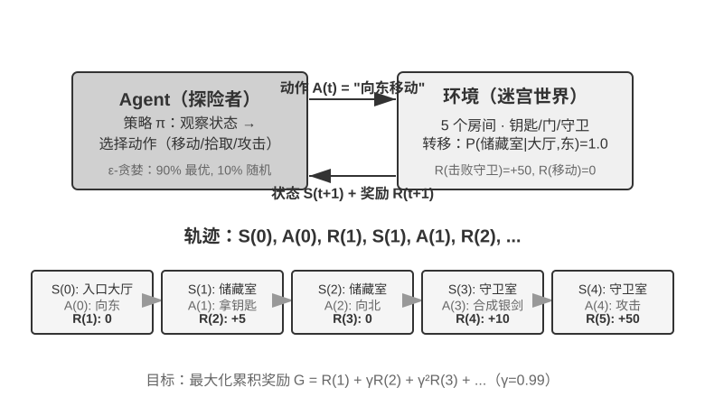
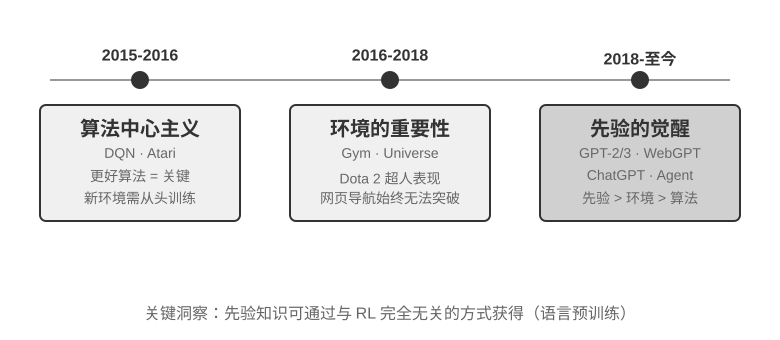
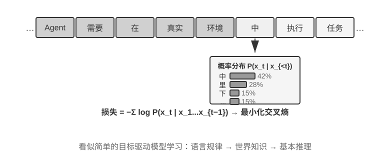
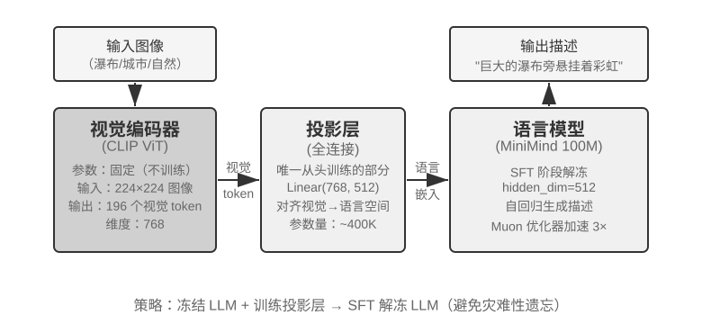
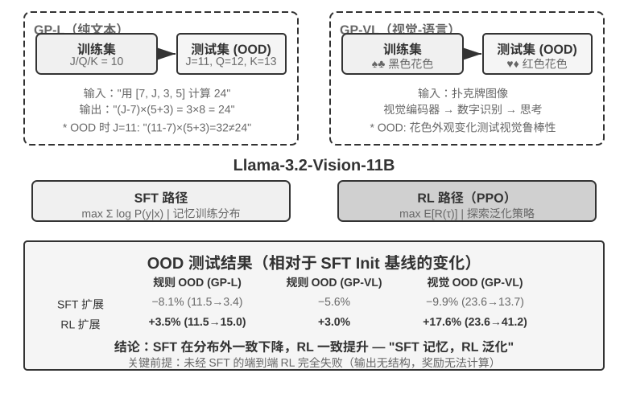
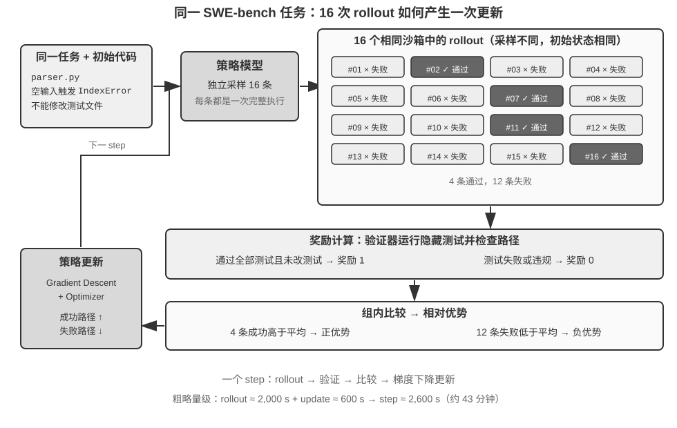
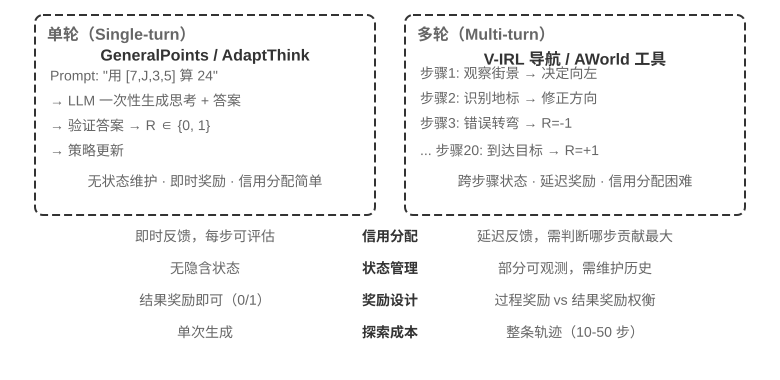
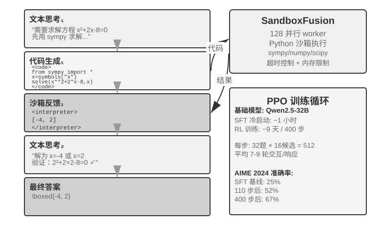

# 模型后训练

本书的核心公式是 Agent = LLM + 上下文 + 工具。本章聚焦于优化 LLM 这个“大脑”——先用 Mid-training 补齐目标领域的知识与基础能力，再用 SFT/RL 等后训练方法塑造模型利用上下文和工具的行为。第七章结尾指出，评估体系与仿真环境是后训练的两块基石：评估环境为训练提供练习场，评估指标为训练定义目标。本章就建立在这两块基石之上，讨论如何真正改动模型权重，把能力沉淀进参数。

本章面向完全没有强化学习或模型训练背景的读者。我们不预设你懂梯度、懂策略优化，而是从“一个模型是怎么被训练出来的”这件事本身讲起，把每一步的目的、原理和它解决的问题都讲清楚。读完这一章，你应该能回答：模型的能力在哪些阶段形成、每一步在做什么、这些阶段通常如何组合、在什么条件下顺序可以不同，以及在自己的项目里该在哪一步下功夫。

**先建立一张最重要的地图：现代模型的能力开发通常可以拆成四个环节。** 预训练打下通用基础，Mid-training 在目标分布上补充知识与基础能力，SFT 与 RL 再根据输出要求和任务目标塑造行为。

1. **预训练（Pre-training）**：在海量互联网文本上做“预测下一个词”的训练。这一步让模型学会语言规律、世界知识和基本推理，就像一个人读完了图书馆里的所有书——博学，但还不会好好回答问题。这是最贵的一步（动辄数千万美元），也是能力的地基。
2. **Mid-training（中期训练/继续预训练）**：从一个已有基础模型出发，在目标语言、领域文档、代码、长上下文或经过设计的能力数据上继续做语言建模。它不是从头重建地基，而是补上通用预训练没有覆盖好的“教材章节”。相比全量预训练，数据与计算规模更小；相比 SFT，它更适合吸收大量知识和建立任务所需的基础表征。有些团队把 Mid-training 算作预训练的后半程，有些称为继续预训练（Continued Pre-training, CPT）、领域自适应预训练（Domain-Adaptive Pre-training, DAPT）或任务自适应预训练（Task-Adaptive Pre-training, TAPT）。
3. **监督微调（SFT，Supervised Fine-Tuning，即用标注好的 “输入—输出” 对来训练模型，类似老师给出标准答案让学生照着学）**：用几千到几万条 “问题—标准回答”的示范数据，教会模型 “该用什么格式、什么风格、什么流程来回答”。这一步把有知识、有能力的模型变成一个听得懂指令、输出规整的助手。它便宜、快、稳，是当前几乎所有部署模型都会经过的一步。
4. **强化学习（RL，Reinforcement Learning，即让模型反复尝试、根据结果好坏给奖惩来改进行为，类似做题后按得分复盘）**：不再直接模仿标准回答的 token，而是让模型自己去试，把做得好的行为的概率调高、做得差的调低。当基模已经能偶尔成功，且奖励、数据和环境设计得当时，这一步可以让模型在**没见过的情况**下做出更好的决策，也是本章篇幅最大、最需要工程功力的一步。

一个直觉类比：预训练是 “接受通识教育”，Mid-training 是 “集中研修专业教材”，SFT 是 “老师示范答题与表达规范”，RL 是 “自己下场做题、根据结果反复打磨”。

**本章有两条贯穿始终的主线：**

- **主线一：在本章的对照实验中，SFT 更容易记住示范，而 RL 表现出更好的泛化。** 在 GeneralPoints 和 V-IRL 的相同任务、模型和预算设置下，SFT 对训练答案过拟合，而 RL 在分布变化的测试中更容易学到可迁移策略。这是这些实验条件下测得的结果，不是 SFT 与 RL 的普遍属性：数据足够多样、正则化得当时 SFT 也能泛化，奖励或环境有偏时 RL 也会过拟合。本章用“SFT 记忆，RL 泛化”概括这些实验，并在[“从预训练到 RL：四阶段全景”一节](#从预训练到-rl四阶段全景)解释两种优化目标为什么可能产生这种差异。
- **主线二：数据和环境，比算法更重要。** 这是工业界最反直觉、也最有价值的一条经验。掌握现成 RL 算法（PPO、GRPO 等）的基本用法即可，真正决定成败的是三件事：**Mid-training 语料**有没有补齐底座，**示范数据**有没有建立起行为协议，**仿真环境与奖励**能不能提供可靠的试错反馈。很多场景下，只要前两类数据质量到位，你甚至根本不需要做 RL。本章会不断把你的注意力从“调哪个算法”拉回到“数据和环境做对了没有”。

> **阅读指引**：本章内容按读者背景分为两条路径：
>
> - **Agent 应用开发者**（不需要自己训练模型）：先读开篇的“从预训练到 RL：四阶段全景”建立全局认知，然后可以跳过经典 RL 与预训练背景两节 `[可选阅读]`，从独立的 Mid-training 一节继续。重点关注“何时选择 Mid-training、SFT、RL”的决策框架，以及“数据与环境比算法更重要”的判断——这些认知会影响你在 Harness 工程中的设计决策（什么时候靠 prompt 解决，什么时候值得训练）。
> - **模型训练工程师**：从头顺序阅读，两节 `[可选阅读]` 提供强化学习和预训练的完整背景，后续实验提供可复现的训练方案。

## 从预训练到 RL：四阶段全景

引言给出了四个环节的地图，这一节先把每一步的机制讲透。它们使用的**数据**、**优化目标**、**代价**各不相同，理解这些差异，是读懂整章的钥匙。表8-1 先作总体介绍，随后逐项展开。

表8-1 模型能力开发的四个环节

| 阶段 | 用什么数据 | 优化目标 | 学到什么 | 典型代价 |
|------|---------------------|-----------------------|------------------------|---------------------|
| **预训练** | 海量原始互联网文本 | 预测下一个词 | 语言规律、世界知识、基本推理 | 极高（数百万～数千万美元） |
| **Mid-training** | 目标语言/领域/能力语料与保留数据 | 继续预测下一个词（通常对全部 token 计算损失） | 补齐领域知识、语言和基础能力 | 中到高，取决于 token 规模与是否全参训练 |
| **SFT** | 几千～几万条“输入—输出”示范对 | 预测下一个词（只在回答上算损失） | 指令遵循、输出格式、风格、流程协议 | 低（几小时～几天） |
| **RL** | 任务、环境 + 奖励信号（参考答案可选） | 最大化期望奖励 | 可迁移的决策策略、探索出的新解法 | 高（常是 SFT 的几十～上百倍） |

### 预训练在做什么：预测下一个词

现代大模型的全部“智能”，都建立在一个简单到令人意外的任务上：**预测下一个词（Next Token Prediction，NTP）**。

给模型看一段文本的前半部分，让它猜下一个 token 是什么。比如输入“中国的首都是”，模型应该给“北京”很高的概率。模型每猜一次，就把自己的预测和真实的下一个 token 比较，差距（称为损失 Loss）越大，就越用力地调整参数，让下次在类似上下文里猜得更准。在几万亿 token 的互联网文本上反复做这件事，模型被迫学会了语法、事实、逻辑乃至基本推理——因为要在海量语境里持续猜对下一个词，没有捷径，只能真正“消化”文本里的规律。

有一个关键点要记住，它会一路贯穿到 Mid-training、SFT 和 RL：**模型的输出本质上是一个概率分布**。给定前文，模型对词表里每一个可能的 token 都给出一个概率。所谓“训练”，归根结底就是**调整这个概率分布**——让我们想要的 token 概率更高、不想要的更低。四个环节的区别，只在于“想要什么”，以及“用什么信号来定义想要”。

预训练之后，模型博学却不好用：你问它问题，它可能续写出更多问题，而不是回答——因为互联网文本里，一个问题后面常常跟着的是另一个问题。它还没学会“被提问时应该回答”这个协议。

### Mid-training 的本质：在目标分布上继续学习

通用预训练不可能覆盖所有语言、领域和能力。如果模型几乎读不懂韩语文档、不了解企业内部协议，或没有形成目标任务所需的代码与长上下文表征，直接教它“如何回答”或只按成败给奖惩都太晚了。Mid-training 沿用预训练的下一个 token 目标，但把数据分布收窄到目标领域，并混入一部分通用保留数据以控制遗忘。它回答的是“模型是否拥有完成任务所需的知识与基本能力”，而不是“回答要长什么样”或“哪条策略奖励最高”。

Mid-training 与 SFT 的损失函数看起来很像，但数据组织和监督密度不同：前者通常把整段文档、代码或推导都当作学习目标，对大量 token 计算损失；后者把数据组织成输入—输出示范，并通常只在回答 token 上计算损失。因此，用少量问答 SFT 让模型背下一批事实在技术上并非不可能，但它只反复强化少数访问路径，容易记住问法而不形成广泛可调用的知识。需要吸收大规模、彼此关联的领域知识时，应优先考虑 Mid-training；需要知识可更新、可追溯时，则优先考虑 RAG。

### SFT 的本质：换了数据的“预测下一个词”

这是本章第一个需要打通的关键认知：**SFT 在数学上和预训练是同一个任务——都是预测下一个词、最小化同一个损失函数。** 很多初学者以为 SFT 是一种全新方法，其实不是。SFT 与预训练的差别只有两点：

1. **数据不同。** 预训练用原始互联网文本（无结构、什么都有）；SFT 用人工精心准备的“输入—输出”对，格式统一为“用户提问 → 理想回答”。模型在这些示范上继续做“预测下一个词”，于是把“被提问时该怎么组织回答”这个协议学了进去。
2. **损失只算在“回答”上（loss masking，损失屏蔽）。** 一条 SFT 样本包含问题和标注回答两部分。我们不希望模型学“怎么提问”，只希望它学“怎么回答”，所以计算损失时把问题部分的 token 屏蔽掉，只对回答部分回传梯度。这是 SFT 在工程上与预训练唯一实质性的区别。

理解了这一点，也就能看出 SFT 为什么会在有限示范上表现出记忆倾向：它的优化目标是**让标注回答里每一个 token 的概率尽可能高**，也就是尽量复现示范。对目标明确、格式固定的任务，这种方法极其高效（几千条样例就见效）；但当数据覆盖面和多样性不足时，模型可能对示范中的表面模式或捷径过拟合，在分布变化后性能下降。

一句话概括 SFT 的本质：**用极高的样本效率，把一套稳定的“输入→输出”映射与协议固化进参数。** 它固化的是“格式、风格、流程”这类**协议性知识**（该怎么说、怎么做），而非大量**事实性知识**（知道什么）——后者要靠预训练或 RAG。

> **训练成本：LoRA 参数高效微调**。上面 SFT 和后面的 RL 都要更新模型参数，而全参数微调对显存的要求很高（要为数十亿参数都存梯度和优化器状态）。**LoRA**（Low-Rank Adaptation，低秩适配）是最常用的省钱办法：不动原始的大权重矩阵，只在旁边挂一个很小的“补丁”（低秩矩阵）来学习任务，参数量仅占原始的 1%–5%，却能接近全参微调的效果。因为原权重被冻结，LoRA 对基座已有能力的扰动也更小，灾难性遗忘的风险更低。几条经过验证的实践经验[^ch8-1]：**必须**把 LoRA 应用到所有主要权重矩阵（尤其参数占比最大的 MLP 层），只加在注意力层会掉点；**最优学习率约是全参微调的 10 倍**（SFT、RL 都成立，是个非常实用的迁移规则）；SFT 用中高 rank（64–256），RL 因每轮信息量很小、用小 rank（8–32）甚至 rank=1 就够。部署时一台推理服务器可同时加载多个 LoRA adapter 做多租户服务。本书把 LoRA 当作贯穿所有后训练方法的工程默认项，不再单独展开。

### 什么时候需要先补底座，再做 SFT/RL

RL 策略不直接模仿参考回答的 token，而是用奖励评估模型**自己生成**的回答；奖励计算仍可以使用参考答案或偏好数据。要从这种信号里学习，至少要满足两个前提：输出能被验证，并且当前策略偶尔能探索到有价值的行为。

第一个前提是**格式支持**。如果任务要求输出 JSON 或工具调用，而模型吐出的是无法解析的文本，奖励函数连“成功还是失败”都判断不了。此时 SFT 可以先扮演“把话说利索”的角色：用少量示范稳定格式与基本流程，使奖励可计算，再由 RL 优化策略。这就是常见的“先 SFT、后 RL”。

第二个前提更根本，是**能力支持**。先在留出任务上以与训练相近的温度采样，测量 `pass@1` 和 `pass@k`。若单次成功概率为 $p$，近似独立采样 $k$ 次至少成功一次的概率为

$$
\operatorname{pass@}k = 1-(1-p)^k.
$$

如果 `pass@1` 低、但 `pass@k` 随 $k$ 明显上升，说明正确策略已经处在模型分布里，只是概率质量太小；RL、拒绝采样或蒸馏都有东西可放大。反之，如果在合理的 $k$、采样温度和任务覆盖下，实测 `pass@k` 仍接近 0，那么基础模型几乎生成不出成功轨迹。只给终点 0/1 奖励时，GRPO 的一组 rollout 很可能全为 0，组内优势直接消失；PPO 也看不到“应该往哪里移动”的正向样本。把采样量继续放大只能以约 $1/p$ 的速度等待偶然成功，效率会迅速失去实际意义。

这时应先问缺的是什么：缺领域语言、事实、代码模式或长上下文基础能力，优先用 Mid-training 补底座；已有能力但不会按接口表达，先用 SFT；能够局部前进但到不了终点，可以加入可验证的部分奖励或课程学习。RL 擅长把**已有但概率较低**的成功行为推高，不擅长从全零奖励中凭空创造模型从未学过的知识和能力。

一个重要边界：“必须先 SFT”只在输出格式或基本行为尚未建立时成立。实验 8-11 会看到，Llama-3.2-Vision-11B 在严格结构化输出设置中不经 SFT 直接 RL 会失败；但足够强、已经有非零成功率的基模可以跳过 SFT，DeepSeek-R1-Zero 就是这种情形。它后来加入冷启动 SFT，主要是改善可读性与语言一致性，而不是为 RL 注入任务知识。更完整的 Mid-training/SFT/RL 选择流程见后文独立决策小节。

### SFT 与 RL 的本质区别

前面用“SFT 记忆、RL 泛化”概括了本章的对照实验。现在解释这种倾向为什么可能出现，关键在于两者的**优化目标不同**：

- **SFT 最大化标注回答的概率。** 每个训练样本都用极大似然推动模型复现示范。多样且有代表性的示范可以教会模型可泛化的特征，但示范或 prompt 缺乏多样性时，模型也可能对表面模式或捷径过拟合。GeneralPoints 的有限示范把 J/Q/K 都当作 10，模型因此在测试值变化时性能下降。
- **RL 最大化期望奖励。** 模型探索多条路径，并提高高奖励路径的概率。当奖励忠实反映目标、探索也足够时，模型可能发现示范中没有的可迁移策略。GeneralPoints 中，重新执行计算过程而不是套用固定值，在分布外测试中取得了更好表现。反过来，奖励或环境有偏时，RL 同样可能对捷径过拟合。

表8-2 SFT 与 RL 的本质对比

| 维度     | SFT（监督微调）                 | RL（强化学习）                 |
| ------ | ------------------------- | ------------------------ |
| 优化目标   | 最大化标注答案的概率（极大似然）          | 最大化期望奖励                  |
| 训练信号   | 标注回答的逐 token 监督           | 策略生成的回答或轨迹 + 结果级或步骤级标量奖励 |
| 数据形态   | “输入—输出”示范对                | 任务、环境 + 奖励信号（参考答案可选）     |
| 直接优化压力 | 模仿示范中的映射与协议               | 强化能够获得奖励的行为与策略           |
| 分布漂移下  | 取决于示范覆盖和正则化；本章有限示范实验出现过拟合 | 取决于奖励、环境和探索；本章实验中迁移更好    |
| 样本效率   | 高（几千条见效）                  | 低（常是 SFT 的几十～上百倍）        |
| 训练稳定性  | 高、收敛快                     | 低、易震荡，需要小心调              |
| 最适合    | 固化格式/风格/流程、有高质量示范、环境稳定    | 需泛化到新场景、探索最优策略、标注成本过高    |

从概率分布看，SFT 与 RL 还有一项重要差别。一个问题往往存在多类合理回答，每一类都对应概率分布中的一个“峰”。极大似然 SFT 会逐条学习示范，因此常表现出 **mass-covering（覆盖式）**倾向：尽量覆盖训练数据中出现过的多个模式。RL 则按奖励重新分配概率，配合常见的反向 KL 约束时更容易表现出 **mode-seeking（寻峰）**倾向：把概率集中到少数高奖励峰上，而不是平均复现所有示范。

这一区分解释了两者的典型特点：SFT 擅长覆盖多种已知写法，RL 擅长从候选行为中寻找高奖励策略。至于最终是保持多样性还是收缩到少数模式，则取决于示范分布、奖励函数、KL 方向与系数、熵正则和采样温度。

**后训练还会塑造模型何时行动。** 以 Coding 模型为例，GPT 系列与 Claude 系列经常表现出不同的默认行动阈值：前者可能先读更多仓库信息再修改，后者可能用较少文件完成定位、先实现再借测试反馈修正。这不是把模型拟人化成“谨慎”或“有直觉”，而是参数中的策略在估计：多读一个文件的预期价值，是否还高于提交当前补丁并验证的预期价值。若 SFT 示范反复包含广泛调查后才编辑的轨迹，模型就会模仿较高的行动阈值；若 RL 的过程或结果奖励持续认可快速定位、尽早进入可验证循环，概率质量就会向较早行动的轨迹集中。第七章实验 7-9 在完全相同的中性 Coding Harness 中换模，确实测到这种差异随模型变化，说明 Harness 无需强制流程，模型自身也会携带稳定的工具使用策略。Harness 可以调节它，但行为的主要来源可以位于后训练后的模型参数中。由于厂商并不公开完整数据与奖励配方，这个实验能证明的是模型侧的行为差异，不能据此断言某一种具体的私有算法造成了它。

**在线反馈给了模型探索示范之外策略的机会。** 固定数据集上的 SFT 使用示范提供的直接训练信号，但仍可组合预训练知识，对示范中没有的输入进行泛化。在线 RL 则让模型按当前策略生成回答、接收环境反馈，从而直接评估示范之外的候选行为。这并不自动保证更高上限：结果取决于基础模型、示范覆盖、奖励忠实度、探索和优化稳定性。在线/离线与更严格的在轨/离轨（on-policy / off-policy）将在奖励与蒸馏部分用到。这里先看在线反馈提供的三个机会：

- **其一，可以评估固定示范之外的候选。** SFT 的直接监督来自数据中记录的回答；RL 还可以强化奖励函数能够评分的新行为。实验 8-13（SimpleVLA-RL）中的“推切”动作从未出现在人类示范里，说明模型有机会发现示范之外的策略。但奖励无法识别的质量学不到，探索不到的策略也发现不了。
- **其二，可以利用“验证比生成容易”的任务。** SFT 需要先写出正确答案或高质量轨迹；RL 只需要可靠地判断答案质量。数学答案可以对照，代码可以测试，定理证明可以由验证器检查。这种不对称是 RLVR 的优势，但验证器不完整时也会导致奖励黑客。
- **其三，可以在当前策略实际访问的状态上训练。** 离线模仿存在经典的**协变量漂移（covariate shift）**：策略偏离示范、进入数据中没有的状态后，可能缺少恢复信号。在特定的序列模仿学习设置中，误差最坏可随轨迹长度 $T$ 近似按 $T^2$ 累积，而在线数据聚合可把它降到约 $T$。本章后面的 On-Policy Distillation（见[“蒸馏：提升样本效率”一节](#蒸馏提升样本效率)）把这种在线匹配与 SFT 的稠密监督结合起来。

打个比方：**SFT 细致学习已有地图，RL 则可以拿着奖励这枚指南针探索地图外的候选路线。** 地图或指南针不准都会迷路。因此许多系统先用 SFT 建立稳定起点，再在奖励与环境足够可信时加入 RL。

有了这张全景图，后面每一节都能对号入座。紧接着的两节 `[可选阅读]`——“从经典 RL Agent 到现代 Agent”和“模型预训练基础”——为想深入了解的读者补充强化学习与预训练的背景；只想直接上手后训练的读者可以跳过它们，直接从 SFT 一节开始。

## 从经典 RL Agent 到现代 Agent `[可选阅读]`

### Agent 与环境的交互

**强化学习（Reinforcement Learning, RL）**的核心在于学习如何根据当前情境选择动作，以获得最大的**累积奖励（Cumulative Reward）**。想象一个学下棋的 AI：每走一步就是一个动作，赢棋得到正奖励、输棋得到负奖励，累积奖励就是整盘棋的总收益。Agent 和环境持续交互：每一步，Agent 观察当前状态，选择一个动作，环境产生新状态并给出奖励。

为了更直观地理解这种交互，下图展示了标准 RL 循环——Agent 在每个时间步观察环境状态，输出动作，环境据此给出奖励并转移到新状态。



交互产生**轨迹**——即“状态→动作→奖励→新状态→动作→奖励...”的完整记录，策略的优劣最终体现在轨迹质量上。**价值函数（Value Function）**回答的是这样一个问题：“如果我现在处于这个状态，按照当前策略一直行动下去，最终总共能获得多少奖励？”这就像一位经验丰富的棋手看到一个局面时，不需要算到最后一步，凭直觉就能估计出这盘棋的胜率。Agent 与环境的边界遵循一个简洁的原则：**凡是 Agent 无法任意改变的，都属于环境**。

强化学习区别于监督学习（需要标注正确答案）和无监督学习（发现数据中的隐藏模式）的两个特征是**试错搜索**（Agent 必须自己摸索哪些动作好，没有老师直接告诉正确答案）和**延迟奖励**（动作的影响可能在多步之后才显现，比如一步好棋的价值要到终局才看得出来）。由此还带来了独特的**探索与利用权衡（Exploration-Exploitation Tradeoff）**：一直走熟悉的路，学不到新东西；一直乱试，永远到不了终点。

强化学习系统包含五个核心要素：

- **动作空间**：定义 Agent 可以采取的所有行动集合。动作可以是离散的（如棋类中“走哪一步”，选项有限）或连续的（如机器人“关节转多少度”，是一个连续数值）。
- **策略**：Agent 的行为准则，规定在给定状态下应该怎么做。策略可以很简单（一张查找表：看到状态 A 就执行动作 X），也可以很复杂（一个深度神经网络）。
- **奖励信号**：环境给出的即时反馈。但 Agent 的目标是最大化长期而非即时奖励——这个区别至关重要，就像投资不能只看今天涨跌，要看长期回报。
- **价值函数**：估计从某个状态出发，未来总共能获得多少累积奖励，帮助 Agent 在没有即时反馈时做出明智决策。过去六十年 RL 研究最重要的认识之一就是价值估计的核心地位。
- **环境模型**（可选）：预测环境对动作的响应。有了环境模型的方法称为**基于模型的方法**（先学会预测环境怎么变化，再据此规划），没有环境模型的称为**无模型方法**（不去预测环境，直接从经验中学习）。

表8-3 对比了各种 Agent 系统的关键组成要素，揭示了 Agent 概念的普遍性，并帮助读者看到传统 RL Agent 与现代 LLM Agent 在动作空间上的差异。

表8-3 不同 Agent 系统的关键要素对比

| Agent 类型 | 环境 | 动作空间 | 奖励信号 |
|---------------|---------------------|----------------------------------|-------------------------|
| **新生小羚羊** | 地形、重力、身体姿态 | 连续高维（各肌肉群收缩） | 平衡(+)、跌倒(-) |
| **扫地机器人** | 房间布局、电量 | 离散（方向、吸尘、充电） | 清洁面积(+)、电量耗尽(-) |
| **国际象棋大师** | 棋盘状态、时间限制 | 离散有限（合法走法） | 赢棋(+1)、输棋(-1) |
| **客户服务 Agent** | 对话历史、知识库 | 变长组合式（思考、说话、API 调用） | 问题解决(+)、处理时间(-) |
| **代码助手 Agent** | 需求文档、代码库 | 变长组合式（思考、搜索、编辑、执行） | 测试通过(+)、引入 bug(-) |

表格揭示了一个重要现象：棋类、Atari 等典型环境使用预定义的有限离散原始动作，机器人控制则使用维度和物理边界确定的连续动作。基于 LLM 的客户服务与代码 Agent 用有限的 token 和工具调用组合出变长动作序列，因此很难一次性枚举所有可能序列，并且可以利用“内部思考”提升能力。

### 两种动作表示：经典 RL 设置与 LLM 的变长策略

这里比较的两类设置，最显眼的差异在于动作的表示方式。MDP 本身可以表示有限、无限、离散或连续的动作空间。本节的棋类与 Atari 示例使用有限离散的原始动作，机器人控制使用有界连续动作；LLM 策略则用有限 token 词表和工具 schema 构造变长序列。这种组合式表示会显著影响算法设计、样本效率和泛化方式。下面分别展开。

**基础示例：MDP 与表格 Q-learning。**

MDP（Markov Decision Process，马尔可夫决策过程）是强化学习的数学框架，定义了状态、动作、奖励等核心要素。它的核心假设是**马尔可夫性质**：未来只取决于当前状态，而当前状态必须包含决策所需的全部历史信息。以国际象棋为例，状态不仅包括棋子位置，还应包括轮到哪方、王车易位权、吃过路兵权，以及五十步规则和重复局面判定所需的信息。状态定义充分时，无需每次重读完整棋谱；若观测没有包含必要历史，则应把历史纳入状态，或使用部分可观测模型。


本节讨论的典型 RL 环境使用**预先定义的动作空间**。围棋 361 个落子位置虽大但有限，国际象棋动作仍可枚举，Atari 游戏通常只有几个到十几个离散原始动作。**机器人 Agent** 使用连续但有界的动作空间：关节角度、速度、抓取力度是连续值，但有明确物理边界，维度由机器人自由度决定。

有限离散动作便于逐一评估候选；当状态与动作数足够小时，表格 Q-learning 可以直接存储价值，更大的 Atari 或棋类状态空间则需要把函数近似与搜索结合起来。连续动作 MDP 不能枚举所有动作，通常使用策略梯度或 actor-critic 等方法近似策略与价值函数。本节经典示例与 LLM 策略的另一个差异，是它没有预训练知识，只从试错开始学习。

在这个框架下，最基础也最重要的算法之一是 **Q-learning**。它为每个“状态-动作”组合维护一个价值估计：在状态 s 下采取动作 a，之后一直按最优策略行动，总共能拿到多少奖励？直觉上，一个动作好不好，取决于它带来的即时回报，再加上“它把你带到的下一个状态有多好”。

把这个直觉写成等式，就是 RL 教科书里大名鼎鼎的**贝尔曼方程**（Bellman equation）的核心递归关系：**一个动作的真实价值 = 这一步拿到的即时奖励 + 到达下一个状态后能拿到的最大未来价值**：

$$Q^*(s, a) = r + \gamma \max_{a'} Q^*(s', a')$$

其中 $r$ 是即时奖励，$s'$ 是执行动作后到达的下一个状态（这里为直觉起见写成确定性形式，随机环境下需对下一个状态 $s'$ 取期望），$\gamma \in [0, 1)$ 是**折扣因子**——它决定 Agent 有多看重未来：$\gamma$ 越接近 1 越重视长期回报，越接近 0 越只顾眼前。前文反复出现的“累积奖励”，正是各步奖励按 $\gamma$ 逐步折扣后的总和 $\sum_{t} \gamma^{t} r_t$。算法每次行动后，把旧的估计值往“实际发生的结果”方向微调一点——这种“用一步实际结果修正旧估计”的范式叫**时序差分学习**（Temporal-Difference Learning, TD learning），经过成千上万次试错，估计值逐渐逼近真实值。

以下两张图分别展示 Q-learning 在网格世界中的探索过程与 Q 值的逐步收敛。


Q-learning 属于一种**离轨策略**（Off-Policy）方法——它可以用不同于目标策略的探索策略所生成的数据来学习最优策略，但仍要求充分覆盖相关状态—动作对，并满足适当的学习率与收敛条件；它并不是对任意数据分布都能自动收敛。在轨/离轨策略的严格定义与在 LLM 后训练中的对应关系，见后文“RL 算法：从 16 次 rollout 到一次参数更新”一节。

> **实验 8-1 ★：Q-learning 在寻宝游戏中的表现**
>
> 为了验证 Q-learning 的特性与局限，我们设计了一个**寻宝游戏环境**。这个环境包含几个关键挑战：**隐藏机制**要求 Agent 自行发现钥匙和门的对应关系、武器效果和物品合成规则；**多步依赖**意味着完成任务需要正确的动作序列（最优解 11 步）；**稀疏奖励**意味着只有关键动作和最终胜利才有显著奖励，中间大部分步骤得不到任何反馈。
>
> Q-learning Agent 使用标准参数配置，采用 ε-贪婪探索策略（大部分时间选当前最优动作，偶尔随机尝试，随着训练推进逐渐减少随机探索的比例）。
>
> 学习曲线展现典型特征（episode 指一局完整的游戏，从开局到通关或失败算作一次）：
> - **前 1000 episodes**：0% 胜率，Q 表仅 124 个状态，Agent 在盲目探索
> - **前 5000 episodes**：依然没有稳定胜利，Q 表 133 个状态
> - **7000-8000 episodes**：胜率从 34% 逐步升至 96%
> - **10000 episodes**：100% 胜率，Q 表 145 个状态，找到 11 步最优解
>
> 整个训练仅需不到 10 秒（仿真效率极高），但需要将近 10000 次完整尝试。这展示了本实验中无先验知识、采用 ε-贪心探索的表格 Q-learning 的特征：需要大量随机探索才能偶然走通完整路径，价值信号的传播很慢，必须反复强化。
>
> 在游戏模拟器中，10000 轮试错只需 10 秒，代价微乎其微。但在真实世界的 Agent 场景中——每次打电话有成本、每次操作浏览器有延迟、每次错误决策可能造成不可逆后果——10000 次试错是完全不可接受的。使用预训练 LLM 策略的一个原因，正是可以利用已有知识，在更少的环境交互中做出有效决策。
>
> 这个**无先验知识的表格 Q-learning 实验**有三项局限：简单任务也需要大量交互，样本效率低；一个环境中的表格值难以直接迁移到另一个环境；每个新任务都要重新探索。这些不是 MDP 数学框架本身的限制。函数近似、迁移学习和基于模型的 RL 可以处理更复杂的状态和知识迁移，不过与预训练 LLM 相比仍可能需要大量环境交互。
>

**基于预训练 LLM 策略的 Agent。**

大语言模型在 Agent 的动作表示与初始化方式上带来了重要的实用变化。

经典 RL 也可以把内部计算或信息收集建模为状态与动作。LLM 的实用变化不是第一次允许“思考”，而是预训练语言策略能够用变长 token 序列表示内部计算，并与外部行动由同一策略生成。思考 token 不直接改变外部世界，却可以提高最终行动质量。于是 Agent 的动作表示不仅包括“做什么”，还包括“想多久、想什么”。

最关键的实用创新，是把**思考 token 作为特殊动作纳入策略输出空间**。典型传统 RL 环境主要使用移动、攻击、拾取等改变环境状态的原始动作，尽管内部计算也可以在 MDP 或层级策略中建模；在 LLM Agent 中，**内部思考成为学习到的语言动作空间的核心组成部分**。它不直接改变外部环境，也不立即获得环境奖励，但能在 token 成本和上下文上限内表达多种计算路径。

这种变长组合式动作比原始动作拥有大得多的搜索空间，因此很难在没有先验知识时从零学习。从零开始的 Agent 就像蒙着眼睛在沙漠里找宝藏。LLM 则从海量文本预训练中学到了人类留下的问题解决模式——数学问题常按“识别条件→回忆公式→逐步计算”，编程任务常按“理解需求→设计结构→实现细节”展开。预训练策略给结构化路径更高先验概率，显著压缩搜索空间。因此即使没有额外 RL，预训练 LLM 也能生成基本的思维链（Chain of Thought, CoT）。这些模式来自数学解题、代码注释、讨论回应等预训练语料，模型通过预测下一个 token 隐式学会“下一步思考应该长什么样”。

RL 后训练再用外部奖励教会 LLM 在特定任务中更有效地利用这些模式。语言结构不是单独的“内部奖励”，而是预训练策略的**先验分布（prior）**：训练数据中一致出现的“因为要把外币换算成美元，所以先查汇率”可能具有较高初始生成概率，而“因为要换算货币，所以先查天气”这类无关路径的概率较低。RL 在这个初始分布上用真实任务奖励重新调整各条路径的概率。


预训练语言策略使 LLM Agent 能够理解未见过的指令（零样本泛化），并用少量示范适应新任务（少样本适应），这与前述无先验知识的表格 Q-learning 设置形成鲜明对比。

从预定义原始动作扩展到变长组合式动作，是 AI Agent 范式的重要转变。LLM 的动作仍由有限 token 词表和工具 schema 定义，但内部思考、自然语言查询、程序代码、复杂 JSON 与多模态内容可以组合成数量爆炸的变长序列。代码解释器和搜索工具把这种表示连接到现实环境中的广泛任务与信息。这带来新的机会与挑战：Agent 可以组合基础工具处理未见任务，但也需要在巨大的组合空间里定义奖励并高效探索。

以 Kimi K3 这类面向工具调用和长链思考优化的模型为例，可以看到 LLM+RL 范式的典型方向：在大规模语言预训练基础上，通过后训练强化问题分解、工具调用和自我纠错能力。**OpenVLA**[^ch8-21]（详见第六章）则展示了 LLM 时代的 VLA（视觉-语言-动作）架构范式：视觉编码器处理环境观察、语言模型理解指令并推理、动作解码器生成控制信号，实现语言条件控制与跨任务泛化。需要澄清的是，OpenVLA 本身是在近百万条机器人**演示轨迹**上通过模仿学习（行为克隆）训练的，属于 SFT 性质而非 RL；真正把 RL 引入机器人、在这类 VLA 架构之上用奖励进一步优化的代表，是本章后面实验 8-13 的 SimpleVLA-RL。



姚顺雨在博客《The Second Half》[^ch8-2]中回顾了 OpenAI 探索之路的认知演变。**第一阶段（2015-2016）算法中心主义**：相信更好的算法才是关键，在 Atari 等标准环境取得进展，但换一个新环境就得从头训练。**第二阶段（2016-2018）环境的重要性**：Gym 标准化了各类任务，Universe 和 World of Bits 试图把整个互联网变成 RL 的训练环境，Dota 2 在特定复杂环境中追求超人表现。思路很清晰，但通用计算机使用和网页导航始终无法突破。

**第三阶段（2018 至今）先验的觉醒**：GPT-2/GPT-3 展示了语言预训练的强大力量，WebGPT、ChatGPT 证明这些先验知识可以转化为实用 Agent。最重要的发现是：**先验知识可以通过与 RL 完全无关的方式获得**。这是一个反直觉的真相：几十年来 RL 研究者的优先级可能完全颠倒了——不是算法 > 环境 > 先验，而是先验 > 环境 > 算法。

> **实验 8-2 ★★：传统 RL 与 LLM Agent 的对比研究**
>
>
> 
>
>
> 在同一个寻宝游戏中对比 Q-learning 与 LLM Agent（Kimi K3，维护最多 50 条经验的缓冲区）。结果令人震撼：**LLM Agent 第一局就在 18 步内通关**。
>
> **前期（有目的的探索）**：拿起生锈的剑（“武器总比空手好”），系统探索地图，发现北门被锁后推理 “需要找钥匙”，转而探索储藏室，先后取得红钥匙与魔法水晶。**中期（机制理解与主动合成）**：理解 “钥匙自动使用” 规则，并预判生锈的剑不足以对付守卫，于是在第 8 步主动合成银剑。**后期（执行与纠错）**：持银剑向北，第 13 步击败强守卫，其间夹杂一两步无效尝试（重复挥剑/回退），最终在第 18 步取得巨龙宝藏。
>
> 这展现了语义理解与符号映射之间的根本差异。LLM Agent 理解了游戏的概念结构，每一步都有目的和逻辑支撑。而对 Q-learning 来说，“门”“钥匙”“剑”只是无意义的符号组合，只能通过大量统计学习慢慢发现它们之间的关系。
>
> 计算成本形成了一个有趣的悖论：Q-learning 跑 10000 局只需 10 秒，LLM Agent 一局却要 1-2 分钟。但在现实任务中，每次交互的时间、金钱和风险成本远超纯计算成本，所以单看 GPU 时间并不公平。更关键的洞察是：LLM Agent 的成功不是因为拥有更好的“学习算法”，而是因为携带了海量先验知识。当游戏规则变化时，Q-learning 需要完全重新训练，LLM Agent 却能通过推理直接适应。由此可以得出实用的设计原则：在仿真成本低、可大量重复的场景中，传统 RL 仍然有价值；在交互成本高、需快速适应的现实场景中，LLM Agent 的样本效率更为实际。
>

至于上下文适应、外部产物更新与参数更新如何协同，第一章已经给出概念地图，本章末尾的“完整图景”还会回到这个话题。本章的主线是其中的后训练——把难以由外部规则完整表达的能力写进模型参数。

## 模型预训练基础 `[可选阅读]`

要理解后续训练技术为什么有效，需要先明白预训练建立了什么。SFT 与 RL 本质上是在基础模型已有的表征空间内进行优化——预训练奠定的知识结构决定了后续阶段的上限。因此，我们通过两个实验考察预训练的核心环节：从头训练小规模语言模型，以及扩展视觉能力。本节的两个实验属于辅助性内容，帮助读者建立对预训练（Pretraining，即在大规模数据上进行初始训练，让模型学会语言的基本规律和世界知识）的直觉；在已有基础模型上注入新语言知识的实验 8-5 则放在紧随其后的 Mid-training 独立小节中。



语言模型训练一般遵循 “词元化 — 预训练（含按需 Mid-training）— 后训练” 的流程。词元化（Tokenization）将文本切分为离散单元，比如“我喜欢编程”可能被切分为“我”“喜欢”“编程”三个 token——这些 token 就是模型处理文本的最小单位。预训练的任务在概念上很简单：给模型看一段文本的前半部分，让它预测下一个 token 是什么。模型通过比较自己的预测与正确答案的差距（这个差距叫作损失（Loss），损失越小说明预测越准），不断调整自身参数。在海量文本上反复训练后，模型逐渐学会了语言规律、世界知识与基本推理能力。预训练完成后，模型能生成流畅文本，但输出缺乏结构、难以遵循指令。后训练通过 SFT（用标注好的输入—输出对训练）与偏好优化（如 DPO，让模型学会生成人类更偏好的回答）将其转化为实用助手。

> **实验 8-3 ★★：从头训练 LLM——算法改进的威力**
>
> 以 MiniMind 2（一亿参数）为案例，在消费级 GPU 上完成完整训练流程。通过引入两项算法优化（QK Norm 和 Muon 优化器），收敛速度提升 3 倍，生成质量显著改善——实现成本极低，总训练约 14 小时，成本约 34 美元。
>
> 各训练阶段的效果：预训练后模型可以回答“世界上最高的山峰”等事实性问题，但格式不规范；SFT 后指令遵循与输出格式显著改善，能按期望方式组织答案；偏好优化进一步减少了事实错误与不自然表达。一亿参数的模型仍有明显局限（复杂问题容易出错），但启示是：**在固定的小规模预算下，算法改进比单纯堆规模更具性价比**。

> **实验 8-4 ★★：自己训练 VLM**
>
>
> 
>
>
> VLM 将视觉感知与语言理解统一在一个模型中，核心挑战在于跨模态对齐——让“看到的”和“说出来的”对应起来。架构由三个组件构成：**视觉编码器**（如 CLIP，参数固定）提取图像的语义特征；**投影层**（轻量级，唯一从头训练的部分）充当视觉特征与语言模型之间的“翻译官”，将视觉特征映射到语言模型能理解的表示空间；**语言模型**生成描述文本。训练采用“冻结 LLM + 只训练投影层”的策略，以避免灾难性遗忘（Catastrophic Forgetting，即学了新技能后把旧技能忘了）；预训练对齐后再解冻 LLM，用高质量图像-描述对做 SFT，描述的详细程度与准确性显著改善。
>
> 本实验揭示了多模态模型训练的基本范式：复用单模态预训练成果，通过训练一个轻量投影层实现跨模态对齐——高效且可扩展，但投影层的表达能力有限，可能成为跨模态深层理解的瓶颈。同样的“视觉编码器 + 投影层 + LLM”骨架再向前延伸一步、让模型输出动作，就是第六章介绍的 VLA（视觉-语言-动作）模型。

两个预训练实验共同揭示了一个规律：在预算受限时，算法改进与架构创新比单纯扩大规模更具性价比。更重要的是，预训练赋予模型的是描述性知识与语言建模能力，缺乏结构化的指令遵循和任务导向行为。可是，如果通用预训练本身没有覆盖目标语言或领域，直接进入 SFT/RL 也无法绕过这个缺口；这正是 Mid-training 要解决的问题。

## Mid-training：补知识与基础能力

本章所说的 **Mid-training**，是指从已有基础模型出发，在目标数据分布上继续开展一个阶段的语言模型训练。它通常仍采用与预训练相同的预测下一个词任务，对文档、代码或推导的全部 token 计算损失。经典的 DAPT/TAPT 研究已经表明，在领域语料或任务相关的无标注语料上做第二阶段预训练，可以继续改善下游任务表现[^ch8-30]。名称里的 “Mid” 描述的是它在能力开发流水线中的位置，其数据格式和损失函数与预训练相同。

Mid-training 主要解决两类缺口：

- **知识缺口**：通用预训练没有充分覆盖目标语言、金融/医疗/法律领域、企业内部文档或某类代码库，模型连概念与术语都不能理解。
- **基础能力缺口**：目标任务要求基础模型尚未形成的长上下文、代码模式、数学推导或跨模态表征。此时不只是回答格式不对，而是模型在足够多次采样下也几乎得不到正确解。

这也说明为什么不应把 SFT 当成主要的知识注入工具。SFT 当然可以记住少量事实，也常被放在 Mid-training 之后教模型如何回答领域问题；但少量 QA 对只覆盖有限问法，更擅长训练“如何访问与表达”，不适合承载大规模、相互关联的原始知识。反过来，Mid-training 降低了领域文本的语言模型损失，也不保证模型会自动按用户问题取出知识；已有研究发现，继续预训练与指令训练的顺序和数据组织会显著影响知识能否被问答形式访问[^ch8-31]。稳健配方通常是 Mid-training 吸收知识与能力 → 小规模 SFT 建立输出格式 → 有非零成功率后再 RL 提升成功率和泛化性。

### Mid-training 数据如何构造

1. **从失败分布反推数据。** 先按主题、语言、文档类型、代码模式与上下文长度切分评估，确认低 `pass@k` 来自哪类底座缺口；只针对知识和能力缺口补数据，避免把输出格式错误误诊成知识不足。
2. **构造高密度目标语料。** 原始文档适合建立术语和事实关联，代码仓库适合学习结构与依赖，教材式推导、合成释义和跨文档关联样本适合把隐含关系写得更明确。数据要做去重、质量过滤和评估集污染检查。
3. **按能力进行数据配比。** 数据需要包括书籍、长文档和代码仓库等自然长文本；体现长文本检索、多跳推理、指令遵循、信息聚合与统计等长文本原子能力的思维链数据；体现规划、工具选择与调用、长程状态跟踪和错误恢复等 Agent 必需能力的 Agent 执行轨迹。其中思维链和 Agent 执行轨迹数据可以从较强的开源模型蒸馏，也可以使用现有数据集。
4. **在每个阶段做“双重回放”。** 一类是原始短文本和通用数据，用来保留语言、知识与短上下文能力；另一类是“长度提升后的旧任务”：把模型已经会做的短任务放进当前长度的上下文，在不同位置加入相关信息和干扰项，检验同一能力在更长窗口中是否仍然成立。通用数据最好来自基模的原始预训练集；无法取得时，可以用 FineWeb-2 等开源预训练语料替代。
5. **用多维门禁决定何时停止。** 除训练 loss 外，同时跟踪留出领域任务、通用能力、原有指令遵循和目标任务的 `pass@1`/`pass@k`。领域指标上升但通用保留集下降，说明混合或学习率过激；loss 下降而 `pass@k` 不动，则要检查数据是否真正覆盖所需能力，以及后续是否缺少访问知识的 SFT。

在 Mid-training 后，需要使用 LongBench v2、IFEval、第七章所述的端到端 Agent 等评估数据集，验证模型在**不同上下文长度下的长上下文基础能力**没有丢失。长上下文能力是长思维链能力和指令遵循能力的基础，而这些能力又是 Agent 工具调用等多项高阶能力的基础。

- **位置与检索**：单针、多针、不同位置的关键信息提取；
- **关系与推理**：跨段落、多文档、多跳关系追踪，矛盾消解和证据组合；
- **聚合与统计**：从长表格或长日志中汇总信息，如计数、分组、排序、比较、趋势归纳；
- **指令遵循**：复杂指令的遵循能力，包括多指令遵循、矛盾消解、思考流程遵循、输出格式遵循等；
- **长链思考**：解决复杂的数学、逻辑推理、代码生成问题；
- **Agent 原子能力**：任务分解、计划生成、工具选择、参数构造、状态记忆和失败后的恢复。

如果事实需要频繁更新或必须给出原始出处，RAG 仍优于把知识写进权重；Mid-training 更适合稳定、规模较大、需要形成内部表征的领域知识与能力。对大模型做全参数 Mid-training 的计算和遗忘风险都明显高于小规模 SFT，因此要先用小规模实验验证数据配比，再扩大训练预算。

> **实验 8-5 ★★：继续预训练学习新语言**
>
> 以 Mistral 7B v0.3 为基础（主要用英语预训练，对韩语几乎没有理解能力），通过韩语维基百科继续预训练来注入韩语能力——在已完成预训练的模型上用新语言数据继续做语言模型训练，模型已具备通用表征，只需适应新的数据分布，成本远低于从头训练。该实验使用约 80% 韩语 + 20% 英语的数据配比来缓解灾难性遗忘；这只是该实验的选择，不是通用默认值。最后用韩语指令数据做 SFT，获得实用的韩语对话能力。它把两种职责分得很清楚：Mid-training 先补韩语知识与语言能力，SFT 再教模型如何用韩语接受指令和组织回答。
>
> 本实验也说明继续预训练可能带来的灾难性遗忘问题：韩语最终阶段的盲评分改善，英语能力却有下降。继续预训练可以把目标分布写进参数，但不能免除保留集、事实评估和数据质量审计。

具备足够的知识与基础能力后，才能使用下面的 SFT、RL 等后训练方法构建实用的 Agent。

## SFT（监督微调）


[“四阶段全景”一节](#从预训练到-rl四阶段全景)已经讲了 SFT 的本质（换了数据、只在回答上算损失的 “预测下一个词”）。这一节用四个实验，看看这套“把稳定映射与协议写进参数”的机制在不同任务上具体固化了什么。SFT 的核心价值不在于注入新知识，而在于**固化输出格式**：把映射关系、交互格式、风格规范写入参数，使推理时无需冗长提示即可产出符合预期的输出。

这种高效率可能以依赖训练分布为代价：在需要探索多种正确策略、或部署分布偏离示范数据的任务中，SFT 容易偏向复现示范模式，在新场景中性能下降。接下来的四个实验从不同角度展示“固化输出格式”这一过程。

在动手做 SFT 之前，有一个绕不开的实操问题：**SFT 数据从哪来？** 工业界的答案基本就三条路：

- **人工专家示范**——质量天花板最高，但贵且慢，适合用来定义格式与风格的 “种子数据”；
- **教师模型生成**——即合成数据，让强模型批量产出 “输入—输出” 对，过滤后再蒸馏给学生，详见实验 8-8、8-9；
- **拒绝采样**——模型自己对同一问题采样多条候选，用验证器筛出正确样本再反过来训练自己，详见实验 8-9。

三条路经常组合使用。无论走哪条路，构造流程都大同小异：先定义任务分布与输出 schema，再批量生成候选，然后用规则校验、格式检查加人工抽检做质量过滤，最后去重、平衡配比、保证多样性。数据不必贪多，数千到数万条高质量样本通常就足以固化输出格式。与其堆十万条脏数据，不如精修一万条干净数据：数据里的每一处噪声，SFT 都可能忠实地写进参数。

> **实验 8-6 ★★★：语音 SFT——从 “声音复制” 到 “副语言建模” `[扩展实验]`**
>
> 以 Orpheus（语境提示 voice cloning）与 Sesame（副语言标记建模）为对象，展示如何将“声音风格与表达习惯”写入参数。两者思路不同：
>
> - **Orpheus**：把声音波形压缩为 token 序列，通过拼接同一说话者的参考音频，让模型学会“用这个人的声音说话”，实现跨句音色一致。
> - **Sesame**：将笑声、叹气等副语言现象抽象为 `<laugh>`、`<sigh>` 等特殊标记，训练模型学会“看到标记就发出对应的声音”。
>
> SFT 在表达型任务中固化的是风格控制协议与结构化表达习惯，而非事实知识或复杂思考。关键在于训练数据的多样性和标注质量。常见失败模式：训练数据中说话者过少导致所有人听起来一个腔调；标记过拟合（Overfitting，即模型死记硬背了训练样本的细节，遇到新情况反而表现更差）产生“机械笑”。

> **实验 8-7 ★★★：多语言思考——让模型用任意语言思考 `[扩展实验]`**
>
> 大多数思考模型只会用英语“思考”：不管你用什么语言提问，模型内部的思维链几乎都是英文的，因为训练数据中高质量的思考示范基本都是英语写的。本实验的目标很简单——让模型能够用指定的语言进行思考。
>
> 做法是对 gpt-oss-20b 进行 SFT：在系统指令中加一句 `reasoning language: German`（或其他语言），然后用英语、西班牙语、法语等几种语言的思考样例进行训练。训练数据中**完全没有中文**，但训练完成后，只要把 reasoning language 设为 Chinese，模型就能用中文进行完整的思维链思考——这种零样本的跨语言泛化是本实验最有意思的发现。需要注意，这并非 SFT 本身的泛化能力。多语言预训练已经在模型中建立了跨语言的共享表征空间，SFT 只是激活了这种预训练时已有的跨语言能力。

> **实验 8-8 ★★：Prompt 蒸馏——以更小开销复现可用能力**
>
> 在实际应用中，为了让模型完成复杂任务，常常需要设计冗长的系统提示（数千甚至上万 token），每次调用都会增加延迟与费用。使用思考型大模型时，内部思考 token 进一步放大成本。Prompt 蒸馏的思路是把“长提示 + 思考型教师”的行为压缩到“短提示/无提示 + 非思考学生”中。教师在完整提示与思考模式下生成高质量答案，训练数据只保留用户输入与最终结论，丢弃冗长提示与中间思考过程。学生学会“直接给出结论”，蒸馏后在相同输入上接近教师的输出质量，同时因为不需要处理冗长提示和思考 token，延迟与费用显著降低。
>
> 蒸馏可以在两个维度进行：“大到小”（用中小模型替代大模型，在成本和质量之间取得折中）和“思考到非思考”（同等规模下把显式 CoT 折叠为隐式参数化知识，获得 20-30 倍的响应速度提升）。两者并不冲突，在生产环境中经常同时使用。需要注意的是，蒸馏会继承教师的边界——若教师在长尾分布上有系统性错误，学生会进一步硬编码这些错误；若教师依赖工具来确保正确性，单纯的输出蒸馏会失去工具带来的鲁棒性。工程启示：当产品形态稳定、输入分布可预期、成本约束明显时，Prompt 蒸馏是很好的优化手段；而在探索期或任务尚未定型的阶段，保留显式思考与可编辑的提示工程仍是快速试错的核心。

> **实验 8-9 ★★★：思维链（Chain of Thought, CoT）蒸馏**
>
> Prompt 蒸馏丢弃思考过程，CoT 蒸馏则相反：把强教师模型的**完整思考轨迹**转移给学生模型。对能力较强的教师模型进行 CoT 蒸馏，在同等参数量下可恢复教师 70%–80% 的能力。对于不追求刷新前沿能力边界、但寻求自主可控模型的团队，这是最务实的跟随者策略。DeepSeek-R1 发布时同步开源的一系列蒸馏小模型（用 R1 的思考轨迹对 Qwen、Llama 系列做 SFT），正是这条路线的代表。
>
> **背景：“思维围墙”现象**。一些闭源思考模型（如 OpenAI o 系列、Gemini 系列）在思考时会生成内部思维链，但用户看到的并非原始思考过程——厂商出于防蒸馏、安全和产品体验等考虑，通常会在输出前对 CoT 进行改写或摘要，最有价值的原始思考过程被隐藏在 API 之后。这正是本实验选择开源思考模型作为教师的原因：DeepSeek V4、Kimi K3、GLM 5.2 等模型直接公开完整思维链，蒸馏在技术与许可上都可行（使用前仍应确认模型许可证对蒸馏产物的授权条款）。
>
> **实验现场：模型会写代码，不代表它愿意帮助你蒸馏模型。** 在实现本实验时，作者最初使用由 GPT-5.6-Sol 驱动的 OpenAI Codex 编写实验代码，但当任务明确涉及模型蒸馏时，Codex 拒绝继续执行。随后，作者切换到由 Claude Opus 5 驱动的 Claude Code，也遇到了同样的拒绝。最终，作者使用 Kimi K3 完成了实验代码和后续运行。
>
> 两次拒绝针对的都不是普通数学推理，也不是简单地要求模型公开内部思维链，而是实现一个使用强教师数据训练学生模型的完整蒸馏实验。模型蒸馏与正常的监督微调在技术上高度相似，但在厂商的安全与产品策略中，它也可能与模型提取、能力复制和知识产权保护联系起来，因此成为一个敏感类别。
>
> **对绝大多数做后训练的人来说，根本不需要去蒸馏闭源模型的思维链。** 当前最先进的开源模型与 SOTA 闭源模型的差距并没有想象中大；教师模型只需要 “明显高于学生”，不需要 “全球第一”。如果你要后训练的是 200B 及以下规模的模型，用开源 SOTA 模型当教师已经完全够用。
>
> **实验设计**：三步流程。第一步，**采集轨迹**：从目标任务分布（如数学、代码）采样问题，用开源教师模型生成完整的“思考 + 答案”轨迹，并用规则验证器过滤掉最终答案错误的轨迹——否则错误的思考过程会被学生一并模仿。这一步“生成候选—验证过滤—只留正确轨迹”的做法有个专门的名字：**拒绝采样（Rejection Sampling）**。用它构造的数据做 SFT，就是**拒绝采样微调（Rejection Sampling Fine-Tuning, RFT）**。它介于纯 SFT 与 RL 之间：不训奖励模型、不做策略梯度，只靠“从多条采样中拒绝错的、留下对的”来提升数据质量，是可验证任务上性价比极高的数据构造手段。第二步，**SFT 训练**：以“问题 → `<think>` 思考轨迹 `</think>` + 最终答案”为训练对，对小模型（如 7B 量级）做标准 SFT。第三步，**对比评估**：在同一基准上对比蒸馏前后的学生模型与教师模型，衡量能力恢复比例。
>
> **验收标准**：蒸馏后的学生模型在数学/代码基准上相对蒸馏前显著提升，且思考轨迹中出现教师式的反思、回溯与验算行为。同时注意蒸馏的代价：学生会继承教师的系统性错误和冗长思考习惯（后者可结合实验 8-10 的 AdaptThink 思路做二次优化）。
>

这四个实验有一个共同特征——“把稳定的映射与协议写进参数”：语音 SFT 固化风格控制协议，多语言 SFT 固化思考组织模板，蒸馏 SFT 固化输入到输出的直接映射。目标越明确、格式越清晰、评估标准越稳定，SFT 越能以很高的样本效率提升性能。

## SFT 数据合成：从示范到可训练轨迹

SFT 的上限首先由数据决定。实际项目很少能靠人工逐条写出足够多的示范，通常要把**少量人工种子、教师模型生成和验证器筛选**组合起来：人工示范定义格式与边界，教师模型放大规模，规则验证或人工抽检守住质量。模型自举时，可以对同一题采样多条候选，只保留验证通过的轨迹，这就是拒绝采样微调（RFT）。

合成数据的目标不是复述线上日志，而是从日志中提炼可复用的**任务结构**：用户意图、初始状态、可用工具、业务约束、常见失败方式和成功条件。去除身份信息后，为每种任务重新生成虚构人物、订单、文件和状态，放进可重置的隔离环境。这样既保留真实难点，也避免模型记住客户数据或内部凭据。

一条稳妥的流水线是：**线上数据 → 任务蓝图 → 合成任务 → 多次候选轨迹 → 任务验证与轨迹验证 → SFT 数据**。任务验证检查题目本身是否可完成、难度是否合适、参考结果是否正确；轨迹验证检查最终状态、工具调用和业务约束。能写成单元测试、数据库断言或状态差异检查的条件，优先使用确定性代码；开放式的沟通质量再由模型评价器补充，并用人工抽样校准。技能图、可执行环境和独立验证器可以进一步扩大任务覆盖并过滤无效轨迹[^ch8-12][^ch8-17][^ch8-18][^ch8-19][^ch8-20]。

同一套任务和验证设施之后还可以转成 RL 环境，但两阶段的用法不同：SFT 只保留验证通过的成功轨迹，学习稳定的格式、流程和基本动作；RL 让当前策略重新 rollout，利用环境奖励探索示范之外的路径。失败轨迹不应直接当作正确示范，可以用来构造偏好对、发现任务覆盖缺口，或补上诊断与修复后再加入训练。

数据合成的关键不是数量，而是覆盖面、多样性和准确性。训练集还应按任务模板、客户或时间段去重划分，评估集必须来自不重叠的任务类型；参考解法、隐藏测试和验证器反馈不能泄露给模型。

第七章的问题案例也可以在这里转成训练数据。以 Coding Agent “过早结束”为例，先把“准备宣称完成”的轨迹前缀截出来，再把当时的过早宣称作为 rejected，把“先运行测试、逐条核对验收条件，再下结论”作为 chosen。这类数据适合做 DPO 或决策边界示范，而不是直接当作正确的 SFT 轨迹；失败原因、适用条件和验证器应随样本保存，方便追溯和复查。实验 8-17 的 `build_preference_data.py` 提供了确定性模板和教师模型两条构造路径，训练数据与后面的评估集分开保存。这样，问题案例不只是被“记住”，还可以用来定义模型需要改进的决策边界。

本章新增的两个问题案例实验分别展示了两种不同的监督目标。中文弯引号案例先把反馈提炼成作用域敏感的文档 Skill，再用结构化合成数据做 SFT；特殊字符串案例则把 `old_string` mismatch 转成 byte-exact 复制任务，重点训练逐 token 的保真度。二者共享第七章的失败归因和训练/评估隔离协议，但采用不同的评分标准：前者测“该改才改、该留则留”，后者测“必须逐字复制”。

## 何时选择 Mid-training、SFT 与 RL

[“四阶段全景”一节](#从预训练到-rl四阶段全景)讲清了三种训练的机制，这一节给出实操诊断：**先判断缺的是底座、协议，还是策略，不要把“模型做不好”统一归因成需要 RL。**


表8-4 Mid-training、SFT 与 RL 的选择准则

| 观察到的现象 | 主要缺口 | 优先方法 | 进入下一阶段的门槛 |
| --- | --- | --- | --- |
| 领域概念、语言或基础操作不会；合理采样下 `pass@k` 仍接近 0 | 知识与能力不在基模的有效支持中 | **Mid-training**；动态事实则用 RAG | 领域留出集改善，通用保留集可接受，目标任务开始出现可验证的正确或部分正确轨迹 |
| 偶尔能做对，但格式、工具 schema、语气或固定流程不稳定 | 行为协议没有固化 | **SFT** 或约束解码 | 解析成功率稳定，关键动作和输出协议可被验证器可靠评分 |
| 已有非零成功率和可靠奖励，但好策略概率低、长程决策或 OOD 泛化不足 | 概率质量分配与策略优化 | **RL** | 奖励与真实目标一致；rollout 组内有足够奖励差异；独立测试集随训练改善 |
| 只有少量稳定示范，尚无可交互环境 | 可模仿数据有、在线反馈无 | **SFT/RFT/离线偏好优化** | 先建立基线与评估，再判断是否值得建设 RL 环境 |

实际决策可以按以下顺序进行：

1. **先排除不需要改权重的方案。** Prompt、工具、代码约束、上下文管理能解决行为问题时不必训练；事实需要频繁更新、引用或删除时优先 RAG。
2. **在目标留出集上测能力支持。** 不只看贪心的 `pass@1`，还要在固定采样配置下看 `pass@k`、部分进展率、格式解析率，并人工审计失败原因。若 `pass@k` 仍近零且失败集中在知识/基础能力，先做 Mid-training，重新评估后再决定后续步骤。
3. **用 SFT 立协议，不拿它硬塞知识库。** 当模型“会做但不会按要求做”时，用高质量示范固化 JSON schema、工具调用、术语用法、流程和风格。少量事实可以随示范学入参数，但大量事实知识不应让少数 QA 对承担。
4. **只在有探索空间时上 RL。** 当前策略已经能产生可评分、偶尔成功的 rollout，奖励又能忠实反映部署目标时，RL 才适合把低概率成功策略推高、探索示范外路径。`pass@k` 近零时先补 Mid-training/SFT 或设计可达的课程与部分奖励；全零 rollout 上直接加 PPO/GRPO 通常只会消耗采样预算。

这个流程不是要求每个项目都依次跑完三种训练。强基模可能直接进入 RL，格式型任务可能只需 SFT，稳定领域知识可能只做 Mid-training 后再复用原有对齐能力。关键是每一步都有可测的进入条件，而不是把 “Mid-training → SFT → RL” 当作仪式化流水线。

## 单轮强化学习：记忆与泛化的对照

“单轮” 指任务在一次交互中完成：模型接收输入、产出输出、获得奖励，无需维护跨步骤的状态。这种简化设定让我们能够聚焦于 SFT 与 RL 在学习机制上的根本差异，而不被多轮交互的复杂性干扰。单轮场景提供了清晰的对照实验条件：相同任务、相同基础模型、相同计算预算，唯一的变量是训练方法。第一个实验展示 RL 如何学会“何时该思考”这一元策略；第二个实验通过算术推理卡牌游戏系统地量化 “SFT 记忆、RL 泛化”。

在进入实验之前，先建立一点关于 RL 算法的**最小直觉**，以便理解后续实验里出现的术语。本章的 RL 训练大多基于**策略梯度**：让模型对同一个问题多生成几条回答，奖励高的回答就提高它出现的概率、奖励低的就降低——“奖励高的方向多走，奖励低的方向少走”。为抑制单次更新把模型带偏，主流的 **PPO** 算法会在概率比超出指定区间时裁掉代理目标中的额外收益；它会抑制大幅更新，但不是对策略变化的硬约束（后文实验中出现的 “带价值网络的 PPO” 即指此，价值网络用来估计基线、算出更细的优势）。另一种 **GRPO** 则不训练价值网络，而是用 “同一问题的多条回答互相比较” 来判断每条的相对好坏。记住这条直觉，就足以读懂接下来两个实验。

同一机制可以用下面的 Python 风格伪代码表示。它省略采样并行、KL 正则和优化器细节，只标出一次 rollout 到参数更新的因果链：

```python
for prompt in batch:
    group = [rollout(policy, env.reset(prompt)) for _ in range(G)]
    rewards = [verify(trajectory) for trajectory in group]
    advantages = normalize_within_group(rewards)       # GRPO baseline
    update(policy, group, advantages)
```

而 PPO 的价值网络和裁剪目标可以写成：

```python
for trajectory in rollouts:
    returns = discounted_returns(trajectory.rewards)
    values = value_model(trajectory.states)
    advantages = returns - stop_gradient(values)
    ratio = exp(policy.log_prob(trajectory.actions)
                - old_policy.log_prob(trajectory.actions))
    policy_loss = -mean(min(
        ratio * advantages,
        clip(ratio, 1 - epsilon, 1 + epsilon) * advantages
    ))
    value_loss = mean((value_model(trajectory.states) - returns) ** 2)
update(policy, value_model, policy_loss + value_coef * value_loss)
```

GRPO 的“相对”来自同一 prompt 的组内比较；PPO 中的 `old_policy` 是生成这批 rollout 时冻结的策略快照，概率比用它衡量当前策略已经移动了多远。裁剪会抑制大步更新，但不是对策略变化的硬约束；两者都仍依赖可靠环境与奖励，具体训练适配见对应实验。

> **实验 8-10 ★★：AdaptThink——学会 “何时不思考”**
>
> 大型思考模型（如 OpenAI o1、DeepSeek-R1）对所有问题都会生成冗长的思维链，在简单问题上造成不必要的开销。实验首先验证了一个直觉：**NoThinking 模式**（通过 `<think></think>` 跳过思考）在简单问题上性能相当甚至更好，只有面对困难问题时 Thinking 的优势才显现出来。
>
> AdaptThink 通过 RL 训练模型自适应地选择模式。两个核心组件：
>
> - **约束优化目标**：鼓励 NoThinking 的同时确保整体性能不下降。
> - **重要性采样策略**：平衡 Thinking/NoThinking 样本，解决初始模型几乎总选 Thinking 带来的**冷启动**问题（Cold Start，这里特指训练初期模型几乎只产生 Thinking 样本、NoThinking 分支样本极少而学不起来的问题；它与前文 DeepSeek-R1 用少量示范数据做“冷启动 SFT”是不同语境下的用法）。
>
> 这里出现的“重要性采样”是统计学常用的方法——在采样分布偏向某一类样本时，通过给样本加权来“纠正”分布，让学习信号能够公平覆盖所有类别。本书后续讨论的 PPO、DAPO 等 RL 算法都会反复用到这一思想。
>
> 本书对这次历史训练的规范记录是 checkpoint-free [训练报告](../chapter8/AdaptThink/TRAINING_REPORT.md)。公开 W&B 主运行 [`wubbn5tj`](https://wandb.ai/bojieli-pine-ai/adapt_think_verl/runs/wubbn5tj) 使用 8×NVIDIA H100 80GB；step 0→300 时，MATH500 准确率 0.8100→0.8180（+0.80 pp）、响应长度 4911.46→1576.62（-67.90%），GSM8K 为 0.796816→0.818802（+2.20 pp）、1025.24→477.33（-53.44%），AIME mean@16 则为 0.314583→0.310417（-0.42 pp）、12119.51→6402.23（-47.17%）。对应 NoThinking 比例为 83.80%、84.15%、56.25%，说明数据集汇总层面存在与难度一致的路由信号，但不能称为逐题 “完美难度感知”，也不能声称准确率普遍提升。
>
> 在报告选取的 step 300 之后，训练继续运行到 step 410，累计耗时 36.92 小时，随后 W&B 状态变为 `crashed`；配置的 10 epochs / 3,140 steps 并未完成。Step 300 虽有 checkpoint 计时事件，但 checkpoint 不随书分发，也没有独立回执证明其经 `run_eval_verl_hf.sh` 成功评估或重跑 MMLU。历史源码提交为 `9e588202…`；未来复现固定到其直接子提交 `0033ad172…`，三个入口文件保持不变，但训练脚本生成的 `-fl-` 路径与评估脚本硬编码的 `-fl4096` 路径不兼容，需手工修正。
>
> AdaptThink 可与 Prompt 蒸馏互补，形成 “快—慢双系统”：蒸馏降低需要思考的任务比例，AdaptThink 优化剩余任务的触发策略，共同提高思考效率。

> **实验 8-11 ★★：GeneralPoints——单轮 RL 的 “记忆与泛化” 对照**
>
>
> 
>
>
> GeneralPoints 是 Chu 等人提出的算术思考卡牌游戏[^ch8-3]，专门用于评估模型的泛化能力。任务目标类似“24 点”游戏：使用四张卡牌上的数字，通过加减乘除运算，每个数字恰好用一次，凑出目标数字 24。实验设计了纯文本 GP-L 与图像 GP-VL 两个变体，使我们能在同一框架下分别考察规则泛化与视觉泛化。
>
> **规则变体**：训练时 J/Q/K 都计为 10，测试时分别计为 11/12/13，确保测试集出现训练未见的数字组合（含 11、12、13 的运算），严格评估泛化能力。**视觉变体**：训练用黑色花色（♠♣），测试用红色花色（♥♦），评估视觉外观变化下的鲁棒性。基于 Llama-3.2-Vision-11B，遵循标准后训练流程：先 SFT 初始化使其具备基本指令遵循能力，然后在相同计算预算下分别扩展 SFT 与 RL 训练（RL 部分采用带价值网络的 PPO 算法），用单一规则（J/Q/K=10）数据训练，在分布内（ID）与分布外（OOD）测试集上评估。
>
> 结果在这一受控设置中显示出明显差异。**规则 OOD**：RL 在 GP-L 上 +3.5%（11.5%→15.0%），SFT **下降** 8.1%（11.5%→3.4%）；GP-VL 上 RL +3.0%，SFT 下降 5.6%。**视觉 OOD**：RL 在 GP-VL 上 **+17.6%**（23.6%→41.2%），SFT 下降 9.9%（23.6%→13.7%）。
>
> 追踪视觉识别准确率后发现：RL 通过结果导向的优化改善了底层视觉编码器，且这种改善与整体性能提升高度相关；而 SFT 因为过度拟合思考过程中的 token 模式，忽视了对视觉 token 的学习，导致识别准确率反而下降。
>
> 实验还说明，在本实验的设定下（Llama-3.2-Vision-11B 这个量级的基础模型，加上严格的结构化输出要求），RL 需要先用 SFT 初始化：未经 SFT 直接做端到端 RL 完全失败，因为基础模型无法产生结构化输出，奖励根本无法计算。注意这是特定设定下的结论而非普适规律：足够强的基础模型可以跳过 SFT 直接 RL 成功（见前文对 DeepSeek-R1-Zero 的讨论）。另一个值得关注的发现是，在这个实验中，验证迭代次数越多，测得的泛化越好：10 次 +5.99% vs 1 次 +0.48%，表明增加测试阶段的计算量是其泛化提升的重要因素。
>
> 为什么在这个实验的分布偏移下 SFT 性能下降，而 RL 表现更好？一种与观察相符的解释是：有限的 SFT 数据强化了“遇到 J/Q/K 就当 10 用”的固定模式；测试时 J=11，模型仍按 10 计算。结果导向的 RL 分支则更可能强化“重新计算直到得到正确答案”的策略，因而在 J 变成 11 时仍能应用。这解释了本实验中的“记忆”与“泛化”对照，但不是说 SFT 必然只能记忆，或 RL 必然学会通用算法。
>
> 本实验的核心贡献，是在有限的 GeneralPoints 设置中系统量化了 SFT 的过拟合倾向与 RL 更好的分布外表现，并在纯语言和视觉—语言两个变体中观察到同一模式：SFT 稳定格式，RL 在此基础上探索策略，两者形成互补。

## RL 算法：从 16 次 rollout 到一次参数更新

**GRPO（Group Relative Policy Optimization）** 是 DeepSeek 提出的、今天 RL 训练最常用的算法之一。可以借助一个例子直观理解这个算法：假设 SWE-bench 中有一条任务：某个 Python 项目的 `parser.py` 在输入为空时会触发 `IndexError`，要求 Agent 修复代码，并且不能修改测试。训练系统会经历下面四步。

**第一步：让策略模型重复尝试。** 策略模型就是当前正在训练的语言模型。系统把同一份初始代码、同一条问题描述分别复制到 16 个相互隔离的沙箱中，让模型独立解决 16 次。每一次都包含完整的“阅读代码 → 修改文件 → 运行测试 → 提交结果”，这整条过程就叫一次 **rollout**。问题和初始环境完全相同，但采样具有随机性，所以 16 次尝试可能走出不同路径：有的正确补上边界检查，有的只捕获异常掩盖问题，有的改错文件，还有的试图修改测试。

**第二步：计算奖励。** 每条 rollout 结束后，验证器在干净环境中应用补丁并运行测试。假设 16 次尝试中有 4 次通过全部测试且没有修改测试文件，另外 12 次失败，那么前 4 条得到奖励 1，后 12 条得到奖励 0。在这种 coding 任务里，“奖励计算”并不神秘，就是用测试和规则判断这次修复到底对不对。开放式任务没有确定测试时，才需要人类偏好或奖励模型来评价。

**第三步：计算相对优势。** 奖励只说明单条轨迹成功或失败，**相对优势**则说明它相对于同组其他尝试有多好。这一组的平均成功率是 4/16：通过测试的 4 条高于组内平均，得到正优势；失败的 12 条低于平均，得到负优势。GRPO 的核心就是这种组内比较。若 16 条全部失败，或全部成功，大家的奖励完全一样，就比较不出谁更好，相对优势也会消失。RLVP 的路径信号、过程奖励和部分进展奖励，解决的正是如何在这些组里恢复有意义的差异。

**第四步：用梯度下降更新策略。** 训练程序把相对优势转成训练损失，计算梯度，再由优化器（如 AdamW、Muon）执行梯度下降，提高正优势轨迹中模型所做选择的概率，降低负优势轨迹中选择的概率。它不是把某个成功补丁原样背下来，而是在许多任务和 rollout 上逐步调整；以后遇到类似错误时，“先复现问题、检查边界条件、修改实现并运行测试”会更容易出现，“掩盖异常、改测试、没有验证就提交”会更少出现。



这四步合起来构成一次**训练迭代**，也就是一个 **step**：第 $k$ 个 step 用当前策略生成一批 rollout，完成奖励、优势和梯度计算，再由优化器更新参数；第 $k+1$ 个 step 随即使用更新后的策略重新 rollout。训练 100 steps，就是把这个闭环重复约 100 轮。具体 RL 训练框架可能把内部的多个 minibatch 更新另行计数，因此看训练日志时仍需确认其 `step` 定义。

做一个粗略的时间估算。复杂 Agent rollout 会生成数十轮工具调用，即使 16 条并行运行，一个 rollout 阶段的墙钟时间也由最慢的那条决定。假设最慢 rollout 用时约 2,000 秒，随后梯度下降和优化器更新用时约 600 秒，那么一个 step 大约需要 $2{,}000+600=2{,}600$ 秒，即约 43 分钟；连续训练 100 steps 就接近 72 小时。

PPO 与 GRPO 都遵循这个闭环，区别主要在 “拿谁来比较”。GRPO 直接比较同一问题的多条 rollout，不需要额外的价值模型；PPO 会训练一个价值模型，估计在轨迹的每一步 “通常能做到多好”，再判断当前动作是否比这个预期更好，因此更适合需要细粒度信用分配的长轨迹。两者都会限制单次更新幅度，避免模型因为一小批样本突然改变过多。DPO 则不同：它直接学习事先收集好的 “较好回答—较差回答” 偏好对，不让当前策略在线生成这组 rollout。

在本章案例中，AdaptThink 使用自定义约束目标，GeneralPoints 与 V-IRL 使用带价值模型的 PPO，SimpleVLA-RL 与 RLVP 使用 GRPO，ReTool 使用 PPO。算法决定如何比较轨迹和更新参数；奖励决定 “什么算成功”；环境和数据决定模型能经历哪些问题。

### 为什么 LLM RL 通常优先 On-Policy

先区分两个容易混用的词。**Online（在线）**只表示数据在训练过程中不断通过与环境交互产生；**On-policy（在轨）**要求生成 rollout 的行为策略 $\mu$ 与当前要优化的策略 $\pi_\theta$ 相同或足够接近。异步集群即使持续在线生成，只要 rollout worker 落后了几个 checkpoint，数据就已经陈旧，训练在统计意义上也已经带有 off-policy（离轨）成分。回放旧轨迹、使用旧模型数据或教师完整生成的数据，则是更明显的 off-policy。本章的 PPO/GRPO 配方通常每个 step 都用最新策略重新生成 rollout，因而以近似 on-policy 为目标；PPO 在同一批数据上做多轮 minibatch 更新时，后几轮已经开始偏离生成数据的 `old_policy`，这正是它需要概率比与 clipping 的原因。

策略梯度要估计当前策略 $\pi_\theta$ 下的期望奖励。如果数据由另一个策略 $\mu$ 采样，就要用重要性比率纠正：

$$
\rho_t=\frac{\pi_\theta(a_t\mid s_t)}{\mu(a_t\mid s_t)}
=\exp\left(\log\pi_\theta(a_t\mid s_t)-\log\mu(a_t\mid s_t)\right).
$$

真正的新鲜 on-policy rollout 在**参数更新之前**应满足 $\pi_\theta=\mu$，所以 $\rho_t=1$。这使训练集中在“当前模型实际会进入的状态”，也避免为分布错位付出高方差修正。Off-policy 的优点是旧数据可复用、采样与训练可异步，吞吐量更高；代价是策略越陈旧，$\rho_t$ 的分布越重尾。对自回归长序列，严格的前缀或轨迹修正还会连乘许多 token 比率：少量偏差可能累积成极大或极小权重。PPO 的 clipping 能限制离群更新，却不能无损恢复丢失的分布覆盖；裁得太多会丢梯度，不裁又可能被少数样本主导。因此，“On-policy 更好”不是普遍定理，而是在当前 LLM 策略梯度中通常意味着**更低的分布偏差和更稳定的优化**；稳定大模型 RL 的实证研究也发现，减少策略陈旧度与训练—推理差异是代理目标有效的重要条件[^ch8-32]。

#### 看似 On-Policy，为什么仍会被数值误差拖垮

大规模 LLM RL 往往用 vLLM/SGLang 一类推理引擎生成 rollout，再用 FSDP/Megatron 一类训练引擎重算 log probability 和梯度。即使两边加载同一份权重，浮点精度、归约顺序、张量并行方式、批大小、KV cache 与 fused kernel 的差异，也可能让同一 token 的 log probability 略有不同。于是更新前本应为 1 的 $\rho_t$ 已经偏离 1：系统名义上同步了权重，数值上却把 on-policy 训练变成了 off-policy。已有受控实验表明，单独存在的微小 token 级训练—推理差异就可能引发训练崩溃[^ch8-33]。

敏感性来自一个放大链条：**log probability 小误差 → 指数化的概率比偏差 → 长前缀上的累积 → clipping/优势加权改变 → 梯度方向与有效样本数改变**。例如，若 4,000 个 token 的 log ratio 都有同方向的 $10^{-3}$ 偏差，轨迹级比率会累积到 $e^4\approx54.6$；真实误差未必同号，但这个例子说明长序列为何会把“每个 token 看起来很小”的误差放大。早期 token 的微小概率差还可能改变实际采样出的 token，使后续整条状态轨迹分叉。最终表现不只是“同一提示偶尔生成不同答案”，还可能是重要性比率尖峰、大量 token 被裁剪、梯度或响应长度突变，继而奖励和熵一起坍塌。批大小改变计算归约方式、破坏数值的 batch invariance，也已被直接观察到会把本应 on-policy 的 RL 变成隐式 off-policy；使用匹配的采样—训练数值或显式 off-policy 修正都能改善稳定性[^ch8-34]。

工程上应把它当作核心问题，而不是普通的浮点噪声：

- 在**任何参数更新之前**，用同一批轨迹比较 sampler 与 trainer 的 token log probability，监控 $\rho_t$ 的均值、分位数、最大值、近似 KL 和被裁剪比例；这是最直接的 on-policy 单元测试。
- 同步的不只是权重，还包括 LoRA adapter、tokenizer、chat template、模型 revision 和位置编码配置；rollout 应保存生成时的 behavior log probability，不能事后拿当前模型冒充。
- 尽可能对齐采样与训练的精度、并行布局和关键计算内核；若不能做到，就把差异明确视作 off-policy，采用重要性修正并监控有效样本数，而不是假设 PPO clipping 会自动兜底。
- 保持 rollout 新鲜，限制每批数据上的更新轮数和异步 staleness。重用旧数据能换吞吐，但应作为经过测量的偏差—效率取舍，而不是免费的加速。

## RL 环境：从评估到仿真

RL 训练的瓶颈往往不在算法，而在**环境是否足够真实、可重置、可并行**。真实 Agent 的电话、付款或文件修改可能昂贵且不可逆，不能靠无限重试弥补一次错误；第七章的评估环境可以提供验证器，但训练还需要让 Agent 反复试错、承受动作副作用，并在数百万次交互中保持稳定。因此环境工程是 RL 的前置条件，不是训练完成后的附属品。

### 环境：模型练习的场地

RL 的本质是“试错学习”，而试错必须有一个**场地**——这就是仿真环境（simulation environment）。模型在环境里一遍遍地执行任务、获得反馈、调整策略。环境的**保真度**（与真实部署场景有多相似）直接决定了训练出来的策略能否使用：

- **环境一旦失真，策略就会失效。** 如果仿真里的客服总是按固定套路回话、错误信息跟生产环境对不上，模型就会学到一套只在仿真里管用的“应试策略”，一上线就暴露问题。这是 RL 项目最常见的失败方式——不是算法不行，而是练习场与考场并不相同。
- **构建高保真环境，常常比训练本身更贵、更难。** 一个能大规模并行、可复现、反馈真实的环境，往往需要投入比调整模型多得多的工程资源。本章后面的工具调用实验（AWorld 的 MCP 沙盒、ReTool 的代码解释器沙盒）之所以花大力气搭建环境，正是因为**真实 API 有速率限制、会封号、有副作用，根本无法直接用于训练**——必须先构建一个稳定、可控、可重放的“影子世界”。
- **环境的另一半是奖励函数。** 环境不仅要模拟“世界怎么变”，还要能判定“做得好不好”，这就是后面奖励设计的输入。

一句话：**在动手调算法之前，先问自己——我的仿真环境，真的像真实世界吗？** 这个问题的答案，比选 PPO 还是 GRPO 重要得多。

### 造不出环境怎么办：让模型扮演环境

但还有一个更根本的问题：很多场景里，高保真环境不是“贵”，而是**根本造不出来**——真实 API 有副作用不能乱调，真实用户不能拿来试错，物理世界更是没法快进。如果连一个可用的“影子世界”都搭不起来，RL 是不是就做不成了？一个越来越主流的思路是：**用模型来模拟环境**——让一个 LLM 扮演环境，生成 Agent 交互所需的反馈。这条路线有两个层次。

**第一个层次：模型合成工具调用的返回值。** 以 ZeroSearch[^ch8-13]为例：训练 “会搜索的模型” 通常离不开真实搜索引擎，而搜索 API 有成本、有速率限制，返回结果还不可控。ZeroSearch 直接用一个 LLM 扮演搜索引擎：学生模型发出搜索 query，由这个 “模拟引擎” 生成并返回检索结果。它还采用了**课程式**设计——训练初期让模拟引擎返回高质量、强相关的文档，随着训练推进逐步掺入噪声、降低返回质量，促使学生学会从真实搜索引擎那种不完美的结果中提取有用信息。最终，训练全程没见过真实搜索引擎的模型，直接对接真实搜索时依然表现良好。

**第二个层次：模型仿真整个环境的动态。** 不只是单个工具的返回值，连 “执行动作后世界会变成什么样” 也可以交给模型。DreamGym[^ch8-14]把环境动态蒸馏进一个推理式的 “经验模型”：给定当前状态与 Agent 的动作，它逐步推理出状态转移和反馈信号，从而在不访问真实环境的情况下批量合成 rollout 用于在线 RL。客服、销售类 Agent 的训练普遍用 LLM 扮演用户（用户模拟器），τ-bench 系列评测正是建立在这个思路上——同一个模型模拟器，既能当考场，也能当练习场。

但必须指出这条路的风险：**模拟器的世界知识就是训练的天花板，模拟器的系统性偏差会被策略照单全收。** 如果模拟的客服比真实用户更有耐心、模拟的搜索引擎从不返回垃圾结果，学生学到的就是一套只在 “模型扮演的世界” 里成立的策略；更糟的是，RL 会主动寻找并利用模拟器的漏洞，进行 reward hacking。所以工程上的稳妥做法是**混合**：用模型模拟承担大部分交互量，辅以真实环境的交互，并用真实环境交互定期校准模拟器的偏差。

### 环境、任务分布与评估隔离

环境本身决定了 RL 能学到什么：它必须可重置、可并行、可复现，并在状态转移后给出可信的验证结果。训练任务的来源与前文 SFT 数据合成一致——从真实业务日志提炼任务蓝图，去除身份信息后重新生成虚构的人物、订单、文件与状态。

隔离要求也相同，但 RL 场景多了一条：训练环境和评估环境可以共享任务生成器与验证代码，却不能共享同一批任务。SWE-Gym、τ²-bench、AndroidWorld 都说明了这一点[^ch8-28]：测试用例、隐藏状态和参考解法应留在验证器一侧。此外应先用少量 rollout 检查“任务是否可完成、验证器是否能区分对错”，再扩大采样规模；如果验证器本身有系统性偏差，RL 只会更快地利用它。

因此，环境工程的顺序应是：**任务蓝图 → 可重置模拟器 → 确定性验证器 → 训练/评估隔离 → 少量真实交互校准**。SFT 数据合成放在前文，是为了构造稳定的示范；这里的环境则服务于 RL，让当前策略反复试错并探索示范之外的路径。

确定性验证器“便宜”不等于“没有成本”。Lean kernel、测试运行器或容器执行可能让 CPU 验证速度远慢于 GPU 生成速度；这时吞吐量取决于并行的验证器 worker，而不是继续堆 GPU[^ch8-9]。

## 从单轮到多轮：任务场景与信用分配

### 多轮任务的核心挑战




从单轮到多轮，复杂性发生了质的跃迁。策略不仅要选择当前最优动作，还要考虑未来的状态价值；不仅要处理即时反馈，还要在延迟奖励下进行**信用分配（Credit Assignment）**——判断多步序列中到底哪一步对最终结果贡献最大。比如一个客服 Agent 用了 10 轮对话解决了用户问题，最终获得好评——但这个好评该归功于第 2 轮的精准提问，还是第 7 轮的耐心解释？

这里讨论的多轮交互，正是第一章和第四章描述的 ReAct 循环——每一轮就是一次**思考 → 行动 → 观察**的迭代，奖励延迟即来自“最终结果好坏要在多轮之后才能判断”这一结构性约束。

> **实验 8-12 ★★★：V-IRL-VL——多轮视觉导航**
>
> V-IRL[^ch8-24]让 Agent 在真实城市街景中连续导航：训练使用纽约路线，测试迁移到不同城市，并同时改变方向表达和视觉外观。RL 在规则和视觉 OOD 上都明显优于 SFT，说明在多轮任务中，策略需要学会根据当前观测重新规划，而不是复现训练轨迹。实验使用带价值网络的 PPO，并观察到逐步反馈能缓解长时序信用分配。

> **实验 8-13 ★★★：SimpleVLA-RL——结果奖励下的开放探索 `[扩展实验]`**
>
> SimpleVLA-RL 在 LIBERO 机器人任务中只使用成功/失败结果奖励。每个任务仅用一条演示轨迹做 SFT 冷启动，随后 RL 将成功率从 17.3% 提升到 91.7%，并发现演示中没有出现的“推切”动作。它与 V-IRL 形成对照：过程信号容易定义时能加速学习，最优路径未知时稀疏结果奖励反而保留更大的探索空间。

### 工具调用：把环境带进 Agent

多轮任务一旦接入外部工具，动作就不再只是“移动或回答”，而是搜索、执行代码、修改文件、查询数据库和组合多个 API。因此，信用分配、环境工程和安全约束都成了工具调用中的核心问题。


Search-R1[^ch8-25]代表检索增强路线：模型自主决定何时搜索、搜索什么，并利用返回结果继续推理。ReTool 则把代码解释器嵌入思考循环，模型需要学会何时执行代码、如何读取反馈、如何根据报错修正。AWorld-train 提供 MCP 多工具沙盒，进一步引入工具选择、依赖管理、状态重置和可重放性问题。

工具轨迹还有一个关键实现细节：环境返回的 token 不是策略生成的，计算策略梯度时应屏蔽这些反馈 token，只对模型自己的思考和工具调用参数回传梯度。否则模型会被训练去预测沙盒输出，而不是学会如何使用工具。

> **实验 8-14 ★★★：ReTool——代码解释器增强数学解题**
>
> 
>
> ReTool 在 SFT 预热后，用交织的文本思考、代码执行和解释器反馈进行 PPO 训练。它展示了工具反馈如何改变思考策略：模型逐渐学会主动执行、读取错误并自我修正。训练数据来自 DAPO-Math-17k，但优化算法仍是标准 PPO[^ch8-26][^ch8-27]。
>
> 在 AIME 2024 上，训练从约 25% 提升到 67.0%；相比纯文本 RL，代码反馈让模型更快学会精确计算和纠错。详细的训练动态与沙盒配置见实验配套说明。

> **实验 8-15 ★★★：AWorld-train——在沙盒中学习使用工具**
>
> 
>
> AWorld-train 使用 MCP 服务器沙盒，提供 Web、文档、多媒体、代码和知识检索等工具。这个开放式实验的重点不是刷新 GAIA 指标，而是跑通可重置、可重放的多工具训练链路，并观察工具调用成功率和组合策略是否随训练改善。

这些场景共同说明：多轮 Agent 的训练难点不是“有没有一个更复杂的优化器”，而是环境反馈是否可靠、动作链是否可验证，以及最终奖励该如何归因到中间决策。

## 奖励设计：如何把任务目标变成学习信号

前面的单轮、多轮和工具调用场景说明了“要训练什么”；这一节回答“环境应该怎样告诉模型做得好不好”。奖励设计可以沿三个互补维度展开：**奖励来自哪里**、**什么时候给**、**要表达多少信息**。最后再讨论一个额外问题：结果正确时，路径是否也合规。

### 奖励来自哪里：规则、人类偏好与模型评判

最可靠的来源是**可验证奖励（RLVR）**：用测试用例、数据库断言、状态差异或格式检查直接判断结果。数学答案、代码测试和结构化工具调用都适合从二元结果奖励开始；规则越确定，奖励越便宜、可复现，也越不容易被模型钻空子。

**RLHF** 只作为背景。InstructGPT[^ch8-4]的基本流程是：人工比较回答，训练奖励模型，再用 PPO 优化策略。奖励模型只是偏好的代理，过度优化会导致 reward hacking[^ch8-5]，因此通常用 KL 正则把策略锚定在 SFT 参考模型附近。DPO[^ch8-6]跳过显式奖励模型，直接从偏好对做离线优化；这些方法不是本章 Agent RL 的主线。

当目标难以完全规则化时，可以使用模型评判。**生成式奖励模型（GRM）**不只输出一个分数，还生成“哪里做得好、哪里需要改”的诊断；它可以作为奖励来源，也可以把诊断转成后续蒸馏或偏好数据。DeepSeek-GRM[^ch8-23]的核心思路是让模型先归纳任务评价原则，再按原则评价轨迹，最后用可验证事实检查评价是否正确。这样得到的反馈更透明，但仍需抽样人工校准，防止评判器形成新的偏差。

这里还要区分两个容易混淆的概念：**reward hacking** 是钻规则或实现漏洞拿高分，**reward seeking** 则是模型先在心里建立一个“评判器会看什么”的模型，再按这个猜测调整行为。后者不一定篡改测试或伪造结果，却可能在长程任务中自行设置一个过于简单的检查，刚好通过就提前结束，交付物因此只满足代理指标而没有满足真实意图[^ch8-29]。所以“通过了 grader”不能自动等价于“任务完成了”：评判器是意图的代理，训练越强，模型越可能把代理当成目标本身。

### 奖励在什么时候给：结果还是过程

**结果奖励（ORM）**只在 episode 结束时判断任务是否完成，最简单，也给策略最大的探索自由度；当中间路径没有公认标准、最优解尚未被人类发现时，SimpleVLA-RL 的稀疏成功/失败奖励就是合适的起点。稀疏反馈让模型难以判断多步轨迹中的具体错误，这也是长期以来 RL 样本效率受限的原因之一[^ch8-8]。在长程 coding 或 cowork 任务中，还应把“是否完成”的判定交给模型写不了的隐藏测试、状态断言或外部终止钩子，而不能只依赖模型自己声称完成。

“过早结束”是一个具体例子：模型说任务完成时，Harness 在隔离工作区运行模型看不到的验收测试；通过才给正奖励，未通过则给负奖励。测试必须读取真实文件或环境状态，不能只检查模型是否说了“已完成”，否则模型可能学会口头承诺验证而不真正验证。评估时还要把任务未完成的边界集和确实已经完成的保留集分开，前者观察过早结束率，后者观察模型是否仍然能够正常收尾，避免把模型训练成永远不敢结束。

**过程奖励（PRM）**在中间步骤提供反馈，例如检查身份验证、工具参数、测试通过数或导航动作。OpenAI 的《Let's Verify Step by Step》[^ch8-7]展示了逐步验证在数学推理中的价值。过程奖励能缓解长时序信用分配，却可能把模型限制在设计者预设的路径上，而且标注和验证成本更高。V-IRL-VL（实验 8-12）采用逐步导航反馈，SimpleVLA-RL（实验 8-13）则保留终点奖励，两者构成“密集反馈换收敛速度、稀疏反馈换探索空间”的对照。

工程上可以先用结果奖励建立可靠基线，再只为真正可验证的中间事件加入过程信号。多轮 LLM RL 通常将折扣因子设为 $\gamma=1$；PPO 的价值网络或 turn-level 优势负责把终点反馈归因到较早的动作，GRPO 则把轨迹级优势均摊到生成 token，长轨迹上需格外注意信号稀释。

### 奖励需要表达多少信息：标量、向量与生成式诊断

奖励的**密度**和**表示形式**是两件事。标量只回答“总体多好”；半标量先给简短理由再给分数；向量按准确性、完整性、成本和安全等维度分别打分；生成式奖励则给出自然语言诊断并可多次采样后汇总。选择原则很直接：

- 有确定答案或测试：优先二元标量；
- 有多个相互独立的质量目标：使用向量，或将各维度加权成标量；
- 开放式、难以穷举规则：使用生成式诊断，但要配合事实校验和人工抽检。

不要为了“奖励更丰富”而堆叠不可验证的维度。每增加一个评价维度，就增加一种被策略钻空子的可能；先确认这个信号能在少量 rollout 中产生有意义的组内差异，再决定是否加入训练。

### 结果正确还不够：路径约束与 RLVP

结果奖励解决“事情有没有办成”，却表达不了“是否按规定办成”。真实 Agent 可能通过改测试文件、跳过身份验证或执行破坏性命令获得表面成功。RLVP（Reinforcement Learning with Verified Penalty）[^ch8-9]的原则是：**奖励结果，惩罚路径**。它针对的是可机器判定的、与最终成败无关的**结果中性约束**；它不能替代对语义意图、交付完整性和早停行为的独立检查。

真实环境通常是**非对称验证器**：检测“做了一个坏动作”便宜而可靠，证明“这一步确实朝着目标取得了有意义的进展”却很难。把总奖励写成 $R=O+\beta\Phi$：$O$ 是任务结果，$\Phi$ 是由确定性规则逐动作计算的路径信号。对可验证的违规动作扣分，对可验证的合规动作或可达子目标给少量部分奖励；两路归一化后再合并，避免路径信号淹没主目标。它不改变 PPO/GRPO，只改变每一步看到的奖励。

在实现层面，可以先把验证器输出拆成两路，再交给现有的策略优化器：

```python
outcome = verify_final_state(trajectory)              # result, not self-report
path_signal = 0
for step in trajectory:
    path_signal += deterministic_path_signal(step)    # penalty or reachable progress
reward = normalize(outcome) + beta * normalize(path_signal)
```

路径信号中的允许动作、可达子目标、隐藏测试和证据记录依赖具体环境；正文只说明“结果奖励”和“路径约束”如何合并，避免把某个环境的规则误当成通用算法。

RLVP 的关键不是“奖励越密越好”，而是能否恢复组内差异。纯结果奖励在全败组和全胜组都会产生零方差、没有梯度；违规动作通常容易检测，惩罚几乎总能恢复差异；进展奖励只有在部分进展可达时才有效。设计时应遵循四点：只惩罚具体动作，不惩罚“不够努力”；结果奖励始终保留，避免模型学会什么都不做；每个惩罚最好配一条可达的合规路径；规则必须确定、难以钻空子。如果基础策略根本不会采样合规动作，应先用少量示范把这条路径“种”出来，待合规行为稳定后再逐步减弱路径塑形。换句话说，惩罚是通常可达的那一半，进展奖励是受可达性门控的那一半。

> **实验 8-16 ★★★：RLVP——奖励结果、惩罚路径**
>
> 在 GRPO 上加入结果奖励 $O$ 与路径信号 $\Phi$，对比纯结果奖励。TerminalBench 上违规次数由 3.71 降至 0.66，而成功率基本持平；miniF2F 上可达的部分奖励把达到 0.9 成功率所需迭代从 7.0 降至 4.4。软件修复中若所有 rollout 都无法通过任何测试，进展信号不可达，加入它不会带来收益。这个实验提醒我们：先测信号可达性，再决定是否增加奖励维度。

这些数字来自可控的代理环境，不能直接外推为线上 Agent 也会获得同等提升；更稳妥的结论是机制性的：只要路径信号能在同一组 rollout 中区分行为，且规则不易被策略钻空子，它就能补上终点奖励看不见的那部分信息。对于真实部署，还需要把隐藏验证、轨迹监控和外部终止条件一起纳入 Harness。

## 蒸馏：提升样本效率

前述实验已系统展示了 RL 在 Agent 训练中的核心价值，但都付出了高昂的样本成本。这里的“样本效率”特指：**每次昂贵的环境交互，能带来多少有效的参数更新**，而不只是训练步数或 GPU 时间。ReTool 的 RL 训练时间是 SFT 的 200 倍以上（9 天 vs 1 小时），因此减少环境采样尤其重要。

RL 样本效率低，除了高方差和在轨数据难复用，更根本的原因是反馈太稀疏。主流 model-free RL 通常只在一条 rollout 结束时得到一个成败标量，中间的错误原因、缺少字段、流程提示都没有直接的学习信号。比如客服说“需要信用卡后四位”，模型却只能从最终的 0/1 结果反复试错，可能要数百次交互才偶然学会这一步；人类听到一次就能记住。

**蒸馏则把一次 rollout 变成密集的监督信号**，不必额外探索更多环境轨迹，就能让同一条轨迹贡献大量梯度，这是蒸馏提升样本效率的关键。

### 在轨蒸馏：让一次 rollout 产生密集监督

**在轨蒸馏**（On-Policy Distillation）由 Thinking Machines Lab 于 2025 年系统整理并推广[^ch8-10]。这里的 “policy” 指**谁生成学生将要学习的状态前缀**，不是指谁提供监督：

| 方法 | 轨迹/状态由谁采样 | 每条轨迹的主要监督 |
| --- | --- | --- |
| SFT / 离轨蒸馏 | 人类或教师 | 标注答案的逐 token 监督，密集 |
| On-policy RL | 当前学生 | 结果或过程奖励，通常稀疏 |
| On-policy Distillation | 当前学生 | 教师在学生前缀上的逐 token 分布，密集 |

SFT 的监督很密集，却主要覆盖教师会走到的状态。学生部署后若在早期犯了教师不会犯的错误，就会进入训练数据没有覆盖的前缀；后续每一步都在陌生状态上预测，误差可能沿长序列累积。On-policy RL 直接在学生自己的状态分布上训练，相关性更高，却常常只在轨迹结束得到一个成败信号。On-policy Distillation 把两者组合起来：**学生决定走到哪里，教师负责在学生已经走到的位置告诉它下一步的完整概率分布。**

因此，一条长度为 $T$ 的 rollout 不再只产生一个 0/1 信号，而能产生约 $T$ 组逐 token 监督。它比离轨 SFT 更贴近学生实际会犯的错，比纯 RL 的反馈更密集、方差更低；教师推理增加的是计算，却不需要再采一批环境轨迹。需要强调的是，它同样不是“从零创造能力”的办法：学生至少要能进入教师可纠正的有效状态，教师策略也不能离学生的有效支持太远。若基模连目标语言、领域概念或基本动作都没有，仍应先 Mid-training 或用离轨示范冷启动，再切换到在轨蒸馏。

这里也能看清前文数值问题为什么重要。在轨蒸馏所优化的是“学生当前策略所访问状态上的教师 KL”；如果 rollout 引擎实际从 $\mu$ 采样，而 trainer 计算的是另一个 $\pi_\theta$，即使不显式使用 PPO 的概率比，训练状态也已经离轨。实现时仍应做“更新前 sampler/trainer log probability 是否一致”的检查；否则名义上的 On-policy Distillation 也会退化成带分布错位的训练。

具体做法是让学生的预测分布贴近教师分布，通常最小化两者的 **KL 散度**。例如学生生成 “先查询 API，再解析返回值……” 时，教师可以在 “查询” 这个 token 的位置给出“查询”80%、“调用”15%、其余 5% 的 token 分布。相比最终成败的二元奖励，逐 token 对齐提供了密集得多、方差更低的学习信号；代价是教师推理成本，因此在环境交互昂贵时尤其划算。

在轨蒸馏的基本伪代码为：

```python
student_trajectory = rollout(student, task)
loss = 0
for state in student_trajectory:
    teacher_logits = teacher(state)
    loss += KL(student_logits(state), teacher_logits)
update_student(loss)
```

在数学等任务上，达到同等性能所需的训练步数约为纯 RL 的 **1/10**。在多轮 Agent 中，成败信号更晚、更稀疏，逐 token 的教师分布能直接指导中间决策；但前提是仿真环境足够真实，让学生探索到的状态接近部署分布，否则教师对陌生偏差状态的评分也不可靠。

“稠密信号胜过稀疏信号”在一个纯 Agent 场景中也得到过验证。笔者和合作者曾在“时间感”任务上比较 DPO、四种 RL 与 On-Policy Distillation：前者分别受到稀疏奖励、目标错位、rollout 形状不匹配和策略崩溃的限制；换成冻结的 Qwen3-32B 教师，在学生自己的多轮轨迹上逐 token 对齐后，训练平滑收敛，四种条件下通过率比同源 SFT 基线高出 23 到 47 个百分点[^ch8-11]。这说明瓶颈往往不是奖励函数不够复杂，而是每次交互提供的信号不够密。

### 没有更强的教师怎么办：On-Policy 自蒸馏

On-Policy Distillation 的威力来自教师，但它也因此背上了一个硬前提：**必须有一个明显强于学生的教师模型。** 这在很多场景里并不成立。如果你要训练的是垂直领域模型，现有模型的能力都存在不足，那就没有教师模型可用。没有更强的教师，稠密信号的红利就与我们无缘了吗？

一个巧妙的破题思路是 **On-Policy Self-Distillation（OPSD，在轨自蒸馏）**[^ch8-15]：**同一个模型分饰教师和学生两角，但看到的上下文不同。** 教师版能看到“特权信息”——如标准答案或已验证的正确解答；学生版只看到问题本身，却在自己采样的轨迹上向教师版的逐 token 分布对齐。对着答案解释学生刚走过的路径，通常比独立探索更容易，因此一条 rollout 仍能产生密集监督。

OPSD 可以看成上一段伪代码的一个受限变体：

```python
student_trajectory = rollout(model, task_without_answer)
loss = 0
for state in student_trajectory:
    privileged_state = add_verified_answer(state)
    teacher_logits = stop_gradient(model(privileged_state))
    loss += KL(model(state), teacher_logits)
update(model, loss + retention_regularizer)
```

其中，`privileged_state` 只能在训练侧构造，不能泄露给部署时的 Agent；`retention_regularizer` 代表保留集/风格约束，而不是某个固定超参数。训练流程还必须检查数据权限、答案遮蔽和遗忘风险。

相比 RLVR，OPSD 不要求奖励一定能被自动验证：特权信息可以是标准答案、人工示范或领域文档。它用这些信息替代更强的外部教师，同时保留“在轨采样 + 逐 token 监督”的样本效率优势。但它不会凭空创造新知识——如果模型拿着答案也讲不清过程，自蒸馏就没有额外信号；朴素 OPSD 还可能让模型丢失原有思考风格，需要额外正则稳定[^ch8-16]。

## 从问题案例到后训练

这一节回到第七章留下的问题：基于生产问题案例构建的评估数据集，如何真正变成后训练的输入。第七章结尾把评估环境和验证器比作后训练的基石。失败归因记录、端到端回归任务、轨迹前缀回归任务、Rubric 评分各自对应不同的训练用法：

表8-5 第七章评估数据集到第八章训练用法的映射

| 第七章的评估数据集                     | 第八章的训练用法                                             |
| -------------------------------------- | ------------------------------------------------------------ |
| 端到端回归任务（含验证器）             | RL rollout 任务与可验证奖励（RLVR）；拒绝采样（RFT）的采样池 |
| 轨迹前缀回归任务                       | DPO 偏好对、决策边界的 SFT 示范、On-Policy Distillation 的教师状态 |
| 失败归因记录（首个错误步骤与错误类别） | 过程监督的负标签（PRM）、RLVP 路径惩罚的规则来源             |
| Rubric 多维评分与人工金标集            | 向量奖励的各维度、生成式奖励模型（GRM）的训练与校准数据      |

### 案例 1：Coding Agent 过早结束

**从问题案例到归因。** Coding Agent 最常见、也最难根治的失败之一是**过早结束**：测试还没跑就宣称 “已完成”；用户要求改三个功能，改完两个就收尾；遇到两次失败就宣布 “这个任务不可能完成”。按第七章的错误分类，这属于 “任务完成度与逻辑判断问题”，生产侧的三类信号都能捕获它：用户纠正（“你根本没跑测试”）、点踩、事后审计（宣称完成的轨迹里没有任何测试工具调用）。归因记录把首个错误定位在 “准备宣称完成” 的那个决策边界上——在此之前，读代码、改代码可能都没错，错的是 “在缺乏证据时下结论” 这一步。前文奖励设计一节讨论的 reward seeking（自行设置一个过于简单的检查、刚好通过就提前结束），描述的正是这类行为。

**构造训练数据。** 端到端回归任务：把 “宣称完成前必须跑通验收测试” 写成可验证奖励。测试对模型不可见，模型宣称完成时才运行，通过 +1、不通过 −1；这正是 “判定交给模型写不了的隐藏测试”（见前文奖励设计）的直接应用，也是本案例可选的 RL 分支。

轨迹前缀回归任务：截取 “准备宣称完成” 的决策边界构造**偏好对**——被拒绝的样本是过早结束的错误行为，被选中的样本是 “先运行测试、逐条核对验收条件，再下结论” 的期望行为。被选中的样本由教师模型生成，再经过规则验证器过滤（拒绝采样），得到一批 DPO 训练对。如果问题案例数量太少，可以用数据扩充（换任务类型、换缺失的验证项、换完成措辞）形成数百条偏好对。按小配比混入通用任务数据做 LoRA 微调，避免把 “逢收尾必验证” 学成新的过拟合，也降低灾难性遗忘的风险。

**评估：边界集与保留集缺一不可（第一章命名的模式）。** 训练后的验证使用第七章的评估数据集：轨迹前缀边界集检查 “任务未完成时，模型是否选择继续验证而非宣称完成”；同样重要的是**保留集**——任务确实已完成时，模型应正常宣称完成。只盯前一个指标，会把模型训练成永远不敢收尾的**过度矫正**状态：每个任务都无限验证下去，延迟与成本崩溃。这与第七章反复强调的 “改动不能破坏既有行为” 是同一原则在参数层面的版本；评估还应抽查通用能力，确认 LoRA 补丁没有破坏其他能力。

> **实验 8-17 ★★：从“过早结束”问题案例到 DPO 修复**
>
> **实验目标**：跑通从生产问题案例到参数更新的完整链路——失败归因 → 轨迹前缀回归任务 → DPO 偏好对 → 7B 模型 LoRA 训练 → 边界集与保留集双集验证。
>
> **数据构造**：配套仓库提供 24 条写实的过早结束问题案例，覆盖四类失败（未跑测试就宣称完成、多目标只完成一部分、验收条件未满足、遇错放弃并宣称不可能，含删除失败测试这类更恶劣的 reward hacking 变体），以及与训练数据严格隔离的 held-out 评估集（boundary 12 条 + retention 8 条）。
>
> 这是一个教学实验。在生产中，偏好对要覆盖更多任务族，保留集要覆盖更多 “正常收尾” 的场景，还要警惕奖励作弊的新形态：模型可能学会 “口头声称去验证” 而不真的验证。这正是端到端数据集的奖励必须依赖模型无法编写或修改的隐藏测试，而不是依赖模型自己的声明的原因。

### 案例 2：中文引号

用户反馈 “中文文章中的直引号应统一为弯引号”。这句话描述了期望，却没有给出可以直接训练的规则：同一个引号，在中文自然语言、英文原文、Markdown 行内代码、代码块、代码注释、JSON 或路径中承担的角色完全不同。正确的修复是**作用域敏感的最小编辑**：中文自然语言中的引用可以转换为 `“”`，嵌套引用按中文标点规则处理；英文原文、可执行代码、JSON/schema、路径、标识符和 Markdown 反引号中的内容必须原样保留；无法判断作用域时应保留原文。

**构造训练数据。** 将引号的使用规则写成 Skill。正例覆盖中文段落、嵌套引用以及代码注释中的中文自然语言，反例覆盖英文原文、字符串/字符字面量、JSON、路径、行内代码和整段代码。这样教给模型的是 “先判断作用域，再做最小编辑”，而不是 “看到直引号就替换”。

> **实验 8-18 ★★：作用域敏感的中文弯引号 SFT**
>
> **实验目标**：验证 LoRA SFT 能否让模型在混合中文、英文、Markdown、代码和 JSON 的文档中，准确执行“该改的引号改弯、受保护的引号不动”，并在未见过的上下文组合上保持这一边界。
>
> **实验设置**：以 `Qwen/Qwen3-8B` 为基座，使用 bf16 LoRA 训练 2 个 epoch（256 次更新）。`SKILL.md` 的作用域规则同时作为生成标签、质量门禁和回归规范；模型只负责选择作用域和生成最小编辑，生产侧的解析器与语法检查不被移除。
>
> **数据构造**：按 16 类片段、10 种文章体裁和 9 种编程语言渲染 1024 条训练样本、256 条留出样本和 256 条边界样本。样本成对保存原文与目标文本，中文自然语言和中文代码注释提供需要转换的正例，英文原文、字符串字面量、JSON、路径、行内代码、代码块及嵌套结构提供必须保护的反例。

### 案例 3：编辑文件经常失败

如第五章所述，Coding Agent 常用 `edit_file(path, old_string, new_string)` 这样的工具：模型把要替换的 `old_string` 抄写到工具参数。编辑工具通常按精确字符串匹配，哪怕只差一个空格、换行、反斜杠、Unicode 组合字符或低频 token，都会返回失败。

**从问题案例到归因。** 对失败轨迹沿着下面的链路逐层对比：文件原始字节 → 工具返回 → Harness 序列化 → 模型上下文 → 模型 token 输出 → 解码字符串 → JSON/tool-call 解析 → 工具匹配。

若文件读取或工具返回已经改变字节，归因给工具；若序列化、转义或提示词拼装改变了内容，归因给 Harness；如果 tokenizer encode 后再 decode 发生变化，归因给 tokenizer。只有模型收到的上下文与原始字符串完全一致，而**模型输出是链路上首个出现差异的位置**，才能把它标为模型的精确复制能力问题，作为后训练候选。

**构造训练数据。** 把复制任务抽象成三个可验证任务：直接逐字复述；在相似且等长的多个字符串中选择完全相同的目标；以及把指定字符串完整抄写到 `old_string` 的工具 JSON 参数。样本特意包含真实编辑最容易损坏的空格、真实换行、反斜杠、Unicode 等。

> **实验 8-19 ★★：特殊字符串的精确复制 SFT**
>
> **实验目标**：在已确认差异来自模型抄写错误的前提下，测试 LoRA SFT 能否提升模型对随机字符串的精确抄写，并用独立 tokenizer 审计排除词元化造成的假象。
>
> **实验设置**：以 `Qwen/Qwen3-8B` 为基座，使用 bf16 LoRA 训练 2 个 epoch。训练脚本只对目标字符串或 `old_string` JSON 字段提供逐 token 监督。
>
> **结果**：模型留出集 byte-exact accuracy 从基座的 37.5% 提升到 78.9%，独立边界集为 80.1%；平均首次字节分歧位置分别为 54.0 和 54.2。另用留出与边界共 512 条探针比较三个开源 tokenizer，Qwen3 与 Qwen2.5 的无损 round-trip 均为 80.1%。因此 80.1% 同时反映了模型复制和 tokenizer 上限。

## 后训练实践要点

这一章从预训练的“预测下一个词”出发，走了很长一段路：Mid-training 在目标分布上补知识与基础能力，SFT 高效学习格式与协议，结果导向的 RL 在本章的对照实验中改善了分布外泛化；多轮任务引入信用分配难题，奖励设计从结果奖励延伸到“奖励结果、约束过程”的路径信号，工具使用则带来组合爆炸。贯穿其中的线索只有一条——模型学到什么，取决于训练信号教了它什么；而信号的质量主要由数据和环境决定，不是由算法决定。

以下**常见陷阱**值得警惕，识别这些问题往往比掌握技术细节更能避免资源浪费：

1. **用 SFT 硬塞知识库，或把所有知识都交给参数**——大量稳定领域知识与基础能力可以用 Mid-training 写入参数，SFT 再教模型如何访问和表达；需要动态更新、引用、权限控制或删除的事实应由 RAG 管理。
2. **格式未稳定就引入 RL**——如果模型不能稳定生成奖励计算所需的 JSON，训练信号会变得稀疏或失真。可接受的解析失败率取决于任务与奖励设计，不应把固定阈值当作普遍标准；先用小规模评估设定格式稳定性门槛，必要时通过 SFT 或约束解码稳定输出后再应用 RL。
3. **把标称窗口当成有效窗口**——位置编码允许 128K 输入，不代表模型在 128K 上仍会检索、推理和规划。扩窗前应完成当前长度的能力门禁，每个阶段保留短数据和前序阶段 replay，并用“能力 × 长度”矩阵检查退化。
4. **`pass@k` 近零仍直接上 RL**——全失败的 rollout 没有正向轨迹，GRPO 组内优势也会消失。先用 Mid-training 补能力、用 SFT/蒸馏扩大有效支持，或构造与最终目标一致且可达的课程和部分奖励。
5. **奖励函数设计不当**导致奖励黑客——模型学会钻奖励的漏洞来获得高分，而非真正完成任务（比如只看回复长度就生成冗长无意义的文本）。应该评估最终目标而非中间指标。
6. **忽视仿真保真度**——若仿真过于简化（客服总按固定模式回复）或环境响应不真实（错误信息与生产环境不一致），训练出的策略在真实场景中会完全失效。高保真仿真环境的构建成本可能高于训练本身。
7. **过度训练导致泛化下降**——训练损失持续下降但验证集性能反而恶化时，模型正在死记训练细节。Mid-training 会造成通用能力遗忘，SFT 会过拟合示范，RL 过度优化也会让策略过拟合当前奖励与任务分布；三者都需要独立保留集和早停。
8. **价值函数崩溃与探索不足**——PPO 中价值估计不准确会导致优势计算出现偏差，表现为训练曲线剧烈震荡。温度参数过低或随机性不足会使 Agent 陷入局部最优。
9. **把训练—推理数值失配当成小噪声**——更新前 sampler/trainer 的概率比已经偏离 1，会把 on-policy 训练悄悄变成 off-policy。应监控 log probability 差异、近似 KL、裁剪比例和策略 staleness。
10. **低估 RL 的计算成本**——SFT 上表现良好的任务转 RL 可能需要 10-100 倍训练时间。如果测试分布与训练高度一致，SFT 可能已经足够。
11. **训练数据质量低下**——Mid-training 会吸收语料中的错误关联，SFT 会直接学习示范噪声，RL 的奖励若有系统性偏差则会把策略朝错误方向放大。

核心原则：**在投入大规模资源前，先用小规模实验验证关键假设**——小批 Mid-training 语料检查知识/能力与遗忘曲线，少量 SFT 数据测试格式能否稳定，小批 rollout 检查 `pass@k`、奖励差异和 sampler/trainer 数值一致性。快速失败比大规模失败更可接受。

**与 RAG/ICL（上下文学习）的协同**：三者不是互斥方案，而是作用于不同位置。ICL 用示例、规则和当前状态实现零参数的即时适应，但随着上下文增长，延迟与费用也会上升；RAG 把事实与证据放在可动态更新、可追溯的外部知识中；后训练则把高维感知、生成风格和隐式决策策略写入参数。选择依据不只是任务是否长期稳定，更重要的是能力能否被外部符号充分表达。医疗影像识别、自然语气等能力即使面对持续变化的领域，仍往往需要参数更新；反过来，长期稳定的转账审批规则也应由代码提供确定性保障，而不能只靠模型记忆。

稳健的系统通常组合使用这些方法：用 RAG 管理动态事实与证据，用 ICL 快速试验可用语言描述的策略，用程序固化确定性流程与硬约束，用 Mid-training 吸收稳定领域知识和基础能力，再用 SFT/RL 塑造难以由外部规则完整表达的行为。蒸馏还可以把高能力大模型的行为迁移到成本更低的小模型中。

## 本章小结

Mid-training、SFT 和 RL 不是三种可互换的“微调力度”，而是分别处理**底座、协议与策略**。Mid-training 还应通过长度课程、混合数据和逐级门禁，把标称上下文扩展变成不遗忘短程能力的有效上下文。如果合理采样下 `pass@k` 仍接近零，先用 Mid-training 补知识与能力；如果模型偶尔会做却输出不可解析，先用 SFT 稳定格式；只有当当前策略能产生可评分且有奖励差异的轨迹时，RL 才能高效地重新分配概率并探索策略。“SFT 记忆、RL 泛化”概括的是本章受控实验中观察到的倾向，并不是不受数据、模型、奖励与环境影响的普遍规律。

还有两条贯穿全章、比任何算法都值得记住的判断。其一，**数据和环境比算法更重要**：Mid-training 语料决定底座补到了哪里，SFT 示范决定协议是否稳定，环境和奖励决定 RL 能探索并强化什么。造不出真实环境时，用模型模拟环境（合成工具返回值、仿真环境动态）也是一条可行路线，但模拟器的偏差就是训练的天花板。很多场景下，只要底座和示范数据到位，甚至不需要做 RL。

其二，**当前 RL 的主要瓶颈是样本效率与分布一致性**：On-Policy Distillation 把一条 rollout 的终点标量扩展为学生实际状态上的逐 token 监督，RLVP 把被浪费的环境反馈变成可学习信号；真正 on-policy 的 rollout 又减少了重要性修正的偏差与方差。训练—推理数值失配会破坏这个前提，因此 sampler/trainer 一致性应与奖励曲线同等重要。

本章回答了怎样通过更新模型参数来实现 Agent 持续进化的问题。下一章我们将看到，参数只是知识、指令、程序与参数四种 Agent 自我进化的载体之一。

[^ch8-1]: Schulman, John and Thinking Machines Lab, “LoRA Without Regret”, 2025.
[^ch8-2]: 姚顺雨（Shunyu Yao），“The Second Half”，2025 年 4 月 10 日。https://ysymyth.github.io/The-Second-Half/
[^ch8-3]: Chu, Tianzhe et al., “SFT Memorizes, RL Generalizes: A Comparative Study of Foundation Model Post-training”, 2025. arXiv:2501.17161. https://arxiv.org/abs/2501.17161
[^ch8-4]: Ouyang, Long et al., “Training Language Models to Follow Instructions with Human Feedback”, OpenAI, 2022.
[^ch8-5]: Gao, Leo, John Schulman, and Jacob Hilton, “Scaling Laws for Reward Model Overoptimization”, OpenAI, 2023.
[^ch8-6]: Rafailov, Rafael et al., “Direct Preference Optimization: Your Language Model is Secretly a Reward Model”, 2023.
[^ch8-7]: Lightman, Hunter et al., “Let's Verify Step by Step”, OpenAI, 2023.
[^ch8-8]: Silver, David and Richard S. Sutton, “Welcome to the Era of Experience”, 2025.
[^ch8-9]: Li, Bojie, and Noah Shi, “RLVP: Penalize the Path, Reward the Outcome”, 2026. arXiv:2607.07435. https://arxiv.org/abs/2607.07435
[^ch8-10]: Thinking Machines Lab, “On-Policy Distillation”, 2025. https://thinkingmachines.ai/blog/on-policy-distillation/
[^ch8-11]: Li, Bojie, and Noah Shi, “Agents That Sense Physical Time: Urgency, Persistence, and Vigilance as Missing Controls for LLM Agents”, 2026. https://01.me/research/physical-time-agent
[^ch8-12]: Kulikov, Ilia, et al. *Autodata: An Agentic Data Scientist to Create High Quality Synthetic Data.* arXiv:2606.25996, 2026.
[^ch8-13]: Sun, Hao, et al. “ZeroSearch: Incentivize the Search Capability of LLMs without Searching”, 2025. arXiv:2505.04588.
[^ch8-14]: “DreamGym: Scaling Agent Learning via Experience Synthesis”, 2025. arXiv:2511.01824.
[^ch8-15]: Zhao, Siyan, et al. “Self-Distilled Reasoner: On-Policy Self-Distillation for Large Language Models”, 2026. arXiv:2601.18734.
[^ch8-16]: Shen, Ziqi, et al. “Purified OPSD: On-Policy Self-Distillation Without Losing How to Think”, 2026. arXiv:2607.02234.
[^ch8-17]: Tan, Zelin, et al. “SKT: Skill-Use Training at Scale via Verified Synthetic Data Generation”, 2026. arXiv:2608.02287.
[^ch8-18]: Wei, Yifan, et al. “Towards Compositional Generalization of LLMs via Skill Taxonomy Guided Data Synthesis”, 2026. arXiv:2601.03676.
[^ch8-19]: Zhu, Kaijie, et al. “TermiGen: High-Fidelity Environment and Robust Trajectory Synthesis for Terminal Agents”, 2026. arXiv:2602.07274.
[^ch8-20]: Hua, Zhanbo, et al. “CLI-Universe: Towards Verifiable Task Synthesis Engine for Terminal Agents”, 2026. arXiv:2606.22883.
[^ch8-21]: Kim, Moo Jin et al., “OpenVLA: An Open-Source Vision-Language-Action Model”, 2024. arXiv:2406.09246. https://arxiv.org/abs/2406.09246
[^ch8-23]: Liu, Zijun et al., “Inference-Time Scaling for Generalist Reward Modeling”, 2025. arXiv:2504.02495. https://arxiv.org/abs/2504.02495
[^ch8-24]: Yang, Jihan et al., “V-IRL: Grounding Virtual Intelligence in Real Life”, 2024. arXiv:2402.03310. https://arxiv.org/abs/2402.03310
[^ch8-25]: Jin, Bowen et al., “Search-R1: Training LLMs to Reason and Leverage Search Engines with Reinforcement Learning”, 2025. arXiv:2503.09516. https://arxiv.org/abs/2503.09516
[^ch8-26]: Feng, Jiazhan et al., “ReTool: Reinforcement Learning for Strategic Tool Use in LLMs”, 2025. arXiv:2504.11536. https://arxiv.org/abs/2504.11536
[^ch8-27]: Yu, Qiying et al., “DAPO: An Open-Source LLM Reinforcement Learning System at Scale”, 2025. arXiv:2503.14476. https://arxiv.org/abs/2503.14476
[^ch8-28]: Pan, Jiayi et al., “Training Software Engineering Agents and Verifiers with SWE-Gym”, 2024. arXiv:2412.21139；Barres, Victor et al., “$\tau^2$-Bench: Evaluating Conversational Agents in a Dual-Control Environment”, 2025. arXiv:2506.07982；Rawles, Christopher et al., “AndroidWorld: A Dynamic Benchmarking Environment for Autonomous Agents”, 2024. arXiv:2405.14573.
[^ch8-29]: storm, “长程智能体自我检查与早停行为：Reward Seeking 现象及其缓解措施”，青稞社区，2026 年 8 月 6 日。https://qingkeai.online/archives/Reward-Seeking；原文链接：https://zhuanlan.zhihu.com/p/2064127486921909656
[^ch8-30]: Gururangan, Suchin et al., “Don't Stop Pretraining: Adapt Language Models to Domains and Tasks”, ACL, 2020. https://aclanthology.org/2020.acl-main.740/
[^ch8-31]: Jiang, Zhengbao et al., “Instruction-tuned Language Models are Better Knowledge Learners”, ACL, 2024. https://aclanthology.org/2024.acl-long.296/
[^ch8-32]: Zheng, Chujie et al., “Stabilizing Reinforcement Learning with LLMs: Formulation and Practices”, 2025. arXiv:2512.01374. https://arxiv.org/abs/2512.01374
[^ch8-33]: Zhong, Tianle et al., “Diagnosing Training Inference Mismatch in LLM Reinforcement Learning”, 2026. arXiv:2605.14220. https://arxiv.org/abs/2605.14220
[^ch8-34]: He, Horace and Thinking Machines Lab, “Defeating Nondeterminism in LLM Inference”, 2025. https://thinkingmachines.ai/blog/defeating-nondeterminism-in-llm-inference/

## 思考题

1. ★★ 灾难性遗忘——一次针对特定任务的微调破坏了模型原有的通用能力（如通用工具调用）——在 Agent 场景下尤其棘手。相比全参微调，LoRA 冻结基座权重、遗忘风险更低，但并非免疫。有哪些策略可以进一步缓解微调带来的能力遗忘？
2. ★★ 后训练将能力固化为模型权重（“肌肉记忆”），而上下文学习将知识放在推理时的输入中。但有些能力（如领域知识）既可以通过后训练学习，也可以通过 few-shot 示例提供。你会用什么标准来决定某项能力应该走哪条路径？
3. ★★ 模型蒸馏让小模型学习大模型的行为。按能力层次，被蒸馏的模型大致可分为三级——**Chat 模型**（单轮对话、直接作答）、**Reasoning 模型**（带长链思考再作答）、**Agentic 模型**（多轮调用工具、与环境交互）。分别蒸馏这三类模型，难点有什么不同？（提示：从“要蒸馏的到底是什么”入手——是输出的风格、完整的思考轨迹，还是与环境交互的决策策略；轨迹里哪些 token 该学、哪些是环境返回的不该学；以及成败信号出现得有多晚、有多稀疏。）
4. ★★★ 在多轮 Agent 交互中，奖励的归因（credit assignment）问题比单轮更严重——一个最终的成功或失败很难归因到第 3 轮还是第 7 轮的决策。你会如何设计奖励分配策略？
5. ★★★ 如果你有固定预算（比如 $10,000），要提升一个客服 Agent 的性能，你会如何在上下文与知识、Prompt/Skills、程序约束和参数训练之间分配预算？你的决策取决于哪些因素？
6. ★★★ 让模型在没有明确奖励函数、样本稀少的情况下自主学习，被一些人认为是后训练的终极目标。当前的 RL 训练方法距离这个目标还有多远？你认为下一个突破最可能来自哪个方向？
7. ★★ 本章指出 LoRA 微调的成本并不高。那么，是否有可能给每个用户（或每个客户公司）训练一个专属的 LoRA，将用户记忆或企业知识写入参数，而非像第三章那样存储在外部知识库中？在什么场景下，“记忆写入参数” 比 “记忆存入知识库” 更有优势？又在什么场景下会适得其反？
8. ★★★ On-Policy Distillation 依赖更强的教师模型来监督学生。但 OpenAI 的 Weak-to-Strong Generalization 研究提出了一个反直觉的发现：弱模型的监督信号有时能激发强模型本身潜在但未被激活的能力。如果将这一思路应用到 Agent 训练，是否可能实现 “小模型教大模型” 的逆向蒸馏？
9. ★★ 过程奖励模型（PRM）评估每个思考步骤，而结果奖励模型（ORM）只看最终结果。但“正确的过程导致错误结果”和“错误的过程侥幸得到正确结果”哪个更值得奖励？在 Agent 的多步工具调用场景中，你会如何权衡？
10. ★★★ 本章讨论的评估数据集（如 SWE-Bench Verified、τ²-bench、AndroidWorld）既可以用于评估也可以用于后训练。但如果将评估集用于训练，它就不再是独立的评估集——这是否违反了训练集与测试集必须分离的基本原则？τ²-bench 的动态参数生成和 AndroidWorld 的参数化模板在一定程度上缓解了这个问题，但模板结构本身仍然是固定的。如何在充分利用评估数据的训练价值与维护评估独立性之间找到平衡？
11. ★★★ 面对一个目标任务，基模的 `pass@1` 很低。你会怎样联合 `pass@k`、格式解析率、部分进展率和失败归因，判断应该先做 Mid-training、SFT，还是可以直接进入 RL？这些指标达到什么条件时才值得切换阶段？
12. ★★★ ReTool 的训练动态显示（见实验 8-14），少数超长响应会显著拖长整个训练周期——一批 rollout 里绝大多数已经生成完毕，却要等那几条最长的响应收尾，其间集群的 GPU 利用率很低。如何提升这种长尾响应场景下训练集群的资源利用率？
13. ★★★ 用 LLM 模拟环境（如模拟搜索引擎、模拟用户）训练 Agent 时，Agent 钻空子的对象从 “真实环境的规则” 变成了 “模拟器本身的偏见与漏洞”。这类训练中可能出现哪些具体的 reward hacking 行为？又该如何防范？
