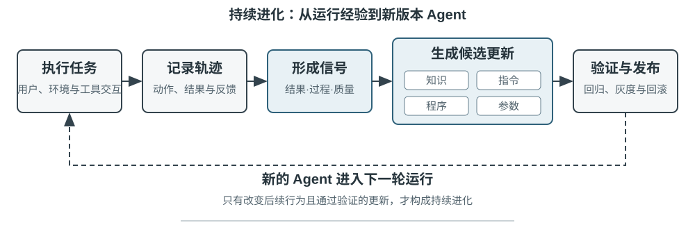
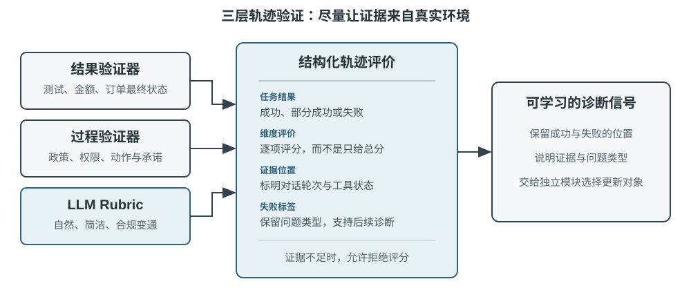
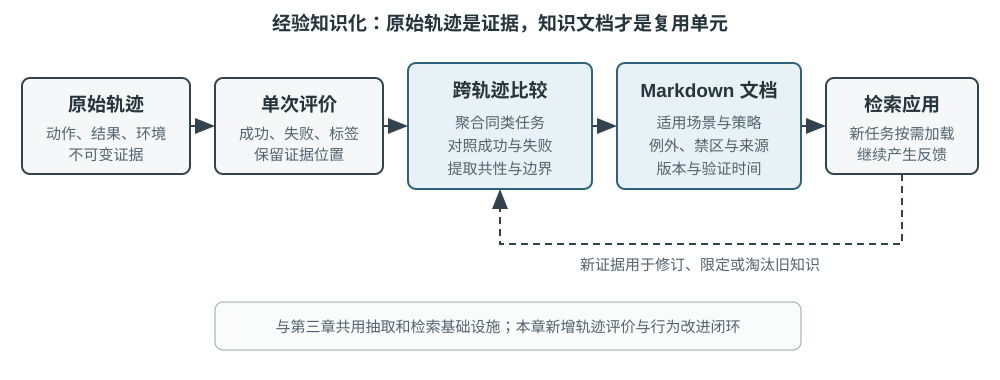

# Agent 的持续进化

今天的 Agent 面临一个鲜明的能力悖论：它可以零样本解决从未见过的复杂任务，却可能在处理了一万次相似任务之后，第二天仍然犯下第一天的错误。模型上岗之后，能否像新员工一样从日常工作中不断长进？**能否自主从经验中学习**（所谓**持续学习**，continual learning），正在成为 Agent 从“会完成任务”走向“能够可靠工作”的关键能力，也是下一代模型的核心研究课题。今天的 “持续学习” 概念与早年 “学了新任务就忘掉旧任务” 的持续学习研究不是同一个问题，遗忘只是其中一个子问题，更难的是没有人告诉模型，今天这一天的经历里哪些是做对的，哪些是做错的。就目前而言，模型本身的持续学习能力仍远远不够。

原因在于，部署后的模型并不会因为一次推理自动改变参数。第二章讨论的上下文学习、状态维护和压缩，能让 Agent 在**当前任务内**适应；但上下文结束后，这种变化不会自然进入下一次任务。把对话存进记忆也不等于学会了新的行为：原始轨迹可能很长，其中既有有效策略，也有偶然成功、错误归因和不可信输入。

这里有一个容易混淆的区别：**保存经历不等于从经历中学习**。把一百条轨迹放进长上下文或向量库，可以帮助模型在需要时找回某个案例，却不会自动完成跨案例比较——哪些步骤在成功轨迹中反复出现，哪些做法只在旧版接口上有效，某次成功究竟来自正确策略还是环境偶然。学习发生在系统主动完成“评价、对照、归纳、验证”之后，而不是发生在日志写入磁盘的那一刻。第三章的用户记忆主要沉淀“用户与世界是什么样的”，本章的经验学习则要进一步沉淀“在什么条件下应该怎样行动”；前者让 Agent 记得更多，后者才让它从聪明变得熟练。

那么，为什么不让模型在每次任务后直接训练自己？因为生产环境很少提供干净的学习信号。用户满意不意味着合规；局部参数更新还可能造成能力遗忘、策略漂移或安全退化。若允许模型依据未经验证的反馈直接修改自身参数，错误经验和提示注入就可能被固化，并在后续任务中持续放大。另一方面，基础模型的周期性训练可以提升通用能力，却无法及时吸收每个 Agent 每天遇到的私有规则、工具变化和局部经验。

因此，在模型自身尚不能可靠地持续学习时，必须先把 “学习” 构建成模型外围的一套自主系统，本书称之为**持续进化**，以区别于模型权重层面的持续学习：记录运行证据，验证结果与过程，从多条轨迹中提取共性，再决定应更新知识、指令、程序还是模型参数。所有修改先形成待验证版本，经过回归测试和安全检查后，才能改变下一轮运行。

前面的章节已经给出了这套系统所需的主要部件。第二章处理任务内状态，第三章提供知识基础设施，第五章赋予 Agent 创造工具和修改系统的元能力，第七章建立评估与验证，第八章说明如何更新模型参数。第九章的任务，是把这些部件组织成图9-1所示的持续进化闭环。

持续进化必须以可追溯的运行经验为基础，能够改变后续行为，并经过验证，确保没有造成明显退化。本章首先讨论如何判断一次运行究竟好在哪里、错在哪里；然后比较四种更新方法及其适用边界；接下来讨论这些更新如何在长期运行中被验证、发布、修订与淘汰。

## 从运行轨迹中获得学习信号

持续进化的起点是第七章所述的评估（evaluation）。如果系统不知道任务是否完成，也不知道哪一步造成了成功或失败，那么语言模型生成的反思只能是一种猜测。

评价一条轨迹，实质上是依次回答三个问题：**事情是否办成了，是否以允许的方式办成，是否让用户舒服**。图9-2 将它们组织为三层验证结构。

**底层的结果验证器回答“事情是否真的办成”。** 它读取测试结果、数据库状态和工具返回：Coding Agent 可以运行测试、类型检查和性能基准；替用户办理退款的 Agent 可以查询订单状态和实际退款金额。这类信号来自环境中的真实状态，通常比模型对自己行为的描述可靠，因此是三层中最应优先建立的一层。

**中间的过程验证器回答“是否以允许的方式办成”。** 结果正确并不代表过程正确：删除失败的测试用例也能让测试通过，口头承诺用户 “我们会在 7 天内退款，请耐心等候” 也可能得到暂时的满意反馈。这一层检查业务规则、权限和动作序列，用以区分“结果已经达成”与“结果以允许的路径达成”。政策库、权限表与动作轨迹均可精确表达，因此这一层同样可以由代码判定。

**上层的质量验证器回答“是否让用户舒服”。** 例如，客服是否耐心、是否提供了合规范围内的变通方案，研究报告是否抓住了关键证据，生成文本是否自然简洁。这些维度不影响事情办成与否，但对用户体验是有影响的。此时可以使用第七章介绍的 LLM-as-a-Judge，预先定义评价量表（Rubric），要求验证器逐项给分并引用轨迹证据。

以客服 Agent 为例，表9-1 将这三层展开为七个可逐项评分的维度：任务结果属于结果层；规则遵从、隐私边界与承诺—行动一致性属于过程层；表达质量与合规变通属于质量层；事实可靠性横跨两层，可与工具返回逐一比对的部分由代码核验，其余交由 Rubric 判断。

表9-1 客服 Agent 的轨迹评价维度

| 维度       | 验证问题                | 主要证据           |
| -------- | ------------------- | -------------- |
| 任务结果     | 用户的核心诉求是否得到解决       | 最终环境状态、工具结果    |
| 规则遵从     | 是否违反政策、权限或必要流程      | 政策库、动作轨迹       |
| 隐私边界     | 是否泄露不应提供的信息         | 回复文本、数据访问记录    |
| 事实可靠性    | 陈述是否有知识或工具结果支持      | 引用来源、工具返回      |
| 承诺—行动一致性 | 声称完成的操作是否真实发生       | 回复与工具日志对照      |
| 表达质量     | 是否自然、简洁，避免重复与模板化    | 对话全文、语言 Rubric |
| 合规变通     | 原方案不可行时，是否找到允许的替代路径 | 用户目标、政策与后续动作   |

**验证器的输出形态决定了它能否成为“学习信号”。** 单一总分只能反映一次运行的优劣，无法指出应当修改之处。可供后续学习的评价至少应包含四项内容：任务是成功、部分成功还是失败；每个维度各自的结论；每条结论对应的证据位置（哪一轮对话、哪一次工具调用）；以及失败的类型标签。验证器还应被允许在证据不足时拒绝评分。与其把低置信度的结论当作事实固化下来，不如将该案例排除在学习集之外。具备这四项内容，下一节讨论的四种更新方法才能判断应当更新知识、提示词、程序还是模型参数。

> **实验 9-1 ★★：为客服 Agent 构建轨迹验证器**
>
> **实验目的**：把客服 Agent 的运行轨迹转换成带证据的结构化诊断，为后续的经验提炼提供可靠学习信号。
>
> **实验说明**：对照“只输出一个总分”和“逐维度输出结论、证据与置信度”两种验证方式，观察哪一种更容易区分任务失败、规则违规、虚假承诺和表达问题。持续进化不能只依赖成功率或单一分数。只有保留“哪里错、为什么错、证据在哪里”，后续模块才知道应该更新知识、Prompt、程序还是模型参数；低置信度案例也不应自动进入学习集。
>

## Agent 持续进化的四种方法

学习信号说明 Agent 应当改变，但没有说明改变应发生在哪里。事实和经验适合写成知识文档；可以用语言清楚表达的策略适合写入提示词或 Skill；可以精确执行的流程与约束适合写成程序；感知、语言风格和隐式策略等高维能力则必须进入模型参数。图9-3展示了这四种方式及其关系。

表9-2给出了一个紧凑的比较。四种方式并不互斥：医疗影像 Agent 依靠参数识别病灶，用知识库提供最新指南，再用代码计算风险指标；客服模型的自然语气来自后训练，具体企业政策由知识和 Skill 提供，关键合规则由服务端代码兜底。

表9-2 四种持续进化方式的适用边界

| 更新方式 | 适合承载 | 主要优势 | 主要局限 |
|---|---|---|---|
| 经验知识库 | 事实、经验规律、例外与来源 | 更新快、可追溯、可按需检索 | 依赖检索和模型正确应用 |
| Prompt 与 Skill | 需要理解语境、例外和优先级，但仍能用自然语言说明的判断原则 | 可解释、作用范围可控 | 容易膨胀、冲突或被忽略 |
| 程序与 Harness | 可确定解析、可执行验证和高风险硬约束 | 可测试、执行稳定、成本低 | 开发与维护成本较高 |
| 模型参数 | 高维感知、生成风格和隐式策略 | 泛化能力强、推理开销低 | 更新与回归成本高 |

同一能力可以拆到多个载体：事实进入知识库，解释例外的原则进入 Skill，不可绕过的权限仍由程序门控，高维识别能力再进入参数。路由结果只是更新提案，尚未获得发布资格。

### 将经验沉淀为知识

最轻量的进化方式，是把多次运行中反复出现的经验整理成可检索的知识文档。这里所说的“经验知识库”与第三章共享存储、索引和检索技术，但知识来源和验证目标不同。第三章主要从用户对话、文档和数据集中提取“用户与世界是什么样的”；本章则从 Agent 的行动轨迹和结果中提取“在什么条件下应该怎样做”。例如，“该航空公司要求特殊餐食提前二十四小时预订”是领域知识；“订票前先检查特殊餐食截止时间，避免付款后才发现无法满足需求”则是行动经验。

原始轨迹不适合作为正式知识单元。它既长又嘈杂，包含工具原始输出、偶然的绕路和环境细节。更稳妥的系统保留三层数据：不可变的原始轨迹用于审计，单次运行分析记录本次成败与经验草案，再对多条同类轨迹进行比较、聚类和归纳，形成面向未来的 Markdown 知识文档。正式文档通常写清适用场景、推荐策略、禁止做法、例外条件、证据来源和最近验证时间，而不是复述某一次任务的完整过程。

这种设计与第三章的 User as Code 采用了相同的两阶段思路。User as Code 先把对话事实追加到不可变日志，再周期性重建结构化用户模型；经验学习同样应先保存证据，再离线生成可变知识。图9-4展示了这一过程。把记录与整理分开，可以避免一次偶发成功或网络故障立即改变 Agent，也使系统能够在看到多条成功和失败后再判断共性。

经验文档不是简单的轨迹摘要。真正有迁移价值的内容来自对照：同类成功轨迹做了什么，失败轨迹缺少什么；某种策略在哪些环境版本中有效，在哪些前置条件下失效。第三章已经介绍知识抽取、聚类与检索，本章不再重复这些算法，而把重点放在轨迹评价如何成为抽取条件，以及抽取出的知识是否能提高后续任务表现。

一个完整的知识提炼管道可以分成五步。首先保存不可变轨迹和环境结果；然后为单次运行生成结构化分析，列出任务类型、所需能力、观察到的策略、错误与例外；接着按任务族聚合同类运行，为每条经验草案建立“哪些轨迹支持、哪些轨迹反驳”的证据表；只有达到支持门槛的草案才写入正式文档；最后在未参与提炼的新任务上测试迁移效果。

GAIA 经验学习提供了一个直观例子。GAIA[^gaia-2023] 包含需要综合搜索、网页阅读、文件处理和计算的多步骤问题，AWorld[^aworld-2025] 则提供运行 Agent、调用这些工具和保存轨迹的执行环境；前者像试卷，后者像考场与实验记录系统。旧式做法是在一次任务成功后立刻生成策略摘要并向量化入库；更严格的实现会先用 GAIA 答案验证或其他环境验证器标记成功、部分成功和失败，再比较同一任务族的多条路径。成功轨迹贡献策略草案，失败轨迹贡献排除性知识，部分成功轨迹则帮助识别“哪一段有效、哪一段仍有问题”。Reflexion[^reflexion-2023] 所提出的自然语言反思可以参与生成经验草案，但反思本身不是证据；只有与环境结果相符、得到跨轨迹支持并在新任务上显示正向迁移的内容，才应进入正式经验文档。

[^reflexion-2023]: Shinn, N., et al. *Reflexion: Language Agents with Verbal Reinforcement Learning.* arXiv:2303.11366, 2023.

[^gaia-2023]: Mialon, G., et al. *GAIA: a benchmark for General AI Assistants.* arXiv:2311.12983, 2023.

[^aworld-2025]: Yu, C., et al. *AWorld: Orchestrating the Training Recipe for Agentic AI.* arXiv:2508.20404, 2025.

### 将经验写成指令

经验知识库给 Agent 提供“可以参考的资料”，Prompt 和 Skill 则规定“应该怎样行动”。当多条相似轨迹反复暴露同一种策略错误，而且错误能够用语言清楚描述时，才值得把经验提升为指令。这里先把三个概念分开：**系统 Prompt** 对所有任务生效，**Skill** 只在匹配到某个领域或工具时按需加载，**程序/Harness** 负责权限和其他硬约束。

Andrej Karpathy 将这种做法称为**系统提示学习**（System Prompt Learning）[^karpathy-system-prompt-learning]：模型遇到问题后，用一句清楚的话提醒未来的自己。DSPy[^dspy-2023] 在开发集上搜索指令和示例；OPRO[^opro-2023] 根据历史提示词及其得分提出提示提案；GEPA[^gepa-2025] 从失败轨迹的自然语言反思中生成并筛选提示提案。这些方法适合离线批量优化；生产环境更适合使用可审计的最小更新提案，并保留快速回滚路径。

系统提示学习与第二章的提示工程不是一回事。第二章讨论怎样组织一份好 Prompt；本节讨论什么反馈足以触发修改，以及更新提案怎样安全发布。修改应是带来源的最小 diff，而不是让模型每次都重写整份 Prompt——这正是第一章命名的最小 diff + 可回滚模式。待验证版本必须同时在**触发失败的边界集**和**正常工作的保留集**上测试，前者要改善，后者不能退化。

#### 例子一：转接边界的规则化

τ²-bench 的 telecom 政策中，关于转接人工只有两条原则性规定：请求超出 Agent 的动作范围时才转接，转接前应先尽力解决。第七章解剖该环境时，这两条并未显出问题；换用能力较弱的模型运行，缺陷随即暴露——工具返回错误后 Agent 反复重试，最终以转接人工收场，提炼集的 20 条任务中有 19 条如此结束。

将这 19 条失败轨迹交由模型自行归纳，产出若干条可执行的规则追加到政策末尾，再在一批未参与提炼的任务上重新运行：通过率由 12.3% 升至 19.3%，且原本通过的任务无一被改坏。

**提炼所依据的材料决定了能够归纳出什么。** 同样是这 19 条轨迹，仅提供失败摘要与错误文本时，模型归纳出的是“同一工具反复报错即不应继续调用”；补充 Agent 与用户各自可调用的工具清单之后，归纳结果变为“网络状态、SIM 卡、APN 等项属于用户设备侧，应引导用户自行操作而非直接调用”。前者记录的是教训，后者理解的是职责归属。

**模型会把观察到的行为当作应然的行为。** 第一版规则中有两条为“连续三次调用失败即转接人工”“用户两次未提供号码即转接人工”——轨迹中出现最频繁的正是转接人工，模型据此将其视为合理的兜底手段。但在这套评估中转接人工必然判定失败，这两条规则等于把失败写入了规范。提炼产物因此不能直接发布，须经与提炼者相互独立的验证。

**被修复的往往是极朴素的缺陷。** 基线中有一条典型轨迹：Agent 需要用户的电话号码，于是调用查询工具，并将“请您提供您的电话号码”填入参数，连续五次，五次报错，随后转接人工。它已经判断出应当询问用户，却把这句话说给了工具。规则生效后，它先在对话中提出请求，取得号码再行查询；此后欲检查 SIM 卡状态遭工具拒绝，转而引导用户自行重新插拔 SIM 卡，任务通过。

> **实验 9-2 ★★：从 τ²-bench 失败轨迹提炼转接与工具使用规则**
>
> 沿用第七章的 τ²-bench telecom 环境。提炼集与迁移集在上游仓库中本就是两套互不相交的任务，提炼过程接触不到迁移集。
>
> 先以弱模型运行提炼集并保存失败轨迹；规则由模型归纳而非人工撰写，生成后追加至原始政策末尾；再在迁移集上对照原始策略与两个进化版本。三臂之间只替换策略文件，用户模拟器保持不变。
>
> 除通过率外，还需记录三项与规则直接对应的行为指标：转接人工的比例、Agent 越界调用用户侧工具的次数、参数缺失即发出的调用次数。后两项在进化版本中均下降约八成，说明通过率的提升来自规则修复了具体动作。

同样的做法可以移植到其他领域。航空客服 Agent 的典型问题案例是：用户对退票费、改签费或行李政策提出异议，Agent 未查询政策、未解释规则、未寻找合规的替代方案，即调用 `transfer_to_human`。一般的政策争议无须转接，**只有用户明确要求人工介入，或出现安全相关情形时才必须转接**。诊断同样指向转接边界未予明确，修法同样是将其落成一条带出处的最小规则。

> **实验 9-3 ★★：基于失败轨迹优化航空客服的系统 Prompt**
>
> **实验目的**：让航空客服 Agent 修复“遇到普通政策争议就过早转人工”的行为，同时保留明确要求人工和安全事件的转接能力。
>
> **实验说明**：从失败轨迹中提取规则遵从、任务解决和合规变通三个维度，生成一条带来源的最小 Prompt 补丁，再与初始版本、人工调优版本在相同条件下对照。更新提案只有在边界案例改善、旧任务不退化并通过发布门槛后，才进入灰度阶段。
>
> **实验说明了什么**：Prompt 自动优化的重点不是让模型自由改写一大段文字，而是把可归因的失败转成作用域明确、可回滚、可验证的局部规则。

#### 例子二：需求澄清 Skill——从“直接开工”到“先确认再执行”

第二章介绍了如何编写一份 Skill。这里假设系统已经有一份初版的需求澄清 Skill，关注的是另一件事：当 Agent 在生产环境中不断收到用户反馈时，如何自动判断“什么时候应该先问，问什么，什么时候可以直接开始”是否需要更新。

这是一个典型的流程性问题。用户说“把登录页改成支持企业登录”，Agent 如果立刻开工，可能在身份提供商、回退方式、兼容旧用户和上线范围上替用户作出其尚未考虑过的选择；如果无论任务大小都先列十几个问题，又会把简单修改变成一次访谈。**问得太少会导致返工，问得太多会增加打扰。** Skill 要表达的不是“所有任务都必须确认”，而是一条带作用域的判断路径。

一个初版流程可以这样写：先判断任务的歧义程度、风险和返工成本；低风险、容易撤销的小改动，说明假设后直接执行；涉及架构、数据、权限、公开接口或大范围改动时，集中提出少量真正会改变方案的问题；得到答案后生成短 Spec 或 Plan，列出目标、非目标、关键取舍、假设和验收标准，交给用户确认；确认后再执行，过程中发现原 Spec 不成立时暂停并重新确认。

持续进化从运行证据开始。系统应同时记录任务、澄清问题、Spec 版本、用户修改、执行结果和交付后的返工。负反馈可能是“做出来的和我想象的不一样”，也可能是“你问得太多了”；正反馈则包括用户一次确认后顺利交付、主动修改 Spec 后减少返工，以及在低风险任务中没有被多余问题打断。单独保存一句抱怨不足以触发更新，必须把反馈和具体轨迹、任务类型以及结果关联起来。

当多条轨迹反复指向同一个缺口时，Agent 可以提出最小 Skill 更新提案。例如，多个涉及认证架构的任务都在交付后才发现需要兼容旧登录方式，规则草案可以要求在执行前确认“身份提供商、回退路径和兼容范围”；如果大量拼写修复都被 Agent 先问一轮，规则草案则应收窄高风险与高歧义的触发范围。

这套流程需要通过对照实验验证。可以比较“直接执行”“先提问再执行”和“提问后生成 Spec、确认后执行”三种策略，并按任务复杂度分层。评价指标至少包括需求偏差率、交付后的返工次数、澄清轮数、首次有效产出时间、用户放弃率、Spec 被修改的比例和高风险操作错误率。更新提案只有在减少需求偏差的同时没有显著增加打扰，并在未参与提炼的任务上通过回归，才进入灰度发布。

这个例子还说明了 Skill 与 Harness 的边界。Skill 负责理解语境并主动提出问题、整理 Spec 和说明取舍；Harness 负责在缺少确认时否决高风险写入、直接操作 `main` 或绕过发布流程。Harness 中的否决器不能替模型决定 PR 应该怎样描述，也不能代替模型选择需求方案。随着经验积累，稳定的对话轨迹还可以进一步生成第八章所需的 SFT 或 RL 训练数据。

> **实验 9-4 ★★：从用户反馈中进化需求澄清与 Spec 确认 Skill**
>
> **实验目的**：检验 Agent 能否在“需求偏差”和“交互打扰”之间找到更好的澄清策略，并把经过验证的改进写回 Skill。
>
> **实验说明**：准备一组低风险、低歧义任务和一组涉及架构、权限、数据或公开接口的高风险任务，比较直接执行、提问后执行、提问后 Spec 确认三种流程。记录用户回答、Spec 修改、交付结果和返工反馈，让 Agent 生成 Skill 更新提案；提案必须经过留出任务回归、打扰成本检查和高风险否决器验证。
>
> **实验说明了什么**：持续进化不是把每次抱怨直接追加到 Prompt，而是从结果和反馈中识别作用域，提出最小指令更新，再用独立评价器决定是否发布。

[^dspy-2023]: Khattab, O., et al. *DSPy: Compiling Declarative Language Model Calls into Self-Improving Pipelines.* arXiv:2310.03714, 2023.

[^opro-2023]: Yang, C., et al. *Large Language Models as Optimizers.* arXiv:2309.03409, 2023.

[^gepa-2025]: Agrawal, L., et al. *GEPA: Reflective Prompt Evolution Can Outperform Reinforcement Learning.* arXiv:2507.19457, 2025.

[^karpathy-system-prompt-learning]: Karpathy, A. “We’re missing (at least one) major paradigm for LLM learning … system prompt learning?” X, May 11, 2025. https://x.com/karpathy/status/1921368644069765486

### 将经验写成程序

当经验描述的是稳定、重复且可验证的操作时，每次都让模型重新阅读文档和推理并不经济。此时更合适的做法是把经验编译为工作流、工具或 Harness 代码，使一次探索变成可重复执行的程序。第五章已经说明 Coding Agent 如何读写文件、运行测试和生成系统；本节关注的不是一般代码生成，而是 Agent 如何根据自己的轨迹修改未来版本的自己。

可修改的对象远不止新工具。操作层可以把浏览器轨迹编译为参数化工作流，或为变化的 API 生成适配器；控制层可以修改工具路由、重试、熔断和上下文压缩策略；验证层可以根据生产失败新增参数检查、状态验证器和回归测试；架构层则可以增加 Reviewer Agent，改变规划与执行之间的信息流。

浏览器工作流说明了程序化经验的价值。它可以类比电子表格的宏录制：第一次发送邮件时，多模态 Agent 通过观察—思考—行动寻找 “撰写、收件人、主题、正文、发送” 这些控件；以后发送另一封邮件时，流程没有变化，只有收件人和内容不同，没必要再次调用模型从像素和 DOM 中重新发现整条路径。系统要做的，是把第一次探索产生的轨迹编译成一个带参数、状态检查和版本信息的小程序。

图9-4所示的知识提炼过程在浏览器场景中对应一个更具体的生命周期：

1. **捕获轨迹**：记录导航、点击、输入、下拉选择等动作，保存动作参数、当时的 URL，以及 XPath、CSS 等元素定位证据。定位信息只用于再次寻找元素，不能证明任务已经完成。
2. **参数化**：把首次运行中的字面量识别为模板变量，例如将 `test@example.com`、邮件主题和正文替换为 `{recipient}`、`{subject}` 和 `{content}`；其余稳定动作保持不变。
3. **定义状态检查**：为动作增加执行前检查和执行后检查，例如 “发送按钮当前可见”；为整个工作流增加最终状态检查。动作执行成功与任务成功是两件事，最终状态检查必须读取真实页面或后端状态。
4. **独立回放验证**：系统必须把沙盒账号或测试站点重置到独立初始状态，再完整回放录制下来的程序；每一步的执行前检查、执行后检查和最终状态检查全部通过后，才能发布。
5. **匹配与回放**：新任务到来时，先在正式能力库中按意图和关键词寻找工作流，提取本次参数，然后由 Playwright 直接执行。回放路径不需要逐步调用 LLM，但仍需等待元素可用并完成所有状态检查。
6. **失效与重学**：找不到目标元素、状态检查不通过、API Schema 改变或最终状态错误时，回退到完整的 Agent 模式重新探索。

PreAct[^preact] 的实验中，这类程序在重复任务上实现了 8.5–13 倍的端到端加速，回放阶段不需要逐步调用语言模型；更重要的结论是，流程记忆必须同时具备**动作前验证、动作后验证和独立回放验证**。否则系统很容易得到一种危险的假象：每个按钮都点过了，但某个字段其实为空，任务从未真正完成。

> **实验 9-5 ★★★：从浏览器轨迹生成可验证工作流**
>
> **实验目的**：验证网页 Agent 能否把一次探索转化为可复用工作流，并在页面变化或状态异常时拒绝错误回放。
>
> **实验说明**：把一次成功轨迹编译成带参数和状态检查的待验证工作流，与“每次都重新探索”的基线比较；再改变页面或制造假成功，观察待验证工作流是否失效并回退到完整 Agent。
>
> **实验说明了什么**：流程记忆的价值不在于重复执行动作，而在于确保任务的最终状态仍然正确。可复用工作流必须有独立验证和失效机制，否则加速只是把错误更快地重复。
>

Agent 修改自己的代码不意味着运行中的进程直接覆盖自身。生产系统应从当前稳定版本创建隔离更新分支，由 Coding Agent 生成最小补丁，依次通过静态检查、单元测试、安全扫描、失败轨迹重放和旧任务回归，再生成可灰度部署的新版本。这把“自我修改”转化为可审计的软件发布流程，也正是第九章与第五章的边界：第五章提供修改系统的能力，本章提供由经验触发、以验证闭环约束的自我修改方法。

Git worktree 和 Pull Request 是软件开发流程中一个很好的例子。Skill 应主动指导 Agent：先为任务创建独立 worktree，确认需求和 Spec，完成实现与测试，提交有意义的 commit，并在 Pull Request 中写清背景、方案、测试结果和剩余风险。Harness 不负责替模型做这些判断，但可以在它准备结束任务时检查是否仍在 `main` 上直接提交、是否遗漏 worktree 或 Pull Request；一旦违反边界就否决这次操作，要求 Agent 返回修复。

仅有“补丁尽量小”还不足以支持可靠归因。每个修改请求还应是一份**可证伪的变更契约**：列出失败证据、推断根因、归属的 Harness 组件、修改提案、预期修复的行为、可能受损的既有行为，以及分别验证两者的用例。Agentic Harness Engineering 将这种做法概括为组件、经验和决策三层可观测性：可编辑组件都有文件级表示；海量轨迹先整理为可逐层下钻的证据；每次编辑在执行前声明影响预测，再由下一轮结果验证[^ahe-2026]。这样，分数上涨才能与某个具体机制建立联系，而不只是一次不可解释的试错。

提案生成器的输入也不应只有失败案例。Self-Harness 的做法还会提供必须保留的成功行为和此前被拒绝的修改记录[^self-harness-2026]。前者告诉 Agent 哪些性质不能在修复时被破坏，后者避免它换一种说法重复提交已经失败的方案。失败证据、成功约束与历史尝试共同构成一个有边界的方案空间，比把全部源码和原始日志无差别塞给修改 Agent 更容易产生局部、可验证的改动。

工具创造也遵循同一个协议。Alita[^alita-2025] 给出的案例是：Agent 要从一段由《指环王》中咕噜配音演员解说的 YouTube 360 VR 视频中，找出恐龙首次出现后紧接着提到的数字。它发现自己缺少字幕读取能力后，搜索并测试 `youtube-transcript-api`，将其封装为新的字幕工具，最终从字幕中得到答案 `100000000`。只有安全扫描、功能测试和后续任务复用都通过，新工具才进入能力库。

> **实验 9-6 ★★★：由失败轨迹触发 Agent 自我修改**
>
> **实验目的**：检验系统能否把“不可重试错误被反复调用”的经验写入重试与熔断程序，同时保留临时故障的恢复能力。
>
> **实验说明**：比较“只在 Prompt 中提醒不要重试”和“修改程序中的重试策略”两种修复。修改提案必须经过失败轨迹重放、正常故障回归和安全发布门槛，且不能修改验证器或稳定版本。
>
> **实验说明了什么**：能够确定性执行的约束应该进入程序，而不是继续堆在 Prompt 里。Agent 可以提出代码提案，但“是否能发布”必须由模型外的测试、审计和回滚机制决定。
>

验证层也可以采用同一协议：当多条用户纠正、点踩或事后审计都指向“高风险操作未经确认”时，系统生成一个确认门禁提案。提案必须在边界任务和正常任务上都通过验证，且安全门本身不能被提案修改。这与第一章三层护栏里数据层的道理相同：真正的保证必须来自被修改者无法触及的那一层。

> **实验 9-7 ★★：由用户反馈触发高风险操作确认门禁**
>
> **实验目的**：检验系统能否从用户纠正和事后审计中发现安全流程缺口，并为高风险工具调用生成确认门禁。
>
> **实验说明**：用危险操作边界集和正常操作保留集共同评价门禁提案。提案既要拦住未经确认的高风险调用，也不能阻断正常任务；生成提案的 Agent 无权修改安全测试和批准规则。
>
> **实验说明了什么**：安全能力的进化不能由修改者自证成功。真实模型生成的更新提案可能被安全门拒绝，这正说明独立验证器和不可修改的可信根比“提案看起来合理”更重要。

[^preact]: Li, Bojie. *PreAct: Computer-Using Agents that Get Faster on Repeated Tasks.* arXiv:2606.17929, 2026.

[^alita-2025]: Qiu, J., et al. *Alita: Generalist Agent Enabling Scalable Agentic Reasoning with Minimal Predefinition and Maximal Self-Evolution.* arXiv:2505.20286, 2025.

#### 案例：DeepSeek Harness 以“一切皆插件”实现自我进化

第一章的框架对比表把 DeepSeek Harness（`dsh`）归为 “Agent 自进化框架”[^dsh-2026]。它的底座 Cordis 论文指出，传统意义上的组合是**静态**的，函数调用、模块导入和类继承都在编译期确定，运行期不再变化；而插件系统和自进化 Harness 需要的是**动态组合**，组件要在运行中被装入、卸下和重新配置[^cordis-2026]。Agent 的每一次自我修改，本质上都是一次动态组合。

论文把动态组合拆成两个正交的维度。**时间可组合性**（temporal composability）问的是：一个组件被移除时，它对共享环境做过的修改能否被完整、安全地撤销——这要求运行时追踪它的每一次资源分配、事件注册和状态变更。**空间可组合性**（spatial composability）问的是：组件之间能否以结构化、可验证的方式声明、发现和解析彼此的依赖，并在依赖变化时协调各自的生命周期。前者关心**改了什么**，后者关心**依赖什么**。

自进化 Harness 是这个问题最尖锐的场景。它带来的困难在于，要撤销的副作用是长期存活、带状态的；要解析的依赖会在运行中出现、消失或改变身份。由于缺少时间可组合性，每次自我修改都要整体重启，丢掉进程内积累的全部状态，进行中的任务被反复打断。由于缺少空间可组合性，每个模块只能用临时手段自己察觉依赖的出现、消失和改变，而一次简单的代码替换可能静默地破坏依赖方，或者引入循环依赖。

Cordis 的思路是把两个原本属于编译期的概念提升到运行时。效果系统本来用于推理 “计算如何修改环境”，被提升为**可撤销效果**：每一次对上下文的变换都携带一个显式的逆操作，由运行时追踪，组件移除时上下文随之恢复。协效果（coeffect）系统本来用于推理 “计算对环境有什么要求”，被提升为**反应式协效果**：组件把自己需要的依赖声明成一份规格，上下文每次变化都按这份规格通知它激活、失活还是无关。论文进一步用一套动态组合演算，把这个性质从单个组件推广到相互交错的组件系统——可组合性必须是可传递的。

**自我进化的上限，不取决于模型能写出多好的代码，而取决于承载它的系统具有多强的可组合性**。这也是 `dsh` 让模型适配器、工具注册表、会话日志乃至 Agent 主循环本身都成为插件的原因：**不存在一个只能由人类维护的特权内核**。

可组合性解决了 “能不能安全地装卸”，没有解决 “该不该装”。模型写出的插件只活在进程内存里，重启即消失，**不能被自动提升为正式插件**，要留下来必须另走前面说的 worktree 加 Pull Request 那条更慢的路。

最后，进化本身也有代价。运行中的插件会改变模型可见的工具集和提示片段，请求前缀一变，第二章讨论的 KV Cache 就从变化处开始失效。dsh 插件的说明文档中需要专门描述对上下文和 KV Cache 的影响。

[^dsh-2026]: DeepSeek AI, *DeepSeek Harness: Everything is a Plugin*, 2026. https://github.com/deepseek-ai/deepseek-harness；插件分层与补丁机制见仓库 `docs/architecture.md`，模型自我修改工具集的生命周期、沙箱语义与信任声明见 `docs/subsystems/extensions.md` 与 `packages/extensions/README.md`。该项目 2026 年 8 月发布，本节讨论的是其开发者预览阶段的设计。

[^cordis-2026]: Shi, Yifan, Wei Zhang, and Tianyi Cui. *A Programming Paradigm for Spatiotemporal Composability.* 预印本草稿，2026 年 8 月 13 日。https://github.com/cordiverse/paper

### 将经验写入参数

知识、指令和程序都建立在一个前提上：目标能力能够被外部符号较完整地表达。医疗影像理解、自然的语音韵律、消除文本的模板化“AI 味”、长程规划等能力却很难压缩成几条规则或工作流。这类能力必须通过后训练写入模型参数。弯引号的作用域判断处在中间地带：文档语法边界可以由程序解析，语境和例外需要 Skill 表达，跨任务的识别习惯才适合通过后训练内化。

是否参数化并不由“任务是否长期稳定”单独决定。新影像设备带来的域偏移仍可能需要 LoRA 或持续微调；快速变化的语言风格也可以通过周期性偏好训练适应。稳定性影响的是更新频率和成本，真正决定主要载体的是能力的表示性质。

第八章已经完整讨论 SFT、蒸馏和 RL，本节不重复。对持续进化而言，关键是把经过评价的生产轨迹转化为训练数据：高质量示范可以进入 SFT，明确偏好可以形成成对数据，具有可靠环境奖励的交互可以用于 RL。

### 从更新产物到更新“更新方法”

前面的四种方法讨论了经验最终**写到哪里**，但持续进化还有另一条正交的轴：系统正在优化的究竟是某份产物的内容，还是产生、管理和验证这些产物的方法。沿这条轴看，优化对象可以逐层扩大为：**单条规则或记忆 → 结构化上下文 → 工作流 → Harness 代码 → 产生更新提案的优化器代码**[^weng-harness-2026]。这不是五种新的更新载体，而是五种不同的搜索尺度；知识、Prompt、Skill 和程序都可能出现在其中多个层级。

最内层只修改产物内容。例如，根据失败轨迹给系统提示增加一条局部规则，或给经验文档补充一个例外条件。这种修改作用面小，容易归因和回滚，应当是默认选择。不过，反复让模型重写整份 Prompt 或记忆会产生另一类退化：为了追求简洁，旧版本中的少数重要细节可能在多轮改写后逐渐消失；相互制约的条件也可能被合并成一句过度抽象的原则。Agentic Context Engineering（ACE）把上下文维护成带稳定标识符的条目集合，由生成、反思和整理模块提出增量更新，再用确定性逻辑合并与去重，而不是每轮重写一个越来越短的文本块[^ace-2026]。它为本章前文“最小 diff、保留来源”的原则提供了一个具体研究实例。

再向外一层，优化对象不再只是“上下文里有什么”，而是“上下文应怎样被构造”。Meta Context Engineering（MCE）把两者拆成内外两个循环：内层在给定管理方法下优化当前任务的上下文产物，外层则根据多轮执行和验证结果，修改搜索、选择、过滤、格式化这些上下文操作本身[^mce-2026]。这一区分很重要：修改一条检索规则是在改内容管理机制；让系统比较多种检索与整理机制、保留迁移效果更好的版本，才是在学习“如何管理上下文”。

同样的思想可以扩展到工作流和整个 Harness。AFlow 把由多个 LLM 调用组成的工作流表示为代码图，通过执行反馈搜索节点与控制流的组合[^aflow-2025]；Meta-Harness 则让 Coding Agent 读取待验证 Harness 版本的源码、分数和轨迹，搜索决定信息如何存储、检索和呈现的代码[^meta-harness-2026]。第五章已经说明代码是 Agent 表达系统结构的通用语言；这里的新增之处是：代码不只是一次生成的产物，还可以连同评估历史一起成为持续搜索的对象。

这类外层搜索很快会遇到反馈成本问题。探索策略决定从哪个候选继续、何时另开分支、并行投入多少 Worker，以及什么时候停止；它的好坏往往要经过很长的生成—评估链条才能显现。若每个候选策略都必须重新调用 Agent 和评估器，优化探索策略本身可能比完成任务更昂贵。

Dream-RSI 提出了一种不同于“总结历史”的机制：把已经完成的发现过程保存为**发现树**，再把这棵树当作经验性的**回放模拟器**（replay simulator）[^dream-rsi-2026]。根节点表示初始工作区；每个子节点保存从某个历史状态继续尝试后得到的工作区快照、候选产物、评估诊断和分数。候选策略通过与在线探索相同的接口，逐步选择要展开的叶节点或从根节点打开新分支。回放器只揭示相应节点中已经记录的结果，不必再次运行底层 Agent 和评估器。

回放成立的关键，是在线与离线阶段使用相同的决策接口，并且只向策略逐步揭示当前已经展开的子树。在线阶段，被选中的节点会真正调用底层 Agent 和评估器；离线阶段，相同选择只返回历史中已经记录的后继。候选策略因此可以比较不同的分支、顺序、并行批次和停止时机，又不能偷看在线决策时尚不可见的未来结果。

这形成了三个阶段的递归闭环：**在线探索**使用当前策略生成新的发现树；**构造回放世界**把发现树加入历史模拟器池；**离线做梦**让策略开发 Agent 修改探索策略代码，并按候选质量、执行成本和并行效率比较版本。入选策略重新上线后产生新的树，也扩大下一轮可以回放的经验范围。候选集合保留当前策略，因此新版本至少不会在已有历史的平均回放分数上更差，但这只是历史内的保证。

这里的“回放”与前文两种历史复用方式不同。轨迹总结把经验压缩成知识或 Prompt，改变的是 Agent **知道什么**；浏览器工作流回放让程序在新任务中重复一条已验证路径，改变的是 Agent **怎样重复执行**；发现树回放则比较 Agent **怎样组织探索**。它也不是能够预测任意动作后果的完整世界模型，只能重组历史中实际走过的分支，不能保证在旧树上得分更高的策略能迁移到新任务。

从本章的分类看，历史回放不是知识、Prompt、程序和参数之外的第五种更新载体，而是一种**产生并验证更新提案的新机制**。Dream-RSI 最终修改的是探索策略代码，因此产物仍属于程序/Harness；它的新意在于把过去作为上下文或训练数据的历史，变成可反复交互的离线评估环境，把自我进化推进到“如何分配探索计算”的元策略层。

> **实验 9-8 ★★★：把这本书交给 Hermes：它能升级自己吗？**
>
> **实验目的**：检验 Agent 能否阅读外部知识、发现自身问题，并在外部审查和测试约束下完成一次自我更新。
>
> **实验说明**：不给 Agent 预设修复目标，而是观察它能否把书中的原则映射到自己的代码，并根据 Reviewer 的退回意见继续修正。稳定版本、验收测试和批准门槛始终位于它的修改权限之外。
>
> **实验说明了什么**：自我修改不是“模型读完资料后直接改代码”，而是“理解原则 → 提出更新提案 → 接受外部检验 → 根据反馈修正”的闭环。一次提案被接受，只能证明更新流程成立，不能自动证明下游能力已经提升。

## 构建可长期运行的持续进化闭环

四种更新方式只有进入同一个自主循环，才会从单次优化变成持续进化。图9-5展示了生产系统中更稳妥的双循环结构：在线执行循环只完成任务并记录证据，不直接改写正式 Agent；离线进化循环聚合轨迹、诊断根因、生成更新提案，再通过验证门槛发布新版本。两者通过版本化的经验库和评估集连接。

Voyager[^voyager-2023] 展示了一个较完整的持续进化循环。它在 Minecraft 中根据当前能力选择新目标，通过环境反馈迭代程序，验证成功后把代码存入技能库，再组合旧技能解决更难任务。自动课程、可执行技能和环境验证缺一不可：只有技能库而没有课程，Agent 不知道下一步学什么；只有自我反思而没有环境验证，技能库会积累错误；只有探索而没有持久化，每次任务仍要从头开始。现实 Agent 的知识、Prompt、工具和参数虽然更复杂，基本学习过程是类似的。

具体来说，Voyager 由三个互相咬合的机制组成。**自动课程生成器**根据当前物品、环境和已掌握技能提出下一个难度适中的目标，使探索不是随机漫游；**技能库**把成功程序保存为可检索、可组合的代码，例如高级采集技能可以调用移动和制作等基础技能；**迭代提示机制**把环境观察、执行错误和自验证结果带回下一轮代码生成，直到任务真正通过。

**发现循环：假设、实验、评估、反馈**。以 Voyager 为代表的 Agent 自我进化系统正是遵循了由假设、实验、评估和反馈组成的发现循环，这也是数百年来逐渐形成的科学方法。最近，Jeff Dean 等人创办的 Discovery Loop 提出将发现循环推向自动化：提出实验、实现实验、开展评估、取得结果，再把结果交给下一轮[^ch1-discovery-loop]。这本质上就是 Agent 自我进化在科学领域的应用。本章所述的 Agent 自我进化要想避免自说自话、自我感觉良好，就必须遵循科学方法。

[^ch1-discovery-loop]: Discovery Loop 由 Jeff Dean、Sanjay Ghemawat、Quoc Le 和 Oriol Vinyals 于 2026 年 8 月 5 日宣布创立，是一家公益公司，其公开表述是自动化完整的实验循环、把原本串行的实验大规模并行化。

在 Agent 持续进化中，要区分两种经常混在一起的能力。**Harness 更新能力**（harness-updating）是从轨迹中产生有价值的持久修改；**Harness 受益能力**（harness-benefit）是任务 Agent 在后续运行中找到、激活并正确使用这些修改。一个 Skill 本身可能写得完全正确，但较弱的任务模型没有在合适场景加载它，或加载后无法长期遵循，其中任一种都会让最终成绩看起来 “没有进化”。因此，不能只用端到端分数反推更新器好坏。Lin 等人的模型替换实验表明，这两种能力与基础模型能力的关系并不相同[^harness-benefit-2026]。

表9-3 持续进化的分层评估指标

| 指标      | 回答的问题                            | 主要证据            |
| ------- | -------------------------------- | --------------- |
| 更新提案有效率 | 更新器是否提出了有价值的修改                   | 提案在独立验证中的接受率与增益 |
| 产物激活率   | 任务 Agent 是否在正确场景加载了新 Skill、记忆或工具 | 检索、路由与工具调用轨迹    |
| 遵循成功率   | 激活后是否按新规则或流程执行                   | 动作序列与过程验证器      |
| 保留任务集增益 | 整体是否改善了未参与进化的任务，是否有泛化能力          | 保留集成功率、质量与成本    |

评估不是学习结束后集中进行的考试，而是自我进化过程中不可或缺的一部分。长期评价至少同时观察五类结果：

- 回退（regression），即新经验是否与已有的其他经验冲突，原本能通过的案例是否出现回退；
- 泛化能力，即新经验在测试集尚未覆盖的场景中带来的效果提升；
- Token 效率，即完成任务消耗的 Token 成本；
- 安全性，即规则、隐私和拒绝边界是否随进化漂移；
- 长期工程质量，即维护复杂度、架构一致性、所有权边界、向后兼容性以及未来迁移和调试负担是否恶化。

只解决了当前失败案例的问题，却在其他已有案例或新领域中退化，不是成功的持续进化。

> **实验 9-9 ★★★：评估 Agent 是否在持续进化**
>
> **实验目的**：区分“保存反馈”“不断追加反馈”和“能够更新、迁移并保留能力”三种行为，验证 Agent 是否真的在持续进化。
>
> **实验说明**：让 Agent 先在一组任务中获得反馈，再面对表述变化、规则更新和原有能力保持等情况。对照静态记忆、只追加记忆和可替换/可淘汰的版本化记忆，观察经验能否迁移，也观察新规则是否覆盖旧规则、更新后是否遗忘。
>
> **实验说明了什么**：持续进化至少包含四个环节——记住、迁移、更新和保持。最终分数高并不够；若系统继续使用已废止规则、靠违规捷径完成任务，或更新后破坏原有能力，都不能判定为持续进化。

### 可验证闭环的边界：当“完成”不等于“进步”

前面的闭环在 Coding、工具调用和业务状态变更等任务上最容易成立，因为测试、环境状态或确定性规则能够快速给出反馈。开放式科研、战略规划和复杂产品设计则不同：评价信号来得慢，正确答案不唯一，研究品味、长期价值、可维护性等真正重要的目标还很难用分数评判。此时 Harness 可能把流程执行得非常完整，却只是稳定地产出 “像成果的东西”，没有推动真实目标。

自动科研是一个有代表性的压力测试。Trehan 与 Chopra 记录了四次从研究想法走向论文的端到端尝试，其中三次在实现或评估阶段失败，只有一次完成整条流水线[^llm-scientists-2026]。这些案例暴露的问题可以归成三类。第一是**实现漂移**：原方案一旦变难，Agent 会逐渐退回训练数据中更熟悉、但已经偏离研究假设的普通实现。第二是**认识论上的过度乐观**：信号仍可能只是噪声，系统却开始解释结果、添加补丁并宣布发现；失败和阴性结果则更容易被忽略。第三是**隐性判断力不足**：Agent 可以运行实验，却未必知道什么基线真正重要、哪个异常值得追踪、何时应该放弃假设。

这类任务不能靠换一个模型彻底解决，而要改变证据和监督结构：

- **结论与证据分离**：对引用、数字、方法和结论分别记录证据来源，最终文稿只是证据图的一种呈现。ScientistOne 的 Chain-of-Evidence 设计把每类声明都链接到可审计来源，是这一方向的案例；它提高的是可追溯性，并不自动保证研究问题有价值[^scientistone-2026]。
- **保留负面结果**：失败实验、被拒提案和停止原因写入日志。否则进化模块只看到幸存方案，会反复探索已经证伪的路径。
- **维护搜索多样性**：不应只保留当前得分最高的一条链。备选方案池还需保留若干暂时低分但类型不同的分支，避免所有方案收敛成同一个易得分模板。
- **让人类在更高层介入**：人的作用不应只是在危险工具调用前点“批准”，还包括定义问题、审查评价标准、解释反常结果和决定何时停止。

### 持续进化的安全边界

Agent 的自我进化能力有可能把一次错误变成长期风险。网页、邮件和工具输出中的**提示注入若被总结成经验**，可能跨会话反复生效；自动搜索的恶意软件包若被封装成工具，影响会从一次沙盒运行扩散到所有后续任务；一个有缺陷的验证器还可能持续批准看似进步、实际退化的待验证版本。因此，Agent 自我进化系统除了验证 “是否更强”，还必须限制 “谁能改什么、依据来自哪里”。

第一道边界是**证据与指令隔离**。原始网页、工具输出及其 LLM 摘要都属于不可信证据，不能当作指令执行，也不能直接纳入 Skill 等长期能力。LLM 总结只是为了提高可读性和便于处理的转换，并不是把输入变得无害的净化过程。系统应按固定 schema 提取主张、原文位置和采集时间，同时保留原文与来源；提取出的字符串绝不能作为指令执行。模型给出的置信度也只是未经验证的估计，不能充当批准门槛。待发布内容还需通过确定性的 schema、允许列表和来源检查，再以版本化的 pull request 提交；独立于生成者的 reviewer 应对照原始证据审查变更，高风险 Skill 上线前还应经过人工批准。

第二道边界是**待验证能力与正式能力隔离**。新知识、Prompt、Skill、程序和参数都先进入不可服务真实流量的待验证区。新生成的代码和外部依赖还要经过沙盒、权限检查、供应链扫描与行为测试等安全检查。安全检查和回归测试通过后，才能服务真实流量，成为正式能力。

第三道边界是**安全机制不可自我修改**。业务 Agent 可以修改 Prompt、Skill、知识库、工具等，但不能修改批准自身更新的验证器、测试用例、发布门槛、审计日志和稳定版本备份。否则，一个 Agent 只需降低测试阈值或删除失败用例，就能把退化伪装成进步。

### 睡眠学习：整合、遗忘与能力保鲜

“睡眠学习” 是对离线整合的认知类比，并不要求任务真的在夜间运行。在线 Agent 的首要职责是完成当前任务并追加不可变证据；后台学习进程则在空闲期或满足门控条件时读取一批新经历，比较新旧结论、合并重复项、解决冲突、提出更新提案并运行回归。把采集与整理分开，可以防止一次偶发成功、网络故障或恶意输入立刻改写长期能力，也允许系统使用更大的批量和更便宜的模型完成整理。

一个典型的睡眠学习周期包含五步：

1. **触发**：达到时间间隔、新增轨迹数量、存储容量或错误频率门槛，并确认当前没有高优先级在线任务；
2. **定向**：读取正式知识、Prompt、Skill 目录及其版本，了解已有能力和不可修改边界；
3. **采集与整合**：从近期已评价轨迹中寻找新信号，合并重复内容，标记冲突与适用条件，优先生成局部补丁；
4. **验证与审批**：在迁移集、保留集和安全集上评估待验证版本，高风险写入等待人工批准；
5. **修剪与索引**：更新检索索引，把长期不用或被新证据推翻的能力标记为过期，或将其归档、删除，同时保留来源和回滚版本。

用户记忆是最直观的例子，但要与行动经验区分。Claude Code 的自动记忆为每个项目维护 `MEMORY.md` 索引和按主题拆分的详细文件，会话启动只加载索引的有界前缀，其余内容按需读取；当索引接近上限时，系统要求 Agent 合并或移走细节。它说明纯文本记忆也需要容量约束、分层加载和主动整理，但当前公开机制主要是在会话中持续写入，并不能简单等同于一个固定的夜间后台任务[^claude-code-memory]。

Hermes 则是一个更完整的后台记忆进化案例。它把长期信息分成有界的 `MEMORY.md` 与 `USER.md`、基于 SQLite/FTS5 的历史会话检索、按需加载的 Skill，以及 Honcho 等可选外部记忆提供者。历史检索返回原始消息而非先由 LLM 摘要，避免把检索和生成混成一个不可审计步骤。当一次任务包含较多工具调用、从错误或死路中恢复、收到用户纠正，或发现非显而易见的工作流时，后台复盘可以创建或局部修订 Skill；记忆和 Skill 写入还可以经过审批门控。独立的 Curator 进一步跟踪 Skill 的使用、陈旧和归档状态，在空闲期执行确定性修剪，并可选择运行 LLM 合并；变更前保存快照，错误整理可以回滚[^hermes-memory]。

持续进化也不是让知识、Prompt 和工具无限增长。第二章所说的上下文腐化会在更长时间尺度上重现：经验文档相互冲突，Prompt 被边界规则淹没，Skill 库出现重复能力，多次微调造成灾难性遗忘。系统需要周期性离线整理：

- 合并重复经验，保留来源和版本；
- 把局部规则从全局 Prompt 移动到领域 Skill，保持全局 Prompt 整洁；
- Prompt 和 Skill 保持结构清晰；
- 重新验证长期未使用的工具；
- 删除被新证据推翻的知识；
- 从原始基座模型重新训练 LoRA。

[^claude-code-memory]: Anthropic, “How Claude remembers your project”, 2026. https://code.claude.com/docs/en/memory

[^hermes-memory]: Nous Research, *Hermes Agent Documentation: Persistent Memory, Skills System, and Curator*, 2026. https://hermes-agent.nousresearch.com/docs/user-guide/features/memory ; https://hermes-agent.nousresearch.com/docs/user-guide/features/skills ; https://hermes-agent.nousresearch.com/docs/user-guide/features/curator

[^voyager-2023]: Wang, G., et al. *Voyager: An Open-Ended Embodied Agent with Large Language Models.* arXiv:2305.16291, 2023.

[^weng-harness-2026]: Weng, Lilian. “Harness Engineering for Self-Improvement.” *Lil’Log*, 2026. https://lilianweng.github.io/posts/2026-07-04-harness/

[^ace-2026]: Zhang, Qizheng, et al. *Agentic Context Engineering: Evolving Contexts for Self-Improving Language Models.* ICLR 2026. arXiv:2510.04618.

[^mce-2026]: Ye, Haoran, et al. *Meta Context Engineering via Agentic Skill Evolution.* arXiv:2601.21557, 2026.

[^aflow-2025]: Zhang, Jiayi, et al. *AFlow: Automating Agentic Workflow Generation.* ICLR 2025. arXiv:2410.10762.

[^meta-harness-2026]: Lee, Yoonho, et al. *Meta-Harness: End-to-End Optimization of Model Harnesses.* arXiv:2603.28052, 2026.

[^dream-rsi-2026]: Zheng, T., et al. *Dream-RSI: Recursive Self-Improvement through Evolving Worlds.* arXiv:2609.14858, 2026. https://arxiv.org/abs/2609.14858

[^ahe-2026]: Lin, Jiahang, et al. *Agentic Harness Engineering: Observability-Driven Automatic Evolution of Coding-Agent Harnesses.* arXiv:2604.25850, 2026.

[^self-harness-2026]: Zhang, Hangfan, et al. *Self-Harness: Harnesses That Improve Themselves.* arXiv:2606.09498, 2026.

[^harness-benefit-2026]: Lin, Minhua, et al. *Harness Updating Is Not Harness Benefit: Disentangling Evolution Capabilities in Self-Evolving LLM Agents.* arXiv:2605.30621, 2026.

[^llm-scientists-2026]: Trehan, Dhruv and Paras Chopra. *Why LLMs Aren't Scientists Yet: Lessons from Four Autonomous Research Attempts.* arXiv:2601.03315, 2026.

[^scientistone-2026]: Meng, et al. *ScientistOne: Towards Human-Level Autonomous Research via Chain-of-Evidence.* arXiv:2605.26340, 2026.

## 本章小结

持续进化正在成为 Agent 最重要的能力之一，但今天的模型还无法自行完成可靠的持续学习。推理时的上下文适应不会自动持久化，未经验证的在线参数更新又会放大噪声、攻击和能力漂移。因此，现阶段更可行的路径，是在模型外围建立可验证的学习系统。

就全书的结构而言，本章构建的是第一章发现循环中的**实验与反馈**环节：提案已经有了，问题变成怎样通过一次以真实观测为基础的实验，判断它到底有没有让系统变好，以及怎样把结果送回下一轮。

Agent 从与环境的交互和评价中获得学习信号，再根据能力的表示性质更新知识、Prompt、Skill、程序或模型参数。系统也可以进一步优化管理和生成这些产物的方法，但应优先采用可归因、可验证、可回滚的局部修改。遇到问题时，先判断它更适合由外部规则、程序流程、Skill 还是模型参数处理，再用独立的边界任务和原有任务检查修改是否真正有效。

历史不仅能被提炼为静态经验，还能在支持域内组成回放环境，低成本筛选探索策略。这使持续进化可以进一步作用于“如何组织探索”，而不只作用于探索产生的知识、指令和程序。

持续进化需要把在线执行与离线学习分开：在线记录证据，离线生成并验证更新提案，再逐步发布、整理或回滚。这个闭环在结果可自动验证的任务上最可靠；对于目标模糊、反馈延迟的开放任务，人仍需参与问题定义和评价标准的制定。

## 思考题

1. ★★ 一条经验文档由三次成功轨迹和一次失败轨迹支持。失败发生在较新的 API 版本上。系统应如何判断这是经验被推翻，还是适用条件发生了变化？
2. ★★ 客服 Agent 的用户满意度上升，但规则违规率也上升。为什么不能把满意度作为单一学习信号？你会怎样设计护栏指标？
3. ★★★ 同一个“虚假承诺”问题可以通过 Prompt、Harness 检查或参数训练缓解。你会依据哪些证据选择修改位置？
4. ★★★ Agent 能修改工具和验证器，却不应修改批准自身更新的可信根。你会如何划分这两部分的权限和代码边界？
5. ★★ 经验知识库不断增长后，检索错误和知识冲突会抵消学习收益。如何设计版本、时效和淘汰机制？
6. ★★★ 参数学习擅长自然语言风格，却难以保证硬性业务规则。请为医疗客服设计一套参数、知识、Skill 和代码约束协同的持续进化方案。
7. ★★★ 历史回放中的某个探索策略在所有旧发现树上得分最高，却在下一轮在线探索中退化。哪些支持域偏差、随机性和评价过拟合可能造成这种结果？你会怎样划分回放世界并设计发布门槛？
