# 第 1 章 初识 AI Infra

前言介绍了本书的写作缘起、章节安排和阅读方法。本章起沿着模型的执行过程，认识支撑这一过程的系统。**AI Infra** 是支撑 AI 训练和推理的基础设施，包括计算设备、存储与互联，以及组织这些资源的软件。训练通过样本调整模型参数；推理使用训练得到的参数处理输入、产生输出。

本章先说明应用如何通过代码、模型与上下文共同表达任务，再沿一次请求的处理过程认识系统，用容量、算力和带宽回答具体的设计问题：数据能否放下，回答要等多久，增加加速器或改变数据表示能带来多少收益。最后回顾几个真实架构的形成过程，说明需求如何推动系统设计。

## 1.1 AI Infra 为什么重要

### 1.1.1 编程抽象上移：从操作系统到模型上下文

以文档问答服务为例。开发者先规定文档读取、检索和结果展示的程序流程，再把用户问题与检索到的材料交给语言模型生成答案。**上下文**（context）是本次模型调用可以使用的输入内容，包括任务指令、参考材料和此前的交互结果。保持模型参数不变，改变指令、示例或参考材料，就能改变模型处理的任务及回答方式。

若让该服务检查代码，可以把代码、测试要求和可调用的工具一同提供给模型，由模型提出修改方案或发起工具调用；应用程序执行测试，把结果加入下一次调用的上下文，再由模型继续判断。工具是供应用调用的程序功能，例如读取文件或运行测试。模型负责选择下一步做什么，宿主程序负责检查权限、执行操作和保存结果。完成一次任务可能需要多次模型调用和工具执行。

**抽象**是把复杂实现封装在明确的接口之后，让开发者用较少的概念组织程序。**可编程性**是开发者通过某种接口改变系统行为的能力。传统应用主要用程序代码表达行为，编译器将代码转换为可执行指令，操作系统管理程序运行所需的资源。模型驱动的应用增加了另一个重要入口：通过选择模型、组织上下文和提供工具来表达任务。一部分原来需要逐条编写规则才能实现的行为，现在由模型根据上下文决定；代码继续组织调用流程，工具程序继续通过操作系统访问文件、网络和设备。[^abstraction]

图 1-1 对照了这两种组织方式。右侧的 Agent 负责组织上下文、调用模型，并执行模型选择的工具。其中，**模型接口**规定应用如何提交输入、取得输出。接口背后的运行系统计算模型输出，并保存后续步骤需要复用的上下文状态；加速器是适合并行执行大量模型运算的处理器，内存保存参数与运行状态，互联在设备之间传递数据。开发者从上层改变任务，底层要把这些变化落实为具体运算与数据访问。

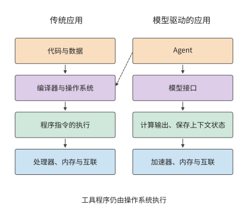

*图 1-1　应用行为的表达方式与执行路径。左侧通过代码组织程序，右侧通过上下文调用模型；实线表示向下的执行依赖，虚线表示工具执行仍需传统操作系统。加速器、内存与互联分别承担模型计算、数据存储和设备间传输的职责。*

可编程性的变化也改变了模型服务的运行方式。在 AI 系统中，同一个模型为不同应用处理请求时，使用的是同一组参数。系统可以将多条请求合并计算，共用一次读入的参数，提高加速器利用率。这种方式称为批处理，每批共同执行的请求数称为 batch size（批次大小）。与此同时，长文档、长回答和多轮工具调用会改变计算量、状态占用和等待时间。同一个模型、同一套加速器，处理不同任务时，性能可能相差甚远。

这种性能差异的背后，是模型与硬件之间的相互影响。从模型设计来看，压缩保存的状态、改变注意力机制或只使用部分模型参数，可以改变硬件需要完成的工作；从硬件条件来看，存储容量、数据传输速度和设备连接方式，又会影响哪些模型结构和执行方法更合适。理解这种双向关系，才能同时讨论回答质量、响应时间和成本，并解释为什么适合一个应用的方案，用于另一个应用时还需重新评估。

在以模型训练和推理为主要应用的系统中，各层可以围绕同一个完整的执行过程共同设计。模型结构给出计算和数据依赖，运行时掌握状态何时产生、何时使用，硬件承担相应的运算和传输。利用这些信息重新组织执行，可以消除通用实现中的部分开销。同一模型又能根据不同上下文处理多种任务，既能支持多样的应用行为，又能让底层针对模型执行做专门优化。**上层可编程性的变化，为跨层联合优化打开了新的空间。** 本书用量化分析研究这些优化机会，解释原有的设计取舍如何改变，新的实现又如何提高训练和推理的性能。

### 1.1.2 从任务到硬件的六层分工

一次请求从提出到完成，要依次经过系统的多个层次。用户提交一段代码，请模型找出错误。应用把代码和问题交给模型服务，服务选定执行请求的加速器，加速器读入权重与输入、完成计算，再把生成的回答交回应用。若多个加速器共同执行，还要在加速器之间传递中间结果。沿这条路径，就能逐步找到等待发生在哪里、哪份数据需要搬移。

华为半导体首席科学家廖恒博士提出 “十八层宝塔”，用来描述从应用、模型与软件系统，到芯片、制造工艺和底层物理的多个层次。他指出，大多数人只了解其中的一层或几层，因而错失了许多跨层联合优化的机会。[^panorama] 图 1-2 借鉴这一方法，将本书内容划分为六个层次：

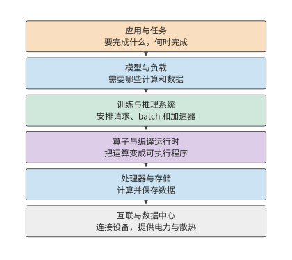

*图 1-2　从应用到硬件的六层分工。*

最上面是**应用与任务**。对话、代码生成、语音交互，以及能够调用工具推进任务的智能体（Agent），都在这一层提出具体要求：要完成什么任务，多快返回结果，成本上限是多少。训练也有自己的任务目标，例如在给定时间内完成一次模型更新或一轮预训练。

下一层是**模型与负载**。模型结构规定要做哪些计算、保留哪些数据；实际负载则决定这些工作何时到来、持续多久。一句简短的提问和一篇长文档，即使交给同一个模型，也会形成不同的计算与存储需求。模型结构在第 2 章展开，训练与推理负载在第 3 章展开。

**训练与推理系统**负责把这些需求组织成可执行的工作。这一层接收请求或作业，组织 batch，管理运行状态，并决定如何使用一个或多个加速器。在推理中，它要协调正在生成的请求和新进入的请求；在训练中，它还要组织参数更新、通信和恢复。第 8—10 章讨论这一层。

再向下是**算子与编译运行时**。模型中的矩阵乘法、归一化（按统计量调整数值尺度）等操作，需要转换为处理器能够执行的程序。本书把矩阵乘法等基本运算称为算子；算子库提供这些运算的实现，编译器把程序转换为加速器可执行的形式，运行时负责提交程序和管理执行中的资源。三者共同决定如何分块、如何使用临时存储、何时提交工作。相同的数学表达式，可以有不同的数据访问和执行方式，第 5 章会具体分析这些差异。这里还有理解分布式并行的一条线索：矩阵在一张卡内可以分块执行，模型在多张卡上也可以按样本、序列、特征、层或专家（混合专家模型中按输入逐个选用的子网络）分工。两者都要先确定每块由谁计算，再安排输入到达与结果汇合。区别在于块之间跨越的是片内存储、显存还是网络。第 6 章将沿这条线索解释各种并行策略，而非将其视为互不相关的技巧。

**处理器与存储**负责执行计算、保存数据。CPU 是执行通用程序的中央处理器；GPU 是擅长并行处理大量相似运算的图形处理器，如今也广泛用于模型计算；NPU 是面向神经网络运算设计的处理器。主存存放 CPU 使用的数据，显存存放 GPU 使用的数据，片上存储则位于处理器芯片内部，让计算单元能就近读取数据。计算单元先读取输入，再执行运算，最后写回结果。第 4 章将从计算能力与数据读取速度的关系出发，解释加速器的设计。

最下面是**互联与数据中心**。设备之间通过互联交换数据，服务器和更大的协作组通过网络连接，供电与散热决定资源能够如何部署。第 6、7 章讨论超节点与数据中心网络，第 12 章进一步把执行位置扩展到端、边和云。

六个层次说明了主要分工，但有些能力贯穿多个层次。资源调度、运行环境、观测和计费需要结合多个层次的信息来组织；工艺、封装、供电和散热则决定设备能够如何制造和部署。网络也并非只在最下方发挥作用：需要跨设备协作的模型、算子和服务，都要经过具体互联。

沿这六层向下看，任务逐步变成具体的计算与数据访问；向上看，加速器的可用存储容量、算力与带宽决定系统能运行多大的模型、同时处理多少请求，以及能多快作出响应。这些层次之间的接口，也是联合优化的切入点。模型改变状态表示，会改变存储和通信需求；编译器将相邻算子融合，会改变中间结果的存放位置；运行时让加速器直接交接，会改变主机参与的次数。

### 1.1.3 一次生成请求的处理过程

**推理实例**是能够独立完成模型请求的一组执行资源，可以由一个或多个加速器组成。每次请求交由其中一个实例处理。图 1-3 展示了请求分配与实例内部执行的分工：服务路由器是选择请求执行位置的软件；路由器选定实例后，由实例内部安排加速器执行模型。先分清谁负责执行，才能知道一份权重应放在哪里、一份中间结果应传给谁。

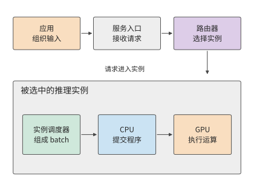

*图 1-3　一次请求先由路由器选择推理实例，再由实例内部的调度器安排执行。灰色外框圈出同一个实例，实线表示请求和工作提交的方向。*

上下文包括用户输入、已有对话、检索结果和此前生成的内容。应用把这些信息组织成请求，交给模型服务入口。入口核验访问权限、检查配额和请求内容后，路由器依据目标模型、实例负载等条件选择一个实例；实例可以运行在一张卡上，也可以分布在多张卡上。选定实例之后，实例内部再安排这些卡协作。

文本随后转换成 token 序列。词元（token）是模型处理文本的基本单位，可能对应一个字、词的一部分或其他片段，具体文本的 token 数由分词结果确定。文本转换可以由实例或共享前端完成。实例调度器将请求放入队列，再编入 batch，并为其状态分配空间。CPU 上的运行时随后向 GPU 提交计算任务，GPU 执行相应算子。[^request]

模型先处理输入，这一阶段称为预填充（prefill）；随后逐步生成新 token，这一阶段称为解码（decode）。后续步骤会复用此前保存的状态，其中的 KV 缓存（KV cache）保存上下文 token 产生的键和值两类向量，供后续位置的注意力计算使用。键和值是注意力机制使用的数据表示，第 2 章将结合具体运算说明键和值如何产生。生成循环由实例内部的调度器持续推进，前一步输出成为下一步输入。产生的 token 经输出处理转换为文本，沿连接流式返回；如果输出要求调用工具，应用运行工具，把结果加入上下文，再发起后续调用。

上述每步计算反复使用的数据，首先是模型权重。模型权重是训练得到、用于把输入变换成输出的数值参数。权重在实例启动或模型切换时从存储加载，随后持续存放在显存中（称为驻留），供多次请求使用。生成时，GPU 计算单元从显存读取当前层的权重和上下文状态，完成运算，再将结果交给下一层。同一份数据由此经历两种频率不同的搬移：加载把模型送到加速器，执行则反复把所需数据送到计算单元。在多卡实例中，一张卡算出的中间结果还要传给其他卡，后续计算才能继续。中间张量是运算产生并交给后续运算的多维数值数组，矩阵就是二维张量。**外部请求可能只有一小段文字，内部搬移的数据却包括大得多的权重、状态和中间张量。**

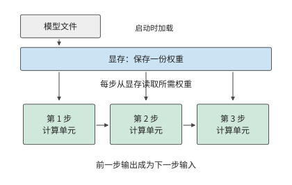

*图 1-4　权重加载一次，生成时逐步读取。蓝框表示显存中持续保存的同一份权重，三个绿框表示先后发生的计算；箭头表示读取或结果依赖，步骤间距不代表耗时。*

图 1-5 展示这些软件功能对应的硬件。数据中心包含入口与 CPU 服务、共享存储，以及由多个超节点构成的加速器资源池。超节点是一组通过高带宽互联紧密协作的加速器，可以分布在多个服务器或计算托盘（机柜内装有 CPU 与加速器的可插拔单元）中。

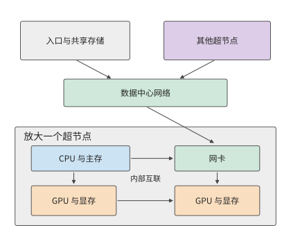

*图 1-5　物理连接的两层视图。上方用数据中心网络连接服务与超节点，下方放大一个超节点，显示主机、网卡、GPU 与显存；线条展示数据路径，设备数量用于示意。*

在服务器或计算托盘内，CPU 连接主存，负责主机程序和执行控制；GPU 连接各自的显存，执行模型计算、保存运行所需的数据。HBM（高带宽内存）是加速器常用的一类显存，通过宽接口持续提供数据。CPU 与 GPU 可以通过 PCIe（高速外设互联）连接，GPU 之间也可以通过独立的高速互联直接交换数据。网卡把本机连接到网络。在支持直接内存访问的系统中，数据可以由传输硬件直接写入指定内存区域，CPU 负责发起和管理传输；第 7 章会进一步解释这种交接。

超节点内部的互联通常称为 **scale-up**（纵向扩展），重点是让一组加速器以较低的通信开销共同计算；多个超节点再通过网卡与交换网络相连，称为 **scale-out**（横向扩展），用来扩大集群范围。两者都要考虑带宽、延迟、拥塞与故障，但协作范围和代价不同。以 NVIDIA 的 GB200 NVL72 为例，官方设计把 36 个 Grace CPU 和 72 个 Blackwell GPU 组织在一个机柜中，72 个 GPU 通过 NVIDIA 的 GPU 高速互联 NVLink 直接协作，形成同一个互联域，集群网络则负责对外连接。这种组织方式把紧密协作的范围从单机扩大到了机柜，模型可以在更多加速器之间分配权重和状态，频繁的交接则由机柜内互联完成。[^datacenter]

AI 网络与传统数据中心网络由此形成了分工。服务入口传递请求，共享存储提供模型文件，加速器互联传递计算中的中间结果。三种流量的传输频率、数据量和依赖关系不同：模型文件可以提前加载，当前层的部分结果却必须及时到达，下一层才能继续。物理连接因此直接影响模型的执行时间。

> **练习 1-1〔延伸〕：一次请求中的权重读取、状态增长与数据传递**
>
> 沿图 1-3 至图 1-5，补画 KV 状态随输出增加的过程，再分别标出模型文件加载、一步权重读取、KV 追加和卡间结果传递。若回答从 100 个 token 增至 1000 个，哪些数据只加载一次，哪些访问会增加？若把一个实例复制成两个实例，权重容量与请求路由又怎样改变？

一次模型执行既受单卡能力影响，也受加速器连接方式影响。单卡的算力和存储带宽决定本地计算与读写的耗时，多卡协作则增加数据交换和等待。本章先估算单卡执行，后续章节再把同样的方法用于超节点和网络。

先介绍一组贯穿全书的真实模型。DeepSeek V4 和 V4.1 Flash 提供了一条可以持续追踪的线索。V4 已经通过上下文压缩与稀疏访问改变存储和读取需求，V4.1 Flash 则进一步重新划分模型内部的职责。传统的 decoder-only（仅解码器）模型通常让输入 token 经过完整主干，逐层建立生成所需的状态；V4.1 Flash 采用**因果编码器—解码器（Causal Encoder-Decoder，CED）**架构，由编码器形成上下文表示，解码器从这些表示取得全局信息。大量输入 token 因此无需经过解码器主体的计算；生成新 token 时，模型仍依次经过编码器与解码器。输入与输出的执行路径并不对称，模型因此能针对 Agent 输入多、输出相对少的负载重新安排计算投入。[^v41-case]

这是一项架构层面的选择，也会改变系统需要保存和传输什么。本书将围绕同一类会话展开讨论：Agent 等待工具返回，恢复此前上下文，处理新增输入，再继续生成。第 2 章解释 CED 的结构与状态，第 3 章分解输入和生成负载，第 4—7 章追踪加速器执行和数据路径，第 8、9 章讨论如何缓存状态、分配请求，最后比较完整任务的执行效果。开源模型 Qwen3 提供基础算例，用于建立计算方法；V4／V4.1 用于检验模型与系统如何共同改变。

## 1.2 系统设计的关键数字

### 1.2.1 用数量级判断方案

估算单卡执行之前，先要知道各类基本操作大致耗时多少。Jeff Dean 在 2009 年的一次演讲中列出了一张后来被广泛引用的表，标题是“Numbers Everyone Should Know”。表中既有缓存、内存的访问时间，也有磁盘和网络操作的时间。这张表体现了一种实用的工作方式：在写程序或搭建系统之前，先估算主要操作需要多少时间和资源。[^dean]

下面完整列出原幻灯片的 12 项操作和数值。所有时间统一为 ns（纳秒，十亿分之一秒）；1 μs（微秒）等于 1000 ns，1 ms（毫秒）等于 1000 μs。数据单位中，1 byte（字节）等于 8 bit（比特）；bit/s 表示每秒传送的比特数，Gbit/s 中的 G 表示十亿。容量单位 KB、MB、GB、TB 分别表示 $10^3$、$10^6$、$10^9$、$10^{12}$ 字节；KiB、MiB、GiB 分别表示 $2^{10}$、$2^{20}$、$2^{30}$ 字节。这组数字对应 2009 年的设备环境，用于理解不同操作之间的数量级关系。

缓存保存近期可能再次使用的数据；一级缓存通常比二级缓存更小、更靠近计算核心。分支预测是处理器对接下来执行哪条指令路径的预判，预测错误时要重新安排执行。线程是程序中独立调度和执行指令的单位；互斥锁限制多个线程同时访问同一份共享数据。磁盘寻道是机械磁盘移动磁头、定位目标磁道的过程。Zippy 是 Google 当时使用的压缩库。这些操作分别涉及计算、同步、存储与网络，耗时可能相差多个数量级。

| 操作                    |      时间（ns） |
| --------------------- | ----------: |
| 访问一级缓存                |         0.5 |
| 分支预测错误后的恢复            |           5 |
| 访问二级缓存                |           7 |
| 对互斥锁加锁或解锁             |          25 |
| 访问主存                  |         100 |
| 用 Zippy 压缩 1K 字节      |       3,000 |
| 经 1 Gbit/s 网络发送 2K 字节 |      20,000 |
| 从主存连续读取 1 MB          |     250,000 |
| 同一数据中心内往返             |     500,000 |
| 磁盘寻道                  |  10,000,000 |
| 从磁盘连续读取 1 MB          |  20,000,000 |
| 数据包从加州到荷兰再返回          | 150,000,000 |

取其中三个历史数字：主存访问约 100 ns，同一数据中心内的一次往返约 500,000 ns，磁盘寻道约 10,000,000 ns。换算单位后即 0.1 μs、0.5 ms 和 10 ms，如图 1-6 所示。

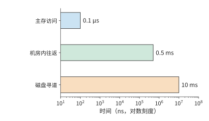

*图 1-6　Jeff Dean 2009 年演讲中的三种操作延迟。横轴为对数刻度，每相邻数量级相差十倍；先识别操作，再比较它们在串行等待中的代价。*

按这组数字，一次磁盘寻道所需的时间约为一次主存访问的十万倍。若请求需要依次等待多次访问，这些延迟就会累加，延长请求的完成时间。若请求必须先找到一块数据，才能确定下一次访问的位置，处理器在两次访问之间即使只做很少的计算，也要等待整个存储访问过程。

例如，设请求串行执行 20 次寻道，每次 10 ms，全部 CPU 计算为 1 ms，总时间就是 201 ms。把计算速度提高一倍，只能节省 0.5 ms；把相关数据连续放置，将寻道次数从 20 次减为 10 次，则节省 100 ms。两种优化分别作用于计算与等待，收益的差距来自它们在原执行时间中的占比。

把时间分解后，就能算出优化方向：某一部分在原总时间中占比越大，缩短这一部分对整体的改善越大。在前面的寻道例子中，计算只占总时间的 $1/201$；即使这一部分完全消失，总时间也只减少约 $0.5\%$。

将上述关系推广，便得到总加速比的计算公式。若原执行时间中有比例 $f$ 的部分能够加速 $s$ 倍，其余工作与执行次序保持不变，则总加速比为：

$$
\mathrm{Speedup}=\frac{1}{(1-f)+f/s}.
$$

这就是 Amdahl（阿姆达尔）定律。即使把这部分加速到耗时可以忽略，总加速比也不超过 $1/(1-f)$。当寻道次数减少时，被缩短的是占比最大的等待部分，因此这项优化对总时间的作用远大于 CPU 加速。

**例：同样使用 AI 编程工具，为什么不同团队的整体加速比不同？** 假设完成一项开发任务，需要依次经历沟通、编码、评审和审批等环节，AI 编程工具让编码速度提高到原来的 5 倍，其他环节的耗时保持不变。在协调层级较多的大公司团队里，编码可能只占原总耗时的 20%—30%，其余时间花在开会、跨团队沟通和审批上。代入公式，整体加速比只有约 1.19—1.32 倍。例如，原来需要 100 小时，其中 20 小时用于编码；编码缩短到 4 小时，其他环节仍需 80 小时，总耗时就是 84 小时。

在沟通成本较低的创业团队里，假设编码占原总耗时的 70%—80%，同样的编码加速就能让整体加速比达到约 2.27—2.78 倍。以编码占 80% 为例，原来的 100 小时变成 $20+80/5=36$ 小时。

**Amdahl 定律适用于任何只加速部分环节的完整流程。** CPU、模型推理和软件开发都可以用同一个问题来分析：被加速的部分原来占多少时间，剩余时间花在哪里？想进一步缩短交付时间，就要继续改善沟通、评审和审批等环节。局部速度的提升，最终要放回完整任务中衡量。

这张表体现的方法可以直接用于模型执行：先确定各项工作使用什么资源，再比较所需时间。

### 1.2.2 分析 AI 系统需要哪些关键数字

设某任务同时需要保存 $M$ 字节，执行 $F$ 次浮点运算，并通过某个存储接口读写 $R$ 字节。加速器提供容量 $M_{\mathrm{cap}}$、计算吞吐 $\Pi$ 和接口带宽 $\beta$。这三类需求必须分别与加速器提供的资源比较：

$$
M\le M_{\mathrm{cap}},\qquad
T_{\mathrm{compute}}=\frac{F}{\Pi},\qquad
T_{\mathrm{memory}}=\frac{R}{\beta}.
$$

容量决定能否同时保存所需数据；后两项把工作量换算为时间。一份数据可以保存一次、读取多次，所以 $M$ 与 $R$ 要分别计算。若 $\Pi$ 和 $\beta$ 取峰值，得到的就是完成指定计算与读写所需的时间下界。

峰值由芯片的计算单元数量、工作频率和存储接口决定，所以这个下界就是硬件的物理极限，软件无论怎样组织都不可能更快。下界与实际耗时 $T$ 之比，反映硬件能力被用掉了多少。计算方面的比值 $F/(\Pi T)$ 称为 **MFU**（model FLOPs utilization，模型 FLOPs 利用率），带宽方面的比值 $R/(\beta T)$ 称为 **MBU**（memory bandwidth utilization，带宽利用率），两者都不超过 1。全书反复使用这两个比值，回答的是同一个问题：设计离硬件的物理极限还有多远。

除了容量、计算吞吐和带宽，还需要认识操作延迟。下面分别说明这四类数字如何进入估算。

**容量**回答能同时放下多少数据。例如，一张加速卡有多少显存，决定了能否容纳模型权重、上下文状态和运行时的临时工作区。容量以 byte（字节）计量。

**计算吞吐**回答单位时间内能完成多少运算。常见的 FLOP 表示一次浮点运算，FLOPs 表示运算总次数，FLOP/s 表示每秒的浮点运算数。GFLOPs、TFLOPs 分别表示十亿、万亿次浮点运算，GFLOP/s、TFLOP/s 则表示相应的每秒速率。矩阵计算中一次乘法加一次加法通常计为两次运算。矩阵峰值对应特定的输入精度、累加精度和稀疏条件。稠密计算按完整矩阵执行；稀疏计算利用零元素或规定的稀疏结构跳过部分运算。

**带宽**回答单位时间内能传送多少数据。显存带宽描述显存与芯片之间的数据搬移能力，卡间链路和网络带宽描述其他路径的能力。估算哪一段传输，就使用该段接口的带宽。

**延迟**回答发起一次操作以后需要等多久。高带宽接口也可能有不可忽略的启动或往返时间。传输大数据块时，耗时主要取决于数据量与带宽的比值；请求较小且必须逐次等待时，启动和往返时间就可能占据主要部分。

以一款真实加速器为例。H100 是 NVIDIA 的一代 GPU，SXM 指本例采用的模块形态。BF16 是每个数占 16 位（2 字节）的浮点格式，FP32 是每个数占 32 位（4 字节）的浮点格式；矩阵乘法可以读取 BF16 输入，用 FP32 保存累加结果。H100 SXM 的显存容量为 80 GB，HBM 带宽为 3.35 TB/s，BF16 输入、FP32 累加的稠密矩阵峰值约为 989.4 TFLOP/s。[^h100]

将 H100 与 NVIDIA 的 A100 80GB SXM、GeForce RTX 4090 放在一起，就得到一张 GPU 资源速查表。三者分别采用 Hopper、Ampere 和 Ada 架构。表中的容量使用厂商名义 GB，带宽使用十进制 TB/s；矩阵算力统一采用 BF16 输入、FP32 累加、稠密计算的峰值。最后一行由 1 GB 除以显存带宽得到。[^gpu-numbers]

| 资源或操作 | RTX 4090 | A100 80GB SXM | H100 SXM |
| --- | ---: | ---: | ---: |
| 显存容量（GB） | 24 | 80 | 80 |
| 显存带宽（TB/s） | 1.008 | 2.039 | 3.35 |
| BF16 矩阵峰值（TFLOP/s） | 165.2 | 312 | 989.4 |
| 按带宽峰值读取 1 GB（ms） | 0.99 | 0.49 | 0.30 |

这张表提供了把工作量换算成时间所需的硬件性能数据。例如，读写量保持不变而带宽增加一倍，$R/\beta$ 减半；计算量保持不变而算力增加一倍，$F/\Pi$ 减半。

### 1.2.3 参数存储量与链路带宽的换算

这四类指标要与具体工作对应起来，才能用于估算。第一步是把模型参数换成存储字节数，判断加速器能否放下；第二步再用字节数除以带宽，估算搬移这些数据需要多久。

以真实模型 **DeepSeek-R1-Distill-Llama-70B** 为例。该模型基于 Llama 架构，是稠密模型（每个 token 都使用全部参数计算），公开权重包含约 705.54 亿个参数。名称中的 B 表示十亿，70B 是参数规模的约数；后文公式中的变量 $B$ 表示 batch 中的请求数。用 $N$ 表示参数数量，$b_W$ 表示每个权重的存储字节数。BF16 每个权重占 2 字节，公开权重文件中的总字节数为[^real70]

$$
\begin{aligned}M_W&=Nb_W\\&=70{,}553{,}706{,}496\times2\ \mathrm{bytes}\\&\approx141.11\ \mathrm{GB}.\end{aligned}
$$

本节统一使用十进制 GB，即 $1\ \mathrm{GB}=10^9$ bytes；二进制单位 GiB 则为 $2^{30}$ bytes。因此，141.11 GB 约为 131.42 GiB。加速器的可用存储容量与权重大小换成相同单位后，才能相减。

141.11 GB 权重超过一张 H100 SXM 的名义 80 GB 显存。将权重均分到两张卡上，每张约占 70.55 GB，各剩约 9.45 GB。**切分**即让不同加速器分别保存并计算模型的一部分。两张卡之间需要交换中间结果，第 6 章将讨论具体的切分与通信方法。

还可以改变权重的存储精度。**量化（quantization）**用较少的位数表示数值，例如用 8 位整数近似表示原来的 16 位浮点权重，并用 scale（缩放因子）将整数还原为相应范围内的近似值。每个量化后的权重从 2 字节减为 1 字节，内存占用因而明显下降。

本书采用的分组量化方案每 128 个权重共享一个 scale，同时让部分参数继续使用 BF16。按真实模型配置计算，8 比特方案的全部权重及量化附加数据约占 73.73 GB，可以放入一张 H100 SXM，留下约 6.27 GB。图 1-7 将两种办法放在相同的容量刻度上：BF16 权重分到两张卡，或者量化后放入一张卡。

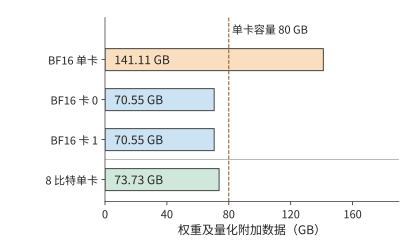

*图 1-7　DeepSeek-R1-Distill-Llama-70B：BF16 权重共 141.11 GB，两卡均分后每卡约 70.55 GB；分组 8 比特量化后共 73.73 GB。各条使用相同尺度，虚线表示一张 H100 SXM 的名义 80 GB 容量。柱长只计权重及相应量化附加数据。*

**KV 缓存如何增加单请求的显存需求。** 生成文本时，显存还要保存 KV 缓存，供后续计算直接复用；算子执行还需要临时工作区。因此，容量检查应写成

$$
M_W+M_{\mathrm{state}}+M_{\mathrm{work}}\le M_{\mathrm{cap}}.
$$

其中 $M_W$ 是权重与量化附加数据，$M_{\mathrm{state}}$ 是请求的上下文状态，$M_{\mathrm{work}}$ 是工作区，$M_{\mathrm{cap}}$ 是加速器的可用存储容量。以该模型的一条 8192 个 token 的请求为例，BF16 KV 缓存为 2.5 GiB，约 2.68 GB；再预留 2 GiB、约 2.15 GB 给工作区，8 比特方案总共约占 $73.73+2.68+2.15=78.56$ GB，符合这一容量预算。第 2 章将从模型层数与注意力结构推导 KV 大小，并计算更长上下文和更多并发请求的内存需求。

换成名义显存为 24 GB 的 RTX 4090，同一份 73.73 GB 权重就超过了三张卡合计的 72 GB。按相同的名义容量预算，仅保存权重也至少需要四张；还要逐卡检查 KV 和工作区。模型与精度相同，单卡容量不同，所需加速器数量就会改变。

网络传输也要做同样的单位换算。网络带宽常以 bit/s 计量，8 bit 为 1 byte，所以一张 400 Gbit/s 的 ConnectX-7 网卡，线速（链路的标称传输速率）等于 50 GB/s。按此线速传输 1 GB 数据需要 20 ms。每次传输还需要启动时间，协议开销和共用链路的其他流量也会影响应用实际获得的带宽。沿传输路径计入这些因素，便能更细致地估算通信时间。

> **练习 1-2〔核心〕：不同权重精度下的显存需求与多卡分配**
>
> DeepSeek-R1-Distill-Llama-70B 的 BF16 权重占 141.11 GB，8 比特量化权重占 73.73 GB。部署在 H100 SXM 上，每张卡有 80 GB 显存。为每张卡预留 5 GB 状态与工作区，分别判断单卡部署和将权重均分到两张卡的方案能否容纳模型。再考虑两张显存容量不同的卡：一张 48 GB 的 RTX A6000 和一张 80 GB 的 H100 SXM，分别判断两种精度下能否完成部署，并为可行的方案给出一种权重分配方式。最后将 400 Gbit/s 换成 GB/s，求传输 1 GB 的理想时间。

## 1.3 用几个数字估算一次模型执行

### 1.3.1 生成一个 token，先检查什么

**例题 1-1：70B 模型的单步生成如何接近 10 ms 目标？** 给定一张 H100 SXM，能否让上一节的 DeepSeek-R1-Distill-Llama-70B 在 10 ms 内生成一个新 token？先考虑每参数一字节存储，再比较算力翻倍、带宽翻倍和批内权重复用。

**解：先检查显存容量，再计算运算量和读取量。**

为便于手算，将该模型的参数量近似取为 $N=70\times10^9$，先按每个参数一字节估算主要权重的数据量，读入后转换为 BF16 参加矩阵运算。单个请求每步处理一个新 token，每步从显存读取一遍这些权重。

**估算条件：权重读取与矩阵计算充分重叠。** 容量采用上一节计入量化附加数据的 73.73 GB 结果；本节先将主要权重的读取量近似为 70 GB。时间模型只计主要权重矩阵的乘加和一次完整权重读取，采用资源表中的 BF16 矩阵峰值与 HBM 带宽；读取和计算按充分重叠估算。

单请求的容量预算上一节已经检查。生成速度方面，权重加载到显存之后，每一步仍需将参与计算的权重送到计算单元；按上述近似，每步读取约 70 GB。

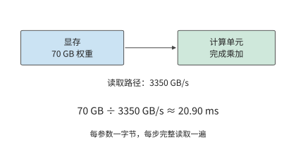

*图 1-8　本例按每参数一字节，将主要权重读取量近似取为 70 GB。权重驻留显存，计算单元每步沿同一接口读取一遍；用读取量除以接口带宽，得到 20.90 ms 的读取下界。*

这 20.90 ms 的读取开销会在每个生成步骤重复出现。对单个请求，下一步的输入由当前输出确定，后续步骤要沿这条依赖逐次推进。

计算量也可以先做近似。一次矩阵与向量的乘法中，每个权重通常参与一次乘法，所得乘积再累加到结果中；按乘法与加法分别计数，大约对应两次浮点运算。因此，本例的主要矩阵运算量近似为：

$$
\begin{aligned}\text{每步矩阵运算量}&\approx2\times\text{参数数}\\&\approx2\times70\times10^9\ \mathrm{FLOPs}\\&=140\ \mathrm{GFLOPs}.\end{aligned}
$$

$2N$ 的来源是：在投影（用权重矩阵对特征向量做的线性变换）中，每个权重与一个 token 特征向量中的对应分量相乘，再将乘积累加到输出中。参数矩阵中的权重越多，这部分工作量就越大；一批中参与计算的 token 数增加时，同一权重矩阵处理更多 token 的特征向量，运算量随之增加。第 2 章将展开真实模型，在这部分线性工作之外加入随上下文长度变化的注意力交互。

把 batch size 记为 $B$，并让这 $B$ 个请求共同使用一次读入的权重，就得到这一教学模型的三个量：

$$
M_W=b_WN,\qquad R_W=b_WN,\qquad F\approx2BN.
$$

前两个式子在这一步恰好相等，是因为权重保存一份、读取一遍。执行下一步生成时，驻留量仍是 $M_W$，却会再增加一次 $R_W$ 的读取。$B$ 增大则增加本次运算量：同一份权重要与更多请求的当前输入 token 向量做乘加运算。第 2 章将进一步加入各请求独立的上下文状态。

### 1.3.2 计算与读取分别需要多久

把 $F=140\ \mathrm{GFLOPs}$ 与 $R_W=70\ \mathrm{GB}$ 分别除以相应的资源能力，得到单请求的两项时间下界。

$$
\begin{aligned}\text{纯权重读取时间}&\geq\frac{70\ \mathrm{GB}}{3350\ \mathrm{GB/s}}\approx20.90\ \mathrm{ms},\\\text{矩阵计算时间}&\geq\frac{140\ \mathrm{GFLOPs}}{989400\ \mathrm{GFLOP/s}}\approx0.1415\ \mathrm{ms}.\end{aligned}
$$

权重读取的时间下界约为矩阵计算的 148 倍。按标称算力，矩阵运算耗时极短；显存把权重送到计算单元却需要长得多的时间。完成当前步骤之前，这些数据必须全部读入。[^budget]

原因在于，本例每读取一个权重只做一次乘加。计算单元迅速处理完已读入的数据后，又要等待后续数据。提高算力只能缩短乘加耗时，无法加快显存读取。

这两项时间应当相加，还是取其中较大者，取决于读取与计算能否重叠。若数据分块到达，计算当前块时可以继续读取下一块；在充分重叠的简化模型中，耗时下界为：

$$
T_{\mathrm{step}}\ge T_{\mathrm{lower}}=\max\!\left(\frac{F}{\Pi},\frac{R_W}{\beta}\right).
$$

进入稳定阶段后，每块数据都要经过读取和计算，较慢的一项决定处理速度。本例中，读取权重远慢于矩阵计算，因此优化应首先针对这 20.90 ms 的读取时间。

**讨论：算力、带宽与批内复用分别能缩短多少生成时间？** 仅权重读取就至少需要 20.90 ms，已经超过 10 ms 的目标。虽然显存能容纳这些数据，读取速度仍然达不到要求。先分别比较增加算力与增加带宽的效果。

把计算能力翻倍，矩阵计算时间从约 0.1415 ms 变为 0.0707 ms，纯权重读取仍需要约 20.90 ms，决定执行时间的读取下界保持不变。把 HBM 带宽翻倍，读取时间才会降为约 10.45 ms，当前下界随之下降。两种改动都提升了一项硬件能力，但对任务耗时的影响不同。

另一种办法是减少需要读取的数据。运算量不变时，把权重减半，读取下界也降到约 10.45 ms。带宽翻倍让读取速度加倍，权重减半则让待读取的数据减少一半，两种办法在这条算式中取得相同结果。第 2 章和第 5 章将讨论低位宽表示的格式和转换过程。

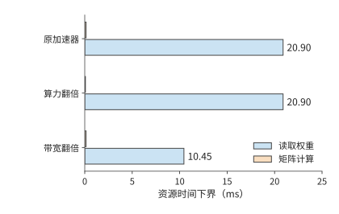

*图 1-9　保持运算量与读取量不变，分别把算力或带宽翻倍。蓝条是权重读取下界，橙条是矩阵计算下界；较长的读取项决定这组条件下的优化方向。各柱分别表示计算或数据读取的时间下界，完整执行仍须满足依赖关系。*

接着改变请求组织。假设 8 个请求同时处理并共享一次权重读取，整批的权重读取仍是 70 GB，矩阵运算量则约为单请求的 8 倍。这时矩阵计算的时间下界约为 1.13 ms，读取下界仍为 20.90 ms。若这一批产生 8 个输出，每个输出分摊的权重读取时间约为 2.61 ms。

整批执行产生八个输出，吞吐因而从单请求模型的约 47.9 token/s 提高到约 383 token/s，而每个请求仍须等待整批执行完成。**批内复用增加同一时间内生成的输出数，单请求延迟则取决于它经历的执行与等待。**

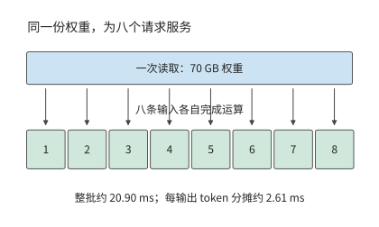

*图 1-10　一批八个请求共享一次权重读取，各产生一个输出。整批读取仍需约 20.90 ms，除以八得到每输出分摊的服务时间；每个请求经历整批执行。“每输出 token 分摊”是整批耗时除以输出 token 数，用于换算吞吐，不是单个请求的响应延迟。*

batch 增大到一定程度后，计算时间将追平权重读取时间。令 $2BN/\Pi=b_WN/\beta$，得到转折点

$$
B_* = \frac{b_W\Pi}{2\beta}.
$$

本例取 $b_W=1$、$\Pi=989.4\times10^{12}\ \mathrm{FLOP/s}$、$\beta=3.35\times10^{12}\ \mathrm{bytes/s}$，得到 $B_*\approx147.7$。在这一只计主要矩阵运算与权重读取的模型中，batch 较小时，增加请求可以分摊权重读取开销；超过约 148 后，计算耗时超过权重读取耗时，继续增加 batch 会近似按比例增加整批时间。该转折点只比较矩阵运算与权重读取，没有计入各请求的上下文状态：按 1.2.3 节的容量预算，一张 H100 SXM 容纳 73.73 GB 权重后只剩约 6.27 GB，无法容纳 148 条请求的 KV。

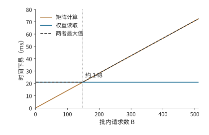

*图 1-11　批内请求增加时，矩阵运算量按 $2BN$ 增长，权重读取保持每批 70 GB。约 148 个请求处两项下界相等，随后计算耗时决定整体速度。*

把每批输出数 $B$ 除以上图中的时间下界，便得到这组题设对应的吞吐上界。转折前，共享的读取由更多输出分摊；转折后，计算时间与输出数一起增长，曲线逐渐趋于平坦。

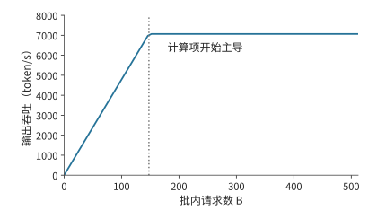

*图 1-12　上述批处理模型的理想输出吞吐率。每批输出数除以时间下界得到曲线；竖虚线与前图对应同一个约 148 请求的转折点。*

同一转折也可以用算术强度 $I=F/R_W=2B/b_W$ 描述，即每读取一字节数据所完成的运算次数。当 $I$ 小于加速器的算力与带宽之比 $\Pi/\beta$ 时，读取所需时间更长；超过该比值后，计算所需时间更长。这就是第 4 章 Roofline（屋顶线）模型的出发点。[^roofline]

> **练习 1-3〔核心〕：带宽与 batch size 如何影响单步生成时限**
>
> 采用例题 1-1 的模型与加速器，将有效带宽设为标称值的 70%，有效计算吞吐率设为峰值的 50%。分别取 $B=1,16,64$，计算整批执行时间的下界、平均每个输出 token 分摊的执行时间，以及理想吞吐率。目标是每请求每步不超过 10 ms：哪些 batch size 仅根据时间下界就可以判定无法满足目标？再把权重读取量减半、运算量保持不变，重新判断。求计算时间与读取时间相等时的 batch size $B_*$，并解释为什么每个输出分摊的执行时间减少，并不意味着每个请求的单步延迟缩短。

### 1.3.3 用实测检验估算

前面的模型预测了两个趋势：batch 较小时，吞吐随 batch 增加；整批时间则受到一次权重读取的限制。真实程序中，每条新增请求还会增加上下文访问与计算。图 1-13、1-14 给出 Qwen3-8B 在 RTX PRO 6000 Blackwell Workstation Edition 上使用 BF16 权重的测量结果。这张卡有 96 GB 显存、1.792 TB/s 显存带宽，BF16 输入、FP32 累加的稠密矩阵峰值为 503.8 TFLOP/s。vLLM 是加州大学伯克利分校等机构的研究者在 2023 年提出的开源推理服务系统，负责组织模型请求并执行推理，最初重点解决的是 KV 缓存浪费显存、限制 batch size 的问题。本次采用 0.23 版本的 eager 模式，即按程序运行顺序逐项向加速器提交工作。每请求输入 2048 个 token、生成 256 个 token，每档 batch 测量三次。[^measurement] 吞吐表示单位时间内产生的输出数；**每输出 token 时间**（time per output token，TPOT）在这里表示客户端观察到的平均输出间隔。

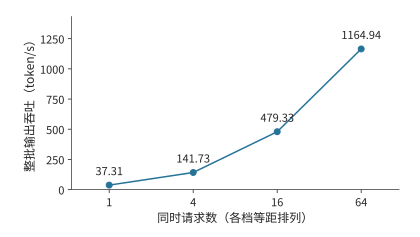

*图 1-13　Qwen3-8B 实测的整批输出吞吐。四档请求数等距排列，纵轴从零开始；模型、精度、输入输出长度和计时范围保持一致。*

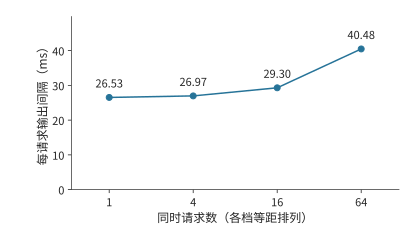

*图 1-14　同一组实测中的每请求输出间隔。吞吐增加的同时，单个请求的平均间隔也在增大；两张图分别说明加速器的输出速度和用户的等待时间。*

从 1 个请求增到 64 个请求，整批吞吐约提高 31 倍，单请求输出间隔则从约 26.5 ms 增至 40.5 ms。两幅图合起来描述批处理的取舍：加速器在同样长的时间内完成更多请求的工作，每个请求完成一步生成所需的时间却更长。

图 1-13 的吞吐按整批输出数除以处理这批请求的总时间计算，其中包括输入处理时间，三次测量取中位数。TPOT 则先对每个请求计算首末输出事件之间的时间，再除以其间的 255 个输出间隔，然后取同批请求的中位数，最后取三次测量的中位数。前者描述整个实例的输出速度，后者描述单个用户经历的生成节奏。第 3 章将进一步分析请求到达、排队和少量慢请求对这些指标的影响。

这一趋势可以用权重与上下文状态的区别来解释。多个请求共同使用模型权重，但各自保存上下文状态。并发增加时，一次矩阵运算会同时处理更多请求的当前输入 token 向量，权重得到更多复用；与此同时，注意力计算和上下文访问也随请求数增加。

在基本模型中补上这部分随请求数增加的工作，可先把一步耗时写成

$$
T_{\mathrm{step}}\approx\max\!\left(\frac{BF_1}{\Pi},\frac{R_W+BR_{\mathrm{state},1}}{\beta}\right),
$$

其中 $F_1$ 是每请求的运算量，$R_{\mathrm{state},1}$ 是每请求的状态读写量。batch 增加时，权重读取开销由更多输出分摊，但各请求的状态读写总量也随之增加。下一章将根据实际模型计算这些工作量，并预测上下文变长后，计算时间与读取时间相等的转折点会移到哪里。

> **练习 1-4〔核心〕：用实测吞吐与输出间隔检验批处理模型**
>
> 根据图 1-13、1-14 标出的四档并发请求测量值，计算各档并发相对于单请求的吞吐率之比，以及 TPOT 的增长比例。假设增加并发后仍只受共享权重读取限制，计算与上下文访问都不增加耗时，吞吐率应怎样变化？对照实际结果，提出两个可以通过测量区分的解释，并设计一次只改变上下文长度的测量来判断它们。指出测量前需要保持不变的模型、输出长度与计时起止点。

回看这次估算，全程都在回答五个问题：**搬什么、搬多少、搬几次、经过哪里、谁在等待。** 模型结构决定需要哪些权重，位宽和参数量决定存储大小，批内复用改变了读取次数，显存接口提供了带宽，执行依赖决定了等待。这五个问题把模型结构、数据路径和执行顺序连成一份可以逐项计算的预算。

### 1.3.4 实测为何达不到极限：模型漏项还是系统开销

做系统优化，常见的做法是与旧实现比较：新算子比旧的快了三成，就算成功。可是不知道极限在哪里，就无法判断这三成是已经逼近上限，还是离上限仍有一个数量级。正确的起点是先按第一性原理算出硬件允许的上限，再看实测离上限有多远。以本章的实测为例：按 1.792 TB/s 的显存带宽，一步 decode 读取权重与旧 KV 至少需要 8.62 ms，而 batch 为 1 时实测的输出间隔是 26.5 ms，MBU 只有 33%。这样的差距有两种来源，处理方式截然不同。第一种是理论模型漏了项：上面的模型只计入权重与 KV 的读取，没有计入注意力之外的向量运算和采样；补上这些项，下界上移，差距随之缩小，修正的是模型而不是系统。第二种是实现本身的开销：本次实验以 eager 模式逐个提交 kernel，每次提交都要经过主机上的 Python 代码、驱动和 PCIe，加速器在两次 kernel 之间空转；客户端逐步记录日志，又占用了主机时间。这些开销与硬件无关，是可以去掉的。要分清两种来源，只能靠每次只改变一个条件的测量。同一台卡上关闭逐步日志后补测，输出间隔降到 12.1 ms；只按加速器上的事件计时，一步模型执行为 10.7 ms，与 8.62 ms 的下界只差两成。[^followup] 可见三倍的差距大部分是主机一侧的系统开销。后续各章凡是实测与下界不符，都按这一顺序检查：先问模型有没有漏项，再问实现有没有开销。

## 1.4 需求如何推动架构设计

前面的估算把硬件当作给定条件；反过来，这些硬件本身也是为应对具体需求而设计的。架构设计从需要解决的问题出发。不同年代的业务规模、设备能力与软件要求，决定了设计者首先需要改变什么。本节依次分析 Google 在 2013 年面对的语音推理需求、微软在 2015—2016 年扩展 Azure 云网络的需求，以及华为在大模型发展过程中组织多设备计算与存储的需求。

### 1.4.1 TPU

TPU 是 Google 为神经网络计算设计的张量处理器，其第一代产品记为 TPU v1。介绍这代产品的论文回顾了一次需求判断。Google 很早就讨论过在数据中心使用 GPU、可在部署后配置硬件逻辑的 FPGA，或专用芯片，但在一些早期应用中，既有数据中心的空闲资源已经足以满足需求。2013 年，一项语音搜索使用量预测改变了讨论：如果每位用户每天使用三分钟语音搜索，满足这项计算需求可能需要让数据中心规模翻倍。Google 因而推进专用推理芯片设计，TPU v1 于 2015 年进入数据中心部署，架构论文于 2017 年发表。[^tpu]

这一判断可以用简单的算式表示：把每天的请求量记为 $Q$、每请求需要的计算量记为 $F_1$，每日总需求就是 $QF_1$。请求量增加，现有设备的空闲能力最终会用尽；此时可以增加通用服务器，也可以开发专用处理器。后者有前期开发成本，却可能降低每请求的设备时间和能耗；服务规模越大，累计节省的成本就越容易抵偿前期投入。

专用处理器可以为反复出现的矩阵运算配置更多计算单元，再用片上缓冲和数据通路为计算单元提供输入。响应时间与功耗要求决定了应如何分配计算、存储和通信资源。这样，应用规模的变化就落实到了芯片设计上。

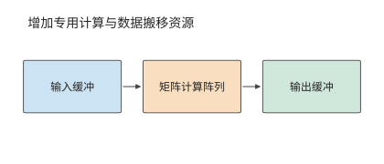

*图 1-15　专用处理器围绕反复出现的矩阵运算组织计算阵列和输入输出缓冲。缓冲是临时保存待计算或已算完数据的存储区域；三个方框及其箭头展示数据搬移方向。*

第 4 章将介绍 TPU 的矩阵阵列、缓冲和数据通路。本例说明的关系是：应用的使用量达到一定规模后，专用处理器就可能比通用处理器更合算。

### 1.4.2 SmartNIC

微软 Azure 在 2015 年设计新一代 40 Gbit/s 云服务器时，面临另一类增长：网络带宽提高，虚拟网络策略也日趋复杂。**SmartNIC（智能网卡）**是能够在网卡上执行部分数据处理的设备。微软从 2015 年末起在新部署的 Azure 服务器中安装基于 FPGA 的 SmartNIC，2016 年向客户提供 Accelerated Networking（加速网络）服务。FPGA 的硬件逻辑可以重新配置，网络处理因此能随策略更新而改变。[^azure]

这项设计要同时满足两个要求：既把更多 CPU 核留给租户的应用，又能快速更新网络隔离、转发和访问控制规则。云服务器上的网络处理占用的正是这些 CPU 核：CPU 除了运行应用，还要处理收发的数据包。虚拟机是在一台物理主机上划分出的独立计算环境。多个虚拟机共用物理网络时，平台需要识别数据的归属、查找转发规则、完成封装，并维持隔离。

先估算这部分工作占用多少 CPU。40 Gbit/s 链路在最小帧条件下每秒约需处理六千万个包。若单核每秒处理一千万至两千万个包，持续转发所需核数约为

$$
n_{\mathrm{core}}=\frac{\lambda_{\mathrm{packet}}}{\mu_{\mathrm{core}}}\approx3\text{—}6.
$$

其中 $\lambda_{\mathrm{packet}}$ 为包到达率，$\mu_{\mathrm{core}}$ 为单核处理率。这些核反复完成相同的包处理流程；将相应工作移到网卡，就可以把 CPU 时间留给应用。[^nic]

Azure 的做法是让主机软件管理复杂策略，把适合重复执行的包处理规则交给 FPGA。数据经过网卡时就完成这些处理，CPU 可以把更多时间用于客户应用。设计的关键是兼顾软件更新能力与硬件处理速度。

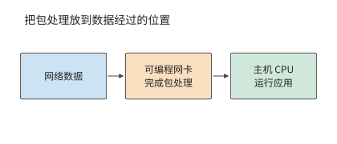

*图 1-16　可编程网卡在数据进入主机前完成指定的包处理。图中实线跟踪数据；网卡承担的处理减少主机 CPU 的辅助工作。*

将包处理移到网卡后，部分操作可以在数据到达时直接完成，CPU 的工作随之减少。如果网卡还需要主机内存中的数据，就要通过 PCIe 读取；此时，返回延迟和可同时发出的请求数决定了读取速度。第 7 章将用 KV-Direct（让可编程网卡直接处理键值存储请求的系统）分析这种访问。键值存储按唯一的键查找、读取或更新对应的值。

### 1.4.3 Unified Bus

SmartNIC 改变了单台服务器内部的分工。若问题是单个加速器的资源总量不足，就需要进一步考虑加速器之间如何协作。当单个加速器容纳不下模型和运行状态时，最直接的办法之一是增加加速器。但“总容量变大”与“任务能够高效执行”之间，还隔着工作划分、数据交换和同步。

例如，两张卡的显存总量可能足够保存权重，但执行计算的加速器必须能够访问所需的数据。若一步计算依赖另一张卡的结果，就要等待交接；若多张卡共同完成一个操作，还要组织相应的协作。加速器数增加带来了资源，也增加了连接这些资源的工作。

华为面向昇腾等异构计算设备推进的 **UB（Unified Bus，统一互联）**，把问题扩大到多设备协作。根据项目参与者的回顾，相关研究在 OpenAI 于 2020 年发布自回归语言模型 GPT-3 之前已经开始；GPT-3 展现出大模型的能力后，业界更广泛地认识到多设备协同的需求，项目投入随之扩大。

这一时期的核心需求是让规模不断增长的模型使用多张加速卡，并使计算设备更方便地访问其他设备上的内存和数据。数据一旦跨过主机边界，软件就要改用消息传递接口、重新安排缓冲区，再经过网卡驱动和协议栈，每多一层抽象就多一段时间。UB 让设备直接访问其他设备的内存，把这些抽象层去掉，使一次远程访问的耗时逼近线路时延决定的下限，上层也能更灵活地组织资源。统一的访问机制使设备能直接使用更大范围内的资源，拓扑则决定这些访问的距离与带宽。模型分工与互联设计由此紧密相连。第 6.5.5 节从超节点规模的角度讨论 UB 的组织方式，第 7.3 节和第 7.4 节沿着一次远程访问的路径推导它的延迟、请求速率和连接状态，并算出去掉的各层抽象原来各占多少时间。

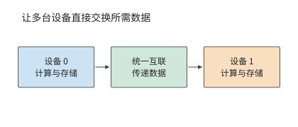

*图 1-17　统一互联连接不同设备的计算与存储资源。模型分工确定要交换什么，互联负责把数据送到后续使用它的设备。*

从语音推理到云网络，再到大模型的多设备执行，这些设计分别着重提高计算效率、减少主机 CPU 占用和改善跨设备访问。需求改变了需要优先解决的瓶颈，也改变了硬件、软件与互联之间的分工。

对照开篇的六层图，三个案例分别从不同问题出发，却都会改变计算与数据搬移的组织。应用需求推动专用硬件的设计，处理位置改变主机与网卡之间的工作分配，更大的模型则要求重新安排设备协作。后续章节将沿这些关系展开本书的主线：**数据搬移塑造了 AI Infra 的架构。**

以本章的两卡模型部署为例：权重均分可以满足逐卡容量约束，但每个阶段还要等待输入数据和前序结果。增加加速器改变了 $M_{\mathrm{cap}}$ 和可用算力，也引入新的通信量与依赖。因此，第一步先检查每个加速器能否容纳所需数据，第二步计算各加速器的运算量与读写量，第三步根据执行依赖计算总时间。模型再大、加速器再多，这一分析顺序仍然成立。

## 谬误与陷阱

**误区：峰值算力翻倍，执行速度就会翻倍。** 先检查当前执行是否受计算能力限制。例题 1-1 中，权重读取的时间下界远大于矩阵计算的时间下界，提高矩阵峰值算力几乎不改变执行时间的下界；若优化的是完整任务的一部分，还要用 Amdahl 定律检查收益的上限。

**误区：显存能容纳权重，就能支持目标并发数。** 权重只是常驻数据的一部分。上下文状态、工作区和运行时预留的空间共同占用显存，多加速器还必须逐卡核算。

**误区：比旧实现快了三成，优化就算成功。** 不知道硬件允许的极限，就无法判断这三成是逼近了上限，还是离上限仍有一个数量级。应当先算出极限，再按第 1.3.4 节的顺序查明差距来自模型漏项还是系统开销。

**误区：吞吐率提高，每个用户的等待时间就会缩短。** 批内复用减少每个输出分摊的读取开销，但每个请求仍须经历排队和整批执行。吞吐与响应时间应同时报告。

## 本章数字速查

本表用第 1.3.3 节实测采用的 Qwen3-8B 汇总模型侧的关键数字。prefill 一次处理已有输入，并得到首个输出；decode 每次把一个新 token 送入模型，利用已经保存的 KV 继续生成。本表固定 BF16 权重、激活和 KV，并发为 1；prefill 的输入为 2048 个 token，decode 则在已有 2048 个 token 的上下文后执行一步。[^model-numbers]

| 模型需求 | 数值 | 如何使用 |
| --- | ---: | --- |
| 完整 BF16 权重 | 16.38 GB | 判断模型加载所需的显存 |
| 每个上下文 token 的全模型 KV | 144 KiB | 上下文长度乘以此数，得到单请求 KV 容量 |
| 2048 个 token 的上下文的 KV | 288 MiB | 约 0.302 GB，随独立请求数增加 |
| 2048 个 token 的 prefill 的矩阵运算 | 29.69 TFLOPs | 除以相应矩阵算力，得到计算时间下界 |
| 一步 decode 的矩阵运算 | 16.34 GFLOPs | 输入为一个 token，另访问已有上下文 |
| 一步 decode 的主要权重读取 | 15.14 GB | 权重读一次；嵌入层（把 token 编号映射为向量的查找表）只读取当前 token 对应的一行 |
| 一步 decode 的旧 KV 读取 | 0.302 GB | 每份上下文 KV 读一次时的字节数 |

**用计算量与读取量估算执行时间下界。** 这里采用图 1-13、1-14 实测所用的 RTX PRO 6000 Blackwell Workstation Edition，先单独计算矩阵运算和数据读取：按 503.8 TFLOP/s 矩阵峰值换算，prefill 的矩阵运算约需 58.9 ms，decode 约需 0.0324 ms；按 1.792 TB/s 显存带宽，一步 decode 的主要权重与旧 KV 读取约需 8.62 ms。实测 batch 为 1 时的输出间隔约 26.5 ms，约为该读取下界的三倍，差距的来源见第 1.3.4 节。这里分别估算计算与读取所需的最短时间，完整执行还要沿算子顺序加入其他运算、实际访存和启动时间。第 2—5 章将逐项建立这些计算。

这组数字解释了两阶段的差别：prefill 在一次调用中处理大量输入，矩阵工作量较大；单请求 decode 每次只处理一个 token，却仍要读取大量权重和上下文。提高计算吞吐、提高带宽和增加批内复用，分别作用于不同的时间项。

[^panorama]: “十八层宝塔”由华为半导体首席科学家廖恒博士在 2026 年 7 月的一次公开长访谈中提出，用来描述从应用到制造工艺的层层依赖。

[^dean]: Jeff Dean，LADIS 2009 演讲，[本地 PDF](../references/outline-checks/2026-09-07/scaling-history/jeff-dean-ladis2009.pdf)，“Numbers Everyone Should Know”及纸笔估算部分。寻道算例设连续执行 20 次随机读取。

[^h100]: NVIDIA，[H100 架构白皮书](../references/files/specs/nvidia-h100.pdf)与[规格页面快照](../references/files/specs/nvidia-h100-spec.md)。本章采用 SXM 形态与 BF16 稠密矩阵运算规格；原始输入版本和校验值见[配图来源清单](ch01/sources.json)。

[^budget]: [70B 近似预算复算](../calculations/results/decode-budget-base.md)及配套场景；[单位与逐卡容量复算](../calculations/results/basics-70b-bf16-balanced.md)。1.3 的时间估算图读取这组固定的 70B 近似结果；1.2.3 的容量图使用真实权重索引与分组量化结果。

[^roofline]: Williams、Waterman、Patterson，[Roofline 论文](../references/files/papers/roofline.pdf)。

[^followup]: [补测记录](../experiments/ch01/01-04/FOLLOWUP.md)与[加速器事件计时](../experiments/ch01/01-04/results/step-summary.json)。补测同时关闭了前缀缓存并重新构造了输入，逐步日志的影响无法与这些条件完全分开；加速器事件只覆盖模型执行，不含采样与输出。

[^measurement]: [练习 1-4 记录说明](../experiments/ch01/01-04/README.md)、[结构化分析结果](../experiments/ch01/01-04/results/analysis.json)及[后续补测](../experiments/ch01/01-04/FOLLOWUP.md)。正文和图 1-13、图 1-14 采用最初记录的短输入组。

[^tpu]: Jouppi 等，[TPU v1 论文](../references/files/papers/tpu-v1.pdf)，第 2 节关于起源、架构与实现的说明。三分钟语音搜索是论文记载的历史需求预测。

[^nic]: [笔者博士论文](../references/files/papers/bojieli-phd-thesis.pdf)，第 4.2.1 节简单转发基线；[核数预算复算](../calculations/results/nic-budget-book.md)。约六千万包每秒来自 40 Gbit/s 与每帧占用 84 字节线时的计算，3 至 6 核对应简单转发基线。

[^abstraction]: 相关研究见[抽象边界调研](../research/system-abstraction-boundary/report.md)；基础模型承接多种下游任务的讨论见 [Stanford CRFM](https://crfm.stanford.edu/report.html)。

[^request]: 请求图是通用职责示意；调度与状态管理的职责划分可参照 v0.26.0 的 [vLLM Scheduler 文档](https://docs.vllm.ai/en/v0.26.0/api/vllm/v1/core/sched/scheduler/)；1.3.3 节的实测使用 vLLM 0.23.0。路由策略、tokenizer 位置以及 prefill／decode 是否分离属于部署选择。

[^datacenter]: 具体产品例子见 [NVIDIA GB200 NVL72](https://www.nvidia.com/en-us/data-center/gb200-nvl72/)、[硬件指南](https://docs.nvidia.com/dgx/dgxgb200-user-guide/hardware.html)与[网络指南](https://docs.nvidia.com/dgx/dgxgb200-user-guide/networking.html)。图 1-5 使用一般化连接。

[^real70]: 参数与 BF16 字节数来自 [DeepSeek-R1-Distill-Llama-70B 公开权重索引](../calculations/sources/deepseek-r1-distill-llama-70b/model.safetensors.index.json)及[固定版本配置](../calculations/configs/models/deepseek-r1-distill-llama-70b/config.json)。分组量化的权重总量采用[逐项计算记录](../calculations/results/dense-quant-deepseek-r1-distill-llama-70b-tp1-pp8-80gb-8192.json)中的全模型汇总，每组 128 个参数、scale 占 2 字节。RTX 4090 的 24 GB 名义规格见[官方页面存档](../calculations/sources/hardware/nvidia-rtx4090-page.txt)。本节用规格标称 GB 作统一容量预算。

[^azure]: Firestone 等，微软，[Azure Accelerated Networking: SmartNICs in the Public Cloud](https://www.usenix.org/conference/nsdi18/presentation/firestone)，NSDI 2018；[原论文文本](../references/editorial-context/2026-09-10/azure-smartnic-nsdi2018.txt)。摘要给出 2015 年末部署、2016 年向客户提供服务的时间，第 3 节说明减少 CPU 占用、保持可编程性与支持更高带宽的设计目标。

[^gpu-numbers]: 数字取自[固定 GPU 规格与逐项出处](../calculations/configs/hardware.json)，对应 `rtx4090`、`a100-80gb-sxm`、`h100-sxm`；各精度、累加方式与稠密条件分别核对。GB 与 TB 在本表均为十进制单位。

[^model-numbers]: [速查数字复算源码](ch01/reference_numbers.py)根据固定 Qwen3-8B 配置统计 prefill 与 decode 的矩阵运算，读取量来自[批内权重复用计算](../calculations/results/batch-reuse-h100-2k.md)。权重占用包含完整嵌入表，逐步生成时只读取当前 token 对应的嵌入行；读写时间采用每份主要数据访问一次的理想条件。

[^v41-case]: [DeepSeek V4.1 官方技术报告](../calculations/sources/deepseek-v4.1-flash/DeepSeek_V41_Tech_Report.pdf)，第 1、2、3 节与第 6 节；[跨章会话的固定条件与复算](../calculations/results/v41-throughline.json)。

## 本章小结

应用用模型与上下文表达行为，许多任务因此共享相近的底层计算。掌握模型中的计算依赖和状态驻留时间，就能统筹考虑原来分属不同层次的设计选择：改变数据表示、合并执行步骤、复用准备工作，或缩短加速器间数据传递和同步的时间。后续各章将量化这些改动的收益，说明哪些设计取舍因此改变，再根据新的约束选择模型与系统方案。

分析系统时，先检查数据能否放下，再用运算量和读写量估算耗时，最后根据执行顺序分析重叠与等待。按峰值算出的下界就是硬件的物理极限，下界与实测之比就是利用率；两者的差距不是模型漏了项，就是系统有可以去掉的开销。在 70B 算例中，权重读取比矩阵计算慢约 148 倍，因此增加带宽、减少读取和提高复用更有助于缩短时间。批内共享可以提高吞吐，而每个请求的响应时间还要包括整批执行和排队。

本章核心练习为 1-2、1-3、1-4，分别练习单位换算与可行性判断、条件改变后的资源估算，以及预测与实测结果的比较。下一章将根据真实模型配置，细化 $2N$ 计算量与权重读取量的估算，为这些计算提供具体的矩阵尺寸与状态大小。
