# 第 2 章 模型架构

第 1 章从存储容量、运算量和数据读取量三个方面分析了一次模型执行，并借助硬件的关键数字估算时间下界。这样的估算可以迅速排除一些方案，却还留下一个问题：所代入的计算量和数据量从哪里来？“一个 8B 模型”（参数量后缀 B 表示十亿，8B 即约 80 亿个参数）只说明参数数量的大致范围，没有说明每个 token 使用哪些参数、上下文保存在什么地方，也没有说明不同工作之间的先后关系。

本章从一个 token 的数值表示开始，逐步分析它经过网络各层后，如何得到下一个 token 的分数，再计算这一过程所需的存储容量 $M$、运算量 $F$ 和读写量 $R$。计算图用节点表示运算，用边表示运算之间传递的数据。先认识图中的运算和数据，才能知道资源预算中的每个数字来自哪里。

这张计算图也提供了优化实现所需的信息。哪些权重在不同请求间保持不变，哪些状态后续生成会反复用到，哪些结果只供紧接着的运算使用，都可以从模型结构中找到。后续章节设计存储、编译和调度时，将利用数据用途上的这些差异，决定哪些数据可以共享、哪些需要长期保存、哪些只需暂存。

本章选择五个典型模型：DeepSeek V4.1 Flash、Qwen3-8B、Qwen3.6-35B-A3B（名称中的 35B 指总参数约 350 亿，A3B 指每个 token 实际激活的参数约 30 亿；下文简称 Qwen3.6）、DeepSeek V4-Flash 与 Kimi K3。2026 年 9 月发布的 V4.1 Flash 用 CED 架构分开输入处理与生成，并结合跨层 KV 共享、分层索引与 Engram（按 n-gram，即连续 n 个 token 组成的片段，查表取得附加表示的模块），为理解模型架构如何改变系统需求提供了新的案例。

推导从 Qwen3-8B 开始：它约含 81.9 亿参数，通过 36 层网络处理文本。理解这一稠密模型的执行过程后，再逐步改变上下文的保存方式、每个 token 使用的参数集合和层间连接，最后把五个模型放在相同输入条件下比较。

开始推导前，先约定本章的计数口径。统计运算量时，一次乘法加一次加法计为 2 FLOPs。存储量采用 GB 和 GiB：$1\ \mathrm{GB}=10^9\ \mathrm{bytes}$，$1\ \mathrm{GiB}=2^{30}\ \mathrm{bytes}$。BF16 每个元素占 2 字节，因此将张量的元素数乘以 2，就得到它的存储大小。

## 2.1 计算图与前向执行

张量是按一个或多个维度排列的数值数组：向量只有一个维度，矩阵有两个维度。模型用向量表示每个 token 的特征，把多个 token 的向量按行排成矩阵。理解模型资源需求，首先要把计算节点和数据依赖分开。一个节点执行矩阵乘法或其他变换，一条边表示后续节点需要前面的结果。节点的运算量决定计算需求，边上的张量决定传递的数据量，边的方向则表明哪些运算必须先后执行。理解模型的执行过程，需要同时考虑这三个方面。

本章的计算图先描述数学运算和数据依赖。实际执行时，框架会把这些运算交给加速器程序；一个运算可能拆成多个程序，多个运算也可能合在一起执行。计算图中表示张量的一条边，只说明后续运算需要这份数据，不表示它一定要在 CPU 与 GPU 之间复制。第 4 章说明数据放在哪里，第 5 章再解释程序如何提交、数据如何传入传出。

### 2.1.1 序列依赖与因果计算图

要计算执行时间，先要知道哪些运算能够同时开始。考虑四个 token、三层网络，横轴是 token 在序列中的位置索引，纵轴是层数。本章用“词元”指词表中的一个条目，用 token 指它在序列中的一次出现；同一个词元在序列中出现多次时，位置索引用来区分它们。循环神经网络（RNN）把前一 token 位置的状态传给后一 token 位置，token 状态满足 $h_t=f(x_t,h_{t-1})$。其中 $x_t$ 是当前输入，$h_t$ 是处理到当前 token 位置时保存的状态，$f$ 是用模型权重做的变换。当前结果依赖前一 token 位置，所以同一层按位置顺序执行。即使四个输入已经全部到达，第 $t$ 个 token 仍要等待第 $t-1$ 个 token。

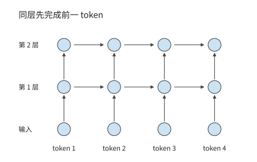

*图 2-1　循环神经网络的依赖。相同颜色的圆点表示各 token 位置的计算，箭头指向需要前一结果的节点；同层 token 位置沿横向逐次推进。*

Transformer 用注意力机制让一个 token 读取其他位置的信息；“因果”表示当前 token 位置只能使用自身及此前位置的信息。因果 Transformer 的依赖形式不同。第 $l$ 层计算某个位置时，通过注意力读取上一层中该位置及其之前各 token 位置的表示。只要输入 token 已知，并且上一层的相应表示已经完成，同一层不同位置的计算就不需要再等待本层前一个 token 的输出。因果掩码用来规定各 token 位置允许访问哪些信息，屏蔽当前 token 位置之后的信息。按查询与被查询 token 位置排列，掩码呈三角形；掩码限制信息来源，却不要求所有已知 token 逐个执行。网络深度方向的依赖仍然存在：下一层使用这一层的结果。

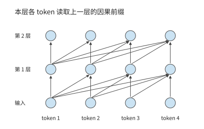

*图 2-2　因果 Transformer 的层间依赖。各查询读取上一层中允许访问的位置；上一层完成后，同一层的已知输入 token 可以并行计算。*

沿图中的箭头追踪，便能区分两种等待：RNN 在同层等待前一 token 位置，因果 Transformer 在下一层等待所需的上一层结果。已知输入能否并行，取决于这些依赖，而非“序列”这一名称。生成新的 token 又增加了另一条依赖：下一次调用的输入由本次输出确定。

处理已知输入与逐步生成是两类不同的工作。编码器把已知输入转换为表示，解码器根据允许访问的信息逐步产生输出。现代因果语言模型常用 decoder-only 结构，本章先用这一结构建立基础，再讨论 V4.1 Flash 如何通过 CED 架构重新划分输入处理与生成的工作。处理已知输入时，同层 token 位置可以并行；生成时，第一个输出确定后才能成为下一次输入。因此，输入处理沿网络深度推进，生成还增加了跨调用的串行依赖。[^source-10]

> **练习 2-1〔延伸〕：RNN 与 Transformer 的依赖如何限制并行计算**
>
> 对于含四个已知输入 token 的序列，分别画出三层 RNN 和三层因果 Transformer 的计算依赖图。再增加一个待生成的输出位置，指出计算该位置之前必须等待哪个节点完成。设每层每 token 的计算耗时为一个单位、并行资源充足，分别求处理全部已知输入时的最长依赖链长度；解释增加计算单元可以缩短哪些等待、不能缩短哪些等待。

### 2.1.2 模型配置与张量结构

先把一个计算节点展开。设本次对 $m$ 个输入 token 执行投影，每个 token 用包含 $k$ 个特征的向量表示。把这些向量逐行排成输入矩阵 $X$，就得到 $m$ 行、$k$ 列的矩阵。设输出宽度为 $n$，则有：

$$
X\in\mathbb R^{m\times k},\qquad W\in\mathbb R^{k\times n},\qquad Y=XW\in\mathbb R^{m\times n}.
$$

每个输出元素是长度为 $k$ 的点积，输出共有 $mn$ 个元素，因此

$$
N_W=kn,\qquad F=2mkn,\qquad M_W=b_Wkn.
$$

$N_W$ 是权重参数的数量，$b_W$ 是每个参数占用的字节数。行数 $m$ 翻倍，运算量翻倍，权重大小保持不变；输出宽度 $n$ 翻倍，权重数量与运算量都翻倍。这两个变化分别对应“同一模型处理更多输入”与“模型的一层变得更宽”。下面的模型表都可以用这条规则逐行计算。

先只看 Qwen3-8B 的一条数据路径。一次**前向执行**是使用当前权重从输入算到输出的过程；隐藏向量是网络内部传递的特征表示，其维度即每个 token 的向量含多少个数。**前馈网络**（feed-forward network，FFN）对每个 token 分别做特征变换；**注意力**则在 token 之间选择并汇总信息。这两类运算交替组成网络的一层。

Qwen3-8B 包含 $L=36$ 层，隐藏维度为 $d=4096$，FFN 中间维度为 $f=12288$；注意力把特征分成多组并分别建立 token 之间的关系，每一组称为一个头。这里有 32 个查询头和 8 个供查询使用的 KV 头，每头 128 维；第 2.1.3 节将沿查询、键和值的路径解释它们。词表包含 151936 个 token，词嵌入是一张把 token 编号映射为向量的查找表，输出头则把末层向量变成每个候选 token 的分数。两者各自保存一份权重。各层参数与这两份词表矩阵相加，模型共有约 81.9 亿个参数。[^source-1]

一次前向执行从 token ID 开始。词嵌入为每个 ID 查出一个 4096 维向量，向量依次经过 36 层注意力与 FFN，最后经过归一化和词表投影产生 logits，即尚未转换为概率的候选 token 分数。归一化使逐层计算的数值保持在适当范围内。词嵌入按 ID 选择行，一个 token 取出一条向量，整个词表则作为常驻数据供不同 token 查询。词表输出头将隐藏向量与词表矩阵相乘；只生成下一个 token 时，通常只需要最后一个输入 token 的 logits。

设同时处理 $B$ 条等长请求，每条本次输入 $P$ 个已知 token。投影和 FFN 的输入可以表示为 $X\in\mathbb{R}^{BP\times4096}$，每一行是一个 token 在当前层的表示，共有 $m=BP$ 行。已有上下文 token 的键和值从缓存读取，不计入这里的 $m$。每条请求只补入一个 token 时，$m=B$。第一种情形容易形成行数较大的矩阵，第二种在小 batch 下接近矩阵与向量的乘法。权重相同，输入形状却明显不同。

下面比较两种输入形状：一条请求一次处理 8192 个输入 token，以及一条已有 8192 个上下文 token 的请求再处理一个新 token。用 $B$ 表示请求数，$S$ 表示调用前已有的上下文长度，$P$ 表示本次输入长度，$d$ 表示隐藏维度。前者取 $B=1,S=0,P=8192$，后者取 $B=1,S=8192,P=1$。

| 配置项 | Qwen3-8B 参数 | 对资源需求的直接影响 |
| --- | ---: | --- |
| 层数 $L$ | 36 | 重复的计算、逐层状态与深度依赖 |
| 隐藏维度 $d$ | 4096 | 子层输入输出与投影尺寸 |
| FFN 中间维度 $f$ | 12288 | 三个 FFN 矩阵的权重与计算 |
| $Q$／KV 头数 | 32／8 | 查询向量与上下文表示的宽度 |
| 头维度 $d_h$ | 128 | 每个头的点积与状态宽度 |
| 词表大小 $V$ | 151936 | 嵌入和输出头规模 |

**例题 2-1：从矩阵尺寸求一层的参数量与运算量。** Qwen3-8B 的查询和输出投影宽度为 4096，键和值投影宽度为 1024，FFN 中间维度为 12288。求四个注意力投影与三个 FFN 矩阵的参数量，以及为本次输入的 $m$ 个 token 完成这些投影和 FFN 计算所需的运算量。每个 token 在这一层都有一个 4096 维向量，作为输入矩阵的一行；$m$ 统计本次实际参与计算的 token 数。同一个词元出现两次，就算作两个 token。若有 $B$ 条等长请求、每条本次处理 $P$ 个 token，则 $m=BP$。例如，一条请求处理 128 个输入 token 时 $m=128$；八条请求各推进一个 token 时 $m=8$。

解：查询与输出各使用一个 $4096\times4096$ 矩阵，键和值各使用一个 $4096\times1024$ 矩阵，三个 FFN 矩阵各有 $4096\times12288$ 个参数。因此，

$$
\begin{aligned}
N_{\mathrm{proj}}&=2\times4096^2+2\times4096\times1024=41{,}943{,}040,\\
N_{\mathrm{FFN}}&=3\times4096\times12288=150{,}994{,}944,\\
F_{\mathrm{linear}}&=2m(N_{\mathrm{proj}}+N_{\mathrm{FFN}})=385{,}875{,}968m.
\end{aligned}
$$

此处尚未使用上下文长度：这些投影对每个 token 的特征向量做相同的变换。下一节将介绍查询与上下文之间的注意力计算，其运算量与查询—键配对的数量有关。将两类工作分开，就能看出“增加本次参与计算的 token 数”和“让每个 token 读取更长的上下文”的代价为什么不同。

| 符号 | 含义与使用范围 |
| --- | --- |
| $B,P,S$ | 请求数、本次每请求输入 token 数、已有上下文长度 |
| $m=BP$ | 本次参与投影的 token 总数，也就是输入矩阵行数；普通 decode 时 $P=1$，故 $m=B$ |
| $d,f$ | 主干隐藏宽度、前馈网络中间宽度 |
| $n_Q,n_{\mathrm{KV}},d_h$ | 查询头数、KV 头数、每头维度 |
| $N_{\mathrm{pair}}$ | 每层所有请求合计的有效因果查询—键配对数，不含头数 |
| $t_e$ | 分派给专家 $e$ 的 token 数（见第 2.4 节），每个 token 的特征向量占该专家输入矩阵的一行；$k_{\mathrm{top}}$ 为每个 token 选中的专家数，路由过程中不丢弃分派给专家的 token 时 $\sum_e t_e=mk_{\mathrm{top}}$ |
| $m_{\mathrm{out}}$ | 实际执行词表投影的 token 数；只用每条请求的末尾 token 预测下一个 token 时为 $B$，它不等于本次生成的全部输出长度 |

计算整个模型的资源需求时，先按表格中每项操作的矩阵尺寸求一次调用的运算量，再乘这一类层的数量。词表头另外按实际输出 token 数 $m_{\mathrm{out}}$ 计算；生成下一 token 时，每条请求只需最后一个 token 的分数。归一化、激活与查表操作各有自己的运算方式，后文沿数据流分别说明。

### 2.1.3 注意力计算与位置编码

先跟踪单个 token 的计算。模型从该 token 的隐藏向量产生三种表示：**查询** $Q$ 用来提出“当前需要什么信息”，**键** $K$ 用来与查询计算匹配分数，**值** $V$ 是被选中后汇总到输出的信息。三者都由同一个 token 的输入经过不同权重矩阵产生。线性投影就是这样的矩阵乘法：把输入特征变换到另一组坐标。

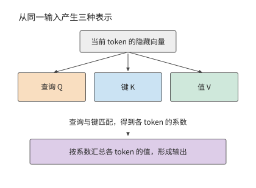

*图 2-3　同一个 token 的输入经不同投影产生查询、键和值。注意力先用查询与键计算 token 之间的关系，再用这些关系汇总值。*

采用数学右乘记号，输入 $X$ 分别乘三个权重矩阵，得到 $Q$、$K$、$V$。$Q$ 的总宽度为 $32\times 128=4096$，$K$ 和 $V$ 的总宽度各为 $8\times 128=1024$。因此，$W_q$ 为 $[4096,4096]$，$W_k$ 和 $W_v$ 各为 $[4096,1024]$。代码中的线性层常以 $(d_{\mathrm{out}},d_{\mathrm{in}})$ 保存权重；换成数学右乘记号后，输入宽度在前、输出宽度在后，便可逐项对照下面的表格。

上述投影产生了 $Q$、$K$、$V$，但尚未让当前 token 位置与上下文交换信息。接下来将 $Q$ 拆成 32 个头，把 $K$、$V$ 拆成 8 个头。每组四个 $Q$ 头共用一个 KV 头。对一个 $Q$ 头，查询向量与允许访问位置的 $K$ 做点积，将点积除以头宽的平方根，避免分数的数值尺度随头宽增大而过度增长，然后屏蔽未来 token 位置。Softmax 把允许位置的分数 $s_j$ 变成正数并归一化，系数为 $a_j=e^{s_j}/\sum_i e^{s_i}$；这些系数之和等于一，决定各上下文 token 贡献多少信息。这里的“注意力权重”是本次输入算出的系数，区别于训练后保存的模型参数。随后用这些权重对 $V$ 加权求和。各 $Q$ 头的结果拼接后，经 $[4096,4096]$ 的输出投影 $W_o$ 转回隐藏向量。

用矩阵记号写出一个头的计算：

$$
A=\operatorname{Softmax}\!\left(\frac{QK^{\mathsf T}}{\sqrt{d_h}}+\mathcal M\right),\qquad O=AV.
$$

$A$ 是各查询对上下文 token 的权重，$\mathcal M$ 是因果掩码，$d_h$ 是头维度。点积决定哪些位置与当前查询相关，Softmax 将分数转成加权系数，再用这些系数汇总值向量。Qwen3 在点积前还要做**查询与键归一化（QK Norm）**和**旋转位置编码（Rotary Position Embedding，RoPE）**：前者调整各头查询与键的数值尺度，后者通过随位置变化的旋转，使点积包含相对位置信息。

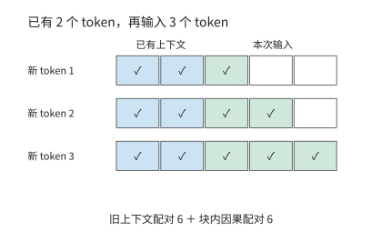

*图 2-4　两段上下文形成长方形加三角形。蓝色为三个新 token 分别读取两个旧 token，绿色为新输入内部的因果访问，空白为被屏蔽的未来 token 位置。每个有色格表示一次查询—键配对；横轴对应被读取的 token，纵轴对应新输入的查询 token。*

下面计算点积的数量。输入 $P$ 个新 token、已有 $S$ 个上下文 token 时，第 $i$ 个新 token 可访问 $S+i$ 个 token，其中 $i=1,\ldots,P$。将各查询可以访问的上下文 token 数相加，就得到一个长方形加一个三角形：

$$
N_{\mathrm{pair}}=B\left(PS+\frac{P(P+1)}{2}\right)
$$

对每一对查询与上下文 token，一个 $Q$ 头的 $QK^{\mathsf T}$ 点积约需 $2d_h$ FLOPs，随后 $AV$ 的贡献又约需 $2d_h$ FLOPs。合计所有 $Q$ 头，$QK^{\mathsf T}$ 与 $AV$ 的有效矩阵运算量为：

$$
F_{\mathrm{attn}}=4n_Qd_hN_{\mathrm{pair}}=16384N_{\mathrm{pair}}
$$

在此前没有缓存上下文的 prefill 中，序列长度加倍时，投影的输入行数变为两倍，全注意力的查询—键配对数则约为原来的四倍，因为新加入的 token 也要与此前的上下文交互。计算这些查询—键配对有两种常见路径：完整矩形乘法先产生所有分数再屏蔽上三角，因果分块则跳过上三角。分块还可以把评分、归一化和 $V$ 汇总接在一起，让分数在片上用完即释放。第 5 章将沿这条数据流解释如何减少中间结果的显存读写。

因此，保持 $BP$ 不变只能保持投影行数不变，不能保持上下文交互不变。例如，把一条长输入拆成两条彼此独立的短输入，原来跨越分界的那些查询—键配对就消失了。相反，仅在同一请求前面增加上下文，会增加每个新 token 的点积数，输入投影的行数却保持不变。

### 2.1.4 前馈网络与前向计算量

注意力负责不同 token 之间的信息交互，FFN 则对每个 token 的特征执行非线性变换。SwiGLU 是一种带门控的前馈结构：一条分支变换输入特征，另一条分支为它生成逐元素的调节量。SwiGLU 采用 SiLU 激活函数 $\operatorname{SiLU}(x)=x/(1+e^{-x})$，用非线性变换改变特征间的组合方式。Qwen3-8B 使用这种结构：输入分别经过 gate 与 up 两条升维投影，gate 分支经过 SiLU 后，再与 up 分支逐元素相乘，最后通过 down 投影降回隐藏维度：

$$
\operatorname{FFN}(X)=\left[\operatorname{SiLU}(XW_{\mathrm{gate}})\odot(XW_{\mathrm{up}})\right]W_{\mathrm{down}}
$$

式中 $\odot$ 表示对应元素相乘；gate 是门控分支，up 是升维分支，down 是降维投影。三者产生的中间向量称为激活。gate 与 up 将每行从 $d$ 维升到 $f$ 维，down 再降回 $d$ 维。三个矩阵因此合计 $3df$ 个参数，处理 $m$ 个 token 的特征向量需 $6mdf$ FLOPs。Qwen3-8B 取 $d=4096,f=12288$，FFN 约有 1.51 亿个参数，BF16 权重占 288 MiB。升维后较宽的激活也需要临时空间，但只需在相应计算期间保留。

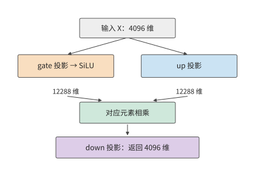

*图 2-5　SwiGLU 的两条升维分支。gate 经 SiLU 后调节 up 的对应元素，乘积再由 down 投影降回主干维度。*

把两类投影放在一起比较：注意力的 QKV 与输出投影合计约有 4194 万个参数。加上 FFN 的约 1.51 亿个参数后，FFN 占这些主要投影参数的约 78%，因此短上下文的计算中，三个 FFN 矩阵占据较大份额。随着输入变长，FFN 的运算量随 token 数线性增长，全注意力的运算量则随 $P(P+1)/2$ 增长。两者增长速度不同，因此各部分计算量的占比会随上下文长度变化。

除矩阵变换外，一层之内还有子层之间的连接。残差连接把子层的输入保留下来，在该子层完成变换后，与输出逐元素相加。这样，一条路径执行新变换，另一条路径直接传递已有表示。下面把注意力、前馈和两次残差连接连成完整的一层。

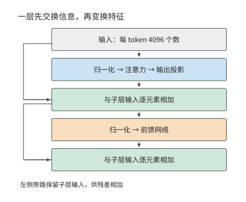

*图 2-6　Qwen3-8B 一层的骨架。先完成注意力子层，再完成前馈子层；左侧的残差连接保留子层输入，再与变换结果相加。*

**表 2-1　Qwen3-8B 的单层模块与输出接口**

注意力和前馈各行按 36 个主干层累计；词嵌入根据 token 编号读取词表中对应的行，不再按一次词表矩阵乘法（GEMM，通用矩阵乘法）计算。注意力的 $K$、$V$ 只各有 1024 维，而查询仍有 4096 维。

**模型入口**

| 模块及作用 | 输入 → 输出（行数 × 宽度） | 权重矩阵（输入宽 × 输出宽） | 矩阵 FLOPs | 层／调用数 |
| --- | --- | --- | --- | ---: |
| 词嵌入查行 | $m$ 个 ID → $m\times4096$ | 查表 $151936\times4096$ | 0；查行访问另计 | 1 |

**注意力**

| 模块及作用 | 输入 → 输出（行数 × 宽度） | 权重矩阵（输入宽 × 输出宽） | 矩阵 FLOPs | 层／调用数 |
| --- | --- | --- | --- | ---: |
| $Q$ 投影：形成查询 | $m\times4096\to m\times4096$ | $4096\times4096$ | $2\times m\times4096\times4096$  | 36 |
| $K$、$V$ 投影：形成可复用上下文 | $m\times4096\to m\times1024$ | $4096\times1024$，共 2 个 | $2\times 2\times m\times4096\times1024$  | 36 |
| $QK^{\mathsf T}$ 与 $AV$：按内容汇总上下文 | $32$ 个查询头，每头 $128$ 维 | 无新增投影权重 | $4\times32\times128\times N_{\mathrm{pair}}$  | 36 |
| 输出投影：合并各头 | $m\times4096\to m\times4096$ | $4096\times4096$ | $2\times m\times4096\times4096$  | 36 |

**前馈与连接**

| 模块及作用 | 输入 → 输出（行数 × 宽度） | 权重矩阵（输入宽 × 输出宽） | 矩阵 FLOPs | 层／调用数 |
| --- | --- | --- | --- | ---: |
| SwiGLU：逐 token 特征变换 | $m\times4096\to m\times12288\to m\times4096$ | $4096\times12288$ 两个；$12288\times4096$ 一个 | $6\times m\times4096\times12288$  | 36 |
| 归一化、RoPE、激活与残差 | 保持或逐元素变换上述张量 | 归一化向量等 | 按元素计算  | 36 |

**输出接口**

| 模块及作用 | 输入 → 输出（行数 × 宽度） | 权重矩阵（输入宽 × 输出宽） | 矩阵 FLOPs | 层／调用数 |
| --- | --- | --- | --- | ---: |
| 词表头：转为 token 分数（整模型末端一次） | $m_{\mathrm{out}}\times4096\to m_{\mathrm{out}}\times151936$ | $4096\times151936$ | $2\times m_{\mathrm{out}}\times4096\times151936$  | 1 |

表中有两种增长方式：投影与 FFN 的工作随 $m$ 增长，上下文交互随 $N_{\mathrm{pair}}$ 增长。FFN 的三次大投影解释了它为什么在短上下文中占有较大的计算份额；上下文变长后，上下文交互的占比逐渐提高。

将每层的线性变换与上下文交互相加，再加入词表头，得到 Qwen3-8B 的主要矩阵运算量：

$$
F_{\mathrm{matrix}}=36\left(385{,}875{,}968m+16{,}384N_{\mathrm{pair}}\right)+2m_{\mathrm{out}}\times4096\times151936.
$$

式中第一项随输入行数增长，第二项随查询—键配对数增长，最后一项随实际执行词表投影的 token 数增长。对包含 8192 个 token 的输入，按有效因果查询—键配对计算注意力，词表头只处理最后一个 token，共需 133.6 TFLOPs；已有 8192 个上下文 token、再补入一个 token 时，共需 20.0 GFLOPs。[^source-11]

prefill 同时处理 8192 个输入 token，每个 token 都要经过投影和 FFN。decode 只对新 token 执行这些运算，旧 token 的 $K$、$V$ 则从缓存读取。因此，缓存省去了旧 token 的投影和 FFN 重算，当前查询与上下文的注意力计算仍要执行。下一节计算这份缓存的容量和访问量。

> **练习 2-2〔核心〕：输入行数相同，注意力计算量为何不同**
>
> 使用表 2-1，取 $B=4,S=4096,P=1024$，分别计算投影与 FFN、有效因果注意力，以及对每条序列的最后一个 token 执行词表投影所需的 FLOPs。保持 $BP=4096$，改为 $B=1,S=4096,P=4096$，先预测哪些项相同，再计算差异。最后以一条含 8K 输入的请求为例，比较完整处理输入与复用前缀两种方式。复用时保留前 6144 个 token 的 KV，只处理新增的 2048 个 token。求后一种方式相对于完整处理输入，节省了多大比例的矩阵运算量。

## 2.2 自回归生成的资源消耗计算

要计算生成完整回答所需的资源，除一次前向包含的运算外，还需要知道模型调用多少次，以及状态保存多久。同一份权重在一条请求中可能使用数百次，KV 则一边读取一边增长。最终保存的字节数与累计访问的字节数因此可以相差几个数量级。

### 2.2.1 Prefill、Decode 与状态复用

在 prefill 阶段，模型收到一段已知输入，可以同时计算多个 token 的表示。由最后一个输入 token 的 logits 选择首个输出 token 后，进入 decode 阶段：下一次调用把该 token 作为新输入，得到再下一个输出，如此逐步扩展。两者使用同一个模型，但前者有多个已知输入 token，后者在普通串行生成中每条请求只增加一个 token。

如果每生成一个 token 都把整个前缀重新送入模型，旧 token 的投影与 FFN 会重复执行。因果模型中，旧 token 不能看到后来加入的 token；在权重、token 位置索引与相关计算条件不变时，旧 token 产生的 $K$、$V$ 可以保留。后续查询读取这些上下文 $K$、$V$，并补入当前 token 位置的新 $K$、$V$，就避免了旧 token 的大量重算。

缓存把“重新计算旧 token 的表示”变成“保存并访问旧 token 的状态”。未来 token 位置会产生自己的 $Q$，用它对旧 token 的 $K$ 评分，再根据评分得到的权重汇总 $V$，所以长期保存的是 $K$ 和 $V$。旧查询已经完成了自己的任务，下一步使用新的查询。第 8 章将进一步讨论如何在不同请求之间共享这些状态。

Qwen3-8B 的 BF16 KV 每个上下文 token 占：

$$
\begin{aligned}c_{\mathrm{KV}}&=2L n_{\mathrm{KV}}d_h b_{\mathrm{KV}}\\&=2\times36\times8\times128\times2\ \mathrm{bytes}\\&=144\ \mathrm{KiB}.\end{aligned}
$$

第一个 2 分别对应键和值；$L$ 层各保存 $n_{\mathrm{KV}}$ 组宽度为 $d_h$ 的向量，每元素占 $b_{\mathrm{KV}}$ 字节。因此，保存 $H$ 个上下文 token 需 $M_{\mathrm{KV}}=c_{\mathrm{KV}}H$。Qwen3-8B 的 $H=8192$ 对应 1.125 GiB，再处理一个新输入 token 就追加 144 KiB。层数或 KV 头数减半，增长速度也减半；batch 增加时，每条独立请求各增加一份上下文。[^source-13]

### 2.2.2 内存占用与数据访问量

KV 缓存保存已经算出的结果，省去后续生成中的重复计算。为了分析节省的计算与增加的存储开销，按用途和生命周期把数据分为权重、上下文状态和临时数据三类。

| 数据类别 | 存储与复用 | 本章计算的主要项目 |
| --- | --- | --- |
| 权重 | 通常在多次调用间保持不变 | 常驻字节、被访问的权重集合、批内复用 |
| 上下文状态 | 随请求保留，持续追加或更新 | 实际占用的容量、每步读写量及更新所需的计算 |
| 临时数据 | 在相应算子或阶段中产生，使用后释放 | 张量尺寸、经过相应存储接口的数据量、需要同时保存的部分 |

首先是权重。Qwen3-8B 全部 BF16 权重约占 16.38 GB，即 15.26 GiB。模型加载后，这份数据供多个请求反复使用。一次前向中，嵌入按 token ID 查行，层内投影与 FFN 使用对应矩阵，末端词表头计算输出分数。因此，访问哪些权重由计算图中的具体操作决定。

对 $[m,d]\times[d,f]$ 的矩阵乘，输入的每一行都使用同一个权重矩阵。将权重块读入片上存储后，可以依次用于多行输入，让一次读取的数据参与更多乘加运算。处理行数 $m$ 增加，计算量随之增加，整份矩阵的容量保持不变。第 5 章将进一步解释片上容量与分块如何决定一份权重能够复用多少次。

上下文状态已在第 2.2.1 节计算；临时数据占用多少内存，则取决于哪些张量同时存在。前一层释放缓冲后，后一层可以复用同一块空间；算子融合（把相邻的几个运算合成一个程序执行）还可以让部分中间值只保存在寄存器或片上存储中。因此，计算读写量时要数清每次访问，计算内存峰值时则要找出同一时刻仍需保存的张量。第 5 章将结合具体程序分析。

存储量取决于某一时刻需要保留哪些数据，访问量则取决于执行过程中读写了多少次数据。例如，一步 decode 若将整段旧上下文读一遍，逻辑读取量为 $c_{\mathrm{KV}}H$；连续执行多步，就要逐步累计。确定这些访问实际经过哪一级存储后，才能将相应的 $R$ 除以该接口的带宽。

**例题 2-2：增加 batch 后，上下文读取量何时超过权重读取量？** Qwen3-8B 每批将所需共享权重读取一遍，数据量约为 15.14 GB，嵌入按请求查行另计。每请求的 8K BF16 上下文为 1.125 GiB，假定各请求独立、旧上下文各读一次。

解：每批共享权重读取量记为 $R_W$，各请求的上下文独立，则上下文读取量为 $Bc_{\mathrm{KV}}H$。两者相等时

$$
B_* = \frac{R_W}{c_{\mathrm{KV}}H}.
$$

以 $R_W=15{,}136{,}811{,}008$ 字节、$c_{\mathrm{KV}}=147456$ 字节代入，$H=8192$ 时最小整数 batch 为 13；$H=2048$ 时为 51。上下文长度缩短到原来的四分之一，上下文读取量超过权重读取量所需的请求数就约增至四倍。上下文越长，批内权重复用的收益就越早受到限制，因为每个新增请求都会增加一份独立上下文的读取。[^source-12]

沿第 1 章的数据路径看，加载把权重从存储送到 GPU 显存，执行再把所需权重送到计算单元。KV 和层间激活也可在加速器内部保存与使用。相同的逻辑访问因此可以留在片上、经过 HBM，或跨加速器传输；第 4 章将分别分析这些路径的存储容量与传输带宽。

### 2.2.3 生成完整回答的计算量与状态读写量

完整回答会重复执行许多步，同一份上下文也随之读取许多次。下面固定一条普通串行生成请求：$B=1$，已恢复前缀为 $S$，本次输入 $P\ge1$ 个 token，最终返回 $G\ge1$ 个 token。令 $H=S+P$。prefill 处理新输入并产生首个输出，随后执行 $n_d=G-1$ 次 decode。最后返回的 token 尚未重新送入模型，所以请求结束时并不自动为它保存 KV。

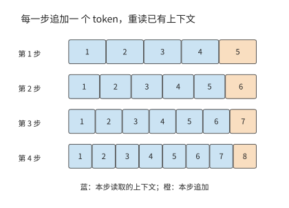

*图 2-7　四步生成的上下文读写。每一步读取蓝色的已有位置，再追加一个橙色新 token；本图初始上下文为 4 个 token，四步后共保留 8 个。*

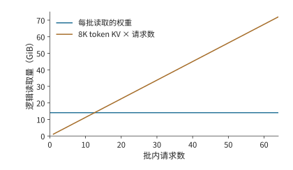

*图 2-8　同一 batch 的主要投影权重可共享读取，各请求则各有一份上下文。图中固定每请求 8K 上下文，分别累计共享权重与独立 KV 的逻辑读取量。权重项按整个 decode batch 读取一次计量；KV 项累加各独立请求在本步读取的上下文状态。*

图 2-7 中的每一行都比上一行多一个已填色方块：先前追加的位置现在也成为上下文。第 $j$ 次 decode（$j$ 从 0 开始）执行前，上下文长度为 $H+j$。因此，若每次 decode 将此前的上下文各读取一遍，累计读取量为：

$$
R_{\mathrm{old}}=c_{\mathrm{KV}}\sum_{j=0}^{n_d-1}(H+j)=c_{\mathrm{KV}}\left[n_dH+\frac{n_d(n_d-1)}{2}\right]
$$

decode 新增的状态大小为 $c_{\mathrm{KV}}n_d$；若保留整个上下文，最终有效 KV 为 $c_{\mathrm{KV}}(H+n_d)$。本次请求的全部新增 KV 还应包含 prefill 写入的 $c_{\mathrm{KV}}P$。已有前缀的恢复与传输单独核算。求和中的每一项都对应一次 decode 开始时已有的上下文：早出现的位置参与更多后续查询，晚出现的位置参与较少查询。

**例题 2-3：逐步生成为何使 KV 累计读取量远超存储量？** 求请求结束时保存的 KV 大小，以及生成期间读取已有 KV 的总量。

解：取 $S=0$、$P=8192$、$G=1025$，则 $n_d=1024$，全过程累计读取上下文 token 的 KV 达 8,912,384 次。每个 token 的 KV 占 144 KiB，因此累计读取约 1224 GiB。生成期间只新增 144 MiB KV，结束时共保存约 1.27 GiB。累计读取量是最终存储量的近千倍，因为已经进入上下文的 token，后面的每次 decode 都要再读一遍；本例中绝大部分上下文是 prefill 写入的 8192 个输入 token。

这组调用也决定了总运算量。线性投影和 FFN 在每次 decode 中处理一行，上下文交互则随 $H+j$ 增长。设每步固定的矩阵运算量为 $F_0$、与每个上下文 token 交互所需的运算量为 $a$，便有

$$
F_{\mathrm{decode,total}}=n_dF_0+a\left[n_dH+\frac{n_d(n_d-1)}2\right].
$$

输出变长时，各步固定部分的累计工作量随 $n_d$ 线性增长，生成过程中新增的上下文还会使一部分累计运算量按生成步数的平方增长。返回一个 token 时 $G=1$、$n_d=0$，只有 prefill；这一特殊情形也说明为什么完整回答包含 $G-1$ 次后续 decode。

图 2-7 沿生成步数累加读取，图 2-8 沿请求数累加读取。多条独立请求的状态容量与上下文访问分别相加，批内权重则共同使用。长度不同时，逐请求代入各自的 $H$ 与 $n_d$：输出越长，已有上下文被读取的次数就越多；输入越长，第一次 decode 要访问的上下文就越多。对实际对话，可先根据每轮输入长度、缓存命中情况和返回的 token 数，还原这条调用链；[已保存的 Chat 长度核算](../calculations/results/sealed-chat-known-prefill.md)给出了具体代入过程。

> **练习 2-3〔延伸〕：输出变长后，KV 容量与累计读取量如何增长**
>
> 取 Qwen3-8B、$B=1,S=0,P=8192$，分别返回 $G=513$ 和 $G=1025$ 个 token。求后续 decode 次数、最终 KV 大小和累计旧上下文读取量。解释输出数量接近翻倍时，生成阶段新增的 KV 容量、最终 KV 总容量与累计读取量为何按不同的比例增长。再将 KV 位宽减半，指出这三项中哪些随之减半。

## 2.3 上下文状态表示与访问机制

模型继续生成时，需要利用前面已经读过的内容。先比较两种记录办法：一种逐页留下记录，要查哪一页就取哪一页；另一种只保留一张定长摘要，每读到新内容，就改写这张摘要。前一种记录随历史增长，后一种大小固定，但不能保证找回每个 token 的全部细节。

对应到模型，一类机制为每个 token 位置保存键和值，有限状态递推则把历史贡献汇入固定大小的状态。逐 token 记录与递推摘要都以数值向量或矩阵保存。模型处理上下文后保存下来、供后续计算复用的这些表示，称为上下文状态。上下文长度按 token 数计量，状态容量按实际保存的字节数计量。

比较这些机制时，先看历史留下了什么，再看新一步如何取得所需信息：可以用更少的维度表示每个 token，也可以只直接访问近期位置、将多个位置汇总为较少条目，或先筛选再读取。另一类机制持续更新固定大小的状态，查询从中取得结果。这些安排分别改变表示宽度、条目数量和访问方式；节省的存储与读取，要同新增的选择、压缩和更新工作一起计算。

### 2.3.1 多头注意力与 KV 共享

逐 token 记录最直接的节省办法，是减少每个 token 保存的 $K$、$V$ 份数。多头注意力让不同的查询头分别学习上下文中的关系。在多头注意力（Multi-Head Attention，MHA）中，每个 $Q$ 头对应自己的 $K$、$V$ 头；多查询注意力（Multi-Query Attention，MQA）让所有 $Q$ 头共用一组 $K$、$V$；分组查询注意力（Grouped-Query Attention，GQA）则把 $Q$ 头分组，每组共享一组 $K$、$V$。共享后，每个上下文 token 需要保存的 $K$、$V$ 组数减少，上下文 token 的数量保持不变。

以只有四个查询头的单层为例。MHA 为四个查询头各存一份 $K$、$V$；GQA 可以让前两个查询头共享第一份 $K$、$V$，后两个共享第二份；MQA 则让四个查询头共用一份。若上下文长度和头宽相同，需要保存的 KV 份数依次为四、二、一。因此，GQA 在此例中把上下文存储量减半。四个查询头仍可给同一段上下文打出四组不同的分数，这正是“共享上下文表示”与“合并查询”之间的区别。

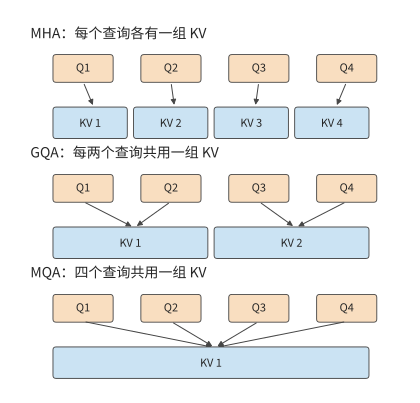

*图 2-9　固定四个查询头，分别为每头、每组和全部查询保存 KV。连线表示使用关系；共享上下文后，各查询仍分别产生自己的评分与输出。*

Qwen3-8B 采用这种共享方式，让每四个查询头共用一组 KV，总计 32 个查询头、8 个 KV 头。如果给每个查询头单独保存 KV，容量会是当前配置的四倍；如果全部查询共享一组，则会是当前配置的八分之一。实际 GQA 配置保存 8192 个 token 需要 1.125 GiB。本节末的容量图固定上下文长度与头宽，只改变 KV 组数，因此柱高之比直接呈现共享比例。

共享 $K$、$V$ 改变了被查询的数据，但 32 个 $Q$ 头仍分别计算分数和加权输出。因此，KV 投影和存储量按组数减少，$QK^{\mathsf T}$ 与 $AV$ 交互仍按查询头数累计。一次读入的 $K$、$V$ 还可以供同组的多个查询头使用，实际计算中就复用了同一份数据。

可以直接由组数预测资源变化。将 $n_{\mathrm{KV}}$ 减半，键值投影参数和上下文状态容量都减半；查询头数 $n_Q$ 不变，查询与上下文交互的运算量仍按原来的头数累计。

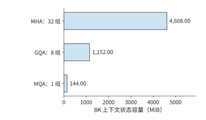

*图 2-10　固定 Qwen 层数、头宽、8192 个上下文 token 与 BF16，只改变 KV 组数。实际模型采用 GQA；其余两柱是用于分析共享比例的结构变体。*

KV 共享也说明，基础设施的限制会影响模型设计。MQA 的原论文直接把增量推理中的内存带宽开销作为动机；GQA 则在 MHA 的质量与 MQA 的速度之间寻找折中。[^codesign] 减少 KV 头数既改变模型可表达的注意力关系，也减少服务端必须保存和读取的状态。

### 2.3.2 潜变量压缩与 MLA 执行路径

GQA、MQA 靠减少 KV 组数节省空间，多头潜变量注意力（Multi-head Latent Attention，MLA）则靠降低上下文表示的维度节省空间。可以先把输入投影为低维潜变量 $c$，再通过上投影得到用于注意力的 $K$、$V$。模型在训练中学习这些低维表示与上投影，生成时将上下文以 $c$ 的形式保存。

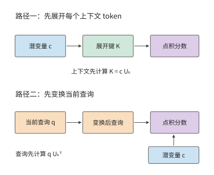

*图 2-11　两种计算路径改变上投影的位置。展开路径先恢复上下文键，紧凑路径先变换当前查询，再直接读取潜变量；结合律保证对应点积可以按这两种次序计算。*

只保存潜变量的依据如下。设键的上投影为 $U_k$，上下文潜变量按行组成矩阵 $c$，展开键为 $K=cU_k$。矩阵乘法的结合律给出

$$
qK^{\mathsf T}=q(cU_k)^{\mathsf T}=(qU_k^{\mathsf T})c^{\mathsf T}.
$$

左边先为每个上下文 token 恢复键，右边先变换当前查询。对单个新查询，右边只需做一次查询变换，随后直接与潜变量点积。值向量也可在加权汇总后再上投影：先汇总低维向量，再恢复输出维度。这样，原来针对每个上下文 token 执行的升维操作，改为针对当前查询和汇总结果执行。

本章采用 Kimi K3 的 **Gated MLA（门控多头潜变量注意力）**作实例；门控用学习得到的系数调节注意力输出。紧凑路径保存 512 维潜变量和参与 $QK^{\mathsf T}$ 点积的 64 维额外分支。Kimi K3 的全部 MLA 层采用 NoPE（No Position Encoding），查询和键都不施加 RoPE，位置信息由 KDA 层（第 2.3.4 节）的递推门控与衰减提供；参考实现仍投影并缓存这 64 维分支，只是不对它做旋转，所以每个 token 保存 $512+64$ 维。24 个 MLA 层、8192 个 token 的上下文、BF16 下，存储量为 $24\times8192\times(512+64)\times2$，即 216 MiB。

展开缓存将潜变量先恢复为各头的 $K$、$V$，再保存这些向量；同样的 8192 个 token 需要约 11.25 GiB。紧凑缓存则保存上投影之前的潜变量。两者的容量差异因此来自缓存位于线性变换的哪一侧：紧凑缓存每步变换当前查询，展开缓存直接读取各头的上下文向量。[^source-2]

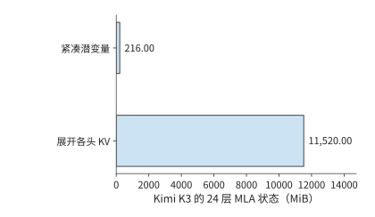

*图 2-12　Kimi K3 的 24 层 MLA 在相同 8K 上下文、BF16 下的两种存储量。紧凑路径保存上投影前的表示，展开路径保存各头的键和值。*

这一变换减小了每个上下文 token 的表示宽度，但仍需为每个 token 保存一个潜变量向量。因此，存储量和点积运算量仍随上下文长度增长。上下文越长，紧凑表示节省的读取量越可观；上下文越短，查询变换本身的开销占比越高。

### 2.3.3 局部窗口、上下文压缩与稀疏索引

假设模型已经读过一段长文本，现在要处理一个新 token。模型可以直接读取最近一段位置，也可以读取由多个旧 token 汇成的条目，还可以先找出与当前查询相关的条目，再读取这些条目的主注意力状态。这三种动作分别引出局部窗口、上下文压缩与稀疏选择。三者可以组合使用，但要分别计量：窗口限制近期范围，压缩减少长期条目，索引选择当前要读哪些条目。筛选本身也要读取索引表示并计算分数，不能只统计最后选中的主注意力状态。

先区分三个对象。**局部滑动窗口注意力（Sliding-Window Attention，SWA）**直接读取最近的一段位置；窗口长 128 时，较早位置退出这一局部窗口。**全局主 KV**是供主注意力读取的长期表示，可能已将多个位置合并；“全局”说明它覆盖较长历史，不表示每次都读取全部条目。**索引 K**是用于检索的另一份较小表示：索引器先用它给条目打分，再让主注意力读取选中的主 KV。索引分数用于选择缓存条目，主注意力另用自己的查询计算最终汇总权重。

模型通过训练学会把一段输入汇总为共享表示。一条 512 维主 KV 记录兼作注意力中的键和值，供多个查询头共享，容量按一份记录计算。SWA 保存近期细节，全局分支提供较早信息，两者共同供当前查询使用。

DeepSeek V4-Flash 把这套机制组合在同一个模型中，有 43 个主干层、4096 隐藏维度、64 个注意力头，每头维度 512。$Q$ 先从 4096 维投影到 1024 维，再得到 $64\times 512$ 维查询；共享 KV 从 4096 维投影到 512 维；输出采用分 8 组的低秩投影，即先投影到较窄的中间维度，再投影到目标维度。各投影的输入、输出维度分别确定矩阵形状。

DeepSeek V4-Flash 使用两种压缩注意力：**压缩稀疏注意力（Compressed Sparse Attention，CSA）**先压缩上下文，再通过索引选取相关条目；**高压缩注意力（Heavily Compressed Attention，HCA）**把更多位置汇成较少的粗粒度条目，供查询访问。两者都用于减少长上下文的存储与访问量，区别在于压缩程度和是否进一步筛选条目。其主干包含 2 个纯窗口层、21 个 CSA 层和 20 个 HCA 层，窗口长度为 128。CSA 按压缩比 4 保存上下文，并维护索引；HCA 按压缩比 128 保存更粗的上下文。采用 BF16 作为参考存储格式，CSA 每个完成的压缩条目含 512 维主注意力状态，另有 128 维索引条目。已有 $S$ 个 token 时，已生成的条目数按 $\lfloor S/4\rfloor$ 计算；尚未完成的压缩块还需独立缓冲。

压缩比描述输出条目数，不一定等于一个条目的全部输入范围。V4 的 CSA 每四个新 token 生成一条记录，但采用相邻块重叠：除首块的边界处理外，一个条目用两组不同的投影汇总相邻两块、共八个 token 的信息；每个 token 还使用学习得到的逐通道权重。HCA 每 128 个 token 生成一条记录，不采用这种相邻块重叠，也不使用 top-k 索引（只取索引分数最高的 k 个条目），而是读取所有已完成的粗粒度条目。V4.1 的 CSA2（第二版 CSA）才取消了 V4 CSA 的重叠压缩。

一次 CSA 查询的主注意力最多读取窗口加 512 个压缩条目，但索引打分仍扫描已保存的压缩索引条目。在 $S=8192$ 时，一个 CSA 层保留 2048 个压缩条目：主注意力状态约 2 MiB、索引约 0.5 MiB，窗口约 0.125 MiB；主注意力选中的压缩条目合计最多约 0.5 MiB，索引扫描却仍需处理那 2048 个索引条目。HCA 则有 64 个已生成的条目，主注意力状态约 0.0625 MiB，并访问窗口状态与这组粗粒度压缩条目。

将 43 层相加，按上述 BF16 参考格式，在 8192 个 token 的上下文下，窗口、压缩上下文和索引共 59.125 MiB；另有约 11.641 MiB 的 FP32 压缩器缓冲，合计约 70.8 MiB。最后一次查询的主注意力（含窗口）与索引读取量合计 27.625 MiB。[状态分解](../calculations/results/state-deepseek-v4-flash-n8192-b1-native.md)逐项列出了这些数据，因此能看出选中的条目数、保存的状态大小和每步读取量分别代表什么。

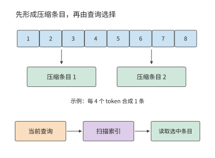

*图 2-13　上下文压缩与索引选择的先后关系。上方只示意八个 token 产生两条记录的数量关系，省略 V4 CSA 的重叠投影与加权汇总，下方展示一次查询先扫描索引再读取主注意力状态的过程。*

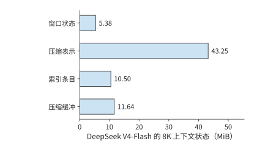

*图 2-14　DeepSeek V4-Flash 在 8K 上下文下的四项状态。窗口、压缩上下文和索引保存已处理的上下文信息；压缩缓冲保存尚在汇总或更新中的数据，单独计入容量。*

压缩还引入一种与查询不同的更新节奏。新 token 到达时，先更新当前压缩块；累计处理的 token 数达到压缩比要求后，再生成一个长期条目。CSA 每四个 token 完成一块，HCA 每 128 个 token 完成一块。因此，在处理同一个输入 token 时，主注意力访问多少条目、索引扫描多少条目、压缩器是否完成一块，需要分别计算。处理到第 128 个 token 时，两种压缩块可能同时完成。[^source-14]

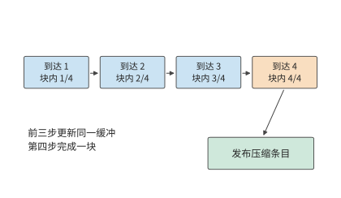

*图 2-15　压缩比为四时的一个压缩块的生成过程。前几次输入更新同一块内缓冲，第四个 token 到来后形成可供后续查询使用的压缩条目。*

> **练习 2-4〔延伸〕：KV 头共享与上下文压缩如何改变存储和访问量**
>
> 先把 Qwen3-8B 的 KV 头数从 8 改为 4，保持 32 个查询头不变，分别计算 KV 容量、KV 投影参数量，以及查询与上下文交互所需运算量的变化。再对 DeepSeek V4-Flash 的 CSA 层，把上下文从 8192 增至 16384，按压缩比 4、每次最多选择 512 个压缩条目，计算保存条目数、索引扫描条目数和选中条目上限。解释三者为何不按同一比例增长。

### 2.3.4 线性注意力与有限状态递推

第 2.3.1 至 2.3.3 节的机制仍能区分保存下来的各个上下文条目。有限状态递推采用另一种过程：每来一个新 token，就把它的贡献合入已有状态，当前查询直接使用更新后的状态；下一步继续改写这份状态。这对应第 2.3 节开头不断改写定长摘要的图景。这类线性注意力重新组织查询、键和值的计算次序，不再显式算出所有查询—键配对的注意力分数。在特征维度固定时，状态矩阵大小不变，处理整段序列的运算量随序列长度线性增长。

构造状态的基本运算是外积，即把一个键向量与一个值向量的每对元素相乘，组成二维的关联表。考虑由键值外积累加得到的矩阵 $\mathcal S_t$。每个新 token 到来时，先读取旧状态，再写入本位置的贡献，当前查询直接从状态矩阵读出结果：

$$
\mathcal S_t=\mathcal S_{t-1}+k_tv_t^{\mathsf T},\qquad o_t=q_t^{\mathsf T}\mathcal S_t.
$$

若键宽为 $d_k$、值宽为 $d_v$，状态始终有 $d_kd_v$ 个元素。新增 token 改变的是矩阵内容，而不是矩阵大小。逐 token 的上下文列表因此变成了一组累积的键值关联；查询从这组关联中取得输出。

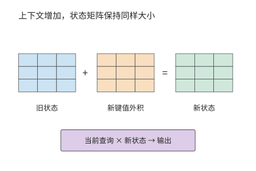

*图 2-16　固定矩阵的递推更新。新键和值的外积加入旧状态，矩阵形状保持不变；查询使用更新后的状态计算输出。本图采用简单累加递推。*

实际的递推注意力在简单累加之外，还加入门控与修正。**Kimi Delta Attention（KDA）**是 Kimi 使用的一种门控递推注意力，用固定大小的关联矩阵保存上下文信息。KDA 使用门控与 delta 更新；delta 在这里指依据当前预测误差写入修正量。每次更新不只写入新信息，还用当前键检验既有状态的预测，据此写入修正；旧信息以汇总后的关联形式保存，当前键决定修正落在哪里，衰减门决定保留多少旧信息。KDA 更新的是一张固定大小的关联矩阵，而非向逐 token 保存的列表追加条目。

Kimi K3 每个 KDA 层有 96 个头，每头递推矩阵为 $128\times128$。按 FP32 保存，单层为 6 MiB，69 层为 414 MiB。一次 decode 读取旧矩阵、融合新信息并写回，理想情况下，各读写一次的总量就是 828 MiB。这一读写量不随上下文长度增长：短上下文时是一笔显著的固定开销，长上下文时则避免了扫描量随上下文 token 数持续增加。

prefill 与 decode 的实现方式也不同。decode 使用单步递推；一段已知输入可以用块式算法并行计算，再在块之间传递状态。块内中间量和块间状态会占用临时空间，因此仅凭最终递推状态的大小，还无法预测 prefill 期间的内存占用峰值。第 5 章根据缓冲区从分配到释放的过程分析这一问题。[^source-15]

### 2.3.5 混合注意力的状态构成

实际模型常把有限状态层与全局注意力层混合使用。这样既利用递推结构的上下文压缩，也保留部分直接访问全局上下文的能力。整个模型的状态由多个部分组成：有的大小固定，有的随上下文长度增长。

Kimi K3 共 93 层，其中 69 个 KDA 层、24 个 MLA 层。8192 个 token 的上下文、紧凑 BF16 MLA、FP32 递推状态及 BF16 短卷积槽位下（短卷积沿序列方向混合相邻几个位置的输入，槽位保存下一步更新要用的近期输入），三项分别为 216 MiB、414 MiB 与 19.4 MiB，合计约 649.4 MiB。若使用参考展开缓存，MLA 一项就变为 11.25 GiB，整体随之改变。[^source-16]

Qwen3.6-35B-A3B 同样需要分别计算线性注意力层和完整注意力层的状态占用。其 30 个线性注意力层加 10 个完整注意力层，每请求每个上下文 token 的全局 KV 为 20 KiB，另有 60 MiB 的固定 FP32 递推状态，以及 1.875 MiB 的 BF16 短卷积槽位。上下文为 8192 个 token 时，三项合计 221.9 MiB。这些状态来自注意力分支。随后的混合专家（Mixture of Experts，MoE）分支提供多个前馈子网络，由路由器为每个 token 选择其中一部分来执行，决定同一主干中实际使用哪些权重。这些供选择的子网络称为路由专家，所有 token 都执行的一支称为共享专家。注意力与 MoE 两类机制共同组成完整模型。

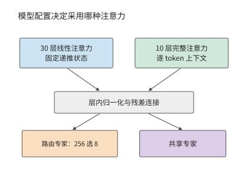

*图 2-17　Qwen3.6 的两类层。配置决定每层采用线性或完整注意力，随后都执行路由专家和共享专家；上方两个分支分别表示线性注意力和完整注意力，模型分别有 30 层与 10 层。*

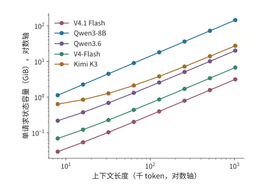

*图 2-18　上下文增长时的状态容量。横纵轴均为对数刻度；五个模型分别通过逐 token 追加、递推、压缩和跨层共享组织状态。纵轴为单请求的状态容量，横轴按上下文 token 数计量。*

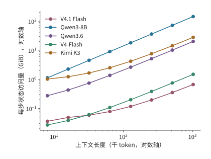

*图 2-19　同一组模型每步计入的状态访问。逐 token 上下文计读取，递推矩阵计一读一写；这些是指定路径的逻辑数据量，用于比较容量与访问的不同增长方式。每步指为一个请求生成下一个 token 的一次 decode；纵轴不包含模型权重读取。*

这五条状态曲线的形状来自不同表示。Qwen3-8B 每增加一个 token，所有 GQA 层都追加 $K$、$V$；Kimi K3 只有 MLA 部分追加上下文，KDA 部分保持固定矩阵；DeepSeek V4-Flash 则在压缩块完成时增加条目。V4.1 Flash 进一步让多层读取同一份全局缓存，Qwen3.6 则将递推层与全注意力层组合。对长上下文，增长速度决定新增容量；对短上下文，递推矩阵等固定部分决定起始占用。

将固定递推状态与逐 token 上下文相加，就得到混合结构的容量模型：

$$
M_{\mathrm{state}}(H)=M_{\mathrm{fixed}}+c_{\mathrm{state}}H,\qquad H_* = \frac{M_{\mathrm{fixed}}}{c_{\mathrm{state}}}.
$$

$c_{\mathrm{state}}$ 为每个上下文 token 增加的状态字节数，$H_*$ 表示两部分占用相等的上下文长度。Qwen3.6 的固定部分为 $61.875$ MiB，每 token 增加 20 KiB，因此 $H_*=3168$；Kimi K3 的紧凑表示每 token 增加 27 KiB，固定部分约为 433.4 MiB，交点约在 16.4K 个上下文 token。低于交点时，缩短上下文只能节省较小一部分空间；远高于交点时，减小每个 token 的表示宽度能更有效地节省容量。DeepSeek V4-Flash 则按完成的压缩块增加条目，曲线呈阶梯增长。

这些状态支持不同的信息访问方式：全局 KV 允许查询直接选择旧 token，递推矩阵靠逐步更新保留上下文关系，压缩索引则在较少条目中寻找相关内容。第 2.6.3 节将结合具体检索任务比较资源需求。[^source-17]

> **练习 2-5〔核心〕：上下文多长时，KV 容量会超过固定状态？**
>
> 对 Qwen3.6，取固定状态 61.875 MiB、每个上下文 token 20 KiB；对 Kimi K3 的紧凑表示，递推状态占 414 MiB，卷积状态占 20,348,928 字节，每个上下文 token 另占 27 KiB。分别求随上下文增长的状态与固定状态容量相等时的上下文长度，以及 32K、128K 上下文的状态总容量。若只有 256 MiB 状态预算，两个模型各自最多能保存多少个上下文 token？说明容量预算小于固定状态大小时，为什么缩短上下文仍无法容纳模型状态。

### 2.3.6 每个 token 存多少，每次 decode 读多少

比较模型的上下文成本，需要同时给出三个量：全局历史每增加一个 token 的平均存储增量、长度为 $N$ 时实际保存的状态，以及一次 decode 查询需要读取的历史。全局 KV 会随上下文增长；滑动窗口只保留最近一段；递推状态的大小固定，却仍要在每一步读写。把三者都除以上下文长度，会掩盖它们不同的增长规律。

下面考虑一条请求，当前查询可访问的上下文共 $N=8192$ 个 token，包含查询 token 位置自身。表中按各行指定的精度和缓存路径计算全局历史容量，以及一次查询的逻辑读取量：每层选中的 K/V 或共享潜变量读取一次，供各查询头的 QK 评分与 PV 计算（即前文的 $AV$，用注意力权重汇总值）复用，再加上局部 SWA 窗口与索引扫描。递推矩阵、卷积和压缩器的状态更新在表后分别讨论。

| 模型与缓存路径 | 全局历史平均增长（B/token） | 8K 全局历史（MiB） | 每次 decode 注意力 KV＋索引读（MiB） |
| --- | ---: | ---: | ---: |
| Qwen3-8B，BF16 GQA | 147,456 | 1,152 | 1,152 |
| Qwen3-32B，BF16 GQA | 262,144 | 2,048 | 2,048 |
| Qwen3-30B-A3B，BF16 GQA | 98,304 | 768 | 768 |
| Qwen3-235B-A22B，BF16 GQA | 192,512 | 1,504 | 1,504 |
| Qwen3.5-397B-A17B，BF16 全注意力部分 | 30,720 | 240 | 240 |
| Qwen3.6，BF16 全注意力部分 | 20,480 | 160 | 160 |
| Kimi K3，BF16 紧凑 MLA 路径 | 27,648 | 216 | 216 |
| DeepSeek V4-Flash，生产混合格式 | 3,514.25 | 27.455 | 12.556 |
| DeepSeek V4.1 Flash，生产混合格式 | 890 | 6.953 | 11.375 |

Kimi K3 的两种 MLA 表示展示了缓存路径对容量的影响：表中的紧凑路径每个 token 增加 27,648 B，本书采用的 Hugging Face 参考实现将 K/V 展开，每个 token 增加 1,474,560 B。[跨模型缓存计算](../calculations/results/kv-comparison-n8192-b1.md)列出了两种路径的精确字节数。

两代 Flash 的行采用生产混合格式：V4-Flash 的主记录为 FP8/BF16 混合、每条 584 B，索引为 MXFP4（每 32 个 4 位值共用一个 scale 的格式）；V4.1 Flash 的格式见下文。第 2.3.3 节的 V4-Flash 数字则按 BF16 参考格式计算，同一 8K 上下文下，全局历史为 53.75 MiB（另有 5.375 MiB 窗口），一次查询读取 27.625 MiB。表中 V4-Flash 的 27.455 MiB 是生产格式下的全局历史驻留量，与 BF16 参考格式的读取量 27.625 MiB 只是数值接近。

混合注意力还要加固定状态。在本章 FP32 递推、BF16 短卷积的条件下，Qwen3.5 的递推矩阵与卷积槽合计 184.219 MiB，Qwen3.6 为 61.875 MiB，Kimi K3 为 433.406 MiB。这些固定状态与表中的上下文缓存共同决定当前的内存占用；一次 decode 还要读写递推矩阵并更新卷积槽。

除了逐层各自保存，状态还可以在层之间共享。长期以来，decoder-only 是通用生成式语言模型的主流架构：输入处理与逐 token 生成使用同一套主干层，各层通常根据自己的隐藏状态产生 KV。V4.1 Flash 对这种分工做了重要调整，将上下文表示的构建与后续查询分开，使输入处理只需较少的主干计算。技术报告将这一设计称为 CED，并说明其受到 YoCo 跨层复用 KV 的思路启发。[^v41-case]

这里的“编码器负责理解、解码器负责生成”，具体指两部分在上下文表示与生成计算中的不同职责。编码器遵守因果约束，并非传统序列到序列模型中可以双向访问整个输入的编码器；生成新 token 时也仍然需要编码器参与。这种不对称体现在信息在哪里产生、各阶段要执行哪些层，而不是把输入与输出交给两个互不参与对方计算的模型。

理解这套结构时，可以先把“生成全局表示”和“查询全局表示”分开。V4.1 Flash 的 CED 把 40 层文本主干按顺序分成前 20 层因果编码器和后 20 层解码器。两部分属于同一个自回归模型，编码器中的每个 token 只访问当前 token 位置及其之前的信息。

编码器先处理输入。解码器需要的全局 KV 由编码器末层表示投影生成，不必让每个输入 token 都先经过全部解码器层。解码器每层的局部 SWA 则仍依赖该层自己的输入表示，因此要把提示末尾最多 128 个 token 的编码器输出送入解码器，构建局部状态，下文称为末尾窗口重放。开始逐 token 生成后，新 token 依次经过编码器和解码器的全部 40 层。第 3 章再计算节省了哪些输入工作，第 8 章区分编码器和解码器的两种重放。

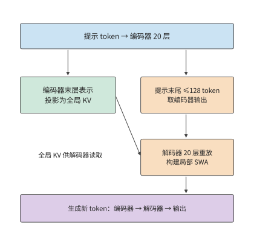

*图 2-20　CED 把全局 KV 的生成与解码器局部状态的构建分开。大部分提示 token 只执行编码器主体及全局 KV 投影；末尾窗口的编码器输出还经过解码器，近似构建局部 SWA。生成的新 token 仍通过全部 40 层。*

长上下文的成本还取决于同一段信息在多少层中重复保存。V4.1 的技术报告直接把 HBM、SSD 与主机内存容量，以及 KV 迁移带宽列为设计约束。V4.1 没有继续提高 V4 的序列压缩比：V4 使用 4:1 的 CSA 和 128:1 的 HCA，V4.1 取消 HCA，编码器的全局条目按 2:1 压缩，解码器按 1:1 保留。V4.1 缩小缓存主要靠跨层共享与更低精度，同时保留了更细的历史 token 粒度。[^v41-case]

共享也改变了各层能够独立选择的信息。复用层不再生成自己的全局 K/V，但每层仍保留独立的查询 Q 和局部 SWA，因而可以对共享条目计算不同的注意力权重，形成新的输出。缓存共享减少了一类逐层独立表示，却没有把所有层的计算变成相同操作。

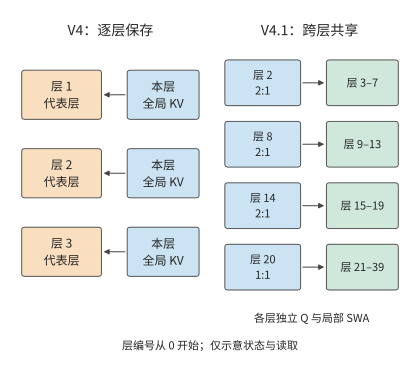

*图 2-21　V4 与 V4.1 的全局 KV 保存方式。左侧以三个代表层示意逐层保存；右侧显示 V4.1 四个独立保存全局 KV 的层及共享关系。实线表示数据读取；各使用层仍有自己的 Q 与局部 SWA，图中省略其他计算。*

把上述共享关系代入容量计算。2026 年 9 月发布的 DeepSeek V4.1 Flash 有 40 层文本主干，但只有 4 层拥有独立的全局 KV：按从零开始的编号，第 2、8、14 层每两个 token 生成一条压缩记录，第 20 层每个 token 生成一条记录，其余全局注意力层共享这些缓存。主记录的 512 个值采用 FP4（每个值占 4 位的浮点格式），每 16 个值另有一个字节的 scale，因此每条记录占 $512/2+512/16=288$ 字节；索引记录占 $128/2+128/32=68$ 字节。全局 KV 的平均存储增量为

$$
\left(\frac{3}{2}+1\right)(288+68)=890\ \mathrm{B/token}.
$$

作为对照，旧 V4-Flash 有 21 层 4:1 压缩和 20 层 128:1 压缩。按官方 FlashMLA（DeepSeek 开源的 MLA 注意力计算库）的格式（主记录 584 B、索引记录 68 B），其全局 KV 的平均存储增量为

$$
21\frac{584+68}{4}+20\frac{584}{128}=3514.25\ \mathrm{B/token}.
$$

两者的全局 KV 平均增量相差约 3.95 倍，对应官方图中取整后的 3,514 与 890 B/token。除全局上下文缓存外，V4.1 的局部窗口每层最多保存 128 条记录，每条 FP8（每个值占 1 字节的浮点格式）+scale 记录占 528 B，40 层合计 2.578 MiB。全局历史随上下文增长，局部窗口则在填满后保持固定容量。

沿生成过程逐步观察，还能看出全局缓存的增长节奏。对 V4.1，全局缓存从偶数长度增长到下一个奇数长度只增加 356 B，即第 20 层每 token 一条的记录；到下一个偶数长度时，第 2、8、14 层的三个 2:1 压缩器各再完成一条记录，本步合计增加 $4\times356=1{,}424$ B。窗口填满后，后续写入会覆盖旧槽位，容量不再增长，但仍然产生写入：40 层 SWA 每步合计写入 $40\times528=21{,}120$ B，压缩器更新另计。

共享同一份全局缓存的各层仍需读取数据，部分层还会重新索引；8K 场景下，按表中的生产混合格式，V4-Flash 与 V4.1 Flash 的注意力 KV（含局部 SWA）与索引逻辑读取量分别为 12.556 和 11.375 MiB，跨层共享主要减少了重复保存的空间。

缓存复用与条目选择还可以分别安排。V4.1 的 CSA2 把层分成三种模式。**Full**（完整）层完整执行“生成全局 KV、索引、选取和注意力”的流程。**Reindex**（重索引）层共享 KV，用自己的索引查询重新选取 top-k；**Reuse**（复用）层连同所选缓存条目一起复用。V4.1 的 38 个全局注意力层中，有 4 个 Full、4 个 Reindex 和 30 个 Reuse；另外两个层仅使用 SWA。解码器的首个 Full 层扫描全局，并选出最多 $2048\times8=16{,}384$ 个候选条目；技术报告第 2.3.2 节将这一集合称为**候选池（candidate pool）**，其中的候选是可供注意力检索的缓存条目。后续 Reindex 层只在池内各自选取最多 512 个条目。[^v41-candidate] 后续层的搜索量因此有了上限，但初始全局扫描仍随上下文增长。

例如，某次查询面对 131,072 个全局缓存条目，将它们按每块 8 个分成 16,384 块。首个解码器 Full 层先为所有缓存条目评分，以块内最高分作为块分数，再选出 2,048 块，形成 16,384 个候选条目。该层仍从全局分数选取 top-512；后续 Reindex 层在候选内用新的索引查询重算分数，各自选出 512 个缓存条目。候选池限定后续层的搜索范围，各层的 top-512 决定本层最终读取哪些条目。

候选池让后续层的搜索量有了上限，也使首轮筛选影响后续选择：某个缓存条目一旦落在候选池之外，本次查询的后续 Reindex 层便无法再选入该条目。模型训练需要适应这一搜索范围，第 10 章将说明 V4.1 如何把候选限制纳入后训练。

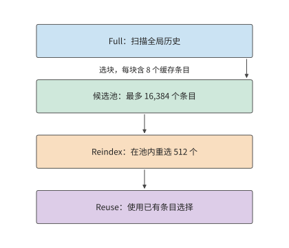

*图 2-22　V4.1 解码器的分层缓存条目选择。首个 Full 层先扫描全局，选出最多 16,384 个候选条目；后续 Reindex 在候选内重新选 512 个，Reuse 使用已有选择。示意条目数量不按比例；各层独立 Q 与局部 SWA 未画出。*

## 2.4 条件计算与专家权重复用

第 2.3 节通过共享、压缩和递推减少上下文状态。另一个主要数据来源是模型权重：每个 token 是否必须使用模型中的全部参数？本节从 FFN 出发分析这一问题。

稠密 FFN 对每个 token 使用同一组矩阵；MoE 把参数分配给多个专家，由路由器为每个 token 选择少数专家。这样，“模型保存多少参数”与“一个 token 激活多少参数”就可以分别调整，batch 内各 token 的选择也会影响实际访问的权重集合。

### 2.4.1 稠密前馈网络与专家路由

典型的 MoE 分支先从输入计算路由分数，按 top-k 选择路由分数最高的 k 个专家，再把 token 送入选中专家，最后按路由权重合并输出。有共享专家时，还会有一条所有 token 都参与的分支。专家本身通常仍由 gate、up、down 三个矩阵构成，因此可以按第 2.1.4 节的 SwiGLU 计算逐个展开。

以 Qwen3.6-35B-A3B 为例。其文本主干包含 40 层，隐藏维度 2048；每层 256 个路由专家，每 token 选 8 个，专家中间维度为 512，另有共享专家。一个路由专家包含 $3\times 2048\times 512=3,145,728$ 个参数，以 BF16 保存为 6 MiB。每层全部路由专家占 1.5 GiB，一个 token 选中的八个专家占 48 MiB。

设专家 $e$ 实际收到 $t_e$ 个 token，其 gate/up 是 $[t_e,2048]\times [2048,512]$，down 是 $[t_e,512]\times [512,2048]$，主要矩阵运算量为 $6t_e\times 2048\times 512$。将各专家的运算量相加，就得到全部路由专家的矩阵运算量。路由器先决定各个 $t_e$，选中专家执行三次投影，随后收集并加权合并结果；共享分支对全部输入行执行。

用 $E$ 表示路由专家总数、$k_{\mathrm{top}}$ 表示每 token 选中的专家数，单个专家有 $N_e$ 个参数，则每层保存 $EN_e$ 个路由专家参数，单 token 执行的专家矩阵工作约为 $2k_{\mathrm{top}}N_e$。增大 $E$ 扩充了可选择的参数集合；只有实际选中数或专家尺寸增加，才会直接增加这部分单 token 运算。Qwen3.6 的 A3B 名称体现激活规模，全部文本参数约为 346.6 亿，BF16 权重约为 69.321 GB。

### 2.4.2 实际运算量与批内权重读取量

第 2.4.1 节的 $2k_{\mathrm{top}}N_e$ 只统计单个 token 的专家工作；一批 token 同时路由时，还要看它们落到多少个不同的专家上。

**例题 2-4：相同专家计算量，权重读取为何相差 32 倍？** 对 Qwen3.6 的同一层，比较均匀分派和集中分派。

解：即使激活参数相同，batch 内的权重读取也可能不同。假设同时为 $B=64$ 条请求各执行一步 decode，每条请求本次输入一个 token，因此 $m=B=64$。每个 token 选择 8 个专家，总共有 512 次 token 到专家的分派。若均匀分到 256 个专家，每个专家平均接收 2 个 token，当前 batch 会访问全部路由专家；若所有 token 都集中到同一组 8 个专家，则每个专家接收 64 个 token，当前 batch 只访问 8 份专家权重。

设本批实际访问的不同专家数为 $U$。若路由过程中不丢弃任何分派给专家的 token，则有 $\sum_e t_e=Bk_{\mathrm{top}}$，因此

$$
F_{\mathrm{expert}}=2N_e\sum_e t_e=2N_eBk_{\mathrm{top}},\qquad R_{\mathrm{expert}}=b_WN_eU.
$$

第一式按分派的总行数累计，第二式按实际读入的不同权重累计。例中两种路由方式都产生 512 次 token 到专家的分派；一个 token 发给八个专家，会在八个专家的输入矩阵中各占一行。这 512 行来自 64 个原始 token，矩阵运算量相同；但 $U$ 分别为 256 和 8，每层读取量分别为 1.5 GiB 和 48 MiB，相差 32 倍。40 层所有路由专家合计保存 60 GiB，集中路由每批选中的权重合计只有 1.875 GiB。

| $B=64$ 的路由情形 | 每层访问的不同专家 | 每专家 token 数 | 每层路由专家理想读取 |
| --- | ---: | ---: | ---: |
| 均匀分派 | 256 | 2 | 1.5 GiB |
| 集中分派到同一组 8 个专家 | 8 | 64 | 48 MiB |

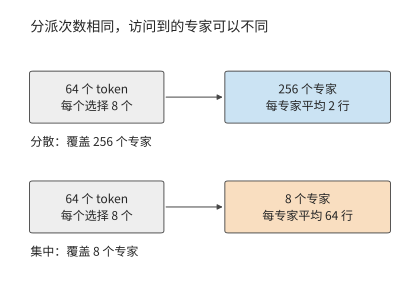

*图 2-23　64 个 token 各选八个专家，总计 512 次分派。分散时可覆盖 256 个专家，集中时只访问八个；每专家处理的行数随之改变。*

读取量的差别来自每份权重供多少输入行使用：均匀分派时每个专家处理两个 token，集中分派时每个专家处理 64 个 token。同一份权重参与的计算量增至原来的 32 倍，理想权重访问量便降至原来的三十二分之一。与此同时，原来要执行许多输入只有两行的矩阵乘法，现在只需执行少数输入为 64 行的矩阵乘法；权重复用和计算效率因此都会受到影响。[^source-18]

把各层累加成整模型再来比较：Qwen3.6 在已有 8192 个 token 上下文、$B=1$ 的 decode 中约需 7.33 GFLOPs，小于 Qwen3-8B 的约 20.0 GFLOPs。整个模型的计算量差异来自几项结构上的变化：2048 维主干缩小投影，30 个线性层使用递推状态，MoE 每次只执行选中的专家及共享分支。专家数量增加使总参数量增大，而每次调用的工作量取决于实际执行了哪些运算。

稀疏激活让总参数量与每个 token 实际使用的参数量可以分别调整，模型就能用较少的计算访问较大的参数集合。服务时，路由结果决定每份专家权重供多少 token 复用，例题 2-4 展示的正是这两种访问方式的差别。

### 2.4.3 共享专家与潜空间计算

上述差距由专家接收的输入行数决定。还要考虑专家本身的尺寸：共享专家处理全部输入，潜空间专家则先缩小输入维度。两者都会改变单个专家需要多少权重、执行多少运算。

DeepSeek V4-Flash 每层有 256 个路由专家，每 token 选 6 个，另有 1 个共享专家；路由专家中间维度为 2048。单专家的 gate/up 为 $[t_e,4096]\times [4096,2048]$，down 将宽度从 2048 变回 4096；三个投影合计包含 25,165,824 个参数。前三层采用哈希路由，后续采用评分路由：哈希路由按 token 确定专家，评分路由根据当前表示选择专家。

共享专家处理本次全部 $m$ 个 token 的特征向量，路由专家 $e$ 只处理分派给它的 $t_e$ 个 token。若共享专家有 $N_s$ 个参数，一层的专家矩阵运算量为 $2mN_s+2\sum_e t_eN_e$。普通单步 decode 中，每条请求输入一个新 token，此时 $m=B$；prefill 则要累计各请求本次处理的全部 token。DeepSeek V4-Flash 每 token 选择六个路由专家并执行一个共享专家，运算量正是这两部分之和；容量则需要保存全部 256 个路由专家和共享分支。

Kimi K3 每个 MoE 层有 896 个路由专家，每个 token 选择其中 16 个。输入先从 7168 维主干空间投影到 3584 维潜空间，再经过中间维度为 3072 的专家变换，合并后投影回主干空间。共享专家直接处理主干表示。降维减少了路由专家的矩阵尺寸，同时增加了进入和离开潜空间的两次投影。[^source-3]

如果专家分布在不同的卡上，就要把输入 token 发送到专家所在的卡，专家算完后再把结果合并。通信量因此取决于专家放在哪里、输入保存在哪里。第 6 章讨论多卡划分，第 9 章介绍 CPU／GPU 放置，以及将注意力（Attention）与 FFN 交给不同资源的 AF 分离。

> **练习 2-6〔延伸〕：专家数量与分派方式如何影响计算和权重读取**
>
> 对 Qwen3.6 的一层，取 $B=64$、256 个路由专家、每 token 选 8 个。分别考虑均匀分派和集中分派到同一组 8 个专家的情况，写出各专家接收的 token 数 $t_e$，再计算 FLOPs、被访问的专家数量与 BF16 权重读取量。再将专家总数减半、中间维度加倍、每个 token 选中的专家数减半，判断专家总参数量与实际执行的专家矩阵运算量是否变化。最后说明如何在上述计算中加入共享专家的参数量与运算量；对于采用潜空间专家的模型，再说明如何计入进入和离开潜空间的投影。

## 2.5 网络形状与计算组织

上下文状态与专家选择改变了主要数据集合，网络的深度、宽度和连接方式则进一步决定这些工作使用多大的矩阵、按什么顺序执行。参数量相近的模型也可以有不同的计算图；矩阵 FLOPs 相近的模型，缓冲区的占用时间和串行步骤也可能不同。

### 2.5.1 深度、宽度与专家粒度

先忽略词表和小向量参数。若 FFN 宽度与隐藏维度保持固定比例，稠密主干的参数量大致正比于 $Ld^2$。把隐藏维度减半、层数增至四倍，可以保持这部分参数量相近，但逐层依赖链的长度也增至原来的四倍。每个矩阵更小，但计算要经过更多层；每层还要保存相应的上下文状态。层数与宽度由此在相近参数预算下改变了计算粒度和依赖深度。

专家结构也可以作类似调整，同时保持参数量和运算量不变。单层路由专家的总参数为 $3Edf$，单 token 专家运算量为 $6k_{\mathrm{top}}df$。将专家数 $E$ 减半、中间维度 $f$ 加倍、选中数 $k_{\mathrm{top}}$ 减半，这两个量都不变。Qwen3-235B-A22B 的 128 个宽度 1536 的专家、每 token 选 8 个，可以与 64 个宽度 3072 的专家、每 token 选 4 个作这一对照。路由输出维度与每专家接收行数仍会改变，从而改变分组矩阵乘法（把多个专家的矩阵乘法组织成一次执行）的形状。

用算例核对基线与两个变体。在 16 个 token 的算例中，三种专家粒度的专家矩阵运算量保持相同，基线与 64 专家变体均约为 454 GFLOPs。专家数减半、单专家宽度加倍时，同样多的权重分成更少的大矩阵；专家数加倍、宽度减半时，则成为更多的小矩阵。路由器要为每个专家计算路由分数，因此其参数也随专家数变化。[专家粒度计算](../calculations/results/qwen235-granularity-baseline.md)将路由与专家矩阵分别累计，说明专家参数总量相同时，矩阵形状为何仍会不同。

矩阵和状态的形状也决定多卡分工的最小单位。128 个专家可分成八组，每组 16 个；四个 KV 头按完整头分工时只能形成四份，八卡执行就需要复制部分 KV 或调整分组。第 5 章从矩阵分块分析执行效率，第 6 章将进一步把这些矩阵和状态分配到各张卡。

### 2.5.2 残差连接与跨层状态

除了层数和宽度，还要看各层如何连接。残差连接把子层输入直接加到变换结果上，让原始信息和梯度有一条跨层直通的路径。普通残差计算 $x_{\ell+1}=x_\ell+f_\ell(x_\ell)$，其中 $f_\ell$ 是第 $\ell$ 个子层的变换，因此子层计算期间要保留输入 $x_\ell$，等变换结果产生后才能相加。若后续多个层还会引用同一表示，就必须将它保存到最后一次使用结束。连接方式由此直接决定哪些张量需要同时保存。

普通残差把不同深度的信息不断相加到同一条通路中。为了让层间信息有更多组合方式，同时保持深层网络中的信号传播稳定，DeepSeek V4-Flash 使用 **mHC（Manifold-Constrained Hyper-Connections，流形约束超连接）**。mHC 把一条残差通路扩展成多条，并约束通路之间的混合系数；这里的“流形约束”，具体是把残差混合矩阵的元素限制为非负，且各行与各列的和接近 1。[^architecture-motivation]

该模型保存 4 路残差状态，每一路都是当前 token 的一份 4096 维中间表示。保留四路表示，是为了让后续层学习如何组合不同通路的信息。每个子层先将四路表示混合为 4096 维子层输入，执行注意力或 FFN，再把结果写回残差通路。因此，主体矩阵保持 4096 维输入，新增工作集中在进入和离开子层的混合与汇合。四路状态让层间可以传递更多组表示，混合操作将这些表示与原有子层连接起来。

处理 8192 个输入 token 时，mHC 的混合投影约需 555 GFLOPs，非矩阵运算约需 149 GFLOPs。残差混合矩阵先经 **Sinkhorn 迭代**归一化，即交替将每行、每列除以各自的和，使行和与列和逐渐接近 1；这使多层混合中的数值尺度更稳定。归一化后的系数再用于组合各条残差通路；末端汇合这些通路，形成送入词表头的表示。因此，多路残差不仅增加要保存的表示，还增加每层的混合与归一化计算。[^source-4]

Kimi K3 希望当前层能够按需要选取不同深度的信息，而不只是接收逐层相加后的单一混合结果。为此，Kimi K3 使用 **Attention Residuals（AttnRes，注意力残差连接）**，对较浅层的表示计算权重，再加权求和，形成当前层的输入。这种注意力沿网络深度选择信息，前面的序列注意力则在不同 token 之间选择信息。为减少保存和读取所有层输出的开销，块式实现把若干层组织成一块，保留供后续块选择的表示。[^architecture-motivation]

后续层还要使用这些块表示，本次前向中要继续保存，前向结束后即可释放。上下文 KV 则要保留到后续生成步骤。两者需要保存的时间范围不同：AttnRes 增加一次前向中的临时存储，KV 随请求跨多次调用保留。[^source-19]

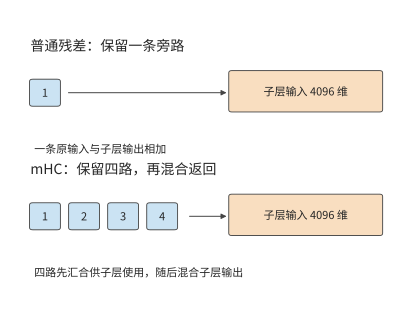

*图 2-24　普通残差与四路 mHC 的连接范围。普通残差保留一条子层输入旁路；mHC 汇合多路状态供子层计算，再混合输出。两种图中的子层输入均为 4096 维。*

### 2.5.3 多 token 预测与辅助计算

前两节改变的是主干内部的形状与连接；另一类设计在主干末端附加预测模块，改变一次前向能给出多少个 token。普通自回归主干根据当前上下文预测下一个 token。**多 token 预测（Multi-Token Prediction，MTP）**在此基础上增加后续多个 token 的预测目标或辅助预测模块。训练时，这些额外目标促使当前表示包含对更远后续内容有用的信息；推理时，辅助模块可以先提出多个候选 token，再由主模型验证，以减少生成同样数量 token 所需的串行轮数。

**推测解码（speculative decoding）**先用较低开销生成候选序列，再让目标模型验证这些候选。用于推测解码时，MTP 根据当前主干特征预先生成后续 token，再交给目标模型验证。如果多个 token 通过验证，一轮就能产生多个有效输出；否则从最后一个通过验证的位置继续生成。因此，加速效果取决于草稿生成、目标模型验证各需多久，以及每轮有多少 token 通过验证。第 8 章将计算这三者的关系。

以 DeepSeek V4-Flash 为例计算一次辅助预测。其 MTP 辅助块接收主干特征和 token ID，预测后续位置。对单个 token，即 $B=1,P=1$，一次辅助计算约需 1.80 GFLOPs，其中共享词表头约需 1.06 GFLOPs。共享词表头占这次计算的一半以上：虽不增加独立权重，每次调用仍要执行词表投影。[^source-5]

辅助预测使一次前向执行能够提供多个候选，经验证和采样后形成有效输出。第 3 章将把编码、生成、迭代及实时输出组织成完整负载。

设一次普通 decode 耗时为 $T_d$，一轮推测解码的草稿和验证合计耗时为 $T_s+T_v$，平均得到 $\bar g$ 个有效输出。每输出分摊时间为 $(T_s+T_v)/\bar g$，有收益的条件是

$$
\bar g>\frac{T_s+T_v}{T_d}.
$$

例如，普通 decode 为 20 ms，草稿与验证合计为 30 ms，平均每轮得到两个有效输出时，每输出分摊 15 ms；若只能得到一个，则需要 30 ms。多预测几个位置会增加单轮工作量，只有采用的输出足够多，才能抵消新增的计算开销。

## 2.6 整个模型的资源需求与比较

第 2.3 至 2.5 节介绍了三类结构变化：上下文表示决定状态大小和访问方式，专家选择决定每次使用哪些权重，网络深度与连接方式决定计算顺序。本节将这些部分合起来，比较完整模型在相同输入条件下的计算量与存储需求，再用具体任务检查模型输出。

### 2.6.1 各组件的资源需求与全模型汇总

**五种模型的注意力结构与专家配置。** 本章选择一个稠密基线和四个结构不同的 MoE 模型，用相同的矩阵规则比较其资源需求。表 2-A 中参数量的后缀 T 表示万亿。

**表 2-A　五个模型的总体架构（文本部分）**

| 架构参数                | DeepSeek V4.1 Flash |  Qwen3-8B | Qwen3.6-35B-A3B |  DeepSeek V4-Flash |       Kimi K3 |
| ------------------- | ---: | --------: | --------------: | -----------------: | ------------: |
| 逻辑参数总数，约            | 551.57B＋196.93B Engram |     8.19B |          34.66B |            284.33B |         2.78T |
| 主干层数 $L$            | 40（20＋20） |        36 |              40 |                 43 |            93 |
| 主干隐藏维度 $d$          | 5120 |      4096 |            2048 |               4096 |          7168 |
| 注意力组成               | 2 SWA＋38 CSA2 |    36 GQA |   30 线性＋10 全注意力 | 2 窗口＋21 CSA＋20 HCA | 69 KDA＋24 MLA |
| 前馈组成                | 40 层 MoE | 稠密 SwiGLU |        40 层 MoE |           43 层 MoE | 首层稠密＋92 层 MoE |
| 每 MoE 层路由专家数 $E$    | 384 |         — |             256 |                256 |           896 |
| 每 token 选择数 $k$     | 6 |         — |               8 |                  6 |            16 |
| 路由专家计算宽度 $d_e$      | 5120 |         — |            2048 |               4096 |          3584 |
| 稠密 FFN／路由专家中间宽度 $f$ | 2304 |     12288 |             512 |               2048 |          3072 |
| 共享专家中间宽度            | 2304 |         — |             512 |               2048 |       合计 6144 |
| 跨层连接                | Single-Pass mHC，4 路 |      普通残差 |            普通残差 |            mHC，4 路 |       AttnRes |

表中列出五个模型的文本部分。V4.1 Flash 的约 551.57B 主干参数与 196.93B Engram 参数分别列出；后者包含约 196.61B 查表参数及其投影、门控参数，两者共同计入后文的完整文本权重。V4.1 的 Single-Pass mHC 是 mHC 的改进：每层沿用上一层算出的输入混合系数，使残差状态只需读取一遍。Kimi K3 将不同的前馈结构用于不同层：首层是中间维度为 $33792$ 的稠密 FFN，后续层则使用中间维度为 $3072$ 的路由专家。稠密层让每个 token 经过同一组宽矩阵，MoE 层则让每个 token 使用多组较窄的专家矩阵。

V4.1 Flash 的执行阶段如下：40 层分成 20 层因果编码器和 20 层解码器，只有第 2、8、14、20 层保存独立全局 KV，第 2、8、14、20、24、28、32、36 层运行索引器，层号从零开始。Full 层生成缓存和索引，Reindex 层重算索引，Reuse 层复用已有选择；每层仍保存自己的局部窗口。因此，层数不再等于独立全局缓存的份数，输入长度也不再等于每层实际处理的查询 token 数。

表中还有三个关系。Qwen3.6 的总参数比 Qwen3-8B 多，主干宽度却只有一半：它把大量参数放进可选择的专家，每个 token 只调用其中八个。Qwen3-8B 与 DeepSeek V4-Flash 的主干同为 4096 维，DeepSeek V4-Flash 通过每层 256 个专家形成更大的参数集合。Kimi K3 又将专家计算移到 3584 维潜空间，使专家输入不必与主干采用相同的宽度。这些差异说明，“保存多大的模型”和“一个 token 做多少工作”需要分别计算。表 2-1、2-2、2-4、2-5、2-6 将逐个展开这五个模型，DeepSeek-V3 的表 2-3 用作 MLA 的历史参照。

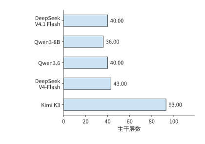

*图 2-25　五模型的主干层数，使用同一线性尺度。层数决定同类工作沿网络深度重复多少次。*

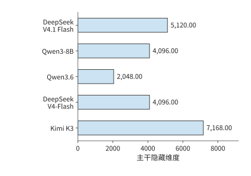

*图 2-26　同一线性尺度下的主干隐藏维度。每个 token 的特征宽度决定投影的输入或输出尺寸。*

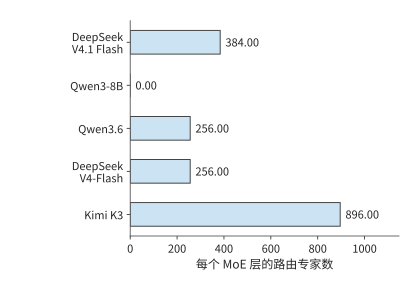

*图 2-27　每个 MoE 层保存的路由专家数量。Qwen3-8B 使用稠密前馈层，其路由专家数为零；每个 token 实际选中数见表 2-A。*

有了一类层的参数、一次调用的运算和一条请求的状态，整模型只需把这些项按各类层的实际数量加权求和：

$$
M_W=b_W\sum_gL_gN_g+M_{\mathrm{embedding}}+M_{\mathrm{head}},\qquad
F_{\mathrm{model}}=\sum_gL_gF_g+F_{\mathrm{head}}.
$$

$g$ 表示模型层的类别，同一类层采用相同的注意力、前馈网络与连接结构；$L_g$ 为第 $g$ 类层的数量。MoE 的 $N_g$ 包含全部专家，$F_g$ 则使用各专家实际接收的行数。表 2-1 已建立 Qwen3-8B 的稠密基线；章末查阅表按同样方式展开 Qwen3.6、DeepSeek-V3、DeepSeek V4-Flash、Kimi K3 和 DeepSeek V4.1 Flash，方便读者查明总量中的每一项来自哪个矩阵。

阅读时可以按数据流走一遍：输入进入哪类注意力层，随后经过哪类前馈网络，最终如何得到词表分数；累加时还要加入嵌入查行、末端归一化和词表头。每张表按注意力、前馈与连接、输出接口分组；“层／调用数”给出整模型累计倍数，“矩阵 FLOPs”仍是该行对应操作执行一次的浮点运算量。

将同样的累加规则用于其他模型，可以逐项列出各模型的计算分支。下表按模型列出要累计的上下文状态、权重与附加计算，以及合计时最容易遗漏的部分；MTP、DSpark（V4.1 的推测解码模块）与视觉模块按本次执行范围单独加入。

| 模型分支 | 上下文状态 | 权重与附加计算 | 合计时最容易遗漏的部分 |
| --- | --- | --- | --- |
| DeepSeek V4.1 Flash | 4 份共享全局 KV／索引＋各层 SWA＋压缩缓冲与 token 历史 | CED、CSA2、Engram、专家、Single-Pass mHC | 编码器全输入、解码器末尾重放与全局投影的不同位置数 |
| Qwen3-8B | GQA KV | 稠密 SwiGLU、输出头 | 非矩阵算术、输出头位置范围 |
| Qwen3.6 | 全局 KV＋递推与卷积状态 | 路由／共享专家 | 线性层保存固定大小的递推状态 |
| DeepSeek-V3 | MLA 潜变量或展开 KV，随执行路径变化 | 前三层稠密 FFN、后续 MoE 与共享专家 | 上投影执行位置、两种缓存路径的区别 |
| DeepSeek V4-Flash | 窗口＋压缩＋索引＋缓冲 | 专家、压缩器、mHC | 索引扫描、块边界更新、共享分支 |
| Kimi K3 | MLA＋KDA＋卷积 | 潜空间专家、AttnRes | 展开路径、跨层临时状态、首层差异 |

先依次比较完整权重、单步计算量和上下文状态大小，再通过各模型的分项表说明差异分别来自哪些矩阵和状态。

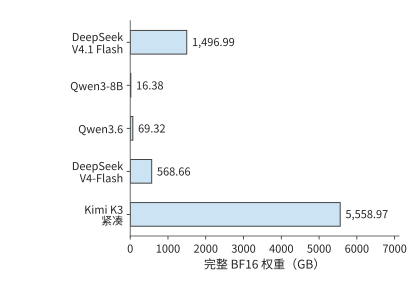

*图 2-28　五模型完整权重统一用 BF16 表示时的容量，使用同一线性尺度。这里累计全部参数，包括每次仅选中部分的路由专家。*

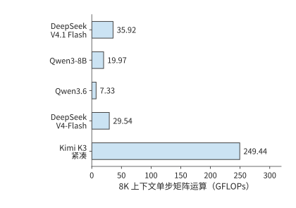

*图 2-29　相同单请求、已有 8K 上下文时的单步矩阵运算量。按各模型在表 2-C 说明的执行路径累计，Kimi K3 采用紧凑 MLA。*

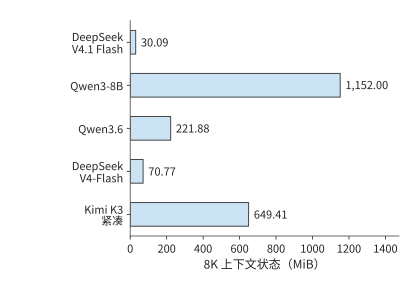

*图 2-30　相同 8K 上下文下的每请求状态。上下文表示采用 BF16，递推矩阵和压缩缓冲采用相应实现的精度；各项合计为一条请求保存 8192 个上下文 token 的容量。*

五个模型的逐矩阵展开见本章末的[模型矩阵查阅表](#model-matrix-tables)。下面用分项合计解释资源差异。

将矩阵尺寸相乘并按层数累计，DeepSeek V4-Flash 主干约有 2843 亿个逻辑参数，统一 BF16 表示约为 568.7 GB。

Kimi K3 文本主干约有 2.78 万亿个参数，绝大多数位于 92 个 MoE 层的路由专家中。每个 token 在每层只选择 16 个专家，因此完整模型的存储容量与单 token 的计算量取决于不同的因素：前者由全部专家决定，后者由选中的专家及共同执行的注意力、共享专家和投影决定。[^source-7]

下面将各模型的参数划分为互不重叠的六类：嵌入与输出、注意力投影、稠密或共享 FFN、路由专家、Engram、其余组件。将各类参数相加即为模型总参数量，再按每个参数 2 字节换算，就得到图 2-28 的权重容量。这种分解能直观展示参数的分布，也是解释下一张表的依据。

<!-- MODEL-COMPARISON:START -->

**表 2-B　参数由哪些部分构成（单位：十亿个逻辑参数）**

| 模型 | 嵌入与输出头 | 注意力投影 | 稠密／共享 FFN | 路由专家 | Engram | 其他 |
| --- | ---: | ---: | ---: | ---: | ---: | ---: |
| DeepSeek V4.1 Flash | 1.324 | 5.126 | 1.416 | 543.582 | 196.929 | 0.118 |
| Qwen3-8B | 1.245 | 1.510 | 5.436 | 0.000 | 0.000 | $<0.001$ |
| Qwen3.6 | 1.017 | 1.283 | 0.126 | 32.212 | 0.000 | 0.022 |
| DeepSeek V4-Flash | 1.059 | 5.085 | 1.082 | 277.025 | 0.000 | 0.081 |
| Kimi K3（紧凑 MLA） | 2.349 | 36.180 | 12.882 | 2722.741 | 0.000 | 5.333 |

其他包含路由器、潜空间进出投影、归一化、卷积和连接等参数；注意力投影包括 DeepSeek V4-Flash 的压缩与索引投影。Qwen3-8B 的主要参数集中在处理每个 token 时都要执行的稠密 FFN，Qwen3.6、V4-Flash 和 Kimi K3 则将大部分参数放进路由专家。V4.1 Flash 还保存了较大的 Engram 表，表中单列它的查表、投影与门控参数；查表参数增加了完整模型容量，却不意味着每个 token 都要遍历整个表。Qwen3.6 的路由专家占约 93%，DeepSeek V4-Flash 与 Kimi K3 约为 97%—98%。因此，三者的总容量主要由专家集合决定，单 token 的专家运算量则取决于每层选中的专家。

**表 2-C　相同输入条件下的 prefill 计算与选中专家权重**

| 模型 | 8K prefill（TFLOPs） | 单 token 选中路由专家的 BF16 权重（GiB） |
| --- | ---: | ---: |
| DeepSeek V4.1 Flash | 143.95 | 15.820 |
| Qwen3-8B | 133.59 | — |
| Qwen3.6 | 52.09 | 1.875 |
| DeepSeek V4-Flash | 231.13 | 12.094 |
| Kimi K3（紧凑 MLA） | 1863.46 | 90.562 |

两种调用均取 $B=1$，prefill 为 $S=0,P=8192$，decode 为 $S=8192,P=1$，词表头均只处理末尾 token；图 2-29 的单步矩阵运算量按同一组条件累计。图 2-30 的状态是保存 8192 个上下文 token 所需的空间：上下文表示采用 BF16，递推状态和压缩缓冲按相应实现采用 FP32。V4.1 Flash 还计入参考实现的 int64（64 位整数）token 历史缓存，供 Engram 构造跨调用 n-gram；生产 FP4 全局缓存与 FP8 窗口的容量见第 2.3.6 节。表中最后一列将一个 token 在各层选中的路由专家权重相加，再按 BF16 换算为字节数。把这张表与图 2-28 至图 2-30 对照，就能分别比较完整模型占用的空间、一次调用的运算量，以及请求上下文占用的空间。

各模型按自己的执行路径累计：V4.1 Flash 采用论文 CED＋末尾窗口重放及候选集内索引，Qwen3-8B 为有效因果注意力，Qwen3.6 为逐项执行的矩形注意力实现（eager）与块式线性分支，DeepSeek V4-Flash 为有效主注意力及参考索引，Kimi K3 为紧凑 MLA 与块式 KDA。对照图 2-28 至图 2-30：Qwen3.6 保存的权重约为 Qwen3-8B 的四倍，单步矩阵运算量却更少；DeepSeek V4-Flash 权重继续扩大，8K 状态反而因压缩与选择缩小；Kimi K3 拥有更多专家，隐藏维度更大、层数也更多，因此需要保存更多权重，完成更多运算。这些差异说明，总参数量、单次运算量和上下文状态大小需要根据各自对应的结构分别计算。

**由上下文状态大小推算单步读取量。** Qwen3-8B 每步使用 1152 MiB 旧 KV；DeepSeek V4-Flash 按图 2-30 采用的 BF16 参考格式，主注意力读取与索引扫描合计 27.625 MiB，并更新压缩器；换成第 2.3.6 节的生产混合格式则为 12.556 MiB。Kimi K3 紧凑 MLA 使用 216 MiB 上下文状态，414 MiB 递推矩阵还要一读一写，读写量合计 828 MiB；Qwen3.6 对应 160 MiB 全局注意力的 KV 缓存和 120 MiB 递推矩阵读写。递推状态每步都要读出并更新，上下文表示则要供当前查询使用。因此，即使状态大小固定，每步也仍有相应的读写开销。

**量化编码与元数据共同决定权重容量。** 统一按 BF16 计算时，每个参数占 2 字节，权重大小可以直接反映参数量的差异。实际发布的模型 checkpoint（检查点，保存参数的文件集合）使用各自的存储格式，DeepSeek V4-Flash 主干约为 156.02 GB，Kimi K3 文本约为 1559.97 GB。文件大小由低位宽矩阵、采用较高精度的参数以及格式元数据共同决定；统一精度反映参数规模，文件大小则反映这些参数实际占多少字节。模型加载后，还需要为格式转换和计算分配空间。第 5 章将分析存储格式与运行时实现如何影响显存占用。

比较两张表时，还要注意 V4.1 Flash 各阶段的分工。V4.1 的完整文本权重包含 Engram；prefill 的全部矩阵计算则由编码器、解码器全局 KV 投影、末尾窗口重放和输出头共同组成。生成新 token 时，两部分网络都需要执行，因此不能把 prefill 节省的比例直接用于 decode。

表 2-B 的参数组成解释了权重容量，表 2-C 则展示这些参数如何参与一次调用。二者结合起来，可以区分“保存整个模型需要多少空间”与“处理一个 token 要使用多少资源”。[^comparison-data]

<!-- MODEL-COMPARISON:END -->

表 2-C 中 V4.1 Flash 的 8K prefill 只需 143.95 TFLOPs。表 2-D 把这笔计算拆到各执行阶段，并与参考全层前向对照。

**表 2-D　V4.1 Flash 的 8K 输入如何分配到执行阶段（TFLOPs）**

| 阶段 | 参考全层前向 | CED＋末尾窗口重放 |
| --- | ---: | ---: |
| 20 层编码器 | 142.139 | 141.727 |
| 解码器共享全局 KV 与索引键投影 | 0.044 | 0.044 |
| 20 层解码器的查询与前馈等计算 | 140.202 | 2.175 |
| 末尾 token 词表头 | 0.001 | 0.001 |
| 合计 | 282.386 | 143.947 |

参考路径执行全部 8192 个 token 的 40 层，并按公开实现先计算矩形索引分数再屏蔽；CED 路径的编码器处理全部输入，解码器全局 KV 与索引键仍为全部输入生成，解码器主体只处理末尾 128 个 token，后续索引限制在候选集合内。表中分别包含各路径的全部文本矩阵工作，差异同时来自执行位置数与索引算法。

两条路径均包含注意力、路由评分、路由及共享专家、Engram 投影、Single-Pass mHC 投影和词表头。把解码器的全局投影与查询计算分开，就能看出 CED 如何缩短长提示经过的计算链。[^v41-forward]

**上下文从 8K 增至 1M 时的运算量与状态增长。** 长文档问答和多轮任务会放大上下文访问的成本。下面保持单请求、一次新增一个 token 和末尾 token 词表头不变。8K 场景有 8192 个历史 token；1M 场景有 1,048,575 个历史 token，加上当前查询正好为 1,048,576 个可见位置。

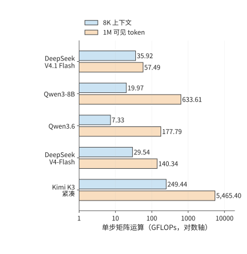

*图 2-31　8K／1M 上下文下再处理一个 token 的矩阵运算量。沿用表 2-C 的执行路径，横轴为对数刻度；1M 包含当前查询。*

表 2-E 单独累计当前查询的注意力评分与值汇总；V4-Flash 与 V4.1 Flash 再加入索引点积。状态列列出调用前的上下文和固定状态，精度与图 2-30 一致。Qwen3-8B 与 Qwen3.6 的发布配置分别支持 40,960 和 262,144 个位置，表中两者的 1M 行按同一结构外推，用于比较增长规律。[^long-context-data]

**表 2-E　长上下文下的交互运算与状态容量**

| 模型 | 8K 上下文交互（GFLOPs） | 1M 上下文交互（GFLOPs） | 8K 状态（GiB） | 1M 状态（GiB） |
| --- | ---: | ---: | ---: | ---: |
| DeepSeek V4.1 Flash | 3.66 | 25.23 | 0.029 | 3.138 |
| Qwen3-8B | 4.83 | 618.48 | 1.125 | 144.000 |
| Qwen3.6 | 1.34 | 171.80 | 0.217 | 20.060 |
| DeepSeek V4-Flash | 3.00 | 113.80 | 0.069 | 6.735 |
| Kimi K3（紧凑 MLA） | 41.08 | 5257.04 | 0.634 | 27.423 |

V4.1 Flash 的全局 KV 只有四份独立来源，增加上下文时不会为所有 40 层各增一份。主注意力每层最多使用 128 个局部 token 和 512 个全局条目；解码器首个 Full 层生成候选集合，后续四个 Reindex 层各扫描至多 16384 个候选条目。编码器的三个索引器和解码器首个索引器仍需扫描增长的全局历史，因此计算量继续上升；跨层共享和分层索引改变了增长幅度。1M 下，其上下文交互为 25.23 GFLOPs，完整单步矩阵工作为 57.49 GFLOPs。

V4-Flash 则沿用 CSA 与 HCA 的两种压缩粒度：CSA 的主注意力选择上限保持不变，但索引扫描随历史增长；HCA 会读取全部已完成的粗粒度条目。1M 下，其上下文交互为 113.80 GFLOPs，完整单步矩阵工作为 140.34 GFLOPs。较短上下文时，V4.1 Flash 更大的主干会增加投影和专家计算；历史足够长时，较少的索引器与分层候选选择才会抵消这部分新增工作。

Kimi K3 的 69 个 KDA 层保持固定递推状态，24 个 MLA 层继续访问随上下文增长的历史。紧凑 MLA 减少了缓存容量，却没有取消查询与历史 token 之间的计算；1M 下，这部分交互达到 5257.04 GFLOPs，整模型达到 5465.40 GFLOPs。评估长上下文设计，应分别检查保存了多少状态、访问哪些位置，以及为索引和更新状态增加了多少工作。

统一计算还保留了 200K 场景：V4.1 Flash 的完整单步矩阵工作为 40.21 GFLOPs，V4-Flash 为 50.48 GFLOPs。到 1M 时，两者的计算量差异进一步扩大，所以正文选用 1M 展示长上下文下的设计价值。

### 2.6.2 参数规模、数值精度与容量约束

把分项计算得到的模型权重和每条请求状态放进同一张显存容量表，就可以判断一张卡能同时容纳多少条请求，以及量化权重能释放多少空间。

对一张卡，先从总容量中扣除权重、工作区和其他固定预留空间，剩余空间才能放请求状态。在请求等长、各自独立保存 KV 的简化情形下，可写为：

$$
B_{\max}=\left\lfloor\frac{M_{\mathrm{device}}-M_{\mathrm{weight}}-M_{\mathrm{workspace}}}{M_{\mathrm{state/request}}}\right\rfloor
$$

分子是扣除固定驻留数据后可用于请求的空间，分母是每条请求的状态大小。每增加一条请求，都要为它分配相应的状态空间；剩余空间无法容纳完整的一份状态时，就无法再增加请求，因此结果要向下取整。递推与卷积状态同样属于每请求数据，与 KV 一起计入分母。

以一张 24 GB 显存的 RTX 4090 运行 Qwen3-8B BF16 为例，权重占 $16{,}381{,}470{,}720$ 字节，工作区预留 2 GiB，每条请求的 8K 上下文占 1.125 GiB。可容纳请求数为

$$
B_{\max}=\left\lfloor\frac{24\times10^9-16{,}381{,}470{,}720-2\times2^{30}}{1.125\times2^{30}}\right\rfloor=4.
$$

上下文变为 16K 时，每条请求占 2.25 GiB，同一空间只能放两条；变为 4K 时，则能放九条。请求数按整数跳变，是因为剩余空间必须容纳一条请求的完整状态，容纳一部分并无意义。

保留多少历史，由此成为既影响应用、也影响系统的决定。应用多保留一段材料，模型就能继续参考它；服务却要为每条请求分配更多状态空间。第 2.3 节的 GQA、MLA 和递推表示进一步改变了保存这些信息的方式。模型结构、上下文组织与并发容量可以放在同一份预算里比较，再用实际任务测试，确定哪些方案能达到所需的回答质量。

量化能释放多少空间，以更大的 DeepSeek-R1-Distill-Llama-70B 为例。第 1.2.3 节已给出该模型的 BF16 权重 141.107 GB、8-bit 分组量化权重 73.726 GB，以及一条含 8192 个 token 请求的 2.5 GiB BF16 KV。同一分组方案下，让嵌入、输出头和归一化等部分继续使用较高精度，并计入 scale 及打包时尾部填充的空间后，4-bit 方案约为 39.500 GB。

4-bit 方案的 39.500 GB 包括低位宽矩阵、仍采用高精度的参数，以及 scale 与打包开销，比把所有参数一律按半字节折算的结果更大。换到一张显存 80 GB（十进制）的 H100 SXM、固定预留 2 GiB 时，8-bit 方案可放 1 条 8K 请求，4-bit 方案可放 14 条。上下文从 8K 增至 32K 时，每请求 KV 增至四倍，4-bit 方案可同时容纳的请求数降到 3 条。压缩权重释放的空间可以保存更多请求的上下文，但每条上下文越长，能同时容纳的请求就越少。[^source-23]

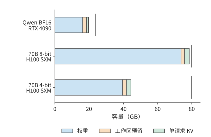

*图 2-32　权重、固定预留和一条请求 KV 的逐项容量。短竖线标出 RTX 4090 的 24 GB 与 H100 SXM 的 80 GB 容量；KV 采用 BF16、上下文长度 8192，固定预留为 2 GiB。“工作区预留”指执行所需的临时空间，“单请求 KV”指一条 8192 个 token 的上下文的缓存。*

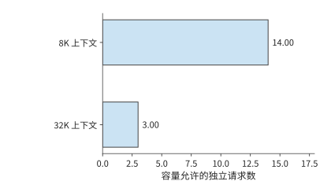

*图 2-33　70B 的 4-bit 方案在同一张 80 GB 的 H100 SXM 上，上下文长度从 8K 增至 32K 时可同时容纳的独立请求数。每请求状态增加，使剩余空间容纳的请求数减少。*

同样方法也能分析更大的部署。235B 的 BF16 权重约 470 GB，超过八张 RTX 4090 合计的 192 GB，而一台 HGX 服务器的八张 H100 SXM 合计为 640 GB。后者扣除权重后约剩 170 GB，要容纳各请求的状态、工作区，以及切分到多卡后需要在几张卡上重复保存的数据，例如每张卡各存一份的归一化参数与路由器，以及 4 个 KV 头分到八张卡时，每个头在两张卡上各存一份的 KV。第 6 章将根据模型在各卡上的分工，计算每张卡的这几项预算。

容量决定一个实例至少需要多少张卡，请求长度与并发数则决定实例要处理多少工作。更低位宽释放空间，较短上下文允许更多请求同时驻留，批内复用则改变这些请求的执行成本。因此，选择部署方案时需要依次考虑容量、访问量与运算量，第 3 章将进一步加入请求的到达与时限。

> **练习 2-7〔核心〕：由显存容量决定可容纳请求数**
>
> 使用显存为 24 GB 的 RTX 4090，工作区预留 2 GiB，Qwen3-8B BF16 权重采用表中的精确值。分别求 4K、8K、16K 上下文下最多可同时容纳多少条请求；在 8K 情形下，将工作区预留增至 3 GiB，重新计算。再使用表中的 70B 4-bit 权重 39.500 GB，换成显存为 48 GB 的 RTX 6000 Ada、预留仍为 2 GiB，分别求 8K 与 32K 上下文的请求数。先比较权重、工作区与 KV 的容量需求，再用剩余显存计算可容纳的请求数。

反过来，给定加速器和服务目标，也可以求留给模型的空间。设每卡可用容量为 $C$，固定预留工作区为 $M_0$，每条请求的 KV 为 $K$，并发为 $B$，每参数占 $b_W$ 字节。忽略其他驻留对象，单卡容量给出的参数上界为

$$
N_{\max}=\frac{C-M_0-BK}{b_W}.
$$

先确定服务所需的状态大小，再计算留给权重的空间。取 RTX 4090 的 24 GB 容量、2 GiB 工作区、4 条各 8192 个 token 的请求，每请求 KV 沿用 Qwen3-8B 的 1.125 GiB。BF16 每参数 2 字节，剩余空间最多容纳约 85.1 亿参数。[^core-calculation] 图 2-34 先扣除服务状态，再划出权重预算。

改变模型结构时，权重预算与状态预算会一起变化。增加层数或 KV 头数会增大每请求的 $K$，留给权重的空间随之减少；跨卡部署则扩大总容量，同时增加通信。Llama 3 报告中的 405B BF16 推理使用两台、共 16 张 H100，其所需容量超出了单台服务器能提供的显存。[^codesign] 模型规模、状态结构与卡数因此需要一起选择。

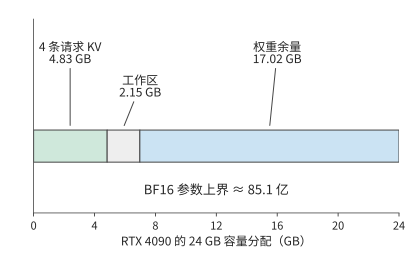

*图 2-34　从加速器反推权重预算。RTX 4090 的 24 GB 中先为 4 条 8K 请求的 KV 和 2 GiB 工作区预留空间，余量给出 BF16 参数上界；图中容量均为十进制 GB。*

### 2.6.3 不同请求条件下的模型比较

最后把容量、调用链和任务质量合在一起。先根据每张卡的容量排除容量不足的配置，再沿每个模型的实际计算方式累计请求工作，最后检查模型能否完成目标任务。

比较完整模型时，可以从两种输入出发。固定 $S,P,G,B$，得到相同调用长度下的资源需求，便于观察结构差异；固定文本和任务，则先经各模型的分词器得到输入长度，再检查输出。这两种对照分别回答“同样多的位置如何计算”和“同一个任务需要如何执行”。

先比较相同输入、输出长度下的资源需求。取 $S=0,P=128,G=4,B=1$，模型执行一次 prefill 和三次 decode，最终保存 131 个已处理位置。将这些调用的矩阵运算量相加，得到下表。[^source-8]

| 模型 | 完整请求矩阵运算量（TFLOPs） | 本次计算采用的实现方式 |
| --- | ---: | --- |
| DeepSeek V4.1 Flash | 4.14 | CED＋末尾窗口重放，候选集内索引 |
| Qwen3-8B | 1.83 | 有效因果注意力 |
| Qwen3.6 | 0.66 | 矩形全注意力与块式线性分支 |
| DeepSeek V4-Flash | 3.40 | 有效主注意力与参考索引 |
| Kimi K3（紧凑 MLA） | 27.16 | 紧凑 MLA 与块式 KDA；decode 采用递推 KDA |

这张表与表 2-C 保持同一执行路径，Kimi K3 均使用紧凑 MLA，把上投影移到查询和汇总一侧。V4.1 Flash 的输入恰好为 128 个 token，全部落在解码器重放窗口内，因此这次短请求没有长提示那种跳过大量解码器位置的收益。完整请求沿同一条选定路径累计 prefill 与三次 decode，上下文从 128 增到 131；这一路径的矩阵形状与状态表示共同决定各项运算量。

从一次调用扩展到完整请求之后，输入和输出的作用更加清楚。增加 $P$，主要增加一次输入处理的工作量，以及后续 decode 开始时的上下文长度；增加 $G$，则反复执行投影、专家与输出头，并多次读取上下文。长输入、短输出与短输入、长输出由此对各类资源提出不同的需求，第 3 章将分析这两类请求持续到达时的系统负载。

> **练习 2-8〔延伸〕：前缀复用与输入改写如何改变模型计算量**
>
> 一轮输入总长 1443 个 token，其中前 1392 个命中缓存，返回 128 个 token。求 $S,P,G,n_d$ 的值、请求结束时的上下文长度，以及本轮新增 KV 的大小。相对于完全重算，复用缓存后投影行数与有效因果查询—键配对数分别减少多少？若在第 501 个输入 token 修改了内容，重新求最长可复用前缀与新输入长度。

再看第二种对照，即固定文本。此时不同分词器会产生不同的输入长度。例如，在八道短语检索题中，Qwen3-8B 与 DeepSeek V4-Flash 都正确找到了目标短语，但短文在 Qwen 中对应 523 或 524 个 token，在 DeepSeek V4-Flash 中对应 501 个；较长文本分别对应 2121 或 2122 个和 2036 个。使用相同文本可以保持任务内容一致，模型各自的 token 数则决定了实际输入形状。

因此，比较模型需要同时回答两个问题：能否完成同一任务，以及完成任务需要多少资源。先按相同标准判断答案，再将各自的输入长度代入模型表，才能把结构差异与实际用途联系起来。[^source-9]

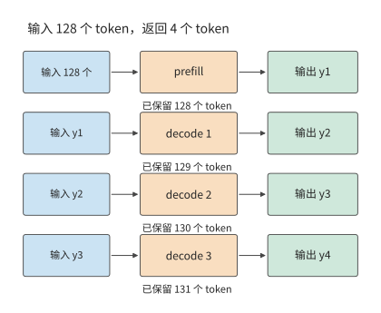

*图 2-35　生成四个输出的调用顺序。prefill 处理 128 个输入并产生首输出，随后三次 decode 各将前一输出送回模型；最终保留 131 个 token。*

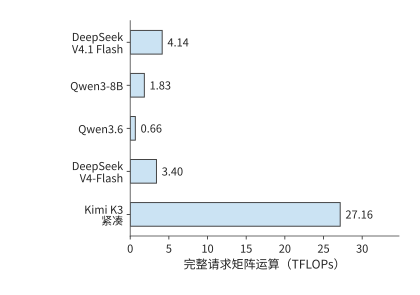

*图 2-36　输入 128 个 token、输出四个 token 时，各模型处理同一请求所需的矩阵运算量。模型执行范围与缓存路径见本节题设；这是逐调用累计的计算量。*

> **练习 2-9〔延伸〕：根据容量、计算需求与任务质量选择模型**
>
> 使用图 2-28 至图 2-30 与表 2-C，为每个模型分别列出完整权重、8K 状态、单步 decode 与 8K prefill 的需求。部署在显存为 80 GB 的单张 H100 SXM 上，预留 2 GiB 工作区，并采用 BF16 权重。先判断哪些模型能完整放入单卡；再把问题改为多卡部署，说明还需从后续章节获得哪些时间与通信参数。将输出 token 数 $G$ 改为 1，重新计算 prefill 与 decode 的调用次数。最后为一个短语检索任务写出质量标准，说明同 token 数比较与同文本比较分别回答什么问题。

本章从计算图出发，逐步算出了完整请求的资源需求。注意力决定如何保存和访问上下文，MoE 决定每次选择哪些权重，网络深度与连接方式决定计算顺序和临时存储。下一章将加入请求长度分布、到达时间、工具调用、训练与强化学习（RL），分析这些计算如何随时间累积成系统负载。

## 谬误与陷阱

**误区：参数更多，每个 token 的计算量就一定更大。** 总参数决定完整模型的容量；MoE 的选中专家、注意力机制的类型和调用形状决定当前工作。对照表 2-A、表 2-B 与图 2-29，分别解释参数量和计算量由哪些因素决定。

**误区：KV 容量降至四分之一，注意力计算量也会同比下降。** GQA 共享上下文表示，查询头仍分别评分；MLA 改变上下文宽度，也改变上投影的执行位置。先找被改变的矩阵与状态，再计算其余工作。

**误区：状态大小固定，访问开销就可以忽略。** 固定递推矩阵仍需更新；prefill 还可能产生临时块状态。容量、累计访问与峰值工作区分别回答不同问题。

**误区：输入 token 数相同，就能公平比较模型能力。** 输入和输出的 token 数适合比较资源结构；同文本任务还需固定评分、质量与执行条件，并允许不同分词器产生不同长度。

## 本章练习与复现

练习 2-2、2-5、2-7 为核心；其余练习用于分析特殊情况，并将方法应用于其他模型。先独立完成预测与推导，再用配套计算核对。计算命令在仓库根目录运行，完整变体参见[第 2 章扩写资料](../archive/outlines/extensions/02-模型架构.md)。

| 对应内容 | 本地复算入口 |
| --- | --- |
| 序列依赖与缓存等价性 | `python3 calculations/calc.py sequence-dependencies --format md` |
| Qwen3.6 前向与专家 | `python3 calculations/calc.py qwen36-forward --format md` |
| DeepSeek V4.1 Flash 完整矩阵计算 | `python3 calculations/calc.py v41-forward --tokens 8192 --execution ced --format md` |
| DeepSeek V4.1 Flash 参考全层路径 | `python3 calculations/calc.py v41-forward --tokens 8192 --execution reference --format md` |
| 五模型比较与完整请求 | `python3 calculations/reproduce_ch02.py` |
| DeepSeek V4-Flash 状态分解 | `python3 calculations/calc.py state --model deepseek-v4-flash --length 8192` |
| Kimi K3 状态与块式执行 | `python3 calculations/calc.py k3-kda-chunk --tokens 8192` |
| 专家粒度 | `python3 calculations/calc.py qwen235-expert-granularity --format md` |
| 单次 MTP | `python3 calculations/calc.py v4-mtp-forward --format md` |
| 已知轨迹字段代入 | `python3 calculations/calc.py trace-resource-bridge --format md` |
| 五模型请求比较 | `python3 calculations/calc.py request-model-comparison --format md` |

本章配图、计算数据与重建方法见[配图目录](ch02/README.md)。章末资料介绍了各模型的结构与设计。

## 模型矩阵查阅表

这组表用于从整模型合计追溯到具体矩阵。查阅时先确定模型与执行分支，再用单次矩阵 FLOPs 乘层数；路由专家还要按实际接收的输入行数累计。表 2-1 的 Qwen3-8B 基线见第 2.1.4 节。

**表 2-2　Qwen3.6-35B-A3B：混合注意力与 MoE 各模块的资源消耗计算**

主干共 40 层：10 层选完整注意力分支，30 层选线性注意力分支；两类层随后都执行 MoE。每 token 从 256 个路由专家中选 8 个，另有一个共享专家。线性分支的 QKV 输出拆为 2048、2048、4096 维；其 $Q$、$K$ 会按值头的分组关系复用。

**模型入口**

| 模块及作用 | 输入 → 输出（行数 × 宽度） | 权重矩阵（输入宽 × 输出宽） | 矩阵 FLOPs | 层／调用数 |
| --- | --- | --- | --- | ---: |
| 词嵌入查行 | $m$ 个 ID → $m\times2048$ | 查表 $248320\times2048$ | 0；查行访问另计 | 1 |

**完整注意力分支**

| 模块及作用 | 输入 → 输出（行数 × 宽度） | 权重矩阵（输入宽 × 输出宽） | 矩阵 FLOPs | 层／调用数 |
| --- | --- | --- | --- | ---: |
| 完整注意力：$Q$ 与输出门控 | $m\times2048\to m\times8192$ | $2048\times8192$ | $2\times m\times2048\times8192$  | 10 |
| 完整注意力：$K$、$V$ | $m\times2048\to m\times512$ | $2048\times512$，共 2 个 | $2\times 2\times m\times2048\times512$  | 10 |
| 完整注意力：上下文交互 | $16$ 个 $Q$ 头、$2$ 个 KV 头，头宽 $256$ | 无新增权重 | $4\times16\times256\times N_{\mathrm{pair}}$  | 10 |
| 完整注意力：输出投影 | $m\times4096\to m\times2048$ | $4096\times2048$ | $2\times m\times4096\times2048$  | 10 |

**线性注意力分支**

| 模块及作用 | 输入 → 输出（行数 × 宽度） | 权重矩阵（输入宽 × 输出宽） | 矩阵 FLOPs | 层／调用数 |
| --- | --- | --- | --- | ---: |
| 线性注意力：QKV 联合投影 | $m\times2048\to m\times8192$ | $2048\times8192$ | $2\times m\times2048\times8192$  | 30 |
| 线性注意力：输出门控 $z$ | $m\times2048\to m\times4096$ | $2048\times4096$ | $2\times m\times2048\times4096$  | 30 |
| 线性注意力：$a$、$b$ 控制量 | $m\times2048\to m\times32$ | $2048\times32$，共 2 个 | $2\times 2\times m\times2048\times32$  | 30 |
| 线性注意力：卷积与 delta 递推 | $Q,K$ 各 $16\times128$；$V$ 为 $32\times128$ | 卷积：8192 通道、核宽 4 | 递推为 $O(m\times32\times128^2)$；块式算法另计  | 30 |
| 线性注意力：输出投影 | $m\times4096\to m\times2048$ | $4096\times2048$ | $2\times m\times4096\times2048$  | 30 |

**各层共同的专家分支**

| 模块及作用 | 输入 → 输出（行数 × 宽度） | 权重矩阵（输入宽 × 输出宽） | 矩阵 FLOPs | 层／调用数 |
| --- | --- | --- | --- | ---: |
| 每层：路由评分 | $m\times2048\to m\times256$ | $2048\times256$ | $2\times m\times2048\times256$  | 40 |
| 路由专家 $e$：在选中分支变换 | $t_e\times2048\to t_e\times512\to t_e\times2048$ | $2048\times512$ 两个；$512\times2048$ 一个 | $6\times t_e\times2048\times512$  | 40 |
| 共享专家：所有 token 的共同变换 | $m\times2048\to m\times512\to m\times2048$ | $2048\times512$ 两个；$512\times2048$ 一个 | $6\times m\times2048\times512$  | 40 |
| 共享专家门控 | $m\times2048\to m\times1$ | $2048\times1$ | $2\times m\times2048\times1$  | 40 |

**输出接口**

| 模块及作用 | 输入 → 输出（行数 × 宽度） | 权重矩阵（输入宽 × 输出宽） | 矩阵 FLOPs | 层／调用数 |
| --- | --- | --- | --- | ---: |
| 词表头（末端一次） | $m_{\mathrm{out}}\times2048\to m_{\mathrm{out}}\times248320$ | $2048\times248320$ | $2\times m_{\mathrm{out}}\times2048\times248320$  | 1 |

累计时，用各行公式乘最后一列的层数；路由专家部分还需对各专家实际接收的行数 $t_e$ 求和。末端归一化执行一次，层内归一化、激活、位置处理和状态更新沿相应分支执行。

读这张表时，先根据这一层使用线性注意力还是完整注意力，选择对应的一组表格行，再加 MoE 的共同部分。线性注意力决定上下文如何保存，MoE 决定当前 token 使用哪些权重；两种机制可以同时存在。A3B 描述名义激活规模，全部专家仍共同构成常驻模型。[^source-20]

**表 2-3　DeepSeek-V3：MLA 与稠密／专家前馈网络**

DeepSeek-V3 共 61 层，前三层使用稠密 FFN，后 58 层每 token 选择 8 个路由专家并执行一个共享专家。下面按展开路径计算 MLA：每个 token 的潜变量经上投影形成各头的 $K$、$V$，64 维位置表示与 $K$ 拼接。查询与键共同参与位置相关的评分，$V$ 则用于汇总内容。

**模型入口**

| 模块及作用 | 输入 → 输出（行数 × 宽度） | 权重矩阵（输入宽 × 输出宽） | 矩阵 FLOPs | 层／调用数 |
| --- | --- | --- | --- | ---: |
| 词嵌入查行 | $m$ 个 ID → $m\times7168$ | 查表 $129280\times7168$ | 0；查行访问另计 | 1 |

**MLA 注意力**

| 模块及作用 | 输入 → 输出（行数 × 宽度） | 权重矩阵（输入宽 × 输出宽） | 矩阵 FLOPs | 层／调用数 |
| --- | --- | --- | --- | ---: |
| 查询下投影：形成低秩查询 | $m\times7168\to m\times1536$ | $7168\times1536$ | $2\times m\times7168\times1536$  | 61 |
| 查询上投影：展开 128 个头 | $m\times1536\to m\times24576$ | $1536\times24576$ | $2\times m\times1536\times24576$  | 61 |
| KV 下投影：512 维潜变量及 64 维位置分支 | $m\times7168\to m\times576$ | $7168\times576$ | $2\times m\times7168\times576$  | 61 |
| KV 上投影：展开每头 $K$、$V$ | $m\times512\to m\times32768$ | $512\times32768$ | $2\times m\times512\times32768$  | 61 |
| 展开 MLA：评分与值汇总 | $128$ 头；Q/K 宽 $192$，$V$ 宽 $128$ | 无新增权重 | $2\times128\times(192+128)N_{\mathrm{pair}}$  | 61 |
| 注意力输出投影 | $m\times16384\to m\times7168$ | $16384\times7168$ | $2\times m\times16384\times7168$  | 61 |

**前馈分支**

| 模块及作用 | 输入 → 输出（行数 × 宽度） | 权重矩阵（输入宽 × 输出宽） | 矩阵 FLOPs | 层／调用数 |
| --- | --- | --- | --- | ---: |
| 前三层：稠密前馈网络 | $m\times7168\to m\times18432\to m\times7168$ | $7168\times18432$ 两个；$18432\times7168$ 一个 | $6\times m\times7168\times18432$  | 3 |
| 后 58 层：路由评分 | $m\times7168\to m\times256$ | $7168\times256$ | $2\times m\times7168\times256$  | 58 |
| 路由专家 $e$ | $t_e\times7168\to t_e\times2048\to t_e\times7168$ | $7168\times2048$ 两个；$2048\times7168$ 一个 | $6\times t_e\times7168\times2048$  | 58 |
| 共享专家 | $m\times7168\to m\times2048\to m\times7168$ | $7168\times2048$ 两个；$2048\times7168$ 一个 | $6\times m\times7168\times2048$  | 58 |

**输出接口**

| 模块及作用 | 输入 → 输出（行数 × 宽度） | 权重矩阵（输入宽 × 输出宽） | 矩阵 FLOPs | 层／调用数 |
| --- | --- | --- | --- | ---: |
| 词表头（末端一次） | $m_{\mathrm{out}}\times7168\to m_{\mathrm{out}}\times129280$ | $7168\times129280$ | $2\times m_{\mathrm{out}}\times7168\times129280$  | 1 |

累计时，用各行公式乘最后一列的层数；路由专家部分还需对各专家实际接收的行数 $t_e$ 求和。末端归一化执行一次，层内归一化、激活、位置处理和状态更新沿相应分支执行。

V3 将两种节省资源的方法组合起来：MLA 用低秩潜变量表示上下文，MoE 让一个 token 只执行部分专家。DeepSeek V4-Flash 进一步改变上下文的组织方式，用窗口保存近期位置，再用不同压缩比例保存长期上下文。下面的模块表将这几类上下文分别展开。[^source-6]

**表 2-4　DeepSeek V4-Flash：选择性上下文访问与专家计算**

43 层包含 2 个纯窗口层、21 个 CSA 层和 20 个 HCA 层；每 token 选 6 个路由专家，另有一个共享专家。$A$ 是该层跨全部请求的主注意力有效查询—键配对数，$I$ 是索引实际扫描的查询—键配对数，两者均不含头数。分组输出投影的八组处理八份不同切片。CSA 的压缩投影先产生包含重叠分支的 1024／256 维表示，再分别形成 512 维的主注意力上下文表示和 128 维的索引条目。

**模型入口**

| 模块及作用 | 输入 → 输出（行数 × 宽度） | 权重矩阵（输入宽 × 输出宽） | 矩阵 FLOPs | 层／调用数 |
| --- | --- | --- | --- | ---: |
| 词嵌入查行 | $m$ 个 ID → $m\times4096$ | 查表 $129280\times4096$ | 0；查行访问另计 | 1 |

**所有层的注意力投影**

| 模块及作用 | 输入 → 输出（行数 × 宽度） | 权重矩阵（输入宽 × 输出宽） | 矩阵 FLOPs | 层／调用数 |
| --- | --- | --- | --- | ---: |
| 所有层：查询下投影 | $m\times4096\to m\times1024$ | $4096\times1024$ | $2\times m\times4096\times1024$  | 43 |
| 所有层：查询上投影 | $m\times1024\to m\times32768$ | $1024\times32768$ | $2\times m\times1024\times32768$  | 43 |
| 所有层：共享 KV | $m\times4096\to m\times512$ | $4096\times512$ | $2\times m\times4096\times512$  | 43 |
| 主注意力：窗口及所选压缩上下文 | $64$ 头，每头 $512$ 维 | 无新增权重 | $4\times64\times512\times A$  | 43 |
| 所有层：分组输出低秩投影 | $m\times4096\to m\times1024$ | $4096\times1024$，共 8 个 | $8\times 2\times m\times4096\times1024$  | 43 |
| 所有层：拼接后输出投影 | $m\times8192\to m\times4096$ | $8192\times4096$ | $2\times m\times8192\times4096$  | 43 |

**CSA 专有工作**

| 模块及作用 | 输入 → 输出（行数 × 宽度） | 权重矩阵（输入宽 × 输出宽） | 矩阵 FLOPs | 层／调用数 |
| --- | --- | --- | --- | ---: |
| CSA：主注意力的上下文压缩与门控 | $m\times4096\to m\times1024$ | $4096\times1024$，共 2 个 | $2\times 2\times m\times4096\times1024$  | 21 |
| CSA：索引查询 | $m\times1024\to m\times8192$ | $1024\times8192$ | $2\times m\times1024\times8192$  | 21 |
| CSA：索引头权重 | $m\times4096\to m\times64$ | $4096\times64$ | $2\times m\times4096\times64$  | 21 |
| CSA：索引压缩内容及门控 | $m\times4096\to m\times256$ | $4096\times256$，共 2 个 | $2\times 2\times m\times4096\times256$  | 21 |
| CSA：索引扫描及选择 | $64$ 个索引头，每头 $128$ 维 | 无新增权重 | 点积 $2\times64\times128\times I$；加权与 top-k 另计  | 21 |

**HCA 专有工作**

| 模块及作用 | 输入 → 输出（行数 × 宽度） | 权重矩阵（输入宽 × 输出宽） | 矩阵 FLOPs | 层／调用数 |
| --- | --- | --- | --- | ---: |
| HCA：主注意力的上下文压缩与门控 | $m\times4096\to m\times512$ | $4096\times512$，共 2 个 | $2\times 2\times m\times4096\times512$  | 20 |

**各层专家与连接**

| 模块及作用 | 输入 → 输出（行数 × 宽度） | 权重矩阵（输入宽 × 输出宽） | 矩阵 FLOPs | 层／调用数 |
| --- | --- | --- | --- | ---: |
| 路由评分 | $m\times4096\to m\times256$ | $4096\times256$ | $2\times m\times4096\times256$  | 43 |
| 路由专家 $e$ | $t_e\times4096\to t_e\times2048\to t_e\times4096$ | $4096\times2048$ 两个；$2048\times4096$ 一个 | $6\times t_e\times4096\times2048$  | 43 |
| 共享专家 | $m\times4096\to m\times2048\to m\times4096$ | $4096\times2048$ 两个；$2048\times4096$ 一个 | $6\times m\times4096\times2048$  | 43 |
| mHC：残差汇合与混合 | $m\times4\times4096\leftrightarrow m\times4096$ | 混合投影与归一化参数 | 混合矩阵、标量与特殊函数独立累计  | 43 |

**输出接口**

| 模块及作用 | 输入 → 输出（行数 × 宽度） | 权重矩阵（输入宽 × 输出宽） | 矩阵 FLOPs | 层／调用数 |
| --- | --- | --- | --- | ---: |
| 词表头（末端一次） | $m_{\mathrm{out}}\times4096\to m_{\mathrm{out}}\times129280$ | $4096\times129280$ | $2\times m_{\mathrm{out}}\times4096\times129280$  | 1 |

累计时，用各行公式乘最后一列的层数；路由专家部分还需对各专家实际接收的行数 $t_e$ 求和。末端归一化执行一次，层内归一化、激活、位置处理和状态更新沿相应分支执行。

这张表说明，“每步只选少量上下文”不等于总工作量固定：主注意力使用 $A$，索引扫描使用 $I$，压缩投影则对新输入持续执行。这三类工作量的增长规律不同。[^source-21]

**表 2-5　Kimi K3：KDA、紧凑 MLA 与潜空间专家**

93 层包含 69 个 KDA 层、24 个 MLA 层；首层使用稠密 FFN，其余层从 896 个路由专家中选 16 个，并执行合计宽度 $2\times3072=6144$ 的共享分支。表内 MLA 采用直接对潜变量计算注意力的紧凑路径，96 路小投影分别使用每头参数。共享专家直接处理 7168 维主干向量，路由专家才进入 3584 维潜空间。

**模型入口**

| 模块及作用 | 输入 → 输出（行数 × 宽度） | 权重矩阵（输入宽 × 输出宽） | 矩阵 FLOPs | 层／调用数 |
| --- | --- | --- | --- | ---: |
| 词嵌入查行 | $m$ 个 ID → $m\times7168$ | 查表 $163840\times7168$ | 0；查行访问另计 | 1 |

**KDA 分支**

| 模块及作用 | 输入 → 输出（行数 × 宽度） | 权重矩阵（输入宽 × 输出宽） | 矩阵 FLOPs | 层／调用数 |
| --- | --- | --- | --- | ---: |
| KDA：$Q$、$K$、$V$ | $m\times7168\to m\times12288$ | $7168\times12288$，共 3 个 | $3\times 2\times m\times7168\times12288$  | 69 |
| KDA：衰减低秩投影 $a$ | $m\times7168\to m\times128$ | $7168\times128$ | $2\times m\times7168\times128$  | 69 |
| KDA：衰减低秩投影 $b$ | $m\times128\to m\times12288$ | $128\times12288$ | $2\times m\times128\times12288$  | 69 |
| KDA：更新门控 | $m\times7168\to m\times96$ | $7168\times96$ | $2\times m\times7168\times96$  | 69 |
| KDA：输出门控 | $m\times7168\to m\times12288$ | $7168\times12288$ | $2\times m\times7168\times12288$  | 69 |
| KDA：有限状态更新 | $96$ 个 $128\times128$ 状态矩阵 | 短卷积及衰减参数 | 递推 $O(m\times96\times128^2)$；块式实现另计  | 69 |
| KDA：输出投影 | $m\times12288\to m\times7168$ | $12288\times7168$ | $2\times m\times12288\times7168$  | 69 |

**MLA 分支**

| 模块及作用           | 输入 → 输出（行数 × 宽度）              | 权重矩阵（输入宽 × 输出宽）       | 矩阵 FLOPs                                    | 层／调用数 |
| --------------- | ----------------------------- | --------------------- | ------------------------------------------- | ----: |
| MLA：查询下投影       | $m\times7168\to m\times1536$  | $7168\times1536$      | $2\times m\times7168\times1536$             |    24 |
| MLA：查询上投影       | $m\times1536\to m\times18432$ | $1536\times18432$     | $2\times m\times1536\times18432$            |    24 |
| MLA：潜变量及额外分支    | $m\times7168\to m\times576$   | $7168\times576$       | $2\times m\times7168\times576$              |    24 |
| MLA：将键的上投影与查询变换合并 | $m\times128\to m\times512$    | $128\times512$，共 96 个 | $96\times 2\times m\times128\times512$      |    24 |
| 紧凑 MLA：潜空间评分与汇总 | $96$ 头；评分宽 $576$，汇总宽 $512$    | 使用紧凑的上下文表示                | $2\times96\times(576+512)N_{\mathrm{pair}}$ |    24 |
| MLA：汇总后恢复值表示    | $m\times512\to m\times128$    | $512\times128$，共 96 个 | $96\times 2\times m\times512\times128$      |    24 |
| MLA：输出门控        | $m\times7168\to m\times12288$ | $7168\times12288$     | $2\times m\times7168\times12288$            |    24 |
| MLA：输出投影        | $m\times12288\to m\times7168$ | $12288\times7168$     | $2\times m\times12288\times7168$            |    24 |

**前馈与专家分支**

| 模块及作用          | 输入 → 输出（行数 × 宽度）                                  | 权重矩阵（输入宽 × 输出宽）                           | 矩阵 FLOPs                          | 层／调用数 |
| -------------- | ------------------------------------------------- | ----------------------------------------- | --------------------------------- | ----: |
| 首层：稠密前馈网络      | $m\times7168\to m\times33792\to m\times7168$      | $7168\times33792$ 两个；$33792\times7168$ 一个 | $6\times m\times7168\times33792$  |     1 |
| 其余层：路由评分       | $m\times7168\to m\times896$                       | $7168\times896$                           | $2\times m\times7168\times896$    |    92 |
| 进入专家潜空间        | $m\times7168\to m\times3584$                      | $7168\times3584$                          | $2\times m\times7168\times3584$   |    92 |
| 路由专家 $e$：潜空间变换 | $t_e\times3584\to t_e\times3072\to t_e\times3584$ | $3584\times3072$ 两个；$3072\times3584$ 一个   | $6\times t_e\times3584\times3072$ |    92 |
| 合并后离开潜空间       | $m\times3584\to m\times7168$                      | $3584\times7168$                          | $2\times m\times3584\times7168$   |    92 |
| 共享专家：两个专家宽度合并  | $m\times7168\to m\times6144\to m\times7168$       | $7168\times6144$ 两个；$6144\times7168$ 一个   | $6\times m\times7168\times6144$   |    92 |

**深度连接**

| 模块及作用 | 输入 → 输出（行数 × 宽度） | 权重矩阵（输入宽 × 输出宽） | 矩阵 FLOPs | 层／调用数 |
| --- | --- | --- | --- | ---: |
| AttnRes：深度方向混合 | 可供选择的块表示 → 当前主干表示 | 深度混合参数 | 按每层参与混合的块数计，不作为上下文 KV  | 按参与混合的块数累计 |

**输出接口**

| 模块及作用 | 输入 → 输出（行数 × 宽度） | 权重矩阵（输入宽 × 输出宽） | 矩阵 FLOPs | 层／调用数 |
| --- | --- | --- | --- | ---: |
| 词表头（末端一次） | $m_{\mathrm{out}}\times7168\to m_{\mathrm{out}}\times163840$ | $7168\times163840$ | $2\times m_{\mathrm{out}}\times7168\times163840$  | 1 |

累计时，用各行公式乘最后一列的层数；路由专家部分还需对各专家实际接收的行数 $t_e$ 求和。末端归一化执行一次，层内归一化、激活、位置处理和状态更新沿相应分支执行。

阅读 Kimi K3 的表时，需要分别看注意力和前馈网络的层数：69 层采用 KDA，24 层采用 MLA；第一层采用稠密 FFN，后 92 层采用潜空间 MoE。共享专家保持 7168 维主干输入，路由专家先经过降维投影，处理 3584 维输入。表中的层数、宽度与 $t_e$ 因而分别控制重复次数、单次尺寸与实际调用量。[^source-22]

**表 2-6　DeepSeek V4.1 Flash：CED、共享上下文与 Engram**

本表覆盖普通文本生成的全部矩阵投影。输入行数 $m_l$ 表示第 $l$ 层本次处理的查询 token 数；$u_l$ 表示需要生成全局 KV 的位置数，$n_{\mathrm{cmp},l}$ 表示本次新完成的压缩条目数。参考全层 prefill 中 $m_l=P$；CED 中编码器 $m_l=P$、解码器 $m_l=\min(P,128)$，但解码器全局 KV 来源层仍有 $u_{20}=P$。所有行数还需乘请求数 $B$。

| 模块及作用 | 权重矩阵（输入宽 × 输出宽） | 执行行数 | 层／调用数 |
| --- | --- | --- | ---: |
| 注意力 Single-Pass mHC 投影 | $20480\times24$ | $m_l$ | 40 |
| FFN Single-Pass mHC 投影 | $20480\times24$ | $m_l$ | 40 |
| 查询下投影 | $5120\times1280$ | $m_l$ | 40 |
| 查询上投影 | $1280\times32768$ | $m_l$ | 40 |
| 局部 SWA KV 投影 | $5120\times512$ | $m_l$ | 40 |
| 分组输出投影 | $4096\times1024$，共 8 组 | $m_l$ | 40 |
| 输出拼接投影 | $8192\times5120$ | $m_l$ | 40 |
| 路由评分 | $5120\times384$ | $m_l$ | 40 |
| 共享专家 gate | $5120\times2304$ | $m_l$ | 40 |
| 共享专家 up | $5120\times2304$ | $m_l$ | 40 |
| 共享专家 down | $2304\times5120$ | $m_l$ | 40 |
| 路由专家 gate | $5120\times2304$ | $\sum_e t_e=6m_l$ | 40 |
| 路由专家 up | $5120\times2304$ | $\sum_e t_e=6m_l$ | 40 |
| 路由专家 down | $2304\times5120$ | $\sum_e t_e=6m_l$ | 40 |
| Engram 查询结果的 KV 投影 | $6144\times25600$ | $m_l$ | 2 |
| 全局 KV 投影 | $5120\times512$ | $u_l$ | 4 |
| 2:1 压缩门控 | $5120\times512$ | $u_l$ | 3 |
| 全局索引键投影 | $512\times128$ | $n_{\mathrm{cmp},l}$ | 4 |
| 索引查询投影 | $1280\times4096$ | $m_l$ | 8 |
| 索引头权重投影 | $5120\times32$ | $m_l$ | 8 |
| 末尾 token 词表头 | $5120\times129280$ | 末尾 token 一次 | 1 |

每个二维投影的矩阵运算量为输入行数乘输入宽、输出宽，再乘 2；分组输出投影只在各组内部运算，不能把组间不存在的连接计入。路由专家的三行按各专家接收的行数相加，共享专家处理全部查询 token 位置。

注意力交互没有新增权重：每个查询有 64 个头、每头 512 维，QK 与 PV 共同按实际访问位置累计。索引器有 32 个头、每头 128 维，Full、Reindex、Reuse 的扫描范围和是否执行索引各不相同。压缩器仅在相应块完成后产生索引键，不能把键投影的行数写成每次输入的位置数。

Engram 首先从 n-gram 对应的 24 个桶各取一个 256 维向量，拼成 6144 维输入，再经表中的投影形成四路键和一个共享值；归一化点积与门控将其写入四路残差。查表不计作矩阵乘法，读取载荷、门控和加权归约分别列在计算记录中。查表地址只由 token 序列决定，与激活无关，因此可以在该层执行之前预取，第 6.7.4 节比较表放在主机内存、HBM 或 ROM 的代价。最后的 mHC 加权汇合与 RMSNorm（均方根归一化）不引入另一份词表权重。[^v41-forward]

[^comparison-data]: [五模型比较数据](ch02/model-comparison.json)；[表格生成程序](ch02/compare_models.py)；[五模型统一计算](../calculations/src/infra_calc/topics/chapter2_models.py)；[Qwen3.6 末尾 token 输出头计算](../calculations/results/qwen36-prefill-last-head.md)。

[^source-1]: [Qwen3-8B 配置与参数计算](../calculations/results/qwen3-8b-prefill-8192.md)，参数总数为 $8{,}190{,}735{,}360$。

[^source-2]: [Kimi K3 MLA 展开计算](../calculations/results/k3-mla-expanded-b1-t8192-s0.md)。

[^source-3]: [Kimi K3 专家计算](../calculations/results/experts-kimi-k3-b64-balanced.md)。

[^source-4]: [mHC 运算量](../calculations/results/hc-deepseek-v4-flash-b1-t8192.md)。

[^source-5]: [DeepSeek V4-Flash MTP 计算](../calculations/results/v4-mtp-first-call.md)。

[^source-6]: [V3 前向计算](../calculations/results/v3-forward-prefill.md)。

[^source-7]: [Kimi K3 模型配置说明](../case-studies/model-resource-accounting.md)；[Kimi K3 前向计算](../calculations/results/forward-kimi-k3-b1-t8192-s0-compact.md)。

[^source-8]: [五模型完整请求与逐调用计算](../calculations/results/chapter2-model-comparison.json)；运行 `python3 calculations/reproduce_ch02.py`。五个模型统一使用本章表 2-C 的路径；Kimi K3 使用紧凑 MLA，旧的展开路径与 V4-Pro 对照保留在[历史请求记录](../calculations/results/request-four-models-book.json)。

[^source-9]: [配对检索实验](../experiments/ch02/02-09/paired-retrieval/README.md)。Qwen 使用 BF16／vLLM；DeepSeek V4-Flash 使用 MXFP4 专家、FP8 KV／SGLang，并将部分权重放在 CPU 内存。

[^source-10]: [序列依赖计算记录](../calculations/results/sequence-dependencies-book.md)。

[^source-11]: [逐层记录](../calculations/results/qwen3-8b-decode-b1-s8192.md)。

[^source-12]: [跨章核对](../research/2026-infra-survey/qa/qwen-cross-chapter-review.md)。

[^source-13]: [缓存累计计算](../calculations/results/cache-sequence-qwen3-8b-b1.md)。

[^source-14]: [缓存后缀续算记录](../calculations/results/v4-prefix-flash-6144-2048.md)。

[^source-15]: [块式状态与缓冲记录](../calculations/results/k3-kda-chunk-t8192-c64.md)。

[^source-16]: [混合状态计算](../calculations/results/state-kimi-k3-n8192-b1-compact.md)。

[^source-17]: [完整模型实验](../experiments/ch02/02-05/full-model-run/README.md)。

[^source-18]: [均匀路由](../calculations/results/qwen36-decode-b64.md)；[集中路由](../calculations/results/qwen36-decode-b64-concentrated.md)。

[^source-19]: [逐层调度记录](../calculations/results/k3-attn-res-b1-t8192.md)。

[^source-20]: [Qwen3.6 前向记录](../calculations/results/qwen36-prefill-8192.md)。

[^source-21]: [DeepSeek V4-Flash 完整前向记录](../calculations/results/forward-deepseek-v4-flash-b1-t8192-s0.md)。

[^source-22]: [完整前向记录](../calculations/results/forward-kimi-k3-b1-t8192-s0-compact.md)。

[^source-23]: [8K 容量表](../calculations/results/llama70-capacity-8k.md)；[32K 对照](../calculations/results/llama70-capacity-32k.md)。

[^long-context-data]: [8K／200K／1M 比较数据](ch02/long-context-comparison.json)；[统一计算实现](../calculations/src/infra_calc/topics/chapter2_models.py)。计算检查 8K 数值与图 2-29、图 2-30 一致，并核对压缩块边界、候选上限和逐层运算。

[^architecture-motivation]: [DeepSeek V4 技术报告](../references/text/deepseek-v4.txt)第 2.2 节说明 mHC 的多路表示与稳定传播，第 2.3 节说明 CSA／HCA；[Kimi K3 技术报告](../references/text/kimi-k3.txt)说明 Attention Residuals 沿深度选择信息的动机与块式实现。

[^codesign]: [MQA 原文](../references/text/mqa.txt)摘要；[GQA 原文](../references/text/gqa.txt)摘要；[Llama 3 报告](../references/text/llama3.txt)第 6.1 节。容量示例按题设的服务状态推导。

[^core-calculation]: 本章条件比较的[逐项复算](../calculations/results/core-principles.json)与[计算程序](../calculations/core_principles.py)。

[^v41-case]: [DeepSeek V4.1 官方技术报告](../calculations/sources/deepseek-v4.1-flash/DeepSeek_V41_Tech_Report.pdf)，第 1、2、3 节与第 6 节；[跨章会话的固定条件与复算](../calculations/results/v41-throughline.json)。

[^v41-candidate]: [DeepSeek V4.1 技术报告](../calculations/sources/deepseek-v4.1-flash/DeepSeek_V41_Tech_Report.pdf)，第 2.3.2 节 Hierarchical Sparse Indexer 使用 candidate pool 和 candidate positions；Figure 5 展示共享候选池与后续 top-k 的区别。

[^v41-forward]: [V4.1 Flash 完整文本矩阵计算实现](../calculations/src/infra_calc/topics/v41_forward.py)；[CED 8K 输入](../calculations/results/v41-forward-prefill-8192-ced.md)、[参考全层输入](../calculations/results/v41-forward-prefill-8192-reference.md)、[8K decode](../calculations/results/v41-forward-decode-8192-ced.md)、[1M decode](../calculations/results/v41-forward-decode-1m-ced.md)。[计算与复核记录](../research/ch02-five-models-2026-09-10/README.md)。

## 本章小结

设计模型时，也可以先从加速器容量中扣除服务所需的状态和工作区，再比较剩余空间能够容纳的模型规模与结构。MQA、GQA 与稀疏激活说明，提高系统效率也是选择模型结构的重要依据；在容量允许的范围内，还要比较质量、时延与成本，才能确定设计方案。

本章把第 1 章的三个资源量展开为可计算的对象。矩阵尺寸决定权重容量与线性运算量，查询—键配对数决定注意力交互的运算量，缓存的驻留时间与模型调用次数决定状态的存储量和读取量，专家分派决定每批使用多少份权重。面对新条件，先指出它改变了哪一个对象，再重新代入相应公式：增加 batch、延长上下文、扩大专家集合和增加选中专家数，会作用于不同的项。

读完本章，应能根据新的模型配置，列出一次前向、一次 decode 和完整生成各自的资源需求，并解释长度或 batch 改变时哪些项增长。第 3 章将进一步考虑请求的到达过程与工具调用的依赖关系，使这些需求成为随时间变化的负载。
