# 第 3 章 推理与训练负载

假设某服务平均每秒收到四个请求，每个请求输入 4,608 个 token、输出 1,152 个 token。第 2 章已经说明如何按输入和输出长度计算模型工作量。把平均工作量乘以每秒请求数，是否就能确定需要多少资源？

两种服务的平均请求率和平均输入、输出长度可以完全相同：一种始终均匀接收请求，另一种前一分钟集中处理长文档，后一分钟集中生成长回答。前者各阶段的资源需求较为稳定，后者则在不同时段分别需要更多输入处理能力或生成能力。到达顺序之外，任务内部的往返与等待同样影响负载。Agent 在模型与工具之间往返，等待工具结果时模型暂停生成，上下文状态却仍要保留，供后续调用使用。训练中的序列长度、有效标签（参与损失计算的 token）和更新次数，也会影响运算量和状态需要驻留的时间。

第 2 章给出了单次调用的容量、运算量和读取量。本章再加入三个问题：工作何时到达，哪些步骤必须等待，什么结果才算任务完成。由此依次建立排队、状态驻留时间、关键路径和成功任务成本的模型，再综合计算训练和长期服务的成本。

## 3.1 从单次请求到持续到达的负载

### 3.1.1 Prefill 与 Decode

负载是一定时间内到达系统、等待和执行的工作集合。先按时间顺序分析单个请求。恢复 $S$ 个上下文 token，处理 $P$ 个新输入，返回 $G$ 个 token，调用链由一次 prefill 和 $n_d=G-1$ 次 decode 构成。把后续 decode 从 $j=0$ 开始编号，第 $j$ 次开始时，已有上下文为 $S+P+j$。因此，每次调用的资源需求可以用第 2 章的方法算出，调用之间的顺序则由生成依赖确定。[^model]

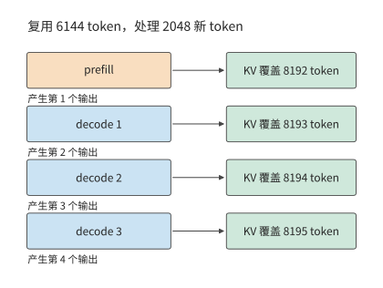

*图 3-1　恢复 6144 个上下文 token，处理 2048 个新输入并生成 4 个输出。首输出来自 prefill，后续 3 次 decode 各追加一个 token；纵向表示调用次序，间距用于示意。*

两个阶段使用同一套权重，对资源的需求却不同。以一组权重矩阵为例，prefill 的输入包含 $BP$ 行，单步 decode 只有 $B$ 行。输入 token 较多时，一次读入的权重可以参与更多乘加运算；低并发 decode 则可能只为少数几个 token 读取整组权重。这就是“prefill 通常受算力限制、decode 通常受内存带宽限制”这种说法的由来。

单个请求之外，不同请求之间也能形成新的复用机会。多个 decode 同时执行时，共同使用权重，各自读取上下文；一条长输入到来时，prefill 可以同时处理较多已知 token，它们的特征向量组成行数更大的输入矩阵。服务系统需要在这些不同形状的工作之间分配时间。仅把总 token 数相加，会丢失这些 token 分别属于哪个阶段、何时能够执行的信息。

> **练习 3-1〔延伸〕：相同输出总量下，请求数量如何改变模型调用次数**
>
> 分别考虑一条请求输出 1024 个 token，以及八条请求各输出 128 个 token。每条请求的输入均为 1024 个 token。求两种情况下的 prefill 次数、后续 decode 总步数，以及各请求结束时的上下文长度。假设八条请求同步生成，比较每批共享一次权重时的读取轮数，再解释总输出相同为什么不足以判断完成时间。

### 3.1.2 任务目标与评价指标

模型请求与用户任务通常不是一一对应的。回答问题可能只需一次生成，修复函数却可能需要读文件、改代码、运行测试、根据错误再修改。评估系统时，先写出什么算完成，再决定统计什么。

先在时间线上标出三个事件：请求到达 $t_a$、首个 token 返回 $t_1$、最后一个 token 返回 $t_G$。由此得到

$$
T_{\mathrm{TTFT}}=t_1-t_a,\qquad T_{\mathrm{request}}=t_G-t_a,\qquad
\overline T_{\mathrm{token}}=\frac{t_G-t_1}{G-1}\quad(G>1).
$$

TTFT（time to first token）是从请求到达到首个 token 返回的时间，本书也称首响应。首响应衡量多久开始输出，完整请求延迟衡量多久生成完，平均 token 间隔衡量输出节奏。把某一段时间缩短，只会直接改变包含这段时间的指标。例如，减少请求开始执行前的排队会改善 TTFT，却不会自动缩短已经开始生成后的 token 间隔。

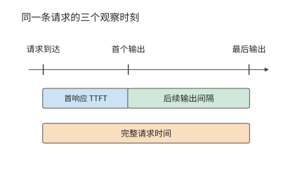

*图 3-2　请求到达、首输出与末输出决定三个计时区间。首响应包含开始生成前的等待，输出间隔描述生成过程，完整请求时间从到达累计到结束。*

首个 token 到达客户端之前，请求要依次经过排队、输入准备、加速器计算和结果返回等阶段。输入最初保存在主机还是加速器上，决定数据传输发生在哪里；计算完成后，结果还要经过主机处理和连接发送。记录同一请求在各阶段的开始和结束时间，就能看出 TTFT 主要消耗在哪些环节。第 5 章将展开加速器提交、传输与完成的具体时序。

客户端按块接收多个 token 时，可以直接记录每块的到达时间与 token 数，再统计输出节奏。reasoning 模型还会多出一个观察点：它在给出可见回答前先生成中间思考内容（称为思考 token），首个内部 token 出现时，用户未必已看到答案。因此，内部生成、用户可见输出和任务完成分别对应不同的时间点。语音的首次播放还要再经过解码与设备缓冲，第 3.3.3 节再讨论。

| 要回答的问题 | 需要的指标或记录 |
| --- | --- |
| 多久开始回应？ | TTFT；reasoning 另记首个有用输出 |
| 输出是否连续？ | 逐 token／逐块间隔及其分布 |
| 多久把事情做完？ | 完整请求时间、完整任务时间 |
| 每秒完成多少合格任务？ | 在质量与时限要求下的有效吞吐 |
| 得到一个成功结果花多少？ | 全部尝试的模型、工具和环境成本／成功任务数 |
| 等待期间还占着什么？ | 状态所属的请求与模型版本、大小、存放位置和驻留时间 |

只看平均值会掩盖较慢的一部分请求。p95 是第 95 百分位数，用来描述所选指标中较慢的一部分观测。本章采用最近秩法：把 $n$ 个观测从小到大排列，取第 $\lceil0.95n\rceil$ 个。四条请求的 p95 是最大值，480 条请求的 p95 是第 456 个。将请求完成、排队与首响应的耗时分别排序，就能看出长等待发生在哪一段；完整请求的 p95 则直接由各请求的全程耗时排序得到。

除响应时间外，等待期间的状态占用也需要度量。状态驻留得越久，同样的容量能同时服务的任务就越少。令任务状态大小为 $M(t)$，状态占用空间对时间的积分为

$$
A_M=\int_{t_{\mathrm{start}}}^{t_{\mathrm{end}}}M(t)\,\mathrm dt.
$$

将各时间段占用的空间乘以持续时间再相加，就得到占用空间随时间变化的曲线下面积。其单位为 byte·s：1 GiB 状态持续占用空间 10 秒，对应 10 GiB·s。状态没有变大，但这段时间里这块空间不能供其他请求使用。若任务以平均每秒 $\lambda$ 个的速度持续到达，每个任务都占用 $M_0$ 字节、平均等待 $\tau$ 秒，稳定情况下仅这些等待任务的平均占用就约为 $\lambda M_0\tau$。工具等待由此也会成为容量问题。

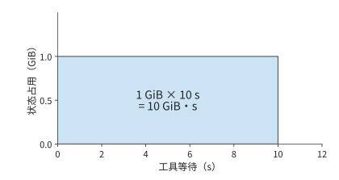

*图 3-3　1 GiB 状态持续占用空间 10 秒，对应面积为 10 GiB·s。横轴为状态驻留时间，纵轴为占用空间；面积描述这段等待期间的累计存储占用。*

时间与状态之外，还要核算完成任务的代价。成功任务成本把所有尝试的成本相加，再除以成功任务数。这样，失败生成、工具测试和环境运行都进入分子，分母对应用户得到的合格结果。batch 零成功时，记录其总消耗与失败原因；取得成功结果后，再用全部尝试的总成本除以成功任务数。[^cost]

### 3.1.3 请求分布

前一分钟加速器有空闲，后一分钟突然到达许多需要长时间生成的请求，后到的请求仍然要排队：先前空闲的计算时间无法留到现在使用。TTFT 和输出间隔描述单个请求的体验；多个请求陆续到达时，这些指标还取决于各请求是否争用同一时段的处理能力。

负载描述应保留到达时间、输入与输出长度的联合分布。长请求既增加自身服务时间，也可能延长状态驻留；短请求提前完成，则可能让后续请求较早开始。因此，即使平均工作量相同，等待时间、完成时间和状态占用峰值也可能不同。下面保持章首两分钟负载的请求总量与平均长度不变，先计算到达顺序如何改变积压，再观察真实系统。

实际请求往往来自不同客户。某个客户主要提交长文档，另一个主要生成长回答；即使各自的请求形状稳定，各客户请求到达速率的变化也会改变整体负载。ServeGen 对生产服务的研究观察到了这种现象，并用客户组成与时间变化重建请求分布。[^servegen]

**例题 3-1：平均处理能力足够，为什么仍会积压？** decode 由两张 RTX PRO 6000 Blackwell Workstation Edition 承担，判断它们能否持续处理章首的负载。

解：定义两类请求：长输入类输入 8192、输出 256 个 token；长输出类输入 1024、输出 2048 个 token。两分钟内各到达 240 条，合计平均每秒四条。一种负载中，两类请求始终各占一半；另一种前一分钟两类占比为 $9:1$，后一分钟为 $1:9$。每条请求的首输出由 prefill 产生，后续 decode 步数为输出数减一，于是有：

| 时间窗 | 新输入 token/s | 后续 decode 步/s |
| --- | ---: | ---: |
| 均匀混合 | 18,432 | 4,604 |
| 时段变化，前一分钟 | 29,900.8 | 1,736.8 |
| 时段变化，后一分钟 | 6,963.2 | 7,471.2 |

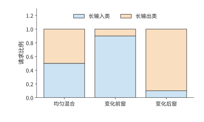

*图 3-4　两分钟总量相同的三个时间窗中的请求组成。长输入类为 8192 输入、256 输出，长输出类为 1024 输入、2048 输出；两类混合比例改变阶段需求。各类请求的输入、输出长度均以 token 为单位。*

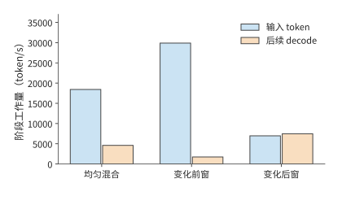

*图 3-5　三个时间窗中，请求组成对应的输入与后续生成需求。输入数按 token 计，后续生成按每请求的一次 decode 步计；每请求首输出已计入 prefill。输入项统计每秒新处理的输入 token；decode 项统计所有请求每秒需要执行的后续 decode 步，每步推进一个 token。*

**队列假设：窗口内均匀到达、处理率固定。** 使用流体队列模型，把离散的生成工作近似为连续流量；每个窗口内均匀到达，处理率固定，初始队列为空。单位是一条请求的一次后续 decode 步，prefill 能力单独核算。

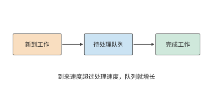

*图 3-6　工作先进入队列，再由处理资源完成。到来快于处理时差额留在队列中；处理快于到来时，资源逐步消化已有积压。*

以时间窗为步长，积压可按下式逐窗计算：

$$
Q_{k+1}=\max(0,Q_k+A_k-\mu_k\Delta t).
$$

其中 $Q_k$ 是窗口开始时的待处理工作，$A_k$ 是窗口内新到达的工作，$\mu_k\Delta t$ 是可完成量。到达速度低于处理速度时，积压逐渐减少，直至队列排空；到达速度超过处理速度时，未完成的工作留到下一窗口。

递推式中的处理率 $\mu_k$ 要从硬件参数求出。每秒四个请求的首个输出由 prefill 产生，所以 4,608 个输出中有 4,604 步属于后续 decode。decode 的处理率由显存带宽决定。RTX PRO 6000 Blackwell Workstation Edition 有 96 GB 显存、1792 GB/s 带宽，每张卡各放一份完整的 Qwen3-8B BF16 权重，最多同时执行 64 条序列。每步 decode 至少要把 15.14 GB 共享权重读一遍，再读出每条序列的全部旧 KV，每个上下文 token 占 144 KiB。decode 期间，长输入类的平均上下文为 $8192+127=8319$ 个 token，长输出类为 $1024+1023=2047$ 个；均匀混合时按 decode 步加权，平均上下文为 $(255\times8319+2047\times2047)/2302\approx2742$ 个 token。64 条序列同时执行时，一步至少读写 41.02 GB，耗时 22.89 ms，所以一张卡每秒最多完成约 2,795.66 步，两张卡约 5,591.33 步。这一处理率是显存带宽允许的物理极限，实测只会更低。三个时间窗都沿用这一处理率。

令 decode 队列初始为空，先把请求的生成工作均匀汇入各窗口。均匀混合和前一分钟的处理能力都足够；后一分钟每秒多到来 $7471.2-5591.33\approx1879.87$ 步，60 秒便留下约 112,792 步；停止到达后，按 $112792/5591.33$ 计算，还需约 20.17 秒才能排空。前一分钟未使用的能力无法保存到后一分钟，这正是全局均值掩盖积压的原因。[^workload]

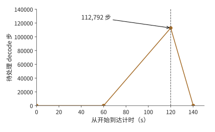

*图 3-7　两张 RTX PRO 6000 每秒最多完成约 5,591 个 decode 步时的流体模型。后一分钟积压至 112,792 步，120 秒后停止到达，再经过约 20.17 秒排空。*

**KV 容量限制如何影响排队与首响应。** 在 Qwen3-8B／vLLM 0.23 上运行这两种到达序列，可以观察到上述差异如何影响用户等待。加速器为一张 96 GB 显存的 RTX PRO 6000 Blackwell Workstation Edition，KV 池是专门留给请求键值上下文的显存区域，本次容量为 24 GiB，同时最多执行 64 条序列；前缀缓存指跨请求复用相同开头的已有 KV，本次关闭这一功能，每条请求生成指定数量的 token。KV 空间不足时，调度器可以暂停某条已开始的请求、释放它占用的 KV 空间，之后再恢复或重算，这种行为称为抢占。两组负载都在 120 秒内到达 480 条请求，全部完成后的结果如下。[^arrival]

| 实际观察 | 均匀混合 | 前 9:1、后 1:9 |
| --- | ---: | ---: |
| 完整请求 p95 | 约 299.4 s | 约 299.4 s |
| TTFT p95 | 242.9 s | 258.9 s |
| 初次调度等待 p95 | 242.4 s | 258.4 s |
| 最后一条请求完成时距起点的时间 | 419.8 s | 418.7 s |
| 抢占事件 | 62 | 24 |

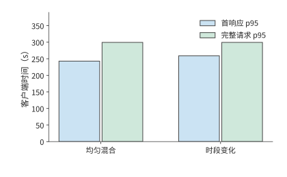

*图 3-8　同一实际实例回放两种到达序列的结果。完整请求 p95 接近，首响应 p95 则相差约 16 秒；模型、加速器、KV 池与并发上限均按正文实验条件固定。*

两次回放都出现了大量积压，这在例题 3-1 的带宽下界中已经可以预见：一张卡每秒最多完成约 2,796 个 decode 步，低于均匀混合时 4,604 步的平均需求，而且同一张卡还要执行 prefill。480 条请求共需 552,480 个后续 decode 步，单是这部分工作就至少需要 197.6 秒，而全部请求在 120 秒内就已到达。

两次回放的完整请求 p95 与最后完成时间接近，TTFT 和初次调度等待却相差约 16 秒。采样记录显示，两次实验的 KV 池占用都达到过 100%，请求在进入执行前经历了长时间等待。输入与输出的时段组合改变了何时释放状态、何时接纳新请求，所以即使整批请求的完成时间接近，用户开始收到响应的时间仍可不同。KV 池填满时发生的抢占，还会改变请求的等待和后续执行次序。

排队因此既可能来自处理速度不足，也可能来自已有请求的状态尚未释放：状态池填满后，即使部分计算单元空闲，新请求也要等待已有请求释放空间。[^serve-replay]

例题 3-1 中的积压递推式还能预测其他突发条件下的积压。若工作到达速率 $\lambda_w$ 连续 $\tau$ 秒高于处理率 $\mu$，初始队列为空，则积压为 $(\lambda_w-\mu)\tau$；停止到达后的排空时间为 $(\lambda_w-\mu)\tau/\mu$。突发持续时间加倍，积压与排空时间都加倍。

> **练习 3-2〔核心〕：突发请求与工具等待如何增加积压和状态占用**
>
> 采用例题 3-1 中第二分钟的负载强度，即每秒新增 7,471.2 步 decode 工作。将这一突发负载的持续时间改为 30 秒，decode 资源分别取两张和三张 RTX PRO 6000 Blackwell Workstation Edition，每张卡的处理率沿用例题 3-1 求得的约 2,796 步/秒。初始队列为空，求这 30 秒内积压量随时间的变化，以及请求停止到达后清空积压所需的时间。随后考虑另一种负载：每秒有两个任务进入工具等待阶段，每个任务等待 10 秒，期间状态占用 1 GiB 空间。求稳定状态下的平均等待任务数与状态占用；将等待延长到 30 秒后重新计算。

## 3.2 多轮交互与 Agent 任务

### 3.2.1 多轮对话与前缀增长

第 3.1 节把每个请求当作一次独立调用；在对话和 Agent 任务中，同一任务的多次调用前后相连。多轮对话的下一次请求通常带着上下文。第一轮输入系统提示和用户问题；第二轮除了新问题，还可能包含上一轮回答；之后每轮继续累积。若只看用户新写了多少字，就会低估送入模型的输入长度。

设第 $i$ 轮输入长度为 $I_i$，可复用的前缀长度为 $K_i$，则本轮需要重新处理的输入为

$$
P_i=I_i-K_i,\qquad S_i=K_i.
$$

将 $P_i$ 与 $S_i$ 代入第 2 章的公式，投影和 FFN 只处理新增 token，注意力仍要让新查询访问完整前缀。缓存复用因而减少了重算，却没有把旧上下文从后续计算中删除。

以一次包含四轮模型调用的代码修复任务为例，计算缓存的收益。四轮累计输入 5,297 个 token，其中命中 4,480 个，未命中 817 个。第二轮输入 1,443 个、命中 1,392 个，只需处理 51 个未缓存 token；但后续 decode 仍然要访问其上下文状态。如果每轮都重新计算全部输入，prefill 的矩阵运算共需 76.196 TFLOPs；复用已命中的前缀后，共需 11.976 TFLOPs。因此，缓存命中既减少了旧输入的重算，也要求系统继续保留旧状态。[^agent-calc]

修改上下文会改变可复用的前缀长度。末尾追加新内容时，原有前缀保持不变；摘要替换一段旧上下文时，替换位置之后的表示要从新的前缀重新计算；工具定义或模板变化则可能更早改变输入。这些操作决定下一轮有多少 token 命中、多少 token 重新进入 prefill。

上下文策略还会改变未来负载。把新内容持续追加在上下文末尾，有利于复用原有前缀，却会让陈旧内容继续占据上下文；替换前面的内容可以缩短上下文，但其后的缓存可能需要重建。保留、淘汰和重算的代价取决于重建计算量、状态大小与复用间隔（第 8 章）。[^context]

用本节的前缀复用关系比较两种编辑方式：在末尾追加 100 个 token，只增加 100 行新输入；若改动已有 2000 个 token 中的第 501 个，其后的表示都会变化，最长可直接复用的前缀只剩 500 个 token。缓存收益不仅取决于改了多少字，还取决于改动发生在哪里。

从应用看，上下文是编排任务的接口；从系统看，上下文的组织方式决定了计算量和状态驻留时间。追加工具返回的内容、替换早期内容、生成多个候选分支，分别改变新增计算、可复用前缀和私有状态。让服务系统掌握这些关系，就能根据复用情况安排缓存，在分支间共享历史，并利用工具等待时间换出状态。因此，负载记录还应包含稳定前缀、改写位置、分支依赖和复用间隔。第 8 章将使用这些信息选择上下文与缓存策略，第 9 章再加入状态位置和传输时间。

### 3.2.2 推理与验证：完成一个任务需要多少成本

前缀缓存减少的是已有输入的重复计算。另一类方法则主动增加生成计算，希望提高答案的正确率。增加推理阶段的计算量，主要有三种方式：延长一条回答中的思考过程，同时生成多份回答并从中选择，或者根据题目难度分配生成次数和长度。延长思考会增加串行生成时间与上下文状态；生成多份回答会增加计算和验证次数；按难度分配则需要决定每道题何时停止。

是否值得增加生成计算，需要比较每个成功任务的成本。设每次尝试的平均成本为 $c$、成功率为 $p$，相同策略下重复尝试的期望次数为 $1/p$，则

$$
C_{\mathrm{success}}=\frac{c}{p}.
$$

新方法的成本和成功率分别为 $c_2,p_2$，旧方法为 $c_1,p_1$，成本下降要求 $p_2/p_1>c_2/c_1$。因此，延长思考或增加采样的依据，是正确率的相对提升能否超过成本的相对增长。所有生成、验证和失败尝试的成本都计入 $c$。

**例子：延长生成仍未提高数学题解答成功率。** 生成速度只有与任务正确率一起考察，才能反映系统是否有用。一次数学题实验中，对四道题分别生成多份回答，将输出上限从 1024 提高到 4096 个 token，两轮尝试仍未得到通过评分的最终答案。生成已经消耗资源，任务却没有完成；增加输出长度也没有自动带来有效解答。[^reasoning]

答案检查应区分接口格式和内容正确性。格式正确的回答可能算错，数值正确的回答也可能缺少任务要求的字段。把两类错误分开，才能判断应调整生成方式、输出约束还是解题过程。[^reasoning-off]

核算成本时，还要考虑价格本身的变化。token 单价降低后，仍需计算完成任务的总成本。用简单假设说明：新系统 token 单价降到原来的 1/10，每任务用量却增加到 20 倍，成功率由 50% 提高到 80%。只计模型成本，并假定重复尝试的分布稳定，每个成功任务的成本比为 $2\times\frac{0.5}{0.8}=1.25$。价格下降、质量提高和成功任务成本上升可以同时发生。对带上下文的 Agent，可以沿实际轨迹累加各次尝试，再以通过检查的任务数作分母。[^cost]

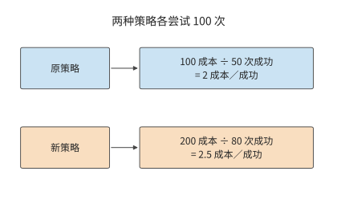

*图 3-9　各尝试 100 次的教学比较。所有尝试的成本都进入分子，通过检查的成功任务数进入分母；两种策略的成功任务成本分别为 2 和 2.5 单位。*

> **练习 3-3〔延伸〕：成功率提高能否抵消单次尝试成本的增加**
>
> 旧方法每次尝试成本为 1 单位、成功率为 50%；新方法成本为 2 单位、成功率为 80%。计算平均每完成一个成功任务所需的成本，并判断新方法是否更省。若新方法成本降到 1.5 单位，成功率至少应达到多少，才能使每个成功任务的平均成本不高于旧方法？对需要多次采样的任务，说明生成、验证和失败尝试的开销应怎样计入总成本。

### 3.2.3 智能体工作负载

反馈还可以改变后续的计算过程。代码 Agent 先生成修改方案，工具写入代码并运行测试，模型再读取测试结果决定下一步。每个循环既有模型计算，也有工具执行；工具返回的日志又成为下一轮输入。因此，减少无关日志能降低下一轮的 prefill 计算量和上下文状态占用，减少无效修改则能直接减少循环次数。

本章的实测任务是修复区间合并函数，检查返回结果是否正确、输入是否保持不变。模型负责决定修改并调用工具，工具负责写入文件和运行测试。下面按四轮内成功完成原定检查的那条轨迹，分开统计模型时间、工具时间和等待期间保存的状态。工具调用明细见章末[代码任务轨迹](#agent-trace-detail)。[^agent]

检索增强问答也包含类似的处理过程：检索器找到文档，再将文档交给语言模型生成答案。回答质量相同时，检索内容越少，后续 prefill、KV 存储和上下文读取的开销就越小。因此，检索器返回的内容会直接影响模型负载。第 8 章将结合具体任务比较不同检索方案。[^retrieval]

### 3.2.4 分支、工具等待与状态驻留

模型调用与工具执行之间的先后关系可以画成一张依赖图。沿一条串行路径，阶段时间相加；互不依赖的分支可以同时开始，汇合点等待较慢的分支。一张依赖图中，从开始到结束累计耗时最长的路径称为关键路径，它决定任务最早何时能够完成。先用真实代码任务观察模型和工具各占多少时间，再改变依赖关系，预测并行能节省多少。下表比较同一任务在思考模式关闭与开启时的两次运行；思考模式决定模型是否先生成第 3.1.2 节所说的思考 token。

| 观察 | 思考模式关闭 | 思考模式开启 |
| --- | ---: | ---: |
| 模型调用轮数 | 12 | 4 |
| 总输出 token | 765 | 2,733 |
| 模型调用实际耗时之和 | 13.156 s | 76.294 s |
| 工具执行实际耗时之和 | 0.476 s | 0.078 s |
| 返回值正确性与输入不变检查 | 315/1013 | 1013/1013 |
| 额外检查：返回的子列表无别名 | 1/1013 | 710/1013 |

关闭思考模式时，缓存命中率约为 83.4%，仍未修好代码；开启后，模型时间增加，返回值正确性和调用后输入不变两项原定检查全部通过。额外的无别名检查要求返回子列表与原输入相互独立，开启思考模式的程序通过了其中 710 个用例，另 303 个仍共享了子列表。[^agent] 两组检查对应两种不同的程序性质，这说明任务的完成标准必须具体到可执行的验证。

开启思考模式后，任务共输出 2,733 个 token，其中 2,553 个在思考结束符（标志思考内容结束的记号）之前，3 个为结束符，177 个在之后。思考占据绝大多数生成工作，工具调用则把模型的决策转化为文件修改与测试操作。沿执行顺序累计模型调用与工具执行的实际耗时，再加上控制和交接时间，就得到用户等待整个任务完成的时间。

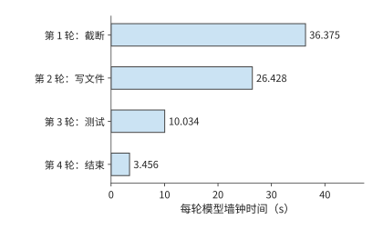

*图 3-10　代码任务中四轮模型调用的实际耗时，各轮从自己的起点计时。模型时间合计 76.294 秒，工具合计约 0.078 秒，整任务另含控制与交接时间。*

**例题 3-2：加速首轮模型计算能缩短多少代码任务时间？** 用第 1 章的 Amdahl 定律分析，假设后续行为与质量不变。

解：以同一条执行轨迹为基准，将首轮耗时 36.375 秒的模型计算缩短一半，其余阶段、输出、工具行为和质量都不变，总时间便从 76.510 秒降到 58.323 秒。此时 $f=36.375/76.510$，$s=2$，总加速比约为 1.31。首轮占总时间约 47.5%，将这一段减半节省约 23.8% 的总时间；其余阶段仍合计耗时约 40.1 秒。优化的收益取决于缩短的那一段原来占多大比例。[^agent-speedup]

工具之间的依赖关系也影响总时间。设模型先计算 2 秒，随后调用两个工具，耗时分别为 6 秒和 10 秒，最后再计算 3 秒。若第二个工具依赖第一个的结果，总时间为 $2+6+10+3=21$ 秒；若工具相互独立，总时间为 $2+\max(6,10)+3=15$ 秒。并行减少了 6 秒，但两个工具的总执行工作仍为 16 秒。

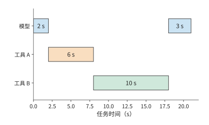

*图 3-11　两个工具存在前后依赖时的任务时间线。模型先运行 2 秒，工具 A 用 6 秒，工具 B 用 10 秒，模型最后运行 3 秒，总计 21 秒。*

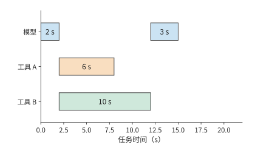

*图 3-12　两个工具独立时可以同时开始，模型在较慢的工具 B 完成后继续，任务共 15 秒。与前图使用相同时间尺度；工具工作总量仍为 16 秒。*

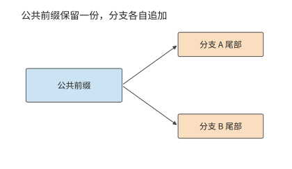

*图 3-13　两个生成分支指向同一份公共前缀，并各自保存新增尾部。箭头表示引用关系，共享前缀只计一份容量。*

并行与分支改变的不只是时间，还有状态占用。若分支还要分别生成文本，公共前缀可以共享，分支尾部独立增长。设共享前缀长 $H_0$，第 $i$ 个分支新增 $h_i$ 个 token，每 token 状态为 $c_{\mathrm{KV}}$，则总状态为 $c_{\mathrm{KV}}(H_0+\sum_i h_i)$。并行缩短了关键路径，也让更多分支的状态同时占用内存。

第 3.2.3 节代码修复任务的实测记录中，工具调用耗时极短，大部分时间都消耗在模型计算上。若工具操作改为耗时 10 秒的编译，模型暂停的同时，下一轮所需上下文仍占据容量；若多个任务同时等待，驻留量按任务累加。工具执行时间越长，状态保留得越久，系统能同时处理的请求数就越少。第 8、9 章将在这条时间线上安排缓存与交接。

> **练习 3-4〔核心〕：工具并行与局部加速能节省多少任务时间**
>
> 一次任务先由模型计算 2 秒，然后调用两个相互独立的工具，分别耗时 6 秒和 10 秒。两个工具都完成后，模型再计算 3 秒，任务结束。分别计算两个工具依次执行和同时执行时的任务总耗时。假设仅在等待工具返回期间状态占用 1 GiB 空间，求两种执行方式下状态占用量与占用时长的乘积，单位为 GiB·s。
>
> 本节的代码任务实测记录显示，任务总耗时为 76.510 秒，其中首轮模型计算耗时 36.375 秒，所有工具执行合计耗时 0.078 秒。保持其余阶段不变，分别计算两种优化能节省多少任务时间：将首轮模型计算速度提高到原来的四倍；将所有工具的执行速度提高到原来的两倍。根据计算结果，解释为什么局部加速倍数不能单独决定一项优化对完整任务的收益。

负载需求还会反过来推动模型结构的变化。把同一条会话换成 DeepSeek V4.1 Flash，可以看到具体例子。设 Agent 已有一段公共上下文，工具随后返回新材料；如果前缀未命中，服务要重新处理较多输入，而本轮输出可能较短。为这样的输入密集场景降低 prefill 成本，比只优化单步生成更有价值。V4.1 因而采用第 2 章介绍的 CED 结构，使用 20 层因果编码器和 20 层解码器：大部分输入只执行编码器主体，解码器的全局 KV 从编码器末层表示投影得到；为了构建解码器的 SWA 状态，把提示末尾最多 128 个 token 的编码器输出重新送入解码器，近似恢复这部分局部状态。输出 token 继续经过全部 40 层。[^v41-case]

先比较专家矩阵计算这部分工作，以各 token 经过的专家层数之和衡量工作量。设一次从空状态开始的输入为 $P$ 个 token，则普通 40 层路径为 $40P$，报告中的 CED 调度为 $20P+20\min(P,128)$。当 $P=8192$ 时，两者为 327,680 与 166,400，后者约为前者的 50.8%；当 $P\leq128$ 时，该子项没有减少。

已有前缀时，输入处理的工作量由追加长度与恢复方式共同决定。若编码器 SWA 命中缓存，编码器主体便可以继续处理追加的输入；编码器 SWA 缺失，则先重放前缀末尾窗口。两条路径随后都要构建本轮的解码器 SWA。第 8 章将用 8K 与 128K 上下文的教学算例，比较保存状态和重新执行的成本。

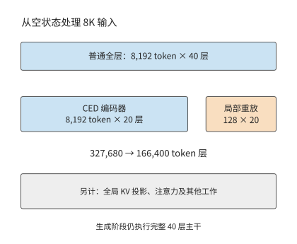

*图 3-14　同一批 8K 输入中，各 token 经过的专家层数之和。普通全层路径执行 40 层；CED 路径执行 20 层编码器，并为最近 128 个 token 重放 20 层解码器。灰色说明项仍需另外计算；生成阶段执行完整主干。*

## 3.3 多模态与实时交互

Agent 的工具结果通常以文本进入下一轮输入。若输入换成图片或连续语音，调用模型之前还需要编码输入，输出端也可能需要持续播放。本节先分析数据在阶段之间如何改变形状，再分析各阶段必须在何时完成。

### 3.3.1 视觉编码、语言生成与状态

图片进入语言模型之前，还要经过预处理、视觉编码和投影。用 $\mathrm E$ 表示视觉编码，$\mathrm P$ 表示语言 prefill，$\mathrm D$ 表示后续 decode，一次视觉问答便有 $\mathrm E\to\mathrm P\to\mathrm D$ 这条基本依赖。图片大小影响 $\mathrm E$ 的工作量，编码后的视觉 token 数影响语言部分的工作量；这两项工作应分别计算。

先数视觉 token，再数每个向量的特征维度。设预处理后的图片高、宽为 $H_{\mathrm{img}},W_{\mathrm{img}}$，将图片分成方形图像块（patch），每块边长为 $p_{\mathrm{patch}}$，每边再合并 $r$ 个 patch，则视觉 token 数为

$$
n_v=\frac{H_{\mathrm{img}}W_{\mathrm{img}}}{p_{\mathrm{patch}}^2r^2}.
$$

以具体配置为例。视觉语言模型 Qwen3-VL-4B 的 $640\times640$ 图片，按 $16\times16$ patch 划分得到 1600 个 patch，再作 $2\times2$ 合并，得到 400 个视觉 token。最终特征宽度为 2560，每元素占两字节的 BF16 张量 $[400,2560]$ 占 $400\times2560\times2=2{,}048{,}000$ 字节。

但编码结果不止这一份。为向语言模型提供不同深度的视觉信息，DeepStack 将视觉编码器中间层的特征送入相应语言层。模型还取三个中间视觉层的这类特征，将它们与最终层特征拼接，完整张量为 $[400,10240]$，占 8,192,000 bytes，即 7.8125 MiB。四组特征对应同一组 400 个视觉 token：特征宽度变为四倍，语言序列仍增加 400 个视觉 token。视觉编码的矩阵运算量约为 1.310 TFLOPs；图片解码与缩放发生在编码之前，语言计算则在编码之后。[^vision]

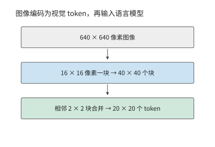

*图 3-15　图像从像素网格变为视觉 token。640×640 的方形图片切成 40×40 个块，相邻 2×2 块合并成一个 token，形成 20×20、共 400 个视觉 token。*

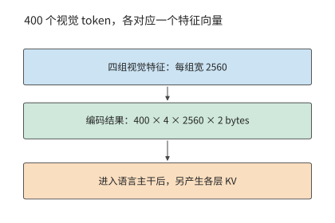

*图 3-16　视觉 token 数与每 token 特征宽度分别计量。四组 2560 维 BF16 编码特征占 7.8125 MiB；这些视觉 token 进入语言模型后，另产生各层的 KV 状态。*

图 3-15 与图 3-16 中，视觉编码改变了视觉 token 数和特征宽度；进入语言模型后，还会产生另一种表示。编码缓存（encoder cache，EC）保存视觉编码器的输出，语言主干则产生 KV 缓存。该配置的语言 KV 每 token 占 144 KiB，400 个视觉 token 对应 56.25 MiB。因此，同一张教学截图在三个处理阶段对应不同的数据量：原始压缩文件 0.8 MB、完整 BF16 EC 7.8125 MiB、视觉 token 的逻辑 KV 56.25 MiB。[^epd]

| 对象 | 本例大小 | 决定它能否复用的条件 |
| --- | ---: | --- |
| 压缩截图 | 0.8 MB，给定输入 | 同一文件内容 |
| 完整编码结果 EC | 7.8125 MiB | 图片、预处理、编码器与输出格式一致 |
| 视觉 token 的语言 KV | 56.25 MiB | 还依赖先前上下文、顺序、位置与模型状态 |

图片及编码配置相同时，EC 可以复用。语言 KV 还依赖图片之前的上下文：问题放在图片之前时，更换问题会改变视觉 token 的 KV；问题放在图片之后时，因果注意力使此前视觉 token 的 KV 保持不变。

**多模态输入的编码状态与 KV 容量预算。** 设输入包含四张图片与 400 个文本 token，计算这些输入 token 的 EC 与逻辑 KV。四张相同规格图片的 EC 为 31.25 MiB，视觉 token KV 为 225 MiB；再加 400 个文本 token，输入逻辑 KV 为 281.25 MiB。

原图、EC 和 KV 这三种数据表示，对应三个不同的交接位置。发送原图，接收方还要执行视觉编码；发送 EC，接收方从语言 prefill 开始；发送 KV，则交接已经完成的语言上下文。第 8 章安排同卡执行，第 9 章比较阶段交接，第 12 章把相同数据流放到端、边、云链路上。

保持 patch 与合并方式不变，把图片的高度和宽度都加倍，视觉 token 数变为四倍。因此 EC 和视觉 token 的语言 KV 都变为四倍；视觉编码内部 token 之间的交互则还要按注意力结构计算。特征拼接增加的是宽度，图片变大增加的是视觉 token 数，二者在语言主干中产生不同后果。

### 3.3.2 音频与图像生成的计算过程

视觉问答仍通过语言模型逐 token 生成文本。若输出本身是声音或图像，一次迭代处理的数据和迭代次数也会改变。

音频输出还有帧内循环。以 Fish Audio 的语音生成模型 S2 Pro 为例，慢速（slow）路径每次推进一个音频帧，快速（fast）路径在帧内补齐多个码本的编号。码本是离散声音表示的候选向量集合，编解码器（codec）把这些编号还原为波形。每帧先用一次快速路径前向建立状态，再用九次预测补齐码本，因此生成一帧需要十次快速路径前向计算。由此可见，语言 token/s、声学帧/s 与每秒生成的音频时长，衡量的是不同的生成速度。[^source-1][^media]

图像生成又换了一种循环。潜在表示（latent）是压缩后的连续图像表示；去噪逐步把含噪表示变为目标图像。扩散 Transformer（DiT）执行每步变换，无分类器引导（CFG）组合带条件与无条件两路预测；变分自编码器（VAE）负责像素与压缩表示之间的转换。以图像生成模型 Qwen-Image-2512 为例，$1024\times1024$ 图像形成 4096 个 latent 位置，执行 50 个去噪步，true CFG 路径每步有两支 DiT 前向，总共执行 100 次 DiT 前向计算。去噪矩阵运算量约 $7.830\times10^{15}$ FLOPs；文本编码器与 VAE 还有各自的工作。latent 的位置集合在去噪期间保持固定，各步持续更新其内容，累计工作随去噪步数增加。[^image]

把每步去噪的运算量记为 $F_{\mathrm{step}}(n_v)$，去噪步数为 $n_s$，每步引导分支数为 $n_b$，总运算量为 $n_sn_bF_{\mathrm{step}}(n_v)$。步数加倍，运算量也加倍；分辨率提高会增加图像潜在表示中的空间位置数，单步内部的矩阵行数和位置间交互也随之增加。文本生成不断追加上下文，每步访问量随之增长；图像去噪反复更新同一组 latent，在固定分辨率下，累计运算量随去噪步数线性增长。

### 3.3.3 连续感知、首段响应与打断

工作总量决定平均处理需求，实时播放还要求每块数据都按时到达。令 $A(t)$ 表示截至时刻 $t$ 已到达的可播放音频时长，$P(t)$ 表示已播放的音频时长，缓冲中剩余音频为

$$
B_{\mathrm{audio}}(t)=A(t)-P(t).
$$

连续播放期间，每经过一秒，已播放音频时长 $P(t)$ 就增加一秒，$A(t)$ 则随数据块到达跳跃增加。两条曲线之间的距离就是缓冲余量；余量降到零而下一块尚未到达，声音就会中断。预缓冲增加初始余量，同时推迟开始播放。

时间要求同时作用于输入和输出。在输入端，截图 Agent 如果只在动作结束后观察屏幕，就可能漏掉中途出现又消失的弹窗。持续观察与交互研究 AOI 针对的正是这类场景：它把屏幕观测与动作执行分开，持续收集图像、音频和事件，再筛选出供模型使用的记录。增加观测频率可以发现更多短暂事件，但保存更多关键帧也会占用上下文；过多关键帧还可能挤占重要信息，使任务效果下降。[^aoi] 因此，持续观测还要配合筛选，决定哪些内容值得保留并交给模型处理。

语音的时间约束更直接。用户停止说话后，系统要采集或确认输入，经过识别／编码、推理、语音生成和播放。开始播放后，后续音频还必须及时到达，才能避免中断。

音频块到达应用之后，还要经过解码、排队和播放。两次语音交互测量中，用户停止说话到首块音频到达的时间分别约为 400 ms、370 ms，后续音频块的到达间隔中位数均约为 94 ms。[^audio-real] 到达时间说明数据何时可用，播放时钟则决定音频何时播出。

用下面这组参数安排一条时间线，说明两者之间的缓冲如何避免声音中断。输入每 20 ms 形成一块，24 kHz、单声道、每样本 2 bytes，每块数据量为：

$$
24{,}000\times0.020\times1\times2=960\ \mathrm{bytes}.
$$

每块采集结束后，模型处理耗时 12 ms、发送耗时 1 ms，网络传播通常再需 5 ms。第一块在 38 ms 到达，在抖动缓冲区（先暂存到达的音频、吸收到达时间波动的缓冲区）中等待 40 ms 后，于采集开始后的第 78 ms 播放。第三块的传播延迟设为 50 ms，直到 123 ms 才到，错过 118 ms 的播放计划，造成额外 5 ms 的停顿。后续块虽已到达，也要按声音顺序等待。

将缓冲改为 60 ms，这次停顿消失，首播却推迟到 98 ms。增加缓冲可以避免这次到达时间波动造成的播放中断，代价是更晚开始；若音频的平均到达速度长期低于播放速度，有限缓冲终究会耗尽。[^audio]

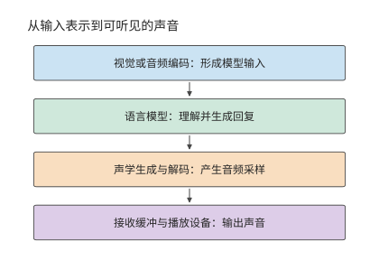

*图 3-17　可组合的多模态阶段。编码形成模型输入，语言模型生成回复，声学模块将回复转成音频，接收方的缓冲与播放设备决定何时真正发声。*

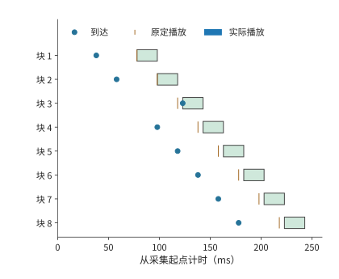

*图 3-18　八块音频的教学播放时间线。每块长 20 ms，圆点标到达，短竖线标原定播放时刻，色条标实际播放；第三块晚到 5 ms，后续播放随之顺延。*

播放连续性之外，还要单独检查打断响应。图 3-19 从用户发出打断计时，追踪本地播放何时真正停止；远端生成是否停止需要沿另一条控制路径判断。

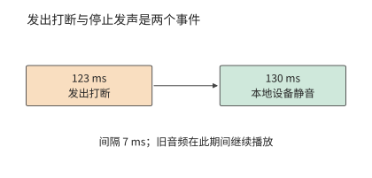

*图 3-19　同一教学场景中的本地打断。123 ms 发出操作，130 ms 设备静音；远端计算是否停止属于另一条控制路径。*

打断涉及几项操作：应用发出取消指令，播放设备静音，后端停止生成，并释放缓冲与状态。教学时序在 123 ms 发出打断，控制延迟 5 ms，设备每 10 ms 检查并执行一次控制指令，于是 130 ms 静音，用户感受到的打断延迟为 7 ms。设备静音、后端停止生成和释放缓冲与状态，分别对应停止播放、停止计算和释放存储三个时刻：后端停止生成决定后续计算何时结束，缓冲释放决定容量何时可供其他任务使用。[^audio-interrupt]

并非所有任务都要求连续输出。RAW 是保留相机传感器原始采样信息的图像表示。RAW 图片精修关注的是何时能得到完整成片，无需像语音那样连续输出。精修还需要保留原始图像信息，视觉理解使用的 EC 无法替代原图。由此可见，任务不同，时间要求也不同：有的要尽快开始，有的要持续流畅，有的要尽早全部完成。

> **练习 3-5〔延伸〕：图像分辨率与音频缓冲如何影响资源需求**
>
> 将 Qwen3-VL-4B 输入图片的分辨率从 $640\times640$ 改为 $1280\times1280$，保持图像块大小、合并方式和特征精度不变，求视觉 token 数、完整编码缓存 EC 的大小，以及这些视觉 token 对应的 KV 大小。再根据本节音频时间线，比较初始缓冲为 40 ms 和 60 ms 时的首次播放时刻与停顿情况。如果每秒收到的音频只能播放 0.9 秒，开始播放时已缓存 0.3 秒音频，求连续播放多久后会耗尽缓冲，并解释增加有限缓冲能解决什么问题。

## 3.4 训练的计算与状态需求

### 3.4.1 前向计算、反向传播与参数更新

推理用权重求输出，训练还要利用输出与目标的差异来调整权重。以最简单的一次乘法为例：输入 x 乘以权重 w 得到 y。后一层传回损失对 y 的敏感度后，要算损失对 w 的敏感度，就还需要当时的 x；要把敏感度传给前一步，则需要 w。因此，前向把结果交给下一层以后，某些输入还要保留，等反向用完才能释放。

对线性层 $Y=XW$，输入 $X$ 为 $[m,k]$，权重 $W$ 为 $[k,n]$。损失 $\mathcal L$ 是衡量模型输出与训练目标差异的数值，训练的目标是降低损失；梯度描述损失对某个输入或参数的小变化有多敏感。反向传播从输出端沿依赖逆向传递这些敏感度。设后一层反向传来 $\partial\mathcal L/\partial Y$，当前层需要计算两种梯度：

$$
\frac{\partial\mathcal L}{\partial X}=\frac{\partial\mathcal L}{\partial Y}W^{\mathsf T},\qquad\frac{\partial\mathcal L}{\partial W}=X^{\mathsf T}\frac{\partial\mathcal L}{\partial Y}.
$$

前向计算输出，反向分别计算输入梯度和权重梯度。三次矩阵乘法的运算量相同，因此这一线性层的训练矩阵运算量约为前向的三倍。下表将一次乘加计为两个 FLOPs。

| 操作 | 要解决的问题 | 左、右输入的形状 | 输出形状 | 矩阵 FLOPs |
|---|---|---|---|---|
| 前向 $Y=XW$ | 根据输入求输出 | $[m,k]$ 与 $[k,n]$ | $[m,n]$ | $2mkn$ |
| 输入梯度 $\mathrm dX=\mathrm dY W^{\mathsf T}$ | 将误差传回前一层 | $[m,n]$ 与 $[n,k]$ | $[m,k]$ | $2mkn$ |
| 权重梯度 $\mathrm dW=X^{\mathsf T}\mathrm dY$ | 求这层权重的调整方向 | $[k,m]$ 与 $[m,n]$ | $[k,n]$ | $2mkn$ |

输入梯度把误差信号传给前一层，权重梯度决定本层参数的调整。观察三组矩阵尺寸：虽然乘法顺序不同，三次运算都含有相同的 $mkn$ 个乘加，因此合计约为 $6mkn$ FLOPs。若所有训练 token 都经过同一组主要参数矩阵，累计便得到常见近似 $F_{\mathrm{train}}\approx6ND$，其中 $N$ 为参数量，$D$ 为训练 token 总数。[^training]

结构变化也可以按这一推导处理。冻结某个权重矩阵后，可省去它的权重梯度计算；若更早的层仍需要梯度，则仍要计算输入梯度。MoE 按选中专家累计两类梯度，注意力则按查询—键配对累计。沿反向依赖逐项累加，就得到各训练方法需要执行的计算量。

除计算量外，训练还带来新的状态保存需求。除了计算 $\mathrm dW$ 要用的 $X$，对非线性运算求梯度也需要相应的中间结果。参数梯度在反向传播中产生，再由优化器用来计算参数更新量。优化器的状态记录多次更新积累的信息，因此需要保留到下一次更新。每类数据的保留期限取决于最后一次使用它的操作：某层激活通常在该层反向计算用完后释放，优化器动量则需要跨越多次更新持续保留。

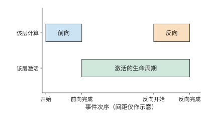

*图 3-20　激活的生命周期：一层激活从前向完成后保留到相应反向用完。横轴按事件排列，间距仅表示过程顺序；相应反向计算用完这些激活后，即可释放其占用的空间。*

**例题 3-3：梯度与优化器状态为何使训练内存需求成倍增加？**

解：以 Qwen3-8B 的 8,190,735,360 个参数为例，保存 BF16 权重、FP32 梯度、一份独立的 FP32 主权重（master weight），以及 Adam 的两个 FP32 矩估计。Adam 是根据梯度及梯度平方的移动平均调节更新幅度的优化器，两个矩估计分别保存这两种平均量。不做分片（把这些状态切开，分给多张卡保存）时，每参数需要 $2+4+4+4+4=18$ bytes，共 147.433 GB，约 137.308 GiB。尚未计入激活，这些状态就已超过一张 H100 SXM（80 GB）、RTX PRO 6000 Blackwell Workstation Edition（96 GB）乃至 H200（141 GB）的标称显存。BF16 权重用于前向和反向计算，梯度用于计算更新量，FP32 主权重用于高精度更新，Adam 的两个矩估计则累计梯度及其平方的统计量。这些数据合计占用的空间，是推理 BF16 权重的九倍。[^train-matrix]

明确状态需求之后，再分析数据如何分批进入训练。micro-batch（微批次）是一次前向和反向实际处理的数据子集；完整的训练 batch 可以由多个 micro-batch 组成。micro-batch 与参数更新也要区分。显存无法容纳完整的训练 batch 时，可以分多个 micro-batch 累计梯度，最后再更新一次参数。保持目标、有效标签和归一化一致时，将同一训练 batch 拆成更多 micro-batch，会改变执行顺序与激活的生命周期，而总训练数据量保持不变。第 10 章将据此讨论分片和流水。

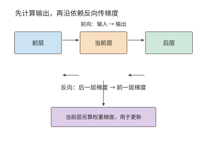

*图 3-21　训练沿前向依赖计算输出，再沿反向依赖传递梯度。当前层既向前层传输入梯度，也计算自己的权重梯度，供优化器更新。*

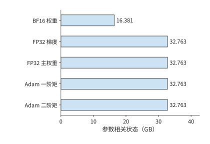

*图 3-22　Qwen3-8B 全参数训练的参数相关状态。每参数包括 2 字节计算权重和 4 组 4 字节状态，共 18 字节；激活和工作区的容量需求按各自的生命周期单独计算。*

训练过程中还要不断准备下一批输入。CPU 读取、解码、分词并组成 batch，再把张量送到加速器。双缓冲可以在计算当前 batch 时准备下一个 batch：一个缓冲供计算读取，另一个接收新数据，交替使用。计算用完已准备的数据后，就必须等待新输入；取回加速器结果时又会等待相应计算完成。第 5 章将结合前向、反向和参数更新的执行顺序，分析数据准备与计算如何重叠。

### 3.4.2 预训练、中期训练与 SFT

训练阶段的名称不同，系统仍要回答同样的问题：输入有多少 token，哪些 token 参与损失，多少个 micro-batch 后更新一次参数。预训练通常对连续文本做下一 token 预测；中期训练调整数据组成或上下文长度；监督微调（SFT）使用给定输入与目标回答继续训练模型，常把指令与回答放在一起输入，只对回答计算损失。估算资源时，要把这些差异落实为输入形状、参与监督的 token 数和更新频率。

Qwen3 的训练过程体现了这些变化：通用阶段使用长度为 4096 的序列训练超过 30 万亿 token，随后增加科学、技术、工程与数学（STEM）、代码、reasoning 与合成数据，再训练约 5 万亿 token；长上下文阶段将长度扩至 32768。[^qwen] 数据组成改变学习内容，序列长度还直接改变每个 token 可以访问多少前文，因此需要分别观察。

系统需求随长度改变。假设两组独立文档都含 8192 个 token：一组为 $4096+4096$，另一组为 $7168+1024$。参数投影的行数相同，因果注意力的有效查询—键配对却分别为 16,781,312 和 26,218,496。在 Qwen3-8B 一层上，$QK^{\mathsf T}$ 与 $AV$ 前向工作约从 0.275 增到 0.430 TFLOPs，增加约 56%。较长文档中的 token 可以看到更多前文，所以在总行数不变时，上下文交互增加；投影与 FFN 仍处理同样的 8192 个 token 表示。整层运算量的增幅取决于这部分新增交互占原有工作量的比例。[^training]

SFT 中，模型读取的 token 与参与损失计算的 token 往往不同。一条样本可以包含系统提示、用户问题、工具结果和回答，但训练只对回答部分计算损失。其余 token 仍要经过主干网络，为回答提供上下文。实现还可以只对参与监督的 token 计算词表投影；如果只在计算损失时屏蔽不参与监督的 token，却没有跳过这些 token 的词表投影，这部分矩阵乘法仍会照常执行。

除了只对部分 token 计算损失，微调还可以只训练部分参数，这时需要保存梯度和优化器状态的参数也相应减少。冻结模块的权重保持不变，但梯度仍需穿过它们传到较早的可训练模块，因此仍须计算相应的输入梯度。沿反向图逐层判断是否求输入梯度、是否求权重梯度，就能把训练状态与计算分别算出。

micro-batch 与更新数则控制工作的重复次数。设每个 micro-batch 有 $B_\mu$ 条长度为 $P$ 的序列，累计 $a$ 个 micro-batch 后更新一次，则每次更新读取 $aB_\mu P$ 个输入 token。若每条只有 $P_{\mathrm{label}}$ 个参与监督的 token，损失归一化使用的有效 token 数为 $aB_\mu P_{\mathrm{label}}$。增大累计次数可以扩大每次更新的 batch，同时让一次更新分多次前反向执行；参数状态一直保留，每个 micro-batch 的激活可以在反向完成后释放。

### 3.4.3 从 $6ND$ 估算到逐项计算训练开销

确定训练数据和有效 token 数之后，就可以累计总运算量。先用线性层“训练约为前向三倍”的关系作粗算，再把注意力、词表头和状态更新逐项补回，便能看出粗算与完整模型之间的差距。

以一次完整训练前向和反向为例：Qwen3-8B，$B=1,\ P=8192$，全参数训练，所有输入 token 执行词表头，没有重计算（为少保存激活，在反向时重新执行部分前向）。逐层累计投影、FFN、$QK^{\mathsf T}$、$AV$ 和输出头，矩阵运算量如下。[^train-matrix]

| 矩阵计算 | TFLOPs |
| --- | ---: |
| 前向矩阵 | 143.789 |
| 反向矩阵 | 287.579 |
| 前向加反向 | 431.368 |
| 其中因果注意力 $QK^{\mathsf T}$ 与 $AV$ 前反向 | 59.381 |
| 总参数代入 $6ND$ | 402.591 |

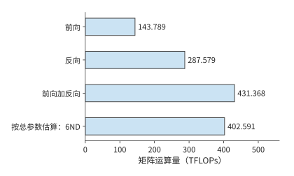

*图 3-23　Qwen3-8B、8192 个 token 输入的全参数训练。全部输入 token 执行词表头、没有重计算；按矩阵逐项累计，前向加反向为 431.368 TFLOPs。*

把 402.591 TFLOPs 的粗算修正到 431.368 TFLOPs，需要先说明哪些工作漏算了、哪些多算了。查询与上下文之间的矩阵乘法不对应一份模型参数，却在前反向中贡献 59.381 TFLOPs；另一方面，词嵌入等模块虽然包含参数，但并不对每个 token 执行完整矩阵乘法，不能一律按 $6ND$ 计入。两项修正相抵后，矩阵运算总量比粗算高约 7.15%。这属于第 1.3.4 节所说的第一类差距：粗算漏掉了注意力的二次项，又多算了不参与完整矩阵乘法的参数，要改的是模型本身，与实现无关。只有修正后的下界，才能用来衡量系统的利用率。

将有效标签数减到 4096，如果仍对全部 token 计算词表投影，矩阵运算量就不变。如果先取出参与监督的 token 的隐藏向量，再只对它们执行词表投影，总量则降到 416.074 TFLOPs。主干网络仍处理全部输入，节省的是不参与监督的 token 的词表投影；反向时再把梯度放回对应位置。[^mask]

归一化、激活、损失与优化器也需要计算和读写。以参数更新为例，即使序列较短，仍要读写权重、梯度和优化器状态；序列越短，这部分成本在总量中的占比往往越高。因此，训练预算既要考虑随 token 数增长的矩阵计算，也要考虑由参数量决定的更新开销。[^nonmatrix]

模型新增的前向操作，也会增加对应的反向计算。上下文压缩需要对投影、池化和状态更新求梯度，mHC 需要向各残差通路传播梯度，MoE 则要对实际选中的专家求梯度。[^v4-training] 第 2 章的计算图因而也能用于判断：训练时要保存哪些中间结果，反向又要执行哪些运算。

因此，序列长度变化时可以先判断各项开销的变化趋势：参数投影随输入行数增长，注意力随查询—键配对数增长，优化器更新随参数量和更新次数增长。若采用重计算，容量需求下降，但重做的前向运算还要加回 $F_{\mathrm{train}}$。这些变化都能沿同一张前向—反向图逐项解释。

> **练习 3-6〔延伸〕：一次参数更新需要多少计算、训练状态和监督 token**
>
> 从 $Y=XW$ 推导输入梯度和权重梯度的尺寸，说明三次矩阵乘法的运算量为何相同。对 Qwen3-8B，按每参数 18 字节计算长期训练状态的总容量，再将梯度改为 BF16，求节省的容量。设每个 micro-batch 含 2 条序列，每条有 4096 个输入 token，其中 1024 个 token 参与监督。累计 8 个 micro-batch 后更新一次参数，求每次更新处理的输入 token 总数和有效监督 token 总数。解释仅屏蔽不参与监督的 token 的损失，与只对参与监督的 token 执行词表投影，在计算量上有何区别。

## 3.5 强化学习（RL）

### 3.5.1 Rollout、奖励与环境验证

推理从外部请求开始，预训练从已有文本开始。强化学习（RL）用行动得到的反馈来改进后续行动。在语言模型中，策略是给定上下文时选择下一个 token 的概率分布。RL 把两条路径连接起来：当前策略先生成回答，再由反馈决定如何更新参数，更新后的策略继续产生下一批数据。生成过程通常称为 rollout。

这条训练路线已有公开实践：DeepSeek-R1 给出了从 reasoning 任务和可验证奖励出发的做法。对代码、数学等容易检查的任务，反馈可以来自规则或测试；对需要实际操作的任务，则要运行工具与环境。奖励是用来评价一次回答或行动效果的数值。奖励若由另一个模型生成，还会产生额外推理。一次“训练迭代”因此可能包含多个模型、CPU 测试、沙箱等待和梯度更新。[^r1]

更近的模型把 RL 与其他训练阶段组合起来。DeepSeek V4-Flash 先通过 SFT 和 RL 训练领域专家，再以多教师的同策略蒸馏（on-policy distillation，OPD）将多个专家的能力整合到同一个模型中。蒸馏让学生模型学习教师模型给出的输出信息；OPD 由当前学生自己生成轨迹，教师在这些 token 位置提供候选输出的概率分布，学生据此学习。教师前向因此成为生成与更新之间的一项模型工作；规则验证则以测试或程序执行提供反馈，需要另一组计算资源。[^v4]

沿这一循环分析资源时，先找数据的生产者和消费者：策略生成 token，奖励函数或教师读取回答，学习器读取训练样本并产生新权重，负责生成的模型副本再使用新权重。某一角色变慢，后继角色就要等待；增加教师模型则需要额外的前向计算和权重存储空间。后续的并行安排都必须建立在这张依赖图上。

### 3.5.2 有效样本、策略更新与权重同步

生成回答和计算奖励之后，还要决定哪些样本用于学习。关键是区分已经生成的样本与最终进入更新的样本：前者决定生成开销，后者决定训练 batch，两者的数量未必相同。

设一轮需要保留 $n_{\mathrm{keep}}$ 条样本，生成样本的平均保留比例为 $a$，则所需生成数的期望为

$$
n_{\mathrm{generate}}\approx\frac{n_{\mathrm{keep}}}{a}.
$$

保留 16 条样本，比例为一半时平均需要生成 32 条，降为四分之一时平均需要 64 条。生成和评分处理全部回答，参数更新只处理保留样本；保留比例下降会增加前两个阶段的工作，而不会按同样比例扩大更新 batch。第 3.5.3 节将采用等长样本，给定具体的生成数量，比较这两种情况。

是否保留一条样本，由训练方法及筛选规则决定。有的方法把失败回答作为负反馈，有的方法排除截断或奖励无效的回答。优势表示某个回答相对于比较基准更好或更差的程度。采用组内相对优势时，还要比较同一道题多份回答的奖励。因此，保留样本数决定更新时处理多少数据，奖励和损失函数则决定这些数据产生何种梯度。

**例子：相同奖励如何消除组内学习信号。** 在使用组内相对奖励的策略更新中，如果同组回答得到相同奖励，减去组内平均奖励后，每条回答的优势都为零，相应的策略梯度也为零。回答全部正确就可能出现这种情况。模型完成了生成、评分和更新流程，却没有从这一组回答中获得区分优劣的信号。只有奖励差异提供了非零优势，策略损失才会推动参数沿相应方向调整。[^verl]

损失的求平均方式也会影响训练。若目标是对整个 batch 的有效 token 求平均，累计各 micro-batch 梯度时就要使用整个 batch 的有效 token 总数作为分母。若先分别计算每个 micro-batch 的均值，再对这些均值求平均，有效 token 较少的 micro-batch 里，token 就可能获得更大权重。第 10 章将用具体训练方法解释这种差别。[^verl-loss]

更新后还要把策略权重送给生成端。若生成端继续使用旧版本，下一批数据就仍由旧策略产生。同步循环可以等权重就绪后再生成；异步方案允许部分阶段重叠，却要处理样本版本与滞后。本章先明确这一依赖关系，第 10 章再讨论交接、抢占、恢复和资源配比。

### 3.5.3 有效样本数固定时，各阶段需要多少计算

这种区分可以用固定目标量化：每轮都要保留 16 条样本用于更新。如果回答更难通过筛选，就必须先生成更多回答。

**例题 3-4：样本保留比例下降时，为保持更新样本数需要增加多少计算？**

解：以 Qwen3-8B 为例，设有八道题，每题生成四份回答，$P=1024,\ G=256$，共保留 16 条样本用于一次策略更新。参考模型（reference model，权重保持固定、用来约束策略偏离程度的模型）与策略模型结构相同，分别保存权重；参考模型对全部 32 份回答各执行一次前向，本例不调用教师模型。各样本长度相同，生成时不提前停止，也不共享前缀。[^rl]

生成时每条先做一次 prefill，再做 255 次 decode。训练与评分时，轨迹已经确定，可以采用教师强制（teacher forcing）执行前向：每个预测步骤使用轨迹中已经确定的前一个 token，而不是等待模型重新生成它。因此，这些已知 token 可以一同计算。输入长度 $P+G-1=1279$，256 个输出标签位于相应位置。16 条保留样本每轮更新的输入 token 共 20,464，监督输出共 4096。输入 token 决定上下文计算，参与监督的 token 决定损失作用于哪些输出，二者分别进入训练预算。

| 阶段 | 处理样本 | 矩阵运算量（TFLOPs） |
| --- | ---: | ---: |
| Rollout prefill | 32 | 465.143 |
| Rollout decode，255 步／条 | 32 | 129.056 |
| 参考模型，一次前向 | 32 | 634.944 |
| 教师评分，设为零次 | 0 | 0 |
| 策略更新，一次遍历 | 16 | 952.416 |
| 合计 | 保留 16 条 | 2,181.559 |

将一条回答的生成与参考模型前向合计运算量记为 $f_g+f_r$，一次固定更新 batch 的运算量记为 $F_u$，则

$$
F_{\mathrm{cycle}}(n)=n(f_g+f_r)+F_u.
$$

参考模型读取完整回答，可以一次处理多个已知 token；生成则逐 token 推进。上式虽然把运算量相加，仍需分别记录各阶段的矩阵形状，才能根据对应的执行效率估算时间。

如果样本保留比例从 1/2 降到 1/4，但仍要求得到 16 条保留样本，教学对照改为生成 64 条。生成与参考模型计算翻倍，更新量不变，总矩阵运算量增到 3,410.701 TFLOPs，约增加 56.3%。每个保留样本分摊的矩阵运算量从 136.347 增到 213.169 TFLOPs。增加的 1229.142 TFLOPs 全部来自额外回答的生成与参考模型计算；进入更新的 16 条样本保持不变。[^rl-low]

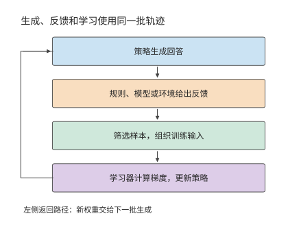

*图 3-24　强化学习中的角色和数据流。生成端产生回答，反馈环节评价结果，筛选后送给学习器更新；新权重再用于下一批生成。*

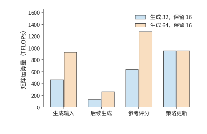

*图 3-25　保持 16 条有效样本的目标，生成数由 32 增到 64。生成时的输入处理、后续 decode 和参考模型评分随回答总数增加，策略更新处理的样本数保持相同。*

更新完成后，生成副本需要获得新权重。设有 $r$ 个副本，逐个独立发送大小为 $M_W$ 的完整权重，则传输量为 $rM_W$。Qwen3-8B BF16 的一份权重约为 16.381 GB，四个副本共需约 65.526 GB。优化器状态留在学习器，用于下一次更新；生成副本只需要执行前向所需的权重。广播或分层分发则可以让多个副本共用部分传输路径，减少重复发送。

为各阶段分配资源时，既要看运算量，也要看计算方式。生成阶段的 decode 每步通常只处理各请求的一个新 token，在小 batch 下同时处理的 token 较少；评分和训练则能一起处理已知回答中的多个 token，工具验证还需要 CPU 和运行环境。分别估算各阶段的耗时，再按生成、反馈、更新和权重同步的顺序排列，才能得到完整周期。第 4 至 10 章将逐步介绍相应的硬件和调度方法。

> **练习 3-7〔核心〕：更新样本数不变时，多生成回答会增加多少 RL 开销**
>
> 保持一次更新使用 16 条等长样本。利用例题 3-4 中分别生成 32 条和 64 条回答时的周期总运算量，求每多生成一条回答所增加的生成与参考模型运算量，以及一次更新所需的固定运算量。保持更新样本数不变，据此预测生成 48 条回答时的周期总运算量。再用与生成模型结构相同的教师模型，对全部 48 条回答各执行一次前向计算，求新增的运算量。若将更新后的 BF16 权重分别发送给四个副本，每个副本独立接收一份，求总传输量。最后画出生成、反馈、更新与同步的依赖，指出哪些阶段可以在不同 batch 之间重叠。

## 3.6 从负载需求到训练与服务预算

### 3.6.1 Scaling Law：模型规模与数据量的关系

单次更新的计算可以逐项求出，训练多少参数、使用多少数据则需要另行决定。设总训练计算预算为 $C$，参数量为 $N$，训练 token 数为 $D$，主要计算近似满足 $C=6ND$。增加 $N$ 就必须减少 $D$。要在两者之间作选择，就要知道参数与数据分别如何影响质量。Scaling Law（规模规律）用实验拟合模型规模、训练数据和损失之间的关系。下面采用幂律模型，其中参数与数据两项都为正，训练配置和损失评估方式固定：

$$
L(N,D)=E+\frac{A}{N^{\alpha}}+\frac{B}{D^{\beta}}.
$$

$L$ 是验证损失，$E$ 是渐近损失，$A/N^\alpha$ 描述参数规模不足的影响，$B/D^\beta$ 描述数据量不足的影响。这里的 $A,B,\alpha,\beta$ 都是拟合系数。单独增加参数或数据会降低对应项；固定计算预算时，两项却向相反方向变化。

用 $D=C/(6N)$ 消去数据量，再对 $N$ 求导。最优点满足

$$
\alpha A N^{-\alpha-1}=\beta B\left(\frac6C\right)^\beta N^{\beta-1}.
$$

左侧是增加参数带来的损失下降，右侧是减少数据造成的损失上升；两者相等时，再小幅改变参数量已经没有净收益。整理得到：

$$
N_{\mathrm{opt}}=\left(\frac{\alpha A}{\beta B}\right)^{1/(\alpha+\beta)}\left(\frac{C}{6}\right)^{\beta/(\alpha+\beta)}.
$$

由此得到的 $N_{\mathrm{opt}}$ 是连续取值的结果，实际设计时可在它附近选择合适的层数和宽度。这一最优解只在固定训练计算预算下最小化验证损失，不含部署后的推理成本，也不考虑数据供给是否充足。模型上线后还要服务大量请求时，最优选择可能偏向更小、训练更充分的配置；第 3.6.2 节将用公开模型的训练记录，检查实际投入与这里的预测相差多少。

不同研究拟合出的分配指数并不一致。Kaplan 等人的早期研究给出约 $N\propto C^{0.73},\ D\propto C^{0.27}$ 的分配关系；Chinchilla 研究用不同的实验和拟合得出：模型规模与数据量应随预算更接近等比例增长。前一种分配更快增加模型参数，后一种把更多新增预算分给训练数据；曲线及其拟合指数因此直接改变参数与数据的选择。[^scaling]

**例题 3-5：训练规模拟合关系能否预测更大模型的损失？** 从公开训练记录中选定六个较小模型的观测值用于拟合，另将两个较大模型的观测留出。先选定拟合方法，再比较留出模型的预测值与实际观测值。

解：datablations 是研究模型与数据规模变化的公开实验记录，C4 是这些记录使用的一套文本语料。以其中八个模型为例，用六个较小模型拟合曲线，将 $N\ge2\times10^9$ 的两个模型留作检验。两个大模型的实际损失分别约为 2.574、2.337，拟合曲线预测为 2.583、2.363。预测略高于实际值，均方根误差约为 0.0193 nats/token。nat 是使用自然对数时的信息量单位，nats/token 表示每个 token 的平均损失。图 3-26 用不同标记区分拟合点与检验点。[^fit]

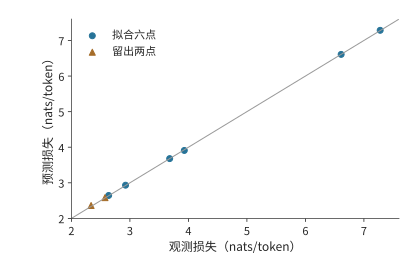

*图 3-26　八个公开 C4 观测的预测与实际损失。6 点用于拟合，2 点预先留出作检验；对角线表示预测等于观测，点到线的偏差反映误差。*

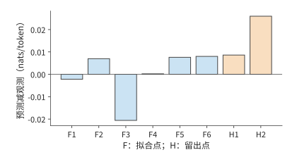

*图 3-27　同一组预测误差的放大视图。F1—F6 为拟合点，H1—H2 为留出点；纵轴是预测减观测，保留正负号。*

留出检验之所以必要，是因为拟合只保证曲线尽量贴近用于求系数的数据。将较大模型排除在拟合之外，再比较预测与实际损失，才能检查这条关系能否预测新规模。这里的两个误差分别约为 $0.009$ 和 $0.026$；将它们平方、取平均再开方，便得到均方根误差。

预测出验证损失之后，还要判断模型能否完成实际任务。Llama 3 报告先根据训练计算量预测损失，再建立损失与任务表现的关系。[^llama3] 这样，代码、检索和工具使用等任务的质量要求，才能进一步转化为训练规模与计算量的选择。

拟合和预测都建立在单次训练的观测上，而训练本身也有波动。同样的数据与模型规模，改变随机初始化就可能得到不同的学习曲线；较大模型在训练尚未充分时，也未必优于较小模型。使用多个随机种子重复训练，可以区分规模变化带来的趋势与单次训练的偶然波动。[^local-train]

长期服务会把每次调用的成本累积到训练预算之上。较小模型可以靠更长的训练达到目标质量：前期投入更多，之后每次调用读取的权重更少、执行的运算也更少。Beyond Chinchilla-Optimal 将这种推理需求纳入分析，47 个模型覆盖 150M–6B；其中 150M 模型的训练量最高达到每个参数 10,000 个 token，较大模型最高达到 1,000 个。[^beyond] 训练预算与服务次数共同决定较小模型何时能收回额外训练的成本。

**固定目标损失下的训练投入与累计服务成本。** 固定拟合目标损失为 2.9，用矩阵运算量估算训练与服务成本，再统一折算为 H100 SXM 的 GPU 时间（GPU 数量与使用时长的乘积，以 GPU 秒或 GPU 小时计）。请求取 $P=512,G=128$，训练运算量为 $6ND$，每个完整请求的运算量为 $2N[P+(G-1)]$。H100 SXM 的 BF16 稠密峰值为 989.4 TFLOP/s；Llama 3 在 H100 上预训练时报告的 BF16 MFU（定义见第 1.2.2 节）为 38%–43%，训练与服务都取 40%，折算后每 GPU 秒完成 395.76 TFLOP。[^llama3] 0.1B 模型需要约 298.6B 训练 token，超过拟合所用数据量的上界，因此成本图用虚线标注这条外推曲线。按这条外推曲线计算，0.1B 模型训练约需 125.7 H100 GPU 小时，比 0.5B 模型多 73.5 GPU 小时；每次调用则少用约 0.00129 GPU 秒。调用约 2.048 亿次时，两者总成本相等。在此之前，0.1B 模型多付的训练成本尚未收回；在此之后，每次服务节省的成本累计超过了前期投入。训练与服务按同一系数折算，所以该交点只取决于运算量，与 MFU 的取值无关。[^lifecycle]

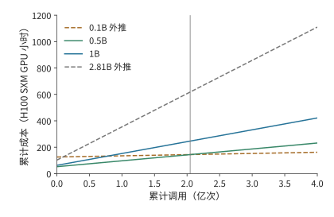

*图 3-28　训练与服务累计成本的题设比较。截距是训练投入，斜率是单次调用成本；虚线标出超出拟合参数或数据范围的方案，竖线为约 2.048 亿次的成本交点。图例中的 B 表示十亿个模型参数；纵轴为按 40% MFU 折算的 H100 SXM GPU 小时。*

回到参数与数据的分配，还可以直接预测预算增加后的结果。由最优解表达式可得 $N_{\mathrm{opt}}\propto C^{\beta/(\alpha+\beta)}$，再代回计算约束，得到 $D_{\mathrm{opt}}\propto C^{\alpha/(\alpha+\beta)}$。若两个指数相等，预算增至四倍，参数和训练数据各增至两倍。拟合指数的意义由此变得具体：指数决定新增计算应如何分给模型与数据。

> **练习 3-8〔延伸〕：如何在模型参数与训练数据之间分配计算预算**
>
> 采用损失模型 $L=E+A/N^\alpha+B/D^\beta$ 和计算预算约束 $C=6ND$，推导使损失最小的参数量 $N$ 与数据量 $D$ 分别如何随计算预算 $C$ 增长。取 $\alpha=\beta$，当计算预算分别增至原来的四倍和九倍时，最优参数量和数据量应各增至原来的多少倍？再使用例题 3-5 的八个 C4 观测点，用其中六个拟合、另外两个检验，计算两个检验点的预测误差，并解释为什么拟合点上的误差不能替代留出检验的误差。

### 3.6.2 从 Llama 到 Qwen 的训练投入

第 3.6.1 节的拟合说明了模型规模与训练数据之间如何取舍。本节用公开模型的训练记录分析开发者实际采用的训练投入：先比较每个参数对应的训练 token 数，再将算法运算量与具体硬件上的训练时间区分开。

从各报告披露的阶段和规模，可以看到一种趋势：在相近的 7–8B 参数规模下，训练 token 数持续增加。[^history]

| 模型与报告范围 | 训练 token | $D/N$ 粗略估算 | $6ND$ 粗略估算 |
| --- | ---: | ---: | ---: |
| Llama 1，6.7B | 1T | 149 | $4.02\times10^{22}$ FLOPs |
| Llama 2，约 7B | 2T | 286 | $8.40\times10^{22}$ FLOPs |
| Llama 3.1，约 8B | 约 15T | 约 1,875 | 约 $7.20\times10^{23}$ FLOPs |
| Qwen2.5，约 7B，模型系列披露 | 约 18T | 约 2,571 | 约 $7.56\times10^{23}$ FLOPs |
| Qwen3，约 8B，模型系列披露 | 约 36T | 约 4,500 | 约 $1.728\times10^{24}$ FLOPs |

$D/N$ 将数据投入换成“每个参数对应多少训练 token”。表中约 7–8B 的稠密模型，$D/N$ 从约 149 增至约 4,500，说明参数量相近的模型，训练数据量也可以相差悬殊。前期训练成本随数据增加，部署后每次调用的权重容量却仍主要由参数数量决定。因此，更充分训练的小模型可能增加一次性投入，同时降低长期服务成本。

这组数字也澄清了第 3.6.1 节的拟合结果与实际训练投入的关系。按 Chinchilla 的等比例分配，约 8B 模型的计算最优数据量约为每参数 20 个 token，即约 160B token；表中实际投入从 1T 增至约 36T，超出这一基准一至两个数量级。两者回答的问题不同：拟合在固定训练计算预算下最小化验证损失，开发者则把上线后的服务成本计入目标，在数据供给充足、预期调用量大时选择更小、训练更充分的模型。第 3.6.1 节引用的 Beyond Chinchilla-Optimal 和第 3.6.3 节的成本交点公式给出了这种选择的定量条件。训练预算最优与全生命周期最优是不同的目标，实际投入超出前者并不表示前者算错了。

更长训练、数据筛选、蒸馏和后训练，都是用更多前期工作提高给定规模模型的任务能力。Llama 3 模型卡的基础模型评测中，Llama 3 8B 与 Llama 2 70B 在覆盖多学科选择题的 MMLU 基准上分别为 66.6／69.7，使用维基百科证据的问答基准 TriviaQA-Wiki 为 78.5／87.5。[^llama3-card] 两项差距不同，说明部署方要按自己的任务选择质量要求；达到质量门槛的小模型，才有机会把较小权重带来的容量与读取收益转成服务收益。

分析大模型和 MoE 时，则要分别列出总参数量与激活参数量。DeepSeek-V3 报告为总参数 671B、每 token 激活约 37B、预训练 14.8T；DeepSeek V4-Flash 为 284B／约 13B、32T，DeepSeek V4-Pro 为 1.6T／约 49B、33T。总权重影响容量，激活参数只提供计算量的粗略估计。DeepSeek V4-Flash 主干专家的三个投影可单独计算：

$$
C_{\mathrm{expert/token}}=18n_Lhf(k_{\mathrm{routed}}+k_{\mathrm{shared}})=18n_Lhf(6+1).
$$

式中 $n_L$ 为主干层数，$h$ 为隐藏维度，$f$ 为专家中间维度，$k_{\mathrm{routed}}$ 与 $k_{\mathrm{shared}}$ 为每 token 选中的路由专家数与共享专家数；系数 $18=3\times2\times3$，依次对应三个投影、每次乘加计 2 FLOPs、前反向合计为前向的三倍。DeepSeek V4-Flash 的主干专家约 45.4495 GFLOPs/token，按 32T 累计约 $1.45438\times10^{24}$ FLOPs；DeepSeek V4-Pro 约 169.2465 GFLOPs/token，按 33T 累计约 $5.58513\times10^{24}$ FLOPs。整步训练计算由这些专家矩阵与注意力、路由、MTP、优化器和重计算共同组成。报告的损失权重也不是执行比例，例如 MTP 权重为 0.3，不表示只执行 30% 的辅助计算。[^training]

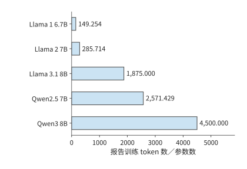

*图 3-29　相近参数规模的模型投入不同数量的训练 token。柱值为报告训练数据量除以参数量，Qwen 采用模型系列披露的数据预算。*

> **练习 3-9〔延伸〕：增加训练数据或专家数量会改变哪些资源需求**
>
> 根据 Llama／Qwen 表重算 $D/N$ 与 $6ND$。若参数量保持不变、训练数据量增至四倍，预测训练计算与上线后的纯权重容量分别如何变化。对 MoE，说明总专家数加倍、每 token 选中数不变时，参数容量与专家训练计算能否都按两倍估算。

除运算量外，训练投入还常用 GPU 小时计量。若持续使用 $n_{\mathrm{GPU}}$ 张卡，总 GPU 小时为 $H_{\mathrm{GPU}}$，实际历时为

$$
T_{\mathrm{calendar}}=\frac{H_{\mathrm{GPU}}}{n_{\mathrm{GPU}}}.
$$

Llama 1 65B 的训练消耗 1,022,362 A100 GPU 小时。持续使用 2048 张卡，对应约 499.2 小时，即 20.80 天；在相同加速器效率下只使用一半卡数，则需要约 41.60 天。GPU 小时体现总投入，卡数决定完成这些工作需要多少实际时间。

DeepSeek-V3 报告预训练 2.664M H800 GPU 小时；14.8T token 只对应预训练阶段；按持续使用 2048 卡计算，约需 54.20 天。后续的上下文扩展与后训练另有用量，但各阶段统计范围不同，不能一并除以预训练 token 数。[^history]

用 GPU 小时换算实际历时，要除以同期使用的卡数。对 Llama 3.1 405B，取公开的 30.84M H100 GPU 小时，并假设这项工作全部使用最大规模 16,384 卡，实际历时约为 $30.84\times10^6/(16384\times24)\approx78.43$ 天。某个阶段使用的卡数更少时，相同 GPU 小时需要更长的实际时间；训练资源的分配时序因此决定训练完成时间。

上述用量来自三种加速器，GPU 小时不能直接跨设备比较投入规模。按 BF16 稠密峰值算力折算：A100 80GB 为 312 TFLOP/s，H100 与 H800 同为 989.4 TFLOP/s（H800 只是互联带宽更低），一个 H100 或 H800 GPU 小时约相当于 $989.4/312\approx3.17$ 个 A100 GPU 小时。图 3-30 把三组公开用量统一折算为 A100 80GB 等效小时；折算假定各设备的实际利用率相近，用于比较投入规模，不表示效率或成本差异。

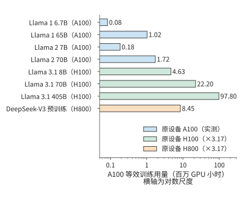

*图 3-30　Llama 与 DeepSeek-V3 的公开训练用量统一折算为 A100 80GB 等效 GPU 小时。Llama 1／Llama 2 为 A100 实测小时；H100 与 H800 小时按 BF16 稠密峰值之比 $989.4/312\approx3.17$ 折算，DeepSeek-V3 只计预训练阶段。横轴为对数尺度；折算假定各设备实际利用率相近，不表示效率或成本差异。*

以上几组用量都属于预训练，后训练的投入同样可以用 GPU 小时比较。Qwen3 技术报告的表 21 把同一个 8B 模型的 RL 与 OPD 两条后训练路线并列，投入分别为 17,920 与 1,800 GPU 小时。两条路线可以二选一，各自包含生成、反馈与学习工作。把 GPU 小时对应到具体阶段和加速器，再结合各阶段的执行过程，就能解释训练投入主要消耗在哪里。

### 3.6.3 满足质量要求的全生命周期成本

现在把第 2 章与本章的分析合在一起。模型结构决定每次调用所需的存储容量、运算量和读取量，负载决定调用次数与等待，训练决定上线前的投入。设模型 $m$ 的前期成本为 $C_0(m)$，未来有 $Q$ 个任务，第 $j$ 类占比为 $w_j$、完成一个任务的平均成本为 $c_j(m)$，则

$$
C_{\mathrm{life}}(m)=C_0(m)+Q\sum_jw_jc_j(m).
$$

比较之前，各模型都要满足相同质量、时限与完成条件。若任务成功率不同，$c_j$ 中还需包含失败和重试；价格变化、模型寿命、维护与贴现等假设也应在给出预算时说明。专用硬件若需要较长部署周期，模型版本能使用多久也会成为这一选择的条件。

考虑都满足任务质量和时限的两个模型。若较小模型需要额外训练成本 $\Delta C_0$，但每个成功任务能节省 $\Delta c>0$，累计成本相等的调用量为

$$
Q_* = \frac{\Delta C_0}{\Delta c}.
$$

若较小模型额外训练 10 万 H100 GPU 小时，即 $3.6\times10^8$ GPU 秒，每个任务节省 0.72 H100 GPU 秒，则 $Q_*=3.6\times10^8/0.72=5\times10^8$，即五亿次任务。预期需求低于此数，额外训练成本尚未收回；高于此数，较小模型累计节省更多。容量、延迟、质量和调用量共同决定选择，单看模型大小或 token 单价无法完成这一判断。

> **练习 3-10〔延伸〕：训练完成时间与累计服务成本**
>
> 假设完成训练共需 1,022,362 A100 GPU 小时，即 Llama 1 65B 的公开用量。分别持续使用 2048 张和 1024 张 A100，并假设加速器数量改变后总 GPU 小时不变，求两种配置下完成训练所需的天数。再比较两个满足相同质量与时限的模型：小模型多投入 10 万 H100 GPU 小时训练，每个成功任务节省 0.72 H100 GPU 秒。预计完成两亿项和十亿项成功任务时，分别应选择哪个模型？计算总成本差，并说明若实际任务量发生变化，选择会在何处反转。

后续章节将使用本章整理出的三类负载信息。下表列出各类负载需要记录的内容，以及这些信息将用于哪些系统设计问题。

| 负载 | 必须保留的字段 | 后续使用 |
| --- | --- | --- |
| Chat／Agent | 任务检查、模型与版本、每轮输入／命中／输出、到达、工具依赖、分支与复用间隔 | 第 8 章安排批处理与状态；第 9 章交接与路由；第 11 章管理工具环境 |
| 视觉／实时 | 原图字节、$\mathrm E/\mathrm P/\mathrm D$、EC/KV、帧或块到达、首响应／连续播放要求、打断后不再需要的计算 | 第 8、9 章安排编码和交接；第 12 章加入链路与执行位置 |
| 训练／RL | 数据与质量、长度和标签、micro-batch／更新、生成样本数／保留样本数、奖励计算与模型调用、权重版本、完成期限 | 第 4–7 章分析算力、存储与通信需求；第 10 章安排学习；第 11 章配置环境与资源池 |

这三类例子都说明，描述负载需要记录具体的执行过程。两分钟请求中，各时段的输入输出比例决定积压何时出现；代码 Agent 中，工具依赖决定等待时间，以及状态需要保存多久；RL 中，筛选前后的样本数决定生成与更新阶段各处理多少数据。掌握这些信息，才能为各阶段安排资源。

第 4 章将结合芯片的算力、存储容量与带宽，分析这些负载如何在加速器上执行。本章算出的矩阵尺寸、状态大小和访问次数，将用于判断计算需要多久、数据能否容纳，以及读写能否及时完成。各阶段的依赖关系则决定哪些工作可以重叠，哪些必须等待。

## 谬误与陷阱

**误区：平均请求率和长度相同，负载就相同。** 少量超长请求、输入与输出长度的组合、请求到达顺序，都会影响短时间内的资源需求。例题 3-1 中，处理能力足以应付平均到达量，后一分钟却仍会积压。

**误区：token 单价降低，成功任务成本就会降低。** 额外思考、未通过检查的回答、工具与环境都应进入分子，合格任务数进入分母。零成功的 batch 只能报告消耗与失败，不能估计成功成本。

**误区：训练 token 总数相同，系统工作量就相同。** 序列分布改变注意力查询—键配对的数量，标签与词表头策略改变输出工作，更新次数改变优化器成本；RL 还要为没有采用的回答付出生成与反馈的开销。

**误区：Scaling Law 拟合出的计算最优规模，就是应该采用的训练规模。** 计算最优只在固定训练预算、不计推理成本时成立。公开模型的每参数训练 token 数超出这一基准一至两个数量级，是把长期服务成本计入目标后的选择；目标函数不同，不表示拟合结果被推翻。

## 代码任务轨迹

任务是修复区间合并函数，使嵌套区间和端点相接的区间正确合并，同时不修改输入及其嵌套列表。模型可以读取指定文件、改写它、运行固定测试并结束任务，控制器不替模型修改代码。关闭思考模式时，模型在 12 轮内读文件一次、改写五次、运行测试六次，仍未完成；开启后，四轮分别是输出截断、写文件、运行测试和结束。首轮截断产生的等待同样计入任务总时间。[^agent]

[^model]: [第 2 章模型架构](02-模型架构.md)，§2.2 的请求调用约定和 Qwen3-8B KV 计数；[四模型请求计算](../calculations/results/request-four-models-book.md)。

[^cost]: [2023—2026 年 token 成本调研](../research/token-cost-2023-2026/report.md)，§2、§4、§11；API 价格、生产成本与成功任务成本分开。

[^servegen]: [ServeGen，NSDI 2026](../references/proceedings/NSDI/2026/selected/nsdi26-xiang-servegen.pdf)，§2–7；[资料与源码阅读笔记](../case-studies/workload-and-provisioning.md)。

[^workload]: [请求分布与资源配置](../case-studies/workload-and-provisioning.md)，两分钟固定输入和首 token 修正后的阶段需求；[RTX PRO 6000 上 64 条序列的 decode 带宽下界](../calculations/results/batch-reuse-rtxpro6000-mix.md)，平均上下文取 2742 个 token。

[^arrival]: [练习 3-2：真实两分钟回放](../experiments/ch03/03-02/README.md)，完整输入、发送与完成记录、KV 采样及运行范围。

[^serve-replay]: [ServeGen 窗口的实际回放](../experiments/ch03/03-02/servegen-replay/README.md)。

[^agent-calc]: [开启思考模式的真实轨迹复算](../calculations/results/agent-thinking-on.md)。

[^context]: [上下文组织与 Agent 案例](../case-studies/author-context-and-design.md)，连接作者 AI Agent 书第 2 章与实验记录。

[^reasoning]: [练习 3-3：1024 预算](../experiments/ch03/03-03/README.md)与[4096 预算](../experiments/ch03/03-03/wide-budget/README.md)；理论背景见[Test-Time Compute](../references/files/papers/test-time-compute.pdf)。

[^reasoning-off]: [关闭思考模式的诊断](../experiments/ch03/03-03/no-thinking/README.md)，分别记录按预定标准评分的结果、事后从输出中提取答案的结果，以及并发进程的观测数据。

[^agent]: [练习 3-4：两条代码 Agent 轨迹](../experiments/ch03/03-04/README.md)，含独立检查与额外别名条件。

[^retrieval]: [检索与生成算例](../case-studies/retrieval-and-generation.md)。

[^agent-speedup]: [仅将首轮模型段加速两倍](../calculations/results/agent-thinking-on-double-first.md)。

[^vision]: [视觉编码矩阵与张量计数](../calculations/results/vision-encoding-single.md)。

[^epd]: [多模态输入的字节、状态与阶段放置](../case-studies/multimodal-stage-placement.md)，固定 Qwen3-VL-4B 配置、预处理与完整 DeepStack EC。

[^media]: [生成模型取材与执行路径](../case-studies/generative-multimodal-models.md)；[Omni 音频](../calculations/results/omni-audio-book.md)、[Fish 音频](../calculations/results/fish-audio-book.md)、[FLUX 图像](../calculations/results/image-generation-flux.md)、[H3 视频](../calculations/results/video-generation-book.md)、[Wan 视频](../calculations/results/video-generation-wan.md)。

[^image]: [Qwen 图像生成请求计数](../calculations/results/image-generation-book.md)。

[^aoi]: [AOI 论文与关键帧案例](../case-studies/author-context-and-design.md)。

[^audio-real]: [两份历史语音记录](../experiments/ch03/03-05/historical-arrivals/README.md)。

[^audio]: [40 ms 缓冲教学时序](../calculations/results/audio-timing-base.md)与[60 ms 缓冲](../calculations/results/audio-timing-large-buffer.md)。

[^audio-interrupt]: [打断与静音的教学算例](../calculations/results/audio-timing-interrupt.md)。

[^training]: [训练计算量笔记](../case-studies/training-compute.md)，线性层前反向、序列分布与 DeepSeek V4-Flash 专家分项计算。

[^train-matrix]: [Qwen3-8B 的 8K 训练矩阵](../calculations/results/training-qwen3-8b-t8192.md)。

[^qwen]: [Qwen3 技术报告](../references/files/papers/qwen3.pdf)，§3.2 的三阶段预训练及表 21 的后训练分支。

[^mask]: [标签减半](../calculations/results/training-qwen3-8b-mask-half.md)与[显式压缩词表头](../calculations/results/training-qwen3-8b-compact-half.md)。

[^nonmatrix]: [训练非矩阵补算](../calculations/results/training-nonmatrix-book.md)，与[8K 变体](../calculations/results/training-nonmatrix-8192.md)分别计量。

[^v4-training]: [DeepSeek V4-Flash 在线压缩器](../calculations/results/v4-online-r4-tail-emits.md)、[注意力反向](../calculations/results/v4-attention-training-window128.md)、[MoE 单层训练](../calculations/results/v4-moe-training-balanced.md)、[mHC 包装反向](../calculations/results/v4-hc-training-128.md)、[优化器分组](../calculations/results/v4-optimizer-flash-base-unresolved.md)。

[^r1]: [DeepSeek-R1 报告](../references/files/papers/deepseek-r1.pdf)。

[^v4]: [DeepSeek V4 报告](../references/files/papers/deepseek-v4.pdf)，§5.1 的领域专家与多教师 OPD、§5.2 的教师调度、rollout 与沙箱。

[^verl]: [实验 10-8：固定 verl 最小训练流程](../experiments/ch10/10-08/README.md)。本章用这一实验区分任务质量与参数更新，完整系统的组织方式见第 10 章。

[^verl-loss]: [固定 verl 训练配置的损失归一化与参数更新过程](../research/2026-infra-survey/qa/verl-recipe-loss-closure.md)，绑定原配置、源码与导出张量。

[^rl]: [Qwen 教学 RL batch](../calculations/results/rl-qwen8-base.md)。

[^rl-low]: [降低样本保留比例、保持保留样本数](../calculations/results/rl-qwen8-low-acceptance.md)。

[^scaling]: [Kaplan Scaling Laws](../references/files/papers/scaling-laws.pdf)，§6；[Chinchilla](../references/files/papers/chinchilla.pdf)，计算最优分配与拟合方法。

[^fit]: [公开 C4 八点拟合](../calculations/results/datablations-real-c4-eight-point-fit.md)，来源日志、排除项和四项敏感性随报告保存。

[^llama3]: [Llama 3 报告](../references/files/papers/llama3.pdf)，训练预算、损失预测与下游任务表现；§3.3.2 与表 4 给出 H100 上 38%–43% 的 BF16 MFU。

[^llama3-card]: [Meta Llama 3 模型卡](../references/token-cost/2026-09-07/llama3-card.md)，Base pretrained models 表中 Llama 3 8B 与 Llama2 70B 两列。

[^local-train]: [练习 3-8：固定文本上的六次小模型实训](../experiments/ch03/03-08/README.md)，保存 checkpoint 与两个 seed 的完整结果。

[^beyond]: [Beyond Chinchilla-Optimal，ICML 2024 正式版](../references/outline-checks/2026-09-07/beyond-chinchilla-icml24.pdf)，推理需求、实验范围与长训练外推。

[^lifecycle]: [根据 C4 拟合结果估算生命周期成本](../calculations/results/real-c4-lifecycle-512-128.md)，费用按 H100 SXM GPU 秒计。

[^history]: [训练投入与 Scaling Law 历史笔记](../case-studies/scaling-history.md)及[锁定公开字段的复算](../calculations/results/training-history-published.md)。

[^source-1]: [多模态计算资料](../case-studies/generative-multimodal-models.md)。

[^v41-case]: [DeepSeek V4.1 官方技术报告](../calculations/sources/deepseek-v4.1-flash/DeepSeek_V41_Tech_Report.pdf)，第 1、2、3 节与第 6 节；[跨章会话的固定条件与复算](../calculations/results/v41-throughline.json)。

## 本章小结

持续服务的负载既取决于每次请求要做多少工作，也取决于请求何时到达、各步骤之间有哪些依赖。用平均速率可以粗略估算所需资源；分析短时间内的积压和状态驻留时间，则能发现平均值未体现的资源压力。多轮任务还包含工具等待与失败尝试，实时任务要保证数据及时到达，训练则增加反向、参数更新和权重同步。

比较不同方案的资源与成本时，应采用相同的质量要求和任务完成标准。Scaling Law 为训练分配提供可检验的统计模型，长期服务需求又可能改变前期投入的选择。核心练习 3-2、3-4、3-7 分别把这些方法用于持续请求、交互任务和 RL 循环。

