# 第 4 章 加速器架构

一段计算用时 100 μs，其中矩阵乘法占 60 μs，其余工作占 40 μs。把矩阵单元的速度提高一倍，总时间降为 70 μs，加速比约为 1.4。若矩阵乘法只占 10 μs，同样的改动只能把总时间降到 95 μs。增加的计算能力相同，收益却相差悬殊。架构设计要解决的，正是在芯片面积、功耗和存储容量的限制下，选择能最大限度缩短执行时间的方案。

第 2、3 章介绍了模型的计算图，以及请求在不同阶段的计算需求。本章以 Qwen3-8B 的查询投影（Q 投影）为例，即把当前 token 的隐藏向量变换成注意力查询的矩阵乘法，说明加速器如何完成这些计算。先计算运算次数和读写的数据量，再逐步考虑矩阵分块、存储层次和数据依赖，解释实际执行时间为什么与理想估算不同。随后加入注意力和专家计算，分析更复杂的算子如何使用同一套硬件；再集中比较 NVIDIA、昇腾与 Apple 的代际演进，说明模型需求如何推动这些部件共同变化。

本章围绕三个问题展开：任务需要多少计算、存储和传输；计算单元为什么会等待数据或前一步结果；提高某一部分的性能以后，哪一部分会成为新的瓶颈。理解这三个问题，就能够用同一种方法分析 GPU、昇腾、Apple 芯片以及更专用的设计。

## 4.1 从模型计算认识加速器

分析算子时，首先要确定它执行哪些运算、读写哪些数据。本节从这两项需求出发，认识加速器的组成，并初步分析计算单元、存储和接口之间的取舍。

### 4.1.1 矩阵乘法的计算与数据需求

Qwen3-8B 的隐藏维度为 4,096，32 个查询头各有 128 个分量，Q 投影的输出宽度也是 4,096。一次处理 $M$ 个 token 位置时，投影为

$$
Y=XW_Q,\qquad X\in\mathbb{R}^{M\times4096},\quad W_Q\in\mathbb{R}^{4096\times4096},\quad Y\in\mathbb{R}^{M\times4096}.
$$

在投影 $Y=XW$ 中，$M$ 是本次处理的 token 总数，每个 token 的特征向量占 $X$ 的一行；$K$ 是每个输入向量的特征数，也是权重矩阵 $W$ 的行数；$N$ 是每个输出向量的特征数，也是 $W$ 的列数；本例 $K=N=4096$。这组大写字母描述矩阵形状，与第 1 章容量记号 $M$ 的语境不同。若一次处理 $B$ 条等长请求、每条有 $P$ 个新输入 token，prefill 的 $M=BP$；单步 decode 为每条请求处理一个 token，因此 $M=B$。两个阶段使用同一份权重，完成相同的线性变换，区别在于每次有多少行输入共同使用它。[^qwen]

每个输出元素都需要计算一个长度为 4,096 的内积。将一次乘法和一次加法计为两个浮点操作，矩阵乘法计算量为

$$
F=2MKN=2M\times4096^2=33\,554\,432M\ \mathrm{FLOPs}.
$$

再看数据。输入、权重与输出均为 BF16，每元素两字节；累加器从零开始，以 FP32 保存部分和，每元素四字节。输入与权重各从片外读取一次，最终结果写回一次，总读写量为

$$
V=2MK+2KN+2MN=33\,554\,432+16\,384M\ \mathrm{bytes}.
$$

第一项是固定的 32 MiB 权重，第二项是随行数增长的输入与输出。这里 MiB 为 $2^{20}$ bytes，带宽规格中的 GB/s 使用 $10^9$ bytes/s。将计算量除以访问量，得到算术强度 $I=F/V$。

| 一次 Q 投影 | $M=1$ | $M=256$ |
| --- | ---: | ---: |
| 矩阵乘法计算量 | 约 33.6 MFLOPs | 约 8.59 GFLOPs |
| 权重读取 | 32 MiB | 32 MiB |
| 输入读取与输出写回之和 | 16 KiB | 4 MiB |
| 总访问量 | 约 32 MiB | 36 MiB |
| 算术强度 | 约 1 FLOP/byte | 约 228 FLOPs/byte |

图 4-1 将权重读取分摊到输入行：单行独自承担 32 MiB，256 行则每行分摊 128 KiB。

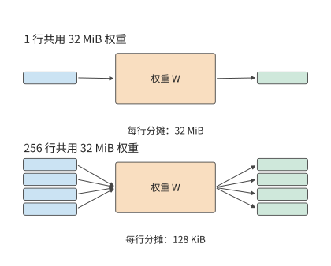

*图 4-1　两种调用都使用同一份 32 MiB 权重。上方是一行输入，下方以部分条带示意 256 行；每行分摊的权重读取从 32 MiB 减至 128 KiB。*

行数增至原来的 256 倍，运算次数也增至 256 倍，访问量却只增加约八分之一。权重复用使计算量增长快于访问量，算术强度随之提高。[^projection]

将算术强度的分子、分母同除以 $M$，可以进一步求出复用的极限：

$$
I(M)=\frac{2KN}{2KN/M+2(K+N)}.
$$

随着 $M$ 增长，每行分摊的权重项 $2KN/M$ 不断缩小，输入输出项保持不变。对本例，$I(M)$ 最终趋近 2,048 FLOPs/byte。因此，继续增大 batch 的收益会逐渐减小：每行分摊的权重读取量虽然越来越少，但新增 token 的输入和输出仍然需要读写。

上述计算假定权重只读一次；要在硬件上做到这一点，就需要在使用期间保存操作数和中间结果。

### 4.1.2 加速器的组成与分工

主机（host）通常是运行框架、准备输入并发起任务的 CPU 一侧，加速器负责执行模型计算；在主机—设备（host–device）的编程接口中，加速器一侧通常称为设备。对有独立显存的 GPU，主机内存和显存是两处存储。运行投影前，输入与权重先放到加速器可访问的位置；CPU 随后提交命令，给出算子、数据地址与执行参数。数据已经驻留时，后续调用可以反复引用同一地址。

图 4-2 展示了加速器内部各部分如何协作完成一次矩阵乘法。片外内存保存较大的输入和权重；共享缓存是由多组计算单元共同访问、自动保留近期数据的存储；局部缓冲是分配给当前计算组暂存输入的存储；矩阵单元反复更新部分和；累加存储把部分和留到本块计算结束。向量与通用计算单元负责结果变换、地址计算和流程控制等工作。

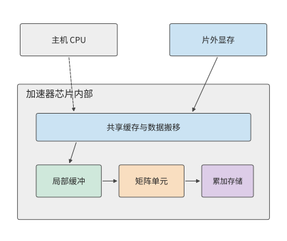

*图 4-2　主机、显存与芯片内部的关系。实线表示数据经过缓存、局部缓冲、矩阵单元和累加存储，虚线表示主机提交工作。图按硬件功能分组。*

计算一个输出块时，需要沿 K 维依次读入多块输入和权重。每完成一次乘加，部分和仍留在累加存储中，下一块继续更新它。如果每次更新都写回片外，中间结果就要反复写出、读入；把部分和留在片上，这些访问就只剩最后一次写回。数据重复使用的次数越多，留在片上就越有价值。

NVIDIA 把一组可协作执行的线程、通用计算单元、矩阵单元与局部存储组织为流式多处理器（Streaming Multiprocessor，SM），其中矩阵乘加单元称为 Tensor Core。SM 内由线程协作使用、由软件管理的缓冲称为共享内存（shared memory）。线程是程序中分别执行指令的工作单位；一次提交到加速器上运行的函数称为 kernel（内核），一个 kernel 可以由许多线程协作执行。昇腾 DaVinci 架构中的 Scalar、Vector、Cube 和 MTE 则分别指控制单元、向量计算单元、矩阵计算单元与数据搬移单元。Apple 的 Metal 是提交 GPU 工作的编程接口，用线程组组织能够共享局部存储并同步的线程。虽然名称不同，这些部件都要解决几个共同问题：操作数如何到达执行单元，结果如何保存，下一项工作何时可以开始。[^architecture]

沿图 4-2 中的箭头可以区分两种等待。一种是数据尚未到达，例如输入块仍在传输；另一种是前一项计算尚未结束，例如 Softmax 正在等待查询与键的点积（QK）完成。增加带宽能够缩短第一类等待，改变分块或执行顺序能够改变第二类等待。后续各节将分别展开这两种机制。

这些部件各分到多少资源，并非一次确定。模型与芯片在一代代设计中相互影响。现有加速器的能力影响模型的状态大小、矩阵形状和通信方式，软件通过压缩、融合和并行提高执行效率；当某种负载长期占据较大比重，芯片设计者便会考虑为它增加专用能力。新一代芯片投入使用后，不同模型的运行成本又会随之改变。设计和制造都需要时间，所以硬件回应的是此前已经观察到、并且预计会延续的需求。第 4.6 节将沿三家架构的代际变化，具体展开图 4-3 中的每一段关系。

这种反馈已有公开的实例。DeepSeek V3 报告针对 H800 上的执行瓶颈，提出通信卸载、跨互联的一致操作、低精度累加和量化支持等硬件需求；其中，通信卸载源于部分 SM 被通信占用。[^feedback]

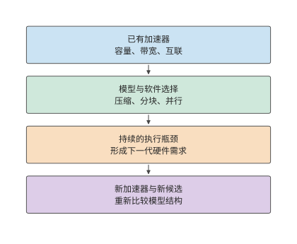

*图 4-3　模型与硬件跨代协同。实线沿时间向下：现有加速器影响模型选择，软件运行暴露长期瓶颈，硬件设计回应这些需求，新加速器使更多模型方案成为可能。*

### 4.1.3 芯片面积、功耗与封装的限制

计算单元、存储器和接口都占用芯片面积，也都消耗电能。分给某一部分的资源越多，留给其他部分的预算就越少。因此，评价一项局部改进，要看整个任务能缩短多少时间。

将开篇算例推广：以 $f$ 表示串行任务中可加速部分的时间比例，$s$ 表示其加速倍数，根据第 1.2.1 节的 Amdahl 定律，整体加速比为：

$$
S=\frac{1}{(1-f)+f/s}=\frac{1}{0.4+0.6/2}\approx1.43.
$$

继续把矩阵速度提高到原来的四倍，总时间降至 $60/4+40=55$ μs。第一次翻倍节省 30 μs，第二次只节省 15 μs；即使矩阵计算时间趋近于零，其余工作仍需 40 μs。整体加速上限为 2.5 倍。剩余工作在新总时间中所占比例越来越大，资源投入的重点也随之改变。

早期 TPU 的面积分配反映了计算与存储之间的实际取舍。TPU 是 Google 设计的张量处理器。第一代 TPU v1 具有 $256\times256$ 个 8-bit 乘加单元、24 MiB 的统一数据缓冲（Unified Buffer）和 4 MiB 累加存储。TPU v1 论文给出的芯片面积分布中，数据缓冲约占 37%，计算单元约占 30%，控制电路约占 2%。缓冲占用的面积甚至超过计算单元，因为阵列需要反复使用输入、权重和部分和。如果每次都从片外读取，乘加器就会长时间等待数据。[^tpu]

假设为了增加乘加器，设计者缩小了缓冲容量。原来能留在缓冲中的输入块被提前移除，下次使用时要再次加载；重复读取增加的时间，可能抵消新增乘加器带来的收益。反过来，为极少重复使用的数据配置过大的缓冲，也会占用本可用于计算的面积。比较设计方案时，要计算同一任务在改动前后的总时间，把计算加快与重复读取增加的影响一起考虑。

> **思考：继续增加矩阵算力，还是加速其余工作？** 在上述 60 μs 加 40 μs 的任务中，以原始矩阵运算速度为基准，把加速比从两倍提高到四倍，和把其余工作从 40 μs 降到 25 μs，哪种改动节省的时间更多？如果两者面积代价不同，应怎样选择？

面积之外，功耗是另一项预算；芯片越大、卡越多，功耗越容易成为决定性的约束。下面用四个推导把功耗变成可以计算的量：数据搬移为什么耗电，各级存储每搬一个字节耗多少能量，一颗芯片能做多大、能接多少内存，以及功率上限如何压低实际运行的频率。

**搬移为什么耗电。** 搬移数据的能耗来自给连线充放电。数字电路的功耗分为静态与动态两部分：静态功耗是与翻转无关的漏电，动态功耗产生于信号在 0 与 1 之间的翻转。据何庭波的 LogicFolding 论文，智能手机典型负载中动态功耗约占九成。[^logicfolding] 一条信号线连同其驱动的门可以看成一个电容 $C$，从 0 充到电压 $V$，电源要提供 $CV^2$ 的能量。设每个时钟周期中发生翻转的信号所占比例为 $\alpha$、时钟频率为 $f$（这里的 $f$ 是频率，不是前文 Amdahl 定律中的比例），动态功耗为

$$
P_{\mathrm{dyn}}\approx\alpha CV^2f.
$$

在先进工艺下，$C$ 的主要部分不是晶体管的栅极，而是连线：金属线的电容沿长度分布，信号走得越远，要充放电的电容就越大。图 4-4 上半部分画出这一机制：同一个门驱动一条数百微米的横向连线，要给沿途全部分布电容充电；把电路折叠到上下两层后，原来的横向路径变成几微米的垂直连接。论文报告折叠后典型核心的连线长度缩短 20%，部分关键路径缩短 70%，一个处理模块的时钟缓冲器从 43,600 个减到 19,000 个。

论文中的两个例子可以用这条公式直接手算。第一个是 NPU 的同性能比较：同样完成 29 TOPS（每秒 29 万亿次运算）时，折叠后的 NPU 把电压从 0.85 V 降到 0.55 V。只看电压项，

$$
\frac{P_{\mathrm{after}}}{P_{\mathrm{before}}}=\left(\frac{0.55}{0.85}\right)^2=\frac{121}{289}\approx0.42.
$$

只看频率项，频率降低 63%，$f$ 变为原来的 0.37。电压项与频率项相乘得 $0.42\times0.37\approx0.16$，远低于论文报告的总功耗比 0.34（下降 66%）。差距来自并行度：前代 NPU 是一个大核心加两个小核心，折叠后是四个大核心（论文 §V），靠更多并行核心在低频下完成同样的 29 TOPS。核心增多，每周期翻转的电容 $\alpha C$ 随之增加，抵消了连线缩短带来的 $C$ 减少。电压、频率与并行度三项合起来才得到 0.34，其中电压项贡献最大，这也是论文认为降压的贡献大于连线缩短的原因。

第二个例子是 DSP（数字信号处理器）：第一代折叠让功耗降到原来的 0.75，投影面积（芯片在平面上占的面积）降到 0.60，于是单位面积的功耗，即功率密度，变为

$$
\frac{0.75}{0.60}=1.25,
$$

比原来高 25%，与论文报告的 24% 一致。热量要从芯片面积上散出去，所以总功耗下降，散热压力未必减小。图 4-4 下半部分并列展示这两个例子的数字。

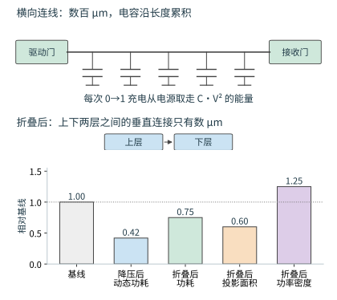

*图 4-4　上：同一驱动门经数百微米横向连线传送信号，要给沿线分布电容充电；折叠后改为数微米的垂直连接。下：电压从 0.85 V 降到 0.55 V 使动态功耗降到 0.42；功耗降到 0.75 而投影面积降到 0.60，功率密度反而升到 1.25。*

翻转条件（使结论反过来的临界条件）：只有面积比不小于功耗比时，功率密度才不上升；本例面积比 0.60 小于功耗比 0.75，功率密度上升。

**能耗层次：每搬一个字节要花多少能量。** 能耗取决于要充放电的电容，电容又随距离增长，所以同一个字节从远近不同的存储层次取来，能耗相差悬殊。下表列出各级存储与链路每字节的能耗：SRAM（静态随机存取存储器）做在芯片上，HBM 与 LPDDR（低功耗 DRAM）都是片外的 DRAM（动态随机存取存储器），NVLink-C2C 是 Grace Hopper 超级芯片中连接 CPU 与 GPU 的芯片间链路。单位 pJ 即皮焦耳（$10^{-12}$ J）。数值来自四份资料，表中一并列出各自的工艺与年份。[^energy-table]

| 层次 | 来源数值 | 每 byte 能耗 | 工艺与年份 |
| --- | ---: | ---: | --- |
| KB 级局部 SRAM | 5 pJ／32 位字 | 1.25 pJ | 45 nm，Horowitz ISSCC 2014，Dally Hot Chips 2023 转引 |
| MB 级片上 SRAM | 50 pJ／32 位字 | 12.5 pJ | Dally Hot Chips 2023 第 52 页，工艺未注明 |
| NVLink-C2C 链路 | 1.3 pJ/bit | 10.4 pJ | Grace Hopper 超级芯片，NVIDIA 2022 年 11 月技术博客 |
| HBM2 | 3.97 pJ/bit | 31.76 pJ | 28 nm DRAM 能耗模型，MICRO 2017 |
| LPDDR DRAM | 640 pJ／32 位字 | 160 pJ | 45 nm，Horowitz ISSCC 2014 |
| 16 位浮点乘加（2 FLOPs） | 1.5 pJ／次 | 0.75 pJ/FLOP | 45 nm，Dally Hot Chips 2023 |

HBM2 每 bit 的能耗大部分消耗在 DRAM 内部，而非通往 GPU 的连线上。die（裸片）是从晶圆上切下的一块硅片。按 MICRO 2017 论文的分解，DRAM die 内部从存储阵列到基底 die（HBM 堆最底层的 die）的数据通路占 2.24 pJ/bit，行激活（打开存储阵列中的一行）占 1.21 pJ/bit，经中介层（interposer，承载芯片之间连线的一块硅片）送到 GPU 的 I/O 只占 0.3 pJ/bit。三项合计 3.75 pJ/bit，计入 ECC（纠错码）等开销后为 3.92 pJ/bit；该论文正文给出的总数是表中的 3.97 pJ/bit。NVLink-C2C 的 1.3 pJ/bit 则只计链路本身，经它取来的数据还要先从对侧内存读出。

把这张表用到第 4.8.3 节的生成任务上：Qwen3-8B、BF16、单请求、8K 上下文，一步 decode 读取权重 15.137 GB、KV 1.208 GB，合计 16.345 GB，矩阵运算量为 19.97 GFLOPs。按表中 HBM 行与乘加行计算，[^energy-ledger]

$$
E_{\mathrm{weights}}=15.137\times10^9\times31.76\ \mathrm{pJ}\approx0.481\ \mathrm{J},\quad
E_{\mathrm{KV}}\approx0.038\ \mathrm{J},\quad
E_{\mathrm{compute}}=19.97\times10^9\times0.75\ \mathrm{pJ}\approx0.015\ \mathrm{J},
$$

合计 0.534 J，其中权重读取占 90%：单请求 decode 的能量几乎全部消耗在搬移上。HBM 行取自 28 nm 工艺的 HBM2 能耗模型，计算行取自 45 nm 逻辑工艺的乘加能耗，两行工艺不同，所以这笔账给出的是搬移与计算两类能量的量级比较。这一步的时间则受带宽限制：按 3.35 TB/s 读完这 16.345 GB 需要 4.9 ms，0.534 J 平摊到这段时间只有约 110 W。图 4-5 下半部分假设同样的 16.345 GB 全部来自某一层次：KB 级 SRAM 只需 0.020 J，MB 级 SRAM 0.204 J，NVLink-C2C 链路 0.170 J，HBM 0.519 J，LPDDR 则为 2.62 J。

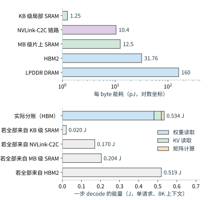

*图 4-5　上：各级存储与链路每 byte 能耗，对数坐标。下：Qwen3-8B 单请求 8K decode 一步的能量分账（权重 0.481 J、KV 0.038 J、计算 0.015 J），以及同样 16.345 GB 全部来自某一层次时的能量。*

带宽只决定一步多快，不改变一步耗多少能量：HBM 带宽提高一倍，这一步的时间减半，0.534 J 不变。降低能量只有两条途径：让字节从更近的层次取来，或者让同一份字节服务更多 token。batch 为 $B$ 时，权重读一次服务 $B$ 个 token，每 token 的能量为 $0.481/B+0.038+0.015$ J；$B=32$ 时约 0.068 J，是单请求的八分之一。因此，数据复用首先是能耗问题，其次才是带宽问题。第 4.8.1 节按时间求出的转折点由带宽与算力之比决定，这里的转折点由每字节能耗与每 FLOP 能耗之比决定，两者并不相同。

翻转条件：$0.481/B<0.015$，即 batch 超过 32 后，每 token 的权重搬移能耗才低于计算能耗。

**光罩与封装：一颗芯片能做多大，能接多少内存。** 光刻机一次曝光只能覆盖一块光罩（reticle，曝光用的掩模版）的图形范围，该面积称为光罩上限，单颗 die 不能超过它。H100 的 die 为 814 mm²，A100 为 826 mm²，两代都贴近这一上限；Blackwell 数据中心 GPU 的两颗 die 各自做到光罩上限，再用 10 TB/s 的 NV-HBI 链路连成一颗芯片。[^hbm-stack] 芯片分成两颗 die 后，计算放在哪一侧决定有多少访问要经过这条链路，第 4.5.1 节会具体计算。

HBM 把多层 DRAM die 叠在一颗基底 die 上，用硅通孔（TSV，穿过硅片的垂直导线）连接各层，整堆经中介层上的连线接到 GPU。每堆有 1,024 根数据引脚，引脚速率为 $r$ 时，每堆的带宽与容量为

$$
R_{\mathrm{stack}}=\frac{1024\,r}{8},\qquad C_{\mathrm{stack}}=\text{层数}\times\text{每层容量}.
$$

以 HBM3E 为例：Micron 的八层堆每堆 24 GB、十二层堆 36 GB；SK hynix 给出的引脚速率 9.6 Gbit/s 代入上式得 $1024\times9.6/8\approx1229$ GB/s，与其产品页的 1.23 TB/s 一致。图 4-6 画出这种封装：die 居中，HBM 堆沿 die 边缘排列，中介层承载两者之间的连线。用同样的公式反推三代 GPU 的 HBM 配置：

| GPU | 容量 | 带宽 | 堆数 | 每堆容量 | 每堆带宽 | 引脚速率 |
| --- | ---: | ---: | --- | ---: | ---: | ---: |
| H100 SXM5 | 80 GB | 3,350 GB/s | 5，白皮书给出 | 16 GB | 670 GB/s | 5.24 Gbit/s，白皮书给出 2619 MHz DDR（双倍数据速率，每个时钟周期传输两次） |
| H200 SXM | 141 GB | 4,800 GB/s | 6 堆共 144 GB，产品启用 141 GB | 24 GB | 800 GB/s | 6.25 Gbit/s，推算 |
| B200（HGX） | 180 GB | 8,000 GB/s | 8 堆共 192 GB，产品启用 180 GB | 24 GB | 1,000 GB/s | 7.81 Gbit/s，推算 |

表中各代的增长都可以拆到堆数、每堆容量和引脚速率上。H100 的 5 堆构成 5,120 位接口，5,120 位乘以 5.24 Gbit/s 再除以 8，约为 3,350 GB/s。H100 到 H200，容量增长 76%，来自每堆从 16 GB 换成 24 GB、堆数从 5 增到 6；带宽增长 43%，来自多出的一堆和引脚速率从 5.24 Gbit/s 提高到 6.25 Gbit/s。H200 到 B200 又增加两堆：H100 与 H200 都只有一颗 die，分别接 5 堆和 6 堆；B200 的 8 堆沿两颗光罩上限 die 的外侧排列（图 4-6）。堆数由 Blackwell 技术简报中 192 GB、7.7 TB/s 的配置按每堆 24 GB 推得；本书其余各节采用 HGX B200 平台每 GPU 180 GB、8 TB/s 的规格。

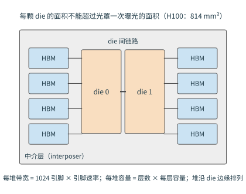

*图 4-6　封装俯视示意：两颗达到光罩上限的 die 居中，八堆 HBM 沿两侧边缘排列，中介层承载 die 与 HBM 之间以及 die 之间的连线。每堆带宽由 1,024 根引脚与引脚速率决定，每堆容量由层数与每层容量决定。*

翻转条件：所需堆数（目标容量除以每堆容量）超过一颗 die 所接的堆数时，要么增加每堆层数，要么增加 die；换成十二层 36 GB 的堆，六堆就有 216 GB，不必增加堆数。

**功率封顶：峰值算力为什么不能持续。** 热设计功耗（thermal design power，TDP）是模块允许的最大持续功率，H100 SXM 为 700 W，B200 为 1,000 W。[^tdp] 这份功率由内存与计算共用。以 H100 为例，按上表 HBM2 行的每字节能耗估算，HBM 满带宽的功率为 $3.35\ \mathrm{TB/s}\times31.76\ \mathrm{pJ/byte}\approx106$ W，扣除后留给计算的是 594 W；除以 BF16 稠密峰值 989.4 TFLOP/s，得到峰值速率下每 FLOP 的能量预算

$$
b=\frac{700\ \mathrm{W}-106\ \mathrm{W}}{989.4\ \mathrm{TFLOP/s}}\approx0.60\ \mathrm{pJ/FLOP}.
$$

0.60 pJ/FLOP 的预算只有靠矩阵指令与工艺进步才能满足，45 nm 的参考值说明了原因。一条标量半精度乘加指令（HFMA）做 2 FLOPs 耗 1.5 pJ，即 0.75 pJ/FLOP，本身已超过预算；取指、译码与取操作数另有约 30 pJ 的开销，是运算能量的 20 倍。一条 HMMA 矩阵乘加指令耗 110 pJ，完成的 FLOPs 远多于 2，同样的指令开销摊下来只占 22%。[^energy-table] H100 采用 TSMC 4N 工艺；从 45 nm 到 4N，每次翻转的电容与电压一代代降低。

设实际每 FLOP 能耗为 $e$。$e\le b$ 时，峰值频率可以持续；$e>b$ 时，功率控制器会降低频率，降到多少由 $P\propto fV^2$ 决定：电压不变时，功率随频率线性下降，持续频率为峰值的 $b/e$；电压随频率同步下降时，$P\propto f^3$，持续频率为峰值的 $(b/e)^{1/3}$。图 4-7 画出这两条曲线：$e$ 为预算的 1.5 倍时，前者降到 0.67，后者只降到 0.87。持续算力随频率等比例下降，所以按峰值算力预测的计算时间比实际短。峰值算力是硬件的物理极限，却不是在任何条件下都能达到：功率封顶时，极限本身随持续频率一起下移，此时衡量利用率应当以持续算力为分母。

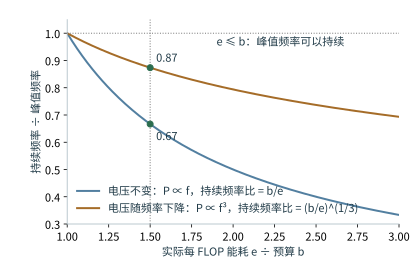

*图 4-7　持续频率与峰值频率之比随每 FLOP 能耗 $e$ 与预算 $b$ 之比的变化：电压不变时为 $b/e$，电压随频率下降时为 $(b/e)^{1/3}$。$e/b$ 不超过 1 时峰值频率可以持续；$e/b$ 为 1.5 时两条曲线分别给出 0.67 与 0.87。*

翻转条件：每 FLOP 能耗低于 $(\mathrm{TDP}-P_{\mathrm{mem}})/F_{\mathrm{peak}}$ 时，峰值频率可以持续；其中 $P_{\mathrm{mem}}$ 是内存功率，$F_{\mathrm{peak}}$ 是峰值算力，本例这一阈值为 0.60 pJ/FLOP。工艺每前进一代，每 FLOP 能耗下降；TDP 也逐代抬高；两者共同决定这一条件何时满足。

## 4.2 计算单元

第 4.1 节用运算速率表示矩阵单元的性能。本节解释这一速率从何而来：一条指令处理多大的矩阵，为什么小矩阵难以充分利用计算单元，以及矩阵结果还要经过哪些向量与控制操作。

### 4.2.1 矩阵单元为什么适合神经网络

大矩阵要拆成许多小块计算，矩阵单元正是执行这些小块的硬件，其支持的矩阵指令形状有限，程序要把大任务组织成相应的小步；一张加速卡上的多个计算单元可以同时处理不同块。

计算一个 $m\times n$ 输出块时，同一行输入参与 $n$ 个输出元素的计算，同一列权重参与 $m$ 个输出元素的计算。矩阵单元让多个乘加单元共享这些操作数：数据在相邻计算单元间传递，部分和留在本地更新。一条指令描述整块工作，控制成本也由大量运算共同分摊。第 5 章将进一步说明，软件如何组织块大小和遍历顺序，让这些小步持续取得所需数据。

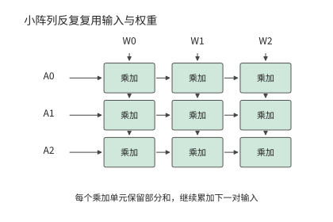

*图 4-8　三行三列的乘加阵列示意。输入沿行传递，权重沿列传递，每个乘加单元保留自己的部分和。这里用小阵列解释操作数复用。*

以一次 $16\times16\times16$ 的矩阵操作为例，两个输入块各有 256 个元素，完成 $2\times16^3=8192$ 次浮点操作。每个输入元素在块内参与 16 次乘法。与每个输出各自取一遍全部操作数相比，这种方式减少了重复搬移和指令开销。

矩阵指令通常按固定大小的块执行。设某种实现的最小计算块为 $m_t\times n_t\times k_t$，矩阵尺寸不足整块的部分用零补齐。有效运算占实际执行运算的比例为

$$
\eta_{\mathrm{shape}}=\frac{MNK}{\lceil M/m_t\rceil m_t\,\lceil N/n_t\rceil n_t\,\lceil K/k_t\rceil k_t}.
$$

若行方向最小为 16，真实矩阵只有一行，其余维度均对齐，则 16 行中只有一行包含有效输入。把矩阵单元数量翻倍，会同时加快有效计算和补零计算；改用适合单行的矩阵向量乘法（GEMV）实现，则可以减少补零造成的无用计算。库如何选择实现，见第 4.8 节的实测。

专家模型让行数问题更加突出。设 64 个 token 各选择八个专家，共有 512 次分派；各专家矩阵尺寸相同。如果分派恰好均匀覆盖 256 个专家，每个专家只处理两个 token 的特征向量；如果全部 token 选择同样的八个专家，每个专家处理 64 个 token 的特征向量。两种情况下，64 个原始 token 都产生 512 次专家分派，在各专家输入矩阵中合计占 512 个有效行。

继续使用行方向按 16 补齐的实现。前一种分派执行 $256\times16=4096$ 行，其中 512 行有效；后一种执行 $8\times64=512$ 行，全部有效。两种分派的有效计算量相同，补齐后前一种的执行量却是后一种的八倍。一批 token 选中了哪些专家，既决定需要读取哪些权重，也决定每个专家处理多少行，从而影响矩阵单元的利用率。

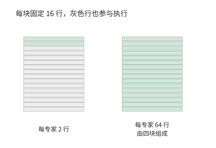

*图 4-9　一个专家的 16 行计算块。每专家只有两行时，剩余十四行填零；每专家有 64 行时，可组成四个完整块，图中展示其中一块。*

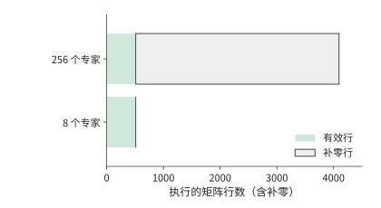

*图 4-10　相同 512 行有效输入在全部专家上的执行量。分散到 256 个专家后总计执行 4096 行，集中到八个专家时只执行 512 行。*

图 4-9 与图 4-10 中浅灰部分是补零带来的计算，增加乘加器也会加快这些无用操作。减少浅灰部分则要改变每个专家的输入行数或选择更小的计算块。

这解释了为什么库为不同形状准备多种 kernel：大矩阵利用阵列复用，小矩阵需要更合适的执行粒度，多个小任务还可以通过分组减少调度空隙。Tensor Core 与昇腾 Cube 专门执行规则矩阵运算，通用执行单元保留对其他形状的处理能力；两者配合处理实际负载中大小不同的矩阵。[^nvidia]

### 4.2.2 向量与控制单元负责哪些工作

除了矩阵乘法，Transformer 层还包含归一化、位置编码和激活函数；专家模型还要做路由。这些步骤包含逐元素运算，也包含多个元素之间的依赖。

以一行有 $n$ 个分数的 Softmax 为例，为保证数值稳定，先求最大值，再计算平移后的指数，最后求和并归一化：

$$
a=\max_j z_j,\qquad e_j=\exp(z_j-a),\qquad p_j=\frac{e_j}{\sum_k e_k}.
$$

$n=128$ 时，需要计算 128 个指数值，并对 128 个结果归一化；求最大值和求和则要分别合并 128 个输入。逐元素运算可以分配给多个计算单元并行执行；把多个元素合并为较少结果的操作称为归约，例如求和或求最大值；归约需要逐步合并各单元的结果。理想二叉归约经过 $\log_2 128=7$ 轮，每轮等待上一轮结果。增加并行计算单元可以缩短每一轮的处理时间，但各轮仍需依次进行。

向量单元承担这类逐元素和归约工作，特殊函数单元处理指数等操作，控制逻辑安排循环、地址、分支和同步。三者共同决定矩阵结果何时能交给后续计算使用。昇腾的 Cube、Vector、Scalar 命名直观地体现了这种分工；昇腾 950 白皮书中的一个 AI 子系统由一个 Cube Core 和两个 Vector Core 组成，向量部分采用以单指令多数据（SIMD，即一条指令对一组数据执行同样操作）为主、单指令多线程（SIMT，即把同一指令分派给一组各有执行状态的线程）为辅的执行方式。[^ascend]

Softmax 的分数随输入变化，需要每次重新求指数；另一些非矩阵运算使用的系数只随位置变化，可以预先计算并反复使用。RoPE 使用固定位置的正弦、余弦系数，对一对分量执行

$$
x'_0=x_0\cos\theta-x_1\sin\theta,\qquad x'_1=x_0\sin\theta+x_1\cos\theta.
$$

Qwen3-8B 一层的 32 个 Q 头和 8 个 K 头，每头旋转 128 维，共有 $(32+8)\times64=2560$ 对分量。每对需要四次乘法、两次加减，每个 token 共 15,360 FLOPs。各头在同一位置使用相同系数，因而可以共享一张表：为 1,024 个位置各保存 64 个 cos 和 64 个 sin，BF16 存储只需 $1024\times128\times2=256$ KiB。[^nonmatrix]

预计算把重复的三角函数求值转成系数读取，旋转本身仍按每个 token 执行。压力于是从特殊函数计算转到表访问与向量运算上。

### 4.2.3 NVIDIA、昇腾和 Apple 如何执行注意力计算

注意力把前两节的矩阵计算与向量计算连接起来：$Z=QK^{\mathsf T}$ 生成分数，$P=\operatorname{Softmax}(Z)$ 生成概率，$O=PV$ 形成输出。同一块数据必须依次经过这三步；多个块则可以在不同资源上交错推进。

| 工作 | NVIDIA GPU | 昇腾 | Apple GPU |
| --- | --- | --- | --- |
| 查询与键的点积 QK、概率与值的乘积 PV | Tensor Core；小矩阵可用通用计算单元 | 矩阵核 Cube（AIC） | Metal GPU 矩阵运算 |
| 指数、归约、缩放 | SM 的通用与特殊函数资源 | 向量核 Vector（AIV） | GPU 线程与相应库实现 |
| 中间状态 | 寄存器、共享内存、累加存储 | 计算单元近旁的零级缓冲（L0）、统一缓冲与交换通路 | GPU 缓冲与线程组存储 |

这一分工决定哪些操作可以同时执行。例如，一个块在处理指数时，矩阵单元可以处理另一个块；但双方若都要从同一个片上接口取操作数，该接口仍需依次提供全部字节。哪些单元能够并行工作、哪些操作共用同一接口，共同决定了流水线稳定运行时的吞吐率。表中的 Apple 路径指 Metal GPU。独立的神经网络加速单元 Neural Engine 与 GPU 内的专用单元在第 4.6.3 节分别介绍。[^apple]

FlashAttention 系列通过分块减少注意力中间结果的显存访问；第四版进一步研究更强矩阵单元下的计算分工。下面用 FlashAttention-4 对 NVIDIA Blackwell 架构 B200 单个 SM 的分析，计算这种分工对吞吐率的影响。取 $128\times128$、头维度为 128 的矩形注意力块，QK 与 PV 合计约 8.39 MFLOPs，指数结果有 16,384 个。按每个 SM 每周期 8,192 FLOPs 的矩阵速率和每周期 16 个结果的指数速率，两者各需 1,024 周期。矩阵操作数的共享内存读取为 96 KiB，按每周期 128 bytes，需要 768 周期。[^fa4]

连续处理多个块时，矩阵单元、共享内存接口和指数单元可以构成流水线；处理每个块时，三者分别占用 1,024、768 和 1,024 周期。若新块到达的速度超过其中任一单元的处理速度，等待队列就会不断增长。因此，在流水线稳定运行后，相邻两块完成的时间间隔至少为

$$
\tau\ge\max(T_{\mathrm{matrix}},T_{\mathrm{smem}},T_{\mathrm{exp}}).
$$

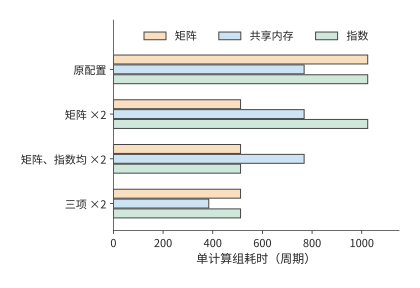

*图 4-11　同一注意力块在四种资源配置下的服务周期。矩阵、共享内存和指数三项分别比较，单独增加一种能力后，其他资源可能成为较长的一项。“×2”表示相应资源的吞吐能力提高一倍，横轴为完成同一计算块所需的时钟周期数。*

> **例 4-1：注意力流水的吞吐为何受指数运算与共享内存限制？**
>
> **提高矩阵与指数吞吐率后，流水吞吐率能提高多少？** 多个块在独立资源间形成流水。比较两种配置：仅将矩阵吞吐率翻倍；在此基础上再将指数吞吐率翻倍。对每种配置，流水线稳定运行时，相邻两个块最短隔多久完成？
>
> **由最慢单元确定相邻数据块的完成间隔。** 原配置为 $\max(1024,768,1024)=1024$ 周期。只提高矩阵能力，得到 $\max(512,768,1024)=1024$ 周期；再提高指数能力，得到 $\max(512,768,512)=768$ 周期。
>
> **矩阵加速后，瓶颈向指数运算与共享内存转移。** 第一项改动使矩阵单元更早完成，但指数运算的吞吐率保持不变，所以完成时间间隔的下界不变。第二项改动消除了指数的限制，共享内存成为耗时最长的单元，对应的理想吞吐提高到原来的 $1024/768=4/3$ 倍。
>
> **共享内存带宽翻倍后，瓶颈转移到哪些单元？** 若共享内存带宽也翻倍，三项变为 512、384、512 周期，下界才降到 512。新的均衡点由矩阵与指数共同决定。

提高一种资源的处理能力，可以减少等待，直到另一种资源成为瓶颈。对单个块，QK、Softmax、PV 仍有先后关系；要达到上述完成时间间隔，需要同时保存不同进度的多个块。第 4.4 节将一并计算所需缓冲与时序。

> **实验 4-1 · 核心：注意力分块如何改变运算量与共享内存读取量**
>
> 将矩形块改为 $128\times256$ 和 $256\times128$，分别计算矩阵运算、指数运算和共享内存读取所需的时间。再逐项提高矩阵运算吞吐率、指数运算吞吐率和共享内存带宽，说明采用的提升幅度，并找出每次改动后耗时最长的一项。解释块形状怎样改变数据复用。最后选一种硬件，将三类工作与存储位置标在执行图上。

### 4.2.4 低精度如何改变计算量、数据量与转换开销

矩阵形状决定做多少乘加，数值格式决定每次乘加使用什么表示。分析低精度需要依次回答三个问题：数据占多少空间，执行时经过哪些变换，误差要求允许采用哪些变换。

先看表示。若 $n$ 个权重各存 $b$ bit，每 $g$ 个值共享一个 $s$ bytes 的 scale，总元素数恰好能被分组大小整除时，存储量为

$$
V_W=\frac{nb}{8}+\frac{n}{g}s.
$$

对第 4.1.1 节的 $4096\times4096$ 权重，每个值用 4 bit 保存，每 32 个值共用一个占一字节的 scale：权重数据为 8 MiB，scale 为 0.5 MiB，共 8.5 MiB，约为 BF16 所需 32 MiB 的 1/3.8。若每 16 个值共用一个 scale，总量增为 9 MiB。分组越细，scale 越容易适应该组数值的范围，但需要保存的 scale 也越多。

再看执行。压缩值 $q$ 与 scale $a$ 一起表示近似值 $\hat w=aq$。可以先展开成 BF16 再做矩阵乘法，也可以让低精度矩阵指令处理 $q$，随后按 scale 调整结果。图 4-12 并列展示这两种实现：前者先花时间展开权重，并保存高精度副本，后者把缩放和合并放进执行过程。

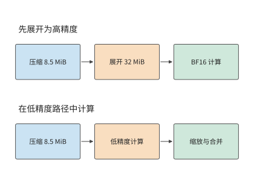

*图 4-12　相同压缩权重的两条计算路径。先展开会形成 32 MiB 的 BF16 副本；低精度路径在计算过程中完成缩放和合并。压缩权重及 scale 共 8.5 MiB。*

FP4、FP8 与八位整数格式 INT8 已进入实际模型的 kernel：DeepSeek V4-Flash 的一种路由专家实现先将 FP4 权重转换为 FP8，再执行 GEMM。权重以 FP4 保存和读取，减少了传输字节数；转换后，矩阵单元按 FP8 格式计算。若展开后的权重需多次使用，一次转换的时间就能分摊到多次调用；若每次调用都重新展开，转换时间就成为每次任务的固定部分。低精度能节省多少时间，取决于节省的读取时间与增加的转换时间之差。[^precision]

配套实验同时测量误差与执行开销，选用 Qwen3-VL-30B-A3B 的一个 $2048\times1536$ 专家矩阵，比较两种方法：直接用 INT8 分块计算，以及先展开为 BF16、再完成一次矩阵乘法。实验在 RTX PRO 6000 上运行，输入来自实际专家路由。向量的 L2 范数是各元素平方和的平方根；用输出误差的 L2 范数除以参考输出的 L2 范数衡量局部相对误差，门槛设为 2%。逐行激活缩放的误差约为 2.3%—3.5%；将激活沿 K 维每 128 个元素分别缩放后，误差降为约 1.5%—1.9%。[^quant-exp]

更细的量化分组改变了点积的累加方式。对一行输入和一列权重，设激活每组 scale 为 $a_g$，权重列 scale 为 $b_j$，点积可以写成

$$
y_j\approx\sum_{g=1}^{16}a_gb_j\left(\sum_{k\in g}q_{x,k}q_{w,kj}\right).
$$

由于每组的 $a_g$ 不同，计算时先求各组的整数部分和，再分别乘 scale，最后将结果相加。因此，这种实现需要调用 16 次矩阵乘法，并在调用之间完成转换、缩放和合并。输入行数较少时，还要补齐到 kernel 要求的最小行数。另一种方法先将各组展开为 BF16，再通过一次 GEMM 完成整个 K 维的累加。

以真实单 token decode 输入为例，两种方法的总执行时间分别约为 2.81 ms 和 2.52 ms，先展开再计算的方法较快。显存占用则正好相反：内存分配器在后续调用中记录的显存占用峰值分别约为 11.4 MiB 和 35.2 MiB，直接计算的方法节省约三分之二。[^workspace] 更细的量化分组降低了误差，分组调用增加了时间，省去高精度副本减少了显存占用；数值格式与计算方法由此共同决定了误差、执行时间和显存占用。

因此，改进这种实现的方向是把组内计算、缩放和累加融合起来，在降低量化误差的同时减少 kernel 启动开销。

> **实验 4-2 · 延伸：量化权重何时展开，才能减少重复执行成本**
>
> 从上述分组点积式出发，比较先展开权重再计算与直接分组计算两种方法，分别列出需要保存的数据，包括权重、scale、展开后的权重副本、部分和与输出。计算加载时展开一次、每次调用展开、直接分组计算三种策略在重复使用 $R$ 次后的总时间。再用实际输入的实验记录比较误差与显存占用峰值，解释何时值得多占用内存来保存展开后的权重，以减少重复展开的开销。

## 4.3 存储层次

第 4.2.4 节说明了数值格式如何改变数据大小。本节分析 Q 投影的数据读写，区分三个问题：这些数据能否放下，重复使用时从哪一级读取，独立访问是否足以维持目标带宽。

### 4.3.1 显存与统一内存

模型运行时，权重、KV 缓存与临时工作区同时占用内存。权重占用相对固定，KV 随请求数和上下文长度增长，工作区保存执行中的中间结果。先确定这三项，才能决定加速器能否再接收一个请求。

Qwen3-8B 的 BF16 权重约占 16.4 GB。模型有 36 层，每层有 8 个 KV 头，每头 128 维；K 和 V 各保存一份，每个元素两字节。因此，每个上下文 token 的 KV 占用为

$$
m_{\mathrm{KV}}=36\times2\times8\times128\times2=147\,456\ \mathrm{bytes}=144\ \mathrm{KiB}.
$$

每条请求保留 $S$ 个位置、同时服务 $B$ 条请求时，容量条件为

$$
W_{\mathrm{resident}}+BSm_{\mathrm{KV}}+M_{\mathrm{workspace}}\le C_{\mathrm{available}}.
$$

按 $B$ 求解，就得到固定长度下的最大请求数：

$$
B_{\max}=\left\lfloor\frac{C_{\mathrm{available}}-W_{\mathrm{resident}}-M_{\mathrm{workspace}}}{Sm_{\mathrm{KV}}}\right\rfloor.
$$

以 RTX 4090 的 24 GB 显存为可用容量，留 2 GiB 工作区。扣除权重后，约 5.47 GB 用于 KV。$S=8192$ 时每条请求需要 1.125 GiB，约 1.21 GB，四条请求的 KV 共约 4.83 GB，可以容纳；增加到五条后，共需约 6.04 GB，超过剩余容量。上下文翻倍后，每条请求 KV 翻倍，最大请求数降为两条。[^capacity]

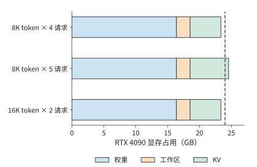

*图 4-13　RTX 4090 的 24 GB 显存中的权重、工作区和 KV。8K 四请求与 16K 两请求可以容纳，8K 五请求超过虚线标出的容量上限。*

图 4-13 中，权重与工作区的宽度保持不变，变化发生在右侧的 KV 区域。长上下文让每个 KV 块变宽，增加并发则增加块数；二者争用同一份剩余空间。

最大请求数的取整公式揭示了容量的阶梯效应。增加少量内存时，$B_{\max}$ 可能保持不变；只有剩余空间足以容纳一条新请求的全部 KV，才能多接收一条请求。压缩权重会增大公式分子中的剩余空间，因此也能容纳更多请求。对权重较大的模型，减少固定占用可明显提高并发；对长上下文任务，KV 已占较大比例，继续压缩权重的收益会逐渐减小。

降低 KV 位宽也能释放容量。第 2 章的 DeepSeek V4.1-Flash 同时使用全局历史与 SWA 局部窗口。一条主 KV 记录的 512 个值采用 FP4，连同分组 scale 共占 288 bytes；局部窗口的一条记录采用 FP8，连同 scale 共占 528 bytes。主 KV 在参与注意力乘法前反量化，即利用 scale 恢复为计算所用的数值格式。存储格式压缩了常驻状态，执行时再恢复操作数。[^v41-case]

以上只计了推理时的状态。训练还使用梯度、优化器状态和为反向传播保存的激活。按照第 3 章介绍的张量生命周期计算这些状态的占用：在某一时刻仍需保存的所有张量共同决定内存占用峰值，已经释放的中间结果腾出空间给后续工作。容量规划因而既与每份张量大小有关，也与执行顺序有关。

显存容量最终由内存器件与接口提供。HBM 通过堆叠存储 die 和宽接口提供带宽；图形双倍数据速率内存（GDDR）通常以多颗存储芯片配合高速接口提供显存。两者都是内存器件与接口技术，而统一内存是处理器共享内存的组织方式。Apple 的 CPU 与 GPU 访问共享物理内存，两者可以先后使用同一个缓冲区，减少独立副本；相应地，CPU、GPU 与其他应用也共同消耗这份容量与带宽。[^apple] 第 4.5 节会沿主机到加速器的路径分析这种组织对传输时间的影响。

> **思考：KV 压缩后能否再接纳一条请求？** 若每条请求 KV 需求从 1.21 GB 降低 10%，RTX 4090 能否容纳第五条请求？先求五条请求的总需求，再比较剩余空间。

### 4.3.2 缓存、片上缓冲与寄存器

算一块输出时，输入中的同一个数往往还要参与邻近输出的计算，尚未算完的部分和也要继续累加。如果每做一次乘加都回到片外取数、写回结果，就会产生大量往返。把常用数据留在计算单元附近，如同把当前要用的材料放在手边的工作台上，可以减少这些搬移；但近处的空间有限。

寄存器保存线程与指令正在使用的值，缓存自动保留最近访问的数据，软件管理的缓冲则由程序明确安排加载和释放。三者都能保存反复使用的数据，但容量、访问方式与管理者各不相同。片上存储还要占用芯片面积，容量通常比片外内存小得多。下面跟踪两块输入和一块部分和，计算所需空间。

考虑 $m=n=128,k=64$ 的乘加块。BF16 输入与权重块各为 16 KiB，合计 32 KiB；FP32 输出累加器为 $128\times128\times4=64$ KiB。V100 每个 SM 最多可把 96 KB（即 96 KiB）配置为共享内存，若操作数与累加器都放在其中，恰好用满。[^volta-evolution] 要同时准备下一对操作数，便需要 $2\times32+64=128$ KiB。

若累加器使用独立存储，同样的 96 KiB 就能容纳三组配对的输入块与权重块。局部缓冲的总容量没有增大，但存储分工改变了可以提前准备的输入块数。第 4.6.1 节将用 Blackwell 的专用累加存储说明这种分工。

前例把计算块的部分和留在片上，省去了反复写回。同样的思路也适用于多个计算块共同使用的输入。设四个输出块都要读取同一份 32 KiB 输入，它们共发出 128 KiB 的逻辑请求。L2 是计算单元之间共享的二级缓存。若第一次读取把数据留在 L2，后面三次命中，则片外只需提供 32 KiB，但 L2 仍要向各块提供全部 128 KiB。若四个输出块由同一计算组顺序处理，并将输入留在局部缓冲，后续访问就可以直接从局部缓冲取得数据。

因此，分析同一份数据时，需要区分三个量：数据本身占用的空间、各计算块请求读取的字节数、某一级接口实际传输的字节数。算术强度也随观察层次变化。用 L2 请求量计算的强度要与 L2 带宽一起使用，用 DRAM 流量计算的强度则与片外带宽一起使用。第 4.8 节将用实际计数展示这种差别。

增大计算块通常能增加数据复用，但也需要更大的缓冲。RTX 5090 与 RTX PRO 6000 采用 SM120 架构，每个 SM 的一级数据缓存与共享内存合计 128 KB，其中最多 100 KB 可配置为共享内存，由驻留在该 SM 上的计算组共用：每个计算组需要 32 KiB 时，可以驻留三组；每组扩到 64 KiB 后，只能驻留一组。[^blackwell-evolution] 一组等待数据时，另一组可以继续计算。因此，同时运行的组数减少后，计算单元更容易闲置。选择块大小时，要同时考虑每组能减少多少重复读取，以及还能容纳多少组相互独立的计算。

片上缓冲容量也随代际增加。A100 每个 SM 的共享内存容量上限为 164 KB，H100 为 228 KB。[^evolution] 更多计算组驻留在片上，也能发出更多相互独立的读取请求。

### 4.3.3 容量、带宽与延迟分别限制什么

容量是某一时刻能够容纳多少数据，带宽是单位时间传输多少数据，延迟是一次请求从发出到完成经过多久。同时发出足够多的独立请求，则可以在等待一次访问返回时继续处理其他访问。

模型驻留和逐步执行对内存提出的要求不同。按第 4.1.3 节的 HBM 配置表，H100 SXM 为 80 GB、3.35 TB/s，H200 SXM 为 141 GB、4.8 TB/s，容量与带宽的增幅并不相同。Qwen3-235B-A22B 的一组 4-bit 方案中，权重与 scale 约为 123.1 GB，八条请求各保留 8,192 个 token 的 KV 约为 12.6 GB，加 2 GiB 工作区，共约 137.9 GB。H100 的容量缺口接近 58 GB，H200 则有约 3.1 GB 余量。容量增加，首先是让这些数据能够同时驻留。[^storage]

全部专家的权重都保存在内存中，而每步需要读取哪些权重由路由结果决定。八条请求的专家选择分散时，权重、scale 与 KV 的每步访问约为 75.967 GB；集中选择相同专家时，降至约 24.737 GB。在 H200 上，仅传输这些字节分别需要约 15.8 ms 和 5.2 ms；改用 8 TB/s 的 HGX B200，分别为约 9.5 ms 和 3.1 ms。专家复用把流量减少到约三分之一，加速器升级则把传输一个字节所需的时间减少到原来的约六成，两种改动作用在公式 $T=V/R$ 的不同位置。

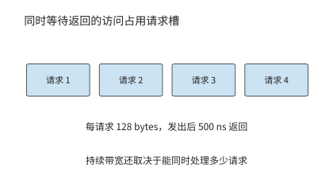

*图 4-14　读取请求从发出到返回一直占用请求记录空间。多个独立请求交叠，才能在单次访问等待期间持续利用接口；图中只画四个代表请求。*

上述 $V/R$ 计算假定接口可以持续达到给定带宽。要维持这种速度，就必须在一次访问等待返回时继续发出其他请求。将内存接口一次传输的基本单位称为访存事务。设接口中最多同时有 $N_o$ 个在途事务，每个事务带回 $s$ bytes，平均完成延迟为 $L$。一个事务从发出到返回期间占用一个位置；每秒最多完成约 $N_o/L$ 个事务，于是

$$
R_{\mathrm{effective}}\le\min\left(R_{\mathrm{interface}},\frac{N_os}{L}\right).
$$

把式子按 $N_o$ 求解，维持目标吞吐需要

$$
N_o\ge\left\lceil\frac{R_{\mathrm{target}}L}{s}\right\rceil.
$$

这就是 Little 定律：平均在途请求数等于请求完成速率乘以平均请求延迟。硬件队列决定能容纳多少在途事务，而程序中相互独立的访问决定能否用满队列。若下一地址依赖上一读取结果，队列即使很深也无法填满；多个独立计算块则能提供互不等待的读取。

> **例 4-2：换上带宽更高的显卡，KV 读取也会同比加快吗？**
>
> **比较在途事务数与接口带宽对 KV 读取的限制。** 读取一条请求的 8,192 个上下文 token 所对应的 KV，共 1.125 GiB。显存接口取 RTX 4090 的 1,008 GB/s，每事务 128 bytes，完成延迟取 500 ns：内存性能测量工具 Mess 在 H100 上测得的显存空载延迟为 363 ns，接近饱和带宽时升到 699—1,433 ns，500 ns 位于二者之间。[^mess] 分别计算最多允许 128 和 4,096 个在途事务时的有效读取带宽与耗时，再比较换成 RTX 5090 的 1,792 GB/s 后的结果。
>
> **由在途字节数和访问延迟求有效读取带宽。** 维持 1,008 GB/s 需要 $\lceil1.008\times10^{12}\times500\times10^{-9}/128\rceil=3938$ 个事务。128 个事务只能提供约 32.8 GB/s，读取时间至少为 36.9 ms；4,096 个事务足以维持 1,008 GB/s，时间降为约 1.20 ms。
>
> **在途事务不足时，更高的接口带宽收益有限。** 换成 RTX 5090 后，4,096 个事务仍只能支持约 $4096\times128/(500\ \mathrm{ns})=1.05$ TB/s，时间约为 1.15 ms。接口带宽提高了约 78%，吞吐率却受在途事务数限制，只提高约 4%。
>
> **用满更高带宽或应对更长延迟，需要多少在途事务？** 把在途事务数提高到至少 7,000 个，才能维持 1,792 GB/s；若延迟增至 800 ns，该要求又增至 11,200 个。[^window-rtx]

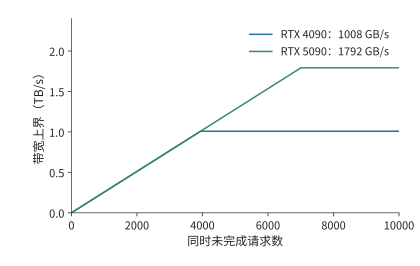

*图 4-15　每事务 128 bytes、返回延迟 500 ns 时，增加在途请求数会提高带宽上界，直到碰到 RTX 4090 或 RTX 5090 显存接口本身的速率上限。*

图 4-15 的两条曲线在并发较小时重合，是因为限制来自在途字节数。越过各自拐点以后，接口带宽成为新的瓶颈。实际系统中，增加并发访问还会使队列变长，延迟也随负载变化；Mess 用延迟探针与可调背景流量同时观察这两项，得到带宽—延迟曲线。[^mess] 这条曲线把“同时发起独立请求可以减少等待期间的空闲”与“请求过多会增加排队时间”放进同一张图中。

分析存储性能时，先根据容量判断数据能否驻留，再根据复用情况计算各级接口的流量，最后结合并发量和延迟判断接口能否持续传输。

> **实验 4-3 · 延伸：内存扩容与带宽提升分别能改善哪些 decode 瓶颈**
>
> 使用 Qwen3-8B 与 Qwen3-235B-A22B 的存储结果，分别只增加容量、只增加带宽，再改变 batch 和专家分布。先求最大可驻留请求数，再计算每步读取时间，最后求维持目标带宽需要的在途事务数。说明每种方案首先受容量、传输时间还是访存并发数限制。

## 4.4 数据搬移

第 4.1—4.3 节算出了数据的大小与复用次数，也解释了维持带宽所需的并发。本节进一步安排这些数据何时取得、何时使用、何时释放。数据搬移的核心，是让下一块在计算单元使用它之前到达，同时保留当前块直到最后一次使用结束。

### 4.4.1 数据布局与寻址

在矩阵上画出一个小方块，只确定了要取哪些元素。这些元素在内存里未必相邻：若原矩阵按行存放，小方块的一行读完后，还要越过未选中的元素，到原矩阵下一行的对应位置继续读取。数学上的分块可以只改变索引与访问范围，不必先复制出一份独立的小矩阵。硬件需要根据步长找到这些元素。一个元素占 $b$ bytes、行步长为 $s_r$ bytes、列步长为 $s_c$ bytes 的二维视图，元素地址为

$$
\operatorname{addr}(i,j)=\operatorname{base}+is_r+js_c.
$$

矩阵按行连续存储时 $s_c=b$，行步长由完整行宽决定。取子矩阵时，子矩阵每行只占原矩阵一行的一部分，但相邻行起点之间的距离仍等于原矩阵的行步长。这决定了硬件要发起何种访问。

例如，从 BF16、行宽 4,096 的矩阵中取 128 行、每行连续 128 个元素。有效数据为 $128\times128\times2=32$ KiB，每行只有 256 bytes，而相邻行起点相差 8,192 bytes。第一行起点到最后一行终点跨越 $127\times8192+256=1\,040\,640$ bytes。逐行读取只传输各行的有效区间；如果相邻线程访问相邻元素，它们的请求还可以合并成较少的事务。

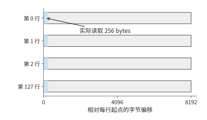

*图 4-16　每行前 256 bytes 是实际读取区间，相邻行起点相差 8192 bytes。128 行合计读取 32 KiB，行间灰色区域由步长跳过。*

蓝色区域每行只有 256 bytes，下一行的蓝色区域却要到 8,192 bytes 之后才开始。读取整个地址跨度会把灰色空隙也搬走，逐行读取则只取得蓝色部分。由此可见行步长的作用：它告诉搬移单元下一段有效数据从哪里开始。

数据布局从两方面影响访问开销：步长影响地址计算，地址的连续性影响多个访问能否合并为一次事务。相同的 32 KiB，有的排列能够用规则连续请求取得，有的排列要发出大量短请求。第 4.3 节中的每事务字节数 $s$，就取决于这些访问如何合并。

分块又决定同一地址会被请求多少次。DeepSeek V4-Flash 共享专家的一次 w1 计算为 $[32,4096]\times[4096,2048]$，FP8 输入只有 128 KiB。输出宽度分成 16 个、各 128 列的块，每个输出块都要遍历完整输入，所以块级输入请求合计为 $16\times128$ KiB，即 2 MiB。权重按输出列划分，各块读取自己的部分，权重数据合计为 8 MiB。[^coordinates]

输入大小仍是 128 KiB，多出的请求来自输出列方向的分块。若这些输出块共享缓存，重复请求可以直接从片上缓存取得数据；若同一个计算组保留输入并连续计算多个输出块，复用又可以移到局部缓冲。寻址、分块与存储层次在这里连接起来：分块方式决定发出哪些读取请求，数据所在的位置决定这些请求经过哪一级接口。

普通加载指令可以逐步计算地址并发起访问；专门的搬移单元则接收张量形状、步长和起点，重复生成这些地址。这组描述搬移任务的参数称为描述符。NVIDIA Hopper 架构（H100 所属架构）的张量内存加速器（TMA）和昇腾 950 的多维直接内存访问单元（NDDMA）都提供多维张量搬移能力。[^transfer] 对上述子矩阵，起点、128 行、每行 256 bytes、行步长 8,192 bytes 足以描述整次规则搬移。由专门单元负责这些重复的地址计算后，计算线程就可以继续处理其他工作。

### 4.4.2 异步搬移与双缓冲

找到并取出一块数据之后，还要让下一块及时到达：若总等当前块算完才开始读取，计算单元就会反复停顿。准备两个缓冲后，可以一边使用第一个缓冲中的数据，一边把下一块加载到第二个缓冲；当前块用完，两块缓冲交换角色。这就是双缓冲：以额外空间换取加载与计算在时间上的重叠。

设共有 $n$ 块数据，每块加载耗时 $t_l$、计算耗时 $t_c$。若取得一块、算完一块，再开始下一块，总时间为 $n(t_l+t_c)$。加载与计算使用独立资源时，采用双缓冲，第一块先加载、再计算，后续各块以较慢阶段的节奏完成：

$$
T_{\mathrm{pipe}}=t_l+t_c+(n-1)\max(t_l,t_c).
$$

八块数据每块加载 2 μs、计算 1 μs，串行需 24 μs，流水需 $2+1+7\times2=17$ μs。节省的 7 μs 来自重叠，传输字节和乘加次数都保持不变。再把计算加快一倍，总时间仅降到 16.5 μs，因为加载仍然每两微秒才能提供一块。

上述分析把加载看作一个完整阶段。下面将加载拆成传输与等待返回，计算多个请求同时进行时需要多少缓冲。这里用 tick 表示 B200 一个 SM 的时钟周期，并区分**发起间隔**与**完成延迟**：若每隔 64 tick 发出一次读取请求，而每块数据要在请求发出 192 tick 后才可使用，就会有多块同时等待返回。计算开始前，输入必须已经到达。把保存一个输入块的缓冲区称为一个输入槽：从发出读取请求，到该块计算结束，该槽一直被占用。增加槽位可以更早发起后续数据的读取，但也占用更多局部存储。

用注意力的 QK 计算具体推导。两个输入都是 $128\times128$，沿头维度切成四个 $k=32$ 的累加块。每块 Q/K 输入合计 16 KiB，计算量为 1,048,576 FLOPs，四次计算依次更新同一份 FP32 结果，结果保存在独立的 64 KiB 累加存储中。矩阵速率取 FlashAttention-4 论文给出的 B200 每个 SM 每周期 8,192 FLOPs；输入传输速率取 256 bytes/tick，传输结束后再等 128 tick 数据才可用。[^pipeline][^fa4]

于是每块输入传输耗时 64 tick，发起后 192 tick 就绪，计算再用 128 tick。

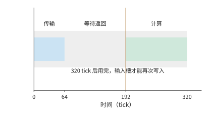

*图 4-17　一个输入槽从发起到释放的完整生命周期。传输 64 tick，额外等待 128 tick，数据在 192 tick 就绪，再计算 128 tick，于 320 tick 释放。一个 tick 为 B200 SM 的一个时钟周期。*

只有一个输入槽时，该槽经历加载、等待、计算，共 $64+128+128=320$ tick 后才能复用，四块在 1280 tick 结束。

图 4-18 至图 4-20 依次画出一槽、两槽和三槽的执行，并保持时间尺度一致。先沿绿色计算区间寻找空闲，再向上查看下一块输入何时就绪，就能判断等待从何而来。

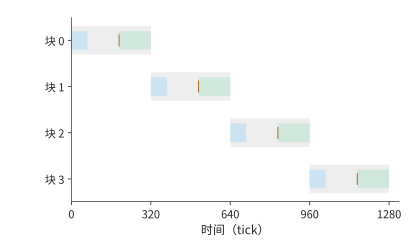

*图 4-18　一个输入槽的四块时序。蓝条为传输，橙线为就绪，绿条为计算，浅灰为槽占用；上一块用完后才能再次发起，完成时刻为 1280 tick。一个 tick 为 B200 SM 的一个时钟周期。*

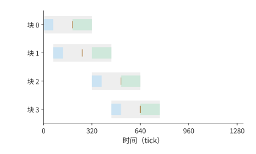

*图 4-19　两个输入槽使用相同时间尺度。前两块可提前发起，但第三块到 512 tick 才就绪，第二块在 448 tick 已结束，留下 64 tick 空闲。横轴一个 tick 为 B200 SM 的一个时钟周期；各行对应一个数据块，灰色表示输入槽占用，蓝色表示传输，绿色表示计算，竖标记表示数据就绪。*

两个槽允许在时刻 0 和 64 发出前两块的读取请求。第一块在 192 开始计算、320 结束，释放的槽用于第三块，第三块在 512 就绪；第二块在 448 已算完，因此中间留下 64 tick 空闲。继续按同样次序，第四块在 768 结束。第二个槽让一部分数据加载与计算重叠，但矩阵单元仍会在两块计算之间空闲。

要连续计算四块，最早完成时间是首块等待加四次计算，即

$$
T_{\min}=192+4\times128=704\ \mathrm{tick}.
$$

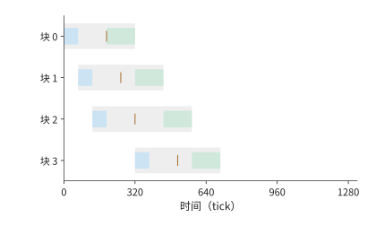

*图 4-20　三个输入槽提前发起前三块，第一槽释放后接收第四块。矩阵单元从 192 连续计算到 704 tick，第四槽不再缩短完成时间。横轴一个 tick 为 B200 SM 的一个时钟周期；各行对应一个数据块，灰色表示输入槽占用，蓝色表示传输，绿色表示计算，竖标记表示数据就绪。*

三个槽已足以实现这一时间。前三块的读取请求分别在时刻 0、64、128 发出，分别在 192、256、320 就绪；计算从 192 开始依次进行。第一块在 320 释放槽位，立即发出第四块的读取请求，第四块在 512 就绪，早于计划开始计算的时刻 576。矩阵单元因此从 192 到 704 tick 一直连续计算，中途没有空闲。[^pipeline-extra]

| 输入槽数 | 输入缓冲 | 完成时间 | 相对前一项节省 |
| --- | ---: | ---: | ---: |
| 1 | 16 KiB | 1280 tick | — |
| 2 | 32 KiB | 768 tick | 512 tick |
| 3 | 48 KiB | 704 tick | 64 tick |
| 4 | 64 KiB | 704 tick | 0 |

这一例子给出了一种寻找缓冲配置的方法：先用首块到达时间与连续计算时间求出目标，再逐个检查每块能否按时到达，最后寻找满足目标的最少槽位。第四个槽虽然让最后一块更早就绪，却没有让计算更早开始；提前取得的数据只是多等待了一段时间。

缓冲配置还随计算速度变化。矩阵速率翻倍后，每块计算只需 64 tick，连续计算的目标变为 $192+4\times64=448$ tick。只有三个槽时，第四块最早在 256 tick 发出读取请求，到 448 tick 才可使用，来不及在原计划的 384 tick 开始计算，完成时间为 512 tick；四个槽则能提前发出全部请求，达到 448 tick。矩阵计算加快以后，原来的加载安排已经来不及准备下一块数据，输入缓冲也需要重新配置。

有了异步搬移，计算线程发起加载后可以继续做其他工作，到要用数据时再等待完成事件。搬移单元向空槽写入数据，完成事件标记数据就绪；计算结束后再释放槽位。NVIDIA 的异步拷贝、昇腾 MTE／NDDMA 与 Metal 的任务依赖机制都用于安排这类交接。[^transfer]

> **思考：输入可用前的额外等待翻倍，三个缓冲槽是否够用？** 保持原来的传输和计算速率，将数据传输结束到输入可用的额外等待时间从 128 增至 256 tick。三个槽能否继续实现无间隙计算？分别写出第四块的就绪时刻与所需时刻。

### 4.4.3 单元间的数据传递

输入流水减少了矩阵单元等待数据的时间，但注意力还要把矩阵结果交给向量单元，再将概率送回矩阵单元。若完整保存一个 $128\times128$ FP32 分数矩阵，需要 64 KiB；矩阵单元写一次、向量单元读一次，经过同一存储接口的数据共 128 KiB。若矩阵单元直接把结果传给向量单元，就可以省去这次中间结果写回和重新读取。

向量计算何时开始，还取决于它需要哪些完整结果。普通逐行 Softmax 要先得到一行的全部分数，再求最大值和归一化分母。沿 QK 的内积维度计算一半时，每个分数都只是部分和；按查询行分组则可以先完成一组完整行，把它们交给 Softmax，其余行继续矩阵计算。分组方向因此决定向量单元能否提前开始计算。

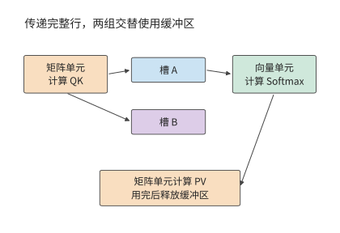

*图 4-21　矩阵与向量单元通过完整行组交接。QK 产生分数，Softmax 产生概率，PV 使用概率后释放槽；另一槽容纳相邻行组，使不同组可以重叠推进。*

将 128 行沿查询方向分成四组、每组 32 行，一组 FP32 分数和 BF16 概率共需 $32\times128\times(4+2)=24$ KiB。下面比较使用一个和两个缓冲区保存交接数据的方案；每个缓冲区从该组 QK 开始占用，到 PV 完成才释放。QK 与 PV 共用矩阵单元，Softmax 使用向量单元，两个方向共用交接接口。使用两个缓冲区时，不同组可以同时执行不同阶段的计算。[^handoff]

本算例在矩形分数块上执行 QK、Softmax 与 PV，按完整行组顺序调度已就绪工作。tick 仍为 B200 SM 的时钟周期，矩阵速率 8,192 FLOPs/tick、交接接口 128 bytes/tick、指数与除法每 tick 16 次，分别取 FlashAttention-4 论文给出的每 SM 矩阵速率、共享内存读取带宽和特殊函数单元速率[^fa4]；向量单元串行执行缩放、减法与求和、比较、指数和除法，普通运算及比较取每 tick 128 次。32 行一组时，QK 与 PV 各用 128 tick；Softmax 的普通运算、比较、指数、除法分别用 96、32、256、256 tick，合计 640 tick。直接交接 16 KiB 分数和 8 KiB 概率分别用 128、64 tick，先写后读的路径则分别用 256、128 tick。各步骤按整数 tick 向上取整。

| 交接方式 | 行组大小 | 槽数 | 向量计算开始时刻 | 完成时间 |
| --- | ---: | ---: | ---: | ---: |
| 写入存储后再读取 | 128 | 1 | 1536 tick | 5118 tick |
| 写入存储后再读取 | 32 | 1 | 384 tick | 5120 tick |
| 写入存储后再读取 | 32 | 2 | 384 tick | 3200 tick |
| 直接传递 | 32 | 2 | 256 tick | 3008 tick |
| 直接传递 | 32 | 4 | 256 tick | 3008 tick |

先只改分组。向量单元从 1536 提前到 384 tick 开始计算，但总时间仍约为 5120 tick。原因在于只有一个槽：这一组进入 Softmax 时，槽内结果仍要保留，下一组 QK 无处写入，只能等待前组 PV 结束。提前开始缩短了第一组的等待，却没有让相邻组重叠。

再增加第二个槽，下一组可以使用另一槽推进，总时间降到 3200 tick，减少约 38%。随后改为直接交接，减少每次交接经过存储接口的字节数，总时间进一步降至 3008 tick，节省约 6%。继续增加槽位没有改变耗时最长单元的工作节奏，完成时间保持不变。

分组提前产生完整结果，第二个槽使相邻组重叠，直接通路缩短交接时间。这三项改动分别改变依赖、可同时推进的组数和接口工作量；第 4.6.2 节将这三项改动对应到昇腾的架构演进。

> **实验 4-4 · 核心：维持连续计算需要多少片上缓冲**
>
> 分别画出输入流水使用一至四个缓冲槽时的时间线，根据数据到达、计算结束和缓冲区释放的时刻，确定维持连续计算所需的最少槽数；再将矩阵速率翻倍，解释最少槽数的变化。随后画出各查询行组经过 QK、Softmax 和 PV 的时间线，区分分组、增加槽位和直接传递各自省下的时间。最后在固定片上容量下，分析每组缓冲的大小如何限制能够同时驻留的组数。

## 4.5 多芯片封装与互联

单个加速器无法满足计算或存储需求时，可以把计算和存储分布到更多芯片。扩展增加了资源，也增加了生成数据与使用数据的单元之间的距离。本节沿封装内、主机与加速器、加速器之间三种连接，分析数据放置和传输粒度如何影响完成时间。

### 4.5.1 封装内的计算芯片、内存与连接

封装可以包含多颗 die，由这些 die 共同提供计算单元和内存接口。Blackwell 数据中心产品与昇腾 910C 都采用双 die 设计：各 die 提供本地计算能力和存储接口，封装内的链路负责跨 die 的数据交换。[^package] 容量扩大后，更多模型能够驻留；计算放在哪一侧，则决定多少访问要经过链路。

下面用两款双 die 产品计算。HGX B200 每 GPU 有 180 GB HBM、8 TB/s 带宽，八堆 HBM 平均分到两颗 die 上，每颗 die 本地为 90 GB、4 TB/s，两颗 die 之间的 NV-HBI 为 10 TB/s。昇腾 910C 每颗 die 本地为 64 GB、1.6 TB/s，die 间链路每方向 270 GB/s。两颗 die 各存 32 GiB 权重，某阶段要把这 64 GiB 全部读一遍，计算都放在 die 0 上。die 0 从本地 HBM 读取自己的 32 GiB，同时经链路读取 die 1 上的 32 GiB。跨 die 的数据先从 die 1 的 HBM 读出，再经过链路，速率取两者中的较小者；本地与跨 die 两路使用不同的接口，可以同时进行，所以这一阶段的读取时间由较慢的一路决定。

B200 的 NV-HBI 比每颗 die 的 HBM 还快：技术简报没有注明 10 TB/s 是否为双向合计，即使按双向合计、每方向 5 TB/s 计算，也高于每颗 die 的 4 TB/s。跨 die 读取因而仍按 die 1 的 4 TB/s 进行，本地与跨 die 各需约 8.6 ms，整个阶段约 8.6 ms，与两颗 die 各读本地权重相同：计算放在哪一侧，不改变读取时间。910C 的链路每方向只有本地 HBM 带宽的约 17%，本地读取约 21.5 ms，跨 die 读取却要约 127 ms，整个阶段由链路决定。把处理 die 1 权重的计算移到 die 1，两侧各自读取本地权重，只需约 21.5 ms；链路上传递的内容从 32 GiB 权重变成输入与结果，若共 64 MiB，经 270 GB/s 链路约需 0.25 ms。[^package]

两款产品的差别由 die 间链路带宽与每颗 die 本地 HBM 带宽之比决定。B200 的这一比值为 2.5，跨 die 读取与本地读取一样快，两颗 die 可以作为一颗 GPU 使用；910C 的比值约为 0.17，跨 die 读取耗时约为本地的 5.9 倍。由 384 颗昇腾 910C 组成的华为 CloudMatrix384 超节点在 DeepSeek-R1 的 decode 中也以 die 为单位部署专家，每颗 die 恰好放一个专家。比值小于 1 时，应让计算单元在本地反复使用大块权重，只在 die 之间传递较小的输入和结果。

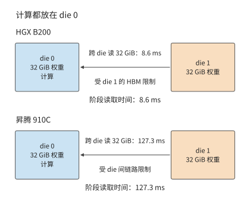

*图 4-22　计算都放在 die 0 时，要跨 die 读取 die 1 上的 32 GiB 权重。B200 的跨 die 读取受 die 1 的 HBM 限制，约 8.6 ms，与本地读取相同；昇腾 910C 受 die 间链路限制，约 127 ms。*

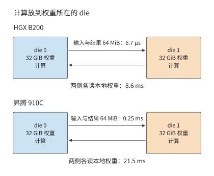

*图 4-23　计算放到权重所在的 die 后，链路上只交换 64 MiB 输入与结果，两侧各读本地权重。B200 仍约 8.6 ms；昇腾 910C 从约 127 ms 降到约 21.5 ms。*

图 4-22 与图 4-23 比较计算单元与权重的相对位置：集中计算路径搬移权重，就地计算路径搬移输入并取回结果。判断如何分配计算任务时，先画出每种方案经过链路的数据，再比较总量。

这种放置还创造了并行机会：两侧本地读取和计算可以分别推进，最终再交接结果。是否需要等两侧都完成，由模型的计算图决定；如果下一步要合并部分和，就在合并点形成同步。第 6 章会从具体的并行切分推导这些交接。

### 4.5.2 CPU 与加速器之间的数据访问

封装内的数据放置决定跨 die 传输；芯片外也有类似问题。图 4-2 展示了主机与加速器之间的数据交接：CPU 准备的数据需要传给 GPU 使用。CPU 准备的输入通常先放在主机内存里，带独立显存的 GPU 要经 PCIe 或平台专用连接取得这些数据。主机到设备称为 H2D，设备到主机称为 D2H。复制引擎通过直接内存访问（DMA）按准备好的地址搬移，CPU 提交复制命令后可以处理其他工作。

同一个张量先经主机链路上传，再由 GPU 从显存读取，需要分别计算传输和读取的时间。以 RTX 4090 为例：该卡经 PCIe 4.0 x16（16 条通道）连接主机，名义带宽为双向合计 64 GB/s，即每方向 32 GB/s；显存带宽为 1,008 GB/s。[^rtx-spec] 设输入为 64 MiB，先忽略启动开销，则

$$
T_{\mathrm{H2D}}=\frac{64\ \mathrm{MiB}}{32\ \mathrm{GB/s}}\approx2.1\ \mathrm{ms},\qquad
T_{\mathrm{read}}=\frac{64\ \mathrm{MiB}}{1008\ \mathrm{GB/s}}\approx67\ \mu\mathrm{s}.
$$

上传时间是一次显存读取时间的 31.5 倍，恰为两条路径的带宽之比。如果只使用一次，主机传输占主要时间；如果上传后在加速器上复用 $R$ 次，每次分摊 $T_{\mathrm{H2D}}/R$。复用 100 次时，平均每次分担的上传时间降至约 21 μs。每次调用只需提交地址和执行参数，整份数据继续留在显存中。

还可以求出至少需要复用多少次：当 $R\ge32$ 时，每次分摊的上传时间已不大于一次加速器读取。因此，提高主机链路带宽对一次性输入更有价值，保持权重常驻则可以省去重复上传。

复制引擎与计算单元是独立执行资源，可以在 GPU 计算当前 batch 时上传下一个 batch。要形成流水，两个输入缓冲分别保存当前 batch 和下一个 batch，当前 batch 计算结束后再交换缓冲区的用途；这正是第 4.4 节双缓冲在主机链路上的应用。若复制写入与计算读取共同占用内存接口，该接口要承担两部分流量。

并非所有平台都要经过这次复制。Apple 的 CPU 与 GPU 共享物理内存，采用双方可访问的缓冲时，CPU 写好数据并完成同步后，GPU 可以从同一存储读取。与独立显存的做法相比，省去的是单独 H2D 副本及其传输；GPU 随后的读取仍由内存系统提供。[^apple] 统一内存把数据交接从“复制后使用”变成“同步后使用”。

统一地址空间让 CPU 和 GPU 以同一组虚拟地址引用数据。CUDA 是 NVIDIA GPU 的编程与运行平台；其统一内存机制（Unified Memory）可按平台规则迁移页面，地址相同而物理位置可以变化。[^host] 数据与使用它的处理器之间的距离影响访问时间，地址和同步机制则让处理器能够找到数据，并在写入完成后读取。

### 4.5.3 加速器之间的数据交换

主机上传的例子强调了数据驻留和复用。卡之间还会频繁交换激活、专家输入或部分结果，每次传输的数据量不一，除了字节数，还要考虑每次传输的固定开销。一次传输既要提交请求、通知接收方完成状态，也要通过链路传送数据。用固定开销 $\alpha$、有效单向带宽 $R$ 和数据量 $V$ 表示，点对点时间为

$$
T_{\mathrm{edge}}=\alpha+\frac{V}{R}.
$$

以 HGX H100 服务器为例：机内每张 H100 经 NVLink 与其他 GPU 相连，双向合计 900 GB/s，每方向 $R=450$ GB/s；A100 SXM 的 NVLink 为每方向 300 GB/s。[^nvidia-product-lines] 固定开销取 $\alpha=2$ μs，与第 7 章机内 NVLink 每轮启动的取值相同。设传递 $[M,4096]$ 的 BF16 激活，数据量为 $8192M$ bytes。$M=1$ 时数据量只有 8 KiB，在 H100 上传输约 0.02 μs，总计约 2.02 μs；$M=256$ 时数据量为 2 MiB，传输约 4.66 μs，总计约 6.66 μs。

从 A100 换到 H100，带宽提高到 1.5 倍，8 KiB 传输的时间只从 2.03 降至 2.02 μs，2 MiB 传输则从 8.99 降至 6.66 μs，缩短约 26%。若改为在 H100 上把固定开销减半，小数据量的传输时间约减半，大数据量的传输也能节省约 15%。两种优化针对的是公式中不同的主导项。

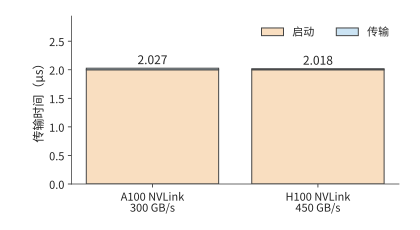

*图 4-24　一次 8 KiB 传输的启动与传输时间。固定启动开销 2 μs，NVLink 从 A100 的每方向 300 GB/s 换成 H100 的 450 GB/s，只缩短很薄的蓝色传输项。*

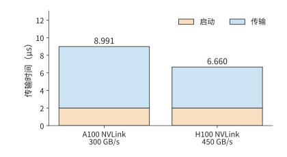

*图 4-25　一次 2 MiB 传输在相同启动条件下的时间。蓝色传输项占主要部分，换成 H100 的 NVLink 带来更显著的收益；本图纵轴范围与上一图分别标注。*

令两项相等，就得到数据量的转折点：

$$
V^*=\alpha R=2\times10^{-6}\times4.5\times10^{11}=900\,000\ \mathrm{bytes}\approx879\ \mathrm{KiB}.
$$

对本例激活，这对应 $M\approx109.9$，即从 110 行起，传输时间才超过固定开销。链路越快，转折点越大，更多的传输落在固定开销主导的一侧。小于这一规模时，把多次传输合并成一次，能降低每份数据分摊的启动开销；大于这一规模时，减少字节或提高带宽的收益更明显。把多份已就绪的数据合并发送，会减少启动次数；等待尚未就绪的数据以合并成更大的包，则会增加排队时间。传输的粒度因此也涉及吞吐与响应时间的取舍。

若一次执行有 100 次必须串行的小数据量交换，每次 2 μs，仅固定开销就有 200 μs。跨服务器时固定开销更大：两台 HGX H100 服务器共 16 张卡做一次 16 bytes 的全归约（AllReduce，把各卡的局部贡献合并，并让每张卡取得完整结果），公开实测约 25 μs，[^allreduce-small] 100 次这样的归约便要 2.5 ms。此时，即使减少部分传输数据，总时间也难以明显缩短，而减少交换轮数可以直接缩短依赖链。AllReduce 把多次传输与归约连接起来，第 6 章会分别计算轮数、每条链路的传输字节数，以及传输与计算能够重叠的时间。

NVLink、华为 Unified Bus 等互联提供设备间的传输路径，完成通知让接收方在数据到达后开始计算。[^package]

> **思考：合并发送如何改变完成时间与首份数据的响应？** 四份 8 KiB 数据依次在 0、1、2、3 μs 就绪。仍取 H100 NVLink 的每方向 450 GB/s、每次启动 2 μs，在同一链路上比较就绪后分别发送与等齐后合并发送：所有数据何时送达？第一份数据又何时可供接收方使用？

## 4.6 模型需求如何推动架构演进

第 4.2—4.5 节分别分析了计算、存储、搬移和互联。本节把这些部件放回 NVIDIA、昇腾、Apple 的代际变化中，计算新增机制究竟减少了什么工作、改变了哪项资源需求，再解释这些变化如何回应模型负载。

以下逐项比较矩阵单元、数值格式、数据通路和容量的变化；每次保留同一模型工作量，只改变正在考察的硬件或表示方式。硬件参数与复算见配套计算记录。[^evolution-quant]

### 4.6.1 NVIDIA：矩阵、精度与数据路径分别带来多少收益

**Tensor Core 的价值，先用同一块芯片上的两条路径计算。** Volta V100 SXM2 的普通 FP32 峰值为 15.7 TFLOP/s，Tensor Core 的 FP16 输入、FP32 累加峰值为 125 TFLOP/s，HBM2 带宽为 900 GB/s。仍取本章的 $4096\times4096$ 投影，输入与权重以 FP16 保存，结果也写为 FP16；普通路径将操作数转换到 FP32 后执行乘加，Tensor Core 路径直接执行混合精度矩阵乘加，即输入用 FP16、累加用 FP32。两条路径读写同样的数据。[^volta-evolution]

一次处理 4,096 行，矩阵计算量为 $2\times4096^3\approx137.4$ GFLOPs，输入、权重、输出合计 96 MiB。普通 FP32 乘加需要 $137.4/15.7\approx8.75$ ms，Tensor Core 需要 $137.4/125\approx1.10$ ms，读取与写回则需要约 0.112 ms。矩阵时间降到约八分之一，原因是大量规则乘加交给了专门单元。

再把输入减为一行。两条路径的矩阵时间变成约 2.14 μs 和 0.268 μs，32 MiB 权重连同输入输出的传输却需要约 37.3 μs。两条路径因此都先受数据读取限制。同一项 Tensor Core 改进，对大 batch 的矩阵乘法收益显著，对这次单行调用则帮助不大，要加快的仍是权重读取。

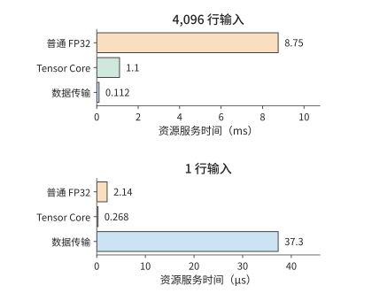

*图 4-26　同一 V100 上的 Q 投影。4,096 行时，Tensor Core 大幅缩短矩阵计算；一行时，两条计算路径都短于权重传输。上下两组使用分别标注的时间单位。*

**精度演进同时改变数值范围、存储量和执行指令。** Turing 在 Tensor Core 中加入 INT8、INT4，扩展低比特整数推理；Ampere 增加 BF16、TF32 和 2:4 结构化稀疏；TF32 在矩阵乘法中保留 FP32 的指数范围、缩短尾数，2:4 稀疏则按每四个元素中两个非零值组织计算。Hopper 的 Transformer Engine 将 FP8 矩阵指令与缩放管理结合，Blackwell 进一步支持分块缩放与 FP4。[^turing-evolution][^nvidia]

以其中加入的 BF16 为例。FP16 和 BF16 都占两字节，换成 BF16 后，前面的 32 MiB 权重保持不变。浮点数用有效数字乘以二的指数幂表示数值；正规数将有效数字标准化，次正规数则在更小的数值区间逐渐减少有效位数。BF16 使用八位指数，最小正规数约为 $1.18\times10^{-38}$；FP16 使用五位指数，最小正规数约为 $6.10\times10^{-5}$，最小正次正规数约为 $5.96\times10^{-8}$。一个 $10^{-8}$ 的梯度直接舍入到 FP16 会变为零，BF16 仍能表示。这减少了训练时为避免溢出、下溢而调整缩放的需求。代价是有效数字较少：在 1 附近，BF16 相邻数的间隔为 $2^{-7}$，FP16 为 $2^{-10}$。低精度输入配 FP32 累加，分别处理输入表示与长内积累积误差。[^bf16-quant]

再看存储量。沿用第 4.2.4 节每 32 个值共享一字节 scale 的分块格式；MX 是这种微缩放（microscaling）格式的名称。MXFP8 需要 $16+0.5=16.5$ MiB，MXFP4 需要 $8+0.5=8.5$ MiB。以 RTX 4090 的 1,008 GB/s 带宽读取这份 BF16 权重需 33.29 μs；以 RTX 5090 的 1,792 GB/s 读取同一份 BF16 权重需 18.72 μs，读取 MXFP4 权重则需 4.97 μs。前一步来自带宽提高，后一步来自位数与分组表示改变。

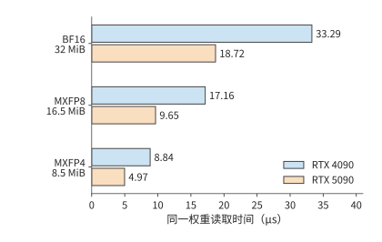

*图 4-27　同一个 4096×4096 权重的存储与读取预算。每 32 个低精度值共享一个一字节 scale。位宽从 BF16 降至 MXFP4 后，权重与 scale 合计从 32 MiB 减至 8.5 MiB。*

从 33.29 μs 到 4.97 μs，权重读取预算缩小到约 1/6.69。这笔收益由两部分相乘：带宽约提高到 1.78 倍，存储量缩小到约 1/3.76。原生低精度矩阵路径直接处理压缩表示，省去第 4.2.4 节先展开路径中的高精度权重副本。

**矩阵越来越快以后，架构开始减少它前后的准备与等待。** Ampere 的异步拷贝省去全局内存到共享内存的寄存器中转；Hopper 的 TMA 接手多维地址生成与搬移，并配合异步矩阵执行；Blackwell 数据中心 SM100 用张量存储（Tensor Memory，TMEM）保存矩阵累加结果。这三项改动分别改变搬移指令、通用寄存器占用和中间结果存放位置。[^blackwell-evolution]

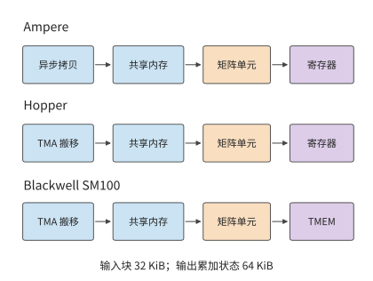

*图 4-28　从异步拷贝、TMA 到 TMEM，专门部件承担更多数据准备与累加状态管理。蓝色表示数据存储与搬移，橙色表示矩阵计算，紫色表示累加结果。*

第 4.3.2 节的计算块需要 32 KiB 输入和 64 KiB 累加结果。三组输入与一组结果合计 160 KiB，TMEM 独立承担其中的 64 KiB，通用寄存器便可用于其他线程状态。这就是新增专用存储给工作驻留带来的直接变化。

再往后一代，Rubin 的 FP32 指数吞吐提高到 Blackwell 的 2 倍，BF16／FP16 指数吞吐提高到 4 倍，回应了例 4-1 中矩阵加速后暴露的指数瓶颈。Rubin 还允许 TMA 更新专家地址与步长：MoE 切换专家时，矩阵形状可以保持不变，只需切换权重位置，描述符更新由此减少重复的地址准备。[^rubin-evolution]

**消费级、工作站和数据中心产品，怎样放进同一张表？** 固定 BF16 输入、FP32 累加、稠密矩阵计算，参数如下。RTX 3090、4090、5090 分别采用 Ampere、Ada、Blackwell；A100、H100 分别采用 Ampere、Hopper。[^evolution-quant]

| 型号与产品线 | 容量 GB | 带宽 GB/s | BF16／FP32 稠密矩阵 TFLOP/s |
| --- | ---: | ---: | ---: |
| RTX 3090，消费级 | 24 | 936 | 71.0 |
| RTX 4090，消费级 | 24 | 1,008 | 165.2 |
| RTX 5090，消费级 | 32 | 1,792 | 209.5 |
| RTX PRO 6000 Blackwell，工作站 | 96 | 1,792 | 503.8 |
| A100 80GB SXM，数据中心 | 80 | 2,039 | 312.0 |
| H100 SXM，数据中心 | 80 | 3,350 | 989.4 |
| H200 SXM，数据中心 | 141 | 4,800 | 989.5 |

RTX 3090 与 4090 容量相同，BF16 矩阵速率约提高到 2.33 倍，带宽却只提高约 7.7%。前者主要缩短大矩阵计算，后者才直接缩短单行权重读取。RTX 5090 的容量提高到 32 GB，带宽再提高到约 1.78 倍；新增的 FP4 路径还为能用低精度的模型提供了另一种执行方法。这三代产品分别改变了矩阵处理、权重读取和模型驻留的资源预算。

RTX PRO 6000 与 RTX 5090 带宽同为 1,792 GB/s，工作站卡的主要增量包括 96 GB 带 ECC 的显存、更高的 BF16／FP32 累加吞吐，以及多实例 GPU（MIG）功能；MIG 将一块 GPU 划分成资源相互隔离的实例。对相同大小的权重流式读取，两者的带宽预算相同；对大矩阵或超过 32 GB 的常驻数据，结果就不同。SM120 与 SM100 是两种不同的 SM 指令架构。消费级与工作站 Blackwell 采用 SM120；B200 等数据中心 Blackwell 的 SM100 使用前面介绍的 TMEM 和相应矩阵指令，软件按目标架构选择 kernel。[^nvidia-product-lines]

数据中心卡还提供 HBM 与面向多卡的高速互联。A100 SXM 的 NVLink 双向聚合带宽为 600 GB/s，H100 SXM 为 900 GB/s，换成单向发送分别为 300、450 GB/s。按第 4.5 节的方法，传送 64 MiB 数据的链路序列化时间（数据量除以单向带宽）分别约为 224、149 μs。计算规模增加后，张量并行（把同一层内的矩阵分给多张卡计算）每层的通信、训练梯度交换和专家 dispatch 会反复使用这些连接。RTX 4090、5090 没有 NVLink；RTX 3090 支持双卡 NVLink。第 6、7 章会用这些链路参数计算张量切分、梯度交换与专家 dispatch 的时间。[^nvidia-product-lines]

回到计算与带宽两项的比较：H100 相对 A100，BF16 矩阵速率提高到约 3.17 倍，带宽提高到约 1.64 倍，同时增加 FP8、TMA 和新的协作机制。H200 相对 H100，则主要增加容量与带宽，表中的 BF16 矩阵速率基本相同。这两组变化分别对应“计算与执行组织一起改”和“保持计算能力、增强存储”。第 4.8.2 节代入模型工作后，就能判断哪一组增量更有用。

### 4.6.2 昇腾：从 CNN 的卷积展开，到 Transformer 的矩阵与向量交接

早期昇腾 910（后面的代际比较中称作 910A）设计时，ResNet 等卷积神经网络（CNN）占据了大部分训练负载。笔者的设计回顾记录了这一背景；DaVinci 论文进一步给出 Scalar、Vector、Cube 和 MTE 的分工。MTE 包含 img2col、转置和解压模块，其中 img2col 在数据搬移过程中把卷积窗口组织成矩阵输入。先计算这项专用能力在 CNN 中节省了什么，再把负载换成 Transformer。[^ascend-cnn-history]

**卷积展开为何值得交给硬件？** 取一个 ResNet 式的 $3\times3$ 卷积，输入为 $56\times56\times64$，输出通道数为 64，步长为 1，通过填充（padding）保持空间尺寸。输入以 FP16 保存，占 $56\times56\times64\times2=401,408$ bytes，约 0.383 MiB。每个输出位置使用九个相邻位置的 64 个通道，展开矩阵为 $3136\times576$，占约 3.445 MiB，是原输入的九倍。

若先在 HBM 中生成展开矩阵，再由矩阵乘法读入，额外发生一次 3.445 MiB 写入和一次读取，共 6.891 MiB。早期 910 的 HBM 带宽为 1.2 TB/s，仅这笔展开矩阵的写读就占约 6.02 μs 的带宽时间。MTE 在片上搬移时完成窗口展开，便省去这份 HBM 中间副本的写读。输入窗口在片上组织后直接送入矩阵计算，HBM 中保留原始输入和权重。[^ascend-history]

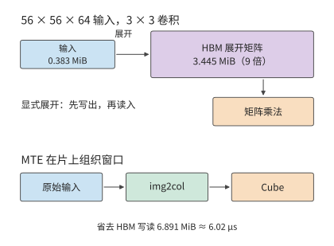

*图 4-29　同一个 3×3 卷积的两条准备路径。显式展开形成九倍大小的中间矩阵；MTE 在片上组织窗口，省去 HBM 上 6.891 MiB 的中间结果写读。*

再看计算分工。该卷积需要 $2\times3136\times576\times64\approx231.2$ MFLOPs。DaVinci 论文给出的 Ascend-Max Cube 为每周期 8,192 FLOPs，因此矩阵服务时间为 28,224 周期。输出 ReLU 只处理 200,704 个元素；按 256 bytes 向量宽度，一组可容纳 128 个 FP16 元素，共 1,568 组。卷积的矩阵计算量与后处理相差悬殊，Cube、Vector 和展开硬件各自承担明确的工作。

**换成注意力，资源比例和数据方向一起变化。** $128\times128$、头维度 128 的注意力块，QK 与 PV 合计约 8.39 MFLOPs，在同一 Cube 速率下为 1,024 周期。Softmax 需要计算 16,384 个指数，并执行最大值归约、求和与归一化。按 256 bytes 的向量宽度，一组 FP32 数据有 64 个值，单是指数就要处理 256 组。要让指数阶段不超过矩阵的 1,024 周期，指数部分需要平均每四周期处理一组，也就是每周期 16 个指数结果。随后执行归约与归一化，形成 PV 的输入。

同一 Cube 上，CNN 卷积的矩阵工作占 28,224 周期，注意力块只占 1,024 周期；向量工作却从简单 ReLU 变成指数、归约与归一化。DaVinci 论文的 BERT 分析中，多数层由 Cube 时间主导。把注意力单独拆开后，可以看到 Softmax 对向量吞吐提出的新需求。[^ascend-history]

在 CNN 中发挥作用的卷积窗口展开，在 Q、K、V 投影上没有工作可做，因为投影输入已经是矩阵。注意力反而需要把 QK 的结果交给 Vector 做 Softmax，再将概率交回 Cube 做 PV。img2col 节省的卷积展开工作，与这两次矩阵、向量交接所需要的工作不同；负载转变以后，新增硬件资源的重点也随之转移。

**独立调度以后，交接路径怎样影响速度？** 910B 所在 Atlas A2 将矩阵核 AIC 与向量核 AIV 分开控制；910C 进一步采用双 die，每颗 die 有 24 个 AIC 和 48 个 AIV。分离控制让不同工作独立推进，AIC 与 AIV 则通过全局地址空间交换结果，实际数据经过缓存层次。CloudMatrix384 在 MLA 中压缩 KV 状态，通过融合与动态分块安排矩阵和向量工作；MTP 一次处理多个预测位置，又改变了这些计算的行数。[^ascend-history]

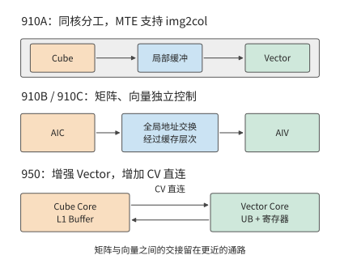

*图 4-30　早期同核分工、910B／910C 的独立控制，以及 950 增加的 CV 直接通路。计算单元的配比与结果交换的路径共同决定融合算子的效率。*

用同一个注意力块计算接口工作量。分数与概率各按 FP32 交接，每个张量占 64 KiB。一次交接经过外层交换接口写出、读入，共 128 KiB；QK→Softmax 和 Softmax→PV 两次合计 256 KiB。若两次交接都由同一外层接口承担，要在 1.024 μs 内完成，该接口需要约 256 GB/s。把 DaVinci 论文中每核分配的 94 GB/s 末级缓存（LLC）带宽代入，这笔工作需要约 2.79 μs，已经超过 1 GHz 下 Cube 的 1.024 μs 矩阵服务时间。矩阵计算即使继续加快，外层接口仍需搬完这些字节。

昇腾 950 的下一步改动正针对这条外层接口：在 Cube 的一级缓冲 L1 与 Vector 的统一缓冲（Unified Buffer，昇腾文档简写为 UB，与第 6 章的互联 Unified Bus 并非同一概念）之间增加 CV（Cube–Vector）直接通路。两次各 64 KiB 的中间张量通过直接连接交接，共传递 128 KiB，原来外层接口的 256 KiB 写读由此移出。若要求这条直接通路在 1.024 μs 内完成两次交接，需要约 128 GB/s；若交接格式改为 FP16／BF16，需求再减半至约 64 GB/s。

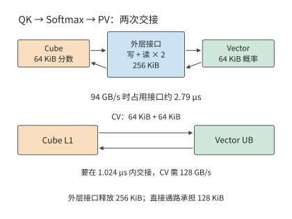

*图 4-31　同一注意力块的两次交接。外层交换接口承担写出和读入共 256 KiB；直接 CV 通路传递两个 64 KiB 张量，将这笔流量移出外层接口。在 1.024 μs 内完成交接，对应直接通路的带宽需求为 128 GB/s。*

950 同时将单个 Vector Core 的 FP16／FP32 吞吐提高一倍，在统一缓冲与向量算术逻辑单元（ALU）之间增加寄存器文件，并优化 Softmax 与激活函数 GELU 的执行。对相同普通向量工作 $F_v$，$F_v/P_v$ 降为 $F_v/(2P_v)$；如果原来向量阶段是矩阵阶段的两倍，这项改动能把二者重新配平。按前面的注意力块，指数吞吐需要达到每周期 16 个结果。新增 NDDMA 承担多维地址与布局准备，BufferID 用缓冲区标识组织同步交接。[^ascend]

950 的低精度也可以沿同一工作量理解：同频 FP8 类矩阵计算速率为 FP16 的两倍，MXFP4 为四倍。对固定矩阵 $F$，计算服务时间依次为 $F/P$、$F/(2P)$、$F/(4P)$；但 FP32 分数与概率的两次交接仍是原来的大小。只有同时改变交接路径、格式或布局，接口工作才会下降。矩阵、向量和 CV 通路一起演进，才能把局部加速变成整段注意力的收益。

### 4.6.3 Apple：大容量统一内存，如何换算为模型运行能力

Apple 的 CPU、GPU 和独立 Neural Engine 共享统一内存。统一内存省去了处理器之间的数据复制，也让本地运行的模型能使用较大的内存池。下面先计算统一内存能够容纳的模型，再计算生成一个 token 需要读取的数据量。

先核对容量与带宽的代际关系。M1 Ultra 的代表配置为 128 GB、800 GB/s；M2 Ultra 扩展到 192 GB、800 GB/s；M3 Ultra 的 80 核 GPU 配置有 256 GB 和官方记录的 512 GB，两者均为 819 GB/s。M4 Max 也有 128 GB 配置，带宽为 546 GB/s。[^apple-capacity-quant]

**容量翻倍，哪些时间会改变？** 先保持模型、精度和 batch 不变。M3 Ultra 从 256 GB 增至 512 GB，带宽仍为 819 GB/s，同一执行的 $V/R$ 完全相同。M1 Ultra 换成 M3 Ultra，带宽从 800 增至 819 GB/s，读取速度只增加约 2.4%。容量的增量让更多权重、KV 或请求驻留，带宽的增量才直接改变同一批数据的读取时间。

取 Qwen3-8B、BF16、单请求、8,192 位置，本书张量清单给出每步权重与 KV 的接口载荷约 16.345 GB。M1／M2 Ultra 的读取下界为 $16.345\ \mathrm{GB}/(800\ \mathrm{GB/s})\approx20.43$ ms，M3 Ultra 为 $16.345\ \mathrm{GB}/(819\ \mathrm{GB/s})\approx19.96$ ms，M4 Max 为 $16.345\ \mathrm{GB}/(546\ \mathrm{GB/s})\approx29.94$ ms。同样是 128 GB，M1 Ultra 读取这一步数据比 M4 Max 少用约 9.51 ms。[^evolution-quant]

**容量的主要价值，用大型 MoE 更容易看清。** Qwen3-235B-A22B 采用本书的 4-bit 存储方案，连同 scale 与保留高精度的张量，常驻权重约 123.142 GB。单请求、8K 上下文再加 KV 和 2 GiB 工作区，合计约 126.867 GB。128 GB 整机只余约 1.13 GB；给操作系统和其他应用再预留 8 GB 后，需要约 134.87 GB。256 GB 或 512 GB 的配置则有足够空间容纳这一预算。

MoE 每步只访问选中的专家。相同单请求每步的权重与 KV 接口载荷约 13.697 GB，在 M3 Ultra 上需要约 16.72 ms，而不是将 123.142 GB 全部权重每步读一遍得到的约 150 ms。对 MoE，全部权重决定容量，当前选中的专家决定每步权重读取。大型 MoE 因而能同时表现为“需要大内存”和“每步读取相对较少”。[^storage]

再代入第 4.3.3 节的八请求路由结果。集中与分散路由的每步读取量分别为 24.737 GB 和 75.967 GB，在 M3 Ultra 上对应 30.20 ms 和 92.76 ms。每步产出八个 token，读取吞吐预算分别为 $8/0.03020\approx265$ token/s 和 $8/0.09276\approx86$ token/s。256 GB 与 512 GB 配置可以容纳相同的八请求任务，路由复用决定了这里两组读取预算的差别。

**局部存储和 GPU 专用单元怎样加入这组计算？** M3 引入 Dynamic Caching，按运行需求分配 GPU 局部内存；M4 延续这一组织。这些机制影响工作驻留和片上资源利用，模型容量则由统一内存决定。M5 又在每个 GPU 核内加入 Neural Accelerator，并通过 Metal 4 Tensor API 等接口使用；独立 Neural Engine 继续存在。GPU 内专用单元加速矩阵处理，数据准备与一般运算继续由 GPU 程序组织。[^apple-generations][^apple]

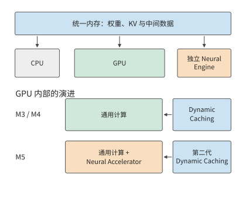

*图 4-32　统一内存负责整机的数据容量，Dynamic Caching 管理 GPU 局部资源，M5 的 Neural Accelerator 增加 GPU 内专用计算能力。三者分别进入容量、驻留和计算时间的分析。*

内存带宽也在逐代提高：基础 M4 到基础 M5，统一内存带宽从 120 增至 153 GB/s，提高约 27.5%。前面 32 MiB 权重的读取时间从约 279.6 μs 降至 219.3 μs，缩短约 21.6%。Apple 公布 M5 的 GPU AI 峰值超过 M4 的四倍；同一单行投影的权重读取仍由上述带宽决定。增加输入行数以后，权重读取由更多计算共同分摊，新的矩阵单元才更容易成为主要收益来源。这一现象与 V100 上两种行数的结果完全对应。[^apple]

这些演进把图 4-3 的反馈关系落实为资源变化：大矩阵推动专用乘加，Transformer 增加向量与交接需求，大型 MoE 扩大常驻容量需求。

## 4.7 专用架构

前几节通过复用、流水与局部性提高通用加速器效率。如果负载中有些条件长期保持稳定，还可以把这些条件直接用于硬件设计：固定运算规则、固定通信次序，甚至固定权重。专用化减少某些工作，也把更多资源集中到剩余工作上。

### 4.7.1 TPU

TPU v1 的推理计算以规则矩阵乘法为中心。$256\times256$ 个乘加单元构成阵列，权重经片上先进先出队列（FIFO，按进入次序取出的缓冲）加载到阵列，输入从 Unified Buffer 送入，结果保存在独立累加存储中，再交给激活单元。一条指令可以描述较大规模的矩阵运算，局部连接反复传递操作数，减少每次乘加所需的控制和远距离访问。[^tpu]

一块 $256\times256$ 的 8-bit 权重为 64 KiB。若只处理一行输入，完成 $2\times256^2=131\,072$ 次操作，每字节权重对应两次操作；处理 256 行时，完成约 33.6 M 次操作，每字节权重对应 512 次。权重保持不变，计算量增至原来的 256 倍，正是第 4.1 节投影复用关系在阵列中的实现。

要取得这种收益，阵列需要连续的输入行。权重 FIFO 能容纳四块这样的权重块，权重加载与计算可以通过缓冲衔接；输入不断送入阵列时，独立的累加存储负责保存部分和。大阵列、输入缓冲和权重队列因此互相配合：阵列提供乘加单元，缓冲保证这些单元持续获得所需的操作数。

阵列启动时，操作数还要沿连接传播到各计算位置；结束时，结果要汇集输出。连续计算的块数越多，每块分摊的流水线填充与排空时间越少，小任务则更容易受到这些固定步骤影响。

负载发生变化后，硬件各部分的配比也需要调整。训练增加可写状态、梯度与加速器间交换；长上下文生成增加 KV 占用，并要求每个生成步骤等待前一步结果。Google 的 TPU 8t／8i 把训练与采样服务分开组织，体现了不同阶段对矩阵、向量、存储和互联的需求。[^tpu8] TPU 的共同思路是围绕已知工作安排资源，而具体配比随主要负载变化。

### 4.7.2 Groq、Graphcore 与 Cerebras

将更多数据留在片上，可以减少远距离访问。沿着这一思路，可以把计算和存储分散到许多局部单元，也可以进一步增大芯片，在片上容纳更多这样的单元。二者都让大量数据由附近的计算单元使用，也都需要安排单元之间的交换。

Groq 的张量流处理器（Tensor Streaming Processor，TSP）由编译器预先安排张量的生成、传输和使用时刻。Graphcore 的智能处理单元（Intelligence Processing Unit，IPU）由许多带有局部存储的计算单元（Graphcore 称之为 tile）组成，各计算单元通过计算、同步和数据交换协作完成任务。Cerebras 把大量计算与存储铺在晶圆尺度上，第三代晶圆级引擎 WSE-3 的片上 SRAM 为 44 GB。SRAM 适合直接集成在计算芯片内，用面积换取低延迟访问。[^special] 这些设计在不同尺度上实现局部性：尽量缩短通信路径，让反复使用的数据靠近计算。

分布式容量的难点在于各处需求并不相同。某一单元释放了存储空间，其他单元也无法直接把这部分空间当作自己的本地存储；要重新平衡，必须迁移数据或移动计算。路由不均的专家模型尤其容易出现这种情况：总量相同，集中到少数专家的请求会使少数计算单元更忙。

局部存储的不均衡可以靠重新分配任务来缓解，但另有一个问题随服务规模加剧：KV 总量增加。沿用 Qwen3-8B，每条包含 8,192 个 token 的请求，其 BF16 KV 是 1.125 GiB。Groq TSP 每颗芯片有 220 MiB SRAM，[^special] 仅存放 BF16 权重就需要 72 颗芯片。KV 另用芯片保存，并可均匀切分：一条请求需要 $\lceil1152/220\rceil=6$ 颗芯片；八条请求共 9 GiB，需要 42 颗；若八条请求的上下文都增至 32,768 个 token，需要 168 颗。

从 6 到 42 再到 168，增加的是可写状态，模型权重并未增加。片上保存权重减少了一类读取，但持续服务还需要为增长的状态提供容量。芯片增多后，分布在各芯片上的 KV 又要跨芯片汇集；容量扩展与通信需求由同一工作负载同时产生。

晶圆尺度缩短了部分原本跨封装的连接，但数据仍沿网络经过多个计算单元。把使用同一状态的计算安排在附近，能够减少经过的链路和同步；把任务均匀摊开则有利于使用更多计算位置。分配计算任务时，既要让数据在本地复用，又要避免少数单元过忙而其余单元空闲，这与多 die 放置的原理一致。

### 4.7.3 固定数据流与固定权重

专用化利用执行中已经确定的条件重新分配硬件资源。固定算子种类，指令和控制就能简化；固定数据流，通信就能提前安排；固定数值格式，存储器和运算单元就能按所需位宽设计；固定权重，则可以为不再变化的参数设计专门的存储结构。原来用于处理多种情况的控制和数据通路，可以相应简化。

模型改变后，可重配置设计靠更新连接与调度来适应新的计算。SambaNova 的数据流组织与 FPGA 的可重配置通路，都允许重新配置部分连接和执行顺序；固定权重设计则围绕特定参数组织存储与计算。[^special]

固定权重并不等于只能完成一种任务。改变输入，就能让同一个模型执行不同的上层任务。同一组模型权重既可以处理文档问答，也可以根据代码和测试结果提出修改；每次调用使用自己的上下文状态。因而，硬件可以针对共同的模型执行设计权重通路，同时用可写存储保存各条请求的上下文。下面把权重与上下文分别计量，计算这种分工能够释放多少容量和带宽。

笔者的 OpenTallas 项目研究将不可变权重放入掩模 ROM 的架构；掩模 ROM 是一种在制造时就固定存储内容的只读存储器。下面以项目中的 Qwen3-8B 为例，通过公式估算说明“从独立 ROM 读取权重、从 HBM 读写 KV”的设计如何改变各接口的传输量。[^opentallas] 每批只读取一次本步计算所需的权重，约 $W=15.1$ GB；每条请求完整读取 8,192 个 token 的 KV，约 $K=1.21$ GB。完整驻留权重约 16.4 GB，每步读取其中参与计算的部分。

先看同一接口原来承担多少读取。权重与 KV 共用 HBM 时，每步读取为 $W+BK$。把权重移到独立 ROM 后，HBM 只承担 $BK$。两种 HBM 读取量之比为

$$
S_{\mathrm{HBM}}=\frac{W+BK}{BK}=1+\frac{W}{BK}.
$$

$B=1$ 时，HBM 读取量从约 16.3 GB 降至 1.21 GB，读取时间降为原来的约 $1/13.5$。$B=16$ 时，KV 已为约 19.3 GB，总量从约 34.5 GB 降至 19.3 GB，约为原来的 1/1.8。batch 增大已经把权重摊到更多请求上，因此进一步省去权重读取的相对收益减小。

令 $BK=W$，可求得 KV 读取量与权重读取量相等的转折点，约为 $B=12.5$；从整数 batch 13 起，KV 读取量超过权重读取量。图 4-33 用水平线与斜线展示了这一转移。

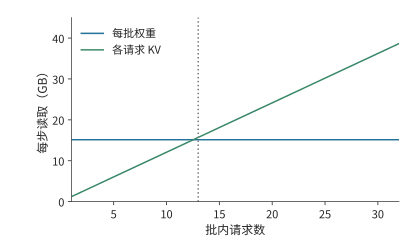

*图 4-33　固定权重的同时，各请求仍独立读取 KV。题设每请求保留 8K 上下文，batch 从 13 起 KV 读取超过共享权重读取。*

有了独立的 ROM 接口，权重与 KV 就可以同时读取。设两条接口的带宽分别为 $\beta_{\mathrm{ROM}}$、$\beta_{\mathrm{HBM}}$，保持模型、精度、上下文与 batch 不变，两条路径重叠时的存储时间下界为

$$
t_{\mathrm{memory}}\geq\max\left(\frac{W}{\beta_{\mathrm{ROM}}},\frac{BK}{\beta_{\mathrm{HBM}}}\right).
$$

提高 ROM 带宽会缩短第一项，直到 KV 读取成为较慢的路径。若目标为单用户 10,000 token/s，每 token 只有 100 μs，仅 1.21 GB KV 就要求约 12.1 TB/s 的 HBM 带宽。

独立 ROM 还释放了原来存放权重的 HBM 容量。固定 8K 上下文，以一堆 24 GB 的八层 HBM3E（第 4.1.3 节）作 KV 存储，扣除 2 GiB 工作区后，按每条 1.125 GiB 的 KV 预算，可容纳 18 条请求；原来还需存放完整 BF16 权重时只能容纳 4 条。[^core-calculation] 上下文增长到 32K，每条请求的 KV 读取增至四倍，前面的权重与 KV 交点便从约 12.5 条降至约 3.13 条。

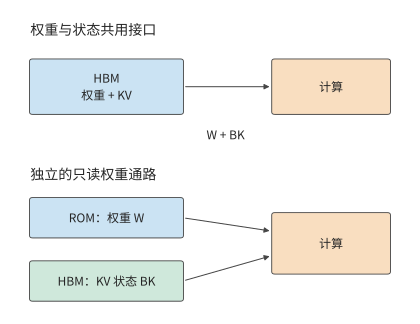

*图 4-34　独立只读权重改变两条存储路径。上方权重与 KV 争用 HBM；下方 ROM 提供权重，HBM 存放可写状态。箭头表示读取，KV 还需写入新状态。*

同一个 100 μs 时限也可以用来求计算单元数量。工作负载取自该项目的历史执行记录：一组张量操作，共计 15,134,641,792 次。设每条运算通道（lane）在 1 GHz 下每周期完成一次乘加（FMA），100 μs 内所需的运算通道数至少为

$$
n_{\mathrm{lane}}\ge\left\lceil\frac{15\,134\,641\,792}{2\times10^9\times100\times10^{-6}}\right\rceil=75\,674.
$$

256 条运算通道完成这些操作需约 29.6 ms。若分给矩阵计算的时间只有 40 μs，且有效利用率为 60%，需要 315,306 条运算通道，约为最初所需通道数的 4.2 倍。时间预算越紧，留给等待的余量越小，必须配置的算力与存储带宽就越高。

## 4.8 根据架构分析性能、选择加速器

第 4.6、4.7 节计算了不同架构如何改变计算、存储与交换工作。本节把这些结果用于设备选择：先合成执行时间模型，再用同一模型比较候选设备，随后用实测校准，最后比较完成任务的成本与能耗。

选择硬件时，还要为后续的切分与调度保留一份可用的资源描述：目标精度与矩阵形状下的有效算力、各级存储容量与带宽、寄存器和共享内存限制，以及设备间的单向带宽、启动延迟和共享出口。第 5 章用其中的局部资源约束 tile（矩阵划分出的数据块）、缓冲和并发，第 6、7 章用互联参数约束跨卡放置与通信组。同一模型的运算和数据需求不变，但这些需求落到哪一级资源、经过哪些路径，会改变执行时间与最合适的切分。

### 4.8.1 从资源预算建立执行时间模型

执行时间来自两种关系：同一硬件单元要依次执行哪些操作，后一项工作要等哪些结果。前者决定各单元需要工作多久，后者决定各步骤的执行顺序。

先看共享资源。同一矩阵单元处理两类各 1 G 次操作的工作，速率分别为 100 和 200 Gops/s，就分别占用 10 ms 和 5 ms，共 15 ms。第 $i$ 类工作在资源 $r$ 上的工作量为 $w_{r,i}$，对应速率为 $p_{r,i}$，则该硬件单元完成这些操作所需的时间为

$$
T_r=\sum_i\frac{w_{r,i}}{p_{r,i}}.
$$

权重与 KV 共用内存接口时，它们的流量相加；QK 与 PV 共用矩阵单元时，它们的计算时间相加。这些工作即使分布在不同算子中，也消耗同一份硬件能力。

再看独立资源。矩阵和搬移能够同时推进时，总执行时间至少等于耗时最长的单元完成全部操作所需的时间，所以 $T\ge\max_r T_r$。第 4.2 节的稳态分析采用了这一关系：指数运算没有加快时，矩阵单元提前完成后便会空闲，块的完成节奏仍由指数决定。

最后加入依赖。设第一阶段矩阵需 10 μs、内存需 1 μs，第二阶段矩阵需 1 μs、内存需 10 μs；每阶段内部可重叠，第二阶段要等第一阶段完整结束。于是第一阶段用 10 μs，第二阶段也用 10 μs，共 20 μs。只把资源总量汇总，会得到矩阵与内存各 11 μs；差出的 9 μs 来自阶段依赖：第一阶段的矩阵计算与第二阶段的内存访问必须先后进行，无法重叠。[^stage]

把这些关系用到具体设备上，先要选对速率：矩阵单元的运算速率还与输入和累加精度有关。RTX 4090 的 Tensor Core 执行稠密矩阵运算时的峰值，FP16 输入与 FP16 累加约为 330 TFLOP/s，FP32 累加约为 165 TFLOP/s；本章 BF16／FP32 投影采用 165.2 TFLOP/s。[^hardware] 对 8.59 GFLOPs，按这两个速率计算，分别需要约 26 和 52 μs。后面算出的读取时间约为 37 μs，因此速率选择会直接改变计算与读取耗时的大小关系。

资源耗时与执行依赖确定以后，还可以求出负载变化时的瓶颈转折点。对本章的 Q 投影，Roofline 模型把这一转折写成算术强度与吞吐之间的关系。

设矩阵峰值为 $P$，片外带宽为 $R$，投影工作量与访问量分别为 $F$、$V$。计算与数据传输所需的时间分别为 $F/P$ 和 $V/R$。计算与访问充分重叠时，较大者决定时间下界，对应 Roofline 模型的吞吐上界为

$$
P_{\mathrm{attainable}}\le\min(P,RI),\qquad I=F/V.
$$

这里的斜线 $RI$ 描述带宽能够支撑多少运算，水平线 $P$ 描述矩阵单元能够完成多少运算。两者在 $I^*=P/R$ 相交。低于交点时，数据供应较慢；高于交点时，每字节已对应足够多运算，计算速度成为新的瓶颈。这条折线就是硬件允许的上限，任何实测点都落在折线之下；实测吞吐与折线的距离，就是第 1.2.2 节定义的利用率。算术强度高于交点时用 MFU 衡量，低于交点时用 MBU 衡量。

沿用第 4.1 节输入与权重读一次、输出写一次的投影，RTX 4090 在 BF16 输入、FP32 累加时的矩阵运算峰值为 165.2 TFLOP/s，带宽为 1.008 TB/s。将同一组 $F$ 和 $V$ 代入，得到：[^projection]

| 本次处理的 token 数 $M$ | 矩阵计算时间 | 片外数据传输时间 | 两项耗时的最大值 | 主导资源 |
| --- | ---: | ---: | ---: | --- |
| $M=1$ | 约 0.20 μs | 约 33.3 μs | 约 33.3 μs | 内存 |
| $M=256$ | 约 52 μs | 约 37.4 μs | 约 52 μs | 矩阵 |

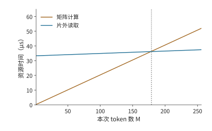

*图 4-35　同一 Q 投影的计算与访存耗时随输入行数的变化。计算量按行数增长，片外访问同时包含固定权重和增长的输入输出；从 179 行起计算项较长。*

还可以求出转折发生时的输入行数。令 $d=4096$，第 4.1 节的强度可写成 $I(M)=Md/(d+2M)$。令它等于 $I^*=P/R$，得到

$$
M^*=\frac{I^*d}{d-2I^*}.
$$

代入未经四舍五入的速率数值，$I^*\approx164$ FLOPs/byte，$M^*\approx178.1$。因此从整数行数 179 起，矩阵计算时间超过数据传输时间。转折点把“较大 batch 更适合矩阵单元”变成了可以计算的行数阈值。[^pipeline-extra]

> **实验 4-5 · 核心：batch 如何改变不同架构的性能瓶颈**
>
> 推导并画出 Q 投影从 1 到 256 行的算术强度，分别将矩阵计算吞吐率、内存带宽提高到原来的两倍，求计算时间与读取时间相等时的输入行数。随后把注意力与专家矩阵加入资源表，解释上下文长度和各专家输入行数的分布，怎样改变各单元的处理时间及瓶颈所在。选择两种具体加速器，分别用其资源参数估算同一任务的执行时间，并比较瓶颈。

第 4.8.2 节用这一方法从单个投影扩展到整个模型，分别计算 decode 的主要读取与 prefill 的矩阵工作，并检查哪些设备能够容纳所需状态。

### 4.8.2 用同一模型比较候选加速器

先固定一个便于复算的例子：Qwen3-8B、BF16、单请求，已有 8,191 个历史位置，本步追加后为 8,192 个。权重常驻约 16.381 GB，KV 约 1.208 GB，工作区取 2 GiB，总预算约 19.737 GB。一次 decode 的主要权重、KV 接口载荷为 16.345 GB。词嵌入每步读取当前 token 对应的行，输出头读取完整权重，所以常驻权重与每步权重读取量不同。[^storage]

再计算矩阵工作。Qwen3-8B 有 36 层，隐藏宽度 4,096，前馈宽度 12,288，32 个查询头、8 个 KV 头，头维度为 128。每层 Q、K、V、O 投影与三次前馈投影的矩阵参数数目为

$$
W_{\mathrm{layer}}=2\times4096^2+2\times4096\times1024
+3\times4096\times12288.
$$

每 token 的各层线性运算为 $2\times36W_{\mathrm{layer}}\approx13.89$ GFLOPs。一次 8K decode 的 QK 与 PV 另需 $4\times36\times8192\times4096\approx4.832$ GFLOPs，输出头约 1.245 GFLOPs，共约 19.97 GFLOPs。

再看 prefill：处理 4,096 个新输入 token 时，线性运算按 token 数增加。因果注意力的可见位置对数为 $4096\times4097/2$；每对在 32 个头上各做一次 QK 内积与一次 PV 累加，合计 $4\times4096$ 次操作。乘以 36 层，有效 QK、PV 运算为 $2\times36\times4096\times4096\times4097$。最后一个位置计算输出头，整个 prefill 的矩阵工作约为 61.85 TFLOPs。将这两个阶段分别代入硬件参数表，得到图 4-36。

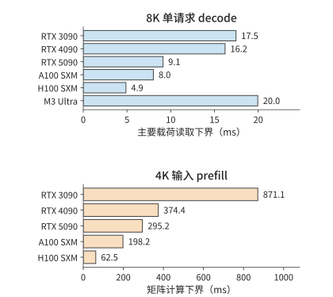

*图 4-36　同一 Qwen3-8B 的两种阶段预算。单请求 decode 更直接反映读取带宽，4K prefill 的矩阵预算更直接反映匹配精度的矩阵速率。两图横轴分别标注所计算的时间。*

这组结果给出了几个直接的判断。3090 换 4090，单请求 decode 的读取下界只缩短约 7.1%，4K prefill 的矩阵时间却缩短约 57.0%。A100 换 H100，读取时间缩短约 39.1%，矩阵时间缩短约 68.5%；再换 H200，读取时间继续下降，矩阵时间基本不变。RTX 5090 与 RTX PRO 6000 读取时间相同，但后者的矩阵吞吐和容量更大。对输入较长的文档问答，4090 和 H100 的矩阵增量首先缩短 prefill；对单请求持续生成，5090 和 H200 的带宽增量直接缩短每步读取。

**容量如何改变可选择的设备？** BF16 Qwen3-8B 的单请求预算约 19.737 GB，表中的 24 GB 卡能够容纳；增加到八条 8K 请求，总预算约为 28.193 GB，便超过 3090／4090 的 24 GB，进入 5090 的 32 GB 容量范围。

**同样在本地运行，Qwen3-8B 与 Qwen3-235B-A22B 应怎样选？** 先比较单请求生成。Qwen3-8B 使用 BF16、8K 上下文，在 RTX 4090、5090、M3 Ultra 上都能驻留。把表中的每步读取时间换成每秒 token 数，分别得到 $1000/16.22\approx61.7$、$1000/9.12\approx109.6$ 和 $1000/19.96\approx50.1$ token/s 的读取上限。该 8B 稠密模型没有用到 Ultra 的额外容量，5090 的高带宽直接体现为更高的生成预算。

再换成第 4.6.3 节的 Qwen3-235B-A22B，采用 4-bit 权重、单请求和 8K 上下文。该模型需要约 126.867 GB 的模型、KV 与工作区空间，3090、4090、5090 均无法单卡驻留，M3 Ultra 256 GB 和 H200 141 GB 可以。每步读取约 13.697 GB，M3 Ultra 用约 16.72 ms，H200 用约 2.85 ms，对应约 59.8 与 350.4 token/s 的读取上限。Ultra 的大内存让这一 235B 的 MoE 能在一台本地整机上运行，H200 的高带宽则把同一步读取缩短到约六分之一。

多卡运行的张量切分与专家 dispatch 在第 6 章展开。

### 4.8.3 预测与实测为什么有差距

第 4.8.2 节的设备比较给出了容量与主要资源预算。运行库为数学算子选择具体 kernel，缓存改变片外流量，提交和同步也占用时间。测量的用途是识别这些执行步骤，补全第 4.8.1 节的时间模型。

先把 Qwen3-8B 的读取预算换成一次具体的生成任务，放到本书的实测平台 RTX PRO 6000 Blackwell Workstation 上。仍用 BF16、单请求、8K 上下文，每步载荷 16.345 GB，按 1,792 GB/s 的峰值带宽读取需 9.12 ms，对应约 109.6 token/s；取这一上下文附近的 128 个 decode 步骤，合计约 1.17 s。

第 8 章的实验 8-1 在同一张卡上用 vLLM 运行了这一条件：8K 上下文、batch 1，纯 decode 迭代耗时的三轮中位数为 25.83 ms。三轮分别为 26.43、16.18、25.83 ms，其中一轮明显较快，另两轮相差不到 3%；取中位数，可以避免单独一轮的偏离影响下面的比较。[^decode-measured] 生成速度约为 38.7 token/s，128 步约需 3.31 s；读取下界只占实测时间的 35.3%，实测比下界多出约 16.7 ms。

多出的时间并非来自读取速度：同一实验的 2K 上下文每步少读 0.906 GB KV，按峰值带宽应省约 0.51 ms，实测一轮却是 26.26 ms，并不比 8K 的 25.83 ms 短。batch 增至 64 时，2K 条件每步读取增至 34.46 GB，读取下界为 19.23 ms，实测一轮只增至 29.63 ms，等效带宽约 1.16 TB/s，为峰值的 65%。可见 batch 1 时每步时间主要由一段与读取量无关的固定工作决定：实验以 eager 模式运行，kernel 逐个启动，此外还有向量运算、采样与同步。在这套软硬件上，提高带宽利用率几乎不能加快单请求生成；要缩短每步时间，先要减少这部分固定工作，第 5 章讨论的 kernel 融合与减少启动次数，针对的正是这部分时间。batch 增大后，固定工作由更多 token 分摊，读取才重新成为主要项。

按第 1.2.2 节的定义，35.3% 与 65% 就是这两种条件下的 MBU。第 1.3.4 节所说的两类差距在这里都能看到。下文的计数器记录将说明，模型中的逻辑读取请求并不等于 DRAM 流量，缓存命中的部分不占用显存带宽，这一项要修正的是模型口径；kernel 逐个启动、主机提交与同步留下的间隙，则是可以去掉的实现开销。先修正口径，再去掉开销，两步都不能少。

要把多出的时间拆到具体步骤，还需要计时、流量和 kernel 记录。下面用本书已有的 Q 投影实测，说明如何从这些记录中找到时间差的来源。

配套实验在 M2 Max 与 RTX PRO 6000 Blackwell Workstation 上运行相同的 $K=N=4096$ 投影，输入、权重、输出为 BF16。为比较不同的权重访问方式，在每个平台上准备 16 份内容相同、地址不同的 32 MiB 权重。复用组始终使用同一地址，轮换组依次使用不同地址。每轮执行 16 次调用，记录包括主机提交与同步在内的整轮耗时，再除以 16，得到该轮每次调用的平均耗时。共运行 11 轮，取这 11 个平均值的中位数。[^measurement]

| 本次处理的 token 数 $M$ | M2 Max：复用／轮换 | RTX PRO 6000：复用／轮换 |
| --- | ---: | ---: |
| $M=1$ | 约 166／183 μs | 约 42.9／51.9 μs |
| $M=256$ | 均约 1.835 ms | 约 32.6／33.5 μs |

先看 RTX 单行：轮换比复用约慢 21%。一种自然的解释是：反复使用同一份权重，权重就留在了缓存里，减少了 DRAM 读取。该解释可以直接检验：若少读权重是差别来源，复用权重时，从片外读取的字节数应当更少。实验另用 NVIDIA 的 GPU kernel 性能分析工具 Nsight Compute，先按指定方式访问权重，再记录一次待测调用，汇总全部 kernel 的访问计数。

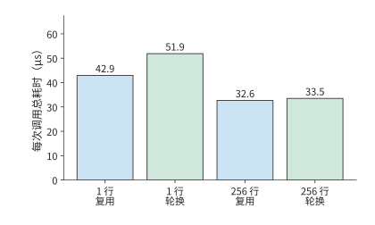

*图 4-37　RTX PRO 6000 的投影总耗时。每个条件测十一轮、每轮十六次调用，取每轮平均耗时的中位数；计时包含提交与同步。“复用”表示多次调用读取相同权重地址；“轮换”表示调用之间更换权重地址。*

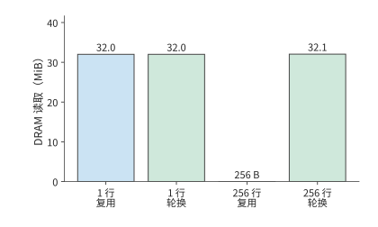

*图 4-38　相同四个条件下另行采集的 DRAM 读取计数。单行均约 32 MiB，256 行复用为 256 bytes、轮换约 32.1 MiB。访问计数与常规计时分别测量。“复用”与“轮换”分别表示保持和更换权重地址。*

单行在两种权重访问方式下的 DRAM 读取都是约 32 MiB，恰好对应整份权重的规模。两种条件读取了相同规模的片外权重，单行的时间差需要沿提交、执行与等待进一步定位。256 行则是另一种情况：复用同一份权重时只读 256 bytes，轮换不同的权重副本时约读 32.1 MiB，但常规计时都在 33 μs 左右。缓存改变了片外流量，而调用总时间还包含其他计算、传输与等待。

第 4.3 节区分的存储层次在这里变得可见。256 行的两种权重访问方式都有约 147 MiB L2 请求，远大于近乎为零的那次 DRAM 读取。缓存命中只是数据改由片上提供，计算单元的读取请求和局部传输仍然存在。源程序中的同一份权重，分块执行后会由多个计算块反复请求。

片上请求解释了为什么 DRAM 读取减少后仍有数据访问。再看计算。库把一次投影拆成了更多步骤：单行调用使用一个 GEMV kernel，256 行使用 GEMM 加 split-K 归约两个 kernel。split-K 把内积维度上的计算交给多个计算块，先形成部分输出，再由归约合并。这样能让更多计算块并行执行，但也要保存和读取部分结果，最后再做一次归约。因而第 4.1 节的一次数学乘法，在这里展开成多个阶段。

再按 RTX PRO 6000 的参数估算输入和权重均从片外读取时的执行时间：BF16 输入、FP32 累加的稠密矩阵运算峰值约 504 TFLOP/s、带宽 1.792 TB/s，两种行数的下界约为 18.7 和 21.1 μs。模型给出矩阵计算与片外读取所需的时间，计数器揭示缓存参与后各级接口的流量，kernel 路径解释额外的合并工作；总耗时还包含提交、同步与执行间隙。[^paired]

要进一步定位差距，可以把“忙了多久”与“工作时执行得多快”分开。设某硬件单元按理想速率完成全部操作需时 $S_r$，实际处于工作状态的时间为 $A_r$，任务总时间为 $T$，则

$$
\frac{S_r}{T}=\frac{S_r}{A_r}\times\frac{A_r}{T}.
$$

前一项表示工作时的实际速率与理想速率之比，后一项表示工作时间占总时间的比例。两个任务都耗时 100 μs，理想计算时间也都是 40 μs。执行第一个任务时，该单元只工作了 40 μs，工作时达到理想速率，但其余 60 μs 都在等待；执行第二个任务时，该单元工作了 80 μs，速率只有理想值的一半，等待时间则只有 20 μs。两者整体比值都是 40%，对应的优化方向却不同。

第一个任务更需要提前准备数据、安排更多相互独立的计算，或减少等待前一步结果的时间，类似第 4.4 节两槽到三槽的改动；第二个任务更需要改善执行粒度、指令与局部访问，类似第 4.2 节补齐浪费和分组调用的分析。[^nonmatrix]

> **实验 4-6 · 延伸：用 Mac 与 RTX 实测检验执行时间预测**
>
> 根据投影在两种平台上的实测总耗时，提出两个能够解释耗时差异的原因，再读取 DRAM、L2 与 kernel 记录，为每个解释列出预期现象和实际现象。随后画出 256 行调用的矩阵、部分结果与归约路径，指出需要哪些阶段时间才能区分计算单元工作时的执行效率与等待时间。将所得结果与假设输入和权重均从片外读取的模型对照。

### 4.8.4 在容量、速度、功耗与成本之间做选择

第 4.8.3 节得到任务完成时间，本节将其换算为成本与能耗。先比较按使用时间计费的方案，再把空闲时间和专用架构的固定投入计入。

设两台整机的小时成本为 $c_A,c_B$，完成同一任务的运行时间为 $t_A,t_B$。按运行时间计费时，每任务成本与 $ct$ 成正比，因此

$$
K_A<K_B\quad\Longleftrightarrow\quad\frac{c_A}{c_B}<\frac{t_B}{t_A}.
$$

右侧给出了每小时成本可以相差多少倍：如果 A 的速度是 B 的两倍，那么 A 每小时的成本低于 B 的两倍时，每个任务仍然更便宜。把小时成本换成平均功率，同一不等式比较的就是每任务能耗。第 4.8.3 节复用组中，Mac／RTX 时间比分别约为 3.9（单行）和 56（256 行）。RTX 一侧只计显卡，按 RTX PRO 6000 Workstation 的 600 W 功耗上限计算，一次单行调用最多耗能约 25.8 mJ，一次 256 行调用约 19.6 mJ。M2 Max 的官方资料没有给出整机功率；由上式反推，Mac 在单行调用期间的平均功率低于约 155 W 时，每次调用耗能就比 RTX 少，256 行时则要低于约 10.7 W。机器不变，仅改变矩阵尺寸，Mac 要保持能耗优势，允许的功率就从约 155 W 降到约 10.7 W。[^paired]

长期运行的服务还要计算空闲期间的成本。设一台机器处理请求时每秒生成 $q$ 个有效 token，每小时用于处理请求的时间比例为 $u$，则每小时产出为 $3600uq$，每 token 成本为 $c/(3600uq)$。生成速度翻倍而利用率减半，每小时产出不变，单位成本也不变。

能耗同样由功率与时间共同决定。以第 4.8.2 节的单请求 8K decode 为例，设两张卡都以功耗上限运行、每步用时等于读取下界：RTX 4090 为 450 W、16.22 ms，每步约 7.30 J；RTX 5090 为 575 W、9.12 ms，每步约 5.24 J。[^rtx-spec] 功率增加约 28%，每步能耗反而减少约 28%。一般形式为

$$
E=\int_0^T P(t)\,dt.
$$

对长期服务，统计一段时间内的总耗电量，再除以这段时间的有效产出，就能把空闲和预热期间的耗电一并计入。缩短运行时间可以减少执行任务时的耗电，提高利用率则能减少每个任务分摊的空闲耗电。第 4.1.3 节的能耗分账给出了一步 decode 耗电的量级估计：单请求、8K 上下文时每 token 0.534 J，其中 0.481 J 用于读取权重；batch 为 32 时，每 token 能耗降到约 0.068 J。这笔分账不含控制、时钟、静态漏电与空闲期间的功耗，所以用总耗电除以有效产出，得到的每 token 能耗会高于这一估计。[^energy-ledger]

专用化另有固定投入。设相对通用方案增加的固定成本为 $F_0$，每个有效输出节省可变成本 $\Delta c$，回本量为

$$
V^*=\frac{F_0}{\Delta c}.
$$

模型会被更新或替换，因此专用系统能用于该模型的时间有限。设有 $D$ 台机器，每台处理请求时的生成速率为 $q$，利用率为 $u$，模型可用时间为 $L$，总产出为 $DuqL$。这段时间内节省的运行成本达到固定投入后，专用方案才算回本。

> **例 4-3：专用化能否在模型寿命内回本？**
>
> 增量固定成本为 2,000 万美元，每百万合格输出 token 节省 0.50 美元。部署 100 台，每台处理请求时产出 10,000 token/s，利用率 50%，模型经济寿命一年，每年按 365 天计算。
>
> **比较回本所需输出量与一年可完成的输出量。** 回本量为 $20\,000\,000/(0.50/10^6)=4\times10^{13}$ token，即 40 万亿。一年产出为 $100\times10\,000\times0.5\times31\,536\,000\approx1.58\times10^{13}$ token，即约 15.8 万亿。
>
> **在一年内回本需要多大的实际服务规模？** 一年产出约为回本量的 39%。在单机速率与利用率保持不变时，至少需要 254 台运行一年。
>
> **模型寿命减半或利用率下降后的回本规模。** 模型半年更换，每台可用时间减半，至少需要 508 台机器维持给定利用率；若利用率从 50% 降至 25%，结果相同。

本例每年约节省 788 万美元，低于 2,000 万美元的固定投入；达到 40 万亿 token 的回本量需要约 2.54 年，超过题设的一年模型寿命。[^opentallas]

> **实验 4-7 · 延伸：负载改变后，芯片资源改动是否仍有收益**
>
> 选择一种架构和一种典型负载，提出一次资源改动。先用工作量、流量和依赖推导时间变化，再计算增加的容量及减少的等待。随后改变 batch 或上下文长度，求原有改动不再节省时间时的临界值。若方案需要额外固定投入，再根据每项任务节省的成本、加速器利用率和模型寿命，求收回固定投入所需的最低服务量。

> **实验 4-8 · 延伸：从能耗分账到功率封顶**
>
> 沿用第 4.1.3 节的能耗表与 Qwen3-8B 单请求 8K decode 一步的读取字节数。（a）把 batch 分别取 8、32、128，分别计算每 token 的权重、KV 与计算能耗，求权重项低于计算项的最小 batch。（b）把上下文改为 32K，求 KV 项等于权重项的 batch，并解释此后继续增大 batch 为什么不再明显降低每 token 能耗。（c）选择一张卡的 TDP、峰值算力与 HBM 带宽，求峰值速率下每 FLOP 的能量预算 $b$；设实际每 FLOP 能耗为 $1.5b$，按 $P\propto fV^2$ 分别求电压不变与电压随频率下降两种情况下的持续频率比；再把（a）中 batch 为 32 时一步的能量（32 乘以每 token 能耗）除以持续频率下这一步的时间，得到平均功率，比较它与 TDP 的差距。

[^qwen]: Qwen3-8B 固定配置、张量索引与模型实现见[模型配置](../calculations/configs/models/qwen3-8b/config.json)及[投影计算结果](../calculations/results/projection-qwen3-8b-rtx4090-b256.md)。

[^projection]: [Q 投影，RTX 4090，M=1](../calculations/results/projection-qwen3-8b-rtx4090-b1.md)；[M=256](../calculations/results/projection-qwen3-8b-rtx4090-b256.md)。

[^architecture]: [加速器架构与执行比较](../case-studies/accelerator-architecture.md)。

[^tpu]: Jouppi 等，*In-Datacenter Performance Analysis of a Tensor Processing Unit*，ISCA 2017，[归档论文](../references/files/papers/tpu-v1.pdf)。

[^nvidia]: [A100 架构白皮书](../references/files/specs/nvidia-a100.pdf)、[H100 架构白皮书](../references/files/specs/nvidia-h100.pdf)、[Hopper Tuning Guide](../references/files/documents/nvidia-hopper-tuning.md)、[Blackwell 技术简报](../references/files/specs/nvidia-blackwell-brief.pdf)与[CUTLASS Blackwell 功能](../references/outline-checks/2026-09-07/systems-cases/cutlass-blackwell.md)。

[^ascend]: [昇腾 950 官方架构白皮书](../references/files/specs/ascend-950-official.pdf)，§4.1—4.1.6；早期 DaVinci 与 CANN 分离架构的页级定位见[比较笔记](../case-studies/accelerator-architecture.md)。

[^nonmatrix]: [从算子利用率到执行中的等待](../case-studies/component-utilization-and-overlap.md)及[论文阅读记录](../references/proceedings/ASPLOS/2025/ascend-components-reading.json)。

[^apple]: [M2 Pro／Max 官方规格](../references/files/specs/apple-m2-pro-max.md)、[Apple GPU 架构说明](../references/files/documents/apple-gpu-architecture.md)、[Metal 存储模式](../references/files/documents/apple-metal-memory.json)、[M5 GPU Neural Accelerator 官方说明](../references/outline-checks/2026-09-07/systems-cases/apple-m5-evolution.md)。

[^fa4]: *FlashAttention-4*，MLSys 2026，[论文](../references/proceedings/MLSys/2026/papers/mlsys2026-ae8b0b5838ba510daff1198474e7b984.pdf)，§2.2、§3.1.1、公式 1—3 与表 1；[单 SM 独立复算](../calculations/results/fa4-qwen8-resource-balance.md)。

[^precision]: [硬件精度审查](../calculations/HARDWARE-AUDIT.md)、[DeepSeek V4-Flash 与 Qwen 逐阶段资源条件](../calculations/research/stage-resource-bounds/README.md)、[低精度与执行路径调研](../case-studies/kernel-orchestration-and-quantization.md)。硬件演进与成本归因见[成本下降调研](../research/token-cost-2023-2026/report.md)。

[^quant-exp]: [实验 4-2](../experiments/ch04/04-02/README.md)、[真实路由激活](../experiments/ch04/04-02/routed-activations/README.md)、[128 元素分组](../experiments/ch04/04-02/block-scales/README.md)、[单专家模型内替换](../experiments/ch04/04-02/model-intervention/README.md)。

[^workspace]: [实验 4-2 分配器峰值](../experiments/ch04/04-02/workspace/README.md)。

[^capacity]: [Qwen3-8B 配置](../calculations/configs/models/qwen3-8b/config.json)；[存储代际完整结果](../calculations/results/storage-generation-qwen8-235.md)。

[^evolution]: [从负载变化理解芯片演进](../case-studies/architecture-evolution.md)。

[^storage]: [存储代际比较结果](../calculations/results/storage-generation-qwen8-235.md)及[计算说明](../calculations/research/storage-generation-comparison/README.md)。

[^mess]: *Mess*，MICRO 2024，[作者接受稿](../references/proceedings/MICRO/2024/paper-011.pdf)，选读物理页 3—6；[访存并发算例及限制](../case-studies/memory-bandwidth-and-concurrency.md)。

[^coordinates]: [DeepSeek V4-Flash 共享专家搬移坐标结果](../calculations/results/v4-copy-coordinates-m32.md)与[源级计数说明](../calculations/research/v4-copy-coordinates/README.md)。

[^transfer]: [Hopper Tuning Guide](../references/files/documents/nvidia-hopper-tuning.md)、[昇腾 950 白皮书](../references/files/specs/ascend-950-official.pdf)、[Rubin 官方架构说明](../references/outline-checks/2026-09-07/systems-cases/rubin-rechecked.md)。

[^pipeline]: [Qwen 注意力输入流水基线](../calculations/results/attention-input-base.md)、[矩阵速率翻倍](../calculations/results/attention-input-matrix-double.md)、[建模与独立检查](../calculations/research/attention-input-pipeline/README.md)。

[^handoff]: [矩阵—向量交接说明](../calculations/research/matrix-vector-handoff/README.md)、[32 行两槽直接路径](../calculations/results/matrix-vector-direct-rows32-slots2.md)。

[^package]: [Blackwell 技术简报](../references/files/specs/nvidia-blackwell-brief.pdf)，10 TB/s NV-HBI；[CloudMatrix384 v2](../references/files/papers/cloudmatrix384-v2.pdf)，§3.3.1（910C 每 die 64 GB、1.6 TB/s，die 间每方向 270 GB/s）、§4.2 开头（decode 中每颗 die 放一个专家）与 §4.2.2；两款产品的 die 局部性计算见[教学推导脚本](ch04/derive.py)的 `die_locality` 项；[Vera Rubin 平台](../references/files/specs/nvidia-rubin-system.md)、[UB 与昇腾核对](../references/UB-ASCEND-NOTES.md)。

[^tpu8]: [Inside the Eighth-Generation TPU: An Architecture Deep Dive](../references/files/specs/google-tpu8.md)。

[^special]: [Groq TSP 论文](../references/files/papers/groq-tsp.pdf)、[IPU Programming Model](../references/files/documents/graphcore-programming.md)、[Cerebras WSE-3 数据表](../references/files/specs/cerebras-wse3-spec.pdf)、[SambaNova SN40L 论文](../references/files/papers/sambanova-sn40l-paper.pdf)。

[^opentallas]: [OpenTallas 案例](../case-studies/opentallas.md)。

[^stage]: [各阶段耗时下界的建模说明](../calculations/research/stage-resource-bounds/README.md)；实际模型算子范围见[Qwen3-8B prefill128 资源结果](../calculations/results/stage-resources-qwen8-b1-prefill128.md)。

[^hardware]: [硬件来源与精度审查](../calculations/HARDWARE-AUDIT.md)及[官方基础表](../calculations/results/hardware.md)。

[^measurement]: [实验 4-6 全部说明与原始记录](../experiments/ch04/04-06/README.md)、[投影计时汇总](../experiments/ch04/04-06/results/projection-summary.json)、[实际 DRAM／L2 计数](../experiments/ch04/04-06/results/projection-traffic.json)。

[^paired]: [配对投影成本与平均功率条件](../calculations/results/paired-projection-unknown.md)；RTX PRO 6000 的 600 W 取自[硬件输入表](../calculations/configs/hardware.json)，每次调用的能耗与 Mac 持平功率由[教学推导脚本](ch04/derive.py)的 `energy` 项算出，见[推导数据](ch04/teaching-data.json)。

[^host]: 主机、DMA 与统一地址的术语见 [CUDA Programming Guide](https://docs.nvidia.com/cuda/cuda-programming-guide/)。

[^rtx-spec]: [RTX Blackwell 架构白皮书](../calculations/sources/hardware/nvidia-rtx-blackwell-whitepaper.pdf)附录 A 表 3：RTX 4090 为 24 GB GDDR6X、1,008 GB/s、PCIe Gen 4、TGP 450 W，RTX 5090 为 32 GB GDDR7、1,792 GB/s、PCIe Gen 5、TGP 575 W；[A100 80GB 数据手册](../references/files/specs/nvidia-a100-80-spec.pdf)，PCIe 4.0 为 64 GB/s（双向合计）。H2D 与显存读取时间见[教学推导脚本](ch04/derive.py)的 `host_link` 项。

[^window-rtx]: [RTX 4090，128 个在途事务](../calculations/results/window-qwen3-8b-rtx4090-n128.md)、[RTX 4090，4,096 个](../calculations/results/window-qwen3-8b-rtx4090-n4096.md)、[RTX 5090，4,096 个](../calculations/results/window-qwen3-8b-rtx5090-n4096.md)、[RTX 5090，延迟 800 ns](../calculations/results/window-qwen3-8b-rtx5090-l800.md)；Mess 的 H100 延迟见其表 I 与图 3(h)。

[^allreduce-small]: [实验 7-3 公开运行记录核验](../experiments/ch07/07-03/README.md)，[两台 HGX H100 原始日志](../experiments/ch07/07-03/raw/hgx2.txt)：16 rank、NCCL 2.26.2，16 bytes AllReduce 非原位 24.96 μs、原位 24.93 μs。

[^decode-measured]: [实验 8-1 batch 扫描](../experiments/ch08/08-01/README.md)及其[逐行效率汇总](../experiments/ch08/08-01/efficiency.json)：RTX PRO 6000 Blackwell Workstation，Qwen3-8B BF16，vLLM 0.23.0，eager 模式；每行取每轮纯 decode 迭代的中位数，再取三轮中位数。与读取下界的比值由[教学推导脚本](ch04/derive.py)的 `measured_decode` 项算出。

[^pipeline-extra]: 三槽流水、计算翻倍变体及设计转折点由[教学推导脚本](ch04/derive.py)生成，完整时序见[推导数据](ch04/teaching-data.json)。

[^feedback]: [DeepSeek V3 技术报告](../references/text/deepseek-v3.txt)第 3.5 节，Suggestions on Hardware Design。

[^core-calculation]: 本章条件比较的[逐项复算](../calculations/results/core-principles.json)与[计算程序](../calculations/core_principles.py)。

[^v41-case]: [DeepSeek V4.1 官方技术报告](../calculations/sources/deepseek-v4.1-flash/DeepSeek_V41_Tech_Report.pdf)，第 1、2、3 节与第 6 节；[跨章会话的固定条件与复算](../calculations/results/v41-throughline.json)。

[^turing-evolution]: [Turing 官方架构白皮书](../research/ch04-architecture-evolution-2026-09-10/sources/nvidia-turing.pdf)，Turing Tensor Cores 与低精度推理。

[^volta-evolution]: [Volta 架构白皮书](../references/files/specs/nvidia-v100.pdf)，Tensor Cores 与混合精度章节。

[^blackwell-evolution]: [Blackwell Tuning Guide](../references/files/specs/nvidia-blackwell-guide.md)、[CUTLASS Blackwell 功能说明](../references/outline-checks/2026-09-07/systems-cases/cutlass-blackwell.md)及 [SM100 TMEM 示例](../references/outline-checks/2026-09-07/systems-cases/cutlass-01_mma_sm100.cu)；SM120（计算能力 12.0）每个 SM 的 128 KB 一级数据缓存与 100 KB 共享内存上限见 [CUDA 编程指南的计算能力表](../references/files/documents/cuda-compute-capabilities.md)。

[^rubin-evolution]: [NVIDIA Rubin GPU 架构说明](../references/outline-checks/2026-09-07/systems-cases/rubin-rechecked.md)，MoE 数据搬移、K 维指令吞吐与注意力加速。

[^apple-generations]: [Apple M3 官方架构介绍](../references/outline-checks/2026-09-07/systems-cases/apple-m3-evolution.md)、[M4 官方发布说明](../research/ch04-architecture-evolution-2026-09-10/sources/apple-m4-2024.md)与 [M4 Mac mini 规格](../calculations/research/hardware-apple-closure/apple-m4-mini-specs.md)。

[^ascend-history]: [DaVinci 架构论文](../references/files/specs/ascend-davinci.pdf)，§3.1—3.4；[Ascend C 指南](../references/files/specs/ascend-c-guide.pdf)，第 4 章耦合与分离架构；[CloudMatrix384 v2](../references/files/papers/cloudmatrix384-v2.pdf)，§3.3.1、§4.2.2。

[^evolution-quant]: [架构演进量化计算程序与说明](../calculations/research/architecture-evolution-quantitative/README.md)、[逐项计算结果](../calculations/research/architecture-evolution-quantitative/result.json)。参数读取[硬件输入表](../calculations/configs/hardware.json)，3090 补充自 [GA102 官方白皮书](../calculations/research/architecture-evolution-quantitative/sources/nvidia-ampere-ga102.pdf)表 9；完整模型配置与张量清单沿用本书 calculations。

[^bf16-quant]: [A100 架构白皮书](../references/files/specs/nvidia-a100.pdf)，BF16 与数值格式章节；[数值范围、存储与量化复算](../calculations/research/architecture-evolution-quantitative/result.json)。

[^ascend-cnn-history]: 笔者[《网络的智能应该放在哪里》](../references/author-materials/2026-09-09/network-intelligence.md)，2023 年演讲中关于 2016 年 ResNet 设计背景的回顾；[DaVinci 架构论文](../references/files/specs/ascend-davinci.pdf) §3.2、§3.4、表 5 和 Ascend 910 系统，分别给出 img2col、资源配比、每核带宽与 1.2 TB/s HBM。

[^nvidia-product-lines]: [RTX PRO 6000 产品规格](../references/files/specs/nvidia-rtx-pro6000-spec.pdf)，ECC、MIG 与产品配置；[Hopper Tuning Guide](../references/files/documents/nvidia-hopper-tuning.md)，NVLink；[GA102 白皮书](../calculations/research/architecture-evolution-quantitative/sources/nvidia-ampere-ga102.pdf)，3090 NVLink；[Blackwell Tuning Guide](../references/files/specs/nvidia-blackwell-guide.md)及 [CUTLASS Blackwell 功能](../references/outline-checks/2026-09-07/systems-cases/cutlass-blackwell.md)，SM100／SM120。

[^apple-capacity-quant]: [Apple 官方配置核对](../calculations/research/hardware-apple-closure.md)、[GPU 与容量组合](../calculations/research/hardware-apple-closure/gpu-memory-combinations.json)及[硬件表](../calculations/configs/hardware.json)。M3 Ultra 512 GB 由官方发布稿及 80 核 GPU 整机测试配置记录交叉确认。M5 Ultra 512 GB／1,200 GB/s 为 2026 年 8 月公布的规格，512 GB 配置计划于 2026 年 10 月下旬交付。

[^logicfolding]: 何庭波，*Huawei’s τ Chip Was Supposed to Melt?*，ChinaXiv:202609.00031v1，2026-09-04，[归档论文](../references/files/papers/202609.00031v1.pdf)，§II—V 与图 1—2：动态功耗占比、连线电容、NPU 同性能比较（29 TOPS、0.85→0.55 V、频率降 63%、功耗降 66%）、DSP 功耗降 25% 与投影面积降 40%。

[^energy-table]: [Dally，Hardware for Deep Learning，Hot Chips 2023 主题演讲](../references/files/documents/dally-hotchips2023.pdf)第 12、51—52 页：第 12 页 HFMA 1.5 pJ、HMMA 110 pJ、指令开销约 30 pJ 与开销占比 2000%／22%（45 nm）；第 51 页能耗表注明取自 Horowitz ISSCC 2014，工艺 45 nm；第 52 页三级存储 5／50／640 pJ 每 32 位字，未注明工艺；[Fine-Grained DRAM，MICRO 2017](../references/files/papers/fgdram-micro17.pdf)§1—2，HBM2 3.97 pJ/bit 及其分解，DRAM 能耗模型按 28 nm；[NVIDIA Grace Hopper Superchip Architecture In-Depth](../references/files/documents/nvidia-grace-hopper-blog.md)，2022-11-10，NVLink-C2C 1.3 pJ/bit。

[^energy-ledger]: [能耗分账结果](../calculations/results/energy-ledger-book.md)，读取[单请求 8K decode 结果](../calculations/results/qwen3-8b-decode-b1-s8192.json)的字节数与 FLOPs，按上表每字节与每 FLOP 能耗相加；运行 `python3 calculations/calc.py energy-ledger --format md` 可以复算。

[^hbm-stack]: [H100 架构白皮书](../references/files/specs/nvidia-h100.pdf)表 4：五堆 HBM3、5120 位接口、2619 MHz DDR、3352 GB/s（本章正文统一采用[数据手册](../references/files/specs/nvidia-h100-datasheet.pdf)取整的 3.35 TB/s，即 3,350 GB/s）、814 mm²、TSMC 4N 工艺，A100 826 mm²；[Blackwell 技术简报](../references/files/specs/nvidia-blackwell-brief.pdf)第 7 页两颗光罩上限 die 与 10 TB/s NV-HBI，表 3 的 B200 192 GB／7.7 TB/s；[HGX 平台组件说明](../calculations/sources/hardware/nvidia-hgx-components.md)表 1，HGX B200 每 GPU 180 GB、最高 8 TB/s；[H200 数据手册](../references/files/specs/nvidia-h200-datasheet.pdf)，141 GB／4.8 TB/s；[Micron HBM3E 产品页](../references/files/specs/micron-hbm3e-page.md)，1024 引脚、八层 24 GB、十二层 36 GB；[SK hynix HBM 产品页](../references/files/specs/skhynix-hbm-page.md)，9.6 Gbit/s 与 1.23 TB/s。

[^tdp]: [H100 数据手册](../references/files/specs/nvidia-h100-datasheet.pdf)，SXM 最大热设计功耗 700 W；[H100 架构白皮书](../references/files/specs/nvidia-h100.pdf)表 4，BF16 稠密 989.4 TFLOPS 与 TDP 700 W；[Blackwell 技术简报](../references/files/specs/nvidia-blackwell-brief.pdf)表 3，B200 1000 W。

## 本章小结

加速器分析从模型工作量出发：用状态大小筛选容量，用流量与带宽计算读取时间，用矩阵形状、精度与指令速率计算运算时间，再沿依赖安排执行。三家架构的演进说明，模型需求会改变资源配比。访问计数、kernel 记录与计时将这些预算落实为运行速度和任务成本。时间与能耗是两本账：带宽决定一步多快，每字节能耗与复用次数决定一步耗多少焦耳，功率上限又反过来压低可持续的频率。第 5 章继续研究布局、融合与调度，说明软件如何用好这些硬件资源。
