# 第 5 章 算子与运行时

同一份输入，刚用于一个输出，接着又要用于旁边的输出：若仍留在计算单元附近，下一次就可以直接使用；若已经换走，就要重新搬来。矩阵乘法的程序需要安排这些使用次序，并给输入和部分和留下合适的空间。仅仅改变一次处理多少输出、先算哪一块，就会改变重复搬移的次数，以及能够同时执行的任务数。

本章的矩阵乘算例需要约 103 GFLOPs 的运算，输入、权重和输出总共占 128 MiB，一种分块实现的读写量却达到约 3 GiB。扩大输出块可以让输入多用几次，把读写量减半，但每个块的局部存储需求也从 24 KiB 增至 80 KiB。有了这些数字，就能判断减少搬移节省的时间，能否抵消同时执行的块数变少带来的损失。

第 4 章介绍了加速器的计算能力、存储容量和数据传输带宽。本章讨论程序如何利用这些资源。以一段 FFN 为例，先说明主机如何发起计算、加速器如何完成任务，再分析矩阵乘的循环与分块，以及相邻算子如何共享中间结果。随后讨论编译器和运行时如何实现这些优化，最后计算这些优化能让完整请求节省多少时间。

本章主要使用 Qwen3-8B 的 FFN 作为算例：隐藏宽度 $H=4096$，FFN 中间宽度 $F=12288$。先同时处理 $M=1024$ 个 token，将各 token 的 4096 维特征向量排成输入矩阵 X，计算一支投影 $C=XW$；X、W 和 C 使用 BF16，每个元素占 2 bytes，矩阵乘使用 FP32 累加。M 表示一次调用处理的 token 数，每个 token 对应输入矩阵的一行。这些 token 可以来自 prefill 的一段输入，也可以来自同一批中的多个请求；单请求逐 token decode 时，M 为 1。[^model]

| 对象 | 形状 | 大小 | 在计算中的作用 |
| --- | --- | ---: | --- |
| 输入 X | $[1024,4096]$ | 8 MiB | 每个 token 的特征向量占一行，投影后得到该 token 的新特征向量 |
| 权重 W | $[4096,12288]$ | 96 MiB | 由 1024 个 token 的投影计算共享 |
| 投影 C | $[1024,12288]$ | 24 MiB | 随后做激活等处理 |

本章围绕三个问题展开：哪些工作在重复执行，哪些数据能够复用，哪些计算或等待决定了总时间。回答这些问题时，程序在加速器上的执行单位是 kernel。分析读写量、缓冲容量和 kernel 数，可以了解程序做了多少工作；再结合这些工作的执行顺序，才能计算程序需要多长时间。

## 5.1 加速器执行过程中的提交、搬移与同步

先考虑输入和输出都在 CPU 内存中的矩阵乘。CPU 准备输入，将输入送入 GPU，发起计算，再取回结果。这一过程需要两个处理器协作。理解两者何时独立执行、何时等待对方，是后续融合、流水和图重放的基础。

### 5.1.1 从框架调用到 kernel launch

PyTorch 是表达张量运算并组织模型执行的软件框架。调用其矩阵乘法时，CPU 首先执行框架代码：读取张量形状和数据类型，选择实现，准备地址和参数，再通过运行时与驱动向 GPU 提交任务。向加速器发起一次 kernel 执行称为 **kernel launch**。运行时负责提交任务、管理内存和同步执行；编译器则事先或在首次调用时生成加速器代码。

这里有三个层次：算子描述数学工作，例如矩阵乘和激活；kernel 在加速器上完成这项工作；launch 是 CPU 发起这次执行的动作。一个矩阵乘可以由多个 kernel 完成，几个逐元素算子也可以由同一个 kernel 完成。因此，既可以优化加速器上的计算，也可以减少主机准备和提交任务的开销。

CUDA 执行一个 kernel 时会启动多个线程。若干线程组成一个线程块（thread block），所有线程块组成一个线程网格（grid）。矩阵乘通常把输出矩阵分成多个 tile，交给不同线程块计算，块内线程协作读取输入并累加结果。加速器将线程块安排到有可用资源的 SM 上。较早完成的块释放资源，后续块便可开始；因此，grid 中的线程块可以分批执行。

kernel launch 采用异步提交。调用返回时，CPU 已完成这次提交，GPU 则按照任务队列和依赖关系执行。CPU 可以立即准备下一项任务。只有当 CPU 要用加速器的结果，或者要覆盖加速器还在使用的数据时，CPU 才需要等相应的加速器操作完成。[^execution]

这种分工形成一条简单流水：CPU 准备并提交任务，GPU 执行任务。大矩阵计算持续较久，CPU 有时间准备下一次调用；小算子迅速结束，GPU 更容易执行完队列中的任务，停下来等待 CPU 提交下一项。因此，可以从两方面加速：减少加速器等待主机的时间，以及缩短 kernel 本身的执行时间。

### 5.1.2 主机与加速器之间的数据复制

CPU 能够提前提交下一项任务，加速器却只有在输入到达后才能计算。先分析数据的传输过程，就能看清提交任务后、开始计算前还需要完成哪些工作。除了第 4 章介绍的 H2D 与 D2H，有独立显存的 GPU 还常在显存内部复制，常见的复制方向有三种：

| 名称 | 复制方向 | 典型对象 |
| --- | --- | --- |
| H2D | 主机内存 → 显存 | 当前 batch 的输入张量 |
| D2H | 显存 → 主机内存 | CPU 要使用的计算结果 |
| D2D | 显存 → 显存 | 固定输入缓冲或重排结果 |

上述矩阵乘的执行过程是：

> CPU 准备输入 → H2D → GPU 计算 → D2H → CPU 使用结果。

图 5-1 画出这些数据在两侧内存中的位置和复制方向。

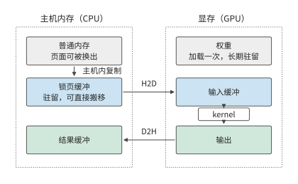

*图 5-1：H2D 把输入从主机的锁页缓冲搬进显存，D2H 把结果搬回主机；权重加载一次后留在显存，kernel 直接读取显存中的输入并写出输出。普通内存中的数据要先复制到锁页缓冲，才能由复制引擎直接搬移。*

运行完整模型时，并非每次调用都要重新传入所有数据。权重加载后可以一直保留在显存中，层间激活可以由下一个 kernel 直接读取，KV 也可以在后续 decode 步中继续使用。如果采样在 GPU 上完成，CPU 只需接收少量 token ID。因此，主机与加速器之间的复制次数，与加速器内部的读取次数并不相同：一份权重可以只传入一次，却在加速器上读取多次。

**例 5-1：主机到 GPU 的输入传输需要多久？** $[8192,4096]$ 的 BF16 张量占 $8192\times4096\times2=64$ MiB。RTX PRO 6000 经 PCIe Gen5 x16 接到主机，每个方向的标称带宽为 64 GB/s，[^pcie]传输时间为：

$$
T_{\mathrm{H2D}}=\frac{64\ \mathrm{MiB}}{64\ \mathrm{GB/s}}\approx1.05\ \mathrm{ms}.
$$

将输入分成两份 32 MiB 张量，每份约需 0.52 ms，总传输量保持不变。这样做的好处是第一份数据可以更早到达：GPU 开始计算前半批时，复制引擎继续传送后半批。第 5.3 节将进一步计算传输与计算重叠后的总时间。[^buffer]

主机内存的类型也影响复制过程。普通内存的页面由操作系统管理；**锁页内存（pinned memory）**在使用期间保持驻留，便于加速器直接搬移。从普通内存传输数据时，运行时常先将数据复制到内部的锁页缓冲：CPU 先复制一遍，再由加速器读取。这就是图 5-1 左侧的主机内复制。若每批都把 64 MiB 数据复制进新建的锁页缓冲，就在 H2D 之前多做了一次主机复制。让 CPU 直接在可复用的锁页缓冲中准备输入，可以省去这次中转和反复分配。[^execution]

### 5.1.3 stream、event 与完成顺序

数据传到哪里，决定哪个处理器能够使用它；数据何时传完，则决定后续计算何时能够开始。异步调用返回后，复制可能仍在进行，需要用执行顺序保证计算不会读到尚未传完的输入。CUDA 的 **stream（流）**是一串按顺序执行的加速器任务。把 H2D 和读取该输入的 kernel 放在同一 stream 中，计算就排在复制之后；CPU 可以连续提交两项工作。

若复制和计算放在不同 stream 中，就用 **event（事件）**指定跨流的执行顺序。复制流在 H2D 后记录事件，计算流等待事件，再使用这份输入。等待发生在计算流的加速器任务序列中，CPU 仍可继续提交其他工作。

图 5-2 把两条流和两个事件画在同一条时间线上。

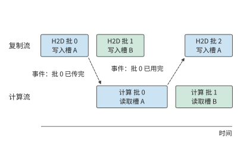

*图 5-2：复制流依次传入各批输入，计算流读取它们。计算批 0 要等“批 0 已传完”事件；批 2 要重新写入槽 A，必须等“批 0 已用完”事件。虚线箭头表示等待事件，不搬移数据。两个槽的交替使用在第 5.3.2 节展开。*

事件也可以用来确定缓冲何时能够再次使用。设当前输入从主机缓冲复制到 GPU 的缓冲槽 A。复制完成后，CPU 就可以往主机缓冲写入下一批输入；槽 A 则要等 GPU 用完当前输入后才能覆盖。两块缓冲虽然保存同一批数据，却要在不同的时刻才能重新使用。

| 缓冲 | 最后使用者 | 随后的动作 |
| --- | --- | --- |
| H2D 的主机源缓冲 | 复制引擎读取 | CPU 写入下一批输入 |
| GPU 输入缓冲 | 读取该输入的 kernel | 复制引擎写入下一批输入 |
| D2H 的加速器源缓冲 | 复制引擎读取 | GPU 写入新结果 |
| D2H 的主机目标缓冲 | 复制引擎写入 | CPU 读取当前结果 |

因此，应在最后一次读写之后记录事件，让随后使用这块缓冲的操作等待该事件。CPU 需要 D2H 结果时，可以等待对应事件；其他无关的加速器任务继续运行。第 5.3 节的双缓冲正是把两套这样的使用顺序交错起来。

这套顺序也解释了程序为什么会停住不动。每一次等待都指向一个具体的事件，只要该事件始终未被记录，等待就不会结束；表现出来是程序停住，而不是变慢。上表中四块缓冲各自的最后使用者，就是四个容易漏记的事件：漏掉 GPU 输入缓冲的“已用完”事件，复制引擎就一直不能写入下一批。跨流的循环等待也一样：A 流等 B 流记录的事件，B 流的这项任务又排在 A 流尚未完成的工作之后，两条流都不会前进。多卡执行还多一种来源：集合通信要求参与的每张卡都发起同一次调用，只要有一张卡少发起一次，其余的卡就会一直等待这个不会到来的对端（第 6.4 节）。

排查时先看被等的那一侧是否还在前进：仍有结果产出，就只是慢，应回到第 5.1.4 节的时间线逐段计时；完全不动，才是在等一个不会到来的事件，第 10.4.5 节的慢节点属于前一种。为等待设置超时，超时后打印各流尚未完成的任务，就能确定缺的是哪个事件。

### 5.1.4 从提交时间到结果可用时间

把复制、计算和缓冲使用的顺序连起来，才能确定结果何时可用。图 5-3 将这一顺序画成时间线。

**例 5-2：为什么提交耗时、加速器耗时与完整调用耗时不同？** 输入已在主机准备好。CPU 在 0–3 μs 内提交全部任务，第一项加速器工作从 3 μs 开始；H2D、kernel、D2H 分别用 8、20、4 μs，加速器按依赖连续执行。

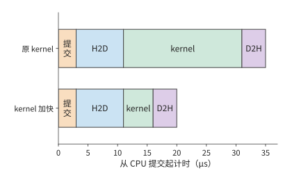

*图 5-3：CPU 提交、H2D 输入复制、kernel 执行与 D2H 结果返回依次发生。上方 kernel 执行 20 μs，结果在第 35 μs 可用；下方 kernel 执行 5 μs，结果在第 20 μs 可用。*

CPU 提交任务用时 3 μs，kernel 执行用时 20 μs，CPU 到第 35 μs 才能使用结果。若把 kernel 的执行时间从 20 μs 缩短到 5 μs，结果就能在 $3+8+5+4=20$ μs 时使用。kernel 速度提高到原来的四倍，整次执行则从 35 μs 降至 20 μs，加速比约为 1.8；剩余 15 μs 由提交和复制构成。

例 5-2 问到的三种耗时，正对应三种计时位置。测量结果取决于在什么位置开始和结束计时。在异步调用前后读取 CPU 时钟，测得提交所用的时间；若在结束计时前等待结果，则测得从发起到完成的时间。CUDA event 在加速器任务序列中标出起止位置，测得加速器执行这段任务所用的时间。性能分析工具（profiler）把主机调用、加速器计算和复制画在同一条时间线上，提交之后的排队、依赖等待和执行就能逐段看清。

图 5-3 的时间线从输入准备好开始。若程序尚未编译，时间线之前还要加上一次准备工作：首次调用可能需要编译代码或分配工作区。假设首次编译用 100 ms，随后每次执行 1 ms，调用一次共 101 ms，调用 100 次共 200 ms，平均每次 2 ms。调用次数越多，平均分摊的编译时间越少，而每次执行所需的 1 ms 保持不变。第 5.5 节将用同一方法判断分桶（把输入补齐到少数代表形状）和特化（为具体形状生成专门程序）需要重复多少次才值得。

### 5.1.5 一个 kernel 在 SM 上如何执行

图 5-3 把 kernel 画成一段 20 μs 的整体；它能否缩短到 5 μs，取决于这段时间里 SM 上发生了什么。本节固定一个 kernel，沿线程、驻留、访存、矩阵指令和同步五步，推导其在一个 SM 上如何执行。kernel 取第 4.3.2 节的乘加块：输出块 128×128，沿 K 每步 64；BF16 的 A 块与 W 块各 16 KiB，FP32 累加器 64 KiB，三者都放在共享内存中，构成工作集（计算期间必须同时留在局部存储中的数据），共 96 KiB。一个线程块负责一个输出块，含 256 个线程。硬件取 H100 的一个 SM：最多同时驻留 2048 个线程（即 64 个 warp，warp 在下文解释）和 32 个线程块，寄存器 64K 个（每个 32 位），共享内存 228 KB（CUDA 文档的写法，即 233,472 bytes）。kernel 每线程用 128 个寄存器，每条加载指令每线程取 16 bytes，每个 warp 最多挂起 4 条未完成的加载，矩阵指令形状为 16×8×16，显存延迟取 600 ns。[^sm]

**warp：一起发射的 32 个线程。** SM 不逐个线程发射指令，而是把 32 个线程编成一组，一起发射，这一组称为 **warp**。同一 warp 的 32 个线程执行同一条指令，各自处理不同的数据；一条加载指令因此一次给出 32 个地址。256 个线程的线程块含 8 个 warp。第 5.2.3 节分析共享内存 bank（存储体，共享内存中可独立服务请求的分区）时所说的 32 个 lane，就是一个 warp 中的 32 个线程：它们同时给出的 32 个地址落在多少个 bank 上，决定这条指令要占用共享内存接口几轮。

**驻留与占用率。** 线程块要在 SM 上驻留，即留在 SM 上随时可被调度执行，必须同时分到线程槽（每个线程占一个）、寄存器和共享内存。每类资源能容纳的线程块数，等于资源总量除以每块需求后向下取整；驻留块数取各类中的最小值：

| 资源 | SM 总量 | 每个线程块的需求 | 可容纳的线程块数 |
| --- | ---: | ---: | ---: |
| 线程槽 | 2048 | 256 | 8 |
| 寄存器 | 64K 个 | 256 × 128 = 32K 个 | 2 |
| 共享内存 | 228 KB（233,472 bytes） | 96 KiB 工作集 + 每块预留 1 KiB = 97 KiB | 2 |
| 线程块数上限 | 32 | 1 | 32 |

寄存器与共享内存都只允许 2 块，因此 SM 上驻留 2 个线程块，即 16 个 warp。**占用率（occupancy）**指驻留 warp 数占 SM 最大驻留 warp 数的比例，这里为 16/64 = 25%。图 5-4 把三类资源画成三根横条：两个线程块把寄存器恰好填满，把共享内存填到只剩 34 KiB，线程槽却只用了四分之一。

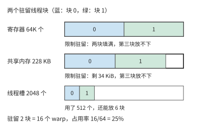

*图 5-4：三条分别表示 SM 的寄存器、共享内存与线程槽总量，蓝、绿为两个驻留线程块的占用。寄存器恰好填满，共享内存剩余 34 KiB 放不下第三块的 97 KiB，两者同时限制驻留；线程槽只用了 512 个。每块 256 线程、每线程 128 个寄存器、96 KiB 共享内存，另加每块 1 KiB 预留。*

改哪项资源才有用，取决于哪项限制最紧。把 64 KiB 累加器从共享内存挪进寄存器，每个线程要多保存 64 个 FP32 值，即多用 64 个寄存器。每块的共享内存需求随之降到 32 KiB，可容纳 6 块；但若每线程原来只用 64 个寄存器，加上累加器就是 128 个，寄存器仍只允许 2 块。驻留块数不变，限制项只是从两项变成寄存器一项。要让第三块驻留，必须同时压低每线程寄存器和每块共享内存，或者缩小每块的工作集。

**延迟隐藏：驻留的 warp 提供在途请求。** 占用率之所以重要，是因为独立的访存请求都来自驻留的 warp：在途请求足够多，一个请求等待返回时，接口仍被其他请求占满，这称为延迟隐藏。第 4.3.3 节的 Little 定律给出维持带宽所需的在途字节数：带宽 × 延迟。取 H100 显存带宽 3.35 TB/s、延迟 600 ns，整卡需要约 2.01 MB 在途，平摊到 132 个 SM，每个 SM 要保持约 15.2 KB 在途。再计算驻留的 warp 能提供多少：一个 warp 的一条加载指令让 32 个线程各取 16 bytes，共 512 bytes；每个 warp 最多挂起 4 条未完成的加载；16 个 warp 合计 32 KiB。

$$
B_{\mathrm{need}}=\frac{3.35\ \mathrm{TB/s}\times600\ \mathrm{ns}}{132}\approx15.2\ \mathrm{KB},\qquad
B_{\mathrm{have}}=16\times4\times512\ \mathrm{bytes}=32\ \mathrm{KiB}.
$$

可用在途字节是需求的 2.15 倍，只驻留 8 个 warp（一个线程块）也已足够。第 5.2.2 节会遇到“大块少读数据却可能变慢”的现象，这里给出它的定量形式：工作集越大，驻留块越少，可用的在途字节越少；一旦低于需求，有效带宽就降为可用在途字节除以延迟，接口带宽再高也用不上。

**矩阵指令的粒度。** 第 4.2.1 节说明矩阵单元按固定形状的块执行。这里一条矩阵乘加指令（MMA）的形状为 16×8×16：A 片 16×16，W 片 16×8，一条指令完成 2×16×8×16 = 4096 次浮点操作。一个 128×128×64 的块要发 (128/16) × (128/8) × (64/16) = 8 × 16 × 4 = 512 条指令，与块的 2,097,152 FLOPs 相符。这 512 条由 8 个 warp 平分：输出块含 8 × 16 = 128 个 16×8 的输出片，每个 warp 负责其中 16 片，沿 K 四步共发 64 条。MMA 指令在寄存器中累加，本节的块把累加结果放在共享内存里，每个 K 步前后要在寄存器与共享内存之间搬移这 16 片；上一段把累加器挪进寄存器的方案，省掉的正是这笔搬移。

MMA 有两种发出方式。warp 级指令由一个 warp 单独发出，操作数要先装进该 warp 的寄存器；Hopper 的 warpgroup 级指令由 4 个相邻 warp（合称一个 warpgroup）联合发出，可以直接从共享内存取操作数，并且异步执行：发出指令的 warp 在等待结果的同时可以做其他工作。FlashAttention-3 正是利用这种指令安排计算重叠。[^fa]

**同步：异步复制与栅栏。** 第 4.4.2 节用两个输入槽让加载与计算重叠，前提是知道“槽已填满”和“槽已用完”两个时刻。在 SM 上，这两个时刻由**栅栏（barrier）**给出。栅栏是共享内存中的一个计数器：参与者完成自己的一步后到达栅栏，计数达到预定值时，等在栅栏上的线程被放行。异步复制（发出后由硬件在后台完成、发出者不必等待的复制）完成时同样到达栅栏，并按搬入的字节数计数。每个槽配一对栅栏：“满”栅栏由复制完成触发，计算等它；“空”栅栏由计算结束触发，下一次复制等它。

有了栅栏，warp 可以分工：一个 warp 只发复制（生产者），其余 warp 只做计算（消费者），这种安排称为 **warp specialization**。生产者 warp 发出块 j+1 的复制后不必等它完成，转而等“空”栅栏，准备写入块 j+2；消费者 warp 每等到一次“满”栅栏，就接着计算下一块。

先计算复制和计算各自的耗时。把 H100 的显存带宽 3.35 TB/s 与 BF16 稠密矩阵峰值 989.4 TFLOP/s 平分到 132 个 SM，每个 SM 约得 25.4 GB/s 和 7.50 TFLOP/s，下面按该线程块独占该 SM 的份额计算。一个 K 块的 A、W 共 32 KiB，复制约需 1.29 μs；块乘为 2,097,152 FLOPs，计算约需 0.28 μs。复制比计算慢约 4.6 倍，原因是该块每搬 1 byte 只做 64 次浮点运算，而 H100 的矩阵峰值与显存带宽之比约为 295 FLOP/byte。图 5-5 按这两个时间画出两个槽上的四个 K 块。

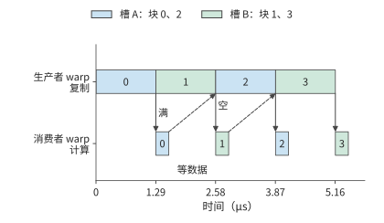

*图 5-5：上行是生产者 warp 发出的异步复制，下行是消费者 warp 的计算；蓝、绿分别为槽 A、B。实线箭头为“满”栅栏，复制完成后计算才能开始；虚线箭头为“空”栅栏：块 0 在 1.57 μs 用完槽 A，块 2 的复制到 2.58 μs 才开始，生产者不必等槽。H100 一个 SM 上每块复制 1.29 μs、计算 0.28 μs；复制首尾相接，消费者每算完一块就等下一次“满”栅栏。*

这种分工是第 4.2.3 节流水的软件实现。那里的三种资源是矩阵单元、共享内存接口与指数单元；这里生产者 warp 驱动复制，占用共享内存接口，消费者 warp 驱动矩阵与指数运算，栅栏让双方只在数据交接处等待。FlashAttention-3 按此设计：生产者 warpgroup 发 K、V 块的复制，两个消费者 warpgroup 交替做矩阵乘和 Softmax，一个在算指数时，另一个在做矩阵乘。第 5.3.2 节将沿用这里每块复制 1.29 μs、计算 0.28 μs 的取值推导流水总时间，第 5.3.3 节再展开 FlashAttention 的分块。[^fa]

异步批量复制对数据布局还有一项要求。第 5.2.3 节将用 padding 在每行末尾补一个字来分散 bank；异步批量复制按张量描述符（记录张量形状与步长的结构）整块搬移，不能在行间插入填充，于是改为按固定规则置换块内的地址，这种做法称为 **swizzle**：数据总量不变，同一列的请求仍落到不同 bank。

**对应到昇腾。** 本节讨论的线程、驻留、访存、矩阵指令与同步这五步，在昇腾上对应第 4.2.3 节与第 4.6.2 节的另一组部件：

| 本节的机制 | NVIDIA GPU | 昇腾 |
| --- | --- | --- |
| 发射与分工 | warp 是 32 个线程的发射单位，生产者与消费者 warp 在同一 SM 内分工 | AIC、AIV 各是独立的核而不是 warp：矩阵工作在 AIC 上执行，向量工作在 AIV 上执行，各有自己的指令流 |
| 驻留与容量 | 寄存器、共享内存、线程槽决定每个 SM 驻留的线程块数 | L0、L1 与统一缓冲的容量决定每个核一次容纳的块 |
| 搬移与同步 | 异步复制到达栅栏，warp 等栅栏 | MTE／NDDMA 搬移，BufferID 标识缓冲并组织交接 |

上文“在途字节足够”的结论，依赖 600 ns 延迟与每 warp 4 条未完成加载。**翻转条件**：延迟升到 1000 ns、每个 warp 只能挂起 2 条加载时，每个 SM 需要 25.4 KB 在途，16 个 warp 只能提供 16 KiB，覆盖率（可用在途字节与需求之比）降为 0.65；补齐缺口至少要 25 个 warp，即 4 个线程块，而寄存器与共享内存只允许 2 块。此时 25% 的占用率不再足够：要么缩小工作集，换取更多驻留块；要么改用异步批量复制，让一个线程一次请求整块数据，在途字节按块大小计，不再依赖 warp 数。

> **练习 5-1 · 延伸：把输出块缩为 64×64，占用率由哪项资源决定**
>
> 保持 256 个线程、每线程 128 个寄存器，把输出块改为 64×64，K 步长仍为 64，累加器仍放在共享内存中。求每块的共享内存需求、四类资源各自允许的线程块数与占用率，指出哪项限制最紧。再把每线程寄存器降为 64 个重算一次，说明限制转移到了哪项；最后按 600 ns 延迟与每 warp 4 条加载，检查在途字节是否仍能覆盖需求。

## 5.2 单个算子的分块、布局与实际访存

大矩阵计算可以像切豆腐一样分块：先分成适合处理的小块，再逐块完成。不过，切成什么形状，要同时看计算单元能处理什么，以及其附近能容纳多少数据。第 4 章已经说明，硬件矩阵指令支持有限的形状；整个加速器上的多个计算单元可以同时处理许多块，每份工作内部仍要组织成硬件能够执行的小步。

分块还要让搬来的数据多用几次。沿用第 4 章的工作台比喻，当前输入和尚未算完的部分和要放在计算单元附近，用完才能腾出空间。输出块太小，同一份输入可能要为不同的输出块反复搬移；块太大，又会占用更多局部存储，挤掉其他可以同时执行的任务。下面先跟踪一个输出需要哪些数据，再把多个输出组织成块，分析块大小、访问顺序和局部容量如何共同影响复用。

### 5.2.1 矩阵形状与重复读取

以下用 A 表示章首的输入 X，投影写作 $C=AW$，其中 $M=1024,K=4096,N=12288$。A、W、C 采用 BF16，大小分别为 8、96、24 MiB。若 A、W 各读一次，C 写一次，只需传输 128 MiB。要解释一种分块实现为何产生约 3 GiB 的访问，先看单个输出如何算出。

计算 C[i,j] 时，取 A 的第 i 行和 W 的第 j 列，将对应元素相乘，再沿 K 维求和。接着计算右边的 C[i,j+1]，W 换成相邻一列，A 却仍是同一行。图中两次计算的蓝色部分完全相同。

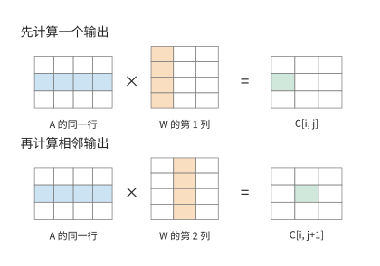

*图 5-6：先算一个输出，再算相邻输出。蓝色表示所用的 A 行，橙色表示所用的 W 列，绿色表示本次得到的输出元素。图中矩阵缩小为示意尺寸，实际算例的 K 为 4096。*

如果这行 A 在两次使用之间仍留在局部存储或缓存中，就能直接复用；若已被替换，就需要再次向下一级存储请求数据。转到下一行输出时，W 中的元素也会再次使用。同一份数据在数学运算中需要反复使用。程序如何安排这些运算，决定了这份数据要经过存储接口多少次。

本节以工作缓冲和下一级存储之间的接口为计数位置，累计程序每次读入与写出的字节数。下文约 3 GiB 的访问量，也按这一接口计算。[^tiles]

把图中的逐元素计算写成循环，就是：

```python
for i in range(M):
    for j in range(N):
        acc = 0.0
        for k in range(K):
            acc += A[i, k] * W[k, j]
        C[i, j] = acc
```

内层 k 循环每执行完一遍，得到一个输出。一次乘加计两个 FLOPs，计算全部输出所需的运算量为：

$$
F_{\mathrm{gemm}}=2MKN\approx103\ \mathrm{GFLOPs}.
$$

比较的基准是三份 BF16 矩阵各经过接口一次的读写量：

$$
V_{\mathrm{once}}=2(MK+KN+MN)=(8+96+24)\ \mathrm{MiB}=128\ \mathrm{MiB}.
$$

其中 MiB 为 $2^{20}$ bytes。以各输入读一次、输出写一次为基准，下文据此计算分块增加了多少重复访问。

循环顺序还决定每次访问的地址。W 按行连续存储时，上面的内层循环依次读取 W[k,j]、W[k+1,j]，地址相差 N 个元素。若改成 i、k、j 的顺序，内层便依次读取 W[k,j]、W[k,j+1]，同时将 A[i,k] 用于多个输出。这样一次连续传输取得的数据能立即参与计算。

不过，新顺序也要同时保存一段输出的累加结果。若局部存储容纳不下这些结果，每轮更新都可能增加对下一级存储的读写。接下来用分块限制同时保留的数据量，让输入复用与输出保存相互配合。

### 5.2.2 容量约束下的分块复用

先选 C 的一小块作为当前要完成的输出，为该 $m\times n$ 输出块分配累加缓冲区。每次沿 K 维读入一对输入块：A 块为 $m\times k$，W 块为 $k\times n$。两块相乘，更新同一份输出累加器；换入下一对输入块时，已经得到的部分和继续保留。直到沿 K 完成全部累加，才把结果转为 BF16 并写出。这里的块是软件为复用数据而组织的，其内部还可以分解为多次硬件矩阵指令。分块本身不要求先把原矩阵复制成许多独立的小矩阵，具体搬移由执行程序安排。

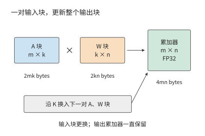

*图 5-7：固定当前 m×n 输出块，沿 K 依次搬入对应的 A、W 块，反复更新同一份部分和，全部累加结束后才写回。A、W 输入为 BF16，累加器为 FP32。图示为软件分块，一次块乘可包含多次硬件矩阵指令；尺寸符号表示形状，方框面积不按字节数缩放。*

A 块中的每个元素可用于 n 列输出，W 块中的每个元素可用于 m 行输出。扩大输出块，就能让一次读入的数据参与更多乘加；同时也要保存更多输入和输出部分和。

**例 5-3：扩大矩阵输出块能减少多少输入读取？** 图中的 A 输入块、W 权重块和输出累加器分别占 $2mk$、$2kn$ 和 $4mn$ bytes。只使用一组输入缓冲时，局部存储需求为：

$$
S=\underbrace{2mk}_{A\text{ 块}}+\underbrace{2kn}_{W\text{ 块}}+\underbrace{4mn}_{\text{累加器}}\quad\mathrm{bytes}.
$$

取 $k=32$，先用 64×64 输出块。A 块和 W 块各占 4 KiB，累加器占 16 KiB，合计 24 KiB。把输出块扩大到 128×128 后，两份输入各占 8 KiB，累加器占 64 KiB，合计增至 80 KiB。输入复用增多，输出累加器却增长得更快。

接着计算全矩阵的读写。假设每个输出块独立读取自己的输入，不考虑不同输出块之间的缓存复用。N 方向有 N/n 个列块，每个列块都要遍历 A；M 方向有 M/m 个行块，每个行块都要遍历 W。最终 C 只写出一次，因此：

$$
V=\underbrace{2MK\frac{N}{n}}_{A\text{ 的重复读取}}+\underbrace{2KN\frac{M}{m}}_{W\text{ 的重复读取}}+\underbrace{2MN}_{C\text{ 写出}}.
$$

64×64 输出块将输出划为 16 个行块、192 个列块。192 个列块各读一遍 8 MiB 的 A，共 1536 MiB；16 个行块各读一遍 96 MiB 的 W，也是 1536 MiB。加上 24 MiB 输出，总量为 3096 MiB。这就是本节开头约 3 GiB 的来源。

改成 128×128 后，行块数从 16 减到 8，列块数从 192 减到 96，两份输入的读取均减半。输出大小不变，总量降至 $768+768+24=1560$ MiB。图 5-8 把这项收益与占用的局部存储放在一起比较。

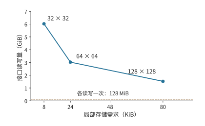

*图 5-8：每个点标出输出块形状。扩大输出块能减少跨接口的重复读取，但需要更多局部存储。虚线为三份矩阵各经过一次的 128 MiB；比较条件为 k=32、单组输入缓冲、各输出块独立读取输入。*

完整数值如下，算术强度用同一矩阵乘的 FLOPs 除以上述接口字节数计算：

| 输出块 | 局部存储需求 | 工作缓冲与下一级存储之间的访问 | 算术强度 |
| --- | ---: | ---: | ---: |
| 32×32 | 8 KiB | 6168 MiB | 15.9 FLOP/byte |
| 64×64 | 24 KiB | 3096 MiB | 31.7 FLOP/byte |
| 128×128 | 80 KiB | 1560 MiB | 63.0 FLOP/byte |

三种输出块的算术强度都远低于第 5.1.5 节给出的 H100 矩阵峰值与显存带宽之比 295 FLOP/byte。只看这一级接口的流量，三种分块都处于带宽受限一侧，矩阵单元的 MFU 上限分别只有 5%、11% 和 21%。扩大输出块能把算术强度推向交点，但单靠这一级分块还越不过交点，其余的复用要靠更靠近计算单元的存储层次。

访问量接近减半，时间是否随之减半，还要看加速器能同时安排多少工作。GPU 上，输入缓冲放在共享内存中，累加器可以放在共享内存或寄存器中。这里沿用第 5.1.5 节的做法：每个线程块负责一个输出块，输入缓冲与累加器都放在共享内存中。硬件取 RTX PRO 6000 的一个 SM：该卡属于计算能力 12.x，每个 SM 的共享内存上限为 100 KB（即 102,400 bytes），每个线程块另占 1 KiB 预留。[^cc12]

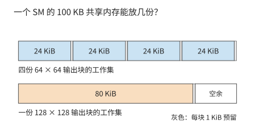

*图 5-9：条形总长均表示 RTX PRO 6000 一个 SM 的 100 KB 共享内存。24 KiB 的工作集连同每块 1 KiB 预留，恰好放下四份；80 KiB 的只能放一份。*

同时驻留的线程块可以交错发起访存：一些块等待数据时，另一些块继续工作。同时驻留的工作集从四份减为一份，等待访存期间能执行的其他计算也就少了。因此，大块虽然少读数据，实际获得的带宽却可能下降。第 5.1.5 节已经算过这一点：驻留的 warp 提供在途访存请求，在途字节不足时，有效带宽就低于接口带宽。

假设两种实现都受这一层的带宽限制，有效带宽分别为 $B_{64}$ 和 $B_{128}$，则：

$$
\frac{T_{128}}{T_{64}}=\frac{1560}{3096}\frac{B_{64}}{B_{128}}.
$$

若带宽相同，时间接近减半；若大块只能获得原来四成的带宽，时间比约为 $0.504/0.4=1.26$，耗时反而增加约 26%。可以先按容量排除容纳不下的方案，再按访问量缩小比较范围，最后测量实际执行效率。第 5.4 节将把这一过程交给编译器。

### 5.2.3 数据布局：让并行请求分散到不同 bank

上一小节中，大块虽然少读数据，却可能因并行度下降而变慢。并行度不仅取决于驻留多少线程块，也取决于这些线程发出的读取请求能否同时得到服务。先看局部存储的布局。考虑 32×32 的 FP32 暂存块，其所在的局部存储分成 32 个 bank；每个 bank 每轮提供一个 32-bit 字，bank 号就是字地址对 32 取模的结果。第 5.1.5 节已经介绍，一个 warp 的 32 个线程就是 32 个 lane；32 个 lane 各读取同一行中的一个字时，请求分散到 32 个 bank；读一列时，行跨度为 32 个字，所有地址集中到同一 bank，需要 32 轮。

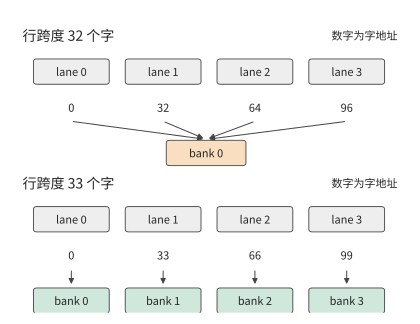

*图 5-10：同一列的 32 个不同字由 32 个 lane 同时请求。上半图行跨度为 32 个字，请求集中到同一 bank；下半图补齐为 33 个字，请求分散到 32 个 bank。图中画出前四个请求；假设每个 bank 每轮提供一个 32-bit 字，不计广播。*

在每行末尾补一个字，行跨度变为 33。同一列相邻行的 bank 号便依次加一，32 次请求分散到 32 个 bank，一轮即可完成。所占空间由 4096 bytes 增至 4224 bytes，只多约 3.1%。有效数据和读取次数都没有变化，但原本需要分 32 轮完成的列读取，现在可以在一轮内完成。

行末补的这个字就是 padding，它不改变计算本身，只让已有的并行请求分散到不同 bank。

padding 用多占的字节换来分散。也可以不增加字节，只改变存放位置：把第 $r$ 行第 $c$ 列的元素放到第 $c\oplus r$ 列，$\oplus$ 为按位异或。行跨度仍是 32 个字，读一列时，32 个 lane 取到的列号是 $c\oplus r$ 随 $r$ 变化的 32 个不同取值，bank 号因此互不相同，同样一轮完成。NVIDIA 的矩阵乘法模板库 CUTLASS 把这种改变存放位置的做法称为 **swizzle**。swizzle 节省了补齐的空间，代价是每次访问都要先按公式算出列号。

### 5.2.4 沿哪个维度切分：并行任务与部分和

padding 解决的是请求能否同时得到服务。如果程序本来就只安排了少量任务，改变地址布局还不够，还要把计算拆开。以 RMSNorm 为例：先根据一行元素的均方值计算共同的缩放因子，再缩放这一行。求缩放因子是一次归约：它来自整行平方和；随后每个元素乘以该因子和对应的可学习参数 gamma。对 $[1024,4096]$ BF16 输入，一组处理一行，可以独立安排 1024 组；而在 decode 阶段，单请求每次只生成一个 token，同样的分法只产生一组，加速器的大量执行资源就会空闲。

把每行分成八个 512 元素片段，可以增加第一阶段的并行任务。完整归约随之变成三个阶段：每个片段产生局部平方和，合并八个局部和得到行缩放因子，再用该因子归一化输入。前两阶段只需传递很少的数，但最后一阶段要重新读取原始数据。

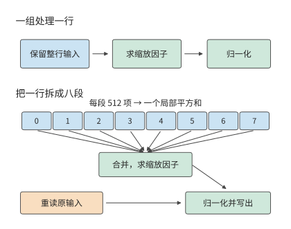

*图 5-11：上行由一组处理完整一行，输入保留到归一化结束；下行把一行分为八段，先求局部和，再合并，最后重读输入并归一化。每行 4096 个 BF16 元素；图中仅画一行，推广到 1024 行时，第一阶段任务数由 1024 增至 8192。橙色框表示增加的原输入读取。*

沿着图 5-11 的箭头计数，就能求出增加并行任务所付出的访存代价。仍取 1024 个 token，每个 token 的特征向量占输入矩阵的一行。第一阶段的并行任务从 1024 组增到 8192 组；8192 个 FP32 局部和占 32 KiB，1024 个 FP32 缩放因子占 4 KiB。一组一行的程序在局部保留输入，读入 8 MiB 输入，每行再读取一份 BF16 gamma，累计 8 MiB，最后写出 8 MiB 结果，总访问量为 $8+8+8=24$ MiB。拆分后，最后的归一化阶段重读 8 MiB 输入；局部和、缩放因子的写出与读取再增加约 0.1 MiB，总量为 32.1 MiB，kernel launch 次数从一次增至三次。[^reduction]

图中每组只处理一行的八分之一，还带来另一项收益：需要保存的临时数据随之减少。以 FP32 保存完整一行需要 16 KiB，保存其中八分之一只需 2 KiB。原来因寄存器不足而写入较远存储的临时数据，可以因此保留在寄存器中。拆分归约的收益来自两处：并行任务变多，每组的临时数据变少；代价则是多读一遍输入，以及阶段之间要传递数据。

RMSNorm 的拆分沿的是归约维：一行的平方和分成八个局部和，必须再合并一次。矩阵乘也有同样的选择。对 $C_{M\times N}=A_{M\times K}W_{K\times N}$，可以沿三个维度中的任何一个把工作分给不同的执行者。图 5-12 画出三种切法各自需要什么输入、得到什么结果。

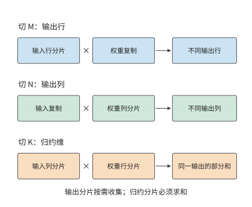

*图 5-12：切输出行 $M$ 或输出列 $N$，各执行者得到不同位置的完整结果，需要时再拼起来；切归约维 $K$，各执行者得到同一输出的部分和，必须相加后才能使用。方框表示数据归属，不按矩阵元素数绘制。*

前两种切法只要求输入按需复制或分片，输出可以一直保持分片，直到后续算子需要完整数据；第三种切法省下了输入的复制，却像 RMSNorm 的局部和一样，多出一次汇合。第 5.2.2 节的输出块正是同时沿 $M$ 和 $N$ 切分，再沿 $K$ 逐块累加：累加器留在一个线程块内，汇合部分和不需要跨越任何边界。

合并的次序也会改变结果。浮点加法不满足结合律：用 FP32 计算 $1+2^{-24}+2^{-24}$，先加前两项，和仍是 1，再加第三项也仍是 1；先加后两项得到 $2^{-23}$，与 1 相加就得到 $1+2^{-23}$。两种次序的结果相差一个 **ULP**（unit in the last place，同一指数下相邻两个浮点数的间距）。一次舍入丢掉的位无法恢复，之后每一次加法都在已经舍入过的数上继续。

本小节的 RMSNorm 可以算出这一差别有多大。取一行 4096 个 BF16 元素，每个元素的平方在 FP32 中都能精确表示，因此下面几种做法的差别只来自加法的先后。图 5-13 的上半部分比较 1、2、4、8、16、32 段这六种切分算出的平方和，横轴为它们与精确值的距离。一组处理一整行时，累加器逐步增长到 2038 附近，每次加入的一项却只有 0.5 左右，末位反复被舍去，最后比精确值小 175.2 个 ULP。分成八段之后，每个累加器只增长到 255 左右，最后再把八个局部和相加一次，结果与精确值只差 9.2 个 ULP。两条路径相差 166 个 ULP，相对差约 $9.9\times10^{-6}$。可见拆分改变的不只是并行任务数，还有精度。

下半部分固定这八个局部和，只改合并的次序。40,320 种次序只得到三个不同的 FP32 结果，彼此相差一个 ULP。如果用原子加把局部和累加到同一个地址，到达的先后由调度决定；同一份输入、同一个程序，两次运行得到的结果就可能不同。改成先把八个局部和写入缓冲，等它们全部写完，再由一个执行者按固定顺序相加，每次都得到同一个结果。代价有两项：多一次写出与读回；合并要等最慢的那一段算完才能开始，而原子加按到达顺序累加，不必等待全部就绪。

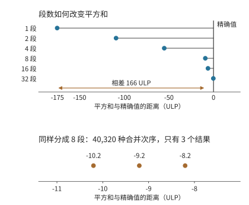

*图 5-13：同一行 4096 个 BF16 元素的平方和与精确值的距离，横轴单位为 FP32 的 ULP。上半图比较 1 到 32 段的六种切分；下半图固定八个局部和，列出全部合并次序得到的结果。精确值用有理数算得，只作比较基准。*

差别并不止于平方和这一步。按 Qwen3-8B 的 rms_norm_eps 继续计算，两条路径的缩放因子相差 59 个 ULP，这一行的第一个输出元素相差 50 个 ULP，并一起进入下一层。[^order]

切分方式因此不只是速度问题。本小节开头已经说明，切成几段取决于能安排出多少并行任务：1024 行时一组一行已足够，decode 只有一行时必须拆开。同一个 kernel 于是会随 batch 大小改变段数，同一行输入在不同 batch 下算出不同的输出。要让输出只由输入决定，段数和合并次序就都不能随 batch 变化，代价是小 batch 下并行度退回到拆分之前。第 10.5.3 节正是用这一点解释：生成端和训练端加载的是同一份权重，同一个前缀算出的 logprob 却仍然可能不同。

分块还可以越过一张卡的边界。单卡中，这些块的计算由线程块、共享内存和局部归约协作完成；分到多卡后，切输出维的执行者要各自取得输入，切归约维的执行者要把部分和送到一起相加，这些搬移都要经过卡间互联。数学依赖没有改变，变的是搬移数据的距离和代价。

调度则是在分块之后决定执行顺序、放置、缓冲和重叠。例如沿 $K$ 切分后，是等全部输入到齐再算，还是边接收边累加，会改变存储占用和实际等待的时间。模型中的样本、序列、特征、层和专家提供更多分工方向；其中层是计算图上的顺序阶段，专家是由路由选择的分支。第 6.1.4 节将把这些分工方向与这里的三种切法对应起来，第 6.2 节再逐一推导各自的通信。

矩阵分块、bank padding 和归约拆分都在重新安排同一批数学工作。分块让多个输出复用输入，padding 将读取请求分散到不同 bank，拆分归约则增加能够并行执行的任务。分析程序时，既要分别算清这些变化带来多少收益和开销，也要看它们是否改变了浮点结果。配套实验中的连续访问与宽行归约对照提供了对应的执行记录。[^exp1]

## 5.3 相邻算子的融合、缓冲与流水执行

单算子内部可以利用局部存储复用输入。相邻算子之间也有同样的机会：前一个算子的输出，往往立即成为后一个算子的输入。如果后一个算子能直接读取局部存储中的结果，就能省去一次写回和重读。为此，需要确定后一个算子要用哪些数据，以及这些数据何时全部算好。

### 5.3.1 中间张量与融合边界

下面将算例扩展到 FFN 的两支投影。令 $G=XW_g$、$U=XW_u$，激活链计算 $Z=\operatorname{SiLU}(G)\odot U$，再把 Z 交给 down 投影，把结果降回隐藏宽度。G、U、Z 的形状均为 $[1024,12288]$，以 BF16 保存时各占 24 MiB。

SiLU 和 $\odot$ 都是逐元素运算。Z[i,j] 只依赖 G[i,j] 与 U[i,j]，不同位置之间没有归约。因此，读入同一位置的两个元素后，就能直接算出该位置的最终结果，不必先算出全部 SiLU 结果。

先比较中间结果 $T=\operatorname{SiLU}(G)$ 的去向。分开执行时，完整 T 要写到下一级存储，再由乘法读回；融合后，一小块 SiLU 结果可以直接交给同一个 kernel 中的乘法，用完就释放局部空间。这就像把工作台上刚处理好的材料直接交给下一道工序，省去送回远处再取出的往返。对应到这里，省去的是中间结果的写回与重读，两步运算仍然都要完成。

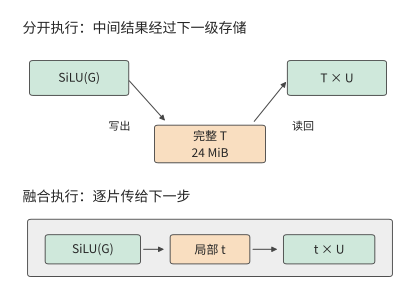

*图 5-14：上半图的完整 T 经过一次写出与一次读回；下半图中局部片段 t 直接传给乘法。两种方式仍读取 G、U 并写出 Z，图中省略这些共同的输入输出边。融合后仍保留原有的中间结果舍入规则。*

**例 5-4：激活算子融合如何减少中间张量读写？** 分开执行时，先计算 $T=\operatorname{SiLU}(G)$，读取 G、写出 T，共 48 MiB；再计算 $Z=T\odot U$，读取 T、U，写出 Z，共 72 MiB。总读写量为 120 MiB。将两步融合，每次读取 G、U 的一片，在局部完成 SiLU 和乘法，写出 Z，只需 72 MiB。

节省的 48 MiB 正是 T 的一次写回和一次读取。沿用上一节的带宽模型，取两种程序的有效带宽相同，时间比为 $72/120=0.6$，加速约 1.7 倍。实测的激活链从约 14.2 μs 降到 7.7 μs，加速比约为 1.8。理论计算与实测结果都说明了同一个收益来源：省去完整 T 的写回和重读。[^exp2]

接下来将 Z 按固定 scale 量化，使每个元素只占 1 byte。独立转换需读取 24 MiB 的 Z，写出 12 MiB 量化结果，增加 36 MiB。三步完全分开的总量为 156 MiB；融合前两步为 108 MiB；三步全部融合为 $24+24+12=60$ MiB。图 5-15 将必需的输入输出读写画在每条柱形的左侧，再依次加上两个中间量的读写。

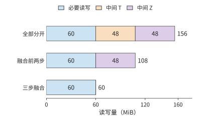

*图 5-15：每少保存一个 24 MiB 中间量，就少一次写出和一次读入，共 48 MiB。G、U 为 BF16，最终输出占 1 byte/元素，量化 scale 预先给定。各方案采用相同的运算与舍入顺序。*

中间张量的容量与访问量在这里是两回事。设每步先分配输出，完成后释放已用完的输入。独立执行 SiLU 时，G、U、T 同时占用内存，峰值为 72 MiB；三步融合时，G、U 与最终输出同时占用内存，峰值为 60 MiB。读写减少 96 MiB，峰值却只减少 12 MiB，因为同一块存储空间可以反复读写。[^fusion]

逐元素运算的每个输出只依赖对应位置的输入，因此可以在读入后立即计算，减少中间结果的保存。要让这种复用顺利发生，还需要前后两步使用彼此兼容的数据布局，并保证缓冲在最后一次读取结束前不会被覆盖。下面沿着一个数据块的使用过程，分析这两个条件。

### 5.3.2 布局转换、缓冲复用与双缓冲

相邻算子有时使用不同布局。前一个算子适合按行写出，后一个算子却需要按另一种块顺序读取。若另建一份 24 MiB 重排结果，就要读原结果、写新结果，共 48 MiB。也可以让前一个算子直接按后续计算所需的布局写出，省去单独的重排。比较“计算后再重排”与“计算时直接按新布局写出”的总时间，就能判断哪种方式更快。

缓冲还决定两个阶段能否重叠执行。设搬移器把块 0 放入槽 A，计算单元随后读取 A。计算单元读取 A 期间，搬移器把块 1 放入槽 B；计算转向 B 后，就可以把块 2 加载到 A。这样两个槽交替使用，计算单元读当前块时，搬移器就可以写下一块。

注意，槽 A 的“数据已经搬完”与“数据已经用完”是两个时刻。搬移结束后，计算才开始读取；只有最后一次读取结束，才能将下一块数据写入槽 A，覆盖原有内容。沿用第 5.1.5 节 H100 一个 SM 上的数值：每块搬移 1.29 μs、计算 0.28 μs，搬移器和计算单元独立工作。图 5-16 展示三个时段中各槽位的状态，图 5-17 据此画出完整的搬移与计算时间线。

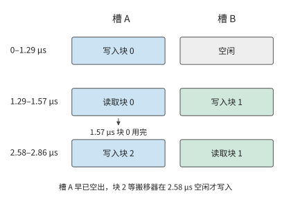

*图 5-16：块 0 在 1.29–1.57 μs 使用槽 A，此后槽 A 已经空出；块 2 要等搬移器在 2.58 μs 搬完块 1，才开始写入 A。图中抽取三个时段；1.57–2.58 μs 两个槽里都没有可算的数据，计算单元空等。颜色固定表示槽 A、B，文字说明当前读写的是哪个块。*

**例 5-5：双缓冲如何重叠数据搬移与计算？** 每块搬移 1.29 μs，计算 0.28 μs。搬移器和计算单元独立工作，事件开销记为零。串行执行四块需要 $4\times(1.29+0.28)\approx6.28$ μs。

采用两个槽后，0–1.29 μs 搬入块 0，1.29–1.57 μs 计算块 0；块 1 同时在 1.29–2.58 μs 搬入。块 0 在 1.57 μs 就已算完，槽 A 随即空出，但搬移器要到 2.58 μs 才搬完块 1、开始写块 2。此后搬移器连续工作，每 1.29 μs 送来一块，计算单元每次只忙 0.28 μs。第四块于 5.44 μs 完成，时间只减少约 13%。

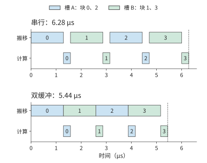

*图 5-17：两个输入槽交替复用，让搬移与计算重叠。H100 一个 SM 上每块搬移 1.29 μs、计算 0.28 μs，资源独立，忽略同步开销；同一颜色表示同一槽。重叠只藏住了计算，完成时间由首尾相接的搬移决定。*

将四块推广到 n 块。首块要先搬移，随后每隔较慢阶段所需的时间完成一块，末块还需完成计算。因此：

$$
T_{\mathrm{pipe}}=t_m+(n-1)\max(t_m,t_c)+t_c.
$$

其中 $t_m$ 为每块搬移时间，$t_c$ 为每块计算时间。在刚才的例子中，$t_m>t_c$，搬移器从 0 连续忙到 5.16 μs，总时间为 $4\times1.29+0.28\approx5.44$ μs，计算单元只有约两成时间在工作。增加第三个槽无济于事：两个槽已让搬移器没有空闲，更多的槽不能加快搬移；加快计算同样无济于事。两个槽是能重叠起来的最小配置；把槽数加到 $n$、让搬移提前 $n-1$ 块开始，在 CUTLASS 中称为 $n$ 个 **stage**。本例中搬移器已经连续工作，增加的 stage 只会多占容量；只有当每块的搬移时间不稳定，或一次搬移的延迟长于一块的计算时间时，额外的 stage 才能补上空档，而所需容量随 stage 数成比例增长。要继续缩短时间，只能减少每块要搬的字节，例如按第 5.2.2 节扩大输出块，让每个输入字节参与更多乘加，或让同时执行的线程块在 L2 中共用输入块；再就是换用显存带宽更高的卡。

回到本小节开头的重排情形：两个阶段的访问顺序不同时，缓冲要保存更多尚未使用的数据。三个排队的 16 KiB 块占 48 KiB，再加 32 KiB 重排空间，共需 80 KiB。RTX PRO 6000 一个线程块最多可用 99 KB 共享内存，单独驻留时可以容纳；若一个 SM 要同时驻留两个这样的线程块，每块最多只能分到 49 KiB（100 KB 扣除两块各 1 KiB 预留后平分）。扣掉 32 KiB 重排空间，只剩一个 16 KiB 的排队槽：写入第二块之前，搬移器必须等计算单元用完并释放该槽。这种下游来不及处理、使上游暂停的机制称为**背压（backpressure）**。选择共同布局能够减少排队，扩大缓冲则能容纳更多已经写入但尚未使用的数据。[^buffer]

第 5.1 节的主机输入也可以按此组织。复制流传入下一批，计算流处理当前批；计算流等待“复制完成”事件后读取新输入，复制流等待“计算完成”事件后覆盖旧缓冲。这两种事件分别保证输入已准备好和旧数据已用完，时间收益则来自两种资源同时工作。

### 5.3.3 FlashAttention：分块与在线 Softmax

第 5.3.1 节融合的逐元素运算，每个输出只依赖对应位置的输入；注意力中的 Softmax 却要用到整行分数。计算一行注意力输出时，可以先把各位置的分数变成尚未归一化的权重，用这些权重对值求加权和，最后除以权重总和。可以先处理一块，记下它对加权和与权重总和的贡献，再处理下一块；只要能正确合并贡献，就不必一直保留已处理过的全部分数。困难在于 Softmax 要根据分数求指数，后面出现更大的分数时，还要调整前面累计结果所用的数值基准。

FlashAttention 围绕这一逐块计算过程安排存储，减少长序列注意力中间矩阵的显存读写。该方法由斯坦福大学的 Tri Dao 等研究者与纽约州立大学布法罗分校的合作者于 2022 年提出。[^fa]

读到 FlashAttention 时，笔者想起了自己在 2019 年做 AKG 的一段经历。当时为了融合 Softmax 算子，笔者四处寻找合适的在线算法，后来找到 NVIDIA 在 2018 年发表的研究，才得以结合 AKG 的分块与融合能力，把前面的矩阵乘法和后面的 Softmax 接在一起计算。笔者那时甚至还不了解注意力机制，后来才意识到，自己偶然摸到了 FlashAttention 的一条核心思路。从这一步走到完整的 FlashAttention，还需要把后续与 V 的加权求和也纳入在线更新，并围绕完整注意力安排片内存储和数据搬移。下面的推导会说明，这一看似局部的算法变化如何消除大块中间矩阵。

回到注意力计算本身。标准注意力先计算 $S=QK^\mathsf{T}/\sqrt d$，再计算 $P=\operatorname{softmax}(S)$，最后计算 $O=PV$。

把这三个运算分别交给通用算子，可以直接按公式组合程序，算子之间通过中间张量交换结果。掌握完整注意力计算的数据依赖后，便可以采用另一种编译与执行方式：利用 Softmax 的归约关系，跨过独立算子的边界，在小块数据上连续计算。下面先算出原来完整保存中间张量的开销，再推导逐块计算所需保存的状态。

取一个头，序列长度 $L=8192$，头维度 $d=128$，对全部 token 计算注意力。Q、K、V、O 使用 BF16，各占 2 MiB；完整 S、P 使用 FP32，各占 256 MiB。Q、K、V 各读一次，O 写一次，共 8 MiB；S、P 各写一次、读一次，却要传输 1 GiB 数据。中间矩阵的大小随序列长度的平方增长，因而造成了大量读写。[^attention]

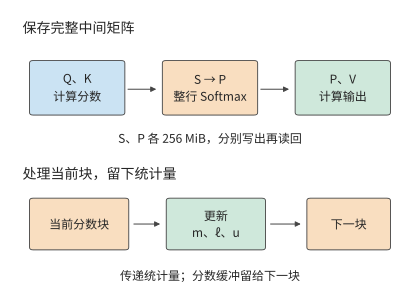

*图 5-18：上半图保存完整 S、P，两份 FP32 矩阵各占 256 MiB，写出与读回合计 1 GiB。下半图只传递已处理部分的最大值 m、指数和 ℓ、加权值 u；每处理完一个块，其分数缓冲即可复用。箭头概括处理顺序，完整计算还需读入 Q、K、V。*

要省去这 1 GiB 的中间读写，可以沿用第 5.3.1 节的思路；但直接套用逐元素融合会遇到一个障碍：Softmax 的分母是整行指数和。只读到前一块时，既不知道最终分母，也不知道后面是否会出现更大的分数。

要丢弃已经处理过的分数，需要保留三个量：最大分数 m，以 m 为基准的指数和 $\ell$，以及相同指数权重下的值之和 u。这里 u 通常是向量，先用标量值的小例子看清更新过程。

**例 5-6：在线 Softmax 如何合并分块结果并保持归一化？** 分数为 $[0,\ln2]$，对应值为 $[1,3]$，每块只含一个元素。第一块得到 $m=0,\ell=1,u=1$。处理第二块后，最大值增至 $\ln2$，将原来的 $\ell$ 和 u 都乘以 $r=1/2$；新元素的指数为 1，于是 $\ell'=1/2+1=1.5$，$u'=1/2+3=3.5$，结果为 $7/3$。一次处理整行时，两个权重正比于 1 和 2，结果同样为 $(1+2\times3)/3=7/3$。

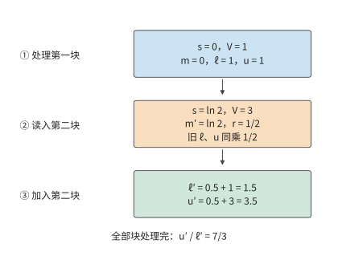

*图 5-19：两个块的分数分别为 0、ln 2，值分别为 1、3。最大值增大后，将旧指数和与旧加权值同时乘以 1/2，再加上新块的贡献，最后才做除法。箭头传递的是统计量，旧分数无需保留。m 是已处理分数的最大值，ℓ 是以 m 为基准的指数和，u 是对应的值向量加权和，r 是更换最大值基准时的缩放系数。*

小例子中，第二块把最大值从 0 提高到 ln 2。旧项原来的指数为 1，换到新基准后变成 1/2；分母中的旧贡献和分子中的旧贡献必须同时缩小，才能保持它们的相对权重不变。

推广到一行分数，减去共同最大值可避免指数溢出。令 $\ell=\sum_j\exp(s_j-m)$、$u=\sum_j\exp(s_j-m)V_j$，最终输出为 $u/\ell$。新块到来后，把旧状态改到新的最大值基准，再加上新块贡献：

$$
m'=\max(m,\max(s)),\qquad r=\exp(m-m'),\qquad p_j=\exp(s_j-m'),
$$

$$
\ell'=r\ell+\sum_jp_j,\qquad u'=ru+\sum_jp_jV_j.
$$

右侧求和只遍历新块中的 j，旧块的全部贡献已经保存在 $\ell$ 与 u 中，无需重新读回旧分数。

FlashAttention 正是利用这一递推关系省去了完整 S 和 P 的存储。每处理完一块，就更新 m、$\ell$ 和 u；该块的分数和概率用完即可丢弃，其缓冲可以留给下一块。在相同注意力范围内，查询与键的匹配、值的加权仍然都要算；改变的是计算顺序与中间结果的保存方式，浮点执行还会有舍入差异。

这样就把存储完整分数矩阵的问题，变成了在快速存储中安排当前块的问题。接下来确定一次处理多少行 Q、多少行 K/V，才能更好地利用这块空间。取 RTX PRO 6000 一个线程块可用的 99 KB 共享内存（101,376 bytes）作快速缓冲，一次保留 a 行 Q 与 FP32 输出累加器，分数块大小为 a×b。K 与 V 按阶段复用同一个 b×d 输入槽，分数和概率复用一个 a×b 槽，另为逐行统计和更新暂存分配三个 FP32 向量。局部存储需求为：

$$
S=\underbrace{2ad}_{Q}+\underbrace{2bd}_{K/V\text{ 槽}}+\underbrace{4ab}_{\text{分数/概率}}+\underbrace{4ad}_{\text{输出累加器}}+\underbrace{12a}_{\text{逐行状态}}\le101376.
$$

K/V 块越小，其自身和分数块占用越少，就能容纳更多 Q 行。更多 Q 行共享一次 K/V 扫描，整份 K/V 被重读的次数随之减少。取 b=64，能容纳 a=82 行 Q，需要 $\lceil8192/82\rceil=100$ 次完整扫描。每次读 4 MiB 的 K/V，另有一次 Q 读取和 O 写回，共 $100\times4+4=404$ MiB。

将 b 缩为 1，能容纳 a=128 行 Q，扫描次数降为 64，访问量降至 $64\times4+4=260$ MiB。但每次扫描从 128 个 K/V 块变成 8192 个块，在线状态必须更频繁地更新。

| K/V 块行数 b | 可容纳的 Q 行数 a | K/V 完整扫描次数 | 缓冲与下一级存储之间的访问 | Q 块与 K/V 块之间的状态更新次数 |
| --- | ---: | ---: | ---: | ---: |
| 1 | 128 | 64 | 260 MiB | 524288 |
| 64 | 82 | 100 | 404 MiB | 12800 |
| 128 | 53 | 155 | 624 MiB | 9920 |

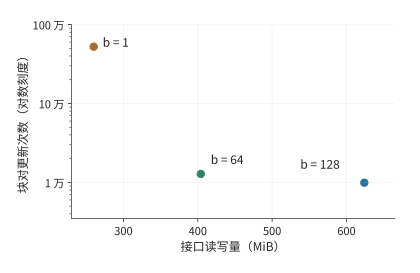

*图 5-20：快速缓冲为 RTX PRO 6000 一个线程块的 99 KB 共享内存，序列长 8192、头维度 128，无掩码；每个点对应正文表格的一种 K/V 块大小。横轴为缓冲与下一级存储之间的访问量，纵轴为在线更新次数，采用对数刻度。从 b=64 的点移到 b=1 的点，读取减少，更新次数却约增至 41 倍。b 表示一个 K/V 块中包含的 token 数。*

图 5-20 把两项代价放在同一平面上，越靠左表示少读数据，越靠下表示少做更新。从 64 行块缩到 1 行块，少读 144 MiB，却把状态更新从 12800 次增至 524288 次，约为原来的 41 倍。每次更新都要执行循环控制、最大值比较、指数与输出缩放；每次只处理一行 K/V，也使矩阵乘的一个维度过小，难以充分利用矩阵计算单元。较小的 K/V 块能减少读取，却会增加更新次数；较大的块则有利于矩阵计算，并减少循环开销。因此，选择块大小时，需要同时比较这两类开销。

在线归约消除了完整中间矩阵的读写，但块内的矩阵乘、指数计算和统计量更新仍要执行。后续优化便转向这些剩余工作。FlashAttention-2 改进了线程之间的任务分配，减少中间数据交换和非矩阵运算；FlashAttention-3 利用异步执行，让搬移、矩阵乘和 Softmax 相互重叠。省去巨大的中间矩阵之后，这些改进进一步缩短了剩余的计算和搬移时间。[^fa]

为了检验这些机制在实际程序中的效果，配套实验比较了 PyTorch 中同一个注意力接口的两种实现。这里的**后端（backend）**，指框架在接口内部实际选用的计算程序：调用者给出相同的 Q、K、V，框架可以用不同程序完成注意力计算。

**数学后端（`SDPBackend.MATH`）**按注意力公式组合矩阵乘、Softmax 等通用运算，保存完整的分数和概率中间矩阵。**FlashAttention 后端（`SDPBackend.FLASH_ATTENTION`）**采用前面介绍的分块与在线归约方法，避免保存完整的中间矩阵。实验分别指定这两个后端，比较它们完成同一次注意力计算的时间与新增显存。

实验用 RTX PRO 6000 Blackwell，输入输出为 BF16，一次处理一个序列、一个注意力头，头维度为 128。序列长为 8192 个 token；采用因果注意力，即每个位置只使用自身及此前的位置。预热后，使用 CUDA Graph 将一组 GPU 操作预先记录并重复执行，以免每次由主机提交造成干扰。按每次注意力计算统计，保存完整中间矩阵的数学实现约需 2.6 ms，采用分块与在线归约的 FlashAttention 实现约需 80 μs，后者的加速比约为 33。[^exp3]

再比较一次普通调用的新增显存占用峰值。输入 Q、K、V 预先驻留显存，计量范围为输出与临时工作区：数学实现约为 848 MiB，FlashAttention 实现约为 22 MiB。

这组完整实现的对照说明了分块、在线归约和融合如何配合：分块使当前数据能放入快速存储，在线归约使 Softmax 可以逐块计算，融合省去块内中间结果的写回。三者共同改变了执行时间与中间存储需求。

## 5.4 编译器：表达、变换与选择

前两节通过手工分析选择了循环、块大小、缓冲和算子边界。实际模型会使用多种输入形状和算子组合，每种加速器也有不同的存储层级和执行资源。编译器的任务，是用程序表示这些实现方式，根据依赖关系排除错误的变换，再比较其余实现的执行开销。

### 5.4.1 为什么要比较多种实现

回顾逐元素链：SiLU 对每个数执行非线性变换，再与另一输入对应相乘，最后量化成低位宽表示。两处相邻算子之间，都可以选择分开执行或融合执行，共有四种划分：三步独立、融合前两步、融合后两步、三步融合。如果一条链包含十个算子，就有 $2^9=512$ 种相邻边界划分。每一种划分还可以选择块大小、局部布局和流水深度。

这些选择会相互影响。合并两步可以消除中间写回，但也会增加同一时刻需要保存的值；临时数据增多，又会改变能够采用的块大小。因而，编译器要同时表达计算内容、执行顺序和数据存放位置。只记录一个算子名，无法推导这些代价。

编译器可以按三个步骤选择实现。首先，把数学运算表示为循环和数组访问，明确可以变换的循环及其读写关系；其次，根据读写依赖和数值规则检查合法性；最后，结合容量和实测时间比较执行成本。下面先用可读的循环展示前两步，再说明自动算子代码生成系统 AKG 如何通过多面体编译（用线性约束描述循环迭代与数组访问的编译方法）组织整个过程。

### 5.4.2 用循环变换表达分块与融合

第 5.2 节决定了每次处理多大一块，还要决定这些块按什么顺序计算。同样切好的数据，若刚用过就换走，随后又要重新搬回，仍然会产生不必要的访问。循环变换让程序表达这些安排：split 将循环拆成“第几块”和“块内第几个位置”；reorder 调整遍历顺序，让即将再次使用的数据有机会留在局部存储中。再选择在哪一层循环保存或使用中间结果，就能明确它要留下多久。

取 $Y=\operatorname{SiLU}(AW)$，沿用 $M=1024,K=4096,N=12288$，矩阵乘用 FP32 累加，结果舍入为 BF16 后再激活。最直接的程序先生成完整 C，再遍历 C 生成 Y：

```python
for i in range(M):
    for j in range(N):
        acc = 0.0
        for k in range(K):
            acc += A[i, k] * W[k, j]
        C[i, j] = round_to_bf16(acc)

for i in range(M):
    for j in range(N):
        Y[i, j] = silu(C[i, j])
```

第一项变换是**拆分（split）**。把 i 拆成块号 $i_o$ 与块内坐标 $i_i$，令 $i=64i_o+i_i$。原来的 1024 行就成为 16 个块，每块 64 行。对 j 同样处理，得到 192 个列块。同时拆分两个输出维度，就形成 64×64 的 tile。

拆分首先改变了索引的表示方式。要连续完成一个 tile，还需要**重排（reorder）**：在外层循环中遍历输出块，在内层循环中遍历块内元素。再把 K 按 32 拆成 128 个归约块。程序先选定一个输出 tile，逐块加载所需 A、W，累加到同一个输出块中。

采用这种循环结构后，就能确定输入块需要保留多久。A、W 的当前块各占 4 KiB，在一次归约块计算后即可替换；4096 个 FP32 累加器占 16 KiB，要一直保留到全部 128 次归约块计算结束。因此，两类缓冲应在不同的循环层分配和释放。

最后调整激活的**计算位置**。一个输出 tile 完成全部 K 归约后，其 4096 个 C 值已经全部算好，可以立即做 SiLU 并写出 Y；其他输出 tile 尚未完成也不影响这一片结果。这样只需在局部保存当前输出块的结果，不再需要完整 24 MiB 的 C，也就省去了 48 MiB 写回与重读。

```python
for io in range(ceil_div(M, BM)):
    for jo in range(ceil_div(N, BN)):
        acc = zeros_fp32(BM, BN)
        for ko in range(ceil_div(K, BK)):
            a = load_tile(A, io, ko, BM, BK)
            w = load_tile(W, ko, jo, BK, BN)
            matmul_accumulate(acc, a, w)
        c = round_to_bf16(acc)
        store_tile(Y, io, jo, silu(c))
```

这里 `load_tile` 和 `matmul_accumulate` 分别表示成块读取和矩阵累加；最后一个不足整块的 tile 用掩码标出有效位置。伪代码的缩进清楚地标出了这些先后关系：输入块在 ko 循环内更新，累加器在整个 ko 循环期间始终保留，激活计算在 ko 循环结束后执行。

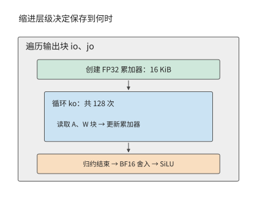

*图 5-21：循环层次决定临时数据需要保存多久。外层选输出块，创建 16 KiB 累加器；内层 ko 反复读取 A、W 块，全部归约结束后再舍入并计算激活函数。*

这些调度动作在编程系统中有对应的表达。Halide 是把“计算什么”和“如何调度”分开表达的编程系统，程序员用 split、tile、reorder 等动作改变执行方式。这里把生成中间结果的算子称为生产者，使用该结果的算子称为消费者。`compute_at` 指定生产者在消费者的哪一层循环内执行。TVM 是面向张量计算的编译系统，也通过调度指定计算位置和缓存读写，让相邻算子在同一块数据上连续计算。[^schedule]

计算位置同时决定复用和重算。把生成中间结果的计算放在最外层，会先算出完整结果，供所有后续计算读取；放到后续计算的分块循环内，就只算当前需要的部分。如果多个输出块需要同一部分中间结果，在每个块内计算就会造成重复。编译器因此要比较两种做法：先保存中间结果供多次读取，或在每次使用前重新计算。

循环中的 `fuse` 还可以把多个迭代维合成一个维度。例如，可以将 16×192 个输出块的二维坐标转换为 0 到 3071 的一维编号，再分配给加速器工作组。这改变了遍历输出块和分配任务的方式；将 SiLU 紧接在矩阵乘的 tile 后面，则省去了中间矩阵的写回和重读。两者可以在同一份调度中组合使用。

### 5.4.3 依赖与舍入如何限制变换

上一小节把激活移入输出 tile，但仍安排在 ko 循环结束后执行，原因可以用两个数说明。设一个输出的两个部分和为 1 与 −1，完整和为 0，SiLU(0)=0。若在每个部分和之后先做 SiLU，再相加，结果为 $\operatorname{SiLU}(1)+\operatorname{SiLU}(-1)\approx0.4621$。把激活计算移到完整求和之前，已经改变了运算。

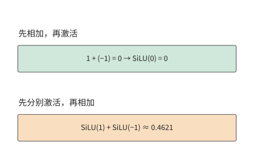

*图 5-22：同样两个部分和，先相加得到零，再做 SiLU 仍为零；先对各部分做 SiLU 再相加，得到约 0.4621。两个数说明把激活计算移到求和之前会改变结果。*

编译器需要遵守的依赖关系因此有两个层次：同一输出的部分和要按归约规则合并，后续算子要等所需的结果算好。不同输出可以并行计算；同一输出的归约和后续运算则必须按依赖顺序执行。

分块归约同样受这条依赖约束。第 5.3.3 节的 FlashAttention 能逐块完成计算，是因为它保留了 m、$\ell$、u，并在最大值改变时，同时调整之前累加的指数和与加权值。若只保留每块已经归一化的输出，就丢失了各块分母的相对大小。例如两个块各自只有一个值，分别为 1 和 3，块内输出仍是 1 和 3；仅凭这两个输出，无法判断整行 Softmax 应给它们分配 1:2 还是 2:1 的权重。因此，分块归约必须保存足够的统计量，才能正确合并各块的结果。

浮点舍入进一步限制了变换。原程序将 FP32 累加结果舍入为 BF16，再激活，融合后的程序也要在激活之前执行 `round_to_bf16`。中间值可以从寄存器直接传给激活，但这次舍入仍然存在。数据存放位置与数值格式是两项独立选择。

**例 5-7：整行量化 scale 如何约束分块计算顺序？** 一行包含 256 个元素，分成两个块，每块各含 128 个元素，两个块的首个元素分别为 1 和 10，其余为零。量化使用 E4M3FN 格式：一种含符号位、四位指数和三位尾数的八位浮点表示，最大有限值为 448。scale 由整行最大绝对值决定；随后做点积，权重仅第一个元素为 1。因此结果完全取决于第一个元素如何量化。

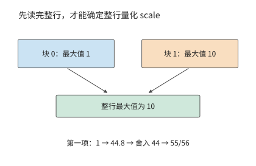

*图 5-23：一行分成两个块，后一块中的 10 决定整行 scale。第一项要先按这一 scale 映射，再舍入到格式允许的值，最后反量化。*

先读完整行，最大值为 10。第一项缩放为 $1\times448/10=44.8$，舍入到该格式可表示的 44，反量化结果为 $44\times10/448=55/56$。若读完第一块就量化，当时最大值为 1，第一项可表示为 448，反量化结果恰好为 1。

读到后一块中的 10 后，即使调整后续计算所用的 scale，第一项也不可能重新经历 44.8→44 的舍入。两种做法的结果相差 $1/56$，约 1.8%。因此，按整行最大值确定 scale 时，应先读完一行求出最大值，再量化。[^numerics]

这些例子说明了哪些变换可以做，哪些运算顺序必须保留。输出之间可以交换执行顺序，输入可以分块缓存，算好的结果可以直接供后续运算使用；归约的合并方式和量化的舍入位置则属于运算定义，需要在变换中保留。

### 5.4.4 AKG：用多面体编译组织循环与存储

AKG 是面向张量算子的自动代码生成与优化系统，其核心技术是**多面体编译（Polyhedral Compilation）**。该方法把规则循环表示为三类信息：有哪些迭代要执行，每次迭代读写哪些数组元素，以及哪些读写必须保持先后顺序。循环边界和规则下标可以用线性约束描述，这就是“多面体”名称的来源。借助这种表示，编译器能够推导迭代之间的依赖，并据此调整执行顺序。[^akg]

以矩阵乘为例，编译器可以确定不同 i、j 对应不同输出，沿 k 的更新则指向同一个累加结果。选定 64×64×32 的 tile 后，还可以由数组访问推导当前需要的 A、W 区域：A 为 64×32，W 为 32×64。这样既能确定循环的执行顺序，也能确定需要读入哪些数据，以及这些数据要保存多久。

AKG 从张量表达式生成多面体表示，将分块与分层融合结合起来：在外层安排完整算子的执行顺序，在内层安排各块的连续计算和局部缓存。存储管理根据这些区域分配片上空间、插入搬移，代码生成再将计算映射到硬件执行方式，调优阶段选择块形状等参数。前文手工完成的“拆分循环—确定读取区域—保留累加结果—完成归约后激活”，在这里成为相互联系的编译步骤。

将计算和存储一起分析，也能解释融合为什么会增加访存。前面的逐元素链通过融合少读了中间值；若中间结果采用位数更少的表示，又要供后续计算反复读取，保留它反而可以减少读取。

**例 5-8：量化单独执行还是融合进矩阵乘，哪种方式读写更少？** 取 $[4096,4096]$ 的 FP16 输入 A，占 32 MiB，量化为 FP8 后占 16 MiB；FP8 权重为 $[4096,1536]$，占 6 MiB，FP16 输出占 12 MiB。输出按 128×128 分块，共有 32 个行块、12 个列块。各输出块独立读取所需数据，量化 scale 来自整行最大值。

先看单独执行量化的做法。每处理一行，就用 8 KiB 局部空间保存该行输入，求出 scale 后再量化。全部输入共读入 32 MiB，量化结果共写出 16 MiB。随后，12 个输出列块各读取一遍 FP8 输入，共 192 MiB。因此，与输入有关的读写量为 $32+16+192=240$ MiB。

把量化合并到矩阵乘中后，先读取 32 MiB 原输入求出每行的 scale；12 个列块随后各读一次原来的 32 MiB 输入，并在本地量化。输入相关访问为 $32+12\times32=416$ MiB。虽然省去了 16 MiB 量化结果的写出，但每个列块读取的输入从 16 MiB 增至 32 MiB，12 次读取增加了 192 MiB。

两种方案都由 32 个行块各读取 6 MiB 权重，再写出 12 MiB 输出，共 $32\times6+12=204$ MiB。因此总访问量分别为 $240+204=444$ MiB 与 $416+204=620$ MiB，融合后增加约 40%。

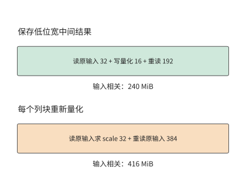

*图 5-24：两种方案都先读完整输入以确定每行的 scale。保存 FP8 结果后 12 个列块合计重读 192 MiB；融合方案重读 FP16 输入 384 MiB。权重与输出另有相同的 204 MiB。*

图 5-24 中，决定差距的是通向 12 个列块的重复读取：每次读取的数据量相差一倍。输出列块数因而直接决定两种做法的访存量差异。每增加一个列块，保留量化结果的方案多读 16 MiB，融合方案多读 32 MiB。将 1536 个输出列放入同一块，可消除这种跨列块重复；相应输出累加器也从 128 列扩大为 1536 列，需要 12 倍空间。因此，选择是否融合量化时，仍要比较第 5.2 节讨论过的局部存储占用与数据复用。[^numerics]

AKG 将融合与分块共同考虑，正是为了处理这样的相互作用。中间结果的计算位置改变后，各输出块读取哪些数据、读取多少次都会改变；缓冲需求随之变化，又影响能够采用的块大小。

### 5.4.5 成本估计与实测选择

例 5-8 已经能够按读写量比较两种实现。面对更多分块与融合组合，编译器也按同样的思路逐步缩小范围：先检查依赖和数值规则，再排除局部存储不足以容纳的实现，最后估计执行开销，决定优先测试哪些实现。第 5.2 节已给出一种估计：用访问量和有效带宽比较两个 tile。编译器还可以加入矩阵指令利用率、寄存器需求和启动成本，确定各实现的测试顺序。

沿用第 5.2 节的矩阵与 RTX PRO 6000 的共享内存，选择过程可以整理成下面的表。该节把输入缓冲和累加器都放在每个 SM 的 100 KB 共享内存里；若把累加器改放寄存器，就要像第 5.1.5 节那样分别检查共享内存与寄存器，两类容量不能互相借用。若把两个候选改成双缓冲，输入占用翻倍，工作集分别变为 32 KiB 和 96 KiB，每个 SM 可驻留的线程块从 4 块、1 块变为 3 块、1 块。

| 选择步骤 | 本章矩阵算例要填的内容 | 排除或比较的依据 |
|---|---|---|
| 固定目标 | 输入形状、精度、误差、调用频数 | 比较同一项数学工作和同一负载 |
| 列出候选 | tile、循环次序、缓冲数、融合范围 | 编译器与硬件是否支持 |
| 检查可行性 | 共享内存、寄存器、线程、对齐和依赖 | 编译资源报告及正确性检查 |
| 估计时间 | 计算量、实际读写量、启动与布局转换 | 各资源服务时间与关键路径 |
| 实测并选择 | 代表形状的时间、波动及完整算子链 | 最小化工作负载成本，并保留相近候选 |

先用资源报告排除容量不足的候选，再测剩余候选的有效带宽、计算时间与完整算子链。若寄存器溢出、矩阵边缘补齐或并发下降抵消了复用收益，就回到候选表改变块形状或缓冲数。第 6 章采用同样过程，只把 tile 的放置扩展到多张卡，并把跨块依赖换算成集合通信（多张卡按固定模式交换或汇总数据的通信操作）。

实测环节可以用配套实验 5-5 的矩阵转置程序说明：同一程序在 RTX PRO 6000 Blackwell 上采用 16×16 块约需 7.9 μs，采用 32×32 块约需 2.9 μs，加速比约为 2.7。块的每个维度增至两倍，内部元素数就增至四倍，存储布局和线程协作也一起改变。[^exp5]

TVM 的自动调优根据硬件实测结果搜索分块、循环顺序等调度方案；让能够调用编译和测试工具的 Agent 修改调度或 kernel 代码，还可以尝试原有调度模板之外的实现。两种搜索都以编译后的程序为评价对象，通过数值检查筛选正确实现，再以执行时间评价调度。评价之所以针对编译后的程序，是因为编译器可以将源码中分开表达的算子融合为一个 kernel。[^exp4] 搜索方法还要解决另一个问题：用什么负载评价这些实现。

**例 5-9：输入形状的调用比例如何改变算子实现的选择？** 某个算子有 A、B 两种输入形状，原实现处理它们都需要 10 μs。新实现处理 A 需要 5 μs，处理 B 需要 20 μs：A 的耗时减半，B 的耗时翻倍。若两种形状各出现一次，总时间从 20 μs 增至 25 μs，新实现的耗时增加 25%；若 A 调用 100 次、B 调用一次，总时间从 1010 μs 降至 520 μs，新实现的加速比约为 1.9。

令输入形状为 A 的调用占比为 p。原实现的平均执行时间为 10 μs，新实现的平均执行时间为：

$$
\overline T_{\mathrm{new}}=5p+20(1-p)=20-15p\quad\mathrm{\mu s}.
$$

要使新实现平均时间更短，需满足 $20-15p<10$，即 $p>2/3$。图 5-25 的交点说明，只有当 A 占全部调用的比例超过 2/3 时，新实现才更快。

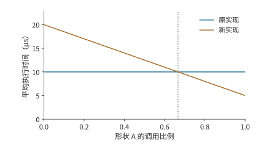

*图 5-25：形状 A 占比超过 2/3 时，新实现的总执行时间更短。A、B 原耗时均为 10 μs，新实现分别为 5、20 μs；调用串行，图中比较稳态执行。交点由两种实现的平均时间相等确定。*

因此，调优可以按形状分别选择实现，也可以按实际调用频数选择一种综合成本较低的方案。搜索本身消耗的编译与测量时间，则属于准备成本。配套的 Agent 实验保留了代码生成、重复提交和测量记录；下一节将结合调用次数，计算节省的执行时间需要多久才能抵消搜索开销。[^exp6]

## 5.5 运行时：提交、重放与动态形状

编译器选出加速器程序后，运行时还要反复准备输入、选择程序、提交任务并管理缓冲。即使使用同一份 kernel 代码，改变提交方式或复用已有的准备结果，也会改变总时间。本节接着第 5.1 节的时间线，分析这些主机工作。

### 5.5.1 主机准备与加速器计算的重叠

第 5.1 节区分了 CPU 提交时间与加速器执行时间，第 5.3 节又说明两类资源可以重叠工作。把这两点用于模型的一次前向计算：CPU 为下一阶段检查形状、准备参数或元数据，GPU 执行当前阶段。如果下一阶段的准备可以提前，两侧便形成流水；若 CPU 一直等到 GPU 完成才开始准备，加速器会在两个阶段之间停下来。

**例 5-10：加速器加速后，主机为何成为瓶颈？** 设有 100 段工作，每段的主机准备和加速器计算各需 20 μs。准备下一段所需的数据均已知，缓冲足够，两类资源独立。严格串行需要 $100\times(20+20)=4000$ μs；采用流水后，先完成第一段的准备，随后每 20 μs 完成一段，总时间为 $20+100\times20=2020$ μs。

将加速器计算缩短至 5 μs，主机仍每 20 μs 才准备好一段。流水变成 $100\times20+5=2005$ μs，只比原来少 15 μs。CPU 提交任务的速度没有提高，GPU 算得越快，等待下一项任务的时间就越长。再把主机准备时间缩短至 5 μs，两侧才能每 5 μs 完成一段工作，完成时间降为 $5+100\times5=505$ μs。[^host]

图 5-26 画出前四段在三种情况下的时间线。

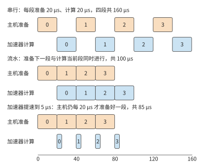

*图 5-26：每段主机准备 20 μs。串行执行时两种资源轮流工作；流水后主机准备下一段时加速器计算当前段，每 20 μs 完成一段；加速器提速到 5 μs 后，每段仍要等主机准备好，加速器大部分时间空闲。图中只画前四段，正文算例为 100 段。*

这一例子说明了主机优化的两个方向。一是减少准备工作，例如重复使用已经确定的形状和执行计划（根据请求长度、缓存布局等条件事先确定的 kernel 选择、任务划分与工作区安排）；二是把准备移到前一段加速器执行期间，例如异步处理上一轮输出。两者分别减少流水中的工作量和阶段之间的空隙。

在自回归生成中，能否提前准备，取决于所需的数据是否已经算好。下一步计算需要用到上一轮选出的 token；组建 batch、更新语法状态（限定输出格式时，记录已生成内容匹配到语法的哪一步）和判断是否停止，也各自需要相应的结果。运行时可以提前执行不依赖这些结果的工作，减少两轮计算之间的等待。vLLM 等引擎的异步执行与调度演进围绕这一问题展开。[^runtime]

专用加速器把模型执行缩短到远短于主机每轮准备的时间后，稳定流水的步间隔下界便由主机准备决定。此时进一步缩短步间隔，需要把动态 batch（每步都可能加入或移出请求的 batch）准备、地址更新与提交一起优化。

vLLM 在 2024 年 9 月发布的 v0.6.0 就是主机开销占据步间隔的实例。发布前的剖析显示，单张 H100 运行 Llama 3 8B 时，一步之中 API 服务器占 33%，调度占 29%，加速器执行只占 38%：API 服务器与推理引擎运行在同一个 Python 进程里，两者的协程争用 GIL（全局解释器锁），加速器只能空等主机。v0.6.0 把 API 服务器移到单独进程，与引擎之间用消息队列通信，避开了 GIL 争用；又引入多步调度，一次调度后连续执行多步，不再重复准备输入；再把输出处理改为异步，与下一步执行重叠。三项改动合计，Llama 3 8B 的吞吐提高到 v0.5.3 的 2.7 倍，70B 提高到 1.8 倍。[^vllm060] 这些改动没有触及任何 kernel，也没有更换硬件。按第 1.3.4 节的判据，主机侧的软件抽象开销一旦占到步间隔的六成，去掉这部分开销，比换一块更快的加速器有效得多。

除了同一请求的相邻两轮，不同调用之间也有可以复用的准备工作。两次调用可以分别要求模型解释代码和检查测试，输入内容不同，却仍经过同一组模型层。长度与 batch 落在已有执行计划支持的范围内时，运行时可以复用程序，更新 token、位置索引和状态地址；遇到新的形状或控制路径时，则选择另一份执行计划。应用通过上下文表达变化，运行时利用稳定的执行结构减少重复准备。下面分别计算图重放与形状特化这两种复用的收益。

### 5.5.2 CUDA Graph：提交收益与输入复制开销

上一小节中，GPU 提速后仍在等待主机。模型反复执行相似的任务序列时，其中许多提交工作可以复用：先把加速器任务及其依赖记录成图，再重复提交。使用 CUDA Graph 时，主机每次只需发起一次图重放，不必重新逐个准备和提交 kernel。加速器仍然执行图中的各个节点，减少的是主机的重复工作。图 5-27 用一次 FFN 的六个 kernel 说明两种提交方式的区别。

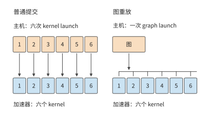

*图 5-27：普通提交时，主机为每个 kernel 发起一次 launch；图重放时，主机只发起一次 graph launch，加速器仍然执行图中记录的六个 kernel。要减少 kernel 的数量，靠的是融合，不是图重放。*

图 5-28 取 3 次 FFN 执行作对照。普通提交产生 18 次主机 kernel launch 和 18 个加速器 kernel；图重放改为 3 次 graph launch，加速器仍执行 18 个 kernel。将激活链融合后，加速器 kernel 减至 15 个；再使用图重放，主机仍只需 3 次 graph launch。融合将多个算子的计算合并到同一个 kernel 中，图重放减少了主机逐个准备和提交任务的工作。[^exp8]

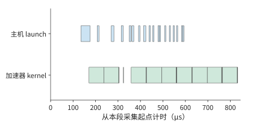

*图 5-28：普通提交的 3 次 FFN 实测。上行为主机 kernel launch API，下行为加速器 kernel；横轴从本段标记起点计时。18 次 kernel launch 对应 18 个加速器 kernel。*

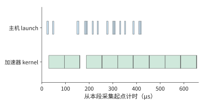

*图 5-29：3 次 FFN 融合激活链后，主机 kernel launch 15 次，加速器相应执行 15 个 kernel。数据来自与前图相同的实验中单独标记的采集区间。*

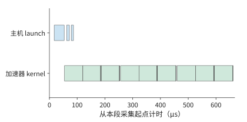

*图 5-30：3 次 graph launch 对应 18 个加速器 kernel。图重放减少主机提交次数，加速器仍执行原图各节点；本图按自身采集范围标出真实时间。*

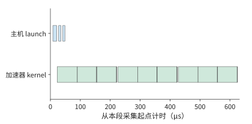

*图 5-31：先融合再重放，主机发起 3 次图执行，加速器执行 15 个 kernel。融合减少加速器 kernel 数，图重放减少主机提交次数。*

图重放前，还要把新输入放到图所记录的地址。典型实现为图预留固定缓冲区，上游每次将新数据写到这里，图按已记录的地址读取。若上游输出位于另一份张量中，就在图执行前增加一次复制；若上游直接写固定缓冲，这次复制便可省去。

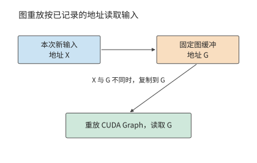

*图 5-32：图执行时读取记录的地址 G。新输入位于 X 时先复制到 G；上游直接写 G 时沿用同一缓冲，省去中间复制。*

**例 5-11：输入复制何时抵消图重放的收益？** 普通执行的加速器计算为 20 μs，加速器等待主机提交任务的时间为 20 μs，共 40 μs。图重放与元数据准备为 5 μs，加速器计算保持 20 μs。图原本可以节省 15 μs。

取图执行所需的 BF16 输入为 $[256,4096]$，数据量为 2 MiB。复制同时读取源和写入目标，读写量合计为 4 MiB；按 RTX PRO 6000 的显存带宽 1792 GB/s 计（读与写共用这一带宽），复制约需 2.3 μs，图执行的总时间约为 27.3 μs，比普通执行少约 12.7 μs。

保持计算与准备时间不变，把输入扩大至 2048 行，数据量增为 16 MiB。复制读写增为 32 MiB，用时约 18.7 μs，图执行的总时间约为 43.7 μs。这次复制已超过原本节省的 15 μs。

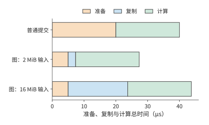

*图 5-33：橙色为准备，蓝色为额外输入复制，绿色为加速器计算。普通方式 40 μs；图的 2 MiB 输入约 27 μs，16 MiB 输入约 44 μs。复制按 RTX PRO 6000 的显存带宽 1792 GB/s 计。*

图 5-33 中，图重放节省的准备时间是一段固定长度；表示复制时间的条形却随输入增大而变长。两者长度相等时，图重放恰好不再节省时间。令输入数据量为 X，复制带宽为 B，图执行更快的条件为 $2X/B<15\ \mathrm{\mu s}$。代入 B=1792 GB/s 得：

$$
X<\frac{15\times10^{-6}\times1.792\times10^{12}}{2}\ \mathrm{bytes}\approx12.8\ \mathrm{MiB}.
$$

2 MiB 低于这一临界值，16 MiB 则超过。让前一个算子直接将结果写入图缓冲，或者从输入张量较小的位置开始捕获，都能减少复制开销。因此，选择哪些操作组成一张图时，需要同时比较节省的主机提交时间与增加的输入复制时间。[^graph]

图重放复用了提交序列，同一思路还可以用于生成这些任务之前的准备工作。例如，执行计划可以供多个模型层共同使用。推理算子库 FlashInfer 把计划生成（plan）与执行（run）分开：plan 根据本步各请求的长度和 KV 在显存中的存放位置选择 kernel、划分任务、安排工作区，并把这些元数据复制到 GPU；run 按计划执行注意力。同一步的 36 层请求长度相同，KV 的存放方式也相同，可以共用一份计划；若每层都重新 plan，就要做 36 次相同的准备工作。在 RTX PRO 6000 上的两组对照中，改为只 plan 一次后，36 层注意力调用的时间从约 2.0、2.4 ms 降至 0.72、0.75 ms，主机到 GPU 的复制从 144 次降至 4 次，加速器 kernel 数保持不变。反过来，请求长度改变后必须重新 plan，沿用旧计划会按旧长度计算，结果出错。[^plan]

### 5.5.3 动态形状与编译开销

多个模型层共享计划，利用的是计算结构相同；不同调用共享编译后的程序，还要处理输入形状的变化。输入行数变化时，运行时可以选择三种方式。通用程序根据当前形状计算索引和边界；分桶将输入补齐到少数代表形状，复用这些形状的程序；特化则利用已知的输入条件生成专门的实现，这里指为每个常见形状分别编译程序。越充分地利用已知形状，越有机会简化加速器工作，但也需要编译和保存更多程序。

**例 5-12：重复执行多少次，特化才值得？** 取 10 次 FFN 为一组：8 次为 256 行，1 次为 1536 行，1 次为 2048 行，共 $8\times256+1536+2048=5632$ 行。采用 512、2048 两个桶时，实际处理 $8\times512+2048+2048=8192$ 行，多算约 45%。图 5-34 画出每种形状被补齐到哪个桶。

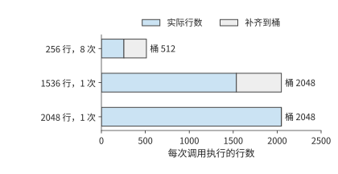

*图 5-34：256 行的调用补齐到 512 行的桶，1536 行的调用补齐到 2048 行的桶，2048 行恰好落在桶的边界上。灰色部分是补齐后多算的行；10 次调用合计实际 5632 行，执行 8192 行。*

完整 FFN 的三个投影每行共需 $6HF$ FLOPs。在 RTX PRO 6000 上，取通用、分桶、特化实现分别达到 BF16 稠密峰值 503.8 TFLOP/s 的约 20%、40%、50%，即 MFU 为 20%、40%、50%，有效矩阵处理率为 100、200、250 TFLOP/s，则每组时间分别约为 17.0、12.4、6.8 ms。分桶虽然多算 45%，处理率却翻倍，仍比通用实现更快。再设它们的准备时间分别为 100、400、900 ms，得到下表。[^specialization]

| 策略 | 一次性准备 P | 每组执行 T | 形状处理方式 |
| --- | ---: | ---: | --- |
| 通用 | 100 ms | 17.0 ms | 按实际 5632 行执行 |
| 分桶 | 400 ms | 12.4 ms | 补至两个桶，执行 8192 行 |
| 逐形状特化 | 900 ms | 6.8 ms | 三个形状分别生成程序 |

运行 r 组的总时间为 $T_{\mathrm{total}}=P+rT$。图 5-35 中，每条线的截距表示准备时间，斜率表示每组执行时间。本例中，每组执行越快的方案，直线越平缓，但起点也越高，因为它需要更长的准备时间。

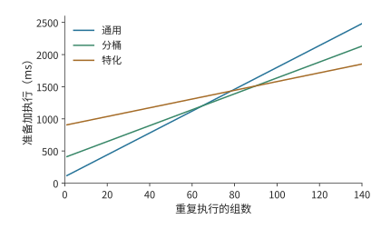

*图 5-35：同一组调用反复执行时，最省时的策略随复用次数变化。曲线采用例 5-12 的形状、处理率和准备时间，不同策略适用的整数调用次数范围使用未经四舍五入的数值计算。“通用”使用同一执行方案处理所有形状；“分桶”将相近形状归组；“特化”为具体形状选择专用方案。*

分桶比通用方案多用 300 ms 准备，每组却能节省约 4.6 ms，执行约 65 组后就能抵消这部分开销。特化比分桶再多用 500 ms 准备，每组再省约 5.6 ms，需要执行约 90 组。由完整数值求得，1–64 组通用最省，65–89 组分桶最省，90 组起特化最省。

如果实例只执行 70 组，总时间分别约为 1.29、1.27、1.38 s。分桶用时最短，是因为节省的执行时间已经超过增加的准备时间；特化虽然每组执行得更快，但累计节省的时间还不足以抵消额外的准备开销。若三种程序均已缓存，本次准备成本为零，特化从第一组起就用时最少。运行时的选择因而同时依赖形状频数与程序是否已经编译并缓存。

同样可以计算自动调优需要多少次调用才能抵消准备开销。若搜索耗时 10 分钟，每次使用新实现省 5 μs，以累计节省时间抵消搜索时间，需要 $600/(5\times10^{-6})=1.2\times10^8$ 次调用。每秒 10,000 次约需 3.3 小时，每秒 100 次约需 14 天。调优耗时越长，就越应优先优化调用频繁、能够长期使用的形状。

第 8 章将结合请求到达情况和动态批处理，进一步讨论如何选择和缓存程序。如果某种形状在短时间内反复出现，保留对应的编译结果可以减少重复准备；如果长期不再使用，就可以删除该缓存，为其他形状腾出空间。

### 5.5.4 Persistent Kernel：按数据块调度任务

图重放和程序缓存减少了主机的重复准备，加速器上还有另一类等待：对于有依赖关系的两个 kernel，后一个通常仍要等前一个全部完成后才能开始。如果后一个算子只需要前一个算子的一块结果，就可以把等待条件缩小到数据块：第一块算好后，立即开始后续运算，同时继续计算其余数据块。

**persistent kernel** 一直驻留在加速器上运行，从队列中取出任务，通过事件确认所需数据是否准备好。这样既减少主机反复 kernel launch 的工作，也让相邻算子能按块重叠执行。Mirage Persistent Kernel／MPK 是采用这种任务调度方式的研究系统。[^persistent]

仍以 Qwen3-8B 的 up 投影后接 SiLU 激活为例，取 512 个 token 的特征向量，每 64 个 token 的向量组成一个数据块，共八块。每块投影为 $2\times64\times4096\times12288\approx6.44$ GFLOPs，按 RTX PRO 6000 的 BF16 稠密峰值 503.8 TFLOP/s 约需 12.8 μs；每块激活处理 $64\times12288$ 个 BF16 元素，每个元素读 2 bytes、写 2 bytes，按 1792 GB/s 的显存带宽约需 1.76 μs。设矩阵与向量资源独立、缓冲充足，每次 kernel launch 需要 5 μs。等全部投影完成再开始激活，共需 $2\times5+8\times(12.8+1.76)\approx126$ μs。

现在将计算分为八个投影任务和八个激活任务，每个任务增加 0.5 μs 调度时间、0.2 μs 完成通知时间。每块投影变为 13.5 μs，激活变为 2.46 μs。一次 kernel launch 后，八块投影首尾相接，每块投影完成后立即激活，最后一块激活在投影全部结束后收尾，完成时间为 $5+8\times13.5+2.46\approx115$ μs，加速比约为 1.1。

这里较慢的阶段是投影。节省的约 11.0 μs 有两个来源：少了一次 5 μs 的 kernel launch，七块激活约 12.3 μs 隐藏在投影时间内；任务开销又在关键路径上加回 6.3 μs。激活每块只需 1.76 μs，按块提前开始，能隐藏的时间也仅限于此。两个阶段的耗时越接近，按块重叠节省的时间越多；一个阶段远长于另一个时，收益基本只剩少一次 kernel launch。

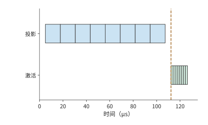

*图 5-36：粗粒度执行先完成八块投影，再启动八块激活。按 RTX PRO 6000 的矩阵峰值与显存带宽，每块投影约 12.8 μs、激活约 1.76 μs，两次 kernel launch 各 5 μs；竖线为激活开始。*

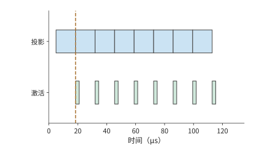

*图 5-37：矩阵与向量资源独立、缓冲充足。每个任务另计 0.7 μs 调度与通知，首块投影完成后即可激活；投影首尾相接，激活只在每块投影之后短暂工作，八块流水约 115 μs 结束。*

沿着图 5-37 的投影时间线看，八块投影首尾相接，中间没有空隙。这与双缓冲是同一个规律：第一块先完成前一阶段，之后每隔较慢阶段所需的时间完成一块；这里较慢的是投影，正如第 5.3.2 节较慢的是搬移，流水的节拍由它决定。每个缓冲槽从投影开始一直被占用到激活结束；没有空槽时，投影任务就要等待。因此，任务队列、完成事件和空闲缓冲共同决定下一块何时能够开始。

## 5.6 从局部优化到完整请求

前面每项优化都有明确的作用对象：分块减少输入重读，融合减少中间读写，运行时优化减少准备和等待。但完整请求还包含其他工作，局部节省的时间只占其中一部分。本节先说明如何从局部加速推算请求时间，再分析 Qwen3-8B 的实际请求。

### 5.6.1 热点占比决定加速空间

设请求由串行阶段构成，其他阶段时间保持不变，热点占原时间的比例为 f，热点的加速比为 s。将原请求时间归一化为 1，新时间为 $(1-f)+f/s$，整体加速为：

$$
S_{\mathrm{request}}=\frac{1}{(1-f)+f/s}.
$$

若热点占 20%，速度提高到原来的两倍后，总时间变为 $0.8+0.2/2=0.9$，加速比约为 1.11。继续把热点加快到十倍，总时间为 0.82；即使热点耗时降到零，其他阶段仍需原总时间的 0.8，整体加速上限为 1.25 倍。

这就是第 1 章介绍的 Amdahl 定律。该定律解释了优化收益逐渐缩小的原因：热点耗时越短，其他阶段在总时间中所占的比例就越高。

### 5.6.2 并行分支与关键路径切换

在 Amdahl 关系中，时间按串行阶段相加。若请求中有两个分支同时执行，缩短一个分支后，还可能需要等待另一个分支；此时应沿依赖图寻找决定完成时间的最长路径。设准备 10 μs 后，同时启动热点 A 和分支 B，分别需 60、40 μs；收尾需 10 μs，并等待两条分支都完成。原请求时间为：

$$
T=10+\max(60,40)+10=80\ \mathrm{\mu s}.
$$

将 A 加快四倍至 15 μs，B 仍需 40 μs，新时间为 $10+\max(15,40)+10=60$ μs。A 节省 45 μs，请求却只节省 20 μs，因为 B 接替 A 成为关键路径。

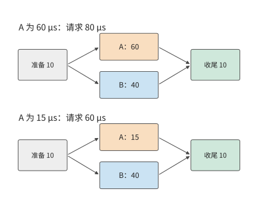

*图 5-38：收尾等待 A、B 两条分支。A 从 60 μs 缩短至 15 μs 后，较慢分支由 A 切换为 B，请求从 80 μs 降至 60 μs。准备和收尾各为 10 μs，两条分支使用独立资源。*

A 缩至 40 μs 时，恰好与 B 同时结束；继续只优化 A，完成时间便停在 60 μs。该交点给出了单独优化 A 所能获得的最大收益。若要继续缩短请求，应优化 B，或减少准备和收尾。

共享资源还会改变分支自身的时间。设 A 的新实现大量占用带宽，使并行执行的 B 耗时增至 90 μs，请求就变成 $10+\max(15,90)+10=110$ μs。B 多用的时间超过了 A 节省的计算时间，整个请求反而变慢。[^dag]

关键路径说明，一个分支节省的时间要放回整张依赖图，才知道请求能快多少。存储上的节省也要这样放回整个执行过程：一份状态少占的容量，未必等于每步少读的字节，因为每步读取多少，取决于有多少层读它、每层读哪些条目。第 2.3.6 节的 V4.1 会话已经给出 8K 条件下的一组数字：V4.1 让 38 个全局注意力层共享 4 份全局 KV，驻留降到 V4-Flash 的约四分之一，逐层逻辑读取却只少约 9%，并且超过了驻留量。共享状态不必每层各存一份副本，但用到它的每一层仍要读取它，容量的节省不会原样变成读取的节省。[^v41-case]

上下文变长后，仍需执行的索引扫描也会带来更多开销。128K 时，两代模型的全局历史状态与索引的逻辑读取量分别约为 65.085 与 33.422 MiB。V4.1 后续层的索引只访问候选池，初始索引仍需遍历全局。因此，即使后续层索引的访问范围固定，整个 decode 的开销仍会随上下文长度增长。

改变开销的不只是数据从哪里取得，程序是否真正省去了计算也有影响。候选池把后续索引的搜索范围缩小，工作量随之减少。公开参考实现先对完整索引缓存执行点积，再屏蔽候选池之外的位置；论文中的生产实现直接减少后续索引扫描的条目。前者已经完成了池外点积，后者在发起计算时就省去这部分工作。同一选择规则由此对应两种执行成本。

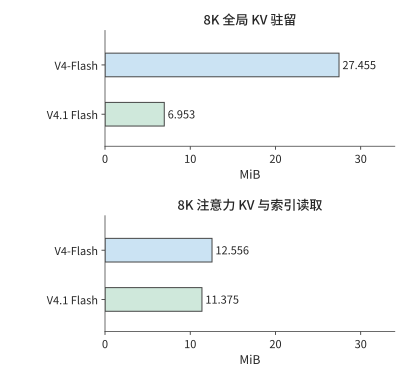

*图 5-39：全局驻留与逐层逻辑读取分开比较。上方仅计全局 KV 容量，下方读取包含全局条目、局部窗口和索引；两栏各自采用相同横轴尺度。数值按生产布局计算。*

### 5.6.3 综合案例：一次 Qwen3 请求的优化选择

将这一方法用于 RTX PRO 6000 上的 Qwen3-8B。请求输入 7239 个 token，生成 32 个输出 token，并发为 1，采用 BF16 与 eager 执行；这里的 eager 表示由主机按程序顺序逐项提交加速器工作。模型有 36 层，先做一次 prefill 产生首输出，再做 31 次 decode。每层每步执行一次 SwiGLU 的激活部分，即第 5.3.1 节的 $Z=\operatorname{SiLU}(G)\odot U$，共有 $36\times32=1152$ 次调用，其中 prefill 36 次，decode 1116 次。

两类调用承担不同工作。同一请求的 prefill 在 36 个模型层中分别对 7239 个输入 token 执行该算子，共处理 $36\times7239=260604$ 个 token 表示；31 步 decode 在每层处理一个新 token，共执行 $36\times31=1116$ 次单 token 算子调用。这里按“层数 × token 数”累计算子工作，同一个 token 在不同层参与计算会被重复计数。decode 的调用数是 prefill 的 31 倍，处理的行数却小得多。这正是本章反复遇到的形状差异：大矩阵提供较多并行工作，小矩阵的计算时间较短，kernel launch 和任务分配的开销更突出，也更难充分利用加速器。

在同一引擎中，将 36 层 SwiGLU 替换为一个采用不同调度方案的 kernel，执行记录确认 1152 次调用均使用了替换后的 kernel。阶段计时如下。[^exp9]

| SwiGLU 阶段 | 调用形状与次数 | 原 kernel | 替换后的 kernel |
| --- | --- | ---: | ---: |
| Prefill | 7239 行，36 次 | 约 11.2 ms | 约 11.2 ms |
| Decode | 1 行，1116 次 | 约 2.4 ms | 约 0.92 ms |

替换后的 kernel 主要缩短了一行输入的 decode 激活时间，加速比约为 2.6，decode 部分合计节省约 1.45 ms。prefill 的激活耗时基本相同，替换后反而多约 0.03 ms。轨迹中的这些激活与其他加速器工作顺序执行。原 kernel 的全部激活计算约为 13.6 ms，占约 851 ms 采集区间的 1.6%；保持其他工作不变，即使省去全部激活计算，也最多节省 13.6 ms。目前只缩短了 decode 部分，全部激活计算从 13.6 ms 降到 12.2 ms，因此整个请求预计减少约 1.4 ms。

在客户端交错测量替换前后的请求，共得到 11 对结果。替换前后的首 token 时间均约 436 ms，完整请求中位数分别约为 817 ms、815 ms。对每轮计算“替换前用时减去替换后用时”，配对时间差的中位数约为 1.3 ms，约占原请求耗时的 0.16%，与约 1.4 ms 的预期相符。图 5-40 列出每轮差值，其中 9 对在替换后耗时缩短，2 对在替换后耗时增加。

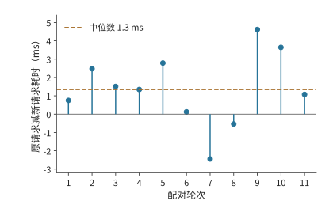

*图 5-40：同轮替换前的请求时间减去替换后的请求时间，正值表示替换后更快。RTX PRO 6000 上的 Qwen3-8B，7239 个 token 的输入、强制 32 个 token 的输出，并发 1，BF16、eager，关闭前缀缓存；11 对交错计时，轮内顺序随机，期间有其他驻留服务。虚线为配对时间差的中位数约 1.3 ms。阶段表来自单独采集的性能分析记录。*

decode 的改进发生在首输出之后，因此当前长输入请求的首 token 时间仍由 prefill 中的计算与等待决定。输出越长，一行输入的激活计算重复执行的次数越多，单步节省的时间也就累积得越多。

分析完整请求时，首先统计各种形状的调用次数，再计算每次调用节省的时间，最后根据依赖关系判断这些节省能否缩短整个请求。这样，就能把 kernel 的加速比、各阶段的耗时和用户实际等待的时间联系起来。

## 常见误区

**误区：仅凭 kernel 数量判断执行成本。** 图重放将 3 次 FFN 的主机提交从 18 次降到 3 次，加速器仍执行 18 个 kernel；融合才把加速器 kernel 减到 15 个。主机提交和加速器计算应分别沿各自的时间线解释。

**误区：访问量最小的实现一定最快。** 注意力的 K/V 块从 64 行缩到 1 行，访问量减少 144 MiB，状态更新次数却增至约 41 倍。读取、状态更新与矩阵处理率共同构成执行成本。

**误区：增加缓冲就能提高吞吐率。** H100 一个 SM 上每块搬移 1.29 μs、计算 0.28 μs，两个槽已让搬移器连续工作，四块在 5.44 μs 完成。第三个槽不能让搬移更快，加快计算也不行；要缩短时间，就要减少每块搬移的字节，或者提高带宽。

**误区：稳态执行最快，总耗时就最短。** 执行 70 组调用时，分桶约需 1.27 s，逐形状特化约需 1.38 s。特化每组执行得更快，但节省的时间尚不足以抵消额外的准备开销。

## 习题与配套实验

以下题目沿本章算例逐步改变条件。先完成纸面推导，再用配套代码或执行记录解释差异；实验入口保留原编号，配置、操作步骤和完整记录见对应材料。

> **实验 5-1 · 延伸：矩阵块大小如何改变局部存储与读取量**
>
> 将例 5-3 的输出块改为 64×128，归约块仍为 32，求局部存储需求、A/W 各自的读取次数与总访问量。与 64×64 方案相比，64×128 方案的有效带宽至少要达到前者的多少，才能使访存时间更短？再比较两种循环次序的执行记录，解释连续访问如何影响处理率。[^exp1]

> **实验 5-2 · 核心：激活算子融合能减少多少访存与显存占用**
>
> 对 G、U 各 24 MiB 的激活链，分别画出三个算子独立执行和完全融合时，各张量的分配、使用与释放顺序，推导 156 MiB、60 MiB 的访问量，以及两种方案的显存占用峰值。若融合实现每次增加 5 μs 固定开销，接口带宽取 RTX PRO 6000 的显存带宽 1792 GB/s，输入行数至少达到多少时，融合节省的访存时间才能超过这项开销？再结合配套实验结果，解释访问量减少的比例与耗时缩短的比例之间的关系。[^exp2]

> **实验 5-3 · 延伸：分块归约与预取如何改变注意力计算和访存**
>
> 在例 5-6 的输入中再加入一个元素，其分数为 $\ln4$、对应值为 5，更新 m、$\ell$、u，并与一次处理三个元素比较。保持注意力缓冲的总容量为 99 KB（101,376 bytes），从中额外划出一个 b×d 的 BF16 预取槽，取 b=64，求新的最大 Q 行数、扫描次数与访问量。解释预取缓冲为何会改变数据的重复读取次数。[^exp3]

> **实验 5-4 · 延伸：算子融合会改变计算结果还是执行成本**
>
> 在第 5.4.2 节的伪代码中，分别将 SiLU 移到 ko 循环内、删除中间 BF16 舍入、将量化计算移入每个输出列块的循环。说明各自改变了数学运算、数值舍入还是执行成本，并给出一个可区分前后结果或访问量的输入。[^exp4]

> **实验 5-5 · 延伸：分块循环如何改变访问顺序与临时存储**
>
> 用块号与块内坐标写出 i-k-j 的分块循环，标出输入缓存和累加器在程序中的创建、最后使用与释放位置。再对照配套转置程序采用两种块大小时的执行过程，比较访问连续性、同步操作和临时数据量，并据此解释执行时间的差异。[^exp5]

> **实验 5-6 · 延伸：输入形状的调用比例如何影响调优收益**
>
> 采用例 5-9 的两种输入形状，令形状 A 的调用占比分别为 1/2、2/3、9/10，计算原实现和新实现的平均时间。若根据形状选择实现，每次多花 1 μs，对 A 使用新实现、对 B 使用原实现，何时优于始终使用原实现？再根据配套搜索记录，统计搜索的总耗时，并计算找到的实现在重复调用中能节省多少执行时间。[^exp6]

> **实验 5-7 · 延伸：特化需要重复执行多少次才有收益**
>
> 画出例 5-12 中准备与执行的完整时间线。将每组中小形状的调用次数从 8 次改为 4 次，其他两种形状仍各调用一次。对三种方案两两比较，求各对方案总耗时相等时的重复次数。再假设两个分桶对应的程序已编译并缓存，求准备时间改变后，各方案总耗时最短时对应的重复次数范围。[^specialization]

> **实验 5-8 · 核心：图重放与算子融合分别减少哪些开销**
>
> 阅读图 5-28，分别统计四种方式下的主机提交次数与加速器 kernel 数量。把例 5-11 换到 RTX 4090 上，复制带宽取其显存带宽 1008 GB/s，求输入数据增大到多少时，复制开销恰好抵消图重放节省的时间；再让上游直接写入图缓冲，分别在输入大小为 2 MiB 和 16 MiB 时，比较普通提交与图重放的完成时间。[^exp8]

> **实验 5-9 · 核心：kernel 加速如何改变请求耗时与关键路径**
>
> 根据配套的 11 对请求记录，先计算每对请求的耗时差，再取这些差值的中位数。解释它与分别取两组请求耗时的中位数后再相减有何区别。采用本章综合案例的条件，保持 prefill 不变，把 decode 步数从 31 增至 127，假设每步节省的时间不变，估算激活计算总共能节省多少时间。再将图 5-38 中 A 的执行时间逐步缩短，求完整请求时间不再随之缩短时 A 的执行时间。[^exp9]

## 历史与进一步阅读

Halide 将算法与调度分离，使分块、重排和计算位置成为程序员可组合的动作；TVM 将张量计算、后端生成与自动调优联结起来；AKG 则将多面体调度、分层融合与片上存储安排结合，用于神经处理器代码生成。沿三者的原始材料阅读，可以进一步追踪表达方式如何影响编译器能够自动完成的变换。[^schedule][^akg]

FPGA 是可配置逻辑器件，高层次综合（HLS）将较高层程序转换为硬件数据通路。笔者早期的 FPGA／HLS 工作，也经历过从接口封装转向代码变换的过程：为了形成所需流水，必须识别原语和读写依赖，改变生成的数据通路。这段经历说明，研究重点从简化编程转向了改进执行方式。

算子编排优化系统 Korch 提供了另一个有启发性的例子：其中一个历史案例里，子图原本由三个 kernel 执行，合计耗时约 91 μs；调整为四个 kernel 后，合计耗时约 69 μs。重新拆分和组合算子缩短了加速器执行时间，足以抵消额外的 kernel launch 和数据传递开销。[^korch] 这一方向与本章的融合反例一起，说明了优化应比较整个计算过程的开销。

[^model]: [固定 Qwen3-8B 配置](../calculations/configs/models/qwen3-8b/config.json)；[模型算子与实现](../case-studies/model-operator-examples.md)。

[^tiles]: [分块容量与数据复用](../case-studies/buffer-capacity-and-data-movement.md)，含循环计数、Orojenesis 选读与 bank 映射。

[^order]: [切成几段与合并次序的浮点复算](../calculations/results/reduction-order.md)。教学用的这一行由给定公式生成后舍入到 BF16，不是采集到的激活；每个平方在 FP32 中都精确，各条路径的差别只来自加法次序。精确值用有理数算得，只作比较基准；枚举合并次序覆盖原子加可能出现的先后，不代表某个后端的实际分布。

[^reduction]: [RMSNorm 三阶段拆分计算](../calculations/results/rmsnorm-row1024-split8.md)。输入和 gamma 为 BF16，gamma 每行读取；一组一行保留输入，三阶段方案在应用阶段重读输入。

[^exp1]: [实验 5-1](../experiments/ch05/05-01/README.md)、[GPU 分块](../experiments/ch05/05-01/gpu-tiles/README.md)、[归约拆分](../experiments/ch05/05-01/rmsnorm-split/README.md)。

[^fusion]: [固定 scale 融合与张量生命周期](../calculations/results/fusion-qwen8-pointwise.md)。

[^exp2]: [实验 5-2 的原始条件、数据与分析](../experiments/ch05/05-02/README.md)。RTX PRO 6000、共享 GPU、热缓存与图重放；原始中位数为 14.20／7.68 μs，仅测激活子链。

[^buffer]: [流式顺序与缓冲预算](../case-studies/stream-order-and-buffer.md)；[主机搬移与缓冲区占用时间](../case-studies/host-transfer-and-buffer-lifetime.md)。

[^attention]: [注意力分块与在线状态](../case-studies/attention-tiles-and-io.md)；[99 KB 缓冲下的块大小与访问量](../calculations/results/attention-tiles-rtxpro6000.md)。容量模型采用单头、无掩码、K/V 复用输入槽和 S/P 复用临时槽；每个线程块 99 KB 的共享内存上限取自 [CUDA 编程指南的计算能力表](../references/files/documents/cuda-compute-capabilities.md)（计算能力 12.x 列）。

[^fa]: [FlashAttention](../references/files/papers/flashattention.pdf)、[FlashAttention-2](../references/files/papers/flashattention2.pdf)、[FlashAttention-3](../references/files/papers/flashattention3.pdf)。

[^exp3]: [实验 5-3](../experiments/ch05/05-03/README.md)。RTX PRO 6000 热缓存单头对照：2.64 ms／79.5 μs；新增分配峰值约 848／22.2 MiB，包括各后端分配的临时量。

[^akg]: Zhao 等，2021，[AKG: Automatic Kernel Generation for Neural Processing Units using Polyhedral Transformations](../references/files/papers/akg-pldi21.pdf)。

[^korch]: [Korch 的编排案例](../case-studies/kernel-orchestration-and-quantization.md)：论文 V100／FP32 子图，三 kernel 为 38.7、24.2、28.2 μs，四 kernel 为 7.6、18.4、7.5、35.7 μs。

[^schedule]: [TVM](../references/files/papers/tvm.pdf)、[TensorIR](../references/files/papers/tensorir.pdf)。


[^numerics]: [融合合法性、FP8 舍入和量化投影](../case-studies/fusion-legality-and-precision.md)；[RedFuser 后端阅读](../experiments/ch05/05-04/redfuser/README.md)。444／620 MiB 计数包括 A、W 与输出；行 scale 的辅助读写另见配套计算。

[^exp4]: [实验 5-4 的编译、舍入与执行差异](../experiments/ch05/05-04/README.md)、[DeepSeek V4-Flash 专家子链](../experiments/ch05/05-04/v4/README.md)。

[^exp5]: [实验 5-5 的生成代码与转置对照](../experiments/ch05/05-05/README.md)。

[^exp6]: [实验 5-6 的搜索与测量记录](../experiments/ch05/05-06/README.md)；[评测与部署计算](../case-studies/optimization-evaluation-and-deployment.md)。已记录两轮共 12 次 Agent 调用，未产生新的更快实现。

[^host]: [主机时间线调研](../research/2026-infra-survey/parallel-host-timeline/NOTES.md)；[配置流水与图执行](../case-studies/graph-execution-tradeoffs.md)。

[^vllm060]: [vLLM v0.6.0 发布公告归档](../research/2026-infra-survey/parallel-host-timeline/vllm-2024-blog.md)；收益归因的辨析见 [token 成本调研 第 8.2 节](../research/token-cost-2023-2026/report.md#runtime)。公告的吞吐在请求同时到达、`--num-scheduler-steps 10` 的条件下测得，2.7 倍是三项改动的合计收益，不能全部归于 GIL；多步调度在低负载下可能延长首个 token 的等待。

[^runtime]: [运行方式与反馈](../case-studies/execution-feedback.md)、[框架演进](../case-studies/framework-evolution.md)及[token 成本调研 第 7—8 节](../research/token-cost-2023-2026/report.md#runtime)。

[^graph]: [图重放的小输入复制](../calculations/results/graph-small-input-rtxpro6000.md)、[大输入复制](../calculations/results/graph-large-input-rtxpro6000.md)与[图执行取舍](../case-studies/graph-execution-tradeoffs.md)。复制带宽按源读加目标写的接口流量定义。

[^plan]: [FlashInfer 计划复用实测](../experiments/ch05/05-08/flashinfer-plan/README.md)。

[^specialization]: [形状特化的完整输入与交点](../calculations/results/specialization-medium.md)。

[^exp8]: [实验 5-8](../experiments/ch05/05-08/README.md)与[轨迹分析 JSON](../experiments/ch05/05-08/results/trace-analysis.json)。

[^persistent]: [设备任务组织与 MPK](../case-studies/execution-feedback.md)；[八块任务计算](../calculations/results/persistent-tiles-rtxpro6000.md)。投影按 RTX PRO 6000 的 BF16 稠密峰值 503.8 TFLOP/s 推得，激活按 1792 GB/s 显存带宽与每元素 4 bytes 读写（448 G 元素/s）推得，两项取自[硬件表](../calculations/results/hardware.md)；独立资源、任务开销和缓冲条件采用例中设定。

[^dag]: [请求关键路径教学计算](../calculations/results/request-dag-path-switch.md)、[争用情景](../calculations/results/request-dag-contention.md)。

[^exp9]: [实验 5-9 的 kernel 实现、执行记录与 11 对请求](../experiments/ch05/05-09/README.md)。vLLM 0.23，替换后的 kernel 采用 block256／4-warps 调度，11 对输出 token 一致。客户端中位数为 816.640／815.406 ms，配对时间差的中位数 1.343 ms，首 token 中位数 435.674／436.353 ms。单独采集的性能分析记录中，prefill 为 11.218659／11.244366 ms，decode 为 2.369803／0.920376 ms。原 kernel 耗时 13.588462 ms，替换后 12.164742 ms，采集区间 850.848989 ms；各热点与其他观测 GPU 工作的时间交集为零。

[^sm]: [SM 驻留、延迟隐藏与 MMA 指令数](../calculations/results/sm-occupancy-book-tile.md)、[累加器放入寄存器](../calculations/results/sm-occupancy-register-accumulator.md)、[延迟 1000 ns 与每 warp 2 条加载](../calculations/results/sm-occupancy-latency-1000ns.md)。SM 限制取自 [CUDA 编程指南的计算能力表](../references/files/documents/cuda-compute-capabilities.md)（计算能力 9.0 列）与 [Hopper 调优指南](../references/files/documents/nvidia-hopper-tuning.md)，占用率定义取自[编程指南的 kernel 编写一节](../references/files/documents/cuda-writing-kernels.md)，异步复制、栅栏、warp 分工与 swizzle 取自[异步数据复制一节](../references/files/documents/nvidia-async-copies.md)，3.35 TB/s 取自 [H100 产品页](../references/files/specs/nvidia-h100-spec.md)，132 个 SM 与 BF16 稠密矩阵峰值 989.4 TFLOP/s 取自 [H100 架构白皮书](../references/files/specs/nvidia-h100.pdf)（表 3）。每线程寄存器数、显存延迟、每 warp 未完成加载数与加载宽度、MMA 指令形状是本节选定的取值。

[^execution]: [CUDA 执行模型](https://docs.nvidia.com/cuda/cuda-programming-guide/02-basics/intro-to-cuda.html)；[CUDA Runtime API 的同步语义](https://docs.nvidia.com/cuda/cuda-runtime-api/api-sync-behavior.html)；[CUDA stream 管理](https://docs.nvidia.com/cuda/cuda-runtime-api/group__CUDART__STREAM.html)与[event 管理](https://docs.nvidia.com/cuda/cuda-runtime-api/group__CUDART__EVENT.html)；[PyTorch 锁页内存与异步复制教程](https://docs.pytorch.org/tutorials/intermediate/pinmem_nonblock.html)。主机复制与缓冲复用另见本章引用的本地计算材料。

[^v41-case]: [DeepSeek V4.1 官方技术报告](../calculations/sources/deepseek-v4.1-flash/DeepSeek_V41_Tech_Report.pdf)，第 1、2、3 节与第 6 节；[跨章会话的固定条件与复算](../calculations/results/v41-throughline.json)。

[^pcie]: [RTX PRO 6000 Blackwell 工作站版规格](../references/files/specs/nvidia-rtx-pro6000-spec.pdf)列出系统接口为 PCIe 5.0 x16；[NVIDIA H100 规格](../references/files/specs/nvidia-h100-spec.md)给出 PCIe Gen5 x16 为 128 GB/s，是收发两个方向的合计，每个方向 64 GB/s。

[^cc12]: RTX PRO 6000 Blackwell 为 SM120 架构（见[实验 5-2 的运行环境](../experiments/ch05/05-02/README.md)），即计算能力 12.0；[CUDA 编程指南的计算能力表](../references/files/documents/cuda-compute-capabilities.md)给出该列每个 SM 的共享内存上限 100 KB、每个线程块上限 99 KB，两者之差即每块的 1 KiB 预留。

## 本章小结

本章从一次矩阵投影出发，讨论了存储访问、算子融合、编译与运行时，最后分析完整请求。各节反复使用了三个基本判断。

第一，**复用需要空间**。更大的输出 tile 让同一输入参与更多乘加，也需要更多累加存储；保留量化结果让多个列块读取位宽更低的数据，也需要中间存储。判断这部分存储是否值得，应看它能减少多少重读或重算。在 SM 上，这份空间还决定能驻留多少线程块，从而决定有多少在途访存请求可以隐藏延迟。

第二，**数据依赖决定计算顺序**。逐元素运算可以在一个位置的输入准备好后直接完成，归约则要保存部分和或在线统计。编译器根据依赖移动计算位置，运行时通过事件确认数据是否就绪、缓冲区能否释放。融合和流水都以这些依赖关系为基础。

第三，**总时间取决于各项工作的执行顺序**。带宽决定传输一批数据需要多久，较慢阶段决定流水线中相邻两块的完成间隔，复用次数决定后续节省的执行时间能否抵消首次准备时间，关键路径决定局部改进能否缩短请求。因此，既要计算减少了多少工作，也要确定这些工作原本是否影响了最终完成时间。

下一章将这些关系推广到多个加速器。一片结果何时就绪、谁需要读取、要保存多久，将决定通信何时开始以及两端需要多少缓冲。
