# 第 6 章 超节点

上一章把矩阵分成小块，让输入在计算单元附近多用几次。现在把其中一块交给另一张加速卡：这张卡需要哪些输入，算完得到的是完整输出还是部分和，结果又由谁接着使用？数学没有变，但原来经过共享内存的数据，现在可能要穿过加速器互联甚至机房网络。同一种分块方式，由此变成了多卡并行方案。

给定八张卡，可以让各卡分别处理请求，也可以合力加速一个请求；切分方式既要容纳模型，又要达到延迟与成本目标。本章从算子的维度与依赖出发，逐步推导各种并行方式产生的通信，最后用给定的模型、八卡硬件和会话期限筛选方案。读完本章，读者应当能够为自己的模型和硬件列出可选的方案，排除不可行的，再根据瓶颈和测量结果做出选择，而不只是记住几个并行方式的缩写。

上一章研究单个加速器内的计算、数据复用与任务执行。多卡并行面对的仍是同一组问题：沿哪些维度切分，每一块放在哪里，各块需要哪些输入、结果在哪里汇合，以及按什么顺序执行。本章把单卡算子的分块与调度扩展到多张卡：先把矩阵和状态分到多张卡，推导由此产生的通信，再把通信放到实际连接上，最后决定一个实例使用多少张卡、同时部署多少个实例。本章的硬件是常见的 HGX H100 八卡服务器，贯穿推导的模型有两个：Qwen3-235B-A22B 的权重要占满整台服务器，用来说明容量、专家分工和 MoE 通信；Qwen3-32B 的权重可以放入一张卡，长上下文的 KV 却迫使模型跨卡，用来比较张量并行的卡数与实例数。其他模型和系统则用来说明结构变化对设计的影响。

## 6.1 从单卡到多卡

### 6.1.1 八张卡的独立部署与协作

第 1 章介绍的推理实例可以占用一张卡，也可以把模型分布在多张卡上。超节点则为实例内的频繁协作提供物理资源：其中的加速器经高带宽、低延迟的互联紧密相连。

推理实例描述模型如何部署和执行，超节点描述加速器如何互联。八卡超节点可以放八个单卡实例，也可以放两个四卡实例。前者的八个请求彼此独立；后者每个请求要在四张卡之间交换中间结果。服务器和机柜是安装与供电的单位；同一实例的各张卡可以都在同一台服务器内，也可以分布在多台服务器上。

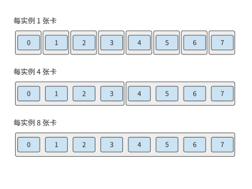

*图 6-1：相同八张卡上的三种实例分组。每个外框表示一个独立推理实例，内部连线表示完成请求所需的协作。各实例一次处理一个请求时，三种部署方式分别能同时处理八个、两个和一个请求。*

用更多的卡，通常出于三种需求：模型权重超过单卡内存，要分散存储；单个请求执行过慢，要把计算分给多张卡；同时到来的请求过多，要增加能独立处理请求的实例。这三种需求分别对应容量、延迟和吞吐三个目标。

### 6.1.2 贯穿算例：Qwen3-235B-A22B 的容量与单步时间

本章的贯穿算例是：在一台 HGX H100 服务器上运行 Qwen3-235B-A22B，模型已处理完输入，缓存中有 8192 个上下文 token，需要继续生成。HGX H100 是常见的八卡服务器：八张 H100 SXM 各有 80 GB HBM，峰值带宽 3350 GB/s，BF16 稠密矩阵运算的峰值为 989.4 TFLOP/s；八张卡经 NVSwitch（组织 NVLink 交换网络的交换芯片）用第四代 NVLink 互联，每张卡每个方向 450 GB/s；每张卡另配一张 400 Gbit/s（50 GB/s）的 ConnectX-7 网卡，用来连接其他服务器。[^hgx]

多卡设计首先要确定数据放在哪里。第 $i$ 张卡同时保存的权重 $W_i$、KV 状态 $K_i$、激活 $A_i$ 和其余工作区 $U_i$，应满足

$$
W_i+K_i+A_i+U_i\le C_i. \tag{6-1}
$$

这里 $C_i$ 是该卡可供任务使用的内存。权重随模型确定，KV 随会话上下文增长，激活和工作区随执行方式变化。这四项在同一时刻共用该卡的物理内存。

**Qwen3-235B-A22B 的模型规模。** 模型用 BF16 保存权重与 KV，共 94 层，隐藏维为 4096；每层有 64 个查询头、4 个 KV 头，头维为 128。FFN 由 128 个路由专家组成，每个 token 选其中 8 个，每个专家的中间维为 1536。GB、TB 使用十进制，MiB、GiB 使用二进制。

先求容量。全模型 BF16 权重约为 470.2 GB。每个上下文 token 需要保存每层的 K 和 V，因此全模型每 token 的 KV 为

$$
2\times94\times4\times128\times2=188\ \mathrm{KiB}.
$$

8192 个 token 的 KV 共约 1.58 GB。为激活和其余工作区预留 2 GiB，即约 2.15 GB，单卡总需求约为 473.9 GB，接近一张 H100 容量的六倍。

要容纳模型，就必须把这些数据分到八张卡：权重按矩阵的行或列分成八份，每张卡各保存一份；工作区仍然每卡各留一份。KV 按注意力头划分，而该模型只有 4 个 KV 头：八张卡时，每两张卡共用一个 KV 头，各自保存一份，所以每卡保存全部 KV 的四分之一。这种分法如何保证计算结果不变，见第 6.2.2 节。每卡内存需求变为：

| 放置 | 权重 | KV | 激活与工作区预留 | 合计 |
|---|---:|---:|---:|---:|
| 单卡 | 470.2 GB | 1.58 GB | 2.15 GB | 473.9 GB |
| 八卡中的每卡 | 58.96 GB | 0.39 GB | 2.15 GB | 61.50 GB |

每卡约需 61.50 GB，低于 H100 的 80 GB；整台服务器合计约 492.0 GB，640 GB 中还剩约 148 GB。每卡权重比 470.2 GB 的八分之一略多，因为归一化参数和路由器在每张卡上都有一份副本。每卡剩下的约 18.5 GB 可以保存更多会话：按这种分法，一个 8192 token 的会话在每卡占 0.39 GB，整台服务器最多同时保存 47 个这样的会话。分散存储降低了每卡的内存需求；实例的总内存占用则是各卡占用量之和。[^dense]

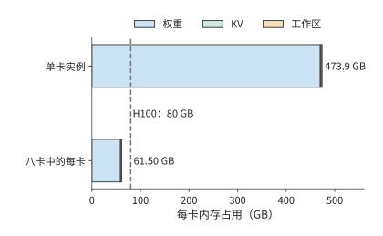

*图 6-2：单卡实例与分到八张卡后的每卡内存需求。单卡需要约 473.9 GB，远超 H100 的 80 GB（虚线）；分到八张卡后每卡约 61.50 GB。2 GiB 工作区在每张卡分别预留。*

接着求执行时间。内存容量决定能否保存这些数据，访问量决定一次执行需要读取或写入多少数据。以一层的专家计算为例：生成一个 token 时，路由器选中 8 个专家，每个专家有三个矩阵，权重共 $8\times3\times4096\times1536\times2=288$ MiB，都要从 HBM 读一遍。按 3350 GB/s 读取一次，约需 90.1 μs；矩阵乘法约有 3.02 亿 FLOPs，按 989.4 TFLOP/s 执行只需约 0.31 μs。权重读取时间比计算时间长两个多数量级，因此，要缩短这次调用的时间，首先应减少每卡读取的权重。整个模型生成一个 token 要读取约 43.1 GB 权重和 1.58 GB KV，若全部由一张卡读取，约需 13.3 ms；按上面的分法均分到八张卡，每卡约读 5.79 GB，约需 1.73 ms。

算子的计算与内存访问重叠执行时，执行时间可以用下式估计：

$$
T_{\mathrm{op}}=\max\left(\frac{F}{P},\frac{V}{B_{\mathrm{HBM}}}\right). \tag{6-2}
$$

$F$ 是运算量，$P$ 是矩阵运算性能，$V$ 是 HBM 访问量，单位为字节。计算和内存访问同时进行，耗时较长的一项决定算子的执行时间。后一个算子要等前一个算子的输出，因此依次执行的各段时间要相加。式 (6-2) 就是第 4.8.1 节的 Roofline 模型。按第 1.2.2 节的定义，单个 token 调用的 MFU 不会超过 $0.31/90.1$，即约 0.3%。这是 batch 为 1 时硬件允许的上限，与实现好坏无关；本章讨论的各种并行方式，都是在这一约束下重新组织权重的读取与复用。第 6.2 节将说明如何把这一层的权重和计算分配到多张卡，第 6.4 节再计算各卡交换结果所需的时间。

### 6.1.3 Prefill、Decode 与训练对资源的不同要求

第 6.1.2 节的 90.1 μs 与 0.31 μs 对应单 token 调用。若一次处理更多 token，同一份权重就能供多行输入使用，计算与读取时间的比例也会改变。一次调用处理 $m$ 个 token 时，专家的运算量与 $m$ 成正比，被选中专家的权重却可以在这些 token 之间复用。把上例从单 token 改为 8192 个 token 的 prefill，128 个专家全部被选中，一层专家权重的读取量增到 4.5 GiB，按 3350 GB/s 约需 1.44 ms；矩阵运算量则增长到约 2.47 TFLOPs，按 989.4 TFLOP/s 约需 2.50 ms，超过了读取时间。batch 大时，一份权重供许多输入行使用，执行时间的主要限制随之从权重读取转为矩阵计算。

通信也随形状变化。BF16 的隐藏张量为 $m\times4096$，单 token 占 8 KiB，8192 个 token 占 64 MiB。两次调用经历相同的层数，交换次数相同，每次传输的数据量却相差 8192 倍。小数据量的传输更容易受启动开销影响，大数据量的传输更依赖持续带宽。

Decode 还有时间上的依赖：当前输出 token 决定下一步输入。单个会话必须逐步推进；多个会话则可以同时提供已经就绪的输入。会话越多，权重复用的机会越多，KV 容量和读取量也越大，因而会同时改变计算时间、内存访问时间和排队时间。

训练在前向之后还要反向传播，计算输入梯度和权重梯度，再用梯度更新参数；前向激活要一直保留到反向用完为止。多卡训练因此还要同步梯度、保存更多状态。本章先介绍模型切分及其产生的数据交换，第 10 章再讨论这些操作如何组成完整的训练步。

### 6.1.4 并行方式一览：切分哪个维度

第 6.1.1 节的三种需求都要把工作分给多张卡，分法却各不相同。分法取决于模型处理的数据和模型本身的结构。一层的输入激活有三个维度：一次处理的样本数 $B$，推理时就是同时处理的请求数；每个样本的序列位置数 $S$；每个位置的隐藏特征数 $H$。第 5 章的矩阵乘把 $B$ 和 $S$ 合成了行数 $M$，注意力却要区分同一序列内的不同位置，所以这里把两者分开。模型本身还有两个可以切分的结构：层 $L$，以及 MoE 模型中每层的专家集合 $E$。图 6-3 把这五个维度画在一起，并标出六种常用并行方式各自切在哪里。

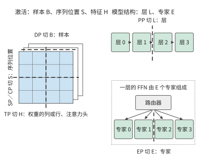

*图 6-3：左侧是一层的输入激活，三个维度分别对应数据并行、序列并行与上下文并行、张量并行的切分位置；右侧是模型结构，流水线并行切在层与层之间，专家并行切在同一层的专家之间。粗虚线表示切分位置，不表示数据流向。*

按切分的维度，六种并行方式可以概括为下表。表中的“交换”指卡与卡之间必须传递的数据，第 6.2 节各小节将逐一算出其大小。

| 并行方式 | 切分的维度 | 每张卡保存和计算什么 | 卡之间必须交换什么 |
|---|---|---|---|
| 数据并行（DP） | 样本 $B$ | 一份完整模型，不同的样本 | 推理时不交换；训练时汇合各卡的梯度 |
| 张量并行（TP） | 特征 $H$：权重的列或行、注意力头 | 同一层矩阵的一部分 | 输出分片按需收集；部分和必须相加 |
| 序列并行（SP） | 逐 token 算子的序列位置 $S$ | 同一序列在这些算子上的一段位置 | 进入矩阵乘前收集全部位置；部分和求和后重新按位置分片 |
| 上下文并行（CP） | 注意力的序列位置 $S$ | 同一序列一段位置的 Q、K、V | 远端的 K、V，或各段注意力的统计量 |
| 流水线并行（PP） | 层 $L$ | 一段连续的层 | 相邻阶段之间交接激活；训练时再反向交接梯度 |
| 专家并行（EP） | 专家 $E$ | 一部分专家 | 把 token 送到所选专家所在的卡，再把结果送回 |

表中隐含着一项贯穿全章的区别。切样本、序列位置、层或专家时，每张卡得到的是不同数据或不同层的完整结果，需要时收集或交接即可；切特征时，各卡往往只得到同一个输出的一部分贡献，必须把这些部分和相加，结果才能使用。第 5.2.4 节在单卡内区分过输出维与归约维的切分，跨卡时区别相同，只是相加部分和要经过卡间互联。

这些方式不是互斥的。序列并行通常和张量并行使用同一组卡，专家并行可以和注意力部分的数据并行共用同一批卡；流水线并行划分的是有先后依赖的计算图，不是把某个矩阵再切出一个维度。第 6.3 节将说明如何组合这些方式并给每张卡编号。

> **实验 6-1 · 延伸：上下文长度与输入行数如何影响容量和执行瓶颈**
>
> （a）求 Qwen3-235B-A22B 在 4096、8192、16384 个上下文 token 时的单请求 KV 容量。
>
> （b）按本节的八卡分法，每卡预留 2 GiB 工作区，求一台 HGX H100 最多能同时保存多少个 32768 token 的会话，权重精确值见注释。
>
> （c）对 1、64、8192 个 token，分别计算一层专家计算的矩阵运算量与被选中专家的权重读取时间（64 个 token 时被选中的专家数用第 6.3.2 节的式（6-8）估计），使用 H100 的参数判断执行时间主要受计算还是内存访问限制。
>
> （d）把 HBM 带宽减半，比较上述三种 token 数下的调用耗时增幅。

## 6.2 六种并行方式

本节按图 6-3 的顺序逐一介绍六种并行方式。为了看清分工，每一小节都先用两张卡说明，再推广到更多卡。

### 6.2.1 数据并行：复制模型，切分样本

**数据并行**（data parallelism，DP）让每张卡保存一份完整模型，各自处理不同的样本。图 6-4 中，两张卡分别处理 batch 的前四个和后四个样本，各自得到自己那部分输出。

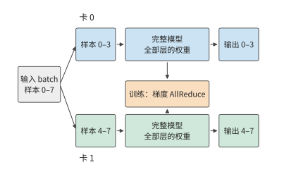

*图 6-4：两张卡各保存一份完整模型，分别处理不同样本。推理时两张卡互不等待；训练时两张卡的梯度要先汇合，再各自更新参数副本。*

推理中的数据并行就是部署多个实例。模型能放进单卡、又有多个独立请求时，最直接的办法是把不同请求分给不同实例。每个实例保存自己的权重和会话状态，独立完成输出。若一张卡每秒能处理 $r$ 个请求，八个单卡实例在始终有请求可处理时，每秒就能处理 $8r$ 个请求。

把八张卡合成一个实例后，设单个请求的加速比为 $S(8)$，该实例每秒能处理 $S(8)r$ 个请求。两种部署用的是同样八张卡，吞吐之比为 $S(8)/8$：只有单个请求恰好加速八倍，两者的吞吐才相同。一旦有通信和无法并行的工作，协作实例就是用一部分总吞吐换取更短的单请求时间。

训练的数据并行也在多张卡上放置同一套参数，但各卡的梯度共同决定下一次更新。例如两卡分别处理四个样本，求出各自的平均梯度 $g_0,g_1$，全部八个样本的平均梯度为 $(g_0+g_1)/2$。两卡各算一半样本，再汇合梯度，就完成了同一次更新。推理实例之间没有这种依赖。

### 6.2.2 张量并行：切分一层内的矩阵

多实例能同时处理更多请求，却不会缩短某个请求在单张卡上的执行时间，也无助于单卡无法容纳的会话。要让两张卡共同承担一个请求，就要把一层内部的计算和状态分开。**张量并行**（tensor parallelism，TP）把同一层内的矩阵分给多张卡，每卡各算一部分，再交换结果。图 6-5 标出一层里的两处切分位置。

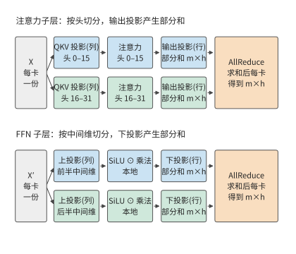

*图 6-5：注意力按头分给两张卡，前馈网络按中间维分给两张卡；两处的最后一个投影都只得到部分和，各需要一次 AllReduce 把两卡的部分和相加。m 为一次处理的 token 数，h 为隐藏维。*

**长上下文如何迫使稠密模型跨卡。** 稠密的 Qwen3-32B BF16 权重约 65.52 GB，一张 80 GB 的 H100 可以容纳。该模型原生支持 32K token 的上下文，用 YaRN 把位置编码外推四倍后可达 128K。[^qwen3-context] 每个 token 的 KV 为 $2\times64\times8\times128\times2=256$ KiB，一个 128K 会话要保存约 34.36 GB。单卡部署时，权重、一个 128K 会话的 KV 和 2 GiB 工作区合计约 102.03 GB，超过了 80 GB；分到两张卡，每卡约 52.09 GB，能容纳两个这样的会话；四卡每卡约 27.12 GB，能容纳七个；八卡能容纳十六个。这时采用张量并行首先是为了容量：TP1（TP 后的数字表示张量并行的卡数，TP1 即单卡）连一个 128K 会话都无法容纳。

但有些模型采用了新型注意力机制，可以减少长上下文下的 KV 存储需求。KV 容量由注意力设计决定：层数、KV 头数和头维，以及各层是否都要保存 KV。下表比较三个规模相近的模型：稠密的 Qwen3-32B；同一代的 MoE 模型 Qwen3-30B-A3B，仍用普通的 GQA，48 层，4 个 KV 头，头维 128；以及采用混合注意力的 MoE 模型 Qwen3.6-35B-A3B，40 层中只有 10 层是完整注意力，每层 2 个 KV 头、头维 256，其余 30 层是线性注意力，只保存固定大小的递推状态。

| 项目                       |   Qwen3-32B | Qwen3-30B-A3B |                 Qwen3.6-35B-A3B |
| ------------------------ | ----------: | ------------: | ------------------------------: |
| 常驻 BF16 权重               |    65.52 GB |      61.06 GB |                        69.32 GB |
| 每 token 的 KV             |     256 KiB |        96 KiB |            20 KiB（仅 10 个完整注意力层） |
| 每请求的固定状态                 |           — |             — | 62.9 MB 递推状态（FP32）＋ 2.0 MB 卷积状态 |
| 一个 128K 请求的状态            |    34.36 GB |      12.88 GB |                         2.75 GB |
| 每步权重读取（batch 1，32K 上下文）  |    63.97 GB |       6.08 GB |                         5.89 GB |
| 每步权重读取（batch 64，32K 上下文） |    63.97 GB |      60.44 GB |                        68.30 GB |
| 每步矩阵运算（batch 64，32K 上下文） | 8.49 TFLOPs |   2.04 TFLOPs |                     0.73 TFLOPs |
| 每步状态读取（batch 64，32K 上下文） |    549.8 GB |      206.2 GB |                         47.1 GB |
| 一张 H100 能容纳的 128K／32K 请求 |         0／1 |           1／5 |                            3／11 |
| 两张 H100 能容纳的 128K／32K 请求 |        2／10 |          7／29 |                          31／117 |

这张表说明了三点。第一，batch 为 1 时，两个 MoE 模型每步只读约十分之一的权重；batch 为 64 时，64 个 token 选中的专家几乎覆盖全部专家，权重读取回到 60～68 GB，与稠密模型的 64 GB 相当。第二，矩阵运算量始终只有稠密模型的 1/12～1/4，这是 MoE 一直保留的优势。第三，上下文长、batch 大时，状态读取成为每步的主要部分：按 3350 GB/s，batch 64、32K 上下文时三个模型读取状态分别约需 164、62 和 14 ms，读取权重只需 18～20 ms。这一项的差距来自注意力设计，而不是 MoE：Qwen3-30B-A3B 同样是 MoE，每 token 仍要保存 96 KiB 的 KV。

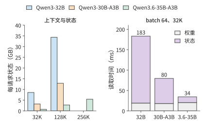

*图 6-6：左图为单个请求在 32K、128K 与 256K 上下文下的状态，Qwen3-32B 与 Qwen3-30B-A3B 的上下文上限为 128K。右图为 batch 64、32K 上下文时一次 decode 读取权重和状态的时间，按 H100 的 3350 GB/s 计。三种模型的权重读取相近，状态读取相差十倍以上。*

容量随之不同。每卡预留 2 GiB 工作区时，一张 H100 能容纳的 128K 请求分别为 0、1、3 个；两张 H100 时分别为 2、7、31 个。Qwen3.6-35B-A3B 原生支持 262,144 个 token，这样一个请求的状态也只有约 5.43 GB。因此，30B 级别的服务在 128K 上下文下是否需要多卡 TP，主要取决于注意力设计，而不是稠密还是 MoE。DeepSeek V4-Flash 等模型进一步压缩了 KV，第 2.6.1 节在 8K、200K 与 1M 上下文下比较了五个模型的状态与计算，这里不再展开。[^dense-moe]

回到图 6-5 标出的一层内两处切分：两处的最后一步都只得到部分和，要用 AllReduce 把各卡的部分和相加，再让每张卡都得到总和。Qwen3-32B 每层都要做两次，64 层共 128 次，后文计算执行时间时将反复用到这一次数。要理解为什么一种切法只需拼接、另一种却必须求和，考虑一个最小的矩阵乘。两张卡共同完成时，先要决定各算什么：可以让两张卡分别算出不同的输出元素，也可以让它们各算同一个输出的一部分。前一种结果需要拼接，后一种需要相加。

下面用完整的例子说明这两种切法。输入为 $x=[2,3]$，权重矩阵为 $W=\begin{bmatrix}1&4\\2&5\end{bmatrix}$，输出是 $xW=[8,23]$。按权重矩阵的列切分，也就是把输出特征分给不同的卡：卡 0 保存第一列，得到输出的第一个元素 8；卡 1 保存第二列，得到第二个元素 23。两个元素并排拼接，就得到完整输出。

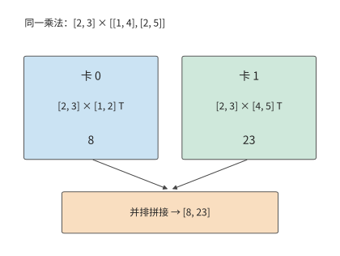

*图 6-7：按权重矩阵的列切分时，每张卡使用完整输入，计算不同的输出元素。格内的转置符号 T 表示把方括号中横排的数当作列向量。*

改为按权重矩阵的行切分，也就是把同一个 token 的输入特征分给不同的卡：卡 0 用输入 2 乘第一行，得到 $[2,8]$；卡 1 用输入 3 乘第二行，得到 $[6,15]$。两张卡各得到一个含两个元素的向量，但每个向量只包含一行权重的贡献；对应位置相加后，才得到完整输出 $[8,23]$。

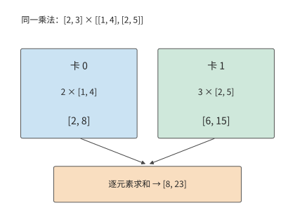

*图 6-8：按权重矩阵的行切分时，两卡产生形状相同的输出部分和。对应位置相加，恢复完整乘法的结果。*

两种切法在 FFN 中可以首尾相接，即图 6-5 下半部分的切法。这里采用第 2 章介绍的 SwiGLU：将输入送入门控投影与上投影，门控结果经过激活函数 SiLU，再与另一支逐元素相乘，最后执行下投影。设本次一起处理 $m$ 个 token，隐藏宽度为 $h$，中间宽度为 $f$。输入为 $X\in\mathbb{R}^{m\times h}$，上投影为 $W_g,W_u\in\mathbb{R}^{h\times f}$，下投影为 $W_d\in\mathbb{R}^{f\times h}$：

$$
Y=\left[\operatorname{SiLU}(XW_g)\odot(XW_u)\right]W_d.
$$

把中间宽度 $f$ 分成左右两半。卡 0 保存两个上投影矩阵左半部分的列与下投影矩阵上半部分的行，卡 1 则保存两个上投影矩阵右半部分的列与下投影矩阵下半部分的行。两张卡都保存完整输入 $X$，分别得到中间激活 $Z_0,Z_1$。SiLU 和乘法逐元素执行，各卡可以直接处理自己的半段。

下投影沿同一个中间维相接：

$$
Y=[Z_0\ Z_1]\begin{bmatrix}W_{d,0}\\W_{d,1}\end{bmatrix}
=Z_0W_{d,0}+Z_1W_{d,1}. \tag{6-3}
$$

右侧两个乘积的形状都是 $m\times h$，各自只包含中间维一半分量的贡献，相加后才是下一层要用的输入。

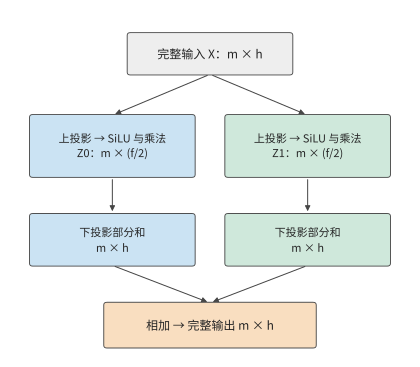

*图 6-9：SwiGLU 的两卡切分。上投影按权重矩阵的列划分输出特征，逐元素运算留在本地；下投影按权重矩阵的行划分输入特征。两步均保留全部 $m$ 个 token，切分的是每个 token 的特征维度。每卡中间激活为 $m\times(f/2)$，输出部分和仍为 $m\times h$，最后逐元素求和。*

若两张卡都需要完整结果，就执行 AllReduce。若下一个算子可以继续使用分片，则执行 **ReduceScatter（归约后分散）**：先求和，再把求和结果的不同片段留在不同的卡上。要从分片恢复完整数据，则执行 **AllGather（全收集）**，把各卡持有的片段拼起来。

**例题：四卡切分减少多少权重读取，又增加多少通信？** 取 Qwen3-32B 的 $h=5120,f=25600$，将中间维均分到四卡。

解答：每卡上投影为 $5120\times6400$，下投影为 $6400\times5120$。三个矩阵共占 187.5 MiB，是原来 750 MiB 的四分之一。按 3350 GB/s，单 token 的读取时间从约 234.8 μs 降到 58.7 μs，每卡少读 562.5 MiB，节省约 176.1 μs。代价是要把四张卡各自的 10 KiB 输出部分和相加。第 6.4 节将用具体算法求出这次汇合的时间。

注意力也可以按头切分：Q、K、V 投影只产生本卡负责的头，各卡独立计算这些头的注意力；输出投影把各头的结果映射回隐藏维，各卡得到的仍是部分和，相加后才是完整输出。因此 Qwen3-32B 每层要对注意力输出和 FFN 输出各做一次归约，64 层共 128 次。词嵌入按词表切分，词表输出投影也按词表分到各卡。

头不能再拆，是分配的最小单位。Qwen3-32B 有 8 个 KV 头，TP8 时每卡一个；TP16 时，共用同一个 KV 头的查询头被分到两张卡，两张卡都要保存该 KV 头的状态。上下文为 128K 时，每个 KV 头的状态占 4 GiB，八卡合计 32 GiB，十六卡合计 64 GiB。Qwen3-235B-A22B 只有 4 个 KV 头，第 6.1.2 节的八卡分法已经让每个 KV 头在两张卡上各存一份。TP 卡数一旦超过 KV 头数，继续增加就会复制 KV。

本章用“实例数”表示独立推理服务的数量，用 $p$ 表示单个实例的 TP 卡数。共有八张卡时实例数为 $8/p$。后文先求单个实例生成一个 token 的时间 $T(p)$，再换算成一组请求的完成时间。

**从单层计算推导完整 decode 步的耗时。** 以 Qwen3-32B 的一个 128K 会话为例。各投影权重每步从 HBM 读一次，旧 KV 读一次，并写入一个新 token。注意力投影的 BF16 权重为

$$
2\left(2\times5120\times8192+2\times5120\times1024\right)=180\ \mathrm{MiB}.
$$

其中两个 $5120\times8192$ 对应 Q 与输出投影，两个 $5120\times1024$ 对应 K 与 V。每层再加 750 MiB FFN 权重，共 930 MiB。上下文有 131,064 个 token 时，每层读取的 KV 约为 512 MiB。词表有 151936 项，输出投影权重约为 1.56 GB。因此全步 HBM 访问量可写成

$$
V(s)=64\times930\ \mathrm{MiB}
+256\ \mathrm{KiB}\times(s+1)
+151936\times5120\times2\ \mathrm{bytes}, \tag{6-4}
$$

$s$ 为这一步开始前的上下文长度。代入 131,064，约为 98.32 GB，其中权重 63.97 GB，KV 34.36 GB。按 H100 的 3350 GB/s 读完约需 29.35 ms；同一步的矩阵运算约 0.34 TFLOPs，按 989.4 TFLOP/s 只需约 0.34 ms，所以每层注意力和 FFN 的执行时间都受内存带宽限制。采用 $p$ 路 TP（$p\le8$）时，权重和 KV 都均分到各卡，这部分时间为 $29.35/p$ ms。归一化、逐元素运算和采样只读写几个隐藏向量，这里不计。[^continuous]计算与归约依次执行，就得到后文各节使用的执行时间模型：

$$
T(p)=\frac{T_{\mathrm{local}}}{p}+128\,T_{\mathrm{AR}}(p),
\qquad T_{\mathrm{local}}\approx29.35\ \mathrm{ms}. \tag{6-5}
$$

其中 $T_{\mathrm{AR}}(p)$ 是 $p$ 张卡做一次 AllReduce 的时间。式（6-5）把增加 TP 卡数的影响分成两项：本地执行时间随卡数增加而下降，通信时间则取决于算法和连接方式。将卡数从 $p$ 翻倍到 $2p$，节省的本地时间为 $T_{\mathrm{local}}/(2p)$。因此，增加卡数能够缩短执行时间的条件是

$$
128\left[T_{\mathrm{AR}}(2p)-T_{\mathrm{AR}}(p)\right]
<\frac{T_{\mathrm{local}}}{2p}. \tag{6-6}
$$

$p$ 越大，右侧越小。即使每次归约只增加同样一小段时间，累积起来也会抵消本地执行时间的缩短。

卡更多时，线性层还可以同时切分两个矩阵维度，把卡排成行、列两个方向的通信组。以 $[8192,4096]\times[4096,12288]$ 的投影为例，把输出分成 16 片放在 16 张卡上，每张卡起初只有 4 MiB 的输入分片和 6 MiB 的权重分片。排成 4×4 网格时，每张卡要横向收集同一行另外三张卡的输入分片，发送 12 MiB；纵向收集同一列另外三张卡的权重分片，发送 18 MiB。改成 2×8 网格，两个方向分别为 28 MiB 和 6 MiB；改成 8×2 则为 4 MiB 和 42 MiB。两个方向的链路独立且等速时，传输时间由较大的一方决定，因此 4×4 最快。MeshSlice 沿这种布局继续分块，让收集与矩阵乘流水执行；推理系统 Arctic 则在不同执行阶段切换分工，其状态迁移在第 9 章展开。[^variants]

### 6.2.3 序列并行：逐 token 算子沿序列分片

张量并行让每张卡只保存矩阵的一部分，但层内还有一些算子不做矩阵乘，例如 LayerNorm（层归一化）、Dropout 和残差相加。这些算子逐 token 工作：每个 token 的结果只依赖自身的隐藏向量。**序列并行**（sequence parallelism，SP）让这些算子沿序列位置分片：TP 组内的每张卡只处理一段位置，不再各自保存一份完整激活。本书采用大模型训练框架 Megatron 的这一常见定义。[^sequence-context]

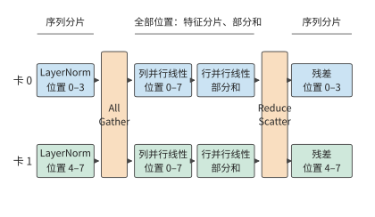

*图 6-10：LayerNorm 和残差只用到本 token 的数据，两张卡各处理一半位置；进入列并行线性层前用 AllGather 收集全部位置，行并行线性层的部分和用 ReduceScatter 求和并重新按位置分片。*

列并行线性层需要完整的输入行，进入它之前先用 AllGather 收齐各卡的序列分片；行并行线性层产生部分和之后，用 ReduceScatter 一边求和、一边重新按位置分片。AllReduce 本来就等于 ReduceScatter 加 AllGather，序列并行只是把这两半放到了不同的算子边界上，中间的逐 token 算子就不必每张卡都保存一份完整激活。

例如 $[8192,4096]$ 的 BF16 激活为 64 MiB，四卡各保留连续的 $[2048,4096]$ 分片时，每卡只占 16 MiB，总计 64 MiB；四卡各存完整张量则总计 256 MiB。这一节省只发生在保持序列分片的区间，不是模型的所有激活与权重都缩小四倍。归约维和输出维的关系仍与图 6-9 相同，变化的只是下一个算子接收哪种布局。配套的实验在 JAX（支持自动求导和编译执行的数值计算框架）中展示了保持分片和重新收集两条 FFN 路径。[^tp-experiment]

### 6.2.4 上下文并行：切分同一序列的注意力

序列并行只处理逐 token 的算子，注意力却要让每个位置看到序列中的其他位置。**上下文并行**（context parallelism，CP）把同一个长序列的位置分给多张卡，每张卡保存自己那段位置的 Q、K、V，并计算这段位置的注意力输出。图 6-11 用八个位置说明两张卡的分工。

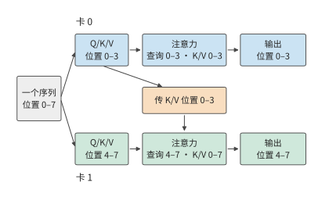

*图 6-11：每张卡保存自己那段位置的 Q、K、V。因果注意力下，卡 1 的查询还要用到卡 0 的 K、V，所以 K、V 必须跨卡传递；非因果注意力时两个方向都要传。*

本卡的查询仍要用到掩码允许范围内的远端 K、V。可以一次收齐全部 K、V，也可以让 K、V 块在各卡之间环形传递，边到达边用第 5.3.3 节的在线 softmax 累计最大值、指数和与加权输出。环形注意力（Ring Attention）是一种调度和传输的实现方式，上下文并行是工作划分方式，两者不是同义词。[^sequence-context]

图 6-12 把这种依赖画成八个位置之间的可见关系。

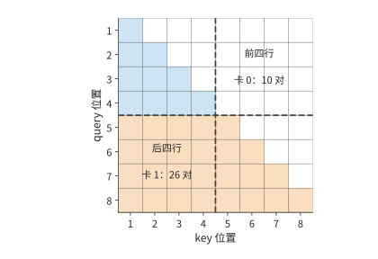

*图 6-12：八个 token 的因果注意力，横轴为键的位置、纵轴为查询的位置。实色格是必须计算的查询—键配对；前四行归卡 0，后四行归卡 1。虚线只是设备边界，左下区域的远端依赖并不因此消失。*

按位置连续切半还会造成计算不均。八个位置的因果注意力共有 $1+\cdots+8=36$ 个查询—键配对；前四个位置只有 10 对，后四个有 26 对，两张卡的 token 数相同，工作量却相差 2.6 倍。把靠前和靠后的位置搭配起来，例如卡 0 持有位置 $1,2,7,8$，卡 1 持有 $3,4,5,6$，两张卡就各承担 18 对。实际实现常用分块交错的“之”字形布局，但必须保留原始位置和因果掩码，并重新安排通信；远端上下文不能当作 padding 丢弃。

Decode 时新 token 的查询很少，历史 K、V 却很长。沿历史位置切分后，每张卡先算出本段的最大值 $m_r$、指数和 $l_r$ 与未归一化的加权向量 $u_r$，再合并为

$$
m=\max_r m_r,\qquad
l=\sum_r e^{m_r-m}l_r,\qquad
u=\sum_r e^{m_r-m}u_r,\qquad o=u/l.
$$

$o$ 即新 token 在全部历史位置上的注意力输出。这与第 5 章 tile 之间合并 softmax 的做法相同，只是统计量和向量要跨卡传输。不能各卡先分别做完 softmax，再简单平均各卡的输出。上下文并行减少了每张卡保存的上下文状态和本地的注意力计算，代价是 K、V 的交换或统计量的归约；生成时前后 token 之间的依赖并不因此消失。序列并行和上下文并行在不同框架里的名称有交叠，判断一种配置时，应看切了哪些算子、哪些张量、用了哪个通信组，而不只看缩写。

### 6.2.5 流水线并行：按层划分阶段

上述几种方式都在一层内部分工。**流水线并行**（pipeline parallelism，PP）改为按层分工：把模型的层按顺序分成若干阶段，每个阶段由一张或一组卡负责。图 6-13 把 Qwen3-32B 的 64 层分成两个阶段。

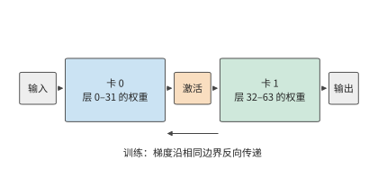

*图 6-13：两个阶段各保存自己那些层的权重。相邻阶段之间只交接激活；训练时梯度沿同一边界反向传递。*

前一个阶段算完自己负责的层，把激活传给下一个阶段接着算。每个阶段只保存自己那些层的权重，阶段之间只传递中间结果。

送入流水线的输入按 micro-batch 组织：一个 batch 拆成多个 micro-batch，不同阶段就能同时处理不同的 micro-batch。设模型分成 $q$ 个阶段，每个阶段的执行时间（含传递激活）为 $t$，输入是 $b$ 个已经就绪、互不依赖的 micro-batch。考虑四个阶段、每阶段 1 ms 的情形。micro-batch 0 在 0 ms 进入阶段 0，经过四个阶段，在 4 ms 完成；阶段 0 在 1 ms 就能接收 micro-batch 1，后者在 5 ms 完成。其余 micro-batch 依次跟进，每隔 1 ms 完成一个。

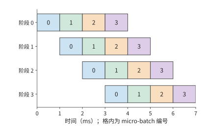

*图 6-14：四个等时阶段处理四个独立 micro-batch。每格为 1 ms，同色表示同一 micro-batch。第一项结果在 4 ms 产生，最后一项在 7 ms 产生；左上到右下的空白来自流水填充与排空。*

第一个 micro-batch 花费 $qt$，其后每增加一个 micro-batch 只增加 $t$，所以

$$
T_{\mathrm{PP}}=(q+b-1)t,\qquad
\eta_{\mathrm{PP}}=\frac{qb\,t}{q(q+b-1)t}=\frac{b}{q+b-1}. \tag{6-7}
$$

分子是所有阶段实际工作的时间总和，分母是阶段数乘以处理全部 micro-batch 所需的时间。四阶段、四个 micro-batch 的利用率为 $4/7$，约 57%；增加到 16 个 micro-batch 时为 $16/19$，约 84%。独立 micro-batch 越多，流水填充与排空造成的空闲时间占比就越小。

各阶段执行时间不均也会让卡空闲。若四个阶段分别需要 1、1、2、1 ms，第一个 micro-batch 在 5 ms 完成，此后最快每 2 ms 完成一个。送到耗时 2 ms 阶段的输入到达速度超过其处理速度，队列逐渐积压；缓冲用满后，上游阶段只能暂停。按各层的实际执行时间划分阶段，可以让各阶段的耗时更接近，减少积压。[^pipeline]

自回归会话的下一步输入，要等当前 token 生成后才就绪。四个独立会话可以提供四个 micro-batch，同一会话未来的四个 token 则是一条先后依赖链。流水利用率因此直接取决于同时有多少 micro-batch 可以开始执行。

### 6.2.6 专家并行：切分专家集合

最后一种方式切分的是 MoE 特有的专家集合。稠密模型的每个 token 使用同一组 FFN 权重；MoE 模型准备多个前馈网络作为专家，由路由器计算选择分数，为每个 token 选出要执行的专家。每个 token 只用到被选中的专家，但整个专家集合都要保存在加速器上，供后续 token 选择。MoE 由此增加了一种分工方式：**专家并行**（expert parallelism，EP）把不同专家放到不同的卡上，由各卡处理发给自己的输入。图 6-15 把八个专家分给两张卡。

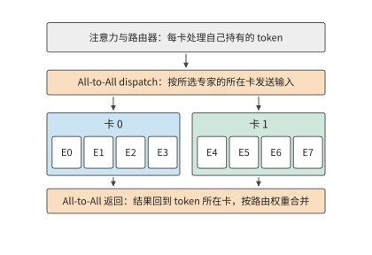

*图 6-15：注意力和路由器在 token 所在的卡完成；输入按所选专家的所在卡发送，专家算完后结果送回原卡，按路由权重合并。两次交换都是 All-to-All（全交换），即每张卡向其他各卡分别发送不同的数据。*

专家并行首先要解决专家权重放在哪里，然后才是当前 token 如何执行。

先用四张卡、八个专家说明这种分工。卡 0 保存专家 0 和 1，卡 1 保存专家 2 和 3，依次类推。卡 0 当前持有 token A，路由器为 A 选中专家 1 和 6：专家 1 就在本卡，专家 6 在卡 3。卡 0 既要执行本卡的专家 1，也要把 A 的输入送到卡 3，最后收回两份输出，按路由权重合并。

把专家输入送往专家所在卡的过程称为 **dispatch（派发）**，把输出送回原卡并合并的过程称为 **combine（合并）**。继续看 token A：若两个专家的输出分别为 $y_1,y_6$，路由权重为 $a_1,a_6$，完整的 MoE 输出为 $a_1y_1+a_6y_6$。发送方的卡保存 token 的编号和路由信息，接收方的卡执行专家，返回的结果再归到同一个 token 名下。

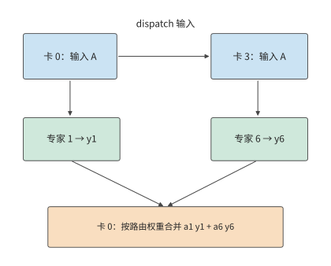

*图 6-16：卡 0 持有 token A，选择本地专家 1 与卡 3 上的专家 6。dispatch 沿上方路径发送输入，combine 沿下方送回专家输出并加权合并。每个 token 选中几个专家，就要算几次；专家在哪张卡，决定输入要送到哪里。*

多个专家在同一张卡上时，可以只发一份输入。若一个 token 选中的八个专家两两分布在四张远端卡上，4096 维的 BF16 输入为 8 KiB：按专家逐个发送要 64 KiB，按目的卡发送只要 32 KiB，同一张卡上的两个专家共用这份输入。

多个 token 一起处理时，每张卡要向不同的卡发送数量不等的数据，这就是图 6-15 中的 All-to-All。接收方先按专家把收到的输入行重新排列，做矩阵乘，再按 token 编号把输出排回原序。收到输入最多的卡，通常也要做最多的专家计算。

Qwen3-235B-A22B 将这一例子扩大为每层 128 个路由专家，每 token 选 8 个，共 94 层。每个专家包含三次投影，隐藏维 4096，中间维 1536，BF16 权重为 $3\times4096\times1536\times2=36$ MiB。单层全部专家占 4.5 GiB，94 层约占 423 GiB。把专家均分到八卡，每卡约为 52.9 GiB，此外每张卡还要保存注意力层、路由器和输入输出层的权重、KV 和工作区。专家集合可以分散到各卡，注意力的头和状态则按注意力自己的分工保存。

> **实验 6-2 · 核心：张量切分与 micro-batch 流水如何改变执行时间**
>
> （a）写出两卡 SwiGLU 的六个权重分片和两个输出部分和的形状，用式（6-3）说明为什么需要将两张卡的输出部分和相加。
>
> （b）对 TP1、TP2、TP4、TP8，计算 Qwen3-32B 一个 128K 会话的本地内存访问时间，暂不计通信开销；求卡数每次翻倍所节省的时间。
>
> （c）采用第 6.4 节的归约时间，将其代入式（6-5），重新计算加速比，解释差距从哪里产生。
>
> （d）画出四阶段处理八个 micro-batch 的时序，分别考虑四个阶段均耗时 1 ms，以及耗时依次为 1、1、2、1 ms 的情况；比较两种情况下的完成时间，并指出 micro-batch 会在哪个阶段之前积压。
>
> （e）进阶：对同一个 FFN，比较输出完整张量与保留输出分片两种方式下，相邻算子之间需要传递的数据；也可选择配套二维网格方案，进一步推导通信数据的分块方式。

## 6.3 组合并行与模型规模

六种方式很少单独使用。本节先说明如何组合这些方式并给每张卡编号，再讨论 MoE 特有的两个问题：一批 token 的专家选择如何改变权重读取和各卡负载，以及模型继续增大时组合如何变化。

### 6.3.1 组合方案与设备坐标

张量并行和流水线并行可以组合：例如把八张卡分成四个流水阶段，每个阶段内两张卡做张量并行。每层的两卡归约在阶段内完成，相邻阶段之间传递激活。若阶段内两张卡各自持有完整的 8 KiB 隐藏向量，并分别交给下一阶段对应的卡，两个阶段之间总共要发送 16 KiB；若阶段之间传递的是分片，则由下一阶段按计算需要重新拼合。因此组合两者时，要写清每个阶段输出的是哪些分片，下一阶段每张卡接收哪些分片。

组合多种方式时，先给每张卡标出坐标，再对每个算子写出其输入、权重和输出分片，以及需要通信的卡组。例如数据并行 2、流水线并行 2、张量并行 4 的方案记作 DP2×PP2×TP4，占 $2\times2\times4=16$ 张卡；若在同一 TP4 组内启用序列并行，卡数不变，不再乘一个 SP4。切分确定每份工作归谁，调度确定就绪、执行、通信与回收的顺序，两者合起来才是完整的并行方案。

专家并行也可以和专家内部的张量并行组合。例如四个专家组各拥有 32 个专家，每组再用两张卡切分专家的中间维，每张卡处理 768 维。整个实例仍是八张卡，每张卡用两个编号标识：专家组编号说明该卡负责哪些专家，组内张量并行编号说明负责这些专家矩阵的哪一半。后文沿这一 TP2×EP4 布局推导通信。

专家输入的来源如下：让四个专家组都对同一个请求执行注意力，各自保存该请求的 KV；注意力算完后，每个组都持有完整的专家输入，直接选出本组专家需要的行即可，不必跨组 dispatch 输入；各组的结果最后再归约汇合。

| 专家组 | 卡 | 专家编号 | 每卡专家中间维 | 每卡 KV 头 |
|---|---|---|---:|---|
| 0 | 0、1 | 0—31 | 768 | 偶数卡 0、1；奇数卡 2、3 |
| 1 | 2、3 | 32—63 | 768 | 同上 |
| 2 | 4、5 | 64—95 | 768 | 同上 |
| 3 | 6、7 | 96—127 | 768 | 同上 |

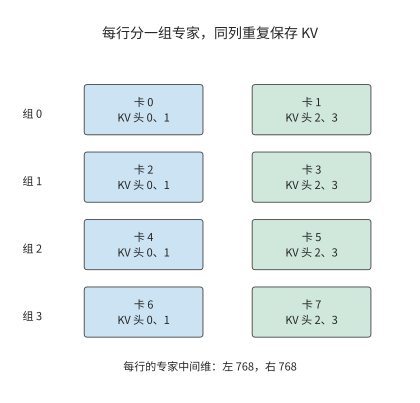

*图 6-17：八张卡排成四个专家分组，每组两卡沿专家中间维分工。同一列的注意力头与 KV 重复四份；每组因此都能在本地得到相同的专家输入。*

数据位置确定后，再跟踪输出如何汇合。组内两张卡各算专家中间维的一半，先在组内相加，得到本组专家的完整贡献；再把四个组的贡献相加。

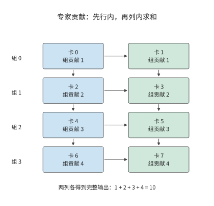

*图 6-18：横向箭头表示组内两卡求和，纵向箭头表示四个组求和。格内数字是某个输出元素经组内求和后的值，两列各自都得到相同的完整结果 10。*

第二步的求和发生在编号相同的卡之间。例如四个组对某个输出元素的贡献分别为 1、2、3、4，四张偶数卡一组归约得到 10，四张奇数卡另一组也得到 10。此时每张卡都持有相同的完整输出，可以继续算下一层。

省去 dispatch 要付出存储与计算的代价。按这份布局，每张卡的权重约 64.8 GB，八卡共 518.6 GB，比每个参数只保存一份的 470.2 GB 多约 48.4 GB。上下文 8192 个 token 时每卡 KV 为 752 MiB，八卡共 5.875 GiB，是该请求实际 KV 的四倍。每个组都重复执行一遍注意力，换来的是专家输入就在本组。[^ownership]

**例题：注意力复制与专家切分的布局需要多少归约通信？** 归约采用 FP32，单个 token 的完整隐藏向量为 $4096\times4=16$ KiB。用第 6.4.2 节的环形算法在两张卡之间归约，每张卡发送一个完整向量的大小；四张卡归约则发送 1.5 倍。每层有注意力的组内归约、专家的组内归约、四个专家组之间的归约三次汇合，所以每张卡发送

$$
16+16+24=56\ \mathrm{KiB}.
$$

八卡合计 448 KiB；8192 个 token 的 prefill 采用同样的分工，每张卡发送 448 MiB。

### 6.3.2 批内复用与负载不均

上一小节确定了专家放在哪些卡上，还没有确定每一步哪些卡最忙，这取决于当前 batch 选中了哪些专家。一个 token 只选八个专家，一个 batch 却可能覆盖整个专家集合。设 64 个 token 各选八个专家，共 512 次 token 到专家的分派。

若这些分派恰好均匀覆盖 128 个专家，每个专家处理四个 token 的特征向量；若所有 token 选择同样的八个专家，每个专家处理 64 个 token 的特征向量。两种分派的有效矩阵运算量相同。假定在一个 batch 内，每个被选中专家的权重只从 HBM 读取一次，前者需要 $128\times36$ MiB，即 4.5 GiB；后者需要 $8\times36$ MiB，即 288 MiB，读取量相差 16 倍。

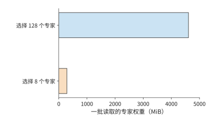

*图 6-19：64 个 token、每 token 八个专家，共 512 次分派。均匀覆盖与集中选择的有效计算量相同，被选中专家的权重读取相差 16 倍。每个专家 BF16 权重为 36 MiB，批内读取一次。*

活跃专家越少，每个专家的权重就能供更多输入行复用，既减少重复读取，也让矩阵乘的行数变大。但是，这些行由哪张卡执行，同样影响完成时间。在 TP2×EP4 布局中，均匀覆盖时每组承担 $32\times4=128$ 次分派；若八个活跃专家全都在一个专家组，该组要承担全部 512 次，计算量是均匀时的四倍，其余三组只能等待。

因此，分析执行时间需要同时计算整批的权重读取量，以及负载最重的专家组的计算量。Decode 的小矩阵运算容易受权重读取速度限制，prefill 的大矩阵运算则更容易受负载最重的专家组的计算时间限制。把热点专家分散到不同的 EP 组，既保留了批内复用，又减轻了单个专家组的计算负担。

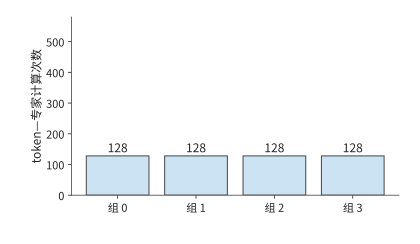

*图 6-20：均匀使用 128 个专家时，四个 EP 组各处理 128 次 token—专家计算，合计读取 4.5 GiB 权重。*

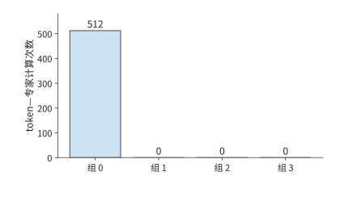

*图 6-21：所选八个专家都在组 0：权重读取降到 288 MiB，512 次计算却全部压在同一组。*

*图 6-22：把同样的八个专家分散到四组，将读取量维持在 288 MiB，同时让四组各承担 128 次计算。三图纵轴范围相同。*

图中后两种布局读取同样多的权重，完成时间却可能不同，因为参与计算的卡数不同。因此，批内复用应与专家在各卡上的分布一起分析。

除上述均匀覆盖与集中选择两种情况外，还可以计算均匀随机选择专家时的平均结果。设每 token 从 $E$ 个专家中选 $k$ 个，各 token 独立。一个专家被单个 token 跳过的概率为 $1-k/E$，被整批 $m$ 个 token 跳过的概率为 $(1-k/E)^m$。对每个专家定义一个指示变量：该专家在批内被选中时取 1，否则取 0。将这些变量相加，再取期望，可得批内被选中专家数的期望：

$$
\mathbb{E}[E_{\mathrm{active}}]=E\left[1-\left(1-\frac{k}{E}\right)^m\right]. \tag{6-8}
$$

取 $E=128,k=8,m=8$，期望约有 52 个活跃专家，理想读取约 1.8 GiB；八个 token 全部选择同样八个专家时仍只读 288 MiB。随着 batch 增大，被选中的专家数逐渐接近专家总数，继续增加输入行主要提高每份权重的复用。[^moe-tax]

真实的路由结果由输入和模型共同决定。配套资料中的 DeepSeek V4-Flash 路由记录覆盖四个输入、43 层，共约 131 万次专家选择，各专家被选中的频率各不相同。把每个专家收到的 token 数换算成矩阵行数，再按每张卡上的专家集合相加，就能从这份记录得到各卡的计算量分布。逐层热图见配套资料。[^routes]

### 6.3.3 从数千亿到万亿参数：并行组合如何变化

第 6.3.2 节的复用与负载分析，建立在整个专家集合已经能够存入加速器的前提下。模型继续增大时，首先需要重新检查总存储容量，再决定 TP、PP 和 EP 如何组合。Qwen3-235B-A22B 的全部 BF16 权重约为 470 GB，这里每个参数只计一次；DeepSeek V4-Flash 约 284B 参数，按同样格式约为 568 GB。一台 HGX H100 的八张 H100 共有 640 GB，留给状态和工作区的空间已经不多。DeepSeek V4-Flash 每层有 256 个路由专家，每个 token 选择其中 6 个，另外还执行共享专家，专家集合更大，分配权重时需要同时考虑共享专家和路由专家。[^models]

DeepSeek V4-Pro 约 1.6T 参数，即使按每个参数半字节计算，权重也约为 800 GB；Kimi K3 的约 2.8T 参数对应约 1.4 TB。这些模型的存储需求已经超过一台 HGX H100 的总容量。增加 EP 分组数，可以把专家分到更多的卡上；增加专家内部的 TP 卡数，可以减小每卡保存的专家矩阵；增加 PP 阶段数，则可以减少每个阶段保存的模型层数。

专家输入如何表示，也会改变跨卡通信量。Kimi K3 的路由专家在 3584 维的潜空间里工作，主干隐藏向量则是 7168 维。先投影再发送，BF16 向量从 14 KiB 降到 7 KiB；先发送再投影，传的就是未降维的输入。同样的专家计算，投影放在发送前还是接收后，决定了跨卡传输的向量维度。模型每层从 896 个路由专家中选择 16 个，另有两个处理完整主干向量的共享专家，分别承担不同的计算；93 层中，69 个 KDA 层用固定大小的矩阵递推汇总上下文，24 个 MLA 层用低维表示保存上下文。KDA 状态的存储需求主要由其固定维度决定，MLA 状态的存储需求还随会话上下文增长。[^models]

模型的变化因此从两个方面影响系统设计：权重增多会扩大所需的总存储容量，计算图不同会改变需要交换的数据。前者确定至少要动用多少资源，后者决定这些资源应如何连接。

> **实验 6-3 · 核心：专家分派与放置如何改变各卡负载和通信量**
>
> （a）沿图 6-16 写出 token A 的输入发送、两次专家执行和加权合并顺序。
>
> （b）复算 64 个 token 的两种专家分派，求权重读取量与负载最重的 EP 组的任务数。
>
> （c）把八个热点专家均分到四个 EP 组，比较总读取量与负载最重的专家组的计算量，解释变化来自哪里。
>
> （d）采用本节 TP2×EP4 表，求上下文长度为 8192 与 16384 时，每张卡需要保存的 KV 容量，并推导三次结果汇合的发送量。
>
> （e）进阶：对 DeepSeek V4-Flash、DeepSeek V4-Pro 或 Kimi K3，选择一个具体存储格式，逐项放置路由专家、共享专家、注意力状态与工作区。

## 6.4 集合通信的实现与执行代价

### 6.4.1 根据模型切分方式确定通信需求

第 6.2 节定义了 AllReduce、All-to-All 等集合通信操作，本节讨论其实现与执行代价。先考虑四张卡如何汇总一个四元素向量。每张卡都有四个元素的本地贡献，目标是让每张卡得到完整的逐元素和。可以分两步完成：先求和，并让卡 0 留元素 0 的完整和、卡 1 留元素 1 的完整和，依次类推；再交换这些已求和的元素，让四张卡都取得完整向量。

第一步就是 ReduceScatter，第二步就是 AllGather，两步合起来完成一次 AllReduce。两步分别改变数值和数值所在的位置。稠密模型和 MoE 还需要拼接分片、把专家输入发给不同的卡；按通信开始和结束时各卡持有什么数据，可以区分下面四种集合通信。

| 操作 | 开始时各卡持有 | 完成时各卡持有 | 用途 |
|---|---|---|---|
| AllReduce | 同一张量的部分结果 | 完整归约结果 | TP 部分和、训练梯度 |
| ReduceScatter | 同一张量的部分结果 | 归约结果的不同分片 | 分片输出、梯度分片 |
| AllGather | 一个张量的不同分片 | 完整拼接结果 | 恢复完整输入 |
| All-to-All | 发往不同目的地的数据 | 各源卡发给本卡的数据 | 专家输入的 dispatch 与结果回传 |

Broadcast（广播）把某一张指定卡的数据发给全组，Reduce（归约）只把归约结果交给指定的一张卡，两者都不像表中的操作那样让全组持有结果。AllGather 按 rank（通信组内每张卡的编号）拼接数据，不做求和；All-to-All 按目的地重新分配数据，也不会自动按路由权重合并专家输出。MoE 的 combine 因此包括结果回传、恢复 token 顺序和按路由权重求和三步，不能只凭名字把它当成 AllReduce。[^nccl-basics]

操作名称规定了计算什么、结果落在哪些卡上，具体算法则规定数据分几轮、如何传递。下一小节跟踪其中一块沿环传递的过程。

算法决定交换本身要多久，各卡发起通信的时刻则决定每张卡要等多久：全组要等最后一张卡发起之后才能开始交换，先到的卡都在等待该卡完成前面的计算，所以发起时刻相差越大，加快交换本身的收益就越小。第 7.6.1 节用同一组数据展开这一比较。[^collective-path]

### 6.4.2 环、树与通信轮次

**环形 AllReduce** 把参与的卡排成一个有向环，每轮每卡向下一卡发送一块，并接收上一卡发来的块。设参与的卡数为 $n$，每卡的完整部分和为 $M$ bytes，把它分成 $n$ 块，每块 $M/n$。

以四卡环 0→1→2→3→0 为例。每卡最初都有块 0、1、2、3 的本地贡献。第一轮，卡 $r$ 发送块 $r$；接收方将收到的块与自己的对应贡献相加。第二轮转发刚刚形成的部分和，第三轮继续转发并加入最后一份贡献。

跟踪块 0：该块从卡 0 发出，经卡 1、卡 2，最后到卡 3。如果四卡对块 0 某元素的贡献为 1、10、100、1000，沿途数值依次为 1、11、111、1111。第三轮结束时，卡 3 拥有块 0 的完整和；同时，卡 0、1、2 分别拥有块 1、2、3 的完整和。

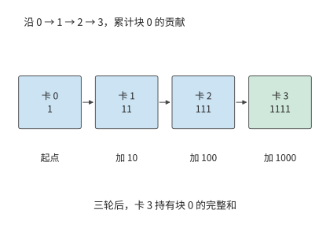

*图 6-23：仅跟踪块 0 的一个元素：每经过一张卡，就加入该卡的贡献。三轮后得到 1111，保存在卡 3。其他三个块同时沿环推进。*

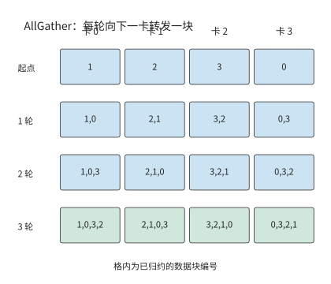

*图 6-24：ReduceScatter 结束时，卡 0、1、2、3 分别持有块 1、2、3、0。接下来每轮转发一块，三轮后每卡都拥有四块完整结果。*

只需三轮，是因为一个块已经含有起点的一份贡献，再经过其余三卡，就包含全部四份。一般地，ReduceScatter 需要 $n-1$ 轮。接下来每卡将自己完成的块向下一卡转发，每轮多获得一块；再经过 $n-1$ 轮，每卡收齐全部块。因此每卡总发送量为 $2(n-1)M/n$，共 $2(n-1)$ 轮。

令每轮固定开销为 $\alpha$，各有向边的有效带宽为 $B$，各卡等本轮发送完成后才进入下一轮，时间模型为

$$
T_{\mathrm{ring}}=2(n-1)\alpha+\frac{2(n-1)M}{nB}. \tag{6-9}
$$

第一项随卡数增长，第二项逐渐接近 $2M/B$。环形算法把大块数据分成小块，让各卡同时传输；数据量小时，逐轮启动的时间反而占主要部分。

**例题：计入归约通信后，增加 TP 卡数还能加速多少？** 仍用 Qwen3-32B 的 128K 会话。每次归约的输入是一个 token 的 BF16 隐藏向量，$M=10$ KiB；HGX H100 中每张卡经 NVSwitch 的带宽为每方向 $B=450$ GB/s；每轮固定开销 $\alpha$ 取 MSCCL++ 论文在同样的 H100 八卡服务器上测得的 NVLink 单向延迟 0.822 μs。求 TP2、TP4、TP8 的单次归约以及式（6-5）的时间。

解答：TP8 共十四轮，启动开销合计为 11.51 μs，每卡发送 17.5 KiB，传输约 0.04 μs，单次约 11.55 μs。其余规模同样代入式（6-9）。TP1 一行只作比较，单卡连一个 128K 会话都无法容纳：

| TP 卡数 | 本地内存访问 | 128 次归约 | 单步时间 |
|---|---:|---:|---:|
| 1 | 29.35 ms | 0 | 29.35 ms |
| 2 | 14.68 ms | 0.21 ms | 14.89 ms |
| 4 | 7.34 ms | 0.64 ms | 7.97 ms |
| 8 | 3.67 ms | 1.48 ms | 5.15 ms |

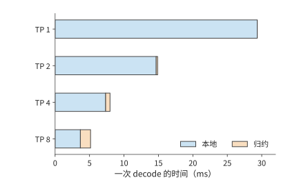

*图 6-25：根据式（6-5）和环形归约模型绘制的单步时间。本地内存访问随卡数增加而减少，归约时间则增加；条形总长度为单步执行时间。本地项包括权重与 KV 读取，归约项是卡间集合通信。*

图中，蓝色部分随卡数增加而缩短，橙色部分却逐渐变长。两卡到四卡，本地内存访问时间减少约 7.34 ms，通信增加约 0.42 ms，净省约 6.92 ms。四卡到八卡，本地内存访问时间只再减少约 3.67 ms，通信增加约 0.84 ms，净省降至约 2.83 ms。式（6-6）的左右两项逐渐接近，但八卡仍然更快。

这时提高带宽几乎没有收益。八卡一次归约中，11.51 μs 来自启动；即使传输时间降为零，仍要等待这十四轮。把带宽翻倍，整步只节省约 2.5 μs；把每轮固定开销减半，128 次归约却能节省约 0.74 ms。[^ring]

树形算法从轮数入手。四张卡先两两归约，再由根节点合并结果，归约需要两轮；广播再用两轮，合计四轮。当 $n$ 为二的整数次幂时，未分段二项树共有 $2\log_2n$ 轮，关键路径上每轮都传输完整张量：

$$
T_{\mathrm{tree}}=2\log_2n\left(\alpha+\frac{M}{B}\right). \tag{6-10}
$$

八卡、10 KiB 时约为 5.07 μs，比环形算法的 11.55 μs 短。数据量增大到 8192 个 token 的 80 MiB，环形算法约需 0.34 ms，树形约需 1.12 ms：减少轮次节省的时间，抵不过在关键路径上反复传递完整大张量增加的时间。令两式相等，交点约在 680 KiB；数据量越过该值，更快的算法就换成另一个。

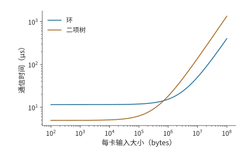

*图 6-26：八卡环形算法与未分段二项树的时间模型，每轮 0.822 μs、每方向 450 GB/s。交点约为 680 KiB；10 KiB 的 decode 输入位于主要受启动开销影响的一侧，80 MiB 的 prefill 输入位于主要受数据传输时间影响的一侧。*

> **实验 6-4 · 延伸：数据量多大时，环形归约比树形归约更快？**
>
> （a）按图 6-23 的发送规则，跟踪块 1 的三轮归约，写出每轮由哪张卡持有该块，以及其中已经累加了哪些卡的贡献。
>
> （b）求四卡和八卡环形归约的每卡发送量，再推导相同数据量下树形归约的耗时。
>
> （c）求八卡部署下两种归约算法耗时相等时的数据量；将 $\alpha$ 减半后重算，解释两种算法耗时相等时的数据量为何变化。
>
> （d）将树形算法归约 10 KiB 数据所需的时间代入本章 Qwen3-32B 算例，求八卡单步时间，比较算法选择与带宽翻倍的收益。

### 6.4.3 通信库与计算的资源竞争

环形和树形算法都要由软件在各卡上实际执行。**通信库**是实现集合通信操作的软件，例如 NVIDIA 集合通信库（NVIDIA Collective Communications Library，NCCL）。昇腾上的对应实现是华为集合通信库（Huawei Collective Communication Library，HCCL）。应用先建立通信组（communicator），给组内每张卡分配一个 rank，再提交操作，说明缓冲区、元素数量、数据类型、归约运算和所在的 CUDA stream。组内各卡的调用必须按接口要求相互匹配，包括调用顺序和数据数量；调用返回通常只表示操作已提交到 stream 中，并不意味着可以复用仍在传输的缓冲区。使用结果的一方要靠同一 stream 的顺序或显式的 event 依赖来等待。集合通信也不能当作任意主机代码都能用的全局同步点。

在 MoE 中，每对卡之间 dispatch 的 token 数随 batch 变化。等长的 All-to-All 表达不了这种不等长的交换，运行时还要自己组织计数、偏移、打包和接收空间。NCCL 可以用成组的点对点 Send／Recv（发送／接收）表达任意两卡之间的交换；每个发送必须有对应的接收，需要一起推进的通信要放进同一个组，否则会串行等待对方尚未发起的操作。专门的专家并行通信库进一步结合路由信息实现 dispatch 和 combine。无论选哪种实现，都应记录库的版本与具体接口，不能把固定大小的 All-to-All 测试当作实际的 MoE 通信。[^nccl-basics]

测量 NCCL 时，还要分清它报告的两种带宽：**algbw** 是测试定义的数据量除以时间，**busbw** 则按集合操作的实际传输量换算。对 $n$ 卡 AllReduce，若每卡输入为 $M$，则 $\mathrm{algbw}=M/T$，$\mathrm{busbw}=2(n-1)M/(nT)$。例如实验 7-3 保存的公开记录中，两台 HGX H100 共 16 个 rank，每卡 64 MiB 的 AllReduce 用时 466.1 μs，algbw 为 143.99 GB/s，busbw 为其 1.875 倍，即 269.98 GB/s。busbw 是归一化指标，不能直接当作每张网卡的实际吞吐；分层通信、交换机内归约、链路复用仍要按第 7 章的物理路径逐项计数。数据量小时看延迟，数据量大时看持续带宽，放到模型执行里还要看从数据就绪到用完的整段时间。[^nccl-basics]

第 6.4.2 节比较环和树时，把一次通信当作独立操作。实际执行中，通信常与另一个 micro-batch 的计算重叠，两者会争用加速器资源。归约需要读取部分和、执行加法、写回结果并推进通信。这些工作会占用 SM、HBM 和加速器互联；同一时刻运行的矩阵乘也需要这些资源。通信与计算重叠后，原来独占资源时的速度便会改变。

配套的实验 6-5 测量了这种影响。实验用 Gloo（支持 CPU 等执行环境的集合通信库）在四个 CPU 进程之间做 AllReduce，同时让每个进程做一次矩阵乘，分别记录两者单独运行和同时运行的时间，取五组的中位数：

| 归约数据量 | 通信单独运行 | 计算单独运行 | 同时运行时的通信 | 同时运行时的计算 | 同时运行的整组完成 |
|---|---:|---:|---:|---:|---:|
| 4 MiB | 2.67 ms | 11.53 ms | 6.14 ms | 11.52 ms | 11.58 ms |
| 64 MiB | 36.92 ms | 11.03 ms | 45.21 ms | 12.89 ms | 45.24 ms |

4 MiB 时，通信与矩阵乘同时运行后慢了一倍多，却仍在矩阵乘结束前完成，整组用时 11.58 ms，与只做矩阵乘几乎相同，通信被计算掩盖了。64 MiB 时，通信从 36.92 ms 增至 45.21 ms，矩阵乘也从 11.03 ms 增至 12.89 ms；两者分开执行共需约 48.0 ms，同时运行只节省约 2.7 ms，而不是矩阵乘的全部 11 ms。评价重叠执行，要比较两者同时运行时的时间，不能把各自单独测得的时间直接相减。[^comm-experiment]

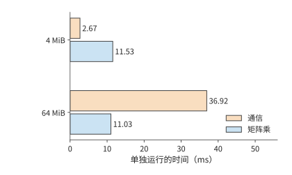

*图 6-27：实验 6-5 中通信与矩阵乘单独运行的时间，四个 CPU 进程，五组中位数。4 MiB 通信约 2.67 ms，64 MiB 通信约 36.92 ms，矩阵乘约 11 ms。*

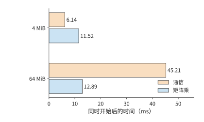

*图 6-28：同一实验中两者同时开始。橙色为通信，蓝色为计算；后续工作等待两者都完成。4 MiB 的通信增至 6.14 ms，仍藏在计算之内；64 MiB 的通信增至 45.21 ms，计算也增至 12.89 ms。*

GPU 上的道理相同。增加通信线程数和通道数能够加快单独运行的传输，同时也会占用计算所需的执行资源，所以只看单独运行的通信带宽来选择配置，可能让整体变慢。集合通信自动调优系统 AutoCCL 因此在训练过程中记录实际的通信时间，让反馈包含并发干扰；它先选算法、协议与传输实现，再搜索线程、通道和分块。论文报告，在重计算干扰下，AllGather 的带宽从 18.26 GB/s 提高到 32.44 GB/s。搜索和切换本身也要时间：若搜索额外耗时 $S$，此后每次调用节省 $\Delta$，至少要调用 $S/\Delta$ 次才能收回。[^tuning]

### 6.4.4 通信融合、加速器发起与专用卸载

单独加快通信不一定能加快整体执行，因此要区分两种改进：减少通信启动与数据读写次数，以及减少通信对计算资源的占用。在 Qwen3-32B 的八卡算例中，128 次归约的启动开销约为 1.47 ms。围绕这项开销，可以改变三个不同环节：一次启动做多少工作、由谁发起，以及由谁执行搬移和归约。

**融合**让相邻操作在一个 kernel 中衔接。例如归约后还要加残差并做 RMSNorm，分开执行会把结果写回再读入，并经过多次启动；融合后可以在数据仍靠近计算单元时继续处理。归一化必须等归约得到完整输入之后再做：忽略用于避免除零的小常数 epsilon 和可学习缩放参数，$\operatorname{RMSNorm}([1,0]+[0,1])=[1,1]$，分别归一化再相加却得到 $[\sqrt2,\sqrt2]$。融合必须保持这一执行顺序，才能得到相同的计算结果。

**加速器发起**省去主机提交与加速器执行之间的往返：一个 kernel 算出数据后，可以直接发起后续通信，缩短从计算完成到通信开始的等待。**专用卸载**把搬移、归约或同步交给复制引擎、通信处理单元或交换机内的逻辑，把通用计算单元腾出来做矩阵计算。

昇腾的集合通信单元（CCU）将搬移、归约、同步和完成处理集中到通信单元；NCCL 的部分路径用节点内复制引擎（Copy Engine）与节点间 CPU 代理线程（替 GPU 向网卡提交请求的主机线程）承担数据搬移。这些机制改变的是由谁来做这些工作。若计算慢在与通信争用 SM，把 SM 让出来就能缩短计算；若瓶颈在共用的网络出口，出口要传的字节数并没有减少。[^ub][^tuning]

通信请求由谁发起，决定控制路径要穿越几次 PCIe，也决定占用谁的核。图 6-29 比较三种位置。**CPU 代理线程**：GPU 算完数据后在主机内存里写一个就绪标志，CPU 线程轮询到它，构造请求描述符（描述一次传输的记录）、敲响网卡的门铃（写网卡的一个寄存器，通知它有新请求），网卡再从主机内存读取请求描述符；完成记录也写回主机，由 CPU 转告 GPU。控制路径要穿越 PCIe 三次，每次都是几百纳秒；一个 CPU 线程每秒能处理的请求也有限，大批小请求会在这里排队。**GPU 的 SM**：GPU 直接在自己的内存里构造请求描述符并敲门铃，网卡从 GPU 内存读取请求描述符，完成记录写回 GPU 内存供 SM 轮询。CPU 退出了关键路径，控制路径仍要穿越 PCIe 两次；代价是要分出一部分 SM 来构造请求和轮询完成，这些 SM 不能同时做矩阵计算。NVIDIA 的 GPUDirect Async 和专家并行通信库 DeepEP 的低延迟 kernel 采用的是这条路径。**网卡上的处理器**：BlueField 这类网卡内置多核多线程的数据通路处理器，构造请求描述符、敲门铃、取请求描述符都可以留在网卡内部，主机只需为一批操作发一次触发；控制路径不再穿越 PCIe，也不占用 SM 和 CPU 核。三种位置下，发起端的载荷从 GPU 内存搬出、完成记录写回 GPU 内存，各穿越 PCIe 一次，这两项不随发起位置改变；对端网卡读写它所在主机的内存，还要在对端再穿越一次 PCIe。取舍因此是：由谁提供核、控制路径多长、每秒能发起多少请求。第 7.3.3 节将累加每次穿越的时间，第 7.3.4 节再把发起速率纳入吞吐模型。[^initiator]

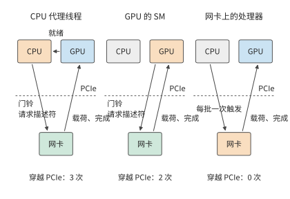

*图 6-29：三种发起位置。橙色是构造请求描述符的部件；虚线是 PCIe 边界。CPU 代理线程的控制路径穿越 PCIe 三次，GPU 发起两次，网卡上的处理器零次；发起端的载荷与完成记录在三种方式下都各穿越一次。*

回到本节开头的 128 次小数据量归约。框架会按数据量和连接方式选择通信实现。Qwen3-32B 一次处理 1、4、16 个 token 时，归约输入分别为 10、40、160 KiB，vLLM 等框架可以为这些小数据量选用专门的实现。由此，式（6-5）中的 $T_{\mathrm{AR}}$ 有了两个改进方向：减少算法轮次，或缩短每轮的软件与执行开销。[^collective-path]

> **实验 6-5 · 延伸：通信优化能节省多少时间，何时抵消准备开销？**
>
> （a）用图 6-27 与图 6-28 的实测值，分别求 4 MiB 与 64 MiB 时同时运行比分开运行省下多少时间，指出每种情况下是计算还是通信决定了整体完成时间。
>
> （b）设一次调优需要额外花费 $S$ 的搜索与切换时间，此后每次调用节省 $\Delta$。写出累计节省首次超过 $S$ 所需的最少调用次数；以 64 MiB 实测的重叠收益作为 $\Delta$，求 $S=1$ s 时的次数。
>
> （c）用两个各含两个元素的向量，比较先归约后执行 RMSNorm 与先分别执行 RMSNorm 后归约的结果，判断两者能否交换顺序。
>
> （d）加速器选做：比较同一形状的独占与并发执行，记录就绪、开始和完成事件，说明共享后哪一段改变最多。

## 6.5 超节点的物理组织

### 6.5.1 直连、交换与分层拓扑

第 6.4 节的算法和通信库决定了每一轮谁发给谁、发多少，但没有涉及数据经过哪些物理连接。集合算法规定逻辑上的发送方和接收方，物理拓扑决定数据实际经过哪些设备与链路。两张卡可以直连，也可以经交换机、其他卡或主机内存中转。多次传输共用一个接口时，要排队使用同一份带宽。

**例题：再加一台服务器，TP16 能否比 TP8 更快？** 两台 HGX H100 共 16 张卡，服务器之间由每张卡自己的 ConnectX-7 网卡相连。把 Qwen3-32B 的一个 128K 会话改用 TP16，一个张量并行组横跨两台服务器，每层的 AllReduce 都要经过网络。

解答：本地内存访问方面，权重再减半，但 Qwen3-32B 只有 8 个 KV 头，TP16 时每个 KV 头在两张卡上各存一份，每卡读取的 KV 与 TP8 相同，本地时间只从 3.67 ms 降到 2.48 ms。通信方面，若 16 张卡排成一个环，每轮都要等经过网卡的那一跳；取 MSCCL++ 论文在同一平台上测得的 InfiniBand（服务器之间所用的低时延交换网络）单向延迟 3.76 μs，一次归约要 30 轮，约 113 μs。实际的通信库不会这样做。实验 7-3 保存的 nccl-tests（NCCL 的集合通信性能测试程序）公开记录恰好是两台 HGX H100、16 个 rank 的 AllReduce，10 KiB 的消息取记录中 16 KiB 一档，实测 32.74 μs：

$$
T(16)\approx2.48\ \mathrm{ms}+128\times32.74\ \mu\mathrm{s}\approx6.67\ \mathrm{ms}.
$$

单台服务器内的 TP8 为 5.15 ms，TP16 反而慢约 1.52 ms。增加的卡减少了每卡的权重读取，却换来了更贵的跨服务器同步；即使用上实际通信库的分层算法，每次归约仍要约 33 μs，接近机内环形归约 11.55 μs 的三倍。

要让更多的卡高效协作，就要有足够的端口和交换容量。一张卡若与其他 $N-1$ 张卡都直连，就需要 $N-1$ 条连接。交换机把连接集中起来：卡先接到交换层，再由交换层转发到目的地。一颗交换芯片提供的端口数称为**基数**（radix）。

以 HGX H100 使用的第三代 NVSwitch 为例，一颗芯片有 64 个 NVLink 4 端口，每个端口每方向 25 GB/s。把这颗芯片用作一台**叶交换机**（leaf）：32 个端口向下接 GPU，另外 32 个端口向上接**脊交换机**（spine），GPU 一侧的总带宽和上联总带宽都是 800 GB/s。若改成 48 个下联、16 个上联，接入的 GPU 链路多了，但它们一起向上最多只能送出 400 GB/s，只有下联总带宽的三分之一。端口总数不变时，多接 GPU 就少了上联端口和上联带宽。DGX H100（NVIDIA 以 HGX H100 为基础的整机）的 NVLink Switch System 把多台服务器接入同一个 NVLink 交换网络，正是这样的取舍：每个节点只把全部 NVLink 带宽的一半引出节点，即 2:1 收敛。[^nvswitch]

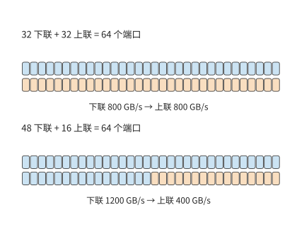

*图 6-30：同一颗 64 端口 NVSwitch 的两种分配，每个端口每方向 25 GB/s。上联链路是所有跨交换机流量的共同出口；32／32 分配提供 800 GB/s 上联带宽，48／16 分配只提供 400 GB/s。颜色条的格数与端口数一致。*

把交换层扩展到一颗芯片之外：四颗叶交换芯片各有 32 个下联端口，共 128 个下联端口。再配 32 颗脊交换芯片，每颗各用一条链路连到这四颗叶交换芯片，正好用满每颗叶交换芯片的 32 条上联。把系统分成两部分，所有连接这两部分的链路合起来称为一个**割集**。若某一阶段有 $V_{A\to B}$ bytes 必须从 A 侧穿过割集到 B 侧，而割集在该方向的总带宽为 $B_{A\to B}$，传输至少需要 $V_{A\to B}/B_{A\to B}$。交换机的端口分配决定了割集的总带宽。

端口数决定一共有多少链路，路由决定数据集中到哪些链路。即使每张卡发送的数据量相同，走不同的路径也会形成不同的瓶颈。把 16 张卡连成一个双向物理环，观察 8 MiB 输入的 ReduceScatter 前三轮。递归算法每轮把对端的距离翻倍；Swing 是为环面拓扑设计的集合通信算法，通过改变各轮的对端来分散链路负载。两种算法每张卡每轮同样发送 4、2、1 MiB，但对端不同：

| 前三轮 | 递归路径 | Swing 路径 |
|---|---|---|
| 每次传输经过的物理跳数 | 1、2、4 | 1、1、3 |
| 最大单向链路传输量 | 4、4、4 MiB | 4、2、2 MiB |
| 全网物理链路累计传输量 | 64、64、64 MiB | 64、32、48 MiB |

第三轮，递归算法的数据要走四跳，最忙的链路同时承载四份 1 MiB 数据；Swing 的数据走三跳，最忙的链路只承载两份。按 TPU v4 每条 ICI（芯片间互联）链路每方向 50 GB/s 计，前三轮由瓶颈链路决定的传输时间分别约为 252 与 168 μs。传输时间少了三分之一，是因为共享链路上的数据少了。[^swing]

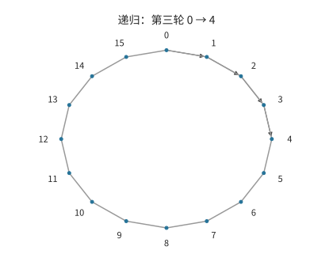

*图 6-31：递归算法第三轮，卡 0 发往卡 4。细线为 16 张卡组成的物理环，箭头标出经过的四条链路。*

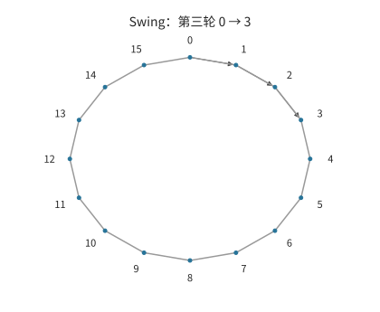

*图 6-32：同一物理环上，Swing 第三轮卡 0 发往卡 3，经过三条链路。每张卡这一轮的发送量仍为 1 MiB。*

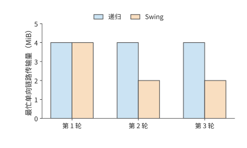

*图 6-33：把所有发送方的数据累加到各条有向链路上，取每轮的最大值。递归前三轮均为 4 MiB，Swing 为 4、2、2 MiB。*

经主机内存中转是同一个问题的另一种形式。非统一内存访问（NUMA）结构把主机内存分在不同 CPU 附近，跨 CPU 读取要经过处理器之间的接口。设卡 0、1 接在 NUMA 节点 A，卡 2、3 接在节点 B，四张卡做环形归约共发送 48 MiB。把全部中转缓冲放在 A，CPU 之间每个方向要承担 24 MiB；把缓冲放到发送卡附近，并让同一 NUMA 节点的卡在环中相邻，每个方向降到 12 MiB；若把环改成交替跨越 NUMA 节点，每个方向又回到 24 MiB。DGX H100 的主机就是两路结构：两颗 Xeon 8480C 各带一个 NUMA 节点，两颗 CPU 之间最多有 4 条 UPI（Intel 处理器之间的互联）链路，每条 16 GT/s；每张 GPU 经 PCIe Gen5 x16 连到主机，每方向 64 GB/s。三种方案中每张卡经 PCIe 进出主机的数据量相同，经过 UPI 的数据量却按 2:1:2 变化，跨 CPU 的传输时间也随之变化。缓冲的位置和卡在环中的次序共同决定数据的搬移路径。[^numa]

**设计案例：直连环面还是交换网络？** 上述例子中，数据要么直接走一条链路，要么经过一台交换机。把 64 张卡连成一个超节点时，有两条常见的路线。一条是让每张卡直接和邻居相连：把 64 张卡排成 $4\times4\times4$ 的立方体，每张卡沿三个维度各接两个邻居，每一维首尾相连，这就是**三维环面**（torus）。环面是超级计算机长期使用的一类拓扑，TPU 沿用了它。另一条是让每张卡只接交换芯片，由交换层转发到目的地，NVL72 和 CloudMatrix384 采用这一路线。两条路线给每张卡同样的六个端口，每端口每方向 50 GB/s，这正是 TPU v4 每颗芯片的 ICI 配置；差别在端口的另一端接的是邻居还是交换芯片。图 6-34 画出在这两种连接方式下，一次传输经过的路径。

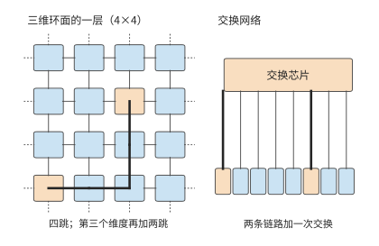

*图 6-34：左侧是三维环面的一层，每张卡与四个邻居直连，虚线表示每一维首尾相连；从角上的卡到中心的卡要经过四跳，加上第三个维度最多六跳。右侧是交换网络，任意两张卡之间都是两条链路加一次交换。橙色是相距最远的一对卡，粗线是它们之间传输经过的路径。*

先比较**跳数**。环面里最远的两张卡在每个维度上相距两跳，三个维度共六跳；交换网络里任意两卡都是两条链路加一次转发。设数据每经过一颗芯片的路由器或一颗交换芯片要增加 200 ns，这是开放加速器互联标准 UALink 2.0 规范为 128 lane（串行通道）交换芯片设定的空载延迟目标；链路上的传播时间忽略不计。环面上最远的两张卡之间要经过 5 颗中间芯片，交换网络只经过 1 颗交换芯片，环面每次传输多耗时 0.8 μs。单次差距不大，但 decode 每层要做两次归约，Qwen3-32B 的 64 层就是 128 次；若每次都要等最远的卡，环面共多等约 0.10 ms，约为八卡 TP 全部归约时间 1.48 ms 的 7%。卡数增加到 $8^3=512$ 时，环面最远变成十二跳；交换网络只需再加一级交换，变成四条链路加三次转发。

再比较**流量模式**。第一种是沿维度的归约：把 AllReduce 拆成沿 x、y、z 三个方向的环形 ReduceScatter 与 AllGather，每一步只在相邻卡之间传输，六条链路同时工作。这时环面把每张卡的全部端口带宽都用上了，和交换网络一样快。TPU 的编译器正是把数据并行和模型并行的分组对应到环面的维度上。第二种是均匀的 All-to-All：每张卡向其他 63 张卡各发一份，MoE 的 dispatch 就是这种模式。环面上每份数据平均要走三跳（每个维度平均一跳）；64 张卡各发 $M$ 字节，全部链路一共要承载 $3\times64M$，分摊到 384 条有向链路，每条 $M/2$。交换网络里每张卡的六个端口各分 $M/6$。取 $M=32$ MiB，环面至少需要约 336 μs，交换网络约 112 μs，相差三倍；512 卡的环面平均六跳，差距变成六倍。图 6-35 把两种模式放在一起。

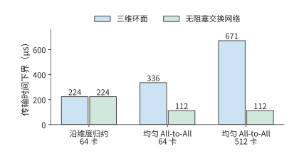

*图 6-35：每张卡六个 50 GB/s 端口、每卡发送 32 MiB。沿维度归约时两种拓扑都用满端口带宽；均匀 All-to-All 时环面上的数据平均要走三跳，共享链路承载的数据随之增加，512 卡时增至六跳。图中是链路负载给出的下界，不含启动开销与排队；交换网络按无阻塞计，即交换层不限制各端口同时满速收发。*

最后比较**硬件代价**。64 卡环面需要 $64\times6/2=192$ 条链路，不需要任何交换芯片，路由器做在每颗芯片内；交换网络需要 384 条链路和六颗 64 端口的交换芯片。卡数超过一颗交换芯片的端口数之后，交换网络还要再加一级：CloudMatrix384 为 384 个 NPU 在 48 个节点内各放 7 颗一级交换芯片，再用 7 个子平面各 16 颗二级交换芯片相连，共 448 颗交换芯片，其中的二级交换芯片装在 4 个通信机柜里。环面则在任何规模下每卡都只需六条链路，代价是跳数随规模增加，每卡分到的割集带宽随规模下降，第 6.5.4 节将计算这一点。

三个比较合起来，就是选择拓扑的判断依据：负载以规则的集合通信为主，还是有大量目的地任意的小数据传输和 All-to-All；协作域需要多少张卡；是否愿意用交换芯片和更多线缆换取任意两卡等距。第 6.5.3 至 6.5.5 节将看到 NVIDIA、Google 和华为在这三个问题上各自作了什么选择。[^topology-choice]

> **实验 6-6 · 延伸：通信拓扑与缓冲位置如何影响传输耗时**
>
> （a）复算两台 HGX H100 上 TP16 的单步时间，再求跨服务器的一次 AllReduce 降到多少时，TP16 与单台服务器内 TP8 的单步时间恰好相同。
>
> （b）对 64 端口的 NVSwitch，比较下联／上联端口分别为 32／32 与 48／16 的两种分配，计算所有 GPU 链路同时向上发送时每条链路的平均可用带宽。
>
> （c）根据图 6-31，累加第三轮经过同一条有向链路的数据量，说明跳数与链路传输量的区别。
>
> （d）在 NUMA 例中先移动缓冲，再改变环的次序，分别画出新增与消失的跨 CPU 访问。
>
> （e）把设计案例中的 64 卡改为 $8\times8\times8$ 环面，求最远跳数、均匀 All-to-All 时每条有向链路的负载，以及两级无阻塞交换网络需要多少颗 64 端口交换芯片；说明哪一项随卡数增长得最快。

### 6.5.2 互联介质、供电与物理规模

第 6.5.1 节把链路看成给定带宽和延迟的连接；在实际系统中建成这些连接，还要解决传输距离、布线和供电问题。把低延迟协作延伸到更远处，连接介质也要随之变化。短距离铜线可以直接传送高速电信号；距离增大后，信号衰减和串扰加重，接收端更难恢复数据与时钟，因此需要更强的均衡或重定时电路。更粗的线缆和更多连接又占用机箱与布线空间。选择连接介质时，需要同时考虑传输距离、信号损耗和布线密度。

光连接把数据调制到光载波上，适合跨越更长距离；同时也增加了光电转换、器件供电和维护的成本。可插拔光模块将转换放在可更换模块中，**共封装光学**（CPO）则把光学引擎移到交换或计算芯片附近，缩短高速电通路。后者提高封装内的连接密度，但光学器件与计算或交换芯片共同封装后，散热、测试和部件更换也需要一并设计。连接介质决定在给定距离和带宽下的实现成本，拓扑决定这些连接如何组成通信路径。[^physical]

供电能力进一步限制可以安装的卡数。卡按整台服务器安装，设系统预算为 $P_b$，交换机、存储等固定配套功率为 $P_0$，每台服务器装 $g$ 张卡、功率为 $P_s$，则

$$
N\le g\left\lfloor\frac{P_b-P_0}{P_s}\right\rfloor. \tag{6-11}
$$

DGX H100 的八张 H100 连同 CPU、NVSwitch、网卡和风扇，系统功率上限为 10.2 kW，平均每张卡 1.275 kW；单张 H100 SXM 本身的功耗上限是 700 W，其余来自服务器内的配套部件。[^dgx-power] 设一组机柜的供电预算为 120 kW，本例只计服务器，$P_0$ 取 0，最多可以安装 11 台服务器、88 张卡。64 卡（8 台）用 81.6 kW，72 卡（9 台）用 91.8 kW，96 卡（12 台）要 122.4 kW，超过功率预算；64 卡和 72 卡方案还需根据交换端口数量与安装空间确定具体配置。

散热给出另一条上限。风冷机柜靠风扇把热量带进机房空气：ASHRAE 的液冷白皮书指出，一个 40 至 50 kW 的机柜需要多达 5,000 cfm（立方英尺每分钟）的风量，而最好的地板送风口只能提供 1,900 cfm；在 50 kW 机柜里，风扇本身至少消耗 5 kW。本例取 40 kW 作为风冷机柜的阈值，一个机柜最多放 3 台 DGX H100，即 24 张卡、30.6 kW；放 4 台就要 40.8 kW；DGX SuperPOD H100 参考架构给出的示例机柜布置中，每个机柜的功率都超过 40 kW。64 卡的 81.6 kW 与 72 卡的 91.8 kW 若要集中在少数机柜里，都远超这一阈值，要改用液冷，把热量直接交给冷却液而不是机房空气。[^ashrae]

如果一个交换单元只能连接 64 个端点，接入第 65 张卡就可能要增加一整套交换设备。卡数逐步增加时，配套交换设备的成本不是平滑上升，而是在跨过这样的整组边界时突然跳升。用式（6-11）求出大致范围之后，再按交换机、托盘、机柜这些安装单位组合，才能得到可以建造的系统。

> **实验 6-7 · 延伸：功率预算与整组扩容要求如何限制加速器数量**
>
> （a）分别复算安装 64、72、96 张卡时的总功率，按式（6-11），求功率预算增加到 150 kW 时最多可以安装多少张卡。
>
> （b）若超过 64 卡后要为第二级交换设备预留相当于一台服务器的 10.2 kW，求 120 kW 功率预算下最多可以安装多少张卡。
>
> （c）沿用（b）的功率预算和额外交换设备条件，假设只能按四台服务器（32 张卡）整组增加，求最多可以安装多少张卡，并解释（a）至（c）的上限为何不同。
>
> （d）用前面得到的单实例服务时间比较其中两种加速器配置的服务能力。

### 6.5.3 NVIDIA：从八卡服务器到机柜

端口、距离和功率共同限制了系统规模。在这些条件下，NVIDIA 的几代系统把互联从机箱内直连发展到了机柜级交换网络。DGX-1 用八张 GPU 组成 NVLink 混合立方体网格，部分 GPU 直接相连，其他 GPU 之间的通信需要中转。把频繁通信的计算任务放到相邻的 GPU 上，就能减轻中转和共享链路的压力。

DGX-2 使用 16 张 V100 和 NVSwitch。交换结构把“某对 GPU 是否直接相连”转化为“交换层能同时转发多少数据”，扩大了可用协作范围。DGX A100 又以八卡服务器为基本单元，配备 NVLink／NVSwitch。这些系统采用不同的 GPU 数量与互联结构，以适应芯片接口、机箱空间和应用需求。[^nvidia]

GB200 NVL72 将 72 张 GPU 和 36 个 Grace CPU 放进机柜级 NVLink 系统。机柜内更多的 GPU 由此能通过 NVLink 频繁交换数据。回到第 6.5.1 节的例题：Qwen3-32B 的 TP16 横跨两台 HGX H100 时，128 次归约经网络约需 4.19 ms，单步约 6.67 ms。若这 16 张卡处在同一个 NVLink 交换域内（DGX H100 的 NVLink Switch System 最多连接 256 张 H100），按每轮 0.822 μs 算，16 卡环形归约共 30 轮，128 次约 3.16 ms，单步约 5.64 ms，仍慢于单台服务器内 TP8 的 5.15 ms。该模型只有 8 个 KV 头，TP16 时每卡读取的 KV 不再减少，环的轮数却多了一倍。对这类模型，更大的互联域的价值不在于把一个会话切得更碎，而在于容纳更多实例，或者容纳超出单台服务器容量的模型。[^nvl]

机柜级互联让更多 GPU 能参与同一个实例。单卡可以容纳的小模型，可以按延迟和吞吐要求选择实例数；权重超过八卡总容量的大模型，则可以用更多 GPU 保存权重，各层的通信走机柜内互联。

### 6.5.4 TPU：拓扑与负载协同

NVIDIA 的路线是用交换层扩大 GPU 的连接范围。Google 的张量处理器 TPU 则沿用第 6.5.1 节设计案例中的环面，让模型切分、编译器的布局和物理通信互相对应。二维环面沿两个维度连接芯片，每一维首尾相连；三维环面再加一个维度，数据可以沿更多方向传输。

TPU v4 以 $4\times4\times4$ 的 64 芯片电互联单元为基础，再用光路交换机（OCS，通过改变光路连接设备端口）连接多个单元。这一划分同时考虑了网络拓扑和设备安装：64 颗芯片与 16 台 CPU 主机能够放入一个机柜，更大的 $8^3$ 单元包含 512 颗芯片，需要跨柜连接。[^tpu]

用割集带宽可以分析这种规则拓扑扩展后的通信能力。将一个 $k\times k\times k$ 的三维环面沿某一维等分，穿过两个切面的物理链路（即该割集，称为二分链路）共 $2k^2$ 条。$k$ 从 4 增到 8，芯片数由 64 增到 512，增加到原来的八倍，割集链路却只由 32 增到 128，增加到原来的四倍。若每颗芯片都要向另一半发送同样多的数据，平均每颗芯片分到的割集带宽就减半。芯片数与割集带宽增长速度的差别，决定了哪些并行布局适合这种形状。

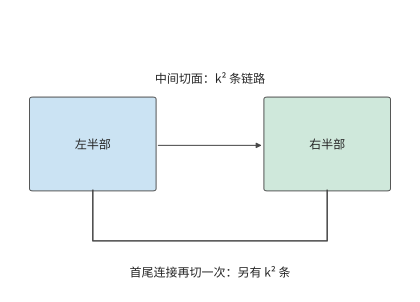

*图 6-36：沿一个维度把三维环面网络分成两半，需要切断中间连接和首尾连接。每处包含 k² 条链路，合计 2k² 条。*

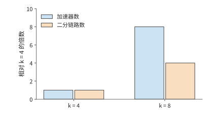

*图 6-37：k 从 4 增到 8 时，芯片数从 64 增到 512，二分链路从 32 增到 128。两种增长均以 k = 4 时为基准。k 表示三维环面每个维度的节点数，总节点数为 k³。*

固定拓扑决定了跨分区的带宽，空闲芯片的位置还决定作业能否获得所需的形状。OCS 在更大尺度上重新连接这些电互联单元，为不同作业分配形状合适的芯片子集，这样的子集称为切片。以一个 4×4 的芯片网格为例：若有连续两行空闲，可以放下两个各需要相邻 2×2 芯片的作业；同样八颗空闲芯片若呈棋盘状分布，就找不出一组相邻的 2×2。重新连接可以改变可分配的形状。

重新连接节省的执行时间要超过重连本身的耗时才值得。Morphlux 研究按任务重构光互联拓扑，让连接适合任务的通信需求。设八颗 TPU v4 芯片做 8 MiB 输入的环形 AllReduce，每颗芯片发送 14 MiB。若该切片原来每颗芯片只有一条 50 GB/s 的 ICI 链路可用于该通信组，重连后有三条，传输项就从约 293.6 μs 降到约 97.9 μs，每次节省约 195.7 μs。TPU v4 的 OCS 切换光路需要毫秒级时间：若重连需要 1 ms，重复 6 次就能收回；若需要 100 ms，则要 511 次。作业持续得越久，建立更合适的连接越值得。[^swing]

### 6.5.5 Unified Bus 与 CloudMatrix

NVIDIA 与 TPU 两种系统主要从加速器互联出发。华为的 UB 进一步把问题扩展到资源访问：连接两台主机之后，一台主机上的设备能否直接使用另一台主机的内存。笔者对 Unified Bus 的早期思考来自主机内总线与主机间网络的分界。同样是读取一块数据，跨过主机边界后，软件往往要改用消息传递接口，重新安排缓冲区，每多一层抽象就多一段时间。UB 希望去掉这些抽象层，扩大资源直接访问的范围，使计算、内存和存储能够按任务重新组合。

本书在两处讨论 UB。本节把 UB 看作一种超节点互联，回答三个与规模有关的问题：控制器接在哪里，片上缓存能容纳多大的互联，建立全部连接需要多长时间。第 7 章则沿着一次远程访问的路径展开：第 7.1.3 节说明统一接口的设计动机，第 7.3.3 节逐阶段推导一次读取的延迟，第 7.3.4 节计算请求速率，第 7.4.2 节推导连接状态的增长和片上缓存的溢出点，第 7.4.3 节讨论按需指定的顺序。两处使用同一组参数和同一个计算脚本，推导结果都与笔者的 UB 实现 OpenURMA 在仿真中测得的数值对照。[^ub-fabric]

这种统一首先要回答两个不同的问题：一次操作要访问谁、读写什么、何时可以使用结果；这次操作的数据如何经过网络并可靠送达。UB 将前一类职责放在**事务层**，后一类职责放在**传输层**。这里的“事务”是一次通信操作，不是数据库中具有提交与回滚语义的事务。

事务层的 Jetty 为应用提供提交、接收和完成通知的端点抽象，保留应用身份与操作所需的上下文；传输层的传输通道（UB 中称为 TP Channel，其中 TP 是 Transport Protocol 的缩写，与张量并行无关）维护报文序号、确认、重传和拥塞控制状态。多个应用端点访问同一远端时，可以共用底层的传输通道，不必让每条应用关系都各带一份完整的可靠传输状态。图 6-38 展示了这一分离。传统远程直接内存访问（RDMA，让网卡直接读写已授权的远端内存）的可靠连接 QP（queue pair，队列对，由发送队列和接收队列组成的通信端点）把应用端点关系与传输状态绑定得较紧；UB 则允许分别安排两类状态的数量、寿命与共享范围。[^ub-design]

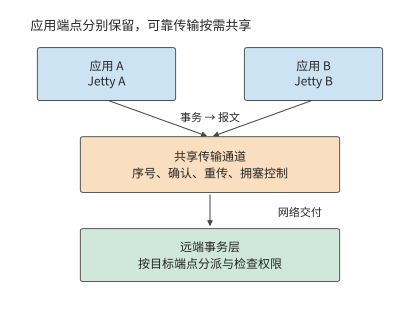

*图 6-38：两个本地应用保留各自的 Jetty，经共享传输通道访问远端端点。事务层区分操作及其完成归属，传输层处理报文的可靠交付；共享通道不取消权限检查，也不自动建立跨应用的全局顺序。*

另一项关键选择是**内存语义**。单边操作由发起方直接指定已经授权的远端内存地址，远端应用不必为每次操作准备一个匹配的接收请求。UB 支持两种发起方式：Load／Store 由处理器指令发起，Read／Write 由显式提交的请求发起。两种方式都能访问远程内存，但都不意味着跨设备的缓存自动保持一致。第 7.3.3 节比较这两种方式，第 7.4.1 节说明数据何时可见、操作何时算完成。

**控制器的位置。** 传统网卡是一个 PCIe 外设，第 6.4.4 节已经跟踪过这条发起路径。处理器发起一次远程读取时，门铃、读描述符、目标端读数据、写回数据、写完成记录一共五次穿越 PCIe，每次都要几百纳秒。UB 把控制器接在处理器的片上总线上：处理器执行一条 Load 指令，请求经片上总线直接到达控制器，返回的数据直接写入寄存器。图 6-39 对比了这两条发起路径。第 7.3.3 节把两条路径逐阶段相加：线路单程时延为 100 ns 时，经 PCIe 外设网卡的一次 64 B 读取约需 2.2 μs，其中五次 PCIe 穿越占约 1.65 μs；经片上总线控制器的读取约需 0.42 μs。节省的时间不是把原有阶段压缩得到的，而是因为处理器与控制器共用一个地址空间，那些阶段不复存在。去掉抽象层，让处理器像访问本地内存一样访问远端内存，正是 UB 收益的来源；剩下的 0.42 μs 主要由线路时延和远端访存决定，已经接近硬件允许的下限。

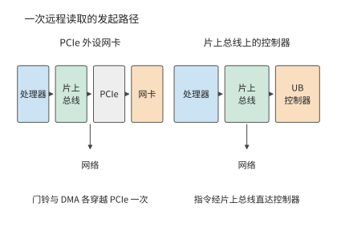

*图 6-39：左图的网卡接在 PCIe 之后，门铃、请求描述符、返回数据和完成记录在发起端的处理器与网卡之间各穿越 PCIe 一次，目标端网卡读取数据时再穿越一次；右图的控制器接在片上总线上，处理器的指令直接到达控制器。两条路径从控制器到网络的部分相同。*

**互联规模与片上状态容量。** 网卡把每个通信关系的上下文缓存在片上，这里取缓存容量为 256 KiB。设互联内有 $H$ 台主机，每台主机有 $A$ 个应用端点，任意两台主机的端点之间都可能通信。连接状态有两种组织方式。第一种是**逐对连接**，以 RoCE（在以太网上承载的 RDMA）的可靠连接为代表：本机的每个端点与其余 $H-1$ 台主机上的每个端点各建立一条连接，每条连接保存 512 B 的上下文。第二种是 UB 的**端点加通道**：本机每个端点保存一份 20 B 的 Jetty 记录和 32 B 的内存段记录，每台远端主机对应一条 56 B 的传输通道。两种方式下每个网卡保存的状态分别为

$$
S_{\mathrm{pair}}(H)=512A^{2}(H-1)+32A,\qquad
S_{\mathrm{UB}}(H)=52A+56(H-1).
$$

取 $A=8$。逐对连接每增加一台主机，状态增加 32 KiB，256 KiB 的缓存只能容纳 8 台主机；端点加通道每增加一台主机只增加 56 B，同样的缓存可以容纳四千多台主机。以 CloudMatrix384 的 192 台主机计，逐对连接需要约 6 MiB，是缓存容量的 24 倍；端点加通道只需约 11 KiB。缓存无法容纳的状态，每次操作都要从主机内存重新读取，代价在第 7.4.2 节计算：逐对连接的每次操作要增加两次 PCIe DMA 读取，约 1 μs。

第三种组织方式是缓存一致的互联，NVLink 属于这一类：加速器可以把对端内存中的数据放进自己的缓存。为了让各个副本保持一致，需要一个目录记录每个缓存行被哪些对端持有，每行至少要为每个对端留 1 bit。设目录跟踪 $W=2^{20}$ 个缓存行（64 MiB 数据），每行另有 8 B 标签，则目录占用 $W\,((H-1)/8+8)$ B：两台主机时约 8 MiB，1024 台时约 136 MiB。每次写入还要向所有持有副本的对端发送失效消息，消息数随 $H$ 线性增长。这两项开销把缓存一致互联的规模限制在几十个对端，NVL72 的 72 张 GPU 正处在这一范围。UB 不维护跨主机的缓存一致，数据何时对其他设备可见由应用自己安排（第 7.4.1 节），所以三条状态曲线中只有它能延伸到上千台主机。图 6-40 画出了这三条曲线。

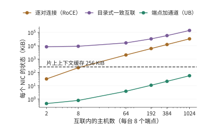

*图 6-40：每台主机 8 个端点时，三种组织方式下每个网卡的状态随互联内主机数的变化。虚线是 256 KiB 的片上缓存。逐对连接在 8 台主机时超出缓存，目录式缓存一致互联从两台主机起就远超缓存，端点加通道到上千台主机仍在缓存之内。*

**连接建立时间。** 状态的数量也决定了作业启动时要执行多少控制操作。逐对连接的每条连接要经过创建和三次状态迁移，共 4 次系统调用，还要与对端交换一次连接编号，需要一次带外往返（经数据通路以外的通道往返一次）。取一次系统调用 5 μs、一次带外往返 500 μs，建立一条连接约需 0.52 ms。$N$ 个本地端点访问 $M$ 个远端端点，需要建立 $NM$ 条连接。端点加通道只需为 $N$ 个端点各执行 1 次系统调用，为 $M$ 台远端主机各执行 1 次系统调用和 1 次往返。$N=M=1024$ 时，逐对连接要建立 1,048,576 条连接，串行约需 545 s，32 个核并行也要约 17 s；端点加通道只需创建 2048 个对象，并行后约 16 ms。图 6-41 画出了 $N$ 从 1 到 1024 的全过程。作业每次重启或扩缩容都要重复这一过程，所以它直接影响第 6.7.2 节讨论的故障恢复时间。

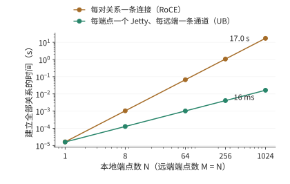

*图 6-41：在 N 个本地端点与 N 个远端端点之间建立全部连接所需的时间，32 个核并行执行。逐对连接的时间随 N² 增长，端点加通道随 N 增长；N = 1024 时二者相差约一千倍。*

这些 UB 机制在具体系统上的体现是华为的 CloudMatrix384：该系统将 384 个昇腾 910C NPU 与 192 个鲲鹏（Kunpeng）CPU 通过 UB 交换结构组织起来，超节点外使用 RDMA 网络；业务接入由虚拟私有云（VPC）网络承担，用于隔离和连接租户资源。若 384 个 NPU 两两各铺一条直连，需要 $384\times383/2=73\,536$ 条连接；交换层通过端口连接和路由转发实现设备间通信。[^cloudmatrix]

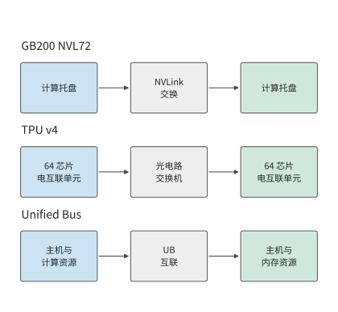

*图 6-42：三个公开系统的连接层次。NVIDIA 用 NVLink 连接设备，TPU v4 用 OCS 连接电互联单元，Unified Bus 将主机侧计算和内存资源接入统一互联。*

这些系统都可以采用第 6.3.1 节的 TP2×EP4 并行方案，但分组与物理边界的对应方式不同。张量并行组内的频繁归约适合放在低延迟连接内，不同专家组之间交换专家结果时，则需要足够的跨组带宽。把算法上的通信组映射到物理交换层，才能确定每次汇合占用了哪些端口。

用接口带宽计算传输时间时，要分清单向带宽和双向合计带宽。例如昇腾 950 的 UB 双向合计线速为 2016 GB/s，按 72 条 lane、每条 112 Gbit/s 计，单向为 1008 GB/s。UBoE 是在以太网上承载 UB 通信的方式，UB Link 是 UB 自己的链路方式。两者按预先配置共用同一组串行器／解串器（SerDes，把芯片内的并行数据与链路上的串行信号互相转换的电路），所以要把同一组物理通道分配给两种用途。分配方式决定任务实际可用的带宽。[^ub]

> **实验 6-8 · 延伸：用通信需求解释超节点的互联结构**
>
> （a）选择 DGX-1、DGX-2 或 DGX A100，画出一个通信组经过的直连或交换层。
>
> （b）复算 4³ 与 8³ 环面的芯片数和均衡二分链路数，解释为什么每芯片可用的跨分区带宽下降。
>
> （c）将 TP2×EP4 放到两台各有四张卡的主机上，标出跨主机的专家组归约。
>
> （d）把每台主机的端点数改为 64，求 256 KiB 缓存在逐对连接方式下还能容纳几台主机；再把缓存扩大到 1 MiB，判断 CloudMatrix384 的 192 台主机是否放得下。
>
> （e）把一次带外往返改为 50 μs，重新计算 N = M = 1024 时两种方式的连接建立时间，说明哪一种对往返时延更敏感。
>
> （f）选择 UB 或 TPU 的一个设计，说明安装、通信或资源访问中的哪项需求促成了这种系统结构。

## 6.6 内存池

### 6.6.1 局部容量不足与全局空闲

UB 把资源访问扩展到主机之间后，就有了具体用途：让内存不足的节点借用其他节点的空闲内存。第 6.2 节的张量并行、流水线并行和专家并行把计算和权重分到不同的卡上，降低每张卡的内存需求。另一种办法是计算位置不变，只把一部分数据放到别的节点。这就是内存池的基本用途：把分散的空闲容量交给需要它的任务。

考虑四个节点，每个节点用一张 80 GB 的 H100，任务需求分别为 100、60、40、40 GB。总需求 240 GB，小于总容量 320 GB，但任务 0 的需求比所在节点的容量多出 20 GB。其余节点的空闲分别为 20、40、40 GB，合计 100 GB。

把任务 0 整体搬到另一节点，其需求仍超过单节点的 80 GB 容量。若将它的 20 GB 数据放到节点 1 的空闲区，则物理占用变为 80、80、40、40 GB。任务 0 的工作集仍是 100 GB，其中 80 GB 本地、20 GB 远端。这样，任务 0 就能利用其他节点原本空闲的内存。

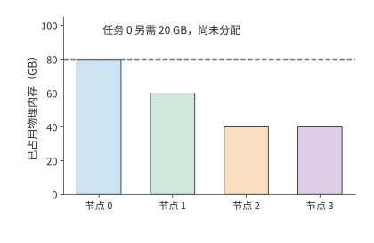

*图 6-43：借用前的物理占用。每节点容量为 80 GB，任务 0 的需求为 100 GB，其中 20 GB 尚未找到存储位置。颜色表示数据所属任务。*

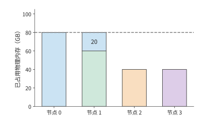

*图 6-44：把任务 0 的额外 20 GB 放在节点 1。节点 1 的绿色 60 GB 属于任务 1，蓝色 20 GB 属于任务 0；每个节点都没有超过 80 GB。*

需要区分借用前后的空闲容量：其他节点原有 100 GB 空闲内存，其中 20 GB 借给任务 0 后，四个节点合计还剩 80 GB。借用没有增加物理内存，只是让任务能够使用其他节点的空闲空间。笔者早期关于 UB 内存池的构思，关注的正是这种服务器之间的不均衡；KV 的保存与复用后来成为它的具体用途。

### 6.6.2 内存借用与访问边界

图中的 20 GB 已经有了存放位置，下一步是让节点 0 正确访问这段内存。借用首先要明确一段内存由谁提供、由谁使用。提供内存的节点开放一段区域，借用节点建立相应的地址映射，系统负责管理访问权限，并记录这段内存何时可以释放和重新分配。独占借用期间，使用权交给借用者，原持有者等待归还后再使用；共享访问则允许多个使用者按约定的一致性与同步规则访问。[^ub]

例如节点 1 把一段内存借给节点 0，节点 0 要先写入新 KV，再开始注意力计算。只有确认写入完成、能够读到新的 KV，才能开始计算；节点 1 重新分配这段区域，则要等待借用结束。地址回答“访问哪里”，权限回答“谁能访问”，操作完成与内存释放的顺序回答“什么时候可以使用”。地址、权限和访问顺序三者合在一起，远端内存才能用得正确。

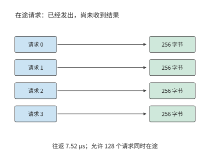

*图 6-45：一批读取请求发出后，要经过往返时间 L 才能收到结果。最多有 u 个请求在途、每个返回 q 字节时，在一个往返时间内最多返回 uq 字节。图中四个请求仅用于展示过程；正文算例采用 128 个请求，每个 256 字节，往返时间为 7.52 μs。*

权限和完成顺序保证数据正确，图中的等待过程则决定读取速度。请求发出后要过一段时间才有结果；要让链路在等待期间保持忙碌，就要同时发出多个请求。设每个读事务返回 $q$ bytes，从发出到完成需要 $L$，最多允许 $u$ 个事务同时在途（已发出、尚未完成），则每 $L$ 秒最多返回 $uq$ bytes。把路径带宽和在途事务数的限制放在一起，可得

$$
B_{\mathrm{window}}=\frac{uq}{L},\qquad
B_{\mathrm{usable}}=\min\left(B_{\mathrm{path}},\frac{uq}{L}\right). \tag{6-12}
$$

设两个节点经 ConnectX-7 网卡的 RDMA 路径相连，路径带宽为 50 GB/s。一次读请求从发出到完成要走一个来回，取 MSCCL++ 在 H100 与 ConnectX-7 平台上测得的 InfiniBand 单向延迟 3.76 μs 的两倍，即 $L=7.52$ μs。每个读事务取 $q=256$ bytes，恰好是 Qwen3-32B 一个 KV 头在一层、一个 token 上的 K 向量（128 维 BF16）。若 $u=128$，每批在途数据为 32 KiB，在途事务数量决定的带宽上限约为 4.36 GB/s。要达到路径的 50 GB/s，至少需要

$$
u\ge\left\lceil\frac{50\times10^9\times7.52\times10^{-6}}{256}\right\rceil=1469.
$$

只提高线速而仍只允许 128 个事务在途，有效读取带宽仍受在途事务数限制；放宽到 4096 个事务，在途事务数决定的上限约为 139 GB/s，超过路径带宽，瓶颈就转到 50 GB/s 的路径本身。路径带宽、事务大小和往返时间通过在途数据量联系起来。

### 6.6.3 共享容量与 KV 缓存

能否用远端内存替代本地内存，还要把第 6.6.2 节求出的读取带宽与应用的读取需求比较。同样是 20 GB 远端数据，读取频率决定所需的平均带宽。每分钟完整读取一次，平均约需 0.33 GB/s；每秒一次需要 20 GB/s；每秒二十次需要 400 GB/s。容量相同，所需的平均读取带宽相差上千倍。

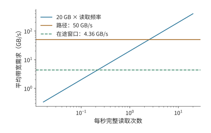

*图 6-46：完整读取 20 GB 的频率与平均带宽需求。路径带宽为 50 GB/s；每事务返回 256 bytes、往返 7.52 μs 时，128 个在途事务将有效带宽限制到约 4.36 GB/s。*

在途事务数量充足时，经 50 GB/s 的路径完整读取一次约用 0.40 s。每秒发起一次读取，两次读取之间有约 0.60 s 的空闲时间；每 0.05 s 发起一次，上一次尚未结束，新工作已经到来，队列不断增长。若最多只能同时发出 128 个事务，读取变为约 4.59 s，每秒一次也会逐渐积压。[^pool]

KV 的使用方式决定其适合放在哪里。会话等待用户下一轮输入时，可以长时间不读 KV，这时远端内存主要用来保存状态，会话恢复时再取回；活跃会话每一步都要读上下文状态，反复从远端扫描会持续占用带宽。状态本身有多大则取决于模型的上下文表示：第 9.2.2 节将并列比较同样 8192 个 token 的上下文在 Qwen3-8B 的 GQA 和 DeepSeek-V3 的紧凑 MLA 两种设计下的字节数与取回时间，后者约为前者的一半。

也可以先取回，再在本地重复使用。若同一份 20 GB 快照要读十次，逐次经 50 GB/s 路径读取需要约 4.0 s；先取回一次用 0.40 s，再按 H100 本地 HBM 的 3350 GB/s 扫描十次约用 0.06 s，共约 0.46 s。后者占用 20 GB 本地内存空间，节省了约 3.54 s 的访问时间。因此，对需要反复读取的数据，还要比较远端读取与本地缓存的时间，决定什么时候把数据取回本地。

> **实验 6-9 · 延伸：远端内存何时应直接读取，何时应缓存到本地**
>
> （a）复算四节点借用前后的物理占用，分别计算其他节点在借用前的空闲容量，以及全部节点在借用后的剩余容量。
>
> （b）每个事务传输 256 bytes，往返时间分别为 7.52 μs 和 15.04 μs。求两种情况下达到 50 GB/s 带宽所需的最少在途事务数。
>
> （c）比较 128 与 4096 个在途事务时的单次读取时间，假设前一次读取完成后才发起下一次，求连续读取时每秒最多能完成多少次完整读取。
>
> （d）采用本节远端与本地带宽，求重复读多少次时，先取回本地的总访问时间更少；同时说明所需本地容量。

## 6.7 从并行方案到超节点规模

### 6.7.1 更大的协作组与更多推理实例

本节用前几节的结果，在一台 HGX H100 的八张卡上安排多个 Qwen3-32B 会话。四个会话都已完成 prefill，各自保存了 131,064 个上下文 token 的 KV。每个会话还有一个已经生成、尚未写入 KV 的 token，用作下一步输入。四个会话同时请求再生成八个 token，正好写满 YaRN 支持的 131,072 个位置。一个实例一次服务一个会话，完成这八步后再接下一个会话；请求按实例轮转分配。八张卡都在同一台服务器内，一直分配给这组任务，直到四个会话都完成。

每步时间来自式（6-5）。续写时，式（6-4）的上下文长度依次为 131,064 到 131,071，KV 访问量逐步增加。将八步相加，就得到会话的服务时间。等待中的会话只保存各自的 KV，同一实例中的会话共享模型权重。容量先排除了八个单卡实例：一张卡连一个 128K 会话都无法容纳。按第 6.2.2 节的算法，两卡实例最多能容纳两个会话，四卡实例能容纳七个，八卡实例能容纳十六个；三种部署中每个实例分到的会话分别为一、二、四个，均可容纳。

| 部署方式 | 一个会话的八步 | 四会话完成时刻 | 全部会话完成 |
|---|---:|---|---:|
| 八个单卡实例 | 无法容纳 | — | — |
| 四个两卡实例 | 119.1 ms | 119.1、119.1、119.1、119.1 ms | 119.1 ms |
| 两个四卡实例 | 63.8 ms | 63.8、63.8、127.6、127.6 ms | 127.6 ms |
| 一个八卡实例 | 41.2 ms | 41.2、82.4、123.5、164.7 ms | 164.7 ms |

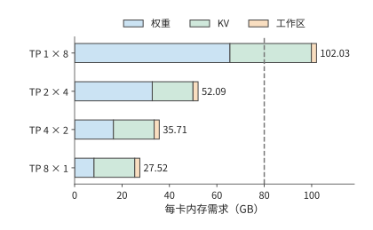

*图 6-47：四种部署在 128K 会话下的每卡内存需求，包括权重、实例内全部排队会话的 KV 和 2 GiB 工作区。单卡实例每卡要 102.03 GB，超过 H100 的 80 GB（虚线）；两卡、四卡、八卡实例分别约为 52.09、35.71、27.52 GB。*

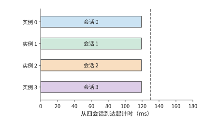

*图 6-48：四会话同时推进，每个约 119.1 ms 完成。颜色与相邻配置图中的会话一致。本图使用四个 TP2 实例，每实例两张卡，每个会话续写八个 token；虚线为 130 ms 期限。*

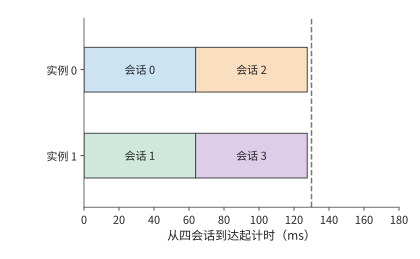

*图 6-49：每个实例顺序处理两个会话，分别在约 63.8 ms 和 127.6 ms 完成。本图使用两个 TP4 实例，每实例四张卡，每个会话续写八个 token；虚线为 130 ms 期限。*

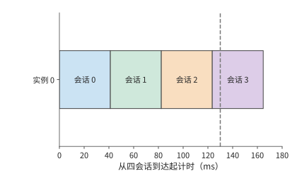

*图 6-50：单会话缩短到约 41.2 ms，四会话依次执行，最后一个约 164.7 ms 完成。三图横轴使用同一尺度。本图使用一个 TP8 实例，共八张卡，每个会话续写八个 token；虚线为 130 ms 期限。*

八卡协作使单个会话的续写时间从约 119 ms 缩短到 41 ms，但四个会话排成一队，所有会话约 165 ms 才完成。采用四个两卡实例时，单个会话的续写时间较长，却能同时推进四个会话，约 119 ms 全部完成。单卡实例本可以开八个，却连一个会话都无法容纳。

这里同时用到了两种并行：模型内部的并行计算和不同请求之间的并发执行。层内矩阵可以切给多张卡，独立会话可以分给多个实例，两者竞争的是同一批八张卡。分清这两层关系，才能按请求的完成期限选择协作组的大小。服务调度给出同时推进的会话数，模型切分给出每步通信量，互联拓扑决定数据交换与同步的耗时，三者共同决定表中的完成时刻。

图中色块的横向长度表示单个会话的执行时间，纵向轨道数表示多少会话可以同时推进。完成期限决定了这两者如何取舍。只有一个会话、要求 50 ms 完成，八卡实例满足目标；四个会话、要求 130 ms 内全部完成，两卡和四卡部署方式都满足，两卡更早完成。单会话期限越短，越需要更大的协作组；独立会话足够多时，则可以利用更多实例。

连接方式改变后，仍沿原式计算。若像第 6.5.1 节那样用两台服务器的 16 张卡组成 TP16，每步约 6.67 ms，八步约 53.3 ms，50 ms 的目标就无法达到。第二台服务器更适合运行其他实例；若一定要让一个会话用上更多的卡，就要降低新增的通信开销：改善服务器之间的连接、改变集合通信算法，或者把这些卡放进更紧密的互联域。

第 4 章的固定权重架构会改变上述取舍。权重由独立的 ROM 提供后，原来分摊给多卡的 HBM 权重读取减少，TP 的同步时间在单步耗时中占比上升。减少 TP 卡数能够省去一部分同步，腾出的卡可以组成更多独立实例；每张卡则要容纳更大份额的请求状态。本节的逐卡容量表与会话时间表，可以继续用来比较这两项变化；第 6.7.4 节给出具体数值。

把同样的分析用于状态更紧凑的模型。计算 DeepSeek V4.1 需要多少张卡时，除了每 token 890 B 的逻辑状态容量，还要看状态如何分布在各卡上。该数值对跨层共享的状态只计一份；如果各层放在不同的卡上，后面的层仍要访问生成这些状态的层所保存的数据。可以把相关的层放在相近的卡上，在目标卡上复制状态，或者建立远程访问路径。第一种限制了层的放置，第二种增加存储和更新开销，第三种增加通信依赖，所以要按每张卡实际保存和访问的数据分别计算资源需求。[^v41-case]

### 6.7.2 功率、成本与故障范围如何改变选择

时间线给出了每个会话何时完成，也给出了八张卡需要占用多久，因此可以直接据此计算成本，并比较按时完成同一组请求要占用多少资源。成本以 H100 的 GPU·s 计，即一张卡占用一秒。八张卡从四个会话同时到达时开始计费，直到所有会话完成。完成期限为 130 ms，要求四个会话中至少三个按时完成。

四个两卡实例的总成本约为 $8\times0.1191\approx0.953$ GPU·s，四个会话全部按时完成，平均每个按时完成的会话约 0.238 GPU·s。两个四卡实例的总成本约为 1.021 GPU·s，四个会话也都按时完成，平均每个约 0.255 GPU·s。一个八卡实例在期限内完成三个会话，刚好达到最低比例，但八张卡要占用到 164.7 ms，总成本约 1.318 GPU·s，平均每个按时完成的会话约 0.439 GPU·s。八个单卡实例无法容纳会话。

以按时完成的会话数为分母，平均成本定义为

$$
C_{\mathrm{on\ time}}=
\frac{C_{\mathrm{occupied}}}
{N_{\mathrm{on\ time}}}. \tag{6-13}
$$

占用成本按全部工作持续的时间计，其中包括故障停顿与重做的时间；分母只数期限内完成的会话。失败、重做和超时请求的成本都在分子里，所以都分摊到了按时完成的会话上。

以上比较假定各卡一直正常运行。若一张卡发生故障，包含这张卡的实例会暂停，分配给该实例的后续会话也会推迟。沿同一时间线注入一次故障：20 ms 时卡 0 失效，包含它的实例停顿 40 ms，60 ms 恢复后从该会话八步续写的起点重做；其他实例继续执行，不受这次故障影响。

四个两卡实例中，另外三个会话仍在约 119 ms 完成，受影响的会话在 $60+119.1\approx179.1$ ms 完成，按时比例为 75%。两个四卡实例中，未受影响的实例在约 64 和 128 ms 完成两个会话，受影响的实例在约 124 和 188 ms 完成另外两个会话，按时比例同样是 75%。八卡实例的四个会话依次在约 101、142、184、225 ms 完成，130 ms 内只完成一个。

四个两卡实例继续满足最低比例，成本增为 $8\times0.1791\approx1.433$ GPU·s，平均每个按时完成的会话约 $1.433/3\approx0.478$ GPU·s，是无故障时的 2.0 倍；两个四卡实例约为 0.500 GPU·s。故障被隔离在一个实例内，另外三个会话仍能按时完成；但占用时间延长、按时完成的会话减少，每个会话的成本仍翻了一倍。

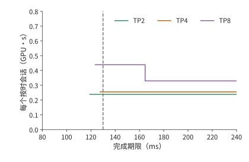

*图 6-51：无故障时，按时完成会话的平均成本随期限变化。八卡计费至所有会话结束；曲线从至少三个会话按时完成处开始。TP 数值为每实例使用的卡数；成本以 H100 的 GPU·s 计。TP1 放不下 128K 会话，没有曲线。*

*图 6-52：20 ms 时卡 0 故障，受影响实例在 60 ms 从当前会话起点重新执行。采用与无故障图相同的计费方法和纵轴范围。TP 数值为每实例使用的卡数；成本以 H100 的 GPU·s 计。*

故障影响范围取决于实例是否共用设备。两个实例若共用同一电源或交换机，这台共用设备发生故障时，两个实例都会受到影响；拆分实例只有配合资源隔离，才能保留其他实例的进度。一个实例使用的设备越多，请求执行就依赖越多设备正常工作。因此，划分实例时也需要考虑电源和交换机的共用情况。

还可以用功率计算这些部署方式的能耗。按第 6.5.2 节的 DGX H100 系统功率上限 10.2 kW 计，无故障时，四个两卡实例运行约 119.1 ms，消耗约 1.21 kJ；两个四卡实例运行约 127.6 ms，消耗约 1.30 kJ。硬件相同、功率相同时，越早完成任务，消耗的电能就越少。

模型的内存需求会限制可用的部署方式。本例中先被排除的是 TP1：128K 会话的 KV 让单卡需求达到 102.03 GB。上下文缩短到 32K 时，单卡可以容纳一个会话，但八步续写要 173.3 ms，仍超过 130 ms 的期限，这时 TP1 是被时间排除的。先找出内存容量足够的部署方案，再比较这些方案的执行时间和成本。[^cost]

> **实验 6-10 · 核心：按会话完成期限与成本选择并行配置**
>
> （a）从式（6-4）、（6-5）逐步求四种 TP 配置的八步续写时间，再计算四个会话各自的完成时刻。
>
> （b）分别采用 100、130、170 ms 期限，要求至少 75% 会话按时完成，找出满足要求的部署方案并比较成本。
>
> （c）改用两台 HGX H100 上的 TP16，跨服务器的 AllReduce 取实验 7-3 的实测值，重新计算单会话续写时间，判断能否满足 50 ms 的完成期限。
>
> （d）复算故障后的会话完成情况和成本；将停顿从 40 ms 改为 10 ms，解释满足要求的部署方案怎样变化。
>
> （e）把上下文改为 32K，加入功率条件，说明容量、时间和功率各自先排除了哪种部署方案。

### 6.7.3 给定模型与硬件，如何选择切分策略

回到章首的问题。切分策略的选择可以写成有输入、有约束的优化问题：可选方案 $\pi$ 包括并行度、物理放置、通信算法、micro-batch 划分和局部算子实现，先确定目标 $J$，再寻找

$$
\pi^*=\arg\min_{\pi\in\mathcal P_{\mathrm{feasible}}}J(\pi).
$$

可行集 $\mathcal P_{\mathrm{feasible}}$ 里的每个方案都要满足每卡容量、模型切分的数据依赖、kernel 支持和服务期限。目标 $J$ 可以是单个请求的延迟，也可以是上一节的每个按时完成会话的成本；若目标是吞吐，就在相同的服务目标（SLO）下比较能持续接纳的请求率。负载和目标不固定，“最优并行度”就没有唯一的答案。

**第一步，记录模型、负载与资源。** 模型侧需要层数、矩阵维度、注意力头与 KV 头、专家数和每 token 选中的专家数、精度、共享权重及跨层状态。负载侧需要 prefill 长度、decode 上下文、同时就绪的请求、路由分布、目标延迟与到达过程。硬件侧需要逐卡可用 HBM、不同形状下的有效算力和带宽，以及节点内、节点间每方向的路径、启动开销与共享瓶颈。第 4 章给出硬件参数，第 5 章给出实际形状与局部执行时间；不能把集群的总带宽平均分给每个通信组。

**第二步，按瓶颈列出可选方案，而不是先选一个缩写。** 下表列出各种瓶颈下应当考虑哪些方案；它只用来缩小搜索范围，最终仍要比较完成时间。

| 当前约束或瓶颈 | 优先考虑的方案 | 必须补算的代价 |
|---|---|---|
| 权重无法容纳，或小 batch 重复读权重过慢 | TP、PP；MoE 可用 EP | 归约、阶段串行、专家流量与工作区 |
| 独立请求多，完整模型已能容纳 | 更多 DP／服务副本，较小 TP 组 | 排队、批内复用、每副本 KV 容量 |
| 特定区间的激活重复存储 | 同一 TP 组内启用 SP | 布局边界的收集与归约，kernel 支持 |
| 长上下文的 KV 与注意力占主导 | CP 与 TP 的组合 | K、V 交换、统计量归约、因果注意力的负载不均 |
| 多层权重容量大，跨节点归约昂贵 | 节点内 TP＋跨节点 PP | micro-batch 是否足够、最慢阶段与流水空档 |
| 专家集合大、路由热点突出 | EP、专家副本、专家分离（路由专家放到独立的专家资源池） | dispatch／combine 两个方向的流量、最忙的卡与专家池的队列 |

**第三步，为每个方案写出数据归属和时间表。** 给每张卡标出该卡保存哪些层、头、专家、激活和 KV；算峰值内存时还要加上集合通信缓冲、双缓冲、padding、在途 micro-batch 和副本迁移的空间。然后为每个算子求本地计算与访存时间，为每次跨卡操作求轮数、字节数与共享路径，把两者按依赖关系排到时间线上。同一个 token 的前后层不会因为流水线并行而同时完成，同一个 token 选中的专家结果也不会因为网络空闲而提前就绪。MoE 要代入最忙的专家组而不是平均值，第 9.4 节给出具体的 skew（负载偏斜）模型。

**第四步，在可行方案之间按同一目标排序。** 本章的八卡例子固定为稠密的 Qwen3-32B 与 128K 会话，每个实例一次只处理一个会话；首轮比较的是 TP1、TP2、TP4、TP8，其余卡组成独立实例。专家并行不适用于稠密模型；序列并行只改变一段激活的存储，在这一逐 token、工作区固定的算例里没有额外收益；流水线并行若不交错多个会话，单个会话仍要依次经过全部阶段，所以没有把它当作缩短单会话时间的首选。上下文并行、跨会话流水和连续批处理（在每步迭代的边界重新安排活跃请求）可以进入扩展搜索，但要分别补上上下文归约、阶段排程和 batch 变化的时间模型，不能套用张量并行的 $1/p$ 缩放。

前两节已经给出逐会话时间线和成本。按这些完整数值筛选，可以直接得到下面的选择；改变目标、物理边界或容量后，选择也随之改变。[^parallel-choice]

| 给定条件 | 约束内的选择 | 为什么 |
|---|---|---|
| 四会话、128K、130 ms 内至少完成 75% | 四个 TP2 实例 | TP1 无法容纳；TP2 全部约 119.1 ms 完成，每个按时会话约 0.238 GPU·s，低于 TP4 的 0.255 与 TP8 的 0.439 |
| 单会话、128K、50 ms 期限 | 一个 TP8 实例 | 约 41.2 ms；TP4 约 63.8 ms，已超过期限 |
| 两台 HGX H100 共 16 卡，单会话、128K、50 ms | 仍选一个 TP8 实例 | 跨服务器的 TP16 按实测 AllReduce 约 53.3 ms，超过期限；另一台服务器可以运行其他实例 |
| 四会话、32K、130 ms 内至少完成 75% | 四个 TP2 实例 | TP1 可以容纳，但八步要 173.3 ms；TP2 约 88.3 ms 全部完成，每个按时会话约 0.177 GPU·s |

**第五步，用测量修正估算，不把估算的排名当作结论。** 对排在前面的方案，用相同的请求、路由和质量条件做测量，记录峰值内存、各阶段的就绪与完成时刻、各端口的收发量和服务的尾延迟。若实际的矩阵效率、通信争用或排队与估算不同，换上实测参数后重新排序；若两个方案的差距小于测量波动，就都保留，再用更有代表性的负载验证。最后交付的应包括选定的方案、被排除的方案、会让结论翻转的阈值和实测范围。配套脚本可以复算表中的四组条件，但只枚举声明过的方案，不是覆盖任意模型和框架的全局规划器。

不同设计选择影响不同的时间开销。改变 TP 主要改变每卡计算量、内存访问量和参与归约的卡数；改变算法主要改变轮数与发送量；改变拓扑主要改变共享路径与固定等待；增加实例主要改变独立会话的排队顺序。将这些变化代入同一个执行时间模型，就能比较不同设计的性能。

进一步优化时，可以对式（6-5）作敏感性分析。在 HGX H100 八卡、小数据量的算例中，NVLink 带宽翻倍只节省约 2.5 μs，而每轮启动开销减半节省约 0.74 ms；因此，应优先减少每轮通信的启动开销。MoE 若受负载最重的专家组限制，均衡分派直接减少该组的计算量；读取远端 KV 时，若带宽受在途事务数量限制，增加事务并发才能充分利用已有链路带宽。这样就能判断应当优先减少哪项开销、增加哪种资源。

### 6.7.4 超节点扩大与权重、Engram 表、KV 的放置：V4.1 Flash 的综合算例

前三节讨论的是一台服务器内的八张卡如何分给几个实例。本节转而改变超节点本身：先看把超节点放大能换来什么，再按第 4.7.3 节的思路把权重固定进 ROM，最后讨论 Engram 表和 KV 应当放在哪里。算例仍以第 2 章的 DeepSeek V4.1 Flash 为对象，任务是 200K 上下文的 decode。硬件为 256 张 H100 SXM，超节点分别取 8、64、128、256 卡，每个推理实例恰好占用一个超节点。实例内部，注意力按数据并行放置，每张卡只处理并保存自己会话的注意力与 KV；路由专家和 Engram 表按专家并行均分到各卡，每层各做一次 dispatch 和 combine。[^supernode-inference]

**超节点大小与每卡会话数。** 每张卡上的权重分两部分：注意力、共享专家和输出头每卡各存一份，共 9.5 GB；路由专家 288.8 GB 与 Engram 表 203.1 GB 由实例内的 $S$ 张卡分担。扣除权重和工作区 $U$，其余 HBM 全部留给 KV，每个会话占 $K=180.7$ MB，于是

$$
W_{\mathrm{card}}=9.5\ \mathrm{GB}+\frac{288.8\ \mathrm{GB}+203.1\ \mathrm{GB}}{S},\qquad
N_{\mathrm{session}}=\left\lfloor\frac{C-W_{\mathrm{card}}-U}{K}\right\rfloor. \tag{6-14}
$$

步时间仍按式（6-2）估算：本卡的权重和本卡全部会话的 KV 各读一遍，读取与计算取时间较长的一项，再加上每层一次 dispatch 与一次 combine，共 80 次 All-to-All。四种超节点的结果见下表。

| 超节点 | 每卡权重 | 每卡会话 | 步时间 | 每卡吞吐 |
|---|---:|---:|---:|---:|
| 8 卡 | 71.0 GB | 37 | 14.1 ms | 2,632 token/s |
| 64 卡 | 17.2 GB | 335 | 17.3 ms | 19,420 token/s |
| 128 卡 | 13.4 GB | 356 | 18.4 ms | 19,392 token/s |
| 256 卡 | 11.5 GB | 367 | 18.9 ms | 19,378 token/s |

超节点只有 8 卡时，每张卡保存每层 48 个专家，一步之内几乎全部会被选中，读取专家权重占去了步时间的绝大部分。扩大到 64 卡，每卡分到的专家减为八分之一，专家读取时间降到原来的十分之一以下，腾出的 HBM 又能多容纳九倍的会话，每卡吞吐因此提高 7.4 倍。再往上扩大就没有收益：专家读取已经很小，而 KV 读取、计算和 All-to-All 都随会话数同比例增长。这 7.4 倍主要来自容量。若把 Engram 表移到主机内存，8 卡超节点每卡也能容纳 178 个会话，与 64 卡的差距缩小到 1.9 倍。

单个用户的速度则与超节点大小无关。batch 为 1 时，一个 token 的关键路径是所在卡读一遍 8.2 GB 每卡各存一份的权重，再逐层读取一个专家，共 2.76 ms，即 362 token/s，8 卡与 256 卡完全相同。放大超节点得到的是容量和总吞吐，不是单个会话的速度；要缩短单个会话的时间，只能像第 6.7.1 节那样把注意力也做张量并行。反过来，同样 64 张卡若分散在八台 HGX H100 上，dispatch 和 combine 有八分之七的字节要经过网卡，通信时间从 3.7 ms 增至 29.2 ms，每卡吞吐降到 7,828 token/s。超节点省下的正是这一段。

*图 6-53：V4.1 Flash 在 256 张 H100 上的每卡 decode 吞吐随超节点大小的变化，服务目标为每 token 50 ms。蓝线：实例都在一个超节点内，8 卡到 64 卡提高约 7.4 倍，此后不再增长；橙点：同样 64 张卡分散在八台服务器上组成专家并行组。*

**把权重固定进 ROM。** 图 6-54 画出权重与 KV 的三种放置方式。GPU 把两者都放在 HBM，每一步都要重新读一遍权重；第 4.7.3 节的架构把部署期间不再变化的权重写进掩模 ROM，HBM 只保存 KV；KV 还可以进一步放进片上 SRAM。

*图 6-54：权重与 KV 的三种放置方式。左：GPU 的权重与 KV 共用 HBM；中：权重在制造时写入 ROM，KV 放 HBM；右：权重在 ROM，KV 放片上 SRAM，容量小得多。箭头是每步都要读取的数据，方框高度示意容量。*

后两种方式按 OpenTallas 对 V4.1 Flash 的分析结果计算：两片 N5 工艺的 ROM 晶圆，同样是 200K 上下文、batch 为 1。权重与 KV 各有自己的通路，两项读取和计算可以重叠，集合通信则要等三者都完成才能开始：

$$
T_{\mathrm{token}}=\frac{\max(T_{\mathrm{weight}},T_{\mathrm{KV}},T_{\mathrm{compute}})}{0.9}+T_{\mathrm{comm}}+T_{\mathrm{fixed}}. \tag{6-15}
$$

0.9 是因为两片晶圆分到的层数不可能完全均匀，$T_{\mathrm{fixed}}$ 是每层固定的流水延迟。GPU 一行的权重与 KV 共用 HBM，两项读取时间相加。

| 机器 | 存储与计算 | 集合通信 | 单用户速度 | 通信占比 |
|---|---:|---:|---:|---:|
| 8 张 H100，权重在 HBM | 2,689 μs | 76 μs | 362 token/s | 3% |
| 58 张 B200 张量并行，权重在 HBM | 165 μs | 562 μs | 1,357 token/s | 76% |
| 两片 ROM 晶圆，权重在 ROM | 77 μs | 159 μs | 4,070 token/s | 65% |

权重离开 HBM 之后，权重读取从 2.7 ms 缩短到 69 μs，但 80 次片上 AllReduce 仍需 159 μs，占每个 token 时间的 65%。换成 58 张 B200 做张量并行，权重读取也能压到 148 μs，通信却增至 562 μs。权重读取一旦不再是最长的一项，单用户速度就由集合通信决定，第 6.5.1 节按跳数和每跳延迟估算通信的方法在这里成了关键。

*图 6-55：三种机器上 V4.1 Flash 单用户每 token 时间的构成，200K 上下文，batch 为 1。权重在 HBM 时存储读取占绝大部分，权重进 ROM 之后集合通信成为最长的一项。*

**Engram 表放在哪里。** V4.1 Flash 有两个 Engram 模块，各带一张 3.84 亿行的表，每行 256 个 FP8 值加 8 字节 scale，两张表共 203.1 GB。每生成一个 token，两个模块各查 24 行，共 12.7 KB。这两张表同样是权重，部署后不再改变；要查哪些行只取决于 token 序列，与激活无关，因此每一步开始时就能预取。只要在第一个 Transformer 块算完之前把这些行取回，查表就不占用时间；可用于取回的时间在 H100 上是 69 μs，在 ROM 晶圆上只有 6.1 μs。图 6-56 画出三种放法，代价如下。

*图 6-56：Engram 表的三种放置方式。要查哪些行在第一个 Transformer 块计算之前就已确定，三种放法的差别在于取回这 48 行要走什么路径，以及表占用哪一种存储。*

| 放置 | 占用的容量 | 取回 48 行 |
|---|---|---|
| 主机内存，经 PCIe 或 RDMA 预取 | 不占 HBM | 一次往返 1.05 μs |
| 超节点各卡的 HBM 分片 | 8 卡每卡 25.4 GB，相当于 140 个会话；64 卡每卡 3.2 GB，相当于 18 个会话 | 一轮 NVLink 交换 0.83 μs |
| 掩模 ROM | 21,651 mm²，约半片晶圆 | 片内读取 |

在 H100 上，两条取回路径都远短于 69 μs，放在哪里只需看容量。8 卡超节点容纳不下这张表，移到主机内存后每卡的会话数从 37 个增加到 178 个；64 卡起每卡只分到 3.2 GB，放在 HBM 也只减少 5% 的会话。批量服务时主机内存也不是瓶颈：64 卡实例每卡每步 16,080 次随机读，按第 7.3.4 节实测的每秒 6100 万次计只需 0.26 ms，占步时间的 1.5%。DeepSeek 的部署正是把表放在主机内存，在第一个 Transformer 块计算的同时用 RDMA 预取。

到了 ROM 晶圆上，取舍随之改变。第一个块只有 6.1 μs，一次主机往返就占去六分之一，步时间一旦短于 42 μs 便无法掩盖；把表刻进 ROM 要多用半片晶圆，换来的只是每个 token 读 12.7 KB；放在晶圆边缘的 HBM 只占 1,124 个会话的空间，读取也不经过互联。表移出 ROM 之后，checkpoint 一片晶圆即可容纳，单用户速度反而升到 5,037 token/s。机器越快，这张表越应当放在离计算最近的可写存储里。

**把 KV 放进 SRAM。** 片上 SRAM 比 HBM 快得多，但容量先要足够。V4.1 Flash 的 checkpoint 有 510.3 GB，即使用第 4.7.2 节 WSE-3 那样 44 GB 的片上 SRAM，仅权重就需要 12 片晶圆，权重放 SRAM 的方案首先被容量排除。权重进了 ROM，晶圆上剩余的 SRAM 只够保存一个 200K 会话的 KV；KV 改放 HBM，同样两片晶圆可以同时驻留 9,637 个会话。两种设计的单用户速度相同，总吞吐却相差三个数量级。单个会话的速度由关键路径上的存储和通信决定，能同时服务多少会话由可写状态的容量决定，这正是第 6.7.1 节区分的两层并行。

三步用的是同一套方法：先按式（6-1）检查容量，再按式（6-2）逐项估算时间，最后找出关键路径上最长的一项。放大超节点提高的是吞吐，单个会话不会更快；权重固定之后，互联的每跳延迟成了单用户速度的上限；Engram 表这样只读不写的大表，机器越快越要放在离计算近的地方；SRAM 的容量决定能同时服务多少会话。

> **实验 6-11 · 延伸：超节点、ROM 与 SRAM 的综合算例**
>
> （a）按式（6-14）复算表中各行的会话数，把服务目标改为每 token 20 ms，求各超节点大小下每卡能服务的会话数。
>
> （b）把实例内的注意力改为 TP8，其余不变，重算 batch 为 1 的单用户速度，与 362 token/s 比较。
>
> （c）把跨服务器的每轮启动开销从 5 μs 改为 2 μs，并给每卡配两张网卡，判断跨服务器的 64 卡实例能否追平超节点内的实例。
>
> （d）把片上每跳延迟减半，按式（6-15）重算 ROM 晶圆一行的单用户速度和通信占比。
>
> （e）把上下文改为 1M，重算 KV 放 SRAM 时能驻留的会话数，以及 KV 放 HBM 时的会话数。
>
> （f）把主机内存的一次往返改为 2 μs，求 H100 和 ROM 晶圆各在多快的单用户速度下，Engram 查表开始占用步时间。

权重、状态或服务需求继续扩大时，单个超节点可能不足以支撑一个实例的运行。下一章沿着本章分析的数据传输路径和依赖关系，加入网卡、数据中心交换网络、远程操作的完成通知与网络拥塞，继续计算扩大协作范围所带来的收益和代价。

[^dense]: 单卡完整 BF16 权重为 470,187,269,120 bytes，8192 个 token 的 KV 为 1,577,058,304 bytes；八卡 TP 时每卡权重为 58,959,617,024 bytes（含每卡各存一份的归一化参数与路由器），每卡 KV 为 394,264,576 bytes，每卡最多保存 47 个 8192 token 的会话。表中 GB 为十进制，GiB／MiB 为二进制，合计先用精确值求和再取近似；2 GiB 包含激活与其余工作区预留。详见[Qwen3-235B-A22B 八卡放置](../calculations/results/qwen235-placement-tp8-kv-replica.md)及其 JSON，读取固定官方配置与权重索引。单步读取量与运算量见[单请求 8K decode](../calculations/results/qwen3-235b-a22b-decode-b1-s8192.md)与[8192 token prefill](../calculations/results/qwen3-235b-a22b-prefill-8192.md)。

[^models]: [具体模型的并行推算](../case-studies/model-parallelism.md)，[Qwen3-235B-A22B 配置](../references/outline-checks/2026-09-07/scaling-history/qwen3-235b-config.json)，[DeepSeek V4 报告](../references/files/papers/deepseek-v4.pdf)，[Kimi K3 报告](../references/files/papers/kimi-k3.pdf)表 1 与 §2.3。DeepSeek-V3 的 671B 为历史对照模型。

[^tp-experiment]: 八个正式配置通过 FP64 参考检查，配对 TP/SP 输出逐位相同；完整形状与验收见[实验 6-2：JAX TP/SP 实际 FFN 路径](../experiments/ch06/06-02/jax-tp-sp/README.md)。实验在 CPU 逻辑设备上执行。

[^variants]: [MeshSlice 的矩阵形状与流水推算](../case-studies/mesh-shape-and-slicing.md)、[Shift Parallelism 的状态与额外驻留](../case-studies/parallel-switching-and-state.md)。MeshSlice 的部分重叠为预测，Arctic 的 SP 定义及动态切换边界按固定实现说明。

[^pipeline]: [有限槽位与背压计算](../calculations/results/pipeline-finite-1-slots.md)、[基础 TP／PP 通信路径](../calculations/results/dense-comm-qwen8-tp8-pp1-t1.md)。

[^ownership]: [Qwen235 所有权连接练习](../research/2026-infra-survey/parallel-moe-ownership/NOTES.md)及[独立核对结果](../research/2026-infra-survey/parallel-moe-ownership/results.json)。本例采用正文给定的 TP2×EP4 布局。

[^moe-tax]: [专家复用与 MoE Serving Tax 阅读](../case-studies/moe-and-startup.md)。式（6-8）假设各 token 独立、均匀地选择专家；原论文分别以激活 FLOPs 和总参数匹配稠密对照模型。

[^routes]: 图形与样本说明见[路由热图](ch06/route-observation.png)和[配套图说明](ch06/README.md)。记录覆盖 43 层，每题四个实际 decode 输入，包含调度器提前执行的 EOS forward。来源：[DeepSeek V4-Flash 路由观测](../experiments/ch06/06-03/README.md)及[原始计数分析](../experiments/ch06/06-03/runs/routes-001/route-analysis.json)。

[^ring]: [Ring 逐轮结果](../calculations/results/ring-qwen3-32b-t1-p8-h100.md)、[未分段二项树结果](../calculations/results/tree-qwen3-32b-t1-p8-h100.md)，按无争用计算。带宽为 H100 的 18 条 NVLink 4 每方向合计 450 GB/s，见 [H100 架构白皮书](../references/files/specs/nvidia-h100.pdf)第 47 页；每轮开销取 C. Hwang 等，[MSCCL++: Rethinking GPU Communication Abstractions for AI Inference](../references/proceedings/ASPLOS/2026/paper-034.pdf)，ASPLOS 2026，表 1 与表 2：在每节点 8 张 H100、NVLink 4、每卡一张 400 Gbit/s ConnectX-7 的平台上，nvbandwidth 测得 NVLink 延迟 822 ns、吞吐 397.5 GB/s，RDMA perftest 测得 InfiniBand 延迟 3.76 μs、吞吐 48.94 GB/s。

[^collective-path]: [集合通信路径与诊断](../case-studies/collective-paths-and-diagnosis.md)，涵盖固定框架源码、custom AllReduce 分派、就绪偏差和测量范围。

[^tuning]: AutoCCL 采用 16／32 张 A40 与 NCCL 2.18.3，八卡 NVLink 为四对连接；其直接搜索目标仍是通信性能，18.26→32.44 GB/s 为论文表 6 的 AllGather 在重计算干扰下的测量。NCCL 2.31.2 跨网络零 CTA 的 AllGather／AlltoAll 路径涉及对称注册窗口、节点内 CE 和节点间 CPU proxy。详见[通信调优、计算争用与卸载](../case-studies/communication-tuning.md)。

[^comm-experiment]: [实验 6-5：四进程实际通信与计算并行](../experiments/ch06/06-05/README.md)。实验在一台 M2 Max 上用 PyTorch CPU 版运行，四个进程经本机 TCP 通信。正式测量分五组，每组把单独通信、单独计算、同时运行三种方式各跑一次，组内顺序随机；表中每项先取组内最慢进程的时间，再取五组的中位数。通信时间从提交异步 AllReduce 算起，到主机收到完成回调为止，可能略晚于数据实际传完。

[^swing]: [集合通信的物理路径与作业错峰](../case-studies/network-planning-and-collectives.md)、[96 条消息的物理路径计算](../calculations/results/collective-paths-book.md)、[NSDI 2024 选读](../research/2026-infra-survey/reading-nsdi-2024.md)、[Morphlux 版本与阅读记录](../research/2026-infra-survey/reading-asplos-2026.md)。TPU v4 的 OCS 基于 MEMS 反射镜，切换需要毫秒级时间，见 [TPU v4 论文](../references/files/papers/tpu-v4.pdf) §2。

[^numa]: [PCIe 中转与 NUMA 放置](../case-studies/pcie-staging-and-numa.md)、[发送端附近缓冲的计算](../calculations/results/staging-local-grouped.md)（本章只用其中的字节计数）。HGX H100 主机的 CPU 型号见 [DGX H100 用户指南](../references/files/specs/nvidia-dgx-h100-user-guide.md)；Xeon 8480C 是 Xeon Platinum 8480+ 的定制版本，后者最多 4 条 UPI 链路、每条 16 GT/s，见 [Intel 产品规格](../references/files/specs/intel-xeon-8480plus-ark.md)与 [第四代至强技术概览](../references/files/specs/intel-xeon-4th-gen-overview.md)表 1。Intel 未公开 UPI 每方向的 GB/s，这里不换算传输时间；PCIe Gen5 x16 每方向 64 GB/s 见 [H100 架构白皮书](../references/files/specs/nvidia-h100.pdf)第 48 页。

[^physical]: [端口数量与互联介质分析](../research/draft11-outline-audit/report.md#radix)。端口与功率算例采用题设输入。

[^ashrae]: ASHRAE TC 9.9，[Emergence and Expansion of Liquid Cooling in Mainstream Data Centers](../references/files/documents/ashrae-liquid-cooling.pdf)，2021，第 14、28 页：白皮书没有给出单一的风冷上限，40 kW 是本例按其风量对比选取的阈值；[DGX SuperPOD H100 参考架构](../references/files/documents/dgx-superpod-h100-ra.pdf)第 10 页的示例机柜布置中每机柜功率超过 40 kW。按服务器计的功率上限见[第 6 章计算结果](ch06/continuity-model.json)的 `rack` 字段。

[^nvidia]: [V100 架构白皮书](../references/files/specs/nvidia-v100.pdf)，NVLink 拓扑与 DGX-1 附录；[A100 架构白皮书](../references/files/specs/nvidia-a100.pdf)，NVLink／NVSwitch 与 DGX A100 附录；DGX-2 的 16 卡历史配置亦见[ZeRO 论文](../references/files/papers/zero.pdf)平台说明。

[^topology-choice]: 设计案例每芯片 6 个端口、每端口每方向 50 GB/s 取自 TPU v4：[TPU 多代综述](../references/files/papers/google-tpu-generations.pdf)表 1 列出 TPU v4 每芯片 6 条 ICI 链路、每条 50 GB/s，脚注 4 说明按每方向计（TPU v5p 与 Ironwood 为每条 100 GB/s）；[TPU v4 论文](../references/files/papers/tpu-v4.pdf)表 4 同为 6 条 50 GB/s 链路。每次转发 200 ns 取 [UALink 2.0 规范](../references/files/specs/ualink-common.pdf) §9.9.2 为 128 lane 交换芯片设定的空载延迟目标，把它同时用于环面芯片内的路由器。32 MiB 为题设的每卡发送量；均匀 All-to-All 的链路负载按维序路由的平均跳数计算。其余系统数据来自 TPU v4 论文 §2（光链路成本、OCS 占比、3D 环面的割集）、[NVLink 官方规格](../references/text/nvidia-nvlink-spec.txt)（每 GPU 18 条链路、72 GPU 无阻塞）、[CloudMatrix384 论文 v2](../references/files/papers/cloudmatrix384-v2.pdf) §3.3.2–3.3.3（一级、二级交换芯片数量与无阻塞设计）。

[^nvl]: [GB200 NVL72 官方归档](../references/files/specs/nvidia-gb200.md)，固定快照中 72 GPU／36 CPU 与机柜级 NVLink 组织；NVLink Switch System 最多连接 256 张 H100，见 [H100 架构白皮书](../references/files/specs/nvidia-h100.pdf)第 48 页。16 卡环形归约的时间见[第 6 章计算结果](ch06/continuity-model.json)的 `two_servers.nvlink_domain_tp16` 字段。

[^tpu]: [TPU v4 论文](../references/files/papers/tpu-v4.pdf)、[TPU 多代系统综述](../references/files/papers/google-tpu-generations.pdf)，电互联 cube、OCS、切片与故障隔离的设计。

[^ub]: [UB 与昇腾 950 资料核对](../references/UB-ASCEND-NOTES.md)、[UB OS 参考设计](../references/files/specs/UB-Software-Reference-Design-for-OS-2.0-zh.pdf)§4、[950 官方白皮书](../references/files/specs/ascend-950-official.pdf)§4.6。

[^cloudmatrix]: [CloudMatrix384 论文 v2](../references/files/papers/cloudmatrix384-v2.pdf)§3.2、图 2、表 1；论文表中的部分 NPU 测量按 die 计，系统 384 则按 NPU 计。

[^pool]: [第 6 章内存池计算](ch06/continuity-model.json)的 `memory_pool` 字段：四个 80 GB 节点的借用前后占用、窗口带宽 $uq/L$、读取时间与重复读取的比较。路径带宽取 ConnectX-7 的 400 Gbit/s，往返时间取 MSCCL++ 表 1 的 InfiniBand 单向延迟 3.76 μs 的两倍，本地带宽取 H100 的 3350 GB/s。

[^cost]: [逐会话时间线、故障与 GPU·s](ch06/continuity-model.json)的 `candidates` 与 `candidates_32k` 字段，由[计算脚本](ch06/continuity_model.py)生成；四组部署条件的筛选见[切分选择结果](../calculations/results/parallel-choice-book.md)。能耗按 DGX H100 系统功率上限 10.2 kW 计，见[第 6 章计算结果](ch06/continuity-model.json)。

[^continuous]: 贯穿模型与逐步计算见[模型说明](ch06/continuous-example.md)、[计算脚本](ch06/continuity_model.py)和[完整结果](ch06/continuity-model.json)。Qwen3-32B 形状取自已锁定配置，H100 的 HBM 容量、带宽与矩阵峰值取自[硬件表](../calculations/results/hardware.md)。矩阵算子的时间取内存访问与计算时间的较大值，均按峰值计；通信按层串行，上下文 KV 每步增长。

[^v41-case]: [DeepSeek V4.1 官方技术报告](../calculations/sources/deepseek-v4.1-flash/DeepSeek_V41_Tech_Report.pdf)，第 1、2、3 节与第 6 节；[跨章会话的固定条件与复算](../calculations/results/v41-throughline.json)。

[^ub-design]: 李博杰，〈[Unified Bus 背后的思考](../references/files/documents/ub-reflection.md)〉，Jetty、事务序与 Load/Store 各节；[OpenURMA 论文](../references/files/papers/openurma.pdf)，2026-06-02 修订版（arXiv:2605.28717），§3 设计、§7–§9 状态与延迟、§11 全系统验证、§13 结果汇总。[本次整合的来源与适用范围](../research/ub-ep-integration-2026-09-10/README.md)。
[^ub-fabric]: 主机数与连接建立时间的参数和结果见[UB 互联计算](../calculations/results/ub-fabric-book.md)，运行 `python3 calculations/calc.py ub-fabric --format md` 可以复算；记录尺寸、阶段延迟和缓存条目数取自 OpenURMA 论文表 3、表 7 与 §7.2。目录式缓存一致互联按每个缓存行为每个对端保留 1 bit 的公式计算；NVL72 的 72 张 GPU 是该代产品的公开配置，不是本书推导的结果。

[^initiator]: NVIDIA 技术博客 [Improving Network Performance of HPC Systems Using NVIDIA Magnum IO NVSHMEM and GPUDirect Async](https://developer.nvidia.com/blog/improving-network-performance-of-hpc-systems-using-nvidia-magnum-io-nvshmem-and-gpudirect-async/)（CPU 代理线程与 GPU 发起两条路径的步骤）；[NVIDIA DOCA DPA 文档](https://docs.nvidia.com/doca/sdk/doca-dpa/index.html)（把通信代码卸载到 BlueField-3 网卡内处理器的编程模型）；[DeepEP README 快照](../research/ub-ep-integration-2026-09-10/sources/deepep.md)。三种位置的穿越次数按各自的控制路径计，具体实现可能合并或增加步骤；抓取快照见[来源记录](../research/ub-ep-integration-2026-09-10/sources.json)。

[^nccl-basics]: NVIDIA，[NCCL 集合通信语义](https://docs.nvidia.com/deeplearning/nccl/user-guide/docs/usage/collectives.html)、[点对点与不等长交换](https://docs.nvidia.com/deeplearning/nccl/user-guide/docs/usage/p2p.html)、[nccl-tests 带宽口径](https://github.com/NVIDIA/nccl-tests/blob/master/doc/PERFORMANCE.md)；阅读快照与哈希见[来源记录](../research/ub-ep-integration-2026-09-10/sources.json)。

[^sequence-context]: Korthikanti 等，[Reducing Activation Recomputation in Large Transformer Models](../references/files/papers/activation-recompute.pdf)，§3 的 tensor 与 sequence parallelism；[Megatron Core 的 Context Parallelism 文档](https://github.com/NVIDIA/Megatron-LM/blob/main/docs/user-guide/features/context_parallel.md)；Liu 等，[Ring Attention with Blockwise Transformers for Near-Infinite Context](https://arxiv.org/abs/2310.01889)。本节 SP 采用 Megatron 的特定含义，CP 的八位置例子为本书推导。

[^parallel-choice]: [切分选择输入](../calculations/scenarios/parallel-choice-example.json)、[方案筛选脚本](../calculations/parallel_choice.py)、[完整结果](../calculations/results/parallel-choice-book.md)。使用本章的执行时间模型，按实例内全部排队会话的峰值上下文计算 KV 容量；只在明示的 TP 与实例数组合内排序。

[^supernode-inference]: [固定场景](../calculations/scenarios/supernode-inference-example.json)、[计算脚本](../calculations/supernode_inference.py)与[完整结果](../calculations/results/supernode-inference-book.md)。权重按锁定的 V4.1 Flash checkpoint 分片头逐张量累加；KV 与矩阵运算量分别由 `kv-comparison` 与 `v41-forward` 在 200,000 上下文下算出；H100 参数取自[硬件表](../calculations/results/hardware.md)；NVLink 与网卡的每轮启动开销与第 7.6.3、7.6.4 节相同。ROM 晶圆与 58 张 B200 两行取自作者的 [OpenTallas](https://github.com/bojieli/OpenTallas) 仓库 commit c7093ba 中 DeepSeek-V4.1-Flash 的 roofline 分析，所用分析点保存在[摘录](../calculations/sources/opentallas/v41-flash-roofline-n5-vs-b200.json)中。这些是等硅面积下的分析结果：OpenTallas 尚无流片的芯片，其 ROM 密度与读取带宽在 N5 工艺上也未经测量。Engram 表的行数、每行字节与两个模块的查表行数取自同一 checkpoint 与配置；DeepSeek 的部署把表放在主机内存并用 RDMA 预取，见 [V4.1 技术报告](../calculations/sources/deepseek-v4.1-flash/DeepSeek_V41_Tech_Report.pdf)§2.4.2 与 §3.1.3；主机内存一次往返与在途标签限制的读取率取第 7.3.4 节 KV-Direct 的测量；ROM 面积按 OpenTallas 的 N5 掩模 ROM 密度换算，表移出 ROM 后的一片晶圆设计取自同一 commit 的 engram-host 分析。WSE-3 的 44 GB 片上 SRAM 见第 4.7.2 节。

[^hgx]: [HGX H100 数据手册](../references/files/specs/nvidia-hgx-h100-datasheet.pdf)：八张 GPU 经 NVSwitch 互联，GPU 间 NVLink 900 GB/s，网络速率至 400 Gbit/s；[NVIDIA H100 规格](../references/files/specs/nvidia-h100-spec.md)列出 H100 SXM 的 80 GB、3.35 TB/s、NVLink 900 GB/s 与 PCIe Gen5 128 GB/s，后两项为收发两个方向的合计；[H100 架构白皮书](../references/files/specs/nvidia-h100.pdf)第 47 页：18 条第四代 NVLink，每条每方向 25 GB/s；[ConnectX-7 数据手册](../references/files/specs/nvidia-connectx7-datasheet.pdf)：单端口至 400 Gbit/s；[DGX H100 用户指南](../references/files/specs/nvidia-dgx-h100-user-guide.md)：8 张 H100、640 GB GPU 内存。每卡一张 400 Gbit/s 网卡的配置也见[实验 7-3 的公开运行记录](../experiments/ch07/07-03/README.md)。HBM 带宽与 989.4 TFLOP/s 取自[硬件表](../calculations/results/hardware.md)的 `h100-sxm` 行。

[^qwen3-context]: [Qwen3 技术报告](../references/files/papers/qwen3.pdf)表 1 列出 Qwen3-32B 为 64 层、64／8 个查询／KV 头、上下文 128K；§3.2 说明预训练序列长 32,768，推理时用 YaRN 与 DCA 把可处理的序列长度提高到四倍。

[^dense-moe]: [Qwen3-32B batch 1](../calculations/results/qwen3-32b-decode-b1-s32768.md)与[batch 64](../calculations/results/qwen3-32b-decode-b64-s32768.md)、[Qwen3-30B-A3B batch 1](../calculations/results/qwen3-30b-a3b-decode-b1-s32768.md)与[batch 64 均匀路由](../calculations/results/qwen3-30b-a3b-decode-b64-s32768-balanced.md)、[Qwen3.6-35B-A3B batch 1](../calculations/results/qwen36-decode-b1-s32768.md)与[batch 64](../calculations/results/qwen36-decode-b64-s32768.md)、[Qwen3.6 的 128K 状态](../calculations/results/qwen36-capacity-b1-n131072.md)与[256K 状态](../calculations/results/qwen36-capacity-b1-n262144.md)。能放下的请求数按 $\lfloor(n\times(80\ \mathrm{GB}-2\ \mathrm{GiB})-W)/S\rfloor$ 计，$n$ 为卡数，$W$ 为常驻权重，$S$ 为每请求状态，汇总见[第 6 章计算结果](ch06/continuity-model.json)的 `dense_moe` 字段。Qwen3.6 的状态读取包括完整注意力层的 KV、线性注意力层的递推状态与卷积状态。

[^nvswitch]: [H100 架构白皮书](../references/files/specs/nvidia-h100.pdf)第 47–48 页：第三代 NVSwitch 每颗提供 64 个第四代 NVLink 端口，每条 NVLink 每方向 25 GB/s；NVLink Switch System 中每个节点以 2:1 收敛引出节点内全部 NVLink 带宽。

[^dgx-power]: [DGX H100 用户指南](../references/files/specs/nvidia-dgx-h100-user-guide.md)表 3：系统功率 10.2 kW max；H100 SXM 的 700 W 见[硬件表](../calculations/results/hardware.md)。按服务器计的功率上限见[第 6 章计算结果](ch06/continuity-model.json)的 `rack` 字段。

## 本章小结

多卡并行延续了单卡算子的分块与调度。沿样本、序列位置、特征、层和专家切分，每张卡持有的数据和依赖各不相同，数据并行、张量并行、序列并行、上下文并行、流水线并行和专家并行就是这些切法的常见组织方式。切分产生交换，调度决定何时发起、何时汇合，算法和物理路径共同决定代价。选方案时先检查容量和执行的合法性，再用完整负载下的延迟、吞吐或成本比较各方案。

并行收益随规模递减：每卡承担的计算量与内存访问量逐渐减少，串行处理的耗时仍然存在，归约轮次和服务器间通信等待继续消耗时间。批内复用、热点分布、在途事务和物理割集又分别改变数据传输速度与最慢阶段的执行时间。分析这些因素时，从数据的产生、持有和下一次使用入手，就能说明每项开销如何影响后续计算。UB 的算例说明：连接状态按端点数相加还是按端点对相乘，决定了片上缓存能容纳多少台主机、建立全部连接要多长时间；控制器接在片上总线上还是 PCIe 之后，决定了每次访问要穿越多少层。

在本章的 128K 续写任务中，单卡无法容纳一个会话，八卡实例的单会话续写时间最短，四个两卡实例则能更早完成全部四个会话；故障、上下文长度和跨服务器路径又改变可用的部署方案。超节点规模最终服务于明确的任务：提供足够的内存容量，在期限内完成请求，并降低单位请求的资源成本。
