# 第 7 章 数据中心网络

上一章把矩阵、层和专家分给不同的卡，并按通信代价选择实例规模。现在模型和总卡数都不变，只把一部分卡移到另一个超节点：原来的切分还合适吗？原本走节点内高速互联的部分和，可能要改走 InfiniBand 或 RoCE；同一次同步因此占用不同的带宽、队列和故障域。要重新算的是切分的放置和执行代价，不是重新学一套并行概念。

模型分到多台服务器之后，训练要继续推进，第一项共同工作就是汇合各副本的梯度。多个数据并行副本处理不同样本后，要汇合梯度，再按同一批样本更新参数。先在超节点内合并各副本的梯度，再跨节点交换，与第 5 章先在局部累加部分和、减少外部搬移的做法相同。局部合并本身也需要时间，只有节省的远端传输和等待多于这些时间，这样安排才划算。

本章沿着数据离开一台服务器的路径，研究分到多台服务器上的卡如何共同完成工作。全章围绕两台服务器、每台八张卡展开：先决定梯度如何跨服务器归约，再讨论如何连续提交和处理通信请求，随后说明数据何时可读、缓冲区何时可复用，以及如何处理共享网络中的拥塞，最后把这套分析推广到固定 1024 卡的训练任务，比较不同超节点大小下的通信分层、吞吐与恢复成本。本章还会比较低并发推理中的小数据量传输，说明同一个网络在不同负载下应当优先优化什么。

全章使用三种分析模型。**流量与资源模型**计算数据经过各条链路和接口时需要的时间，找出瓶颈；**并发与吞吐模型**解释充分利用带宽需要同时处理多少请求；**依赖与关键路径模型**用来判断哪些操作可以同时执行，以及缩短哪项操作能够减少总耗时。书中的几个设计案例来自笔者参与的工作：KV-Direct 让可编程网卡直接处理键值存储请求；1Pipe 用网络提供全局操作顺序，简化分布式程序的协作；UB 提供统一的设备互联。笔者参与这些研究和设计时，一直在思考三个问题：如何减少数据搬移，如何在等待一次操作时执行其他工作，如何在简化编程的同时不让系统停摆。

本章用 GB/s 表示十进制带宽，用 KiB、MiB、GiB 表示二进制容量，$1\ \mathrm{GiB}=2^{30}$ bytes。

## 7.1 从超节点走向集群

### 7.1.1 存储需求如何引出跨服务器协作

模型需要的存储空间超过单机容量，是跨服务器协作的直接原因之一。以采用混合精度 Adam 训练的 8B 参数模型为例。**混合精度**是在训练中为不同对象选用不同数值精度。若参数、梯度、FP32 主权重以及优化器的一阶矩和二阶矩合计占用 16 bytes／参数，就需要 128 GB。一张 80 GB 卡无法容纳，两张卡合计 160 GB，扣除这些状态后剩下 32 GB 留给激活和工作区。参数增加到 284B 时，采用相同的数据表示，这些状态共需约 4.5 TB，必须分散到更多的卡上存储和处理。[^capacity]

推理不需要保存梯度和优化器状态，但大模型的权重仍可能需要多台服务器才能容纳。将约 1.6T 参数的 DeepSeek V4-Pro 和约 2.8T 参数的 Kimi K3 按每参数 0.5 byte 存放，权重分别约为 800 GB 和 1.4 TB。一台八卡、每卡 80 GB 的服务器合计 640 GB，仅存放权重就至少分别需要两台和三台服务器。MoE 的路由器为每个 token 只选一部分专家来执行，减少的是这一次前向的计算量；未被选中的专家，权重仍需存放。

将权重分开存放之后，程序还要把各部分计算连接起来。按层切分，需要在阶段之间交接激活；在一层内部切分，需要汇合局部计算结果；让多份模型处理不同样本，需要汇合梯度。因此，即使模型相同，采用不同的切分方式，也会产生不同的通信需求。

为了比较这些通信方式，本章用两台 HGX 规格的 H100 服务器组成十六张卡的通信组，每张卡上运行一个通信进程。这些进程共同执行集合通信，下文称为参与者，用 rank 区分。参与者 0 到 7 在服务器 A，8 到 15 在服务器 B。服务器内的八张卡经 NVSwitch 用 NVLink 全连接。每张 H100 的 NVLink 总带宽为 900 GB/s，这是收发两个方向的合计，即每个方向 450 GB/s。每张卡配一张 400 Gbit/s 的网卡（network interface card，NIC），每个方向 50 GB/s，经 PCIe 交换芯片与这张卡相连，不与其他卡共用。两台服务器上编号相同的网卡接到同一台交换机，这样一条从网卡到网卡的路径称为一条 **rail**。交换网络能承载两台服务器之间的双向流量。集合通信每轮的启动时间取 0.83 μs：公开的 nccl-tests 记录显示，在两台这样的服务器上，十六张卡对 16 B 到 128 B 的数据做一次 AllReduce 约需 25 μs；数据量如此之小，传输时间可以忽略，把 25 μs 平均到下一节环形 AllReduce 的 30 轮上，每轮约 0.83 μs。[^hgx]

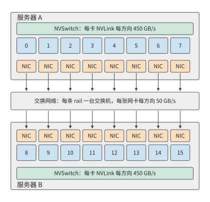

*图 7-1：固定两台服务器，每台八张卡。服务器内的卡经 NVLink 与 NVSwitch 互联，每张卡各有一张网卡；跨服务器的数据从发送方的网卡经交换网络到达接收方的网卡，每张网卡每个方向提供 50 GB/s。*

图 7-1 中的服务器边界，也是本章反复分析的通信边界。选择 192 MiB 的梯度张量，要求十六个参与者都得到其归约结果。例题 7.6（第 7.6.2 节）的训练步计算 20 ms，梯度在 17 ms 就绪，要让通信完全藏在计算后面，就要在 3 ms 内完成；本章把 3 ms 作为这次通信的预算。这一算例便于逐轮计算，也能说明跨服务器协作的主要困难：本地计算结果必须经过带宽远低于 NVLink 的网卡，才能传给另一台服务器。

网卡比 NVLink 慢得多，所以要先决定哪类通信放在服务器之间。本章沿用第 6.1.4 节的并行方式一览表，不再逐一定义。把频繁的张量并行归约留在较快的互联内，把数据并行的梯度同步或流水线并行的阶段交接放到服务器之间，是应当首先计算的一类候选方案；若本地容量不够，上下文并行需要更大范围的上下文，或者专家并行的路由跨越多个节点，通信范围就必须扩大。是否这样放置，要由实际流量和关键路径决定。

跨越超节点边界本身不会改变需要交换的数据量；算法、放置、精度和接收方是否去重决定要传多少字节，路径决定这些字节经过哪个出口、要等多久。只知道网络是 InfiniBand 还是 RoCE，推不出有效带宽、传输延迟、超售比（交换机下联与上联带宽之比）、在途窗口和故障恢复时间。后文用明确给定的网络参数计算，实际部署时换成对应系统的测量值。

> **实验 7-1 · 延伸：八卡服务器之间的模型切分**
>
> 计算上述两个推理模型的最低服务器数量，再加入每卡 8 GB 的 KV 与工作区。分别画出服务器内张量并行或专家并行、服务器间流水线并行的分工，以及跨服务器张量并行的分工，标出一次 prefill 与一次 decode 需要跨服务器交接的位置。

### 7.1.2 流量与资源模型

确定卡的位置和梯度大小后，再计算数据经过路径上每一段需要多久。一块数据从 GPU 内存出发，经加速器接口到达网卡，再经过交换网络，最后写入接收方的内存。同一块数据要依次经过这些接口和链路，而不同数据块可以在各段上同时传输，形成流水线。持续发送大量数据时，带宽最低的一段决定总吞吐率。例如，一张卡经 NVLink 每个方向能送出 450 GB/s，其网卡每个方向只能发送 50 GB/s，这张卡向另一台服务器的持续发送速率就受网卡的 50 GB/s 限制。

从单条路径扩展到整个集群时，可以先选择要分析的网络边界，再统计所有穿过它的数据。将网络节点分成两组，连接这两组节点的链路就是第 6 章的割集。若一次任务需要沿某个方向跨越割集传送 $V_{\mathcal C}$ bytes，而该方向的有效带宽为 $B_{\mathcal C}$，传输时间至少为

$$
T_{\mathcal C}=\frac{V_{\mathcal C}}{B_{\mathcal C}}.
$$

该式给出传输时间的下界：无论如何调度，链路每秒传的字节数都不会超过它的带宽。全双工链路的两个方向分别计算；若多个端口共享内部接口，再对该接口计算合计流量。同一份数据必须依次通过串联的各段链路，因此端到端带宽受最慢的一段限制，不能将各段带宽相加。

割集有多宽，取决于交换网络如何组织。**Clos 网络**由多层交换机构成，通过中间交换层为端点提供多条路径。在分层 Clos 网络中，叶交换机连接服务器，上层交换机提供叶交换机之间的多条路径。以 DGX SuperPOD 参考架构所用的 NVIDIA Quantum QM9700 InfiniBand 交换机为例，其每个端口按 InfiniBand 的 NDR 速率等级运行，为 400 Gbit/s，即每方向 50 GB/s；若一台叶交换机用 48 个端口接服务器、16 个端口接上层，下联总带宽为 2.4 TB/s，上联总带宽为 0.8 TB/s，两者之比 3:1 称为**超售比**。这些合计 0.8 TB/s 的上联链路，就是离开这台叶交换机的流量必须经过的割集。连接在同一叶交换机上的服务器可以直接交换数据；只有跨叶交换机的通信才占用上联带宽。

**例题 7.1：增加卡数的收益何时受跨服务器通信限制？** 把十六个参与者排成一个环做归约（第 7.2.1 节逐轮计算），每台服务器向另一台发送 360 MiB，这些字节全部经过一张网卡，每方向 50 GB/s。原来的卡数下计算时间为 20 ms。增加卡数时计算均匀分摊，跨服务器的传输量和路径不变。求完全串行和完全重叠两种安排的完成时间。

解答：一个方向的传输下界为

$$
T_{\mathcal C}=\frac{360\times2^{20}}{50\times10^9}
\approx7.5\ \mathrm{ms}.
$$

令卡数相对原来的倍数为 $x$，计算时间变为 $20/x$ ms。串行安排需要 $20/x+7.5$ ms；计算与通信完全重叠时，总时间等于两者中的较大值。卡数翻倍，两个结果分别从约 27.5、20.0 ms 降至 17.5、10.0 ms。增加到四倍，串行安排约为 12.5 ms，完全重叠安排约为 7.5 ms。图 7-2 画出两种安排随卡数变化的曲线。

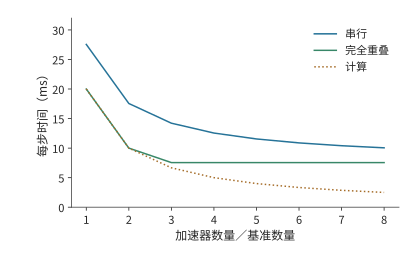

*图 7-2：跨服务器传输量固定时增加卡数的效果。每方向发送 360 MiB，经一张 50 GB/s 网卡；计算时间从 20 ms 开始，随卡数增加按反比缩短。曲线分别按计算与通信串行、完全重叠计算，通信项取割集传输时间。*

计算时间与传输时间相等时，$20/x=7.5$，得到 $x\approx2.6$。越过这一点后，计算时间已经短于传输时间，继续加卡也不能缩短完全重叠安排的时间。要继续缩短时间，就应减少穿过割集的数据量，或让更多网卡同时工作以提高割集的有效带宽。第 7.2 节将说明，重新组织同一次归约怎样同时做到这两点。

这种总任务固定、增加卡数的做法称为**强扩展**；**弱扩展**则随卡数增加而增加任务量。例如，若每个方向的传输量也翻倍而出口不变，通信时间就翻倍。扩展曲线的形状，取决于计算量和跨服务器传输量各自如何随卡数变化。

> **实验 7-2 · 延伸：通信量与出口带宽如何限制扩容收益**
>
> 沿用例题 7.1，分别考虑每个方向的流量减半，以及让两张网卡同时工作使出口带宽翻倍这两种改动，分别画出串行与完全重叠两种安排下，完成时间随卡数倍数变化的曲线，并求计算耗时与通信耗时相等时的卡数倍数。再令流量随卡数倍数线性增长，求完全重叠安排下使完成时间最短的卡数倍数。

**Clos 网络的层数与半分带宽。** 前文把叶交换机的上联当作割集。整个集群的割集有多宽，要从一台交换机的端口数算起。设每台交换机有 $k$ 个端口，每个端口每方向 50 GB/s，QM9700 的 $k=64$。叶交换机（leaf）用 $d$ 个端口接服务器、$u$ 个端口接上层的脊交换机（spine），$d/u$ 就是超售比。无阻塞时 $d=u=k/2$。两层 Clos 中，每台脊交换机用 $k$ 个端口各接一台叶交换机，每台叶交换机的 $k/2$ 条上联分别接到 $k/2$ 台脊交换机，因此最多有 $k$ 台叶交换机、$k^2/2$ 个端点；三层按 fat-tree（胖树，各层总带宽不收窄的多层 Clos）的 pod 结构（若干叶交换机与一组中间层交换机组成一个 pod，pod 之间经顶层交换机相连）最多接 $k^3/4$ 个端点。$k=64$ 时，两层接 2048 个端点、用 96 台交换机，正是 DGX SuperPOD 参考架构中 2048 张 GPU 所用的 64 台叶交换机加 32 台脊交换机；三层接 65536 个端点、用 5120 台交换机。[^clos-cut]

把集群分成端点数相等的两半，连接两半的链路带宽合计称为**半分带宽**（bisection bandwidth）。无阻塞网络的半分带宽等于一半端点的带宽合计：两层 2048 个端点为 $1024\times50=51.2$ TB/s，三层为 1638.4 TB/s。超售比为 3 时，叶交换机 48 下行、16 上联，两层能接 3072 个端点，只用 80 台交换机；64 台叶交换机共 1024 条上联，半分带宽为其中一半的合计 25.6 TB/s，只有无阻塞网络中同样 3072 个端点所得 76.8 TB/s 的三分之一，每个端点穿过半分割集的份额从 50 GB/s 降到 16.7 GB/s。图 7-3 画出两层 Clos 网络及其半分割集。

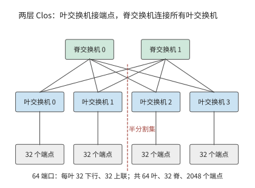

*图 7-3：两层 Clos 网络。每台叶交换机一半端口接服务器、一半接脊交换机，任意两台叶交换机之间经任一脊交换机相通；虚线把端点分成两半，穿过它的叶—脊链路就是半分割集。图中画出四台叶交换机和两台脊交换机作代表，64 端口时实际为 64 台叶交换机、32 台脊交换机。*

第 7.6.4 节的 1024 卡训练作业占用整数台叶交换机时，其割集就是这些叶交换机的全部上联：

| 超售比 | 每叶下行／上联 | 1024 卡占用的叶交换机 | 割集链路数 | 割集带宽 | 每卡份额 |
|---|---:|---:|---:|---:|---:|
| 1:1 | 32／32 | 32 | 1024 | 51.2 TB/s | 50 GB/s |
| 3:1 | 48／16 | 22 | 352 | 17.6 TB/s | 17.2 GB/s |

超售比也改变第 7.6.4 节表中“出口随卡数增长”一列的取值。那一列把每超节点出口取为卡数乘 50 GB/s，隐含交换网络无阻塞；超售比为 3 时，出口只剩三分之一，跨域传输时间变为三倍：

| 超节点卡数 | 每节点跨域发送 | 无阻塞出口 | 3:1 超售出口 | 跨域传输时间（无阻塞 → 3:1） |
|---:|---:|---:|---:|---:|
| 8 | 127 GB | 400 GB/s | 133 GB/s | 0.318 → 0.953 s |
| 64 | 120 GB | 3.2 TB/s | 1.07 TB/s | 37.5 → 112.5 ms |
| 128 | 112 GB | 6.4 TB/s | 2.13 TB/s | 17.5 → 52.5 ms |
| 256 | 96 GB | 12.8 TB/s | 4.27 TB/s | 7.5 → 22.5 ms |

表中是纯传输时间。第 7.6.4 节的跨域项还含 $2(H-1)$ 轮各 0.83 μs 的启动，128 卡超节点时 $H=8$，启动共约 12 μs，对表中的毫秒级时间几乎没有影响。

**讨论：超售的割集何时成为瓶颈？** 超售比 $r$ 把每张卡穿过割集的份额降到 $50/r$ GB/s。若一张网卡发出的字节中只有比例 $f$ 要离开本叶交换机，上联不成为瓶颈的条件是 $f\le1/r$：无阻塞时任何 $f$ 都不受限，$r=3$ 时只有不到三分之一的字节跨叶才不受限。分层归约的跨服务器阶段，配对的两台服务器若不在同一台叶交换机下（在第 7.2.5 节的多轨拓扑里，各服务器编号相同的网卡接同一台叶交换机，每 32 台服务器为一组，这种情况就是两台服务器不在同一组内），每张网卡的全部字节都要跨叶，$f=1$，超售的割集直接把这一阶段拉长到 $r$ 倍；两台服务器在同一组内时，第 7.2.5 节的对齐配对让每一对的字节只经过一台叶交换机，$f=0$，上联不承载这次归约的任何字节。把同一同步组的服务器放进同一个组，就是降低 $f$ 的办法。

> **实验 7-3 · 延伸：交换机端口数与超售比如何决定割集**
>
> 把交换机端口数改为 128，分别求无阻塞两层与三层 Clos 的端点数、交换机数和半分带宽。保持 64 端口，把超售比改为 2:1，求 1024 卡分区的割集带宽和每卡份额，并求第 7.6.4 节 128 卡超节点的跨域传输时间。最后求超售比为 3 时，分层归约跨服务器阶段的每张网卡需要有多大比例的字节留在本叶交换机内，割集才不再是瓶颈。

### 7.1.3 统一互联

上述下界说明了物理链路的限制。程序还面临另一个问题：同一份数据在机内传输和跨服务器传输时，往往要用不同的访问接口。这和总线与网络长期以来的分工有关：紧耦合的互联把设备接到处理器和内存系统上，适合频繁、细粒度的协作；集群网络连接大量独立的节点，还要处理节点和链路故障。模型跨越服务器之后，同一项计算就同时用到这两类机制。一次本地访存和一次远程传输，在程序里表达的是相似的数据依赖，走的却是不同的提交和完成路径。

笔者参与 UB 早期设计时，核心问题之一就是如何为本地和远程协作提供统一接口。应用希望表达的是“读取这份数据”“把结果交给下一阶段”“等它完成后复用空间”。统一互联为寻址、数据访问和设备间通信提供共同的接口，让 CPU、加速器和其他设备都能参与其中。

理解这种统一，需要区分两件事。接口决定程序如何表达工作，物理路径决定工作经过哪些资源。一次远程读取可以用一条指令发起，但数据仍要经过网卡的 50 GB/s 出口；异步写入可以提前提交，接收方则要等数据就绪后才能开始使用。因此，本章将先求必需的流量，再求充分利用带宽所需的并发请求数，最后分析应用要求的操作顺序。统一接口的收益也在这三个层次上体现：减少搬移，缩短发起路径，简化协作。第 6.5.5 节已经从超节点规模的角度讨论了 UB 的两项设计选择：把控制器接在片上总线上，把连接状态拆成端点记录和传输通道分别保存。本章沿着一次远程访问的路径，逐阶段计算这两项选择带来的效果。

## 7.2 跨节点流量与物理路径

### 7.2.1 数据并行的跨服务器流量

统一接口不能省去必需的传输，但归约算法可以改变哪些数据需要跨服务器。先从数据并行开始：每个参与者算出局部梯度，再把对应元素相加，最后每个参与者都要得到完整的归约结果。算例选 Qwen3-8B 第一层 FFN 中 gate 投影的梯度，形状为 $[12288,4096]$，按每元素 4 字节的 FP32 存放，每个参与者的输入为

$$
M=12288\times4096\times4=192\ \mathrm{MiB}.
$$

第 6.4.2 节推导过环形 AllReduce：先做 ReduceScatter，让每卡持有归约结果的一片，再做 AllGather 把这些分片收集到每卡；张量均分为 $p$ 份，两步各 $p-1$ 轮，每轮向下一个参与者发送一份 $M/p$。因此，每个参与者发送

$$
V_{\mathrm{rank}}=2\frac{p-1}{p}M.
$$

十六个参与者各发送 360 MiB，共发送 5760 MiB，执行三十轮。算法决定总发送量，参与者在服务器上的分布则决定其中多少需要跨服务器传输、经过哪些网卡。

**例题 7.2：哪种归约算法能在 3 ms 内完成传输？** 使用第 7.1 节的两台服务器，比较不分层的连续环、交错环和分层归约。

**解答：计算各归约方案的跨服务器传输量。** 连续环按 0、1、…、15 排列。十六条有向边只有 7→8 和 15→0 跨服务器。每轮每边发送 12 MiB，三十轮每方向各发送 360 MiB，两方向合计 720 MiB；这些字节在服务器 A 只经过参与者 7 的网卡，在服务器 B 只经过参与者 15 的网卡，其余十四张网卡闲置。若改成 0、8、1、9、…、7、15 的交错排列，十六条边全部跨服务器，每轮每张网卡各发送 12 MiB，跨服务器总量增至 5760 MiB。

分层归约先在各服务器内由八个参与者执行 ReduceScatter。七轮之后，每个参与者保存本服务器归约结果的八分之一，即 24 MiB。两台服务器上负责同一分片的两个参与者，再执行一次 AllReduce：各自把 24 MiB 分成两份，用一轮交换并归约其中一份，再用一轮交换得到另一份。每一对在两个方向合计发送 48 MiB，八对共发送 384 MiB；每一对各走自己的一条 rail，八张网卡同时工作。最后各服务器内用七轮 AllGather 得到完整结果。图 7-4 至图 7-6 分别画出三种方案的路径，图 7-7 比较三者跨服务器的字节数。

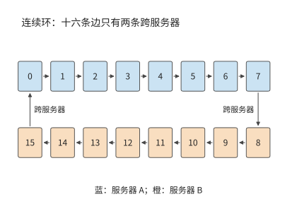

*图 7-4：连续环将同一服务器内的参与者排在一起。十六条有向边中只有 7→8 与 15→0 跨服务器，跨服务器流量集中在两张网卡上。颜色表示参与者所在服务器。*

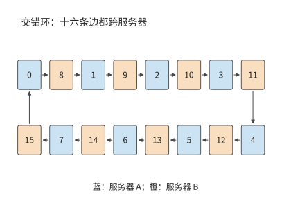

*图 7-5：按 A、B 两服务器交替排列参与者，十六条有向边都跨服务器，十六张网卡都在工作。每个参与者的总发送量保持不变。*

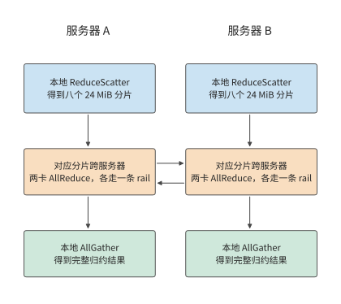

*图 7-6：每台服务器先把本机八份贡献归约成分片，再和另一台服务器交换对应的分片，最后在本机收集完整结果。每列从上向下执行，横向箭头表示跨服务器交换，每对参与者各用一条 rail。*

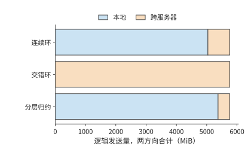

*图 7-7：三方案的逻辑发送总量均为 5760 MiB；橙色跨服务器部分分别为 720、5760、384 MiB。两个方向合计。*

**解答：由各轮链路负载计算归约时间。** 各轮依次执行，同一轮中的不同传输并行进行。设第 $r$ 轮经过资源 $e$ 的数据量为 $V_{r,e}$，该资源带宽为 $B_e$，每轮启动时间为 $\alpha$，则传输模型为

$$
T_{\mathrm{comm}}=\sum_r\left(\alpha+\max_e\frac{V_{r,e}}{B_e}\right).
$$

沿上述三种方案的箭头逐轮计算，就能把流量换算成时间。该式分开了两种关系：一轮之内由最慢的传输决定，各轮之间依次相加。这里只算数据传输和每轮启动的时间。[^gradient]

连续环每轮在每个方向上经一张网卡发送 12 MiB，需要约 0.25 ms；同一轮的其余十四条边走 NVLink，每条 12 MiB 只需约 0.03 ms，都要等这一条边。因此三十轮约需 7.6 ms。交错环每轮十六条边各经自己的网卡发送 12 MiB，每轮同样约需 0.25 ms，三十轮也约需 7.6 ms：交错环让所有网卡都在工作，却把跨服务器流量增加到八倍，时间没有缩短。

分层归约的两个跨服务器轮次，每张网卡每轮传 12 MiB，共约 0.50 ms。本地 ReduceScatter 和 AllGather 合计十四轮，每轮每个参与者经 NVLink 发送 24 MiB，在 450 GB/s 下合计约 0.78 ms。十六轮启动共约 13 μs，得到

$$
T_{\mathrm{hier}}=
14\frac{24\ \mathrm{MiB}}{450\ \mathrm{GB/s}}
+2\frac{12\ \mathrm{MiB}}{50\ \mathrm{GB/s}}
+16\times0.83\ \mu\mathrm{s}
\approx1.3\ \mathrm{ms}.
$$

连续环的传输已超过 3 ms 的预算，分层归约则为归约计算、传播和排队留出约 1.7 ms。分层归约使跨服务器传输量减少约 47%，通信时间减少约 83%。两者比例相差悬殊，原因不在字节数，而在路径：连续环三十轮中的每一轮都要等跨服务器的边经网卡传完 12 MiB，其余十四条边走 NVLink，约 0.03 ms 传完后就在等这条边，另外十四张网卡则整轮没有数据可传；分层归约把跨服务器传输压缩成两轮，每轮八张网卡同时各传 12 MiB，割集的有效带宽从 50 GB/s 变成 400 GB/s。

**讨论：本地互联要多快，分层才合算？** 把本地带宽写成 $B_L$，网卡仍为每方向 50 GB/s。分层归约的本地十四轮共发送 336 MiB，跨服务器两轮共约 0.5 ms；只要 $B_L$ 不低于网卡带宽，连续环的时间就始终由那一条跨服务器边决定，约为 7.6 ms。令两者相等，$336\ \mathrm{MiB}/B_L+0.5\ \mathrm{ms}=7.6\ \mathrm{ms}$，得到 $B_L\approx50$ GB/s：只要本地互联不慢于一张网卡，分层归约就更快，NVLink 的 450 GB/s 远高于该界限。分层归约在这台服务器上没有代价，因为每个参与者的本地发送量（336 MiB）不比连续环的（360 MiB）多，跨服务器阶段又用上了全部八张网卡。

分层归约并不总是免费的。作为对照，考虑一种常见的 PCIe 服务器（下文称对照配置）：每台四张 A100 80GB PCIe，卡与卡之间经 PCIe Gen4 x16 点对点传输，每方向 32 GB/s；每台配一张双端口 ConnectX-7，两个 200 Gbit/s 端口各 25 GB/s，共用这张网卡的 PCIe Gen4 x16 插槽，每方向也只有 32 GB/s。八个参与者的连续环十四轮各发送 24 MiB，本地边受点对点链路限制，跨服务器边受网卡插槽限制，每轮都按 32 GB/s 计，约需 11.0 ms。分层归约的两个跨服务器轮次每方向各要通过插槽传送 96 MiB，共约 6.3 ms，加上六轮本地通信约 9.4 ms，合计约 15.7 ms，反而比连续环慢。令两者相等，本地带宽约为 64 GB/s，约是网卡插槽带宽的两倍。[^two-nic] A100 PCIe 的 NVLink 桥接器每方向 300 GB/s，远高于该界限，但一座桥只连两张卡，四卡环上仍有两条边走 PCIe；若四卡环的每条边都有这样的带宽，分层归约降到约 7.3 ms，才快于连续环。差别的来源是共享接口：跨服务器阶段把八个参与者的分片集中到两轮里，这两轮的流量都要经过同一个 32 GB/s 的插槽，本地归约节省的远端字节被更长的远端轮次抵消了一部分；本地链路又不比该插槽快，本地归约增加的时间也就无法补回。

分层归约先在较快的本地互联上完成部分归约，再把结果经网卡发出。它减少跨服务器的字节，更重要的是让每张网卡都有自己要传的分片。跨服务器带宽由多张独立网卡提供时，分层几乎没有代价；跨服务器带宽是共享接口时，只有本地归约增加的时间少于其节省的远端传输时间，分层归约才更快。

**第四种方案：在网归约。** 前三种方案都让参与者之间两两传数据，交换机只负责转发。**在网归约**让交换机在转发的同时做加法：NVIDIA 的 SHARP（Scalable Hierarchical Aggregation and Reduction Protocol，可扩展分层聚合与归约协议）在交换芯片里沿聚合树归约来自多个端口的数据，再把结果分发回去，端点不必把同一份数据多次发送。[^in-network] 沿用分层归约的本地 ReduceScatter 与 AllGather，只把跨服务器阶段换成：每个参与者把自己的 24 MiB 分片发给交换机一次，收回归约结果一次，只有一轮。两台服务器时，每张网卡每个方向仍传 24 MiB，跨服务器总量仍是 384 MiB，与分层归约相同；时间从两轮的 0.505 ms 变为一轮的 0.504 ms，只节省一次 0.83 μs 的启动。

差别出现在服务器数增加时。设持有同一分片的服务器有 $S$ 台。环形 AllReduce 让每张网卡发送 $2\frac{S-1}{S}\times24$ MiB、经过 $2(S-1)$ 轮；在网归约让每张网卡始终只发送一次、接收一次。跨服务器阶段的时间见下表和图 7-8：

| 服务器数 | 环：每网卡发送 | 环：轮数 | 环：时间 | 在网归约：每网卡发送 | 在网归约：时间 |
|---:|---:|---:|---:|---:|---:|
| 2 | 24 MiB | 2 | 0.505 ms | 24 MiB | 0.504 ms |
| 4 | 36 MiB | 6 | 0.760 ms | 24 MiB | 0.504 ms |
| 8 | 42 MiB | 14 | 0.892 ms | 24 MiB | 0.504 ms |
| 16 | 45 MiB | 30 | 0.969 ms | 24 MiB | 0.504 ms |
| 32 | 46.5 MiB | 62 | 1.027 ms | 24 MiB | 0.504 ms |

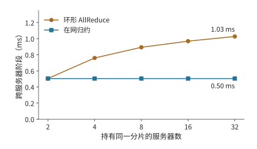

*图 7-8：持有同一分片的服务器从 2 台增至 32 台时，跨服务器阶段的时间。环的每网卡发送量趋近两个分片、轮数按 $2(S-1)$ 增长；在网归约保持一个分片、一轮。两台服务器时两者只差一次启动。*

**讨论：在网归约何时明显更快？** 两台服务器时两者只差一次启动；从 $S=3$ 起，环的字节数是在网归约的 $2(S-1)/S>1$ 倍，还多出 $2S-3$ 轮启动，服务器越多差距越大，32 台时在网归约的时间只需环的 49%。该模型只计网卡的串行发送与启动；交换机归约引擎每秒能归约多少字节、支持哪些数据类型，是要另外给定的输入，流量超过它时瓶颈从网卡转到交换机。SHARP 论文在 128 台主机上测得 8 字节 AllReduce 从 6.01 μs 降到 2.83 μs，4096 字节从 46.93 μs 降到 14.48 μs：小消息节省的主要是轮数带来的启动时间。[^in-network]

> **实验 7-4 · 延伸：在网归约何时值得**
>
> 把梯度改为 BF16（每参与者 96 MiB），重算两台与八台服务器的环形与在网归约跨服务器时间。设交换机归约引擎每方向的归约吞吐为 200 GB/s，求八条 rail 同时归约时它是否成为瓶颈，并求使在网归约仍快于环的最小引擎吞吐。最后按第 7.6.3 节的 8 KiB 输入，比较 36 层、每层两次归约的总启动时间在两种方案下相差多少。

### 7.2.2 张量并行与流水线并行的通信需求

数据并行通过归约汇合各参与者的梯度。张量并行把一层的计算分给多个参与者，后面的算子往往要等局部结果汇合后才能开始，所以层内通信会直接推迟后续计算。流水线并行按阶段切开模型，把跨服务器的交接集中在阶段边界。两种方式下，数据跨越服务器边界的次数不同。

先计算一次层间交接的数据量。Qwen3-8B 的隐藏宽度为 4096，一个 BF16 隐藏向量是 8 KiB。prefill 中 8192 个 token 的同类张量为 64 MiB，单请求 decode 则为 8 KiB。链路带宽 $B$ 取本章网卡的 50 GB/s，每次传送的启动时间 $\alpha$ 设为 5 μs，传送 $M$ bytes 耗时为

$$
T_{\mathrm{msg}}=\alpha+\frac{M}{B}.
$$

64 MiB 约需 1.3 ms，8 KiB 约需 5.2 μs。前者的时间主要花在传输数据上，后者约 97% 的时间花在启动上。启动时间与传输时间相等时，$M=\alpha B=250000$ bytes，约为 244 KiB。数据量远大于该值时，传输时间占主导，提高带宽更有效；远小于该值时，减少传输次数更有效。

上式给出了每次交接的代价；对流水线并行还要看多次交接如何与计算穿插。流水线并行把连续若干层放在同一阶段，阶段之间传递激活。前一阶段处理下一个 micro-batch 时，后一阶段可以处理上一个 micro-batch。取四个前向阶段，每阶段 1 ms。一个 micro-batch 从第一阶段依次走到第四阶段，4 ms 后完成。连续放入八个独立 micro-batch，第一阶段每毫秒将一个 micro-batch 的结果传给下一阶段，最后一个 micro-batch 在第 11 ms 完成。

沿图 7-9 中相同的编号看，一个 micro-batch 必须走完四个阶段；沿同一行看，一个阶段可以连续处理八个 micro-batch。左下和右上的空白，就是流水线启动和结束时的空闲。

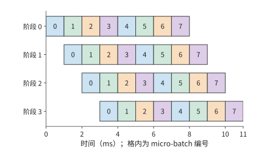

*图 7-9：四个前向阶段如何处理八个 micro-batch。每格为 1 ms，数字表示 micro-batch 编号；同一编号沿右下方移动，表示该 micro-batch 依次通过各阶段。每个阶段计算 8 ms，在 11 ms 的总时间中各空闲 3 ms。阶段耗时相同，图中忽略额外交接开销。*

一般地，$p$ 个等时阶段、$m$ 个独立 micro-batch、每阶段耗时 $\tau$，总时间与各阶段的利用率分别为

$$
T_{\mathrm{pipe}}=(m+p-1)\tau,\qquad
U_{\mathrm{pipe}}=\frac{m}{m+p-1}.
$$

四阶段、八个 micro-batch 时利用率约为 73%。若希望达到 90%，由 $m/(m+3)\ge0.9$ 得到至少 27 个独立 micro-batch。要让流水线各阶段持续工作，就需要足够多的独立 micro-batch。低并发 decode 中，同一请求的下一个 token 依赖前一个 token 的输出，增加服务器并不会创造新的独立 micro-batch；增加并发请求才会增加流水中的独立工作。

因此两种并行产生不同的等待：张量并行要频繁汇合局部结果，流水线并行在启动和结束时有一部分卡空闲。Prefill 的张量较大，应优先减少跨服务器传输的数据；低并发 decode 逐个生成 token，应优先减少每层通信的启动次数。并发请求数则决定流水线利用率。

### 7.2.3 专家并行的通信负载

张量并行和流水线并行的通信由切分方式确定；MoE 还多一个变数：每个 token 选的专家可能不同，发送目标也随之改变。专家并行把专家放在不同的卡上，token 按路由去相应的专家。取 1024 个 token，每个选八个专家，共 8192 次 dispatch。每份激活 8 KiB，一半跨服务器，dispatch 到远端专家的输入就有 4096 份，共 32 MiB；combine 返回同样大小的结果，再传 32 MiB。[^parallel]

设 token 数为 $n$、每 token 选择数为 $k$、每份激活占 $d$ bytes、跨边界比例为 $f$。若每次 dispatch 单独传送，dispatch 的传输量为 $nkfd$，加上 combine 返回的专家结果共 $2nkfd$。把热门专家放到发送方所在的服务器，降低的是 $f$；改变激活的数据类型或编码，改变的是 $d$。

这 32 MiB 如何分配到接收方，同样影响传输时间。全部发给一张 50 GB/s 的网卡，接收至少需约 0.67 ms（图 7-10）；平均分给接收服务器的八张网卡，每张接收 4 MiB，接收时间降至约 0.08 ms（图 7-11）。对照配置的双端口网卡两个端口共用一个 32 GB/s 的 PCIe 插槽，无论如何分到两个端口，接收 32 MiB 都至少需要约 1.05 ms。将流量均匀分给网卡，消除了单张网卡的瓶颈；端口共用插槽时，共享的插槽随后成为新的瓶颈。

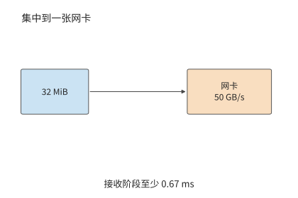

*图 7-10：将全部 32 MiB 送入一张 50 GB/s 网卡，接收至少需要约 0.67 ms。*

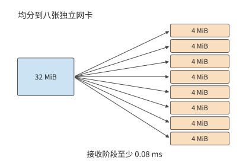

*图 7-11：八张独立网卡各接收 4 MiB，接收阶段缩短到约 0.08 ms。*

把接收目标分散到多个网卡之后，还要继续向前追踪共同经过的接口。图 7-12 把对照配置的共享插槽单独画出：无论后面如何分到两个端口，这 32 MiB 都必须先通过同一个插槽。

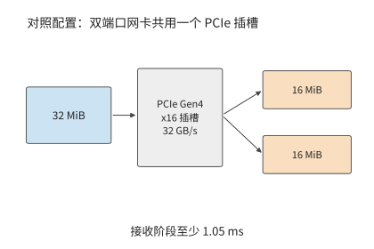

*图 7-12：对照配置中，32 MiB 都需要先经过网卡 32 GB/s 的 PCIe 插槽，接收阶段受限于约 1.05 ms。这里各图均只计算接收载荷的传输。*

比较这三张路径图，分散目标减少了每张网卡上的数据量；沿最后一张图的共同入口看，32 MiB 仍须全部通过它。计算不规则通信时，也可以先分别统计这些位置的流量。

把从卡 $i$ 发往卡 $j$ 的载荷记为 $V_{ij}$。同一行相加是发送方的发送量，同一列相加是接收方的接收量；把跨越某个割集的元素相加，就是该割集的传输量。把这些量各自除以对应的带宽，再取最大值，就是第 7.1 节的资源模型在不规则交换上的应用。

从该矩阵还能看出 dispatch 与 combine 的热点如何对应。若按 token 到专家逐份发送、返回同样大小的向量，且接收方不做合并，返回矩阵就是发送矩阵的转置：dispatch 的热点接收方，就是 combine 的热点发送方。两次通信的总字节数相同，不代表两段耗时相同：返回的数据要等专家算完才就绪，两个方向的可用带宽、数据格式和归约位置也可能不同。若 dispatch 用 FP8、combine 用 BF16，返回的载荷约为 dispatch 的两倍，量化 scale 等元数据另计。第 9.4 节会把这些流量与计算就绪时间放进同一个算例。

专家放置因此有两项互相联系的目标：让更多 dispatch 留在本地，让远端 dispatch 分散到有余量的接收方。复制热门专家是用额外的容量换少走远端；发往同一张卡上多个专家的输入可以只传一次激活，到了那张卡再分给各个专家。两种办法都减少了相应路径上的传输量。

### 7.2.4 多网卡

专家 dispatch 说明了多入口并行的收益和共享入口的限制。同样的分析也适用于发送方：增加网卡，只有当它确实提供额外的可用带宽、并且有数据分配给它时，才会缩短传输时间。第 7.2.1 节的连续环就是一例：服务器上八张网卡各连一张卡，连续环却只让其中一张有数据可传，分层归约才把分片分给八对参与者，跨服务器阶段从 7.6 ms 降到约 0.5 ms。有网卡不等于用上了网卡，通信算法决定每张网卡分到多少字节。

对照配置说明另一种限制。其双端口网卡有两个 25 GB/s 端口，共用 32 GB/s 的 PCIe 插槽。只用一个端口时，八个参与者的连续环十四轮约需 14.1 ms；把每次要传的数据拆成两段，分别交给两个端口，吞吐只升到插槽允许的 32 GB/s，时间降到约 11.0 ms，而不是两个端口合计 50 GB/s 对应的约 7.1 ms。即使换成四端口的 ConnectX-7，把第三个端口也用上，插槽仍是同一个 PCIe Gen4 x16，这段传输不能再缩短。共享接口的带宽用尽之后，再加端口也不提高吞吐。[^nic-count]

另一种情况是某张 GPU 直连的网卡正忙，相邻 GPU 的网卡却空闲。借用相邻的出口要先把数据经 NVLink 送到相邻 GPU，多了一段本地传输。多网卡通信系统 FuseLink 采用的就是这条路径：借助机内的 GPU 互联，把网络缓冲区重新映射到空闲的网卡上。[^fuselink]

下面比较直接发送和经相邻 GPU 中继两种方式。直连网卡每方向 50 GB/s，两张可借用的相邻网卡也各为 50 GB/s；通往相邻 GPU 的 NVLink 每方向 450 GB/s。

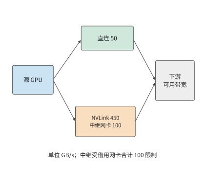

*图 7-13：借用相邻网卡的路径。直接路径最多传输 50 GB/s；两张中继网卡合计 100 GB/s，数据要先经过 450 GB/s 的 NVLink 到达相邻 GPU。两路在下游汇合，最后还受外部网络和接收方可用带宽限制。箭头表示传输方向。*

沿图 7-13 的分叉计算：直接路径与中继路径可以同时传输，但数据必须依次经过中继路径内部的两段。因此，直接和中继路径合计可提供 $50+\min(450,100)=150$ GB/s。设外部网络与接收路径共同允许的带宽为 $B_D$，实际的发送能力为

$$
B_{\mathrm{eff}}=\min\bigl(B_D,\ 50+\min(450,100)\bigr)\ \mathrm{GB/s},
$$

其中 $B_D$ 也以 GB/s 计。$B_D\le50$ 时直连网卡已能用满下游带宽，中继没有收益；$50<B_D<150$ 时，中继收益随下游可用带宽增加；超过 150 后，两张借用网卡的合计带宽成为新的瓶颈。若 NVLink 同时在承担本机归约的流量，留给中继的本地带宽低于 100 GB/s 时，限制中继路径的就换成本地这一段。1.125 GiB 载荷在直接 50 GB/s 路径上约需 24.2 ms，下游支持 100 GB/s 时降至 12.1 ms，支持 150 GB/s 时降至 8.1 ms。

上述按带宽借用网卡的分析，前提是每次传输的数据量足够大。MoE decode 的 dispatch 和 combine 要让每张卡发几千条小消息，这时还要检查网卡每秒能发起多少项请求，也就是第 7.3.4 节的 $1/\delta$。按该节 RoCE 可靠连接实现的 $\delta\approx18.6$ ns 计，网卡每秒约发起 5400 万项请求；在 50 GB/s 的链路上，只有消息小于约 0.93 KB 时，发起速率才先于带宽成为瓶颈。MoE dispatch 的一条消息是一个 token 的隐藏向量，隐藏维 7168 时 FP8 约 7 KiB、BF16 约 14 KiB，都远大于该交叉点，所以热点专家所在的卡先用尽的仍是带宽，借用相邻网卡按字节分配即可。只有每条消息不到 1 KB 时，例如逐条发送的控制消息，发起速率才会先于带宽用尽；第 9.4.2 节讨论专家副本放置时，把这种情况下网卡的报文处理能力也计入需要预留余量的资源。[^nic-rate]

无论是分层归约、专家放置还是多网卡中继，分析步骤相同：画出路径，计算每条链路和接口传输的数据量，再找出耗时最长的一项。

> **实验 7-5 · 核心：本地带宽与共享出口如何影响归约算法选择**
>
> 完整复算例题 7.2，再改用对照配置（每台四张 A100 80GB PCIe，卡间经 PCIe Gen4 点对点每方向 32 GB/s，双端口 ConnectX-7 的两个 25 GB/s 端口共用 32 GB/s 的 PCIe 插槽）重算连续环和分层归约。在对照配置下把本地带宽从 32 GB/s 提高到 NVLink 桥接器的 300 GB/s（设四张卡之间的每条边都有这样的带宽），解释为什么归约算法的选择会翻转，而在本章配置下不会。再将对照配置每台服务器使用的端口数从一个增为两个、三个，保持 32 GB/s 的插槽不变，画出归约时间随端口数变化的曲线，指出增加到多少个端口后，继续增加已无法缩短时间。

### 7.2.5 多轨拓扑

第 7.2.1 节的分层归约让八对参与者各走一条 rail。DGX SuperPOD 参考架构把计算网络组织成**多轨拓扑**（rail-optimized）：每台服务器的八张网卡分别接到八台不同的叶交换机，所有服务器的第 $i$ 张网卡都接第 $i$ 台叶交换机，这台叶交换机连同接在它上面的所有网卡就是第 $i$ 条 rail；同一组 32 台服务器内，同一条 rail 上的流量经叶交换机一跳到达，不同 rail 之间的流量要经过脊交换机。[^rail] 图 7-1 里“每条 rail 一台交换机”的交换网络就是这种组织。

分层归约的跨服务器阶段让 rank $i$ 与 rank $i+8$ 配对：rank $i$ 用服务器 A 的第 $i$ 张网卡，rank $i+8$ 用服务器 B 的第 $i$ 张网卡，两张网卡都接在第 $i$ 台叶交换机上。因此八对参与者的流量各自留在一条 rail 内，都只经过一台叶交换机，没有一个字节经过脊交换机。每条 rail 每个方向承载 24 MiB，两轮共 0.505 ms；这 192 MiB 若集中在一张网卡上需要 4.03 ms，八条 rail 同时工作将其缩短到约八分之一。[^rail] 图 7-14 的上半图画出这种对齐配对，下半图是下文讨论的错位配对。

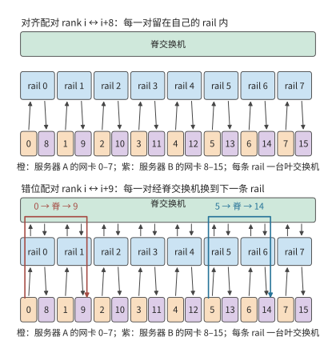

*图 7-14：八条 rail 画成八条竖直车道，每条车道里是一台叶交换机和两台服务器上编号相同的网卡。上半图按 rank $i$ 与 rank $i+8$ 配对，每一对的字节留在自己的车道里，只经过一台叶交换机；下半图按 rank $i$ 与 rank $i+9$ 配对，每一对都要从第 $i$ 条 rail 经脊交换机换到第 $i+1$ 条 rail，每个方向 192 MiB 全部经过脊层。*

把配对改成 rank $i$ 与 rank $i+9$（rank 7 与 rank 8），rank $i$ 仍用第 $i$ 条 rail，对端却用第 $i+1$ 条 rail。每一对的字节要先进入第 $i$ 台叶交换机，再经脊交换机到第 $i+1$ 台叶交换机，八对无一例外，每个方向 192 MiB 全部经过脊层。每张网卡的发送量没有变，跨服务器阶段的下界仍是 0.505 ms；变的是这些字节占用了脊交换机的链路，要与其他作业的跨 rail 流量共用，还要经过第 7.5.3 节讨论的多路径哈希。配对是否对齐，只取决于两端 rank 在各自服务器内的编号是否相同：$i \bmod 8$ 相等就在一条 rail 内，不相等就经过脊层。交错环（图 7-5）在多轨拓扑上也要付出这一代价：它的十六条边都跨服务器，边 $i\to i+8$ 对齐，边 $i+8\to i+1$ 不对齐，一半的字节要经过脊层。

把这一规则用于第 7.6.4 节的 128 卡超节点。十六台服务器各八张卡，张量并行组占一台服务器的八张卡，张量并行坐标为 $t$ 的卡在每台服务器里都是第 $t$ 张卡，用第 $t$ 条 rail；同一坐标上的十六个数据并行成员在超节点内归约后，跨超节点交换的就是这一坐标的梯度分片。八个坐标的分片一样大（每张卡 $G=8$ GB），所以八条 rail 各承载跨超节点发送量的八分之一，即 112 GB 中的 14 GB，没有哪条 rail 更忙。只有当分片大小不同（例如不均匀的张量切分），或者一张网卡故障、其流量经 NVLink 借用相邻网卡（第 7.2.4 节）时，才会出现更忙的 rail。

> **实验 7-6 · 延伸：rail 对齐与脊层流量**
>
> 在两台服务器上把配对改为 rank $i$ 与 rank $((i+4)\bmod 8)+8$，求经过脊层的字节数。再让服务器 B 的网卡 3 故障，rank 11 的流量经 NVLink 借用网卡 2 和网卡 4 各一半，求各条 rail 承载的字节与跨服务器阶段的时间。最后在第 7.6.4 节的 128 卡超节点里改用 TP16（一组跨两台服务器），说明每条 rail 承载哪些坐标的分片、负载是否仍然均匀。

## 7.3 远程访问的路径与并发

### 7.3.1 数据传输与完成通知

第 7.2 节只计算了字节经过哪些链路、要传多久，还没有说明这些字节如何交接。分层归约的跨服务器阶段中，卡 0 已经得到本地归约后的分片，需要交给卡 8。一次数据交接包含两项工作：把分片写到卡 8 可以读取的位置，以及让卡 8 知道数据已经就绪。前一项改变数据所在的位置，后一项告诉接收方何时可以开始计算。

第 6.5.5 节的单边读写由发起方直接访问预先授权的远端内存，例如卡 0 把分片写进卡 8 的接收区域：发起端网卡从本地内存读出分片，目标端网卡把它写入卡 8 的内存，对端程序不参与这次搬移。**双边消息**要发送方和接收方配合：接收方预先提交接收请求并提供缓冲区，通信系统把到达的消息与相应的请求配对。已知目标位置的大块分片适合直接读写；来自多个发送方的通知则适合放进消息队列，由队列区分各条通知并交给相应的数据使用方，下文称为消费者。

大块数据与通知由此可以分工：先写分片，再发一个短消息说明分片可以使用。把写入和通知合并成一次提交，还能少发起一次。消费者收到通知后开始归约；写入与通知的先后关系在第 7.4 节展开。

写入和通知完成了数据交接。若还要接收方按指定方式处理数据，就用**远程过程调用**（remote procedure call，RPC）：请求对端执行指定的函数，一次调用包括传参数、远端执行和返回结果。参数的编码方式直接影响这条路径的开销：JSON 是文本形式的数据交换格式；base64 把每 3 个二进制字节编码为 4 个文本字符。将 1 MiB 二进制数据放进 JSON 的 base64 字段，编码载荷约增加三分之一。改用二进制请求，就同时减少发送字节和编码工作。

本书配套的一组跨主机 RPC 测量中，请求大小从约 1.33 MiB 降至 1.00 MiB，客户端 CPU 处理时间中位数从约 9.8 ms 降至 1.1 ms。20 对正式调用中有 11 对整体变快，网络传输和转发等待的耗时波动更大。[^rpc] 这些测量区分了两类耗时：减少编码可以节省本地 CPU 时间；要缩短整个调用，还要减少网络、转发和远端执行中的等待。

> **实验 7-7 · 延伸：去掉编码转换能缩短多少远程调用时间**
>
> 从配套记录选取同一载荷的成对调用，画出客户端编码、发送、等待、解码和服务端执行的时间线。解释为什么服务端的执行时间已经包含在客户端的等待时间中。计算省去 base64 编码后减少的传输字节数，并分析编码耗时占比如何影响完整调用的加速收益。

### 7.3.2 由产生数据的加速器直接发起通信

第 7.3.1 节从接收方的角度区分了读写、消息与 RPC。发送方一侧的问题是：谁最先知道数据已经就绪，谁负责提交请求。卡 0 的分片在 GPU 上产生。若由 CPU 提交通信，GPU 先报告就绪，CPU 构造请求交给网卡，完成后再把状态交还 GPU。这条控制路径要交接多次，即使载荷从不经过 CPU 内存，交接本身也要花时间。

RDMA 网卡已经能访问授权的远端内存；NVIDIA 的 **GPUDirect RDMA** 进一步让网卡直接访问已注册、已授权的 GPU 内存，载荷不必经主机内存中转。由 CPU 发起通信时，提交请求和处理完成通知仍由 CPU 负责；由加速器发起通信，则让 GPU 自己构造或触发请求并读取完成状态，数据一算完就能发出。URMA 是 UB 提供的统一远程内存访问接口。GPU 经 NVLink 访问对端内存、设备经 UB 发起异步访问，都是这种直接协作在各自路径上的实现。图 7-15 到图 7-18 依次画出主机 RPC、CPU 提交的 GPUDirect RDMA、GPU 经 NVLink 访问和设备发起的 URMA 访问。

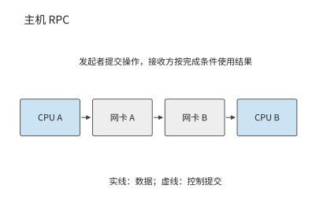

*图 7-15：主机 RPC 的参数从 CPU A 所在主机出发，经网卡和网络到达 CPU B 所在主机，由远端执行请求。箭头表示参数数据路径，返回结果沿反方向传送。*

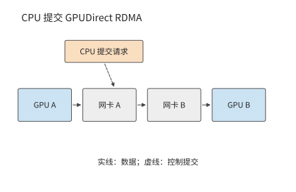

*图 7-16：数据从 GPU 内存直接经过网卡到达远端 GPU 内存；虚线表示 CPU 提交请求，数据载荷无需经过 CPU 内存。映射和访问权限预先建立。*

数据绕过主机内存之后，还可以进一步改变由谁发起。图 7-17 中 GPU 自己发起对端内存访问，省去了每次都由 CPU 提交的交接。

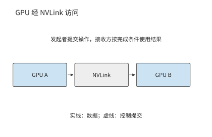

*图 7-17：GPU 通过 NVLink 访问对端 GPU 内存，由发起的 GPU 执行已授权的访问。*

图 7-18 把同样的发起与完成关系放到 UB 的异步访问接口上。沿实线追踪载荷，沿提交与完成关系追踪控制，便能区分数据传输和请求管理各自的开销。

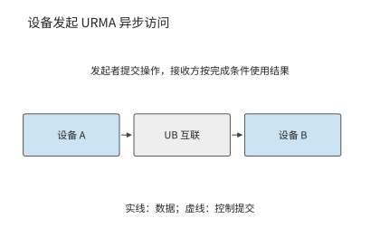

*图 7-18：设备通过 URMA 提交异步读写，载荷经过 UB 互联到达目标设备；请求完成后按接口规定检查完成状态和结果。*

这一变化可以用第 7.2 节的传输时间公式解释。沿用第 7.2.2 节 50 GB/s 链路的算例，8 KiB 数据的传输时间约为 0.16 μs；若启动时间从 5 μs 缩到 2 μs，总时间就从约 5.2 μs 降到 2.2 μs，节省一半以上。64 MiB 的载荷本身要传约 1.3 ms，同样节省的 3 μs 就微不足道。因此，小数据量的传输应优先减少提交开销，大数据量的传输应优先提高带宽。

由主机统一组织通信，好处是能为各种程序提供通用的提交和完成处理机制。模型执行中，数据的生产者、消费者和就绪条件都很明确，因此可以把频繁的发起和完成处理放到设备一侧：系统预先建立地址映射和访问权限，之后由设备连续发起计算与通信，不必每次都经主机中转。收益就是上例中启动时间的缩短。

操作系统负责建立映射、设置权限和分配资源；设备负责已经授权的快速操作；完成通知把操作结果交回运行时。职责这样划分之后，设备上发起通信的线程本身也会限制吞吐。要分析这种限制，先要分清一次请求要等多久、等待期间能否发起其他请求，再计算单位时间内能处理多少项请求。

### 7.3.3 内存语义：Load／Store 与 Read／Write

要分清这两项，先区分访问的表达方式。远端访问有两种常见表达：处理器的读取／写入指令（Load／Store），以及显式的异步读取／写入请求（Read／Write）。两种方式都需要记录尚未完成的请求，区别在于由谁管理这些记录。

Load 的结果可以直接成为后续指令的输入。处理器记录这条依赖，并在等待期间执行其他独立指令。异步请求则把目标地址、长度和完成条件放入队列，软件可以连续提交多项工作，在使用结果之前等待相应请求完成。前者把依赖交给指令执行机制，后者把依赖交给事件和运行时。本书把 Load／Store 称为同步访问，是强调指令依赖由硬件管理，并非指处理器每次只能有一个访存在途；现代处理器可以并行执行多个独立 Load，Store 也可以先进入缓冲区。

| 比较项 | Load／Store | 异步 Read／Write |
|---|---|---|
| 发起与路径 | 处理器指令，经地址映射到可达内存；UB 可由片上控制器承接 | 提交地址、长度等请求；经队列、门铃或设备发起接口推进 |
| 依赖与完成 | 硬件跟踪 Load 的消费者；Store 的远端可见性另需顺序保证 | 运行时等待规定的完成事件，再使用结果或回收缓冲 |
| 常见适用范围 | 细粒度读取、指针访问、访问频繁且需要低提交开销的数据 | 激活、KV、权重等批量搬移及显式流水 |
| 并发限制 | 指令依赖、未完成访存槽位、地址转换与硬件资源 | 请求队列、完成队列、注册内存、软件或设备的提交能力 |
| 故障处理 | 依赖平台的超时、异常及内存故障机制 | 可按请求报告错误；仍须处理超时、部分写入和缓冲回收 |

两种接口都可以采用内存语义，但不能仅凭接口名称推断缓存一致性。单边 Read／Write 不要求远端应用逐次提交接收请求（Receive）来配对，仍需要事先授权和内存有效期；Load／Store 也不保证跨节点共享缓存自动一致。OpenURMA 实现的 Load／Store 路径不维护跨节点的缓存一致，写入、发布、读取之间的依赖由应用自己安排。其省去的 PCIe 往返来自控制器位置和请求路径的改变，把软件接口改名为 Load 并不能得到同样的收益。[^ub-design]

**一次远程读取的延迟分解。** 把一次 64 B 远程读取的关键路径拆成若干阶段，为每个阶段给定延迟，各阶段之和就是这次读取的总时间。这里比较三条路径：经 PCIe 外设网卡的异步读取，经片上总线控制器的异步读取（UB 的 URMA 接口），以及经片上总线控制器的 Load 指令。给定条件如下：一次片上总线穿越 30 ns；一次 PCIe 门铃写 150 ns，一次 PCIe DMA 读 500 ns、写 250 ns；线路单程 100 ns；目标端内存行命中（要读的数据所在的 DRAM 行已经打开）30 ns；网卡流水线按 322 MHz 时钟的周期数换算，外设网卡 9 个周期，UB 异步路径 25 个周期，Load 路径 8 个周期；接口库提交、构造请求描述符和轮询完成记录属于软件开销。下表按关键路径的先后列出各阶段，空格表示该路径没有这个阶段。

| 阶段 | 类别 | PCIe 外设网卡 | UB 异步读取 | UB Load |
|---|---|---:|---:|---:|
| 接口库提交 | 软件提交 | 50 | 50 | |
| 构造请求描述符 | 软件提交 | 30 | 30 | |
| 门铃写 | PCIe 穿越 | 150 | | |
| 网卡 DMA 读取描述符 | PCIe 穿越 | 500 | | |
| 片上总线提交 | 片上总线 | | 30 | 30 |
| 网卡发送流水线 | 网卡流水线 | 28 | 78 | 25 |
| 线路去程 | 线路 | 100 | 100 | 100 |
| 目标端网卡接收流水线 | 网卡流水线 | 28 | 78 | 25 |
| 目标端网卡 DMA 读主机内存 | PCIe 穿越 | 500 | | |
| 目标端片上总线访存 | 片上总线 | | 30 | 30 |
| 目标端内存行命中 | 内存与完成 | 30 | 30 | 30 |
| 目标端网卡发送响应 | 网卡流水线 | 28 | 78 | 25 |
| 线路回程 | 线路 | 100 | 100 | 100 |
| 网卡接收响应 | 网卡流水线 | 28 | 78 | 25 |
| 响应载荷 DMA 写 | PCIe 穿越 | 250 | | |
| 完成记录 DMA 写 | PCIe 穿越 | 250 | | |
| 片上总线完成 | 片上总线 | | 30 | 30 |
| 完成队列轮询 | 内存与完成 | 70 | 5 | |
| 接口库轮询 | 内存与完成 | 30 | 30 | |
| 序号分配串行化 | 内存与完成 | 50 | | |
| **合计（推导）** | | **2222** | **746** | **419** |
| 仿真测得 | | 2236 | 757 | 500 |

表中网卡流水线的时间已经取整，合计按取整前的值相加。经 PCIe 外设网卡的路径合计 2222 ns，其中五次 PCIe 穿越占 1650 ns；UB 异步路径没有 PCIe 阶段，合计 746 ns；Load 路径连软件提交和轮询也省去了，合计 419 ns。图 7-19 把三条路径按阶段类别画成堆叠条形。笔者的 OpenURMA 实现在两节点周期级仿真中、相同条件下测得 2236、757 和 500 ns，与推导值相差 14、11 和 81 ns。差值来自仿真器在模块之间传递数据的固定开销；Load 路径的阶段最少、总时间最短，这项开销所占的比例也就最大。[^ub-fabric]

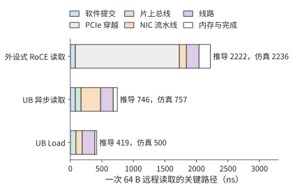

*图 7-19：三条路径的关键路径按阶段类别堆叠。经 PCIe 外设网卡的路径中，浅灰色一段是五次 PCIe 穿越；两条片上总线路径没有这一段，Load 路径还省去了软件提交和完成轮询。条形右侧标出推导值和仿真值。*

PCIe 外设网卡多出的阶段，不是九处各自可以优化的低效环节，而是三个结构性原因造成的。第一，请求必须先写成主机内存里的描述符，再由网卡读取，因此有接口库提交和构造描述符两个阶段；第二，网卡和处理器各有自己的地址空间，因此有门铃写、描述符 DMA 和目标端 DMA 三个阶段；第三，操作完成后必须跨地址空间通知处理器，因此有响应 DMA、完成记录 DMA 和两次轮询。控制器接到片上总线上以后，第二类阶段合并成一次片上总线穿越；改用 Load 指令以后，处理器自身的依赖跟踪取代了完成通知机制，第一类和第三类阶段随之消失。

还有第四条路径：网卡仍是 PCIe 外设，但请求描述符由网卡内的处理器构造并取用，即第 6.4.4 节的第三种发起位置。按同一张表推算，这条路径省去门铃写和网卡 DMA 读取描述符两次穿越，共 650 ns；软件提交与构造请求描述符的 80 ns 改在网卡处理器上完成，按同样取值计；载荷 DMA 写、完成记录 DMA 写和目标侧的 DMA 读仍然保留。合计约 1572 ns，落在外设式的 2222 ns 与片上总线路径的 746 ns 之间。省去的是控制路径上的穿越，省不去的是数据和完成通知必须跨越两个地址空间。这条路径没有做仿真，只按表中取值推导。

线路时延变化时，三条路径的差距也随之变化。每条路径的总时间都等于固定开销加上两倍的线路单程时延 $L$：PCIe 外设网卡为 2022 ns 加 $2L$，UB 异步路径为 546 ns 加 $2L$，Load 路径为 219 ns 加 $2L$。图 7-20 画出 $L$ 从 50 ns 到 500 ns 的情形：三条直线斜率相同、截距不同，绝对差距始终约为 1.8 μs，相对差距则从 $L=100$ ns 时的 5.3 倍缩小到 $L=500$ ns 时的 2.5 倍。线路越短，控制器位置带来的相对收益越大，所以这项收益在超节点内部最明显；在跨越数据中心的长链路上，线路时延本身成为总时间的主要部分。这两部分性质不同。$2L$ 由信号传播速度决定，任何路径都省不掉，是一次远程读取的物理下限；截距中高出 Load 路径的部分是抽象层的代价，其中五次 PCIe 穿越就占 1650 ns。推导值与仿真值相差的 14、11 和 81 ns，则属于第 1.3.4 节所说的第一类差距：模型漏计了仿真器模块之间的固定开销，补上这一项差距就消失了，不必再去找实现开销。

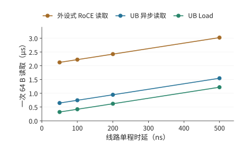

*图 7-20：一次 64 B 读取的总时间随线路单程时延的变化。三条直线的斜率都是 2，截距是各自的固定开销；路径之间的差距来自固定开销，不随线路时延变化。*

下面用相同的访问延迟比较并发和依赖，再讨论数据复用。前者适用于两类接口，后者是“按需远程访问还是预先搬回本地”的放置选择；直接远程读取不等于 Load，预先搬回也不对应某一种特定接口。

考察八个互不依赖的远端读取，硬件能同时处理八项，每项按上表经 PCIe 外设网卡的路径要等约 2.2 μs，提交开销已计在其中。逐个“发出、等待、使用”要约 17.8 μs；八项一起发出，结果约 2.2 μs 后一起到达。若第一次读取返回的是第二次的地址，第二次又返回第三次的地址，就只能等上一次返回后再发下一次。能同时发起多少次读取，取决于有多少个地址已知且互不依赖的请求。

并行读取利用了不同请求之间的独立性。如果多次请求访问的是同一份数据，还可以利用另一种关系：第一次访问时将数据搬到本地，后续读取反复使用该副本。假设消费者将完整读取一个 144 MiB 的不变 KV 快照，本地有足够空间容纳它。远程读取和搬回都经过本章的网卡，每方向 50 GB/s；本地读取按 H100 的 HBM 带宽 3350 GB/s 计。计入启动与目的端写入，一次远程读取约为 3.02 ms，一次搬回的固定成本约为 3.07 ms，之后每次本地读取约为 0.046 ms。[^remote]

令复用次数为 $r$，两条路径的时间近似为

$$
T_{\mathrm{remote}}=3.02r\ \mathrm{ms},\qquad
T_{\mathrm{stage}}=(3.07+0.046r)\ \mathrm{ms}.
$$

搬回后读取更快的条件是 $r>3.07/(3.02-0.046)\approx1.03$，即从第二次完整读取开始获益。只读取一次时，直接远程读取略快（3.02 ms 对 3.12 ms）；读取四次时，先搬回本地可将总时间从约 12.1 ms 缩短至 3.3 ms，网络只需传一次快照，传输量从 576 MiB 降至 144 MiB。图 7-21 画出两种使用路径，图 7-22 画出累计耗时的交点。

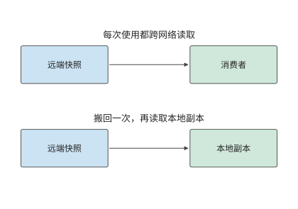

*图 7-21：每次使用都访问远端，会重复传送同一份数据；下半图先搬回本地，再多次复用。两种路径处理同一份不变快照。*

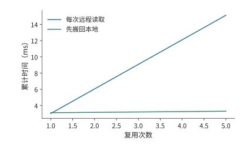

*图 7-22：每次读取完整 144 MiB 快照时，两种方法的累计耗时。先搬回本地需要一次固定成本，从第二次读取开始节省时间。*

两条曲线的差别来自“先付一次搬移成本，还是每次都跨网络读取”。接下来改变每次读取的范围。若一次调用只访问快照的少量位置，就可以按引用传递，让远端函数按需读取数据。设每次仅访问快照的 10%，而搬回方案仍复制全部快照。此时，按需远程读取的成本变为约 $0.302r$ ms，搬回后每次本地访问约为 0.0046 ms，交点约在 10.3 次，因而从第 11 次读取开始，先搬回本地的方案才会节省总读取时间（图 7-23）。

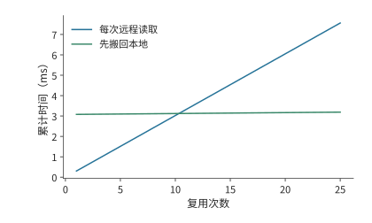

*图 7-23：每次远程读取和本地读取都只访问 10%，但搬回时仍复制全部快照；因此需要更多复用才能抵消固定成本。*

因此，应根据访问范围和复用次数，决定按需远程读取还是将整个快照搬回本地。URPC 是统一互联上的远程过程调用接口，以函数调用的形式提供远端访问，支持这种方式；按引用传递让被调用方只取实际需要的数据。第 7.4 节将说明何时通知其他设备使用这些对象，以及何时释放对象占用的空间。[^ub]

### 7.3.4 并发与吞吐模型

第 7.3.3 节用复用减少远端读取的次数；仍要经过网络的请求，则要让链路始终有数据可传。本节分析本章算例中一张网卡每方向 50 GB/s 的路径需要多少个并发请求。**请求槽位**是保存一项未完成请求的地址、长度和状态的记录：提交时分配，完成状态处理完后释放，释放前不能供新请求使用。假设每次远程访问传输 256 B，从发起请求到释放请求槽位需要 2 μs。链路在这 2 μs 内可以传送 100,000 B，相当于 390.6 次访问的数据量。为了让等待期间始终有数据可传，至少要维持 391 个在途事务，即已发出但尚未处理完的请求。图 7-24 画出一个槽位从分配到释放的过程。

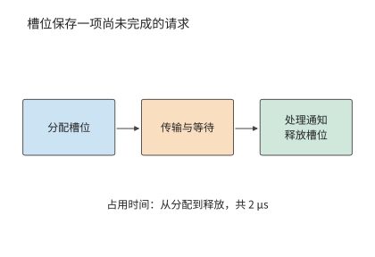

*图 7-24：一项请求从分配记录开始占用槽位，经历传输与等待，完成状态被处理后归还记录。这里的 2 μs 覆盖完整占用区间。*

一般地，每事务载荷为 $m$，槽位占用时间为 $T$，目标带宽为 $B$，所需并发为

$$
N\ge\left\lceil\frac{BT}{m}\right\rceil.
$$

**带宽—时延积**是目标带宽与等待时间的乘积，表示在等待期间持续利用链路所需的在途数据量。再除以每事务载荷，就得到请求数量。链路越快，等待越长，每次返回的数据越少，系统就需要同时记录更多尚未完成的请求。

**例题 7.3：远程读取的在途槽位不足，为何无法用满出口带宽？** 每个事务传输 256 B，占用槽位 2 μs，路径带宽为 50 GB/s。求使用 128 个活跃槽位时的有效读取带宽；再设请求处理单元连续两项事务的最短启动间隔为 18.6 ns（本节后文 RoCE 可靠连接实现的取值），求同时受槽位数量与启动速率限制时的有效带宽上界。

解答：128 个槽位每 2 μs 周转一次，提供的载荷为 $128\times256$ B，因此最多约为 16.4 GB/s。若只让一个事务在途，则为 0.128 GB/s。分配了多少槽位与实际同时使用多少槽位，是两个不同的数量。

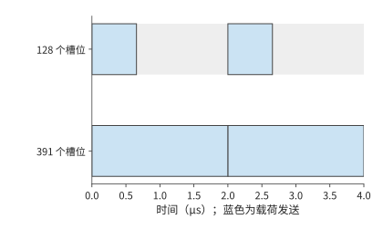

*图 7-25：128 个槽位在约 0.66 μs 内全部用完，要等最早的槽位在 2 μs 释放后继续提交。391 个槽位足以覆盖等待。蓝色表示载荷发送，灰色表示链路空闲。*

图 7-25 的灰色区间来自槽位尚未释放；即使槽位足够，请求也可能来不及提交。请求处理单元若每 18.6 ns 启动一项事务，每秒最多启动约 5400 万项，256 B 事务只能提供约 13.7 GB/s，比 128 个槽位给出的 16.4 GB/s 还低。即使增加到 391 个槽位，请求处理单元也来不及按这个速度提交请求。将路径带宽、在途请求数与启动速率三项约束合并，得到

$$
B_{\mathrm{eff}}\le
\min\left(B_{\mathrm{path}},\frac{Nm}{T},\frac{m}{\delta}\right),
$$

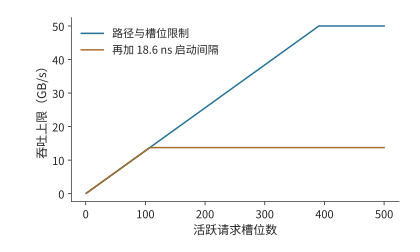

*图 7-26：蓝线只考虑链路和槽位，橙线再加入每 18.6 ns 发起一次请求的约束。增加槽位使蓝线升高，橙线仍受约 13.7 GB/s 的提交速率限制。*

其中，$T$ 是一项请求占用槽位的时间，$\delta$ 是连续两项请求之间的最短启动间隔。前者决定槽位多久可以复用，后者决定每秒最多能发起多少请求。图 7-26 对比了只考虑槽位与再加上发起速率约束时的有效带宽。[^window]

**讨论：远程读取需要多少并发才能达到 50 GB/s？** 保持 256 B 事务，启动间隔需缩至 $256/(50\times10^9)=5.12$ ns，比下文 UB 实现的 6.2 ns 还短，并至少维持 391 项在途工作。另一条路是合并相邻访问：每次传输改为 4 KiB 后，启动间隔只要不超过 82 ns 就能达到 50 GB/s，18.6 ns 的间隔对应约 220 GB/s，远超链路；在等待时间为 2 μs 时，只需 25 个槽位就能支持 50 GB/s。前者提高事务率，后者让每次请求传输更多数据，降低单位字节的提交开销。

启动间隔 $\delta$ 的一个具体来源见 OpenURMA 的实现：发送流水线中最慢的一级每 2 个时钟周期接受一项请求，在 322 MHz 下 $\delta\approx6.2$ ns，每秒最多约 1.61 亿项请求。用同一工具链实现的 RoCE 可靠连接对照中，每条连接的序号分配存在先后依赖，每项请求要占 6 个周期，$\delta\approx18.6$ ns，每秒约 0.54 亿项。仿真用 256 项的连续突发测得的持续速率分别为每微秒 150 项和 54 项：RoCE 与推导的 53.7 项一致，UB 比推导的 161 项低约 7%；突发加长到 1000 项时，UB 升到每微秒约 159 项，与推导值相差约 1%。代入 $m/\delta$：每项 64 B 时两者分别为 10.3 GB/s 和 3.4 GB/s，每项 4 KiB 时为 660 GB/s 和 220 GB/s，后两个数都远高于本章 400 Gbit/s 网卡每方向的 50 GB/s。即小载荷时瓶颈在请求速率，大载荷时瓶颈才在线路。[^ub-fabric]

**读与写为什么受不同限制。** 式中的 $N$ 和 $\delta$ 在 PCIe 上有明确的来源。PCIe 是分组交换的总线，每次 DMA 读或写都是一个事务层报文（TLP）。写是 posted 事务：报文带着地址和数据发出，发出即完成，不等回应。读是 non-posted 事务：请求报文带一个标签发出，数据由一个或多个完成报文带回，靠标签对应到原来的请求。发起方同时在途的读请求数受两项限制：接收方为每类事务预先发放的信用，以及发起方能分配的标签数。图 7-27 画出两种事务。

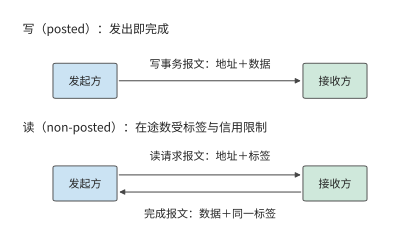

*图 7-27：写是 posted 事务，一个报文发出即完成；读要先发带标签的请求报文，再等带同一标签的完成报文把数据送回，在途的读不能超过标签数和信用数。*

信用与标签的限制在实际平台上就能观察到。笔者在 KV-Direct 中测量过这两项限制。所用的可编程网卡经 PCIe Gen3 x8 访问主机内存，理论带宽 7.87 GB/s；每个 64 B 的 DMA 读写都要带 26 B 的报文头和填充，按报文开销算的上限是 5.6 GB/s，即每秒 8700 万次操作。随机 DMA 读的往返约 1050 ns，要用满链路需要 92 个读同时在途；但主机端为 DMA 读发放的信用只有 84 个，FPGA 的 DMA 引擎又只支持 64 个标签，于是在途读最多 64 个，除以 1050 ns 的往返，上限约为每秒 6100 万次；实测 64 B 随机读每秒 6000 万次，与这个上限基本一致。写不需要回应、不占标签，实测接近报文开销给出的上限。图 7-28 把这几道上限画在一起：读受在途数限制，写受报文处理速率限制，正是式中 $Nm/T$ 与 $m/\delta$ 两项分别起作用的例子。让网卡自己流水式地完成地址计算、访存和结果处理，就是为了在等待一个读结果时继续发出其他请求。这组数字也体现了第 1.3.4 节的检查顺序：先后用链路带宽、报文开销、在途标签三道上限修正模型，直到与实测只差约 1.6%；到这一步，模型已无漏项，余下的差距不必再追究。[^kv-direct]

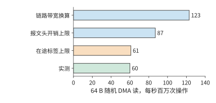

*图 7-28：KV-Direct 平台上 64 B 随机 DMA 读的上限与实测。链路带宽换算为每秒 1.23 亿次，报文头开销把上限压到 8700 万次，64 个标签除以 1050 ns 往返只允许 6100 万次；实测 6000 万次，说明在途标签数是这个平台上读的瓶颈。*

同一条 PCIe 链路被两类流量共用时，这一差别会变成不对称的争用。设 GPU 的 PCIe 链路在进入 GPU 的方向上同时有两路流量：网卡把远端数据以 posted 写直接送进 GPU 内存；GPU 的复制引擎正在把主机内存的数据复制到 GPU，它发出的是读请求，数据以完成报文回到 GPU。链路一旦饱和，posted 写按协议必须持续推进，而读这一方的在途标签用完后就发不出新请求，只能等完成报文回来，分到的带宽远小于一半。离开 GPU 的方向则不同：GPU 向主机的复制是 GPU 发出的 posted 写，远端读 GPU 内存则要 GPU 回复完成报文，两路都要先从 HBM 取出数据、再经 GPU 的发送通路送上链路，瓶颈在 GPU 内部而不在链路，两路的退化更接近。图 7-29 画出两个方向。判断这类争用时，先分清每一路是 posted 写还是带完成的读，再看它们在链路的哪一侧、经过哪个共用部件汇合。后来的 PCIe 性能测试工具 rPCIeBench 对共享 PCIe 路径的研究也显示，在途工作量与入口竞争会改变带宽分配。[^pcie] 可以用上式判断瓶颈：是链路带宽已用尽，是请求槽位尚未释放，还是请求发起速率太低。

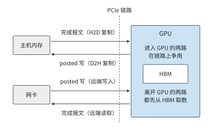

*图 7-29：进入 GPU 的方向上，网卡的 posted 写与主机内存返回给复制引擎的完成报文争用链路，前者不等回应，后者受在途标签限制。离开 GPU 的方向上，D2H 复制的 posted 写与远端读取的完成报文都要先从 HBM 取数，共用 GPU 内部的发送通路。*

分层归约减少了跨服务器载荷，并发提交让网络连续传输；程序还需要知道何时可以使用这些数据，以及何时可以释放占用的空间。

> **实验 7-8 · 延伸：用满远程读取带宽需要多少在途事务**
>
> 在例题 7.3 中，将槽位的占用时间从 2 μs 增为 4 μs；该时间从请求发出算起，到槽位可以复用为止。分别求每次传输 256 B 和 4 KiB 时，维持目标带宽所需的在途事务数。固定 18.6 ns 启动间隔，求达到 50 GB/s 所需的最小事务大小；再换成 UB 实现的 6.2 ns 重算。最后将独立地址改成指针链，解释完成整条指针链的读取所需时间如何随链长增长。

## 7.4 数据交接、顺序与状态管理

### 7.4.1 数据分片的生成、使用与缓冲区复用

数据送到以后，接收方可能还没开始用，也可能正在使用。这像把装有材料的托盘交给下一道工序：托盘已经送到，对方仍需要时间处理其中的材料，在用完之前不能把托盘中的材料换成下一批。对应到通信，发送完成、数据对接收方可见、接收方消费完成，需要分别判断。第 7.3.4 节把槽位占用时间当作已知条件，本节沿这些事件确定缓冲区何时可以释放。

在分层归约中，卡 0 将本地分片交给卡 8，卡 8 把它与自己的分片相加。发送方要知道源缓冲何时可以改写，接收方要知道目的缓冲何时可以读取，下一次写入还要知道这块目的缓冲何时可以覆盖。三者对应不同的事件。

一份分片从生成到释放，要经过以下过程：生成数据、写入远端、使数据对接收方可见、发出就绪通知、读取并处理数据，最后释放空间。源缓冲能否复用，要看接口的完成语义是否保证传输不再读它；接收方要开始用数据，先要保证写入对它已经可见，并按约定发布和查看就绪通知；目的缓冲能否覆盖，还要等接收方用完其中的数据。网络传输完成本身不能代替“用完了”的通知。

例如，发送在 5 μs 完成，消费者在 8 μs 开始读取、12 μs 结束。发送方在发送完成后就可以复用源缓冲，目的缓冲则要到 12 μs 才能覆盖。如果下一次写入在 6 μs 覆盖目的地址，消费者读到的就是下一份数据；网络传输的每个字节都正确，接收程序却使用了错误的数据。

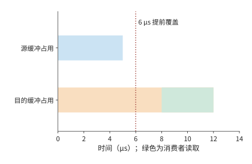

*图 7-30：源缓冲占用到 5 μs 发送完成；目的缓冲持续占用到 12 μs 消费者用完。绿色为 8–12 μs 的读取区间。虚线标出 6 μs 提前覆盖目的地址的错误操作。*

图 7-30 中两条占用区间结束于不同事件。把“必须等哪个事件发生”画成箭头，就得到描述正确交接的依赖图：节点表示工作，边 $u\to v$ 表示 $v$ 必须在 $u$ 完成后开始。对每个节点，取所有前驱的最晚完成时刻，再加自身执行时间，就得到其完成时刻；从起点到终点耗时最长的那条链就是关键路径。

这一模型同时解释正确性与性能。缺少“数据可见→发出通知”的依赖会让消费者读到未发布的数据；多出“无关传输也必须等待”的边会增加等待。状态管理的任务，是记录哪些节点已经完成、哪些依赖已经满足，以及哪些资源可以归还。

缓冲区的归属也影响复制次数。通信库若为发送另设一块已注册的缓冲区，计算结果就要先复制进去，元数据还要与数据打包，接收方再拆开、搬到连续的区域，这些复制和打包都占用 SM 时间。让计算直接写入已注册的缓冲区可以省去这一步，但本节的事件顺序随之变严：计算写完并对网卡可见之后才能发起发送，发送真正结束之前不能覆盖这块缓冲，接收方也要按同样的规则判断何时可以读、何时可以回收。[^ep-buffer]

### 7.4.2 事务层与传输层分离：Jetty 与共享状态

这些依赖和完成状态需要由系统保存。每增加一条通信关系，是否都要再保存一套相同的传输记录？十六个参与者之间的归约只涉及少量通信关系。系统扩展后，一个进程有多个线程，每个线程又访问多个远端目标，关系数量便按乘积增长。应用需要记录谁提交了请求、完成通知应发送给谁；传输层需要维护序号、确认、重传和拥塞状态。前者标识应用，后者保证数据可靠传输。

**应用端点**是程序提交通信和接收完成通知的逻辑身份；**传输状态**则保存序号、确认、重传与发送速率等通信进度。取 64 个应用端点，每个访问 128 个远端目标，共有 8192 条关系。如果为每条关系单独保存一份 1 KiB 的传输状态，仅传输部分就占 8 MiB。若指向同一目标的关系共享一份传输状态，只需 128 份，共 128 KiB。节省的是为同一目标的不同通信关系分别保存的传输状态。

应用身份仍需保留。每个端点占 256 B，共 16 KiB；每条关系的绑定信息占 64 B，共 512 KiB。加上这些部分，逐关系独占的状态总量约为 8.52 MiB，按目标共享约为 0.64 MiB。传输状态的份数降至原来的 1/64，状态总量降至原来的约 1/13。[^states]

设端点数为 $L$、目标数为 $P$，每个端点、每条关系的绑定信息和每份传输状态分别占 $e,r,t$ bytes，则

$$
S_{\mathrm{private}}=Le+LP(r+t),\qquad
S_{\mathrm{shared}}=Le+LPr+Pt.
$$

OpenURMA 论文用另一种口径描述这种分离：一个本地接口上有 $L$ 个应用端点、要访问 $P$ 台远端主机时，核心的端点记录和传输上下文按 $O(L+P)$ 增长；如果每条应用关系都独占一条可靠连接，这部分就按 $O(LP)$ 增长。这一结论只针对可以共享的核心硬件状态，软件映射、权限、未完成请求和缓存并不都只占加法量级的空间。上式保留了 $LPr$ 一项，因为本教学方案显式计入了逐关系的绑定记录；本小节末尾再用实现中的记录尺寸重新计算一次。[^ub-design]

两个式子直接给出了共享节省的空间：$LPt$ 变成 $Pt$，应用关系的 $LPr$ 仍在。UB 把 Jetty 与传输通道分开（第 6.5.5 节），采用的就是这种设计：同一份传输状态可以服务多条应用关系。[^ub]

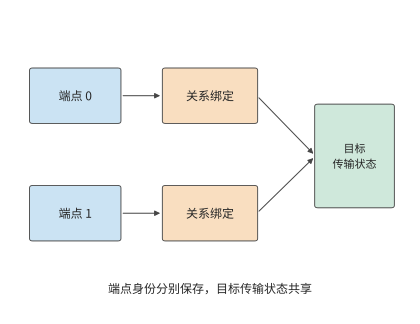

*图 7-31：两个应用端点分别保存身份与绑定记录，关系绑定指向同一目标的共享传输状态。共享部分维护传输进度，端点仍能区分各自请求。*

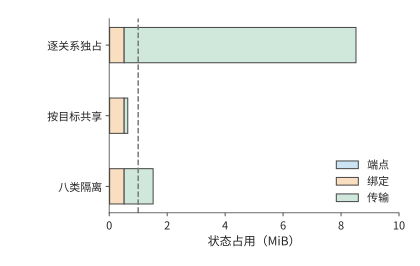

*图 7-32：64 个端点访问 128 个目标。蓝色为端点记录，橙色为关系绑定，绿色为传输状态。虚线为 1 MiB 容量；划分八个隔离组时，为各目标保存八份独立的传输状态。*

图 7-31 中多条关系复用同一份传输状态，节省了存储，也可能争用这条通道的发送窗口、调度机会和恢复资源。分层不要求所有事务排进一条全局有序的队列，应用事务的执行顺序、完成顺序与报文到达顺序仍要分别规定。若实现里用共享的先进先出队列或顺序等待，丢包和长请求就会造成队头阻塞（head-of-line blocking，队首的请求停住时，排在后面的无关请求也只能等待）；让独立的事务继续推进可以缩小影响，但消不掉对共享带宽和窗口的竞争。一条通信关系的大量未完成请求占用共享队列，其他关系的短请求就必须等待。若为不同业务建立 $K$ 组独立的传输状态，总状态变成

$$
S(K)=Le+LPr+KPt.
$$

按上述配置计算，固定部分为 528 KiB，每增加一组独立传输状态，就增加 128 KiB。1 MiB 的存储空间最多容纳三组独立传输状态；四组需要 1040 KiB，已经超出容量；八组约需 1.52 MiB。图 7-32 画出这几种共享策略的状态容量。因此，业务隔离需要在存储容量内安排：为关键业务单独分配传输状态，让其他业务共享，可以减少关键业务受到的干扰。

除了在不同关系之间共享，状态还可以分层存储。完整状态放在主存，频繁使用的部分缓存在网卡片上。共享可以减少重复记录，使同样大小的缓存容纳更多通信关系。经常使用的状态留在缓存中，也就减少了从主存读取状态的次数。这样，节省状态空间还可以降低请求处理开销。

**实现中的记录尺寸与状态总量。** 前述 256、64 和 1024 B 是本节给定的取值。OpenURMA 实现的状态结构给出了一组可以核对的尺寸：每个 Jetty 20 B，每个已注册的内存段 32 B，每条传输通道 56 B；作为对照的 RoCE 可靠连接实现为每条连接保存 512 B 的 QP 上下文。设本地 $N$ 个端点访问 $M$ 个远端端点，两种组织方式下网卡保存的状态为

$$
S_{\mathrm{pair}}=512NM+32N,\qquad
S_{\mathrm{UB}}=52N+56M.
$$

与前面的公式对照，这里 $e=52$、$t=56$，而 $r=0$：该实现把关系绑定放在软件映射里，网卡不为每条关系保存硬件状态。$N=M=1024$ 时，逐对连接需要约 512 MiB，端点加通道只需 108 KiB，相差约 4855 倍；即使把 Jetty 记录补齐规范中的全部字段（48 B），比值仍在三千倍以上。图 7-33 用对数坐标画出两条曲线：一条斜率为 2，一条斜率为 1，二者的比值随 $N$ 线性增长。

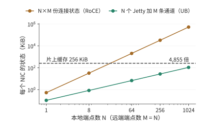

*图 7-33：N 个本地端点访问 M = N 个远端端点时，两种组织方式下网卡保存的状态。逐对连接在 N 略大于 20 时就超过 256 KiB 的片上缓存，端点加通道到 N = 1024 时仍不到缓存的一半。*

**状态总量与片上缓存溢出。** 网卡把上下文缓存在片上，容纳不下的部分留在主机内存。取缓存容量 256 KiB，逐对连接在 $512N^2+32N>262144$、即 $N\ge23$ 时溢出；端点加通道在 $108N>262144$、即 $N\ge2428$ 时溢出。溢出以后每次操作都要重新读取上下文，代价取决于上下文放在哪里：PCIe 外设网卡从主机内存读取，发起端和目标端各做一次 PCIe DMA 读，每次操作增加约 1000 ns；片上总线控制器从本地内存读取，两端各做一次片上总线穿越和一次内存访问，增加约 200 ns。图 7-34 把第 7.3.3 节推导的两条路径的延迟画成活跃端点数的函数。训练中的全交换通信通常涉及几十到几千个端点，正好落在这一区间；在这一区间里，逐对连接的每次读取都要付出重新读取上下文的代价。笔者的仿真器按条目数而不是字节数判断溢出（RoCE 512 条，UB 2048 条），因此把 UB 的溢出点放在 1024 个端点；两种口径下结论相同：端点加通道的溢出点晚一个数量级以上，溢出后的代价也小一个数量级。[^ub-fabric]

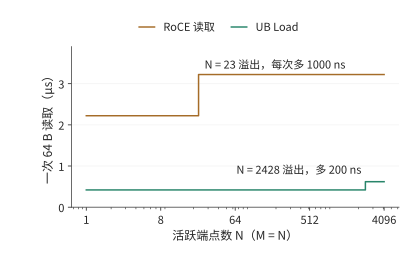

*图 7-34：一次 64 B 读取的延迟随活跃端点数的变化，片上缓存 256 KiB。逐对连接在 23 个端点处上升 1000 ns，端点加通道在 2428 个端点处上升 200 ns。横轴为对数坐标。*

> **实验 7-9 · 延伸：共享传输状态能支持多少隔离组**
>
> 保持 64 个端点，只访问一个远端目标，分别计算独占与共享传输状态时所需的总存储空间。再将活跃目标数量改为 128 个，将可用存储空间提高到 2 MiB，求最多容纳多少个完整的隔离组。比较增加端点数和增加目标数对固定状态与传输状态的影响。最后改用实现中的记录尺寸（Jetty 20 B、传输通道 56 B、连接上下文 512 B），求片上缓存为 1 MiB 时两种组织方式各自的溢出端点数。

### 7.4.3 操作依赖与故障隔离

第 7.4.2 节通过独立传输组减少不同业务之间的干扰。同一组操作内部也可能出现不必要的等待，这取决于系统强制哪些操作依次完成。以卡 0 发布分片的过程为例。操作 A 写数据 D，操作 B 发布“D 已就绪”的通知，操作 C 传送另一块无关数据。要正确使用 D，必须保持 A→B 的顺序，C 可以使用另一条独立传输通路。

**例题 7.4：减少顺序约束能让哪些操作更早完成？** A 写入需 20 μs，随后恢复需 80 μs，恢复结束后 D 可见；B 需 2 μs；C 需 10 μs。比较两种安排：A、B、C 依次完成，以及仅要求 A 完成后才能执行 B。

解答：写入、恢复和通知这一依赖链的耗时是 $20+80+2=102$ μs。串行安排让 C 等到 102 μs 才开始，全组在 112 μs 完成。保留必要依赖时，C 从起点开始，10 μs 完成；发布链仍到 102 μs 才结束。全组提前 10 μs，C 却提前 102 μs。图 7-35 和图 7-36 分别画出这两种安排。

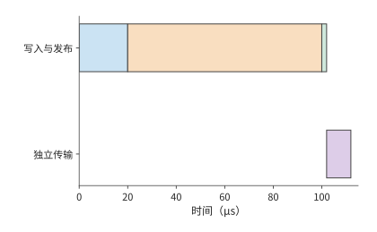

*图 7-35：将独立传输也排在发布之后：先写入 20 μs，恢复并使数据可见 80 μs，通知 2 μs，再执行独立传输 10 μs。*

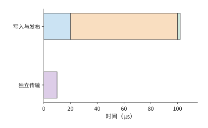

*图 7-36：写入、恢复、通知仍依次进行；使用独立资源的传输从 0 μs 开始。蓝色为写入，橙色为恢复，绿色为通知，紫色为独立传输。*

恢复时间若增至 200 μs，串行安排中的 C 要到 232 μs 才完成，独立安排中的 C 仍在 10 μs 完成。去掉多余的依赖，就把恢复造成的停顿限制在真正需要这份数据的那条链上。对等着 C 的下游任务来说，这种隔离比全组提前 10 μs 重要得多。[^ordering]

全局顺序让上层容易描述操作的先后关系，也把独立工作放进了同一条等待链。计算图已经明确 A→B 的发布依赖后，接口和运行时可以围绕这条依赖提供顺序保证，让 C 独立推进。应用提供更准确的依赖信息，网络据此只为相关操作保证顺序，既能保证接收方收到通知后读到已经写入的数据，也能减少不必要的等待。

再假设所有操作共用一个处理单元：从 A 开始写入到 B 完成通知，该单元一直被占用，C 只能随后执行。此时资源使用本身增加了发布链到 C 的顺序边，两种安排都到 112 μs 完成。程序依赖和资源依赖因此要画在同一张图里：减少程序中的顺序约束后，资源约束仍会限制并行程度。

**设计案例：按需指定顺序的硬件开销。** 笔者的 OpenURMA 实现把 UB 的四种顺序服务模式和三种执行标签放在同一条发送流水线上实现。周期级仿真显示：不论请求要求哪一种顺序，从提交到第一个报文出线都是 24 个周期；只有当请求明确要求等待前序操作完成时，顺序跟踪器才会让它等待，前序未完成的操作最多四项时，等待不超过 50 个周期，约 155 ns；不要求顺序的请求不承担这笔开销。更重要的是隔离效果：把一个发起方的请求停在等待前序操作的位置，另外四个发起方提交的 8 个不要求顺序的请求仍然在 78 个周期（约 242 ns）内全部发出，被停住的请求没有拖累其他发起方。作为对照，RoCE 可靠连接中同一个 QP 里的请求必须严格按序执行，一个请求等待，后面的请求就全部等待。这正是例题 7.4 里把 C 排在 A、B 之后的那种安排在硬件上的表现。[^ub-design]

> **设计背景：全局顺序如何简化复制与协作？**
>
> 笔者在 1Pipe 研究中探索过由网络提供全局全序的设计。所有参与者按同一顺序观察操作，上层的复制和协作就能使用更简单的顺序模型。进一步处理故障时，顺序与交付需要分别解决：发送方发到一半退出，系统要确定哪些节点已经收到；接收方永久退出，系统要决定哪些工作继续执行。这些问题要求把顺序保证与交付、恢复机制分开，并把应用真正需要的依赖清楚地表达出来。

上述例子要求写入完成后才能发出通知。接收方还必须在正确的时刻读取数据，否则即使通知顺序正确，也可能使用旧值。设 D 初值为 0，在 2 μs 更新为 1；就绪标志在 3 μs 可见。消费者在 1 μs 提前读 D，在 4 μs 读标志。此时它保存的是新标志和旧数据。即使到 5 μs 再按“标志、数据”顺序返回读取结果，保存下来的 D 仍是 0。

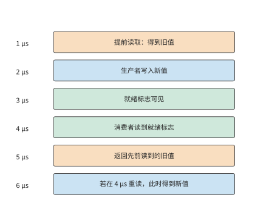

*图 7-37：按时间依次列出实际读取、数据更新、就绪通知和结果返回。5 μs 返回的仍是 1 μs 读到的旧值；若在 4 μs 发现冲突并重读，6 μs 得到新值。*

图 7-37 中，把表示结果返回时刻的空心点向后移动，并不会移动表示实际取值时刻的实心点。这一反例说明，顺序要求必须落实到读取数据的时刻。消费者可以在观察标志之后再读 D，也可以提前读、检查冲突并重读。若在 4 μs 发现冲突后重读需要 2 μs，就在 6 μs 得到正确数据。在接收方排序是把等待挪到了接收一侧，冲突检查则负责判断哪些提前读到的结果仍然有效。要靠顺序保证来简化编程，就必须保存这些状态并做相应的检查。

### 7.4.4 请求槽位的释放与背压

第 7.3.4 节的请求槽位要等软件处理完完成通知才释放，新请求才能使用它。第 7.4.1 节讨论的数据缓冲区有另外的使用期限：接收方尚未用完数据时，该缓冲区仍需保留。如果传输加快，完成通知却处理得不够及时，就会出现大量“操作已完成、槽位未释放”的请求。

取 16 次操作，每次传 8 KiB，最多每 1 μs 提交一次，提交后 5 μs 完成。若有 16 个槽位，最后一次在 15 μs 提交，20 μs 时全部传完。软件每 20 μs 读取并处理四条完成通知，16 条通知需要四轮，对应的槽位到 80 μs 才全部释放。

若只有八个槽位，最初八次提交迅速占满槽位。第九次提交要等到 20 μs 时软件处理完成通知、释放槽位之后，后续请求继续分批提交，全部传输到 48 μs 才结束。把槽位加倍，传输完成时刻从 48 提前到 20 μs，所有槽位释放完毕仍要到 80 μs。[^reclaim]

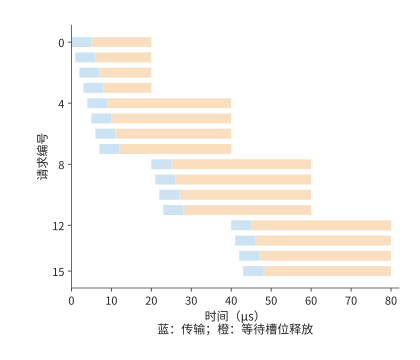

*图 7-38：蓝色表示提交到传输完成，橙色表示等待软件处理完成通知，橙色结束才释放槽位。所有请求的时刻取自事件记录。*

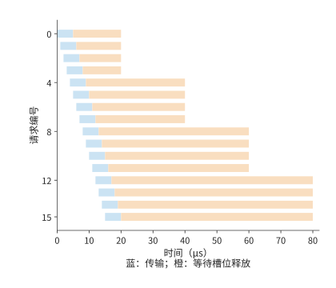

*图 7-39：增加槽位后，后续请求更早提交。完成通知仍每 20 μs 批量处理四项，最后一个槽位仍在 80 μs 释放。两图时间轴相同。*

对比图 7-38 和图 7-39，增加槽位让蓝色传输条带提前了，右侧较长的橙色等待却仍然存在。决定持续吞吐的，是这些槽位最终释放得有多快。用并发与吞吐模型看，处理完成通知的线程每秒只处理 $4/(20\times10^{-6})=200000$ 项；每项 8 KiB，对应约 1.64 GB/s 的持续处理能力。采用这样的操作大小，要达到一张网卡的 50 GB/s，平均每秒需处理约 610 万项，约每 0.164 μs 一项。增加槽位只能容纳短时间内突然增多的请求，持续负载需要提高完成通知的处理速率或扩大每项操作的载荷。

完成通知处理速度不足时，上游提交就要受到约束，这就是第 5 章的背压：请求槽位用满后，端点就暂停或放慢提交，直到有槽位释放；背压靠限制未完成请求数来控制上游，防止未完成的工作无限增长。若缓冲区要等远端程序用完数据才能释放，背压就会跨设备传播；许多工作共享传输状态时，传播范围还会更大。

发生故障后，也必须先结束旧请求，再释放它们占用的空间。取消请求之后，系统先停止新提交，再等待或隔离旧的在途访问，最后释放空间。否则，迟到的旧写入会覆盖新对象。给每次复用的对象分配新的版本号、撤销访问权、隔离失联端点，都是为了防止旧请求访问已经重新分配的空间。超时触发恢复后，系统要先确认旧请求已经结束，或阻止其继续访问，再复用空间。多个端点共享网络时，同样的到达速度与处理速度之差，会变成交换机里的队列。

> **实验 7-10 · 核心：放宽操作顺序如何减少等待并保持数据正确**
>
> 将例题 7.4 中独立操作 C 的耗时改为 50 μs，求两种安排的整组操作和独立操作的完成时间。再假设消费者收到通知后需要 30 μs 处理数据，标出目的缓冲区最早可以写入新数据的时刻。对旧值反例分别画出等待后读取、提前读取后重读两条执行路径。

## 7.5 共享网络中的拥塞与可靠性

### 7.5.1 从固定流量到随时间变化的需求

在前几节的配置上再增加一项使用两台服务器的训练作业，并把两项作业放到第 7.2.5 节的多轨拓扑上：每项作业的两台服务器分属不同的组（每组 32 台服务器），同一条 rail 上的跨服务器流量不再一跳到达，要经叶交换机的上联链路走脊层；两项作业在这条 rail 上的流被哈希到同一条 400 Gbit/s 的上联链路，每方向 50 GB/s。分层归约的跨服务器阶段让每张网卡以 50 GB/s 发送，两项作业的高峰重叠时，需求就超过了这条链路的传输能力。

**例题 7.5：平均只用掉 40% 的链路带宽，为什么仍然排队？** 两项作业每 100 ms 各有 20 ms 的通信高峰，高峰速率均为 50 GB/s，其他时间不发送。假设队列初始为空，作业按上述时间表发送数据，缓冲区足够大，可以保存所有积压。

解答：两项作业的平均总需求为

$$
\bar\lambda=2\times50\times\frac{20}{100}=20\ \mathrm{GB/s}.
$$

与 50 GB/s 相比，平均利用率只有 40%。但两个高峰同时开始时，到达速率比出口速率高出 50 GB/s，20 ms 内积压增长到

$$
Q_{\max}=(100-50)\ \mathrm{GB/s}\times20\ \mathrm{ms}=1\ \mathrm{GB}.
$$

高峰结束后，还需 $1\ \mathrm{GB}/50\ \mathrm{GB/s}=20$ ms 排空。两项作业在 20 ms 时停止发送，但出口还要再传输 20 ms 才能发完这些数据。把第二项作业推迟 20 ms，高峰完全错开，任意时刻只有 50 GB/s 到达，队列保持为空。两种安排发送同样多的数据，差别在于两项作业开始发送的相对时刻。图 7-40 画出不同重叠程度下的到达速率，图 7-41 画出对应的积压。[^queue]

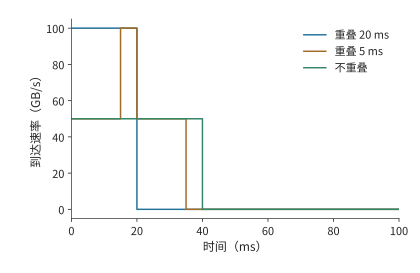

*图 7-40：两作业每 100 ms 各发送 20 ms，单作业速率 50 GB/s。不同高峰重叠程度产生不同的总到达速率，共享出口为 50 GB/s。*

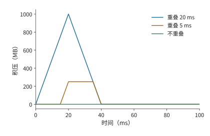

*图 7-41：把到达速率与出口速率的差额随时间累积，得到 1000、250、0 MB 三种峰值。此算例按无限缓冲计算积压。*

**讨论：发送时刻偏移多少会使共享出口产生积压？** 重叠时间为 $h$ 时，新增积压为 $(100-50)h$。重叠 5 ms 就积压 250 MB。若只给这次突发留出 512 KiB 缓冲，从空队列出发，允许的重叠时间约为 $512\ \mathrm{KiB}/50\ \mathrm{GB/s}=10.5$ μs。即使发送时刻的误差只造成毫秒级重叠，也远远超过这份缓冲所能容忍的范围。

错开高峰的思路已经有系统实现。CASSINI 利用训练通信的周期性，安排作业的放置和通信时刻来错开高峰，并监测漂移、重新调整。[^cassini] 本书配套实验用两个在 CPU 上运行的分布式数据并行（DDP）训练作业做过一次性错峰的对照：把其中一项推迟 50 ms 后，两者的相位在运行中继续漂移，三轮测量中整组作业的完成时间反而多了约 2% 到 3%。[^phase] 周期调度要持续维护相位；拥塞控制则根据实时反馈调整偏离预期的发送速率。

### 7.5.2 反馈延迟与缓冲容量

错峰减少了高峰重叠，但实际发送仍会偏离安排。因此，还需要在队列开始增长时，及时让发送方减速。数据到达的速度超过出口发送的速度时，多出的数据就会在队列中积压。记队列长度为 $Q$、到达速率为 $\lambda(t)$、出口速率为 $B$，队列非空且未满时，

$$
\frac{dQ}{dt}=\lambda(t)-B.
$$

到达速率高于发送速率，队列增长；到达速率低于发送速率，积压减少。

及时降低到达速率，有两类机制。**链路流控**让相邻的接收方在缓冲不足时暂停上游，防止接收缓冲区溢出。**端到端拥塞控制**把瓶颈信息送回发送方，降低发送速率。前者迅速阻止局部溢出，后者让源头的发送速率适应整条路径的传输能力。

沿用 100 GB/s 到达与 50 GB/s 出口，设缓冲总量为 512 KiB，已经占用 256 KiB。每微秒多到达的 50 KB 数据会占用剩余空间，这些空间只能支撑约 5.2 μs。反馈若到 20 μs 才使发送减速，会新产生 1 MB 超额数据，扣除剩余空间，约 738 KB 被丢弃。[^feedback]

将剩余缓冲记为 $Q_{\mathrm{free}}$，从发现拥塞到降速的时延为 $T_f$，避免这次溢出需要

$$
T_f\le\frac{Q_{\mathrm{free}}}{\lambda-B}.
$$

因此，在到达和发送速率给定时，可以根据缓冲大小推算允许的反馈时延。剩余空间加倍，可容忍的反馈时延加倍；到达与出口的差额加倍，可容忍的反馈时延减半。在上述速率下，若经过 50 μs 才降速，就会多积压 2.5 MB 数据。

反馈后还要消除积压。只把发送降到 50 GB/s，到达速率恰好等于出口发送速率，已有队列保持不变；降到 40 GB/s 后，每秒有 10 GB 余量用于排空，512 KiB 约需 52 μs。从起点算，队列约在 72 μs 回到零。拥塞控制既要阻止队列继续增长，也要为排空积压留出余量。图 7-42 画出这条反馈回路，图 7-43 画出缓冲的填满与排空。

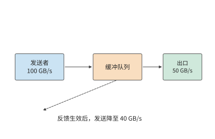

*图 7-42：数据沿实线进入队列并由出口发送；虚线表示拥塞反馈返回发送方。反馈到达并生效前，原发送速率继续填充队列。*

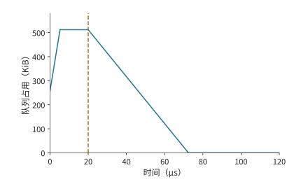

*图 7-43：反馈生效之前，缓冲区还会继续填满。到达速率为 100 GB/s，出口为 50 GB/s，512 KiB 缓冲初始占用一半。5.2 μs 时填满，到 20 μs 降速前持续丢弃超额到达的数据；降至 40 GB/s 后，出口以 10 GB/s 的净速率排空积压。反馈时刻与降速幅度为给定条件。*

图 7-43 中，反馈生效时刻决定队列满载状态持续多久，降速幅度决定下降段有多陡。各种拥塞控制机制改变队列，靠的都是这两个量。**显式拥塞通知**（ECN）由交换机在报文上打标记，把队列信息带回发送方；**DCQCN** 是利用这种通知调节 RDMA 发送速率的算法；基于时延的方法从往返时间的变化观察排队；UB 的 **C-AQM** 让端点与交换网络协同做主动队列管理（在队列溢出之前就依据队列状态让发送方减速）。理解这些机制，先分清各自缩短了哪一段反馈路径、发送方收到信息后改变了什么。阈值、更新步长和反馈频率共同决定队列响应的速度与幅度。

**多对一汇聚与链路流控。** 上述 100 GB/s 到达来自两项作业。集合通信自身也会制造更陡的到达速率。ReduceScatter 若按直接方式实现，每个参与者把第 $j$ 片直接发给持有者 $j$，一轮就完成。$N$ 个参与者若按同一顺序逐个目标发送，每个目标都以网卡的全速 $B$ 发出，那么轮到持有者 $j$ 的时段，另外 $N-1$ 个发送方同时向它发送，通向它的交换机出口以 $(N-1)B$ 的速率收到数据；发送顺序若按 rank 错开，每个目标在任一时刻只收到一条流。多个发送方同时向同一个出口发送的情形称为 **incast**。把 $\lambda=(N-1)B$ 代入上面的式子，每个发送方 $B=50$ GB/s，出口也是 50 GB/s，剩余缓冲 1 MiB；$N=8$ 时到达速率不是一条流的 50 GB/s，而是七条流合计的 350 GB/s：[^incast]

| $N$ | 发送方数 | 到达速率 | 超额速率 | 允许的反馈时延 |
|---:|---:|---:|---:|---:|
| 8 | 7 | 350 GB/s | 300 GB/s | 3.50 μs |
| 16 | 15 | 750 GB/s | 700 GB/s | 1.50 μs |
| 64 | 63 | 3150 GB/s | 3100 GB/s | 0.34 μs |

链路流控和端到端拥塞控制这两类机制，在这里对应两段反馈距离。链路流控的一种实现是 IEEE 802.1Qbb 的**基于优先级的流控**（Priority-based Flow Control，PFC）：接收端口的队列超过阈值就向上游相邻端口发暂停帧，按优先级暂停一条链路。它的反馈距离只有一跳：30 m 线缆按 5 ns/m 计，暂停帧上行 150 ns、已在线上的数据下行 150 ns，再加一个 1500 B 报文在 50 GB/s 上串行化的 30 ns，共 0.33 μs。这 0.33 μs 内继续到达的超额数据必须有缓冲容纳，这块预留的空间称为 headroom（缓冲余量）：$N=8$ 时为 $300\ \mathrm{GB/s}\times0.33\ \mu\mathrm{s}=99$ KB，$N=16$ 时 231 KB，$N=64$ 时 1.02 MB，都不超过 1 MiB；DCQCN 论文按 1500 B 的最大传输单元（MTU）给出的一例是每端口每优先级 22.4 KB。端到端拥塞控制（ECN 标记与 DCQCN 降速）的反馈距离是一个 20 μs 的往返，这 20 μs 内涌入的超额数据为 6.0、14、62 MB，即 5.7、13.4、59.1 MiB，没有一个能放进 1 MiB 缓冲。图 7-44 画出三种 $N$ 下的队列增长与这两段反馈距离。

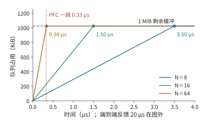

*图 7-44：$N=8$、16、64 时队列以 300、700、3100 GB/s 的超额速率增长，圆点标出 1 MiB 剩余缓冲被填满的时刻 3.50、1.50、0.34 μs。竖直虚线是 PFC 的一跳反馈距离 0.33 μs，三条线在这之前都没有填满；端到端反馈的 20 μs 在图的横轴之外。*

两段距离决定了分工：PFC 在 0.33 μs 内挡住相邻一跳，让缓冲在 DCQCN 需要的 20 μs 里不溢出；DCQCN 再把源头的发送速率降到出口能承受的水平，暂停才能解除。只靠端到端反馈不丢包的条件是 $(N-2)\times50\ \mathrm{GB/s}\times20\ \mu\mathrm{s}\le Q_{\mathrm{free}}$：1 MiB 缓冲只允许 $N\le3$，4 MiB 也只到 $N\le6$。把缓冲放大到 4 MiB，允许的反馈时延变为 13.98、5.99、1.35 μs，仍远小于 20 μs。[^incast] PFC 的代价留到第 7.5.4 节：暂停会沿上游逐跳传播，形成循环依赖时就是死锁。

> **实验 7-11 · 延伸：缓冲大小与降速幅度如何影响积压消退**
>
> 设到达速率为 100 GB/s，出口速率为 50 GB/s，初始积压为 256 KiB，求总缓冲为 512 KiB、1 MiB 时可以容忍的反馈时延。假设反馈在缓冲刚好用满时生效，将降速后的到达速率分别设为 50、45、40 GB/s，求从反馈生效到积压清空所需的时间，并解释其中一个条件为何无法排空。

> **实验 7-12 · 延伸：incast 的缓冲与反馈距离**
>
> 把出口改为 100 GB/s（两张网卡）而每个发送方仍为 50 GB/s，重算 $N=8$、16、64 的允许反馈时延与 PFC 的 headroom。再把线缆改为 100 m，求一跳反馈距离，以及 $N=64$ 时 headroom 是否仍在 1 MiB 内。最后求往返时间为 5 μs 时，只靠端到端反馈就不丢包的最大 $N$。

### 7.5.3 多路径与重传

反馈控制通过降低发送速率缓解拥塞；如果其他路径尚有带宽，还可以把流量分过去。Clos 网络提供多条可选路径。把不同连接分到不同路径，能分散热点链路上的流量；把同一次传输的报文分到多条路径，能同时用上多条链路的带宽。后一种做法也把不同路径的时延差带到了接收方。

取四个 token 的 BF16 隐藏向量，共 32 KiB，拆成八个 4 KiB 报文，轮转到两条独立的 50 GB/s 路径。每个报文串行发送约 82 ns，每条路径发送四个报文约需 0.33 μs。两条路径的传播时延都为 1 μs 时，整份数据约在 1.33 μs 交付；同样八个报文只走一条路径则约需 1.66 μs。两条路径各承担了一半发送工作，并行完成传输。[^packets]

把第二条路径的传播时延改为 9 μs，这条路径上的最后一个报文在约 9.33 μs 才到达。快路径上提前到达的后续报文要等前面缺失的报文补齐，接收方最多要缓存 12 KiB 乱序数据。总字节数相同，多用一条路径却比单路径慢得多，因为节省的串行发送时间只有约 0.33 μs，远小于新增的 8 μs 路径时延。

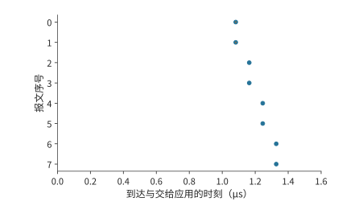

*图 7-45：两路径传播时延均为 1 μs，八报文约在 1.33 μs 全部到齐。圆点表示到达；到达后因缺口等待的区间用横线表示。*

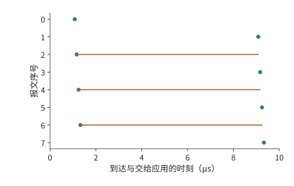

*图 7-46：第二条路径传播时延增加到 9 μs。快路径后续报文先到，仍需等待前方缺口；约 9.33 μs 全部可交付。圆点表示报文到达，横线表示到达后等待缺口补齐的时间，纵轴是报文序号。*

图 7-45 和图 7-46 中的横线说明，快路径发完并不等于整份数据可以交给应用。两条路径节省了发送时间，却可能增加等待缺失报文的时间。可以直接求出双路径传输更快的条件。单路径需要发送八个报文，双路径每条发送四个。每报文串行发送时间约为 82 ns，双路径节省约 0.33 μs。第二条路径比第一条多出的传播时延若超过这 0.33 μs，平均分配便失去时间优势。在 50 GB/s 的链路上，这一余量只有 30 m 线缆传播时延（约 150 ns）的两倍多，路径之间稍有差别就会抵消它；把一次几十 KiB 的传输均分到时延不同的路径上很少划算，路径选择或不均匀分配应减少慢路径承担的报文，使两条路径的最后一个报文尽量同时到达。只有每条路径分到的串行发送时间远大于路径时延差，多路径才有收益，下文 8 MiB 的逐包喷洒就是这种情形。

传播慢之外，报文丢失是另一种情形，造成的等待也不同。让序号 0 丢失，在它原来发送结束的 20 μs 后重传，整份数据约在 21.2 μs 才能交付：交付要等缺口补齐，不取决于其余报文多早到达。此时其他七个报文都已到达，接收方缓存了 28 KiB 载荷，只需重传缺失的 4 KiB；若从缺失报文开始重发它及其后的所有报文，则要再传输 32 KiB。**选择性重传**用记录接收进度的状态，换来更少的重复传输，图 7-47 画出了这种只补发序号 0 的情形。OpenURMA 的两节点仿真也给出了同样的对照：UB 传输层采用选择性确认，只补发缺失的报文，吞吐随丢包率上升而平缓下降；回退 N 步重传在同样的丢包率下要把整个窗口重发一遍。[^ub-design]

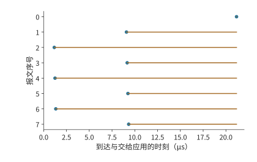

*图 7-47：序号 0 丢失后按算例等待时间重传，其他七个报文保留在接收方。只补发缺失报文后，约 21.2 μs 全部可交付。圆点表示报文到达，横线表示到达后等待缺口补齐的时间，纵轴是报文序号。*

重传还有一个独立的问题：什么时候认定缺口需要恢复。等太久，真丢包后的停顿就长；慢路径上的报文只是还没到就重发，又会增加重复流量。路径时延的分布决定检测要容忍多大的乱序，接收方记录的状态决定能缓存多少在缺失报文之后到达的数据。可靠交付与第 7.4 节的应用依赖共同决定哪些已经到达的操作可以继续执行。

**多条路径上的哈希冲突。** 前文把同一次传输的报文分到多条路径；本节开头的另一种做法是按连接（流）分配路径，不会乱序，却可能让几条流集中到同一条链路。跨组的流离开叶交换机时，要从该叶的上联中选一条。交换机通常按报文头的地址与端口字段哈希来选择上联，称为**等价多路径**（equal-cost multipath，ECMP）：同一条流的所有报文走同一条路径，不同的流按哈希值分到不同上联。哈希是随机的，两条流落到同一条上联的概率不为零。会彼此冲突的是同一台叶交换机上的跨组流：第 7.2.5 节里错位的配对虽然把八条流送进脊层，但它们从八台不同的叶交换机出发，每台叶上只有一条跨组流，彼此不会在同一台叶的上联上相遇。rail 对齐把每台叶上的跨组流压到最少，正是为了避开这里的冲突。把同一台叶上的 $n$ 条等速流独立、均匀地哈希到该叶的 $m$ 条上联——$k=64$ 的无阻塞叶有 32 条，3:1 超售叶有 16 条——最忙的一条上联分到的流数记为 $L_{\max}$。没有冲突时，最忙的上联承载 $\lceil n/m\rceil$ 条流；各流公平共享所在链路的带宽、整组要等最慢的流传完时，整组的速度只有无冲突时的 $\lceil n/m\rceil/\mathrm{E}[L_{\max}]$。精确计算最大负载的分布，表中 p99 是 $L_{\max}$ 的第 99 百分位数，即 99% 的哈希结果中最忙上联的流数不超过该值：[^ecmp]

| 流数 $n$ | 上联数 $m$ | 无冲突时最忙上联的流数 | $\mathrm{E}[L_{\max}]$ | p99 | 无冲突概率 | 相对无冲突的速度 |
|---:|---:|---:|---:|---:|---:|---:|
| 8 | 32 | 1 | 1.66 | 3 | 38.6% | 60.1% |
| 8 | 16 | 1 | 2.06 | 4 | 12.1% | 48.5% |
| 32 | 32 | 1 | 3.53 | 6 | $1.8\times10^{-13}$ | 28.3% |
| 32 | 16 | 2 | 4.83 | 8 | 0 | 41.4% |
| 128 | 16 | 8 | 13.36 | 18 | 0 | 59.9% |

一台叶上只有八条跨组流时，无阻塞叶有 38.6% 的概率完全不冲突；一旦冲突，两条流集中在一条上联上，各得一半带宽，最忙的一条上联平均分到 1.66 条流，整组平均只剩无冲突时 60.1% 的速度。超售叶的上联减半，无冲突概率降到 12.1%，速度降到 48.5%。整组 32 台服务器各出一条跨组流、无阻塞叶恰好 32 条上联时最差：流数与上联数相等，几乎必然有若干条上联空着、另一些挤了三四条，整组只剩 28.3%。流数远多于上联数时，随机分配的波动相对变小：32 条流分到 16 条上联为 41.4%，128 条流分到 16 条上联为 59.9%。图 7-48 画出这几组配置的最忙链路负载。**翻转条件**：流数与上联数接近时冲突代价最大，流数远少于或远多于上联数时代价较小；要避开这一代价，一是用 rail 对齐减少同一台叶上的跨组流，二是不再按流分配，改用下文的逐包喷洒。

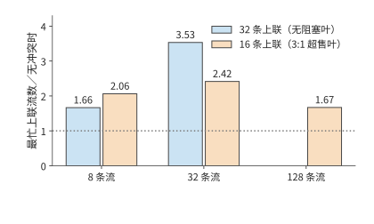

*图 7-48：同一台叶交换机上的 $n$ 条跨组流哈希到该叶的 $m$ 条上联时，最忙上联的期望流数与无冲突时最忙上联流数之比，比值的倒数就是整组相对无冲突的速度。无阻塞叶有 32 条上联，3:1 超售叶有 16 条；32 条流分到 32 条上联时比值最大，为 3.53；128 条流分到 16 条上联时降到 1.67。*

**逐包喷洒。** 把同一条流的报文分到多条路径，就消除了流级哈希的冲突，代价是本节开头算过的乱序。把 8 MiB 的 prefill 激活（1024 个 token 的 BF16 隐藏向量）拆成 2048 个 4 KiB 报文，轮转到八条 50 GB/s 的路径，八条路径的传播时延为 1 到 8 μs。每条路径承担 1 MiB，串行发送 20.97 μs，最慢路径再加 8 μs，全部到达 28.97 μs，约 29.0 μs；同样 8 MiB 走一条路径要 167.8 μs 加 1 μs 传播，共 168.8 μs。喷洒节省的是串行发送时间，多出的是路径时延差；按本节开头的条件，只要最慢路径的时延小于 $168.8-21.0=147.8$ μs，喷洒就更快，这里的最慢路径只有 8 μs。乱序的代价是接收方要缓存先到的报文：快路径的报文要等慢路径上序号更小的报文，接收方最多同时保留 339 个报文、1.39 MB。[^ecmp]

超以太网（Ultra Ethernet，面向 AI 与高性能计算的以太网规范）把这两件事写进了传输层：报文按熵值（entropy，报文头中供交换机哈希选路的字段）喷洒到多条路径，典型配置有 64 到 256 个熵值，反馈显示某条路径拥塞时就减少放到它上面的报文；丢失的报文按选择性确认只补发缺失的那些，而不是回退 N 步重发整个窗口。[^ecmp] 这正是图 7-47 的模型：喷洒换来所有链路的带宽，选择性重传把丢包的代价限制在缺失的报文上，接收方为此保存乱序状态。

> **实验 7-13 · 延伸：路径时延差与重传如何推迟按序交付**
>
> 让第二条路径的传播时延在 1 μs 至 9 μs 之间变化，求均分到两条路径与仅使用第一条路径的完成时间相等时，第二条路径的传播时延。再令两条路径分别承担五个和三个报文，求第一条路径传播时延为 1 μs、第二条为 9 μs 时的完成时间。保持首包丢失，把恢复等待从 20 μs 增为 40 μs，计算首次能够按序交付数据的时刻，以及此前需要缓存的数据量。

> **实验 7-14 · 延伸：哈希冲突与喷洒的边界**
>
> 求 16 条流分到 32 条上联时最忙链路的期望负载与相对无冲突的速度，与表中同样 $n/m=1/2$ 的 8 条流分到 16 条上联比较。把喷洒的路径时延改为 1 到 30 μs 均匀间隔，求完成时刻与峰值乱序缓存；再求使喷洒不再快于单路径的最慢路径时延。最后把报文改为 1 KiB，说明峰值乱序缓存的报文数和字节数怎样变化。

### 7.5.4 死锁

第 7.5.3 节中，已经到达的报文要保留到缺口补齐后才能释放空间。端点背压和链路流控还会让这种等待向上游传播：接收方没有空位，上游便不能继续发送。若释放某项资源的动作也需要这项资源，就会形成循环。考虑两项请求分别占用资源 A 和 B；第一项还需要获得 B 才能完成，第二项还需要获得 A 才能完成。二者都在等待对方先释放。

在归约系统里，这种循环可以跨越多个层次：请求占满接收缓冲，完成响应等待发送队列，发送队列又等待远端释放请求所占的空间。把“持有前一项资源、申请后一项资源”画成边，就得到资源依赖图。环上的每项资源都被持有时，所有释放条件就同时停滞。图 7-49 画出这种循环，图 7-50 画出下文为响应预留通路的解法。

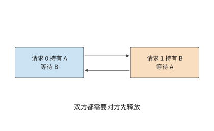

*图 7-49：两项请求分别持有 A、B，各自等待对方持有的资源。箭头表示等待关系，两个请求都无法完成并释放资源。*

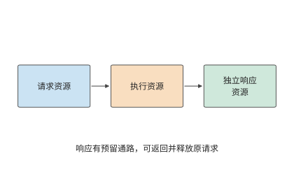

*图 7-50：请求、执行、响应使用独立资源并按顺序申请。响应有预留缓冲和发送机会，能够返回并释放原请求。*

一种解决方法是给资源规定严格申请次序，例如所有工作先申请 A 再申请 B。这样，持有 B 的工作不再回头等待 A，环便被打断。另一种方法是给完成响应预留独立缓冲区和发送机会。设接收方八个数据槽已满，发送方等待释放；若响应也要占用这些数据槽，就一起停住。增加独立响应槽，使处理数据后的释放消息可以返回，至少一项请求所占的空间得以释放，数据队列便能继续周转。

虚拟通道用逻辑上分开的队列来划分资源。把请求与响应分入不同通道，再规定资源申请方向，可以建立无环的依赖结构。这里真正发挥作用的是独立容量和使用次序。

内存访问还可能要做地址转换、读页表。原请求等待地址转换，地址转换又要发起一次远程访问，二者若争用已耗尽的同一组槽位，也会形成相同的环。笔者参与 UB 设计时，需要一并分析事务处理、内存访问和链路传输之间的依赖。为完成通知、地址转换和故障恢复预留资源，才能避免系统在拥塞或故障时陷入停滞。

## 7.6 从通信改进到任务完成

### 7.6.1 关键路径从数据就绪开始

第 7.2 至 7.5 节沿一份数据追踪了传输、等待、完成通知和空间释放。要判断这些改进能节省多少训练时间，还要把产生和使用这份数据的计算过程一并计入，并确定通信何时开始。一张卡很早就进入集合通信调用，另一张卡的梯度还没算出来，前者就在调用里等后者。这段等待记在通信调用的耗时里，根源却在前面的计算或数据准备。

考虑四个要做本地归约的参与者，分别在 0、0、0、2 ms 就绪，全部到齐后执行 0.4 ms 的交换。按第 7.4 节的依赖图，交换的开始时刻等于四个就绪时刻中的最大值，全组在 2.4 ms 完成。将交换耗时减半，完成时间变为 2.2 ms；如果四个参与者都在起点准备好，完成时间就变为 0.4 ms。两个优化分别作用于依赖图上的不同节点，图 7-51 至图 7-53 依次画出这三种情形。[^tail]

*图 7-51：原安排中，前三个参与者等第四个在 2 ms 就绪，再交换 0.4 ms。灰色为尚未就绪，橙色为等待其他参与者，蓝色为交换。*

*图 7-52：就绪时刻相同，交换从 0.4 ms 减到 0.2 ms，全组从 2.4 ms 提前到 2.2 ms 完成。灰色表示尚未就绪，橙色表示等待其他参与者，蓝色表示交换。*

*图 7-53：四个参与者在起点同时就绪，交换仍需 0.4 ms，全组在 0.4 ms 完成。三图时间轴相同。蓝色表示交换；各行分别对应一个参与者。*

这种就绪偏差在大规模训练系统中同样存在。大规模分布式训练系统 MegaScale 在诊断训练性能时发现，网络带宽保持稳定，但各参与者开始通信的时间差越来越大，ReduceScatter 中的等待也随之增长。进一步分析发现，这一差异与前向计算期间的主机操作有关。[^megascale] 本书配套实验用集合通信库 Gloo 在 CPU 上做的四进程测量也显示同样的关系：4 KiB 输入下，当一个参与者晚到约 25.1 ms 时，全组完成时间的中位数从约 1.6 ms 增至 26.6 ms；最后一个参与者到达之后的尾段仍约为 1.6 ms。[^readiness]

因此，任务时间线应从数据生成时刻画起。把梯度分成多个桶，每个桶的梯度生成后即可开始归约；下一桶仍在计算时，上一桶可以传输。不同桶的通信会竞争网卡和链路，参数更新要等最后一个桶归约完成。分桶让通信提早开始，与后续梯度计算同时进行。

### 7.6.2 分层网络的通信耗时计算

**例题 7.6：归约算法、执行顺序与链路带宽应先优化哪一项？** 沿用前述算例中的 192 MiB 梯度。梯度在计算开始后 20 ms 就绪，归约后执行 2 ms 更新。比较连续环与分层归约，再考察并发不足、提前通信和链路退化。

**解答：先计算归约与计算串行时的训练步耗时。** 计算→归约→更新形成一条串行链。使用第 7.2 节的传输模型，连续环总时间约为 $20+7.6+2=29.6$ ms，分层归约约为 $20+1.3+2=23.3$ ms。通信时间减少约 83%，整步只减少约 21%。20 ms 计算和 2 ms 更新占据了其余时间。

一般地，不受优化影响的时间为 $T_c$，通信为 $T_n$，通信加速 $s$ 倍，则总加速比为

$$
S=\frac{T_c+T_n}{T_c+T_n/s}.
$$

接下来考虑第 7.3 节的并发请求数限制。若每张网卡仅有 128 个 256 B 事务在途、槽位周转时间为 2 μs，先不计发起速率，每张网卡的远端吞吐受限于 16.4 GB/s。分层归约跨服务器每张网卡共发送 24 MiB，远端传输便需约 1.5 ms；加上本地通信和启动，总通信约为 2.3 ms，整步约为 24.3 ms。增加到 391 项活跃事务并使发起速率足够，才恢复到约 23.3 ms。换了归约算法之后，还要让请求提交和处理速度足以发挥算法的优势。

再考虑重叠。假设计算开始后 17 ms，需要通信的数据已经准备好，而其他计算还需 3 ms。这 3 ms 的计算可以与通信同时执行。两者使用互不争用的硬件资源，更新要等两者都完成。此时

$$
T_{\mathrm{step}}=\max\bigl(20,\ 17+T_n\bigr)+2\ \mathrm{ms}.
$$

图 7-54 至图 7-59 依次画出六种安排，每张图使用相同时间尺度。灰色计算区间保持不变，蓝色通信区间的长度由传输量和吞吐决定，起点则由数据何时就绪决定。

*图 7-54：连续环串行安排：计算 20 ms，通信约 7.6 ms，更新 2 ms。灰为计算，蓝为通信，绿为更新；圆点为通信数据就绪。*

*图 7-55：本图改用分层归约，仍按计算、通信、更新串行执行。通信缩短到约 1.3 ms，整步约 23.3 ms。灰色为计算，蓝色为通信，绿色为更新；圆点为通信数据就绪。*

*图 7-56：本图采用分层归约，其他计算与更新时间不变。每张网卡 128 个在途事务限制远端吞吐，通信拉长到约 2.3 ms，整步约 24.3 ms。灰色为计算，蓝色为通信，绿色为更新；圆点为通信数据就绪。*

*图 7-57：本图把连续环的通信提前到 17 ms 开始，与尚未完成的计算重叠。通信 7.6 ms 超出计算区间，更新等通信结束；整步约 26.6 ms。灰色为计算，蓝色为通信，绿色为更新；圆点为通信数据就绪。*

*图 7-58：本图把分层归约的通信提前到 17 ms 开始。通信在 18.3 ms 结束，早于计算，更新从 20 ms 开始，整步 22 ms。灰色为计算，蓝色为通信，绿色为更新；圆点为通信数据就绪。*

*图 7-59：本图从提前通信的分层配置出发，只把可用网卡减为一张。跨服务器两轮各要挤过 96 MiB，通信约 4.8 ms，超出计算区间，整步约 23.8 ms。上述时间线采用同一横轴范围。灰色为计算，蓝色为通信，绿色为更新；圆点为通信数据就绪。*

数据在 17 ms 就绪并与计算重叠时，连续环整步约为 26.6 ms，分层归约约为 22.0 ms：分层通信约在 18.3 ms 结束，早于 20 ms 的计算结束时刻，更新紧接在计算之后开始。数据最晚在 18.7 ms 就绪，分层通信仍能藏在计算后面。继续缩短通信不再改变这条关键路径，此时需要缩短计算或更新，才能进一步减少总时间。

**讨论：网卡减少后，归约是否重新成为训练步的瓶颈？** 若八条 rail 只剩一条可用，每台服务器的八份分片都要经过剩下的这一张网卡，每轮每个方向 96 MiB，两轮共 192 MiB，远端传输从约 0.5 ms 增加到约 4.0 ms，通信约为 4.8 ms。数据在 17 ms 就绪时，通信到 21.8 ms 才结束，整步约为 23.8 ms。通信耗时增加后，其中更多部分要到计算结束后才能完成。

再按顺序比较这些时间线：减少通信量会缩短蓝色条带，并发不足会将其延长，数据提早就绪则让它向左移动。绿色更新要等计算和通信都结束后才能开始。流量、并发与依赖这三个模型也给出了清楚的改进顺序。先用分层归约减少跨服务器传输并让每张网卡都有分片可传，再靠并发提交和处理请求用满链路带宽；到了带宽上限，就找可以提早开始的通信；通信时间被计算完全盖住之后，再优化此时决定完成时间的计算或更新。

### 7.6.3 训练与推理的通信瓶颈

图 7-54 中蓝色条带能够显著缩短，是因为大梯度的数据传输占了大部分通信时间。低并发 decode 中，一个 8 KiB 隐藏向量要在层间反复交接，实际发送数据只需极短时间，每次启动反而占了大部分耗时。取一个由八个参与者组成的环，每轮启动 5 μs，每个参与者有效带宽为 $B$，输入为 $M$ 时一次归约为

$$
T_{\mathrm{AR}}=14\times5\ \mu\mathrm{s}+\frac{1.75M}{B}.
$$

十四轮启动共 70 μs。链路取本章网卡的 50 GB/s，令载荷项等于启动项，得到 $M=2$ MB，约为 1.91 MiB。输入大于这一数量级时，数据传输耗时所占的比例增大；8 KiB 远小于它，主要耗时来自启动。

*图 7-60：原配置每轮启动 5 μs、带宽 50 GB/s。绿色将带宽增至三倍的 150 GB/s，橙色将每轮启动减至 2 μs；数据量小时主要受启动影响，数据量大时主要受传输影响。*

沿图 7-60 的横轴从左向右看，数据量小的一段总时间接近水平，数据量大的一段随载荷增大而上升。提高带宽主要放缓右侧的斜坡，缩短启动时间主要使左侧平坦区的曲线下移。

对 8 MiB 输入，带宽由 50 增至 150 GB/s，一次归约从约 364 μs 降至 168 μs；对 8 KiB 输入，则只从约 70.3 μs 降至 70.1 μs。假设执行一个 36 层模型，每层注意力与 FFN 各有一次这样的归约，72 次串行归约在两种带宽下均约为 5.1 ms，差值约 14 μs。把每轮启动从 5 μs 降到 2 μs，72 次归约却能减少约 3.0 ms。[^planning]

因此，训练和大 batch prefill 更容易从减少字节、增加带宽和重叠中获益；低并发 decode 更需要减少层内跨服务器同步、缩短发起与完成路径。这也解释了第 7.2 节讨论的流水线并行方案：把一个阶段放在本地，可以减少阶段内部的远程通信；同时处理多少个独立请求，则决定流水线利用率。

平均耗时之外，偶发的长时间等待也会推迟任务完成。取 100 次通信，其中 98 次为 0.4 ms，一次因晚就绪而多等 2 ms，一次因恢复而多等 10 ms。平均约为 0.52 ms；p99 取由小到大排序的第 99 项，得到 2.4 ms。将正常传输时间减半，p99 降至 2.2 ms；若恢复事件增加为两次，p99 就由包含故障恢复的那次通信决定，变为 10.4 ms。[^tail]

正常传输、数据准备延迟和故障恢复，都可能成为决定任务完成时间的主要因素。频繁的小数据量传输需要降低每次的启动开销；耗时较长的故障恢复则需要缩小故障影响范围。训练中发生通信故障后，还需要重建通信组并恢复训练状态；第 10 章将进一步说明这一过程。

带宽与启动开销的比较都保持通信模式不变。通信模式本身也可以改变：调整并行方案与专家分布，可以减少交接次数；由加速器直接发起通信，或把发起与完成处理交给卸载单元，可以缩短每次交接。MoE 的路由、dispatch 与 combine 对网络操作提出要求；网络能否高效完成这些操作，又反过来影响专家的粒度和跨节点部署。若模型计算因专用硬件变快，通信时间本身没变，它在关键路径上的占比却会上升。

同样的流量分析也适用于推理中的状态迁移。继续分析贯穿本书的同一个 DeepSeek V4.1 会话，设这条请求要迁移到一个不持有其全局 KV 的实例上。先计算全局历史这一段载荷的传输时间：上下文为 128K，传输走一张以 200 Gbit/s 运行的 ConnectX-7，有效带宽 25 GB/s。V4-Flash 的 439.281 MiB 需要约 18.425 ms，V4.1 的 111.250 MiB 需要约 4.666 ms。状态压缩使这条路径的传输时间减少了约 13.759 ms。[^v41-case]

这 13.759 ms 是迁移方案在传输环节可以节省的时间。若请求依次经历排队、缓存查询、传输和局部 SWA 状态的重建，恢复时间就是四段之和；传输缩短多少，总时间就缩短多少。第 9 章会把这条恢复路径与留在原实例等待、从输入重新计算放在一起比较，决定请求该去哪里执行。

### 7.6.4 固定 1024 卡，超节点变大后如何重新选择

前几节用十六个参与者分析了路径，本节把规模扩展到 1024 张卡：保持总卡数不变，超节点大小从 8 改成 64、128、256 卡，考察哪些时间会改变。先固定计算工作量与并行方案，再分别改变网络条件，最后重新比较并行度。[^supernode-scaling]

**固定模型与训练工作。** 采用 Qwen3-32B 的形状：64 层、隐藏维 5120，参数量取 $P=32\times10^9$。1024 张 H100 SXM 80 GB 按张量并行 8、数据并行 128 组织，记作 TP8×DP128，每个八卡张量并行组都在一个超节点内。每次更新固定处理 $2^{20}$ 个 token，每个数据并行副本处理一个含 8192 个 token 的 micro-batch；全局 batch size、精度和优化器更新的含义都不变。训练状态按每参数 16 bytes 计，每卡 64 GB，另假设 8 GB 的激活与工作区足够，暂不用 ZeRO（Zero Redundancy Optimizer，零冗余优化器，把优化器状态、梯度和参数分片存放到各数据并行副本上）。

梯度按 BF16 传输，每张卡持有的分片为 $G=2P/8=8$ GB。设超节点有 $S$ 张卡，则超节点数 $H=1024/S$，每个超节点内同一张量并行坐标上有 $q=S/8$ 个数据并行成员。图 7-61 画出 64 卡超节点内的分组：同一行的八张卡是一个模型副本，同一列的卡属于同一个梯度同步组。

*图 7-61：64 卡超节点由八个张量并行组组成。同一行的八张卡处理同一 micro-batch 的不同模型分片；同一列的八张卡先在节点内汇合对应的梯度，再与其他超节点交换同一分片。一个训练作业用上全部的卡，不等于全部的卡组成一个张量并行组。*

**跨超节点的传输量。** 节点内的 $q$ 个数据并行成员先做 ReduceScatter，每张卡留下 $G/q$ 的梯度分片；持有同一分片的 $H$ 个超节点之间再做 AllReduce；最后节点内做 AllGather。按环形算法，每张卡跨节点发送 $2(H-1)G/(Hq)$，乘以节点内的 $8q$ 张卡，得到每个超节点每个方向的发送量

$$
V_{\mathrm{out}}=2\frac{H-1}{H}\,8G.
$$

节点从 8 卡扩大到 128 卡时，$q$ 从 1 增至 16，每卡的跨节点字节减少，但每超节点合计发送量只从 127 GB 降到 112 GB。因此，超节点扩大 16 倍，并不意味着经过出口的字节也减少 16 倍。

节点内按 NVLink 每卡每方向 450 GB/s 计：8 卡就是一台 HGX H100；64 到 256 卡对应 NVLink Switch System，它最多把 256 张 Hopper GPU 连成一个 NVLink 域，全交换带宽 115.2 TB/s，正是 256 张卡各 450 GB/s。跨节点每卡一张 ConnectX-7，每方向 50 GB/s。节点内外每轮启动 $\alpha_L$、$\alpha_R$ 都取第 7.1.1 节的 0.83 μs。记节点内每卡每方向带宽为 $B_L$、每张网卡每方向带宽为 $B_{\mathrm{NIC}}$、整个超节点的可用单向出口为 $B_{\mathrm{out}}$，分层梯度时间为

$$
T_{\mathrm{grad}}=
2(q-1)\alpha_L+\frac{2(q-1)G}{qB_L}
+2(H-1)\alpha_R+
\max\left(\frac{2(H-1)G}{HqB_{\mathrm{NIC}}},
\frac{V_{\mathrm{out}}}{B_{\mathrm{out}}}\right).
$$

式中依次是本地归约与收集、跨节点的启动，以及网卡与共享出口两者中较慢的一项。真实系统还可能受交换网络割集和本地并发通信的影响；本例假设网络能提供所列带宽，各阶段不重叠。

**训练步的总时间。** 每卡的有效算力取 H100 SXM 的 BF16 稠密峰值 989.4 TFLOP/s 乘 41%，约 405.7 TFLOP/s；41% 是 Llama 3 405B 在 16384 张 H100 上以 TP8、PP16（流水线并行 16 段）、DP128 训练时报告的 BF16 MFU。按第 1.2.2 节的定义，41% 意味着有 59% 的峰值算力没有转化为模型计算。其中一部分是这类一阶估算没有计入的工作，例如注意力的二次项，以及训练中为节省显存而重复的计算；另一部分是可以减少的等待，例如第 7.6.1 节的就绪偏差和第 7.3.4 节的在途请求不足。计算用 $6P\times2^{20}/(1024\times405.7\ \mathrm{TFLOP/s})\approx0.485$ s 估计，忽略注意力的二次项。每层前向与反向合计按四次张量并行 AllReduce 计，8192 个 token 的 BF16 隐藏张量为 80 MiB，64 层合计约 0.086 s；优化器更新另计 0.050 s。于是固定调度下的步时间与吞吐 $\Theta$（每秒处理的 token 数）为

$$
T_{\mathrm{step}}=0.485+0.086+T_{\mathrm{grad}}+0.050,\qquad
\Theta=2^{20}/T_{\mathrm{step}}.
$$

这是把计算、张量并行通信、梯度同步和更新串起来的固定调度估算；真实系统沿梯度就绪的时间线扣掉已经重叠的部分。作为对照，再算一个不分层的连续数据并行环：每个张量并行坐标只有一条跨节点的环边，不把这条边分摊到其他网卡。下表在两种算法中取较快者。

| 每超节点卡数 | 超节点数 | 本地 DP 成员 $q$ | 每节点跨域发送 | 出口随卡数增长：步时间／吞吐 | 出口固定 400 GB/s：步时间／吞吐 |
|---|---:|---:|---:|---:|---:|
| 8 | 128 | 1 | 127 GB | 0.939 s／111.7 万 token/s | 0.939 s／111.7 万 token/s |
| 64 | 16 | 8 | 120 GB | 0.690 s／152.0 万 token/s | 0.939 s／111.7 万 token/s |
| 128 | 8 | 16 | 112 GB | 0.672 s／156.0 万 token/s | 0.935 s／112.2 万 token/s |
| 256 | 4 | 32 | 96 GB | 0.663 s／158.1 万 token/s | 0.896 s／117.1 万 token/s |

“出口随卡数增长”取 $B_{\mathrm{out}}=S\times50$ GB/s，即每张卡的 400 Gbit/s 网卡都接入交换网络，意味着为更大的节点配置更多可同时工作的外部端口和足够的交换网络；出口不会随节点变大而自动变宽。“出口固定”则让每个超节点只有 8 条 400 Gbit/s 链路接入 QM9700 交换网络，共 400 GB/s，与一台 HGX 服务器相同。后者的 64 卡方案中，分层归约需约 $31.1+300.0=331.1$ ms，反而比连续环约 317.7 ms 慢，因而表中选择连续环。这和第 7.2 节关于本地归约是否合算的判断相同。“出口随卡数增长”一列还隐含交换网络无阻塞：第 7.1.2 节算过，3:1 超售把每超节点出口降到三分之一，128 卡节点的跨域项从约 17.5 ms 增至约 52.5 ms，步时间增加约 35 ms；第 7.2.5 节说明了这些跨域字节在多轨拓扑上均匀落在八条 rail 上。

*图 7-62：全局 token 数与总卡数固定。蓝线增加每节点外部出口，橙线将出口封顶在 400 GB/s，绿线在出口扩展的基础上将本地带宽从 450 翻倍到 900 GB/s。每点在声明的连续环与分层归约之间选择较快者；纵轴为固定调度估算的正常运行吞吐。*

图 7-62 画出三种网络条件下吞吐随超节点大小的变化。从 8 卡增至 64 卡，在出口随卡数增长时吞吐提高约 36%。8 卡超节点只有一台服务器，每张卡要把自己的整份 8 GB 梯度分片经网卡同步，要 0.318 s，占步时间的三分之一；64 卡时先在 NVLink 上把它归约成八分之一，每张卡跨节点只交换这一小片，梯度同步降到约 69 ms。从 128 卡增至 256 卡只提高约 1.3%，因为此时计算与张量并行通信已占步时间的 86%。若内部带宽另从 450 增到 900 GB/s，即第五代 NVLink 的每方向带宽，128 卡节点约为 0.614 s、170.9 万 token/s；这部分收益来自内部带宽的提高，不能归功于节点大小本身。

**并行度的重新比较。** 更大的高速域可以容纳更大的张量并行组，但不必填满。对 128 卡超节点，在出口扩展的条件下枚举张量并行 8、16、32、64，对应的数据并行为 128、64、32、16，全局 token 数不变。每个数据并行副本要处理的序列数随之增加，每条序列仍是 8192 个 token，局部矩阵的行数和张量并行的传输量都要重算；假设这些形状都能达到本例的有效算力，步时间分别约为 0.672、0.753、0.942、1.333 s。此时 TP8 仍然最好：张量并行组越大，每个副本要交换的激活越多，节省的本地梯度同步抵不过增加的激活交换。张量并行超过八个 KV 头时还要支持复制 KV 等布局，本例假定 kernel 支持且余量足够。

这次筛选说明，1024 张卡可以一起训练一个模型，但不是把模型的每一层都切到 1024 张卡上。若改为推理，多个较小的实例还能各自处理请求、隔离故障，第 6.7.4 节用同样的方法算过超节点大小对 decode 吞吐的影响。真实训练中局部矩阵效率、内存或重叠能力不同时，张量、上下文、流水线并行的组合可能更好；应像第 6.7.3 节那样扩展方案重算，而不是把本例的 TP8 当作通用答案。

**故障恢复的开销。** 上面的吞吐都假设作业从不中断。同步训练中，一张卡故障可能让整个作业停下；数据并行副本也不能像独立的推理实例那样随意丢弃，因为那会改变这次更新用到的样本和梯度。除非系统提供不改变训练含义的局部恢复或弹性方案，否则要回退到一致的 checkpoint。设每隔 $I$ 秒有效计算暂停 $C$ 秒保存 checkpoint，作业中断率为 $\lambda$，恢复用时为 $R$。故障率较低、故障时刻在 checkpoint 间隔内近似均匀分布时，开销比例可以粗略估计为

$$
\epsilon\approx C/I+\lambda(I/2+R),\qquad
\Theta_{\mathrm{effective}}\approx\Theta/(1+\epsilon).
$$

这里只估计平均有效进度，不保证尾延迟。独立卡故障可按卡数合计中断率，超节点公共设备故障则按实际故障域统计，不能把所有故障都当作独立。中断率取 Meta 研究集群的统计：1024 卡作业平均 7.9 小时中断一次，中断率与卡数成正比，相当于每卡平均约 337 天（约 8090 小时）一次，第 10 章也用这组数据。这组统计已经包含公共设备的故障，本例不再另加超节点公共故障项，因此中断率不随超节点大小变化；任一中断都触发全作业恢复。每 600 秒有效计算暂停 10 秒保存 checkpoint。恢复取固定 60 秒，再加受影响超节点每卡 64 GB 状态经一条 PCIe Gen5 x16（每方向 64 GB/s）读回的时间。128 与 256 卡节点的恢复时间分别为 188、316 秒，附加开销约为 3.4% 与 3.8%，出口扩展条件下有效吞吐约为 150.9 万与 152.3 万 token/s：256 卡节点恢复更慢，多出的开销仍小于其正常吞吐的提高。

中断率来自一个集群的统计，checkpoint 间隔与恢复通道是给定输入。节点变大可能减少公共设备的数量，也可能扩大一次故障的损失和恢复流量；有备用卡、局部恢复或不同故障率时应重新代入。因此，比较方案时要同时给出正常运行的吞吐、恢复模型和目标时间内的有效训练进度，第 10 章再展开 checkpoint 与恢复协议。

### 7.6.5 部署与常见误区

大梯度、小数据量传输和故障恢复分别突出了带宽、启动开销和依赖等待。部署方案的比较也应从这些工作负载出发。InfiniBand、RoCE 和 UB 分别提供具体的连接与通信机制；选择部署方案时，先用本章的三个模型比较各方案的通信路径。GPU 到网卡的连接、共享接口和交换拓扑决定可用带宽；请求提交与完成处理机制决定实际吞吐；应用的同步与恢复机制决定执行顺序。

计算可用带宽时，需要先明确物理端口的连接方式。例如，昇腾 950 中的 UBoE 与 UB Link 链路按预先配置的方式共用 SerDes，一组 SerDes 的用途由端口配置确定。选择端口用途之后，才能计算该方向实际可用的链路带宽。[^ubspec] 接口统一后，程序可以用共同的方式访问，端口配置则决定数据经过哪些链路，以及这些链路有多少带宽。

公开 AllReduce 运行记录可以用来分析这些因素的共同影响。16 GiB 输入、输入与输出分别使用不同缓冲区时，两台与本章算例同规格的八卡 H100 服务器约需 68.7 ms，四台约需 91.0 ms。[^allreduce] 增加服务器带来了更多参与者和更长的协作路径。

本章的推导也能澄清四种常见误区。

**误区：发送总量相同，通信耗时就相同。** 连续环、交错环、分层归约都发送 5760 MiB，跨服务器部分却分别为 720、5760、384 MiB，用到的网卡分别为一张、八张、八张。传输时间取决于数据经过哪些资源，参与者的排列改变了每张网卡分到的字节。

**误区：链路平均利用率低，就足以应对通信高峰。** 两项周期作业平均只需 20 GB/s，通信高峰重叠时却达到 100 GB/s，在 50 GB/s 出口积压 1 GB。缓冲保存的是一段时间内的差额，相位和反馈决定这个差额积累多久。

**误区：按序返回，就一定读到了正确数据。** 在数据更新之前读取到的旧值，不会因为延后返回而变成新值。发布与读取之间的依赖必须约束实际读取的时刻，提前执行则需要检查和重读。

**误区：通信加速比就是任务加速比。** 分层归约把通信从约 7.6 ms 降至 1.3 ms，串行训练步从约 29.6 ms 降至 23.3 ms；数据提前就绪又把分层方案降至 22.0 ms。同一种通信优化，在不同执行顺序下节省的总时间也不同。

笔者理解统一互联的出发点，是让设备能够直接访问远端数据、发起通信，让上层明确表达依赖，让底层复用相同的传输状态。评价这些设计，需要回答三个问题：少搬了哪些字节，少等了哪段时间，为此需要额外保存哪些请求状态、执行哪些处理。

> **实验 7-15 · 核心：通信优化能缩短多少训练与推理时间**
>
> 先复算 1024 卡算例，保持全局 token 数不变，将超节点大小、出口上限、本地带宽逐项改变，记录哪种通信算法和张量并行候选更好；再把恢复通道带宽减半，比较有效进度。最后复算例题 7.6，画出连续环、分层归约、在途请求数不足、提前通信与只剩一张网卡的整步时间线。求分层通信恰好被 20 ms 计算覆盖时的数据最晚就绪时刻。再换成 36 层、每层两次 8 KiB 归约，分别考虑将带宽提高到原来的三倍，以及将每次启动开销降至 2 μs，解释两类负载的改进顺序为何不同。

[^capacity]: 模型规模与状态大小的计算方法见[模型资源计算](../case-studies/model-resource-accounting.md)及[第 7 章扩写资料](../archive/outlines/extensions/07-数据中心网络.md#detail-7.1)。混合精度 Adam 算例按每参数 16 bytes 保存训练状态；万亿参数推理例子按每参数 0.5 byte 计算权重容量。

[^ub]: [UB 规范与操作系统参考设计核对记录](../references/UB-ASCEND-NOTES.md)。

[^gradient]: [两级梯度归约计算](../calculations/results/gradient-fp32-hierarchical-nic8.md)、[连续环](../calculations/results/gradient-fp32-flat-contiguous-nic8.md)、[交错环](../calculations/results/gradient-fp32-flat-interleaved-nic8.md)。固定模型形状；各轮以屏障同步，所列时间为无争用条件下的载荷传输与启动时间之和：NVLink 每方向 450 GB/s、每卡一张 NIC 每方向 50 GB/s、每轮启动 0.833 μs。运行 `python3 calculations/calc.py hierarchical-gradient --inputs calculations/scenarios/hierarchical-gradient-example.json --format md` 可以复算。

[^two-nic]: [对照配置的分层归约](../calculations/results/gradient-fp32-hierarchical-two-nic.md)、[连续环](../calculations/results/gradient-fp32-flat-contiguous-two-nic.md)、[交错环](../calculations/results/gradient-fp32-flat-interleaved-two-nic.md)：每台四张 A100 80GB PCIe，卡间 PCIe Gen4 x16 点对点每方向 32 GB/s；一张双端口 ConnectX-7，两个 200 Gbit/s 端口各 25 GB/s，共用 PCIe Gen4 x16 插槽的每方向 32 GB/s；每轮启动 0.833 μs。[A100 80GB 数据手册](../references/files/specs/nvidia-a100-80-spec.pdf)列出 PCIe 4.0 为 64 GB/s、两卡 NVLink 桥接器为 600 GB/s，均为收发两个方向的合计；[ConnectX-7 数据手册](../references/files/specs/nvidia-connectx7-datasheet.pdf)列出 1／2／4 端口配置、单卡合计至 400 Gbit/s，主机接口为 PCIe Gen5 x16／x32；对照配置按这张卡装在 PCIe Gen4 x16 插槽上计算。本地带宽为 300 GB/s 的数字把 `local_bytes_per_second` 改为 300 GB/s 重算得到。

[^nic-count]: 对照配置下[一个端口](../calculations/results/gradient-fp32-flat-contiguous-one-nic.md)、[两个端口](../calculations/results/gradient-fp32-flat-contiguous-two-nic.md)、[三个端口](../calculations/results/gradient-fp32-flat-contiguous-three-nic.md)的连续环：跨服务器消息按端口条带化，PCIe Gen4 x16 插槽每方向 32 GB/s 不随端口数增加。第 7.6.2 节只剩一张网卡的分层归约见[单网卡分层归约](../calculations/results/gradient-fp32-hierarchical-nic1.md)。

[^hgx]: [HGX H100 数据手册](../references/files/specs/nvidia-hgx-h100-datasheet.pdf)：八张 GPU 经 NVSwitch 互联，GPU 间 NVLink 900 GB/s，网络速率至 400 Gbit/s；[NVIDIA H100 规格](../references/files/specs/nvidia-h100-spec.md)列出 H100 SXM 的 NVLink 900 GB/s 与 PCIe Gen5 128 GB/s，均为收发两个方向的合计；[NVLink 规格页](../references/files/specs/nvidia-nvlink-spec.md)按代给出每 GPU 的 NVLink 带宽；[ConnectX-7 数据手册](../references/files/specs/nvidia-connectx7-datasheet.pdf)：单端口至 400 Gbit/s，主机接口 PCIe Gen5 x16；[DGX H200 数据手册](../references/files/specs/nvidia-dgx-h200-datasheet.pdf)：八张 GPU 配八张 400 Gbit/s ConnectX-7。每卡一张 400 Gbit/s 网卡的配置取自 [experiments/ch07/07-03 的公开运行记录](../experiments/ch07/07-03/README.md)：两台 HGX 服务器各有 8 张 H100 与 8 张 ConnectX-7 400 Gbit/s InfiniBand 网卡。编号相同的网卡接同一台交换机的 rail 组网见 [DGX SuperPOD H100 参考架构](../references/files/documents/dgx-superpod-h100-ra.pdf)。PCIe Gen5 x16 每方向 64 GB/s 高于网卡的 50 GB/s，网卡是这条路径的限制。每轮 0.833 μs 的启动时间由同一份公开记录推得：[原始日志](../experiments/ch07/07-03/raw/hgx2.txt)中 16 rank 非原位 AllReduce 在 16 B 到 128 B 为 24.93–25.68 μs，取 25 μs，除以十六个参与者环形 AllReduce 的 30 轮；NCCL 在小消息上实际选用的算法未随日志公开，这里只按本章的环模型折算。

[^parallel]: [模型并行案例](../case-studies/model-parallelism.md)、[第 6 章正文](06-超节点.md)。本章 EP 算例使用 1024 个 token、每 token 八次 dispatch、每份 8 KiB、跨边界比例二分之一，路由为教学构造。

[^fuselink]: Ren 等，*Enabling Efficient GPU Communication over Multiple NICs with FuseLink*，OSDI 2025；[正式会议稿](../references/proceedings/OSDI/2025/selected/osdi25-ren.pdf)、[通信路径推算](../case-studies/resource-sharing-and-placement.md)。本文中继路径按本章配置取值：网卡每方向 50 GB/s、NVLink 每方向 450 GB/s；插件实现与实验平台见原论文。

[^allreduce]: [experiments/ch07/07-03 的公开运行记录核验](../experiments/ch07/07-03/README.md)。数据来自官方项目中的用户提交记录。

[^rpc]: [RPC 阶段与配对复算](../calculations/results/rpc-trace-1048576.md)、[264 次调用原记录](../experiments/ch07/07-04/README.md)。CPU 阶段与请求字节的变化、配对调用变化分别统计。测量路径为 Mac 经 SSH 转发到 Linux 主机，含加密、转发与网络波动；配对完整调用节省中位数约 10.1 ms。

[^window]: [远程读取窗口](../calculations/results/remote-window-book.md)、[逐次等待](../calculations/results/remote-window-source-wait.md)：路径 50 GB/s、每事务 256 B、槽位占用 2 μs。启动间隔 18.6 ns 与 6.2 ns 取自[UB 互联计算](../calculations/results/ub-fabric-book.md)的请求速率一项（OpenURMA 工具链中 RoCE 可靠连接每项请求 6 个周期、UB 每项 2 个周期，时钟 322 MHz）。公式中的请求等待与服务启动间隔分别定义。

[^kv-direct]: 李博杰等，[KV-Direct: High-Performance In-Memory Key-Value Store with Programmable NIC](../references/files/papers/kv-direct-sosp17.pdf)，SOSP 2017，§2.4 与图 3；PCIe 信用与标签的说明另见[笔者博士论文](../references/files/papers/bojieli-phd-thesis.pdf)第 5 章。数字按原平台（PCIe Gen3 x8、FPGA 网卡）引用，其他平台的信用数、标签数和延迟不同，但读受在途数限制、写受报文速率限制的结构相同。

[^nic-rate]: 报文速率与带宽的交叉点按第 7.3.4 节 RoCE 可靠连接的启动间隔 18.63 ns 和本章网卡的 50 GB/s 推得，约 931 B；FuseLink 的带宽借用见 [^fuselink]，MoE dispatch 的隐藏维 7168、FP8 dispatch 与 BF16 combine 见 [DeepEP README 快照](../research/ub-ep-integration-2026-09-10/sources/deepep.md)。

[^ep-buffer]: [DeepEP README 快照](../research/ub-ep-integration-2026-09-10/sources/deepep.md)中为 NVLink 与 RDMA 分别预留的缓冲区大小说明；复制与打包的开销按本节的事件模型推断，不是对某一版本的测量。

[^pcie]: Hou 等，*Understanding Routable PCIe Performance for Composable Infrastructures*，NSDI 2024，实验使用 PCIe Gen3 平台；[PCIe 路径与诊断](../case-studies/collective-paths-and-diagnosis.md)。

[^remote]: [不变 KV 快照的远程读取与取回](../calculations/results/remote-state-reused.md)。快照为 Qwen3-8B 的 1024 个 token、BF16 全层 KV，共 144 MiB；远程读取与搬回按 ConnectX-7 每方向 50 GB/s、391 个 256 B 事务在途，本地读写按 H100 SXM 的 HBM 3350 GB/s；一次搬回固定成本约 3.075 ms、每次远程读取约 3.025 ms、本地读约 0.046 ms。10% 访问反例按相同比例缩放每次访问成本，仍按整份快照计算搬回成本。

[^ordering]: [必要依赖与旧值反例](../calculations/results/operation-ordering-book.md)、[共享资源变体](../calculations/results/operation-ordering-shared.md)、[远端排序研究与固定 NVSHMEM 实现阅读](../case-studies/remote-ordering-and-completion.md)。目标端排序属于需要新增硬件支持的设计；当前网卡的参照实验用于观察请求与完成时序。发布链的 20＋80＋2 μs 与旧值反例的 1–6 μs 是两组独立输入。“全部依次执行”作为串行对照策略。

[^states]: [活跃关系与传输状态](../calculations/results/connection-states-full.md)、[八类隔离](../calculations/results/connection-states-isolated.md)。模型分别计入端点、关系绑定和传输状态三类容量。

[^reclaim]: [完成通知处理与槽位释放](../calculations/results/completion-reclaim-book.md)、[增加槽位](../calculations/results/completion-reclaim-more-slots.md)。轮询周期、每次轮询处理的完成通知数量与槽位占用时间为教学条件。

[^queue]: [周期需求与队列](../calculations/results/periodic-queue-aligned.md)、[错峰](../calculations/results/periodic-queue-staggered.md)、[相位漂移](../calculations/results/periodic-queue-drift.md)。算例的到达速率按给定周期变化。

[^cassini]: Rajasekaran 等，*CASSINI: Network-Aware Job Scheduling in Machine Learning Clusters*，NSDI 2024；[作业放置与相位调度](../case-studies/network-planning-and-collectives.md)。论文主实验为 24 台单 A100 40 GB 服务器、50 Gbps 网卡及 2:1 超售逻辑网络；各作业独占训练设备、共享网络。

[^phase]: [experiments/ch07/07-08：真实 CPU 训练与一次性错峰](../experiments/ch07/07-08/README.md)。三轮结果计入初始 50 ms 延迟，模型与优化器状态核验一致；这一对照用于分析 CPU 执行顺序。环境为共享 CPU、Gloo loopback，三轮完成时间增加 2.27%–3.32%。

[^feedback]: [有限缓冲与反馈延迟](../calculations/results/feedback-queue-overflow.md)。反馈时刻设为 20 μs，反馈后的发送速率按题设调整。

[^packets]: [两路径均延迟](../calculations/results/packet-reorder-balanced.md)、[路径时延不等](../calculations/results/packet-reorder-skewed.md)、[指定丢包恢复](../calculations/results/packet-reorder-loss.md)。字节数按应用载荷统计。两条路径各 50 GB/s，报文 4 KiB，采用固定载荷与轮转分配，恢复时刻由题设给定；从缺失报文起重发的 32 KiB 数据用于计算额外载荷。

[^megascale]: Jiang 等，*MegaScale: Scaling Large Language Model Training to More Than 10,000 GPUs*，NSDI 2024；[正式论文](../references/proceedings/NSDI/2024/selected/nsdi24-jiang-ziheng.pdf)、[集合通信诊断](../case-studies/collective-paths-and-diagnosis.md)。

[^tail]: [就绪偏差教学记录](../calculations/results/collective-tail-book.md)、[100 条混合记录](../calculations/results/collective-tail-mixed.md)、[两条恢复记录](../calculations/results/collective-tail-fault-heavy.md)。p99 取排序后第 $\lceil0.99N\rceil$ 项。

[^readiness]: [experiments/ch07/07-10/rank-readiness：四进程 Gloo 就绪偏差](../experiments/ch07/07-10/rank-readiness/README.md)。Apple M2 Max、本机 CPU，180 组正式记录；全组完成从最早屏障返回到最晚调用返回，最后到达后尾段仍包含归约、调度与唤醒。正文采用不同样本统计的中位数，逐样本时间线见原记录。

[^planning]: [网络规划与集合通信案例](../case-studies/network-planning-and-collectives.md)。小消息算例设每轮启动 5 μs、每个参与者有效带宽为本章网卡的 50 GB/s 及其三倍 150 GB/s，环形模型计载荷传输与启动，数值见[本章教学算例](ch07/teaching-data.json)的 `small_messages` 项；前述大块归约用由 nccl-tests 记录推得的每轮 0.833 μs。

[^ubspec]: [UB 与昇腾 950 原件核对](../references/UB-ASCEND-NOTES.md)，包含 UB 基础规范 2.0.1、操作系统参考设计 2.0 及[昇腾 950 官方白皮书](../references/files/specs/ascend-950-official.pdf)。域、传输模式、双向带宽与 SerDes 复用分别核算。

[^v41-case]: [DeepSeek V4.1 官方技术报告](../calculations/sources/deepseek-v4.1-flash/DeepSeek_V41_Tech_Report.pdf)，第 1、2、3 节与第 6 节；[跨章会话的固定条件与复算](../calculations/results/v41-throughline.json)。

[^ub-design]: 李博杰，〈[Unified Bus 背后的思考](../references/files/documents/ub-reflection.md)〉，Jetty、事务序与 Load/Store 各节；[OpenURMA 论文](../references/files/papers/openurma.pdf)，2026-06-02 修订版（arXiv:2605.28717），§3 设计、§7–§9 状态与延迟、§10 顺序、§12 传输、§13 结果汇总。[本次整合的来源与适用范围](../research/ub-ep-integration-2026-09-10/README.md)。

[^ub-fabric]: 阶段延迟、请求速率和状态增长的参数与结果见[UB 互联计算](../calculations/results/ub-fabric-book.md)，运行 `python3 calculations/calc.py ub-fabric --format md` 可以复算。各阶段延迟取自 OpenURMA 论文表 7 给定的值，记录尺寸取自表 3，仿真对照值取自 §8.1 与 §8.3。推导把所有阶段串行相加，不考虑并发请求之间的重叠。

[^supernode-scaling]: [1024 卡固定场景](../calculations/scenarios/supernode-scaling-example.json)、[完整计算与候选比较](../calculations/results/supernode-scaling-book.md)、[脚本](../calculations/supernode_scaling.py)。形状来自 [Qwen3-32B 配置](../calculations/configs/models/qwen3-32b/config.json)，参数总量用 32B 近似。H100 SXM 的 BF16 稠密峰值见[硬件表](../calculations/results/hardware.md)；41% MFU 取自 [Llama 3 论文](../references/text/llama3.txt)表 4；NVLink Switch System 最多连接 256 张 GPU、全交换带宽 115.2 TB/s 见 [Grace Hopper 架构文章快照](../references/files/documents/nvidia-grace-hopper-blog.md)；第五代 NVLink 每 GPU 1800 GB/s（双向合计）见 [NVLink 规格页](../references/files/specs/nvidia-nvlink-spec.md)；1024 卡作业平均 7.9 小时中断一次、中断率与卡数成正比见 [Meta 集群可靠性论文](../references/text/meta-cluster-reliability.txt)图 7。checkpoint 间隔与暂停、固定恢复时间为给定输入。

[^clos-cut]: [64 端口无阻塞 Clos](../calculations/results/clos-cut-k64-nonblocking.md)、[3:1 超售](../calculations/results/clos-cut-k64-oversub3.md)：叶交换机 $d$ 下行、$u$ 上联，上层对叶上联不阻塞，三层沿 fat-tree 的 pod 结构；半分带宽按顶层链路的一半计；1024 卡分区按占用整数台叶交换机计割集；超节点出口取[1024 卡场景](../calculations/scenarios/supernode-scaling-example.json)的每卡 50 GB/s 乘卡数再除以超售比，跨域字节取自[1024 卡计算](../calculations/results/supernode-scaling-book.md)。交换机取 [DGX SuperPOD H100 参考架构](../references/files/documents/dgx-superpod-h100-ra.pdf)所用的 NVIDIA Quantum QM9700（NDR 400 Gbit/s），其表 3 中 2048 张 GPU 用 64 台叶交换机、32 台脊交换机，与 64 端口两层 Clos 的数目一致。运行 `python3 calculations/calc.py clos-cut --inputs calculations/scenarios/clos-cut-example.json --format md` 可以复算。

[^in-network]: [在网归约对照](../calculations/results/clos-cut-in-network.md)：本地阶段与分层归约相同，跨服务器阶段每张网卡发送分片一次、接收结果一次；$S$ 台服务器的环按每网卡 $2(S-1)/S$ 个分片、$2(S-1)$ 轮计，每轮启动 0.833 μs；交换机归约引擎的吞吐不在模型内。SHARP 的定义取自 [NVIDIA SHARP 文档](../references/files/documents/sharp-docs-intro.md)，测量值取自 [SHArP 论文](../references/files/papers/sharp-paper.pdf)摘要。

[^rail]: [对齐配对](../calculations/results/clos-cut-rail-aligned.md)、[错位配对](../calculations/results/clos-cut-rail-shifted.md)：两台服务器各八张网卡，第 $i$ 张网卡接第 $i$ 条 rail 的叶交换机，跨服务器阶段为两 rank 的 ReduceScatter 加 AllGather，只计网卡串行发送与每轮 0.833 μs 启动。多轨拓扑、32 台服务器一组内同一 rail 一跳到达、跨 rail 经脊层，取自 [DGX SuperPOD H100 参考架构](../references/files/documents/dgx-superpod-h100-ra.pdf) PDF 第 8、14 页。

[^incast]: [incast 反馈](../calculations/results/incast-feedback-book.md)、[4 MiB 缓冲](../calculations/results/incast-feedback-4mib.md)：$N-1$ 个发送方各 50 GB/s 向 50 GB/s 出口发送，流体模型；一跳反馈距离为 30 m 线缆的往返传播加一个 1500 B 报文的串行化，端到端反馈距离取 20 μs 往返。PFC 按流量类别暂停全双工链路的定义取自 [IEEE 802.1Qbb 条目](../references/files/standards/ieee-802-1qbb-entry.md)；1500 B MTU 与每端口每优先级 22.4 KB 的 headroom 取自 [DCQCN 论文](../references/files/papers/dcqcn.pdf)§4。

[^ecmp]: [8 流 32 上联](../calculations/results/hash-collision-8-on-32.md)、[8 流 16 上联](../calculations/results/hash-collision-8-on-16.md)、[32 流 32 上联](../calculations/results/hash-collision-32-on-32.md)、[32 流 16 上联](../calculations/results/hash-collision-32-on-16.md)、[128 流 16 上联](../calculations/results/hash-collision-128-on-16.md)：同一台叶交换机上的每条流独立均匀地哈希到该叶的上联，最大负载的分布按截断指数多项式精确计算，相对无冲突的速度为 $\lceil n/m\rceil$ 除以最大负载的期望（$n\ge m$ 时即结果文件中的有效割集）。逐包喷洒沿用本节的报文乱序模型：8 MiB 拆成 4 KiB 报文轮转到八条 50 GB/s 路径，路径时延 1 到 8 μs 为给定输入。喷洒与熵值取自 [Ultra Ethernet 规范 v1.0.1](../references/files/standards/uec-spec-10.pdf)§3.6.5.2，回退 N 步的代价取自 [UEC 概述](../references/files/standards/uec-overview.pdf)第 5 页。

## 本章小结

从单卡算子到超节点，再到数据中心，切分与调度始终围绕同一组数据依赖。分析跨服务器任务，可以先跟踪一份数据：沿算法求它必须交给哪些参与者，再沿拓扑找它经过哪些资源。两台服务器的算例先做本地归约，把跨服务器发送量从 720 MiB 降至 384 MiB，并让八张网卡同时工作，缩短了瓶颈链路上的传输时间。交换网络本身也是一项要计算的资源：超售比决定割集有多宽，rail 是否对齐决定字节走一跳还是经脊层，哈希冲突与 incast 决定有效带宽和缓冲，在网归约则把跨服务器阶段压成一轮。

选定通信路径后，还要连续提交和处理请求。带宽—时延积决定需要多少在途字节，每次请求的数据量和启动间隔决定每秒能提交多少数据，完成通知的处理速度决定请求槽位多久可以复用。共享状态节省容量，隔离状态控制干扰；数据何时可读、何时可以释放，决定这些状态需要保留多久。把一次远程访问逐阶段相加可以看出，控制器接在 PCIe 之后还是片上总线上，决定了每次访问的固定开销；连接状态按端点数相加还是按端点对相乘，决定了它能否留在片上缓存里。

1024 卡算例进一步说明，超节点大小、节点内带宽和外部出口是不同条件。高速域从一台八卡服务器扩到 64 卡，更多归约留在本地，梯度同步从占步时间的三分之一降到一成左右，吞吐提高约 36%，再往上收益迅速变小；高速域扩大后也可以重新比较张量并行与数据并行的组合，但出口受限、本地归约的成本或恢复开销都可能改变选择。一个作业用上全部的卡，不等于每种通信都要覆盖全部的卡。

最后，将数据准备、传输、使用和恢复的先后关系画成依赖图。减少数据传输量和请求处理工作量、提早开始独立操作、缩短关键路径，是网络优化转化为任务收益的三种方式。下一章将以这些执行与互联能力建立单实例推理服务，第 9 章进一步组织跨实例的数据交接。
