# 第 8 章 推理优化

同一个模型运行在同一台加速器上，单个用户每秒可能只收到几十个 token，所有用户合计每秒却能收到上千个 token。这是因为多个请求可以合并计算，共用一次读取的权重。与此同时，每条请求的上下文长度、排队时间和执行顺序又决定了用户何时能收到答案。本章讨论如何组织这些请求，在给定时间内返回更多正确答案。

推理实例可以使用一张卡，也可以由多张卡、多台服务器协同执行。第 6、7 章已经说明模型计算如何切分，以及加速器如何通信。本章以给定加速器组合为基础，研究批处理、请求调度、内存管理、压缩、卸载和推测解码，比较不同运行配置的执行效率。第 9 章再讨论计算和状态应分布在哪里，如何组织完整副本、阶段服务池和算子分工，并据此确定服务规模。

本章从具体的设计问题出发。示例中的 Qwen3-8B 实例运行在一张 RTX PRO 6000 Blackwell 工作站版显卡上：显存 96 GB，带宽 1792 GB/s，BF16 输入、FP32 累加的稠密峰值为 503.8 TFLOP/s，功耗上限 600 W。[^device]除了在 Apple M2 Max 上运行的实验 8-7，本章实验都在这张卡上完成。模型权重采用每元素 2 字节的 BF16 浮点格式，约占 15.3 GiB。KV 缓存保存上下文 token 的键（K）和值（V），供后续注意力计算读取。与实验 8-9 的设置相同，本实例分到 32 GiB 显存，为 KV 缓存及辅助缓冲区预留 12 GiB，其余约 4.7 GiB 用于激活、计算图重放（第 5.5 节）的固定缓冲，以及其他执行工作区。

实例处理两类请求：短对话输入 2048 个 token，长上下文请求输入 8192 个 token，二者都输出 256 个 token。长请求的前 6144 个 token 是相同的系统提示和工具定义。要求每条请求从到达到返回完整的正确答案，耗时不超过 7 秒。一条短请求在这张卡上单独运行约需 6.95 秒（第 8.1.1 节），该时限只留出约 0.05 秒的余量。后文将反复使用这组条件。

| 设计条件 | 短对话 | 长上下文 |
|---|---:|---:|
| 输入长度 | 2048 token | 8192 token |
| 输出长度 | 256 token | 256 token |
| 公共前缀长度 | 0 | 6144 token |
| 完成时限 | 7 s | 7 s |

首先计算实例能够同时保存多少条请求的 KV 缓存，再计算增大 batch 能为每个输出 token 减少多少权重读取。随后引入分页、前缀共享、压缩、卸载和推测解码，分别分析各自节省了什么、增加了什么。章末将这些分析用于同一个问题：16 条长请求同时到达时，应选择哪种配置？

## 8.1 推理请求的执行过程与资源需求

### 8.1.1 执行资源与请求生命周期

**请求**是一条有独立输入、输出和结束条件的推理工作。本章所说的 batch，指在同一次加速器执行中一起计算的一组输入 token；**调度迭代**是调度器选择本轮工作、提交执行并处理结果的一个周期。请求可以跨越许多迭代，每轮与它合批的其他请求可能不同。

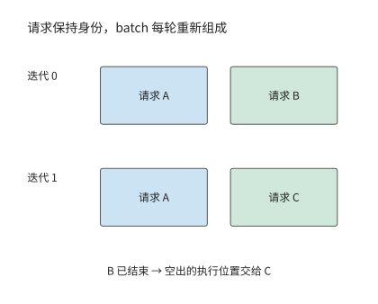

*图 8-1：A 跨越两个迭代继续执行。B 在第一轮结束，下一轮由 C 接替其执行位置（每轮为一条活跃请求预留的一行计算）；请求状态仍按各自身份保存。*

请求到达后，先进入等待队列。调度器将请求加入 batch、分配 KV 空间后，模型才开始处理输入，即 prefill 阶段。由于输入 token 已经全部给定，模型可以同时计算多个 token，并保存各层的键和值。提示的最后一个 token 计算完成后，模型生成第一个输出 token。

随后进入 decode 阶段。模型将刚生成的 token 作为下一次前向计算的输入，读取上下文 KV，再生成下一个 token。同一条请求必须依次完成这些步骤，不同请求的当前步骤则可以一起计算。因此，即使单条请求只能逐个生成 token，实例仍能通过合批提高总吞吐。

在这张卡上，实验 8-1 单独运行一条 2K 输入的短请求：prefill 并返回首个 token 用时约 0.096 秒，此后平均每隔 26.5 ms 返回一个 token。假设这条请求先排队 0.1 秒，用户便在到达后的第 0.196 秒收到第一个 token。总共输出 256 个 token，需要经历 255 个输出间隔，因此请求总耗时为

$$
0.1+0.096+255\times0.0265=6.95\ \mathrm{s}.
$$

这条请求能在 7 秒内完成。如果生成期间插入另一条短请求的 prefill，某个输出间隔就要多等约 0.096 秒，从 26.5 ms 延长到约 123 ms，总耗时增加到 7.05 秒。每个 token 的计算内容没有改变，仅仅调整执行顺序，就可能使请求超时。

图 8-2 把这 6.95 秒画成一条时间线。首个 token 的返回时刻将时间线分成两段：此前的排队和输入处理决定用户何时看到响应，此后的 255 个间隔决定用户何时收到完整答案。后续所有调度优化，都可以理解为改变这条时间线上某一段的长度。

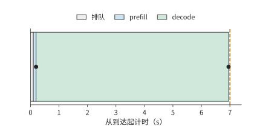

*图 8-2：一条输出 256 个 token 的请求。排队 0.1 秒、prefill 0.096 秒，后续 255 个输出间隔各为 26.5 ms（实验 8-1 的 batch 1 实测）。横条按实际时间比例绘制，点标出首、末 token；7 秒虚线是完成时限。*

请求完成后，调度器不再为它安排计算，状态管理器则决定如何处理留下的 KV。该请求独有的 KV 随请求结束而释放，公共前缀的 KV 则可以保留下来供后续请求复用，由缓存策略继续管理。第 8.3 节将进一步说明这些缓存何时共享、何时释放。

### 8.1.2 权重、KV 与运行时缓冲的存储容量需求

要让多条请求沿各自的时间线向前执行，实例必须同时保存权重、请求状态和计算中间结果。本节的算例只用一张卡，因此只列出这张卡上的内存占用。多卡实例则要按各卡保存的权重分片、KV 和缓冲区分别列式：某张卡上的空闲内存，只有改变数据放置，才能用于另一张卡的计算。

用 $M_w$ 表示常驻权重的容量，$M_{\mathrm{KV}}$ 表示去除重复引用后的物理 KV 块总容量（KV 按固定大小的块分配，多条请求共用的块只计一次），$M_a$ 表示激活与普通工作区的容量，$M_u$ 表示计算图重放等其他缓冲区的容量。这些内存占用之和必须小于或等于加速器可用容量 $C$：

$$
M_w+M_{\mathrm{KV}}+M_a+M_u\le C.
$$

在这几项内存占用中，权重在请求到达前就已加载到内存，KV 则随着请求到达和生成不断增长。要算出实例能同时处理多少请求，先求每个 token 要保存多少 KV。Qwen3-8B 有 36 层，每层有 8 个 KV 头，每个头的维度为 128。每个 token 在每层都需要保存 K 和 V，BF16 每个元素占 2 bytes，因此每个 token 所需的 KV 容量为

$$
k=2\times36\times8\times128\times2
 =147\,456\ \mathrm{bytes}=144\ \mathrm{KiB}.
$$

输入 2048 个 token 后，KV 占 288 MiB；输入 8192 个 token 后，KV 占 1152 MiB。所有请求共用约 15.3 GiB 权重，但每增加一条上下文独立的长请求，就要增加 1.125 GiB KV。16 条长请求仅保存输入的 KV 就需要 18 GiB，超过预留的 12 GiB。[^batch]

生成输出时，KV 还会继续增长。prefill 产生第一个输出 token，此后将前 255 个输出 token 依次送回模型，生成剩余的 255 个 token。短请求共计算 $2048+255=2303$ 个 token，长请求共计算 $8192+255=8447$ 个 token。若每块容纳 16 个 token，分别需要分配能容纳 2304 和 8448 个 token 的空间。

| 独立请求 | prefill 后 KV | 输出 256 个 token 后的 KV 分配量 | 12 GiB 可同时容纳的请求数 |
|---|---:|---:|---:|
| 短对话 | 288 MiB | 324 MiB | 37 |
| 长上下文 | 1152 MiB | 1188 MiB | 10 |

表中最后一列分别由 $\lfloor12288/324\rfloor$ 和 $\lfloor12288/1188\rfloor$ 得到。如果只按 prefill 结束时的 KV 大小计算，12 GiB 能容纳 42 条短请求；但这些请求都生成 256 个输出 token 后，所需空间会增加到 13,608 MiB。接收请求时就预留生成阶段所需的空间，可以避免执行到一半才发现内存不足。

共享公共前缀可以进一步节省内存。长请求的前 6144 个 token 占 864 MiB KV，其余输入占 288 MiB。如果 16 条请求各自保存前缀，就会保存 16 份相同的 KV；如果引用同一份 KV，节省的空间便可用于各自的后缀。第 8.3 节将说明具体的块映射方式，并计算生成结束时的总容量。

### 8.1.3 从单请求时间到服务目标

把第 8.1.1 节时间线的两段写成可以设定时限的指标。设请求到达时刻为 $t_a$，共输出 $G$ 个 token，第一个与最后一个 token 返回给用户的时刻分别为 $t_1$、$t_G$。于是

$$
\mathrm{TTFT}=t_1-t_a,
$$

第 $j$ 个输出间隔为 $\mathrm{ITL}_j=t_{j+1}-t_j$。将首输出之前与之后的时间相加，完整请求时间为

$$
T_{\mathrm{request}}=\mathrm{TTFT}+\sum_{j=1}^{G-1}\mathrm{ITL}_j.
$$

第 8.1.1 节的例子中，TTFT 为 0.196 秒，后续 255 个输出间隔合计 6.76 秒。较短的 TTFT 让用户尽早看到响应，均匀的输出间隔便于连续阅读，而总耗时决定完整答案何时可用。SLO 将这些要求量化为时限。章首算例要求总耗时不超过 7 秒，调度算例还会比较最长输出间隔。

这些指标针对单条请求；实例整体的产出，还取决于一次同时处理多少请求，即 batch size（下文简称 batch）。吞吐表示单位时间内完成的工作量。实验 8-1 同时处理 16 条 2K 请求时，引擎每轮 decode 约 27.44 ms，每轮共输出 16 个 token，生成吞吐约为 $16/0.02744\approx583$ token/s；单条请求每 26.26 ms 输出一个 token 时，该值只有约 38。增加每轮输出数或缩短每轮时间，都能提高吞吐；用户实际等待多久，还取决于请求开始执行前的排队时间。

衡量服务效果还要检查答案是否正确。固定输出长度，便于在相同工作量下比较执行时间；让模型自然停止，则可以观察答案正确率、回答长度和重试次数。第 8.6 节将计算单位时间内正确且按期完成的请求数，同时评价速度与质量。

## 8.2 批处理与请求调度

### 8.2.1 权重复用如何提高批处理效率

考虑矩阵乘法 $Y=XW$，输入矩阵 $X$ 有 $b$ 行。同一个权重元素参与所有行的计算，因此将多行一起处理，可以在读取一次权重后完成更多乘加。假设每个权重元素在批内只读取一次，每次乘加计为两次运算，权重元素占 $s_w$ bytes。只计权重读取时，算术强度为

$$
I_{\mathrm{weight}}\approx\frac{2b}{s_w}.
$$

BF16 的 $s_w=2$。把同时执行一步 decode 的请求数从 1 增至 16，每条请求都提供一个新 token，各 token 的特征向量分别占输入矩阵的一行；矩阵便从一行增至 16 行，同样一次权重读取对应的运算量增至原来的 16 倍。不同请求共用权重矩阵，但注意力计算仍要分别读取各自的上下文 KV。

共用的前提是这一批请求用的是同一份权重。**低秩适配（LoRA）**放宽了这一前提：用两个小矩阵的乘积表示权重的调整量，基础权重原样保留，于是不同任务可以共用一个基础模型，各自只附加一份小的 adapter（适配器，即附加在基础模型上的可训练参数模块）。对 Qwen3-8B 的 Q、V 投影取低秩维度 16、BF16，一套 adapter 占 14.6 MiB，100 套合计 1.43 GiB，远小于 14.1 GiB 的矩阵权重。

一批请求若来自不同 adapter，共用的就只剩基础权重这一部分。低秩计算要按 adapter 分组，每组的行数是本批中属于该 adapter 的请求数；adapter 分得越散，每组行数越少，这部分的权重复用就越差。因此，一批里放几种 adapter 和放多少条请求，是两个要分开决定的量。

容量上同样要分开算。100 套 adapter 占 1.43 GiB，而 100 条互不共享的 8K 上下文，KV 合计 112.5 GiB。能容纳多少套 adapter 由小矩阵决定，能同时服务多少条请求仍由 KV 决定；前者宽裕，不等于后者也宽裕。[^lora]

设每轮只需读取一次的矩阵权重大小为 $D_w$，每条请求有 $L$ 个上下文 token，彼此不共享 KV，每个 token 的 KV 容量为 $k$。一轮的读取总量，以及平均每个输出 token 分摊的读取量，分别为

$$
D(b,L)=D_w+bLk,\qquad
d(b,L)=\frac{D_w}{b}+Lk.
$$

在每个输出 token 的读取量中，第一项是分摊后的权重读取，第二项是本请求的上下文 KV 读取。Qwen3-8B 的 $D_w$ 约为 14.1 GiB，2K 上下文的 KV 为 0.28125 GiB。当 batch 从 1 增加到 16 时，每个输出 token 分摊的权重读取降至约 0.88 GiB；batch 增至 64 时，再降至约 0.22 GiB。此时，每个输出 token 读取的 KV 已经比权重更多。[^batch]

图 8-3 展示了这一变化。横轴上相邻的刻度表示 batch 加倍，因此权重项每次减半；KV 项保持不变，两项之和逐渐接近 KV 对应的水平线。上下文为 2K 时，batch 从 1 增至 64，每个输出 token 的读取量从约 14.38 GiB 降至 0.50 GiB，约为原来的 1/29。上下文长度增至 8K 后，KV 容量变为原来的四倍，合批后的每个输出 token 仍需读取更多数据。

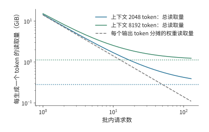

*图 8-3：批处理怎样减少每生成一个 token 所需的读取量。横轴为同时生成的请求数，纵轴为整批读取字节数除以本轮输出 token 数。蓝、绿实线分别对应每条请求已有 2048、8192 个 token 的上下文，包含权重与 KV 读取；同色水平点线仅表示该长度下的 KV 读取量。灰色虚线表示批内共用的权重读取量除以请求数。模型为 Qwen3-8B，使用 BF16；每份矩阵权重每轮读取一次，各请求的 KV 独立。两轴均为对数刻度。*

随着 batch 增加，分摊权重带来的节省逐渐减少。可以用权重读取量与 KV 读取量相等时的 batch 描述这一变化。使整批 KV 读取量达到或超过共享权重读取量的最小 batch 为

$$
b_{\mathrm{KV}}=\left\lceil\frac{D_w}{Lk}\right\rceil.
$$

用未经四舍五入的权重字节数计算，2K 上下文的结果为 51，8K 上下文为 13。上下文长度增至四倍后，KV 读取在小得多的 batch 下就超过了权重读取。与此同时，更大的 batch 也需要更多内存：64 条 2K 请求的权重和一步 decode 后的 KV 合计约占 35.7 GB。合批减少了每个输出 token 的读取量，却增加了同时驻留的数据量。

再估算这些读取所需的时间。设每条请求的运算量为 $F$，加速器每秒完成 $P$ 次运算，内存带宽为 $\beta$。分别计算运算与读取所需的时间，再取较大者估计一轮执行时间：

$$
T_{\mathrm{step}}\approx\max\left(\frac{bF}{P},\frac{D_w+bLk}{\beta}\right).
$$

令两项相等并整理，得到 $b(F/P-Lk/\beta)=D_w/\beta$。每增加一条请求，计算时间增加 $F/P$，KV 读取时间增加 $Lk/\beta$。前者更大时，计算时间会随着 batch 增长而追上读取时间；否则读取始终耗时更长。上述 51 和 13 比较的是两类数据的读取量，这里的方程比较的是计算与内存带宽对执行时间的限制。

两项分别按峰值算力和峰值带宽计算，得到的是这张卡在这组条件下的物理下界。下界与实测一轮时间之比，就是第 1.2.2 节定义的 MFU 和 MBU；第 8.6.3 节将用逐轮记录校准这两个比值，再用于本章其余算例。

落实到请求时间上，还要看更大的 batch 是否延迟了首个 token，以及相邻输出之间是否等得更久。batch 扫描实验同时记录了这两项变化。Qwen3-8B 输入 2K、输出 256 个 token 时，batch 从 1 增至 64，总吞吐从约 37 增至 1165 token/s；但首个 token 的返回时间从约 96 ms 延后到 3.29 秒，平均输出间隔从约 27 增至 40 ms。每轮输出虽然更多，但处理更多输入、运行更大的 batch 也花了更多时间。该实验中每批请求同时提交；在线服务若额外等待 batch 集满，这段时间还要计入首 token 延迟。[^batch-measure]

> **练习 8-1 · 计算：batch 增大时的读取量变化。** 取 $D_w=15,136,811,008$ bytes、$k=144$ KiB，计算 2K 与 8K 上下文在 batch 为 1、4、16、64 时每个输出 token 的读取量，并分别求两种上下文长度下，KV 读取量首次达到或超过分摊权重读取量的最小整数 batch。再用 12 GiB KV 可用内存、每块 16 个 token 和 256 个输出，分别求两种上下文长度下最多可以接纳多少条独立请求。比较可容纳请求数的上限与两类读取量相等时的 batch，判断容量限制是否会先阻止 batch 继续增大。

如果权重改由足够快的独立存储提供，读取耗时减少，批处理的收益就需要重新计算。沿用第 4 章的 8K 示例，设 $W$ 为整批读取的权重字节数，$B$ 为批内请求数，$K$ 为单请求本步读取的 KV 字节数。传统方案中，每个输出 token 分摊的 HBM 读取量为 $W/B+K$；权重由足够快的独立 ROM 提供时，HBM 每输出一个 token 仍需读取 $K$。[^core-calculation] 图 8-4 中两条曲线的距离随 batch 增大而缩小，说明原先依靠 batch 摊薄权重读取的收益正在消失。

不过，batch 仍会影响矩阵计算对计算单元的利用率，以及 batch 内的 KV 读取量。将新的读取量代入上述时间模型，就能求出计算与 KV 读取的交点，再按首 token 延迟和输出间隔选择 batch。

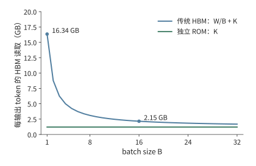

*图 8-4：每输出 token 分摊的 HBM 读取量。固定 8K 上下文，传统路径为 W/B+K，独立快速 ROM 路径为 K；纵轴按上述公式计算读取量。W 是整批读取的权重字节数，B 是批内请求数，K 是单请求本步读取的 KV 字节数；W/B+K 为每个输出 token 分摊的读取量。*

### 8.2.2 从固定 batch 到连续批处理

两条请求同时开始生成，一条需要八个 token，另一条只需要两个。短请求结束以后，长请求还要继续六步。如果一定要等这两条请求都结束才接下一组，短请求空出的执行位置就会一直闲置。**固定批处理**按整组接收、整组结束；连续批处理则在迭代边界重新安排活跃请求，空出位置后即可接纳新请求。

第 8.2.1 节的 batch 分析假定一轮中有 $b$ 条请求参与计算，实际行数会随请求结束和新请求加入而变化。图 8-1 中的执行位置对应这里的一行计算，与第 7 章记录通信请求的槽位是不同的资源。能否及时补入新请求，决定了下一轮还能有多少行参与计算。

新请求更早进入，也意味着其输入计算更早占用加速器。若新请求带有较长的提示，prefill 就会延长已有请求两次 decode 之间的等待。调度器因此要在两件事之间分配加速器时间：处理新请求的输入，以及让已有请求继续生成。[^schedule-survey]

**算例：连续批处理为何缩短总时间，却延长输出间隔？** 最多同时运行两条请求。r0、r1 在零时刻到达，各输入 2048 个 token，分别输出 8、2 个 token；r2 在 20 ms 到达，输入 8192 个 token、输出 2 个 token；r3 在 30 ms 到达，输入 2048 个 token、输出 4 个 token。每轮耗时由实验 8-1 的 batch 1 实测拟合：固定 26.22 ms，每个新 token 加 30.4 μs，每对满足因果关系的查询与键加 3 ns。这组参数复现了 2K 请求单独运行时一轮 decode 的 26.26 ms 和 prefill 的 94.8 ms。固定部分是一轮中与 token 数无关的时间，包括读取整份权重（按 1792 GB/s 的峰值带宽约需 8.4 ms）和逐个提交 kernel 等开销。[^schedule]

固定 batch 让 r2、r3 等待 r0、r1 整组结束，总时间约 870 ms。连续批处理在 r1 结束后接纳 r2，总时间降到约 766 ms；但 r0 的下一次输出要等 r2 的 8K prefill，最大输出间隔从约 26 ms 增至 376 ms。总时间节省约 12%，一次输出停顿却增长到原来的 14 倍。

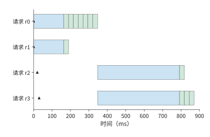

*图 8-5：固定 batch 等待整组结束，再接纳 r2、r3。蓝色为 prefill，绿色为 decode，三角为到达时刻。各色带宽度为整次调度迭代耗时，时间按 RTX PRO 6000 上的实测拟合计算。*

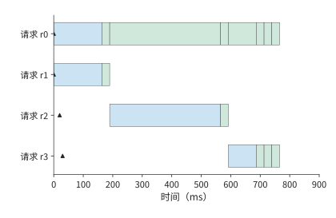

*图 8-6：连续批处理在 r1 结束后接纳 r2。每行是一条请求；蓝色为处理输入（prefill），绿色为生成输出（decode），三角形为请求到达时刻，色带宽度为所在调度迭代的耗时。r0 等待 r2 的 8K 输入处理，最长输出间隔增至约 376 ms；全部请求约 766 ms 完成。*

进一步把 r2 的 prefill 分成每块 2048 个 token，每轮最多处理 4096 个 token（与实验 8-1 的设置相同），每次先让已有请求继续 decode，再执行一段输入。最大输出间隔降到约 133 ms，所有请求的总完成时间约为 844 ms。分块后，调度器能更频繁地安排已有请求继续生成，使输出间隔更均匀。

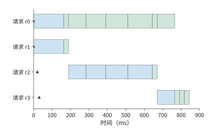

*图 8-7：将长输入分块处理，每轮先安排已有请求生成，再处理一块新输入。每行是一条请求；蓝色为输入处理，绿色为输出生成，三角形为到达时刻。分块使最长输出间隔降至约 133 ms，全部请求约 844 ms 完成。横轴与图 8-5、8-6 使用相同时间尺度。*

### 8.2.3 长 prefill 对生成的干扰与分块执行

一次处理的 prefill 块越大，新请求所需的输入处理轮数越少；块越小，已有请求就越早得到下一次执行机会。调度器通常先安排正在 decode 的请求，再用本轮 token 上限中剩下的部分处理 prefill。这样，长输入就分散到多个输出间隔里计算。

块长相同，注意力的工作量仍会随着上下文增长。设本块包含 $c$ 个新 token，已有上下文长度为 $h$。第一个新 token 关注 $h+1$ 个 token，第二个关注 $h+2$ 个，最后一个关注 $h+c$ 个。把这些配对逐项相加：

$$
N_{\mathrm{pair}}=(h+1)+(h+2)+\cdots+(h+c)
=ch+\frac{c(c+1)}{2}.
$$

$ch$ 来自新 token 对旧上下文的访问，三角形项来自块内的因果注意力。取 $c=512$，首块的 131,328 个配对全部来自块内；8K 输入的末块已有 7680 个上下文 token，配对数增至 4,063,488，约为首块的 31 倍。

图 8-8 将配对数画成面积：每个新 token 都要访问全部旧上下文，形成左侧矩形；块内只能关注当前 token 位置及其之前的位置，形成右侧三角形。块长固定时，右侧三角形不变，左侧矩形随上下文增长而变宽。这就是末块需要更多注意力计算的原因。

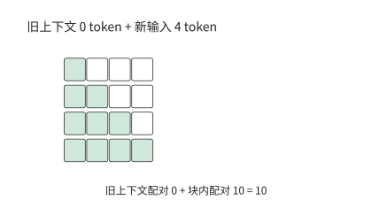

*图 8-8：首次处理 4 个 token 时，没有旧上下文，只有新 token 之间的因果注意力配对，形成 1 + 2 + 3 + 4 = 10 个绿色格。白格表示未来 token，不参与当前查询。*

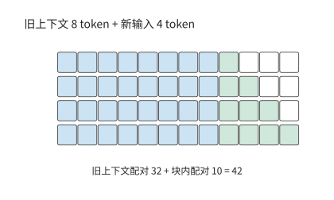

*图 8-9：已有 8 个 token 的上下文时，4 个新 token 与旧上下文形成 4 × 8 = 32 个蓝色格，块内仍为 10 个绿色格。块长相同，总配对从 10 增至 42。*

模型还要执行投影和 FFN，这些对各 token 分别做特征变换的计算每块都处理 512 个新 token，工作量基本相同。在已有逐块记录中，末块的模型主干矩阵运算量比首块多约 32%，执行时间中位数从约 25.3 ms 增至 35.1 ms，增加约 39%。整块执行时间因此由两部分共同决定：一部分主要随新增 token 数变化，另一部分还随已有上下文长度增长。[^chunk]

上下文增长解释了同样大小的块为何越来越慢；缩小块长则会带来另一种开销。把一个 256 个 token 的块拆成两个 128 个 token 的块，调度机会增加一次，矩阵行数减半，每个小块都要使用同一份权重。以一层 FFN 的 288 MiB 权重为例，设两次执行分别从显存读取它们，这部分读取就从 288 增至 576 MiB。小块让已有请求更早获得执行机会，也增加了执行次数；调度器应选择能满足输出间隔要求的较大块，使新增启动与读取尽量少。[^nanoflow]

### 8.2.4 Token 预算、动态形状与执行时间

调度器通常设置每轮处理的 token 数量上限，称为 token 预算；第 8.2.2 节分块算例中每轮最多处理的 4096 个 token 就是一例。实际执行则要把这些 token 的特征向量组成矩阵，并选用 kernel 或预先捕获的 CUDA Graph（第 5.5.2 节）。实际执行的矩阵可能比本轮需要的更大，因此少处理一个 token，并不一定能少做一份计算。

例如，预先捕获 16 行和 32 行两种计算图，将 17 到 32 行的输入都填充到 32 行。把工作从 18 行减为 17 行，仍执行 32 行图；再从 17 行减为 16 行，才能使用较小的图。若为 17 行另捕获一个图，就省去 15 行填充，但捕获该图需要准备时间，重放所用的缓冲区还要长期占用内存。因此，选择 CUDA Graph 的预设形状时，也要计入第 8.1 节的运行时内存开销。

执行形状决定一轮的耗时，token 上限则决定这一轮分给新请求多少工作。增加上限能让长输入更早处理完，但已有请求要等这轮结束才能继续输出。在六条请求的回放记录中，请求每隔 80 ms 到达。每轮 token 上限从 512 增至 8192，后到请求在引擎中排队的时间从约 149 ms 降到不足 0.1 ms，最长输出间隔却从约 32 增至 183 ms。上限越高，一轮完成的输入越多，新请求越早离开队列，已有请求等待下一次输出的时间也越长。[^replay]

因此，可以分两步确定每轮处理多少 token。先根据允许的输出间隔确定一轮最多执行多久，再结合上下文长度和预设执行形状，换算为可处理的新 token 数。在相同时间内，上下文较长的请求能处理的新 token 较少，上下文较短的请求则可以使用更大的块。确定执行安排后，还要为这些请求分配 KV 空间；下一节将讨论如何分配和复用这部分内存。

> **练习 8-2 · 核心 · 分析：由输出间隔限制确定 prefill 分块大小。** 采用第 8.2.2 节的四条请求与执行时间模型，手算 r0、r1 的初次 prefill 和下一步 decode 各需多久，再计算连续批处理接纳 r2 时该轮的耗时。解释最长输出间隔的来源。固定新块长度 $c=512$，分别计算已有上下文长度 $h=0$ 与 $h=7680$ 时的注意力配对数。最后分析配套的六条请求回放记录，在“最长间隔小于 50 ms”和“后到请求尽快接纳”两种目标下分别选择每轮 token 上限，并指出哪一项耗时决定了选择。

## 8.3 KV 缓存的分配、复用与释放

### 8.3.1 预留、碎片与分页分配

第 8.1 节按最大输出长度为每条请求预留空间，保证它能持续生成。如果请求提前结束，预留空间的尾部就一直没有使用。另一种办法是随生成过程逐步扩展内存，但若必须保持空间连续，邻接区域被其他请求占用时，就需要搬移数据或等待。

可以把这种分配比作活页册：阅读顺序由页码确定，各页不必放在相邻位置，只要记得每一页在哪里。序列增长时，在任意空位放入新页并记录其位置，就不必为了连续排列而搬动整册内容。

**分页分配**将序列分成固定大小的块。**逻辑块**按序列中的 token 位置编号，相当于页码；**物理块**是实际保存 KV 的内存区域；每条请求维护的**块表**记录逻辑块对应哪个物理块。序列增长到需要新块时，引擎从空闲池分配一个物理块，并增加映射。注意力计算根据块表找到所需位置的 KV，因此物理块可以分散存放。这里讨论的是 KV 在内存中的分块寻址，多级存储之间的换入换出留到第 8.3.4 节和第 8.4.3 节讨论。

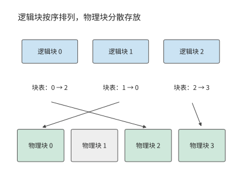

*图 8-10：逻辑块 0、1、2 按顺序组成序列，块表分别指向物理块 2、0、3。物理块 1 为空闲，注意力按块表恢复逻辑顺序。*

设每块可保存 $p$ 个 token 的 KV，当前长度为 $L$，需要 $\lceil L/p\rceil$ 个块。只有最后一块存在尾部未使用的 KV 槽位，浪费为

$$
p\left\lceil\frac{L}{p}\right\rceil-L,
$$

最多浪费 $p-1$ 个 token 的 KV 空间。块越小，这一上限越低，块表项和分配次数也越多。2023 年，伯克利等机构的研究者在 vLLM 中提出 PagedAttention，将操作系统分页管理的思路用于 KV 缓存，减少预留空间与内存碎片对服务并发的限制。PagedAttention 将这种映射带入注意力执行；FlashAttention 则在算子内部组织分块计算与中间结果，两者分别作用于状态分配和计算访存。

**算例：KV 分页分配能减少多少预留空间？** 设 A、B、C、D 当前长度分别为 9、13、5、15，每条最大允许 16 个 token。整段预留时，四条请求共预留可保存 64 个 token 的 KV 空间；取 $p=4$，分页分别分配 12、16、8、16，共可保存 52 个 token 的 KV 空间。其中实际保存的 KV 仍对应 42 个 token，未用容量从 22 个 token 减到 10 个 token。

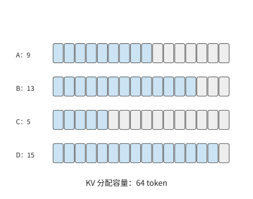

*图 8-11：四条请求分别含 9、13、5、15 个 token，每条预留可保存 16 个 token 的 KV 空间，共分配可保存 64 个 token 的 KV 空间。蓝色已用，灰色预留未用。*

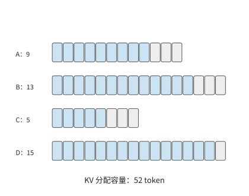

*图 8-12：按每块保存 4 个 token 的 KV 分配空间，四条请求分别获得 12、16、8、16 个 token 的容量，合计 52 个。灰色表示块尾未用容量，由 22 个 token 减到 10 个 token。*

若 A、B 的前八个 token 相同，还可以让它们共用两个完整块，使总分配量进一步降至 44 个 token。分页减少了尚未使用的预留空间，共享消除了重复保存的上下文，两者节省的是不同部分的内存。

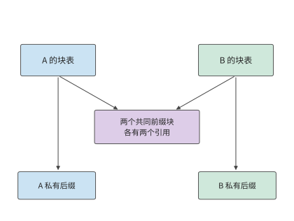

*图 8-13：A、B 的两个共同前缀块只保存一次，各自块表都指向它们。A、B 保留各自的私有尾块；四条请求实际分配的 KV 容量进一步降至 44 个 token。*

### 8.3.2 分支共享、写时复制与内存释放

前缀共享图中，B 与 A 引用相同的两个物理块。如果 A 先结束，这两个块仍要留给 B；如果 B 要修改其中的内容，又不能影响 A。要实现共享，就需要确定何时释放共享块，以及如何避免不同请求互相覆盖数据。每张块表中指向某个物理块的记录称为一个**引用**，共享块由多个块表引用；**引用计数**记录还有多少使用者需要它。每当一条请求获得引用，引用数加一；请求结束时释放引用。最后一个引用释放后，该块才能回到空闲池；此时还要确认加速器操作不再访问它。这样，同一份共同上下文既能服务多个分支，也能在其中一条分支结束后继续服务其余分支。

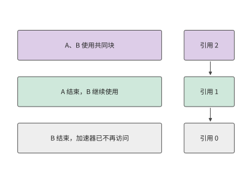

*图 8-14：A 结束后引用数从 2 降到 1，B 仍可使用；最后一个引用释放且加速器已用完，块才能回到空闲池。*

写入共享尾块需要取得独立副本。例如，可存 4 个 token 的块中已写入三个共同 token 的 KV，两个分支接下来分别写入不同 token。如果写到原块，两条分支会争用块中的第四个 token。**写时复制**是在修改共享内容之前取得私有副本的机制。此时先复制这三个 token，两条分支分别追加；此前已填满的只读块继续共享。随着分支增长，公共前缀保持一份，各分支分别保存自己新增的后缀。

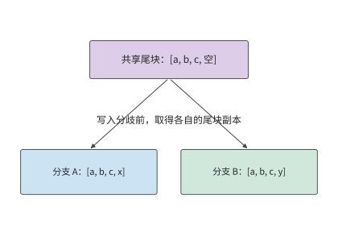

*图 8-15：每块 4 个 token 的尾块已有共同的 a、b、c。分支分别追加 x、y，需要不同物理尾块；此前已填满的块继续共享。*

在已有的四分支实验中，公共前缀占 95 块，每条分支另有 9 个私有块。四张块表共有 $4(95+9)=416$ 次引用，但实际物理块数只有

$$
95+4\times9=131.
$$

独立保存需要 416 块，共享后减少约 69%。这项节省来自对公共前缀的去重，36 个私有尾块仍随分支数增长。[^pages]

服务系统知道哪些 token 属于共同前缀，哪些 token 会在分支后独立写入，因此可以把模型的复用关系落实为物理块共享。块表负责地址映射，前缀关系决定共享范围，分支写入时才创建私有副本。原来按整条请求独立预留的空间，由此改为按实际产生与复用的状态分配。

**公共前缀共享后的整批 KV 容量。** 16 条长请求共享前 6144 个输入 token，其 KV 共占 864 MiB。每条请求的私有部分包含 $8192-6144+255=2303$ 个 token。按每块 16 个 token 分配，需要容纳 2304 个 token，即 324 MiB。因此，整组请求生成完毕时所需的 KV 空间为

$$
M_{\mathrm{KV}}=864+16\times324=6048\ \mathrm{MiB}.
$$

这组请求原来需要 $16\times1188=19008$ MiB，共享后约为 5.91 GiB，可以放入预留的 12 GiB 内存。一般地，$b$ 条同类长请求占 $864+324b$ MiB，因此容量上限从 10 条独立请求增加到 35 条共享请求。

块用完之后，还要正确释放才能交给后续请求。释放内存需要同时满足两个条件：没有使用者继续持有引用，已提交的加速器操作也不再访问该块。用户取消请求后，调度器停止安排新计算，等待已提交的操作完成，随后释放私有块。一次观察中，取消调用约 1.6 ms 就返回了，而对应的 104 个块直到约 31 ms 才释放。后续请求在释放之后使用这些块，便不会覆盖旧请求仍在读取的数据。[^cancel]

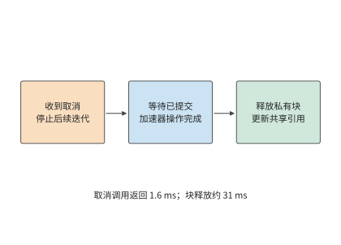

*图 8-16：取消接口返回表示已接收取消请求。已提交的加速器操作完成后，再释放私有块和相关引用；观测中的 1.6 ms 与 31 ms 对应不同事件。*

除了请求结束或取消后的正常释放，内存不足时，引擎还可以抢占一条请求：暂停该请求并释放其 KV，之后再根据已保存的输入和输出重新计算状态。同一组实验使用 1 GiB KV 池时发生了一次抢占，比正常执行多调度 1805 个 token；使用 2 GiB 池时则没有这次重算。抢占暂时把内存让给其他请求，代价是恢复执行时需要重复计算。[^pages]

> **练习 8-3 · 计算：KV 块大小与前缀共享如何影响容量。** 将四条长度 9、13、5、15 的序列分别按 2、4、8 个 token 分页，计算四条序列各自尾块中未使用的 KV 槽位数，并分别求出未使用 KV 槽位和块表项的总数。再按章首算例计算 8、16、32 条长请求在独立与共享状态下的完整容量。保持每条请求的总长度不变，将一个原本私有的完整块改为公共前缀的一部分，求 $b$ 条请求合计可以少分配多少物理块。

### 8.3.3 对话与智能体的前缀复用

第 8.3.2 节计算了同时运行的请求如何共用物理块。这种共享还可以跨越请求的结束时刻：旧请求留下的前缀 KV，能让后来的请求免去同一段输入的计算。如果后续请求的前缀完全相同，并使用相同的模型、位置编码规则、adapter 和状态格式，就能直接使用缓存中的 KV，从前缀末端继续 prefill。章首算例的公共前缀有 6144 个 token，命中缓存后，每条长请求只需处理剩余 2048 个输入 token，再开始生成。

这种复用沿前缀连续发生。假设两条提示前 100 个 token 相同，第 101 个不同，即使后面的文本又相同，它们从第 101 个 token 起所依赖的上下文已经不同。把动态时间戳放在提示最前面，会使后面较长的共同工具定义失去复用机会；把稳定的系统提示与工具定义放在前面，再追加本轮变化，就能保留较长的公共前缀。[^context]

前缀树把这种结构直接表达出来：从根到分叉点是共同上下文，从分叉点到叶子是私有后缀。图 8-17 的前四轮输入首先共享 206 个 token，后三轮又沿同一条路径延伸。树上的边按新增 token 数标记，叶子给出完整输入长度。

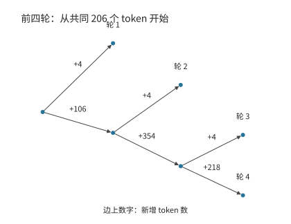

*图 8-17：前四轮代码 Agent 输入的压缩前缀树。根部已有 206 个共同 token，边上是新增数量，叶子是输入轮次。分叉表示后续内容不同。*

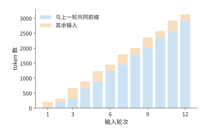

*图 8-18：蓝色为与上一轮逐 token 相同的前缀，橙色为其余输入。此图描述输入内容的可复用程度，实际缓存命中还取决于状态是否保留。*

每轮在末尾追加内容，可以保留已有的公共前缀，但上下文越长，KV 占用和后续读取量也越大。

**扩展：混合注意力模型如何确定可恢复的前缀位置。** 全注意力保留逐 token KV，递推模型通常只保留当前状态。设文本匹配到第 10,752 个 token，递推快照分别保存在第 4096 和第 8192 个 token；系统从 8192 恢复，再计算到 10,752，重算 2560 个 token。增加快照可以减少重算的 token 数，但要保存更多状态。以第 2 章的 KDA 为例，一种实现将层内张量分到八张卡（TP=8），此时每卡每份快照约 53.6 MiB，保存 2 份约 107 MiB，保存 32 份约 1714 MiB。快照保存得越密，恢复时需要重算的 token 就越少，保留的状态也越多。[^hybrid]

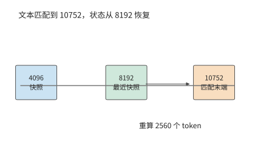

*图 8-19：文本匹配到 10752，最近状态快照在 8192。恢复后仍需重算 2560 个 token，才能得到匹配末端的递推状态。图中 10752 和 8192 是从序列起点累计的 token 数。*

**上下文编排还可以主动改变复用机会。** 假设已有 8K token 的上下文，下一轮追加 1K 工具结果，最多可复用原来的 8K 前缀，只需处理新增部分；如果改写最前面的指令，后面的内容即使文字相同也不能继续复用。另一种方案是把历史总结为 2K，再追加 1K。摘要替换原始历史后，后续计算使用更短的上下文，但多出一次总结与重新处理的开销。因此，组织上下文时，需要同时考虑内存占用、重算时间和后续读取量。

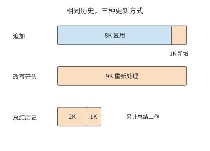

*图 8-20：同一历史的三种更新方式。蓝色表示可复用前缀，橙色表示需要重新处理的输入；总结方案先生成摘要，再重建缓存。长度以 K token 示意。*

模型侧的前缀复用还涉及更细的状态区分。DeepSeek V4.1 在复用前缀时，对两类局部状态分别处理。第 2 章介绍的 CED 结构包含因果编码器和解码器，两者各有 SWA 的局部状态：**编码器 SWA**可以在主机 DRAM 池中短期保留，供下一轮沿已有前缀继续处理新输入；**解码器 SWA**只为本轮后续生成使用，论文中的部署不把它作为前缀缓存保存。全局 KV 则进入可较长期复用的缓存。因此，生成期间驻留的 40 层 SWA 与跨轮次保留的前缀缓存，需要分别计算容量。[^v41-case]

这两类状态是否命中，决定了下一轮续算时编码器要恢复多少前缀。设工具返回后，恢复所需的 token 或输入表示仍可取得，模型版本、token 位置索引与输入保持一致。全局 KV 和编码器 SWA 都命中时，编码器直接处理追加输入；仅全局 KV 命中时，编码器重放已缓存前缀的最近最多 128 个 token，并与未缓存后缀一起执行。重放段重建编码器 SWA，继续使用既有全局 KV；新增后缀产生新的全局 KV 和 SWA。全局 KV 也未命中时，则重算缺失前缀。

随后，每次 prefill 都有共同的一步：取完整提示末尾最多 128 个 token 的编码器输出，经过 20 层解码器，近似构建解码器 SWA，为第一步 decode 准备局部状态。因此，编码器缓存全部命中时，可以省去编码器的前缀恢复，但解码器仍需执行窗口重放。

短窗口重放得到的是近似恢复的状态，误差来自更早的局部依赖被截断。每层虽然只访问最近 128 个 token，多层叠加后，局部状态仍可通过前一层间接依赖更早的输入。从窗口边界重新执行，会改变这部分历史信息。技术报告第 3.2.2 节因此将编码器重建的状态定义为近似状态；这一状态又参与后续计算，使新增后缀的全局 KV 和 SWA 随恢复起点变化。

两类状态的区分最终体现在缓存容量上。在 DeepSeek V4 技术报告采用的工作负载与缓存策略下，SWA 约占长期缓存的一半。V4.1 将这部分移出持久化缓存，再将全局 KV 压到约四分之一，长期存储量因此约为原来的 $1/2\times1/4=1/8$。短期保留的编码器 SWA 放在 DRAM 中，解码器 SWA 则在本轮生成时驻留加速器。缓存按使用时段分层保存，进一步降低了长期容量需求。

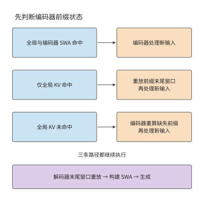

*图 8-21：编码器的三条前缀恢复路径与共同的解码器重放。缓存命中状态中的 SWA 专指编码器；所有路径在 prefill 中仍构建解码器 SWA，再开始生成。箭头表示执行先后，框大小不代表耗时。*

### 8.3.4 缓存准入、淘汰、换出与重计算

请求结束后保留前缀，是为了将来再次使用时省去重算。设前缀再次用到的概率为 $p_h$，重算时间为 $T_r$，从缓存取回并准备好状态的时间为 $T_f$，维护缓存所需时间为 $T_m$。每次命中能节省 $T_r-T_f$；乘以命中概率，再减去维护时间，就得到期望净节省：

$$
V_h=p_h(T_r-T_f)-T_m.
$$

以章首长请求的 6144 个 token 公共前缀为例，它的 KV 占 864 MiB（0.906 GB）。在 RTX PRO 6000 上重算这段前缀要做 96.5 TFLOP 的矩阵运算，按实验 8-1 中 batch 1 prefill 达到的 BF16 峰值的 62%（第 8.6.3 节）计，约需 307.9 ms。把这段前缀换出到主机内存后，经这张卡的 PCIe Gen5 x16 链路（每方向 64 GB/s）取回约需 14.2 ms；[^pcie]维护开销取换出时写回主机的一次传输，也是 14.2 ms。命中概率为 50% 时平均节省 132.7 ms。要让保留前缀节省时间，需满足

$$
p_h>\frac{T_m}{T_r-T_f}=\frac{14.2}{293.7}=4.8\%.
$$

若主机链路换成 PCIe Gen4 x16（每方向 32 GB/s），取回和换出各增至 28.3 ms，每次命中只省 279.6 ms，所需的最低命中概率升至 10.1%。换出释放了加速器空间，但只有前缀足够常用，才能抵消取回和维护所需的时间。

前缀值得保留，并不意味着应该优先保留。空间紧张时，大前缀会占用原本能保存多个小前缀的空间。设 A 为上述 6144 个 token 前缀；每个 B 类前缀含 2048 个 token，占 288 MiB，同样按 PCIe Gen5 取回与换出，重算 94.7 ms、取回和维护各 4.7 ms，命中概率同为 50%，期望节省 40.3 ms。图 8-22 将两者放进同样大小的缓存：保存一个 A 能节省 132.7 ms，保存三个 B 合计节省 120.9 ms。重算时间随前缀长度超线性增长，6144 个 token 的 prefill 是 2048 个 token 的 3.25 倍，因此同一块内存用于保存长前缀的收益更高。

这种比较也可以换算成单位容量的收益：A 每 MiB 约节省 0.154 ms，B 约节省 0.140 ms。按该数值排序，可以比较大小不同的前缀。

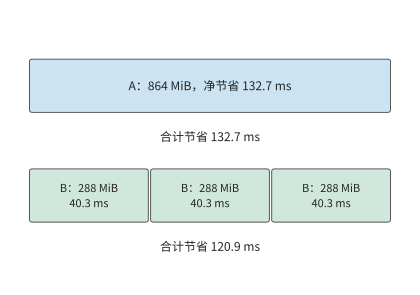

*图 8-22：缓存容量均为 864 MiB。A 占 864 MiB，期望净节省 132.7 ms；三个 B 类前缀各占 288 MiB、各节省 40.3 ms，合计 120.9 ms。图中宽度表示容量；时间按 RTX PRO 6000 上的重算时间和 PCIe Gen5 取回时间计算，命中概率均为 50%。*

上述选择有一个前提：前缀必须保留到下一次使用时。缓存容量不足时，即使下一轮输入保留了相同前缀，也可能因为状态已经淘汰而要重新计算。一次 12 轮 Agent 输入回放包含 19,556 个输入 token。在相同干扰请求下，6 GiB 缓存池命中 16,304 个 token，只需重新处理 3252 个；1 GiB 池则没有命中，需要重新处理全部输入。将相邻两轮之间的等待时间增加 0.2 秒后，命中数量没有改变。这组对照中，增加容量保留了可复用的前缀，单纯延后下一轮请求没有产生同样的效果。[^prefix]

**缓存准入**决定请求结束后是否保留其前缀；淘汰策略决定空间不足时先删除哪个前缀；换出策略决定将状态移到哪一级存储；重计算策略决定重新执行多少输入 token。对于章首的 16 条长请求，保留一份公共前缀只需 864 MiB，却能同时节省重复存储和后续请求的 prefill 计算。

> **练习 8-4 · 核心 · 分析：有限缓存应保留哪些前缀，才能节省最多时间？** 缓存可用空间为 864 MiB。前缀 A 含 6144 个 token、占 864 MiB；三个相互独立的 B 类前缀各含 2048 个 token、占 288 MiB。在 RTX PRO 6000 上，按 BF16 峰值 503.8 TFLOP/s 的 62% 由矩阵运算量求重算时间，按 PCIe Gen5 x16 每方向 64 GB/s 求取回时间，维护时间取一次换出，与取回相同；命中概率均为 50%。比较保留一个 A 前缀与保留三个 B 类前缀的期望净节省时间。保持 B 类前缀的命中概率不变，求 A 的命中概率低于多少时，应改为保留三个 B。再把链路换成 PCIe Gen4 x16（每方向 32 GB/s），重新比较。数据分析部分读取配套 12 轮输入与缓存回放，分别计算共同前缀比例和实际命中比例，解释其他请求占用缓存空间为何会影响实际命中比例。

## 8.4 压缩与卸载

### 8.4.1 权重量化后的内存占用

前缀共享通过去除重复的 KV 节省空间。即使请求之间没有相同前缀，也可以用量化减少权重和 KV 的存储量。量化通常将数值分组编码，每组保存较低位宽的编码值，以及 scale 等元数据；计算时再根据这些信息恢复近似数值。

**Q2_K** 是张量计算库 GGML 系列实现中的一种分组量化格式，主编码使用 2 bit，并为组内的 scale 保存额外信息。以该格式为例，每组有 256 个值，2-bit 编码占 $256\times2/8=64$ bytes，scale 和最小值等元数据另占 20 bytes。因此，一组共需 84 bytes，平均每值为 $84\times8/256=2.625$ bit。位宽降低后，元数据在总容量中的比重相应提高，在该格式中约占 24%。[^gguf]

**扩展算例：量化权重加载到内存后，还能容纳多长的上下文？** Qwen3-235B-A22B 的一个 Q2_K 文件变体采用以 2 比特为主的分组量化，并混合使用多个位宽，量化编码与未量化的浮点数据约 64.43 GiB、量化元数据约 15.37 GiB，加上文件头与填充，共约 79.81 GiB。另一个 `UD-Q2_K_XL` 变体约 81.97 GiB。以实验 8-7 所用的 Apple M2 Max 为例，它的统一内存标称 96 GB（十进制），给系统与工作区预留 8 GiB，剩余约 81.41 GiB。[^files]

将前一个文件加载到内存后，还剩 1.60 GiB；后一个文件则已经超出可用空间约 0.56 GiB。该模型一条 8K 上下文的 BF16 KV 约占 1.47 GiB，因此前一种方案还能处理一条请求，并剩余约 0.13 GiB。若上下文长度增至 32K，KV 就需要约 5.88 GiB，必须增加内存或改变权重的存放方式。两个文件的大小只相差 2.16 GiB，已经足以决定能否容纳请求。

在统一内存系统中，CPU 和 GPU 共用物理内存。将权重文件映射到地址空间后，访问相应数据时，文件页面才需要驻留在物理内存中。如果执行时要访问的数据总量超过内存容量，就会不断换入页面。因此，要解决容量不足的问题，可以减少数据本身的字节数，也可以只保留当前需要的数据，其余数据在使用前搬入。下面先计算 KV 压缩的收益，再分析权重搬入所需的时间。

### 8.4.2 KV 压缩与读取成本

把同样的分组方法用于 KV，可以计算节省的空间能多容纳多少请求。权重由许多请求共享，KV 却持续随输入与输出增长。对本章模型，一条 8K 上下文的 BF16 KV 为 1152 MiB。量化改变每个值的位宽，上下文表示则改变每个 token 要保存多少个值：第 9.2.2 节把同一 8K 上下文的 GQA 与紧凑 MLA 状态并列，后者只有 549 MiB。每 32 个 BF16 值占 64 bytes。**q8_0** 是每 32 个值共用一个 scale 的 8 bit 量化格式。改成 q8_0 时保存 32 bytes 码值和 2 bytes scale，变为原来的 $34/64$；**q4_0** 采用同样的分组方式、将码值降至 4 bit，保存 16 bytes 码值和 2 bytes scale，变为 $18/64$。

因此，同一条上下文所需容量为

$$
M_{q8}=1152\times\frac{34}{64}=612\ \mathrm{MiB},
\qquad
M_{q4}=1152\times\frac{18}{64}=324\ \mathrm{MiB}.
$$

与 BF16 相比，q8_0 节省 540 MiB，q4_0 节省 828 MiB。计入 scale 后，两种格式平均每值分别占 8.5 bit 和 4.5 bit。由于每组都要保存 scale，元数据也会随 KV 长度一起增长。[^kv-format]

图 8-23 将这一步还原为字节布局。每行都保存相同的 32 个值：编码部分缩短了，scale 仍要留下。因此，q8_0 和 q4_0 的总长度分别是 34 和 18 bytes，而不是只看编码位宽得到的 32 和 16 bytes。

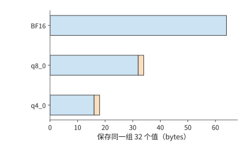

*图 8-23：BF16、q8_0、q4_0 保存同一组 32 个数值所需的空间。横条按字节数成比例绘制；橙色为每组 2 bytes 的 scale。把每组总长度乘以组数，就得到整条上下文的 KV 容量。*

章首算例中的长请求生成完毕后，BF16 KV 按块分配共占 1188 MiB。改用同一布局的 q8_0 后，需要 $1188\times34/64=631.125$ MiB，16 条独立长请求合计约 9.86 GiB，可以放入预留的 12 GiB 内存。由此可见，共享和压缩节省空间的方式不同：共享去除重复前缀，压缩减少每个数值所占的字节。

用压缩 KV 做注意力计算时，读取量减少了，但格式转换需要额外时间。设一次计算少读 $\Delta D$ bytes，有效带宽为 $\beta$，转换增加的串行执行时间为 $T_c$，则净节省时间为

$$
\Delta T=\frac{\Delta D}{\beta}-T_c.
$$

例如，在 RTX PRO 6000 上将一条 8K 上下文从 BF16 改为 q8_0，少读 540 MiB。按读取受限时的有效带宽约 1.16 TB/s 计（第 8.6.3 节，峰值 1792 GB/s 的 65%），约节省 0.487 ms。若转换增加 0.2 ms，最终节省约 0.287 ms；若转换增加 0.8 ms，反而增加约 0.313 ms。同样的压缩格式是否能加快执行，取决于转换时间是否少于节省的读取时间。

上下文越长，减少读取所节省的时间越多。一项早期评估在 H100 上运行 Llama-3.1-8B，分别用 $6.44+4.37\times10^{-5}L$ 和 $6.58+2.37\times10^{-5}L$ ms 拟合 BF16 与 FP8 的输出间隔。FP8 固定项多 0.14 ms，每个上下文 token 的增长项少 $2\times10^{-5}$ ms。用固定开销之差除以每增加一个上下文 token 的耗时之差，得到交点约为 7000 个 token；在 2K 时 BF16 约 6.53 ms、FP8 约 6.63 ms，在 16K 时则分别约 7.16 和 6.97 ms。上下文较长时，读取节省的时间超过了新增的固定开销。[^kv-format]

本节开头提到，上下文表示决定每个 token 要保存多少个值；混合注意力模型的局部与全局两类状态，也可以按这种方式比较容量。在 8K 上下文基线下，把全局历史与有效 SWA 的容量相加。DeepSeek V4.1 的两项分别为 6.953 MiB 与 2.578 MiB，共 9.531 MiB；V4 的对应两项合计为 30.521 MiB，约为 V4.1 的 3.20 倍。局部窗口占固定空间，因此短上下文下的合计容量差距小于全局历史的 3.95 倍。

### 8.4.3 权重卸载、预取与每步搬移

压缩减少了数据本身的大小。另一种扩展容量的方法是让数据轮流驻留在 GPU 上：只在计算需要时搬入，用完后复用这块空间。权重卸载将部分原本常驻 GPU 的权重移到主存，并在计算相应层之前搬回 GPU。节省的加速器内存可以用于 KV，但每次前向计算都需要重新搬入这些权重。请求逐步生成输出时，搬移也随每轮 decode 重复。

Qwen3-8B 一层 FFN 的三个 BF16 矩阵共占 288 MiB。36 层中每四层卸载一层，共卸载九份 FFN 权重，释放 2592 MiB。GPU 上还要为预取（在计算某层之前，提前把它的权重复制到 GPU）预留缓冲区：一组缓冲占 288 MiB，净省 2304 MiB；两组占 576 MiB，净省 2016 MiB。以一条 8K 输入的 1152 MiB KV 为单位，前者能多容纳两条，后者只能多容纳一条。若按生成完毕时所需的 1188 MiB 预留空间，两种方案均只能增加一条完整请求。[^offload]

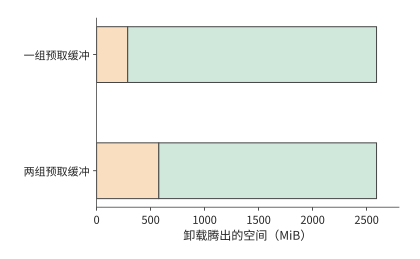

*图 8-24：卸载九份 FFN 共腾出 2592 MiB。橙色为留在加速器上的预取缓冲，绿色为可重新分配的净空间；一组缓冲净省 2304 MiB，两组净省 2016 MiB。*

预取必须遵守两个先后关系：权重复制完成后，计算才能读取；计算不再使用这组权重后，缓冲区才能写入下一组。使用一组缓冲时，同一缓冲区依次用于复制、计算和下一次复制；使用两组缓冲时，可以一边计算当前层，一边把后续层的权重复制到另一组缓冲区。这样能够重叠复制与计算，但缓冲区本身也会占用更多内存。

先计算搬移的链路成本。这张卡经 PCIe Gen5 x16 连接主机，每方向标称 64 GB/s。每轮要搬入 2592 MiB，即 2.72 GB，需要

$$
T_{\mathrm{copy}}\ge\frac{2.72\ \mathrm{GB}}{64\ \mathrm{GB/s}}\approx42.5\ \mathrm{ms}.
$$

这已经超过 batch 1 一轮 decode 的 26.26 ms。即使其余计算都能与复制同时完成，每轮仍至少需要约 42.5 ms。若每轮为四条请求各生成一个 token，总输出吞吐最多约为 $4/0.0425\approx94$ token/s，每条请求的输出间隔也至少约为 42.5 ms。生成 256 个输出 token 需要 255 次后续前向计算，仅权重搬移就要约 10.8 秒。因此，经 PCIe 卸载这部分权重，无法满足 7 秒的完成时限。

CPU 与 GPU 之间也有快得多的链路。GH200 用 NVLink-C2C 连接 Grace CPU 与 Hopper GPU，每方向 450 GB/s。同样的 2.72 GB 每轮至少约需 6.0 ms，255 轮合计约 1.54 秒。每轮复制短于一轮 decode 的计算，预取就能用计算掩盖复制。

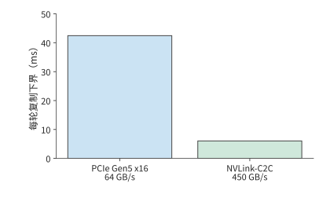

*图 8-25：每轮复制量保持为 2592 MiB（2.72 GB）。经 PCIe Gen5 x16（每方向 64 GB/s）至少需要约 42.5 ms，经 GH200 的 NVLink-C2C（每方向 450 GB/s）至少需要约 6.0 ms。*

这里起决定作用的是每轮搬移的数据量与有效带宽之比。预取可以让搬移与计算同时进行，但每轮需要传输的字节数仍然相同。

若先压缩权重再搬移，还要加上解压时间。设原始数据为 $S$ 字节，压缩后为 $rS$ 字节，链路带宽为 $B_{\mathrm{link}}$，解压吞吐为 $R_{\mathrm{dec}}$（按输出的原始字节计）。先传完再解压需要 $rS/B_{\mathrm{link}}+S/R_{\mathrm{dec}}$，直接传输需要 $S/B_{\mathrm{link}}$，因此只有当

$$
R_{\mathrm{dec}}>\frac{B_{\mathrm{link}}}{1-r}
$$

时，压缩后搬移才更快。把 96 MiB 权重压缩到四分之一，经 PCIe Gen5 x16 直接传输约需 1.57 ms，传输压缩数据只需 0.39 ms；要保留这 1.18 ms 的节省，解压器每秒必须输出超过 85.3 GB 的原始数据。链路越快，对解压吞吐的要求就越高。[^codec]

这一节的卸载中，模型计算始终由 GPU 执行，主存负责保存暂不使用的权重。第 9.3 节将进一步改变计算位置：专家权重已在主存时，可由 CPU 直接计算，只向 GPU 传回较小的激活，届时需要比较每个专家的输入行数、CPU 计算时间与权重传输时间。

> **练习 8-5 · 计算：权重卸载节省的容量与增加的搬移。** 设卸载九份 FFN 权重，每份占 288 MiB。设每组预取缓冲可以容纳一份 FFN 权重，分别计算使用一组和两组缓冲时净节省的加速器内存，并求这些空间能多容纳多少份 1152 MiB 的输入状态，或多少份 1188 MiB 的完整请求状态。再分别取 PCIe Gen5 x16 的每方向 64 GB/s 与 GH200 NVLink-C2C 的每方向 450 GB/s，求每步复制以及累计 255 步复制的时间下界。若留给所有复制的总时间为 1 秒，求所需的最低单向带宽。

### 8.4.4 质量约束下的容量与速度选择

第 8.4.2 节算出了压缩节省的空间和增加的转换时间，但尚未回答改变数值格式后答案是否相同。这里的执行后端指实际完成注意力计算的 kernel 实现。压缩 KV 改变保存的数值，更换执行后端还可能同时改变 Q 的计算格式、转换过程和归约运算的数值精度。逐项比较张量的存储格式与计算精度，能够找出输出差异的来源。

下面用八道固定任务做这种逐项比较，三幅图按相同顺序排列这些任务。八道任务来自两种长度的文档：每份文档含 128 或 512 条六位数字记录，两种长度各有四份独立文档，实验记录里分别标为 n128-r0 至 n128-r3 和 n512-r0 至 n512-r3，图中依次记为任务 1 至 8。每道任务在两种并发数下各运行两次，用相同任务逐一比较不同数值格式的影响。

一组 Qwen3-8B 实验保持 BF16 权重不变，比较了三种注意力计算方式。32 次自然生成中，使用 BF16 KV 时答对 28 次；改用原 FP8 实现后答对 26 次；保留 FP8 KV、将 Q 恢复为 BF16 后，又答对 28 次。最后一种配置只改变 Q 的精度，结果就发生了变化，说明需要分别考察 KV 的存储格式和 Q 的计算精度。[^quality]

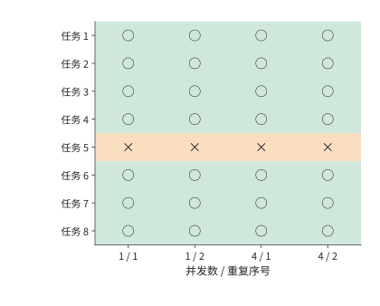

*图 8-26：BF16 KV 基线。每行是一道固定任务，四列为并发 1、4 下各两次自然生成。绿色圆圈正确，橙色叉号错误，共 28/32 正确。*

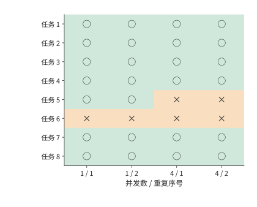

*图 8-27：同一任务与运行顺序，原 FP8 实现共 26/32 正确。这一比较包含实现选择对 Q 精度的影响。圆圈表示回答正确，叉号表示回答错误；每行对应同一道题，列表示并发数与重复运行序号。*

图 8-28 进一步只恢复查询 Q 的 BF16 精度，KV 仍保持 FP8。按同一列比较三幅图，就能看出改变的是哪些题目的结果，而不只是总正确数。

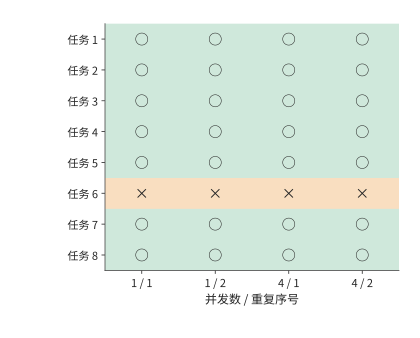

*图 8-28：将查询 Q 保持为 BF16，KV 仍用 FP8，共 28/32 正确；答错的题目与 BF16 基线不同。三幅图使用相同任务和列顺序，模型权重均为 BF16。圆圈表示回答正确，叉号表示回答错误；每行对应同一道题，列表示并发数与重复运行序号。*

图中任务 5（实验记录里的 n512-r0，即含 512 条记录的第一份长文档）在 BF16 KV 下四次均错，在“FP8 KV＋BF16 Q”下四次均对；任务 6（n512-r1）则恰好相反。两种配置都答对 28 次，但答错的任务不同。将同一任务的结果排在一起，就能看出差异发生在哪里，以及重复运行时是否一直如此。

错误还会增加完成任务的时间。第一次回答失败后重试，得到正确答案的总时间应包括首次生成、检查答案和再次生成。已有实验中，两次重试修正了错误，但额外增加了约 2.0 秒生成时间和 92 个 token。如果第一次回答虽然更快，却也更容易出错，完成整个任务反而可能更慢。[^retry]

比较前述两种 KV 容量方案：16 条独立长请求采用 q8_0 后约占 9.86 GiB，共享 BF16 前缀后约占 5.91 GiB。要判断哪种方案更合适，还需将转换、生成和重试的时间计入请求的总耗时。第 8.6 节的综合例题将完成这一步。

> **练习 8-6 · 数据分析：KV 压缩如何影响容量、答案正确性与重试成本。** 设每组包含 32 个值，另用 2 字节保存 scale，复算 8K 输入和完整长请求在 q8_0、q4_0 格式下的 KV 容量。再读取配套三种 KV／Q 精度配置的逐题结果，列出 BF16 KV 与“FP8 KV＋BF16 Q”中正确性改变的题目。最后读取重试记录，对每个成功任务合计首答与重试时间，并与只计入最后一次成功生成时间的结果比较。

## 8.5 推测解码

### 8.5.1 草稿、验证、回退与正确性

前两节主要改变数据的存放和读取方式，每条请求仍要逐轮生成。若能让一次目标模型计算确定多个输出，生成 256 个 token 就不必再执行同样多的轮次。普通 decode 中，目标模型每次前向计算生成一个 token。第 8.2 节将不同请求合并计算，使一次权重读取用于更多行。推测解码采用另一种办法：先为同一请求生成一段**草稿序列**，再由目标模型同时验证其中的多个 token。若目标模型接受了多个草稿 token，一次计算就能确定多个输出。

先考虑**贪心生成**：每一步都选择目标模型给出的概率最高的 token。假设草稿序列包含四个 token，目标模型分别计算各 token 位置应当输出哪个 token。前两个与草稿相同，第三个不同，那么最终保留前两个草稿 token，并在第三处输出目标模型选出的 token。第四个草稿 token 是在错误的第三个 token 之后生成的，也随之丢弃。下一轮从修正后的序列继续生成。若四个草稿 token 全部匹配，目标模型通常还能在它们之后再生成一个 token。

图 8-29 展示了第三个 token 发生分歧时的处理顺序。目标模型虽然已经计算了后续 token 的验证结果，但第四个 token 依赖错误的第三个草稿 token，不能继续采用。一次验证最终留下两个匹配的草稿 token 和一个修正 token，共三个输出。

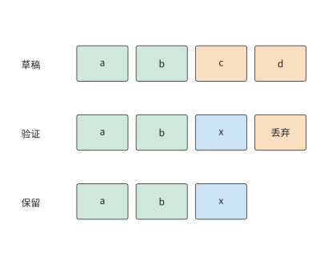

*图 8-29：贪心验证的过程。a、b、c、d、x 表示 token；目标模型在第三个 token 选出 x，与草稿 c 不同。第四个 token 及其后的验证结果作废，下一轮从 a、b、x 继续生成。方框表示序列中的 token 位置，不表示执行耗时。*

随机采样时，需要使最终输出仍服从目标模型的概率分布。设目标分布为 $p(x)$，草稿分布为 $q(x)$。先从 $q$ 中采样得到草稿 token $x$，再以如下概率接受它：

$$
\alpha(x)=\min\left(1,\frac{p(x)}{q(x)}\right).
$$

采样到 $x$ 并直接接受它的概率为 $q(x)\alpha(x)=\min(p(x),q(x))$。要达到目标概率 $p(x)$，还差 $[p(x)-q(x)]_+$。这里 $[z]_+=\max(z,0)$，表示只保留正的差额。因此，拒绝草稿 token 后，将这一正差额归一化，再从得到的分布中重新采样。直接接受和拒绝后重新采样两种情况合起来，最终输出 $x$ 的概率就是 $p(x)$。[^spec]

用只有 A、B 两个符号的例子说明这一过程。目标分布为 $p(A)=1/4$、$p(B)=3/4$。若草稿总是生成 A，就以 $1/4$ 的概率接受 A，其余 $3/4$ 的情况拒绝 A、改为输出 B。若草稿总是生成 B，则以 $3/4$ 的概率接受 B，其余情况改为输出 A。两种方法最终都得到目标分布，但草稿的接受概率不同，因而执行效率也不同。

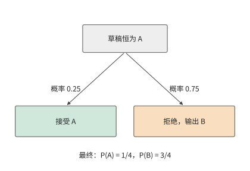

*图 8-30：接受 A 的概率为 1/4，拒绝后输出 B 的概率为 3/4。两条路径合起来给出目标分布。*

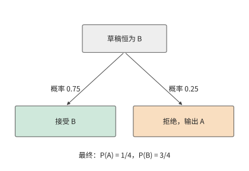

*图 8-31：接受 B 的概率为 3/4，拒绝后输出 A 的概率为 1/4。目标分布相同，草稿的接受概率更高。*

验证之后，KV 的有效长度调整到已经确定的输出位置，丢弃的草稿 token 对应的 KV 不再参与后续计算。分页器按已经确定的输出长度更新块引用，采样器和语法检查器（按指定输出格式限制可选 token 的组件）也恢复到对应的状态。下一轮便从修正后的序列继续计算。

### 8.5.2 每轮耗时与输出数量

推测解码既改变每轮耗时，也改变每轮最终输出的 token 数。设第 $r$ 轮耗时为 $T_r$，输出 $N_r$ 个 token，那么连续执行多轮后，平均每个输出 token 的耗时为

$$
\bar t_{\mathrm{spec}}=\frac{\sum_r T_r}{\sum_r N_r}.
$$

例如，两轮各耗时 1.5 ms，分别输出 1 个和 5 个 token，总计 3 ms、6 个 token，平均每个 token 耗时 0.5 ms。如果先算每轮的平均值，再将 1.5 和 0.3 ms/token 等权平均，就会得到 0.9 ms。这相当于让只输出一个 token 的轮次与输出五个 token 的轮次占相同权重。直接用总时间除以总 token 数，才能得到每个 token 的平均耗时。

**算例：草稿接受率如何决定每轮的平均输出数？** 沿用两符号目标分布，并假设各 token 位置独立。每轮草稿生成四个相同符号，最终输出还包括拒绝时的修正 token，或全部接受后的额外 token。设前面的草稿 token 都已接受时，当前位置的接受概率为 $a$。每轮至少输出一个 token；要输出第二个，需接受第一个草稿 token，概率为 $a$；要输出第三个，需接受前两个，概率为 $a^2$。依次相加，平均每轮输出数为

$$
\mathbb E[N]=1+a+a^2+a^3+a^4.
$$

上式每一项都表示“最终至少输出这么多个 token”的概率。草稿为 AAAA 时，$a=1/4$，平均每轮输出约 1.33 个 token；为 BBBB 时，$a=3/4$，平均输出约 3.05 个。在 RTX PRO 6000 上，batch 1、2K 上下文的普通 decode 一轮 26.26 ms（实验 8-1）。验证 5 个位置时，读取的权重和 KV 与普通 decode 相同；多出的 4 行矩阵运算约 65 GFLOP，按 BF16 峰值的 62% 计只需约 0.2 ms，因此一轮验证仍按 26.26 ms 计。实验 8-5 也观察到同样的现象：DFlash（一种前向一次就并行生成整段草稿的草稿网络）每轮生成 7 个草稿 token 并验证 8 个位置，中位耗时 15.2 ms，与同一配置下普通 decode 一步的 16.9 ms 相当。再加上查询草稿的 0.1 ms，一轮共 26.36 ms，两种草稿对应的平均每 token 耗时分别约为 19.8 和 8.64 ms，都快于 26.26 ms/token 的普通 decode。验证几乎不增加一轮的时间，即使草稿大多被拒绝，每轮也至少得到一个 token，所以接受率低的 AAAA 同样能加速。[^history]

接受更多草稿 token 所节省的时间，也可能被查询开销抵消。要优于普通 decode，一轮总耗时须小于平均输出数乘以 26.26 ms。扣除验证所需的 26.26 ms，AAAA 留给草稿查询的时间约为 8.7 ms，BBBB 约为 53.9 ms。图 8-32 把这两个交点画在查询成本轴上。

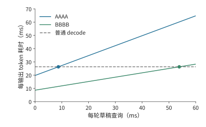

*图 8-32：两符号目标分布，每轮生成四个草稿 token。每轮验证 26.26 ms，查询时间沿横轴变化；每个输出 token 的耗时用一轮耗时除以平均输出数。普通 decode 为 26.26 ms/token（RTX PRO 6000，batch 1，2K 上下文）。没有提前停止，额外 token 计入输出数。图中的点标出查询耗时为 0.1 ms 的算例；AAAA、BBBB 分别在查询约 8.7、53.9 ms 处与普通执行相交。*

使用草稿前的准备工作也要计入总时间。若建立上下文索引需要 2 秒，而 BBBB 草稿每个输出 token 能节省约 $26.26-8.64\approx17.6$ ms，生成约 114 个 token 就能抵消这 2 秒开销。输出 256 个 token 的请求用普通 decode 约需 6.72 秒；先用 2 秒建立索引再用 BBBB 草稿，期望约 4.22 秒完成。如果索引可以提前建立并由多个请求共用，这项开销还能由更多输出分摊。

### 8.5.3 草稿来源与串行、并行生成方式

四个草稿 token 能节省多少时间，既取决于其中有多少通过了验证，也取决于生成这段草稿需要多长时间。实际系统可以从上下文中查找草稿，也可以调用额外的网络生成草稿；两种选择会带来不同的准备时间与内存占用。

上下文查找从输入或已有回答中找出重复片段，主要开销是匹配和建立索引。独立小模型逐步生成草稿，需要额外保存自己的权重和 KV。EAGLE 类方法将目标模型的中间表示送入较小的预测网络；DFlash 类方法则并行生成多个草稿 token。模型自带的 MTP 头则利用联合训练得到的预测能力生成草稿。[^spec]

将每轮分为生成草稿、准备验证、目标验证和确定输出四个阶段，就能逐项比较这些方法。以实验 8-5 的 DFlash 草稿网络为例，其权重约 1.95 GiB（2.10 GB）。按 batch 1 的有效带宽计（26.26 ms 读取 15.44 GB，约 588 GB/s），该网络前向一次约需 3.57 ms。若用它逐个生成四个草稿 token，要前向四次，共 14.28 ms；像 DFlash 那样并行生成整段草稿，只需前向一次，约 3.57 ms。目标验证都需 26.26 ms，若最终每轮都平均输出 3 个 token，串行方式每个 token 约需 $(14.28+26.26)/3\approx13.5$ ms，并行方式约需 $(3.57+26.26)/3\approx9.9$ ms。此时，加速来自草稿生成时间的缩短。

再设并行生成的草稿接受率较低，平均输出数降为 2 个，平均每个输出 token 的耗时就升至 $(3.57+26.26)/2\approx14.9$ ms，反而慢于串行方式。更快的草稿生成节省了 10.7 ms，但每轮输出减少，每个输出 token 分摊的时间随之增加，整个请求因而变慢。

### 8.5.4 草稿长度的动态选择与并发竞争

确定草稿来源之后，还需要决定每轮生成多长。草稿越长，一轮能够输出的 token 上限越高。但只有前面的 token 全部接受，后面的才有机会进入最终输出。设前面的草稿 token 都已接受时，第 $j$ 个 token 的条件接受概率为 $a_j$，则长度为 $m$ 的草稿对应的平均输出数为

$$
\mathbb E[N_m]=1+\sum_{j=1}^{m}\prod_{i=1}^{j}a_i.
$$

草稿长度从 $m-1$ 增至 $m$ 时，平均多输出 $\Delta N=\prod_{i=1}^{m}a_i$ 个 token。设为此增加 $\Delta T$ 时间；原先一轮耗时为 $T$、平均输出 $N$ 个 token，平均每个输出 token 的耗时为 $T/N$。要使增加草稿长度后平均每个输出 token 的耗时更短，需要满足 $(T+\Delta T)/(N+\Delta N)<T/N$，整理得

$$
\frac{\Delta T}{\Delta N}<\frac{T}{N}.
$$

也就是说，为新增输出付出的平均时间，必须低于原来的平均每 token 耗时。由于接受概率需要逐项相乘，越靠后的草稿 token 保留下来的概率越低，增加它们就越难获得足够的时间收益。

预设执行形状也会影响新增时间 $\Delta T$。如果本次验证四个或五个 token，都把各 token 的特征向量补齐为八行矩阵，使用预先准备的八行计算图，增加一个 token 所需的额外计算较少；若待验证的 token 从八个增至九个，需要补齐为十六行矩阵并改用相应计算图，计算量便会突然增加。并发请求数也影响推测解码的收益：低负载时，多行验证可以利用闲置算力；高负载时，普通批处理已经充分共享权重，草稿生成和验证还要与其他请求争用加速器和内存。

一组实测比较了不同草稿长度。K7 和 K15 分别表示每轮生成 7 个和 15 个草稿 token 的配置。Qwen3-8B／DFlash 的短提取任务在并发 1 时，普通 decode、K7、K15 的完整耗时中位数约 90.0、30.6、29.4 ms。普通执行改为 K7 节省约 59 ms，从 K7 改为 K15 只再节省约 1.2 ms。逐轮记录中还出现两种块长都只接受一个草稿 token 的轮次：K7 丢弃六个草稿 token，K15 丢弃十四个，最终输出长度相同。更大的验证块增加了计算量，却没有在这一轮带来更多输出。[^spec-measure]

因此，动态调整草稿长度时，可以使用上述判断条件：对接受概率高、增加验证位置所需时间短的请求，生成更长的草稿；对草稿前几个位置就经常通不过验证，或需要改用更大执行形状的请求，缩短块长。确定草稿长度时，还要给目标模型和草稿模型的 KV 留出空间，再按第 8.3 节的方法决定接收多少请求。

> **练习 8-7 · 推导：多长的草稿能使平均每个输出 token 的耗时最短？** 固定草稿接受概率 $a=3/4$，计算草稿块长为 1、2、4、8 时，每轮平均输出的 token 数。沿用第 8.5.3 节 RTX PRO 6000 上的数据并保留一位小数：一轮验证 26.3 ms，草稿网络逐个生成、每个草稿 token 3.6 ms，即 $T_m=26.3+3.6m$ ms，求每种块长的平均每个输出 token 的耗时。再设草稿按每组 4 个位置执行，不足一组也按整组计时，即 $T_m=26.3+3.6\times4\lceil m/4\rceil$ ms，比较块长 4 与 5，并用边际条件解释选择。

## 8.6 请求负载下的性能与配置选择

### 8.6.1 到达率、排队、准入与取消

第 8.2 至 8.5 节讨论了如何改变实例的内存占用和执行方式。在线服务还要处理请求不断到达的情况：一条请求尚未完成，下一条就已经进入队列；一条请求等待工具返回时，模型计算暂停，KV 却仍需保留。调度器因此既要安排当前计算，也要为正在生成或等待继续执行的请求保留状态。

保存这些未完成请求的状态需要多少空间，取决于系统内平均有多少条请求。在稳定服务中，系统内的平均请求数满足 Little 定律

$$
\bar n=\lambda\bar T,
$$

其中 $\lambda$ 为平均到达率，$\bar T$ 为请求在系统中的平均停留时间。把观察期间每条请求的停留时间相加，再除以观察时长，就得到系统内的平均请求数。例如，每秒到达 4 条请求、每条平均停留 0.5 秒时，系统内平均有 2 条请求；平均停留时间增至 2 秒时，就有 8 条。

这些请求有的在排队，有的正在计算，还有的仅保留状态。增大 batch 可以提高输出吞吐，但 KV 读取、计算和其他开销会逐渐限制这种增长。当处理速度无法继续随到达率提高时，新请求就会在队列中累积，等待时间也随之延长。

**准入控制**决定是否开始处理新请求。接收请求之前，先检查可用的 KV 空间和距离截止时间还剩多久。对第 8.1 节的短请求，0.196 秒首输出加 6.76 秒生成已用掉 6.95 秒；再多排队 0.1 秒就会超时。提前识别这种请求，可以拒绝、转交其他实例，或使用更快的执行配置。取消则在请求失去使用价值时停止安排后续迭代，并在加速器操作完成后释放空间。

这些优化会相互影响。KV 压缩让实例能同时接收更多请求，较大的 batch 又让普通 decode 更有效地共享权重，推测解码的相对收益也就随之改变。下面将这些变化应用于同一组请求，计算组合后的执行时间和内存占用。

### 8.6.2 质量与 SLO 约束下的有效吞吐

只看队列长度和完成速度，还不能判断用户是否得到了可用的答案。第 8.4.4 节的质量实验出现过错误答案，排队则会造成正确但迟到的回答。把这两种损失一起计入，才能评价服务效果。设观察窗口长为 $T_{\mathrm{obs}}$，第 $i$ 条请求正确时 $Q_i=1$，按期完成时 $D_i=1$。按完成的请求数计量，有效吞吐为

$$
R_{\mathrm{good}}=\frac{\sum_i Q_iD_i}{T_{\mathrm{obs}}}.
$$

分子只计正确且按期完成的请求。若改用全部完成的请求数作为分子，就得到完成吞吐。两者的差距说明，有多少处理能力花在了错误或迟到的答案上。

一组实测显示了这两项损失的大小。Qwen3-8B 检索实验使用相同的八道题，要求请求在到达后 3 秒内正确完成，比较逐个接收请求、连续批处理和一次提交全部请求三种方式。每次实验提交 16 条请求，全部实验共生成 336 次回答，其中 294 次正确，只有 155 次同时满足时限。其余 139 次正确回答因为太晚返回，仍未满足服务要求。[^service]

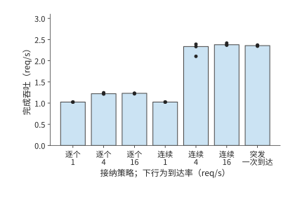

*图 8-33：每种接纳与到达条件使用三个 16 请求窗口。柱为全部完成请求的吞吐中位数，圆点为各窗口结果。时间从计划到达起计算。*

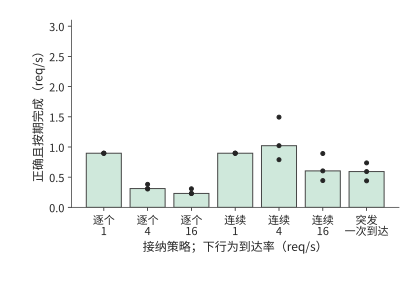

*图 8-34：分子仅计正确且在 3 秒内完成的请求。两图采用相同横轴顺序和纵轴范围，差额来自错误或迟到的回答。*

到达率为 1/s 时，两种在线策略的有效吞吐均约 0.90 req/s。每批工作较少，逐个接纳也能及时处理大部分正确请求。到达率升至 4/s，逐个接纳的完成吞吐约 1.22 req/s，有效吞吐却降至 0.31 req/s；队列变长，许多正确输出越过了期限。连续批处理把完成吞吐提高到约 2.33 req/s，有效吞吐达到约 1.02 req/s，更多请求在期限内完成。

再把连续模式的到达率推至 16/s，完成吞吐只增至约 2.38 req/s，有效吞吐反而降到约 0.60 req/s，减少约 41%。完成吞吐已基本不再增长，更多请求到达主要增加了排队时间。对这组窗口，4/s 比 16/s 按时返回了更多正确答案。选择服务配置时，要先找出有效吞吐开始下降的到达率，再限制新接收的请求数，避免排队时间过长。

逐个接收请求时，其他请求虽然没有进入引擎，却仍在应用队列中等待。因此，应从请求原定的到达时刻开始计时，把引擎外的等待也计入。结合本节的几组测量，加速器每秒输出多少 token、单条请求等待多久，以及每秒有多少请求正确且按期完成，需要分别计算。

### 8.6.3 配置、加速器与完整任务成本

比较配置之前，先把实测换算成处理速度。确定批处理、精度和缓存设置后，用完成的工作量除以占用加速器的时间，就得到各阶段的实际处理速度：prefill 速度 $r_P$ 按每秒处理的新输入 token 计，decode 速度 $r_D$ 按每秒完成的 decode 调用计。批内多条请求共享一次执行时，每条请求都算完成了一次调用，占用时间只计一次。一条请求有 $L$ 个新输入 token、输出 $G$ 个 token，它占用加速器的时间（以 GPU 秒计）为

$$
t_{\mathrm{GPU}}=\frac{L}{r_P}+\frac{G-1}{r_D}.
$$

没有同条件的测量时，可以用规格乘以效率来估计：prefill 时间取矩阵运算量除以峰值算力与算力效率之积，decode 一轮的时间取读取的权重与 KV 字节数除以峰值带宽与带宽效率之积。下表给出实验 8-1 在 RTX PRO 6000 上测得的效率。一轮 decode 取引擎逐轮记录中不含 prefill 的轮次；客户端看到的输出间隔还包括交付时间，略长一些，例如第 8.1.1 节的 26.5 ms。

| 2K 上下文、无共享前缀 | batch 1 | batch 4 | batch 16 | batch 64 |
|---|---:|---:|---:|---:|
| 每轮读取的权重与 KV | 15.44 GB | 16.34 GB | 19.97 GB | 34.46 GB |
| 按 1792 GB/s 读取所需时间 | 8.62 ms | 9.12 ms | 11.14 ms | 19.23 ms |
| 实测一轮 decode | 26.26 ms | 26.62 ms | 27.44 ms | 29.63 ms |
| decode 带宽效率 | 33% | 34% | 41% | 65% |
| prefill 算力效率 | 62% | 61% | 61% | 58% |

decode 效率随 batch 上升，并不是因为读取变快了。这组实验关闭了 CUDA Graph，每轮都要逐个提交 kernel：读取量从 15.44 GB 增至 34.46 GB，一轮只从 26.26 ms 增至 29.63 ms，batch 越大，这段几乎固定的时间分摊到的字节越多。prefill 效率则稳定在 BF16 峰值的 58%–62%；8K 输入、前 6K 已缓存时为 52%–58%。

表中的带宽效率就是第 1.2.2 节的 MBU，算力效率就是 MFU。batch 为 1 时，一轮 decode 比 8.62 ms 的读取下界多出约 17.6 ms，而且这段时间基本不随读取量变化。按第 1.3.4 节的判据，这不是模型漏项，而是逐个提交 kernel、主机侧调度与同步造成的开销，用 CUDA Graph 和更好的调度可以去掉；第 5.5.1 节的 vLLM v0.6.0 案例说明了主机侧开销能减少到什么程度。

**综合算例：在内存与时限约束下选择前缀共享、压缩和推测配置。** 有效吞吐给出了服务的评价标准，容量和时间分析则能在运行之前排除不合适的配置。采用章首给定的推理实例：RTX PRO 6000 分给本实例 32 GiB，扣除权重和基本工作区后，留给 KV 及辅助缓冲区的空间为 12 GiB。16 条长请求同时到达，每条输入 8192 个 token、输出 256 个 token，前 6144 个输入 token 相同，完成时限为 7 秒。下面比较四种方案，并假设四种方案都能给出正确答案。共享方案在请求到达前已经缓存了公共前缀。推测方案使用实验 8-5 的 DFlash 草稿模型。启用后进程显存峰值增加约 3.1 GiB（从 17,706 MiB 增至 20,894 MiB），其中草稿模型权重约 1.95 GiB。草稿模型还要处理输入，实验 8-5 中输入约 2300 个 token 时，首 token 时间从 129.4 ms 增至 141.6 ms，多出 9.4%。设这组请求平均每轮输出 3 个 token。

这组请求的共享方案，正是实验 8-1 测过的条件：8K 输入、前 6K 已缓存、batch 16。prefill 阶段处理 32,768 个新 token 用时 2.04 s，$r_P\approx16{,}059$ 新 token/s，达到峰值算力的 58%；此后每轮 decode 用时 27.35 ms，$r_D=16/0.02735\approx585$ 调用/s。每条请求占用 $t_{\mathrm{GPU}}=2048/16059+255/585\approx0.563$ GPU 秒，16 条合计约 9.01 GPU 秒。其余方案由这张表和同一条件的实测推出，下表给出整批 16 条请求各阶段的时间。[^service-plan]

| 方案 | 状态组织 | 首 token 返回前（整批 prefill） | 首 token 返回后的执行 |
|---|---|---:|---|
| A | BF16，独立上下文 | 7.34 s | 255 轮，每轮 29.63 ms |
| B | BF16，共享前缀 | 2.04 s | 255 轮，每轮 27.35 ms |
| C | q8_0，独立上下文 | 7.34 s | 255 轮，每轮约 28.26 ms |
| D | BF16，共享前缀与推测 | 2.23 s | 85 轮，每轮输出 3 个 token，每轮 27.35 ms |

A、C 不共享前缀，每条请求都要完整处理 8192 个 token，整批矩阵运算量为 2137.5 TFLOP，按同一条件 58% 的算力效率计，约需 7.34 s。A 每轮读取 34.46 GB，与 64 条 2K 请求相同，取表中的 29.63 ms；C 的 KV 按 $34/64$ 压缩，每轮读取 25.40 GB，在表中 19.97 GB 与 34.46 GB 两列之间按读取量插值，约 28.26 ms，这里还没有计入格式转换的时间。D 的 prefill 比 B 多 9.4%，约 2.23 s。D 每轮让 16 条请求各验证 8 个位置，矩阵运算约 2.56 TFLOP，按 58% 的效率约需 8.8 ms，短于 B 一轮的 27.35 ms；按第 8.2.1 节取两者中的较大值，每轮仍为 27.35 ms。草稿网络的前向也在同一轮内完成，实验 8-5 中 DFlash 一轮的中位耗时并不长于普通 decode 一步（第 8.5.2 节），因此这里不另加时间。

先检查内存是否足够。A 需 $16\times1188=19008$ MiB，超出 12 GiB，无法同时接纳这组请求。B 只需一份前缀加 16 份私有状态，共 6048 MiB，约 5.91 GiB。C 的状态按 $34/64$ 压缩，共约 9.86 GiB。D 在 B 的基础上增加 3188 MiB，共 9236 MiB，约 9.02 GiB。B、C、D 都能放入内存，再比较三者完成请求所需的时间。

B 的总耗时为 $2.04+255\times0.02735=9.01$ 秒，与实验 8-1 实测的请求耗时中位数 9.02 秒一致，但超过了 7 秒的时限。在这张卡上，仅 255 轮 decode 就要 6.97 秒，16 条请求一起逐 token 生成 256 个输出，无法按期完成。C 失去了前缀复用，prefill 从 2.04 s 增至 7.34 s，总耗时达到 $7.34+255\times0.02826=14.55$ 秒。D 每轮输出 3 个 token，用 85 轮生成剩余的 $85\times3=255$ 个 token，总耗时为

$$
T_D=2.23+85\times0.02735=4.56\ \mathrm{s}.
$$

内存不足的 A 和超时的 B、C 都已排除，只有 D 能按时返回 16 个正确答案。这一比较依次使用了前缀共享后的容量、压缩格式的大小、每轮耗时和每轮输出数量。在这张卡上，一轮 decode 的时间几乎不随 batch 和上下文变化，只有减少轮数，才能明显缩短生成阶段。

图 8-35 将这两项检查画在同一张平面图上。横向越过虚线，表示 KV 和辅助缓冲区超过 12 GiB；纵向越过虚线，表示完成时间超过 7 秒。只有 D 同时落在两个限制以内。

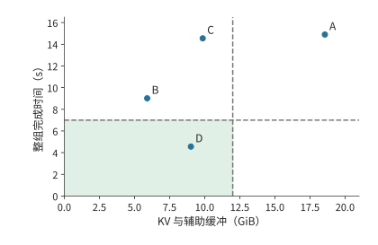

*图 8-35：16 条长请求在 RTX PRO 6000 上的配置比较。横轴为 KV 和辅助缓冲区占用，已扣除共同的权重与基本工作区；纵轴为整批请求总耗时，由实验 8-1、8-5 的实测推出。A 内存不足，不能在本实例上执行，图中是它所需的时间。阴影区域同时满足 12 GiB 和 7 秒限制。A 为 BF16 独立上下文，B 为 BF16 共享前缀，C 为 q8_0 独立上下文，D 为 BF16 共享前缀加推测解码。*

最后比较成本。每个合格结果占用这张卡的时间，等于整批从到达到全部完成的时间除以合格结果数。D 为 $4.56/16\approx0.285$ GPU 秒；按 600 W 的功耗上限计，每个合格结果的能耗不超过约 171 J。B 占用这张卡 9.01 秒，在 7 秒时限下却没有一个合格结果，这些时间和能量全部浪费。

**内存减少或输出缩短时，选择如何变化？** 如果 KV 和辅助缓冲区的可用内存从 12 GiB 减至 6 GiB，D 所需的约 9.02 GiB 无法容纳；B 所需的约 5.91 GiB 虽能容纳，却会超时。这组请求没有可行方案，只能放宽时限、缩短输出，或者改用不占显存的草稿来源（见练习 8-9）。如果内存不变，只把输出缩短到 16 个 token，B 需要 $2.04+15\times0.02735=2.45$ 秒，D 需要 $2.23+5\times0.02735=2.37$ 秒。两者都能按期完成，D 只快 0.08 秒：草稿模型多做的 0.19 秒 prefill，几乎抵消了少执行 10 轮 decode 节省的时间。

以上分析的都是实例内的执行时间。计算完整 Agent 任务的耗时，还要加上工具执行和外部等待。假设一次任务耗时 100 秒，其中 decode 占 50 秒；将 decode 加速四倍后，总耗时变为 $50+50/4=62.5$ 秒，整体加速 1.6 倍。如果 decode 原本只占 20 秒，总耗时则变为 $80+20/4=85$ 秒，整体只加速约 1.18 倍。一般地，设 decode 占原总时间的比例为 $f$，该阶段加速 $s$ 倍，其他阶段耗时不变，则由 Amdahl 定律得到

$$
S_{\mathrm{task}}=\frac{1}{(1-f)+f/s}.
$$

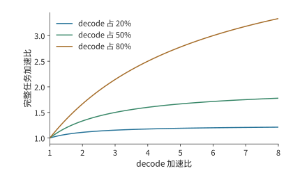

*图 8-36：其他阶段时间固定、没有新增准备工作的 Amdahl 加速比曲线。三条曲线分别取 decode 占基线时间 20%、50%、80%。该阶段原有的耗时占比越高，局部加速带来的收益就越大。*

图 8-36 中，decode 占比越低，曲线越早变平：即使生成阶段继续加速，工具调用和其他等待仍占据原来的时间。比较加速器占用和能耗时，也要覆盖这些阶段，并按最终得到的合格请求数计算。设观察期间占用加速器的总时间为 $T_{\mathrm{GPU}}$，总能耗为 $E_{\mathrm{obs}}$，合格结果数为 $N_g$，则每个合格结果平均占用 $T_{\mathrm{GPU}}/N_g$ 的 GPU 时间，消耗 $E_{\mathrm{obs}}/N_g$ 的能量。实验 8-9 在同一张卡上读取了 GPU 与 CPU package（整个处理器封装）的能量计数：连续批处理在到达率 1、4、16 req/s 下，每个合格结果分别消耗 615.0、652.0、1083.7 J；逐个接纳在 4 req/s 下为 1982.3 J。16/s 时连续批处理的完成吞吐与 4/s 相近，迟到的回答却更多，每个合格结果的能耗高出约 66%。即使答案错误或返回太晚，已经消耗的能量也必须计入总成本。[^service]

> **练习 8-8 · 计算：阶段加速与草稿准备如何改变任务总时间。** 一个 100 秒任务由 prefill 20 秒、decode 50 秒、工具及等待 30 秒组成。分别将三个部分的耗时单独减半，求每种情况下的任务总耗时。另从原始任务出发，将 decode 耗时降为原来的四分之一，并增加 8 秒草稿准备时间，求净加速比，并计算准备时间达到多少时这项改动不再节省时间。

> **练习 8-9 · 核心 · 综合设计：在容量与时限内减少每个合格结果占用的 GPU 时间。** 沿用综合算例在 RTX PRO 6000 上的容量与时间，以 B 为基础构造方案 E：共享 BF16 前缀，草稿改为从上下文中查找（第 8.5.2 节），索引放在主机内存，不占显存，也不增加 prefill；每条请求平均每轮输出 2 个 token，后续执行 128 轮，整批每轮 27.35 ms 加 0.1 ms 查询。计算 E 的显存占用、总耗时和每个合格结果占用的 GPU 秒，与 B、D 比较；再分别把 KV 和辅助缓冲区的可用内存改为 6 GiB、把输出长度改为 16 个 token，重新选择。开放实验部分使用相同题集和到达轨迹运行两种配置，记录全部请求的到达、首输出、结束、正确性与状态峰值，按本节公式计算有效吞吐。

## 历史与延伸阅读

每轮迭代接纳新请求、分页注意力与前缀树缓存分别推动了请求调度、状态分配和计算复用。Orca、PagedAttention 与 SGLang 的相关设计可沿这些机制阅读；Sarathi-Serve 和 NanoFlow 进一步研究分块、流水及不同资源之间的重叠。[^schedule-survey][^nanoflow]

第 8.2.1 节的多 adapter 服务可沿 Punica 与 S-LoRA 继续阅读，两者分别管理 adapter 与请求状态，在共用基础模型的同时执行各 adapter 的低秩计算。[^lora]

混合注意力与递推模型把缓存索引扩展为状态恢复问题，Marconi 等工作讨论恢复机会和缓存价值。权重卸载、张量编码以及统一内存执行，则将加速器容量与链路成本联系起来；配套 M2 Max 记录展示了小模型的真实 KV 分配与输入处理。[^hybrid][^codec][^mac]

推测采样的接受与修正规则为保持目标分布奠定了基础，后续从上下文查找草稿、依据中间特征预测草稿以及并行生成草稿的方法，主要改变每轮开销与接受的草稿长度。完整 Agent 任务还包含工具和外部阶段，公开速度与任务记录可结合第 8.6 节的阶段分解阅读。[^spec][^task]

[^batch]: 固定模型在 RTX PRO 6000 上的[批处理计算](../calculations/results/batch-reuse-pro6000-2k.md)及[8K 对照](../calculations/results/batch-reuse-pro6000-8k.md)。完整 BF16 权重为 16,381,470,720 bytes，一步理想共享矩阵权重读取为 15,136,811,008 bytes；embedding 按请求查行，内存中仍需保存完整的 embedding 矩阵。读取表先用精确字节计算，再舍入各项。

[^device]: [NVIDIA RTX Blackwell PRO 规格](../references/files/specs/nvidia-rtx-blackwell-pro.pdf)附录 A 表 4，整理在[硬件参数表](../calculations/results/hardware.md)的 rtx-pro6000-blackwell-ws 一行。

[^batch-measure]: [batch 扫描原始记录](../experiments/ch08/08-01/README.md)。RTX PRO 6000、vLLM 0.23.0、BF16，三轮；正文报告中位数，吞吐覆盖剩余 prefill 和生成，排除加载与预热；8K 条件先建立共享前缀。

[^schedule-survey]: [Orca 原文](../references/files/papers/orca.pdf)与[分块计算和版本说明](../case-studies/chunking-and-state-transfer.md)。

[^schedule]: [固定 batch](../calculations/results/iteration-batching-pro6000-fixed.md)、[连续批处理](../calculations/results/iteration-batching-pro6000-continuous.md)、[分块策略](../calculations/results/iteration-batching-pro6000-chunked.md)。每轮耗时参数由[实验 8-1 的逐轮记录](../experiments/ch08/08-01/efficiency.json)拟合：batch 1 的 2K decode 一轮 26.26 ms、prefill 94.8 ms；最后一个输出 token 在请求结束时尚未写入 KV。

[^chunk]: [逐块计算和封存测量](../calculations/results/chunk-history-book.md)。11 次请求、每次 16 块，首末块时间中位数 25.30、35.07 ms；CUDA event 区间包括完整模型路径和可能的主机间隙，不含外部 logits／采样。各块按原始顺序执行，输入 token 与内容逐块变化。

[^nanoflow]: [OSDI 2025 调研](../research/2026-infra-survey/reading-osdi-2025.md)、[NanoFlow 正式稿](../references/proceedings/OSDI/2025/selected/osdi25-zhu-kan.pdf)与[资源共享算例](../case-studies/resource-sharing-and-placement.md)。

[^replay]: [六请求实测](../experiments/ch08/08-02/README.md)及[图执行取舍](../case-studies/graph-execution-tradeoffs.md)。实验在共享 GPU 上按固定顺序执行六条合成文本请求。

[^pages]: [分页、取消与抢占](../experiments/ch08/08-03/README.md)、[四分支共享](../experiments/ch08/08-03/branch-sharing/README.md)、[冷分支对照](../experiments/ch08/08-03/cold-branches/README.md)。共享分支的输出相同；冷、热分支具有相同的块峰值，但 prefill 量不同。

[^lora]: [MLSys 2024 调研](../research/2026-infra-survey/reading-mlsys-2024.md)与[多 LoRA 计算](../case-studies/multi-lora-serving.md)。

[^context]: [上下文工程案例](../case-studies/author-context-and-design.md)。

[^hybrid]: [混合状态恢复与 checkpoint 计算](../case-studies/hybrid-prefix-state.md)、[MLSys 2025 调研](../research/2026-infra-survey/reading-mlsys-2025.md)。Kimi K3 的容量按指定存储格式和并行配置计算。

[^prefix]: [12 轮实际输入的缓存回放](../experiments/ch08/08-04/README.md)。回放采用原任务的输入序列，串行执行请求，每轮生成一个 token。

[^files]: [固定模型文件与业务预算](../case-studies/inference-training-scenarios.md)及[235B 分片元数据](../references/outline-checks/2026-09-07/systems-cases/qwen235-gguf-metadata.json)。精确字节、GB 与 GiB 分别报告。

[^kv-format]: [KV 格式和执行成本](../case-studies/kv-quantization-and-execution.md)。资料包含 GGML 分组格式、FP8 scale 粒度及 H100 上的拟合结果。

[^offload]: [权重卸载与预取计算](../case-studies/weight-offload-execution.md)；[PCIe Gen5](../calculations/results/weight-offload-pcie5.md)与[NVLink-C2C](../calculations/results/weight-offload-gh200-c2c.md)两档链路的复制与预取调度，每层计算时间取 batch 1 一轮 decode 的 26.26 ms 除以 36 层；[GH200 架构说明](../references/files/documents/nvidia-grace-hopper-blog.md)：NVLink-C2C 合计 900 GB/s，每方向 450 GB/s。

[^codec]: [张量压缩与传输](../case-studies/tensor-codec-and-transfer.md)。资料包含 LLM.265 的视频引擎实现、专用硬件设计与性能估计。

[^mac]: [M2 Max 小模型容量记录](../experiments/ch08/08-07/README.md)及[32K 补测](../experiments/ch08/08-07/context32k/README.md)。各槽依次执行 prefill。

[^quality]: [KV 与 Q 精度对照](../experiments/ch08/08-08/README.md)、[固定 FP8 权重的 Q 控制](../experiments/ch08/08-08/quantized-q-control/README.md)、[并发容量记录](../experiments/ch08/08-08/concurrency/README.md)。正文采用 BF16 权重组。另一组固定 FP8 权重时，BF16 Q 与默认路径分别为 32/32、28/32。

[^retry]: [自然输出与重试成本](../experiments/ch08/08-08/retry-cost/README.md)。实验使用已知答案校验，重试成本包含错误首答的生成成本。

[^spec]: [推测采样原文](../references/files/papers/speculative-sampling.pdf)、[推测解码原文](../references/files/papers/speculative-decoding.pdf)、[框架计数与预算笔记](../case-studies/speculative-execution.md)、[调研中的框架覆盖](../research/2026-infra-survey/framework-coverage.md)。基础概率算法、草稿路线和具体实现分别引用。

[^history]: [上下文草稿的分布与成本计算](../case-studies/history-drafts-and-rollout.md)及[有理数穷举结果](../research/2026-infra-survey/history-speculation-arithmetic.json)。算例采用二符号目标分布；RTX PRO 6000 上的每轮时间见 [AAAA](../calculations/results/speculative-round-pro6000-aaaa.md)、[BBBB](../calculations/results/speculative-round-pro6000-bbbb.md) 与[含 2 秒索引的 256 token 请求](../calculations/results/speculative-budget-pro6000-index.md)；普通 decode 一轮 26.26 ms 取自[实验 8-1 的逐轮记录](../experiments/ch08/08-01/efficiency.json)，DFlash 的每轮耗时取自[实验 8-5](../experiments/ch08/08-05/README.md)的逐步记录。

[^spec-measure]: [DFlash 同执行器对照](../experiments/ch08/08-05/README.md)及[逐请求阶段观测](../experiments/ch08/08-05/kernel-trace/README.md)。实验在低并发下，按固定顺序执行给定短题集。并发 1 通过短题的普通、K7、K15 时间中位数分别为 90.02、30.58、29.43 ms；配对输出共 32 对。

[^service]: [服务与能量原始记录](../experiments/ch08/08-09/README.md)。同一设备、八道题、七条件各三个 16 请求窗口；同题跨条件输出一致，42 个错误来自同一道题。吞吐表为各窗口指标中位数。每窗口包含 16 条请求，按排序后向上取整的位置计算 p95，得到的就是最大值。NVML 与 RAPL 组件计数窗口略宽于请求窗口，其他服务仍在运行。

[^service-plan]: [实验 8-1 的效率表](../experiments/ch08/08-01/efficiency.json)由[计算脚本](../experiments/ch08/08-01/efficiency.py)从[batch 扫描的逐轮记录](../experiments/ch08/08-01/README.md)导出，峰值取硬件表中 RTX PRO 6000 的 1792 GB/s 与 503.8 TFLOP/s；DFlash 的显存峰值、首 token 时间与每轮耗时取自[实验 8-5](../experiments/ch08/08-05/README.md)。各方案的内存与时间由[算例检查](ch08/teaching-check.py)复算。

[^task]: [生成实验与 Agent 运行记录](../experiments/ch08/08-06/README.md)。Agent 记录采用非流式调用；阶段时间图采用题设参数。

[^gguf]: [Q2_K 的逐张量布局](../calculations/results/gguf-layout-q2k.md)、[8K 文件容量](../calculations/results/gguf-inventory-8k.md)与[32K 对照](../calculations/results/gguf-inventory-32k.md)。文件总量 85,691,002,112 bytes，码值／浮点载荷 69,178,275,840 bytes，量化元数据 16,506,720,256 bytes，文件头与填充 6,006,016 bytes。上述文件大小按已归档文件头与发布元数据计算。

[^pcie]: [RTX PRO 6000 Blackwell 工作站版规格](../references/files/specs/nvidia-rtx-pro6000-spec.pdf)：系统接口 PCIe 5.0 x16，带宽为 PCIe Gen4 的两倍；[A100 80GB 规格](../references/files/specs/nvidia-a100-80-spec.pdf)：PCIe 4.0 为 64 GB/s（收发合计），即 x16 每方向 32 GB/s。由此 PCIe Gen5 x16 每方向 64 GB/s。正文按标称值计算，得到的是传输时间的下界。前缀的重算时间按[实验 8-1 的效率表](../experiments/ch08/08-01/efficiency.json)计算。

[^cancel]: 取消观察来自[状态实验](../experiments/ch08/08-03/README.md)。记录值约 1.55 ms 与 31.41 ms，计时包含观察器开销。

[^core-calculation]: 本章条件比较的[逐项复算](../calculations/results/core-principles.json)与[计算程序](../calculations/core_principles.py)。

[^v41-case]: [DeepSeek V4.1 官方技术报告](../calculations/sources/deepseek-v4.1-flash/DeepSeek_V41_Tech_Report.pdf)，第 1、2、3 节与第 6 节；[跨章会话的固定条件与复算](../calculations/results/v41-throughline.json)。

## 本章小结

本章从单条请求的执行过程出发，逐步分析了内存容量、计算安排和服务效果之间的关系。不同请求共用权重，KV 则随各自的上下文增长。合批能减少每个输出 token 分摊的权重读取，但每条请求仍要读取自己的上下文。这一收益取决于底层资源的性能：权重改由更快的独立存储提供后，合批不再能摊薄权重读取，不同 batch 和推测解码方案都要重新比较。连续批处理及时使用短请求释放的执行位置，分块 prefill 则减少长输入对已有请求生成过程的干扰。

KV 的管理方式决定了实例能同时处理多少请求。分页按需分配空间，共享只保存一份公共前缀，前缀缓存还省去了重复计算。上下文的追加、改写和总结会改变缓存复用以及后续状态存储与读取的开销，比较这些上下文组织方式与其他服务优化方案时，应采用相同的任务质量要求。压缩进一步减少存储量，卸载将部分权重移出加速器，代价是反复搬移。推测解码增加了草稿生成和验证的开销，却能让一次目标模型计算确定多个输出。这些变化都可以通过内存占用、每轮耗时和每轮输出数来比较。

章末的综合算例先检查内存是否足够，再判断能否按期完成，最后比较每个合格结果占用的 GPU 时间。有了前缀共享，原先无法容纳的 16 条长请求就能同时执行；但在 RTX PRO 6000 上，逐 token 生成 256 个输出仍会超时，推测解码减少了 decode 轮数，才让它们按期完成。可用内存减少时，这组请求找不到可行方案；输出缩短时，推测解码的优势几乎消失。选择改变的原因，都能从本章推导的数据量、执行时间和输出数量中找到。

完成本章的配置比较后，应记录三类结果：在给定加速器、精度和请求长度下能同时保存多少条请求的状态，prefill 与 decode 分别以多快的速度处理工作，以及请求延迟如何随 batch 和到达率变化。这些结果已经包含调度、缓存和 kernel 效率的影响。

下一章以这些结果为基础，决定各类加速器承担什么工作、需要多少执行单元，以及 KV 如何传输和共享。多个加速器既可以共同执行一个实例，也可以组成多个完整副本或分别调度的阶段服务池。批处理决定已有资源如何处理请求，部署方式决定这些资源如何分工，两者共同影响完整服务的性能。
