# 第 9 章 分布式推理

第 8 章讨论了如何用批处理、请求调度、缓存和推测解码，提高一组给定计算资源的推理效率。这些方法既适用于单卡，也适用于多卡协同执行的实例。本章进一步研究计算与状态放在哪里：不同计算资源分别承担哪些阶段和算子，权重与 KV 如何分布，执行位置之间如何传输数据、分配工作并处理故障。

本章用 **P** 表示 prefill 阶段，用 **D** 表示 decode 阶段。**PD 分离**把这两个阶段交给不同资源。**AF 分离**把每层的注意力与前馈网络（包括专家网络）交给不同资源。

围绕计算与状态的放置，本章考察四种基本的组织方式。增加完整副本，可以让不同资源组分别处理请求。将 prefill 与 decode 分开，可以为两个阶段分别配置计算资源；将注意力与专家计算分开，可以利用不同计算资源的计算和存储能力；共享 KV 则让请求使用其他执行位置留下的状态。这些组织方式可能出现在一个推理实例内部，也可能连接多个独立调度的服务池。

本章的设计问题是：一台服务器装有四张 A100 80GB SXM，另一台装有四张 H20 SXM5 96GB，这八张卡如何处理每秒到达的 3.5 个请求？每个请求输入 8192 个 token、输出 1025 个 token，属于带推理过程的请求：模型先生成较长的思考内容，再给出回答。模型采用 Qwen3-8B，权重和 KV 都使用每元素 2 字节的 BF16 格式。每张卡都能容纳完整模型，因此一张卡就是一个执行单元（worker）。两台服务器之间没有 NVLink，只能经 RDMA 网卡通信。后文依次决定计算如何分工、上下文在哪里交接、缓存何时值得保留，以及启动后的积压多久能够消退。第 9.7 节将综合这些结果，为这组资源确定部署方案。作为对照，第 9.2 节还会分析八张 A100 组成的同构集群。

贯穿第 9.3、9.4 节的另一个算例采用 Qwen3-235B-A22B，研究专家权重放在哪里。同样是 512 次专家分派，分派结果不同时，可能需要读取许多专家的权重，也可能反复使用少数热点专家的权重。据此判断专家计算应放在 CPU 还是 GPU 上，再考察热点集中到一张卡后，为什么需要专家副本。两个算例采用相同的分析方法：先确定每个请求需要的工作和状态，再估算各类处理器完成这些工作、存储系统提供所需数据的速度。

## 9.1 计算与状态的分布方式

### 9.1.1 计算资源、推理实例与服务副本

先区分硬件组织与服务组织。GPU、NPU 等加速器和 CPU 提供计算能力与相应的存储资源，进程在这些设备上运行模型和通信逻辑；通信组内的每个进程有一个 rank。推理实例可以由多个这样的进程协同执行。完整服务副本则拥有完成整个模型推理所需的权重和执行能力，可以和其他副本分别处理请求。

图 9-1 至图 9-4 画出四种组织方式。前两种都执行完整模型，区别是八卡协作组共同处理同一批请求，多个完整副本则各自接收请求。后两种进一步改变分工：PD 按生成阶段划分，AF 按层内算子划分。每种组织方式都有自己的调度器管理所负责的计算。

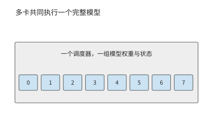

*图 9-1：八张卡共同执行一个完整推理实例，接收同一批请求。卡号表示协作组成员。*

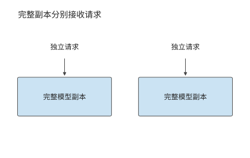

*图 9-2：每个副本都能完成整次推理，可以分别接收独立请求。副本自身也可以由多张卡组成。*

完整副本按请求分工；图 9-3 中，同一请求先后经过两个服务池。沿 P 到 D 的箭头看，交接的是输入处理留下的上下文 KV，两个池仍各自执行相应阶段的完整模型。

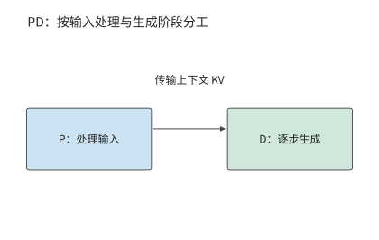

*图 9-3：P 处理输入，D 继续生成。两个服务池分别调度，上下文 KV 从 P 交给 D。*

图 9-4 将分界移到模型层内部：注意力一侧产生的激活交给前馈一侧，结果再返回。与一次阶段交接相比，这条数据通路要在每一层、每一步生成中反复走过。

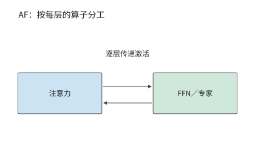

*图 9-4：注意力与 FFN／专家分别执行，隐状态作为激活在两侧往返。每层都需要这次交接。*

比较这些部署方式时，先使用第 8 章得到的运行配置和处理速度，再改变计算资源之间的分工。P、D 由同一组执行资源处理的方式称为**共置**。考虑已经调优的共置实例。请求的输入长度为 $L$，总输出长度为 $G$，prefill 计算最后一个输入 token 的 logits，并由此采样首个输出。在本章采用的生成约定下，后续 decode 调用为 $G-1$ 次：最后一个返回的 token 尚未送入模型，所以输出数比后续 decode 调用数多一。

对给定请求分布，记每个请求在资源 $r$ 上消耗的平均服务时间为 $d_r$，同类资源共有 $n_r$ 个可独立工作的单元。到达率与资源占用时间需要满足

$$
\lambda d_r < n_r,
$$

其中 $\lambda$ 是到达率。若多个操作使用同一资源，应先将它们的资源占用时间相加；若操作分别使用相互独立的资源，则为每种资源单独列出约束。资源占用量按“资源数 × 占用秒数”计算；本章的资源是 GPU，这一乘积记为 GPU 秒。例如，每秒到达四个请求，每个占用 0.5 个 GPU 秒，就需要两张持续工作的 GPU。若恰好只有两张卡，突发到达的额外请求就会一直积压，因为两张卡都忙于处理源源不断的后续请求；只有增加 GPU，才能消化突发。

设每个请求在某类副本上的 prefill 和 decode 分别占用 $d_P$、$d_D$ 秒，两个阶段在该副本上串行执行，那么 $N$ 个相同共置副本的请求率上限为

$$
\mu_{\mathrm{co}}=\frac{N}{d_P+d_D}.
$$

第 9.2.3 节将从数据表峰值推出开篇两类卡在各阶段的服务时间。一张 A100 处理一次 8192 个 token 的 prefill 约需 0.86 秒，一条请求的 1024 次 decode 合计占用约 1.76 GPU 秒；一张 H20 的 prefill 约需 1.81 秒，decode 只占约 0.88 GPU 秒。每个完整副本都要承担两个阶段，所以一张 A100 每请求占 2.62 GPU 秒，一张 H20 占 2.68 GPU 秒。八张卡合计每秒约完成 3.02 个请求，低于每秒 3.5 个请求的到达率，每秒积压约 0.5 个请求。问题由此变得明确：同样八张卡，重新分工能否补上这 0.5 请求/s 的缺口。

副本可以由多张卡共同构成。例如，Qwen3-235B-A22B 的一种 TP2×EP4 部署方式（TP 将专家矩阵二分，EP 将专家分成四组）用八张卡处理同一批请求：每两张卡分担专家矩阵，四个 EP 组分别持有不同的专家。注意力和 KV 在四个 EP 组间各复制一份，因此一条请求 8192 个 token 的上下文在整个实例内占 5.875 GiB，是单份逻辑 KV 的四倍。这八张卡共同组成一个推理实例；要增加能独立处理请求的副本，还要另外安排一套完整的权重与状态。[^ownership]

### 9.1.2 计算分工与状态共享

增加完整副本改变请求的分配；PD 分离改变 prefill、decode 的执行位置；AF 分离改变 attention 与 FFN、专家的执行位置；共享 KV 改变上下文状态的保存与读取范围。这些部署方式改变了系统的不同部分，可以逐项引入，也可以组合使用。

| 部署方式 | 希望获得的收益 | 新增的主要约束 |
| --- | --- | --- |
| 增加完整副本 | 处理更多独立请求，分散排队 | 模型复制、缓存分散、启动及保持实例运行 |
| PD 分离 | 分别配置两个阶段的能力 | KV 交接、两端同时占用内存、两个队列 |
| AF 分离 | 让算子使用适合的计算与存储资源 | 逐层激活往返、同步、流水线各阶段的负载均衡 |
| 共享 KV | 跨实例复用上下文，减少重复 prefill | 缓存标识、读取、就绪通知、失效与空间释放 |

选择部署方式，先分析当前负载的资源需求。如果两个阶段的资源需求相近，完整副本已经能够均衡服务，分离可能只会增加交接开销。如果许多请求共享长前缀，跨实例缓存可能比进一步拆分计算更有价值。分别计算资源占用和交接时间，就能判断当前应增加副本、分离阶段还是共享状态。

### 9.1.3 同一请求的执行路径与状态驻留时间

确定分工方式之后，再沿一条请求的时间线考察它经过哪些阶段、留下哪些状态。图 9-5 把一次多轮请求的计算阶段与状态驻留时间放在同一时间线上。带视觉输入时，编码阶段 E 将图像转换为模型使用的特征，EC 保存这些编码结果供复用。P 处理这些编码结果与文本，D 逐步生成输出；工具返回后，新一轮 P 处理新增信息。权重通常跨请求保留，激活主要跨相邻算子传递，KV 随已处理的位置增长。工具等待期间计算可以暂停，但上下文状态仍可能占据内存。

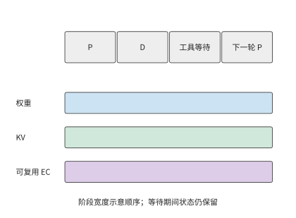

*图 9-5：计算暂停期间，状态仍需保留。示意同一请求从 prefill、decode 到工具等待和下一轮的状态驻留时间；横轴按阶段排列，不表示相等时长，EC 仅在有视觉输入时出现。E 为视觉编码，EC 为保存的视觉编码结果，P 为 prefill，D 为 decode。*

以本章的 Qwen3-8B 为例，一份包含 8192 个 token 的 BF16 上下文 KV 占 1.125 GiB。工具执行 10 秒时，GPU 可以处理其他请求，但这份上下文 KV 仍需占用 1.125 GiB 内存，容量与占用时长的乘积为 11.25 GiB·s；十个这样的会话同时等待，就占 11.25 GiB。计算暂停后，状态仍需保留，这正是共享缓存和换出策略要解决的问题。

这条请求若随后返回 1025 个 token，P 先产生第一个输出，1024 次 decode 再处理前 1024 个生成 token。此时连续 KV 覆盖 $8192+1024=9216$ 个 token，最后一个返回 token 尚未送回模型。下一轮在这 9216 个 token 之后继续，先处理该尚未写入 KV 的末尾 token 和新增输入；恢复生成时从此处继续计算。

## 9.2 Prefill–Decode 分离与资源配比

### 9.2.1 Prefill 与 Decode 为什么需要分离

Prefill 可以在一次调用中处理许多新 token，较大的矩阵计算往往能更充分地复用权重。在 decode 阶段，每个请求每步通常只处理一个新 token，需要反复读取权重与上下文状态。两者混合执行时，较长的 prefill 可能推迟已有请求的下一个输出；过度优先 decode 又会延长新请求的等待。

第 8.2 节已经用分块 prefill 缩短了长输入对 decode 的阻塞。本节保持相同模型和请求，进一步改变执行位置。PD 分离把两个阶段放入不同的服务池，使它们拥有独立的队列、批处理和资源配比。DistServe 与 Splitwise 是研究 P、D 分离部署的推理系统。在八张 A100 组成的同构集群里，分离靠独立队列消除两个阶段之间的调度干扰。在 A100 与 H20 组成的异构集群里，每类卡还能只承担自己擅长的阶段。[^pd]

这种分工像是先由一个人读完材料，再交给另一个人继续处理：接手者需要已有的工作记录，才能继续处理。对本例模型，这份需要交接的记录就是上下文 KV。P 和 D 分别处理同一请求的不同阶段，每个阶段都要执行完整的前向计算。Qwen3-8B 的 P 处理 8192 个输入 token，D 随后调用 1024 次；每次都经过注意力和前馈网络。因此两个池都需要完整的模型权重，KV 则从 P 交给 D。独立批处理带来的收益，首先要抵得过这次新增的交接。

应用通过一次调用请求完整的模型推理，服务内部则可以按阶段安排不同资源。模型的数据依赖确定了阶段之间的切分位置，KV 给出了两阶段之间需要交接的状态，负载比例决定各池需要多少资源。利用这些信息，服务可以在统一调用接口之下，为输入处理和逐步生成分别选择 batch 与计算资源。

### 9.2.2 KV 传输与两端内存占用

P 完成输入处理后，D 需要得到上下文 KV 才能继续生成。GQA 让多个查询头共享一组键和值，为每个上下文 token 保存完整的键和值。设层数为 $n$，上下文长度为 $L$，KV 头数为 $h_{kv}$，每头维度为 $d_h$，每元素为 $b$ bytes，则逻辑状态大小为

$$
V_{KV}=2nLh_{kv}d_hb.
$$

系数 2 分别对应 K 与 V。Qwen3-8B 的固定配置为 36 层、8 个 KV 头、每头 128 维。BF16 状态每个 token 的 KV 占 144 KiB；8192 个 token 占

$$
V_{KV}=8192\times144\ \mathrm{KiB}=1.125\ \mathrm{GiB}.
$$

**例 9.1　prefill 与 decode 之间的 KV 交接需要多久？** A100 服务器与 H20 服务器之间经 200 Gbit/s 的 RDMA 网卡相连，单向载荷带宽按 25 GB/s 计，采用整份状态直接交接。纯载荷传输时间为

$$
T_{\mathrm{payload}}=\frac{1.125\times2^{30}}{25\times10^9}
\approx48.3\ \mathrm{ms}.
$$

再加一次 5 μs 的启动与同步，总时间仍约 48.3 ms：对这份完整 KV 数据，固定开销只占万分之一左右，提高载荷带宽更有助于缩短等待时间。而在 AF 逐层交接的小数据量传输中，固定开销会占更大的比例。[^handoff]

上述状态大小来自 GQA 的保存方式。MLA（第 2.3.2 节）不保存展开后的键和值，而保存上投影之前的潜变量：每个 token 每层只有一条 $d_c$ 维潜变量和一条 $d_r$ 维位置分支，状态大小为

$$
V_{KV,\mathrm{MLA}}=nL(d_c+d_r)b.
$$

DeepSeek-V3 的固定配置为 61 层、$d_c=512$、$d_r=64$，BF16 下每个 token 占 $61\times576\times2=70{,}272$ bytes，约 68.6 KiB；同样 8192 个 token 的上下文占 549 MiB。沿用例 9.1 的 25 GB/s 链路，纯载荷传输约 23.0 ms；链路提高到 50 GB/s 时为 11.5 ms；同一条链路上，GQA 状态需要 24.2 ms。

| 交接状态 | 每 token | 8192 个 token | 25 GB/s | 50 GB/s |
| --- | ---: | ---: | ---: | ---: |
| Qwen3-8B，BF16 GQA | 144 KiB | 1.125 GiB | 48.3 ms | 24.2 ms |
| DeepSeek-V3，BF16 紧凑 MLA | 68.6 KiB | 549 MiB | 23.0 ms | 11.5 ms |

MLA 的状态更小，是因为缓存放在线性变换的另一侧：GQA 为每个 KV 头保存展开后的 $K$、$V$，MLA 只保存上投影之前的潜变量，按结合律，上投影可移到当前查询一侧执行。若把 DeepSeek-V3 的 128 个头也展开保存，每个 token 要占 $61\times128\times(192+128)\times2$ bytes，约 4.77 MiB，是紧凑表示的 71 倍；与 Qwen3-8B 只有 8 个 KV 头的 GQA 相比，紧凑 MLA 仍只有其 0.48 倍。后文凡是 KV 字节进入公式的地方，都并列给出这两种状态的结果。[^mla-handoff]

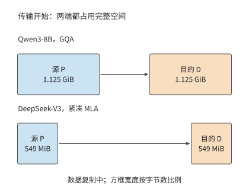

*图 9-6：源 P 保留完整状态，目的 D 同时分配同样大小的接收空间。GQA 状态两端各 1.125 GiB，传输过程共占 2.25 GiB；紧凑 MLA 状态两端各 549 MiB，共占 1.07 GiB。方框宽度按字节数比例绘制。*

采用整份双缓冲交接时，传输结束前源端保留完整状态，目的端分配完整接收缓冲。图 9-6 至图 9-8 依次画出交接开始、传输完成和释放源端三个时刻。载荷全部写入目的端后，P 发出完成标记，D 看到标记才读取状态（图 9-7）；执行权交给 D 之后，P 才释放源缓冲（图 9-8）。采用分块传输时，目的端确认收到某一块后，源端就可以提前释放这一块，缩短两端重复驻留的时间；目的端靠完成标记确定哪些连续的块已经可用。若经主存中转，状态则依次占用源端、主存和目的端的缓冲，主存到 GPU 的拷贝成为新的依赖边。

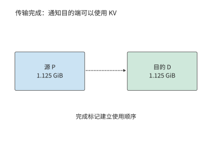

*图 9-7：完整的 1.125 GiB 载荷已经写入目的端，P 随后发出完成标记。标记本身不再搬移数据，只规定先写完、后使用的顺序：D 看到标记才读取状态。*

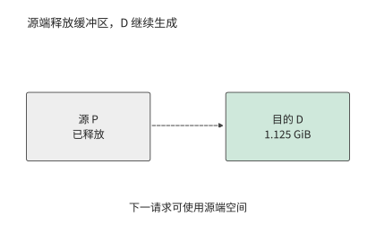

*图 9-8：本算例将执行权交给 D 后释放 P 的源缓冲，D 保留上下文并继续生成。源端空间用于后续请求。*

请求持续到达时，链路带宽既限制每秒能交接多少份状态，也影响每份状态需要传输多久。每秒 8 次上述交接需要约 9.7 GB/s 的传输带宽；每秒 16 次则需要约 19.3 GB/s。100 GbE（100 Gbit/s 以太网）端口每方向 12.5 GB/s，能满足前者的平均需求，但每个请求仍要等传输完成；后者则不同：即使两池有空闲计算能力，网络队列也会持续增长。前一种情形下每份状态要约 96.6 ms 才能传完，后一种情形每秒还会积累约 6.8 GB 待传数据。传输时间决定了单个请求至少要等待多久，而数据到达速率与传输速率之差决定了队列增长多快。换成 549 MiB 的紧凑 MLA 状态，每秒 8 次和 16 次交接只需约 4.6 和 9.2 GB/s，同一个 100 GbE 端口能满足两者的平均需求，每份状态约 46.1 ms 传完。队列是否增长由状态字节数与链路带宽共同决定，模型换了上下文表示，同一条链路的结论就会翻转。

### 9.2.3 阶段处理能力与实例数量配比

比较各阶段的处理速度前，应先算出单个请求在各阶段分别需要多少工作。设请求有 $L_{new}$ 个需要 P 新处理的 token、$G-1$ 次 decode 调用。某类 worker 的有效能力分别为 $r_P$ 个新 token/s 与 $r_D$ 次 decode/s，则该 worker 的每请求资源需求为

$$
d_P=\frac{L_{new}}{r_P},\qquad d_D=\frac{G-1}{r_D}.
$$

这里的资源占用时间可以直接相加；输入 token/s 与输出 token/s 则要先换算成同一个请求的需求。批内多个请求共享一次 decode 调用时，完成的 decode 步要计入所有请求，但资源占用时间只按这一次批执行计一次。

两类卡的 $r_P$ 与 $r_D$ 可以从数据表推出。第 4 章的 Roofline 模型给出各阶段耗时的下界：计算时间与访存时间中的较大者。下表列出两种卡的峰值。H20 的算力不到 A100 的一半，显存带宽却约为 A100 的两倍，这正是 H20 适合 decode、不适合 prefill 的原因。

| 卡 | BF16 稠密算力 | 显存带宽 | 显存容量 |
| --- | ---: | ---: | ---: |
| A100 80GB SXM | 312 TFLOP/s | 2039 GB/s | 80 GB |
| H20 SXM5 96GB | 148 TFLOP/s | 4096 GB/s | 96 GB |

实际 kernel 达不到峰值。第 8.6.3 节用 RTX PRO 6000 上的逐轮记录校准了两项效率：decode 的带宽效率随 batch size 从 batch 1 的 33% 升到 batch 64 的 65%，batch size 为 32 时按两侧实测插值约为 49%；prefill 的算力效率稳定在 58%–62%。本章两项都取为峰值的 50%，decode 一侧与 batch size 32 的插值相当，prefill 一侧比实测低约一成。按此取值，A100 的有效算力和带宽为 156 TFLOP/s、1020 GB/s，H20 为 74 TFLOP/s、2048 GB/s。

取 50%，就是把第 1.2.2 节的 MFU 和 MBU 都取为 0.5，意味着一半的硬件能力没有转化为模型计算。按第 1.3.4 节的判据，这一半有两类来源：一类是本章一阶模型没有计入的工作，例如 kernel 按 tile 补齐的零行、没有与计算重叠的通信；另一类是可以去掉的主机侧开销，例如逐个提交 kernel、切换前重建通信组和执行图。第 9.4.3 节和第 9.6.2 节各举一例。

把这两组有效能力代入章首的请求。Prefill 处理 8192 个输入 token，需要 133.6 TFLOPs 矩阵运算，却只读一次约 15 GB 权重，受计算能力限制。A100 需要 0.856 秒，每秒约处理 9570 个新 token；H20 需要 1.81 秒，每秒约处理 4540 个。Decode 一步为批内 32 条请求各生成一个 token。取生成过程中的平均上下文 $8192+512=8704$ 个 token，这一步读约 15.1 GB 权重和 41.1 GB KV，矩阵运算只有 0.65 TFLOPs，受显存带宽限制。A100 每步需 55.1 ms，每秒约完成 580 次 decode 调用；H20 每步只需 27.4 ms，每秒约完成 1166 次。两种卡的强弱恰好相反：A100 的 prefill 比 H20 快一倍多，H20 的 decode 比 A100 快一倍。batch size 为 32 时，请求生成到最后，KV 共占 43.5 GB，加上权重约 59.9 GB，两种卡都能容纳。[^rates]

先考虑同构场景：八张 A100 执行同样的模型。共置时每张卡每请求占 $0.856+1.764=2.62$ GPU 秒，八张合计 3.05 请求/s。分离后两池只能按整数张卡划分：三张做 P 提供 3.50 请求/s，五张做 D 提供 2.83 请求/s，上限为 2.83 请求/s，比共置低 7%。每个请求在分离前后消耗同样的 GPU 秒，所以同构分离不能提高吞吐；整数划分还使两池能力无法恰好相等，多出的能力只能闲置。[^pool]

同构分离换来的是延迟的稳定。共置且不分块时，一次 8192 个 token 的 prefill 独占 A100 约 0.86 秒，这张卡上所有在途请求都停止生成，相当于错过约 16 个 55 ms 的 decode 步。若这八张卡每秒接收 2.5 个请求，每张卡平均每 3.2 秒就要插入一次这样的 prefill。分离后，D 卡每步稳定在 55 ms；P 卡专门处理输入，首 token 时间是 0.86 秒的 prefill 加上 KV 交接。

第 8.2 节的分块 prefill 是分离之外的另一条路。A100 上一步 decode 的访存需要 55.1 ms，矩阵计算只需 4.2 ms，其余时间算力空闲。按 156 TFLOP/s 计，这段空闲足以处理约 490 个 prefill token。一次 8192 个 token 的输入分成 17 块，捎带在 17 个 decode 步中完成，首 token 时间约 0.94 秒，与分离相当，而在途请求的输出间隔不变。若捎带的计算完全藏在访存时间里，八张 A100 共置的上限升到 4.50 请求/s，远高于分离的 2.83。实际能藏住多少，取决于分块与 decode 同时运行时能否同时占满算力和带宽，要用实测的混合步时间判断。因此在同构集群上，通常先采用分块 prefill；分离的价值在于两个阶段可以分别选择并行方式与 batch size，并彻底隔开彼此的排队。

**例 9.2　异构集群的阶段配比如何决定吞吐上限？** 使用 8192 个输入 token、1025 个输出 token。四张 A100 与四张 H20 的阶段能力按上述方法推出，如下表所示；后续改变请求组成时，同样按新的工作量重新推算。

| 卡 | P 能力，新 token/s | D 能力，调用/s | 每请求 P GPU 秒 | 每请求 D GPU 秒 |
| --- | ---: | ---: | ---: | ---: |
| A100 80GB SXM | 9566 | 580 | 0.856 | 1.764 |
| H20 SXM5 96GB | 4538 | 1166 | 1.805 | 0.878 |

共置时，一张 A100 每请求占 2.62 GPU 秒，一张 H20 占 2.68 GPU 秒，八张合计 3.02 请求/s。把四张 A100 分给 P、四张 H20 分给 D，P 池提供 $4/0.856\approx4.67$ 请求/s，D 池提供 $4/0.878\approx4.55$ 请求/s。每请求交接 1.125 GiB。两台服务器之间按一张 200 Gbit/s 网卡计，25 GB/s 的带宽每秒可交接约 20.7 份，于是总体吞吐率上限为

$$
\mu_{PD}=\min\left(\mu_P,\mu_D,\frac{B_{net}}{V_{KV}}\right)\approx4.55\ \text{请求/s}.
$$

其中 $\mu_P$、$\mu_D$ 是 P 池与 D 池的请求率上限，$B_{net}$ 是两池之间交接链路的带宽。

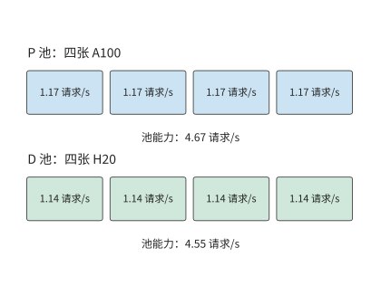

*图 9-9：每张 A100 在 P 阶段提供约 1.17 请求/s，每张 H20 在 D 阶段提供约 1.14 请求/s。P 池 4.67 请求/s，D 池 4.55 请求/s，均低于网卡约 20.7 请求/s 的交接能力。*

分离后，两类卡都避开了各自较慢的阶段，请求率上限从 3.02 增至 4.55 请求/s，是共置的 1.51 倍，高于每秒 3.5 个请求的到达率。模型仍处理同样的 8192 个输入 token 与 1024 次 decode，差别在于由谁执行。把角色对调，让 H20 做 P、A100 做 D，P 池只剩 2.22 请求/s，吞吐上限不到正确分工的一半。

上文在同构集群上比较过的分块捎带，放到 H20 上效果有限：H20 一步 decode 的空闲算力只够处理约 85 个 prefill token。按理想捎带计，四张 A100 加四张 H20 共置的上限为 4.17 请求/s，仍低于分离的 4.55。异构集群的收益来自硬件本身的差异，分块无法替代。

另一个可以改变的条件是交接状态本身。把交接状态换成紧凑 MLA，$\mu_{PD}$ 的链路项从 20.7 增至 43.4 请求/s，50 GB/s 链路下则从 41.4 增至 86.9 请求/s；上限仍由 D 池的 4.55 请求/s 决定，四张 A100 做 P、四张 H20 做 D 的配比不变。链路成为约束项的条件是 $B_{net}<\mu V_{KV}$：在 4.55 请求/s 下，GQA 状态要求链路至少约 5.5 GB/s，紧凑 MLA 状态只要约 2.6 GB/s。高于此值，再提高带宽不会改变吞吐上限；低于此值，图 9-10 中所有高于 $B_{net}/V_{KV}$ 的格子都会被链路压平到同一个值。[^pool-mla]

紧凑路径节省的是字节，不是全部工作。按第 2.3.2 节的结合律，上投影移到了查询一侧：DeepSeek-V3 每层每个查询 token 要多做一次 $128\times128\times512$ 的查询变换和一次同样大小的值恢复，合计 33.5 MFLOPs，61 层为 2.05 GFLOPs，与表 2-3 中 KV 上投影（kv_b_proj）对单个 token 的展开运算量相同。这部分计算量随批内请求数线性增加：一次 decode 调用服务 $B$ 条请求，就多 $2.05B$ GFLOPs。按 H20 的 74 TFLOP/s 有效算力，每条请求每步多 27.7 μs，1024 步合计 28.3 ms。若这部分计算不能藏进访存时间，D 池每请求的 GPU 秒从 0.878 增至约 0.907，D 池能力从 4.55 降到约 4.41 请求/s，仍高于 3.5 的到达率；每条请求每步的额外计算超过约 258 μs，才需要第五张 D 卡。紧凑路径改变的是 D 实例的瓶颈位置：每 token 读取从展开状态的 4.77 MiB 降到 68.6 KiB，计算项却随 batch size 增长，于是 D 实例在更小的 batch size 上就从读取受限转为计算受限。例 9.2 的 $r_D$ 是在 batch size 32 下推出的，换成紧凑 MLA 后要按新的转折 batch size 重新推算。

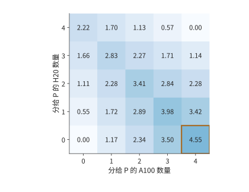

*图 9-10：阶段配比如何限制请求率。四张 A100 与四张 H20，阶段能力见例 9.2；横轴为分给 P 的 A100 数，纵轴为分给 P 的 H20 数，其余分给 D。每格取两池能力与 25 GB/s 网卡交接能力的最小值，不含排队；颜色深浅表示可持续的请求率，单位为请求/s，框出的格子为最优配比。*

图 9-10 还给出了偏离最优配比后的吞吐率变化。把一张 A100 从 P 调到 D，P 从 4.67 降为 3.50 请求/s，D 从 4.55 增为 5.12 请求/s，结果受 P 限制而降至 3.50。把一张 H20 从 D 调到 P，P 增为 5.22 请求/s，D 却降为 3.42 请求/s，同样变慢。最优配比使两池能力接近相等。改变配比后，一个池即使有富余能力，也无法替另一个池完成工作。

### 9.2.4 不同请求与负载下的收益边界

例 9.2 固定了请求组成，现在只改变其中一个条件：前缀命中。P 已经缓存了前 6144 个 token，只需处理剩下的 2048 个。新 token 减到四分之一，A100 的 prefill 时间从 0.856 秒降到 0.238 秒，一张 A100 的 P 能力从 1.17 增至 4.20 请求/s；若仍给 P 四张 A100，它们合计能处理 16.8 请求/s，D 却仍只能处理 4.55 请求/s。

把两张 A100 调到 D，留下的两张提供 8.41 请求/s 的 P 能力；D 则由两张 A100 与四张 H20 提供 $2/1.764+4/0.878\approx5.69$ 请求/s。总体吞吐率上限提高到 5.69 请求/s。再调走一张 A100，P 只剩 4.20 请求/s，反而更慢。假定 D 没有缓存这段前缀，因此两种配比仍须交接完整的 1.125 GiB；P 的计算量减少了七成多，但传给 D 的 KV 大小没有变化。

再恢复原始输入，把输出缩短到 129 个 token，即不带推理过程的普通对话。D 调用数从 1024 降到 128，一张 H20 的 D 能力增至约 9.46 请求/s，D 几乎不再是瓶颈。最优配比变成四张 A100 加三张 H20 做 P、一张 H20 做 D，P 池提供 $4\times1.168+3\times0.554\approx6.33$ 请求/s。共置此时已有 5.84 请求/s，分离只提高 8.5%。

图 9-11 将三次调整画在同一组计算资源上。每个方块都是原来的一张卡，变化的只是它承担的阶段。前缀命中后 P 的工作减少，可以让出两张 A100；输出变短后 D 的工作减少，三张 H20 转去做 P。

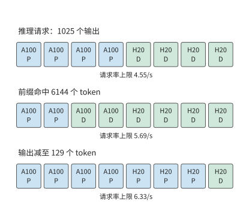

*图 9-11：请求组成改变资源分配。四张 A100 与四张 H20，阶段能力按例 9.2 的方法推出；第一行为 8192 输入、1025 输出的推理请求，第二行只减少 P 的新输入，第三行恢复完整输入并将输出减至 129 个 token。方块表示卡，每行下方为对应的吞吐率上限。P 为 prefill 池，D 为 decode 池。*

这三种请求最合适的 P 卡数分别是四张、两张和七张。前缀命中减少 P 的新工作，把资源推向 D；输出变短减少 D 的重复工作，把资源推向 P。推理请求的输出越长，D 的比重越大，H20 这类带宽强、算力弱的卡越有价值。由此可以把调度分成两个时间尺度：请求到达时选择进哪个队列，负载分布持续变化时调整池的规模。队列分配决定眼前等待，池规模决定积压能否长期消退。

## 9.3 Attention–FFN 分离与异构执行

### 9.3.1 Attention、FFN 与专家的执行边界

AF 指注意力与前馈网络的分工。与 PD 一次划分两个生成阶段不同，AF 在模型层内划分计算：注意力产生隐状态，前馈网络或被选中的专家处理该隐状态，再把结果送回，供后续算子使用。下一层通常要等待该结果，因此小数据量传输的启动与同步会重复多次。

MoE 特别适合这种分工：总专家权重较大，但每个 token 只选择其中一部分。若大多数专家保存在主存，可以将被选中的权重搬给 GPU，也可以让 CPU 使用本地权重完成计算，再传递较小的激活。前一条路径花链路带宽换 GPU 算力，后一条路径花 CPU 算力换较少的链路流量。如何选择取决于本次分派给同一个专家的 token 数：每个 token 的特征向量占该专家输入矩阵的一行，这些行复用同一份专家权重。

### 9.3.2 CPU／GPU 协作

上一小节的两条路径交付同一份输出，区别在于跨链路传什么：图 9-12 传权重，图 9-13 传输入和输出。第 8.4.3 节采用第一条路径，将权重暂存主存，使用时搬到 GPU。KTransformers 是采用第二条路径的实际系统：GPU 处理注意力和部分常驻专家，CPU 处理分给自己的专家；把分给 CPU 的工作提交后，GPU 继续执行可以并行的分支，最后同步并合并结果。热点专家、共享专家以及 prefill 阶段可以采用不同的计算资源分工。分支汇合时，下一层必须等两侧都完成后才能开始。[^kt]

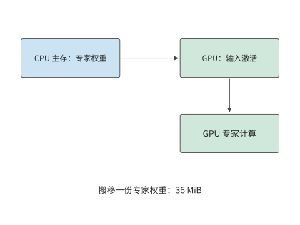

*图 9-12：把一份 36 MiB 专家权重从主存送到 GPU，再由 GPU 读取本地输入完成计算。*

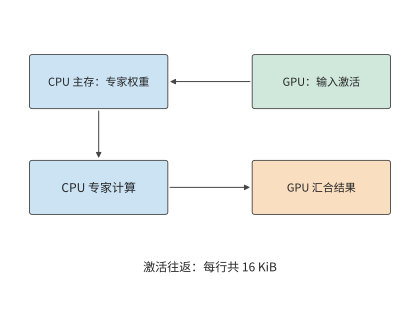

*图 9-13：输入从 GPU 交给 CPU，CPU 使用主存权重执行专家，结果回到 GPU。每次 token 到专家的分派，传入和传出的特征向量合计 16 KiB；并行的 GPU 常驻专家分支完成后再汇合。*

两条路径的开销都取决于一份专家权重的大小。对 Qwen3-235B-A22B，一个专家包含三个矩阵，参数数量为 $3\times4096\times1536=18874368$。BF16 权重为 36 MiB。

**例 9.3　专家权重复用如何改变 CPU 与 GPU 的执行选择？** 采用 KTransformers 论文的实验机：两颗 Intel Xeon Platinum 8452Y，每颗 36 核、配 1 TB DDR5，经 PCIe 4.0 连接一张 A100 40GB PCIe。论文用 Intel 的内存测试工具 MLC 测得同一 CPU 插槽内的内存带宽为 220 GB/s。在单颗 CPU 上运行 MoE 层时，PyTorch 基于 AVX-512（512 位向量指令集）的 kernel 最高达到 1.8 TFLOP/s；KTransformers 基于 AMX（高级矩阵扩展）矩阵指令的 kernel 最高达到 21.3 TFLOP/s。GPU 取 A100 40GB PCIe 峰值 312 TFLOP/s 与 1555 GB/s 的 50%，即 156 TFLOP/s 与 778 GB/s。PCIe 4.0 x16 的理论带宽为 32 GB/s，交接按 25 GB/s 计，每次启动 5 μs，BF16 激活宽度为 4096。八个专家依次执行，总时间为各专家耗时之和，权重每批读取一次。每个专家只收到一个 token 的特征向量时，CPU 直接读本地主存里的权重，省去了在较慢链路上搬 36 MiB；随着每个专家的输入行数增加，搬一次权重的开销由更多行的计算分摊，CPU 却更早达到算力上限。

先考虑八个热点专家各处理一个 token：权重合计 288 MiB。在 220 GB/s 主存上读取约 1.37 ms，加激活交接后 CPU 路径约 1.46 ms；搬到 GPU 的路径仅传权重就约 12.1 ms，连同启动与 GPU 计算约 12.5 ms。低复用时，避免大块权重搬移比提高矩阵算力更有价值。

若这八个专家各处理 128 个 token，权重仍是 288 MiB，计算量却增至原来的 128 倍。用 AVX-512 kernel，CPU 路径增至约 22.2 ms，GPU 路径约 12.5 ms，此时在 GPU 上计算更快。图 9-14 画出了中间过程：每个专家的输入从 71 个 token 增到 72 个时，GPU 开始比 CPU 快。换成 AMX kernel，128 个 token 时 CPU 路径只需约 2.57 ms，约为搬权重路径的五分之一，交点推迟到每专家 689 个 token。同一台机器处理同一批请求，CPU 用哪套指令就决定了专家该放在哪一侧。每个专家每多处理一个 token，CPU 增加的计算时间都多于 GPU，而权重搬移的开销不变，所以过了交点 GPU 就占优。[^locality]

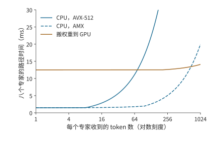

*图 9-14：专家复用改变执行位置的选择。八个专家各有 36 MiB BF16 权重。CPU 为单颗 Xeon Platinum 8452Y，AVX-512 与 AMX kernel 分别按论文实测的 1.8 与 21.3 TFLOP/s、同插槽内存 220 GB/s 计；GPU 为 A100 40GB PCIe，按峰值的 50% 计为 156 TFLOP/s、778 GB/s；PCIe 交接 25 GB/s，每次启动 5 μs。横轴为对数刻度，曲线按例 9.3 计算单层专家路径，未含格式转换。*

将上述数字写成一般形式。记专家参数数量为 $P_e$、权重字节数为 $W_e$，输入宽度为 $h$、每元素字节数为 $b$。若同一个专家本批收到 $m$ 个 token，其矩阵计算量为 $F_e(m)=2mP_e$ FLOPs，权重至少要读取一次。设有效 CPU 算力、DRAM 带宽分别为 $C_C,B_D$，GPU 算力、HBM 带宽为 $C_G,B_H$，交接带宽为 $B_L$。假定权重与激活已经转换为执行所需的格式，交接与专家计算串行发生，算子时间取计算与权重读取两项中的较大值，则单个专家在两种执行方式下的耗时分别为

$$
T_C(m)=2\alpha+\frac{2mhb}{B_L}
+\max\left(\frac{2mP_e}{C_C},\frac{W_e}{B_D}\right),
$$

$$
T_G(m)=\alpha+\frac{W_e}{B_L}
+\max\left(\frac{2mP_e}{C_G},\frac{W_e}{B_H}\right).
$$

前式将输入传输、CPU 上的专家计算和输出传输三段时间相加；后式先搬一份权重，再执行 GPU 计算。公式中的 $\alpha$ 是每次交接的固定代价。输入激活先到 CPU，输出激活在计算后返回，式中的两次启动和往返载荷正对应这两条依赖边。

硬件变化可以用同一组公式估计。在 NUMA 结构下，线程读另一颗 CPU 上的内存要经过处理器间互联。论文测得这台机器的跨插槽带宽只有 125 GB/s。CPU 路径的时间取权重读取与矩阵计算中较长的一项，图 9-15 把每专家 128 个 token 时的这两项并排画出。用 AVX-512 kernel 时，计算远长于读取，内存放在哪个插槽几乎无关紧要；换成 AMX kernel，计算缩短到略长于同插槽读取，一旦跨插槽读取，读取反而成了较长的一项。就地计算是否划算，由当前的主要瓶颈决定：读取受限时提高主存带宽有用，计算受限时提高矩阵吞吐有用。量化格式同时改变这两项：权重字节数减少，矩阵 kernel 的有效吞吐也随之改变。[^kt-audit]

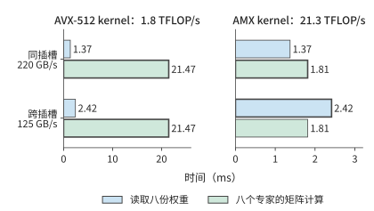

*图 9-15：八个 Qwen3-235B-A22B 专家各处理 128 个 token 时，单颗 Xeon Platinum 8452Y 上的两项时间：读取八份 BF16 权重共 288 MiB，矩阵计算共 38.7 GFLOPs。粗框标出较长的一项，即这条路径的耗时下界。左右两图横轴刻度不同；AVX-512 与 AMX kernel 的算力、同插槽与跨插槽带宽均为论文实测值。*

### 9.3.3 容量、并发与专家复用对服务能力的影响

能否装下权重和能否及时完成请求，是两个不同的问题。Qwen3-235B-A22B 每层 128 个 BF16 专家共占 4.5 GiB。若每层固定 32 个专家驻留 GPU，单层为 1.125 GiB，94 层合计约 106 GiB。即使把一张 A100 80GB 的全部 80 GB（约 74.5 GiB）显存都给专家，也无法容纳这组常驻专家；还需在多卡间切分，或减少每层驻留数量。把每层驻留数减到 16，这部分权重降到约 53 GiB，但也把更多专家的执行交给了主存一侧。容量选择由此直接改变请求的执行路径。

一个 token 选择八个专家，并不意味着一个 batch 也只访问八个专家。第 6.3.2 节已经算过这批分派：64 个 token 各选八个专家共 512 次分派，均匀覆盖 128 个专家时每专家处理四行，集中到八个专家时每专家处理 64 行，两种情况下专家矩阵的有效计算量都是 $512\times2\times18874368$，约 19.3 GFLOPs；若批内每份专家权重只读取一次，权重读取则是 4.5 GiB 与 288 MiB，相差 16 倍。在例 9.3 的 220 GB/s 主存上，单看权重读取分别约为 22.0 ms 与 1.37 ms：计算量相同，读取时间却相差一个数量级。

总专家数决定需要安排多少权重，分派次数决定这一批的有效矩阵计算量，批内专家集合决定需要访问哪些权重。图 9-14 已说明，输入行数决定 CPU 与 GPU 哪一侧更快。还要补上另一个量：一批请求究竟会访问多少个专家。知道该数量，才能将单专家的结果扩展到整个 batch。

除完全均匀和完全集中这两种情况外，还可以分析随机路由平均会访问多少个专家。按第 6.3.2 节的推导，每个 token 独立、均匀地从 $E$ 个专家中选择 $K$ 个不同专家时，批内 $M$ 个 token 下的活跃专家数期望值为

$$
\mathbb{E}[U]=E\left[1-\left(1-\frac{K}{E}\right)^M\right].
$$

代入 $E=128,K=8,M=64$，期望约 126 个专家，理想权重读取约 4.43 GiB，接近上述均匀覆盖情形。随着 batch size 继续增长，被访问的不同专家数最多到 128 就不再增加，分派次数却继续线性增加，新增的 token 于是越来越多地复用已经读入的权重。

这一分析也说明，配备大容量主存和少量 GPU 的服务器，更适合每个专家输入行数较少的负载。DeepSeek V4-Flash 公开的单张 RTX 5090 配置要配至少 200 GB 主存，Kimi K2 采用 Q4_K_M 分组量化的配置（以 4 比特为主，部分张量采用更高位宽）需要约 600 GB 主存。主存解决了总权重的容纳问题；请求的 batch size 增大后，瓶颈仍可能从权重读取转到 CPU 矩阵计算。图 9-14 的交点正对应这种变化：增加并发，既摊薄读取权重的代价，也逐渐耗尽 CPU 计算能力。[^capacity]

### 9.3.4 跨机 AF、专家分离与 micro-batch 流水

前两小节的分工仍在同一台服务器的 CPU 与 GPU 之间。在 MoE 中，还可以把路由专家放到独立的专家资源池，由保留注意力与 KV 的 worker 发送激活并接收专家结果。这称为**专家分离**（Expert Disaggregation），也常叫 EP 分离；本书用“专家分离”指部署边界，用 EP 指专家并行度。专家分离是本节注意力与专家计算分工的一种形式，具体系统还要说明共享专家、路由器和前后投影分别放在哪一侧。

以第 7 章的两台 HGX H100 服务器为例，考察一层 MoE 在专家分离下如何执行（图 9-16）。服务器 A 的四张卡 A0–A3 执行注意力，保存各自请求的 KV；服务器 B 的四张卡 B0–B3 各持有四分之一的路由专家。一层之内依次发生四步。第一步，A 卡算完注意力，路由器为每个 token 选出 8 个专家。第二步是第 6.2.6 节介绍的 dispatch：A 卡把每个 token 的隐状态按所选专家的所在卡分组，发往对应的 B 卡。四张 A 卡都要向四张 B 卡各发一份数量不等的数据，构成一次 All-to-All。第三步，B 卡收到各来源的输入后，按专家重新排列输入行，执行专家矩阵乘。第四步是 combine：专家输出沿原路送回 token 所在的 A 卡；A 卡收齐一个 token 的 8 份输出，按路由权重加权求和，才能进入下一层的注意力。

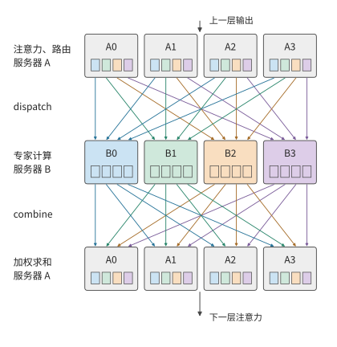

*图 9-16：一层 MoE 在两台服务器间的执行顺序，时间从上到下。A0–A3 执行注意力与路由，B0–B3 执行专家。小方块表示一张 A 卡发往一张 B 卡的一组输入，颜色标出它去往哪张 B 卡；dispatch 把各色方块送到同色的 B 卡，combine 再把结果送回原来的 A 卡。两次交换都是 4×4 的 All-to-All。*

图中有两处等待。B 卡通常要等各来源的输入到齐才开始计算，A 卡要等一个 token 的所有专家输出都返回才能求和。一张 B 卡收得多、算得慢，就会同时推迟自身的计算与返回，以及所有等待其结果的 A 卡。第 9.4 节讨论的 skew，正是经过这两处等待影响整层耗时。

**大 EP** 则指一个专家并行组跨越较多的卡。大 EP 让每张卡只保存少量专家，并汇聚多个 attention worker 的输入，使专家获得足够大的矩阵 batch。大 EP 不必采用独立专家池：同一张卡也可以同时执行注意力和自己持有的专家；独立专家池也不必只有一个大 EP 组。DeepSeek-V3/R1 的公开推理报告分别给出 prefill EP32 与 decode EP144（专家并行度分别为 32 与 144），并采用冗余专家（为高负载专家额外放置的副本）和多类负载均衡；这说明大 EP 确有实际用途，但这组规模本身不能证明注意力与专家已经分到两套设备上。[^ep-system]

扩大 EP 并不自动扩大每个专家的 batch size。若本批有 $n$ 个 token、每 token 选择 $k$ 个专家、共有 $E$ 个逻辑专家，均匀路由下每专家平均只有 $nk/E$ 行。例如 $n=1024,k=8,E=256$ 时为 32 行；只把同样的 256 个专家从 32 张卡摊到 128 张卡，该平均值仍是 32，减少的只是每卡的专家数。汇聚更多输入才能增大每个专家的 batch，却也会扩大通信范围与同步范围：图 9-16 中的两处等待要覆盖 EP 组里的每一张卡。每卡专家数变少还会让卡间 skew 变大，第 9.4.1 节用同一组 $n,k,E$ 计算其如何随 EP 增大。

专家池可以独立增加副本、选择不同算力／内存配比，并从多个 attention worker 汇聚任务。代价是原本可以在本地执行的专家输入也要跨池传送，网络成了两池共享的资源。只有多个独立 EP 组各保存一套完整的专家集合，它们才是可以分别接收任务的服务副本；只添加保存部分专家的卡，并不能让每条请求随意绕开繁忙的专家。共享专家池的队列、显存、模型版本和接纳策略要当作一个整体来管理。

把 AF 从同一台服务器扩展到跨服务器后，每次传输的启动时间、链路带宽以及各节点开始执行的时间差都会有更大影响。MegaScale-Infer 是采用注意力与专家计算分离的分布式推理系统。该系统让 micro-batch 在注意力节点与专家节点之间交错执行，形成交替的流水：一个 micro-batch 执行注意力时，另一个 micro-batch 执行专家计算。理想情况下，若两个阶段每个 micro-batch 需要 $t_A,t_F$，忽略交接，处理 $q$ 个独立 micro-batch 的双阶段流水需要 $t_A+t_F+(q-1)\max(t_A,t_F)$。其中首个 micro-batch 花费 $t_A+t_F$，之后每隔较慢阶段的一个服务周期完成一个 micro-batch。跨层时，返回激活将上一层的结束连接到下一层的开始。

MegaScale-Infer 的实验为这种部署提供了实际证据。其 2025 年论文使用 Mixtral-8×22B、DBRX 与 317B 的 Scaled-MoE，权重、激活和 KV 均为 BF16，生产请求的输入／输出长度中位数为 571／159 个 token。评估约束是 TPOT 不超过 150 ms；在八个节点、每节点八张 80 GB Ampere GPU 的同构集群上，Scaled-MoE 的每 GPU decode 吞吐达到 NVIDIA 推理框架 TensorRT-LLM 的 1.90 倍。这一结果包含分离放置、并行选择、流水和通信库的共同效果，不能当作“只开启 EP 分离”的通用加速比。论文也明确按专家热度配置冗余副本并最小化最忙节点的成本，说明独立专家池仍要处理 skew。[^ep-papers]

用具体例子计算这条流水：设注意力与专家阶段每个 micro-batch 分别需要 2 ms、3 ms。四个 micro-batch 依次执行共需 20 ms，任一时刻只有一个节点在工作；理想双阶段流水只需 $2+3+3\times3=14$ ms，节省 6 ms（图 9-17）。若拆小 micro-batch 后每阶段的实际服务时间变长，或者无法与计算重叠的往返通信超过 6 ms，这项收益便消失。因此，通信和计算效率下降带来的额外耗时合计必须小于 6 ms，流水执行才更快。[^af]

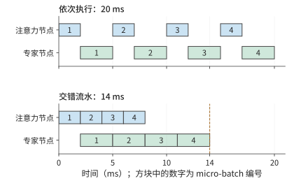

*图 9-17：四个 micro-batch 在注意力节点与专家节点间执行，每个 micro-batch 注意力 2 ms、专家 3 ms，忽略交接。上图依次执行，两个节点轮流空闲；下图交错执行，micro-batch 1 做专家计算时 micro-batch 2 做注意力。流水稳定后，专家节点连续工作，每 3 ms 完成一个 micro-batch。*

**例 9.4　注意力与前馈网络逐层交接会增加多少通信开销？** 在 Qwen3-8B 的示例部署中，把 36 层稠密前馈网络放在另一侧，每层发送一个完整 BF16 隐状态向量，并返回同样大小的结果。单向传输一次的数据量为 $4096\times2=8192$ bytes；一步 decode 合计 72 次、576 KiB。沿用例 9.1 的 25 GB/s 网卡，纯载荷约 23.6 μs，72 次 5 μs 启动合计 360 μs，串行交接约 0.384 ms。

这段时间短于例 9.1 中的一次 PD 交接，但两者对应的工作范围不同：PD 每个请求只交接一次，AF 每步 decode 都要交接。8192 个输入 token 的 prefill 若也按整批稠密 AF 交接，激活载荷为 4.5 GiB，约需 193 ms 纯传输，再加启动。PD 的一次搬移随上下文长度增长，AF 的逐层往返还随生成步数反复发生；前者先受大块 KV 搬移的影响，后者更容易受小数据量传输的启动开销和操作间依赖的影响。

AF 的逐层交接不随 KV 表示改变：它传的是 4096 维隐状态，与 KV 头数或潜变量宽度无关，一步 decode 仍是 72 次、576 KiB。改变的是 PD 一侧。令一次 PD 交接与一步 AF 交接的串行时间相等，

$$
\frac{V_{KV}}{B}+\alpha=\frac{V_{AF}}{B}+72\alpha
\quad\Longrightarrow\quad
\alpha^*=\frac{V_{KV}-V_{AF}}{71B},
$$

其中 $V_{AF}$ 是一步 AF 交接的总载荷（576 KiB），$B$ 是链路带宽。启动时间低于 $\alpha^*$ 时，一步 AF 交接比一次 PD 交接快；高于 $\alpha^*$ 时，72 次启动的累计开销已超过整份状态的传输。GQA 状态在 25 GB/s 下 $\alpha^*\approx680$ μs，50 GB/s 下为 340 μs；紧凑 MLA 状态分别为 324 与 162 μs。状态越小、链路越快，留给每次启动的预算越少。5 μs 的启动远低于这四个临界值，单看一步交接，AF 都更快。放到整条请求上比较，结论则不同：1024 步 AF 交接累计约 393 ms，是 GQA 一次 PD 交接 48.3 ms 的 8.1 倍，是紧凑 MLA 一次 PD 交接 23.0 ms 的 17 倍。PD 只交接一次，MLA 把这一次的代价减半；AF 每步都要交接，隐状态宽度不变，没有节省任何字节。输出越长，差距越大。

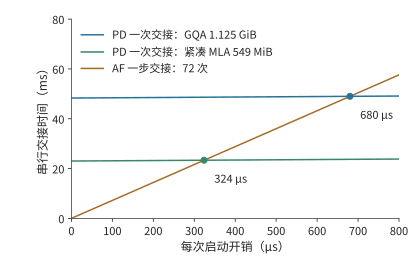

*图 9-18：一次 PD 交接与一步 AF 交接的串行时间随每次启动开销的变化，25 GB/s 链路。PD 只启动一次，斜率为 1；AF 一步 72 次启动，斜率为 72。两条 PD 线分别对应 GQA 状态 1.125 GiB 与紧凑 MLA 状态 549 MiB，与 AF 线的交点即临界启动时间 680 与 324 μs；50 GB/s 链路下交点移到 340 与 162 μs。*

下一节考察 MoE 中的激活传输：每个输入可能发往多个执行位置，完成时还要等它选中的各个专家都返回结果再汇合。

## 9.4 专家放置、复制与负载均衡

### 9.4.1 大 EP 中的计算与通信 skew

上一节中，集中复用减少了权重读取。但这些热点专家如果都放在同一张卡上，其他卡便无法分担。本节继续跟踪同样的 512 次分派，考察各张卡何时完成计算。即使全系统的总计算量不变，最忙的那张卡也可能让整层推迟完成。对卡 $r$，记矩阵计算量为 $F_r$、需要读取的权重字节数为 $W_r$，有效算力和带宽分别为 $C_r$、$B_r$。该卡完成计算与权重读取的时间至少为 $\max(F_r/C_r,W_r/B_r)$；合并各卡的结果时，必须等耗时最长的卡完成。

把上一节的 512 次分派放到八张卡上，可以看到集中路由的另一面。若各卡恰好分到 64 次任务，每卡处理约 2.42 GFLOPs；若八个热点专家都位于一张卡，该卡处理全部约 19.3 GFLOPs。八张卡取第 7 章的 HGX H100 服务器，每张 H100 SXM 按 BF16 稠密峰值 989.4 TFLOP/s 的 50% 计，即 494.7 TFLOP/s。只看计算，最忙卡的服务时间从约 4.9 μs 增到 39.1 μs，为原来的八倍。

图 9-19 中，横条的长度表示各卡完成计算所需的时间。所有结果合并后才能进入下一层，因此决定完成时刻的是最长的一条，而不是八条的平均长度。

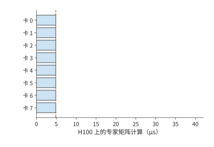

*图 9-19：总计 512 次专家分派均分到八张卡，每卡 64 次；虚线表示全部计算结束、可以汇合的时刻。*

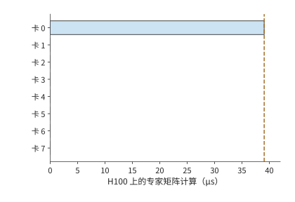

*图 9-20：512 次全部落在卡 0，其他卡空闲。相同总计算量，需要等待卡 0 完成；两图使用相同时间尺度。*

集中路由将需要读取的权重从 4.5 GiB 减少到 288 MiB，却可能把最忙卡的计算量增至原来的八倍。前者有利于读取受限的执行，后者不利于计算受限的执行。均衡策略因此要先确定瓶颈所在，再决定是追求复用还是分散工作。

即使总工作量不变，大 EP 也会放大这种等待。沿用第 9.3.4 节的 $n=1024,k=8,E=256$（DeepSeek-V3 每层也是 256 个路由专家、每 token 选 8 个）：一批共 8192 次分派，平均每个专家 32 行。设其中一个专家较热，收到 128 行，是平均值的 4 倍；其余 8064 行均分给另外 255 个专家，每个约 31.6 行。把 256 个专家按编号均分到 EP 组的各张卡，热点专家所在的卡要处理它自己的 128 行，再加上同卡其他专家的行。EP8 时每卡 32 个专家，热点卡约 1108 行，只比每卡平均的 1024 行多 8%；EP32 时每卡 8 个专家，热点卡约 349 行，比平均的 256 行多 36%；EP256 时每卡只剩这一个专家，热点卡 128 行，是平均 32 行的 4 倍。同一个热点专家，在小 EP 中被同卡的其他专家冲淡，在大 EP 中独占一张卡，专家之间的不均原样变成了卡之间的不均（图 9-21）。

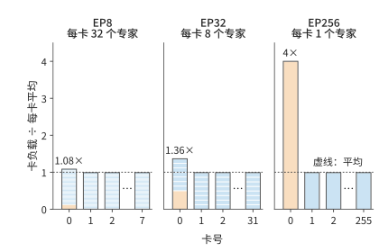

*图 9-21：同一个热点专家在三种 EP 规模下造成的卡间 skew。256 个专家，1024 个 token 各选 8 个，专家 0 收到平均值 4 倍的 128 行。每根柱是一张卡，柱内每一段是这张卡上的一个专家，橙色为热点专家；纵轴为该卡行数除以每卡平均行数。每幅图只画卡 0、1、2 和最后一张卡，其余各卡与卡 1 相同。*

一张卡的行数同时决定三项工作：dispatch 阶段要接收的字节数，combine 阶段要发送的字节数，以及专家计算受算力限制时的矩阵时间。按每行 8 KiB、每卡 50 GB/s 网卡计，EP256 的热点卡要接收 1 MiB，约 21 μs，一张平均的卡只收 256 KiB，约 5.2 μs。若 batch 较小、专家计算受权重读取限制，一张卡的矩阵时间主要取决于它要读几份专家权重，与行数关系不大，但两次交换的字节数仍与行数成正比。从 EP8 到 EP256，每卡平均行数缩小到 1/32，最忙卡的行数却只从 1108 降到 128，约为原来的 1/8.7。整层按最忙的卡计时，EP256 中一张平均的卡在这一阶段有四分之三的时间在等待。

没有热点时，EP 增大同样会放大 skew。设每个 token 独立、均匀地随机选择 8 个专家，各专家的行数仍会在 32 附近随机波动。一张卡上的专家越多，这些波动越能相互抵消；卡越多，一批中出现一张特别忙的卡的机会也越大。按固定随机种子模拟 1000 批，EP8 的最忙卡平均只比每卡平均多 4%，EP256 多 52%（图 9-22）。两种效应来自同一个原因：EP 越大，每卡上可以相互抵消的专家越少，要等待的卡却越多。DeepSeek 公开的 decode 部署采用 EP144，每张卡只放 2 个路由专家，位于曲线右端附近；它为此增加 32 个冗余专家，并按负载调整副本，这正是第 9.4.2 节讨论的手段。[^ep-scale]

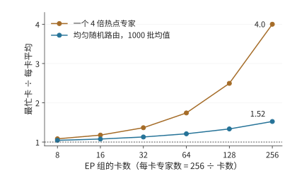

*图 9-22：最忙卡行数与每卡平均行数之比随 EP 组卡数的变化。橙线为一个 4 倍热点专家，不含随机波动，可以直接手算；蓝线为均匀随机路由，是固定种子模拟 1000 批的平均值。256 个专家按编号均分，不设副本；横轴为对数刻度。*

通信量也取决于 token 最初在哪张卡上。在第 9.1 节的 TP2×EP4 布局中，各 EP 组处理同一批请求，每个 EP 组的成员已经持有相同的隐状态输入，跨 EP 组的 dispatch 可以为零，结果通过部分和归约合并。另一种布局让各张卡持有各自不同的输入 token，这时就要把激活 dispatch 给远端专家，图 9-16 就是这种情形。输入已复制时，通信集中在结果合并；输入分属不同的卡时，执行前还多出一次远端 dispatch。通信量由 token 的起点、专家的位置与结果的归属共同决定。

大 EP 中的 skew 至少要分三个层次观察。逻辑专家的选择频率决定每个专家的有效行数；专家放置与副本选择把这些行数变成每卡负载；token 的来源、目标和网络路径再把每卡负载变成每个方向的流量。专家热度不均未必造成卡间不均，卡间计算均匀也未必让共享链路均匀。第 6.3.2 节的批内复用解释权重读取，本节继续核算逐卡计算、通信与完成时间。

设 $a_{ij}$ 是来源 $i$ 发给专家组 $j$ 的 token—专家分派次数，每份输入与输出分别为 $d_D,d_C$ bytes。在按分派传送、无去重与预归约的方案下，

$$
V^D_{ij}=a_{ij}d_D,\qquad V^C_{ji}=a_{ij}d_C,\qquad
m_j=\sum_i a_{ij},\qquad
s_{\mathrm{expert}}=\frac{\max_j m_j}{nk/R}.
$$

这里 $R$ 是接收专家组数，$\sum_jm_j=nk$。$s_{\mathrm{expert}}=1$ 表示组间有效任务均衡；同型专家、相同精度且忽略 padding 时，它才近似等于计算量 skew。对通信阶段 $X\in\{D,C\}$，把矩阵按发送方、接收方和物理割集统计，有

$$
T_X\ge\max\left(
\max_i\frac{\sum_jV^X_{ij}}{B^{\mathrm{send}}_i},
\max_j\frac{\sum_iV^X_{ij}}{B^{\mathrm{recv}}_j},
\max_{\mathcal C}\frac{V^X_{\mathcal C}}{B_{\mathcal C}}
\right).
$$

其中 $V^X_{\mathcal C}$、$B_{\mathcal C}$ 分别是穿过物理割集 $\mathcal C$ 的载荷与链路带宽。这是载荷传输下界，不含启动、排队与数据晚到；同一物理方向的并发流量需要相加，不能把多条流各自除以一份完整带宽后假定同时完成。带宽 skew 在这里指各张卡、各条链路的需求或占用不均，硬件的额定带宽并没有变。

**例 9.5　总通信量相同，为什么热点让两次交换都变慢？** 沿用第 7.2.3 节的 1024 个 token、每 token 选 8 个专家与 8 KiB 向量，放到图 9-16 的两台 HGX H100 服务器上：四个来源是服务器 A 上执行 attention 的四张卡，四个专家组各由服务器 B 上的一张卡执行，全部分派都跨服务器。每张卡经自己的 400 Gbit/s ConnectX-7 网卡收发，每方向 50 GB/s；交换网络在两台服务器之间每方向可承载 $4\times50=200$ GB/s。四个来源各发送 2048 份，dispatch 总计 64 MiB，combine 也是 64 MiB。均衡时每组接收 2048 份，即 16 MiB；热点分布为 $[5120,1024,1024,1024]$ 时，组 0 接收 40 MiB，另外三组各 8 MiB。两种分布的总通信量和总有效计算量相同，专家 skew 却从 1 变为 2.5。

每份专家计算按 Qwen3 MoE 示例的 $6\times4096\times1536$ FLOPs 计，每张 H100 的有效算力取 494.7 TFLOP/s。暂不计权重读取、padding、启动与排队，得到下表。最后一列仅适用于三个阶段之间设整批屏障的执行，是三个下界之和；有重叠时须另算关键路径。[^ep-calc]

| 分布与路径 | dispatch 下界 | 最忙卡计算下界 | combine 下界 | 阶段屏障总下界 |
|---|---:|---:|---:|---:|
| 四组均衡，跨服务器 | 0.336 ms | 0.156 ms | 0.336 ms | 0.827 ms |
| 热点组，跨服务器 | 0.839 ms | 0.391 ms | 0.839 ms | 2.068 ms |
| 四组均衡，两池间只剩一条 400 Gbit/s 链路 | 1.342 ms | 0.156 ms | 1.342 ms | 2.841 ms |
| 热点组，dispatch 改为 FP8 | 0.419 ms | 0.391 ms | 0.839 ms | 1.649 ms |
| 热点组，两池同在一台 HGX（NVLink） | 0.093 ms | 0.391 ms | 0.093 ms | 0.577 ms |

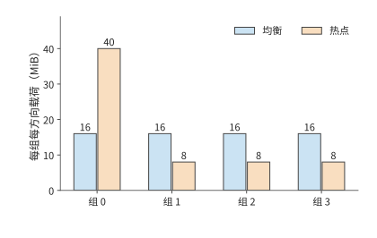

*图 9-23：四个专家组在 dispatch 阶段接收、combine 阶段发送的载荷。均衡与热点分布总计均为每方向 64 MiB；热点组在两个阶段都承担 40 MiB。柱高表示字节需求，不表示测得的瞬时带宽。*

跨服务器时，两次交换占阶段屏障总下界的八成，最忙卡的计算只占两成：H100 算一份专家任务约需 76 ns，网卡传一份 8 KiB 激活却要约 164 ns。热点同时延长接收、计算与返回，三段都变为原来的 2.5 倍。把热点分散后，若两池之间只剩一条 400 Gbit/s 链路，仍需每方向至少 1.342 ms，说明增加专家卡不能替代跨池带宽。只把 dispatch 改为 FP8，也不会同比缩短 BF16 combine 或专家计算；表中假设量化不改变计算时间，并忽略尺度元数据，以便分别观察这几项影响。把两池放进同一台 HGX，每方向 450 GB/s 的 NVLink 把两次交换都压到 0.093 ms，热点卡 0.391 ms 的计算就成了最长的一段；这时减少热点卡的计算比再提高带宽更有效，下一节的专家副本针对的正是这种情形。

### 9.4.2 专家副本、放置与动态调整

图 9-20 中集中在少数卡上的工作提示了改进方向：把热点专家的副本放到空闲卡上，让这些卡也能处理热点任务。专家复制让同一个逻辑专家拥有多个物理副本，调度器可以把任务分给这些副本。只要副本的权重相同、路由权重用得正确、结果合并无误，复制就不必改变每个 token 选分数最高的 k 个专家这条规则（top-k）；修改专家选择规则会改变模型行为，两者要分开评价。vLLM、SGLang 的专家负载均衡机制（EPLB）根据路由统计，调整各逻辑专家的副本位置和任务分配。

专家副本占用显存，也会挤占 KV 和缓冲。每卡每层增加一个 36 MiB 专家，94 层共需 3384 MiB，约 3.30 GiB；若只为八个最拥挤的层各增加一个副本，则只需 288 MiB。两者相差近 12 倍。CRAFT 是研究专家副本与显存分配的服务系统，要解决的正是各层显存如何分配的问题：把空间花在最能缩短等待的层，而不是机械地给每层同样多的副本。[^moe]

**例 9.6　热点专家副本需要多少批才能收回复制成本？** 八张卡是一台 HGX H100 服务器，一批 128 个 token 都选中卡 0 上的八个热点专家，共 1024 次分派。把其中七个专家各复制一份到卡 1 至卡 7，共 252 MiB；七张接收卡各增加 36 MiB，都能放入 64 MiB 的额外可用空间。每张 H100 按峰值的 50% 计，有效算力 494.7 TFLOP/s、显存带宽 1675 GB/s。卡 0 按 tile 调度，每批要从显存读写约 921 MB，受显存带宽限制；复制后卡 0 只剩 576 次分派，每批从约 0.550 ms 缩短到 0.309 ms，节省约 0.240 ms。七份副本都从卡 0 经 NVLink（每方向 450 GB/s）依次发出，每份另计 5 μs 启动，复制约需 0.622 ms。按未经四舍五入的执行时间，节省时间超过复制时间所需的最少批数满足

$$
N\Delta t>T_{copy},\qquad
N_{min}=\left\lfloor\frac{T_{copy}}{\Delta t}\right\rfloor+1=3.
$$

在同一台服务器内，副本到第 3 批就收回了复制成本：热点持续 16 批净省约 3.2 ms，持续 64 批净省约 14.8 ms。若热点专家的原副本在另一台服务器上，复制要经 400 Gbit/s 的 ConnectX-7 网卡（每方向 50 GB/s），准备时间增至约 5.32 ms，要到第 23 批才回本：热点只持续 16 批时反而净损失约 1.5 ms，持续 64 批才净省约 10.1 ms。图 9-24 把一次投入与逐批收益画在同一张图上。若接收卡只有 32 MiB 空间，连一份 36 MiB 专家也无法容纳，此时无论热点持续多久，都应先改变放置或释放容量。[^replica]

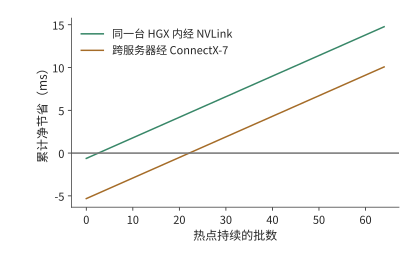

*图 9-24：热点持续多久，专家复制才值得。每批节省约 0.240 ms；同一台 HGX H100 内经 NVLink 复制一次约 0.622 ms，第 3 批开始净获益；跨服务器经 ConnectX-7 网卡复制约 5.32 ms，第 23 批开始净获益。曲线使用例 9.6 中未经四舍五入的时间计算；七张接收卡各需额外 36 MiB，假设热点不变。*

CRAFT 的实测进一步表明，复制收益与层有关。该研究基于 SGLang v0.4.8，在八个 AWS p4de.24xlarge 节点组成的 A100 80GB 集群上运行 BF16 的 DeepSeek-R1 和 Kimi K2，比较显存预算内按层分配专家副本与既有复制策略的效果。论文报告端到端吞吐平均达到对照的 1.14 倍、最高 1.2 倍。这说明应把副本预算优先给收益大的层，但不表示任意热点复制都能得到这一增幅；其输入按 4096 个 token 分块、输出固定为 256 个 token 等实验条件，以及按有效吞吐（goodput）定义的容量拐点，也不能直接替代线上的 p99 指标。[^ep-papers]

副本策略要预测的是热点还会持续多久。跨服务器复制时，每次重新复制都需要 5.32 ms，所以频繁跟着热点迁移副本，会推迟收回复制成本的时间。同一台服务器内复制只要 0.622 ms，时间几乎构不成约束，限制副本数量的是每张卡还能释放多少显存。将容量优先分给持续拥挤的层，才能让累计节省的等待时间超过准备耗时。

均衡策略还要沿完整路径选择控制对象。来源侧要平衡 token 数与注意力的就绪时间；专家侧要平衡有效行数、实际 GEMM 时间和接收量；网络侧要检查共享出口、跨机架流量与返回方向。DeepSeek 的公开报告把 prefill、decode 与 EP 负载均衡分别处理，原因就在这里。长上下文 decode 即使每卡请求数相同，注意力的 KV 读取量仍可能不同，最终形成不同的 dispatch 发起时刻。[^ep-system]

在独立专家池中，还要控制跨来源的排队。多个 attention worker 可能同时选中同一个热点专家，即使它们各自的小 batch 看起来均衡，汇合后的流量也可能超过该专家的服务能力。若池每秒接纳 $\lambda$ 批，每批平均在专家卡 $j$ 上产生 $\mathbb E[F_j]$ FLOPs，则稳定运行至少需要 $\lambda\mathbb E[F_j]<C_j$；每条链路 $\ell$ 还需满足 $\lambda\mathbb E[V_\ell]<B_\ell$。平均负载满足这些条件只是必要条件，突发和重尾输入仍会造成较长的队列。共享池有时能汇聚 batch、平滑各来源的波动，有时会放大相关的热点，不能直接假定分离会消除 skew。

热点副本应放到同时有计算余量和链路带宽余量的位置。本节的 dispatch 消息是一个 token 的隐状态向量，BF16 为 8 KiB、FP8 为 4 KiB，远大于第 7.2.4 节在 50 GB/s 网卡上求出的约 0.93 KB 交点，热点卡先用尽的是带宽，而不是网卡发起请求的速率；只有逐条发送不到 1 KB 的控制消息时，才需要为网卡每秒约 5400 万项的请求发起能力一并留出余量。动态选择副本时要计入队列和路径，并保留当前 batch 使用的路由映射直至 combine 完成；迁移或回收旧副本前要排空在途任务。对热点设置接纳额度、限制单个来源的在途量，可以避免它耗尽整个池的缓冲；增加池容量时，也要相应调整接纳额度与背压。丢弃溢出 token、改变 top-k 或替换逻辑专家会改变模型行为，不能当作透明的资源均衡。

### 9.4.3 输入分发、计算与结果合并的重叠

前两小节的核算没有区分 prefill 与 decode，而分派集中对这两个阶段的影响并不相同。《Demystifying the Mixture of Experts Serving Tax》用各阶段的微基准解释这种差异：prefill 的计算不均会让最慢的卡拖住整批，decode 的专家集中却可能通过减少活跃权重和 padding 降低访存成本。这与第 6.3.2 节的复用分析一致。论文的 Mixtral／Qwen2 MoE 使用八张 A100，DeepSeek-V3 使用八张 B200，通信微基准另有 8／16 张 H200；这些结果不能合成一个跨集群的端到端加速比。论文提供的证据说明，路由、实际矩阵形状、通信和内存访问要一起测量。[^ep-papers]

实际矩阵形状的影响主要来自补齐。Grouped GEMM 把多个专家的矩阵乘法放进同一次 kernel 执行，kernel 按 tile 大小补齐各矩阵的行数。例如八个本地专家收到 $[32,16,8,4,2,1,1,0]$ 个 token，合计 64 次 token 到专家的分派，对应输入矩阵中的 64 个有效行。若每个非空专家补齐到 32 行，需要 224 行；若八个专家都按最大值补齐，需要 256 行。实际执行的行数分别为有效行数的 3.5 倍和 4 倍。这解释了为什么有效任务数相同，矩阵时间仍可能不同：硬件执行的是补齐后的矩阵，模型所需的专家计算只对应其中 64 个有效行；补齐的零行没有对应的真实 token。

补齐影响的是计算一项；三个阶段的总时长还取决于它们能否重叠。以第 9.4.1 节跨服务器的均衡分布为例：dispatch、专家计算与 combine 的下界分别为 0.336、0.156、0.336 ms，完全串行为 0.827 ms。若能均分成两个 micro-batch，各阶段时间减半，理想三阶段流水等于一个 micro-batch 三段之和再加一次最长的一段，即 0.581 ms，节省 0.246 ms。这里最长的一段是通信，流水的节奏由网卡决定。若网卡的 DMA 与同时运行的 GEMM 争用 HBM，使每个 micro-batch 的 dispatch 与 combine 各慢约 49%，同一流水就回到 0.827 ms：通信确实重叠了，整批却没有变快。反过来，专家计算要慢到原来的 3.1 倍，才会抵消同样的收益。[^expert-exp]

补齐和争用正是 MFU 达不到峰值的两大来源：补齐让矩阵单元去算没有对应 token 的零行，争用让通信和计算互相拖慢。两者都出在实现层，硬件峰值并没有变；选用更贴合实际行数的 tile，错开 DMA 和 GEMM 对 HBM 的访问，就能收回其中一部分。

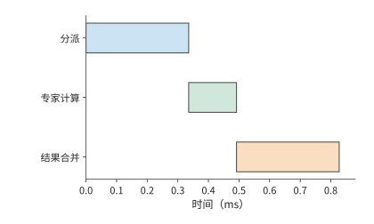

*图 9-25：整批依次分派 0.336 ms、计算 0.156 ms、合并 0.336 ms，总时间 0.827 ms；数值取自第 9.4.1 节表中跨服务器的均衡分布。*

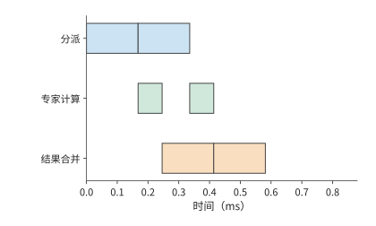

*图 9-26：每个 micro-batch 的各阶段时间减半，三条轨道使用独立资源。第一个 micro-batch 计算时可以 dispatch 第二个 micro-batch，总时间降到 0.581 ms。*

沿图 9-26 的时间线看，第一个 micro-batch combine 时，第二个 micro-batch 已经开始计算。第一批的 dispatch 负责填充流水，最后一批的 combine 负责收尾，这两段是流水之外的串行时间。

上述流水假设两个 micro-batch 大小均匀。真实的专家分离中，一个 token 的路径仍然是“dispatch → 所选专家计算 → combine”，**两次通信阶段**夹着专家计算。dispatch 的数据就绪 skew 来自注意力的完成时间和发送队列；专家计算的 skew 又变成 combine 的发送就绪 skew。即使两次交换的字节数完全对称，返回阶段也可能因为数据晚到而拖长。

对 token $t$，令所选专家集合为 $\mathcal E(t)$，从当前层起点到专家 $e$ 的排队、分派、计算与返回的累计路径长度为 $L_{t,e}$。其合并完成时刻满足

$$
T_t=\max_{e\in\mathcal E(t)}L_{t,e}+T_{\mathrm{merge},t}.
$$

这里每条路径都包含共享资源上的排队，不能把各阶段单独运行的时间直接代入并假定互不干扰。若某 token 的两条分支分别在 0.5 ms 和 1.4 ms 返回，它要等到 1.4 ms 后才能合并；只把快的那条分支降到 0.3 ms 不会改变它的完成时刻。逐 token 或逐块推进时，没有选中慢专家的 token 可以更早继续；整批屏障则让它们一起等。运行时是否真正支持细粒度推进、后续矩阵是否还要求凑批，决定了等待会传播多远。

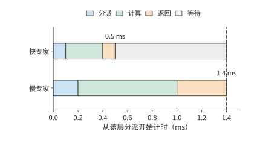

*图 9-27：一个 token 选中的两条专家分支，教学时长分别为 0.5 ms 与 1.4 ms。每条都依次经过 dispatch、计算与 combine；同一个 token 要等两份结果，图中忽略本地加权合并的时间。灰色表示快分支的结果到达之后等待的时间。*

这也解释了为什么不能总用 $\max(t_A,t_F)$ 预测专家池的流水周期。该式要求各阶段耗时稳定、资源独立、工作能持续供给；实际周期还受最忙专家、往返链路、返回缓冲和跨层依赖的约束。同一个专家池若为多个层或多个模型服务，必须合计它们占用的资源。第一个 micro-batch 仍要承受完整的往返延迟，提高稳态吞吐并不等于缩短单个 token 的响应时间。

dispatch 与 combine 这两次通信由通信库实现。NCCL 提供通用的集合通信与点对点原语，专用的 EP 通信库则把路由、打包、传输和合并放在一起实现。DeepEP 提供 MoE dispatch／combine 和低精度传输支持；V2 的公开接口使用 ElasticBuffer，底层采用 NCCL Gin（NCCL 由 GPU 发起网络通信的后端），并移除了 V1 中不占用 SM、直接经 RDMA 收发的低延迟 EP 通信路径。这说明库名相同也不能省略版本条件。比较实现时，应固定版本、数据形状、精度和拓扑，分别记录发送／接收字节数、expert GEMM 行数、padding、每阶段的就绪与完成事件，再统计整个层和整条请求耗时的 p50／p99。单独测得的通信带宽只能解释其中一部分。[^ep-system]

复算本节时，可先保持总分派数不变，只改变专家分布；再固定分布，改变共享出口和 dispatch 精度；最后在跟踪记录中改变一个来源或专家的就绪时间。前三项由配套计算直接重现，最后一项要在执行时间线中观察等待如何传播。这样才能区分流量 skew、计算 skew 和单纯晚到造成的等待，不会把所有慢通信都归咎于网络带宽不足。[^ep-calc]

## 9.5 KV 的分布、共享与请求路由

### 9.5.1 缓存标识、共享范围与可用状态

前两节靠改变执行位置和任务分配，减少了当前请求的耗时。另一种节省计算的方法，是让后续请求直接使用前一次计算留下的 KV。第 8.3 节已经说明分页、前缀匹配、共享和淘汰的机制。本节接着考虑状态分布在不同执行位置时，如何确认匹配、找到数据并完成传输。前缀缓存的价值来自避免重复执行，但“相同文本”不足以唯一确定所有可复用状态。模型与 adapter 版本、token 序列、位置索引、状态格式以及必要的编码配置都可能参与缓存标识的计算。例如，同样的 token 配上不同的 adapter，投影后会得到不同的 K、V；同样的后缀接在不同的前文后面，注意力看到的上下文也不同。缓存键需要沿前缀链标识出生成这份状态的整个计算。滑动窗口状态或递推状态则还要携带对应的 token 位置索引与更新时刻，才能从同一个状态继续。

确认两份状态可以相互替代之后，还要确定状态存放在哪里、其他实例如何读取。容量相加并不会自动形成共享缓存。两个实例各有 4 GiB 私有的主机内存缓存时，同一份 1.125 GiB 前缀会在两边各存一份，共占 2.25 GiB，而两个实例都无法使用对方那一份。若两者连接到同一个共享存储后端（接收和提供缓存对象的存储服务），一份对象就能服务两边，但每一边在生成前可能还要把它取回本地。SGLang 的分层缓存 HiCache、vLLM 的多级缓存路径和 KV 缓存管理系统 LMCache 提供了不同的组织方式；取回是否经过 CPU，决定下一节的路径时间。[^cache]

状态产生后，需要先保存并发布，其他实例才能查询、取回并使用它。路由器用到的缓存事件通常只有存储位置和缓存标识这类元数据，不带完整的 KV。GPU 上的副本被淘汰时，CPU 上的副本可能还在。**目录**保存缓存标识与位置的映射，**对象**保存实际 KV 字节；恢复时分别确认目录映射和对象数据。事件遗漏、延迟或缓存空间被释放，都可能使原先记录的位置不再可用。

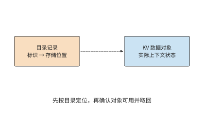

*图 9-28：虚线表示按标识查找对象位置。目录用于定位，实际 KV 对象用于恢复计算；路由前还需确认对象版本与可用性。*

### 9.5.2 多级存储

第 8.3.4 节在一张卡上比较了保留、换出和重算。放大到整台服务器，同一份 KV 可以存放在四个位置：HBM、主机内存、本地 SSD 和远端存储池，越往下容量越大，离 GPU 也越远。以一台 DGX A100 为例：8 张 A100 80GB、2 TB 主机内存、8 块 3.84 TB U.2 NVMe SSD、8 张 200 Gbit/s 网卡，按每张 GPU 分到的一份计算。SSD 选用 Solidigm D7-P5520 3.84 TB，顺序读、写带宽最高分别为 7.1 GB/s 和 4.2 GB/s。存放的对象仍是 Qwen3-8B 的 8192 个 token 前缀，共 1.125 GiB。[^tiers]

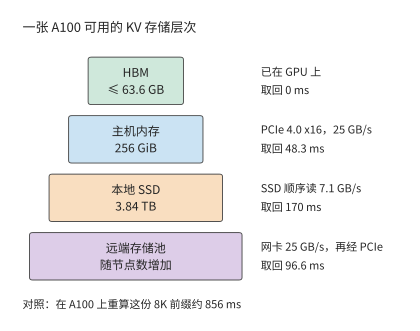

*图 9-29：DGX A100 中每张 A100 分到的四级存储。方框宽度只表示容量次序；右侧是这一级到 GPU 的路径，以及取回 1.125 GiB 前缀所需的时间。远端取回先经网卡到主机内存，再经 PCIe 到 GPU，两段串行。*

| 层级 | 每张 GPU 的容量 | 到 GPU 的路径 | 取回 8K 前缀 |
| --- | ---: | --- | ---: |
| HBM | ≤ 63.6 GB | 已在 GPU 上 | 0 |
| 主机内存 | 256 GiB | PCIe 4.0 x16，25 GB/s | 48.3 ms |
| 本地 SSD | 3.84 TB | SSD 顺序读，7.1 GB/s | 170 ms |
| 远端存储池 | 随节点数增加 | 网卡 25 GB/s，再经 PCIe | 96.6 ms |
| 对照：在 A100 上重算 | — | 按峰值的 50% 计 | 856 ms |

HBM 一栏是 80 GB 减去 16.4 GB BF16 权重后的上限，尚未扣除激活与工作区。四级的取回时间都远小于 856 ms 的重算时间，因此单就一次取回而言，状态放在哪一级都比重算快。真正的限制来自另外三个方面：缓存能否保存到下一次使用，读取能否与计算重叠，以及写入各级要付出多大代价。

**容量决定缓存能存放多久。** 一张 A100 连续对无命中的 8K 请求执行 prefill，每 0.856 s 产生一份 1.125 GiB 的 KV，产生速率 $r\approx1.41$ GB/s。如果新产生的 KV 全部写入某一级、并按写入先后淘汰，容量为 $C$ 的一级大约能存放最近 $C/r$ 秒内产生的 KV：HBM 约 45 s，主机内存约 195 s，SSD 约 2722 s，即 45 分钟。反过来，设同一前缀两次使用的间隔为 $T$，要让间隔 $T$ 以内再次到达的请求都能命中，这一级的容量至少要满足

$$
C\ge rT.
$$

阿里云基于线上请求记录（trace）的一项研究统计了两类负载的复用时间：面向个人用户的对话负载中，80% 的复用发生在 10 分钟以内；面向企业的 API 负载中，80% 的复用发生在 10 秒以内。间隔为 10 秒时只需 14.1 GB，HBM 即可容纳；间隔为 10 分钟时需要 846 GB，超过每卡 275 GB 的主机内存，需要加上 SSD 才能覆盖。[^wild]

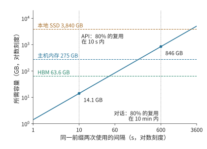

*图 9-30：所需容量随复用间隔线性增长。斜线为 $C=rT$，其中 $r\approx1.41$ GB/s 是一张 A100 连续执行无命中 8K prefill 时产生 KV 的速率；三条虚线是每张 GPU 在三级存储中的容量；两条竖线标出两类负载 80% 复用所在的时间范围。两轴均为对数刻度。*

$C\ge rT$ 也说明了什么时候不需要 SSD。同一研究在它的对话负载上发现，Llama3-70B 所需的缓存容量约为可用 HBM 的 4 倍；8 卡 A100 服务器配 1 TB 主机内存时，每卡分到 128 GB，已经足够，不必再增加 SSD 或远端层。差别在于 $r$：该研究按每个实例的实际请求率计算，请求也更短，单轮请求平均 973 个 token，多轮请求平均 5953 个；这里则假设 GPU 一直在对 8K 请求执行 prefill。前缀命中越多、每 token 的 KV 越小（例如 MLA），$r$ 就越低。$T$ 取决于由谁发起下一轮：人工对话的间隔以分钟计，程序调用的间隔以秒计。

**容量越大，命中率提高得越慢。** 容量只能保留将来会被复用的状态，而有些状态不会再被使用。Mooncake 公开了 Kimi 线上服务一小时的采样 trace，每块 512 个 token。按最近最少使用（LRU，先淘汰最久未被访问的块）的规则淘汰时，缓存从 1000 块增加到 50,000 块，命中率从 30% 升到 50%；容量不受限制时也只有 51%。按 Qwen3-8B 换算，50,000 块约 3.77 TB，与一块 3.84 TB 的 SSD 相当。这份 trace 中超过一半的块从未被再次使用，另一些块却被访问上万次；阿里云的 trace 也同样集中，10% 的块贡献了 77% 的复用。[^moontrace]

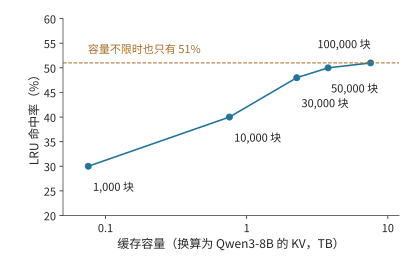

*图 9-31：命中率随容量增加而趋于饱和。数据为 Mooncake 一小时采样 trace 在 LRU 淘汰下的命中率，每块 512 个 token；横轴按 Qwen3-8B 每 token 144 KiB 换算为字节。这只是采样得到的一段流量，真实服务所需的容量按流量同比例放大。*

**只取回一次，还是每一步都远程读取。** 共享 KV 有三种典型用法：本地重新 prefill、从远端取回一次后在本地驻留、每一步 decode 都从远端读取。三者使用同样的上下文，传输频率却完全不同。

沿用 1.125 GiB 前缀和本章的 200 Gbit/s 网卡（25 GB/s），一次载荷取回约 48.3 ms。若 100 次 decode 调用都重新从远端读取这份不变的前缀，累计占用链路约 4.83 s。若这 100 次读取要在一秒内完成，仅这份上下文就要求约 121 GB/s，是给定链路能力的 4.8 倍。把读取与计算并行安排，也无法让 25 GB/s 的链路在一秒内传完这些字节。换成 549 MiB 的紧凑 MLA 前缀，一次取回约 23.0 ms，100 次累计约 2.30 s，一秒内完成仍要约 57.6 GB/s，是链路能力的 2.3 倍：状态减半只把倍数减半，每步都从远端读取仍然不可行。

取回一次并驻留把传输频次从“每步一次”降到“每次复用一次”，代价是占用本地 HBM。设一份状态占 $V$ bytes、在本地保存 $\tau$ 秒，占用的容量与时间之积为 $V\tau$，单位为字节·秒。同样保存 10 秒，对象越大，占用越多；同样大小的对象，保存越久，这一乘积越大。第 9.1.3 节的会话在工具执行 10 秒期间，GQA 状态占 11.25 GiB·s，紧凑 MLA 状态占 5.36 GiB·s，同样的本地容量能容纳约两倍的等待会话。因此可以把不活跃的会话放到远端，会话恢复时取回，在连续 decode 期间留在本地。这样，数据传输主要发生在会话恢复和暂停时。

假定状态将在未来复用 $k$ 次，暂不考虑排队时间，也不考虑其占用空间后对其他缓存内容的挤占。保存后再取回比重新计算更快的条件为

$$
T_{write}+kT_{read}<kT_{recompute}.
$$

以 Qwen3-8B 的 8192 个 token 前缀为例：在 A100 上重算一次约需 0.856 秒（第 9.2.3 节的 prefill 时间），经 25 GB/s 网卡保存和取回各约 48.3 ms。复用一次时，保存加取回共约 96.6 ms，不到重算的八分之一，只要这份状态还会再使用一次，保存就是值得的。链路变慢后结论会变：带宽介于约 1.41 与 2.82 GB/s 之间时，至少要复用两次才能抵消保存的代价，越接近 1.41 GB/s 所需的次数越多；低于约 1.41 GB/s 时，取回一次就比重算还慢，复用次数越多，损失越大。10 GbE 每方向只有 1.25 GB/s，取回一次约需 966 ms；这时应该重算，或者设法把取回移出关键路径，提前完成。状态大小只进入 $T_{write}$ 与 $T_{read}$，$T_{recompute}$ 由模型的 prefill 代价决定。换成紧凑 MLA 状态，同一个网卡上写入加取回一次只要约 46.1 ms，不等式左边随 KV 字节数减少而缩小。

1.41 GB/s 这一临界带宽恰好就是上文的 KV 产生速率 $r$：取回 $V$ 字节需要 $V/B$，重算需要 $V/r$，只要链路带宽 $B$ 高于 GPU 产生这份 KV 的速率，取回就比重算快。本地 SSD 的写、读带宽都高于 $r$：写入约 288 ms，读出约 170 ms，复用一次合计约 458 ms，仍然少于重算的 856 ms。

**让读取与计算重叠。** 命中之后，请求只需计算 256 个新 token，按第 9.2.3 节的约定取 A100 峰值的 50%，约需 30.9 ms。历史 KV 在主机内存中时，如果先整份读入再开始计算，共需 48.3 + 30.9 = 79.2 ms，读取比计算还长。CachedAttention 采用逐层预加载：Transformer 逐层计算，第 $i$ 层只用到第 $i$ 层的 KV，所以 GPU 计算第 $i$ 层时，PCIe 可以同时读取后面的层。Qwen3-8B 每层的历史 KV 为 32 MiB，读取一层需要 1.34 ms，而新 token 计算一层只需 0.857 ms。每层的计算都要等待读取，总时间约 49.2 ms，仍由读取决定。要进一步缩短，就需要在该请求开始执行之前先读入若干层：利用上一个 batch 的执行时间，把前 14 层（448 MiB）读入 HBM 中预留的缓冲区，其余 22 层的读取就能被计算完全掩盖，总时间降到计算本身的 30.9 ms。缓冲区要容纳的正是读取比计算多出的那部分字节：

$$
S_{buf}=B\,(T_{read}-T_{new}),
$$

其中 $B$ 是链路带宽，$T_{read}$ 是读取全部历史 KV 的时间，$T_{new}$ 是计算新 token 的时间。代入 25 GB/s、48.3 ms 与 30.9 ms，得到约 437 MB，略多于 13 层，按整层向上取整为 14 层。$T_{new}\ge T_{read}$ 时不需要缓冲区：新输入达到约 400 个 token，计算就能掩盖从主机内存的读取；远端存储池的串行路径需要约 800 个，本地 SSD 需要约 1400 个。CachedAttention 在 LLaMA-13B 上的测量中，1K 个历史 token、100 个新 token 时，逐层预加载让 prefill 时间缩短 35%，再设置一个 15 层的缓冲区后，缩短 61%。[^cachedattention]

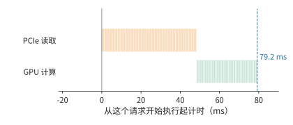

*图 9-32：先把 1.125 GiB 历史 KV 整份从主机内存读入，再计算 256 个新 token，共 79.2 ms。橙色为 PCIe 读取，绿色为 GPU 计算，每一小段对应一层。*

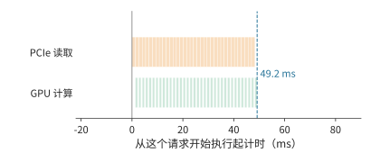

*图 9-33：逐层预加载。GPU 计算某一层时，PCIe 读取后面的层；每层读取 1.34 ms、计算 0.857 ms，每层的计算都要等待读取，总时间 49.2 ms 由读取决定。*

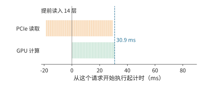

*图 9-34：在这个请求开始执行之前，利用上一个 batch 的执行时间先读入前 14 层（448 MiB）；其余 22 层的读取被计算完全掩盖，总时间等于计算本身的 30.9 ms。三幅图的横轴相同。*

**利用排队时间从 SSD 预取。** 从本地 SSD 读一层需要 4.73 ms，是计算一层的 5.5 倍，逐层预加载只能掩盖一小部分。请求开始执行时，状态若仍在 SSD 上，即使逐层读取，这一步也需要约 171 ms，而计算本身只需 30.9 ms。可以利用排队时间：请求仍在队列中时，调度器已经知道它需要哪份前缀，可以先把这份前缀从 SSD 读到主机内存。只要排队时间不短于 170 ms，这次读取就不在关键路径上，开始执行时再按上述方式从主机内存逐层读入。这与第 9.5.4 节的 $T_{first}=\max(Q,R)+C$ 是同一个关系：预取让状态就绪时间 $R$ 与排队时间 $Q$ 重叠。

主机内存能容纳多少份会话，决定了调度器最多能为队列中前多少个请求提前读取：256 GiB 可容纳约 227 份 8K 前缀，所以只需为队列最前面的 227 个请求预取。主机内存不足、需要换出时，也按队列判断：这些请求即将使用的状态不能换出；其余状态中，下次使用最晚的先换出。LRU 和 FIFO 只依据过去的访问，无法利用队列中即将到来的请求。CachedAttention 在 4 张 A100、128 GB 主机内存和 10 TB SSD 上回放 ShareGPT（用户分享的 ChatGPT 对话数据集）中的多轮对话：按队列预取和换出时，总命中率为 86%，其中 99.6% 以上的命中来自主机内存；LRU 与 FIFO 的命中率分别只有 58% 和 48%，来自主机内存的命中都不到 1%，几乎每次命中都要从 SSD 读取。[^cachedattention]

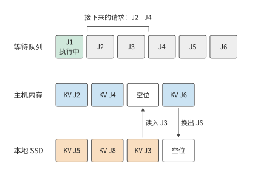

*图 9-35：主机内存有四个存放位置，其中一个留作空位，用于接收读入的数据，其余三个留给队列中接下来的 J2—J4。J3 的状态仍在 SSD 上，在它排队期间读入空位；J6 排在这三个请求之后，下次使用最晚，先换出到 SSD。*

**SSD 的写入受寿命限制。** 写入同样要避开关键路径。prefill 逐层产生的 KV 可以在计算的同时写回，decode 每步只追加一个 token 的 KV。以 $r\approx1.41$ GB/s 写入，只占 PCIe 带宽的 5.6%，也只占 SSD 顺序写带宽的 34%。SSD 真正的限制是写入寿命：D7-P5520 标称五年内每天可写满一次（1 DWPD），3.84 TB 的盘平均每秒只能写入 44.4 MB。如果把全部新 KV 都写入 SSD，写入量是这一额度的 31.7 倍，五年的写入寿命在不到两个月内就会耗尽。长期来看，只有约 3.2% 的新 KV 能够写入 SSD。前面两份 trace 中，复用都集中在少数块上，Mooncake trace 中一半以上的块从未被再次使用，因此写入 SSD 之前需要先做准入判断，例如只写入已经被复用过的前缀，或者尚未结束的多轮会话。按这一额度写入时，SSD 中恰好能存放最近一天产生的 KV。

容量与命中之间的这种关系在实验中也能观察到。在一组同卡双引擎实验中，12 次前缀复用机会里，4 GiB 共享 CPU 池完整命中 5 次，8 GiB 池完整命中 12 次。多出的 4 GiB 保留了七次原本会被淘汰的完整前缀；再次请求所需的状态若已经在本地，就不必重复取回。所以共享容量的收益要按“保存多久、避免几次重算、增加几次搬移”来比较。[^shared]

### 9.5.3 持久化、checkpoint 与部分重算

上一节假定保存下来的状态能完整取回。实例重启后，目录记录、磁盘数据和可连续复用的前缀可能并不一致，恢复过程需要重新确认哪些计算结果已经保存。持久化让状态在实例重启或任务暂停后仍然可用。完整保存减少恢复时的重算，周期性 checkpoint 减少写入但增加恢复工作，部分重算则用已保留的前缀补齐缺的部分。checkpoint 要保存继续计算所需的全部状态：完整 GQA 保存上下文 K、V；DeepSeek V4 的状态还涉及压缩结果、窗口以及未完成的压缩块。恢复时从 checkpoint 所记录的最后一次完整更新继续计算。[^v4]

持久化的状态按页保存，恢复时也按页读回。先考虑完整的 GQA 页。Qwen3-8B 每个含 16 个 token 的逻辑页为 2.25 MiB。若各层的 K、V 分片分别搬移，会形成许多小的连续段；若按页汇集，传输次数和所需的布局转换都不同。一个逻辑页按 36 层的 K、V 分开后有 72 个 32 KiB 的连续段；按页汇集后则是一个 2.25 MiB 的对象。前者更容易受每秒操作次数的限制，后者把更多时间花在连续载荷的传输上。

重启后的某个请求读取了 64 页，覆盖 1024 个 token，但可复用的连续前缀只有 1008 个 token，即 63 页。多读的那一页占 2.25 MiB，却没有省掉相应的重算。对该请求，读取量为 144 MiB，有效复用量约为 142 MiB；更能说明问题的说法是“读入 64 页，用上 63 页”。这里的限制发生在读取之后：只有匹配成功、能连续接到已有上下文上的页，才能替代计算。把磁盘读得更快能缩短读取时间，却改变不了该请求要处理的末页。[^restart]

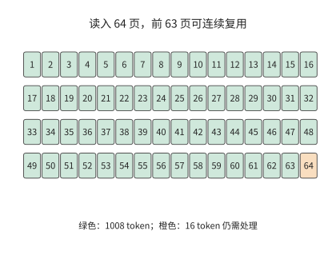

*图 9-36：读入的页不一定全部成为可复用前缀。正常重启后的这一请求读入 64 个各含 16 个 token 的页，只复用前 63 页；末页仍需处理。每页 2.25 MiB，该请求的匹配边界为 1008 个 token。*

页面缺失时，要比较继续等待和重新计算各需要多久。在 A100 上重算 8192 个 token 的整段前缀约需 0.856 秒（第 9.2.3 节的 prefill 时间）；若为取回一个不可用的对象已经等了 1 秒，这一次等待就已超过整段重算的时间。实际的截断页实验里，无条件等待的请求在 60 秒观察窗口内一直没有完成，改为允许放弃等待后，请求靠重算得到了结果。完成当前请求之后，还要隔离或修复坏页，否则下一个请求还会遇到同样的等待。[^fault]

### 9.5.4 缓存亲和性与请求路由

确认缓存可以复用后，仍需决定把请求发给哪台机器。缓存所在的机器可能正忙，另一台机器虽然需要取回或重算，却可能先完成。因此路由时要比较的是请求的完成时间。设 GPU 最早可执行时刻为 $Q$，状态从请求到达起的就绪时刻为 $R$，状态可用后的剩余工作为 $C$。在整份状态到齐后才执行、取回可与 GPU 等待重叠的模型中，首 token 时间为

$$
T_{first}=\max(Q,R)+C.
$$

如果取回要等 GPU 排完队才能开始，排队时间与取回时间就要相加；如果逐层流水，就需要更细的执行图。例如 $Q=80$ ms、取回耗时 60 ms、剩余计算 10 ms，并行就绪时共需 90 ms；等 GPU 空闲后再启动取回则需 150 ms。计算量和传输字节数都相同，只是依赖关系不同，耗时就差了 60 ms。

**例 9.7　缓存命中与排队等待如何共同决定请求路由？** A、B 是两个 A100 实例，请求带 8192 个 token 的前缀和 256 个 token 的新输入。A 的 HBM 里有这份前缀，但要排队 250 ms；B 只等 20 ms，却没有缓存。按第 9.2.3 节的约定取 A100 峰值的 50%，即 156 TFLOP/s：完整重算 8448 个 token 需要约 138.4 TFLOPs 矩阵运算，约 887 ms；命中后只算 256 个新 token，约 4.81 TFLOPs、30.9 ms。B 也可以从远端存储取回前缀：查找的固定开销为 10 ms，整份 1.125 GiB 先经网络到主机内存，再经 PCIe 4.0 x16 搬到 GPU，与例 9.3 一样按 25 GB/s 计，约 48.3 ms。

| 路径 | 首 token 时间 |
| --- | ---: |
| A：本地命中 | $250+30.9\approx281$ ms |
| B：直接重算 | $20+887\approx907$ ms |
| B：经 50 GbE（6.25 GB/s）远端取回 | 约 282 ms |
| B：经 200 GbE（25 GB/s）远端取回 | 约 137 ms |

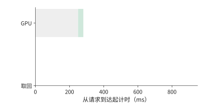

*图 9-37：A 本地缓存已命中，GPU 排队 250 ms 后再计算 30.9 ms，首 token 在 281 ms 返回。灰为排队，绿为计算。*

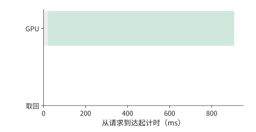

*图 9-38：B 在 20 ms 空闲，随后在 A100 上重算 887 ms，首 token 在 907 ms 返回。*

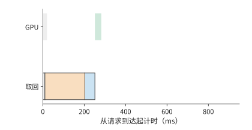

*图 9-39：取回先查找 10 ms，再经 50 GbE 以 6.25 GB/s 读取 1.125 GiB 至主存，最后经 PCIe 以 25 GB/s 搬到 GPU。计算要等数据和 GPU 都就绪，首 token 约 282 ms 返回，比 A 慢约 1.6 ms。*

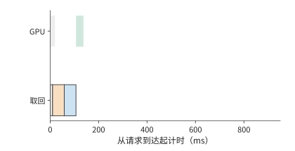

*图 9-40：远端链路换成 200 GbE（25 GB/s）后，首 token 约 137 ms 返回。橙为远端读取，蓝为主存到 GPU；四图均从请求到达起计时，横轴相同。*

第一张路由图中，A 的数据已经在 GPU 上，但计算要等到 250 ms 才能开始。B 在 20 ms 时空闲；直接重算可以立即开始，但 887 ms 的计算比任何一条取回路径都长，远端取回则要继续等数据。提高远端带宽缩短的是橙色条，查找、主存到 GPU 的传输和最后的计算仍然存在。

B 要想比 A 的 281 ms 更早返回，扣除命中后 30.9 ms 的计算，状态必须在 250 ms 内就绪。再扣除查找的 10 ms 与主机内存到 GPU 的约 48.3 ms，远端读取只剩约 191.7 ms。用 1.125 GiB 除以该预算，得到 B 取回与 A 本地命中打平时的带宽，约为 6.30 GB/s：50 GbE 的 6.25 GB/s 略低于此值，200 GbE 则远高于此值。取回与重算打平的带宽只有约 1.48 GB/s，在 A100 上重算 8K 前缀几乎总是最慢的选择。

同一个会话由此可以按状态与资源所在的位置重新安排。应用保留连续的上下文，服务在继续使用本地状态、迁移状态和重新计算之间选择，依据是这三条路径各自何时能让后续的模型执行开始。第 8 章根据内容判断可复用的前缀，本节进一步把排队时间与链路带宽纳入路由决策。

换成 200 GbE 后，单请求取回明显占优；但每秒 16 次取回需要约 19.3 GB/s，已用去这条 25 GB/s 链路约 77% 的能力。突发请求会增加传输排队时间。因此，按单请求算出所需带宽后，还要计算持续到达时的总流量。[^route]

上述比较假定缓存位置已知且数据可用。路由器通常根据缓存事件预测位置，事件延迟或对象被淘汰会让预测失准。为了看清这种误差如何影响响应时间，把 A 的排队改为 80 ms，并设缓存只以概率 $p$ 真正可用。命中时为 110.9 ms，所有层次都失效、只能重算时为 967.2 ms，期望为

$$
\mathbb{E}[T_A]=110.9p+967.2(1-p)=967.2-856.3p\ \mathrm{ms}.
$$

平均值要优于 B 直接重算的 907 ms，只需 $p>7.0\%$。取 $p=0.9$，平均约 196.5 ms，但 10% 的请求仍是 967 ms，所以该两点分布的 p99 为 967 ms，远达不到 220 ms 的目标。要让 p99 达到 220 ms，该两点时间模型要求命中概率至少 99%；90% 已经大幅改善了均值，却仍让十分之一的请求走 967 ms 的慢路径。[^events]

同时运行两个任务的负载压力实验，更直观地显示了缓存优先与空闲优先之间的取舍。缓存优先时，目标请求约 1.38 秒完成，两个任务也在这时全部结束；把目标请求移到空闲实例后，它的完成时间缩短到约 0.33 秒，两个任务却要到约 1.54 秒才全部完成。目标请求快了约 1.05 秒，全部任务的完成时刻却推迟了约 0.16 秒。做路由决策之前，必须先确定优化的是目标请求的响应时间，还是全部任务的完成时间。[^pressure]

把第 8 章的状态恢复过程计入路由决策后，要同时比较实例何时空闲与状态何时准备好。以 DeepSeek V4.1 的会话状态为例：设实例 A 保留了全局 KV 与编码器的 SWA 状态，但有排队；实例 B 可以立即执行，却要取回全局 KV 并恢复编码器 SWA 状态。A 的优势是能复用状态，B 的优势是计算资源可以立即开始执行；路由器要比较的是两者的预计完成时间，而不是只看缓存命中标志。

设两边后续的新增输入处理、解码器窗口重放与生成耗时相同，准备工作串行执行。B 的全局状态传输按第 7 章的算例为 4.666 ms，编码器 SWA 状态的恢复假设为 8 ms，共需 12.666 ms。A 保留了这两份状态，准备时间就是排队时间：排队 10 ms 时 A 更早开始处理新增输入；排队增到 20 ms 时 B 更早。12.666 ms 由此成为本例中路由选择翻转的排队阈值。[^v41-case]

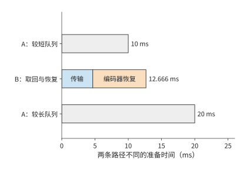

*图 9-41：缓存亲和性与空闲执行位置的比较。A 保留全局 KV 与编码器 SWA；B 需要 4.666 ms 全局传输和假设的 8 ms 编码器恢复。两端共同的解码器重放等后续工作略去，只比较不同的串行准备时间；A 的排队时间从 10 ms 增到 20 ms 时，更快的方案由 A 变为 B。灰色为等待队列，其他色块分别为全局状态传输与编码器局部状态恢复。*

## 9.6 服务启动、扩缩容与故障恢复

第 9.2 至 9.5 节比较的是请求交给谁、状态放在哪里。本节转向实例本身的变化：新副本启动和预热要多久，运行中改变并行方式时状态如何交接，部分卡故障后如何依靠已保存的状态和输出记录继续服务。

### 9.6.1 启动与预热开销

第 9.5.4 节的路由比较都从已有可用实例开始。扩容或故障恢复时，新实例要先完成启动，而等待中的请求还在不断到达。因此，本节把启动和状态恢复纳入同一条服务时间线。新副本还要完成进程与分词器（tokenizer，将文本转换为 token 编号的组件）初始化、权重读取与分片、编译、KV 容量探测和图捕获（把执行步骤录制为第 5.5.2 节的 CUDA Graph）。这些准备的总时间决定新副本何时开始分担请求。首次试运行触发编译时，编译时间已经包含在试运行里，应按先后依赖计算总时间。启动开销研究 Breaking the Ice 对历史 vLLM 版本的分阶段分析说明了这一问题；把包含关系展开后，启动总时间由从进程创建到可以接收请求的最长依赖路径决定。[^startup]

假设准备执行图使启动时间增加 $T_s$，但此后每个执行步都能节省 $\delta$，经过 $N$ 步后的净收益为 $N\delta-T_s$。增加 10 秒、每步节省 0.2 ms，要 50000 步才持平，从第 50001 步起累计节省的时间才超过额外的启动时间。若每步为 32 个请求各生成一个 token，50000 步对应约 160 万个输出 token。每执行一个 batch 省一次时间，所以累计收益要按批执行的次数计算。

启动期间新到达的请求还会积压。若原有服务完全不可用、到达率保持 $\lambda$、启动时间为 $T_s$，启动结束时积压约为 $\lambda T_s$。就绪后的服务能力为 $\mu>\lambda$，在理想的连续流量模型中，额外的排空时间为

$$
T_{drain}=\frac{\lambda T_s}{\mu-\lambda}.
$$

以本章的异构集群为例，启动需要 10 秒，期间每秒到达 3.5 个请求，就绪时已有 35 个请求积压。直接 PD 就绪后每秒约能服务 4.55 个，新请求仍占去 3.5 个，每秒实际只能消化约 1.05 个积压请求，还要约 33 秒才能排空，从开始启动算起是第 43 秒。按理想分块捎带的共置上限 4.17 请求/s，每秒只能消化约 0.67 个，要到第 63 秒；不分块的共置只有 3.02 请求/s，积压会一直增长。三条曲线见图 9-42。

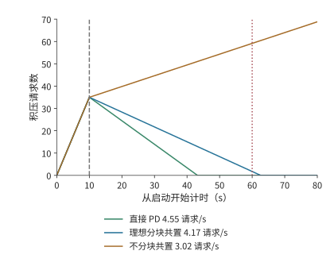

*图 9-42：服务余量决定启动积压的消退速度。连续流量模型，每秒到达 3.5 个请求，启动 10 秒后积压 35 个。就绪后服务率分别为直接 PD 的 4.55、理想分块共置的 4.17 和不分块共置的 3.02 请求/s；前两者从开始启动算起在第 43 与第 63 秒排空，后者持续积压。例 9.8 的排空期限为第 60 秒。*

积压的请求在就绪后往往一起涌入，这时并发预取还可能改变谁先开始执行。某个 1024 个 token 的请求单独运行时复用了 1008 个 token；八个请求同时到达时，前四个请求各登记了 1024 个 token 的预取，合计占用 4096 个 token，后面的请求因为超过容量限额而没有登记。最先完成的请求恰恰来自后者：该请求没有命中任何缓存，直接开始 prefill；正因为没有等待缓存，它更早进入了执行队列。所以，即使缓存对象存在，请求也要先获得预取所需的空间，才能使用这份缓存。预取空间用完后，后面的请求直接重算，而已经开始预取的请求还在等数据。[^branch]

扩缩容还要考虑模型版本与硬件的对应关系。权重固定在不可修改介质上时，增加同型号加速器可以扩展同版本服务；部署新权重则要配置支持新版本的加速器。路由器按模型版本分派请求，容量规划要为新旧版本并存和加速器替换预留资源。固定版本的服务持续得越久、需求越大，部署投入便能由更多请求分担。

### 9.6.2 运行中重配置与状态交接

启动解决的是新实例何时可用；运行中的迁移还要让目标实例接着源端的进度执行。改变张量并行度、专家并行度或服务池的规模，需要重新安排权重与请求状态。目标卡获得参数只是第一步，还可能要建立通信组、准备新的执行图、转换布局并恢复接收请求。这些准备与数据搬移有先后依赖，共同决定何时能把新请求交给目标。

计划内的迁移可以利用源端仍在运行这一条件：先在后台复制不再改变的上下文，源端继续生成；最后短暂停下，复制完迁移期间新增的状态，再把执行权交给目标。以迁走一张 H20 上的 D worker 为例：批内 32 条请求的平均上下文为 8704 个 token，KV 共约 41.1 GB。源端每秒完成约 1166 次 decode 调用，每次追加一个 token 的 KV（144 KiB），状态每秒只增长约 0.172 GB。目标经本章的 200 Gbit/s 网卡以 25 GB/s 复制，积压以约 24.8 GB/s 减少，约 1.65 秒后完成复制，其间新增的状态约 0.28 GB；只有一个 50 GbE 端口（6.25 GB/s）时要约 6.76 秒。decode 追加 KV 的速率远低于网卡带宽，追赶时间几乎全由初始的 41.1 GB 决定；复制速率一旦降到状态增长速率，积压便不再缩小。最后的交接点同时确定状态版本与执行权，防止目标漏掉源端最后的更新。

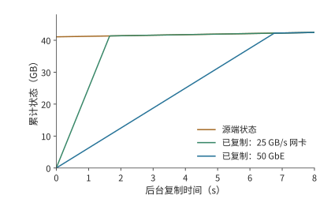

*图 9-43：后台复制需要赶上仍在增长的状态。开始时待复制状态为 41.1 GB，源端每秒增长约 0.172 GB；目标经 25 GB/s 的网卡约 1.65 秒赶上，经 6.25 GB/s 的 50 GbE 约 6.76 秒赶上。曲线相交前，垂直距离就是尚未复制的数据量；相交后，目标只需跟随源端的新增状态。*

图 9-43 中，源端曲线也在上升，所以追赶速度是两条曲线斜率之差；本例 decode 的增长极慢，源端曲线接近水平。复制能力恰好等于状态增长率时，两条线平行，初始积压便不会缩小。最终交接必须安排在目标已追上源端、两端状态一致的时刻。

迁移之外的另一种运行中调整是切换并行方式：把同一组卡重新组织成 TP 或 SP×TP。这里 TP 切分层内矩阵，SP 按 token 位置分配一部分计算与中间状态。ArcticInference（Snowflake 开源的 vLLM 推理插件）与 vLLM 的相关案例展示了这种做法：切换改变每一步参与计算的卡与 token 的分布，也改变所需的权重、KV 布局和执行图。预先保留两种模式的权重与执行图可以缩短切换的等待，但这些额外保存的权重与图会减少 KV 的可用空间。弹性专家并行（Elastic EP，运行中增减专家并行组的卡数）扩大专家组时，新加入的卡要先获得专家权重，随后才能承担分派来的任务；处理完整的请求还需要相应的注意力状态。[^switch]

目标追上源端的状态更新后，两边的数据才一致。此外，目标还要完成通信组和执行图的准备。下面保持数据量不变，只改变传输带宽。Qwen3-8B 从 TP4 切换到 TP8 的迁移例子需要约 16.4 GB 的网络传输，在本地构建目标张量还要读写约 4.7 GB 数据。把同一份网络载荷放到一个 50 GbE 端口（6.25 GB/s）和本章的 200 Gbit/s 网卡（25 GB/s）上，单看搬移约需 2.63 秒和 0.66 秒，相差四倍。

但若再假设建立通信组、准备执行图与恢复接收请求在传输之后串行占用 9 秒，总时间就约为 11.6 秒和 9.7 秒，只缩短约 17%。若八张卡同在一台 8×A100 服务器内，迁移改走 NVLink，每张 A100 每方向 300 GB/s，发送最多的一张卡要送出约 4.7 GB，只需约 15.7 ms，总时间仍约 9.0 秒。这 9 秒限制了继续提高带宽的收益：即使网络传输趋近于零，总时间也只能趋近 9 秒。若能提前建立通信组并准备好执行图，就能进一步缩短迁移时的等待。[^migration]

此时搬移本身已接近链路的物理下界，剩下的时间全是软件准备。按第 1.3.4 节的判据，这类差距靠更快的链路解决不了，只能重构软件：提前建立通信组，预先捕获执行图，把进程与调度解耦，让准备工作和传输重叠。

### 9.6.3 部分故障与流式生成恢复

计划内迁移时源端还能提供最后一次更新；故障发生后，源端的数据可能已无法读取，只能依靠提前保存的状态和输出记录。恢复首先要确定用户已经收到哪一段输出。故障后有三种目标：恢复足够的状态继续 decode；根据已经确定的 token 重做 prefill；重新采样一段输出。前两种沿用户已经收到的序列继续生成，第三种重新做随机选择，可能产生不同的后缀。对 RL 的 rollout 来说，这还改变了样本的生成过程。

假设原输入有 8192 个 token，已经向用户返回 1025 个输出，但最近保存的 KV 仅覆盖原输入。恢复时，若这些输出已经可靠记录，只需把前 1024 个输出作为一次 prefill 补入模型，重建覆盖 9216 个 token 的 KV，再处理第 1025 个输出继续生成。若已经有覆盖 9216 个 token 的兼容 KV，就可以省去这 1024 个 token 的重放。

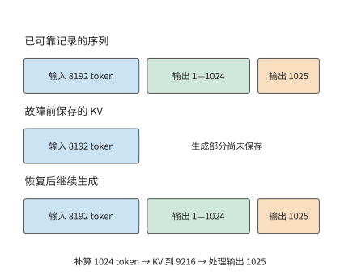

*图 9-44：输出记录决定继续哪条序列，KV checkpoint 决定从哪里补算。假定 1025 个输出均已可靠记录，但 KV 只保存了原输入。下方按输入、前 1024 个输出和第 1025 个输出分段示意，宽度不按 token 数量比例绘制。*

图 9-44 把两种记录的末端分开画出。输出已经返回，不表示对应的 KV 已经保存；恢复时用已记录的 token 补算，就能重建相同的前缀，不必重新采样这些输出。

**预写日志**（write-ahead log，WAL）在对外确认之前可靠保存待恢复的操作或结果。这里的 token 级 WAL 保存已经确定的输出序列，KV 保存的是这段序列已经完成的计算。前者决定恢复后应继续哪条输出，后者决定还要重做多少工作。DeepSeek V4 的生成服务采用这类机制；恢复时还要保持权重版本、token 位置索引和 decode 状态一致。[^v4]

故障的影响范围由同步组决定。张量并行组或专家并行组丢失一张卡，可能让整个协作实例上的请求停止；其他完整副本则可以继续服务。故障恢复依次经过检测、实例重建与请求恢复；恢复后的处理能力决定积压的请求还要多久才能完成。第 10 章进一步分析这些选择对 RL 样本与训练进展的影响，第 11 章再处理工具和环境的任务恢复。

## 9.7 部署方案的综合比较

### 9.7.1 组合副本、PD、AF 与共享 KV

本节把前几节的结果用于章首的八卡服务，先确定状态传输方式，再比较整个服务能否满足到达率和恢复期限。P 产生的 KV 可以直接交给 D，也可以先进入共享池再由 D 取回；D 新生成的状态若要用于下一轮 P，还需确认这些状态已经保存并发布。直接交接与经池中转读取的可能是相同的内容，占用的链路和缓冲却不同。

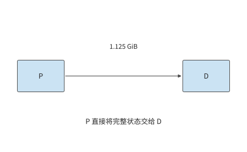

*图 9-45：P 直接向 D 交接 1.125 GiB 上下文 KV 缓存，只经过一次直接传输。P 为 prefill，D 为后续逐 token 的 decode。*

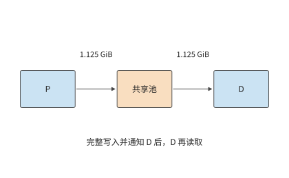

*图 9-46：P 先向池写入完整 1.125 GiB 并发布，D 再取回同一对象，共经过写入和取回两次传输。后续实例还可以复用池中对象。P 为 prefill，D 为后续逐 token 的 decode。*

对本章的 1.125 GiB 上下文 KV 缓存，直接 P→D 交接搬一次；经池中转则在 P→池、池→D 两条边各搬一次，总载荷为 2.25 GiB。假设两条边都为 25 GB/s，且整份写入后才能读取，中转等待约 96.6 ms，比直接交接多约 48.3 ms。

若 D 只用一次这份状态，这次中转就没有复用收益。若后续还有另一个实例要继续处理同一会话，就有机会用约 48.3 ms 的读取替代一次约 856 ms 的重算（第 9.2.3 节的 prefill 时间），节省的计算时间足以抵消额外的搬移时间；第 9.7.3 节按例 9.8 的负载核算这项收益。共享池把一次会话留下的计算成果用于后续请求；AF 则改变当前请求每一层的执行位置，两者改变的是时间线上不同的部分。

同样的规则也适用于视觉输入。E 产生的 EC 与语言 KV 使用不同的缓存标识，占用的空间也不同；图像缓存命中可以减少 E 的工作，却不会自动省去后续语言模型的 P 阶段。在 E→P→D 的执行图中，EC 命中使 E 的需求下降，语言前缀命中使 P 的工作减少，资源配比也随各阶段工作量的变化而调整。

### 9.7.2 同质量、同资源约束下的方案比较

**例 9.8　哪种推理部署能持续服务并按期清空启动积压？** 采用章首的资源与负载：四张 A100 80GB SXM、四张 H20 SXM5 96GB，每秒到达 3.5 个独立请求，每个请求输入 8192 个 token、输出 1025 个 token。各阶段能力沿用例 9.2，两个阶段在同一张卡上执行时依次占用该卡。两台服务器之间是共享的 25 GB/s 载荷通道，各次搬移占用同一份链路带宽。比较窗口内模型与生成设置相同，请求需要的前缀互不复用。服务从停止状态启动，三种部署方案都在 10 秒后就绪；就绪后的队列按连续流量模型处理。设计目标是持续处理新到达的请求，并在开始启动后的 60 秒内消除启动积压。

容量条件也要检查。每个请求经过 1024 次 decode 后，其 KV 覆盖 9216 个 token，占约 1.27 GiB。一张 H20 按 batch size 32 驻留活动请求，状态共约 40.5 GiB，再预留一份 1.125 GiB 接收缓冲，加上约 15.3 GiB 权重，共约 56.9 GiB，能放入 96 GB（约 89.4 GiB）的显存。换成紧凑 MLA 状态，每份约 618 MiB，32 份加一份 549 MiB 的接收缓冲共约 19.8 GiB。A100 一侧只需同时保存正在计算和正在发送的两份状态，共 2.25 GiB。使用共享池的方案另有 64 GiB 状态容量。尚未执行的请求只保留输入，分配到缓存空间后再开始计算。

下表比较完整副本、直接交接的 PD 和经共享池交接的 PD。共享池按整份写入后再读取，因此每个请求在公共通道上搬两次；池的读写两侧都能达到这条通道的带宽。

| 部署方案 | P、D 的组织 | 每请求通道载荷 | 计算能力，请求/s | 通道能力，请求/s | 启动后的总体吞吐率，请求/s |
| --- | --- | ---: | ---: | ---: | ---: |
| 八个完整副本 | 每张卡都执行 P、D | 0 | 3.02 | — | 3.02 |
| 直接 PD | 四张 A100 做 P，四张 H20 做 D | 1.125 GiB | 4.55 | 20.7 | 4.55 |
| PD 加共享池中转 | 相同的 P、D 配比，P→池→D | 2.25 GiB | 4.55 | 10.3 | 4.55 |
| 直接 PD，紧凑 MLA 状态 | 四张 A100 做 P，四张 H20 做 D | 549 MiB | 4.55 | 43.4 | 4.55 |
| PD 加共享池中转，紧凑 MLA 状态 | 相同的 P、D 配比，P→池→D | 1.07 GiB | 4.55 | 21.7 | 4.55 |

完整副本每秒只能完成 3.02 个请求，持续低于每秒 3.5 个的到达率，因此首先排除。两种 PD 方案的通道能力都远高于 4.55 请求/s，均由计算池限制。在每秒 3.5 个请求的到达负载下，直传消耗约 4.2 GB/s，中转消耗约 8.5 GB/s；在 4.55 请求/s 的排空阶段，两者分别需要约 5.5 和 11.0 GB/s。紧凑 MLA 状态下这四个数分别为 2.0、4.0、2.6 和 5.2 GB/s，通道能力翻倍，判断不变。

两种方案的稳态吞吐率相同，但直接 PD 更适合这组请求。后续请求不会复用这批请求的前缀，中转却让通道传输量翻倍，每个请求还多等约 48.3 ms。64 GiB 的共享池最多容纳 56 份完整的 1.125 GiB 前缀，紧凑 MLA 状态下为 119 份；在这一负载下，保留下来的每一份都不会再用到。直接交接完成同样的工作，留出更多链路余量，交接等待也更短。因此本例选择四张 A100 做 P、四张 H20 做 D、P→D 直传。

接着检查这一方案能否按期处理完启动期间积压的请求。按第 9.6.1 节的排空计算，10 秒启动留下的 35 个积压请求，直接 PD 从开始启动算起约 43 秒排空，满足 60 秒目标。完整副本在就绪后仍每秒增加约 0.5 个请求，到第 60 秒时积压已从 35 增至约 59 个；即使按理想分块捎带的 4.17 请求/s 计，共置也要到第 63 秒才能排空，同样错过目标。

反过来，也能求出满足这一期限所需的最低服务率。启动占去 10 秒，剩余 50 秒要消除 35 个请求，同时继续处理每秒到达的 3.5 个新请求，因而要求

$$
\mu-3.5\geq\frac{35}{50},\qquad \mu\geq4.2\ \text{请求/s}.
$$

直接 PD 的 4.55 请求/s 高于这一最低要求，余量约 8%。若实际 kernel 效率只有例 9.2 假设值的九成，D 池能力降到约 4.10 请求/s，稳态仍能处理持续到达的请求，但每秒只能消化约 0.60 个积压请求，排空要到约第 68.5 秒，错过目标。图 9-42 中两条下降线的斜率，正是服务率减去到达率得到的净排空能力。

确认能按期排空之后，再比较成本。计算服务成本时，还要考虑资源的计费方式。设八张卡按小时预留，每小时总成本为八元，实际每秒完成 3.5 个请求，则每小时完成 12600 个请求，成本约为每千请求 0.63 元。若到达率仍是每秒 3.5 个，4.55 请求/s 的能力不会凭空多出请求来处理；多出来的能力用于消化突发和启动积压。

比较满负载时的请求处理量，3.02 与 4.55 请求/s 对应每千请求约 0.74 元与 0.49 元。若业务另设完成时限，而后一方案只有四分之一的请求合格，每秒合格的请求数就降到约 1.14 个，每千个合格请求的成本升到约 1.95 元。一般写成

$$
C_{effective}=\frac{\text{统计期间的总成本}}
{\text{满足质量与时限的请求或任务数}}.
$$

分子随计算资源、主存、网络和保持运行的备用实例变化，分母随实际到达与合格完成数变化。以提前退出的 Agent 为例：它可能少生成 token、少占用资源，但没有完成任务，这次退出不计入已完成的合格任务数。[^cost-model]

### 9.7.3 负载变化后的部署调整

现在改变例 9.8 中“前缀不再复用”这一条件。设另一个实例还会把每次留下的 1.125 GiB 上下文 KV 缓存复用一次。在 A100 上重算这 8192 个 token 需要 0.856 秒，取回只要 48.3 ms。先前为中转多付的 48.3 ms 加上后续取回的 48.3 ms，共约 96.6 ms，远低于重算的 856 ms，一次后续复用就净节省约 760 ms。共享池由此获得了具体用途：用更短的读取代替重复计算。

这项收益同时增加了通道的需求。每次原始交接写一次、读一次，后续复用再读一次，共搬 3.375 GiB。每秒到达 3.5 组这样的请求对时，共需约 12.7 GB/s；通道最多支持约 6.9 组请求对/s。紧凑 MLA 状态三次共搬 1.61 GiB，每秒 3.5 组请求对约需 6.0 GB/s，通道最多支持约 14.5 组请求对/s。与只传一次相比，后续复用增加了读取量，占用了原有的带宽余量。共享池省去重算的同时，也降低了通道能支持的请求对吞吐上限。

共享池改变的是传输次数。下面固定 D 没有缓存，只改变 P 要重新计算多少输入，考察资源分配是否也要调整。假定 P 已在本地命中 6144 个 token，D 仍为空。沿第 9.2.4 节计算，完整副本合计约 4.90 请求/s，原来的四张 A100 做 P、四张 H20 做 D 仍为 4.55 请求/s，改成两张 A100 做 P、其余六张卡做 D 则为 5.69 请求/s。若仍采用相同的 10 秒启动与 3.5 请求/s 到达，三者从开始启动算起分别约在第 35.1、43.2 和 26.0 秒排空。前缀命中后，完整副本反而比原来的 PD 配比排空得更早，原配比已不再合适；两张 A100 做 P、其余六张卡做 D 才是这组负载的最佳分工。

再恢复无命中的输入，把输出增至 4097 个 token，即推理过程更长的请求。最佳分工变成两张 A100 做 P、其余六张卡做 D，也只有约 1.26 请求/s。这时无论如何改变 P、D 的数量比例，原来的八张卡都处理不了每秒 3.5 个请求。复制三组这样的八卡部署，合计能力约 3.78 请求/s，刚好能持续处理到达的请求；若还要求相同的启动与排空期限，所需能力至少为 4.2 请求/s，四组提供约 5.04，因此要配置四组。按组扩展原有的计算资源组合时，持续处理到达的请求需要 24 张卡，满足恢复期限需要 32 张。额外计算资源的用途是加快积压的消退。

这也给出了把本章的推导用于新系统的顺序。先把每个请求的工作量换算成各类资源需求；再按整数的资源分配找出最忙的资源池或执行单元；按执行顺序计入状态传输时间与内存占用；最后用服务率减去到达率得到的剩余处理能力，求出突发或启动积压持续的时间。若瓶颈是 D，增加 P 不会减少积压；若瓶颈是共享通道，增加计算副本只会让更多请求等待取回。

PD 的八卡案例和 MoE 的专家案例在这里相接。前者把不同阶段交给更擅长该阶段的计算资源，后者靠批内复用减少权重读取，再靠专家副本分散最忙执行单元上的工作。共享 KV 则保存已完成的计算结果供下一次请求复用；启动与恢复决定这些计算资源何时能提供服务。一次部署选择的依据，是这些部署方式一共改变了多少计算量和等待时间，以及消除积压需要多久。

单个阶段变快也会改变实例配比。设链路充足，每个 P 实例每秒处理 20 个请求，每个 D 实例每秒完成 5 个同样的请求，一个 P 配四个 D 时两池能力相等。若 D 阶段加速四倍，沿用原配比会让 D 池能力增到 80 请求/s，P 池仍是 20；改为一个 P 配一个 D，两池都提供 20 请求/s，并释放三个 D 实例。加速一个阶段的收益，由此体现为完成同样的工作需要的资源变少了。

## 练习

练习按复算、改变条件和独立设计展开。前两题建立共同的请求单位，第三至九题分别改变计算、通信与状态条件，第十题完成新工作负载的设计，第十一题把交接状态换成 MLA 重做判断。带“核心”的题目贯穿多个资源层次。

**9-1　三种推理部署的调用次数与状态交接。** 对输入 8192 个 token、输出 1025 个 token 的请求，画出完整副本、PD 和共享 KV 三种部署方式，分别列出每请求调用数、KV 产生位置和跨实例交接。再将输出长度改为 1 个 token，指出哪些工作不再需要执行。最后考虑调用一次工具后继续生成的情况，标出最后一个已返回、但尚未生成对应 KV 的 token 位置。

**9-2　链路瓶颈与请求组成如何改变 PD 配比。** 复算例 9.2 的 25 种整数分配方案，并将链路的有效带宽设为每秒恰好传输一份 1.125 GiB 快照所需的带宽（约 1.21 GB/s）。求新的总体吞吐率上限；到达率恰等于该上限时，再一次性加入十个请求，求积压随时间的变化。随后复核前缀命中与 129 个输出两个情景。最后把阶段能力的效率假设从峰值的 50% 改为 40%，重新推出两类卡的 prefill 与 decode 能力，判断四张 A100 做 P、四张 H20 做 D 是否仍高于 3.5 请求/s 的到达率。

**9-3　专家 batch size、指令集与权重位宽如何改变 CPU 执行瓶颈。** 用例 9.3 中的专家形状，分别按 AVX-512 与 AMX kernel，求 CPU 执行从读取受限转为计算受限时，每个专家接收的 token 数；再把内存带宽换成跨插槽的 125 GB/s，重新计算这两个临界值。分别比较每个专家接收 1 个和 128 个 token 时的执行时间；将权重改为每元素一字节、有效 CPU 算力保持不变，重新求解读取与计算的交点，并解释它的移动方向。

**9-4　PD 与 AF 的传输量、启动次数与通信重叠〔核心〕。** 采用 Qwen3-8B，设有效交接带宽为 25 GB/s，分别取 1、5、20 μs 的启动开销，比较一次 1.125 GiB 交接与总字节数相同的 72 次交接。再采用例 9.4 中 AF 的实际载荷大小，计算输入 8192 个 token、输出 1025 个 token 的完整请求所需的累计交接时间。

另考虑四个独立 micro-batch，每个 micro-batch 在注意力侧和前馈侧分别计算 2 ms 和 3 ms。比较全部串行执行与理想双阶段流水的总耗时，再求在流水方案仍快于串行方案的前提下，额外通信和计算效率下降合计最多能增加多少关键路径耗时。

**9-5　异构推理的权重容量与 CPU 处理能力约束。** 从已保存的 DeepSeek V4-Flash 或 Kimi K2 配置还原权重存放、GPU 缓冲和主存需求。增加请求并发后，分别预测被访问的专家数量、各专家的任务数，以及负载最重的 NUMA 节点。再构造一组总权重可以容纳、但到达率超过 CPU 计算能力的请求条件，推导积压增长率。

**9-6　专家副本的容量约束与复制成本回收。** 设八个专家分别接收 $[32,16,8,4,2,1,1,0]$ 行输入，比较只计算有效行、将非空专家的输入补齐到 32 行，以及将所有专家的输入补齐到 32 行时的计算量。随后按例 9.6 的条件，求累计节省时间首次超过复制耗时所需的最少批数；再把每卡额外容量改为 32 MiB，解释为什么应先排除不可行的副本方案。如果热点随时间变化，说明如何根据观察窗口内的负载预测复制后的累计收益，并与迁移开销比较。

**9-7　KV 保存、取回与重算的收益条件〔核心〕。** 给定一份占 1.125 GiB 的前缀 KV，假设后续请求合计需要使用该前缀 100 次，比较重算一次后驻留、取回一次后驻留，以及每次使用时远程读取三种方式的总耗时。进一步计入写入耗时，以及两次请求之间保留缓存的时间，推导何时保存 KV 比重算更合算；设计一个改变 HBM 可用容量后需要将状态从 HBM 换出的例子。结合已有双引擎记录，解释共享 CPU 池从 4 GiB 增至 8 GiB 时保住了哪些复用机会。

再按第 9.5.2 节 DGX A100 的每卡配置计算：同一前缀两次使用的间隔为 5 分钟时，每张 GPU 至少需要多大缓存容量，需要用到哪几级存储？新输入分别为 128 与 512 个 token 时，从主机内存逐层预加载的总时间是多少，计算开始前至少要读入几层，才能让读取被计算完全掩盖？最后按 D7-P5520 的 1 DWPD 额度，求 SSD 可以长期接纳的新 KV 比例；若前缀命中率为 50%，新 KV 产生速率减半，这一比例变为多少。

**9-8　KV 缺页与版本不兼容时的恢复选择。** 解释读取了 1024 个 token 的 KV、却只复用其中 1008 个 token 时，两种计量方式的差异。对缺页、截断页、版本不兼容分别提出继续等待、部分重算与放弃缓存的判断条件。分别说明如何检查请求能否完成、缓存数据是否修复，以及输出是否与不使用缓存时一致。

**9-9　缓存路由的带宽交点与首 token 尾延迟。** 推导例 9.7 中 B 的远端取回分别与 A 的本地命中、B 的本地重算耗时相等时的带宽，并计算 $p=0.5,0.9,0.99$ 时，选择 A 路径的首 token 时间均值，以及按逆累积分布定义的 p99。再假设 HBM 副本不可用时，CPU 副本仍可用，且取回过程可以与 80 ms 的排队时间重叠。检查原来的两点分布模型是否仍然适用。

**9-10　长短输出混合负载下的 PD 扩容与排队〔核心〕。** 沿用例 9.8，每秒 3.5 个请求中一半输出 1025 个 token，另一半输出 4097 个 token，均输入 8192 个 token，无前缀命中；池内按长期平均工作量分配能力。先按例 9.2 的方法求两类卡在两种输出长度下的 D GPU 秒，得到每请求的平均 D 需求，再枚举将八张卡分配给 P、D 两阶段的所有数量组合。允许复制同样的八卡组合，分别求两种目标下所需的最少组数：持续处理新到达的请求；启动耗时 10 秒，并在开始启动后的第 60 秒前清空积压。最后将长输出请求集中到每分钟的前十秒到达，画出队列变化，并说明平均需求不变时，哪一段时间决定容量选择。

**9-11　MLA 与 GQA 的 PD／AF 判断。** 把本章交接的状态换成 DeepSeek-V3 的紧凑 MLA 表示（61 层、$d_c=512$、$d_r=64$、BF16），保持例 9.2 的阶段能力、例 9.4 的 AF 载荷与 5 μs 启动不变。先求 8192 个 token 的状态字节数，以及 25 与 50 GB/s 下的一次 PD 交接时间；再求 $\mu_{PD}$ 的链路项，并给出链路成为约束项的带宽上限。按 $\alpha^*=(V_{KV}-V_{AF})/(71B)$ 求两种链路下的临界启动时间，说明输出 1025 与 4097 个 token 时，1024 步与 4096 步 AF 累计交接分别是一次 PD 交接的多少倍。最后把每步 2.05 GFLOPs 的查询变换计入 D 池，按 H20 的 74 TFLOP/s 有效算力求 D 池能力的变化，判断四张 H20 是否仍然够用。

**解题示范：CPU 专家执行在多大 batch size 下由读取受限转为计算受限？** 单专家 CPU 路径的读取项与计算项相等时，

$$
\frac{2mP_e}{C_C}=\frac{2P_e}{B_D},
\qquad m=\frac{C_C}{B_D}.
$$

这里 BF16 每参数两字节，每行每参数两次浮点操作，两个系数恰好约去。AVX-512 kernel 的 1.8 TFLOP/s 与 220 GB/s 给出 $m\approx8.2$：每个专家少于九个 token 时主要等待权重，多于这个数时主要等待计算。AMX kernel 的 21.3 TFLOP/s 把等时点推到约 97 个 token。线程读另一插槽的内存时带宽降到 125 GB/s，两个等时点分别移到约 14 和 170 个 token；单行执行的权重读取时间增加约 76%，AVX-512 kernel 在 128 行时仍由计算项主导。

这里的等时点与图 9-14 的 71／72、688／689 行边界回答的是不同的问题。前者是 CPU 从带宽受限转为计算受限的分界；后者比较的是包含权重搬移的完整 CPU、GPU 两条路径。CPU 过了等时点已经计算受限，但仍能胜过要先搬权重的 GPU 路径，直到累计的计算代价超过这笔搬移成本。

[^ownership]: [同一 MoE 请求的权重、状态与通信归属](../research/2026-infra-survey/parallel-moe-ownership/NOTES.md)。其 TP2×EP4、处理同一批请求和 FP32 传输格式是明确教学条件，用于具体展示通信归属。

[^pd]: DistServe、Splitwise 与阶段放置的已归档材料见[本章扩写资料](../archive/outlines/extensions/09-分布式推理.md#detail-9.2)及[阶段分工与状态交接研究](../case-studies/chunking-and-state-transfer.md)。

[^handoff]: [Qwen3-8B 的 PD／AF 交接计算](../calculations/results/pd-af-handoff-qwen8.md)，固定官方模型形状、字节与启动假设。生成图读取同名 JSON。25 GB/s 使用十进制单位，1.125 GiB 使用二进制单位；精确载荷为 1207959552 bytes，纯传输耗时为 48.31838208 ms，加上 5 μs 后为 48.32338208 ms。一条请求 1024 步 decode 的 AF 累计交接见[对应结果](../calculations/results/pd-af-handoff-qwen8-1024.md)。

[^pool]: [异构 P、D 整数分配](../calculations/results/pd-pool-book.md)、[八张 A100 同构对照](../calculations/results/pd-pool-homogeneous.md)、[八张 H20 同构对照](../calculations/results/pd-pool-all-h20.md)、[前缀命中](../calculations/results/pd-pool-prefix.md)、[129 个输出](../calculations/results/pd-pool-short-output.md)、[4097 个输出](../calculations/results/pd-pool-4k-output.md)。每个结果的 `derived_stage_rates` 字段逐卡列出 prefill 与 decode 的计算量、读取量、Roofline 两项时间和受限资源。

[^rates]: 阶段能力由 [pd-pool 计算](../calculations/src/infra_calc/topics/stage_rates.py)从[硬件表](../calculations/results/hardware.md)与 Qwen3-8B 的逐算子前向账推出。A100 80GB SXM 的峰值取自 [NVIDIA A100 数据表](../references/files/specs/nvidia-a100-80-spec.pdf)。NVIDIA 没有公开 H20 数据表，型号与容量取自 [AI Enterprise vGPU 文档](../references/files/specs/nvidia-h20-vgpu.md)，BF16 算力与显存带宽取自 [MegaScale-Infer](../references/outline-checks/2026-09-07/execution-feedback/megascale-infer.pdf)第 8 页表 3，同表 A800、H800 两行与 NVIDIA 数据表一致。50% 的校准来自第 8.6.3 节与[实验 8-1 的逐轮效率记录](../experiments/ch08/08-01/efficiency.json)。

[^mla-handoff]: [紧凑 MLA 状态的 PD／AF 交接计算](../calculations/results/pd-af-handoff-qwen8-mla.md)，以及 50 GB/s 链路下的 [MLA](../calculations/results/pd-af-handoff-qwen8-mla-50gbps.md) 与 [GQA](../calculations/results/pd-af-handoff-qwen8-50gbps.md) 对照；每 token 字节数与[跨模型缓存计算](../calculations/results/kv-comparison-n8192-b1.md)的 deepseek-v3 行一致。$d_c=512$、$d_r=64$ 取自 [DeepSeek-V2 论文](../references/files/papers/deepseek-v2.pdf)第 12 页，V3 沿用同一注意力配置。精确载荷为 575,668,224 bytes，25 GB/s 下纯传输 23.02672896 ms，临界启动时间为 23003136/71 ns。

[^pool-mla]: [紧凑 MLA 状态下的 P、D 整数分配](../calculations/results/pd-pool-mla.md)、[50 GB/s 链路](../calculations/results/pd-pool-mla-50gbps.md)与 [GQA 状态 50 GB/s 对照](../calculations/results/pd-pool-50gbps.md)。紧凑路径每步额外的 2,046,820,352 FLOPs 由 MLA 交接结果的 `mla_compact_path` 字段给出，与 [V3 单步 decode 算子表](../calculations/results/v3-forward-decode.md)的 kv_b_proj 行逐层一致。

[^kt]: [权重卸载与执行位置](../case-studies/weight-offload-execution.md)及[实现版本说明](../references/framework-history/2026-09-08/offload-execution/README.md)。

[^locality]: [AVX-512 kernel、每专家 1 个 token](../calculations/results/expert-locality-avx512.md)、[128 个 token](../calculations/results/expert-locality-avx512-128.md)，[AMX kernel、1 个 token](../calculations/results/expert-locality-amx.md)、[128 个 token](../calculations/results/expert-locality-amx-128.md)；各结果的 `locality_reuse_regions` 字段给出 71／72 与 688／689 两个交点。CPU kernel 吞吐见 [KTransformers 论文](../references/files/papers/ktransformers-paper.pdf)第 4 页与第 6 页，内存带宽与 PCIe 配置见第 10 页；A100 40GB PCIe 峰值见[硬件表](../calculations/results/hardware.md)。

[^kt-audit]: [KTransformers 公开实验记录](../experiments/ch09/09-03/README.md)。教程平台为双 6454S＋4090，论文平台为双 8452Y；Expert Deferral 的公开结果包含质量提升与下降两种情况。

[^capacity]: [DeepSeek V4-Flash 与 Kimi K2 配置记录](../experiments/ch09/09-05/README.md)。表中并发上限取自部署配置。

[^af]: [跨机执行与框架演进](../case-studies/framework-evolution.md)及[AF 扩写依据](../archive/outlines/extensions/09-分布式推理.md#detail-9.3.4)。

[^moe]: [MoE Serving Tax、CRAFT 与启动研究笔记](../case-studies/moe-and-startup.md)。

[^replica]: [同一台 HGX 内经 NVLink 复制](../calculations/results/replica-payback-hgx-h100-nvlink.md)与[跨服务器经 ConnectX-7 复制](../calculations/results/replica-payback-hgx-h100-cx7.md)的回本计算。算例固定路由与逐卡额外可用空间，按串行复制计算准备时间。H100 SXM 的 989.4 TFLOP/s 与 3350 GB/s 见[硬件表](../calculations/results/hardware.md)，均取 50%；NVLink 每方向 450 GB/s 见 [NVIDIA H100 规格](../references/files/specs/nvidia-h100-spec.md)，网卡每方向 50 GB/s 见 [ConnectX-7 数据手册](../references/files/specs/nvidia-connectx7-datasheet.pdf)。准备耗时分别为 0.62220256 ms 与 5.31982304 ms，每批节省 402784256/1675 ns（约 0.2404682 ms）；最少 3 批与 23 批使用未经四舍五入的数值计算。

[^expert-exp]: [专家执行与后端实验记录](../experiments/ch09/09-06/README.md)。

[^cache]: [缓存层次、路径与路由研究](../case-studies/cache-tiers-and-routing.md)。

[^tiers]: [DGX A100 数据手册](../references/files/specs/nvidia-dgx-a100-datasheet.pdf)（8×A100 80GB、2 TB 主机内存、8×3.84 TB U.2 NVMe、8 张单端口 200 Gbit/s 网卡）与 [Solidigm D7-P5520 产品简介](../references/files/specs/solidigm-d7-p5520-brief.pdf)（128K 顺序读／写最高 7,100／4,200 MB/s，5 年内 1 DWPD）。本节的容量、可存放时长、取回与写入时间、逐层预加载层数和 SSD 写入额度见 [多级 KV 存储计算](../calculations/results/kv-tiers-book.md)，运行 `python3 calculations/calc.py kv-tiers` 复算。主机内存按 2 TiB 均分给 8 张 GPU，SSD 读写按规格上限计。

[^wild]: Wang 等，[KVCache Cache in the Wild](../references/files/papers/kvcache-in-the-wild.pdf)（USENIX ATC 2025），第 3.4 节：Trace A 为面向个人用户的对话负载，Trace B 为 API 负载；所需容量的结论针对 GQA 模型，并按每个实例的最大请求率估计。

[^moontrace]: [Mooncake 技术报告](../references/files/papers/mooncake.pdf)第 4 节与表 1（一小时采样 trace，23,608 条请求，平均输入 7590 个 token）；阿里云 trace 的集中程度见上一条注释所引论文。

[^cachedattention]: Gao 等，[Cost-Efficient Large Language Model Serving for Multi-turn Conversations with CachedAttention](../references/files/papers/cachedattention.pdf)（USENIX ATC 2024），第 3.2–3.3 节给出逐层预加载、异步保存和按队列预取与淘汰；第 4.3.2–4.3.3 节给出预加载缓冲区与命中率的测量。

[^shared]: [共享 CPU KV 池容量对照](../experiments/ch09/09-07/shared-kv/README.md)与[真实上下文保留后的 Agent 回放](../experiments/ch09/09-07/history-preserved/README.md)。容量对照采用受控查找任务；真实 Agent 回放中出现了提前结束及任务质量下降。

[^v4]: [DeepSeek V4 技术报告](../references/files/papers/deepseek-v4.pdf)的状态持久化与生成服务内容，以及[本章的阅读笔记](../archive/outlines/extensions/09-分布式推理.md#detail-9.6.3)。

[^restart]: [重启页读取与实际复用核算](../calculations/results/cache-restart-book.md)，读取量为 144 MiB，有效复用量为 141.75 MiB。读取 64 页、共 1024 个 token，其中 63 页、共 1008 个 token 得到复用。

[^fault]: [截断页的预取策略对照](../experiments/ch09/09-08/prefetch-policy/README.md)，实验观察窗口为 60 秒。

[^route]: [经 50 GbE 取回](../calculations/results/cache-route-a100-50gbe.md)与[经 200 GbE 取回](../calculations/results/cache-route-a100-200gbe.md)的缓存路由计算，包含整份远端→主机内存→GPU 的串行路径；重算与命中后的计算时间由矩阵 FLOPs 除以 A100 80GB SXM 312 TFLOP/s 的 50% 得到。A100 的 PCIe 4.0 为收发合计 64 GB/s，见 [A100 80GB 数据表](../references/files/specs/nvidia-a100-80-spec.pdf)。

[^events]: [缓存事件与路由判断](../case-studies/cache-events-and-routing.md)、[缓存失效两点分布](../calculations/results/cache-route-a100-stale.md)。

[^pressure]: [真实路由压力的配对核算](../calculations/results/router-pressure-book.md)，区分目标请求和完整任务对的完成时间，原始条件随结果保存。

[^startup]: [Breaking the Ice 的研究整理](../case-studies/moe-and-startup.md)，研究使用 vLLM v0.10.1.1。

[^branch]: [HiCache 请求分支观测](../experiments/ch09/09-10/branch-observation/README.md)，使用同一请求 ID 的事件链解释限额和有效命中。原记录的预取限额为 3289 个 token，已登记占用 4096 个 token；八个请求由客户端同时发出，GPU 最多同时运行一个请求。

[^switch]: [动态并行与状态条件](../case-studies/parallel-switching-and-state.md)、[专家分派与扩缩容](../case-studies/expert-dispatch-and-resizing.md)。

[^migration]: [经 50 GbE](../calculations/results/reconfiguration-ch09-50gbe.md)、[经 200 Gbit/s 网卡](../calculations/results/reconfiguration-ch09-200g-nic.md)与[经 A100 NVLink](../calculations/results/reconfiguration-ch09-a100-nvlink.md)的串行迁移计算，按载荷、链路带宽和九项各 1 秒的串行准备时间给出迁移时间的下界。A100 SXM 的 NVLink 为收发合计 600 GB/s，见 [A100 80GB 数据表](../references/files/specs/nvidia-a100-80-spec.pdf)。后台复制的 KV 字节数与 decode 调用速率取自[异构 P、D 整数分配](../calculations/results/pd-pool-book.md)中 H20 的 `derived_stage_rates`。

[^cost-model]: 例 9.8 的容量、共享通道、启动时间、排空目标和成本，以及服务目标（SLO）的通过比例均为教材假设，用于推导条件变化。单位成本用完整小时成本除以（3600×有效请求率）。迁移算例的串行准备时间设为 9 秒。

[^v41-case]: [DeepSeek V4.1 官方技术报告](../calculations/sources/deepseek-v4.1-flash/DeepSeek_V41_Tech_Report.pdf)，第 1、2、3 节与第 6 节；[跨章会话的固定条件与复算](../calculations/results/v41-throughline.json)。

[^ep-system]: [DeepSeek-V3/R1 推理系统工程报告](../references/files/documents/deepseek-serving-report.md)，大 EP、三类负载均衡及通信精度；[DeepEP V2 阅读快照](../research/ub-ep-integration-2026-09-10/sources/deepep.md)。[来源与版本边界](../research/ub-ep-integration-2026-09-10/README.md)。

[^ep-calc]: [大 EP 与专家分离 skew 的固定输入](../calculations/scenarios/ep-skew-example.json)、[计算脚本](../calculations/ep_skew.py)、[复算结果](../calculations/results/ep-skew-book.md)。网卡与 NVLink 带宽见 [HGX H100 数据手册](../references/files/specs/nvidia-hgx-h100-datasheet.pdf)、[NVIDIA H100 规格](../references/files/specs/nvidia-h100-spec.md)与 [ConnectX-7 数据手册](../references/files/specs/nvidia-connectx7-datasheet.pdf)，H100 算力取[硬件表](../calculations/results/hardware.md)峰值的 50%；计算输出为所列执行模型的下界，第 9.4.3 节两个 micro-batch 的流水与打平倍数也由同一结果给出。

[^ep-scale]: [EP 规模与最忙卡负载的固定输入](../calculations/scenarios/ep-scale-skew-example.json)、[计算脚本](../calculations/ep_scale_skew.py)、[复算结果](../calculations/results/ep-scale-skew-book.md)。热点情形为精确分数，随机情形固定随机种子；只统计有效行数，不含 padding、权重读取与通信。DeepSeek decode 部署的 EP144、32 个冗余专家与每卡 2 个路由专家见 [DeepSeek-V3/R1 推理系统工程报告](../references/files/documents/deepseek-serving-report.md)。

[^ep-papers]: Zhu 等，[MegaScale-Infer](../references/outline-checks/2026-09-07/execution-feedback/megascale-infer.pdf)，arXiv:2504.02263v1，§6 的 Load balance、§7.1–7.2 的实验条件与吞吐；[CRAFT](../references/proceedings/MLSys/2026/papers/mlsys2026-3a7f9e485845dac27423375c934cb4db.pdf)，MLSys 2026，摘要、§3–5；[Demystifying the Mixture of Experts Serving Tax](../references/proceedings/MLSys/2026/papers/mlsys2026-42a452cbafa9dd64e9ba4aa95cc1ef21.pdf)，MLSys 2026，§3–5。原文摘取、阅读范围与数字适用条件见[本次研究记录](../research/ub-ep-integration-2026-09-10/README.md)。

## 本章小结

分布式推理把一条请求的计算与状态分配到多个位置。PD、AF、专家放置和共享 KV 都要比较局部执行的收益与新增的交接，容量、服务率、启动和恢复共同决定部署是否合适。路由不仅选择空闲计算资源，也决定能够复用哪些状态。同一套推导对不同的上下文表示给出不同的答案：交接状态从 GQA 换成紧凑 MLA 后，PD 交接时间减半，$\mu_{PD}$ 的链路项翻倍，AF 的逐层交接不变，临界启动时间随之缩短。

硬件变化后，先固定请求与部署，找出新的瓶颈，再重新分配各阶段资源。下一章将转向训练，讨论参数与训练状态的持续更新，以及训练进度如何推进。
