# 第 10 章 训练系统

一个模型能够在单张加速卡上生成文本，是否意味着它也能在这张卡上训练？

全参数训练会更新模型的全部可训练权重。Qwen3-8B 的 BF16 权重约为 16.4 GB，而用混合精度 Adam 做全参数训练时，系统除模型权重外，还需保存梯度、FP32 主权重，以及优化器跨步保留的梯度历史，合计约为 131 GB。这些训练状态占用的空间约为 BF16 权重的八倍。

反向传播求导时要读取前向阶段保留的激活；执行期间还需要参数收集和格式转换用的缓冲区。设计训练系统，首先要确定这些张量和缓冲区存放在哪里，以及需要保留多久。

把训练状态分到更多卡上，可以减轻单卡的显存压力，但计算往往要等其他卡传来的数据。把状态移到主机内存，可以腾出显存，却又增加了主机与 GPU 之间的传输。训练持续数周时，等待输入、保存 checkpoint 和故障后的重复计算也会影响完成时间。理解这些取舍，需要把三个问题连起来：哪些张量和缓冲区需要同时占用显存，哪些操作决定训练步何时结束，故障后能够恢复到哪一步。

训练计算图明确了各类数据的产生和使用时机，为这些设计提供了依据。前向产生的激活在反向时使用，梯度在参数更新前汇集，优化器状态跨步保留。利用这些已知关系，运行时可以提前取回即将使用的参数、重新计算开销较小的激活，并让已就绪梯度的通信与后续反向计算重叠。模型求导、内存管理与加速器调度由此共同决定一步训练的执行方式。

本章围绕一项任务展开：使用 Qwen3-8B 处理 100B token，完成特定领域的继续训练，期限为 30 天。先估算至少需要多少资源，再比较由 32 张和 48 张 RTX 4090 组成的两套方案。比较从显存需求开始，逐步加入计算、通信、数据准备和故障恢复的耗时，最后确定哪套方案能够按期完成。为了讲清各项机制，文中穿插较小的张量和流水线算例。RL 部分则进一步分析生成、验证和学习如何组成反馈循环。

本章的容量数字采用两套单位：GB、TB 表示十进制容量，GiB、MiB 表示二进制容量。

## 10.1 根据训练任务估算容量与时间需求

### 10.1.1 训练任务、可训练参数与完成目标

系统设计从要完成的工作开始。本章任务采用全参数训练、混合精度 Adam 和 8,192 个 token 的序列，处理 100B 有效 token。每次训练迭代处理 384 条完整长度的序列，即 3,145,728 个有效 token；最后一次训练迭代处理剩余数据，时间预算仍按完整一步安排。比较两套系统方案时，使用相同的训练数据、目标函数和评估要求。

有效 token 指任务中实际需要处理的 token，不包括为对齐长度而补入的填充 token。填充使张量形状更规则，但也占用计算和存储资源。统计任务完成量时，只累计有效 token。与全参数训练相对，LoRA 在原权重旁增加较小的可训练矩阵，其乘积表示权重调整量。LoRA 减少了需要训练的参数：基础权重仍用于前向计算，梯度和优化器状态的大小则主要取决于适配器参数量。

从时间上看，一次训练迭代包括前向传播、反向传播、梯度归约和参数更新。持续训练由多次迭代组成，其间还需要准备输入数据、保存 checkpoint。启动、准备资源和维护也要计入从开始到结束的总时间。本章的设计案例从 30 天中预留 5 天给启动、评估和计划性停顿，留下 25 天用于训练、checkpoint 与故障恢复。平均有效吞吐的要求因此从约 38,600 token/s 提高到约 46,300 token/s。

完成整个任务需要 $\lceil10^{11}/3\,145\,728\rceil=31\,790$ 次训练迭代。25 天分摊到每次迭代，只有约 67.9 s。这是贯穿全章的时间预算：每步计算、通信等待、输入等待，以及分摊到这一步的 checkpoint 保存与故障恢复时间，都要算在这 67.9 s 之内。

每步的 batch size 同样需要确定。全局 batch 取 384 条序列而不继续放大，原因在于梯度的信噪比。batch size $B$ 增大时，梯度估计的噪声随之下降；$B$ 足够大以后，再增加样本只能略微减少达到同一损失所需的步数，每步的计算量却成比例增加。发生这一转折的 batch size 称为**临界 batch size**（critical batch size），它可以用**梯度噪声尺度**（gradient noise scale）来估计。设损失对参数的 Hessian（二阶导数矩阵）为 $H$、单样本梯度的协方差为 $\Sigma$、真实梯度为 $G$，梯度噪声尺度定义为

$$
B_{\mathrm{noise}}=\frac{\mathrm{tr}(H\Sigma)}{G^{\mathsf T}HG}.
$$

达到给定损失所需的步数 $S$ 与处理样本数 $E$ 满足经验关系

$$
\left(\frac{S}{S_{\min}}-1\right)\left(\frac{E}{E_{\min}}-1\right)=1,\qquad B_{\mathrm{crit}}=\frac{E_{\min}}{S_{\min}},
$$

其中 $S_{\min}$ 为达到该损失的最少步数，$E_{\min}$ 为所需的最少样本数。临界 batch size 约等于梯度噪声尺度；按临界 batch size 训练时，步数和样本数都是各自最小值的两倍。[^critical-batch]

$B_{\mathrm{noise}}$ 随模型与训练阶段变化。本例取二百万个 token：文献在已训练的最大模型上测得，收敛时约为一到二百万 token。把本章的参考运行——48 卡、每步 $384\times8192$ 个 token、31,790 步完成 100B token——视为恰好达到目标，由关系式反推 $S_{\min}\approx19\,434$ 步、$E_{\min}\approx38.9$B token。当前每步 batch size 约为 $B_{\mathrm{noise}}$ 的 1.57 倍，已经越过 batch size 翻倍、步数近似减半的区间；batch size 再放大，步数最多也只能从 31,790 降到 19,434。下表比较卡数增加时弱扩展与强扩展两种方式的完成时间。

| 卡数 | 弱扩展：每步 token 数 | 弱扩展完成时间 / 天 | 强扩展完成时间 / 天 |
|---|---:|---:|---:|
| 48（参考） | 3,145,728 | 19.4 | 19.4 |
| 96 | 6,291,456 | 15.7 | 9.8 |
| 192 | 12,582,912 | 13.8 | 5.0 |
| 384 | 25,165,824 | 12.8 | 2.6 |
| 1536 | 100,663,296 | 12.1 | 0.8 |

表中的弱扩展让每卡固定累积 8 个 micro-batch，每步仍为 52.8 s，全局 batch 随卡数放大；强扩展固定全局 batch，单卡计算量与卡数成反比，每步 0.58 s 的通信与输入等待不变。两者都不计并行效率的变化。弱扩展的加速上限为 $31\,790/19\,434\approx1.64$ 倍：1536 卡把每步 batch size 放大到参考值的 32 倍，完成时间只从 19.4 天降到 12.1 天。强扩展不受 $B_{\mathrm{noise}}$ 限制，但固定等待在每步中的占比随卡数上升，0.8 天中通信与输入等待已占约四分之一。

弱扩展的收益何时翻转，取决于 $B_{\mathrm{noise}}$ 的取值：若噪声尺度为两千万个 token，弱扩展上限升至约 7.36 倍，batch size 随卡数放大才有明显收益。因此扩卡后 batch size 能否随之放大，要先估计 $B_{\mathrm{noise}}$：当前 batch size 远小于该值时，batch size 可以随卡数放大；远大于它时，增加卡数只能按强扩展的方式缩短每步时间。384 条序列正是这样选出的：它在 48 卡的显存与每步预算之内，且已略高于噪声尺度，再放大 batch size 的收益开始递减。[^critical-batch]

### 10.1.2 参数、梯度、优化器与激活

67.9 s 给出了每步允许花费的时间，但计算开始前还要满足显存要求。设参数数量为 $N$。一次迭代中，前向由输入算出预测和损失，反向沿计算依赖求出损失对各个中间值和参数的梯度，并读取前向留下的激活；优化器再用参数梯度计算下一步权重。

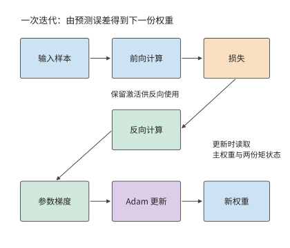

*图 10-1：从输入和当前权重出发，前向得到损失，反向得到参数梯度，Adam 生成新权重。前向阶段保留的激活用于反向；更新过程还读取高精度主权重和梯度历史。*

具体到本章任务，混合精度 Adam 用 BF16 权重执行矩阵运算，用 FP32 主权重保存优化器计算后的参数值，并保存两份 FP32 矩状态。一阶矩和二阶矩跨迭代保留，分别记录梯度方向和大小的历史；主权重更新后再转换为 BF16 供矩阵运算使用。梯度以 BF16 累积。逐项相加得到每参数 16 bytes。

| 状态 | 每个参数所占字节数 | Qwen3-8B 容量 / GB | 使用时机 |
|---|---:|---:|---|
| BF16 模型权重 | 2 | 16.4 | 前向与反向矩阵运算 |
| BF16 梯度 | 2 | 16.4 | 反向传播时产生，计算新参数时使用 |
| FP32 主权重 | 4 | 32.8 | 保存新参数，随后生成 BF16 副本 |
| Adam 一阶矩 | 4 | 32.8 | 在训练迭代之间保留梯度历史 |
| Adam 二阶矩 | 4 | 32.8 | 在训练迭代之间保留梯度平方历史 |
| 合计 | 16 | 131.1 | 常驻训练状态 |

Qwen3-8B 有 $N=8\,190\,735\,360$ 个参数，因此

$$
M_{\mathrm{persistent}}=16N\approx131.1\ \mathrm{GB}\approx122.1\ \mathrm{GiB}.
$$

梯度格式是另一项选择。将梯度改为 FP32，每参数增加 2 bytes，总量变为 18 bytes。这一变化来自梯度的数据格式，“混合精度”一词本身并不规定梯度格式。MoE 每次由路由器选择部分专家子网络执行；各专家同样拥有待更新参数和优化器历史，所以状态容量由全部可训练参数决定。[^state]

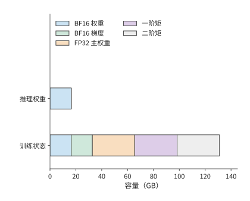

*图 10-2：五类训练状态合计相当于八份 BF16 权重的容量。模型为 Qwen3-8B，采用表中数据格式；横轴表示各类状态累计占用的容量。*

除了各类数据占多大空间，还要区分各自需要保留多久。前向产生的激活要等到相应的反向计算结束后才能释放，而参数收集缓冲区可能只在某个模块执行期间使用。第 $i$ 张卡的显存峰值取决于同一时刻驻留的训练状态、激活和临时缓冲区：

$$
M_{\mathrm{peak},i}=\max_t\left[M_{\mathrm{persistent},i}(t)+M_{\mathrm{activation},i}(t)+M_{\mathrm{temporary},i}(t)\right].
$$

例如，8 GiB 激活与 4 GiB 收集缓冲若同时出现，就要共同占用 12 GiB；若先释放激活再收集参数，同一片空间可以复用。容量优化由此有两个方向：减少张量和缓冲区的大小，或减少需要同时保留的数据。下一节的分片、重计算与卸载分别从这两个方向改变峰值。

上述容量按 BF16 执行矩阵运算计算。换一种浮点格式，状态占用的字节数和数值风险会同时改变。先看 FP16。第 4.6.1 节已比较 FP16 与 BF16 的指数与尾数：FP16 的五位指数把最小正规数定在 $2^{-14}\approx6.1\times10^{-5}$，小于它的值只能用次正规数表示，有效位随数值减小而逐位丢失；小于 $2^{-24}\approx6\times10^{-8}$ 的值则直接变为零。混合精度训练论文给出两组统计：普通话语音识别模型的权重梯度中，约 5% 的值指数小于 $-24$，在 FP16 中会变为零，该文以此说明需要 FP32 主权重；Multibox SSD 检测网络的激活梯度中，大量数值低于 FP16 的可表示范围而变为零，其中落在 $[2^{-27},2^{-24})$ 的值对训练仍然重要。

**损失缩放**（loss scaling）解决这一问题：在反向传播前把损失乘以因子 $S$，梯度随之放大 $S$ 倍，进入 FP16 可表示的范围；参数更新前再除以 $S$。该文训练多种网络时使用的缩放因子在 8 到 32K 之间。因子过小，小梯度仍然下溢；过大，大梯度溢出为无穷大，必须跳过这次更新并调小因子。[^precision]

BF16 的八位指数与 FP32 相同，两者的表示范围一致，梯度不需要缩放，这是前述状态表采用 BF16 的原因之一。代价是尾数只有七位：矩阵运算输入的舍入误差大于 FP16，长内积的精度要靠 FP32 累加器保证。

继续压低位宽，就要把单一的全局缩放因子细化成分块缩放。FP8 的 E4M3 编码只有四位指数、三位尾数，最大正规数为 448，单一全局因子无法让各层激活同时落入如此窄的范围。DeepSeek-V3 的 FP8 训练按块管理缩放：激活按 $1\times128$ 小块（每个 token、每 128 个通道）求 scale，权重按 $128\times128$ 块求 scale，矩阵单元每累加 128 个元素就把部分和转为 FP32 继续累加。与 BF16 的对照训练相比，相对损失误差低于 0.25%。[^precision]

FP8 也改变容量账，但改变的只是送入矩阵单元的那份权重副本：DeepSeek-V3 的 FP8 训练把矩阵运算的操作数转成 FP8，主权重、梯度与优化器状态仍以更高精度保存。这份 FP8 操作数副本每参数 1 byte，每 $128\times128$ 块附加一个 FP32 scale，合计每参数约 $1+4/16384\approx1.0002$ bytes；对 Qwen3-8B，矩阵运算读取的权重从 BF16 的 16.4 GB 降为约 8.2 GB，而前述状态表中每参数 16 bytes 的常驻训练状态并不因此降到 1 byte。

| 矩阵运算的权重格式 | 每参数字节（含 scale） | Qwen3-8B 矩阵运算读取的权重 | 缩放管理 | 主要数值风险 |
|---|---:|---:|---|---|
| FP16 | 2 | 16.4 GB | 全局损失缩放 | 梯度下溢、缩放溢出 |
| BF16 | 2 | 16.4 GB | 无需 | 尾数较短，由 FP32 累加补偿 |
| FP8（E4M3）操作数副本 | 约 1.0002 | 约 8.2 GB（主权重与优化器状态另存） | 分块缩放与定期高精度累加 | 块内舍入、scale 过期 |

精度越低、缩放粒度越粗，节省的容量越多，数值偏离高精度参考的风险也越大。无论起因是缩放失效、数据异常还是硬件错误，训练偏离都表现为损失曲线上的尖峰（loss spike），常见的处理是回滚到上一份 checkpoint 重新训练。回滚损失多少进度由第 10.4 节的保存周期模型决定，第 10.4.5 节再把回滚的发生率计入该模型。

### 10.1.3 计算需求、MFU 与资源下界

显存决定模型能否开始训练，计算速度决定能否按期完成。同一个模型的状态可以分到多张卡上，但究竟需要多少张卡，还要根据总计算量和期限判断。一条 8,192 个 token 的序列在前向和反向传播中的矩阵计算量约为 $4.31\times10^{14}$ FLOPs，平均每 token 约 52.7 GFLOPs。处理 100B token 共需约 $5.27\times10^{21}$ FLOPs。这里的工作量由模型矩阵形状和前后向运算累计得到。[^deadline]

先假设这 30 天全部用于训练计算。H100 SXM 的稠密 BF16 矩阵运算峰值为 989 TFLOP/s，达到峰值的 40% 时，一张卡约能处理 7,500 token/s。五张卡合计约 37,600 token/s，低于 30 天所需的约 38,600 token/s；至少需要六张卡才能满足计算需求。相比之下，两张 80 GB 卡已能容纳理想均分的 131.1 GB 常驻训练状态，却需约 77 天完成计算。

设算法所需的总计算量为 $F$，卡数为 $p$，单卡峰值为 $P$，统计时段内的平均计算效率为 $\eta$，则

$$
T=\frac{F}{pP\eta},\qquad
p_{\mathrm{compute}}=\left\lceil\frac{F}{P\eta T_{\mathrm{available}}}\right\rceil.
$$

本章按第 1.2.2 节的定义计算 MFU，分母取全部卡的峰值算力。若实际耗时取完整的训练迭代时间，通信等待已经计入其中；若只统计加速器执行计算的时间，得到的就是单卡计算效率。本章的设计案例采用后一种分解：单卡计算效率取 40%，随后把无法与卡内计算重叠的通信时间，以及等待输入数据的时间逐项加上。这样可以直接观察每项系统设计对完成时间的影响。40% 来自 Llama 3 的公开记录：405B 模型在 8,192 至 16,384 张 H100 上预训练，BF16 MFU 为 38%—43%。这组数按整步耗时统计，本身已包含通信等待，本章再单独加上通信，算出的完成时间因此偏长。RTX 4090 没有 NVLink，卡间数据都要经过 PCIe，这部分代价在第 10.3.3 节按实际链路单独计算。图 10-3 至图 10-5 保留 30% 与 50% 两档，用来观察效率偏离时卡数如何变化。[^deadline]

另外六成峰值算力去了哪里，本章各节分别作答：无法与计算重叠的通信（第 10.3.3 节）、流水线气泡（第 10.3.2 节）、受内存带宽限制的参数更新与状态转换（第 10.2.3 节）、重计算（第 10.2.2 节）、掉队者（第 10.4.5 节）和 checkpoint 保存（第 10.4.3 节）。按第 1.3.4 节的判据，前四项是模型必须计入的工作，漏掉任何一项，估出的完成时间都会偏短；后两项和通信中没有重叠的部分则含有可以减少的开销，那才是系统设计的优化空间。

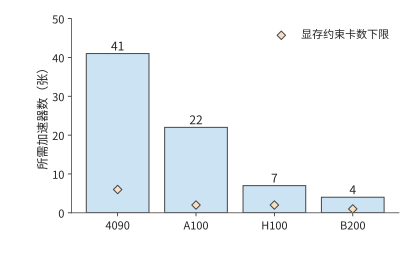

*图 10-3：矩阵计算效率为 30% 时所需的卡数。任务为 Qwen3-8B 处理 100B token，序列长 8192，全部 30 天用于执行；蓝柱为计算需求，橙色菱形为训练状态容量下限。A100 为 80 GB SXM，H100 为 SXM。*

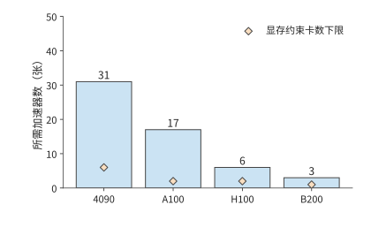

*图 10-4：矩阵计算效率提高到 40%，同一任务所需的卡数下降；橙色菱形仍表示状态容量下限。各下限均以卡数计量；容量项是显存约束要求的最少卡数。*

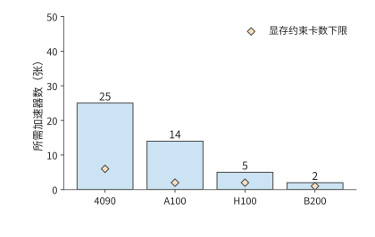

*图 10-5：矩阵计算效率为 50% 时所需的卡数。三图使用相同的型号顺序、纵轴范围、任务与 30 天执行期限。各下限均以卡数计量；容量项是显存约束要求的最少卡数。*

图 10-3 将显存下限与计算下限放在一起：对本章任务，所需卡数主要由计算决定。下面据此选取两套具体配置，供后续各节逐步比较。RTX 4090 的对应峰值为 165.2 TFLOP/s。按 40% 效率和 30 天计算，需要至少 31 张卡。采用每台主机八张卡的配置后，可以先考虑 32 卡方案；再增加两台主机得到 48 张。两套方案中，每张卡分别累积 12 个和 8 个单序列 micro-batch，共同完成一个包含 384 条序列的全局 batch。增加卡数改变了工作分配，训练目标保持不变。

每次训练迭代约有 $1.66\times10^{17}$ FLOPs，使用 32 卡时，每张卡完成所分配的计算约需 78.3 s；使用 48 卡时，约需 52.2 s。相对 67.9 s 的预算，32 卡在加入通信前已经超时，48 卡则留下约 15.7 s。接下来要判断两套方案如何安排状态，以及哪些等待会消耗这 15.7 s。

## 10.2 训练状态的分片、重计算与卸载

### 10.2.1 数据并行与 ZeRO／FSDP 状态分片

状态如何分配到多张卡上，由并行方式决定。同步数据并行让各卡处理不同样本，再用归约后的梯度更新各自的参数。各卡得到的新参数相同，因此每张卡通常都保存一份相同的权重与优化器状态；卡越多，复制的状态越多。ZeRO 由微软研究者在 2019 年提出、2020 年发表，用跨卡分片来减少大模型训练中重复保存的状态副本。ZeRO 分阶段划分这些状态的归属：每张卡只负责一部分参数的更新，其他卡通过通信取得执行所需的数据。

完全分片数据并行（Fully Sharded Data Parallel，FSDP）按同样的分片思路组织执行，参数、梯度与优化器状态都分片保存。下面用四张卡逐步改变状态的归属，再分析相应的执行方式。图中每列始终对应同一张卡；“完整”表示该卡保存整份状态，“片”表示只保存该卡负责的四分之一。

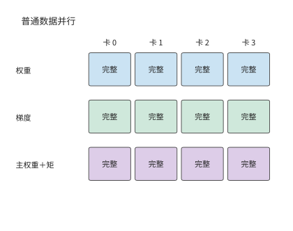

*图 10-6：普通 DP：每卡保存完整权重、梯度、主权重和两份矩状态。*

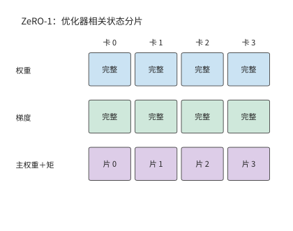

*图 10-7：ZeRO-1：主权重和两份矩状态按参数分片，权重与梯度仍完整复制。*

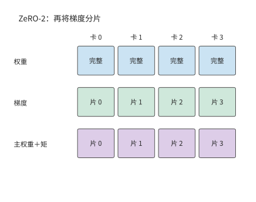

*图 10-8：ZeRO-2：进一步划分梯度，每卡只保留归属于自己的梯度分片。*

前两个阶段仍为每张卡保留完整模型权重。图 10-9 再划分权重的归属，长期驻留的空间进一步下降，代价是执行每个模块前要通过通信取得所需的权重。

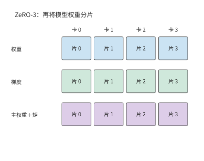

*图 10-9：ZeRO-3：权重也分片。执行模块时，各卡通过通信取得所需的完整权重。*

设数据并行组中有 $d$ 张卡。先计算常驻训练状态，普通数据并行和 ZeRO 三个阶段的每卡容量分别为

$$
\begin{aligned}
M_0&=16N,\\
M_1&=4N+12N/d,\\
M_2&=2N+14N/d,\\
M_3&=16N/d.
\end{aligned}
$$

第一阶段分片 FP32 主权重和两份 Adam 状态，共 12 bytes/参数，权重与梯度仍各保留一份。第二阶段再把梯度分片，完整复制只剩 BF16 权重。第三阶段连权重也分片。将 $d=8$ 代入，就得到下面的容量变化。

| 配置 | 每卡常驻训练状态 / GiB | 完整复制的训练状态 |
|---|---:|---|
| 普通 DP | 122.1 | 权重、梯度与优化器状态 |
| ZeRO-1 | 42.0 | 权重与梯度 |
| ZeRO-2 | 28.6 | 权重 |
| ZeRO-3 | 15.3 | 常驻训练状态均已分片 |

分片以后，每个模块按以下顺序执行：先通过 AllGather 取得所需参数，执行前向或反向，再通过 ReduceScatter 汇总梯度并分配梯度分片，让负责该分片的卡得到全部梯度贡献，最后各自更新所负责的参数。FSDP 的全分片执行也围绕这条路径组织。若前向后释放完整参数，反向前就要再次收集；若保留完整参数，反向可直接使用，但完整参数会与后续激活同时占用显存。

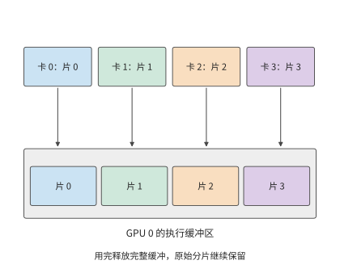

*图 10-10：同一模块的权重平时分散在四张卡上；执行时，各卡收集完整权重。图中展开 GPU 0 的收集过程，四种颜色分别表示四份参数分片。完整权重缓冲区用完即可释放，各卡长期保存的原始分片仍然保留。*

图 10-10 中，完整权重缓冲区与原有分片同时存在。增加卡数会缩小每份原始分片，完整权重缓冲区的大小却由模块本身决定。这就是常驻状态占用与执行峰值下降幅度不同的原因。

这一差别可以在小实验中直接观察到。一组用 PyTorch 第二代 FSDP 实现（FSDP2）做的 CPU 小模型实验，把参与的进程从两个增加到四个：参数更新后保留的状态从约 18 MiB 减到 9 MiB，执行峰值却只从约 39 MiB 减到 30 MiB。长期保存的部分减半，峰值只减少约 23%，因为执行中仍需约 21 MiB 的其他张量和缓冲区。因此，分析分片后的容量需求，还要考察模块执行时参数与激活各需保存多久。[^fsdp]

### 10.2.2 激活的保留与选择性重计算

前向计算留下的激活，像草稿纸上记录的中间步骤：反向计算回到这一层时，还要用到其中一些值。草稿全部保留，取用方便，却占空间；只保留部分步骤，缺失的值就要在使用前重新算出。参数分片已经减少了权重和优化器状态的复制，激活重计算则用额外的计算换取保存这些中间值所需的空间。

考虑矩阵运算 $Y=XW$，其中 $X$ 为输入、$W$ 为权重、$Y$ 为输出。前向计算结束后，$X$ 还要等到求权重梯度时使用。记损失为 $\mathcal L$，$dY=\partial\mathcal L/\partial Y$ 是后续计算传来的梯度，$dX$ 和 $dW$ 分别是损失对输入与权重的梯度；上标 $\mathsf T$ 表示矩阵转置。反向要计算

$$
dX=dY W^{\mathsf T},\qquad dW=X^{\mathsf T}dY.
$$

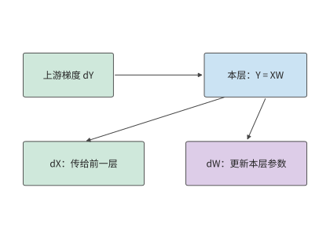

*图 10-11：矩阵反向产生两路梯度：dX 交给前一层继续反向，dW 交给本层的归约和参数更新。两路计算都读取上游梯度 dY。*

计算参数梯度需要前向输入 $X$。若保留 $X$，就要让它从前向计算时一直驻留到反向计算用完为止；释放 $X$，则要在反向使用前从已保留的输入或中间结果出发，重新执行相应的前向计算。选择哪些值保留、哪些值重算，要看节省多少空间，以及重新计算需要多少工作。

**例：反向传播前重算门控乘积能节省多少激活存储？** Qwen3-8B 的多层感知机（MLP，即本例的前馈子网络）先得到门控结果 $a$ 和上投影结果 $u$，再形成 $h=a\odot u$，最后计算 $Y=hW_{\mathrm{down}}$。下投影的参数梯度需要 $h$。如果已为非线性算子的反向计算保留了 $a,u$，可以在下投影反向前重新相乘，就不必一直保留 $h$。

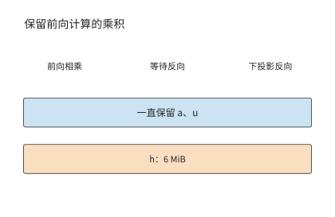

*图 10-12：保留乘积 h：蓝色条表示一直保留的 a、u，橙色条表示从前向持续到下投影反向的乘积 h。128 个 token 的 micro-batch 采用 FP32，h 的形状为 [128,12288]，占 6 MiB。*

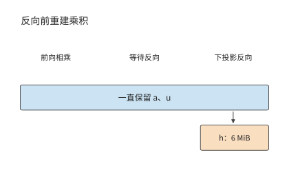

*图 10-13：保留 a、u，反向使用前重新相乘得到 h。橙色的 6 MiB 缓冲只在使用前后短暂存在；横轴表示操作顺序。*

重建后，只需在下投影反向即将开始时生成 h，并保留到这一步计算结束。这块缓冲区的大小如下：取 128 个 token 的 micro-batch 和 FP32 激活，$h$ 的形状为 $[128,12288]$，占 $128\times12288\times4=6$ MiB；重建需要约 157 万次乘法。同一层的两个归一化加权输出形状均为 $[128,4096]$，每个占 2 MiB，也可由已保存的归一化结果和权重重建。于是，每层省去 $6+2+2=10$ MiB，每个 micro-batch 在九层组成的流水阶段中可省去 90 MiB，约 94 MB。

原方案为这些 GEMM 保存的输入每层共占 15 MiB，其中上述三个乘积占 10 MiB，其余 Q、K、V 和注意力输出占 5 MiB。九层阶段因此从 135 MiB 降到 45 MiB，即从约 142 MB 降到 47 MB。重建按层依次发生，最大的乘积工作区为 6 MiB；上一层用完后，下一层复用这块空间。[^pipeline]

若有四个 micro-batch 同时等待反向计算，需要长期保存的数据就能减少 $4\times90=360$ MiB，约 377 MB，反向时则逐个 micro-batch 执行重建计算。这里的收益来自数据生命周期的差别：等待反向计算的 micro-batch 越多，需要长期保存的数据越多；逐层重建时，却只需反复使用同一块工作区。流水调度若让反向更早开始，等待反向计算的 micro-batch 数量又会下降。因此，重计算与流水调度共同决定需要保存多少数据；新增的计算是否延长每步训练时间，则取决于它在时间线上的位置。

### 10.2.3 CPU／GPU 卸载与缓冲区的使用时间

用已保存的结果重建数据的开销较小时，适合重计算。另一种办法是保留数据本身，把它移到容量更大的主机内存，使用前再传回 GPU，这就是**卸载**。选择卸载以后，原先的显存问题就变成了传输能否及时完成的问题。假设一份状态大小为 $V$，链路有效带宽为 $B$，从可以开始传输到算子需要这些数据之间有 $W$ 秒，则超出这段时间的传输耗时为

$$
T_{\mathrm{wait}}=\max(0,V/B-W)
$$

相应算子需要等待这段时间。传输和计算能重叠多少，取决于数据何时可发、链路何时空闲、相应算子何时需要这些数据。DMA 由设备发起数据搬移，传输期间源数据必须保留。源缓冲在 DMA 结束前保持有效，目标缓冲从开始接收时就占用内存；卸载同时改变两端缓冲区的使用时间。

**例：在 CPU 还是 GPU 上转换梯度，能更快完成卸载？** 门控投影的梯度形状为 $[12288,4096]$，BF16 大小 $G=96$ MiB，FP32 为 192 MiB。CPUAdam 是在 CPU 上执行 Adam 更新的实现，它使用 FP32 梯度，可以先传 BF16 再在 CPU 转换，也可以先在 GPU 转换再传 FP32。转换都要读 $G$、写 $2G$，共访问 $3G$ bytes。转换受内存带宽限制：GPU 取 RTX 4090 的 1008 GB/s，CPU 取第四代至强单路八通道 DDR5-4800 的 307.2 GB/s。记 CPU、GPU 转换吞吐为 $C_c,C_g$，链路有效带宽为 $B$，串行路径时间为

$$
T_c=G/B+3G/C_c,\qquad T_g=3G/C_g+2G/B.
$$

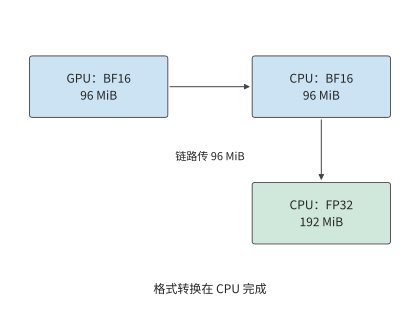

*图 10-14：先将 96 MiB BF16 梯度传到 CPU，再在 CPU 转为 192 MiB FP32。箭头表示数据流；转换的输入与输出均位于 CPU 一侧。*

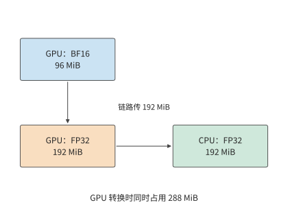

*图 10-15：先在 GPU 将 96 MiB BF16 梯度转为 192 MiB FP32，再传到 CPU。转换时输入与输出共存，GPU 峰值为 288 MiB。*

图 10-14 与图 10-15 的差别集中在跨越链路的箭头上：GPU 虽然转换更快，却要多传 96 MiB。链路越慢，这部分额外传输越容易抵消转换收益。

RTX 4090 经 PCIe 4.0 x16 连接主机，每方向 32 GB/s。在这条链路上，CPU 路径约为 $3.15+0.98=4.13$ ms，GPU 路径约为 $0.30+6.29=6.59$ ms。GPU 路径的转换少约 0.68 ms，传输却多约 3.15 ms，因此更慢。若链路换成 GH200 中 CPU 与 GPU 之间的 NVLink-C2C，每方向 450 GB/s，多传 96 MiB 只增加约 0.22 ms，两条路径变为约 1.21 ms 和 0.75 ms，GPU 转换获得明显收益。[^offload]

令两条路径耗时相等，可以求出两种方式快慢互换的带宽分界点：

$$
B^*=\frac{1}{3(1/C_c-1/C_g)}\approx147\ \mathrm{GB/s}.
$$

该阈值把两种相反作用放在同一尺度上：GPU 转换更快，节省了格式转换时间；FP32 数据更大，增加了传输时间。链路越快，后一项代价越小。147 GB/s 高于 PCIe 5.0 x16 的每方向 64 GB/s，所以经 PCIe 连接的卡在本算例中都应先传 BF16、在 CPU 上转换。

显存容量还带来另一项限制。GPU 转换期间原始 96 MiB 与输出 192 MiB 共存，峰值为 288 MiB；先传 BF16 的路径则只需在 GPU 上保留参与这次转换的 96 MiB 梯度。选择 GPU 转换需要额外 192 MiB 缓冲区。SuperOffload 是面向 GH200 这类 CPU 与 GPU 紧耦合芯片的训练卸载系统，它把转换位置和主机上的优化器执行一起安排，利用的正是转换速度、传输数据量和缓冲区使用时间之间的取舍。整步收益则由最后一桶梯度、CPU 上的参数更新和权重回传何时完成决定。

### 10.2.4 组合并行方案中的每卡状态分配与互联拓扑

分片、重计算和卸载分别改变存储量、计算量和传输量。把这些办法组合成完整系统时，还要确定它们作用于哪些卡和通信组。第 6、7 章的并行方法在训练中划分不同的数据和计算：TP 切分层内矩阵，PP 划分层，DP 划分样本，EP 划分专家。第 6.1.4 节的一览表还包括 SP 与 CP：前者让逐 token 算子的激活沿序列分片，通常复用张量并行组；后者把同一条长序列的注意力上下文分到多张卡，保留跨位置的依赖。这些并行方法延续第 5 章“分块—安排输入—汇合结果”的方法，训练再沿相同计算图逆向传播梯度。先确定每份参数由谁更新，再沿前向和反向的依赖关系安排收集、交换与归约，就能同时得到每卡容量和各接口流量。

三种容量优化可以用同一组问题比较。

| 方法 | 减少的显存占用 | 增加的工作 | 决定收益的时间关系 |
|---|---|---|---|
| 状态分片 | 重复保存的权重、梯度或优化器状态 | 参数收集、梯度归约并分片 | 收集能否赶在模块执行前完成 |
| 激活重计算 | 前向到反向之间保存的中间值 | 重建前向值 | 重建是否延迟关键路径上的反向计算 |
| 状态卸载 | 加速器上暂时不用的状态 | 主机与加速器间传输 | 数据能否在使用前传回 |

**例：显存不足时，应增加分片的卡数还是重计算激活？** RTX 4090 标称 24 GB，约合 22.35 GiB；扣除运行时占用，每卡按 22 GiB 可用显存计。Qwen3-8B ZeRO-3 在八卡上每卡保存约 15.3 GiB，留给其他张量和缓冲区约 6.7 GiB。如果激活与临时缓冲区同时需要 10 GiB，总量约 25.3 GiB，超出约 3.3 GiB。此时可以用重计算节省这 3.3 GiB，也可以增至十六卡，将常驻训练状态降到约 7.6 GiB，总量降至约 17.6 GiB。

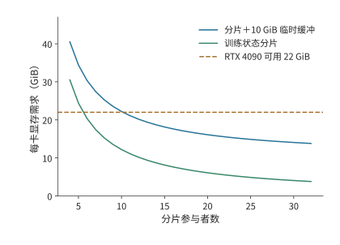

*图 10-16：给定附加存储需求时，分片数决定哪些方案满足容量要求。曲线为 $16N/d+10$ GiB，水平线为 RTX 4090 每卡 22 GiB 可用显存。曲线低于预算的区域可以容纳这些训练状态和缓冲区；纵向距离给出容量余量。*

两种选择对应不同的代价：八卡方案增加重建计算，十六卡方案增加卡数并改变通信组。可以先从图中找出满足显存要求的方案，再比较这些方案的每步耗时。

针对本章的训练任务，32 卡与 48 卡方案均采用全组 ZeRO-3，TP=PP=1，每卡 micro-batch 为一条序列。与上例相同，每卡按 22 GiB 可用显存计，并为同时保留的激活、完整模块参数和工作区安排 10 GiB 上限。两套方案常驻训练状态分别约为 3.8、2.5 GiB，总量约为 13.8、12.5 GiB，容量余量约为 8.2、9.5 GiB。两套方案的显存都足够，接下来主要比较完成时间。[^design]

## 10.3 训练步的流水调度与通信重叠

容量分析确定显存能够容纳所需数据，时间分析确定数据能否及时到达。本节先明确一次训练迭代所优化的目标函数，再把前向、反向与通信放在同一时间轴上。本章的设计案例采用数据并行；四阶段流水单独作为算例，说明调度会同时改变关键路径和激活的生命周期。

### 10.3.1 micro-batch、梯度累积与参数更新

全局 batch 包含一次参数更新使用的全部样本，可以分成多个 micro-batch 依次执行反向传播，累积梯度后统一更新参数。设 micro-batch $k$ 中有效 token 的索引集合为 $S_k$，有效 token 总数为 $L=\sum_k|S_k|$，token 平均损失为

$$
\mathcal L=\frac{1}{L}\sum_k\sum_{j\in S_k}\ell_j.
$$

求和与求导可以交换顺序，因此可以分别对各个 micro-batch 执行反向传播；计算每个 micro-batch 的损失时，都用其损失总和除以同一个 $L$。所有 micro-batch 的梯度累积完成后，执行一次梯度裁剪和一次参数更新。这样划分 micro-batch 只改变执行顺序，不改变各个 token 在损失函数中的权重。

**例：按 micro-batch 还是按 token 求平均，为何会改变梯度？** 八条回答中，四条各含两个有效 token，四条各含三个，共 20 个。设短回答每 token 的损失为 $\theta/5$，长回答为 $2\theta/5$，则

$$
\mathcal L=\frac{8\theta/5+12(2\theta/5)}{20}=\frac{8\theta}{25},\qquad
\frac{d\mathcal L}{d\theta}=0.32.
$$

若先求每条回答的平均损失，再对八条回答取平均，短回答与长回答各占一半权重，梯度变成 $(0.2+0.4)/2=0.30$。原先按 token 平均时，长回答占 $12/20=60\%$，所以结果更靠近 0.4。若已经使用 20 这一共同分母，累积后又除以八，则梯度变为 0.04。分母决定每个 token 对参数梯度的贡献。[^verl]

回到设计案例：第 10.1.3 节的 384 条完整长度的序列，在 32 卡上每卡累积 12 个 micro-batch，在 48 卡上每卡累积 8 个。每卡一次只处理一条，每张卡执行的矩阵形状相同；全局有效 token 数和目标函数也相同。参数收集和梯度通信则随执行路径另行排入时间轴。

### 10.3.2 流水线调度、气泡与激活的生命周期

micro-batch 的划分保持了训练目标，却改变了计算的先后顺序。在流水线并行里，顺序还决定每个阶段何时能开始计算，以及有多少份激活在等待反向。流水线并行把模型分成多个阶段，每个 micro-batch 依次前向，再沿反方向传播梯度。**填满排空（fill–drain）调度**先完成所有 micro-batch 的前向传播，再集中执行反向传播。**1F1B（one forward, one backward）**在流水线预热后交替执行一次前向和一次反向，让较早的 micro-batch 更快释放激活。

激活释放的快慢直接决定显存峰值。反向传播要用到前向保存的激活，因此每个 micro-batch 的激活从前向完成起就必须留在显存里，直到对应的反向到达。同一时刻有多少个 micro-batch 在等待反向，显存里就有多少份激活。填满排空要等全部 $m$ 个 micro-batch 都完成前向才开始第一个反向，峰值随 $m$ 线性增长；一旦超出显存容量，这一训练步就无法执行，只能减少同时在流水线中的 micro-batch、缩短序列，或改用代价更高的重计算换取可行性。提前执行反向就是提前结束激活的等待：峰值降低后训练步才能容纳，或者释放的余量可以留给更大的 micro-batch 和更长的序列。显存驻留因此往往不是快慢问题，而是能否运行的问题。

比较任何两种调度，都要同时考察两根轴：一根是**完成时间**，取决于流水线中空闲等待（气泡）的大小；另一根是**显存驻留**，取决于每份激活要保存多久才能等到自己的反向。

先设 $p$ 个阶段完全平衡，每阶段的前向耗时为 $t_f$、反向耗时为 $t_b$，传输和参数更新耗时取零。$m$ 个 micro-batch 填满排空需要

$$
T=(m+p-1)(t_f+t_b),\qquad u=\frac{m}{m+p-1}.
$$

式中的 $m$ 项对应 micro-batch 的实际计算工作，$p-1$ 项来自填充和排空。卡的时间利用率 $u$ 因而随 micro-batch 数量增加而提高。取 $p=4,m=8$，得到 $u=8/11\approx72.7\%$。若保持全局 batch size 不变，增加 micro-batch 数量意味着缩小每个 micro-batch；由此减少的流水线空闲时间，需要与更小矩阵的执行时间一起比较。

**例：气泡相同，1F1B 换来了什么？** 将 Qwen3-8B 的 36 层分为四个九层阶段，八个 micro-batch 各含一条 128 个 token 的序列。每阶段前向 10 ms、反向 20 ms，边界传输每次 1 ms，正反方向链路独立，参数更新耗时 1 ms。填满排空调度无传输时为 $(8+4-1)\times30=330$ ms；前向填充经过三条边界增加 3 ms，反向排空再增加 3 ms，参数更新增加 1 ms，总计 337 ms。

1F1B 更早开始反向，后续的前向也就要等反向释放计算资源。在阶段 0，前四个 micro-batch 于 40 ms 完成前向，第一份传回的梯度于 106 ms 到达。随后反向执行到 126 ms，第五个 micro-batch 才开始前向。这种交错逐级影响下游的到达时间。阶段 3 在 93 ms 完成第二个 micro-batch 的反向，但第三个前向输入到 95 ms 才到，产生 2 ms 空隙；后续相似的等待继续延长关键路径。按这些依赖关系排定执行顺序后，所有梯度在 346 ms 时计算完毕，加上参数更新共为 347 ms。[^pipeline]

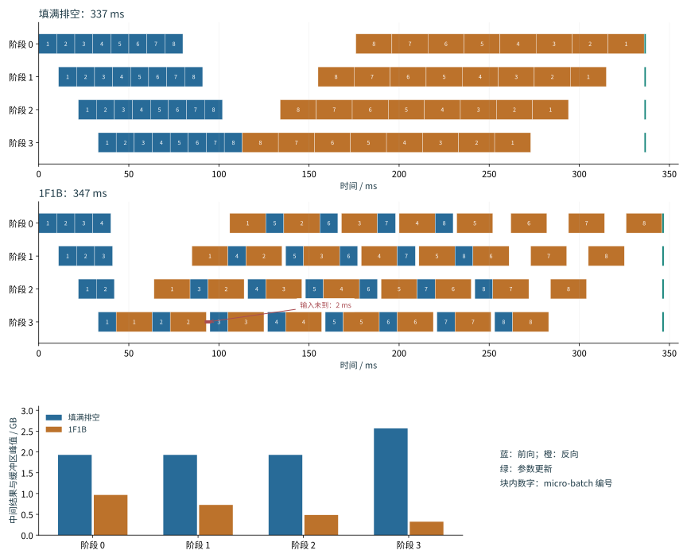

*图 10-17：填满排空先完成八个 micro-batch 的前向，再执行反向，最后更新参数。蓝色为前向，橙色为反向，绿色为参数更新。四个阶段共用同一时间刻度，按正文的计算与传输条件共需 337 ms。*

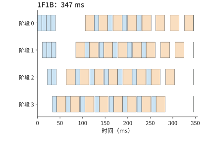

*图 10-18：1F1B 在预热后交错前向和反向，本例完成时间为 347 ms。蓝色为前向，橙色为反向，绿色为参数更新；与前图使用相同时间刻度。*

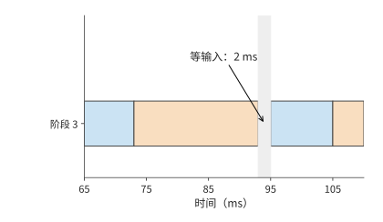

*图 10-19：放大 1F1B 的阶段 3：第二个 micro-batch 在 93 ms 结束反向，下一份前向输入于 95 ms 到达，形成 2 ms 等待。*

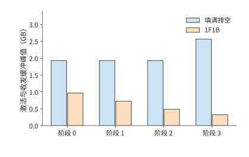

*图 10-20：两种调度中各阶段的激活与收发缓冲峰值。提前反向使激活更早释放，最大值由约 2.57 GB 降到 0.97 GB。*

两图对比可以看出：两种调度做相同的前后向工作，气泡时间同为 $(p-1)(t_f+t_b)$；1F1B 反而因交错引入的依赖等待（图 10-19）多用约 3% 的时间，收益则体现在图 10-20——中间结果与缓冲区的最大显存占用从约 2.57 GB 降到 0.97 GB，减少约 62%。因此“1F1B 优于填满排空”只在显存这根轴上成立，在时间轴上反而略慢。若只给这些中间结果和缓冲区留 1 GB，只有提前反向的调度能执行这一训练步；容量充裕时，337 ms 的填满排空调度完成得更早。选择哪种调度方式，由“何时释放张量”和“何时得到下一份输入”共同决定。

要缩短完成时间，就必须压缩气泡本身：反向拆得更细、同时流动的 micro-batch 更多，空隙就能填得更满。下面三类调度都建立在上述依赖分析之上，分别用**通信次数**、**激活峰值**和**参数量**换取更小的气泡。三者沿用同一算例（四个阶段、前向 10 ms、反向 20 ms、边界传输 1 ms、参数更新 1 ms），各 micro-batch 在每个阶段上的执行顺序（槽位顺序）由事件模型排定，气泡公式与反向拆分的思路来自已发表的论文。[^schedules]

**交错式 1F1B**（interleaved 1F1B，又称虚拟流水线）把 36 层切成八个块，轮流分给四张卡，每卡得到 $v=2$ 个不连续的块，合计仍是九层：前四块各五层、后四块各四层，卡 0 执行第 0—4 层与第 20—23 层，其余各卡依次类推。每个 micro-batch 的前向因此跨越边界 $2p-1=7$ 次而不是 3 次，气泡比例则从 $(p-1)/m$ 缩小为

$$
\frac{1}{v}\cdot\frac{p-1}{m}.
$$

八个 micro-batch 时完成时间从 347 ms 降到 298 ms，每卡空闲从约 106 ms 降到约 57 ms。代价有两项：传输次数增加一倍以上（全步前向消息从 24 次增到 56 次），以及较早阶段的激活要等待更多块完成前向——阶段 0 的激活与收发缓冲峰值从 921 MiB 升到约 1,329 MiB。

**零气泡**（zero-bubble）调度把反向拆成两段：输入梯度 $dX$（论文记作 B）要传给上一阶段，上一阶段的反向在等它，所以 $dX$ 位于关键路径上，应尽早执行；权重梯度 $dW$（论文记作 W）只交给本层的梯度累积，可以放在本阶段对应 $dX$ 之后的任意时刻，因而推迟到空隙中执行。设每阶段前向、$dX$、$dW$ 的耗时分别为 $T_F$、$T_B$、$T_W$，则 1F1B 的气泡为 $(p-1)(T_F+T_B+T_W)$；ZB-H1 把 $dW$ 填进空隙，气泡降为 $(p-1)(T_F+T_B-T_W)$；ZB-H2 再把更多前向提前，气泡降为 $(p-1)(T_F+T_B-2T_W)$。零气泡论文的两种手工调度按 $T_F=T_B=T_W$ 构造，论文表 2 给出上述一般形式。

本例把 20 ms 的反向对半拆成 $T_B=T_W=10$ ms：1F1B 的气泡为 $3\times30=90$ ms，ZB-H1 的下界为 $3\times(10+10-10)=30$ ms，ZB-H2 的下界为 0。按论文图 3 的 ZB-H1 槽位顺序排定事件模型后，八个 micro-batch 的完成时间为 283 ms，每卡空闲 42 ms；把边界传输取零，空闲恰好是 30 ms 的下界，多出的 12 ms 来自传输。阶段 0 的激活与收发缓冲峰值与 1F1B 相同，都是 921 MiB。代价落在靠后的阶段：阶段 3 的 $dW$ 比 $dX$ 晚三个 micro-batch 执行，事件模型把这段时间里的激活按完整一份保留，阶段 3 的峰值从 1F1B 的 308 MiB 升到约 1,226 MiB。论文按 $dW$ 实际所需的较小激活量计算，其表 2 中 ZB-H1 的峰值与 1F1B 同为 $pM_B$（$M_B$ 为一个 micro-batch 的激活量）。

**DualPipe** 把 micro-batch 分成两半，从流水线两端相向注入，每个阶段同时承载两个方向的块。沿用 DeepSeek-V3 的记号，它的气泡为 $(PP/2-1)(F\&B+B-3W)$，其中 $PP$ 为流水线阶段数，$F\&B$ 为前向与反向重叠执行的时段，$B$ 指完整反向 20 ms，$W$ 指其中的 $dW$ 10 ms。本例不模拟前向与反向的计算重叠，取 $F\&B=F+B=30$ ms，气泡为 $(2-1)\times(30+20-30)=20$ ms，完成时间为 306 ms。代价同样直接：每卡要保存两个方向的参数副本，参数量翻倍，激活保留 $PP+1$ 份；本例各阶段峰值约为 1,228—1,612 MiB。[^schedules]

下表把这五种调度放在同一算例下对照。填满排空虽然没有压缩气泡，仍是容量充裕时的基准，一并列出：

| 调度（八个 micro-batch） | 完成时间 / ms | 每卡空闲 / ms | 阶段 0 峰值 / MiB | 压缩气泡的手段 | 主要代价 |
|---|---:|---:|---:|---|---|
| 填满排空 | 337 | 96 | 1,840（阶段 3 为 2,448） | 无 | 激活驻留最高，容量紧张时不可行 |
| 1F1B | 347 | 106 | 921 | 无（气泡与填满排空相同） | 显存最省，但比填满排空慢约 3% |
| 交错式 1F1B，$v=2$ | 298 | 57 | 1,329 | 每卡层块拆成 $v$ 段 | 前向消息 24 → 56 次 |
| 零气泡（ZB-H1），$T_B=T_W$ | 283 | 42 | 921（阶段 3 为 1,226） | $dW$ 延后填入空隙 | 靠后阶段的激活要保留到 $dW$ 执行 |
| DualPipe | 306 | 65 | 1,228（阶段 1、2 为 1,612） | micro-batch 从两端相向流动 | 每卡参数两份 |

把表中的数字画到各阶段的时间线上，就能看出气泡在哪里被填掉。下面三幅图与图 10-17、图 10-18 使用相同的时间刻度和颜色。

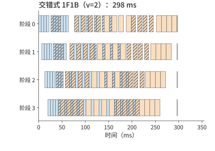

*图 10-21：交错式 1F1B（$v=2$）的各阶段时间线，完成时间 298 ms。蓝色为前向，橙色为反向，绿色为参数更新，斜线块为每卡的第二个层块。每个块约为图 10-18 中的一半长，预热与排空阶段的空隙被另一个层块的计算填上，阶段 3 的第一个前向从 33 ms 提前到约 20 ms；每个 micro-batch 要多穿过四条边界。*

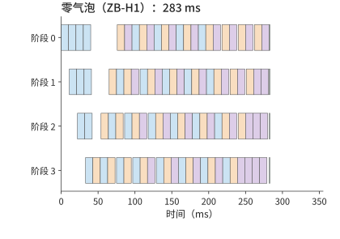

*图 10-22：零气泡（ZB-H1）的各阶段时间线，完成时间 283 ms。蓝色为前向，橙色为 $dX$，紫色为 $dW$，绿色为参数更新。稳态中每个阶段按前向、$dX$、$dW$ 轮转，图 10-18 里反向之间的依赖空隙和末尾的排空空隙都被延后的 $dW$ 填上，四个阶段几乎同时结束；阶段 3 的 $dW$ 比 $dX$ 晚三个 micro-batch，那里的激活保留得最久。*

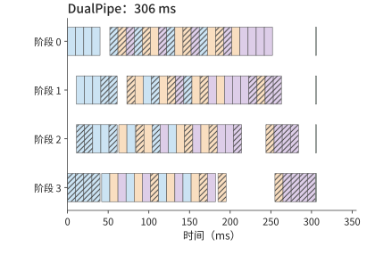

*图 10-23：DualPipe 的各阶段时间线，完成时间 306 ms。颜色同图 10-22，斜线块为从阶段 3 进入的另一半 micro-batch（反方向）的计算。每个阶段同时承载两个方向，一个方向的预热和排空空隙由另一个方向的块填上；代价是每卡保存两份参数。*

没有一种调度在两根轴上同时占优。把五种调度分别按两根轴排序，第一名不是同一种调度：完成时间最短的是零气泡，最大单阶段峰值最低的是 1F1B。三种扩展调度压缩气泡换来的时间，都以另一种资源的增加为代价，所以选择调度时要先确定约束在哪一边：时间还是容量。图 10-24 把两根轴并排画出（未画填满排空），可与上表对照。

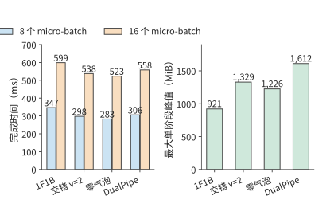

*图 10-24：四种流水线调度在八个与十六个 micro-batch 下的完成时间，以及八个 micro-batch 时各调度最大的单阶段激活与收发缓冲峰值。四种调度使用相同的前向 10 ms、反向 20 ms、边界传输 1 ms、参数更新 1 ms 条件。*

micro-batch 翻倍到 16 个时，1F1B、交错式、零气泡与 DualPipe 的完成时间分别为 599、538、523、558 ms，排序不变。压缩气泡是否值得，取决于节省的气泡时间与新增代价的相对大小。$m$ 增大时，气泡比例 $(p-1)/m$ 本身就在下降——16 个 micro-batch 时 1F1B 的气泡占比已从 37.5% 降到 18.8%，拆细带来的相对收益随之缩小，而交错式增加的通信次数、零气泡增加的激活驻留、DualPipe 增加的参数量都不随 $m$ 缩小。第 10.3.3 节的链路争用给出另一条边界：交错式每个 micro-batch 多出的四次跨界传输，在链路已被梯度归约占满时会直接延长关键路径。容量紧张时，选择的顺序反过来：先按第 10.2.4 节排除峰值不可行的调度，再比较完成时间。

### 10.3.3 反向依赖、梯度分桶与通信重叠

上一节的 2 ms 空隙来自输入尚未到达。梯度通信也受同一条规律支配：发送之前要等数据产生，发送时又要等链路空闲。反向传播逐层产生梯度，实现中通常把多个梯度张量合并成一个通信桶，等桶内所有梯度都计算完毕后再发送。桶越大，越可能等候最后生成的梯度；桶越小，需要启动通信的次数就越多。调度要在启动代价与提前发送之间取得平衡。

设归约需要 3 ms，梯度就绪后还有 5 ms 与它无关的计算，归约可以与这段计算同时进行。若共享链路此前已安排 4 ms 的专家交换，归约只能利用余下 1 ms，另有 2 ms 延伸到计算之后。这部分无法与计算重叠、会延长训练步的时间，称为**通信等待时间**。数据依赖给出最早开始时刻，资源争用把它推迟，后续算子的依赖关系决定这段等待是否延长整个训练步。

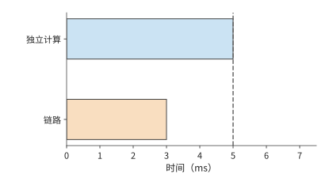

*图 10-25：链路空闲时，3 ms 归约（橙色）可以在 5 ms 独立计算（蓝色）结束前完成。虚线标出计算结束。*

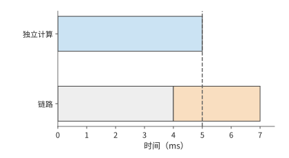

*图 10-26：链路先被其他通信占用 4 ms（灰色），归约推迟到 4—7 ms。虚线后多出的 2 ms 延长训练步。*

图 10-25 暂时固定了梯度产生的时刻。实际训练还可以改变计算顺序，让某些梯度更早产生，从而把归约在时间轴上提前。矩阵反向中，输入梯度 $dX$ 交给前一层继续反向，参数梯度 $dW$ 交给本层的归约。先算 $dX$ 可以让前一层更早开始反向传播，先算 $dW$ 则可以更早启动本层的梯度通信。两者争用同一计算资源时，改变顺序会重新分配通信窗口。这也是训练调度要同时考虑前后向依赖的原因。

现在用这条规律计算设计案例的通信等待。两套方案都采用全组 ZeRO-3，每个 micro-batch 要做三次集合通信：前向之前用 AllGather 收集一遍 BF16 权重，反向之前再收集一遍，反向之后对 BF16 梯度做一次 ReduceScatter。每次集合通信中，每张卡收发的字节为 $(d-1)/d\times2N$，48 卡时约 16.0 GB。每卡累积 $m$ 个 micro-batch，一步的通信量为

$$
V=3m\cdot\frac{d-1}{d}\cdot2N.
$$

48 卡时 $m=8$，$V\approx385$ GB；32 卡时 $m=12$，$V\approx571$ GB。这些字节的传输路径由硬件决定。RTX 4090 没有 NVLink，也不支持卡间 P2P（一张卡经 PCIe 直接读写另一张卡的显存），同一台主机里的两张卡交换数据也要经过主机内存，所以每张卡的全部收发都要穿过各自的 PCIe 4.0 x16，每方向 32 GB/s。按公开的 4090 集群配置分析，每台八卡主机配八张 200 Gbit/s 网卡，每张 25 GB/s；环形集合通信把跨主机的流量分到八张网卡上，网卡不是瓶颈。于是 48 卡每步的链路时间约为 $385/32\approx12.0$ s，32 卡约为 17.9 s。

链路时间并不等于通信等待。ZeRO-3 在执行某一层之前预取它的参数，在一层反向结束后立即归约它的梯度。48 卡每个 micro-batch 的链路时间约 1.50 s，而该 micro-batch 的计算约 6.53 s；逐层看，收集一层约 0.39 GB 的参数只需约 12 ms，也远短于这一层的计算。所以大部分通信都能落在计算之内。MegaScale 在数据并行中采用同样的做法，并指出无法隐藏的只剩一步中第一次 AllGather 和最后一次 ReduceScatter。对 Qwen3-8B，这两次通信都作用于约 1.24 GB 的词嵌入：词嵌入是前向的第一层，也是反向最后求出梯度的一层。两次合计约 0.08 s，这就是每步的通信等待。参数更新和卡内的非矩阵运算已包含在单卡计算效率里，两套方案在输入就绪时的每步耗时分别约为 78.4 s 和 52.3 s。[^design]

通信大多被计算覆盖，这也给优化设定了收益上限。若一段 1.3 s 的归约中只有 0.2 s 延续到反向计算结束之后，在其余时间轴不变时，即使消除这段通信等待，整步至多缩短 0.2 s。若还差 0.5 s 才能满足目标，就要同时缩短其他关键路径工作。

> **案例：全局 batch 不变时，卡数增至四倍能加速多少？** 大规模分布式训练系统 MegaScale 在 175B 模型上保持全局 batch size 为 6144，把卡数从 3072 增至 12288。原每步耗时约 23.7 s，若卡数增至四倍就能带来四倍加速，每步应缩短至约 5.9 s，实际约 6.3 s。总加速约 3.7 倍，对应约 93% 的扩展效率。卡数增加后，每卡的工作减少，跨组同步和负载不均衡造成的等待，在每步耗时中所占的比例随之上升；实际每步比理想值多约 0.4 s，这就是扩展后需要进一步分析的额外耗时。按第 1.3.4 节的顺序，先把跨组同步和负载不均补进模型：卡数越多，每步等待最慢一组的时间占整步的比例越大，这是扩展本身带来的工作；补齐之后仍然解释不了的差额，才归于实现开销。[^megascale]

### 10.3.4 MoE 与长上下文的调度变化

稠密模型的每次前向都使用各层全部前馈权重，数据并行时的工作划分较为规则。MoE 的路由会让各卡收到数量不同的 token，序列长短不一也会让相同的 token 数对应不同的计算量。因此，分析每步耗时，要看工作如何分到各张卡上，以及哪张卡最后完成。

**专家 dispatch 不均如何延长最忙那张卡的计算时间。** 设两张卡上的专家分别接到 96、32 次 token dispatch，每次 dispatch 把一个 token 的特征向量送给一个专家，在该专家输入矩阵中占一行。假定每次 dispatch 的计算时间近似相同。总计 128 次 dispatch，对应 128 个有效行，平均每卡 64 行，但完成时间由 96 行的一侧决定。将分配调整为 64、64 行，专家计算时间就从处理 96 行所需的时间降到处理 64 行所需的时间，缩短三分之一。

训练中的路由均衡机制决定样本如何选择专家；专家副本和拓扑映射则决定这些选择在哪里执行。

上述调整假定 token 可以在专家之间随意搬移。实际的 dispatch 由路由器打分决定，均衡机制只能影响 dispatch 的分布，执行时还需要一条处理不均的明确规则。**容量因子**（capacity factor）$c$ 给出这条规则：每个专家的输入矩阵最多为

$$
\text{每专家容量}=\left\lfloor c\times\frac{\text{token 数}\times k}{E}\right\rfloor
$$

行，即平均 dispatch 量的 $c$ 倍，其中 $k$ 为每个 token 选择的专家数，$E$ 为专家数。超出容量的 dispatch 被**丢弃**：该层不处理这些 token，它们的表示经残差连接直接传给下一层；容量未用满的槽位补零，这些行仍占用计算与通信。[^capacity]

代入前例：128 次 dispatch、$E=2$、$k=1$，平均每专家 64 行。$c$ 取 1.0、1.25、1.5、2.0 时，每专家容量为 64、80、96、128 行，收到 96 次 dispatch 的专家分别丢弃 32、16、0、0 个 token，两个专家合计补零 32、48、64、128 行。$c=1.0$ 时总执行量恰好等于 128 次有效 dispatch，却丢弃了其中四分之一；$c=1.5$ 起不再丢弃，代价是执行行中有三分之一为补零。

再看真实模型的路由规模。Qwen3-235B-A22B 有 $E=128$ 个专家，每个 token 选择 $k=8$ 个；8,192 个 token 共 65,536 次 dispatch，平均每专家 512 行。设一半专家收到 1.5 倍于均值的 dispatch，与前例 96/32 同为 3:1 的不均衡，热专家各 768 行、冷专家各 256 行。$c$ 取 1.0、1.25、1.5、2.0 时，每专家容量为 512、640、768、1,024 行，热专家分别丢弃 256、128、0、0 次 dispatch，合计占总 dispatch 的 25%、12.5%、0、0；补零行占全部执行行的 25%、30%、33%、50%。

| 容量因子 $c$ | 每专家容量 / 行 | 丢弃的 dispatch 占比 | 补零行占执行量 |
|---|---:|---:|---:|
| 1.0 | 512 | 25% | 25% |
| 1.25 | 640 | 12.5% | 30% |
| 1.5 | 768 | 0 | 33% |
| 2.0 | 1,024 | 0 | 50% |

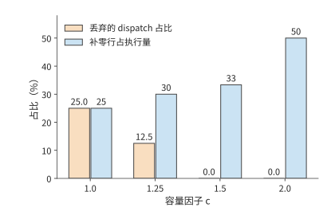

*图 10-27：Qwen3-235B-A22B 的路由形状（E=128、k=8、8,192 个 token、一半专家 1.5 倍热）下，容量因子增大时丢弃的 dispatch 占比下降、补零行占比上升。*

翻转条件由路由分布决定：上述分布需要 $c=1.5$ 才把丢弃率降到零；路由越均衡，所需的 $c$ 越接近 1，补零浪费越少。辅助损失（在训练目标中额外加入的负载均衡项）直接惩罚 dispatch 不均，DeepSeek-V3 的无辅助损失方案按专家负载动态调整路由偏置；两者都把分布推向均衡，让容量因子可以取更小的值。第 2.4 节的专家容量公式假设路由过程中不丢弃任何 token dispatch（$\sum_e t_e=mk_{\mathrm{top}}$），对应的就是容量因子足够大、丢弃率为零的情形。[^capacity]

均衡专家的计算量以后，数据传输仍可能让卡等待。MoE 的前向 token 交换、反向输入梯度传输和参数梯度归约会争用同一条链路，因此还要利用上一节的通信时间轴分析。取 72 MiB 的 FP32 专家梯度，由持有该专家的四个数据并行成员做环形 AllReduce，每张卡发送 $2\times3/4\times72=108$ MiB。每卡配一张 200 Gbit/s 网卡，每方向 25 GB/s，每次集合调用启动约 0.02 ms。整桶耗时约 4.55 ms，无法在一个 2 ms 空闲时段内完成。若把梯度切成三个 24 MiB 子桶，每桶发送 36 MiB，约 1.53 ms，可分别在三个这样的空闲时段内完成；总通信处理时间却增加到约 4.59 ms。虽然多启动了两次通信，但每个小桶都能在计算结束前传完，因此减少了计算之后的等待。换成 400 Gbit/s 网卡，整桶约需 2.28 ms，仍无法放入 2 ms 空隙，切桶依然必要。[^moe]

专家负载取决于每张卡上的专家接到了多少次 token dispatch。长上下文还有另一层差别：即使 token 总数相同，需要计算的注意力配对数也可能不同。

**相同 token 总数下，序列长度不均如何增加注意力计算量。** 对长度 $s$ 的因果序列，第一个 token 查看一个 token，第二个查看两个，依次相加，得到 $s(s+1)/2$ 个有效注意力配对。两条长度 4096、4096 的序列合计约 1680 万对；改为 7168、1024，总 token 数仍为 8192，配对数却增至约 2620 万，增加约 56%。注意力配对数随序列长度近似按平方增长，所以较长的序列增加了总计算量。[^length]

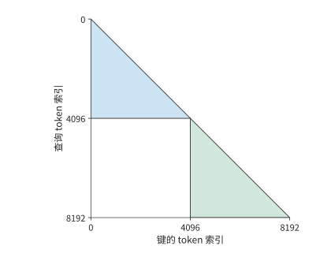

*图 10-28：两条 4096 个 token 的序列的因果注意力配对。每个查询 token 读取本序列中不晚于自己的位置，形成两个三角形；两条序列的注意力计算彼此独立，总配对数为 16781312。*

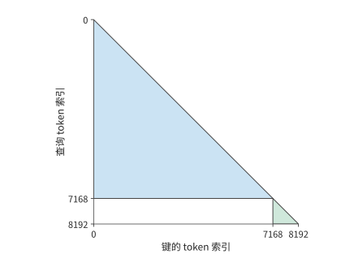

*图 10-29：相同 8192 个 token 改分为 7168 与 1024，总因果配对数增至 26218496。较长序列对应三角形增加的面积，超过了较短序列对应三角形减少的面积。*

图 10-29 中，长三角形的额外面积来自真实的注意力关系，无法靠删除填充 token 消除。打包（把多条较短的序列首尾拼接成一条目标长度的序列）减少填充 token，按长度分组则让各卡承担的三角形面积更接近；上下文并行进一步把长序列的计算分到多张卡，并通过交换 K、V 取得其他卡保存的数据。三者分别改变无效工作、工作分配和数据到达路径。用相同总 token 数比较方案时，保持长度分布、可见性掩码（mask，规定各 token 位置能读取哪些上下文 token）和损失权重不变，就能将调度收益与任务变化分开。

## 10.4 数据输入、checkpoint 与故障恢复

第 10.3 节的每步耗时分析假定输入数据已经准备好，训练也没有因故障中断。持续运行时，数据读取和预处理要跟上计算速度，还要有 checkpoint 保存可恢复的训练状态。本节把二者加入章首的完成时间：输入决定卡能否持续工作，恢复决定已经做过的工作有多少需要重做。

### 10.4.1 数据读取、打包与预取

原始数据经过读取、解码或分词、筛选，再按目标长度拼接成训练序列，放入主机内存缓冲区，最后传到 GPU。主机缓冲区通常使用锁页内存，使数据在异步传输期间保持在物理内存中。各环节的持续处理速度决定输入速度，队列用来缓冲短时间内的速度波动。

GPU 最终收到的数据量小，不意味着此前的准备过程同样快。25 天预算要求约 46,300 token/s，即每秒约 5.7 条 8,192 个 token 的序列。若以每个编号占 8 字节的 int64 格式传输 token ID，数据率只有约 0.37 MB/s。设每个 CPU 数据准备进程每秒准备两条序列，两个数据准备进程只有四条/s，低于需求；三个数据准备进程达到六条/s。传输的数据量虽少，CPU 上的准备过程仍可能拖慢整个集群。

本章的设计案例为输入安排四个这样的数据准备进程，合计八条/s。48 卡输入就绪时每步约 52.3 s，每步处理 384 条，需求约为 7.3 条/s，低于八条/s。数据准备比训练消耗更快，短暂变慢之后可以重新补满预取队列。设计案例再给每步 0.5 s 的平均输入等待时间，表示预取没能消除的等待，32 卡和 48 卡的每步训练时间由此变为约 78.9 s 和 52.8 s。[^design]

预取队列让数据准备与 GPU 计算以不同进度运行。正常训练时，提前准备的数据可以缓解输入速度波动造成的等待；保存 checkpoint 时，则必须分清哪些数据已经用于训练。假设数据加载器已经为前 108 个 batch 分配了准备任务，而训练只完成第 100 个，第 101—108 个仍在处理或排队。若恢复时直接从第 109 个 batch 开始，就会跳过八个 batch。已分配给数据准备进程的 batch 位置反映预取进度，已用于训练的 batch 位置反映训练进度；两者之间的缓冲保存了尚未训练的数据。

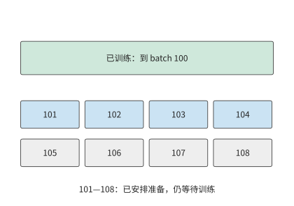

*图 10-30：训练已完成 batch 100，预取任务已安排到 108。中间八个 batch 仍需训练，其中一部分已经准备好，另一部分还在处理。虚线框示意尚在处理的 batch。恢复时应保留这些数据或重新准备它们，从 batch 101 继续。*

图 10-30 的队列只能暂时填补准备速度的下降；若数据长期准备得更慢，队列终将取空。checkpoint 写入也受同样的约束：保存产生数据的平均速率一旦超过存储能持续接收的速率，待写的快照就会越积越多，有限的暂存缓冲终将被占满，第 10.4.3 节按具体写入速率计算这种积压。对本章的文本任务，输入端的字节量很小，瓶颈在 CPU 上的数据准备；checkpoint 的平均写流量也不大：设计案例采用 1800 s 保存间隔，约 115 GB 的 checkpoint 平均只有约 64 MB/s。保存时的停顿在第 10.4.4 节单独计入。[^supply]

### 10.4.2 可恢复状态与布局变换

设训练刚完成一次参数更新，此时停机。恢复后，要接着训练，需要知道当时的权重、下一批该读哪些数据，以及优化器已经累积了哪些历史。仅有权重，可以执行前向推理，却不足以确定训练的下一次更新。因此，训练 checkpoint 要保存与同一训练进度对应的全部必要状态，恢复后才能接着训练。

本章采用 Adam 的训练需要保存权重、一阶矩与二阶矩、步数、学习率状态、随机状态和下一批数据的组成。学习率控制更新步长，随机状态决定后续随机采样的序列。权重相同而优化器的矩状态不同，下一次参数更新便可能不同；数据读取位置相同而打包时剩余的 token 不同，下一条训练序列也会改变。第 10.2.2 节的激活重计算解决的是一次前向、反向之内哪些中间值可以重建；checkpoint 要解决的是中断之后整个训练过程如何继续。

一次训练迭代结束后，下一批梯度由反向重新产生。此时保存权重 2 bytes、主权重 4 bytes 和两份 Adam 状态 8 bytes，每参数合计 14 bytes。Qwen3-8B 的这部分 checkpoint 约为 115 GB。在一次训练迭代结束时，把模型状态和已处理到的数据位置一同保存，就能确定恢复后该用哪些参数、从哪一批数据继续训练。

恢复时还可能需要改变并行布局，同一份状态要重新分片。**例：checkpoint 如何从四路张量并行重分片为八路？** 门控投影的权重形状为 $[12288,4096]$，BF16 大小 96 MiB。沿输出维四分，每片 3072 行、24 MiB；八分后，每片 1536 行、12 MiB。rank 为 $r$ 的目标卡读取旧分片 $\lfloor r/2\rfloor$，偶数 rank 取前半，奇数 rank 取后半。全局行坐标将旧布局和新布局联系起来。

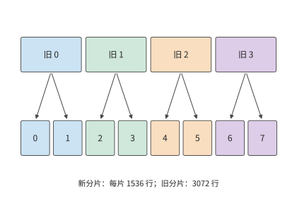

*图 10-31：横向位置对应原矩阵的行号，颜色表示旧分片。每份旧分片分成前后两半后，分别存入两个新分片。模型权重的内容和顺序保持相同，改变的是各卡负责的行范围；BF16 权重总量始终为 96 MiB。上方“旧”编号标识原分片，下方编号标识重新分配后的分片。*

沿图 10-31 的箭头，恢复程序可以找到每个新分片对应的原始行范围。FP32 主权重与 Adam 两项状态也按相同的行范围拆分，每项为 BF16 权重的两倍。该矩阵在 checkpoint 中的全部状态因此为 $96\times(1+2+2+2)=672$ MiB。ByteCheckpoint 一类系统用全局形状、偏移和片段长度描述这些张量，使恢复程序按目标布局读取需要的范围。文件分片是存储安排，全局坐标标明每个分片属于哪个张量、位于哪些行列。[^checkpoint]

权重可以凭原矩阵的行号重新拼接，训练序列也需要保留足够的信息，才能重新组成同样的输入。图 10-30 中已经准备好但尚未用于训练的数据，同样需要在恢复时重新定位。除了 batch 位置，还要保留数据预处理的中间结果。

打包器若保留 2,000 个 token，下一份数据提供 6,192 个，两者组成下一条 8,192 个 token 的序列。如果丢失这 2,000 个 token，就只能从后续数据中取出额外的 token 来补齐下一条序列，从而改变它的前缀、注意力关系和标签。将已用于训练的数据位置、尚未组成完整序列的 token 与参数更新结果一起保存，恢复后才能继续构造同一批数据。[^resume]

### 10.4.3 同步、异步保存与带宽竞争

本节讨论保存过程如何与训练同时进行，以及一份快照何时才真正可用。

同步保存先生成内容固定的快照，写入完成后继续训练。异步保存将快照复制到独立的内存缓冲区，再由后台写入，让训练较早恢复执行。训练恢复执行时，快照可能还没有写完；只有写入并提交完成后，这份快照才能用于故障恢复。

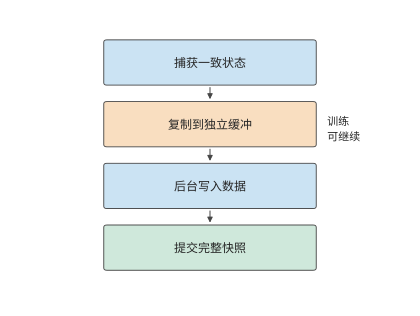

*图 10-32：捕获一致的训练状态，复制到独立缓冲后允许训练继续；后台写完数据并提交完整快照后，恢复程序才使用这份 checkpoint。箭头表示先后依赖。*

**例：checkpoint 上传速度如何决定故障后的重做量？** 取每份 112 GB 的快照。DGX SuperPOD 参考架构按工作负载给出存储性能档次，NLP 训练对应 Good 档，一个 SU（32 台 DGX 组成的扩展单元）的存储合计写入为 7 GB/s；按此速率，一份快照要写 16 s。每 10 s 产生一份时，待写入数据的产生速率为 11.2 GB/s，队列持续增长。改为每 20 s 一份，平均需求降到 5.6 GB/s，存储能在下一份到达前写完上一份。

在第 20、40 s 捕获两份快照，各花 0.5 s 复制到缓冲区后上传，完成时刻为 36.5、56.5 s。若第 50 s 故障，第二份仍在上传，只能恢复到第 20 s，重做 30 s。换用 Better 档的 20 GB/s 合计写入，每份只需 5.6 s，两份分别在 26.1、46.1 s 完成；同一故障可恢复到第 40 s，只重做 10 s。

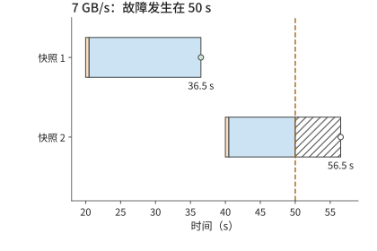

*图 10-33：两份 112 GB 快照以 7 GB/s 写入，各先花 0.5 s 复制到缓冲（橙色），随后上传（蓝色）。50 s 故障时第一份已提交，第二份尚未提交；斜线为无故障时剩余上传，空心点为原定提交时刻。*

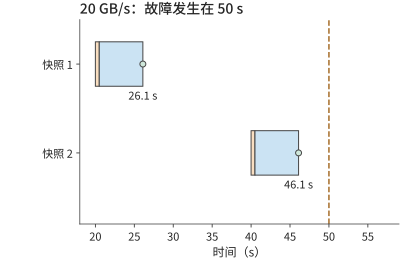

*图 10-34：相同快照以 20 GB/s 写入，于 26.1、46.1 s 提交。50 s 故障时可以恢复到 40 s 的训练状态，只需重做 10 s。*

两种方案的前台暂停都是两次 0.5 s，合计 1 s。写入更快，故障后就能恢复到更近的训练进度，少重做 20 s。异步保存的完成点因而直接影响长期进展，后台写入速度影响故障后的重做量，保存时暂停训练的时长则会延长正常运行时间。

写入数据文件之外，实际系统还要提交描述完整快照的元数据。一组 CPU 实验中，保存接口（API）的调用约 7 ms 就返回，恢复元数据约 48 ms 才提交；提交前终止进程，恢复程序选择上一份完整的 checkpoint。数据文件与提交记录共同构成可用快照，恢复程序据此判断哪一份 checkpoint 已经完整保存。[^fault]

### 10.4.4 故障规模、保存周期与有效训练进度

图 10-33 固定了两次保存的时刻，比较写入速度的影响。还可以改变保存间隔：间隔短，故障时离上一份快照更近；间隔长，正常训练时需要暂停保存的次数更少。这两项代价方向相反，因此存在一个折中点。

设每次同步保存耗时 $c$，保存之间完成 $\tau$ 秒有用训练，作业故障率为 $\lambda$，恢复耗时为 $r$。假设故障发生频率较低且彼此独立，在一阶模型下，单位有用训练时间的附加成本为

$$
L(\tau)=\frac{c}{\tau}+\lambda\frac{\tau}{2}+\lambda r.
$$

第一项来自每隔 $\tau$ 保存一次。故障落在两次保存之间的任意位置，平均丢失半个间隔，得到第二项。第三项是单位有用训练时间内的预期恢复次数乘以每次恢复时间。前两项一减一增，最优点满足

$$
-\frac{c}{\tau^2}+\frac{\lambda}{2}=0,
\qquad \tau^*=\sqrt{\frac{2c}{\lambda}}.
$$

**例：卡数与故障率如何决定 checkpoint 保存间隔？** Meta 统计了研究集群上的训练作业：1024 卡作业平均 7.9 小时中断一次，而且中断率与卡数成正比，相当于每卡平均约 337 天出一次故障。任一卡故障均中断作业。约 115 GB 的 checkpoint 以 7 GB/s 保存，$c\approx16.4$ s。设恢复需 120 s，代入得到最优间隔约 965 s，即约 16 分钟。[^interval]

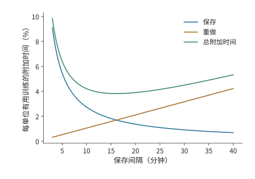

*图 10-35：蓝线为保存耗时占比，橙线为故障重做耗时占比，绿线为两者加上恢复耗时后的合计。使用 1024 卡作业平均 7.9 小时中断一次、保存约 16.4 s 和恢复 120 s 的一阶模型。最低点出现在两项随间隔变化的代价相互平衡处。*

图 10-35 中的最低点较平缓，配置时可以选择附近便于使用的间隔。下表比较五、十五和三十分钟，观察偏离最低点后增加的是哪一项成本。

| 有用训练间隔 | 保存成本 | 重做成本 | 恢复成本 | 合计 |
|---|---:|---:|---:|---:|
| 300 s | 5.5% | 0.5% | 0.4% | 6.4% |
| 900 s | 1.8% | 1.6% | 0.4% | 3.8% |
| 1800 s | 0.9% | 3.2% | 0.4% | 4.5% |

将保存间隔从五分钟延长到十五分钟，节省的保存时间多于新增的重做时间；继续延长到三十分钟，新增的重做时间就超过了节省的保存时间。表中合计由未经四舍五入的数值计算。卡数翻倍会使故障率翻倍，最优间隔缩短为原来的 $1/\sqrt2$；保存速度翻倍也使最优间隔按同样比例缩短，因为每次保存耗时更短。

本章设计案例使用的卡数较少，沿用每卡平均约 337 天故障一次（单卡平均故障间隔，MTBF）、恢复耗时 120 s 和保存耗时约 16.4 s 的条件，取有用训练间隔 1800 s。32 卡的保存、重做与恢复合计约增加 1.02% 时间，48 卡约增加 1.08%。48 卡方案被卡故障中断的概率更高，但附加比例只多约 0.06 个百分点，远小于缩短单卡计算时间带来的收益。容量、每步训练时间和长期附加成本至此齐备，第 10.6 节将汇总计算完成时间。

### 10.4.5 掉队者与慢节点

上一节的模型把故障当作中断作业的事件。还有一类更频繁的退化不会中断作业：某张卡在某一步算得慢。同步数据并行的每一步要等最慢的那张卡算完，这张拖慢整步的卡称为**掉队者**（straggler），步时间因此由各卡的最大值而不是均值决定。设各卡计算时间独立同分布，均值为 $\mu$、标准差为 $\sigma$，$N$ 张卡时步时间的计算部分是 $N$ 个样本的最大值。取 $\mu=52.2$ s（48 卡方案的单卡计算时间）与每步 0.58 s 的通信与输入等待，$\sigma$ 分别取均值的 2%（1.04 s）与 5%（2.61 s）。[^straggler]

$N$ 个独立正态样本最大值的期望为 $\mu$ 加上若干倍 $\sigma$：$N=8,48,1024$ 时分别约为 1.42、2.23、3.25 倍。代入即得每步的期望耗时：

| 卡数 | $E[\max]-\mu$（倍 $\sigma$） | 每步，$\sigma=2\%$ / s | 每步，$\sigma=5\%$ / s |
|---|---:|---:|---:|
| 8 | 1.42 | 54.3 | 56.5 |
| 48 | 2.23 | 55.1 | 58.6 |
| 1024 | 3.25 | 56.2 | 61.3 |

无波动时每步约为 $52.2+0.58\approx52.8$ s。卡数越多，最大值的期望越大：48 卡、$\sigma=5\%$ 时每步多约 5.8 s，占去第 10.6 节约 14.4 s 余量的四成；1024 卡时多约 8.5 s。慢卡可以从通信等待中检测出来：每张卡在梯度桶 AllReduce 上的等待，等于步结束时刻减去自己的计算结束时刻；对计算耗时恰为均值的卡，这段等待的期望正是 $E[\max]-\mu$。[^straggler]

发现慢卡以后有三种响应：等待、重分配和驱逐。**等待**：本步按慢卡时间结束。一张慢到 $\mu+3\sigma$ 的卡让其余各卡多等的时间，取决于其余 $N-1$ 张卡的最大值本来有多大：$\sigma=2\%$ 时，8 卡多等约 $1.65\sigma$（1.72 s），48 卡多等约 $0.78\sigma$（0.81 s），1024 卡时其余卡的最大值本身已超过 $\mu+3\sigma$，多等的时间为零。**重分配**：把慢卡的工作均匀摊给其余 $N-1$ 张卡，均值变为 $\mu N/(N-1)$。仍取 $\sigma=2\%$、不计迁移成本，48 卡每步约 56.2 s，8 卡升到约 61.6 s，都高于同一 $\sigma$ 下等待的期望步时间 55.1 s 与 54.3 s：摊派让每张卡多做 $1/(N-1)$ 的工作，这份增量超过了一张慢卡带来的等待，卡越少差距越大。**驱逐**：把慢卡移出作业，从上一个 checkpoint 重启，代价为期望丢失工作 $\tau/2$ 加恢复时间 $r$。这里取比设计案例的 1800 s 更短的保存间隔 $\tau=600$ s，$r=120$ s，代价为 420 s，按 48 卡方案每步 52.8 s 计约为八步。一次 $\mu+3\sigma$ 的抖动只损失几秒，只有慢卡持续多步时驱逐才值得。实际集群中确实存在慢卡：MegaScale 报告约 0.5% 的机器明显变慢；第 10.4.4 节的 Meta 集群统计则给出作业规模与中断的关系——1024 卡作业的平均无故障时间为 7.9 小时，8 卡作业为 47.7 天。[^straggler]

除硬件故障外，还有一种事件需要回滚 checkpoint：第 10.1.2 节的损失尖峰。损失尖峰不损坏硬件，处理方式却相同，都是丢弃当前参数、回到上一份快照，对保存周期的影响也与硬件故障相同。把损失尖峰导致的回滚看作整个作业同时受到的冲击，平均每隔 $1/\lambda_{\mathrm{spike}}$ 发生一次，上一节的一阶模型修正为

$$
L(\tau)=\frac{c}{\tau}+(\lambda_{\mathrm{hw}}+\lambda_{\mathrm{spike}})\left(\frac{\tau}{2}+r\right),
\qquad \tau^*=\sqrt{\frac{2c}{\lambda_{\mathrm{hw}}+\lambda_{\mathrm{spike}}}}.
$$

沿用 48 卡的硬件故障率（每卡 MTBF 约 337 天），设损失尖峰平均七天导致一次回滚：同样取 $\tau=600$ s 时，附加比例从 2.80% 升到 2.87%，最优保存周期从约 4,458 s 缩到约 3,150 s。本章设计案例的 1800 s 间隔处，附加比例从 1.08% 变为约 1.25%，完成时间增加约 0.03 天，不改变第 10.6 节的方案选择。翻转条件由两个发生率的相对大小给出：尖峰越频繁，最优周期越短，$\lambda_{\mathrm{spike}}\gg\lambda_{\mathrm{hw}}$ 时保存周期几乎只由数值稳定性决定；回滚间隔以月计时，对 1.08% 的附加比例几乎没有影响。[^straggler]

## 10.5 强化学习训练

前四节假定训练数据已经给定。RL 让模型参与产生下一批数据：模型生成轨迹，系统计算奖励或验证结果，再将轨迹用于训练，更新后的权重又改变下一轮生成。系统由处理固定数据的训练流水变成反馈循环，新的问题集中在各阶段的处理速度、切换时的状态重叠，以及样本究竟由哪一版策略产生。生成轨迹的推理端与计算损失的训练端还必须对同一条轨迹给出可对齐的概率，这就是本节的**训推一致性**。训推一致性直接影响参数更新是否遵循算法预期，也约束阶段加速与异步执行的收益。

### 10.5.1 一轮回答生成、验证与参数更新

一轮反馈循环的完成过程如下。从四条提示词（prompt）出发，每题生成两条回答，得到八条轨迹。奖励描述这些回答的结果，优势值衡量回答比所选基准好多少，用来确定调整回答概率的方向和幅度。训练端按有效 token 构造损失并完成一次参数更新。新权重交给生成端后，下一轮样本来自更新后的策略。生成、奖励与学习分别使用不同形式的数据，样本标识将三者连接起来。

这里的数据来源与通常采用固定数据集的 SFT 不同。SFT 在给定答案的真实前缀上预测下一个 token，即教师强制；部署时模型则根据自己生成的前缀继续回答。一旦前面生成错误，后续就可能进入训练数据较少覆盖的上下文，误差随生成累积。这种训练与使用时的前缀分布偏移，是固定数据 SFT 的局限之一。梯度仍可以正确对应当前损失，但训练覆盖的情境与模型实际遇到的情境不同。

针对这种前缀分布偏移，OPD 让当前学生模型自己生成轨迹，再由教师针对学生实际生成的前缀提供监督，例如下一 token 的概率分布。学生因而能在自己容易出错的位置学习，减少前缀分布偏移；教师的逐 token 反馈也提供了比单个终局奖励更细的学习信号。DeepSeek V4 用多教师 OPD 将领域专家的能力合入统一模型，第 3 章已把教师前向列为一项独立的计算工作。[^opd]

与固定数据的 SFT 相比，OPD 的潜在优势在于：达到目标能力所需的学习样本或更新次数可能减少。它同时增加学生在线生成、教师前向与权重同步的成本，是否减少总 GPU 小时或完成时间仍要实测。SFT 描述的是监督目标，离线（offline）描述的是数据是否预先固定；也可以在线收集数据后使用监督损失。在线（online）表示数据随训练过程持续产生，on-policy 则进一步要求采样分布与所优化的策略一致。异步的在线 RL 可能使用滞后的策略，OPD 也会遇到生成引擎与训练引擎的计算差异。因此，在线采样用于缓解数据分布偏移，而训推一致性还需要对齐生成与训练两端的计算过程。

回到本节开头那一轮的八条轨迹，考察训练端如何按有效 token 构造损失。第 10.3.1 节的八条回答例子来自一次小模型实验的回答长度：回答中的有效 token 共 20 个，包含表示序列结束的 EOS token；输入计算的有效 token 共 366。提示词和回答都参与前向计算，损失则按选中的回答 token 归一化。因此，生成长度影响计算成本；损失掩码（mask）标明每个 token 是否计入损失，决定哪些 token 参与梯度计算。两者的作用不同。[^verl]

损失之外，同一提示词下的相对奖励还决定优势。例如两条回答奖励均为 1，减去组内均值后都为零；奖励变为 1、0，中心化后为 0.5、−0.5，策略才获得区分两条回答的方向。系统即使完成了前向、反向和优化器调用，也可能遇到第一种优势全为零的 batch。统计训练吞吐量时，应计算每秒实际用于训练的轨迹或 token 数；模型能力是否提高，则用固定的评估任务检验。

> **案例：参数发生变化，模型能力为何没有提高？** 一次固定的小模型实验用强化学习训练框架 verl 和推理引擎 vLLM 协作运行：算术题的精确匹配奖励让同组回答得到相同的奖励，优势和策略梯度都为零，参数变化只来自 AdamW 的权重衰减。AdamW 在 Adam 的梯度更新之外，单独按比例缩小权重；即使当前策略梯度为零，这一步也能改变参数。改用固定符号奖励后，两步训练都出现了非零梯度与权重更新，但算术验证只有 2/4 正确。奖励构造决定学习方向，系统执行负责把这一方向一致地应用到参数。[^verl]

### 10.5.2 各阶段的资源分配与权重同步

明确了样本如何形成梯度以后，才能讨论每秒能训练多少样本。RL 的反馈阶段可能执行规则验证或奖励模型（为回答打分的模型），OPD 则需要教师给出监督；两者都应按实际反馈工作的处理能力分配资源。生成、验证和学习像前后相接的三道工序，前一道做得更快，只有后一道能够消化，才会增加最终产出。先把三者的处理能力换算成同一种工作单位。设三者分别为 $r_g,r_v,r_l$，验证后符合策略版本要求的比例为 $q$，在独立资源上稳定流水执行时，每秒可用于训练的样本数上限为

$$
r_{\mathrm{effective}}=\min\left(r_l,q\min(r_g,r_v)\right).
$$

**例：RL 生成、验证与学习三个阶段中，应优先扩容哪一个？** 生成每秒提供 12 条等长轨迹，验证处理六条，学习阶段处理八条；验证后四分之一因版本过旧被丢弃。每秒进入学习的只有 $6\times0.75=4.5$ 条。生成翻倍到 24 条/s，验证瓶颈仍将进入学习的样本限制在 4.5 条/s；验证翻倍到 12 条/s，每秒可送往训练端的轨迹达到九条，此时训练端每秒只能处理八条，成为整个流水线的瓶颈。因此，应把新增资源分配给当前最慢的阶段；该阶段加速后，再判断瓶颈转移到了哪里。

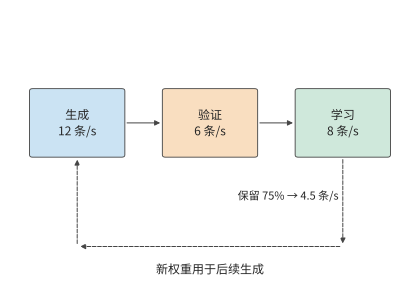

*图 10-36：三阶段分别最多处理 12、6、8 条等长轨迹/s。验证后保留 75%，所以只有 4.5 条/s 进入学习。返回箭头表示学习产生的新权重影响后续生成；其同步耗时在后面的阶段切换与异步算例中展开。*

图 10-36 先把三道工序画在各自独立的资源上。若改用同一组卡轮流执行，就能减少所需的卡数，但生成和学习之间要切换整套显存里的数据。

**共享加速器**让同一组卡轮流训练和生成，节省重复资源；**独立部署**让两侧独立执行，获得重叠机会，但要在两组卡之间发送权重。共享加速器的关键成本发生在切换：旧状态尚未释放，新状态已经开始加载，两个阶段各自运行时显存都足够，切换时却可能因两套数据同时占用显存而超出容量。

设共享的卡为 H100 SXM，标称 80 GB，约合 74.5 GiB。训练状态占用显存 40 GiB，生成需要约 15.3 GiB BF16 权重与 24 GiB KV 缓存池，另有两阶段共用开销 4 GiB。训练独占时 44 GiB，生成独占时约 43.3 GiB，都低于 74.5 GiB。先恢复生成权重和 KV，再释放训练状态，峰值为 $40+15.3+24+4\approx83.3$ GiB，超出一张 H100 的容量。

改变次序，先加载生成所需的权重，暂不分配 KV，峰值为 $40+15.3+4\approx59.3$ GiB。随后释放 40 GiB 训练状态，显存占用降为约 19.3 GiB，再分配 KV，进入约 43.3 GiB 的生成状态。两条路径最终状态相同，峰值差 24 GiB，恰好是一份 KV 池。[^handoff]

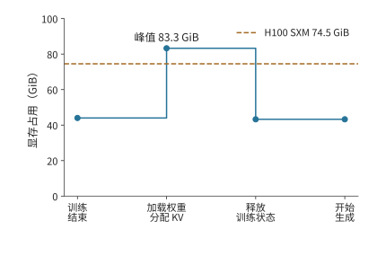

*图 10-37：先加载生成权重并分配 KV 池，再释放训练状态，峰值约为 83.3 GiB，超过 H100 SXM 的 74.5 GiB。横轴按操作顺序排列。*

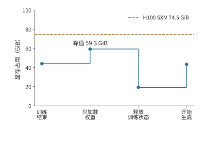

*图 10-38：先加载生成权重，再释放训练状态，最后分配 KV 池。峰值降为约 59.3 GiB；两图共用 74.5 GiB 容量线和同一纵轴。*

独立部署的代价则由权重发送范围决定。Qwen3-235B-A22B 的 BF16 专家权重为 423 GiB，采用 16 路专家并行（EP16）时，每个接收方只需要约 26.4 GiB。逐一向 16 个接收方发送完整专家集合，共发送 $16\times423=6768$ GiB；按各自的分片发送，合计为 423 GiB。先确定每个接收方需要的参数分片，再组织分发，可以同时减少接收缓冲和发送方的发送量。

这里再次用到了本章的两种分析方法：共享加速器时要分析张量的生命周期，独立部署时要分析数据传输和各阶段的处理时间。阶段独立以后，还会产生策略版本差异，下一小节将分析这种版本差异如何影响可用于训练的样本数量。

权重同步中还有一类生命周期不同的权重：第 4.7.3 节的固定权重加速器可以运行 RL 流程中权重长期不变的模型。例如，算法采用固定参考模型时，其权重能够留在专用存储中反复读取；持续更新的策略模型则使用可写权重存储，并将新版本发布给生成端。图 10-39 按这两种生命周期画出权重路径。

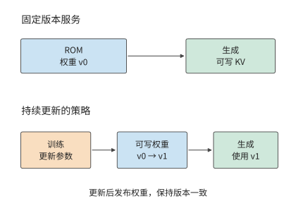

*图 10-39：固定版本服务与策略训练的权重生命周期。上方 ROM 重复提供同一版本；下方训练产生新版本并发布给生成端。KV 写入与权重更新使用不同的数据通路。*

### 10.5.3 异步训练、策略版本与长轨迹恢复

第 10.5.2 节的独立部署进一步允许不同 batch 交错进行：学习端处理上一批样本时，生成端已经开始生成下一批。同步循环则等待学习和权重同步完成，再产生下一批样本。异步循环让生成与学习重叠，生成端可能仍在使用旧权重。为计算样本对当前参数更新的贡献，需要保留实际采样策略的概率。

权重更新后，模型给出的策略随之变化。下面沿样本流转顺序区分三个策略版本。

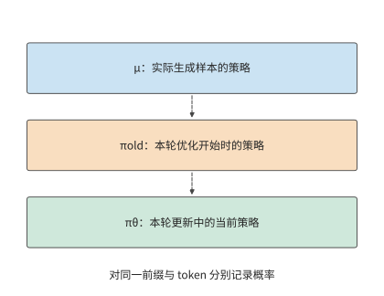

*图 10-40：μ 产生训练样本，πold 标识本轮优化的起点，πθ 随本轮更新变化。虚线表示版本演进顺序。三个概率必须针对同一前缀与同一 token 计算。*

令实际行为分布为 $\mu$，本轮优化的起点策略为 $\pi_{\mathrm{old}}$，当前优化策略为 $\pi_\theta$。起点策略随优化轮次更新，用 KL 散度做正则时所用的参考模型则保持固定。对同一 token 和前缀，在三个概率有定义且分母非零的位置，概率比满足

$$
\frac{\pi_\theta}{\mu}
=\frac{\pi_\theta}{\pi_{\mathrm{old}}}
\frac{\pi_{\mathrm{old}}}{\mu}.
$$

右边第一项描述本轮参数优化带来的概率变化，第二项描述实际采样分布与本轮起点策略之间的差异，其中既可能有策略版本滞后，也可能有采样配置或跨引擎计算差异。若行为策略和当前策略对该 token 给出的对数概率（logprob）都为 $-3$，总比值为 1；若误用重新计算得到的对数概率代替行为策略原先记录的值，将它写成 $-3.25$，比值就变为 $\exp(0.25)\approx1.28$。参数没有变化，样本权重却增加了约 28%。保留行为概率，训练端才能区分策略变化与计算差异。[^identity]

即使每轮都先同步权重，第二项也未必等于 1。生成端通常逐 token decode 并读取 KV 缓存，训练端则把整段轨迹并行输入，重算各 token 位置的概率后再反向传播。不同的注意力实现、归约次序、batch 形状、权重或 KV 精度，都可能让相同权重、相同前缀下的 logprob 不同。第 5.2.4 节已经测量过其中一项：同一行输入按不同段数做归约，平方和相差 166 个 ULP，而切成几段又取决于当时的 batch 大小。两端最先出现差异的是前向计算；反向会把训练前向构造出的损失差异传入梯度。MoE 的离散路由还会放大这种差异，下一小节将展开。

第二项中还有一部分来自采样配置：行为概率按实际采样规则计算。温度缩放、top-k 或 top-p 截断会改变模型原始 Softmax 分布，因此应保存变换后的概率及采样配置。训练端用对应的分词、对话模板、位置编号、注意力掩码和 EOS／截断位置重建输入，才能对同一事件计算概率比。

在近端策略优化（PPO）一类更新中，概率比决定优势对梯度的权重，也参与裁剪判断：概率比偏离 1 超过设定范围时，裁剪截断它对梯度的贡献。若把实现差异误认为参数更新，样本的贡献就可能被错误地放大或压低，也可能错误地触发裁剪；若使用序列概率比，各 token 位置的 logprob 之差还会相加。因此，较长轨迹会积累更多概率偏差，使更新更容易波动。[^identity]

重要性加权用概率比调整已采样事件的贡献，因此采样分布必须覆盖目标事件。截断采样排除的 token 无法通过已有样本的概率比补回；分布差异过大时，权重方差也会增大。裁剪可以限制极端权重，但会引入偏差，而且分别裁剪两个因子与裁剪总比值会产生不同的损失。异步执行会增加策略版本的时间差，下面将可用样本比例与执行周期一起计入收益。

**例：异步流水能承受多高的过期样本丢弃率？** 每批生成 40 s、学习 16 s、阻塞两侧的权重同步 4 s，同步周期为 60 s。设生成和学习使用独立资源，权重同步仍独占 4 s，则异步稳态周期为 $\max(40,16)+4=44$ s。

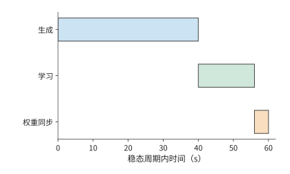

*图 10-41：同步循环依次生成本批样本、学习本批样本、同步权重，分别用时 40、16、4 s，共 60 s。*

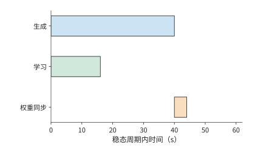

*图 10-42：稳态中生成下一批与学习上一批在独立资源上重叠；两者完成后同步权重，周期为 44 s。橙色同步阶段阻塞两侧。*

从图 10-41 的同步执行改为图 10-42 的异步执行后，减少的是学习端与生成端轮流等待的时间。但生成得更早也意味着样本可能使用较旧的权重，因此还要扣除被丢弃的样本。

若每批原有 $B$ 条等效轨迹，异步执行后，其中比例为 $q$ 的轨迹保留下来用于训练，则同步和异步执行的有效样本吞吐量分别为 $B/60$、$qB/44$。异步更快要求

$$
q>44/60=11/15\approx73.3\%.
$$

当 $q=0.8$ 时，有效样本吞吐量提高约 9%；当 $q=0.7$ 时，虽然每批更早结束，有效样本吞吐量反而减少约 5%。因此，计算异步执行的收益时，还要减去因策略版本过旧而被丢弃的样本。

图中的生成阶段画成了一段连续的工作。轨迹越长，这一段越容易跨过参数更新或遇到中断，于是除了筛选完成的样本，还要考虑尚未完成的轨迹如何继续。长轨迹也会延长生成样本与使用样本训练之间的时间差。KV 是给定权重对前缀执行的结果：使用相同权重恢复时，可继续使用已保存的 KV，换权重后则需重新执行前缀来生成对应 KV。Qwen3-8B 的 8K BF16 KV 占 1.125 GiB，保存和取回 KV 缓存需要存储空间与传输时间，重建 KV 缓存则需要重新执行 prefill 计算。恢复方案据此比较取回时间与重建时间。

若总是丢弃中断轨迹并重新采样，长轨迹因执行时间更长而更容易被丢弃。设生成期间的中断率为 $\lambda$，持续 $t$ 的轨迹能不受中断、完整生成的概率为 $e^{-\lambda t}$；随着 $t$ 增长，进入学习的数据比例下降。逐 token 记录生成进度和策略版本，可以在恢复后继续生成同一条轨迹，减少这种由系统中断引入的长度偏移。跨角色资源恢复在下一章展开。

让训练与部署使用同一条路径的做法，在实际模型中已经出现。DeepSeek V4.1 把部署时的稀疏访问与恢复方式纳入训练。稀疏注意力从训练之初就使用 64K 序列，后训练加入层级候选限制，使训练和推理使用相同搜索域；量化感知训练（训练时模拟低精度量化的误差）让模型适应 FP4 的主 KV；只重放有限长度的输入来重建解码器 SWA 状态，这一过程也在后训练中模拟。模型由此学习使用部署路径实际提供的表示与局部状态。[^v41-case]

### 10.5.4 专家路由重放与训推一致性

MoE 把第 10.5.3 节的数值差异进一步变成离散的路径差异：即使权重相同，生成端与训练端的数值计算差异也可能改变专家选择。由于专家选择是离散的，小幅数值变化就可能让 token 进入另一条计算路径。以选择分数最高的两个专家（top-2）为例，前三个专家分数为 0.500、0.301、0.300 时，选择专家 1、2；第三个分数因计算次序变为 0.302，便改为专家 1、3。很小的分数变化就可能让计算改用另一个专家的权重矩阵，影响可以沿后续层继续传播。

**路由重放**（Routing Replay）记录生成时选中的逻辑专家 ID，训练时按这些 ID 选择专家，再用当前权重计算路由分数、专家输出和梯度。样本、token 位置和层号共同定位这一份记录。这样，生成与训练经过相同的离散专家路径，而数值计算继续反映当前参数。

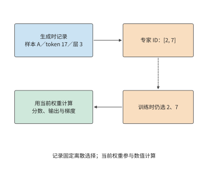

*图 10-43：离散专家 ID 连接生成端与训练端，当前权重继续参与数值计算。示意记录为样本 A、token 17、层 3 的 top-2 选择；虚线表示 ID 重放，实线表示当前计算数据流。*

先计算这份记录占多大空间。Qwen3-30B-A3B 的 48 层各记录分数最高的八个专家（top-8）的编号。对 8,192 个 token，以每个整数占 2 字节的无符号整数格式 uint16 保存每个专家 ID，大小为

$$
8192\times48\times8\times2=6\ \mathrm{MiB}.
$$

使用每个整数占 4 字节的 int32 格式则为 12 MiB。记录还要随 token 一起移动：序列打包改变 token 的位置，上下文切分改变 token 所在的卡，重计算再次读取同一层的记录。让 ID 与 token 的原始位置共同经过这些变换，训练端才能选中原先那组专家。[^replay]

> **案例：路由重放对概率误差、训练耗时与奖励的影响。** NVIDIA 公布的路由重放（R3，即 Rollout Routing Replay）验证报告有四组开关对照，各训练 100 步，开启后日志中记录的对数概率误差中位数均下降，每步总耗时中位数略长，训练奖励没有一致提高。重放减少了路由差异，但保存记录和执行重放也增加了耗时。比较两种方案时，分别观察概率误差、训练时间和固定评估任务上的表现。[^replay]

同一份权重、同一批 token 下，生成端与训练端的 logprob 差异反映计算路径和采样定义的影响；MoE 的专家 ID 则标明离散路由是否一致。数值是否一致、采样策略滞后当前策略多少，由此共同影响有效训练样本数。

RL 把生成、环境验证和参数更新组织成一个完整的反馈过程。生成端提供采样概率与专家选择，训练端据此组织更新，资源调度再安排各阶段重叠。贯通这些信息，可以同时优化数据交接、执行一致性与资源利用。本节的异步周期和路由重放例子分别量化了节省的等待与增加的记录成本；整个反馈循环最终要用有效样本和训练进展评价。

## 10.6 从系统方案到完成期限与硬件选择

### 10.6.1 汇总容量、每步耗时、停顿与恢复

下面综合计算章首训练任务的完成时间。两套方案都处理 100B token，每步 384 条 8,192 个 token 的序列，共 31,790 次训练迭代。设每步训练时间 $t_s$ 已包含单卡计算、通信等待与输入等待，保存与恢复的附加时间比例为 $L$，计划性停顿为 $T_0$，则本章的一阶完成时间模型为

$$
T_{\mathrm{finish}}=T_0+\left\lceil\frac{D}{b}\right\rceil t_s(1+L).
$$

各项来自本章不同层次的分析：分析张量的生命周期，可以确认显存是否足够；分析关键路径，可以求得 $t_s$；checkpoint 模型给出 $L$；计划性停顿为 $T_0=5$ 天。将这些结果汇总，就能比较两套方案的完成时间；表中合计由未经四舍五入的数值计算。[^design]

| 设计项 | 32 卡方案 | 48 卡方案 |
|---|---:|---:|
| 八卡主机数 | 4 | 6 |
| 全组 ZeRO-3，每卡单序列累积次数 | 12 | 8 |
| 每卡预计显存占用 / GiB | 13.8 | 12.5 |
| 每卡可用显存 / GiB | 22 | 22 |
| 每步单卡计算 / s | 78.3 | 52.2 |
| 每步 ZeRO-3 链路时间（PCIe 4.0 x16）/ s | 17.9 | 12.0 |
| 每步通信等待 / s | 0.08 | 0.08 |
| 每步等待输入数据的时间 / s | 0.5 | 0.5 |
| 每步训练时间（含 0.5 s 输入等待）/ s | 78.9 | 52.8 |
| 保存、重做与恢复附加时间 | 1.02% | 1.08% |
| 基础训练时间 / 天 | 29.0 | 19.4 |
| 加入保存恢复和 5 天预留 / 天 | 34.3 | 24.6 |

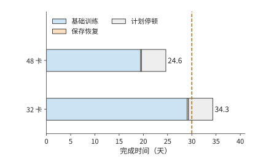

*图 10-44：每条横条依次累计基础训练时间、保存与故障恢复的附加时间，以及预留的 5 天计划性停顿。基础训练时间已经包括通信和输入等待；橙色小段为 checkpoint 模型得到的额外耗时。两套方案使用相同任务和全局 batch，虚线标出 30 天期限。*

图 10-44 中，两套方案的计划停顿相同，保存与恢复也只占很小一段。主要差别在蓝色的基础训练时间：48 卡把 micro-batch 分给更多的卡并行处理，显著缩短了这一段。

**在这组设计条件下，选择 48 卡方案。** 两者都满足容量要求；32 卡方案完成时间超过 30 天，予以排除；48 卡约 24.6 天完成，剩余约 5.4 天。增加卡数的主要价值是减少每卡承担的训练工作，额外故障成本只抵消很小一部分收益。

### 10.6.2 4090 集群的可行范围

图 10-44 给出了约 5.4 天的剩余时间。将这部分余量分摊回每次迭代，就能知道每步还允许增加多少等待，也就得到了可用于实际调优的性能目标。48 卡的每步训练时间必须满足

$$
t_s\le\frac{25\times86400}{31\,790\times(1+0.0108)}\approx67.2\ \mathrm{s}.
$$

本方案为约 52.8 s，余量约 14.4 s/步。固定单卡计算时间约 52.2 s、输入等待 0.5 s，则总通信等待最多约 14.5 s；按第 10.3.3 节的重叠分析，当前只有约 0.08 s。即使预取完全失效，12.0 s 的链路时间全部暴露，每步约 64.8 s，仍在上限之内。

32 卡则需要提高单卡计算效率。扣除恢复、0.08 s 通信和 0.5 s 输入后，可留给单卡计算约 66.7 s，而 40% 效率下需要约 78.3 s。相同工作量要求单卡计算效率提高到约 $40\%\times78.3/66.7\approx47\%$，已高于 Llama 3 报告的最高 43%。于是，两条改进路线可以直接比较：增加两台主机，或者在原有的卡上把单卡计算效率从 40% 提高到约 47%。

通信预算还要落实到物理接口。第 10.3.3 节的 12.0 s 链路时间以每卡一张 200 Gbit/s 网卡为前提。若一台主机的八张卡只共用一张 200 Gbit/s 网卡，环形集合通信进出这台主机的那条边要承载每卡的全部收发量（第 7 章例题 7.1 的割集），48 卡每步约 385 GB 都要经过这张 25 GB/s 的网卡，链路时间约 15.4 s，超过 14.5 s 的通信上限。每个 micro-batch 的链路时间约 1.92 s，仍短于 6.53 s 的计算，预取有效时暴露的仍只有首尾两次通信；预取一旦失效，每步约 68.1 s，方案超期。每卡配一张网卡时，12.0 s 即使全部暴露也在上限以内。两种配置的差别在于：共用网卡把按期完成押在重叠上，每卡一张网卡则不依赖重叠。

这样，性能目标就对应到了具体的执行过程：每步最多允许 67.2 s，其中计算约需 52.2 s，其余时间留给通信和输入等待。调优时首先缩短超出预算的那段关键路径，如果显存已经足以保存所需张量，就不必再为节省显存而增加额外工作。

### 10.6.3 替换硬件后的瓶颈与选择

更换加速器时，可以继续沿用上一小节的预算，判断计算变快会缩短哪一段，带宽变小又会延长哪一段。新的加速器会同时改变单卡计算、容量和互联。将原有每步耗时分成计算、通信等待等部分，可以判断某项硬件变化有多大价值。设某资源占原每步耗时比例为 $f$，处理能力改为原来的 $r$ 倍，保持其他执行和依赖不变，则

$$
\frac{T'}{T}=1-f+\frac{f}{r}.
$$

这就是根据各项耗时的比例应用 Amdahl 定律。原来 100 ms 中只有 5 ms 通信等待，带宽减半后变为 $95+10=105$ ms；若原来通信占 50 ms，同样减半后为 $50+100=150$ ms。前一个任务的耗时增加 5%，后一个增加 50%，因为等待该资源的原有时间占比相差十倍。

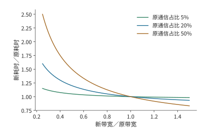

*图 10-45：资源能力变化的收益由原有等待时间占比决定。曲线按 $T'/T=1-f+f/r$ 计算，固定单卡计算与依赖，通信时间与有效能力成反比。*

在本章的 48 卡方案中，暴露的通信只有约 0.08 s，约占每步的 0.14%。PCIe 带宽减半时，每个 micro-batch 的链路时间升到约 3.0 s，仍短于 6.53 s 的计算，暴露部分翻倍到约 0.15 s，每步从约 52.8 s 增到 52.9 s，几乎不变。若单卡计算效率从 40% 降到 30%，单卡计算时间变为约 69.6 s，加上通信与输入约为 70.2 s，超过 67.2 s 的目标。对这套方案而言，决定能否按期完成的是单卡计算效率；带宽只有在预取失效、通信整段暴露时，才成为式中比例 $f$ 较大的那一项。

比较 A100、A800、H20 或其他加速器时，可将其单卡计算时间、接口传输时间和容量代入同样的分析。满足期限的方案再比较加速器租用、能源和准备成本。更强的单项指标是否值得购买，取决于它能减少多少完成时间或卡数。

### 10.6.4 模型规模、数据量与期限的敏感性

前几节保持模型不变，比较了卡数和加速器型号。最后把同一方法扩展到模型规模，考察模型放大后计算量的增长。采用稠密模型的粗略计算量公式 $F=6ND$，固定数据量 $D=20$T token、40% MFU 和可用于执行的期限 $T$，满足期限所需卡数为

$$
p\ge\left\lceil\frac{6ND}{P\eta T}\right\rceil.
$$

图 10-46 把 90 天期限画成卡数边界。选择某个模型规模后，边界上方的计算资源能够在该效率下完成工作，边界下方需要提高效率或延长期限。

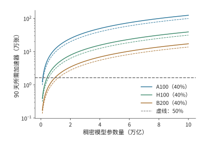

*图 10-46：固定 90 天执行期限，稠密模型规模增大要求更多的卡。数据量为 20T token，算法工作为 $6ND$，实线的 MFU 为 40%，虚线为 50%，使用 BF16 稠密矩阵峰值。各线为向上取整前的连续计算边界；横线标出 16,384 张卡。*

对 1T 参数，16,384 张 A100、H100、B200 在 40% MFU 下分别约需 679、214、94 天。90 天执行预算下，三者都落在计算边界下方：B200 也超出约 4 天，需增至约 17,147 张。只有 MFU 达到 50% 时，B200 才降到约 75 天，落进期限，余下约 15 天可分配给计划停顿与恢复。MFU 相差 10 个百分点，就决定了 16,384 张 B200 能否在 90 天内训练完 1T 模型。[^scale]

固定数据量时，模型参数量增至五倍，计算量也增至五倍；若数据量同时取 $D=20N$，则 $F=120N^2$，参数量增至五倍，计算量就增至 25 倍。规模问题的答案由模型和数据共同决定。MoE 则分开计算全部可训练参数的状态与被激活路径的执行工作，再将专家交换放入关键路径。

设计完成以后，还要检验长期执行是否达到预期。公开训练日志提供长期执行的观察窗口。若从 checkpoint 继续训练，本次新增 token 等于结束累计值减去恢复起点累计值；用新增工作除以本次时间，得到对应的长期速率。该速率可以直接检验整套系统能否保持设计中的有效训练进度。[^public]

回看全章，图 10-10 至图 10-14 解释了数据如何占用显存和经过链路；图 10-17 至图 10-35 说明这些操作如何形成等待、又如何影响长期训练；图 10-44 则把各项耗时汇成了章首任务的完成时间。状态安排、执行顺序和恢复方式由此连成了同一个设计问题。RL 将工作来源改为反馈循环，仍通过同一方法比较资源和有效训练进度。下一章进一步讨论这些作业与阶段如何共享资源池。

## 常见误区

**误区：分片数翻倍，训练显存峰值就减半。** 分片只直接缩小分给各卡的常驻训练状态。小模型例中常驻训练状态从 18 MiB 减到 9 MiB，执行期间的其他张量和缓冲区仍占约 21 MiB，峰值从 39 MiB 减到 30 MiB。决定容量需求的是同一时刻的总显存占用。

**误区：通信处理时间更短，训练步耗时就更短。** 三个小桶的总处理时间约 4.59 ms，比整桶 4.55 ms 更长，却可以分别利用三个计算空闲时段完成传输。通信完成的时刻决定它是否延长训练步。

**误区：异步保存调用返回，就能恢复全部已有进度。** 50 s 故障时，可用恢复点取决于哪份快照已经提交。相同的 1 s 前台暂停可以对应 30 s 或 10 s 重做，区别来自后台写入的完成时刻。

**误区：提高生成吞吐率，就能加快 RL 学习。** 生成 12 条/s、验证六条/s、样本保留比例 75% 时，学习端每秒只能收到 4.5 条轨迹。增加生成资源无法消除验证阶段的瓶颈，提高验证能力才会把限制移到训练端。

**误区：卡数翻倍且 batch size 随卡数放大，完成时间就减半。** batch size 超过临界 batch size 后，达到同一损失所需的步数不再明显减少。噪声尺度为二百万个 token 时，每步 batch size 从 315 万放大到约一亿个 token（1536 卡），完成时间只从 19.4 天降到 12.1 天，加速上限为 1.64 倍。batch size 放大受梯度噪声尺度限制；保持 batch size 不变、只增加卡数的强扩展才不受它限制。

## 习题与实验

以下十题按基础计算、机制分析和综合设计递进。计算题所需条件均在正文中；实验部分使用配套记录或自行测量的数据完成。

> **习题 10-1 · 基础：训练状态分片与每卡峰值内存**
>
> 将本章梯度改为 FP32，计算 Qwen3-8B 常驻训练状态。再求八卡 ZeRO-1、ZeRO-2、ZeRO-3 的每卡容量。设执行中有 6 GiB 激活和两份各 3 GiB 的模块缓冲，分别计算两份缓冲同时占用显存与顺序复用时的峰值。

> **习题 10-2 · 基础：按期完成训练需要多高的单卡计算效率**
>
> 采用本章的训练任务，将全局 batch size 设为 384 条序列，计算 30 天和 25 天对应的每步预算。给定 32 卡，先按第 10.3.3 节求 ZeRO-3 每步的链路时间与暴露的通信等待，再加上 0.5 s 输入等待；先忽略恢复，求在 25 天内完成训练所需的最低单卡计算效率；再加入本章恢复成本。最后取梯度噪声尺度为二百万个 token，按第 10.1.1 节的关系式求弱扩展的加速上限，以及 96 卡和 1536 卡在弱扩展与强扩展下的完成时间；把噪声尺度改为两千万个 token 后重新计算上限。

> **习题 10-3 · 综合设计：在容量、期限与加速器成本之间选择训练方案**
>
> 比较 32 卡与 48 卡方案的训练完成时间，以及累计使用的 GPU·小时。将每步激活与临时缓冲区的峰值需求从 10 GiB 提高到 20 GiB，重新判断容量。若 BF16 权重副本改用第 10.1.2 节的 FP8 分块缩放格式保存，重算两套方案的每卡常驻状态与容量余量。若只能租用四台八卡主机，分别计算需要将任务量减少到多少、将期限延长到多久，或将计算效率提高到多少，才能完成训练。实验部分选一条路线实际测量，用测得的数值替换本章给定的参数。

> **习题 10-4 · 分析：micro-batch 数与激活重计算如何改变流水开销**
>
> 在四阶段、前向 10 ms、反向 20 ms 的模型中，求 1、4、8、16 个 micro-batch 的理想利用率。沿图 10-19 解释 93—95 ms 的等待来自哪项依赖。再对八个 micro-batch 比较交错式 1F1B（$v=2$）与零气泡调度（ZB-H1，$T_B=T_W$）：用正文的气泡公式分别计算气泡时间，对照事件模型给出的完成时间 298 ms 与 283 ms，并说明交错式为什么增加跨界传输次数。假设每层每个 micro-batch 的可重建乘积占 10 MiB，原方案中，四个 micro-batch 尚未执行反向传播，每个 micro-batch 都需要保留九层的这些乘积。改为每次只重建一层中一个 micro-batch 所需的乘积，使用后立即释放。计算新方案可以少保留多少数据，以及逐层串行重建所需的工作区大小；再讨论两层同时执行反向传播时工作区怎样变化。

> **习题 10-5 · 分析：数据准备进程暂停时，需要预取多少序列**
>
> 48 卡每步处理 384 条序列，每步训练时间约 52.8 s，四个数据准备进程每个每秒准备两条序列。若一个数据准备进程暂停 60 s，按训练端的平均消耗速率计算，求维持原训练速度至少需要预存多少条序列，以及四个准备进程全部恢复后，要多久才能把预取队列补回暂停前的数量。再按第 10.4.3 节 7 GB/s 的存储合计写入，求约 115 GB 的 checkpoint 不产生写入积压的最短保存间隔。

> **习题 10-6 · 分析：checkpoint 保存频率与故障重做成本**
>
> 根据本章的一阶近似模型推导最优保存周期，计算 1024 卡作业分别采用 300、900、1800 s 保存间隔时，保存 checkpoint 与故障重做造成的时间开销。加入每天一次、会同时影响全作业的共同中断，重新计算故障率和最优周期。再把平均七天一次的损失尖峰回滚作为同时影响全作业的冲击，加入 48 卡的模型，重算最优保存周期与 600 s 间隔处的附加时间比例。实验部分在提交前后分别注入故障，比较恢复位置与需要重做的工作。

> **习题 10-7 · 综合设计：RL 各阶段配比与有效样本吞吐**
>
> 设生成、验证与学习阶段的处理率分别为 12、6、8 条/s，验证后样本的保留比例为 75%，比较只将一个阶段能力翻倍的收益。另采用生成 40 s、学习 16 s、权重同步 4 s 的周期模型。设每批生成的样本数为同一个常数，分别计算异步执行后样本保留比例为 80% 和 70% 时的有效样本吞吐率，并与不丢弃样本的同步执行比较；结果可表示为每秒处理的 batch 比例。实验部分追踪一批样本的标识、奖励、有效损失位置和接收方的权重。

> **习题 10-8 · 分析：路由记录与样本对应关系**
>
> 设序列含 8K token，模型有 48 层，每层为每个 token 选择 8 个专家。分别计算用 uint16 和 int32 编码专家 ID 所需的记录容量。将两条序列打包后，再沿上下文切成四份，描述专家 ID 如何随 token 重排。构造一个 token 位置错位的例子，说明训练端将如何使用错误专家，并设计定位这一错误的检查。

> **习题 10-9 · 分析：通信、计算效率与输入等待如何影响训练期限**
>
> 在本章的 48 卡设计案例中，分别将 PCIe 带宽减半（分预取有效与完全失效两种情况）、单卡计算效率降至 30%、输入等待增至 5 s，重新计算训练完成时间，并判断能否满足期限。再给每卡计算时间加上 5% 标准差的独立波动，求 48 卡每步的期望耗时，并判断该方案是否仍满足期限。假设上述退化同时发生，而额外资源只能将其中一项恢复到原值，比较分别恢复各项时可减少的关键路径耗时。再选一份硬件规格或执行记录，把本章的一个给定输入替换为有来源的数值。

> **习题 10-10 · 综合设计：满足训练期限需要多少加速器、付出多少成本**
>
> 对于参数量分别为 1T、5T、10T 的稠密模型，用 $6ND$ 分别计算两种数据规模下的训练运算量：训练数据固定为 20T token；训练 token 数满足 $D=20N$。再按 40% 与 50% 两档 MFU，求各情形下在 90 天和 180 天内完成训练所需的最少 A100、H100、B200 卡数。以累计 GPU·小时比较两个满足期限的方案，并说明准备时间和恢复参数如何改变结论。实验部分选取一份标明恢复起点的公开日志，扣除恢复时已经完成的 token 数，计算观察期间新增训练 token 的平均处理速率。

[^critical-batch]: [临界 batch size 复算](../calculations/results/critical-batch-book.md)与[噪声尺度两千万 token 的对照](../calculations/results/critical-batch-noise-20m.md)。梯度噪声尺度的定义见[大 batch 训练经验模型](../references/text/large-batch-empirical.txt)式 (2.8)；步数—样本关系式 (5.1)、临界 batch size 定义式 (5.2) 与收敛时约一到二百万 token 的区间见[缩放定律论文](../references/text/scaling-laws.txt)。$B_{\mathrm{noise}}$ 为本例取值，未对本章模型实测；弱扩展与强扩展都不含并行效率变化。

[^precision]: [混合精度训练论文](../references/text/mixed-precision.txt)（损失缩放机制、8 至 32K 的缩放因子、FP16 可表示范围）、[FP8 格式论文](../references/text/fp8-formats.txt)（E4M3/E5M2 编码与最大正规数）、[DeepSeek-V3 技术报告](../references/files/papers/deepseek-v3.pdf) §3.3（1×128 激活与 128×128 权重分块缩放、每 128 个元素提升为 FP32 累加、相对损失误差低于 0.25%）。FP16 与 BF16 的指数、尾数比较见[第 4.6.1 节](04-加速器架构.md)。

[^schedules]: [交错式事件模型](../calculations/results/training-pipeline-interleaved-m8.md)、[零气泡事件模型](../calculations/results/training-pipeline-zero-bubble-m8.md)、[DualPipe 事件模型](../calculations/results/training-pipeline-dualpipe-m8.md)及十六个 micro-batch 的变体（[交错式](../calculations/results/training-pipeline-interleaved-m16.md)、[零气泡](../calculations/results/training-pipeline-zero-bubble-m16.md)、[DualPipe](../calculations/results/training-pipeline-dualpipe-m16.md)）。气泡公式：1F1B 与交错式见 [Megatron-LM 论文](../references/text/megatron-scale.txt)（$(p-1)/m$ 与 $(1/v)(p-1)/m$），ZB-H1/H2 见[零气泡论文](../references/text/zero-bubble.txt)表 2，DualPipe 的参数量与激活份数见 [DeepSeek-V3 技术报告](../references/files/papers/deepseek-v3.pdf)表 2；1F1B 的稳态定义见 [PipeDream](../references/text/pipedream.txt)。零气泡按论文图 3 上半部分的 ZB-H1 槽位顺序排定；交错式与 DualPipe 的归档文本只给出分块与双向馈入的思路，槽位顺序按各结果文件记录的 declared_schedule_rule 排定；$T_B=T_W=10$ ms 的拆分比例为本例取值；完成时间由事件模型按依赖关系推出，不是实测。

[^capacity]: [容量因子与丢弃复算](../calculations/results/moe-capacity-book.md)。容量规则见 [Switch Transformer](../references/text/switch-transformer.txt)式 (3)（每专家容量 = 每批 token 数／专家数 × 容量因子）与 [GShard](../references/text/gshard.txt)（容量取 O(N/E)，溢出 token 的表示经残差连接传给下一层）；无辅助损失的偏置均衡见 [DeepSeek-V3 技术报告](../references/files/papers/deepseek-v3.pdf)。一半专家 1.5 倍热的分布为本例取值，与正文的 96/32 例子同为 3:1。

[^straggler]: [掉队者最大值模型（σ 为均值的 2%）](../calculations/results/straggler-max-sigma-2pct.md)与[（σ 为均值的 5%）](../calculations/results/straggler-max-sigma-5pct.md)。约 0.5% 的机器明显变慢见 [MegaScale](../references/text/megascale.txt)；1024 卡作业平均无故障 7.9 小时、8 卡作业 47.7 天见 [Meta 集群可靠性论文](../references/text/meta-cluster-reliability.txt)，保存周期部分的每卡故障率即由 1024 卡的 7.9 小时折算。每卡计算时间的标准差与损失尖峰回滚间隔为本例取值；最大值期望按阶次统计的数值积分求得，未模拟相关性、周期性抖动或持续性慢卡。

[^state]: [官方参数与 Adam／ZeRO 状态复算](../calculations/results/training-state-book.md)；[FP32 梯度变体](../calculations/results/training-state-fp32-gradient.md)。本章使用规定的五项状态表示，其他优化器与低精度状态需另算。

[^deadline]: [训练期限与设备下界](../calculations/results/training-deadline-book.md)及[日历时间变体](../calculations/results/training-deadline-calendar.md)。精度、稀疏性与硬件来源在 JSON 中逐项记录。38%—43% 的 BF16 MFU 见 [Llama 3 报告](../references/files/papers/llama3.pdf) §3.3.2 与表 4；RTX 4090 的 PCIe 4.0、无 NVLink 见 [RTX 4090 规格页](../references/files/specs/nvidia-rtx4090.md)。

[^fsdp]: [CPU FSDP2 四配置记录](../experiments/ch10/10-01/fsdp-cpu/README.md)。CPU 小模型四种配置得到的参数与未分片参考结果一致；训练期间分配的内存峰值为 39.16／30.14 MiB。

[^pipeline]: [填满排空事件模型](../calculations/results/training-pipeline-gpipe-m8.md)、[1F1B 事件模型](../calculations/results/training-pipeline-1f1b-m8.md)、[GEMM 输入张量的保留关系](../calculations/results/pipeline-gemm-save-1f1b.md)、[选择性重计算](../calculations/results/pipeline-gemm-recompute-products.md)。GEMM 输入采用 FP32 参考表示，九层的可重建乘积为 90 MiB，最大逐层重建工作区 6 MiB。流水图采用 save_nonlinear 策略保存的中间结果及其收发缓冲。

[^offload]: [梯度转换复算](../calculations/results/gradient-cast-book.md)、[快链路变体](../calculations/results/gradient-cast-fast-link.md)、[SuperOffload 阅读与转换案例](../case-studies/training-offload-and-casting.md)、[CPUAdam 卸载记录](../experiments/ch10/10-01/deepspeed-offload/README.md)。转换路径从 GPU 梯度就绪开始，到 CPU 可读取 FP32 梯度结束；两条路径均使用页锁定主机内存作为缓冲区。GPU 转换吞吐取 RTX 4090 的 1008 GB/s 显存带宽（calculations/configs/hardware.json）；CPU 转换吞吐取[至强 Platinum 8480+ 规格](../references/files/specs/intel-xeon-8480plus-ark.md)的八通道 DDR5-4800，$8\times4800\ \mathrm{MT/s}\times8$ B $=307.2$ GB/s；两者都是按内存带宽计的上限。NVLink-C2C 每方向 450 GB/s 见 [GH200 架构说明](../references/files/documents/nvidia-grace-hopper-blog.md)。

[^megascale]: 论文报告的每步耗时为 23.66／6.34 s，扩展效率约 93.3%；对应固定全局 batch 的整套系统扩展实验。[MegaScale 正式论文](../references/proceedings/NSDI/2024/selected/nsdi24-jiang-ziheng.pdf)及[固定任务、历史配置与计量笔记](../case-studies/collective-paths-and-diagnosis.md)。

[^moe]: [DeepSeek-V3 技术报告](../references/files/papers/deepseek-v3.pdf)、[专家交换与反向分桶案例](../case-studies/expert-dispatch-and-resizing.md)。72 MiB 分三桶、四成员环形 AllReduce、0.02 ms 启动和三个 2 ms 空隙为给定输入；每卡一张 200 Gbit/s 网卡的配置见 [4090 集群配置分析](../references/files/documents/h100-vs-4090.md)，400 Gbit/s 见 [ConnectX-7 数据手册](../references/files/specs/nvidia-connectx7-datasheet.pdf)。专家均衡与路由机制参见 DeepSeek-V3，切块调度参见链接中的案例。

[^length]: [训练工作与长度分布推算](../case-studies/training-compute.md)。

[^supply]: [训练数据输入与共享存储模型](../calculations/results/training-supply-shared-starvation.md)、[输入与保存共存实验](../experiments/ch10/10-06/input-io-contention/README.md)。事件模型以小规模参数演示 checkpoint 与输入共用存储时预取队列被取空的过程；本章的设计案例使用四个各准备两条序列/s 的数据准备进程。

[^checkpoint]: [checkpoint 布局、ByteCheckpoint 与后台保存阅读](../case-studies/checkpoint-layout-and-loading.md)、[逻辑重分片计算](../calculations/results/checkpoint-reshard-book.md)、[112 GB 时间线](../calculations/results/checkpoint-async-rounded.md)。

[^resume]: [DCP 恢复记录](../experiments/ch10/10-06/README.md)、[真实文本管线恢复](../experiments/ch10/10-06/input-state-recovery/README.md)。2,000＋6,192 是说明打包时剩余 token 的教学例。DCP 小模型将两份行分片恢复为三份列分片与完整状态，参数、Adam、随机状态和下一次参数更新结果与不中断训练一致。

[^fault]: [异步保存与提交前故障实验](../experiments/ch10/10-07/README.md)及[无保存／同步／异步对照](../experiments/ch10/10-07/save-baseline/README.md)。原正常路径 API 为约 7.25 ms、元数据提交约 48.30 ms；故障实验在提交前设置屏障并终止进程。

[^interval]: [保存周期与 Poisson 重试模型](../calculations/results/checkpoint-interval-book.md)。精确数据量为 114,670,295,040 bytes，以 7 GB/s 写入的保存成本约 16.381 s；一阶最优约 965.29 s，含保存期故障的 Poisson 重试模型约 954.40 s。7 GB/s 为 [DGX SuperPOD 参考架构](../references/files/documents/dgx-superpod-h100-ra.pdf)表 6 Good 档的单 SU 合计写入；1024 卡作业平均 7.9 小时中断一次、平均无故障时间与卡数成反比见 [Meta 集群可靠性论文](../references/text/meta-cluster-reliability.txt)。本章的选择只需要区分五、十五和三十分钟。

[^verl]: [固定 verl 小模型真实闭环](../experiments/ch10/10-08/README.md)、[loss 与更新的源码核对](../research/2026-infra-survey/qa/verl-recipe-loss-closure.md)。固定 Qwen2.5-0.5B-Instruct 训练配置采用单卡 NO_SHARD、no_sync=False；源码和版本锁定见链接中的记录。0.32／0.30／0.04 使用真实长度结构与教学标量损失推导。

[^handoff]: [Qwen3-8B 共享设备峰值](../calculations/results/weight-handoff-qwen8.md)、[Qwen3-235B-A22B 分片权重同步](../calculations/results/weight-handoff-book.md)。40 GiB 为分片／卸载后显存占用的给定输入；两个切换峰值精确约为 83.256／59.256 GiB，与 H100 SXM 标称 80 GB（74.506 GiB）比较。

[^opd]: [DeepSeek V4 技术报告](../references/files/papers/deepseek-v4.pdf)，§5.1 的领域专家与多教师 OPD；阶段工作划分参见[第 3 章](03-推理与训练负载.md)。

[^identity]: [RL 状态、概率比与版本](../case-studies/rl-state-and-reproducibility.md)、[DeepSeek V4 技术报告](../references/files/papers/deepseek-v4.pdf)。

[^replay]: [路由元数据预算](../calculations/results/routing-metadata-book.md)、[R3 作者公开的日志与分析](../experiments/ch10/10-09/source-readiness/README.md)。四对设置共用 seed42；reward 为训练 batch 指标，logprob 为 R3 作者的日志级统计。

[^scale]: [Dense 规模与期限](../calculations/results/dense-training-scale-book.md)、[数据量随参数增长的变体](../calculations/results/dense-training-scale-proportional.md)。16,384 张 H100、DP=128、8K 序列时 41% 的 BF16 MFU 见 [Llama 3 报告](../references/files/papers/llama3.pdf)表 4。

[^public]: [SmolLM3 原始训练记录核验](../experiments/ch10/10-10/public-training/README.md)。SmolLM3 记录含 384、288、192 rank 阶段，最后一次恢复实际运行 14,000 步；终点累计 token 包含此前工作。

[^design]: [本章设计案例的输入、推导与复算](ch10/design-case.md)。32／48 卡的容量预留、输入等待和计划停顿为给定输入；单卡计算效率取 Llama 3 的 MFU；模型矩阵工作来自既有 training-deadline 计算，ZeRO-3 通信量由同一份参数表推出。RTX 4090 的 PCIe 4.0、无 NVLink 见 [RTX 4090 规格页](../references/files/specs/nvidia-rtx4090.md)，卡间不支持 P2P、八卡主机配八张 200 Gbit/s 网卡见 [4090 集群配置分析](../references/files/documents/h100-vs-4090.md)；一步中只有第一次 AllGather 与最后一次 ReduceScatter 无法隐藏见 [MegaScale](../references/text/megascale.txt) §3.2。逐项数值与独立复算保存在 [design-case.json](ch10/design-case.json)。

[^v41-case]: [DeepSeek V4.1 官方技术报告](../calculations/sources/deepseek-v4.1-flash/DeepSeek_V41_Tech_Report.pdf)，第 1、2、3 节与第 6 节；[跨章会话的固定条件与复算](../calculations/results/v41-throughline.json)。

## 本章小结

训练所需的内存容量由状态的存储格式、各卡之间的分配方式和生命周期共同决定。ZeRO 减少状态复制，重计算减少前向到反向之间需要保存的数据，卸载将暂时不用的训练状态移到主机内存；三者都以额外的计算或传输换取显存空间。执行时，数据就绪与资源空闲共同决定开始时刻，沿依赖关系累积到参数更新结束的延迟决定每步耗时。

估算长期完成时间时，还要加上每步耗时中未包含的数据准备、checkpoint 保存与故障重做时间。checkpoint 既保存优化器状态，也保存已完成训练的数据位置；保存周期平衡正常运行中的写入成本与故障后的重做成本。同步训练还受三类实际因素影响：batch size 能否随卡数放大由临界 batch size 决定，每步耗时由最慢的一张卡决定，损失尖峰的回滚率与硬件故障率一起进入保存周期模型。RL 进一步要求跟踪样本标识、策略版本和行为概率，并对齐生成与训练的数值路径。在线采样使数据跟随策略变化，OPD 让教师监督覆盖学生实际生成的前缀，跨引擎执行还需要保证训推一致性。控制数据分布偏移与执行误差后，便可以根据有效样本吞吐和任务评估，判断阶段重叠如何加快学习。

本章的设计案例中，32 卡与 48 卡 RTX 4090 均能容纳训练状态，但给定相同训练目标和执行效率后，完成时间分别约为 34.3 天和 24.6 天。48 卡满足 30 天期限，每步训练时间上限约为 67.2 s；ZeRO-3 每步 12.0 s 的链路时间绝大部分被计算覆盖，即使完全暴露也不超出这一上限。这一结论来自容量、执行与恢复的连续推导；同一分析模型也给出了效率、通信和故障条件变化时，方案能否按期完成的临界值。
