# 第 11 章 资源调度与运行环境

代码修复服务收到用户提交的问题后，先让模型生成修改，再让工具改文件、执行测试，把测试结果交回模型，继续下一轮，直到得到通过测试的补丁。这项需要交付最终结果的工作称为**任务**；一次模型请求或一次工具执行只是其中的一个步骤。

**控制器**保存任务记录并决定下一步调用什么，**执行器**实际运行工具，**运行环境**承载工具所需的文件、进程和内存。模型调用使用推理服务，工具执行使用 CPU，环境中的进程和缓存占用内存。沿着每次调用、返回和等待的过程，可以分别算出这些资源何时被占用、占用多久。

前两章讨论了推理和训练服务的构建。本章研究如何把模型服务、工具环境和共享资源组织成任务运行系统，从一道平台设计题出发，逐步讨论何时创建和释放环境、如何安排任务、如何选择模型，以及如何从失败中恢复。

**贯穿设计题：代码修复平台的资源容量、完成期限与任务成本。** 本章将围绕以下条件展开讨论。任务均匀到达，每 0.1 秒一项；每项执行三轮，每轮先调用模型，再运行工具。工具使用一个 CPU 核，执行 1 秒，包含读取文件、执行测试、保存结果和清理工作状态。工作目录与工具结果存放在持久存储中，工具进程可以在轮间重建。

| 设计输入 | 给定值 |
| --- | --- |
| 任务到达率 | 10 项/s |
| 每项任务 | 3 次模型调用、3 次工具执行 |
| 模型服务 | DeepSeek V4-Flash，每个副本 4 张 B200，同时服务 32 个会话 |
| 普通模型服务的完整调用时间 | 每次输出 355 个 token，每个 token 约 25.3 ms，合计约 9.0 s |
| 模型服务并发容量 | 10 个副本（40 张 B200），最多同时处理 320 次调用 |
| 工具执行时间与累计 CPU 时间 | 1 s、1 CPU·秒/次 |
| 活跃工具环境 | 1 vCPU、2 GiB 内存的 microVM（微型虚拟机） |
| 工具平台 | 一台 EC2 m5d.metal（亚马逊云的裸金属服务器）：48 个 CPU 核、384 GB（约 358 GiB）内存 |
| 业务目标 | 至少 95% 的提交任务在 24 s 内通过测试 |

每个 token 的时间取自本书对这一部署的服务估算，已计入分摊到每个 token 的输入处理与上下文重建。m5d.metal 是 Firecracker（亚马逊开源的轻量虚拟机监控器）论文评测 microVM 时使用的主机，1 vCPU、2 GiB 是 E2B（面向工具执行的环境平台）计价页列出的沙箱规格之一。

先考察一种简单的方案：任务开始时，从预先准备好的环境池中分配一个环境，直到任务结束才释放；清理工作状态后，该环境可以交给下一项任务。后文依次考虑环境创建开销、请求突发、模型选择和失败恢复，在同一组任务条件下比较各方案的资源需求。[^design]

## 11.1 根据任务执行过程计算资源需求

### 11.1.1 一项代码任务的执行与等待

以章首的代码修复任务为例。每轮先由模型用 9 秒生成工具调用，再由工具执行 1 秒。下一轮模型调用需要本轮的测试结果，因此三轮必须依次进行，总时间为 $3\times(9+1)=30$ 秒。第一轮结束于第 10 秒，第二轮结束于第 20 秒，第三轮结束于第 30 秒。

等待模型给出下一次工具调用时，工具暂时不占用 CPU，但本方案仍保留其环境。执行停下来，并不自动腾出已占的空间：留下的是环境的进程与内存；工作目录和工具结果已经在持久存储中，是否值得销毁环境、下轮再建，第 11.2 节再比较。

在这 30 秒里，工具只占用一个 CPU 核执行三次，每次 1 秒，累计 CPU 时间为 3 秒。这里的 CPU 时间是各个核实际执行时间的总和，记作 CPU·秒：一个核执行 3 秒，或三个核各执行 1 秒，都是 3 CPU·秒。环境始终占用 2 GiB 内存，内存占用量与时间的乘积为 $2\times30=60$ GiB·秒。

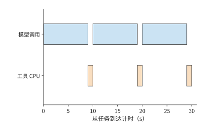

*图 11-1：三轮串行任务共需 30 s。蓝色为三次各 9 s 的模型调用，橙色为三次各 1 s 的工具执行；工具累计消耗 3 CPU·秒。*

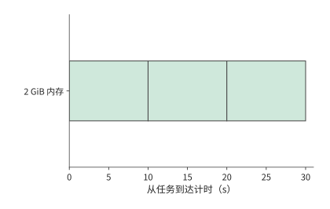

*图 11-2：同一任务的环境始终占 2 GiB，持续 30 s，矩形面积为 60 GiB·秒。等待模型时仍保留环境，因而内存占用持续时间长于工具的 CPU 执行时间。*

这种等待来自控制器与执行器之间的交接。模型调用结束时，控制器取得完整工具参数，随后把参数发给执行器。执行器修改文件、启动测试、保存结果，再将结果交回控制器。工具必须等模型给出完整参数才能执行，因此在任务的大部分时间里都不占用 CPU。

模型采用流式输出时，可以更早返回部分文本，但工具仍需等待完整的调用参数：收到目标文件、修改内容和操作类型之后，执行器才能执行这次修改。模板下载和运行时初始化只依赖预先确定的环境类型，可以提前放到模型生成期间。第 11.2 节将利用这段时间准备环境。[^platform]

把该例推广到 $R$ 轮。各阶段依次执行时，任务总时间为

$$
T_{\mathrm{task}}=T_{\mathrm{queue}}+T_{\mathrm{prepare}}+
\sum_{r=1}^{R}(T_{\mathrm{model},r}+T_{\mathrm{tool},r})+T_{\mathrm{commit}}.
$$

上式依次计入排队、环境准备、各轮模型调用与工具执行，以及最终提交结果的时间。模型调用时间包括处理请求和返回结果，工具执行时间包括保存本轮结果，$T_{\mathrm{commit}}$ 则表示最终提交还需花费的时间。如果在模型调用期间准备环境，两者都完成后，工具即可开始执行。原本串行的两个阶段有了重叠，任务总时间和环境占用时间也随之改变。

### 11.1.2 CPU 工作量、环境驻留与并发容量

把单项任务的需求汇总到整个平台，先分别计算任务数、模型调用数和环境创建次数。平台每秒收到 10 项任务，每项需要三次模型调用，因此稳定运行时模型服务每秒接收 30 次调用；工具也每秒执行 30 次。若每项任务只创建一个环境，创建率是每秒 10 个；若每轮重新创建，则是每秒 30 个。任务量虽然相同，每轮重建环境却使创建次数增至三倍。

这些需求都来自同一个关系：

$$
\text{资源需求率}=\text{任务到达率}\times\text{每任务的平均资源需求}.
$$

每项任务累计使用 3 秒 CPU 时间，所以每秒到达的任务合计需要 30 秒 CPU 时间，平均有 30 个 CPU 核在执行工具；每项任务的累计内存占用为 60 GiB·秒，所以平台的环境平均需要 600 GiB 内存；每项有三次 9 秒模型调用，所以平均有 $10\times3\times9=270$ 次模型调用正在执行。

**例 11-1：代码修复平台为何先受环境内存容量限制？** 将需求除以章首给定的容量，CPU 占用为 $30/48=62.5\%$，模型调用的并发容量使用率为 $270/320\approx84\%$，内存需求却达到 $600/358\approx168\%$。358 GiB 内存最多同时保留 178 个 2 GiB 环境；每个环境要保留 30 秒，平台每秒最多只能开始约 5.9 项任务，其余任务只能排队。此时 CPU 还空着 18 核，增加 CPU 核数也无法解决环境内存不足的问题。

也可以先求环境数量。每项任务占用环境 30 秒，每秒有 10 项任务开始使用环境，因此系统稳定运行时，平均有 300 个环境正在使用。这就是 Little 定律在本题中的形式：

$$
\overline N_{\mathrm{env}}=\lambda_{\mathrm{env}}\overline T_{\mathrm{env}}
=10\times30=300.
$$

每个环境固定占用 2 GiB 内存，300 个环境便需要 600 GiB。当任务的内存占用随阶段变化时，将每项任务的占用面积 $A_M=\int M(t)dt$ 代入 $\lambda_{\mathrm{task}}E[A_M]$，仍可得到平均内存需求。同样，CPU 时间 $W_{\mathrm{cpu}}=\int n_{\mathrm{busy}}(t)dt$ 将各个核的实际执行时间相加。

把每次模型调用从 9 秒延长到 12 秒，工具执行保持不变。任务时间变成 39 秒，平均内存需求升到 780 GiB，同时处理的模型调用增至 360 次，工具仍然只需平均使用 30 个 CPU 核。内存缺口进一步扩大，模型调用并发数也超过了 320 个并发槽，排队的任务更多了。由此可见，模型响应变慢，也会增加工具平台的内存需求，因为环境需要保留得更久。

图 11-3 和图 11-4 将三种资源换算为各自容量的百分比。每次调用 9 秒时，内存柱已经越过容量线；调用变慢后，CPU 柱长不变，模型并发柱也越过了容量线，内存柱则更长。问题因此从“有多少空闲 CPU”转向“能否减少等待期间占用的内存”。

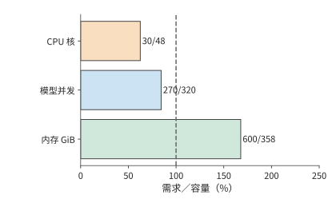

*图 11-3：每秒 10 项任务、每次模型调用 9 s 时，三种资源的需求占容量比例。柱末给出需求量／可用容量；虚线为 100%。*

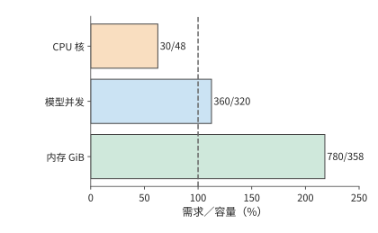

*图 11-4：每次模型调用由 9 s 延长到 12 s，CPU 需求仍为 30 核；并发调用增至 360，环境内存增至 780 GiB。虚线为 100% 容量。*

除了缩短环境保留时间，还可以错开工具执行，减少同时占用内存的进程。一组四进程 CPU 工具实验中，同时启动与错开启动的累计 CPU 时间分别约为 0.29 秒和 0.27 秒，工作量接近。**驻留集大小**（resident set size，RSS）是进程当前驻留在物理内存中的页所占的容量；采样得到的 RSS 峰值从约 320 MiB 降到 80 MiB，整组完成时间从约 0.10 秒延长到 0.54 秒。错开启动后，同时运行的进程减少，内存峰值随之下降，但整组任务也需要更长时间才能完成。[^environment]

### 11.1.3 任务完成条件与必须保留的状态

减少等待期间的内存占用，意味着要释放环境中的一部分状态。释放之前，必须先明确丢失这些状态会导致哪些工作重做。在图 11-1 的三轮任务中，前两轮结束时，已经过去了 20 秒，其中工具累计使用的 CPU 时间只有 2 秒。如果丢失工作目录后必须从头执行，就要重新花费这 20 秒，而不仅是重做 2 秒工具计算。能保留哪些状态，决定了故障后哪些阶段需要重来。

| 状态 | 需要记录的信息 | 丢失后的恢复方式 |
| --- | --- | --- |
| 模型上下文和生成进度 | 任务、模型版本、输入前缀、已采用的输出 | 重新提交上下文，重建模型状态 |
| 工作目录与文件 | 仓库版本、文件摘要、补丁版本 | 从持久副本取回或重新应用补丁 |
| 进程与内存 | 环境实例、进程状态、运行时条件 | 恢复快照或重新执行工具 |
| 工具结果 | 工具操作、执行尝试、输入文件版本 | 查询已保存结果或再次执行 |
| 外部操作 | 目标系统中的操作标识与提交状态 | 查询、去重或按业务规则补偿 |

记录这些信息时，任务、工具操作和每一次执行尝试需要各自的标识。同一份测试结果可能被传送两次；同一项测试也可能实际执行两次。前一种情况只需对消息去重，后一种情况已经消耗了两次资源。文件版本不相同时，两次同名测试甚至不是同一个工具操作。

记录每次尝试之后，还要区分尝试失败的原因。测试结果决定控制器的下一步。如果程序运行结果不正确，控制器就需要修复程序；如果工具进程因资源不足而中止，则需要恢复执行。两类失败对应不同的后续工作，完成概率也不同。同样的区分也出现在模型训练中。RL 根据样本的验证结果更新模型，其验证也要区分这两种情况：答案是否正确，用于计算学习反馈；执行故障则先由运行系统处理。

失败与重试还会带来额外的成本。一次提交可以触发多次尝试。平台为每次尝试支付模型、工具和环境成本，用户得到的是最后完成的任务。第 11.5 节将沿这些分支累积支出，再除以通过测试的任务数。

## 11.2 运行环境的创建、保留与释放

### 11.2.1 工具执行路径与隔离边界

第 11.1.3 节区分了需要保留的文件、进程和操作结果，本节说明承载这些状态的环境如何创建和释放。模型输出的工具调用需要由普通程序执行。执行器将调用转换成文件操作、进程启动、浏览器动作或设备任务。运行环境提供代码执行所需的操作系统接口、文件系统、内存、网络以及资源限制。运行环境还需要隔离不同任务，防止相互干扰。

图 11-5 把章首平台分为模型服务和工具环境两条路径。模型服务由 10 个 V4-Flash 副本组成，最多同时处理 320 次调用；环境平台在一台 m5d.metal 的 48 个 CPU 核和约 358 GiB 内存中分配工具资源。控制器协调两者完成任务：先从模型取得参数，再让工具执行并返回结果。

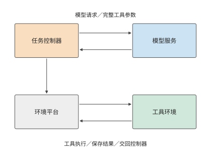

*图 11-5：代码任务经过模型服务与工具环境两条路径。控制器从模型取得参数，再向环境平台发起工具操作；执行结果成为下一轮输入。虚线框标出工具环境所在的执行节点。*

隔离不同任务有多种实现方式，隔离程度逐级增强。进程通常共享同一个操作系统内核，靠地址空间和权限做基本隔离。容器增加命名空间（让进程看到各自的进程编号、网络等资源视图）、文件系统视图和资源控制，但通常仍共享宿主内核。完整虚拟机运行自己的操作系统内核，并通过虚拟硬件与宿主隔离；microVM 保留虚拟机隔离模型，通过精简虚拟设备和管理功能来降低开销。沙箱是对执行约束的描述，不专指某一种实现。

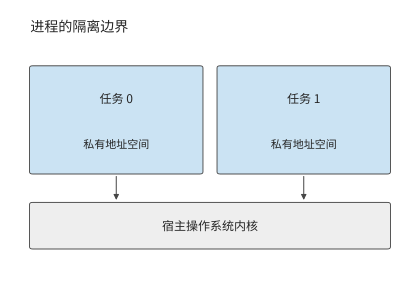

*图 11-6：进程拥有独立地址空间，通过权限限制访问；同一节点上的进程共享宿主内核。*

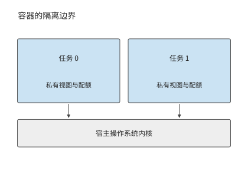

*图 11-7：容器为任务建立各自的资源视图和配额，底层仍使用同一宿主内核。*

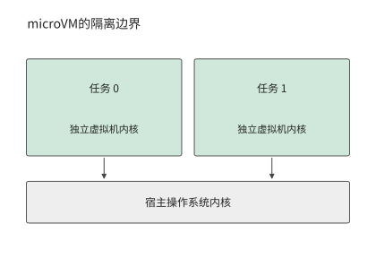

*图 11-8：microVM 让每个任务环境运行独立虚拟机内核，通过虚拟硬件访问宿主资源。*

章首平台选用的正是 microVM 方案。Firecracker 由亚马逊云服务（Amazon Web Services，AWS）为无服务器计算开发，2018 年开源；Firecracker 团队 2020 年在 NSDI 会议上发表的论文讨论了如何在大量短时任务之间兼顾硬件虚拟化隔离、启动速度和内存开销。[^firecracker-history] E2B 使用 Firecracker microVM 运行工具环境，模板可由容器镜像构建。创建时，平台从模板建立环境；运行时，工具通过虚拟机内核读写文件和启动进程。容器镜像决定环境中有哪些文件和依赖，microVM 则决定这些程序运行时如何与宿主系统隔离。[^e2b]

两条路径在同一个任务控制器处汇合：控制器知道模型调用何时开始、工具何时使用环境，以及哪些文件需要跨轮保存。平台据此可以分别安排模型状态与工具状态的保留和释放：模型计算期间可以准备下一轮环境，工具完成后可以保存文件并释放进程。

### 11.2.2 资源分配与环境创建

确定隔离方式以后，平台还需为环境分配资源并加载程序所需的数据。工具平台用 CPU 配额、内存上限以及文件和设备访问权限分配资源。给等待模型的环境增加 CPU 配额，并不会改变其文件和内存状态；销毁该环境会释放内存，但下一次执行前要重建这些内容。有些工具还需要 GPU，例如验证 CUDA 程序时，还要向加速器资源池申请 GPU。设备直通让虚拟机直接操作分配给它的物理设备，可由虚拟机程序 QEMU 配合 Linux 的 VFIO 设备访问接口完成。[^ub]

创建环境需要取得模板、建立私有状态并准备首次工作所需的数据。最简单的方式是完整复制模板；另一种方式是共享只读内容，只复制需要写入的页；还可以按访问需求加载数据。创建环境时少加载数据，可以缩短启动时间，但程序首次访问这些数据时仍需等待加载。

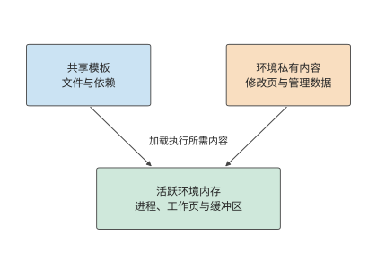

*图 11-9：模板包含共享的文件与依赖，私有部分记录各环境的修改；程序运行时还会占用进程内存和缓冲区。加载模板所需的空间与活跃环境的内存占用分别计算。*

**例 11-2：按需加载与只读共享能节省多少环境内存？** 为分析创建开销，先取章首 300 个环境中的 100 个，比较将模板内容加载到这 100 个环境中所需的内存。每份模板为 2 GiB，工具访问其中 512 MiB，修改 128 MiB，另有 4 MiB 私有管理开销。逐份完整复制时，每个环境需占用 2,052 MiB 本地内存，100 份约为 200 GiB；只加载访问到的内容时，每份为 516 MiB，总量约为 50 GiB。同一组工具任务需要加载到内存的数据因此减少约 150 GiB。[^lifecycle]

还可以让环境共享只读内容，仅保留 128 MiB 脏页（相对模板被修改过的内存页）和 4 MiB 管理开销。此时每份为 132 MiB，100 份约为 13 GiB。尚未加载到本地内存的只读页在访问时取得。若每个环境再保留 256 MiB 热点只读页，本地总量回升到约 38 GiB，换来较少的远端访问。

四种加载方式依次占用约 200、50、13 和 38 GiB，并另保留一份共享的 2 GiB 模板。章首为每个活跃环境分配的 2 GiB 内存，还包括进程、缓冲区等工具运行所需的空间。共享只读内容可以减少重复存储，将常用数据保留在本地则可以减少远端读取。具体保留多少，要看工具首次访问哪些页，以及此后多久再次访问。

图 11-10 展开每个环境本地保存的内容。少保存这些数据是否会使工具首次读取时等待更久，还需要计算。

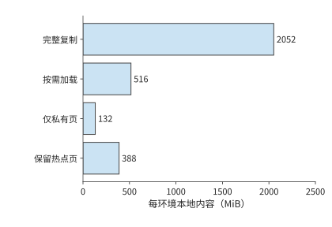

*图 11-10：四种方案采用相同的横轴尺度，比较每个环境本地保存的数据。另有一份共享的 2 GiB 模板，不计入各环境的柱长。数值来自例 11-2；管理开销为每环境 4 MiB。*

设取回与加载都受同一条 25 GbE 链路限制，速率为 3.125 GB/s（约 2.91 GiB/s）。模板尚未缓存在本机时，需要取回 2 GiB，再将 0.5 GiB 数据加载到内存，合计至少需要 0.86 秒；模板已在缓存中时，只需加载 0.5 GiB，降至 0.17 秒。约 0.69 秒的差额来自省去的模板传输。一般地，这条通路取回与加载数据的时间下界为 $(V_{\mathrm{fetch}}+V_{\mathrm{install}})/B$，其中 $V_{\mathrm{fetch}}$ 和 $V_{\mathrm{install}}$ 分别是取回和加载的数据量，$B$ 是链路带宽。

如果工具首次执行时又访问 1 GiB 尚未加载到内存的页，这条链路便再工作约 0.34 秒。按需加载让创建接口更早返回，尚未访问的数据留到真正需要时再取。E2B 的页与文件读取就是这样组织的：启动过程先提供可运行的环境，随后的访问逐步补齐内容。首次工具执行的完成时间包含环境启动，以及首次访问缺失页时的等待。按需加载将一部分准备工作推迟到了工具执行期间。[^e2b]

### 11.2.3 暂停、恢复与环境重建

第 11.2.2 节减少了每次创建时复制的数据；另一种节省内存的办法是在两次工具执行之间暂时释放整个环境。在章首的三轮任务中，第一轮工具在第 10 秒完成，第二轮工具要到第 19 秒才开始，中间有 9 秒模型调用。始终驻留要占用 $2\times9=18$ GiB·秒。按 E2B 文档，暂停一个沙箱时每 GiB 内存约需 4 秒，恢复约需 1 秒，保存和恢复期间环境仍占 2 GiB。暂停 2 GiB 环境需要 8 秒：第 10–18 秒保存状态，第 18–19 秒恢复。下一次工具仍能在第 19 秒开始，但整个间隔都被保存和恢复占满，占用仍是 18 GiB·秒，没有任何节省。[^e2b]

图 11-11 和图 11-12 的占用面积相同。要在等待期间释放内存，必须先保存下一轮仍需使用的状态，而保存时间随内存容量增长；因此，暂停能节省多少，取决于要保存什么、如何恢复。

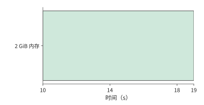

*图 11-11：第 10–19 s 等待模型时始终保留 2 GiB 环境，占用 18 GiB·秒。横轴与下一图一致。*

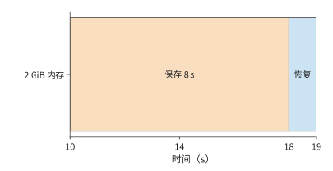

*图 11-12：第 10–18 s 按每 GiB 4 s 保存 2 GiB 状态，第 18–19 s 恢复，整个间隔都没有释放内存。有色区间仍占 18 GiB·秒，下一次工具在第 19 s 开始。*

恢复已保存状态的方式不止一种。暂停后恢复，是继续同一个任务的执行；快照派生，是从同一状态建立多个分支；从初始环境重新创建，则不继承先前任务的修改。三者都能重新得到可运行的环境，但继承的状态不同。

Agent 从运行快照恢复，会继承先前修改过的文件和进程。RL 验证常常要求每条样本从同一份初始目录出发，因此从干净模板派生。快照中的文件若包含上一次测试输出，恢复时也会带回这份输出。初始模板用于重复试验，运行快照用于延续进度，二者保存的是不同时间点的状态。

回到章首任务中那段 9 秒的模型等待。环境内存更小或间隔更长时，暂停才开始有收益：同样 9 秒的间隔，512 MiB 的环境约 2 秒即可保存完毕，可以释放 6 秒；间隔短于保存与恢复之和时，恢复还会推迟下一次工具执行。E2B 另外提供只保存文件系统的暂停，恢复时重新启动系统；第 11.2.4 节的每轮重建环境正是沿这一方向，只保留文件，不保留进程内存。

是否暂停，可以比较成本来决定。设释放的内存为 $M$ GiB，释放后保持空闲的时间为 $G$ 秒，每 GiB·秒价格为 $p_M$，状态保存、存储和恢复的新增成本为 $C_{\mathrm{transition}}$，暂停节省成本的条件是 $p_MMG>C_{\mathrm{transition}}$。左边随释放时间增长，右边是每次保存和恢复需要支付的成本；令两者相等，就能求出暂停开始节省成本所需的空闲时间。

成本比较决定是否暂停；暂停之后，不同状态要用不同方式恢复。快照保存文件和内存，连接由客户端重新建立，外部存储则继续保留已经提交的写入。控制器恢复后先取回操作结果，再接续下一轮，避免把已经完成的修改重新执行一次。[^e2b]

### 11.2.4 始终驻留、按需创建与提前准备

暂停需要保存进程状态。如果下一轮只需要已经保存的文件和结果，就可以进一步省去进程快照，直接重建环境。对章首代码任务，工作目录和结果已经持久化，每一轮工具都可以启动新进程。E2B 的模板本身就是预先启动过的虚拟机快照，文档给出恢复一个沙箱约需 1 秒。模板已缓存在本机时，从模板启动 microVM，再载入工作目录并初始化工具运行时，设完整准备时间为 2 秒，称为热路径；模板不在本机时，还要先经 25 GbE 取回 2 GiB 模板，增加约 0.69 秒，冷路径约需 2.7 秒。下文默认走热路径。每次准备累计使用 0.1 秒 CPU 时间，从准备开始到工具完成一直占 2 GiB。准备只加载已知的工具运行时和工作目录，文件修改在收到完整的工具调用参数后执行。

已知第一轮模型将在第 9 秒返回，平台可以在第 7 秒开始准备环境，第 9 秒执行工具，第 10 秒保存结果并销毁环境。后两轮分别在第 17 秒和第 27 秒开始准备。三次准备都在模型调用期间完成，任务仍在第 30 秒完成，环境只需在每轮准备和执行的 3 秒内保留。

每项任务的累计内存占用由 60 降到 $3\times(2+1)\times2=18$ GiB·秒，平台平均内存占用由 600 降到 180 GiB。代价是每秒创建 30 个环境，准备工作平均额外占用 $30\times0.1=3$ 个 CPU 核，CPU 需求从 30 增到 33 核。Firecracker 论文报告单台主机每秒最多可创建 150 个 microVM，每秒 30 个仍在这一范围内。平台增加少量环境创建工作，就节省了原本要在等待期间保留的 420 GiB 状态，内存需求从这台主机无法容纳的 600 GiB 降到约一半容量。

图 11-13 和图 11-14 对照两种环境管理方式下的完整任务时间线，显示内存占用如何变化。工具的三个执行时刻没有改变，消失的是长段模型等待期间的内存占用。这里能准确安排准备时刻，是因为下一轮使用什么工具、模型何时返回都已给定。

*图 11-13：环境从任务开始保留到结束。模型每轮 9 s、工具每轮 1 s，三轮累计占用 60 GiB·秒。与下一图使用相同横轴。*

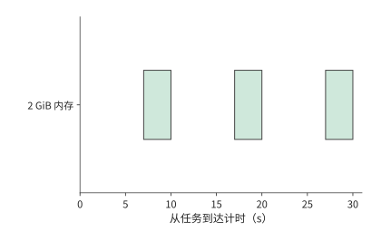

*图 11-14：每轮只在准备 2 s 和执行 1 s 期间保留环境，三次合计 18 GiB·秒。工作目录和结果已持久化，三轮仍在第 30 s 完成。*

这项安排的前提是准备能在工具执行前完成。若下一个工具的类型要从流式输出中预测，那么调用发出后还要等多久，就取决于准备提前了多少，以及预测是否正确。SpecBox 用流式输出中透露的工具类型和工具切换记录提前准备相应环境，下面按一次调用分析其收益。[^platform]

设一次准备需要 $P$ 秒，提前量为 $L$ 秒，正确预测所需环境的概率为 $h$。假设正确预测不会争用资源，错误预测可以立即取消，猜错时再按需准备，则发出调用后等待环境就绪的平均时间为

$$
E[W]=h\max(P-L,0)+(1-h)P
=P-h\min(P,L).
$$

正确预测时，准备的前 $\min(P,L)$ 秒与模型调用重叠，工具调用仍需等待剩余的准备工作完成；猜错时，实际需要的环境从头准备。两条路径按命中概率加权，就得到上式。当准备工作已经能在模型返回前完成时，再提早开始准备，只会延长环境就绪后等待调用的时间。

取 $P=2$ 秒、$h=0.75$。不提前准备时，每次调用等 2 秒。提前 1 秒时，四次调用平均有三次只等 1 秒，一次因猜错仍等 2 秒，平均等待为 1.25 秒。提前 2 秒时，正确分支不再等待，平均降至 0.5 秒。提前 3 秒仍是 0.5 秒，却让正确分支多保留 1 秒就绪状态。对 2 GiB 环境，每次预测因此增加 $0.75\times2\times1=1.5$ GiB·秒的平均空闲内存占用。

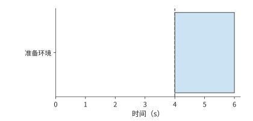

*图 11-15：按需创建：第 4 s 调用到达才开始准备，第 6 s 就绪，等待 2 s。蓝色为准备，虚线为调用时刻；以下四图使用相同横轴。*

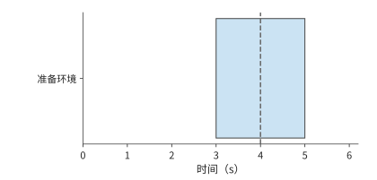

*图 11-16：预测正确且提前 1 s：从第 3 s 准备到第 5 s，调用在第 4 s 到达后仍需等 1 s。蓝色为准备环境，虚线标出第 4 s 的调用到达时刻。*

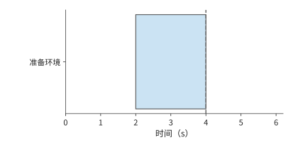

*图 11-17：预测正确且提前 2 s：准备恰好在第 4 s 调用到达时完成。蓝色为准备环境，虚线标出第 4 s 的调用到达时刻。*

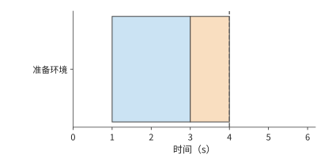

*图 11-18：预测正确且提前 3 s：准备在第 3 s 完成，橙色部分表示环境已就绪、等待调用的 1 s 空闲时间。蓝色为准备环境，虚线标出第 4 s 的调用到达时刻。*

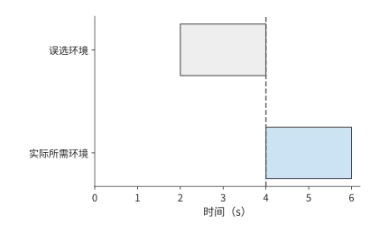

*图 11-19：预测错误：第 2–4 s 准备了不需要的环境（灰色）；第 4 s 取消后，再花 2 s 准备实际所需环境。此图采用立即取消、无资源争用的题设。*

由此可以比较三种减少等待的办法。缓存模板可以省去重复获取数据的开销；保留已经启动的环境，可以在调用到达后立即执行，但需要持续占用内存；每轮重新建立环境，则可以利用模型调用的时间完成准备。章首任务已经知道下一轮所需的运行时，因此在模型调用期间准备下一轮环境；多种工具交替出现时，还需在计算中计入预测命中率。

本地工具重放展示了过早准备的后果：从提前 50 ms 准备改为在模型等待一开始就准备后，累计工具调用时间仍约为 0.26–0.28 秒，按采样结果计算的累计内存占用却从约 0.0193 增到 0.467 GiB·秒，约为原来的 24 倍。增加的内存占用主要发生在环境已经就绪、调用尚未到达的区间。只要能在工具调用到达前准备好环境，就没有必要更早创建。[^prewarm]

## 11.3 共享资源池的分配与调度

### 11.3.1 异构资源、成组分配与放置约束

算出单个任务的资源需求后，还要判断共享资源池能否同时提供这些资源。多卡作业通常需要特定卡型、每卡显存、配套 CPU 与主机内存，以及适合其通信模式的位置。空闲 GPU 总数满足要求，只是作业能够启动的必要条件之一。

这些资源还必须落在合适的节点上：章首 CPU 工具每次独立使用一个核，多卡训练则必须让一组加速器共同推进，作业中的所有进程才能一起启动。因此，多卡作业能否启动，还取决于空闲资源分布在哪些节点上。

**例 11-3：GPU、CPU 与节点约束如何造成资源碎片？** 某作业需要四张 H100 和 16 个 CPU 核，并要求这些资源位于同一节点。节点 1 是一台 DGX H100（8 张 H100 SXM，双路 Xeon Platinum 8480C 共 112 核），已有作业占用了四张 H100 和 104 个核，只剩四张 H100 和 8 个空闲核；节点 2 是一台 DGX A100（8 张 A100，双路 EPYC 7742 共 128 核），空着四张 A100 和 32 个核。整个资源池既有四张空闲 H100，也有足够多的 CPU 核，但没有一个节点满足全部条件。[^nodes]

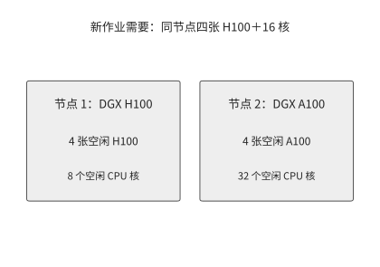

*图 11-20：整理前：新作业需要同节点四张 H100 与 16 核。节点 1 缺 CPU，节点 2 空着的是 A100。*

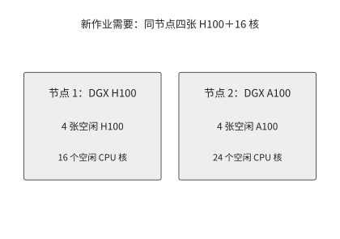

*图 11-21：将占用 8 核的 CPU 任务从节点 1 迁到节点 2 后，节点 1 同时拥有四张空闲 H100 和 16 个空闲核，可以启动新作业。*

假设等待节点 1 的原任务结束需要 12 秒，迁移该任务需要 4 秒，新作业在本地执行需要 20 秒。等待后执行共需 32 秒，迁移后执行共需 24 秒；重新安排资源后，新作业提前 8 秒完成。若另一种兼容的跨节点配置准备需 1 秒、执行需 32 秒，则立即分散启动共需 33 秒，反而更晚。三种方案的完成时间分别为

$$
T_{\mathrm{wait}}+T_{\mathrm{run,local}},\qquad
T_{\mathrm{move}}+T_{\mathrm{run,local}},\qquad
T_{\mathrm{ready,spread}}+T_{\mathrm{run,spread}}.
$$

迁移方案在本例中比等待方案早 8 秒，比分散启动早 9 秒。随着状态增大，迁移耗时也会增长；达到 12 秒时，迁移方案与等待方案同为 32 秒。调度器因此可以把预测的迁移耗时直接与原任务剩余时间比较，选择更早备齐全部资源的方案。

资源碎片在生产集群中同样存在。香港科技大学、阿里巴巴等机构在 2026 年发表的研究分析了阿里巴巴无服务器基础设施（Alibaba Serverless Infrastructure，ASI）的生产 GPU 集群。研究表明，配套 CPU 不足、作业需要成组启动以及网络位置限制，都可能使空闲 GPU 无法使用。加入可抢占的低优先级作业后，研究中 GPU 分配比例从 68% 提高到 93%。这些低优先级作业用的是高优先级作业暂时用不到的加速器；当需要成组启动的作业到来时，调度器收回这些加速器，并通过迁移任务备齐所需资源。[^platform]

### 11.3.2 队列、优先级与抢占代价

即使节点配置合适，请求同时到达也可能使资源来不及周转。章首任务均匀到达，每秒需要执行 30 次工具调用，48 个 CPU 核足以处理。当调用集中到达时，即使总工作量相同，排队时间也可能不同。

先考虑单个执行进程，每项工具工作需要 1 秒。十项工作在第 0、1、……、9 秒分别到达时，每项到达即可执行，排队时间都是零。若十项都在第 0 秒到达，执行仍需 10 秒，但各项的排队时间依次为 0、1、……、9 秒，平均为 4.5 秒。总工作量决定执行进程要工作多久，到达时刻和执行顺序决定每个任务先等多久。

图 11-22 和图 11-23 对照这两种到达方式，后者用执行块前方的灰色条形表示等待时间。同样 10 秒的执行工作，既可以没有排队，也可以产生大量等待。因此，从平均资源需求推到实际响应时间，还必须知道请求是否集中到达。

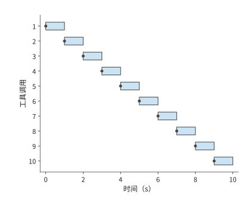

*图 11-22：十次调用每隔 1 s 到达，一个执行进程每次处理 1 s。圆点为到达，蓝色为执行，每次均可立即开始。*

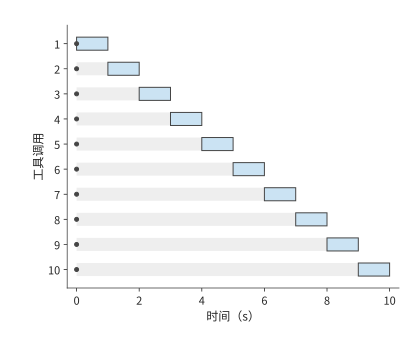

*图 11-23：十次调用同时在第 0 s 到达；灰色为等待、蓝色为执行，各行的等待依次为 0–9 s。执行进程仍只工作 10 s，平均排队为 4.5 s。*

以代码修复平台的突发工具调用为例。假设平台的 48 个核全部空闲，此时同时收到 80 次各需 1 秒的工具调用，前 48 项立即执行，其余 32 项等待 1 秒；平均等待 0.4 秒，全部在 2 秒内完成。若增至两台 m5d.metal（96 核），这次突发在 1 秒内完成。增加 CPU 核数提高了处理突发请求的能力；任务均匀到达时，平均仍只需 30 个 CPU 核执行工具。

同一批工具调用还需要足够的环境内存。每个环境占 2 GiB，80 个已准备环境需要 160 GiB。始终驻留的方案需要约 600 GiB，本身就超出了 358 GiB 的内存；第 11.2 节的每轮重建环境方案平均只占 180 GiB，剩下的约 178 GiB 足够容纳这 80 个环境。减少等待期间保留的环境，可以腾出内存给新调用，空闲的 CPU 也就能及时开始执行。

为突发请求预留容量后，还要决定请求之间的先后顺序。优先级决定谁先使用这份余量。在线任务要求快速开始，离线任务可以等待，平台便可以让离线工作暂借资源，并在在线调用到达时收回。设在线任务最多等 2 秒，而离线作业保存状态需要 30 秒。这组资源即使可以抢占，也要在 30 秒后才交还；因此，平台需要另行预留能在 2 秒内分配给在线任务的资源。

一次抢占还会丢失未保存的进度。已执行 20 秒、恢复需 2 秒的作业，从最近的 checkpoint 恢复执行与从头重做之间相差多少，取决于 checkpoint 之后积累的工作。调度器既要考虑新任务能提前多久开始，也要计入保存和恢复状态的开销，以及原作业因此增加的延迟。

抢占说明了让某项任务提前执行的代价。长期运行时，还需要避免同一批任务总被推迟，因此也要明确按什么标准衡量分配是否公平。两项任务各得两张 GPU，看起来份额相同；如果一种卡执行同样工作所需的时间是另一种卡的两倍，完成进度就不同。主导资源公平（dominant resource fairness，DRF）把每个任务在各类资源中占比最高的一类称为主导资源，并依据主导资源份额公平分配资源；Gavel 和 Pollux 等研究则进一步考虑不同加速器的处理能力或训练进度。按资源份额分配，关注的是各任务获得多少资源；按完成进度分配，关注的是各任务推进得多快；限制最长等待时间，则可以避免某些任务长期得不到执行。[^scheduling]

从单次工具调用扩大到 RL 训练，资源需求还会随阶段变化。rollout 生成的交互轨迹既包括模型输出，也包括工具或环境的反馈。下一节计算，增加生成这类轨迹的加速器，实际能缩短多少训练时间。

### 11.3.3 RL 生成与训练的动态资源配比

一轮同步的 RL 迭代需要生成样本、完成验证并执行更新。如果每轮所需有效生成量为 $Q$，生成池速率为 $r_g$，简化的生成阶段时间为 $Q/r_g$。增加 rollout 加速器只能缩短可并行的生成部分；每轮仍需完成验证、更新、权重发布和必要的同步。若这些阶段依次执行，则

$$
T_{\mathrm{iter}}=T_{\mathrm{generate}}+T_{\mathrm{verify}}+T_{\mathrm{update}}+T_{\mathrm{publish}}.
$$

例如生成、验证、更新和发布分别需 40、10、30 和 5 秒，一轮共需 85 秒。若只把生成速率提高一倍，一轮降至 65 秒，整体仅加速约 1.3 倍；即使生成时间降为零，其余阶段仍需 45 秒，整体加速也不超过约 1.9 倍。随着生成时间缩短，验证和更新占总时间的比例逐渐增大，继续增加生成加速器所能节省的时间也越来越少。

图 11-24 中，增加生成加速器只缩短蓝色部分。下一步有两种办法：改变执行顺序，使验证与生成重叠；或者继续增加生成加速器，但先计算新加速器加入前的准备开销。

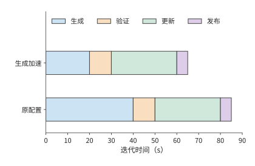

*图 11-24：四个阶段依次执行。生成时间由 40 秒降至 20 秒，其余三段仍共需 45 秒，因此每轮总时间由 85 秒降至 65 秒。条形长度按时间比例绘制。*

验证与生成重叠的办法见第 11.3.4 节。增加临时生成加速器时，RLBoost 保持训练组不变，让临时实例在完成权重准备后加入生成池。[^rollout]

**例 11-4：共享的发送出口如何限制多实例的权重分发速度？** Qwen3-8B 的 BF16 完整权重共 16,381,470,720 字节，约 16.38 GB（十进制），要向六个 rollout 实例分别发送。按 RLBoost 的实验配置，训练组的八卡 H100 实例经 200 Gbit/s 前端网卡（接入数据中心通用网络、而非 GPU 间高速互连的网卡）发送，每个两卡 rollout 实例的前端接口为 50 Gbit/s，六路传输共用发送方的出口。向一个接收方传完权重至少需要

$$
16.38/(50/8)\approx2.62\ \mathrm{s},
$$

而共享出口要发送约 98.3 GB，向六个实例全部传完权重至少需要

$$
T_{\mathrm{all}}\geq\max\left(2.62,\frac{6\times16.38}{200/8}\right)\approx3.93\ \mathrm{s}.
$$

六个实例全部收到权重，至少需要 3.93 秒；第一个实例可以更早收到自己的 16.38 GB。随后接收方把权重加载到 GPU 显存并确认版本，调度器再向它分配请求。PolyRL 利用临时资源扩展 RL 生成池，先把完整权重接收到 CPU 缓冲区，再交给采用 TP（见第 6.2.2 节）的 GPU 组。因此，TP=2 只是把实例内部的计算分到两张卡上，每个实例从外部接收的权重仍是 16.38 GB。

图 11-25 标出六份权重共同经过的出口。接收实例增加时，需要发送的总字节数也增加，发送方的带宽却没有随之增加。权重传完后还要加载到 GPU，这些准备时间都要从临时实例可用的时间中扣除。

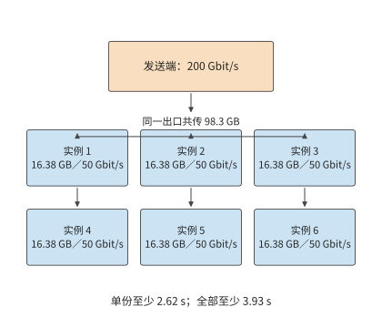

*图 11-25：每个接收实例都需要一份完整的 16.38 GB Qwen3-8B 权重，六路传输共用 200 Gbit/s 发送出口。每个接收方为 50 Gbit/s，单份传输至少 2.62 秒，而发送方累计发送 98.3 GB 至少需要 3.93 秒；图中六个接收框各代表一个独立实例。*

临时实例分配到资源后，需要先完成准备，剩余时间才能用于生成。设实例从获得资源到开始生成共需 8 秒，可用时间为 20 秒，就只剩 12 秒用于生成；若只能使用 5 秒，则在开始工作之前已经被收回。令可用时间为 $L$、准备与恢复时间为 $T_0$，可工作的窗口就是 $\max(L-T_0,0)$。实例可用的时间越长，准备开销所占的比例越小，用于实际生成的时间比例就越大。

临时实例提前被收回时，损失的不仅是尚未利用的容量，还有已经生成的内容。保存生成前缀可以把已完成工作带到新实例：新实例读入“原输入＋已记录的输出”，执行 prefill、建立 KV 缓存，然后继续生成。PolyRL 恢复一组共享采样参数的请求时，会把组内各条响应截到其中最短的已保存长度：两条响应已收到 4,000 和 1,000 个 token 时，各采用 1,000 个 token，共复用 2,000 个 token，较长那条的 3,000 个 token 要重新生成。截到同一长度后，这组请求可以统一安排后续生成。

在一次 Qwen3-8B 4-bit 本地部署的对照中，保留前缀省去了 96 个重复采样 token，请求总耗时却约为 12.8 秒，而从头重做约为 11.6 秒。节省的 token 对应生成阶段，完整路径还包含前缀重建与重新调度。这组对照中，前缀重建与重新调度的额外时间超过了节省的生成时间。[^recovery]

还可以从成本判断增加临时实例是否值得。按 RLBoost 使用的历史价格，训练实例每小时约 84 美元，六个额外实例各约 5.3 美元，总费率约为每小时 116 美元。全部实例全程计费时，处理同一批训练任务的吞吐量需达到原来的约 $116/84\approx1.38$ 倍，单位工作成本才下降。若吞吐量只达到原来的 1.2 倍，完成时间缩短，但成本约增至原来的 1.15 倍；达到原来的 1.6 倍，成本则约降至 0.86 倍。[^rollout]

### 11.3.4 验证 batch、长尾与资源释放

第 11.3.3 节把验证视为生成之后的一整段工作；实际上，样本往往陆续生成，验证可以更早开始；训练更新需要等待的，则是整批验证中的最后一个结果。验证 CUDA 代码时，需要先用 CPU 编译，再用 GPU 执行。安排验证任务时，除了 CPU 容量，还要考虑并发执行对 GPU 性能测量的干扰。

若样本 $i$ 在 $a_i$ 时刻到达，依次需要 $c_i$ 秒编译和 $g_i$ 秒执行，忽略资源竞争时，整批完成下界为

$$
T_{\mathrm{batch}}\geq\max_i(a_i+c_i+g_i).
$$

执行进程不足会导致排队，启动进程和传输数据也需要时间，这些开销都会进一步推迟整批完成的时刻。尽早提交已经生成的样本，就能让验证与后续生成重叠。图 11-26 和图 11-27 中的两种安排都需要 30 秒的验证处理时间，但完成时刻相差 20 秒；差别只在提交时机。

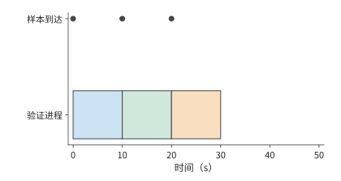

*图 11-26：三条样本分别在第 0、10、20 s 到达，立即提交给唯一的验证进程，每条处理 10 s，整批在第 30 s 完成。圆点标到达时刻。*

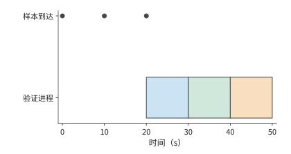

*图 11-27：先等三条样本全部在第 20 s 就绪，再依次验证，结束于第 50 s。与前图执行相同的 30 s 验证工作，区别来自提交时机。*

逐条提交消除了等待整批生成的空档，但整批完成时间仍可能由最慢的一条验证决定。估计这类长尾任务还要运行多久，需要根据它已经运行的时间更新判断。设已有测量中九条验证各需 1 秒，一条需 100 秒，平均为 10.9 秒。若某条验证已经执行 10 秒仍未结束，用 10.9 减去 10，就会得出只剩 0.9 秒的预测。然而在这一离散分布中，该验证必定是那条 100 秒任务，还需 90 秒。因此，应在已知任务尚未结束的条件下估计剩余时间，即 $E[S-e\mid S>e]$，其中 $S$ 是一项验证的总执行时间，$e$ 是已经执行的时间，$E[\cdot\mid S>e]$ 表示只在尚未结束的样本中取平均。DistRS 的调度算法采用这一类条件剩余时间，而不是始终使用总体平均数。[^reward]

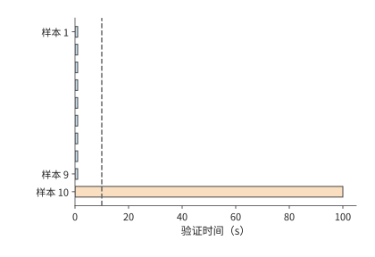

*图 11-28：九条验证各用 1 s，一条用 100 s。虚线是已经执行的 10 s；到此时仍未结束的样本只可能来自 100 s 那一类，剩余时间为 90 s。*

估计出各条样本的剩余时间后，便可以据此安排其他验证，尽量不延长整批的等待时间。假设 batch 中有一条样本最早要到第 120 秒才能完成。若要安排一项执行时间不超过 100 秒的工作，该工作最迟在第 20 秒启动，便能利用前面的空隙而不推迟整批；若其环境准备需要 5 秒，准备最迟在第 15 秒启动。由整批的完成时刻可以反推出各项工作的最迟开始时间，调度器据此推迟不紧迫的工作，把资源先交给更早到期的 batch。

推迟不紧迫的验证可以减少验证资源占用，但一旦推迟了整批完成，也会让训练组继续等待。假设验证少用 60 H100·秒，却使仍持有 64 张 H100（8 台 HGX H100）的训练组多等 2 秒。训练组新增 $64\times2=128$ H100·秒，整个系统净增 68 H100·秒。若训练组只有 16 张卡（2 台），新增等待为 32 H100·秒，系统反而净省 28 H100·秒。验证资源是否值得缩减，因而取决于被阻塞的训练组有多大。

安排好完成时刻以后，还要确认结束或超时的任务确实停止了执行，资源才能交给下一项任务。一次受控验证中，等待方返回超时后，后台线程仍工作约 130 ms；主动终止子进程后，约 0.8 ms 就观察到进程退出。如果超时一到就把同一资源交给下一项任务，只报告超时而不终止后台线程，两项任务就会同时使用资源。对于 CUDA 性能验证，这种竞争还可能改变测得的执行时间和奖励。[^validation]

## 11.4 模型服务的选择与调用成本

### 11.4.1 任务质量与思考预算

每轮重建环境已经把章首平台内存需求从 600 GiB 降到 180 GiB，但任务完成时间仍为 30 秒，超过 24 秒目标。因此要改变关键路径上的模型调用。把每个 V4-Flash 副本同时服务的会话数从 32 减到 16，每个输出 token 的时间由 25.3 ms 降到 16.9 ms，355 个 token 的完整调用由 9 秒降到 6 秒，三轮便从 30 秒降到 21 秒；模型未变，任务通过率也不变。若环境始终驻留，每项占用也从 60 降到 42 GiB·秒，整个平台的内存需求从 600 降到 420 GiB，仍超过 358 GiB；如果每轮重建环境，仍只需在各轮准备和执行期间保留环境，累计占用保持在 18 GiB·秒。模型服务的选择因此会同时影响任务耗时和环境内存需求。[^design]

模型选择还决定每次调用的成本构成。一次模型调用的时间和成本，包括处理输入、生成思考 token 和生成可见输出三部分。思考预算决定允许生成多长的内部推理，实际用量决定每次调用需要支付多少费用。先在输出都能通过测试的条件下，比较两种思考长度设置的单次调用成本，再比较两种服务完成三轮任务所需的成本。

**例 11-5：思考长度缩短到十分之一，总成本减少多少？** 设两种思考长度设置都能通过相同测试，每次输入 10,000 个 token，可见输出 200 个 token，实际思考分别为 1,000 和 100 个 token。价格取 Claude Sonnet 5 的标准 API 价格：输入每百万 token 2 美元，生成每百万 token 10 美元，思考 token 按生成计费。那么单次成本（美元）分别是

$$
C_{1000}=\frac{10000\times2+(1000+200)\times10}{10^6}=0.032,
$$

$$
C_{100}=\frac{10000\times2+(100+200)\times10}{10^6}=0.023.
$$

思考 token 数降为原来的十分之一，总成本却只减少约 28%。原有成本中的 0.020 用于输入，0.002 用于可见输出，这两项保持不变；下降的是从 0.010 变为 0.001 的思考成本。因而，思考占原成本的比例决定了压缩思考能节省多少。[^platform]

图 11-29 将节省发生的位置单独标出。这一比较假定两种设置都能完成任务；如果缩短思考后需要重试，节省的橙色部分就要与重试新增的整次调用成本一起比较。

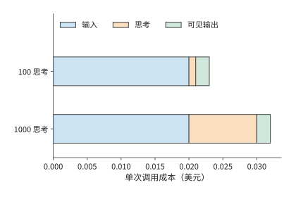

*图 11-29：两次调用的输入和可见输出相同，只改变思考长度。橙色成本缩短到原来的十分之一，蓝色和绿色成本保持不变，所以总成本由 0.032 美元降到 0.023 美元，减少约 28%。价格和 token 数见例 11-5。*

假设 100 次调用各省 0.009 美元，共节省 0.9 美元；其中 30 次因预算截断而重试，每次重试花费 0.032 美元，就新增 0.96 美元。总成本反而多出 0.06 美元。缩短思考预算可能增加重试次数。因此，比较任务总成本时，要同时计入单次调用的节省和额外重试的开销。[^thinking]

### 11.4.2 服务路径、前缀缓存与实际用量

第 11.4.1 节靠减少生成量降低成本；输入一侧的主要节省机会是重复前缀：同一任务的多轮调用通常会重复发送公共提示和此前的对话记录。一项模型请求从控制器进入统一服务入口，再交给选定的模型后端。这里的后端指实际执行模型推理的推理实例或服务提供方。入口负责鉴权、路由和限流，后端负责输入处理与输出生成。章首每秒 30 次调用在这条路径上形成持续需求；每次调用携带的公共提示与任务记录，则决定其中多少输入可以复用。

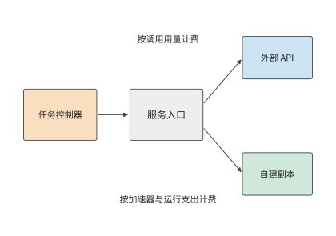

*图 11-30：同一任务使用模型服务的两种方式及其计费方法。外部 API 按调用用量收费，自建副本按设备预留及运行支出计价；两条路径都将成本归到任务及尝试。输入拆分为普通处理、缓存创建和缓存读取，生成单独计量。*

将一次调用的输入拆为互不重叠的普通输入 $I_u$、缓存创建输入 $I_w$ 和缓存读取输入 $I_h$，计费的生成 token 数为 $O$，对应的每百万 token 价格为 $p_u,p_w,p_h,p_o$，则

$$
C_{\mathrm{call}}=\frac{I_up_u+I_wp_w+I_hp_h+Op_o}{10^6}+C_{\mathrm{storage}}+C_{\mathrm{tool}}.
$$

同一个输入 token 在一次调用中只属于普通输入、缓存创建或缓存读取中的一类。将服务返回的用量记录（usage）按这三类整理后，分别乘以对应单价再相加，就得到输入成本。生成 token 数 $O$ 则是思考 token 数与可见输出 token 数之和。

**例 11-6：跨轮缓存公共前缀能节省多少输入费用？** 每轮有 8,000 个 token 公共前缀和 2,000 个 token 不复用的新输入。按 Claude Sonnet 5 的标准价格，普通输入每百万 token 2 美元，5 分钟缓存的首次创建 2.5 美元，缓存读取 0.2 美元。第一次创建，后九次在有效期内全部命中。无缓存时十轮输入成本为 0.20 美元；有缓存时（美元）为

$$
\frac{8000\times2.5+2000\times2}{10^6}
+9\frac{8000\times0.2+2000\times2}{10^6}=0.0744.
$$

本例保持十轮生成和工具执行相同，比较的成本差额全部来自输入。第一次使用缓存花费 0.024，比普通处理的 0.020 多出 0.004；此后每轮只花 0.0056，比普通处理少 0.0144。因此第二次访问就已收回首次创建的溢价。共访问 $n$ 次时，使用缓存更省的条件是 $np_u>p_w+(n-1)p_h$。缓存有效期越长，重复读取就越有机会收回首次创建的额外成本。[^platform]

缓存节省多少，还取决于命中的是哪些请求。再看两次调用，一次前缀长 1,000 个 token，一次长 9,000 个 token。若只有短前缀命中，请求命中率为 50%，缓存读取的 token 数却只占两次调用前缀总长度的 10%；若只有长前缀命中，请求命中率仍为 50%，读取占比变成 90%。按 token 收费时，后者节省的输入处理费用远多于前者。每次命中的权重，由输入长度决定。

### 11.4.3 排队、限流与模型路由

缓存只有在请求到达保存了相应前缀的后端时才能复用。因此，选择后端既影响命中率，也影响排队时间。为了使用已有的前缀缓存，有时值得多等待一段时间。设运行同一模型的后端 A 排队 200 ms，命中后处理前缀需 50 ms；后端 B 排队 20 ms，未命中处理需 500 ms；共同网络时间为 50 ms，后续生成相同。进入生成前，A 用 300 ms，B 用 570 ms，A 领先 270 ms。缓存命中节省了 450 ms 的处理时间，但增加了 180 ms 的排队时间，净收益恰好为 270 ms。当 A 的排队时间增至 470 ms 时，两者在生成开始前花费的时间就相同了。

章首每秒 30 次模型调用还受到并发容量的约束。每次调用需 9 秒时，平均有 270 次调用正在执行；缩短到 6 秒后，降为 180 次。但快速服务的时间是靠减小每个副本的 batch 换来的：每个副本只同时服务 16 个会话，10 个副本只有 160 个并发槽，无法容纳 180 次调用，需要增至 12 个副本（48 张 B200）。每次调用占用的 GPU 时间也从 $4\times9/32=1.125$ B200·秒增至 $4\times6/16=1.5$ B200·秒。按量 API 则通常分别限制单位时间内的请求数和 token 数；若每次调用的输入或输出增多，token 额度可能先于请求数额度用完。选择模型服务时，需要分别比较请求排队时间、并发调用数和 token 处理能力，找出限制任务完成速度的因素。

**例 11-7：缓存命中与成功率何时能抵消更高的服务单价？** 向 Claude Haiku 4.5（记为 A）和 Claude Sonnet 5（记为 B）各提交 1,000 项单次调用任务。每次输入 20,000 个 token，其中公共前缀 19,000、新输入 1,000。前缀缓存已经建立，没有额外的缓存创建、存储、工具和预热成本，任务通过验收的概率与缓存是否命中相互独立。单价取两者的标准 API 价格，思考 token 数与成功概率为题设。[^routing]

| 参数 | A：Haiku 4.5 | B：Sonnet 5 |
| --- | ---: | ---: |
| 普通输入单价 / 美元每百万 token | 1 | 2 |
| 缓存读取单价 / 美元每百万 token | 0.1 | 0.2 |
| 生成单价 / 美元每百万 token | 5 | 10 |
| 实际思考 token | 1,800 | 100 |
| 可见输出 token | 200 | 200 |
| 同一验收规则下的成功概率 | 0.80 | 0.98 |

A 的前缀始终命中，每次成本为 0.0129 美元，成功任务平均成本为 $0.0129/0.8\approx0.0161$ 美元。B 全命中时每次成本为 0.0088 美元，未命中时为 0.0430 美元。令 B 的请求命中率为 $h$，则

$$
C_B(h)=\frac{0.0088h+0.0430(1-h)}{0.98}.
$$

令 B 的平均成本等于 A 的平均成本，得到 $h\approx79.5\%$。B 的各项 token 单价都是 A 的两倍，却在高命中率下更省，因为实际生成量较少且成功率较高。命中率降至 50% 时，B 的成功任务成本升至约 0.0264 美元，此时 A 更便宜。

再要求至少 90% 的提交任务在 6 秒内通过验收。设完整请求时长为：A 10 秒，B 命中 4 秒、未命中 12 秒，均已包含排队和生成。A 不满足期限；B 需要 $0.98h\geq0.90$，即 $h\geq91.8\%$。

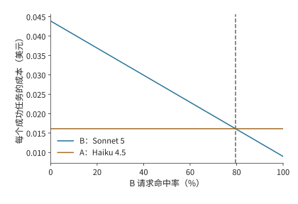

*图 11-31：B 的成功任务成本随命中率提高而下降，在约 79.5% 处等于 A。两者的总成本先分别除以各自成功完成的任务数；本图只比较成本，下一图单独加入期限。*

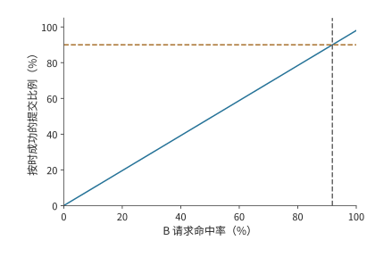

*图 11-32：只有 B 命中的 4 s 路径满足 6 s 期限；再乘 98% 的验收通过率，按时成功比例为 0.98h。达到 90% 目标要求 h 至少约 91.8%。*

本例每次前缀都是 19,000 个 token，所以请求命中率 $h$ 也等于前缀内部的 token 命中比例；相对于完整的 20,000 个 token 输入，缓存读取占比为 $0.95h$。成本交点约为 79.5%，业务门槛约为 91.8%。从低命中率向右移动，B 先变得便宜，随后才满足按时完成目标。把服务目标放到成本曲线上，就能直接读出最终可选区域。

### 11.4.4 自建服务、按量 API 与订阅的成本比较

路由比较确定了哪些模型服务同时满足质量、成本和期限要求。选定服务以后，还要决定是自建部署、按调用付费，还是购买订阅。模型选择确定每次任务所需的服务，采购方式决定如何为这些服务付费。自建容量先支付设备与预留成本，再由任务分摊；按量 API 随调用支付；订阅则按月或其他周期支付成本，取得相应产品的使用权限。三种方式的共同问题是：满足相同任务量时，总支出随使用量如何变化。

设一段固定统计窗口中，自建预留与固定支出为 $F$，每项提交任务的新增成本为 $v$；API 每项平均成本为 $c$。若两者成功概率相同且处理能力均满足需求，$N$ 项任务下自建更省的条件为

$$
F+Nv<Nc,\qquad N>\frac{F}{c-v}\quad(c>v).
$$

若 $c\leq v$，API 每项成本已不高于自建新增成本，固定投入又为正，因此 API 在所有使用量下都更省。若两者成功率不同，分别以 $Np_{\mathrm{self}}$ 和 $Np_{\mathrm{api}}$ 为分母，比较的就变成每个成功任务的成本。

下面用同一模型、同一种 GPU 比较两种付费方式，两边 batch size 相同，任务质量也相同，只差计费方式。预留方式按 GPU 云平台 Runpod 公开的 B200 Pod（按小时计费、独占使用的 GPU 实例）价格（每卡时 6.79 美元）租 4 张卡一个月（720 小时），$F=4\times720\times6.79=19{,}555.2$ 美元；GPU 已经整月付费，每项任务的新增成本 $v$ 为 0。按量方式使用同一平台按秒计费的 B200 Serverless worker（每卡时 8.64 美元），与按量 API 一样随用量付费，并同样以 32 个会话为一个 batch 运行。沿用章首任务，每项三次调用、每次占用 1.125 B200·秒，按量成本为 $c=3\times1.125\times8.64/3600=0.0081$ 美元。

成本相等时的任务量为 $19{,}555.2/0.0081\approx241$ 万项。每项任务占用一个会话 27 秒，这组 4 张 B200 一个月最多处理 $32\times2{,}592{,}000/27=307.2$ 万项，交点对应约 78.6% 的利用率，恰好是两种单价之比 $6.79/8.64$。100 万项时预留仍要 19,555.2 美元，按量只需 8,100 美元；300 万项时按量需要 24,300 美元，预留更省。固定投入在低使用量下难以摊薄，高使用量下则被较低的新增成本抵消。

图 11-33 中，预留成本是一条水平线，高度来自整月租金，右端止于这组 GPU 的处理上限；按量成本从零开始，斜率由每项任务占用的 GPU 时间决定。执行效率提高后，同样 4 张 B200 每月能处理更多任务，预留线向右延长，按量线的斜率随之降低；交点仍对应同一个利用率，即两种单价之比。

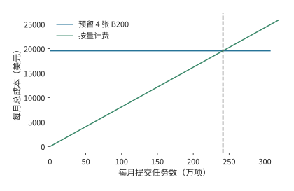

*图 11-33：4 张 B200 预留一个月共 19,555.2 美元，按量成本为 0.0081N 美元，N 为提交任务数。两条线在约 241 万项相交，对应预留 GPU 约 78.6% 的利用率；预留线止于每月 307.2 万项的处理上限。*

执行效率能提高多少，取决于时间用在哪里。仍以 4 张 B200 运行 DeepSeek V4-Flash、同时服务 32 个会话、每个会话保留 200K token 上下文的部署为例，会话数和 GPU 租价保持不变。每个输出 token 约需 25.3 ms，其中逐 token 的 decode 占 15.9 ms，其余输入处理和上下文重建占 9.4 ms。decode 阶段的实际速度提高到两倍后，每个输出 token 所需时间降为 $15.9/2+9.4\approx17.4$ ms，总加速约 1.46 倍，每百万输出 token 的 GPU 成本由约 6.0 美元降到 4.1 美元。[^purchase]

原先每个输出 token 所需时间中，约 63% 用于 decode，其余 37% 保持不变，因而两倍 decode 加速只能将总时间缩短约 31%。即使把 decode 时间降到零，其余处理仍需要 9.4 ms。这 9.4 ms 还要按第 1.3.4 节的判据再拆一次：读取 KV 和重建上下文是必需的工作，按带宽算出的时间构成新的下界；调度、拷贝和格式转换则是可以去掉的软件开销，才是优化空间。若要突破这一限制，需进一步优化输入处理和上下文重建；同一组加速器在单位时间内生成更多 token，固定租价才能由更多产出分摊。

章首的代码修复平台每秒调用模型 30 次。快速服务每次调用多占 0.375 B200·秒，按 Pod 价格约多 0.00071 美元，平台每秒便多支出约 0.021 美元；这笔额外成本让任务耗时从 30 秒降到 21 秒，满足 24 秒期限。章末将同时计算新增模型费用与节省的环境占用费用，比较各方案的任务总成本。

## 11.5 完整任务的恢复、成本计算与扩容

### 11.5.1 工具失败后的恢复与模型选择

第 11.4 节选择模型时，主要考虑了调用正常完成的情况。实际运行中，还需要处理调用失败、结果丢失和工具异常。如果控制器没有收到测试完成的确认消息，就无法区分两种情况：测试尚未完成，或者测试已经完成但确认消息丢失。

恢复时，控制器先查询已持久化的结果，核对操作标识和输入文件版本。如果结果存在，就可以继续；如果不存在，再判断是否允许重试。幂等操作指以同一操作标识重复调用时，最终业务效果与调用一次相同。只读查询或幂等操作重复执行通常不成问题；外部付款、创建资源或发送消息重复调用，却可能使同一操作实际发生两次，需要目标系统支持操作标识、事务或补偿。

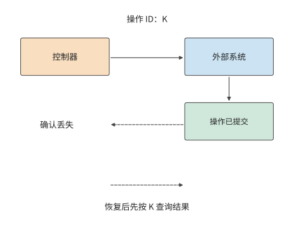

*图 11-34：外部系统已执行并提交操作 K，确认却丢失。恢复环境不会撤回外部操作的结果；控制器按同一操作标识查询结果后接续任务。实线表示请求与执行，虚线表示确认及恢复查询。*

假设执行一次工具需要 3 CPU·秒，结果被发送两次。如果接收方按操作标识去重，累计 CPU 时间仍为 3 秒；如果控制器因确认丢失而再执行一次，累计 CPU 时间就增至 6 秒。两种情况最后都可能只有一条结果，却消耗不同资源。消息去重解决前一种重复；后一种重复要靠持久化的结果和目标系统的幂等协议来避免。环境外已经提交的操作在快照恢复后仍然存在，恢复流程要先查询其提交状态。[^records]

不过，请求正常返回，并不意味着恢复时一定能找到它的记录。传统操作系统也区分“写入完成”和“已经持久化”。以普通文件的缓冲写入为例，`write()` 返回时，数据可能仍在内核的页缓存中，程序可以继续计算，由操作系统在后台写入。若程序必须等数据存好才能继续，就需要调用 `fsync()`，等待文件数据和必要的元数据写入存储设备，并检查是否成功。[^fsync]

Agent 运行时也需要规定清楚：向调用者报告完成时，只保证答案已经生成，还是保证消息、工具结果和恢复位置都已保存。这些约定就是持久性语义。仅对聊天日志调用 `fsync()` 还不够，因为恢复所需的信息可能分别存放在日志、工作目录和外部数据库中；控制器还要核对消息中的操作、目录中的文件和数据库中的结果是否一致。

这里按 ReAct 循环的轮次保存：每轮包括一次模型输出、由此发起的工具调用及其返回结果，可能包含多条消息。控制器将这一轮的记录追加到本地 JSONL 文件，确认整轮保存成功后才进入下一轮；保存失败就立即中止。因此，本地不会在某轮保存失败后，还继续执行并保存后续轮次。这里的“保存成功”还要说明能承受哪种故障：写入本地页缓存、完成本地 `fsync()`，或收到云端持久化确认，提供的保证并不相同。本地文件可以支持进程重启后的恢复，却未必能应对整台机器及其磁盘不可用。

为了减少等待，也可以每轮先保存到本地，再在后台上传该轮新增的记录。假设上传失败后暂不重试，也不中止本地执行：第一轮运行测试、取得失败结果，第二轮修改代码、取得工具确认，第三轮再次测试、取得新结果。三轮记录都已写入本地 JSONL，但第二轮上传失败，第三轮上传成功（图 11-35）。此时本地历史完整，云端却缺少第二轮的模型输出和工具结果。如果本机随后不可用，换一台机器仅凭云端记录恢复，就会遇到这个缺口。若每次上传的是包含此前所有轮次的完整快照，或上传程序必须补齐失败记录才继续，则不能套用这一例子。

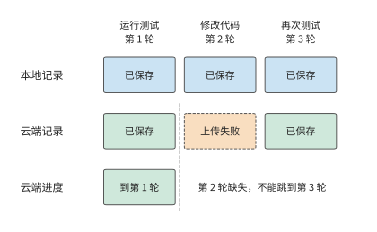

*图 11-35：初始状态已在本地和云端保存，每列代表一个 ReAct 轮次。每轮先保存到本地，再异步上传该轮新增记录；本例允许上传失败后继续执行和上传后续轮次。第二轮上传失败后，即使第三轮上传成功，云端历史仍只完整到第一轮。横向排列表示轮次顺序，不表示耗时。*

采用这类异步保存方式时，控制器必须分别跟踪本地和云端的保存进度。云端不仅要记录收到的最后一轮，还要记下从起点连续保存到了哪一轮。不能因为第三轮上传成功，就把连续保存位置从第一轮改成第三轮；只有补齐第二轮，或用完整的本地副本重建并核对后，才能确认云端历史也完整到第三轮。

删除旧日志时也一样。若要删除前两轮的记录，就必须先保存一份能够恢复到第二轮结束时的完整状态，并将状态与对应轮次一起提交。恢复时若既找不到此前的完整日志，也找不到这份状态，即使剩余日志全部读完，也应返回 `incomplete`，表示没有足够依据确认历史完整。如果接口允许按消息位置恢复，还须确认该位置是否对应一个已保存的完整轮次，并核对工作目录版本；轮内位置若没有单独保存，就不能承诺恢复到那里。已经提交到外部系统的操作，也不会因为消息回退而撤销。[^durability]

对本章的代码修复任务，可以借用数据库事务的做法，把一轮“模型决策—工具执行—保存结果”作为一个整体提交。这一轮的模型消息、工具结果和相关文件版本都保存成功后，控制器才记下这一轮已提交；重启后，再从最后一轮完整提交的结果接着执行。这也是 **Agent 事务（agent transaction）**研究的一项内容：如何在 Agent 执行中实现原子性、一致性、隔离性和持久性，即数据库中的 ACID 性质。[^agent-transaction] 如果一轮操作还调用了外部服务，就需要对方支持操作标识、幂等接口或补偿处理；仅在本地记下“已提交”，不能保证外部操作也恰好完成一次。

保存得越频繁，故障后通常需要重做的工作越少，但正常执行时的开销也越大。用一个小算例比较：100 个请求依次执行，每个用时 200 ms；每次持久化提交需要 8 ms 的固定开销，另外每写入一个请求的记录需要 2 ms。假设提交期间暂停处理请求，忽略其他开销，结果如下。

| 保存方式 | 保存共用时 | 无故障时总用时 | 故障后最多重做的计算时间 |
| --- | ---: | ---: | ---: |
| 每个请求提交一次 | $100(8+2)=1000$ ms | 21 s | 0.2 s |
| 每 10 个请求提交 | $10(8+10\times2)=280$ ms | 20.28 s | 2 s |

每 10 个请求一起提交，正常执行可节省 0.72 s；但若恰好在提交前发生故障，就要重做这 10 个请求，共 2 s 的计算。这里假定每次提交要么全部成功，要么全部不生效，未提交的请求都需重做，工具也允许安全重试；表中未计入重建环境和重新保存的时间。若改为异步保存，控制器就可以一边处理后续请求，一边写入已有结果。故障后需要重做多少，取决于当时还有多少记录没有存好。因此，比较保存方式时，除了任务完成时间，还应记录已返回但未保存的请求数，并核对重启后实际能恢复到哪里。

这里仍然需要回答全书反复讨论的两个问题：数据放在哪里，谁必须等它。第 11.2 节在模型调用期间释放工具环境，以节省内存。这样做的前提是下一轮所需的状态已经存到环境之外，或可以在丢失后重新计算。若唯一一份结果还在环境内存中，控制器就要等它保存完成再释放环境，否则只能在丢失后重做。因此，调度器安排资源时，也要计入保存状态的等待时间和故障后的重做成本。

确认能从哪里继续后，控制器还可以选择换用更强的模型。若原模型已完成两轮，补丁和测试结果也已完整保存，新模型就能接着求解，无需重做前两轮。这样只需支付下一次模型调用的成本，并可能提高求解成功率。后续修复有多大把握，取决于此前为什么失败。因此，下文计算恢复树中各分支的概率时，都以任务已经到达该节点为条件。

### 11.5.2 成功任务的完整成本

失败后重试或换用模型，都要额外付费，因此只看一次调用的价格，算不出完成一个任务实际花了多少钱。应把成功和失败尝试的支出全部加起来，再除以实际完成的任务数。设统计期间的总支出为 $C_{\mathrm{all}}$，满足质量要求的任务数为 $N_q$，其中按时完成的任务数为 $N_{q,d}$，则每个成功任务和每个按时成功任务的平均成本分别为

$$
\overline C_q=\frac{C_{\mathrm{all}}}{N_q},\qquad
\overline C_{q,d}=\frac{C_{\mathrm{all}}}{N_{q,d}}.
$$

失败尝试也消耗了模型和工具资源，不能从总支出中扣除。例如十项任务共支出 1 美元，五项成功，平台每完成一项实际支付 0.2 美元。若只统计五项成功尝试花费的 0.5 美元，就会得到 0.1 美元，恰好漏掉另一半支出。

这项单位成本也可以在部署前用有限重试树初步估算。对路径 $\pi$，令路径概率为 $p_\pi$，各步骤成本之和为 $c_\pi$，则 $E[C]=\sum_\pi p_\pi c_\pi$。成功概率是所有最终成功路径的概率之和。每个节点的概率都应根据此前经历的执行结果计算；如果两类失败的后续成功率不同，应拆成不同节点。

**例 11-8：局部修复对成功率与超时比例的影响。** 另取首次尝试需 10 秒的小例子，比较以下有限恢复策略。首次尝试用 Claude Sonnet 5，输入 2,500、输出 500 个 token，按标准价格花费 0.010 美元，耗时 10 秒；80% 直接成功，12% 进入局部修复，8% 直接升级，即换用能力更强的模型重试。局部修复仍用 Sonnet 5，输入 1,500、输出 300 个 token，新增 0.006 美元和 4 秒，条件成功率 60%，其余升级。升级换用 Claude Opus 5（每百万 token 输入 5 美元、输出 25 美元），输入 3,000、输出 600 个 token，新增 0.030 美元和 8 秒，条件成功率 98%。20 秒期限只用于评价，不主动终止任务。[^retry]

图 11-36 中，局部修复成功时，任务在第 14 秒结束；修复失败后再升级，就比直接升级多用 4 秒。总成功率提高后仍有一部分成功结果超过期限，原因就在这一额外分支。

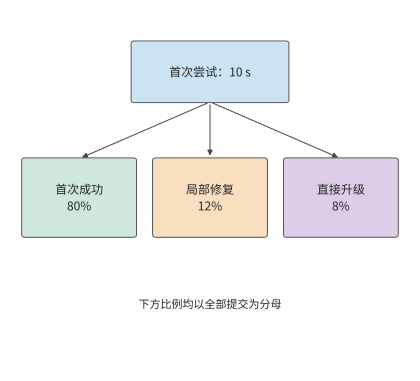

*图 11-36：首次尝试在 10 s 后分为成功、局部修复、直接升级三类。框内比例以全部提交为分母；下一图展开修复的条件分支。*

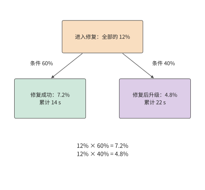

*图 11-37：把修复节点放大：进入此处的 12% 中，60% 修复成功，占全部提交 7.2%；40% 转入升级，占全部提交 4.8%。升级再用 8 s，因此后一条路径累计 22 s。*

六种执行结果如下。每行列出的成本都是整个执行过程的总成本，包含此前各次尝试的支出。

| 执行过程与结果 | 概率 | 完整成本 / 美元 | 时间 / s | 通过测试且按时完成 |
| --- | ---: | ---: | ---: | --- |
| 首次成功 | 0.80000 | 0.010 | 10 | 是 |
| 首次 → 修复成功 | 0.07200 | 0.016 | 14 | 是 |
| 首次 → 修复 → 升级成功 | 0.04704 | 0.046 | 22 | 否 |
| 首次 → 修复 → 升级失败 | 0.00096 | 0.046 | 22 | 否 |
| 首次 → 升级成功 | 0.07840 | 0.040 | 18 | 是 |
| 首次 → 升级失败 | 0.00160 | 0.040 | 18 | 否 |

可以用 1,000 项提交任务逐步计算。首次尝试花费 10 美元，约 800 项直接成功。120 项进入局部修复，新增成本 $120\times0.006=0.72$ 美元，其中约 72 项成功；余下约 48 项连同直接升级的 80 项，共有 128 项升级，新增成本 $128\times0.030=3.84$ 美元。总成本约为 14.6 美元，最终约 997 项成功。

先修复再升级的路径需要 $10+4+8=22$ 秒，超过 20 秒期限。约有 47 项任务通过了测试，但超过了期限，因此按时成功数约为 950。每项通过测试的任务平均花费约 0.0146 美元，每项按时通过测试的任务平均花费约 0.0153 美元；只做首次尝试时，成本为 $10/800=0.0125$ 美元，但成功率只有 80%。恢复提高了完成比例，也提高了单位完成成本。业务若要求至少 95% 的提交按时成功，就需要这项额外投入；若只比较单次成本，则会遗漏它带来的完成量。

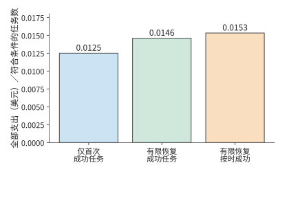

*图 11-38：同一批提交任务换用恢复策略后的成本与结果。各柱均以相应策略的全部支出为分子，再分别除以通过测试的任务数或按时通过测试的任务数；只做首次尝试的成功率为 80%，有限恢复策略约为 99.7%，其中约 95.0% 的提交在 20 秒内成功。分支概率、成本和时间见例 11-8，期限用于评价而不强制停止执行。*

采用上述恢复策略后，成功比例从 80% 提高到约 99.7%，但约 4.7% 的提交要到第 22 秒才能完成。按 20 秒期限统计时，这部分任务花费了资源，却不能计入按时完成数。如果只缩短评价所用的期限，执行过程不变，只是更少的任务会被算作按时成功；如果限制重试次数，控制器则会少执行一些步骤，支出和成功率也会随之改变。[^records]

恢复策略之外，还要考虑模型加速带来的影响。模型变快以后，环境准备可能不再能与模型调用完全重叠，开始影响任务完成时间。假设下一次工具调用必然发生，快速服务还需 6 秒生成，而模板不在本机、走冷路径创建环境约需 2.7 秒；在模型开始生成时创建环境，这 2.7 秒准备时间就完全与模型生成重叠。若模型阶段缩短至 1 秒，同样时机开始创建仍要再等约 1.7 秒。[^core-calculation] 先只把模型调用加快，保持准备策略不变；再比较更早准备、保留已就绪环境和按需等待三种做法的成本，并计入提前占用的资源，以及提前准备的环境最终没有用上时的开销。

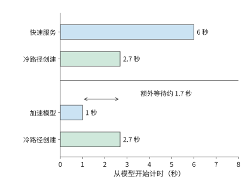

*图 11-39：模型加速后，环境创建成为工具开始执行前的等待来源。两种情况都在零时刻开始创建环境；工具须同时等待模型决策与环境就绪。横轴为秒。*

恢复时要重建的不只是工具环境，还有模型服务一侧的状态。本章设计题用 V4-Flash 计算时间和成本；模型侧状态的恢复则以全书跟踪的 V4.1 Flash 会话为例，因为其全局 KV 可以取回，局部 SWA 状态则要重放提示末尾的 token 来重建（第 3.2.4 节），两部分的恢复路径不同。这样的会话在等待工具时，同时保留两组状态：操作系统管理进程、文件与环境，模型服务管理全局 KV 和局部 SWA 状态。恢复任务需要分别准备这两组状态，再在工具结果进入下一轮模型调用时汇合；已执行的外部操作通过查询目标系统确认结果。[^v41-case] 环境准备与 KV 取回能够并行时，两者中较晚完成的一项决定恢复所需的等待时间。

### 11.5.3 CPU、GPU、内存与服务额度的扩容选择

下面根据章首提出的 24 秒完成期限，选择模型服务与环境管理方案。此前已经得到三项结果：普通服务每次调用 9 秒，三轮需要 30 秒；快速服务每次 6 秒，三轮需要 21 秒；每轮重建环境把每项任务的累计环境内存占用降到 18 GiB·秒，准备工作额外使用 0.3 秒 CPU 时间。

**例 11-9：如何选择模型服务与环境管理方式，才能按期完成且成本最低？** 沿用章首条件：每 0.1 秒到达一项任务，每项执行三轮；工具平台是一台 48 核、约 358 GiB 内存的 m5d.metal，模型服务现有 10 个 V4-Flash 副本（40 张 B200）。两种服务运行同一个模型，最终通过测试的概率均为 95%，且任务能否通过测试与到达时刻无关。模型调用按每次占用的 B200 时间计价，每卡时 6.79 美元：普通服务每次 1.125 B200·秒，约 0.00212 美元；快速服务每次 1.5 B200·秒，约 0.00283 美元。CPU 与内存按 E2B 公布的沙箱单价计费，每 CPU·秒 0.000014 美元，每 GiB·秒 0.0000045 美元，均按实际使用量计算。文件持久化成本已包含在每轮工具执行中；平台共有的固定支出在四种方案中相同。[^design]

首先排除“只增加 CPU”。三轮工具共 3 秒，即使将工具加速两倍，普通服务仍需 $27+1.5=28.5$ 秒；把工具时间降到零，仍有 27 秒模型调用。CPU 扩容无法把这条串行路径缩短到 24 秒以内。

接着比较环境策略。每轮重建环境的准备工作与模型调用重叠，不改变完成时间：普通服务仍为 30 秒，换快速服务后模型总时间降到 18 秒，加工具 3 秒，共 21 秒。因此在快速服务下，始终驻留与每轮重建环境都满足期限，需要进一步比较资源与成本。

图 11-40 先按期限筛选方案：普通模型的最后一轮结束于期限之后，快速模型的三轮则都能在期限内完成。接下来只需在使用快速模型的两种环境策略之间比较成本，同时检查是否超过平台容量。

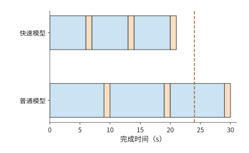

*图 11-40：两种方案均在模型调用期间准备环境，工具执行均为每轮 1 秒。模型调用从每轮 9 秒降至 6 秒，三轮结束时刻从第 30 秒移到第 21 秒，从 24 秒期限之后提前到期限之内。*

| 方案 | 完成时间 / s | 累计 CPU 时间 / CPU·秒 | 每项累计内存占用 / GiB·秒 | 平均内存 / GiB | 每千项提交成本 / 美元 | 按时通过测试的比例 |
| --- | ---: | ---: | ---: | ---: | ---: | ---: |
| 普通服务＋始终驻留 | 30 | 3 | 60 | 600 | 6.68 | 0 |
| 普通服务＋每轮重建环境 | 30 | 3.3 | 18 | 180 | 6.49 | 0 |
| 快速服务＋始终驻留 | 21 | 3 | 42 | 420 | 8.72 | 95% |
| 快速服务＋每轮重建环境 | 21 | 3.3 | 18 | 180 | 8.61 | 95% |

以最后一行为例，三次模型调用共占 $3\times1.5=4.5$ B200·秒，花费约 0.0084875 美元；CPU 成本为 $3.3\times0.000014=0.0000462$ 美元，内存成本为 $18\times0.0000045=0.000081$ 美元，合计约 0.0086147 美元，即每千项 8.61 美元。模型费用占 98% 以上，因此每轮重建环境的主要收益不在费用，而在容量。每秒进入 10 项任务，工具执行与环境准备平均使用 33 个 CPU 核和 180 GiB 内存，都在 m5d.metal 的容量以内；快速服务＋始终驻留则需要 420 GiB，这台主机无法容纳。模型服务平均同时执行 180 次调用，快速服务每个副本只容纳 16 个会话，需要 12 个副本，比现有多 2 个。

选中方案的平均需求满足容量要求，还要确认各阶段能否按时安排。任务均匀到达，可以直接写出一个满足容量限制的时间表。快速服务下，以每项任务的到达时刻为起点，分别在第 4–6、11–13、18–20 秒准备环境，在第 6–7、13–14、20–21 秒运行工具；准备工作累计使用 0.1 秒 CPU 时间，均匀分布在两秒内。任务每 0.1 秒到达一项，稳定运行后，每一轮的工具执行各占 10 个核，每一轮的准备工作各占一个核；活跃环境最多约 90 个，共 180 GiB。三个模型调用阶段各平均有 60 次调用正在处理，合计 180 次并发调用，12 个快速副本共有 192 个并发槽。按此时间表执行，既满足各阶段的先后依赖，也没有超过平台容量。

**因此选择快速服务，每轮重建环境，在模型调用期间完成准备，并把模型副本从 10 个增至 12 个。** 该方案用现有工具主机即可满足 24 秒要求，是四个方案中唯一既能按期完成、又不超出这台主机容量的方案。每千项按时通过测试的任务平均花费约 $8.61/0.95\approx9.07$ 美元；快速服务＋始终驻留即使另配内存，也要约 $8.72/0.95\approx9.18$ 美元，每轮重建环境只让这项成本降低约 1.2%。普通服务＋每轮重建环境虽然更便宜，但即使通过测试，也已经超过期限。

第 11.5.2 节还说明，增加重试会改变按时完成的比例。这里正常任务在第 21 秒完成，剩余期限只有 3 秒；若最终失败后再加一次 4 秒局部修复，结果将到第 25 秒才出现。因此，本题在三轮后结束任务；未通过测试的任务直接返回失败结果。若业务把期限延长到 25 秒，局部修复才有机会增加按时成功数，届时再将条件成功概率和额外资源放入恢复树。

以上选择建立在模型每轮调用 6 秒的条件下。模型继续加速时，可以释放环境内存的空闲时段也会缩短，原来的环境策略就需要重新比较。保留环境还是重新建立环境，由两种方案成本相等时的等待长度即可判断。设两次工具执行之间需要等待模型 $G$ 秒。保持 2 GiB 环境，驻留成本为 $2G\times0.0000045$ 美元；销毁后在下一轮模型调用末尾重新准备，内存成本为 $2\times2\times0.0000045$ 美元，准备所需的 CPU 成本为 $0.1\times0.000014$ 美元，共 0.0000194 美元。两者在 $G\approx2.16$ 秒时相等。等待 6 秒时应重建；等待缩短到 2 秒时，保留环境开始更省，准备也占满全部可重叠窗口。模型继续加速，会改变最合适的环境策略。

还可以用第 1 章的 Amdahl 定律概括局部加速对总时间的影响。令原时间中可加速部分占比为 $f$，将这部分加速 $s$ 倍，剩余部分保持原时长，则整体加速比为

$$
S=\frac{1}{(1-f)+f/s}.
$$

章首工具只占 10% 时间，工具加速两倍的整体加速为 $1/(0.9+0.1/2)\approx1.05$；模型调用占 90%，若完整调用加速两倍，则为 $1/(0.1+0.9/2)\approx1.82$。同样加速两倍，模型调用节省的任务时间更多，因为其占执行时间的比例更高。

第 12 章将在相同任务和完成目标下，进一步比较端侧、边缘和云端的执行方式，分析传输时间对任务完成时间的影响。

## 练习与实验

以下练习沿用 11-1 至 11-10 的资料编号。核心题 11-1、11-2 和 11-10 构成从需求到设计的完整练习；实验原始记录与选做运行入口见[本章配套](ch11/README.md)。

1. **实验 11-1〔核心〕：从多轮任务推算模型并发、CPU 与环境内存。** 平台每秒接收 8 项任务，其中一半执行两轮，另一半执行四轮。每轮模型调用耗时 6 秒，工具占用一个 CPU 核执行 1 秒。求模型调用率、平均并发模型调用数与平均使用的 CPU 核数。若每个环境在任务全程占用 2 GiB，求平台的平均环境内存占用。再假设环境只在每轮 2 秒的准备阶段和 1 秒的工具执行阶段保留，重新计算平均内存占用，以及每秒需要创建的环境数量。
2. **实验 11-2〔核心〕：重建环境与恢复快照如何影响工具等待和内存占用时长？** 一个环境中有可重新下载的依赖、未保存的编辑缓冲、已持久化的补丁和已提交的外部写入。逐项说明发生故障后能从哪里恢复，以及哪些内容无法直接恢复。

   再比较两种能够恢复下一轮所需状态的方案：走冷路径完整重建环境需要 2.7 秒；按 E2B 文档，保存 2 GiB 环境的快照约需 8 秒，从快照恢复约需 1 秒。将上一轮工具执行结束记为计时起点。下一次模型调用立即开始，耗时 9 秒，随后工具执行 1 秒。采用重建方案时，在计时起点释放原环境；采用快照方案时，在该起点开始保存快照，保存完成后释放原环境。

   两种方案都在不推迟下一次工具执行的前提下，尽量晚地开始重建或恢复。画出时间线，并计算从计时起点到下一次工具执行完成期间，各方案累计占用环境内存的时长。重建、保存快照、恢复和工具执行期间均计入环境驻留时间。
3. **实验 11-3：提前准备环境能省多少等待，又占用多少内存？** 创建环境需要 2 秒，对下一次调用所需环境的预测准确率为 0.6。调用到达后取消错误预测所对应的环境；每个提前准备的环境从准备开始就占用 2 GiB。分别在调用到达前 1、2、4 秒开始准备，计算调用到达后的期望等待时间，以及错误准备造成的期望累计内存占用（以 GiB·秒计）。预测错误时，在调用到达后重新创建所需环境。若准确率提高到 0.9，哪些收益变大，哪些浪费减少？
4. **实验 11-4：不同作业完成目标下，迁移何时优于等待。** 新作业所需的资源正被已有作业占用，等待其释放需要 12 秒。新作业获得资源后，在本地执行需要 20 秒。也可以将已有作业迁至其他节点，在迁移完成后释放本地资源；迁移耗时为未知量 $m$，使已有作业的完成时间比不迁移时推迟 $m+2$ 秒。先以新作业最早完成为目标，求迁移优于等待的条件；再以新作业的资源等待时间与已有作业的完成延迟之和最小为目标，重新求解。说明为何在两个目标下可以作出不同选择。
5. **实验 11-5：启动耗时如何影响短期实例的有效产出。** 每个新实例传输与加载共需 8 秒，之后以每秒 100 个有效 token 的速率工作。三个实例从开始启动到回收的时长分别为 10、20、40 秒。分别求各实例的产出，以及实际工作时间占这段时长的比例。若准备时间降到 4 秒，比较三个实例各自的产出改善，并解释可用时间较短的实例为何更敏感。
6. **实验 11-6：验证进程数量与长尾样本如何决定整批完成时间。** 三条样本在 0、6、12 秒到达，验证分别需 10、2、8 秒。先求只有一个执行进程时，按到达顺序处理各条样本的开始和完成时刻；再求使用两个执行进程时，整批最早何时完成。把最后一条样本的验证时间改为 80 秒，判断增加执行进程能否缩短整批完成时间，并解释哪条样本决定了这一结果。
7. **实验 11-7：缓存命中与结果正确性相关时，如何计算成本与按时成功率？** 沿用例 11-7 的 B 服务成本，改为命中时成功率 99%、未命中时 90%。推导平均每个成功任务的成本随命中率变化的关系，以及在 6 秒内通过测试的任务比例。求至少让 90% 的任务按时通过测试所需的最低命中率，并与原独立概率模型比较。
8. **实验 11-8：自建与 API 服务的成功任务成本交点。** 自建方式按 Runpod 价格预留 4 张 B200 一个月，共 19,555.2 美元，运行 V4-Flash，每项任务不再新增成本，任务成功率为 90%；API 方式使用 Claude Sonnet 5，每项任务调用三次，每次花费与例 11-7 中 B 命中时相同，为 0.0088 美元，成功率为 98%。按一个月作为成本比较期，固定支出全部计入该月。两者均有足够能力满足期限，并处理相同数量的任务，求它们的平均成功任务成本相等时的任务量。再将自建处理上限设为每月 50 万项，讨论交点怎样影响购买决定。
9. **实验 11-9：任务期限与提前停止如何改变重试成本和成功率。** 沿用例 11-8，将期限改为 14、18、22 秒，分别求按时通过测试的比例。再设计一种在剩余时间不足以完成下一节点时停止的策略，重新计算期望成本，并解释它与仅改变评价期限的差别。
10. **实验 11-10〔核心〕：到达率提高后如何扩容并选择环境驻留策略。** 沿用例 11-9，将到达率增加到每秒 15 项，每次调用只输出 118 个 token，快速服务调用时间降到约 2.0 秒，每项任务仍执行三轮，每轮工具执行仍需 1 秒。工具主机、每个副本的会话数和各项单价保持原值。比较始终驻留与每轮重建环境，决定应增加哪项资源、至少增加多少，并说明环境策略是否需要改变。最后将到达方式改为每秒有 15 项任务同时到达，画出工具执行的时间线，并标出 CPU 并发占用的峰值。

[^environment]: 本书 [environment-resources 固定计算](../calculations/results/environment-resources-book.md)及[工具子进程记录](../experiments/ch11/11-01/process-resources/README.md)。工具实验包含九组、36 个进程，累计内存占用由采样 RSS 对时间积分得到。

[^lifecycle]: [environment-lifecycle 固定预算](../calculations/results/environment-lifecycle-default.md)区分共享／私有容量、串行传输的耗时下界和局部预热实测。本章使用固定容量预算比较四种内容加载方式。

[^platform]: [调度、模型路由与云端环境研究](../case-studies/platform-routing.md)，包含 ASI、RLBoost、DistRS、SpecBox。ASI 研究覆盖六个月、155,410 张 GPU，其分配比例度量设备归属。token 单价取自 [Claude API 计价页快照](../references/outline-checks/2026-09-07/platform-routing/claude-api-pricing.md)。

[^e2b]: [E2B 固定架构](../references/outline-checks/2026-09-07/platform-routing/e2b-architecture.md)、[持久化文档](../references/outline-checks/2026-09-07/platform-routing/e2b-persistence.md)（暂停约每 GiB 内存 4 秒、恢复约 1 秒，以及只保存文件系统的暂停）、[暂停与快照接口行为核对](../experiments/ch11/11-02/README.md)。E2B 使用 Firecracker。

[^ub]: [UB 操作系统参考设计](../references/files/specs/UB-Software-Reference-Design-for-OS-2.0-zh.pdf)中的设备虚拟化与交付路径，作为 QEMU／VFIO 的实现例证；这里描述支持设备直通的虚拟机配置。

[^prewarm]: [本地工具预热重放](../experiments/ch11/11-06/README.md)。实际调用、预测命中与采样窗口边界在原记录中保存。

[^scheduling]: [DRF](../references/files/papers/drf.pdf)、[Gavel](../references/files/papers/gavel.pdf)、[Pollux](../references/files/papers/pollux.pdf)作为调度机制背景；[资源共享与放置](../case-studies/resource-sharing-and-placement.md)补充资源可用性和状态交付的区别。

[^rollout]: [权重准备与有效产出调研](../case-studies/preemptible-rollout-and-weight-readiness.md)，记录 RLBoost 论文条件与 PolyRL 固定源码路径。Qwen3-8B 的权重字节数取自 [safetensors 索引](../calculations/sources/qwen3-8b/model.safetensors.index.json)；200／50 Gbit/s 前端网卡与实例价格取自 RLBoost 论文。

[^recovery]: [Qwen3-8B 抢占恢复实验](../experiments/ch11/11-04/README.md)，分别记录生成、客户端收到和恢复时采用的 token 数量。

[^reward]: [DistRS 验证调度与 verl 实现分析](../case-studies/reward-deadlines-and-feedback.md)。

[^validation]: [超时与资源释放实验](../experiments/ch11/11-05/README.md)、[双 batch 调度记录](../experiments/ch11/11-05/batch-scheduling/README.md)。实验使用受控 CPU 进程。

[^thinking]: [思考预算与质量记录](../experiments/ch11/11-08/README.md)、[增加思考预算后的检查](../experiments/ch11/11-08/wide-budget/README.md)。记录分别检查生成是否自然结束，以及输入状态是否满足要求。

[^routing]: [routing-cost 固定结果](../calculations/results/routing-cost-book.md)、[交点结果](../calculations/results/routing-cost-crossover.md)及[完整推导](../case-studies/routing-cost-and-completion.md)。Haiku 4.5 与 Sonnet 5 的单价取自 [Claude API 计价页快照](../references/outline-checks/2026-09-07/platform-routing/claude-api-pricing.md)；计算采用与缓存命中相互独立的验收通过概率，成功任务数按给定概率计算。

[^purchase]: B200 Pod 每卡时 6.79 美元、Serverless 每卡时 8.64 美元取自 [Runpod 价格页快照](../experiments/ch13/13-06/single-agent-serving/comparison-sources/gpu-prices.md)。计算结果为 25.317 ms，其中 decode 为 15.918 ms，其余阶段共 9.399 ms。此处逐层固定开销和周期全量重建为给定输入，详见[持续 Agent 比较基线](../experiments/ch13/13-06/single-agent-serving/COMPARISON-RESULTS.md)、[优化审计](../experiments/ch13/13-06/single-agent-serving/OPTIMIZATION-AUDIT.md)、[时间归因与敏感性](../experiments/ch13/13-06/single-agent-serving/AUDIT-RESULTS.md)。

[^records]: [任务记录与证据范围](../case-studies/evaluation-and-agent-records.md)、[文件队列故障注入](../experiments/ch11/11-09/collector-faults/README.md)、[任务退出状态记录](../experiments/ch11/11-09/exit-status/README.md)。这些记录分别用于说明结果持久化、故障诊断和成本核算。

[^fsync]: Linux 手册 [write(2)](https://man7.org/linux/man-pages/man2/write.2.html) 与 [fsync(2)](https://man7.org/linux/man-pages/man2/fsync.2.html)。`write()` 成功不保证数据已写入持久存储，调用者还须检查实际写入字节数与同步错误。新建或重命名文件时，目录项的持久化还可能需要对目录执行 `fsync()`；文件同步本身不提供多文件事务。

[^durability]: [Safe to Resume?（2026，预印本）](https://arxiv.org/abs/2608.29381)分析恢复状态与继续执行所需依赖不一致的问题。本节的请求缺口与批量提交数字为教学算例，不是论文测量结果。

[^agent-transaction]: [Agentic Transaction（2026，预印本）](https://arxiv.org/html/2608.13900v1)提出面向 Agent 的语义原子性、一致性、隔离性与持久性；其中 §2.2.4 讨论已提交状态、证据与恢复元数据的持久保存。本节以代码修复说明提交单元的设计，不据此假定任意工具调用都具备 ACID 保证。

[^retry]: 精确结果：成功概率 0.99744，通过测试且按时完成概率 0.9504，每项期望成本 0.01456 美元，累计 CPU 时间 3.376 秒，驻留 23.008 GiB·秒。计算结果分别列出资源用量和成本；各节点的给定成本已经是总价，无需再按资源用量重复计费。见[retry-paths 有限条件图](../calculations/results/retry-paths-book.md)。各节点成本按 Claude 标准价格与题设 token 数计算，概率按题设给定，重试沿有限执行树展开；超过评价期限的任务仍继续执行到终点。

[^design]: 贯穿平台与例 11-9 的输入、逐阶段时间表、成本、成本相等的条件与复算见[贯穿设计数据](ch11/platform-design.json)及[验证程序](ch11/verify.py)。模型调用时间取自本书对 4 张 B200 运行 DeepSeek V4-Flash、每会话 200K 上下文的估算：每副本 32 个会话时每个输出 token 25.3 ms，16 个会话时 16.9 ms，均含分摊的输入处理与上下文重建（[比较结果](../experiments/ch13/13-06/single-agent-serving/COMPARISON-RESULTS.md)、[完整数据](../experiments/ch13/13-06/single-agent-serving/comparison.json)）；355 个 token 的调用分别约 8.99 s 和 6.01 s，设计取 9 s 和 6 s。B200 每卡时 6.79 美元取自 [Runpod 价格页快照](../experiments/ch13/13-06/single-agent-serving/comparison-sources/gpu-prices.md)。m5d.metal 的 48 核（关闭超线程）与 384 GB 内存取自 [Firecracker 论文](../references/text/firecracker.txt)第 5 节的评测环境；1 vCPU、2 GiB 规格与 CPU、内存单价取自 [E2B 计价页快照](../references/files/documents/e2b-pricing.md)。热路径准备共 2 秒、0.1 CPU·秒与 95% 验收通过率为题设，结果保存与工作状态清理包含在工具的 1 秒内；模板容量算例单独说明内容加载。

[^nodes]: [DGX H100 系统规格](../references/text/dgx-superpod-h100-ra.txt)（双路 Xeon Platinum 8480C，共 112 核）；[DGX A100 系统规格](../references/text/nvidia-a100.txt)（附录 A 表 10，双路 EPYC 7742，共 128 核）。

[^firecracker-history]: Agache 等，AWS，[Firecracker: Lightweight Virtualization for Serverless Applications](../references/text/firecracker.txt)，NSDI 2020。

[^core-calculation]: 本章条件比较的[逐项复算](../calculations/results/core-principles.json)与[计算程序](../calculations/core_principles.py)。

[^v41-case]: [DeepSeek V4.1 官方技术报告](../calculations/sources/deepseek-v4.1-flash/DeepSeek_V41_Tech_Report.pdf)，第 1、2、3 节与第 6 节；[跨章会话的固定条件与复算](../calculations/results/v41-throughline.json)。

## 本章小结

章首平台平均只用 30 个 CPU 核，环境却需要 600 GiB 内存，超出了 m5d.metal 的 358 GiB。原因是三轮任务中有 27 秒在等待模型，而工具环境始终占用内存。在模型调用期间准备环境，每项任务的累计内存占用就从 60 降到 18 GiB·秒，能释放大量内存；代价只是准备工作多用 0.3 秒 CPU 时间。

这项改进利用了完整任务的执行关系。环境管理器确定模型调用期间可用于准备的时间后，可以提前创建环境，让进程仅在工具准备和执行期间存在；持久化文件保存各轮之间需要保留的状态。模型服务和环境平台共同安排准备时机，原本贯穿任务全程的资源占用就变成了按阶段分配。

释放内存以后，任务仍需 30 秒，模型调用成为满足 24 秒期限的关键。把每个 V4-Flash 副本的会话数从 32 减到 16，调用从 9 秒降到 6 秒，三轮任务从 30 秒降到 21 秒，平均并发模型调用数也从 270 次降到 180 次；代价是每次调用多占 0.375 B200·秒，副本要从 10 个增至 12 个。结合每轮重建环境，一台 48 核、358 GiB 内存的 m5d.metal 即可支持给定任务流。最后在满足质量和期限的方案之间比较成本。

同样的方法也解释了 RL 的资源组织：成组作业先取得配套资源，临时的 rollout 实例先完成权重传输和加载，样本生成后立即提交验证，可以让验证与后续生成同时进行；失败后重试，则需要累加各次尝试的工作量。分析资源需求，要计算任务总共做了多少工作；分析完成时间，还要考虑这些工作必须按什么顺序执行、哪些可以同时进行。结合这两方面，才能判断一项局部改进对整个系统是否有益。
