# 第 12 章 端边云协同

一张图片交给云端精修，模型运行 0.3 秒，用户却等待 12.8 秒。将模型加速十倍，只能节省 0.27 秒；把输入文件压缩到原来的一半，却能节省近 6 秒。决定模型放在哪里时，需要比较整个任务的完成时间。远端设备可以加快模型计算，但调用远端服务也会增加传输和等待时间。

第 8—11 章介绍了模型服务、资源调度和任务运行环境。本章讨论如何把这些服务和环境部署到不同设备上。**端侧**采集输入并与用户交互；**边缘**是在附近提供计算的工作站或服务节点；**云端**提供远程资源池。终端可以在本地执行，也可以调用附近工作站或云端服务，还可以把模型的不同阶段分配给不同设备。

本章先用图片精修建立时间模型，再用语音解释流水线中的先后依赖，最后为根据截图判断下一步、再调用工具执行操作的截图 Agent 选择部署方案。图片精修需要计算完整成片何时返回，语音需要分析音频能否连续播放，Agent 则要累计每轮通信与执行的开销。三类任务共用一套分析方法：先计算处理和传输各需多久，再确定哪些步骤必须等待，最后加入连接建立、排队和故障恢复等实际开销。

## 12.1 从模型运行时间到完整交互时间

### 12.1.1 图片精修

图片精修需要保留阴影、高光和白平衡等信息。要为后期编辑保留更多原始信息，通常就要传输更大的文件。本例上传一张 30 MB 原图，处理后返回一张 5 MB 成片，以用户收到完整成片为任务结束的标志。[^raw]

先沿一张图片的路径看数据在何处停留。本例的具体速率和处理时间标在图 12-1 中，随后用通用公式表示这些量之间的关系。

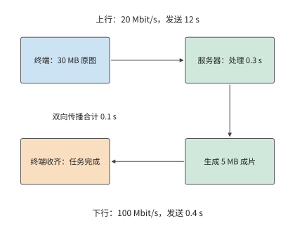

*图 12-1：原图经上行到服务器，服务器收齐后处理，再经下行返回完整成片。实线箭头表示数据与处理顺序；连接已建立，双向传播合计 0.1 s。*

建立模型时，先区分**各步骤所需时间**与**任务完成时间**。文件大小除以发送速率，得到发送所需时间；模型的计算时间则由计算量和处理器的执行速度决定。各步骤依次执行时，总时间等于各步骤耗时之和；部分步骤同时执行时，则要根据它们的先后依赖，计算最后一步何时结束。

把这些关系写成公式之前，先约定本例的简化条件：往返时间（round-trip time，RTT）简化为往返传播所需的时间，排队和协议处理的耗时在第 12.3 节单独讨论。连接已经建立，服务器收齐原图后开始处理，生成完整成片后再向用户发送，上下行以恒定速率传输有效载荷。设输入为 $S_u$ bytes，输出为 $S_d$ bytes，上下行速率为 $B_u,B_d$ bytes/s，RTT 为 $R$，处理时间为 $T_c$。串行完成时间为

$$
T_{\mathrm{serial}}=\frac{S_u}{B_u}+R+T_c+\frac{S_d}{B_d}.
$$

上传的最后一个字节离开发送方后，还要传播到服务器；成片返回也要传播一次。两次单向传播合计为 $R$。传播时间由路径决定，发送时间由文件大小与速率决定，因此缩小文件只会缩短发送时间。这里的 $B_u,B_d$ 表示有效载荷的传输速率，连接启动和反馈等待将在第 12.3 节单独加入。

**例：图片精修的上传时间如何限制模型加速收益？** 上行 20 Mbit/s，下行 100 Mbit/s，$R=0.1$ s，$T_c=0.3$ s。本章 MB 与 Mbit 使用十进制；MiB 为 $2^{20}$ bytes。代入得

$$
T_{\mathrm{serial}}=\frac{30\times8}{20}+0.1+0.3+\frac{5\times8}{100}
=12.8\ \mathrm{s}.
$$

上传占 12 秒，约为总时间的 94%。将处理阶段加速十倍，完成时间缩短至 12.53 秒，只节省 0.27 秒。即使处理瞬间完成，上传、传播和下载仍需 12.5 秒。这正是 Amdahl 定律所描述的限制：处理阶段只占总时间的约 2.3%，即使消除这部分耗时，总时间也只能缩短约 2.3%。

模型加速节省的时间有限，另一条路是缩短传输。把上行速率提高至 100 Mbit/s，上传时间降至 2.4 秒，整个任务只需 3.2 秒，速度提高到原来的四倍。另一种办法是保持上行速率不变，压缩输入。假设无损压缩将输入减半，额外的编解码共需 0.15 秒，则发送只需 6 秒，完整任务约为 7.0 秒。压缩之所以值得，是因为增加 0.15 秒编解码，节省了 6 秒传输。

设压缩后的输入大小为 $S'_u$，额外的编解码时间为 $T_e$，压缩节省的总时间为

$$
\Delta T=\frac{S_u-S'_u}{B_u}-T_e.
$$

令该式的收益为零，就能求出压缩恰好不再省时的上行速率。上行速率为 20 Mbit/s 时，少传 15 MB 可节省 6 秒；为 100 Mbit/s 时节省 1.2 秒；达到 800 Mbit/s 时只节省 0.15 秒，收益降至零。同一种压缩方法的运算量没有改变，改变的是发送这些字节需要多少时间。图 12-2 显示了这种关系。

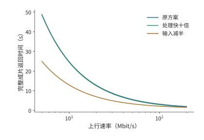

*图 12-2：压缩和计算加速对任务完成时间的影响随上行速率而变化。本例采用原图 30 MB、成片 5 MB、下行 100 Mbit/s、RTT 0.1 秒，原处理时间 0.3 秒；压缩方案将输入减半并增加 0.15 秒编解码。三种方案的成片质量相同，连接已建立且各阶段串行。*

再考虑各步骤能否重叠。假设原图分成三块后可以逐块独立处理，每块上传需 4 秒、处理需 0.1 秒；三块输出分别为 1、2、2 MB，回传依次需 0.08、0.16、0.16 秒。第一块到达服务器后，其处理和回传可以与第二块上传重叠；第二块同理。最后一块仍要等到第 12 秒才发完，之后再经过处理、回传和传播，完整成片约在 12.4 秒返回用户。与原来的 12.8 秒相比，前两块的处理与回传在后续上传期间就已完成，不再额外增加等待；但总计 12 秒的上传时间无法缩短。[^stream]

图 12-3 和图 12-4 用相同的时间轴比较两种安排。

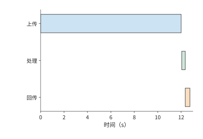

*图 12-3：整图串行：30 MB 全部上传并传播到服务器后才处理，随后回传 5 MB。上行 20 Mbit/s、下行 100 Mbit/s、单向传播 0.05 s，任务于 12.8 s 完成。*

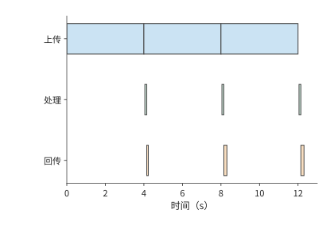

*图 12-4：三块各上传 4 s，每块到达后独立处理 0.1 s，随后回传 1、2、2 MB。前两块的处理和回传与后续上传重叠，完整成片于 12.36 s 返回。*

如果处理需要全局曝光或跨块信息，就要等整张图到齐后才能开始处理，即使分块发送，整个任务仍需 12.8 秒。计算量和数据量决定各步骤所需时间，依赖关系决定各步骤能否同时执行。实时语音服务持续接收、处理和播放音频，更适合用流水线描述这种依赖。

### 12.1.2 实时语音

自动语音识别（ASR）将音频转为文本，文本转语音（TTS）将文本转为可播放音频。流式服务可以一边接收输入，一边产生结果。以 TTS 为例，用户可以在整段音频生成完之前开始收听。因此，除了整段合成何时结束，还需要知道首段何时开始播放，以及后续播放是否连续。

要算出这些时刻，先把流水线写成逐块的递推关系。考虑一条输入块与输出块一一对应的音频处理流水线。采集端每 20 ms 产生一块音频，模型处理后将结果发出，播放器按顺序播放。第 $i$ 块输入在 $a_i$ 时刻就绪，模型处理耗时为 $m_i$，发送耗时为 $s_i$，单向传播为 $d_i$。处理器逐块处理音频，网络接口逐块发送结果，则

$$
 c_i=\max(a_i,c_{i-1})+m_i,\qquad
 u_i=\max(c_i,u_{i-1})+s_i,\qquad
 r_i=u_i+d_i.
$$

其中，$c_i$、$u_i$、$r_i$ 分别表示处理完成、发送完成和到达的时刻。第一个最大值表示，处理本块既要等输入就绪，也要等处理器完成上一块；第二个最大值表示，发送本块既要等计算完成，也要等出口空闲。这两处等待分别来自数据依赖和资源竞争。

**例：网络延迟抖动为何会耗尽音频播放缓冲？** 脉冲编码调制（PCM）逐次记录音频幅值采样；24 kHz 表示每秒 24,000 次采样，单声道表示一条采样通道，16-bit 表示每个样本占 2 字节。使用 24 kHz、单声道、16-bit PCM，每块 20 ms、960 bytes。处理一块需 12 ms，发送需 1 ms，通常传播耗时为 5 ms。第一块在 20 ms 采集完，于 38 ms 到达；缓冲 40 ms 后在 78 ms 播放（图 12-5）。第二块在 58 ms 到达，于 98 ms 接着播放。每块的处理时间比采集间隔短 8 ms，发送也只需 1 ms，因此处理和发送都能跟上采集速度。

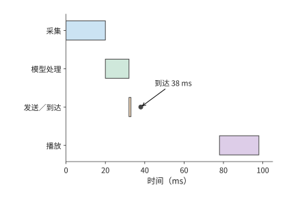

*图 12-5：第一块音频从采集开始计时：20 ms 就绪，32 ms 处理完，33 ms 发完，38 ms 到达；初始缓冲 40 ms 后于 78 ms 播放。圆点标出到达，最后一行是播放设备的时钟。*

把第三块的传播时间改为 50 ms，该块在 123 ms 到达，比原定的播放时刻 118 ms 晚了 5 ms。第四块虽然在 98 ms 已经到达，播放器仍须先播第三块，因而后续播放一起推迟（图 12-6）。[^audio]

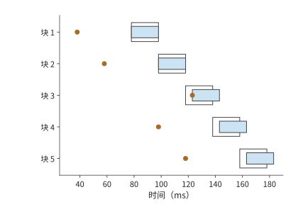

*图 12-6：第三块晚到使后续各块的播放时间都推迟 5 ms。每块长 20 ms，模型处理 12 ms、发送 1 ms；通常传播耗时为 5 ms，第三块传播 50 ms，初始缓冲 40 ms。实线段表示实际播放，浅色轮廓表示原定播放区间，圆点表示到达；所有时间均从开始采集第一块起算。图为上述流水线的计算结果，播放器等待缺块而不丢弃。*

把这条播放规则一般化：令每块音频的时长为 $\tau$，初始缓冲为 $J$。首块开始播放的时刻为 $p_0=r_0+J$，后续各块的开始时刻满足

$$
p_i=\max(r_i,p_{i-1}+\tau).
$$

这里取最大值，是因为播放器既要等待“本块到达”，也要等待“上一块播完”。当第一项更大时，差额就是新增停顿。把初始缓冲从 40 ms 增至 45 ms，第三块的计划播放时刻也推迟到 123 ms，恰好可以避免晚到 5 ms 造成的播放中断；代价是首段也要晚 5 ms 开始播放。增加初始缓冲会延长首次播放前的等待，但也能容忍更大的到达时间波动，使后续播放更连续。

长期传输速率不足会产生另一种停顿。为便于计算，取 16 kHz、单声道、16-bit PCM，播放所需的数据速率为 256 kbit/s，20 ms 对应 640 bytes。若网络长期只能以 130 kbit/s 传输音频，缓冲每秒净减少 126 kbit。初始缓冲保存的 60 ms 音频包含 15,360 bits，大约 $15360/(256000-130000)\approx0.12$ 秒就会耗尽。

把尚未播放的数据画成随时间下降的曲线，就能看出短时抖动与长期速率不足的区别。图 12-7 中，增加缓冲只抬高起点，斜率没有改变。

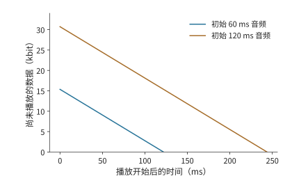

*图 12-7：缓冲量等于初始数据量加累计接收量，再减累计播放量。PCM 播放需要 256 kbit/s，接收只有 130 kbit/s，两条直线的下降速率均为 126 kbit/s。初始缓冲分别包含 60 ms 和 120 ms 音频，约在 0.12 秒和 0.24 秒耗尽；图画到各自第一次耗尽为止。*

增大缓冲只会按比例推迟耗尽时刻；提高传输速率或降低音频码率，才能让收到的数据足够播放。缓冲可以减轻短时延迟波动对播放的影响，长期传输速率不足则需要增加带宽或减少数据量。

### 12.1.3 Computer Use：通过界面操作完成任务

Computer Use（计算机界面操作）让程序像用户一样通过截图、点击和输入完成任务。程序在观察界面、模型判断、执行操作和再次观察之间循环。这类任务与音频流水线的关键区别是：只有上一轮操作完成、界面更新后，才能取得下一张有效截图。模型还没决定点击哪里时，就无法取得点击后的界面。因此，一轮中的等待会在任务中重复累积。

图 12-8 的返回箭头说明，这一任务难以像音频那样逐块重叠：后续工作必须等待操作产生新的界面。

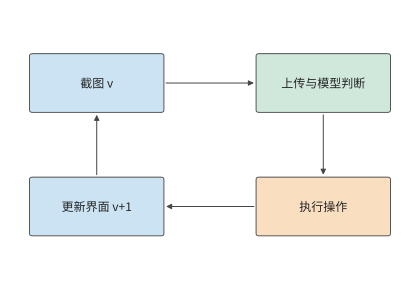

*图 12-8：截图 Agent 的一轮执行。箭头表示先后依赖，方框宽度不表示耗时。底部返回箭头要经过操作执行与界面更新，才能取得下一轮截图。*

以需要 30 轮操作的任务为例。使用原有服务时，每轮上传 0.8 MB 截图，上行 6.4 Mbit/s，上传需 1 秒；终端观测、操作与界面更新合计 0.3 秒，远端模型 2.0 秒，往返传播 0.2 秒。连接已建立，控制回复的发送时间取零。一轮为 $1+0.3+2.0+0.2=3.5$ 秒，30 轮共 105 秒。

**例：截图压缩节省的传输时间能否抵消额外操作轮次？** 将截图压缩至 0.2 MB，额外编码需 30 ms，上传时间降为 0.25 秒，其余工作仍需 2.5 秒。于是

$$
T'_{\mathrm{round}}=0.25+0.03+2.5=2.78\ \mathrm{s}.
$$

每轮节省 0.72 秒，30 轮节省 21.6 秒，任务从 105 秒降至约 83 秒。

压缩还可能改变操作轮数。若文字变模糊使 Agent 多执行纠错操作，压缩后的总时间应写为 $2.78N'$，其中 $N'$ 是实际所需轮数。由 $2.78N'<105$ 得 $N'<37.8$，仍能缩短任务时间的最大轮数为 37；38 轮约需 106 秒。压缩后的图像质量会影响纠错次数。该任务最多允许增加七轮操作；超过这一数量，纠错时间就会抵消压缩节省的时间。

截图版本也直接影响轮数。假设模型读到版本 $v$，随后界面变化，按旧截图作出的操作就可能出错，需要恢复界面并重新截图。把截图版本与动作编号绑定，让终端在界面变化时重新截图，可以避免这类无效工作。[^author]

第 12.5 节将继续分析该截图任务：前十轮已完成，剩余二十轮需要选择执行位置，届时保持截图大小、终端工作和原路径参数不变，比较更快的模型服务能缩短多少时间。

### 12.1.4 本地、附近设备与云端的初步比较

第 12.1.1 至 12.1.3 节的分析可以归纳为三个层次，每层对应不同的计算对象：

| 分析层次 | 计算对象 | 已得到的判断 |
|---|---|---|
| 各步骤耗时 | 计算、发送和传播各需多久 | 原图上传占 12 秒，模型占 0.3 秒 |
| 执行依赖 | 哪些工作可以重叠，哪些必须等待 | 独立图片块可重叠，下一轮截图要等上一轮操作完成 |
| 实际执行 | 数据就绪后，计算和发送何时开始 | 音频即使平均传输速率足够，一次晚到仍可造成停顿 |

先用各步骤耗时与依赖关系判断远端执行能否更快。将整个任务交给远端服务时，节省的计算时间必须超过上传、下载、传播、排队和准备增加的时间。多轮任务的准备只需做一次，通信却每轮都会发生；连续播放的音频还要保证数据及时到达。模型放在哪里，会同时改变计算、通信和准备时间。

最短传播时间可以尽早排除距离过远的服务器。光在光纤中约以 $2\times10^8$ m/s 传播，单向路径长 10,000 km 时，往返传播至少需要约 100 ms。如果要求 50 ms 内收到远端应答，仅传播时间就已超过时限。使用更近的服务器，可以直接缩短这部分等待。

以上比较把端侧当作一个执行位置，只计算端侧与远端的时间差；端侧设备本身能算多快、能容纳什么，尚未展开。第 12.1.5 节先定量分析端侧的执行资源，第 12.2 节再决定传什么：把整项任务交给远端处理时传图片，在端侧编码后传特征，迁移会话时则传状态；传输对象改变后，数据量和所需时间也随之改变。

### 12.1.5 端侧执行资源与本地部署

第 12.5 节比较部署方案时要用到“端侧每轮模型计算 2.9 秒”。要说明这一数值的来源和成立条件，就要把端侧设备当作执行资源定量分析：内存带宽决定每生成一个 token 至少要多久，内存容量决定能容纳什么模型、留下多长上下文，能耗与电池决定能持续多久。

**手机作为执行资源：带宽先给出每秒 token 的上限。** 旗舰手机的 SoC 使用 LPDDR5X 内存，这是面向手机等移动设备的低功耗 DRAM 标准。Snapdragon 8 Elite 的产品简介给出最高 5,300 MHz、最大 24 GB 容量，但未给出总线宽度；LPDDR5X 每个时钟周期传两次数据，5,300 MHz 即每引脚 10.6 Gbit/s，略低于 LPDDR5X 器件 10.7 Gbit/s 的最高速率档；JEDEC 标准器件为 x16 单通道。[^phone] 按 SoC 支持的速率，一条 x16 通道的带宽为 $16\times10.6/8=21.2$ GB/s；按四条 x16 通道计，合计 84.8 GB/s。[^phone-ledger]

带宽给定后，每步要多久取决于这一步读取多少数据。固定工作量沿用第 4.8.2 节的算例：Qwen3-8B、BF16、单请求、8K 上下文，一步 decode 读取权重 15.14 GB、KV 1.21 GB，合计约 16.345 GB。[^phone-ledger] 只把权重读一遍需要

$$
\frac{15.14\ \mathrm{GB}}{84.8\ \mathrm{GB/s}}\approx0.179\ \mathrm{s},
$$

即 decode 上限约 5.6 token/s；计入 KV 后每步约 0.193 s，上限约 5.2 token/s。量化直接减少每步读取的字节数：按第 8.4 节的 q4_0 分组格式，每 32 个 BF16 值从 64 bytes 变为 18 bytes，权重每步读取降至约 $15.14\times18/64\approx4.26$ GB，每步合计约 5.47 GB、64.4 ms，上限约 15.5 token/s。MELTing Point 在 iPhone 14 Pro 上实测 Zephyr-3B q4_k 为 14.8 token/s、Llama-2 7B q3_k 为 6.0 token/s（q4_k、q3_k 是与第 8.4.1 节 Q2_K 同属 GGML 系列的 4-bit、3-bit 分组量化格式），与这里推导的量级一致。[^melt]

**容量决定能容纳什么模型、留下多长上下文。** 沿用第 2.6.2 节的容量公式：可用内存减去权重与固定预留，剩余部分除以每条请求的状态大小。手机内存取 Micron LPDDR5X 的 6、12、24 GB 三种容量选项，再加旗舰手机常用的 16 GB，系统与工作区预留 4 GB。[^phone] Qwen3-8B 的 BF16 权重共 16.38 GB，比每步读取的 15.14 GB 多出约 1.24 GB 的词嵌入表：decode 每步只按 token 查一行，整张表却要常驻内存。按常驻口径，只有 24 GB 一档能容纳，扣除预留后剩约 3.62 GB，仅够两条 8K 请求；量化到 q4_0 后约 4.61 GB：

| 手机内存 | 扣除预留与 4.61 GB 权重后 | 可容纳的请求与上下文 |
|---|---:|---|
| 6 GB | 约 −2.61 GB | 无法容纳 8B；3B 级 q4 模型约 1.7 GB，可以容纳 |
| 12 GB | 约 3.39 GB | 两条 8K 请求，或单条约 2.3 万 token |
| 16 GB | 约 7.39 GB | 六条 8K 请求，或单条约 5.0 万 token |
| 24 GB | 约 15.39 GB | 十二条 8K 请求，或单条约 10.4 万 token |

一条 8K 请求的 BF16 KV 为 1.21 GB，每 token 占 147,456 bytes，随上下文长度线性增长；容纳模型之后，剩余内存直接决定上下文长度。16 GB 一档也是 8-bit 量化的分界：q8_0 权重约 8.70 GB，扣除预留后剩约 3.30 GB，可放两条 8K 请求；更小内存的手机无法容纳 8-bit 的 8B 模型。

**能耗与续航是端侧特有的代价。** 第 4.1.3 节的能耗分账给出 H100 上单请求 8K decode 每 token 约 0.534 J 的量级估计，只含数据搬移与矩阵计算。手机上的实测则包含整机功耗：MELTing Point 测得每 token 0.16–0.21 mWh，即 0.576–0.756 J；持续功率最高 13.8 W，瞬时超过 18 W。吞吐与能耗的实测值可以互相核对：14.8 token/s 乘以每 token 0.576 J 约为 8.5 W，在 13.8 W 的持续功率之内。按这组测量推算，一次充电可完成约 490–590 个提示的推理。[^melt] 因此端侧的代价不只是时间和费用：持续生成的速率受功率上限约束，累计的工作量受电池容量约束。

**本地部署的三档设备。** 比手机高的两档可以直接取自第 4.8.2 节，那里已用同一模型列出 11 款候选设备的 decode／prefill 时间下界：M3 Ultra 的统一内存为 819 GB/s、256／512 GB，每步读取下界 19.96 ms，约 50.1 token/s，容量足以容纳 4-bit 的 235B MoE（第 4.6.3 节）；RTX PRO 6000 为 1,792 GB/s、96 GB，每步 9.12 ms，约 109.6 token/s。图 12-9 把三档设备放进同一条时间轴。

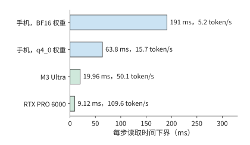

*图 12-9：三档本地设备读一遍 Qwen3-8B 单请求 8K decode 主要载荷（16.345 GB）的时间下界。手机按四条 x16 LPDDR5X 通道计，合计 84.8 GB/s，BF16 与 q4_0 权重分别成行；M3 Ultra 与 RTX PRO 6000 取自第 4.8.2 节的设备表。柱端标注对应的 token/s 上限。*

**运行时各解决一层问题。** 设备给出带宽与容量下界，实际执行还取决于运行时。llama.cpp 解决权重如何存储、如何逐块执行：GGUF（llama.cpp 使用的模型文件格式）的分组量化布局决定加载后的容量与每步读取量，第 8.4.1 节已算过 Q2_K 每组 84 bytes、平均每值 2.625 bit。Ollama 解决模型的分发与本地服务封装：对应第 12.2.3 节“一次准备、多次复用”的权衡，Ollama 节省的是部署准备时间，而不是每步执行时间。MLX 面向 Apple 统一内存（第 4.6.3 节）：CPU 与 GPU 共用同一内存池，免去两者之间的数据拷贝，模型容量上限即整机内存。Unsloth 面向端侧与单卡微调：把训练状态的容量预算压进一张卡或一台整机，量化格式仍来自第 8.4 节。这四个运行时都不改变以上推导的带宽与容量下界，只决定实际执行能在多大程度上接近下界。衡量这段距离的统一尺度，是实测耗时与下界的倍数。第 12.5.2 节将用实验 8-1 的记录说明，RTX PRO 6000 上一步 decode 的实测时间是读取下界的 2.83 倍，多出的主要是每步的固定开销；按第 1.3.4 节的判据，这是可以减少的系统开销，不是设备能力不足。

其中，Unsloth 节省的容量可以用第 10.1.2 节的每参数字节数直接算出。全参数混合精度 Adam 每参数 16 bytes：BF16 权重与梯度各 2 bytes，FP32 主权重与两份矩各 4 bytes。LoRA 冻结基础权重，只为新增的低秩 adapter 保留梯度与优化器状态：Qwen3-8B 在 Q、V 投影上的 rank-16 BF16 adapter 为 14.6 MiB（第 8 章末尾的多 LoRA 算例），约 765 万参数。adapter 的权重、梯度、主权重与两份矩合计每参数 16 bytes，约 0.12 GB；再加上 16.38 GB 的 BF16 基础权重，共约 16.5 GB。只按常驻状态比较，激活与临时缓冲另计：

| 显存 | 全参数混合精度 Adam，16 bytes／参数 | BF16 基础权重＋rank-16 Q／V LoRA |
|---|---:|---:|
| 24 GB（RTX 4090） | 约 1.5B 参数 | 约 12B 参数；Qwen3-8B 需约 16.5 GB |
| 96 GB（RTX PRO 6000） | 约 6B 参数 | 约 48B 参数 |

一张 RTX 4090 无法容纳 Qwen3-8B 全参数训练的 131.1 GB 状态，却能容纳其 LoRA 训练；Unsloth 节省的是这份状态，而非每步读取权重的带宽下界。

**翻转条件：何时端侧足够，何时必须上云。** 三个下界各给出一个翻转条件。带宽：每轮生成 $G$ 个 token 时，端侧模型时间下界为 $G$ 乘以每步时间。第 12.5 节的“端侧每轮模型计算 2.9 秒”就是这样得到的：按 q4_0 的 15.5 token/s，2.9 秒对应每轮生成约 45 个 token；按 BF16 的 5.2 token/s 则只对应约 15 个。反过来从期限推预算：45 秒期限摊到 20 轮，每轮 2.25 秒，扣除 0.3 秒终端工作后剩约 1.95 秒，手机 q4_0 下每轮最多生成约 30 个 token；需求超过该数量，就要换带宽更高的设备或上云。每轮 45 个 token 的需求已超出预算，所以第 12.5.2 节的端侧方案需要 64.0 秒，超过期限。容量：权重加所需上下文超过本档可用内存时，本档不可行——12 GB 手机无法容纳 BF16 的 8B 模型，手机一档无法容纳 235B 模型。能耗：连续生成把电池变成约束，一次充电对应约 490–590 个提示，批量或长时间生成应交给接通电源的设备。这三个条件补全第 12.1.4 节的初步比较：那里比较各方案的完成时间，这里先排除端侧根本不可行的情形。练习 12-9 用同一组公式复算手机一档的带宽、容量与功率上限。

这里使用的是硬件下界，因此可行性判断并不对称：若时间下界已经超过期限，该方案一定不可行；若时间下界低于期限，只能说明该方案尚未被排除。软件开销、未达到峰值的有效带宽和持续负载下的降频都会使实测时间更长，最终是否达标仍需用目标设备上的测量结果校准。

## 12.2 跨设备分工

### 12.2.1 完整模型调用与分阶段执行

同一张截图，可以先发给服务器，由服务器转成模型使用的特征；也可以先在终端生成特征，再把特征发送到服务器。两条路径中，跨网络的对象已经不同。第 12.1.1 节的图片算例说明，文件传输慢会使计算等待；把一部分计算移到端侧以后，真正需要发送的对象也随之改变。

将图片或音频转换为模型所用数值特征的子网络，称为编码器。把整个模型放到远端，需要上传输入并下载结果；把编码器留在端侧，需要上传编码器的输出。图片文件和特征张量的数据量由各自的表示方式决定，端侧先做了计算，并不保证上传量随之减少。

以截图 Agent 为例，图片压缩用较少的字节表示纹理和重复区域；视觉编码器却要把图片展开成每个视觉 token 的通道值，供语言模型读取。前者为了紧凑存储，后者为了后续计算。

比较两种方案：一种先上传图片，再在远端编码；另一种先在本地编码，再上传特征。两者后续的语言模型计算相同，求两种方案的总耗时之差时，这部分正好抵消。因此，只需比较本地与远端的编码时间，以及图片与特征的发送时间。

### 12.2.2 端侧编码的传输量与计算开销

先沿图 12-10 和图 12-11 中的箭头确认两种方案分别传什么，再比较传输量和节省的远端计算时间。

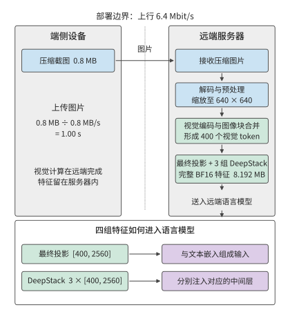

*图 12-10：远端编码的执行路径。端侧上传 0.8 MB 压缩截图，远端依次完成解码与预处理、视觉编码和特征接入；最终投影与三组 DeepStack 特征均留在服务器内。6.4 Mbit/s 上行的图片发送时间为 1 秒，编码和排队时间另计。*

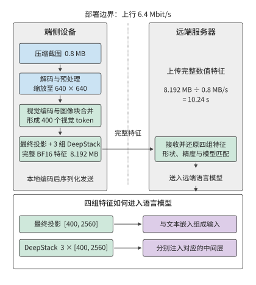

*图 12-11：端侧编码的执行路径。预处理和视觉编码移到终端，跨网络的对象变为最终投影与三组 DeepStack 的完整 BF16 特征，共 8.192 MB；远端接收后仍按相同方式接入语言模型。相同上行的特征发送时间为 10.24 秒，本地编码、序列化和转换时间另计。图中数值采用下文的 Qwen3-VL-4B 固定配置。*

**例：上传视觉特征为何可能比上传原图更慢？** 沿用 0.8 MB 截图与 6.4 Mbit/s 上行。视觉编码采用 Qwen3-VL-4B 的固定配置：预处理后的图像尺寸为 $640\times640$，图像块合并后得到 400 个视觉 token；这里的视觉 token 是表示图片内容的特征向量，不是文本词元，也不是原图的单个像素。最终投影的每个特征向量有 2560 个分量，另有三组同宽 DeepStack 特征（第 3.3.1 节），这些分支输出要一起传送。每个视觉 token 共需保存 $4\times2560=10240$ 个 BF16 数，完整输出为

$$
S_E=400\times10240\times2=8\,192\,000\ \mathrm{bytes}
\approx7.8\ \mathrm{MiB}.
$$

四组特征分别输入语言模型的不同层。如果只传最终投影，就会漏掉另外三组特征。完整特征约 8.2 MB，是压缩图片的约十倍；在原有上行链路上，发送时间从 1 秒增加到约 10.2 秒（图 12-12）。[^ec]

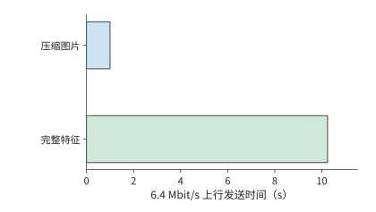

*图 12-12：同一图片的完整视觉特征比压缩图片需要更多传输时间。压缩图片为 0.8 MB；Qwen3-VL-4B 在预处理后 640×640 输入上产生 400 个视觉 token，最终投影及三组 DeepStack 合计 [400,10240] BF16，共 8,192,000 bytes。上行速率为 6.4 Mbit/s，柱长表示发送时间；编码、排队和转换时间另计。两种方案处理同一张图片，完成相同的视觉理解任务。*

把这一比较写成一般形式：将本地编码时间记为 $T_{E,l}$，远端编码时间记为 $T_{E,r}$，本地编码方案额外的序列化和转换时间记为 $T_x$。两种方案的时间差为

$$
\Delta T=T_{E,l}-T_{E,r}+T_x+\frac{S_E-S_I}{B_u}.
$$

$\Delta T<0$ 时端侧编码更快。设终端是一台装 RTX 4090 的台式机，远端是一张 H100 SXM。编码一张图需要 1.31 TFLOPs 矩阵运算，按两者的 BF16 稠密峰值 165.2 与 989.4 TFLOP/s 计，编码时间下界分别约为 7.9 ms 和 1.3 ms。取 $T_x=0$，本地编码方案约需 10.25 秒，远端编码方案约需 1.00 秒。本地方案在计算和传输上都更慢：本地计算多约 6.6 ms，特征发送多约 9.2 秒。[^encode-place]

链路变快后，发送特征比发送图片多出的时间会减少。若编码器与语言模型分处同一机房的两台服务器，经一个 400 Gbit/s 的 ConnectX-7 端口相连（每方向 50 GB/s），图片与特征的发送时间只相差约 0.15 ms，已小于上面两张卡的编码时间之差。这时，编码与排队合计只要减少 0.15 ms 以上，另一台机器上的编码方案就更快；在原有的慢速上行链路上，则要节省超过 9 秒。决定编码器放在哪里时，慢链路上先比传输量，快链路上则更要比编码和排队时间。

多轮任务中，重复出现的图片可以复用 EC，进一步减少编码次数。相同图片再次出现时，缓存命中就省去一次编码；界面内容改变后则要重新编码。一组使用相同尺寸图片的 CPU 实验观察到了同样的行为。[^ec-test] 计算多轮任务的编码总时间时，可以用单次编码时间乘以缓存未命中的次数。此前轮次留下的缓存由此也计入比较。

视觉特征只能省去视觉编码；如果希望复用语言模型已经算出的结果，就要保存语言模型处理前缀时逐层产生的 KV。该配置每个语言模型输入 token 需要 144 KiB 的逻辑 KV 存储空间，400 个视觉 token 约为 56.3 MiB。图片、约 7.8 MiB 的视觉特征、约 56.3 MiB 的视觉 token KV，分别对应不同重算起点（图 12-13）。缓存越接近模型的最终输出，再次使用时节省的计算越多，需要传送的数据也可能越大。第 12.2.3 节比较传送一次状态需要多久，以及后续使用这些状态能节省多少时间。

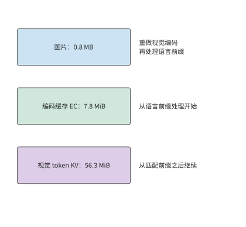

*图 12-13：三类缓存内容对应三个恢复计算的起点。EC 省去视觉编码；匹配模型权重、前缀与 token 位置索引的 KV 进一步省去已处理前缀的语言模型计算。容量对应正文固定视觉配置。*

### 12.2.3 会话迁移的准备、复用与恢复

会话迁移将缓存和任务进度传到另一台设备，使接收设备可以接着执行。目的设备已有兼容权重时，需要传送的是编码缓存、语言 KV、任务记录和恢复信息。确认两端的状态格式兼容后，就可以比较迁移前的准备时间与迁移后每轮节省的时间。

设迁移所需的准备时间为 $M$，新设备每轮节省的时间为 $\Delta t>0$，任务还剩 $N$ 轮。继续在原设备执行与迁移到新设备执行的时间差为

$$
G(N)=N\Delta t-M.
$$

$G(N)>0$ 表示迁移获益。每增加一轮，收益增加 $\Delta t$；准备时间 $M$ 则使整条收益曲线向下移动。所以同一迁移对短任务不划算，对长会话却值得。

**例：至少还需交互多少轮，状态迁移才能节省时间？** 迁移需通过 80 Mbit/s 的链路传输 64 MiB 状态，再花 1 秒恢复。迁移准备的总耗时为

$$
M=\frac{64\times2^{20}\times8}{80\times10^6}+1\approx7.7\ \mathrm{s}.
$$

每轮快 0.4 秒时，10 轮净损失约 3.7 秒，20 轮净省约 0.3 秒，40 轮净省约 8.3 秒。用未经四舍五入的 $M$ 求 $N>M/0.4$，得到最少 20 轮。这一轮数说明何时开始抵消迁移开销，净收益大小则说明值得为这次切换承担多少额外成本。

图 12-14 中，迁移刚开始时净节省为负，之后每完成一轮就上升 0.4 秒。回本轮数对应曲线越过零线的位置。

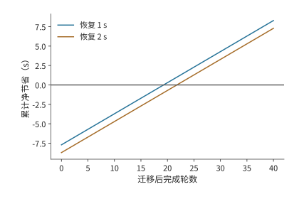

*图 12-14：迁移 64 MiB 状态，链路 80 Mbit/s，迁移后每轮节省 0.4 秒。两条曲线分别取恢复时间 1 秒和 2 秒，净节省为 N×0.4 减去传输和恢复时间。圆点标出首次获益的整数轮数；零线以上表示迁移更快，首次获益分别在第 20、22 轮。*

例如，恢复时间再增加 1 秒，20 轮的净收益立即变成约负 0.7 秒，回本轮数增至 22。若预计后续还有 40 轮，新增这 1 秒之后仍可节省约 7.3 秒。部署系统因此需要预测剩余会话长度，并为额外的传输和恢复开销留出时间。

曲线中的“恢复时间”包括新设备继续执行前所需的准备工作。新设备除了要将缓存数据加载到内存，还要确定任务已经执行到哪一步。语言 KV 绑定模型、前缀和 token 位置索引；截图 Agent 的进度由已经执行的操作决定。一次点击已经改变了界面，即使应答丢失，也应恢复到点击后的状态。操作编号和提交记录让目的设备可以查到既有结果，从下一轮继续。保存这些记录可以避免重复执行操作，就像复用缓存可以避免重复计算。

连接预热、图编译和模型加载也可用 $N\Delta t-M$ 分析：将准备成本放入 $M$，将后续每次减少的等待放入 $\Delta t$。[^survey] 这些准备是否值得，取决于后续调用节省的时间能否抵消一次性的准备时间。

### 12.2.4 模型内部切分的通信边界

会话迁移只在更换设备时传送一次状态。另一种分工方式是让多台设备一直共同执行模型，这时通信会在运行中反复发生。按阶段切分模型时，每个输入通常只需在相邻阶段之间传输一次；采用张量并行时，每层计算都要通信。链路从卡间互联换成局域网后，频繁同步会把微小的单次延迟累积成主要成本。

以 36 层 Qwen3-8B 在两台设备上做张量并行（TP=2）为例，考察每层注意力输出和 FFN 输出的两次归约；归约把两台设备的局部结果相加，使后续计算得到完整输出。采用两阶段环算法（第 7 章先做 ReduceScatter、再做 AllGather 的环形实现）时，每次归约有两次启动，每个阶段的启动耗时为 $\alpha$，所以生成一个 token 时，这些归约的启动时间合计为

$$
T_{\mathrm{start}}=36\times2\times2\alpha=144\alpha.
$$

当 $\alpha=2$ μs 时，这部分约为 0.29 ms。若两台设备改经第 12.4.1 节那种无聚合的 54 Mbit/s Wi-Fi 相连，每个阶段至少要完成一次短帧交换；按该节承载 ACK 的短帧交换 134 μs 计，144 次启动就要约 19.3 ms，是 RTX PRO 6000 一步 decode 读取下界 9.12 ms 的两倍多。即使载荷极小，通信启动仍需时间；而下一层需要本层归约结果，自回归的下一个 token 又需要当前 token 的输出。由于这些步骤必须依次执行，每次通信的启动时间都会累加到单个 token 的完成时间中。[^dense]

图 12-15 和图 12-16 依次展开一层的注意力输出与前馈输出，两者沿执行方向各经过一次归约后，才能开始下一层。单次等待虽短，重复的次数却由模型结构决定。

*图 12-15：张量并行的一次注意力输出归约：两卡先分别计算，再交换并求和，取得完整输出后进入前馈。横向箭头表示执行顺序，中间纵向箭头表示两卡通信。*

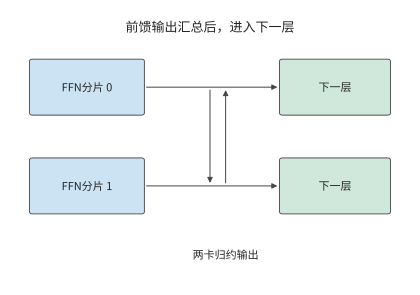

*图 12-16：前馈网络也分别计算局部输出，再做两卡归约。完整前馈结果就绪后才能进入下一层，这一结构在 36 层中重复。*

与逐层同步的张量并行不同，流水线并行把层分成连续的阶段，通信集中在相邻阶段之间的激活传输。对单个请求，一个 token 仍需依次经过各个阶段；对多个独立请求，不同阶段可以同时处理不同请求。由此得到两种收益：减少通信次数可以缩短单个请求的等待，让不同阶段同时处理请求可以提高总吞吐量。选择张量并行还是流水线并行时，先画出一个 token 的依赖，再安排多个请求占用各段资源，就能分别计算这两项变化。

确定模型分工后，传什么、传多少次以及哪些计算要等待传输都已明确。第 12.3 节考察实际发送过程：数据准备好之后，连接是否建立、窗口是否允许发送、确认是否及时返回。

## 12.3 广域网传输中的额外开销与等待

### 12.3.1 连接建立与复用

第 12.1 节假设连接已经建立，链路以恒定速率传输数据。实际请求首先要建立连接和安全上下文，即通信双方为认证与加密维护的密钥、身份和会话状态；随后取得发送额度，最后等待接收方把数据交给应用。将这些等待加入第 12.1 节的时间模型，就能分析实际执行过程：数据虽然已经准备好，却未必能立即计算或发送。

这些等待涉及以下协议。HTTP 是组织请求和响应的应用层协议。HTTP/1.1 和 HTTP/2 通常使用 TCP（提供可靠有序字节流的传输协议）与 TLS（建立认证与加密上下文的安全协议），HTTP/3 使用 QUIC（在 UDP 数据报上提供可靠多流传输和连接管理的协议）。UDP 向应用提供独立的数据报，不自行负责重传与排序。QUIC 将传输握手与 TLS 1.3 结合，减少分别建立传输连接和安全上下文所需的往返次数。会话恢复时，客户端还可以根据保存的安全状态发送早期数据，即 0-RTT 数据。服务端接受后继续处理，拒绝后由客户端重发；服务端根据操作编号识别重试，并返回已保存的结果，同一操作就不会重复执行。[^quic]

把建链开销代入第 12.1 节的截图任务：沿用 30 轮截图任务的 200 ms RTT，设建链额外需要两次往返。每轮重建累计需 12 秒，只在第一轮建立则需 0.4 秒，节省 11.6 秒。连接复用之所以有效，是因为后续 29 轮共享了第一轮建立的状态。第 12.1 节的 105 秒是在连接已经建立的条件下计算的；加上首次建链后为 105.4 秒，每轮重建则为 117 秒。

连接建立是一次性开销，传输则每轮都要发生。请求频繁时，保持连接可以省去下一轮的建链时间；两次请求间隔较长时，空闲连接仍会占用内存等资源。关闭连接可以释放这些资源，但下次调用需要重新建链。与会话迁移一样，这里也要比较一次准备与后续多次使用的开销。

### 12.3.2 窗口、反馈与有效吞吐

复用连接省去了建链等待，连续发送数据还需要足够的发送窗口。连接建立以后，发送方也必须限制在途数据。拥塞窗口限制已经发送但尚未确认的数据量；接收方的流量控制根据自己的缓冲空间，限制发送方还能发送多少数据。ACK 到达后，发送方可以继续发送；接收方从缓冲区读取数据后，也会通知发送方新增的可用空间。达到发送上限时，即使链路空闲，发送方仍要等待这些通知。

在途量是已经发出、尚未得到确认的数据字节数。若允许在途量为 $W$，往返时间为 $R$，每个往返周期最多传送约一个窗口的数据，因此

$$
B_{\mathrm{useful}}\le\min\left(B_{\mathrm{path}},\frac{W}{R}\right).
$$

式中 $B_{\mathrm{path}}$ 是路径可提供的载荷速率，$B_{\mathrm{useful}}$ 是实际有效吞吐。第 12.1.1 节带宽 20 Mbit/s、RTT 100 ms 的图片传输路径，要持续填满链路，需要约 250 KB 在途数据。若只有 64 KB 额度，速率上限为 $64000/0.1=640000$ bytes/s，约 5.1 Mbit/s，仅发送这 30 MB 数据就至少需要约 47 秒。链路每秒本可以传输更多数据，发送方却要等下一批确认到来才能继续发送；只有扩大可用窗口，才能提高这时的实际传输速率。

单独考虑整批确认的模型：接收方收齐 64 KB 后才确认，从这批发完到确认返回固定为 100 ms。因此完整周期包含 25.6 ms 发送和 100 ms 反馈，共 125.6 ms。图 12-17 画出了这段等待。蓝色时段确实在发送，浅色时段链路虽然空闲，发送方却因为窗口已满而不能继续。物理带宽提高，只能缩短蓝色部分。

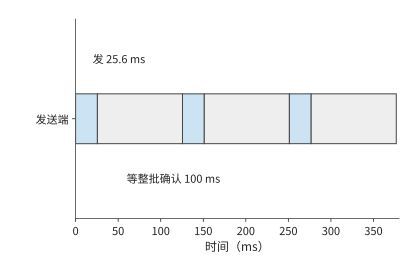

*图 12-17：固定窗口 64 KB，链路 20 Mbit/s，一批数据发送需 25.6 ms。为单独显示停等，图设接收方收齐一批后统一确认，从这批数据全部发出到收到整批确认再需 100 ms；每批完整周期为 125.6 ms。*

图 12-17 把窗口固定在 64 KB，以便观察停等过程。新连接通常从更小的窗口开始，随着确认到达逐步增加；短请求可能在窗口充分增大以前就已结束。设初始窗口为十个 1460-byte 段，每轮反馈后翻倍。前四轮累计可发 $14600(1+2+4+8)=219000$ bytes，第五轮累计可达 452,600 bytes。约 355 KB 的语音请求因此要到第五轮才能发完。RTT 为 200 ms 时，几轮反馈就是数百毫秒；短请求的大部分时间可能都用于等待确认。第 12.3.5 节将用这一机制解释一次跨地域语音调用的性能观察。

窗口解释了发送为什么会暂停。请求总耗时还取决于究竟需要发送多少字节：网络上传送的除了图片，还有包头和确认。

**例：协议头与 ACK 如何增加图片传输时间？** 沿用上传 30 MB、下载 5 MB 的条件，取每包最多 1168 bytes 载荷，协议与网络头 60 bytes，每个数据包触发一个 92-byte ACK。合计约三万个数据包，头部与确认增加约 $30000\times(60+92)/10^6\approx4.6$ MB，实际传输量从 35 MB 增至约 39.6 MB。逐包计算发送、确认和后续发送的时刻，完整请求约需 14.4 秒。[^closed]

与 12.8 秒相比，多出的约 1.6 秒来自模型中刚加入的工作与等待。只看实际传输的字节数仍不够：ACK 一面占用链路，一面释放后续发送额度，减少 ACK 数量会同时改变链路占用和发送额度释放的时机。

实际的确认行为由拥塞控制算法决定。NewReno 是根据丢包与确认调整拥塞窗口的算法，CUBIC 在拥塞避免阶段按时间的立方函数调节窗口；慢启动是连接初期随确认快速增加窗口的阶段。在相同的数据填充方式与 NewReno 配置下，将立即 ACK 改为每两包确认或最多等待 10 ms，实际传输的数据从约 39.6 MB 降至 38.2 MB，完整请求却从约 14.52 秒增至 14.56 秒，晚约 43 ms。[^ack] 这组对照揭示了反馈的双重作用：少发确认缩短传输时间，确认晚到则延长窗口等待。最终能否更快完成，要比较节省的传输时间与增加的等待时间。

ACK 决定发送方何时能够继续使用窗口发送数据，拥塞控制则决定窗口本身如何变化。相同路径的大图比较中，NewReno 与 CUBIC 的完整响应时间均约为 14.5 秒；窗口轨迹显示 CUBIC 一直在慢启动。[^ack] 本次请求在进入 CUBIC 的拥塞避免阶段之前就已结束，因此观察到的是启动阶段的行为。

### 12.3.3 丢包是不是拥塞

第 12.3.2 节的窗口随确认增长，也要随丢包收缩。传统 TCP 拥塞控制不直接测量路径带宽，而是把丢包当作拥塞的信号，用丢包反推可用速率。Mathis 模型是按丢包率估算 TCP 稳态吞吐的公式，它给出这种反推能得到的速率上界：[^mathis]

$$
B_{\mathrm{TCP}}\le\frac{\mathrm{MSS}}{R}\cdot\frac{C}{\sqrt{p}},
$$

其中 MSS（maximum segment size）为每个报文的最大载荷，$R$ 为往返时间，$p$ 为丢包率；周期性丢包、每包确认时 $C=\sqrt{3/2}\approx1.22$，延迟确认（接收方每两个报文才确认一次）时 $C<1$，因此论文的式 (4) 去掉常数，给出简化上界 $\mathrm{MSS}/(R\sqrt{p})$。按该式，吞吐由丢包率决定：丢包率增至四倍，速率减半。该式的前提是丢包意味着拥塞；无线链路误码和跨地域链路上的随机丢包都不满足这一前提。

跨地域链路上的实测记录正属于后一种情形。笔者开发的广域网传输系统 Queqiao（鹊桥，第 12.3.5 节介绍）的路径记录给出了一条丢包不含拥塞信息的路径。Irvine 发往贵阳的下载方向，发送速率从 1 提到 300 Mbit/s，丢包率始终约为 14%，前后丢包相互独立；反方向贵阳发往 Irvine 的 41,663 个报文一个未丢，同一条路径的两个方向表现得像两条路径。往返时间的最小值与最大值只差几毫秒，路径上没有排队。速率提到 600 Mbit/s 时丢包才升至 44%——越过了约 333 Mbit/s 的容量膝点（再提速丢包率就陡增的位置），只有这里的丢包才来自拥塞。[^queqiao] 代入 MSS 1,448 bytes、$R=0.2$ s、$p=0.14$，按式 (4) 的简化上界（$C=1$，路径记录也按此计算）得

$$
\frac{1448\times8}{0.2\times\sqrt{0.14}}\approx0.155\ \mathrm{Mbit/s},
$$

取 $C=1.22$ 则为 0.189 Mbit/s；两者都与同一路径实测的 0.13–0.47 Mbit/s 一致。第 12.3.2 节那份约 355 KB 的语音请求（354,640 bytes）按此速率仅发送就需要约 18.3 秒。TCP 并没有出错：它按规则响应了丢包，只是这条路径上的丢包不含拥塞信息。[^wan-loss] 这是第 1.3.4 节所说第一类差距的极端例子：模型前提不成立，算出的上界比路径实际能承载的速率低了三个数量级。要修正的是模型假设，而不是传输实现。

**BBR：直接测量，而不是从丢包反推。** BBR（bottleneck bandwidth and round-trip propagation time，一种基于测量的拥塞控制算法）不以丢包为信号，而是持续测量两个量：瓶颈带宽估计 BBR.max_bw，取近期交付速率样本的窗口最大值；往返传播估计 BBR.min_rtt，取 RTT 样本的窗口最小值。发送节奏（pacing）按测得的带宽设定；在途量按带宽时延积（bandwidth-delay product，BDP）$\mathrm{BDP}=\mathrm{max\_bw}\times\mathrm{min\_rtt}$ 设定：cwnd_gain 为 2，即拥塞窗口（cwnd）取两倍 BDP，为 ACK 聚合与重传留出余量。启动阶段（Startup）以 $4\ln2\approx2.77$ 的 pacing 增益逐轮探测带宽上限，ProbeBW_UP 阶段以 1.25 的增益周期性探高。[^bbr] 代入同一路径：$\mathrm{BDP}=333\ \mathrm{Mbit/s}\times0.2\ \mathrm{s}=8.325$ MB，拥塞窗口 16.65 MB；理想有效吞吐 $(1-p)\times333\approx286$ Mbit/s，是 Mathis 上界的约 1,850 倍。在丢包不含拥塞信息的路径上，直接测量带宽得到的速率，比从丢包反推的上限高出三个数量级。

**测准带宽之后，重传的尾部还在。** BBR 回答“发多快”，不回答“丢了怎么办”。354,640 bytes 分为 245 个报文，各以 14% 的概率独立丢失，期望丢失 34.3 个。下面按理想化的逐轮选择性重传计算：每轮用一个 RTT 重传丢失的报文，重传的报文仍可能再丢；不计窗口收缩与超时重传，所以结果是有利于 TCP 的下界。无丢包时的串行预算为一次 RTT 加模型 30 ms，再加按膝点速率发送的 8.5 ms，合计约 238.5 ms；有丢包时期望完成时间为 0.756 s，约为串行预算的 3.2 倍；p99 为 1.24 s，对应 6 轮。[^wan-loss] 即使 BBR 把带宽测准，高随机丢包率下重传造成的尾部延迟依然存在，这不是拥塞控制能解决的问题。

**编码冗余：让接收方不等重传。** 既然重传的等待难以接受，就多发冗余数据，由接收方自行修复缺包。前向纠错（forward error correction，FEC）在 $k$ 个数据符号之外多发 $r$ 个修复符号，本例一个符号就是一个 MSS 大小的报文；一块中丢失不超过 $r$ 个符号，接收方就能直接恢复，不需要任何重传轮次。按二项分布精确求 99.9% 成功率所需的最小冗余：丢包率 14% 时，245 个数据包需要 63 个修复包，冗余 25.7%；发送量增至 308 个符号，发送约 10.7 ms，完成时间约 241 ms，贴近 238.5 ms 的串行预算（图 12-18）。同一路径另一时段丢包率为 3.6% 时，逐轮重传的 p99 降为 0.84 s，FEC 只需 20 个修复包，冗余 8.2%。[^wan-loss] 所以冗余比例应随测得的丢包率调整，而不是固定不变。这组数字也是第 12.3.5 节 Queqiao 案例的定量动机：它的前向纠错与发送调度，正是按路径测量结果安排冗余量与发送节奏。

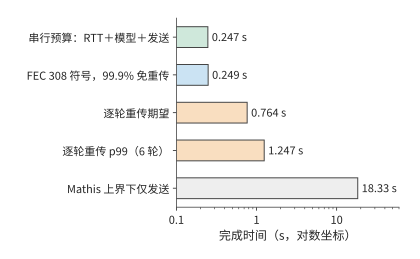

*图 12-18：同一路径（RTT 0.2 s、容量膝点 333 Mbit/s、丢包率 14%）传送 354,640 bytes 的完成时间，横轴为对数坐标。串行预算是 RTT、模型 30 ms 与发送 8.5 ms 之和，约 238.5 ms；FEC 多发 63 个修复符号（冗余 25.7%）后 99.9% 不需重传；逐轮重传两行是不计窗口收缩与超时的下界；Mathis 上界对应把丢包当作拥塞的 TCP，仅发送就需约 18.3 s。*

### 12.3.4 多流传输与优先级

前几节讨论单条数据的传输；本节考察多条数据共用出口时的相互影响。图片、音频和控制消息共用出口时，有两个顺序可以改变：发送调度决定链路先为谁发送数据，接收方对数据顺序的要求决定已到达的字节何时交给应用。

先分析资源分配。在一组共享链路的计算中，FIFO 按入队顺序发送，图片第 5 秒完成、音频第 6 秒完成；音频优先时，音频第 3 秒完成、图片第 6 秒完成。音频早了 3 秒，图片晚了 1 秒，原因是音频数据提前占用了原先用于发送图片的时段。[^media]

再分析接收依赖。保持发送和丢包恢复的时刻不变，音频数据在第 3 秒已经齐备，图片直到第 7 秒才齐备。这里把接收数据交给应用称为交付。整个连接共用一个接收顺序时，前方缺口会阻塞后续数据，形成队头阻塞。整体有序交付时，音频也要等到第 7 秒才能交给应用（图 12-19）；逐流交付在第 3 秒就能将音频交给应用，图片仍为第 7 秒（图 12-20）。这里节省的 4 秒，是因为音频不必再等图片的接收进度，发送的数据量和链路速率都没有改变。

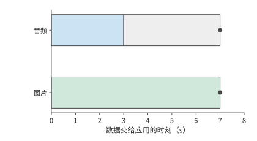

*图 12-19：整体有序交付：音频第 3 s 已收齐，却因图片缺口继续等到第 7 s。灰色段表示数据已齐后的等待，圆点表示数据交给应用的时刻。*

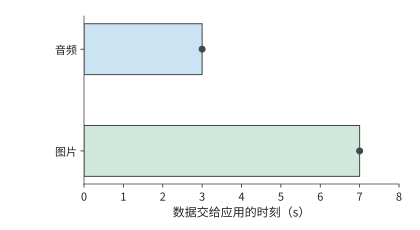

*图 12-20：逐流有序交付：音频在第 3 s 收齐后立即交付，图片仍于第 7 s 交付。两图中的发送、到达与恢复时刻相同；区别在于不同流之间是否需要相互等待。*

整体有序与逐流交付的区别，正对应两种实际协议的做法。HTTP/2 将多个流放入一个有序 TCP 字节流，前面的缺口会阻挡后续字节。QUIC 以流为单位保持有序，其他流已经连续到达的字节可独立交付。[^quic] 这与音频播放的递推关系属于同一种分析方法：把一个覆盖全部数据的等待条件拆成各流自己的等待条件，已经满足条件的流就能向应用交付数据。

这两种机制分别回答“何时发送”和“何时交给应用”。第 12.3.5 节用跨地域语音案例说明这些机制如何影响实际请求；第 12.4 节再结合音频的预定播放时段和截图版本，讨论数据交给应用时是否仍有价值。[^http]

### 12.3.5 案例：Queqiao 如何加速跨地域语音服务

第 8、9 章介绍了模型服务的批处理与资源池化。把各地请求汇聚到少数数据中心，可以让更多请求共享模型副本与加速器，减少分散部署时各地分别预留却未充分使用的容量，也更容易集满 batch。集中部署因此有机会提高加速器利用率、降低单位请求成本，代价是远方用户要经过更长的网络路径。例如，将语音模型集中部署在美东，美西的用户或接入服务都需要跨地域调用。资源池中的模型即使迅速完成计算，用户仍要等待请求上传和结果返回。

**Queqiao 是什么，解决什么问题？** Queqiao 开源、可自托管，在可控制的客户端与可信网关之间承载 TCP 和 UDP 流量。应用通过本地的 SOCKS5 代理（一种转发任意 TCP／UDP 连接的通用代理协议）接入客户端，客户端跨广域网连接网关，网关再将请求转交目标服务。在这样的数据中心间部署中，客户端在调用方的服务器上，网关靠近远端的推理服务，需要优化的长距离链路就集中在客户端与网关之间。应用仍调用原有的 ASR、TTS 接口，Queqiao 负责传送请求与结果。[^queqiao-readme]

项目 README 描述了这一实际需求：模型运行在美国，客户端分布在不同地方。ASR 上传几百 KB 音频，返回一句识别文本；TTS 提交一段文本，返回几百 KB 音频。README 中的 TTS 场景在模型完成后集中返回音频，属于一次突发传输；第 12.1 节的流式场景则在生成首块后开始传输，接收与播放随生成过程持续推进。这类短请求即使能在几毫秒内发完全部字节，连接建立、窗口增长和丢包恢复仍可能各自引入一次长距离的反馈等待。

Queqiao 的设计目标是减少这些额外等待，使短请求尽量接近必要传播、数据发送和模型处理所需的时间，同时提高长流对可用带宽的利用。Queqiao 让多条应用流共享客户端—网关路径的测量结果与传输状态，复用连接，并根据路径情况安排发送和恢复；前向纠错则多发一些冗余数据，让接收方不必等下一轮重传就有机会恢复缺包。交互流与大文件共存时，还要靠发送调度控制交互流的等待。第 12.3.1 至 12.3.4 节讨论的连接、窗口和多流机制，在此共同服务于跨地域调用。传播距离本身仍然决定必须付出的时间；优化后的完整请求能否满足业务期限，决定了集中部署是否适合这项任务。

**跨地域语音请求为何远慢于约 240 毫秒的理想耗时？** 本节使用笔者归档的语音测试检验这些机制。实际测量路径是贵阳至美国 Irvine，并非上面的美东—美西部署示例所用路径。固定音频文件约 355 KB，链路 333 Mbit/s，往返约 200 ms，模型处理约需 30 ms；计时从发起请求开始，到收到结果结束。理想发送时间约为 8.5 ms，加上传播与处理约为 238.5 ms。最初的直接调用却超过一秒，而 Queqiao 约需三百毫秒。

这一差距有两种可能的解释。一种把优势归于传输机制本身；另一种认为直接调用的大部分时间用于连接准备、窗口增长和等待发送。两种解释给出的预测不同：若连接准备与发送等待是主要原因，充分调优直接路径后，请求时间应当接近前面按数据量、计算时间和必要往返算出的最短时间；若协议机制本身仍带来较大优势，差距会继续存在。

检验预测先要固定输入。早期测试轮换使用八个 146–405 KB 的文件，报告却只标注了最后一次请求的大小（355 KB）；标注该大小的中位数实际涵盖整个区间。改为反复发送同一份 354,640 bytes 的文件，并交替运行两条路径之后，每次请求都发送相同数量的字节。[^queqiao] 固定数据量后，再改变连接和发送配置，就可以比较两者如何影响请求时间。

**复用连接并调优后，两条路径的耗时差距还剩多少？**

固定文件的两组结果如下。

| 连接条件 | 直接路径的请求中位数 | Queqiao 的请求中位数 | 观察到的差距 |
|---|---:|---:|---|
| 新建连接 | 约 1.19 s | 约 0.30 s | 直接路径约为 3.9 倍 |
| 保持连接并调优 | 约 0.24 s | 约 0.24 s | 两者接近 |

新建连接时两条路径相差约 0.89 秒，复用连接并调优后都约为 0.24 秒（图 12-21、图 12-22）。[^queqiao-calc] 原来的大部分差距随着基线配置的改变消失了。这支持第二种解释：连接准备和发送方式在最初的差距中起了主要作用。即使使用同一种协议，配置不同，请求完成时间也可能相差甚远。这个案例的步骤与第 1.3.4 节一致：先由传播、发送和模型处理算出约 240 ms 的下界，再与实测比较，最后用只改变连接条件的实验分辨差距来自模型漏项还是实现开销。这里的差距几乎全部来自实现开销，下界本身没有错。

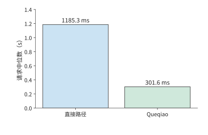

*图 12-21：新建连接时，354,640 bytes 固定音频的直接路径与 Queqiao 请求中位数分别为 1185.3、301.6 ms。计时从发起请求到收齐结果，输入文件相同，两条路径交替运行。*

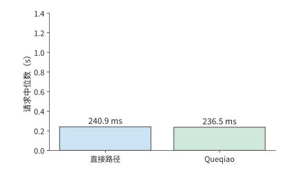

*图 12-22：保持连接并调优后，同一固定音频的直接路径与 Queqiao 中位数分别为 240.9、236.5 ms。与前图采用相同纵轴，两条路径均接近数据发送、必要往返和处理所需的总时间。*

**单因素实验如何区分连接、窗口与发送节奏的影响？** 连接复用改变请求开始时是否需要握手，窗口大小改变确认返回前允许在途的数据量，发送节奏改变链路的空闲区间。图 12-23 将这三类设置与对应事件配对：固定文件、路径和其余设置，每次改变一个因素，记录受其影响的事件发生时刻与请求总时间。连接实验比较握手结束和首字节发送时刻，窗口实验比较在途量与 ACK 到达后的发送，节奏实验比较两次发送之间的空闲时间。

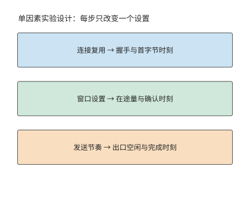

*图 12-23：单因素实验方法：保持相同文件、路径和其他设置，每次只改变一个因素，对照中间事件与总完成时间。*

窗口耗尽时，发送一批数据后在途量达到上限，出口空闲，ACK 返回后才继续发送。扩大窗口可以缩短这类空闲区间；若请求也相应提前结束，发送与确认的时间线便说明，总时间的缩短来自窗口变化。

实验的运行顺序也会影响比较结果。交替测试两条路径，可以让一组对比中的两次请求在相近时间运行，减小网络变化对比较的影响；同期 RTT 约为 197–205 ms，跨度约 8 ms。调优后，两条路径的请求耗时中位数相差约 4 ms，小于同期 RTT 的波动幅度。在这组实验中，两条路径的请求时间都已接近 240 ms。

**降低网络往返延迟与加速模型计算，哪个收益更大？** 调优对照方案后，下一步优化的重点也会改变。模型从 30 ms 加速到 3 ms，最多节省 27 ms；将 RTT 从 200 ms 降至 20 ms，可节省约 180 ms。只要改在附近执行多出的准备和计算时间少于这 180 ms，就比原来的远端路径快。这与第 12.1 节的比较方法相同：先算出更换服务器可以少等多久，再扣除新增的计算和准备时间。

请求时间之外，还要检验播放是否连续：音频到达后要由播放器连续播出。另一组采用静音输出设备回调的实验中，完整 PCM 最终全部收到，播放回调却累计有约 0.36–1.44 秒取不到足够的音频样本。[^physical] 请求结束时刻只反映最后一批数据何时到达，播放器则在此之前就要持续读取音频。请求总时间与播放停顿时间描述的是两个问题。

音频块的生成、到达、进入播放缓冲和被播放回调读取，构成连续播放的时间线。第 12.1 节的递推式给出缓冲第一次耗尽的时刻：此时若下一块尚未生成，等待出在模型处理；若已生成但未到达，等待出在传输；若已到达却没被读取，等待出在本地缓冲与调度。

这一案例走完了从估算到部署决定的全过程：先算出理想完成时间，再从执行记录中找出等待，用单因素实验解释原因，最后根据还能节省多少时间决定继续调优还是更换服务器。第 12.4 节把无线接入中的争用、波动与恢复加入分析，第 12.5 节汇总完整部署方案。

## 12.4 无线变化下的交互与恢复

### 12.4.1 共享空口与上下行争用

第 12.3.4 节区分了“何时发送”和“何时交给应用”。**空口（air interface）**是设备通过无线信号通信的接口。无线网络还改变了发送本身的代价：上行数据和下行反馈要轮流占用同一段空口时间。每次交换除了发送字节，还要等信道空闲、等帧间间隔，并接收本跳的确认。因此除了应用字节数，还要计算交换次数。

端到端 ACK 发给远端发送方；介质访问控制（MAC）层组织单条无线链路的发送，MAC ACK 确认本跳无线帧。承载端到端 ACK 的无线帧，也要做自己的 MAC 确认。因此，即使端到端 ACK 很短，也需要等待信道空闲，并完成本跳确认。

**例：短 ACK 帧的无线接入与确认开销有多大？** 正交频分复用（OFDM）把数据分到多个相互正交的子载波上传送；PPDU 是物理层协议数据单元，包含物理层前导、头部和承载的数据，代表一次无线发送的完整物理层内容；SIFS 是连续交换之间的短帧间间隔。取无聚合的 OFDM 参考交换，数据速率 54 Mbit/s，MAC ACK 速率 6 Mbit/s。数据包交换包含 34 μs 接入等待、208 μs 数据帧、16 μs SIFS 和 44 μs MAC ACK，共 302 μs。承载端到端 ACK 时，数据帧缩至 40 μs，其余三项保持不变，共 134 μs。[^air]

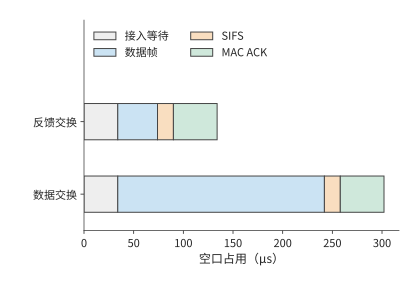

*图 12-24：报文变短后，固定交换开销仍然存在，因此空口占用时间不会按相同比例缩短。两种成功交换采用相同的 34 μs 接入等待、16 μs SIFS、44 μs MAC ACK，区别只在数据 PPDU：208 μs 或 40 μs。条件为 OFDM54／6、无聚合、无重传的参考模型。*

图 12-24 中，两种交换都包含 $34+16+44=94$ μs 固定开销。数据帧的发送时间从 208 μs 缩到 40 μs，缩短约八成，整次交换的耗时却只缩短约 56%。固定项所占比例越大，继续缩短载荷的收益越小；把多个小报文合并发送、减少交换次数，降低开销更直接。

仍发送 30 MB 图片与 5 MB 成片，按该无线配置需要的数据交换和反馈交换各为 30,800 次，累计占用空口的时间约为

$$
30800\times(302+134)\ \mathrm{\mu s}\approx13.4\ \mathrm{s}.
$$

保持数据与恢复轨迹不变，将端到端 ACK 数减半，能释放约 $15400\times134\ \mathrm{\mu s}\approx2.1$ 秒空口。第 12.3.2 节已经说明，反馈延迟又会增加窗口停等。因此，需要重新计算各包的发送与确认时刻：减少 ACK 释放了空口时间，但等待确认又可能推迟后续发送。两者共同决定完整请求何时结束。

实际协议中已有按这一思路设计的机制。TACK 是减少无线确认开销的一种反馈机制。TACK 将常规的累积确认与需要即时反馈的事件分开：前者合并后发送以减少交换次数，后者立即返回，让发送方尽快继续发送或重传丢失的数据。[^wireless-survey] 这种分工同时减少确认报文的发送开销和等待反馈的时间。

### 12.4.2 业务时限、过期数据与取消

第 12.1 节的播放器等待缺块，以保持全部内容；另一种播放器按固定时钟播放，晚到的音频块不再用于原定的播放时段。前者把网络延迟变成停顿，后者则会使部分声音缺失。任务的质量要求决定采用哪一种播放规则。

例如，八块音频各长 20 ms，计划从第 0.4 秒开始连续播放，共 0.16 秒。这些音频与大图共用链路时，FIFO 下这些块最终全部到达，却都错过了各自预定的播放时刻；媒体优先时八块都按时到达。[^mixed] 两种情况下最终收到的字节数相同，按时可用的声音却分别为零与 0.16 秒。调度时统计按时播放的内容，才能反映用户实际听到了多少声音。

晚到的数据错过原定播放时段，取消则让尚未播放的数据立即失去价值。播放器的待播队列中若已有三块 20 ms 音频，即使远端停止生成，本地仍可继续播出 60 ms。若控制消息需要 100 ms 才能到达服务端，那么在消息到达前，远端还会产生新块。取消过程因此分成两条并行路径（图 12-25）：本地清空待播缓冲，远端停止生成和发送后续音频。前者决定用户何时不再听到声音，后者决定何时停止消耗资源。

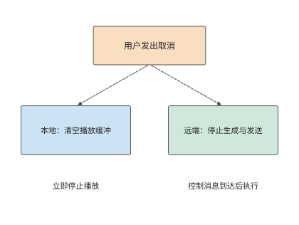

*图 12-25：一次取消同时触发两条路径：本地清空待播音频，远端在控制消息到达后停止生成和发送。虚线表示控制流；本地停止播放与远端资源释放有各自的完成时刻。*

音频取消后，丢弃的只是尚未播放的数据；截图 Agent 的动作则在提交后改变环境。应答丢失时，重试应查询原操作编号对应的结果；如果再次点击，就把通信重试变成第二次业务操作。保存操作结果后，网络恢复时就可以从原有进度继续，避免增加重复操作。

### 12.4.3 双路径选择、分流与故障切换

此前的分析只考虑单条接入路径；终端往往同时连接两条。Wi-Fi 与蜂窝网络提供两条接入路径。分流把不同部分的数据交给不同路径，目标是同时使用资源；复制把同一份数据交给两条路径，目标是更早取得一份有效结果。这两种方法的数据量和完成条件不同，需要分别计算。

**例：双路径如何分配图片数据以缩短传输时间？** 两条独立恒速路径分别为 20 和 10 Mbit/s，将比例 $x$ 分给快路，其余分给慢路。两部分齐备才完成，因此

$$
T_{\mathrm{split}}=\max\left(\frac{xS}{B_1},\frac{(1-x)S}{B_2}\right).
$$

如果一条路径先结束，可以把另一条上的部分字节移给它，让原本较晚完成的部分提前结束。因此，最优比例应让两条路径同时完成，即 $x=B_1/(B_1+B_2)$。快路传 20 MB、慢路传 10 MB，各需 8 秒，比只用快路的 12 秒少 4 秒（图 12-26）。

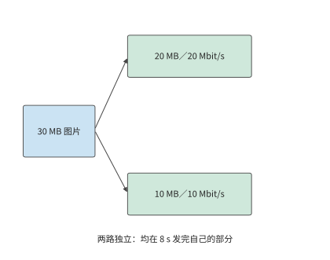

*图 12-26：两条独立路径按带宽比例分配输入，分别发送 20 MB 和 10 MB，均需 8 s。任务等两部分都齐备后完成。*

若两条路径汇入同一个 24 Mbit/s 的出口，两条接入路径仍可同时发送、各需 8 秒，但所有数据都要经过该出口，出口传完 30 MB 至少需要 10 秒。瓶颈于是转移到了共同出口。继续提高接入速率，只会让更多数据排队等待通过该出口。

图 12-27 中，两条线在出口重新汇合。这一汇合点既解释了两条接入路径的速率为什么不能直接相加，也引出另一个问题：出口所在的设备故障时，另一条接入能否继续传输。

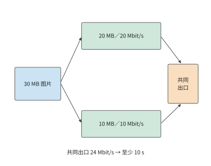

*图 12-27：30 MB 图片按 20／10 MB 分到 20／10 Mbit/s 两条独立接入，各需 8 秒。两路再经过同一 24 Mbit/s 出口，全部数据通过该出口至少需 10 秒。箭头表示数据路径，不表示传播距离；容量取恒定值。*

如果希望一条路径断连后仍能收到同一份数据，可以采用复制，并检查两份数据会在哪些地方同时失败。设共同端点失败概率为 $q$；端点正常时，两条接入的失败相互独立，概率为 $p_1,p_2$。失败包括端点失败，以及端点正常但两条接入均失败，两类互斥事件相加得

$$
p_{\mathrm{fail}}=q+(1-q)p_1p_2.
$$

取 $p_1=0.1,p_2=0.05$，两条接入同时失败的概率为 0.5%；加入 $q=0.02$，总体约为 2.5%。其中 2 个百分点直接来自共同端点。即使把两条接入做得完全可靠，总体失败概率仍为 2%；把服务副本放到不同故障域，才会降低这一项。

避开共同故障后，复制还要支付额外带宽。以八块 640-byte 音频为例，一份为 5120 bytes，全量复制为 10,240 bytes。接收方用数据块编号去重，先到的完整副本进入播放器，后到副本被丢弃。多发送一份数据，就能在两条路径中使用先到的结果；如果两路共用同一个出口，重复数据也会占用其他任务需要的带宽。[^dual]

分流、复制和汇合点在实际系统中常由协议或接入代理实现。多路径 TCP（MPTCP）在一个逻辑连接中组织经过不同路径的 TCP 子流，接入代理可在终端与普通服务器之间汇合这些路径。华为 Link Turbo 的多网络协同实践也利用不同接入的状态选择发送方式。[^wireless-survey] 代理的位置同时影响共享容量、传播与故障域，因而成为部署模型中的一个计算和传输节点。

## 12.5 从端边云分工到完整部署

### 12.5.1 地域、数据与服务位置

继续分析第 12.1 节的 30 轮截图任务。前十轮已完成，要为剩余二十轮选择执行位置；从此刻起，任务必须在 45 秒内完成。无论选择哪种方案，此前已经花掉的时间都相同，比较的是剩余工作。原服务每轮 3.5 秒，继续执行需要 70 秒，因此必须换一种执行方案。

仍使用每轮 0.8 MB 截图、0.3 秒终端工作，原云路径上行 6.4 Mbit/s、RTT 0.2 秒。比较三个执行位置：端侧是第 12.1.5 节的手机，附近工作站装一张 RTX PRO 6000 Blackwell 工作站版，云地域使用一张 H100 SXM。三处运行同一份 Qwen3-8B q4_0 权重和 8K 上下文，每轮都生成第 12.1.5 节的 45 个 token，任务质量因而相同。每轮模型时间沿用第 12.1.5 节的口径，取 decode 读取下界：45 步，每步读取 5.47 GB，除以设备的内存带宽。新服务接手时，要先对前十轮留下的 8K 上下文做一次 prefill，即表中的“一次准备”，按 133.6 TFLOPs 的矩阵工作量除以 BF16 稠密峰值计算；手机没有可引用的矩阵峰值，准备记为 0，这一取值只会让端侧显得更快。先采用无排队、无故障、控制回复发送时间为零的条件。[^edge-tiers]

| 执行位置 | 设备 | 一次准备 | 每轮模型 | 上行 | 每轮往返传播 | 截图去向 | 20 轮能耗 |
|---|---|---:|---:|---:|---:|---|---:|
| 端侧 | 手机，84.8 GB/s | 0 s | 2.90 s | 无需上传 | 0 s | 留在设备 | 518–680 J |
| 附近工作站 | RTX PRO 6000，1,792 GB/s，600 W | 0.27 s | 0.137 s | 80 Mbit/s | 0.02 s | 传到附近工作站 | 约 1.81 kJ |
| 云地域 | H100 SXM，3,350 GB/s，700 W | 0.14 s | 0.073 s | 6.4 Mbit/s | 0.20 s | 传到云地域 | 约 1.12 kJ |

成本用能耗衡量。两张 GPU 按板卡额定功率乘以忙碌时间计算，忙碌时间为一次准备加二十轮模型计算；额定功率是上限，所以这两行也是上限。手机取 MELTing Point 实测的每 token 0.576–0.756 J，二十轮共 900 个 token。[^melt] 上传与传播消耗的网络能量不计。

比较时间与成本之前，先要满足数据驻留（data residency）的约束，即数据只能在规定的设备或地域内存储和处理。表中端侧一行的原始截图始终留在设备上；附近工作站与云地域两行每轮都要把 0.8 MB 的原始截图传出设备。若截图含有不允许离开设备或不允许出境的内容，这两行在比较开始前就被排除；下面的时限与成本比较以允许上传为前提。

将云端进一步分为不同地域后，仍然需要比较这些时间与成本。采用 Regionless（由平台为请求选择云地域，而非应用固定绑定地域）服务时，应用指定任务、质量要求和完成期限，由平台选择部署地域。[^region] 平台仍需比较各方案的实际开销：服务器距离影响传播时间，缓存影响重新计算的工作量，跨地域传输影响数据传输成本。

### 12.5.2 时限、成本与恢复的联合比较

**例：状态迁移与剩余交互轮数如何改变端边云部署选择？** 剩余二十轮的时间为

$$
\begin{aligned}
T_{\mathrm{local}}&=20(0.3+2.90)\approx64.0\ \mathrm{s},\\
T_{\mathrm{near}}&=0.27+20(0.3+0.137+0.02+6.4/80)\approx11.0\ \mathrm{s},\\
T_{\mathrm{cloud}}&=0.14+20(0.3+0.073+0.20+6.4/6.4)\approx31.6\ \mathrm{s}.
\end{aligned}
$$

H100 的内存带宽是 RTX PRO 6000 的 1.87 倍，云端每轮的模型计算比附近工作站少用约 0.064 秒，二十轮省约 1.3 秒，准备再省约 0.13 秒；但上传每轮多 0.92 秒，传播多 0.18 秒，二十轮多等 22 秒。合计下来，云端反而慢约 20.6 秒。把时间差拆开，便能看到更快的模型如何因每轮通信而失去优势：每轮 decode 只要几十到一百多毫秒，远少于每轮的通信时间。

图 12-28 至图 12-30 汇总了三种部署方式下完整任务的各阶段耗时。云端的绿色计算段更短，蓝色上传段却更长；两段与其余工作依次累加，决定横条终点所示的任务完成时间。

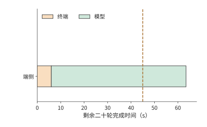

*图 12-28：端侧：终端工作 6 s，模型计算 58.0 s，共 64.0 s。三图共用 45 s 期限线和同一横轴，颜色分别汇总二十轮同类工作的耗时。*

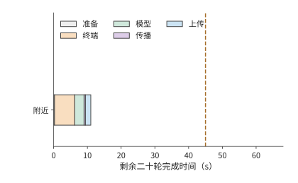

*图 12-29：附近工作站（RTX PRO 6000）：准备 0.27 s，二十轮终端 6 s、模型 2.7 s、传播 0.4 s、上传 1.6 s，共 11.0 s，满足 45 s 期限。虚线表示 45 s 完成期限。*

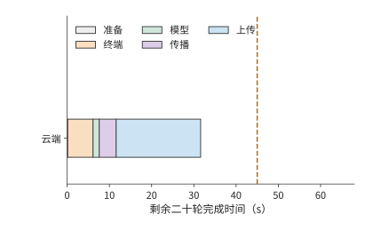

*图 12-30：云端（H100 SXM）：准备 0.14 s，二十轮终端 6 s、模型 1.5 s、传播 4 s、上传 20 s，共 31.6 s。计算更快而传输更久，比附近工作站慢约 20.6 s，仍在期限之内。虚线表示 45 s 完成期限。*

45 秒期限先排除端侧：端侧能耗最低，却需要 64.0 秒。附近工作站和云端都能按时完成，接着比较能耗：云端约 1.12 kJ，附近工作站约 1.81 kJ。H100 的额定功率比 RTX PRO 6000 高，每轮的忙碌时间却只有后者的一半多，能耗反而更低。因此，在能按时完成的方案中，能耗最低的是云端方案。

端侧一行还要按第 12.1.5 节核对电池。表中二十轮的 518–680 J 占一次充电的比例需要折算。iPhone 16 Pro 的规格页只给出最长 27 小时视频播放，没有电池的瓦时数，所以改用 MELTing Point 的实测折算：一次充电可完成约 490–590 个提示，20 轮相当于 20 个提示，约占一次充电的 3.4%–4.1%。[^melt] 电池不排除端侧方案，排除端侧的是 64.0 秒的完成时间。

云端方案对上行速率的依赖可以定量表示。只改变云端路径的上行速率 $b$，单位 Mbit/s，其他参数保持不变，云端完成时间为

$$
T_{\mathrm{cloud}}(b)=11.6+\frac{128}{b}\ \mathrm{s}.
$$

11.6 秒来自一次准备和二十轮非上传工作，128 Mbit 是二十张截图的总上传量。满足期限需要 $b\ge128/33.4\approx3.8$ Mbit/s（图 12-31）。但无法比附近工作站更快：即使上传瞬间完成，云端也要 11.6 秒，仍比附近的 11.0 秒慢。原因在于每轮 0.2 秒的往返传播：它比附近工作站每轮的传播与上传之和（0.1 秒）多出 0.1 秒，超过了 H100 每轮节省的约 0.064 秒模型时间。

反解带宽门槛前必须先检查固定时间。若期限为 $D$，这里的门槛为 $b_{\min}=128/(D-11.6)$ Mbit/s，只在 $D>11.6$ 秒时有意义。当 $D\le11.6$ 秒时，即使上传带宽无限大，固定时间也已经用完期限，不存在有限的带宽门槛；不能把公式算出的零、负数或除零错误解释为可行带宽。

“追不上”这一结论依赖读取下界的口径。实验 8-1 在 RTX PRO 6000 上测得 batch 1、8K decode 每步 25.83 ms，是读取下界 9.12 ms 的约 2.83 倍，多出的主要是每步的固定开销。把两张 GPU 的模型时间都按该倍数放大，附近工作站为 16.04 秒，云端不含上传为 14.29 秒，两者相差 1.75 秒；上行超过 $128/1.75\approx73$ Mbit/s 后云端才更快。[^edge-tiers]

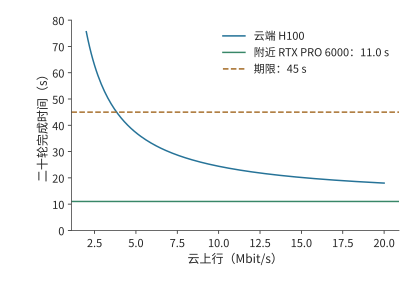

*图 12-31：云路径上行改变完整任务的部署选择。剩余 20 轮每轮上传 0.8 MB，云端准备 0.14 秒，每轮其余工作合计约 0.57 秒，因此总时间为 11.6+128/b 秒；附近工作站为 11.0 秒，期限为 45 秒。本例保持模型、处理时间和其他网络参数不变，忽略排队与故障。约 3.8 Mbit/s 起云方案可满足期限；上行再高，云端也不低于 11.6 秒，始终慢于附近工作站。*

接近期限时，还要计算能为额外开销留出多少时间。原上行 6.4 Mbit/s 时，云端任务比期限提前约 13.4 秒完成；上行降到 4 Mbit/s，时间约为 43.6 秒，只剩约 1.4 秒余量；降到 3.5 Mbit/s，约为 48.2 秒，已经超期。若要求 99% 的任务按时，就需要分析任务完成时间的概率分布。由于每轮速率 $b_i$ 可以不同，包含上传在内的总时间应写为

$$
T=11.6+\sum_{i=1}^{20}\frac{6.4}{b_i}.
$$

设每轮速率在其上传期间恒定，十轮 6 Mbit/s、十轮 10 Mbit/s 的平均速率也是 8 Mbit/s，任务却约需 28.7 秒，比全程 8 Mbit/s 的 27.6 秒慢。发送时间与速率成反比，慢的几轮多出的等待大于快的几轮节省的等待。平台应根据整个任务的上传时间分布，判断是否满足 $P(T\le45\ \mathrm{s})\ge0.99$，还要考虑网络持续变慢时，相邻多轮会一起受到影响。

以上部署选择主要受截图上传时间影响。换成输入较小、前缀重复较多的文本任务，优化重点会转向计算复用。保留会话状态就能减少这些重复计算。考虑一条文本 Agent 会话：逐轮重送前缀合计约 66 KB，保留状态后只送约 10 KB，回复均约 2.5 KB。在 333 Mbit/s 上，少传约 56 KB 只节省 1.3 ms。[^region-trace] 与截图的 16 MB 上传相比，这里的主要收益来自少做前缀计算。

同一会话的矩阵计算量从约 $3.0\times10^{14}$ 降至 $6.0\times10^{13}$ FLOPs。在云端 H100 SXM 上按 989.4 TFLOP/s 计，保留状态节省约 0.239 GPU 秒。保存的约 465 MB 状态持续占用显存；按其在 H100 80 GB 显存中所占的比例折算，每保存 1 秒相当于占用 $0.465/80\approx0.0058$ GPU 秒。两者相除：状态保存约 41 秒之后，占用的显存就会抵消本次节省的计算。这种盈亏平衡的计算方法与第 12.2.3 节的迁移时间比较相同：复用收益必须覆盖保存或搬移状态的成本。

保存状态既能减少正常执行中的重复计算，也能减少故障后的重做。以选定的云端方案为例，比较同一次断连在两种进度保存方式下的开销。云端完成一轮任务约需 1.57 秒。设第十轮已执行完，但确认尚未返回时连接中断，恢复连接需要 1 秒。若前九轮进度已经提交，只重做未确认的第十轮，额外约需 2.57 秒，任务由 31.6 秒增至 34.2 秒；若十轮都要重做，额外约需 16.7 秒，任务变为 48.3 秒，超过期限。仍然使用同一台服务器，能否保留进度却决定了任务能否按时完成。附近工作站每轮只需约 0.54 秒，即使丢失十轮进度，也只要 17.4 秒；期限余量更大的方案，对故障也更宽容。

图 12-32 和图 12-33 标出了两种恢复方式的差异所在：相同的断连事件之后，一种只重复最后一轮，另一种重复此前十轮。恢复开销有多大，首先取决于哪些结果已经可靠保存。

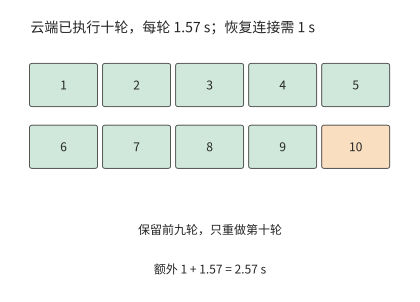

*图 12-32：保留前九轮提交记录（绿色），只重做未确认的第十轮（橙色）。云端每轮 1.57 s，恢复连接 1 s，增加 2.57 s，总时间为 34.2 s。此例采用可安全重放的操作；已提交的外部操作则先查询其结果。*

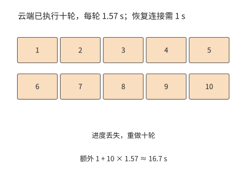

*图 12-33：丢失十轮进度时，恢复连接后重做十轮，额外 1＋10×1.57≈16.7 s，总任务从 31.6 s 延至 48.3 s，超过 45 s 期限。*

以上比较的是一次已发生的断连。若要估计大量任务的平均成本，还要把失败发生的概率计入：重试也会增加成本。每次尝试独立、成功率为 $p$，失败后全部重试且每次收费 $C$，期望成本满足 $E=C+(1-p)E$，所以 $E=C/p$。99% 成功率对应约 $1.01C$，80% 对应 $1.25C$。保存进度可以把整项重试变成局部重做，直接降低每次失败追加的时间和成本。

### 12.5.3 何时需要更换部署方案

综合第 12.5.2 节的时间、能耗与恢复比较，本例应把剩余二十轮放到云端：31.6 秒完成，能耗约 1.12 kJ。与继续使用原服务的 70 秒相比，节省约 38.4 秒。终端继续采集并执行操作，云端的 H100 负责模型判断，每轮只传输截图和控制结果。

这一决定来自对三种部署方案的逐项比较：端侧先因超期被排除，附近工作站和云端都能按时完成，其中云端的能耗更低。第 12.1 至 12.2 节的压缩、特征与状态分析则给出了进一步改进的方法：压缩截图可以减少上传时间，上传完整特征会增加传输时间，保留已提交的进度则可以减少恢复后的重复工作。

| 条件变化 | 结果 | 决策 |
|---|---|---|
| 原云端路径的上行速率为 6.4 Mbit/s | 云端 31.6 s、约 1.12 kJ；附近 11.0 s、约 1.81 kJ | 两者都按时，使用能耗更低的云端 |
| 云端路径的上行速率降至 3.5 Mbit/s | 云端约 48.2 s | 云端超期，改用附近工作站 |
| 云端路径的上行速率无论多高 | 云端不少于 11.6 s | 始终慢于附近工作站；更紧的期限只能由附近工作站满足 |
| 云端发生一次断连，保留前九轮进度并重做第十轮 | 34.2 s | 仍在期限内 |
| 同次断连丢失十轮进度 | 48.3 s | 超期；需要改进进度保存机制，或改用附近工作站 |

任务执行期间更换设备，还需要迁移会话状态。第 12.2 节的 64 MiB 会话需要约 7.7 秒准备，每轮快 0.4 秒，20 轮只净节省约 0.3 秒。若带宽改善只持续十轮就恢复原状，这次迁移会净损失约 3.7 秒。因此，平台应把预计的持续收益与切换成本放在一起比较：预计节省的时间足以抵消迁移准备并留有余量应对额外开销时，才迁移状态。在一段时间内继续使用同一台设备，可以避免在临界带宽附近反复迁移状态。

第 1 章通过容量、运算和读取时间判断加速器能否承载模型；本章进一步分析通信、执行顺序和恢复过程，判断部署方案能否按时完成任务。选择部署方案时，需要依次回答：任务包含哪些工作，哪些步骤必须等待，实际执行还会增加哪些开销，以及条件变化后哪种方案更合适。

### 12.5.4 资源条件变化后的系统调整

以上部署比较固定了模型，只改变执行位置；反过来，固定任务流程、只加速模型，完整任务的收益同样有限。设一次固定轨迹中，模型执行合计 8 秒，工具与网络等不可重叠部分合计 2 秒。即使模型整体加速 10 倍，任务也只能从 10 秒降至 2.8 秒，加速比约为 3.57；[^core-calculation] 模型耗时趋近于零时，下界仍是 2 秒（图 12-34）。

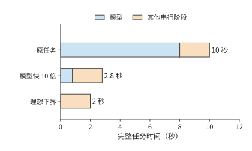

*图 12-34：固定任务轨迹中的加速上限。模型从 8 秒缩短至 0.8 秒，其他串行阶段保持 2 秒；第三行表示模型时间趋近于零的理想下界。*

要继续缩短剩余两秒，可以改变系统组织。把执行移到本地可减少网络往返，保留环境可减少创建等待；相应增加的本地设备与驻留空间，则进入新的成本预算。第 12.5.2 节的部署算例已经给出比较方法：先求满足质量与期限的方案，再比较每个完成任务的总成本。

同样的思路也出现在模型设计中：DeepSeek V4 到 V4.1 就是模型侧的同类调整。跨层共享减少全局 KV 的重复保存，使模型可以用更细的粒度保存历史信息；CED 减少输入阶段反复经过解码器的工作，缓存恢复则缩短多轮会话重新开始的路径。[^v41-case] 这些改变分别作用于容量、输入计算和恢复等待，可以沿同一任务逐项计入预算。

从片上存储到端边云，设计选择始终依赖对完整执行过程的了解。注意力的归约关系使中间矩阵可以按块处理，重复的模型结构使执行计划可以复用，前缀与分支关系使上下文可以共享，工具等待则为状态换出和环境准备提供了时间。每一项改进都利用模型或任务的信息，指导其他层次的设计，重新安排数据存放位置、计算划分和交接方式。

## 练习

练习按计算、改变条件和解释机制递进。12-2、12-3、12-7 为核心练习。未另说明的数值沿用正文教学条件。

**12-1　图片精修的传输与计算预算〔延伸，★〕。**

(a) 上行速率分别取 10、20、100 Mbit/s，计算三种方案的完成时间：保持原方案、将图像处理速度提高到原来的十倍，以及将输入大小减半。输入压缩所增加的编解码耗时仍为 0.15 秒。

(b) 求压缩节省的传输时间恰好等于新增编解码时间时的上行速率。再以原图大小和 20 Mbit/s 上行速率为条件：若原有的 0.3 秒处理时间中只有 0.2 秒可以加速，将这部分的执行速度提高到原来的十倍后，任务总耗时是多少？

(c) 把图像分为三个可独立处理的块，画出上传、处理与回传的重叠。标出限制任务耗时进一步缩短的步骤。

**12-2　截图压缩节省的传输时间能否抵消额外交互〔核心，★〕。**

(a) 将每轮截图从 0.8 MB 压缩到 0.2 MB，每轮新增 30 ms 编码时间。复算完成 30 轮截图任务总共能节省多少时间。

(b) 压缩后需要 38 轮时，任务是否更快？求压缩方案仍比原图 30 轮方案更快时，最多允许执行多少轮。

(c) 将每轮 RTT 增加 100 ms，分别计算原图 30 轮和压缩图 38 轮的总时间。解释为什么同一个 RTT 变化会产生不同的任务耗时增量。

(d) 为截图版本与操作编号设计记录字段，说明怎样识别压缩导致的纠错轮次与旧状态导致的无效轮次。

**12-3　视觉编码位置与状态迁移如何影响交互耗时〔核心，★〕。**

(a) 一张图片占 0.8 MB，编码后得到形状为 $[400,10240]$ 的 BF16 特征张量，上行带宽为 6.4 Mbit/s。视觉编码需要 1.31 TFLOPs 矩阵运算；本地在 RTX 4090 上编码，远端在 H100 SXM 上编码，均按 BF16 稠密峰值（165.2、989.4 TFLOP/s）求编码时间下界。比较本地编码后上传特征与上传原图后在远端编码的总耗时。

(b) 将链路改为一个 400 Gbit/s 的 ConnectX-7 端口（每方向 50 GB/s），以直接上传原图为基准，求上传视觉特征多花多少传输时间；与 (a) 中两张卡的编码时间之差比较，判断此时哪一项决定编码器的位置。

(c) 迁移需要以 80 Mbit/s 传输 64 MiB 状态，再用 1 秒恢复；迁移后每轮执行时间缩短 0.4 秒。分别求剩余 10、20、40 轮时净节省的时间。若恢复时间再增加 1 秒，至少还需执行多少轮，才能收回迁移耗时？

(d) 分别说明保存图片、视觉特征和语言 KV 后，从何处开始重算；说明已提交的操作结果怎样进入恢复过程。

**12-4　连接复用与多流传输〔延伸，★〕。**

(a) RTT 为 200 ms，任务共 30 轮，每次建链需额外两次往返。计算每轮新建连接与全程复用连接的时间差。

(b) 分别计算立即确认与聚合 ACK 两种方案中，图片、包头和 ACK 合计传输的字节数，解释为什么实际传输的字节更少，请求完成时间反而可能更长。

(c) 比较发送优先级与图 12-20 的逐流交付：分别指出资源使用时段和等待依赖发生了什么变化。

(d) 设计一组只改变连接复用方式、其他条件相同的对照实验，列出起止事件及用于解释时间变化的中间事件。

**12-5　ACK 频率与空口效率〔延伸，★〕。**

(a) 一次数据帧交换耗时 302 μs，一次确认帧交换耗时 134 μs。共发生 30,800 次数据帧交换，原先每次都单独确认。将 ACK 数量减半后，能释放多少空口时间？

(b) 画出发送方因等待聚合 ACK 而暂停发送的时间线，解释释放空口与提前交付之间的关系。

(c) PCM 播放所需速率为 256 kbit/s、实际接收速率为 130 kbit/s、初始缓冲 60 ms，求耗尽时刻。保持接收速率和 60 ms 初始音频时长不变，将采样率从 16 kHz 改为 24 kHz，求新的耗尽时刻。

**12-6　双路径的分流与备份〔延伸，★〕。**

(a) 30 MB 经 20 与 10 Mbit/s 两路分流，推导使两路同时完成的比例与时间。

(b) 加入 24 Mbit/s 共同出口，求新的传输时间下界，并指出提高哪一段链路的带宽能够降低这一下界。

(c) 两条接入路径的失败概率分别为 0.1、0.05，共同端点的失败概率为 0.02。按正文的独立故障假设，求向两路各发送一份完整副本后，任务仍然失败的概率；两条接入路径完全可靠后，该概率是多少？

(d) 将八块音频各复制一份，每块为 640 bytes，求新增的传输字节数，并说明接收方怎样避免重复播放。

**12-7　用单因素实验区分连接准备、窗口与传输延迟〔核心，★★〕。**

(a) 分别计算每次新建连接和调优后保持连接这两组实验中，直接路径与 Queqiao 路径耗时中位数的比值，说明“主要差距来自连接准备与发送等待”这一解释给出了什么预测。

(b) 设数据量约为 355 KB，传输速率为 333 Mbit/s，RTT 为 200 ms，处理耗时为 30 ms，求理想完成时间。与最初约一秒的实测耗时比较，估算还有多少等待时间需要解释。

(c) 设计窗口大小的单因素实验，说明如何交替运行不同窗口配置，以及应观察到怎样的在途数据量、ACK 与发送时序，才能支持“窗口限制了传输速度”的解释。

(d) 使用配套音频记录，画出一个块从生成到播放的各个时刻，说明如何区分生成不及时、传输延迟与本地调度等待。

**12-8　上行带宽与故障恢复如何改变跨地域部署的时间和能耗〔延伸，★★〕。**

(a) 复算剩余二十轮任务在三种部署方案下的时间与能耗，再求云端按期完成所需的上行带宽，并说明为什么上行再高，云端也追不上附近工作站。

(b) 改为剩余十轮、期限 23 秒，选择按时且能耗最低的方案；再把期限收紧到 15 秒，重新选择。

(c) 二十轮交互中，十轮的上行速率为 6 Mbit/s，另外十轮为 10 Mbit/s，求云端的总时间，与恒定 8 Mbit/s 比较并解释差额。

(d) 对十轮任务、期限 23 秒，设第八轮刚执行完就发生连接中断，恢复连接需要 2 秒。分别考虑两种恢复情况：已保留前七轮的进度，只需重做第八轮；前八轮的进度全部丢失，需要全部重做。计算两种情况下完成剩余工作所需的时间，以及整项任务的总耗时。

本小题仅假设远程服务发生断连，端侧方案仍正常执行。远程服务在断连期间保留运行状态，连接恢复后继续使用，因此不必重新准备；任务进度则按上述两种情况分别恢复。重做的轮次要再计一次模型能耗。重新选择满足期限且能耗最低的方案。

**12-9　端侧设备的带宽、容量与能耗预算〔延伸，★〕。**

(a) 四条 x16 LPDDR5X 通道、每引脚 10.6 Gbit/s，求合计带宽；再求 Qwen3-8B BF16 单请求 8K decode（每步读取权重 15.14 GB、KV 1.21 GB）的每步时间下界与 token/s 上限。

(b) 权重按 q4_0 量化（每 32 个值从 64 bytes 变为 18 bytes）后，重算每步下界与 token/s 上限；在 12 GB 内存、预留 4 GB 的手机上，求扣除权重后剩余的空间、可容纳的 8K 请求条数，以及单条请求上下文的最大 token 数。

(c) 每 token 能耗取 0.576–0.756 J、持续功率上限 13.8 W，求仅由功率约束给出的 token/s 上限范围；分别与 BF16 和 q4_0 的带宽上限比较，指出哪个约束先起作用。

**12-10　丢包、重传与编码冗余〔延伸，★★〕。**

(a) MSS 1,448 bytes、RTT 0.2 s，分别求丢包率 14% 与 3.6% 下的 Mathis 上界，以及 354,640 bytes 在两个上界下仅发送所需的时间。

(b) 245 个报文各以 14% 独立丢失，求期望丢失数。每轮用一个 RTT 做理想的选择性重传，重传的报文仍以概率 $p$ 再丢，于是每个报文需要的发送轮数服从成功率 $1-p$ 的几何分布，全部 245 个报文在 $n$ 轮内送达的概率为 $(1-p^n)^{245}$。串行预算为 238.5 ms，每多一轮加一个 RTT；求完成时间的期望值，再取轮数分布的第 99 百分位得到 p99。

(c) 99.9% 成功率下，两种丢包率各需多少修复包、冗余比例是多少？求加上冗余后的完成时间，并与对应的重传 p99 比较。

(d) 说明冗余比例为什么应随测得的丢包率调整，而不是固定取 25.7%：从达不到成功率目标与浪费发送带宽两个方向说明理由。

[^phone]: [Snapdragon 8 Elite 产品简介](../references/files/specs/qualcomm-8elite-brief.pdf)与[第五代简介](../references/files/specs/qualcomm-8elite-gen5-brief.pdf)：支持 LPDDR5X 最高 5,300 MHz、容量最大 24 GB，未给总线宽度。[Micron LPDDR5X 产品页](../references/files/specs/micron-lpddr5x-page.md)：最高速率档 10.7 Gbit/s，JEDEC 标准为 x16 单通道器件，1γ 工艺新增 6／12／24 GB 容量选项，另有面向旗舰手机的 16 GB 器件；[Samsung LPDDR5X 产品页](../references/files/specs/samsung-lpddr5x-page.md)同为最高 10.7 Gbit/s。[Apple iPhone 16 Pro 规格页](../references/files/specs/apple-iphone16-pro-specs.md)不公布内存容量与速率。

[^phone-ledger]: [端侧总线与能耗分账](../calculations/results/energy-ledger-book.md)：通道数按四条 x16 计（`declared_phone_channels_x16=4`；SoC 简介未给总线宽度），每引脚取 SoC 支持的 10.6 Gbit/s，合计 84.8 GB/s；15,136,819,200 bytes 权重与 1,207,959,552 bytes KV 直接读取[单请求 8K decode 结果](../calculations/results/qwen3-8b-decode-b1-s8192.json)。

[^melt]: [MELTing Point: Mobile Evaluation of Language Transformers](../references/files/papers/melting-point.pdf)，arXiv 2403.12844，§5.2.2 与附录表 5：每 token 0.16／0.20／0.21 mWh；iPhone 14 Pro 持续功率最高 13.8 W、瞬时超过 18 W，Galaxy S23 持续低于 8.5 W；iPhone 14 Pro 上 Zephyr-3B q4_k 为 14.8 token/s、Llama-2 7B q3_k 为 6.0 token/s；一次充电可运行 490.05–590.93 个提示（S23 为 542.78）。提取值逐行核对见[数值提取表](../research/gap-plan-2026-09-11/sources-extract.json)。

[^mathis]: [Mathis 等，The Macroscopic Behavior of the TCP Congestion Avoidance Algorithm](../references/files/papers/mathis-tcp-model.pdf)，ACM CCR 1997。式 (3)：$BW=(MSS/RTT)\cdot C/\sqrt{p}$；周期性丢包、每包确认时 $C=\sqrt{3/2}\approx1.22$，随机丢包时 1.31；式 (4) 给出更简的上界。

[^bbr]: [BBR Congestion Control，IETF 草案 draft-cardwell-iccrg-bbr-congestion-control-02](../references/files/standards/bbr-ietf-draft.txt)：BBR.max_bw 为近期带宽样本的窗口最大值，BBR.min_rtt 为窗口最小 RTT 样本，BBR.bdp 为两者之积；Startup 的 pacing 增益为 $4\ln2\approx2.77$、cwnd_gain 为 2，ProbeBW_UP 的 pacing 增益为 1.25。

[^wan-loss]: [14% 丢包](../calculations/results/wan-loss-model-book.md)与[3.6% 丢包](../calculations/results/wan-loss-model-p036.md)两档计算。路径参数取自[鹊桥路径记录](../references/author-context/queqiao-168ff4b/PATH-CHARACTER-DC-20260826.md)：往返 199–207 ms、容量膝点约 333 Mbit/s、Irvine 发往贵阳的下载方向丢包约 14%（另一时段 3.6%），贵阳发往 Irvine 的 41,663 个报文零丢包、MSS 1,448 bytes、固定文件 354,640 bytes；模型时间取固定文件复测一节的约 30 ms，与实测相符：调优后的中位数 236.5 ms 减去同期最短往返 197 ms 和发送 8.5 ms，模型时间不超过约 31 ms，记录前文的 38 ms 来自轮换八个文件的早期测试；FEC 符号大小取 MSS，块恢复成功率目标取 99.9%。重传模型每轮一次理想选择性重传，不计窗口收缩与超时重传，是有利于 TCP 的下界。

[^raw]: [RAW 图片精修案例与条件预算](../case-studies/raw-retouching.md)。算例设原图 30 MB、成片 5 MB、图像处理耗时 0.3 秒。

[^stream]: 分三块的两种计算分别为 12.8 s 与 12.36 s，正文以约 0.4 s 差额解释重叠收益；额外预览另增编码与传输。来源：[整图屏障](../calculations/results/image-stream-whole-image-without-preview.md)、[独立分块](../calculations/results/image-stream-independent-blocks-without-preview.md)及[额外预览](../calculations/results/image-stream-independent-blocks-with-preview.md)。

[^audio]: [音频块时序计算](../calculations/results/audio-timing-base.md)，输入帧与输出音频块一一对应是该模型的简化，用于说明逐块处理与按序播放的依赖。

[^author]: [笔者的材料与技术判断](../case-studies/author-context-and-design.md)。AOI 与 Latent Bridge 用于说明应观察哪些界面信息，以及设备之间应传递什么数据。

[^ec]: [固定视觉形状与完整 EC／KV 计算](../calculations/results/multimodal-cache-single.md)、[多模态阶段放置案例](../case-studies/multimodal-stage-placement.md)。固定视觉变体、DeepStack 及语言状态分别计量。

[^encode-place]: [编码位置与端边云三档的设备计算](../calculations/results/edge-tiers-agent-book.md)：视觉编码的矩阵工作量取自[单图视觉编码结果](../calculations/results/vision-encoding-single.md)，峰值取自硬件参数表；[ConnectX-7 数据手册](../references/files/specs/nvidia-connectx7-datasheet.pdf)：单端口速率至 400 Gbit/s。

[^ec-test]: [Qwen3-VL-8B CPU 编码与本机 TCP 传输实验](../experiments/ch12/12-03/README.md)。输入为 256×256 的合成测试图像，完整 EC 约 2 MiB，PNG 约 3.4 KiB；8 次传输前后的数据逐位一致。编码在传输计时开始前完成，所列时间对应特征传输阶段。

[^dense]: [Qwen3-8B TP=2、PP=4 的逐操作通信量计算](../calculations/results/dense-comm-qwen8-tp2-pp4-t1.md)。36 层各有两次输出归约，共产生 72 次通信启动；嵌入、阶段激活、logits 与 token 返回还会增加通信。

[^survey]: [FlexSP／llm.npu 论文与实现资料](../references/framework-history/2026-09-09/sequence-and-npu/NOTES.md)。

[^quic]: [RFC 9000：QUIC 传输](../references/files/standards/rfc9000.txt)，§2、§7、§9、§13；[RFC 9001：TLS](../references/outline-checks/2026-09-07/rfc9001.txt)；[RFC 9114：HTTP/3](../references/outline-checks/2026-09-07/edge-media/rfc9114.txt)；[RFC 9221：不可靠 Datagram](../references/outline-checks/2026-09-07/rfc9221.txt)。HTTP/3 规定了如何在 QUIC 上传输 HTTP 请求和响应。

[^closed]: 精确分包为上传 25,685 包、下载 4,281 包；共 29,966 个数据包和同数 ACK，网络实际传输 39,554,832 bytes，完整响应 14.36339008 s。来源：[完整图片参考闭环](../calculations/results/closed-loop-book-30mb-5mb.md)。

[^ack]: 同一填充条件下，立即 ACK 为 39,555,120 bytes／14.52103724 s，聚合 ACK 为 38,177,328 bytes／14.564459796 s，差约 1.38 MB 和 43.4 ms。来源：[立即 ACK 的 NewReno 对照](../calculations/results/controller-loop-book-newreno.md)、[聚合 ACK 对照](../calculations/results/ack-policy-book-newreno.md)及[CUBIC 控制阶段记录](../calculations/results/controller-loop-book-cubic_hystart.md)。

[^media]: [FIFO](../calculations/results/shared-media-schedule-fifo.md)与[音频优先](../calculations/results/shared-media-schedule-priority.md)；固定发送记录的[整体有序](../calculations/results/shared-media-hol-connection.md)与[逐流交付](../calculations/results/shared-media-hol-per_stream.md)。分别考察发送调度和接收方交付依赖的影响。

[^http]: [本地 TCP／HTTP3 传输](../experiments/ch12/12-04/loopback/README.md)与[HTTP3 单连接多流](../experiments/ch12/12-04/h3-multistream/README.md)。

[^air]: [共享空口图片计算](../calculations/results/shared-airtime-image-baseline.md)。数据与 MAC ACK 分别采用 OFDM 54／6 Mbit/s，不使用帧聚合；接入等待取 SIFS 16 μs 加两个 9 μs 时隙，即 802.11a OFDM 的 DIFS 34 μs，不计随机退避；MAC 层与端到端确认分别计量。

[^wireless-survey]: [计算机网络的新黄金时代（三）](../references/files/documents/network-golden-3.md)，介绍 TACK、Link Turbo 与代理部署的历史背景。

[^mixed]: [媒体优先与聚合 ACK 的混合反馈计算](../calculations/results/media-feedback-mixed-priority-aggregate.md)及同目录 FIFO／立即 ACK 对照。模型处理时间和预定播放时刻由算例设定。

[^dual]: [双进程双 TCP 连接实验](../experiments/ch12/12-06/README.md)：实验通过双进程、双 TCP 连接模拟两条传输路径，30 次正式尝试包含共同端点失败的情况。

[^queqiao-readme]: 系统定位与跨数据中心动机见 [Queqiao README 固定归档](../references/author-context/queqiao-496ca627/README.md)，对应 [GitHub 提交 `496ca627`](https://github.com/bojieli/queqiao/blob/496ca6278e359c02b5107dfab77c6a3db585f80d/README.md)，读取于 2026-09-10。系统介绍依据此版本，性能对照数据来自提交 `168ff4b`。

[^queqiao]: [固定归档的路径记录](../references/author-context/queqiao-168ff4b/PATH-CHARACTER-DC-20260826.md)与[设计记录](../references/author-context/queqiao-168ff4b/DESIGN-DC-PROFILE.md)，来自提交 `168ff4b`。文件、调优设置和计时起止点均采用原记录中的定义。

[^queqiao-calc]: 新建连接的直接／Queqiao p50 为 1185.3／301.6 ms，调优保持连接为 240.9／236.5 ms；两个中位数之比分别约 3.93／1.019。逐轮计算耗时比再取中位数，结果分别为 3.96／1.03。来源：[Queqiao 同条件统计](../calculations/results/queqiao-records-conditions.md)。

[^physical]: 8 次完整接收测试中，收到的 PCM 与播放回调读取的 PCM 均逐位一致，播放回调累计有 360–1440 ms 无法取得足够音频样本；实验使用静音输出设备，记录包含接收与播放回调事件。另有 3 次请求在首个播放回调之前取消，接收字节、连接关闭事件和远端 EOF 记录了取消过程。完整四轮数据见[配套证据说明](ch12/evidence-notes.md)。来源：[显式物理接口绑定的音频实验](../experiments/ch12/12-07/audio-physical/README.md)，固定提交 `496ca627`，基线含 socket 绑定适配。

[^region]: [计算机网络的新黄金时代（二）](../references/files/documents/network-golden-2.md)的云际网络与 Regionless 讨论。本章的地域方案用设备能耗和 GPU 时间衡量成本。

[^region-trace]: 同一模型、token 序列与轮次的重放，传入服务端的数据量分别为 66,207／10,193 bytes，返回客户端的数据量均为 2,527 bytes。矩阵工作量分别为 296,505,803,538,432 与 60,380,764,176,384 FLOPs，除以 H100 SXM 的 BF16 稠密峰值得到 GPU 时间下界；状态 465,371,136 bytes，按其占 80 GB 显存的比例折算驻留时间，约 41.0 s 后抵消省下的 0.239 GPU 秒。来源：[固定 Agent 轨迹的地域放置](../calculations/results/region-placement-agent-session.md)，字节与 token 来自原轨迹。

[^edge-tiers]: [端边云三档的设备计算](../calculations/results/edge-tiers-agent-book.md)。每步读取量取[单请求 8K decode 结果](../calculations/results/qwen3-8b-decode-b1-s8192.md)的权重与 KV，权重按 q4_0 每 32 个值 18 bytes 重排；手机总线取[端侧总线与能耗分账](../calculations/results/energy-ledger-book.md)；带宽、BF16 稠密峰值与额定功率取自[硬件参数表](../calculations/results/hardware.md)；实测倍数取自[实验 8-1 的效率表](../experiments/ch08/08-01/efficiency.json)中 batch 1、8K 一行。结果文件同时列出十轮、收紧期限与断连恢复的全部情形。

[^core-calculation]: 本章条件比较的[逐项复算](../calculations/results/core-principles.json)与[计算程序](../calculations/core_principles.py)。

[^v41-case]: [DeepSeek V4.1 官方技术报告](../calculations/sources/deepseek-v4.1-flash/DeepSeek_V41_Tech_Report.pdf)，第 1、2、3 节与第 6 节；[跨章会话的固定条件与复算](../calculations/results/v41-throughline.json)。

## 本章小结

完整交互应从三个层次分析。先根据数据量、计算量和传播距离求出各步骤所需时间，再根据执行依赖确定哪些耗时需要相加、哪些步骤可以重叠，最后加入连接、窗口、竞争和恢复来解释实际等待。图片的 12.8 秒完成时间、语音的逐块递推和 Agent 的逐轮累积，分别展示了这三个层次如何配合。端侧本身也用同一套方法展开：内存带宽给出每秒 token 的上限，容量决定能容纳的模型与上下文，能耗与电池决定能持续多久。

模型分工改变了跨设备传输的数据形式和次数。把计算移到端侧，可能把紧凑图片换成更大的特征；把模型拆到多个设备，可能把一次传输换成逐层同步。比较时先扣除两种方案中相同的耗时，再比较节省的计算时间与增加的通信时间，便能找到收益来自哪里。

复用把一次准备的开销分摊到后续调用。迁移、连接预热、图编译与状态保存，都可以根据准备成本和每次节省的时间，求出至少需要使用多少次才划算。预期节省的时间或成本，还要留出一部分来应对波动和恢复带来的开销。

设计实验时，也可以沿用同一套时间模型。固定输入和计时的起止点，记录各阶段的等待，再逐项改变设置，检查总时间的变化能否由具体阶段的变化解释。Queqiao 的基线修正展示了这一过程：调优消除大部分额外等待后，进一步改善性能就需要缩短传播时间。丢包也不一定意味着拥塞：在随机丢包的路径上，用丢包反推带宽会低估可用速率约三个数量级；直接测量带宽，再按测得的丢包率安排编码冗余，才能把完成时间压回串行预算附近。

最终选择先满足质量和期限，再比较成本。即使平均计算速度和传输速率足够，任务仍可能因慢速轮次或丢失进度超期；按时完成的概率与恢复后的重做量，因而是部署模型的组成部分。

回到第 1 章提出的模型应用：开发者通过上下文表达任务，执行系统据此安排计算、保存状态并传输数据。现在，保留一段历史、增加一个候选分支、提前准备工具环境或迁移一次会话，都有了可以追踪的资源代价。理解这些代价，也就能够识别哪些通用执行开销可以利用应用信息消除，并根据任务质量、完成时间和总成本选择实现方式。这是学习 AI Infra 带来的系统设计能力。
